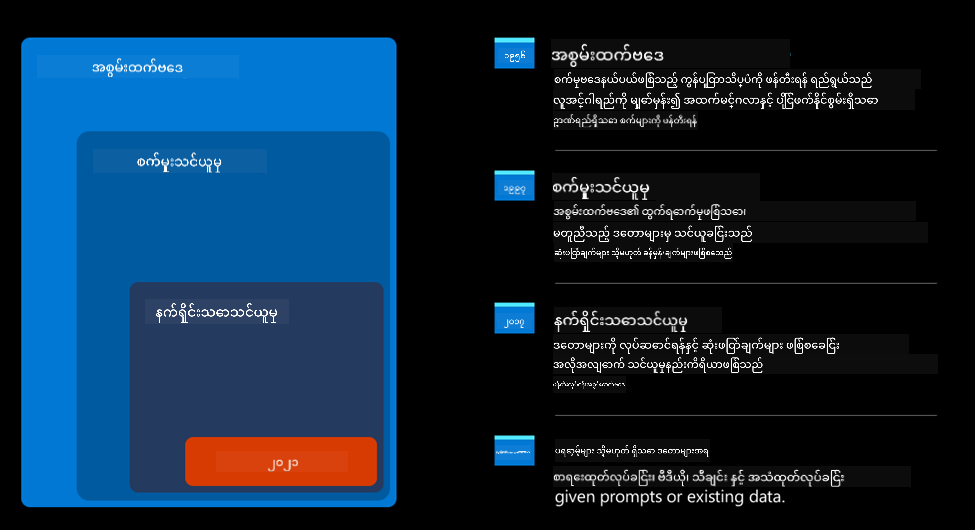
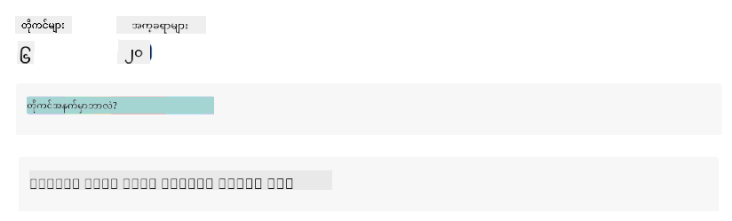

<!--
CO_OP_TRANSLATOR_METADATA:
{
  "original_hash": "f53ba0fa49164f9323043f1c6b11f2b1",
  "translation_date": "2025-07-09T08:05:38+00:00",
  "source_file": "01-introduction-to-genai/README.md",
  "language_code": "my"
}
-->
# Generative AI နှင့် ကြီးမားသော ဘာသာစကား မော်ဒယ်များအတွက် နိဒါန်း

_(ဤသင်ခန်းစာ၏ ဗီဒီယိုကို ကြည့်ရန် အပေါ်တွင်ရှိသည့် ပုံကို နှိပ်ပါ)_

Generative AI သည် စာသား၊ ပုံများနှင့် အခြားအမျိုးအစား များသော အကြောင်းအရာများကို ဖန်တီးနိုင်သော အတုအယောင် ဉာဏ်ရည်ဖြစ်သည်။ ၎င်း၏ ထူးခြားချက်မှာ AI ကို လူတိုင်း အသုံးပြုနိုင်စေခြင်းဖြစ်ပြီး၊ သဘာဝဘာသာစကားဖြင့် ရေးသားထားသော စာကြောင်းတစ်ကြောင်းကဲ့သို့သော စာသားတစ်ခုသာ ရှိလျှင်လည်း အသုံးပြုနိုင်သည်။ Java သို့မဟုတ် SQL ကဲ့သို့သော ဘာသာစကားများကို သင်ယူရန် မလိုအပ်ပဲ၊ သင်၏ဘာသာစကားဖြင့် သင်လိုချင်သည့်အရာကို ဖော်ပြလိုက်ပါက AI မော်ဒယ်မှ အကြံပြုချက်တစ်ခု ထွက်ပေါ်လာမည်ဖြစ်သည်။ ၎င်း၏ အသုံးချမှုများနှင့် သက်ရောက်မှုများမှာ အလွန်ကြီးမားပြီး၊ သင်သည် အစီရင်ခံစာများရေးသားခြင်း၊ နားလည်ခြင်း၊ အပလီကေးရှင်းများရေးသားခြင်းနှင့် အခြားအရာများကို စက္ကန့်အနည်းငယ်အတွင်း ပြုလုပ်နိုင်သည်။

ဤ သင်ရိုးညွှန်းတမ်းတွင် ကျွန်ုပ်တို့၏ စတားတပ်သည် Generative AI ကို ဘယ်လို အသုံးချကာ ပညာရေးကဏ္ဍတွင် အသစ်သော အခြေအနေများ ဖွင့်လှစ်သွားသည်ကို လေ့လာမည်ဖြစ်ပြီး၊ ၎င်း၏ အသုံးချမှုနှင့် နည်းပညာကန့်သတ်ချက်များကြောင့် ဖြစ်ပေါ်လာနိုင်သည့် လူမှုဆိုင်ရာ စိန်ခေါ်မှုများကို မည်သို့ ဖြေရှင်းသွားမည်ကိုလည်း ဆွေးနွေးသွားမည်ဖြစ်သည်။

## နိဒါန်း

ဤသင်ခန်းစာတွင် ပါဝင်မည့်အကြောင်းအရာများမှာ -

- စီးပွားရေးအခြေအနေ နိဒါန်း - ကျွန်ုပ်တို့၏ စတားတပ် အကြံပြုချက်နှင့် မစ်ရှင်။
- Generative AI နှင့် လက်ရှိ နည်းပညာ ပတ်ဝန်းကျင်သို့ ရောက်ရှိလာပုံ။
- ကြီးမားသော ဘာသာစကား မော်ဒယ်၏ အတွင်းရေးရာ။
- ကြီးမားသော ဘာသာစကား မော်ဒယ်များ၏ အဓိက စွမ်းဆောင်ရည်များနှင့် လက်တွေ့ အသုံးချမှုများ။

## သင်ယူရမည့် ရည်မှန်းချက်များ

ဤသင်ခန်းစာပြီးဆုံးပြီးနောက် သင်သည် နားလည်နိုင်မည့်အချက်များမှာ -

- Generative AI ဆိုသည်မှာ ဘာလဲ၊ ကြီးမားသော ဘာသာစကား မော်ဒယ်များ မည်သို့ လည်ပတ်ကြသည်။
- ပညာရေးဆိုင်ရာ အခြေအနေများအတွက် ကြီးမားသော ဘာသာစကား မော်ဒယ်များကို မည်သို့ အသုံးချနိုင်သည်။

## အခြေအနေ - ကျွန်ုပ်တို့၏ ပညာရေး စတားတပ်

Generative Artificial Intelligence (AI) သည် AI နည်းပညာ၏ ထိပ်တန်းဖြစ်ပြီး ယခင်က မဖြစ်နိုင်ဟု ထင်ရသော အရာများကို ရှေ့ဆက်တိုးတက်စေသည်။ Generative AI မော်ဒယ်များတွင် စွမ်းဆောင်ရည်များနှင့် အသုံးချမှုများစွာ ရှိသော်လည်း၊ ဤ သင်ရိုးညွှန်းတမ်းအတွက် ကျွန်ုပ်တို့သည် ပညာရေးကဏ္ဍတွင် ပြောင်းလဲမှုများ ဖြစ်ပေါ်စေသည့် စတားတပ်တစ်ခုအား အခြေခံ၍ လေ့လာသွားမည်ဖြစ်သည်။ ဤစတားတပ်ကို _ကျွန်ုပ်တို့၏ စတားတပ်_ ဟု ခေါ်ဆိုမည်ဖြစ်သည်။ ကျွန်ုပ်တို့၏ စတားတပ်သည် ပညာရေးကဏ္ဍတွင် လုပ်ဆောင်ကာ အောက်ပါ မစ်ရှင်ကြီးကို ရည်မှန်းထားသည် -

> _ကမ္ဘာလုံးဆိုင်ရာ ပညာသင်ယူမှု လွယ်ကူစေရန်၊ ပညာရေးအတွက် တန်းတူ ဝင်ရောက်ခွင့် ရရှိစေရန်နှင့် သင်ယူသူ တစ်ဦးချင်းစီ၏ လိုအပ်ချက်များအရ ကိုယ်ပိုင် သင်ယူမှု အတွေ့အကြုံများ ပေးဆောင်ရန်_။

ကျွန်ုပ်တို့၏ စတားတပ်အဖွဲ့သည် ယနေ့ခေတ်၏ အင်အားကြီးသော ကိရိယာတစ်ခုဖြစ်သော ကြီးမားသော ဘာသာစကား မော်ဒယ်များ (LLMs) ကို အသုံးပြုခြင်းမရှိမဖြစ် လိုအပ်ကြောင်း သိရှိထားသည်။

Generative AI သည် ယနေ့ ကျောင်းသားများအတွက် ၂၄ နာရီ မိနစ်တိုင်း အကြောင်းအရာများနှင့် ဥပမာများ များပြားစွာ ပေးနိုင်သည့် မျက်နှာဖုံးဆရာများကို ရရှိစေကာ၊ ဆရာများအနေဖြင့် ကျောင်းသားများကို အကဲဖြတ်ခြင်းနှင့် တုံ့ပြန်ချက်ပေးခြင်းတို့အတွက် နည်းပညာအသစ်များကို အသုံးချနိုင်စေမည်ဟု မျှော်လင့်ရသည်။

အစပြုရန်အတွက် ကျွန်ုပ်တို့ သင်ရိုးညွှန်းတမ်းတစ်လျှောက် အသုံးပြုမည့် အခြေခံ အယူအဆများနှင့် အသုံးအနှုန်းများကို သတ်မှတ်ကြမည်။

## Generative AI ကို မည်သို့ ရရှိခဲ့သနည်း?

Generative AI မော်ဒယ်များ ကြေညာချက်ကြောင့် မကြာသေးမီက ဖြစ်ပေါ်လာသော အလွန်ထူးခြားသော _လူသိများမှု_ အားဖြင့် သတိထားမိကြသော်လည်း၊ ဤနည်းပညာသည် ၆၀ ပြည့်နှစ်များမှ စတင်၍ ရှေးအတိတ်ကာလများစွာ ကြာမြင့်စွာ ဖွံ့ဖြိုးလာခဲ့သည်။ ယနေ့တွင် AI သည် လူ့ ဉာဏ်ရည်ဆိုင်ရာ စွမ်းရည်များကို ရရှိထားပြီး၊ ဥပမာအားဖြင့် [OpenAI ChatGPT](https://openai.com/chatgpt) သို့မဟုတ် [Bing Chat](https://www.microsoft.com/edge/features/bing-chat?WT.mc_id=academic-105485-koreyst) ကဲ့သို့သော စကားပြောဆိုနိုင်မှုများကို ပံ့ပိုးပေးသည်။ Bing Chat သည် GPT မော်ဒယ်ကို ဝက်ဘ်ရှာဖွေရေးနှင့် စကားပြောဆိုမှုများအတွက် အသုံးပြုသည်။

နောက်ပြန်သွားကြည့်ပါက၊ AI ၏ ပထမဆုံး မော်ဒယ်များမှာ စာရိုက်ထားသော chatbot များဖြစ်ပြီး၊ ကျွမ်းကျင်သူများမှ သိရှိထားသော အချက်အလက်များကို ကွန်ပျူတာတွင် ထည့်သွင်းထားပြီး၊ စာသားထဲမှ စကားလုံးများအား အခြေခံ၍ ဖြေကြားချက်များ ထုတ်ပေးသည်။ သို့သော် ဤနည်းလမ်းသည် အလွန်အကျယ် အသုံးပြုရန် မသင့်တော်ကြောင်း သိရှိလာသည်။

### AI အတွက် စာရင်းအင်းဆိုင်ရာ နည်းလမ်း - Machine Learning

၉၀ ပြည့်နှစ်များတွင် စာသားခွဲခြမ်းစိတ်ဖြာမှုအတွက် စာရင်းအင်းဆိုင်ရာ နည်းလမ်းအသစ်များကို အသုံးပြုခြင်းဖြင့် ပြောင်းလဲမှုတစ်ခု ဖြစ်ပေါ်လာသည်။ ၎င်းသည် machine learning ဟုခေါ်သော အယ်လဂိုရစ်သမ်အသစ်များ ဖန်တီးရာသို့ ဦးတည်ခဲ့ပြီး၊ အချက်အလက်များမှ ပုံစံများကို သင်ယူနိုင်သော နည်းလမ်းဖြစ်သည်။ ဤနည်းလမ်းသည် စက်များအား လူ့ဘာသာစကား နားလည်မှုကို အတုယူနိုင်စေသည်။ စာသားနှင့် အမှတ်အသားများကို တွဲဖက်သင်ကြားခြင်းဖြင့် မသိသော စာသားကို သတ်မှတ်ချက်တစ်ခုဖြင့် ခွဲခြားနိုင်သည်။

### Neural networks နှင့် ခေတ်မီ မျက်နှာဖုံးအကူအညီပေးသူများ

နောက်ဆုံးနှစ်များတွင် ဒေတာအရေအတွက်ကြီးမားခြင်းနှင့် ရှုပ်ထွေးသော တွက်ချက်မှုများကို ကိုင်တွယ်နိုင်သော ဟာ့ဒ်ဝဲတိုးတက်မှုကြောင့် AI သုတေသနများ တိုးတက်လာပြီး neural networks သို့မဟုတ် deep learning အယ်လဂိုရစ်သမ်များ ဖန်တီးခဲ့သည်။

Neural networks (အထူးသဖြင့် Recurrent Neural Networks – RNNs) သည် သဘာဝဘာသာစကား ကို ပိုမိုနက်နဲစွာ နားလည်နိုင်စေပြီး စာကြောင်းအတွင်း စကားလုံးတစ်လုံး၏ အဓိပ္ပါယ်ကို ပိုမိုတိကျစွာ ဖော်ပြနိုင်သည်။

ဤနည်းပညာသည် အသစ်သော ရာစုနှစ်၏ ပထမဆုံး ဒသမတစ်ခုတွင် မွေးဖွားလာသော မျက်နှာဖုံးအကူအညီပေးသူများအား အားဖြည့်ပေးခဲ့ပြီး၊ လူ့ဘာသာစကားကို အလွန်ကျွမ်းကျင်စွာ ဖတ်ရှု နားလည်ကာ လိုအပ်ချက်ကို ရှာဖွေပြီး တုံ့ပြန်ချက်များ ပေးနိုင်သည်။ ဥပမာ - ကြိုတင်ရေးသားထားသော စာသားဖြင့် ဖြေကြားခြင်း သို့မဟုတ် တတိယပါတီ ဝန်ဆောင်မှုကို အသုံးပြုခြင်း။

### ယနေ့ခေတ် Generative AI

ဒါကြောင့် ယနေ့ Generative AI သို့ ရောက်ရှိလာပြီး၊ ၎င်းကို deep learning ၏ အပိုင်းအစတစ်ခုအဖြစ် တွေ့မြင်နိုင်သည်။

AI လေ့လာမှုများကို နှစ်ပေါင်းများစွာ ဆက်လက်လုပ်ဆောင်ပြီးနောက် _Transformer_ ဟုခေါ်သော မော်ဒယ်ဖွဲ့စည်းပုံအသစ်တစ်ခုသည် RNN များ၏ ကန့်သတ်ချက်များကို ကျော်လွန်ခဲ့သည်။ Transformer မော်ဒယ်များသည် attention mechanism ကို အခြေခံပြီး၊ စာသားအတွင်း အရေးကြီးဆုံး အချက်အလက်များကို အလေးပေးနိုင်သည်။

လတ်တလော Generative AI မော်ဒယ်များအများစုသည် Large Language Models (LLMs) ဟုလည်း ခေါ်ပြီး၊ စာသားအထောက်အထားများနှင့် ထွက်ရှိမှုများကို အခြေခံသည်။ ဤမော်ဒယ်များသည် စာအုပ်များ၊ ဆောင်းပါးများ၊ ဝက်ဘ်ဆိုက်များကဲ့သို့ မတိကျသော အချက်အလက်များစွာဖြင့် သင်ကြားထားပြီး၊ အမျိုးမျိုးသော လုပ်ငန်းများအတွက် ကိုက်ညီစွာ ပြင်ဆင်အသုံးပြုနိုင်သည်။ ၎င်းတို့သည် စာသားကို နားလည်နိုင်စွမ်းကို တိုးတက်စေသည့်အပြင် လူ့ဘာသာစကားဖြင့် မူရင်းဖြေကြားချက်များ ဖန်တီးနိုင်စေသည်။

## ကြီးမားသော ဘာသာစကား မော်ဒယ်များ မည်သို့ လည်ပတ်သနည်း?

နောက်တစ်ခန်းတွင် Generative AI မော်ဒယ်အမျိုးအစားများကို လေ့လာမည်ဖြစ်သော်လည်း ယခုအချိန်တွင် OpenAI GPT (Generative Pre-trained Transformer) မော်ဒယ်များကို အထူးအာရုံစိုက်၍ ကြီးမားသော ဘာသာစကား မော်ဒယ်များ မည်သို့ လည်ပတ်ကြသည်ကို ကြည့်ကြမည်။

- **Tokenizer, စာသားမှ နံပါတ်သို့**: ကြီးမားသော ဘာသာစကား မော်ဒယ်များသည် စာသားကို အထောက်အထားအဖြစ် လက်ခံပြီး ထွက်ရှိမှုအဖြစ် စာသားထုတ်ပေးသည်။ သို့သော် စာရင်းအင်းဆိုင်ရာ မော်ဒယ်များဖြစ်သောကြောင့် စာသားထက် နံပါတ်များဖြင့် ပိုမိုကောင်းမွန်စွာ လုပ်ဆောင်နိုင်သည်။ ထို့ကြောင့် မော်ဒယ်သို့ ဝင်ရောက်မည့် စာသားအား tokenization လုပ်ပြီး token များအဖြစ် ခွဲထုတ်သည်။ token တစ်ခုသည် စာလုံးအရေအတွက် မတူညီသော စာသားအပိုင်းတစ်ခုဖြစ်ပြီး၊ token တစ်ခုစီကို token index (မူလစာသား၏ အနံပါတ်ကုဒ်) ဖြင့် သတ်မှတ်သည်။

- **ထွက်ရှိမည့် token များ ခန့်မှန်းခြင်း**: n token များကို input အဖြစ် လက်ခံပြီး (n ၏ အများဆုံး တန်ဖိုးသည် မော်ဒယ်အလိုက် မတူကွဲပြားသည်) မော်ဒယ်သည် ထွက်ရှိမည့် token တစ်ခုကို ခန့်မှန်းနိုင်သည်။ ထို token ကို နောက်ထပ် iteration တွင် input အဖြစ် ထည့်သွင်းပြီး စာကြောင်းတစ်ကြောင်း (သို့) စာကြောင်းများ အဖြစ် ထွက်ရှိစေသည်။ ChatGPT ဖြင့် ကစားကြည့်သူများသည် တခါတရံ စာကြောင်းအလယ်တွင် ရပ်တန့်သွားသည့် အခြေအနေတွေ့ရှိနိုင်သည်။

- **ရွေးချယ်မှု လုပ်ငန်းစဉ်၊ ဖြစ်နိုင်ချေ ဖြန့်ဝေမှု**: ထွက်ရှိမည့် token ကို မော်ဒယ်သည် လက်ရှိ စာသားစဉ်အပြီးတွင် ဖြစ်နိုင်ချေ အပေါ် မူတည်၍ ရွေးချယ်သည်။ မော်ဒယ်သည် ‘နောက်တစ် token’ များအားလုံးအတွက် ဖြစ်နိုင်ချေ ဖြန့်ဝေမှုကို ခန့်မှန်းသည်။ သို့သော် အမြင့်ဆုံး ဖြစ်နိုင်ချေရှိသော token ကိုသာ မရွေးချယ်နိုင်ပါ။ ရွေးချယ်မှုတွင် အနည်းငယ် ရောနှောမှု (randomness) ပါဝင်ပြီး မော်ဒယ်သည် non-deterministic ဖြစ်စေသည်။ ၎င်းသည် ဖန်တီးမှုစဉ်ဆက်ကို အတုယူရန်ဖြစ်ပြီး temperature ဟုခေါ်သော မော်ဒယ် parameter ဖြင့် ထိန်းညှိနိုင်သည်။

## ကျွန်ုပ်တို့၏ စတားတပ်သည် ကြီးမားသော ဘာသာစကား မော်ဒယ်များကို မည်သို့ အသုံးချနိုင်သနည်း?

ကြီးမားသော ဘာသာစကား မော်ဒယ်၏ အတွင်းရေးရာကို နားလည်ပြီးနောက် ကျွန်ုပ်တို့၏ စီးပွားရေးအခြေအနေကို အခြေခံ၍ မော်ဒယ်များ၏ အဓိက လုပ်ဆောင်နိုင်သော လုပ်ငန်းများကို ကြည့်ကြမည်။

ကြီးမားသော ဘာသာစကား မော်ဒယ်၏ အဓိက စွမ်းဆောင်ရည်မှာ _သဘာဝဘာသာစကားဖြင့် ရေးသားထားသော စာသား input မှ စတင်၍ စာသားအသစ်ကို ဖန်တီးပေးနိုင်ခြင်း_ ဖြစ်သည်။

ဒါပေမယ့် ဘယ်လို စာသား input နှင့် output များလဲ?

ကြီးမားသော ဘာသာစကား မော်ဒယ်၏ input ကို prompt ဟုခေါ်ပြီး output ကို completion ဟုခေါ်သည်။ completion သည် မော်ဒယ်၏ လက်ရှိ input ကို ပြည့်စုံစေရန် နောက်တစ် token ကို ဖန်တီးပေးခြင်း ဖြစ်သည်။ prompt ဆိုသည်မှာ မော်ဒယ်မှ အကောင်းဆုံး ထွက်ရှိမှုရရှိရန် ဒီဇိုင်းဆွဲသည့် နည်းလမ်းဖြစ်သည်။ ယခုအ
Lesson 2 သို့ သွားပါ၊ အဲဒီမှာ ကျွန်တော်တို့က [LLM မျိုးစုံကို စူးစမ်းလေ့လာပြီး နှိုင်းယှဉ်နည်း](../02-exploring-and-comparing-different-llms/README.md?WT.mc_id=academic-105485-koreyst) ကို ကြည့်ရှုမှာ ဖြစ်ပါတယ်!

**အကြောင်းကြားချက်**  
ဤစာတမ်းကို AI ဘာသာပြန်ဝန်ဆောင်မှု [Co-op Translator](https://github.com/Azure/co-op-translator) ဖြင့် ဘာသာပြန်ထားပါသည်။ ကျွန်ုပ်တို့သည် တိကျမှန်ကန်မှုအတွက် ကြိုးစားသော်လည်း အလိုအလျောက် ဘာသာပြန်ခြင်းတွင် အမှားများ သို့မဟုတ် မှားယွင်းချက်များ ပါဝင်နိုင်ကြောင်း သတိပြုပါရန် မေတ္တာရပ်ခံအပ်ပါသည်။ မူရင်းစာတမ်းကို မူလဘာသာဖြင့်သာ တရားဝင်အရင်းအမြစ်အဖြစ် ယူဆသင့်ပါသည်။ အရေးကြီးသော အချက်အလက်များအတွက် လူ့ဘာသာပြန်ပညာရှင်မှ ဘာသာပြန်ခြင်းကို အကြံပြုပါသည်။ ဤဘာသာပြန်ချက်ကို အသုံးပြုရာမှ ဖြစ်ပေါ်လာနိုင်သည့် နားလည်မှုမှားယွင်းမှုများအတွက် ကျွန်ုပ်တို့ တာဝန်မယူပါ။