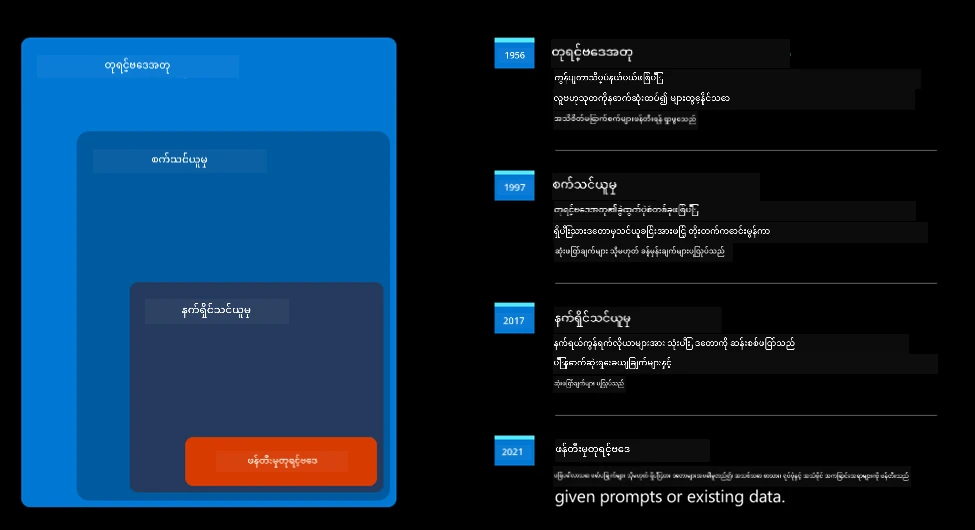
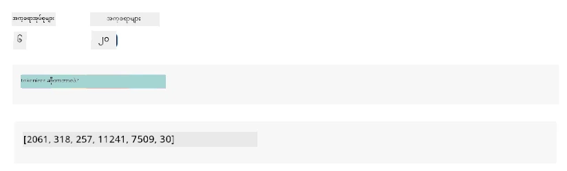
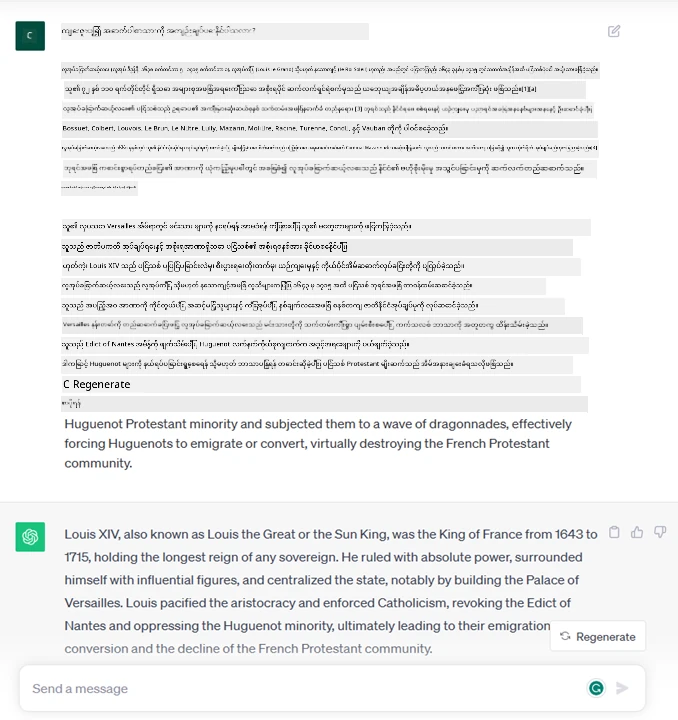
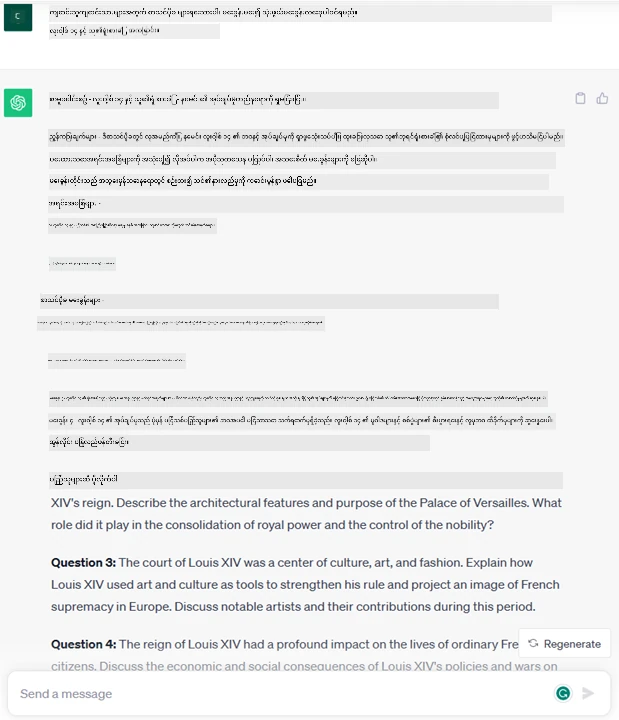
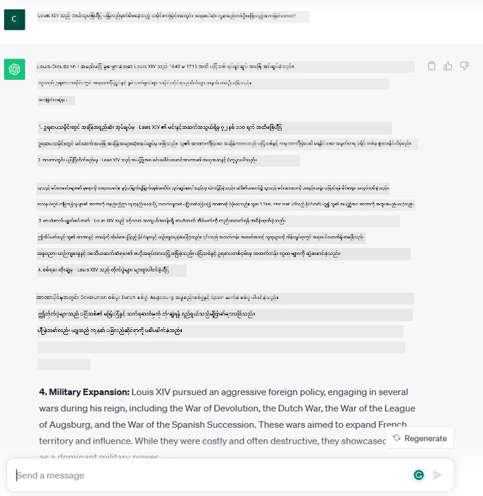
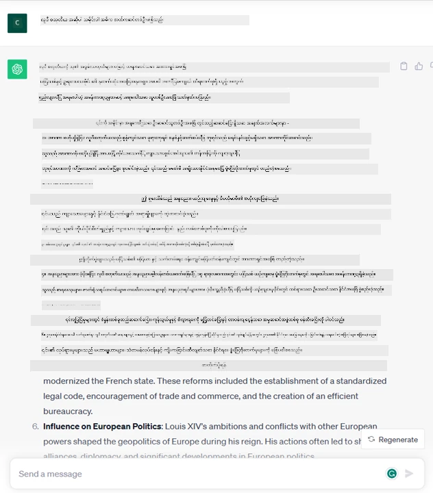
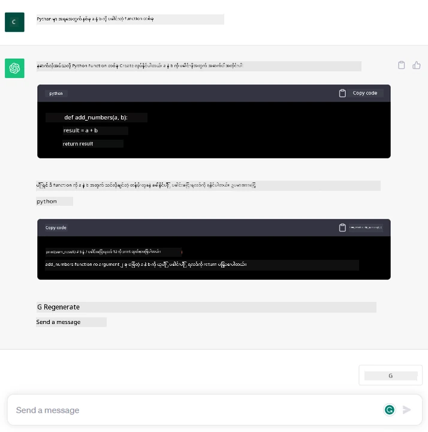

# Generative AI နှင့် ကြီးမားသောဘာသာစကားမော်ဒယ်များ၏ အခြေခံသဘောတရား

_(ဤသင်ခန်းစာ၏ ဗီဒီယိုကို ကြည့်ရန် ပုံကို နိပ်ပါ)_

Generative AI သည် စကားလုံး၊ ပုံရိပ်နှင့် အခြားအကြောင်းအရာများကို ဖန်တီးနိုင်သည့် စက်ရုပ်ဘေလ်အင်တီလီဂျင်စ်ဖြစ်သည်။ ဤနည်းပညာသည် လူတိုင်း အသုံးပြုနိုင်သော AI ဖြစ်စေခြင်းကြောင့် အံ့အားသင့်ဖွယ်ဖြစ်သည်။ သင်သည် Java သို့မဟုတ် SQL စည်းမျဉ်းစနစ်များကို မသိသော်လည်း သဘာဝဘာသာစကားဖြင့် စာသားတစ်ကြောင်းရေး၍ AI မော်ဒယ်မှ အကြံပြုချက်ရယူနိုင်သည်။ အဓိကကိစ္စများမှာ စာရင်းများရေးခြင်း၊ အာဏာပြုလျက်တင်သွင်းမှုများ ပြုလုပ်ခြင်း စသည်ဖြင့် စက္ကန့်အချိန်အတွင်း ဆောင်ရွက်နိုင်သည်။

ဤ သင်ခန်းစာဆိုင်ရာ လေ့လာရေးတွင် ကျွန်တော်တို့စဖွဲ့ထားသော ဦးတည်ချက် အနေနဲ့ generative AI ကို ဘာသာရေးကဏ္ဍမှာ အသုံးပြုပုံနှင့် ၎င်း၏ အသုံးချမှုနဲ့ပတ်သက်တဲ့ လူမှုအကျိုးသက်ရောက်မှုနှင့် နည်းပညာကန့်သတ်ချက်များကို မျက်မှောက်ရောက်နေတဲ့ ပြဿနာများကို မည်သို့ ရင်ဆိုင်ကြမယ်ဆိုတာကို ရှင်းပြပါမယ်။

## မိတ်ဆက်

ဒီသင်ခန်းစာတွင် ဖော်ပြမည့်အကြောင်းအရာများမှာ-

- စီးပွားရေးအခြေအနေရှင်းလင်းချက် - ကျွန်တော်တို့ စတတ်အပ်စတား၏ အကြံပြုချက်နှင့် မစ်ရှင်။
- Generative AI နှင့် နောက်ဆုံး နည်းပညာလမ်းကြောင်းအပေါ် မည်သို့ ရောက်ရှိခဲ့ကြသည်။
- ကြီးမားသောဘာသာစကားမော်ဒယ်၏ အတွင်းရေးပုံစံ။
- ကြီးမားသောဘာသာစကားမော်ဒယ်များ၏ အဓိကစွမ်းရည်များနှင့် အသုံးပြုမှုများ။

## သင်ယူလိုသောရည်မှန်းချက်များ

ဒီသင်ခန်းစာပြီးမြောက်ပါက သင်တွေ့နိုင်မည့်အကြောင်းအရာများမှာ-

- Generative AI ဆိုတာ ဘာလဲ၊ ကြီးမားသောဘာသာစကားမော်ဒယ်များ မည်သို့ လုပ်ဆောင်သလဲ။
- ဘာသာရေးကဏ္ဍအတွက် အထူးဖောက်ထွင်း၍ ကြီးမားသောဘာသာစကားမော်ဒယ်များကို မည်သို့အသုံးပြုနိုင်သလဲ။

## သင်ယူသည့်အခြေအနေ: ကျွန်တော်တို့၏ ဘာသာရေးစတတ်အပ်စတား

Generative Artificial Intelligence (AI) သည် AI နည်းပညာ၏ ထိပ်တန်းဖြစ်ပြီး မမြင်ရသေးသော အရာများကို ရယူနိုင်စေသည်။ Generative AI မော်ဒယ်များမှာ အရမ်းစွမ်းရည်နှင့် အသုံးပြုမှုများရှိပေမယ့် ဒီသင်ခန်းစာအတွက် ကျွန်တော်တို့ ဖန်တီးထားသော ကုမ္ပဏီတစ်ခုဖြစ်သည်။ အဲ့ဒီစတတ်အပ်စတားကို _ကျွန်တော်တို့၏ စတတ်အပ်စတား_ ဟုခေါ်ကြမည်။ ကျွန်တော်တို့၏ စတတ်အပ်စတားသည် ဘာသာရေးလောကထဲတွင် တည်နေရာယူပြီး

> _သင်ယူမှု ရရှိရာ ရရှိနိုင်မှုမြှင့်တင်ခြင်း၊ ကမ္ဘာတစ်ဝန်း လက်လှမ်းမီမှုတန်းတူရှိစေပြီး တတ်မြောက်စွာ သင်ယူမှုပြုနိုင်စေရန်၊ သင်ယူသူ တစ်ဦးချင်းစီ၏ လိုအပ်ချက်များအရ ပုဂ္ဂိုလ်ရေးသင်ယူခြင်း အတွေ့အကြုံများပေးခြင်း_ ဖြစ်သည်။

ကျွန်တော်တို့ စတတ်အပ်စတား အဖွဲ့သည် ဒီရည်မှန်းချက်ကို မိမိတို့ ပြည့်မီဖို့အတွက် ခေတ်မီနည်းပညာတွေထဲက အစွမ်းထက်ဆုံးကိရိယာတစ်ခုဖြစ်တဲ့ - ကြီးမားသောဘာသာစကား မော်ဒယ်တွေ (LLMs) ကို အသုံးပြုဖို့ အထူးဂရုစိုက်နေသည်။

Generative AI ကို ယနေ့ သင်ယူမှုနည်းလမ်းများ ပြောင်းလဲထားမယ်လို့ ခန့်မှန်းထားပြီး၊ ကျောင်းသားများ အမြဲတမ်း မျှော်လင့်လို့ရတဲ့ ပုဂ္ဂိုလ်ရေး ဆရာများ ရှိနေပြီး၊ အတန်းမှ ဆရာများသည် သင်တန်းသားများအား ပြန်လည်သုံးသပ်မှု ပြုလုပ်နိုင်စေရန် နည်းပညာအသစ်များကို အသုံးချနိုင်မည်ဖြစ်သည်။

စတင်ရန် ကျွန်တော်တို့ ဒီသင်ခန်းစာမှတဆင့် အသုံးချမည့် အခြေခံအကြောင်းအရာများနှင့် သတ်မှတ်ချက်များကို သိရှိကြမည်။

## Generative AI ကို ကျွန်တော်တို့ မည်သို့ရရှိခဲ့သလဲ။

မကြာသေးမီက generative AI မော်ဒယ်များ ကြေညာမှုကြောင့် ဖြစ်ပေါ်လာသော ဂစ္စယားလကျဘဲဖြစ်ပေမယ့် ဒီနည်းပညာသည် ဆယ်စုနှစ်များအကြာက စတင်တီထွင်ခဲ့သည်။ ယနေ့ရောက်ရှိနေတဲ့ AI တွေက လူ့အသိဉာဏ်ဖြစ်သော စကားပြောဆိုခြင်း စတဲ့ အရည်အချင်းများရှိပြီး၊ ဥပမာအားဖြင့် [OpenAI ChatGPT](https://openai.com/chatgpt) သို့မဟုတ် [Microsoft Copilot](https://copilot.microsoft.com/?WT.mc_id=academic-105485-koreyst) ကဲ့သို့၊ GPT မော်ဒယ်ကိုအသုံးပြုကာ ဗေဒတာငယ်ဆွေးနွေးမှုအတွေ့အကြုံ ပေးနိုင်တယ်။

နောက်တစ်ဆုံးအနေနဲ့၊ AI ဇာတိပံုစံပထမဆုံးမှာ မြန်မာစာရိုက်တဲ့ chatbot များဖြစ်ပြီး၊ ဉာဏ်ပညာရှင်များစုစည်းထားသော အသိပညာစာရင်းကို အခြေခံပြီး တစ်ခုချင်းစီအတွက် Keyword တွေ ထည့်သွင်းတိုင်း ဖြေကြားချက် ထုတ်ပေးခဲ့သည်။
သို့သော် အဲ့ဒီနည်းပုံ ရိုးရှင်းပြီး မဖြန့်တက်သော ခံစားချက်ရှိသည်ကို ချက်ချင်း တွေးမိခဲ့ရသည်။

### စက်ရုပ်သင်ယူမှု - စာရင်းအရဆန်းစစ်ခြင်း

၉၀ခုနှစ်များတွင် စာသားခွဲခြားစိတ်ထောက်နည်းကို စတင်အသုံးပြုခြင်းဖြင့် သင်စင်စနစ်အသစ်များ ဖန်တီးနိုင်ခဲ့ပါသည်။ စက်ရုပ်သင်ယူမှုဟုခေါ်သည့် algorithm များက ထုတ်လုပ်ပြီးသော data ပုံမှန်များမှ ကိုယ်တိုင် သင်ယူနိင်သော စနစ်ဖြစ်သည်။ ဒီနည်းလုပ်ကိုင်ခြင်းဖြင့် စက်များသည် လူ့ဘာသာစကားနားလည်မှုမော်ဒယ်ကို အတုယူနိုင်လိမ့်မည်။

### နယူးရယ်ကွန်ရက်များ နှင့် ခေတ်မီ ဗွီြတူအကူအညီများ

နောက်ပိုင်းနှစ်များအတွင်း ကြီးမားသော ဒေတာ အရေအတွက်များနှင့် ပြင်းထန်သော ကွန်ပျူတာဂဏန်းတွက်မှုများအား ပံ့ပိုးပေးနိုင်သော hardware ထွက်ရှိစဉ် AI သုတေသန လျှောက်ပတ်မှုများ တိုးတက်လာခဲ့ပြီး neural networks သို့မဟုတ် deep learning အမည်ရှိသည့် စက်ရုပ်သင်ယူမှု algorithm များ ဖန်တီးခဲ့သည်။

Neural networks (အထူးသဖြင့် Recurrent Neural Networks – RNNs) သည် သဘာဝဘာသာစကား ကိုပိုင်းခြားနားကွဲ သဘောတရားအရ ပြန်လည်အသုံးချရန်အတွက် မြင့်မားသော မွတ်သိပ်မှုနှင့် စာလုံးတစ်လုံး၏ စကားစုအတွင်း အနက်ကို တန်ဖိုးထားစေပြီ။

ဒီနည်းပညာက ၂၁ ရာစုသစ်၏ ပထမ တစ်ဆယ်နှစ်အတွင်း မွေးဖွားသော ဗွီြတူအကူအညီများတွင် အသုံးပြုထားပြီး လူ့ဘာသာစကားကို တိကျစွာ နားလည်နိုင်ခြင်း၊ လိုအပ်ချက်များ သတ်မှတ်ခြင်းနှင့် လိုအပ်ချက်ဖြည့်ဆည်းရေး လုပ်ဆောင်နိုင်သည်။

### ယနေ့ခေတ် Generative AI

ဒီလိုနဲ့ ယနေ့ ကျွန်တော်တို့ ရောက်ရှိခဲ့တာက Generative AI ဖြစ်ပြီး deep learning ၏ အစိတ်အပိုင်းတစ်ခု အဖြစ်ကြည့်နိုင်သည်။

AI စာရင်းဇယားများ ရေးဆွဲရာမှာ Transformer ဟုခေါ်တဲ့ မော်ဒယ်တည်ဆောက်မှုအသစ်က RNNs ၏ ကန့်သတ်ချက်ကို ကျော်လွန်ခဲ့သည်။ Transformer မော်ဒယ်များသည် attention mechanism ကို အခြေခံကာ စာသားအကြောင်းအရာ၏ အရေးပါတဲ့နေရာများကို ပိုမိုဂရုစိုက်နိုင်ပြီး စာသားတွဲမှာ အစီအစဉ်မညီပဲ ပါဝင်နေမှုကိုလည်း အလှည့်ကျစွာ သုံးသပ်နိုင်သည်။

စာရေးဖန်တီးနိုင်သော AI မော်ဒယ်အသစ်များ (ကျမ်းစာ၊ ဆောင်းပါး၊ ဝက်ဘ်ဆိုက် စသည်တို့မှ ဖော်ပြချက်မပါသော အကြောင်းအရာများထဲမှ သုတေသနလုပ်ခဲ့သောကြောင့်) များသည် Transformer အခြေခံပြီးသားဖြစ်ပြီး မော်ဒယ်တစ်ခုဟာ တစ်ရပ်တစ်ရာမျိုးစုံအတွက် အသုံးချနိုင်ပြီး သင်္ချာနည်းလမ်းဖြင့် အစီအစဉ်တင်များ များစွာ ဖန်တီးပေးနိုင်သည်။ ဒါကြောင့် မော်ဒယ်တွေဟာ လူ့ဘာသာစကားဖြင့် မူလတန်းဖြေပေးတတ်ခြင်း အပြင် စိတ်ကူးဖန်တီးမှုရှိတဲ့ စာမူတစ်ခုလည်း ဖန်တီးပေးနိုင်သည်။

## ကြီးမားသောဘာသာစကားမော်ဒယ်များ မည်သို့ လုပ်ငန်းလုပ်သနည်း?

နောက်ပိုင်းအခန်းတွင် Generative AI မော်ဒယ်မျိုးစုံကို လေ့လာမယ့်အပြင် လက်ရှိနောက်ခံ မော်ဒယ် OpenAI GPT (Generative Pre-trained Transformer) မော်ဒယ်များကို အခြေခံ၍ ကြီးမားသောဘာသာစကား မော်ဒယ်များ၏ လုပ်ငန်းလုပ်ပုံကို ရှင်းပြပါမယ်။

- **Tokenizer၊ စာသားမှ နံပါတ်သို့**: ကြီးမားသောဘာသာစကားမော်ဒယ်များသည် စာသားကို ဝင်ငွေဖြစ်သော input အဖြစ် လက်ခံပြီး ထွက်ရှိသော output ကိုလည်း စာသားပုံစံဖြင့် ဖြစ်စေပါသည်။ သို့သော် စာသားထက် နံပါတ်များနှင့် ပိုအားကိုးသော စက်ရုပ်သင်ယူမှု မော်ဒယ်များဖြစ်သဖြင့် input အား အသေးစားအစိတ်အပိုင်းအား token ဆိုပြီး သိမ်းဆည်းသည်။ Tokenizer သည် စာသားအား token များသို့ ခွဲထုတ်ခြင်းဖြစ်ပြီး၊ token တစ်ခုချင်းစီကို မူလစာသားအစိတ်အပိုင်း၏ တည့်တည့်နံပါတ်ဖြင့် ချိတ်ဆက်ပေးသည်။

- **ထွက်ရှိမည့် token များ ခန့်မှန်းခြင်း**: n token များကို input အနေနှင့် ပေးသည့်အခါ (max n မော်ဒယ်နဲ့အလိုအလျောက် ကွာခြားနိုင်သည်) မော်ဒယ်က တစ်ခုချင်း token အဖြစ် output ရွေးချယ် ထုတ်ပေးနိုင်သည်။ ထို token သည် နောက်ဆုံး iteration ၏ input အဖြစ် ထပ်မံပေါင်းထည့်သည်၊ ဒါက တစ်ဆက်တည်း စာကြောင်း(သို့) စာသား အနည်းငယ်ကို အဖြေကဲ့သို့ ရရှိစေသည်။ ဒါကြောင့် ChatGPT ဖြင့်ကစားသောအခါ အချို့ကာလများတွင် စာကြောင်းမပြီးတော့ ခံစားရခြင်း ဖြစ်တတ်သည်။

- **ရွေးချယ်ခြင်း အဆင့်၊ ဖြစ်နိုင်ချေ ဖြန့်ဝေမှု**: Output token ကို မော်ဒယ်ရဲ့ ခန့်မှန်းထားသော ဖြစ်နိုင်ချေ အရ ရွေးချယ်သည်။ မော်ဒယ်သည် training မှတစ်ဆင့် အနာဂတ် token များအတွက် ဖြစ်နိုင်ချေ ကို ခန့်မှန်းပြီးဖြစ်သည်။ ဒါပေမယ့် ဖြစ်နိုင်ခြေအမြင့်ဆုံး token ကိုသာ အမြဲရွေးမယ်ဆိုတာ မဟုတ်ပါ။ ကွဲပြားမှု တစ်ခုလည်း ထည့်သွင်းထားပြီး မော်ဒယ်သည် non-deterministic အတိုင်း လုပ်ဆောင်ပါသည်။ သင်ထည့်သွင်းသည့် input အား တူညီသော output မရနိုင်ပါ။ ဒီကွဲပြားမှုကို စိတ်ကူးဖန်တီးမှု လုပ်ငန်းစဉ်ဟု ခံယူရန်နှင့် temperature ဟုခေါ်သော မော်ဒယ် parameter တစ်ခုဖြင့် သတ်မှတ်နိုင်သည်။

## ကျွန်တော်တို့၏ စတတ်အပ်စတားသည် ကြီးမားသောဘာသာစကားမော်ဒယ်များ ကို မည်သို့ အသုံးချနိုင်မလဲ?

ကြီးမားသောဘာသာစကား မော်ဒယ်၏ အတွင်းရေးပုံစံနားလည်မှု ကြားနာမှု သင့်တော်ပြီးနောက် ကျွန်တော်တို့ စီးပွားရေး လောကနှင့် သင့်လျော်သော အကျိုးရှိသော အသုံးပြုမှု များကို ကြည့်ကြမယ်။
ကြီးမားသောဘာသာစကား မော်ဒယ်၏ အဓိက စွမ်းရည်မှာ _ဘာသာစကား input မှ စတင်ပြီး စာသားအသစ်များကို ဖန်တီးပေးနိုင်ခြင်း_ ဖြစ်သည်။

ဒါပေမယ့် ဘယ်လို စာသား input နှင့် output ဖြစ်မလဲ?
ကြီးမားသောဘာသာစကားမော်ဒယ်၏ input ကို prompt ဟုခေါ်ပြီး output ကို completion ဟုခေါ်သည်၊ ၎င်းသည် မော်ဒယ်၏ နောက် token ကို ဖန်တီးရန် မူကွဲဖြစ်သည်။ စတင်မခင် prompt အကြောင်းနဲ့ ဘယ်လို ဖန်တီးရမယ်ဆိုတာ နက်ရှိုင်းစွာလေ့လာကြမယ်။ ယခုအချိန်အတွက် prompt တွင် ပါရှိနိုင်သော အကြောင်းအရာများမှာ-

- မော်ဒယ်၏ ထုတ်ပေးမှု အမျိုးအစားကို သတ်မှတ်သော **ညွှန်ကြားချက်** တစ်ခုပါဝင်နိုင်သည်။ ဤညွှန်ကြားချက်တွင် ဥပမာများ သို့မဟုတ် ထပ်ဆောင်းဒေတာ ပါဝင်နိုင်သည်။

 ၁။ ဆောင်းပါး၊ စာအုပ်၊ ထုတ်ကုန်သုံးသပ်ချက်များ တိုချုပ်ခြင်းနှင့် ဖော်ညွှန်းချက်မပါသော ဒေတာမှ အစိတ်အပိုင်းများ ထုတ်ယူခြင်း။
    
    
  
 ၂။ ဆောင်းပါး၊ ရေးရာအလုပ်၊ သင်တန်းအကီဇာစုပ် တို့အတွက် စွန့်စားဖန်တီးမှု ပြုလုပ်ခြင်း။
      
     

- အေးဂျင့်နှင့် ဆွေးနွေးသည့် ပုံစံဖြင့် မေးခွန်းတစ်ခု (**မေးခွန်း**) ပါဝင်နိုင်သည်။
  
  

- **စာသားဖြည့်ပေးခြင်း** အတွက် အပိုင်းအစ တစ်ခုပါဝင်နိုင်သည်။
  
  

- ကုဒ်အစိတ်အပိုင်း **နဲ့ပတ်သက်သည့် ဖော်ပြချက်၊ စာရွက်ချက် ဖန်တီးခြင်း** သို့မဟုတ် ကြေညာချက်များတွင် ဖော်ပြထားသည့် လုပ်ငန်းအတွက် ကုဒ်တစ်ခု ရေးသားရန် တောင်းဆိုခြင်းပါဝင်နိုင်သည်။
  
  

အထက်ပါ ဥပမာများကို ကြီးမားသောဘာသာစကားမော်ဒယ်၏ စွမ်းရည်ကို ပြည့်စုံဖော်ပြရန် မဟုတ်ပါ။ ပုံမှန်အသုံးပြုမှုများအတွက် AI နည်းပညာ၏ အလားအလာကို ပြသရုံဖြစ်သည်။

ထို့အပြင် generative AI ၏ ထွက်ရှိမှုသည် အလွန်တိကျပြီးသော ဖြေဆိုချက်မဟုတ်ပေ။ မော်ဒယ်၏ ဖန်တီးမှုသည် တစ်ခါတစ်ရံ စိတ်ကူးယဥ်မှုများဖြင့် ကိုယ့်အတွက် ပုံမှန်မကျစေရန်၊ လူအသုံးပြုသူ ကို မတူညီသော အဖြေထုတ်ပေးခြင်းကြောင့် ပျက်စီးမှုများ ဖြစ်ပေါ်နိုင်သည်။ Generative AI သည် အဉာဏ်ရည်ထက် ကျွမ်းကျင်မှုမျိုးစုံ၊ စွမ်းဆောင်ရည်တစ်ခုမဟုတ်ပါ။ မော်ဒယ်အနေနဲ့ ဖန္တီးမှု နည်းလမ်းများကို ဖွဲ့စည်းခြင်းဖြစ်ပြီး မှန်ကန်ချမှတ်ချက်များ ထုတ်ပေးရန် မသေချာပါ။ အနောက်သို့ နောက်လေးနက်သော သဘောထားများနှင့် ချုံ့ချာမှုများမှာ လေ့လာမည့် သင်ခန်းစာတွင် ဆက်လက်ကြည့်ရှုပြီး ကန့်သတ်ချက်များကို ဖြေရှင်းနိုင်မည်ဖြစ်သည်။

## ပို့ချပေးရန် တာဝန်

သင်၏တာဝန်မှာ [generative AI](https://en.wikipedia.org/wiki/Generative_artificial_intelligence?WT.mc_id=academic-105485-koreyst) ပို၍လေ့လာပြီး လောလောဆယ် ဦးတည်ရာမှာ မရှိသေးသော နေရာတစ်ခုခုကို ရှာဖွေရန်ဖြစ်သည်။ ရှေးမှတ်နည်းဖြင့် တိုးတက်မှုမရှိပါက generative AI ဖြင့် ကွာခြားမှု ဘာတွေ ရှိမလဲ၊ ယခင်က မလုပ်နိုင်သေးသော အရာလုပ်နိုင်ပါသလား၊ သာမန်ထက် မြန်ဆန်သလား ဆိုတာကို ၃០၀ စာလုံး အတွေးအခေါ် ပြုစုပြီး "ပြဿနာ", "AI ကို မည်သို့သုံးမလဲ", "သက်ရောက်မှု" စသည့် ခေါင်းစဉ်များဖြင့် စုပုံရေးပါ။

Microsoft ၏ စတတ်အပ်စတားများအား အားပေးရန် [Microsoft for Startups Founders Hub](https://www.microsoft.com/startups?WT.mc_id=academic-105485-koreyst) တွင် Azure နဲ့ OpenAI နှင့် အတူ မန်တာပြုခြင်း အစရှိသည့် အတိုးအကျယ်များကို ရယူနိုင်ပါသည်၊ စတင်ကြည့်ရှုပါ!

## သတိပေးစစ်ဆေးခြင်း

ကြီးမားသောဘာသာစကားမော်ဒယ်များအကြောင်း မှန်ကန်ချက်မှာ ဘာလဲ?

၁။ တစ်ခါတစ်လေ တူညီသော ဖြေကြားချက်ကို လက်ခံရရှိသည်။
၁။ လုပ်ဆောင်ချက်များကို တိကျစွာ ပြုလုပ်နိုင်သည်၊ ဥပမာ ဂဏန်းထပ်မံတွက်ချက်ခြင်း၊ ကုဒ်ရေးသားမှုအလုပ်မှန်ကန်စွာ ပြုလုပ်ခြင်း စသဖြင့်။
၁။ တူညီသော prompt အသုံးပြုပြီးဖြစ်စဥ်တွင် ဖြေကြားချက်က မတူညီနိူင်သည်။ စာသား သို့မဟုတ် ကုဒ်အပေါ် အကြမ်းဖျင်း အကြံပေးမှု အကောင်းဆုံး ပေးနိုင်ပြီး နောက်ကွယ်၌ ဖြေဘာသာကို တိုးတက်အောင် ကြိုးစားရန်လိုအပ်သည်။

အဖြေ- ၃, LLM တစ်ခုသည် non-deterministic ဖြစ်ပြီး ဖြေကြားချက်က တစ်ခါတစ်ရံ ကွဲပြားသော်လည်း temperature setting ဖြင့် ထိန်းချုပ်နိုင်သည်။ လုပ်ဆောင်ချက်များကို ပြီးမြောက်စွာ မလုပ်နိုင်သော်လည်း စတင်အဆင့်ကောင်းစွာ ဖန်တီးပေး၍ နောက်ဆုံးတိုးတက်အောင် ကြိုးစားရန်အတွက် ဖြစ်သည်။

## အားကောင်းပါပြီ! ခရီးစဉ်ကို ဆက်လက်သွားပါ

ဒီသင်ခန်းစာပြီးမြောက်ပြီးနောက် ကျွန်တော်တို့ရဲ့ [Generative AI သင်ယူမှု စုစည်းမှု](https://aka.ms/genai-collection?WT.mc_id=academic-105485-koreyst) တွင် ဝင်ရောက် ရှုမြင်ပြီး Generative AI ပညာရပ်ကို မြှင့်တင်ပါ!

သင်ယူမှုအပိုင်း ၂ သို့သွားပါ၊ အဲဒီမှာ ကျွန်တော်တို့သည် [အမျိုးမျိုးသော LLM များကို စူးစမ်းထုတ်ဖော်ခြင်းနှင့် နှိုင်းယှဉ်ခြင်း](../02-exploring-and-comparing-different-llms/README.md?WT.mc_id=academic-105485-koreyst) ကို ကြည့်မည်ဖြစ်သည်!

---

<!-- CO-OP TRANSLATOR DISCLAIMER START -->
**ပြောကြားချက်**
ဤစာတမ်းကို AI ဘာသာပြန်ဝန်ဆောင်မှု [Co-op Translator](https://github.com/Azure/co-op-translator) အသုံးပြု၍ ဘာသာပြန်ထားပါသည်။ ကျွန်ုပ်တို့သည် တိကျမှန်ကန်မှုအတွက် ကြိုးပမ်းနေသော်လည်း၊ စက်ကိရိယာဘာသာပြန်ခြင်းများတွင် အမှားများ သို့မဟုတ် မှားယွင်းချက်များ ပါဝင်နိုင်ကြောင်း သတိပြုပါရန် လိုအပ်ပါသည်။ မူလစာတမ်းကို မူရင်းဘာသာဖြင့်သာ ယုံကြည်စိတ်ချရသော အချက်အလက်အဖြစ် သတ်မှတ်သင့်သည်။ အရေးကြီးသည့် သတင်းအချက်အလက်များအတွက် ပရော်ဖက်ရှင်နယ် လူသားဘာသာပြန်သူဝန်ဆောင်မှုကို အကြံပြုပါသည်။ ဤဘာသာပြန်ချက်ကို အသုံးပြုခြင်းမှ ဖြစ်ပေါ်လာသော နားလည်မှုကွာခြားမှုများ သို့မဟုတ် မမှန်ကန်သော အသုံးပြုမှုများအတွက် ကျွန်ုပ်တို့ တာဝန်မခံပါ။
<!-- CO-OP TRANSLATOR DISCLAIMER END -->