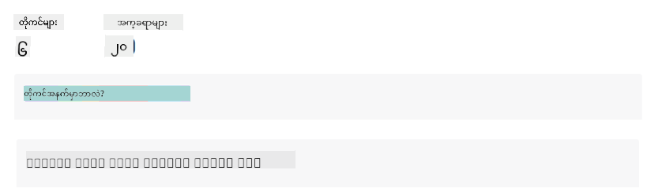
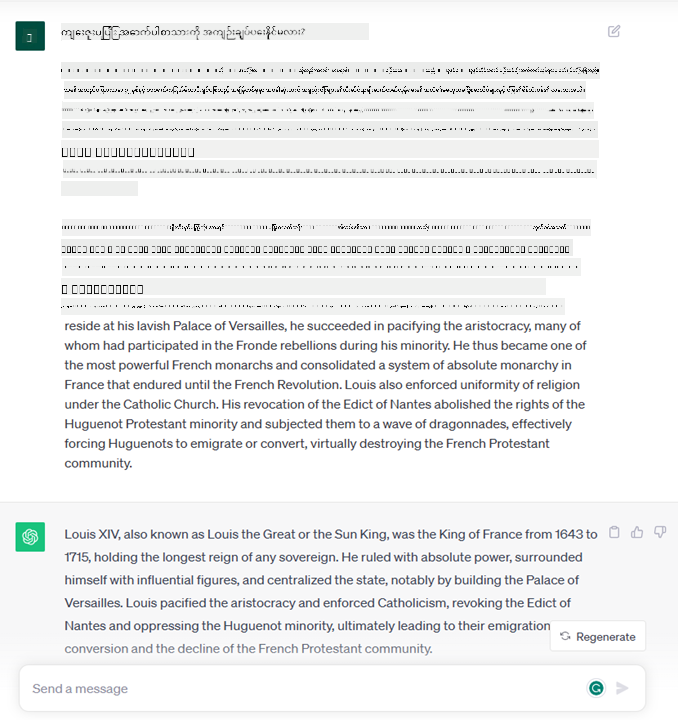
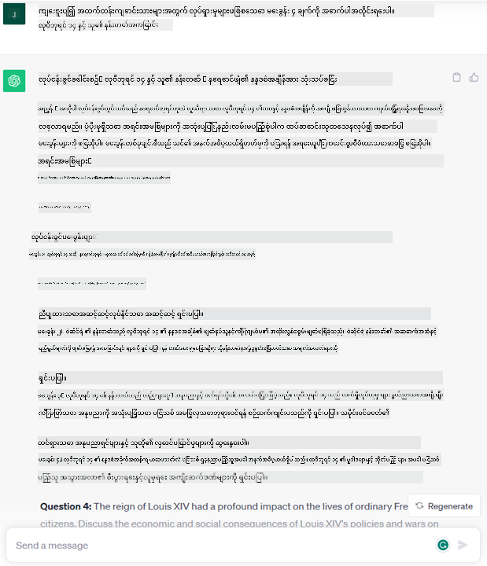
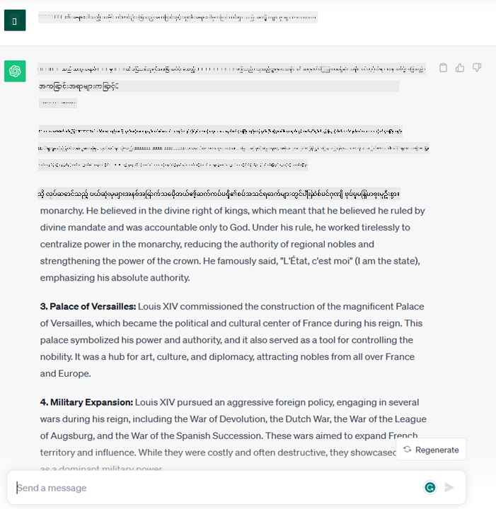
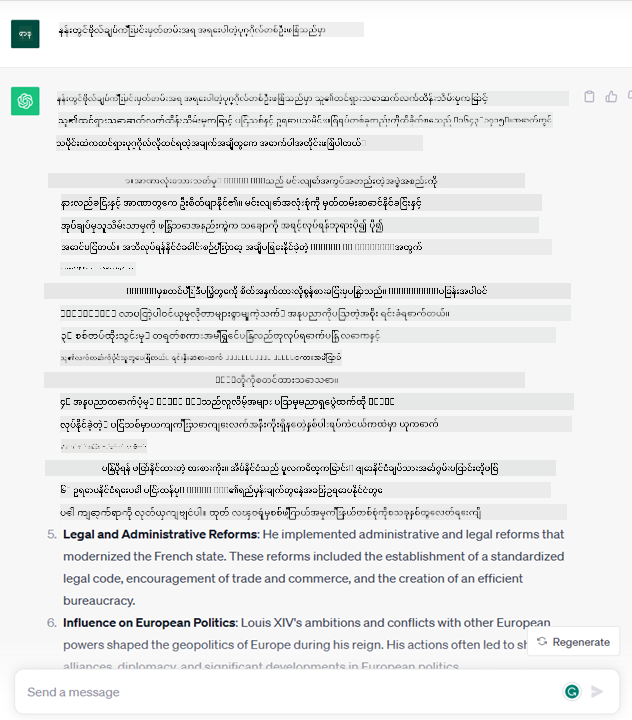
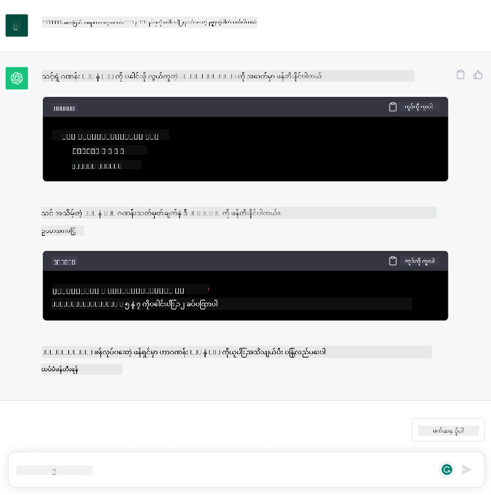

<!--
CO_OP_TRANSLATOR_METADATA:
{
  "original_hash": "f53ba0fa49164f9323043f1c6b11f2b1",
  "translation_date": "2025-06-25T10:10:31+00:00",
  "source_file": "01-introduction-to-genai/README.md",
  "language_code": "my"
}
-->
# မိတ်ဆက် - Generative AI နှင့် အကြီးစားဘာသာစကားမော်ဒယ်များ

Generative AI သည် စာတမ်းများ၊ ရုပ်ပုံများနှင့် အခြားအမျိုးမျိုးသော အကြောင်းအရာများကို ဖန်တီးနိုင်သော လူတုပညာဖြစ်သည်။ ဒီနည်းပညာကို အံ့သြဖွယ်ကောင်းတဲ့ နည်းပညာဖြစ်စေတဲ့အကြောင်းက AI ကို လူတိုင်းအသုံးပြုနိုင်စေခြင်းဖြစ်သည်။ သဘာဝဘာသာစကားတွင် ရေးသားထားသော စာကြောင်းတစ်ခုဖြင့် စတင်နိုင်ပြီး၊ Java သို့မဟုတ် SQL ကဲ့သို့သော ဘာသာစကားများကို သင်ယူရန် မလိုအပ်ပါ။ သင်လိုချင်တာကို ပြောပြပြီး AI မော်ဒယ်မှ အကြံပြုချက်ကို ရယူနိုင်ပါသည်။ အကြောင်းအရာများနှင့် ၎င်း၏ သက်ရောက်မှုသည် ကြီးမားသည်၊ စာရင်းများကို ရေးသားခြင်း၊ လျှောက်လွှာများကို ရေးသားခြင်း၊ စတာများကို စက္ကန့်ပိုင်းအတွင်း ပြုလုပ်နိုင်ပါသည်။

ဒီသင်ခန်းစာတွင် ကျွန်ုပ်တို့၏ စတင်လုပ်ငန်းသည် ပညာရေးကမ္ဘာတွင် အသစ်သော ရှုခင်းများကို ဖွင့်နိုင်စေရန် Generative AI ကို ဘယ်လိုအသုံးပြုသည်ကို လေ့လာသွားမည်ဖြစ်ပြီး ၎င်း၏ လျှောက်လွှာနှင့် နည်းပညာကန့်သတ်ချက်များနှင့် ဆက်နွှယ်သော လူမှုဆက်ဆံရေး အခက်အခဲများကို ကျွန်ုပ်တို့ ဘယ်လိုဖြေရှင်းကြမည်ကို လေ့လာသွားမည်ဖြစ်သည်။

## မိတ်ဆက်

ဒီသင်ခန်းစာတွင် ပါဝင်မည်မှာ -

- စီးပွားရေးရှုခင်း၏ မိတ်ဆက် - ကျွန်ုပ်တို့၏ စတင်လုပ်ငန်းအကြံအစည်နှင့် မျှော်မှန်းချက်။
- Generative AI နှင့် နောက်ဆုံးနည်းပညာရှုခင်းသို့ ဘယ်လိုရောက်ရှိလာသလဲ။
- အကြီးစားဘာသာစကားမော်ဒယ်၏ အတွင်းပိုင်းလုပ်ဆောင်ချက်။
- အကြီးစားဘာသာစကားမော်ဒယ်၏ အဓိကစွမ်းရည်များနှင့် လက်တွေ့အသုံးပြုမှု။

## သင်ယူရည်မှန်းချက်များ

ဒီသင်ခန်းစာပြီးဆုံးပြီးနောက်၊ သင်သည် နားလည်လိမ့်မည် -

- Generative AI သည် အဘယ်နည်း၊ အကြီးစားဘာသာစကားမော်ဒယ်များသည် ဘယ်လိုအလုပ်လုပ်သည်။
- ပညာရေးရှုခင်းများကို အဓိကထားပြီး အမျိုးမျိုးသော အသုံးပြုမှုများအတွက် အကြီးစားဘာသာစကားမော်ဒယ်များကို ဘယ်လိုအသုံးပြုနိုင်သည်။

## ရှုခင်း - ကျွန်ုပ်တို့၏ ပညာရေးစတင်လုပ်ငန်း

Generative Artificial Intelligence (AI) သည် AI နည်းပညာ၏ ထိပ်ဆုံးကို ကိုယ်စားပြုပြီး၊ ယခင်က မဖြစ်နိုင်ဘူးလို့ ယူဆခဲ့တဲ့ အကန့်အသတ်များကို ဖျက်သိမ်းခြင်းဖြစ်သည်။ Generative AI မော်ဒယ်များတွင် အမျိုးမျိုးသော စွမ်းရည်များနှင့် လျှောက်လွှာများရှိသည်၊ သို့သော် ဒီသင်ခန်းစာတွင် ပညာရေးကို အကြောင်းပြုသော စိတ်ကူးယဉ် စတင်လုပ်ငန်းတစ်ခုမှ ဘယ်လို အံ့ဖွယ်အောင် ပြောင်းလဲနေသည်ကို လေ့လာသွားမည်ဖြစ်သည်။ ကျွန်ုပ်တို့ ဒီစတင်လုပ်ငန်းကို _ကျွန်ုပ်တို့၏ စတင်လုပ်ငန်း_ ဟု ခေါ်ဆိုပါမည်။ ကျွန်ုပ်တို့၏ စတင်လုပ်ငန်းသည် ပညာရေးကဏ္ဍတွင် လုပ်ကိုင်ပြီး၊

> _လေ့လာမှုတွင် လက်လှမ်းမီမှုကို ကမ္ဘာ့အတိုင်းအတာဖြင့် တိုးတက်စေရန်၊ ပညာရေးမှ လက်လှမ်းမီမှုတန်းတူစေရန်၊ လေ့လာသူတိုင်း၏ လိုအပ်ချက်များအရ ကိုယ်ပိုင်လေ့လာမှုအတွေ့အကြုံများ ပေးရန်_

ကျွန်ုပ်တို့၏ စတင်လုပ်ငန်းအဖွဲ့သည် ဒီရည်မှန်းချက်ကို အခိုင်အမာ အောင်မြင်ရန် အချိန်ခေတ်သစ်၏ အင်အားကြီးဆုံး ကိရိယာတစ်ခုဖြစ်သော အကြီးစားဘာသာစကားမော်ဒယ်များ (LLMs) ကို အသုံးပြုမည်ဖြစ်သည်။

Generative AI သည် ယနေ့ကျွန်ုပ်တို့ ဘယ်လိုလေ့လာခြင်း၊ သင်ကြားခြင်းကို အံ့ဖွယ်ကောင်းစွာ ပြောင်းလဲစေနိုင်မည်ဟု မျှော်လင့်ရသည်။ ကျောင်းသားများသည် 24 နာရီအတွင်း အကြီးမားသော သတင်းအချက်အလက်များနှင့် နမူနာများကို ပေးသော အကြံပေး virtual သင်ကြားသူများကို ရရှိနိုင်ပြီး၊ ဆရာများသည် ၎င်းတို့၏ ကျောင်းသားများကို အကဲဖြတ်ရန် နှင့် အကြံပြုချက်ပေးရန် ဆန်းသစ်သော ကိရိယာများကို အသုံးပြုနိုင်သည်။

စတင်ရန်၊ ကျွန်ုပ်တို့ သင်ခန်းစာအတွင်း အကြောင်းပြုသုံးစွဲမည့် အခြေခံအယူအဆများနှင့် ဘာသာရပ်များကို သတ်မှတ်ကြပါစို့။

## Generative AI ကို ဘယ်လိုရရှိခဲ့ပါသလဲ?

Generative AI မော်ဒယ်များ၏ ကြေညာချက်ကြောင့် လွန်ခဲ့သောအချိန်များတွင် လွန်ကဲသော _hype_ ဖြစ်ပေါ်ခဲ့သော်လည်း၊ ဒီနည်းပညာသည် လေးဆယ်စုနှစ်များအတွင်း ဖွံ့ဖြိုးမှုအတွက် ဖန်တီးခြင်းဖြစ်ပြီး၊ ပထမဆုံးသုတေသနကြိုးပမ်းမှုများသည် 60 ခုနှစ်များတွင် စတင်ခဲ့သည်။ ယနေ့ AI သည် လူ့အာရုံစူးစိုက်မှုစွမ်းရည်များ ရှိနေသည်၊ ဥပမာအားဖြင့် [OpenAI ChatGPT](https://openai.com/chatgpt) သို့မဟုတ် [Bing Chat](https://www.microsoft.com/edge/features/bing-chat?WT.mc_id=academic-105485-koreyst) ကဲ့သို့သော AI မော်ဒယ်များသည် လူနှင့် စကားပြောဆိုမှုများကို ပြသနိုင်သည်။

အနည်းငယ်ပြန်သုံးသပ်ပါက၊ AI ၏ ပထမဆုံး မူကွဲများသည် စာရိုက်စက် chatbots များဖြစ်ပြီး၊ ကျွမ်းကျင်သူအဖွဲ့တစ်ခုမှ ထုတ်ယူထားသော အသိပညာအခြေခံကို ကိုးကား၍ ကွန်ပျူတာတွင် ကိုယ်စားပြုထားခြင်းဖြစ်သည်။ အသိပညာအခြေခံရှိသော အဖြေများကို အဝင်စာသားတွင် ပါဝင်သော အဓိကချက်များဖြင့် လှုံ့ဆော်ခဲ့သည်။

### AI ကို စာရင်းကိုင်လမ်းစဉ် - Machine Learning

90 ခုနှစ်များတွင် စာတမ်းအာနိသင်ကို စာရင်းကိုင်လမ်းစဉ်ဖြင့် လေ့လာမှုသည် အရေးကြီးသော ချဉ်းကပ်မှုတစ်ခု ဖြစ်လာသည်။ ဒီနည်းလမ်းသည် များသော အချက်အလက်များကို လေ့လာနိုင်သော အလားအလာရှိသော အကွမ်းအဝေးသုံးအာနိသင်များကို ဖွံ့ဖြိုးစေခဲ့သည်။ ဒီနည်းလမ်းသည် လူ့ဘာသာစကားနားလည်မှုကို အမည်မသတ်မှတ်ထားသော အဝင်စာသားကို သတ်မှတ်ထားသော အမည်ဖြင့် ခွဲခြားနိုင်စေရန် စာတမ်း-အမည်ကိုယ်ပိုင်စံနမူနာများကို လေ့လာသင်ယူနိုင်သည်။

### Neural Networks နှင့် ခေတ်သစ် virtual အကြံပေးသူများ

လွန်ခဲ့သောနှစ်များအတွင်း အချက်အလက်များနှင့် ပိုမိုရှုပ်ထွေးသောတွက်ချက်မှုများကို ကိုင်တွယ်နိုင်သော နည်းပညာဖွံ့ဖြိုးမှုကြောင့် AI သုတေသနကို လှုံ့ဆော်ခဲ့ပြီး neural networks သို့မဟုတ် deep learning အာနိသင်များဟုခေါ်သော ကြီးပြင်းသော machine learning အာနိသင်များ ဖွံ့ဖြိုးလာစေခဲ့သည်။

Neural networks (အထူးသဖြင့် Recurrent Neural Networks - RNNs) သည် သဘာဝဘာသာစကားကို သဘောပေါက်နားလည်မှုကို အထူးတန်ဖိုးထားသော နည်းလမ်းဖြင့် အဓိပ္ပါယ်ကို ကိုယ်စားပြုနိုင်စေခဲ့သည်။

ဒီနည်းပညာသည် 21 ရာစု၏ ပထမဆုံးဆယ်စုနှစ်တွင် မွေးဖွားခဲ့သော virtual အကြံပေးသူများကို အားပေးခဲ့ပြီး၊ လူ့ဘာသာစကားကို လွယ်ကူစွာ နားလည်နိုင်စေခဲ့သည်။

### ယနေ့ Generative AI

ဒီလိုနဲ့ပဲ ကျွန်ုပ်တို့ ယနေ့ Generative AI ကို ရောက်ရှိခဲ့သည်၊ deep learning ၏ ခွဲခြားမှုတစ်ခုအဖြစ် မြင်နိုင်သည်။

AI ကဏ္ဍတွင် လေးဆယ်စုနှစ်များအတွင်း သုတေသနပြုခဲ့ပြီး၊ _Transformer_ ဟုခေါ်သော မော်ဒယ် architecture အသစ်သည် RNNs ၏ ကန့်သတ်ချက်များကို ကျော်လွှားခဲ့သည်၊ အဝင်အဖြစ် စာသားများ၏ ပိုမိုရှည်လျားသော အစဉ်များကို ရယူနိုင်စေခဲ့သည်။

နောက်ဆုံးတွင် Generative AI မော်ဒယ်များ (အကြီးစားဘာသာစကားမော်ဒယ်များ (LLMs) ဟုလည်းသိရှိကြသည်၊ အထူးသဖြင့် ဒီ architecture ကို အခြေခံထားသည်) သည် စာသား inputs နှင့် outputs ဖြင့် လုပ်ဆောင်သည်။ ဒီမော်ဒယ်များသည် စာအုပ်များ၊ ဆောင်းပါးများ၊ ဝက်ဘ်ဆိုက်များကဲ့သို့သော အမျိုးမျိုးသောအရင်းအမြစ်များမှ အမည်မသတ်မှတ်ထားသော အကြီးစားအချက်အလက်များကို လေ့ကျင့်ထားသည်၊ အမျိုးမျိုးသော အလုပ်များအတွက် ရိုးရှင်းသော text အဖြစ် ထုတ်လုပ်နိုင်စေသည်။

## အကြီးစားဘာသာစကားမော်ဒယ်များသည် ဘယ်လိုအလုပ်လုပ်သလဲ?

နောက်ဆုံးအခန်းတွင် Generative AI မော်ဒယ်များ၏ အမျိုးမျိုးသော အမျိုးအစားများကို လေ့လာသွားမည်ဖြစ်သော်လည်း၊ အကြီးစားဘာသာစကားမော်ဒယ်များသည် ဘယ်လိုအလုပ်လုပ်သည်ကို ကြည့်ပါ၊ OpenAI GPT (Generative Pre-trained Transformer) မော်ဒယ်များကို အဓိကထားပါ။

- **Tokenizer, စာသားမှ နံပါတ်များ**: အကြီးစားဘာသာစကားမော်ဒယ်များသည် အဝင်အဖြစ် စာသားကို ရယူပြီး အထွက်အဖြစ် စာသားကို ထုတ်လုပ်သည်။ သို့သော်၊ စာရင်းကိုင်မော်ဒယ်များဖြစ်သောကြောင့်၊ စာသားအစဉ်များထက် နံပါတ်များနှင့် ပိုမိုကောင်းစွာအလုပ်လုပ်သည်။ ဒါကြောင့် မော်ဒယ်၏ အဝင်အတိုင်း အဝင်အားလုံးကို tokenization ဖြင့် လုပ်ဆောင်ရသည်။

- **အထွက် tokens များကို ခန့်မှန်းခြင်း**: အဝင် n tokens (မော်ဒယ်တစ်ခုနှင့်တစ်ခုအတွက် max n အပြောင်းအလဲရှိသည်) ကို ရရှိပြီးနောက်၊ မော်ဒယ်သည် အထွက်အဖြစ် token တစ်ခုကို ခန့်မှန်းနိုင်သည်။ ဒီ token ကို နောက် iteration ၏ အဝင်အဖြစ် ပေါင်းထည့်ပြီး၊ တစ်ခု (သို့မဟုတ် များသော) စာကြောင်းကို အဖြေအဖြစ် ရယူနိုင်ရန် အပြောင်းအလဲရှိသော window ပုံစံဖြင့် လုပ်ဆောင်သည်။

- **ရွေးချယ်မှုလုပ်ငန်းစဉ်၊ probability distribution**: အထွက် token ကို မော်ဒယ်သည် လက်ရှိစာသားအစဉ်နောက်တွင် ဖြစ်ပေါ်နိုင်သော probability အရရွေးချယ်သည်။ ဒါကြောင့် မော်ဒယ်သည် လေ့ကျင့်မှုအရ 'နောက် token' များ၏ probability distribution ကို ခန့်မှန်းသည်။ သို့သော်၊ အမြင့်ဆုံး probability ရှိသော token မကြိုးစားပါဘဲ ရွေးချယ်ခြင်းဖြစ်သည်။

## ကျွန်ုပ်တို့၏ စတင်လုပ်ငန်းသည် အကြီးစားဘာသာစကားမော်ဒယ်များကို ဘယ်လိုအသုံးပြုနိုင်သလဲ?

အကြီးစားဘာသာစကားမော်ဒယ်၏ အတွင်းပိုင်းလုပ်ဆောင်ချက်ကို ပိုမိုနားလည်ပြီးနောက်၊ အထူးသဖြင့် ကျွန်ုပ်တို့၏ စီးပွားရေးရှုခင်းအတွက် အလားအလာများကို ရှင်းလင်းပါစို့။

ကျွန်ုပ်တို့သည် အကြီးစားဘာသာစကားမော်ဒယ်၏ အဓိကစွမ်းရည်မှာ _သဘာဝဘာသာစကားဖြင့် ရေးသားထားသော အဝင်စာသားတစ်ခုမှ စ၍ စာသားကို ဖန်တီးခြင်း_ ဖြစ်သည်ဟု ပြောခဲ့သည်။

သို့သော် ဘယ်လိုအဝင်စာသားနှင့် အထွက်စာသားများ?

အကြီးစားဘာသာစကားမော်ဒယ်၏ အဝင်ကို prompt ဟုခေါ်သည်၊ အထွက်ကို completion ဟုခေါ်သည်၊ မော်ဒယ်၏ mechanism ၏ နောက် token ကို ဖန်တီးခြင်းကို ကိုယ်စားပြုသည်။

- **အညွှန်းချက်** မော်ဒယ်ထံမှ မျှော်မှန်းသော အထွက်အမျိုးအစားကို သတ်မှတ်ခြင်း။

  1. ဆောင်းပါး၊ စာအုပ်၊ ကုန်ပစ္စည်းသုံးသပ်မှုများကို အကျဉ်းချုပ်ခြင်း၊ အမီမီသုံးသပ်ချက်များကို ထုတ်ယူခြင်း။

    

  2. ဆောင်းပါး၊ ရေးသားမှု၊ လုပ်ငန်းခွင်ကို ဖန်တီးရေးဆွဲခြင်း။

     

- **မေးခွန်း** မေးခြင်း။

  

- **စာသားကို ပြည့်စုံအောင်ရေးဆွဲခြင်း**။

  

- **ကုဒ်** နှင့် အတူ ရှင်းလင်းရေးသားခြင်း၊ သို့မဟုတ် ကုဒ်ပြုလုပ်ရန် မေးခြင်း။

  

အထက်ပါဥပမာများသည် ရိုးရှင်းပြီး၊ Generative AI မော်ဒယ်များ၏ စွမ်းရည်များကို အပြည့်အဝ မထင်ရသည်။ သို့သော် ပညာရေးအကျိုးအမြတ်များကို ပြသရန် ရည်ရွယ်သည်။

Generative AI မော်ဒယ်၏ အထွက်သည် အပြည့်အဝမဟုတ်ပါ၊ မော်ဒယ်၏ ဖန်တီးမှုစွမ်းရည်သည် sometimes မမှန်ကန်သော အထွက်ကို ဖန်တီးနိုင်သည်။

## လုပ်ငန်းခွင်

သင့်လုပ်ငန်းခွင်သည် [generative AI](https://en.wikipedia.org/wiki/Generative_artificial_intelligence?WT.mc_id=academic-105485-koreyst) အကြောင်း ပိုမိုဖတ်ရှုရန်နှင့် ယနေ့ AI မရှိသောနေရာတွင် AI ကို ထည့်သွင်းရန် နယ်ပယ်တစ်ခုကို ရှာဖွေရန် ဖြစ်သည်။ "အခက်အခဲ", "AI ကို ဘယ်လိုအသုံးပြုမည်", "သက်ရောက်မှု" နှင့် optionally "လုပ်ငန်းအစီအစဉ်" အတူ AI စတင်လုပ်ငန်းမည်သို့ဖြစ်မည်ကို 

**စာရင်းမှတ်ချက်**:  
ဤစာရွက်စာတမ်းကို AI ဘာသာပြန်စနစ် [Co-op Translator](https://github.com/Azure/co-op-translator) ကို အသုံးပြု၍ ဘာသာပြန်ထားပါသည်။ ကျွန်ုပ်တို့သည် တိကျမှန်ကန်မှုအတွက် ကြိုးစားနေသော်လည်း အလိုအလျောက်ဘာသာပြန်ချက်များတွင် အမှားများ သို့မဟုတ် မှားယွင်းချက်များ ပါဝင်နိုင်သည်ကို ကျေးဇူးပြု၍ အသိအမှတ်ပြုပါ။ မူရင်းဘာသာစကားဖြင့် ရေးသားထားသော စာရွက်စာတမ်းကို အာဏာပိုင်ရင်းမြစ်အဖြစ် စဉ်းစားသင့်ပါသည်။ အရေးကြီးသော အချက်အလက်များအတွက် ပရော်ဖက်ရှင်နယ် လူ့ဘာသာပြန်မှုကို အကြံပြုပါသည်။ ဤဘာသာပြန်ချက်ကို အသုံးပြုခြင်းမှ လွဲထွက်သော နားလည်မှားယွင်းမှုများ သို့မဟုတ် အဓိပ္ပာယ်ဖျက်ပြားမှုများအတွက် ကျွန်ုပ်တို့သည် တာဝန်မခံပါ။