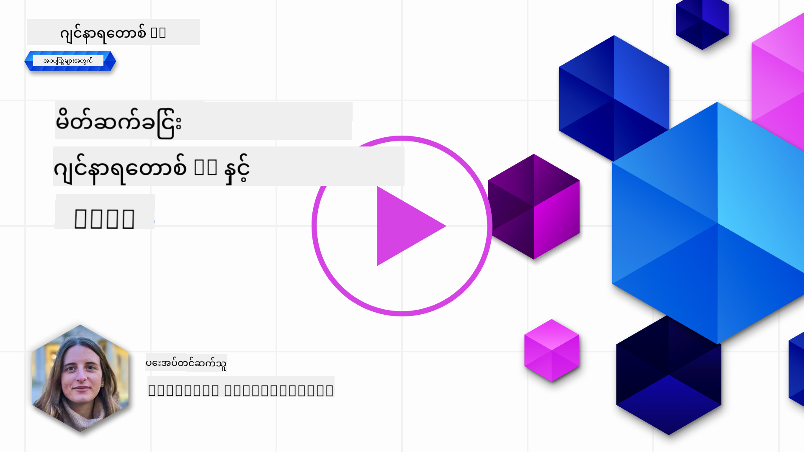
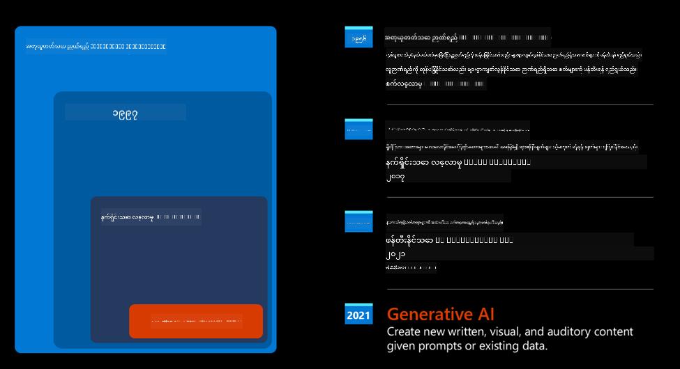

<!--
CO_OP_TRANSLATOR_METADATA:
{
  "original_hash": "bfb7901bdbece1ba3e9f35c400ca33e8",
  "translation_date": "2025-10-18T02:04:39+00:00",
  "source_file": "01-introduction-to-genai/README.md",
  "language_code": "my"
}
-->
# Generative AI နှင့် Large Language Models ကိုမိတ်ဆက်ခြင်း

_(ဤသင်ခန်းစာ၏ ဗီဒီယိုကို ကြည့်ရန် အထက်ပါပုံကို နှိပ်ပါ)_

Generative AI သည် စာသားများ၊ ပုံများနှင့် အခြားအမျိုးမျိုးသော အကြောင်းအရာများကို ဖန်တီးနိုင်သော အတုအကျအာရုံကြောပညာဖြစ်သည်။ ၎င်းသည် အတုအကျအာရုံကြောပညာကို လူတိုင်းအသုံးပြုနိုင်ရန် အခွင့်အရေးပေးသော နည်းပညာဖြစ်သည်။ သဘာဝဘာသာစကားဖြင့် ရေးသားထားသော စာကြောင်းတစ်ကြောင်းကို အသုံးပြု၍ AI မော်ဒယ်မှ အကြံပြုချက်တစ်ခုကို ရယူနိုင်သည်။ Java သို့မဟုတ် SQL ကဲ့သို့သော ဘာသာစကားကို သင်ယူရန် မလိုအပ်ပါ။ သင်၏ဘာသာစကားကို အသုံးပြု၍ သင်လိုချင်သောအရာကို ပြောဆိုပြီး AI မော်ဒယ်မှ အကြံပြုချက်ကို ရယူနိုင်သည်။ ၎င်း၏ လျှောက်လွှာများနှင့် သက်ရောက်မှုများသည် အလွန်ကြီးမားပြီး အစီရင်ခံစာများကို ရေးသားခြင်း၊ နားလည်ခြင်း၊ လျှောက်လွှာများကို ရေးသားခြင်း စသည်တို့ကို စက္ကန့်အနည်းငယ်အတွင်း ပြုလုပ်နိုင်သည်။

ဤသင်ခန်းစာတွင် ကျွန်ုပ်တို့၏ စတင်တည်ထောင်သော ကုမ္ပဏီသည် ပညာရေးကမ္ဘာတွင် Generative AI ကို အသုံးချ၍ အခွင့်အလမ်းအသစ်များကို ဘယ်လိုဖွင့်လှစ်နိုင်သည်၊ ၎င်း၏လျှောက်လွှာနှင့် နည်းပညာကန့်သတ်ချက်များနှင့် ဆက်စပ်သော လူမှုရေးဆိုင်ရာ အခက်အခဲများကို ကျွန်ုပ်တို့ ဘယ်လိုဖြေရှင်းနိုင်သည်ကို လေ့လာမည်ဖြစ်သည်။

## မိတ်ဆက်

ဤသင်ခန်းစာတွင် အောက်ပါအကြောင်းအရာများကို လေ့လာမည်ဖြစ်သည်-

- စီးပွားရေးအခြေအနေကို မိတ်ဆက်ခြင်း - ကျွန်ုပ်တို့၏ စတင်တည်ထောင်သော ကုမ္ပဏီ၏ အကြံဉာဏ်နှင့် ရည်မှန်းချက်။
- Generative AI နှင့် ယခုနည်းပညာအခြေအနေသို့ ရောက်ရှိလာပုံ။
- Large Language Model ၏ အတွင်းပိုင်းလုပ်ဆောင်ပုံ။
- Large Language Models ၏ အဓိကစွမ်းရည်များနှင့် လက်တွေ့အသုံးချနိုင်သော လျှောက်လွှာများ။

## သင်ယူရမည့် ရည်မှန်းချက်များ

ဤသင်ခန်းစာကို ပြီးမြောက်ပြီးနောက် သင်သည်-

- Generative AI သည် အဘယ်နည်း၊ Large Language Models မည်သို့ လုပ်ဆောင်သည်ကို နားလည်မည်။
- ပညာရေးအခြေအနေများကို အဓိကထား၍ အမျိုးမျိုးသော လျှောက်လွှာများအတွက် Large Language Models ကို မည်သို့ အသုံးချနိုင်သည်ကို နားလည်မည်။

## အခြေအနေ - ကျွန်ုပ်တို့၏ ပညာရေးစတင်တည်ထောင်သော ကုမ္ပဏီ

Generative Artificial Intelligence (AI) သည် AI နည်းပညာ၏ အမြင့်ဆုံးအဆင့်ကို ကိုယ်စားပြုပြီး အရင်က မဖြစ်နိုင်ဘူးလို့ ထင်ခဲ့တဲ့ အရာတွေကို အကန့်အသတ်မရှိ ဖန်တီးနိုင်စွမ်းရှိသည်။ Generative AI မော်ဒယ်များတွင် စွမ်းရည်များနှင့် လျှောက်လွှာများစွာရှိသော်လည်း ဤသင်ခန်းစာတွင် ကျွန်ုပ်တို့သည် စိတ်ကူးယဉ်စတင်တည်ထောင်သော ကုမ္ပဏီတစ်ခုမှတဆင့် ပညာရေးကို ဘယ်လို ပြောင်းလဲနေသည်ကို လေ့လာမည်ဖြစ်သည်။ ကျွန်ုပ်တို့သည် ဤစတင်တည်ထောင်သော ကုမ္ပဏီကို _ကျွန်ုပ်တို့၏ စတင်တည်ထောင်သော ကုမ္ပဏီ_ ဟု ခေါ်ဆိုမည်။ ကျွန်ုပ်တို့၏ စတင်တည်ထောင်သော ကုမ္ပဏီသည် ပညာရေးနယ်ပယ်တွင် လုပ်ကိုင်ပြီး-

> _လေ့လာမှုများတွင် ဝင်ရောက်နိုင်မှုကို ကမ္ဘာ့အဆင့်တွင် တိုးတက်စေခြင်း၊ ပညာရေးကို တန်းတူဝင်ရောက်နိုင်စေခြင်းနှင့် သင်ယူသူတစ်ဦးချင်းစီ၏ လိုအပ်ချက်များအတိုင်း ကိုယ်ပိုင်သင်ယူမှု အတွေ့အကြုံများကို ပေးစွမ်းခြင်း_ 

ဆိုသော ရည်မှန်းချက်ကြီးကို ရှိသည်။

ကျွန်ုပ်တို့၏ စတင်တည်ထောင်သော ကုမ္ပဏီအဖွဲ့သည် ယနေ့ခေတ်၏ အစွမ်းထက်ဆုံး နည်းပညာတစ်ခုဖြစ်သော Large Language Models (LLMs) ကို အသုံးချမည်မဟုတ်လျှင် ဤရည်မှန်းချက်ကို မရောက်ရှိနိုင်ကြောင်း သိရှိထားသည်။

Generative AI သည် ယနေ့ကျွန်ုပ်တို့၏ သင်ယူမှုနှင့် သင်ကြားမှုကို ပြောင်းလဲစေမည်ဟု မျှော်လင့်ရပြီး ကျောင်းသားများသည် ၂၄ နာရီလုံး Virtual Teacher များကို အသုံးပြု၍ အချက်အလက်များနှင့် ဥပမာများစွာကို ရယူနိုင်ပြီး ဆရာများသည် ၎င်းတို့၏ ကျောင်းသားများကို အကဲဖြတ်ရန်နှင့် အကြံပြုချက်ပေးရန် နည်းပညာအသစ်များကို အသုံးချနိုင်သည်။

စတင်ရန် ကျွန်ုပ်တို့ သင်ခန်းစာတစ်ခုလုံးတွင် အသုံးပြုမည့် အခြေခံအယူအဆများနှင့် အဓိပ္ပာယ်များကို သတ်မှတ်လိုက်ပါစို့။

## Generative AI ကို ဘယ်လိုရရှိခဲ့သလဲ?

Generative AI မော်ဒယ်များကို ကြေညာခြင်းမှ ဖြစ်ပေါ်လာသော အလွန်ထူးခြားသော _hype_ သို့မဟုတ် စိတ်လှုပ်ရှားမှုများရှိသော်လည်း ဤနည်းပညာသည် ဆယ်စုနှစ်များစွာအတွင်း ဖွံ့ဖြိုးလာခဲ့ပြီး ၆၀ ခုနှစ်များအထိ သုတေသနလုပ်ငန်းများ စတင်ခဲ့သည်။ ယနေ့ AI သည် လူ့အာရုံခံနိုင်စွမ်းများကို ရရှိထားပြီး ဥပမာအားဖြင့် [OpenAI ChatGPT](https://openai.com/chatgpt) သို့မဟုတ် [Bing Chat](https://www.microsoft.com/edge/features/bing-chat?WT.mc_id=academic-105485-koreyst) ကဲ့သို့သော စကားပြောဆိုမှုများကို ပြသနိုင်သည်။ Bing Chat သည် GPT မော်ဒယ်ကို အသုံးပြု၍ ဝက်ဘ်ရှာဖွေမှု Bing conversations တွင်လည်း အသုံးပြုသည်။

နည်းနည်းနောက်ပြန်သွားကြည့်ပါက AI ၏ ပထမဆုံးပုံစံများသည် typewritten chatbots ဖြစ်ပြီး ကျွမ်းကျင်သူများ၏ အတွေ့အကြုံမှ Knowledge Base ကို ရယူပြီး ကွန်ပျူတာထဲသို့ ကိုယ်စားပြုထားသည်။ Knowledge Base ထဲရှိ အဖြေများကို input စာသားတွင် ပါဝင်သော keyword များမှတဆင့် trigger လုပ်သည်။
သို့သော် typewritten chatbots ကို အသုံးပြုသော ဤနည်းလမ်းသည် အလွန်အမင်းကျယ်ပြန့်သောအခြေအနေများတွင် မရောက်နိုင်ကြောင်း အလျင်အမြန် သိရှိခဲ့သည်။

### AI အတွက် စာရင်းဇယားနည်းလမ်း - Machine Learning

၉၀ ခုနှစ်များတွင် စာသားများကို စာရင်းဇယားနည်းလမ်းဖြင့် လေ့လာမှုကို အသုံးပြုခြင်းသည် အရေးပါသောအချိန်ခရီးဖြစ်သည်။ ၎င်းသည် machine learning ဟုခေါ်သော algorithm အသစ်များ ဖွံ့ဖြိုးလာစေပြီး အချက်အလက်များမှ pattern များကို ရှာဖွေသင်ယူနိုင်စွမ်းရှိသည်။ ဤနည်းလမ်းသည် စက်များကို လူ့ဘာသာစကားနားလည်မှုကို အတုယူနိုင်စေသည်။ စာရင်းဇယားမော်ဒယ်ကို စာသား-တံဆိပ် pairing များတွင် လေ့ကျင့်ခြင်းဖြင့် မော်ဒယ်သည် မသိသော input စာသားကို အကြောင်းအရာကို ကိုယ်စားပြုသော pre-defined label ဖြင့် ခွဲခြားနိုင်စွမ်းရှိသည်။

### Neural networks နှင့် ခေတ်သစ် Virtual Assistants

နောက်ဆုံးနှစ်များတွင် hardware ၏ နည်းပညာဖွံ့ဖြိုးမှုသည် အချက်အလက်များနှင့် ရှုပ်ထွေးသောတွက်ချက်မှုများကို ပိုမိုကောင်းမွန်စွာ ကိုင်တွယ်နိုင်စေပြီး AI သုတေသနကို အားပေးခဲ့သည်။ ၎င်းသည် neural networks သို့မဟုတ် deep learning algorithms ဟုခေါ်သော machine learning algorithm အဆင့်မြင့်များ ဖွံ့ဖြိုးလာစေခဲ့သည်။

Neural networks (အထူးသဖြင့် Recurrent Neural Networks – RNNs) သည် natural language processing ကို အလွန်တိုးတက်စေပြီး စာကြောင်းတစ်ကြောင်းတွင် စကားလုံး၏ context ကို အရေးပါမှုပေးခြင်းဖြင့် စာသား၏ အဓိပ္ပာယ်ကို ပိုမိုအဓိပ္ပာယ်ရှိစေသည်။

ဤနည်းပညာသည် ၂၁ ရာစု၏ ပထမဆုံးဆယ်စုနှစ်တွင် မွေးဖွားလာသော virtual assistants များကို အားပေးခဲ့ပြီး လူ့ဘာသာစကားကို အလွန်ကောင်းစွာ အဓိပ္ပာယ်ဖွင့်ဆိုနိုင်စွမ်းရှိစေသည်။ ၎င်းသည် လိုအပ်ချက်ကို ဖော်ထုတ်ခြင်း၊ ၎င်းကို ဖြည့်ဆည်းရန် လုပ်ဆောင်မှုတစ်ခုကို ပြုလုပ်ခြင်း - ဥပမာအားဖြင့် pre-defined script ဖြင့် အဖြေပြန်ခြင်း သို့မဟုတ် 3rd party service ကို အသုံးပြုခြင်း စသည်ဖြင့် ဖြစ်သည်။

### ယနေ့ခေတ် Generative AI

ဒါကြောင့် ယနေ့ Generative AI သို့ ရောက်ရှိလာခဲ့ပြီး ၎င်းကို deep learning ၏ အစိတ်အပိုင်းတစ်ခုအဖြစ် တွေ့မြင်နိုင်သည်။

AI နယ်ပယ်တွင် ဆယ်စုနှစ်များစွာ သုတေသနလုပ်ငန်းများအပြီး _Transformer_ ဟုခေါ်သော မော်ဒယ် architecture အသစ်တစ်ခုသည် RNNs ၏ ကန့်သတ်ချက်များကို ကျော်လွှားနိုင်ခဲ့ပြီး စာသား၏ အလုံးစုံအရှည်ကို input အဖြင့် ရယူနိုင်စွမ်းရှိသည်။ Transformers သည် attention mechanism အပေါ် အခြေခံထားပြီး မော်ဒယ်သည် ၎င်းရရှိသော input များကို အမျိုးမျိုးသော အလေးချိန်များပေးနိုင်စွမ်းရှိစေသည်။ ၎င်းသည် စာကြောင်းအတွင်း အရေးပါသော အချက်အလက်များ အလေးပေးသောနေရာတွင် ‘ပိုမိုအာရုံစိုက်’ စေပြီး စာကြောင်းအတွင်း အစီအစဉ်ကို မထီတင်းဘဲ အလုပ်လုပ်နိုင်စေသည်။

နောက်ဆုံး Generative AI မော်ဒယ်များ - Large Language Models (LLMs) ဟုလည်း သိရှိကြပြီး ၎င်းတို့သည် စာသား input နှင့် output များနှင့်အလုပ်လုပ်သောကြောင့် - အမှန်တကယ် ဤ architecture အပေါ် အခြေခံထားသည်။ ဤမော်ဒယ်များသည် စာအုပ်များ၊ ဆောင်းပါးများနှင့် ဝက်ဘ်ဆိုဒ်များကဲ့သို့သော အမျိုးမျိုးသော အရင်းအမြစ်များမှ unlabeled data အများအပြားကို လေ့ကျင့်ထားပြီး အမျိုးမျိုးသော လုပ်ငန်းများအတွက် အလွယ်တကူ အဆင်ပြေစေသော စွမ်းရည်ရှိသည်။ ၎င်းတို့သည် စာသား input ကို ‘နားလည်’ စွမ်းရည်ကို အလွန်တိုးတက်စေသည့်အပြင် လူ့ဘာသာစကားဖြင့် မူရင်းအဖြေကို ဖန်တီးနိုင်စွမ်းရှိသည်။

## Large Language Models မည်သို့ လုပ်ဆောင်သနည်း?

နောက်အခန်းတွင် Generative AI မော်ဒယ်အမျိုးမျိုးကို လေ့လာမည်ဖြစ်သော်လည်း ယခုအခါ Large Language Models မည်သို့ လုပ်ဆောင်သည်ကို OpenAI GPT (Generative Pre-trained Transformer) မော်ဒယ်များကို အဓိကထား၍ လေ့လာကြည့်ပါစို့။

- **Tokenizer, စာသားကို နံပါတ်များသို့ ပြောင်းခြင်း**: Large Language Models သည် စာသားကို input အဖြင့် ရယူပြီး စာသား output ကို ဖန်တီးသည်။ သို့သော် စာရင်းဇယားမော်ဒယ်များဖြစ်သောကြောင့် စာသားထက် နံပါတ်များနှင့် ပိုမိုကောင်းစွာ အလုပ်လုပ်နိုင်သည်။ ထို့ကြောင့် မော်ဒယ်သို့ input အဖြစ် အသုံးပြုမည့် စာသားအား tokenizer မှ အရင်ဆုံး လုပ်ဆောင်သည်။ Tokenizer ၏ အဓိကလုပ်ငန်းသည် input ကို token များအဖြစ် ခွဲခြားခြင်းဖြစ်သည်။ ထို့နောက် token တစ်ခုစီကို token index နှင့် map လုပ်ပြီး မူရင်းစာသား chunk ၏ integer encoding ဖြစ်သည်။

- **Output tokens များကို ခန့်မှန်းခြင်း**: n tokens များကို input အဖြင့် ရယူပြီး (မော်ဒယ်တစ်ခုနှင့်တစ်ခုအလိုက် max n ကွဲပြားသည်) မော်ဒယ်သည် output အဖြစ် token တစ်ခုကို ခန့်မှန်းနိုင်သည်။ ဤ token ကို နောက် iteration ၏ input အဖြစ် ထည့်သွင်းပြီး expanding window pattern ဖြင့် အဖြေတစ်ခု (သို့မဟုတ်) စာကြောင်းများစွာကို ရယူနိုင်သော user experience ကို ပိုမိုကောင်းမွန်စေသည်။ ဤသည်မှာ ChatGPT ကို အသုံးပြုခဲ့ဖူးပါက တစ်ခါတစ်ရံ စာကြောင်းတစ်ခု၏ အလယ်တွင် ရပ်နေသလို ဖြစ်ပုံရသည်ကို သတိထားမိနိုင်သည်။

- **ရွေးချယ်မှုလုပ်ငန်းစဉ်၊ probability distribution**: Output token ကို မော်ဒယ်သည် လက်ရှိစာသားအဆင့်အပြီးတွင် ဖြစ်နိုင်ချေရှိသော token များအပေါ် probability distribution အရ ရွေးချယ်သည်။ ၎င်းသည် မော်ဒယ်သည် training အပေါ် အခြေခံ၍ ဖြစ်နိုင်သော ‘နောက် token’ များ၏ probability distribution ကို ခန့်မှန်းသောကြောင့် ဖြစ်သည်။ သို့သော် output token ကို အမြင့်ဆုံး probability ရှိသော token ကို မကြိုက်နှစ်သက်စွာ ရွေးချယ်မည်မဟုတ်ပါ။ ၎င်းရွေးချယ်မှုတွင် randomness အချို့ကို ထည့်သွင်းထားပြီး မော်ဒယ်သည် non-deterministic ဖြစ်စေသည် - input တူညီသောအခါ output တူညီသောအဖြေကို မရနိုင်ပါ။ Randomness ၏ အဆင့်ကို temperature ဟုခေါ်သော မော်ဒယ် parameter ကို အသုံးပြု၍ ချိန်ညှိနိုင်သည်။

## ကျွန်ုပ်တို့၏ စတင်တည်ထောင်သော ကုမ္ပဏီသည် Large Language Models ကို မည်သို့ အသုံးချနိုင်သနည်း?

Large Language Model ၏ အတွင်းပိုင်းလုပ်ဆောင်ပုံကို ပိုမိုနားလည်ပြီးနောက် ၎င်းတို့၏ အဓိကစွမ်းရည်များကို လက်တွေ့အသုံးချနိုင်သော လုပ်ငန်းများတွင် မည်သို့ အသုံးချနိုင်သည်ကို ကြည့်ပါစို့။ Large Language Model ၏ အဓိကစွမ်းရည်မှာ _သဘာဝဘာသာစကားဖြင့် ရေးသားထားသော စာသား
သင်ခန်းစာ ၂ ကိုသွားပါ၊ အဲဒီမှာ ကျွန်တော်တို့ [LLM အမျိုးအစားများကို ရှာဖွေပြီး နှိုင်းယှဉ်ကြည့်မယ်](../02-exploring-and-comparing-different-llms/README.md?WT.mc_id=academic-105485-koreyst)!

---

**အကြောင်းကြားချက်**:  
ဤစာရွက်စာတမ်းကို AI ဘာသာပြန်ဝန်ဆောင်မှု [Co-op Translator](https://github.com/Azure/co-op-translator) ကို အသုံးပြု၍ ဘာသာပြန်ထားပါသည်။ ကျွန်ုပ်တို့သည် တိကျမှုအတွက် ကြိုးစားနေသော်လည်း အလိုအလျောက် ဘာသာပြန်မှုများတွင် အမှားများ သို့မဟုတ် မတိကျမှုများ ပါဝင်နိုင်သည်ကို သတိပြုပါ။ မူရင်းဘာသာစကားဖြင့် ရေးသားထားသော စာရွက်စာတမ်းကို အာဏာတရ အရင်းအမြစ်အဖြစ် သတ်မှတ်သင့်ပါသည်။ အရေးကြီးသော အချက်အလက်များအတွက် လူသားမှ ပရော်ဖက်ရှင်နယ် ဘာသာပြန်မှုကို အကြံပြုပါသည်။ ဤဘာသာပြန်မှုကို အသုံးပြုခြင်းမှ ဖြစ်ပေါ်လာသော အလွဲအမှားများ သို့မဟုတ် အနားလွဲမှုများအတွက် ကျွန်ုပ်တို့သည် တာဝန်မယူပါ။