# မတူညီသော LLM များကို စူးစမ်းလေ့လာခြင်းနှင့် နှိုင်းယှဥ်ခြင်း

[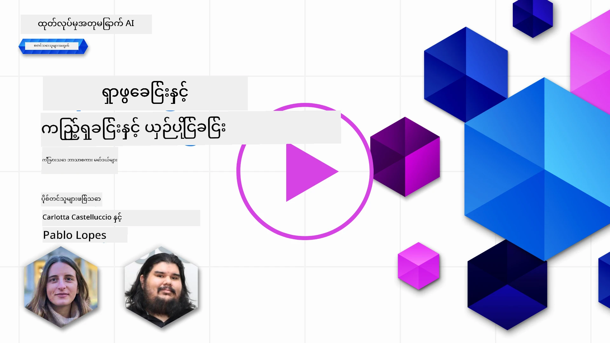](https://youtu.be/KIRUeDKscfI?si=8BHX1zvwzQBn-PlK)

> _ဤသင်ခန်းစာ၏ ဗီဒီယိုကို ကြည့်ရန် ပုံကို နှိပ်ပါ_

ယခင်သင်ခန်းစာတွင် ကျွန်ုပ်တို့တွေ့ရှိခဲ့သလို Generative AI သည် နည်းပညာကဏ္ဍကို မည်သို့ပြောင်းလဲနေသည်၊ Large Language Models (LLMs) များ မည်သို့လုပ်ဆောင်သည်နှင့် ကျွန်ုပ်တို့စတင်တည်ထောင်ထားသော စီးပွားရေးလုပ်ငန်းက မည်သို့အသုံးချနိုင်ပြီး ကြီးထွားနိုင်သည် ဆိုသည်ကို သိရှိနိုင်ခဲ့သည်။ ဤအတွဲအခန်းတွင်ကျွန်ုပ်တို့သည် မတူညီသော အမျိုးအစားကြီးသော ဘာသာစကားမော်ဒယ်များ (LLMs) ကို နှိုင်းယှဉ်ပြီး ၎င်းတို့၏ အားသာချက်နှင့်အားနည်းချက်များကို နားလည်လိုပါသည်။

ကျွန်ုပ်တို့စတင်တည်ထောင်ထားသော လမ်းကြောင်းတွင် နောက်တစ်ဆင့်ကတော့ လက်ရှိ LLM များ၏ အခြေနေကို စူးစမ်းလေ့လာခြင်းနှင့် ကျွန်ုပ်တို့၏ အသုံးအဆောင်အတွက် သင့်တော်သည်ကို နားလည်ခြင်း ဖြစ်ပါသည်။

## နိဒါန်း

ဤသင်ခန်းစာတွင် ဖုံးကွယ်ထားသည့် အကြောင်းအရာများမှာ-

- လက်ရှိ ကဏ္ဍ၌ မတူညီသော LLM များအမျိုးအစားများ။
- Azure တွင် သင့်အသုံးအတွက် မော်ဒယ်များကို စမ်းသပ်ခြင်း၊ ပြန်လည်တိုးတက်အောင်လုပ်ခြင်းနှင့် နှိုင်းယှဉ်ခြင်း။
- LLM တစ်ခုကို မည်သို့ တပ်ဆင်မည်။

## သင်ယူရမည့် ရည်မှန်းချက်များ

ဤသင်ခန်းစာ ပြီးမြောက်ပါက သင်သူသည်-

- သင့်အသုံးအတွက် တသင့်တကာ မော်ဒယ်ကို ရွေးချယ်နိုင်သည်။
- မော်ဒယ်၏ဆောင်ရွက်မှုကို စမ်းသပ်၊ ပြန်လည်ပြင်ဆင်၊ တိုးတက်စေမှုကို နားလည်နိုင်သည်။
- စီးပွားရေးလုပ်ငန်းများ မော်ဒယ်များကို မည်သို့တပ်ဆင်သည်ကို သိရှိနိုင်သည်။

## မတူညီသော LLM များ၏ အမျိုးအစားများကို နားလည်ခြင်း

LLM များသည် ၎င်းတို့၏ စီမံဆောက်လုပ်မှုပုံစံ၊ လေ့ကျင့်ရေးဒေတာနှင့် အသုံးပြုမှုအပေါ်မူတည်၍ အမျိုးအစားပြောင်းလဲနိုင်သည်။ ဤကွဲပြားချက်များကို နားလည်ခြင်းဖြင့် ကျွန်ုပ်တို့၏စတပ်တပ်လုပ်ငန်းအတွက် တိကျသင့်တော်သော မော်ဒယ်ကို ရွေးချယ်နိုင်ပြီး စမ်းသပ်၊ ပြန်လည်တိုးတက်အောင်လုပ်နိုင်မည့် နည်းလမ်းများကို နားလည်နိုင်ပါသည်။

LLM မော်ဒယ်အမျိုးအစား များစွာရှိပြီး သင့်ရွေးချယ်မှုမှာ ဘာအတွက် အသုံးပြုမလဲ၊ သင့်ဒေတာ၊ သင့်စျေးနှုန်းမြင့်တင်ဖို့အသင့်ရှိမှုနှင့် အခြားအကြောင်းအရာများပေါ် မူတည်သည်။

မော်ဒယ်များကို စာသား၊ အသံ၊ ဗီဒီယို၊ ပုံများ ဖန်တီးခြင်းအတွက် ကြည့်မည့်အတွက် မတူညီသော မော်ဒယ်အမျိုးအစားကို ရွေးချယ်မည် ဖြစ်သည်။

- **အသံနှင့် မိန်ကျပ်မှု အသိအမှတ်ပြုခြင်း**။ Whisper စတိုင် မော်ဒယ်များသည် သာမန် အသုံးပြုနိုင်သော မိန်ကျပ်မှု အသိအမှတ်ပြုမော်ဒယ်များဖြစ်သေးသည်၊ သို့သော် ထုတ်လုပ်မှုရွေးချယ်မှုများတွင် `gpt-4o-transcribe`, `gpt-4o-mini-transcribe` နှင့် diarization မျိုးစုံများပါဝင်သည်။ သင့်နယ်ပယ်အတွက် ဘာသာစကားအတွဲအဖွဲ့မှု, diarization, အချိန်နက်ရှိုင်းမှု, နောက်ကျမှုနှင့် ကုန်ကျစရိတ်များကို ဆန်းစစ်ပါ။ သေးစိတ်သိရှိရန် [OpenAI speech-to-text documentation](https://platform.openai.com/docs/guides/speech-to-text?WT.mc_id=academic-105485-koreyst) ကို ကြည့်ပါ။

- **ပုံဖန်တီးခြင်း**။ DALL-E နှင့် Midjourney သည် ကွဲပြားထူးခြားသော ပုံဖန်တီးမှုရွေးချယ်မှုများဖြစ်သော်လည်း လက်ရှိ OpenAI ပုံ API များမှာ `gpt-image-2` ကဲ့သို့သော GPT ပုံ မော်ဒယ်များကို အခြေခံထားသည်။ Stable Diffusion, Imagen, Flux နှင့် အခြားမော်ဒယ် အုပ်စုများလည်း လူသိများသည်။ Prompt ကိုလိုက်နာခြင်း၊ တည်းဖြတ်ပံ့ပိုးမှု၊ စတိုင် ထိန်းချုပ်မှု၊ လုံခြုံရေးလိုအပ်ချက်များနှင့် လိုင်စင်ဆိုင်ရာများကို နှိုင်းယှဉ်ပါ။ အသေးစိတ်ကို [OpenAI image generation guide](https://platform.openai.com/docs/guides/images?WT.mc_id=academic-105485-koreyst) နှင့် သင်ရိုးညွှန်းတမ်းအခန်း ၉ တွင် သင်ယူပါ။

- **စာသား ဖန်တီးခြင်း**။ စာသား မော်ဒယ်များသည် Frontier မော်ဒယ်များ၊ အကြောင်းအရာရှင်းလင်းရေး မော်ဒယ်များ၊ သေးငယ်ပြီး အချိန်နည်းသော မော်ဒယ်များနှင့် ဖွင့်လှစ် အလေးချိန် မော်ဒယ်များ ပါဝင်သည်။ လက်ရှိ ဥပမာများမှာ OpenAI GPT-5.x မော်ဒယ်များ၊ Anthropic Claude 4.x မော်ဒယ်များ၊ Google Gemini 3.x မော်ဒယ်များ၊ Meta Llama 4 မော်ဒယ်များ၊ Mistral မော်ဒယ်များ ဖြစ်သည်။ ထုတ်လုပ်သည့်နေ့၊ စျေးနှုန်းဖြင့်သာ ရွေးချယ်ခြင်းမပြုရ၊ တာဝန်ချပ် ကောင်းမှု၊ နောက်ကျမှု၊ context window, ကိရိယာအသုံးပြုမှု, လုံခြုံရေး ပုံစံ၊ ဒေသဆိုင်ရာရရှိမှုနှင့် စုစုပေါင်းကုန်ကျစရိတ်တို့ကို နှိုင်းယှဉ်စဉ်းစားရန်လိုသည်။ [Microsoft Foundry model catalog](https://ai.azure.com/catalog?WT.mc_id=academic-105485-koreyst) သည် Azure တွင် ရနိုင်သော မော်ဒယ်များကို နှိုင်းယှဉ်ရန် ကောင်းသောနေရာဖြစ်ပါသည်။

- **မျိုးစုံ အမျိုးအစား**။ လက်ရှိ မော်ဒယ်များစွာသည် စာသားထက် မဟုတ်သော အချက်အလက်များကို လက်ခံနိုင်သည်။ အချို့သည် ပုံ၊ အသံ သို့မဟုတ် ဗီဒီယိုကိုလက်ခံနိုင်ပြီး၊ အချို့ကကိရိယာများကိုခေါ်နိုင်သည်။ အထူးပြု မော်ဒယ်များက ပုံ၊ အသံ၊ ဗီဒီယို ဖန်တီးနိုင်သည်။ ဥပမာ၊ လက်ရှိ OpenAI မော်ဒယ်များသည် စာသားနှင့် ပုံများကို ထောက်ပံ့သည်၊ Gemini မော်ဒယ်များသည် မျိုးစုံပုံစံအရ စာသား၊ ကုဒ်, ပုံ၊ အသံနှင့် ဗီဒီယိုများ လက်ခံနိုင်သည်။ Llama 4 Scout နှင့် Maverick သည် open-weight native multimodal မော်ဒယ်များဖြစ်သည်။ ဖွဲ့စည်းလုပ်ဆောင်မှု တည်ဆောက်မည့်အခါ မော်ဒယ်ကတ်ထုတ်ကို ပုံပြင်ထားသော input နှင့် output များအတွက် စစ်ဆေးပါ။

မော်ဒယ်ရွေးချယ်ခြင်းမှာ မူလအခြေခံစွမ်းဆောင်ရည်တချို့ ရရှိမည်ဖြစ်သော်လည်း အဲ့ဒါသာမှာမကပါ။ မကြာခဏ ကုမ္ပဏီအထူးဒေတာများကို LLM ကို ဖြေရမည်ဖြစ်ပြီး ၎င်းကို လုပ်ဆောင်ရန် နည်းလမ်းအမျိုးမျိုးရှိသည်၊ ထိုအကြောင်းများအား လာမည့်အပိုင်းများတွင် ဖေါ်ပြပါမည်။

### Foundation Models နှင့် LLM များ၏ ကွဲပြားချက်

Foundation Model ဆိုသောစကားလုံးကို [Stanford သုတေသနပြုသူများက ဖန်တီးခဲ့သည်](https://arxiv.org/abs/2108.07258?WT.mc_id=academic-105485-koreyst)။ ၎င်းသည် အောက်ပါစံနှုန်းအချို့ကို အတည်ပြုသော AI မော်ဒယ် ဖြစ်သည်။

- **မူတည်ရာမမှန်သည့် သို့မဟုတ် ကိုယ်တိုင်သင်ယူမှုဖြင့် လေ့ကျင့်ထားခြင်း**၊ ဆိုသည်မှာ အမှတ်အသားမတပ် ချထားသော မီဒီယာများဖြင့် သင်ယူပြီး လူ့ အမှတ်အသားတပ်ခြင်း မလိုအပ်ပါ။
- **အလွန်ကြီးမားသော မော်ဒယ်များဖြစ်ခြင်း**၊ ဘီလျံပမာဏရှိသော နည်းကြပ်ကွန်ရက်ပေါ်တွင် သင်ယူထားသည့် မော်ဒယ်ကြီးများဖြစ်သည်။
- **လေ့လာမှုအခြေခံဖြစ်ရန် ရည်ရွယ်ချက်ဖြင့် ဖြစ်ခြင်း**၊ ၎င်းတို့ကို အခြားမော်ဒယ်များ တည်ဆောက်ဖန်တီးရာတွင် အစပြု အဆင့် အဖြစ် အသုံးပြုနိုင်ရန် ဖြစ်သည်။

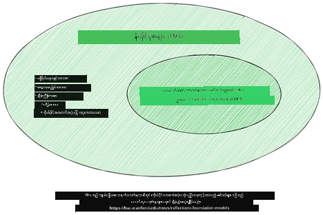

ပုံရင်း: [Essential Guide to Foundation Models and Large Language Models | by Babar M Bhatti | Medium
](https://thebabar.medium.com/essential-guide-to-foundation-models-and-large-language-models-27dab58f7404)

၎င်းကွာခြားချက်ကို ပိုမိုရှင်းလင်းစေရန် သမိုင်းကြောင်းအနေနှင့် ChatGPT ကို ဥပမာယူကြပါစို့။ ChatGPT ၏အစောပိုင်းဗားရှင်းများတွင် GPT-3.5 ကို foundation model အဖြစ်အသုံးပြုခဲ့သည်။ OpenAI သည် စကားပြောဆက်သွယ်ရေးအသုံးပြုမှုအတွက် ရရှိသည့် ဒေတာနှင့် ညှိညွတ်မှုပညာများကို အသုံးပြုပြီး တိုးတက်ကောင်းမွန်သော ဗားရှင်းကို ဖန်တီးခဲ့သည်။ ယနေ့ခေတ် AI ဝန်ဆောင်မှုများသည် မော်ဒယ်အမျိုးမျိုးအကြား လမ်းကြောင်း ဝေးဝေးကွာကွာ သွားလာခြင်းလုပ်တတ်သဖြင့် ဝန်ဆောင်မှုအမည်နှင့် အခြေခံမော်ဒယ်နာမည်သည် မမြဲတမ်းတူညီမည်မဟုတ်။

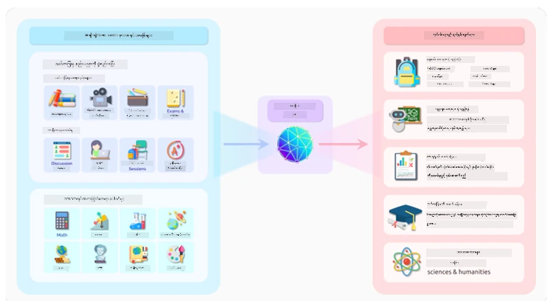

ပုံရင်း: [2108.07258.pdf (arxiv.org)](https://arxiv.org/pdf/2108.07258.pdf?WT.mc_id=academic-105485-koreyst)

### Open-Weight/Open-Source နှင့် Proprietary မော်ဒယ်များ

LLM များကို အခြားနည်းဖြင့် အဖွဲ့ဝင်ထားနိုင်သည်- လူသိများတဲ့ နေရာတွင် open-weight, open-source, သို့မဟုတ် proprietary ဖြစ်ကြောင်း။

Open-source နှင့် open-weight မော်ဒယ်များသည် မော်ဒယ် အချက်အလက်များကို ကြည့်ရှုခြင်း၊ ဒေါင်းလုတ်လုပ်ခြင်း သို့မဟုတ် ကိုယ်စားပြုပြင်ဆင်နိုင်ရန် ဖွင့်ထားပေမယ့် ၎င်းတို့၏လိုင်စင်များ ကွာခြားသည်။ အချို့မှာ တကယ်အပြည့်အစုံစွာ open-source ဖြစ်ပြီး၊ အချို့မှာ အသုံးပြုခြင်းကန့်သတ်ချက်ရှိသည့် open-weight မော်ဒယ်များဖြစ်သည်။ စီးပွားရေးလုပ်ငန်းများအတွက် တပ်ဆင်မှု၊ ဒေတာ တည်နေရာ၊ ကုန်ကျစရိတ်၊ သုံးစွဲသူလိုအပ်ချက်များကို ပိုမိုထိန်းချုပ်လိုသော အခါ၌ အသုံးဝင်သည်။ သို့သော် လိုင်စင် သဘောတူညီချက်များ၊ ဝန်ဆောင်မှု ကုန်ကျစရိတ်၊ မှတ်တမ်းပြုပြင်ထိန်းသိမ်းမှု၊ လုံခြုံရေး အဆင့်မြှင့်တင်ခြင်းနှင့် စောင့်ကြည့်မှု အရည်အသွေးကို ထုတ်လုပ်မှုတွင် အသုံးပြုမှု မပြုမီ စိစစ်ရမည်။ ဥပမာများမှာ [Meta Llama 4](https://ai.meta.com/blog/llama-4-multimodal-intelligence/?WT.mc_id=academic-105485-koreyst), [Mistral models](https://docs.mistral.ai/models/overview?WT.mc_id=academic-105485-koreyst) အချို့ နှင့် [Hugging Face](https://huggingface.co/models?WT.mc_id=academic-105485-koreyst) တွင် တင်ထားသည့် မော်ဒယ်များဖြစ်သည်။

Proprietary မော်ဒယ်များသည် ပိုင်ရှင်နှင့် host လုပ်ဆောင်သူတို့ခေါ်ခံထားသည်။ ထိုမော်ဒယ်များမှာ managed production အသုံးပြုမှုအတွက် အထူးသင့်တော်ပြီး ကောင်းမွန်သော အထောက်အပံ့၊ လုံခြုံရေးစနစ်များ၊ ကိရိယာပေါင်းစပ်ခြင်းနှင့် အသွယ်အထွေ့ စွမ်းဆောင်ရည်ကို ပေးသည်။ သို့သော် ဝယ်ယူသူများသည် မော်ဒယ်အလေးချိန်များကို ကြည့်ရှုခြင်း သို့မဟုတ် ပြင်ဆင်ခြင်း မပြုနိုင်ဘဲ provider သတ်မှတ်ချက်များ၊ ကိုယ်ရေးအချက်အလက်လုံခြုံမှု၊ သိမ်းဆည်းမှု၊ စည်းကမ်းနှင့် တရားဝင်အသုံးပြုမှုကို လေ့လာရမည်။ ဥပမာများမှာ [OpenAI models](https://platform.openai.com/docs/models?WT.mc_id=academic-105485-koreyst), [Google Gemini](https://deepmind.google/models/gemini/pro/?WT.mc_id=academic-105485-koreyst), နှင့် [Anthropic Claude](https://platform.claude.com/docs/en/about-claude/models/overview?WT.mc_id=academic-105485-koreyst) တို့ဖြစ်သည်။

### Embedding နှင့် ပုံဖန်တီးခြင်း၊ စာသားနှင့် ကုဒ်ဖန်တီးခြင်း

LLM များကို ထွက်ရှိသော အကျိုးသက်ရောက်မှုအလိုက်လည်း အုပ်စုခြားနိုင်သည်။

Embeddings ဆိုသည်မှာ စာသားကို နံပါတ်အနေနှင့် ပြောင်းလဲနိုင်သော မော်ဒယ်အုပ်စုဖြစ်သည်။ ဤနံပါတ်ကို embedding ဟုခေါ်ပြီး စာသားအတွင်း ဆက်နွယ်မှုများကို စက်များထက် ကျော်လွန်စွာ နားလည်စေနိုင်ခြင်းဖြစ်သည်။ ထို့အတူ၊ အခြားမော်ဒယ်များတွင် classification သို့မဟုတ် clustering စတိုင် မော်ဒယ်များအဖြစ် သုံးစွဲနိုင်သည်။ Embedding မော်ဒယ်များကို transfer learning အတွက် အသုံးပြုကြသည်။ ဥပမာ သုံးရသည့်တာဝန်အတွက် ဒေတာများ ကြွယ်ဝနိုင်သော surrogate task တစ်ခုအတွက် မော်ဒယ်တည်ဆောက်ပြီး ထို့နောက် embedding များကို အခြားပြီးတ တာဝန်များ အတွက် ထပ်လည်သုံးစွဲသည်။ ဤအမျိုးအစား၏ ဥပမာမှာ [OpenAI embeddings](https://platform.openai.com/docs/models/embeddings?WT.mc_id=academic-105485-koreyst) ဖြစ်သည်။

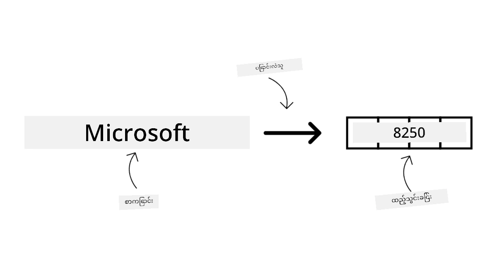

ပုံဖန်တီးမော်ဒယ်များသည် ပုံများကို ဖန်တီးသည်။ ပုံတည်းဖြတ်ခြင်း၊ ပုံပြုစုခြင်းနှင့် ပုံဘာသာပြောင်းခြင်း အတွက် သုံးသည်။ ယင်းတို့ကို ပုံများစွာပါဝင်သော ဒေတာအစုများ၊ ဥပမာ [LAION-5B](https://laion.ai/blog/laion-5b/?WT.mc_id=academic-105485-koreyst) ပေါ်တွင် သင်ယူထားသည်။ ပုံအသစ်များဖန်တီးနိုင်ခြင်း သို့မဟုတ် ပျက်စီးထားသော ပုံများကို inpainting, super-resolution နှင့် colorization နည်းလမ်းများဖြင့် ပြင်ဆင်နိုင်သည်။ ဥပမာများမှာ [GPT Image models](https://platform.openai.com/docs/guides/images?WT.mc_id=academic-105485-koreyst), [Stable Diffusion models](https://github.com/Stability-AI/StableDiffusion?WT.mc_id=academic-105485-koreyst), နှင့် Imagen မော်ဒယ်များဖြစ်သည်။

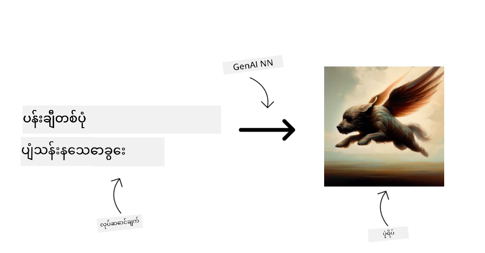

စာသားနှင့် ကုဒ်ဖန်တီးမော်ဒယ်များသည် စာသား သို့မဟုတ် ကုဒ်များဖန်တီးသည်။ စာသားအကျဉ်းချုပ်၊ ဘာသာပြန်ခြင်း၊ မေးခွန်းဖြေခြင်း အတွက် အများအားဖြင့် အသုံးပြုသည်။ စာသားဖန်တီးမော်ဒယ်များကို [BookCorpus](https://www.cv-foundation.org/openaccess/content_iccv_2015/html/Zhu_Aligning_Books_and_ICCV_2015_paper.html?WT.mc_id=academic-105485-koreyst) ကဲ့သို့ စာသား များစွာပါဝင်သော ဒေတာများပေါ်လေ့ကျင့်ထားသည်။ အသစ်သော စာသားတစ်ခုဖန်တီးခြင်း သို့မဟုတ် မေးခွန်းများ ညွှန်ပြရန် အသုံးပြုနိုင်သည်။ ကုဒ်ဖန်တီးမော်ဒယ်များ, ဥပမာ [CodeParrot](https://huggingface.co/codeparrot?WT.mc_id=academic-105485-koreyst)သည် GitHub ကဲ့သို့ ကုဒ်ပြည့်ဝသော ဒေတာများဖြင့် သင်ယူထားပြီး အသစ်သော ကုဒ် ဖန်တီးရန် သို့မဟုတ် ရှိပြီးသားကုဒ်မှ အမှားများကို ပြင်ဆင်ရန် အသုံးပြုသည်။

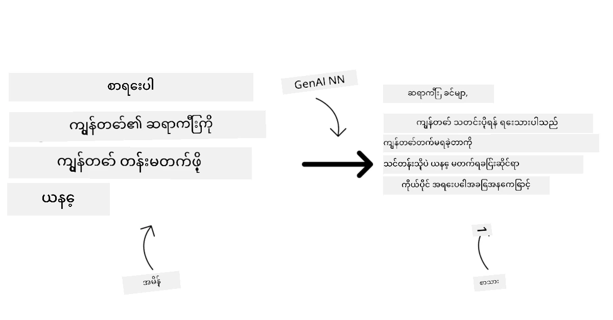

### Encoder-Decoder နှင့် Decoder-only မော်ဒယ်များ

LLM များ၏ မျိုးစုံစီမံဆောက်လုပ်မှုများကို ဖော်ပြသည့်အခါ တူညီသော ပြန်လည်ဆန်းစစ်ချက်ကို အသုံးပြုကြပါစို့။

မင်းများအတွက် မင်းမန်နေဂျာက ကျောင်းသားများအတွက် ဂိမ်းမေးခွန်းရေးရန် တာဝန်ပေးသည်ဟု စဉ်းစားပါ။ မင်းရဲ့ အလုပ်မိတ်ဆွေ နှစ်ဦးရှိသည်။ တစ်ဦးသည် အကြောင်းအရာ ရေးဆွဲဖန်တီးသူ၊ တစ်ဦးသည် ပြန်လည်စစ်ဆေးသူဖြစ်သည်။

အကြောင်းအရာဖန်တီးသူသည် decoder-only မော်ဒယ်ကဲ့သို့ ဖြစ်သည်။ သူသည် ခေါင်းစဉ်ကို ကြည့်၍ သင်လက်ရှိရေးသားထားသောအကြောင်းအရာ အပေါ်မှ အဆက်ခံဖန်တီးမှုများ ပြုလုပ်နိုင်သည်။ သူသည် စိတ်ဝင်စားဖွယ်ကောင်းသော ပြောဆိုချက်များကို အလွန်ကောင်းစွာ ရေးနိုင်သော်လည်း သီးသန့်သတ်မှတ်ခြင်း၊ ရှာဖွေမှု သို့မဟုတ် အချက်အလက် သိုလှောင်ခြင်း တာဝန်များအတွက် အကောင်းဆုံး ရွေးချယ်မှု မဟုတ်သေးောင်း ဥပမာအားဖြင့် GPT နှင့် Llama မော်ဒယ်အုပ်စုများဖြစ်သည်။

ပြန်လည်စစ်ဆေးသူသည် Encoder-only မော်ဒယ်ကဲ့သို့ဖြစ်ပြီး သင်ကြားမှုစာရေးသားမှုနှင့် အဖြေများကို ကြည့်ရှုပြီး ဆက်နွယ်မှုများ နားလည်သည်။ သို့သော် ပြောဆိုမှု မဖန်တီးနိုင်သည့် မော်ဒယ်ဖြစ်သည်။ Encoder-only မော်ဒယ် ဥပမာမှာ BERT ဖြစ်သည်။

ဂိမ်းမေးခွန်းရေးစဉ်းစားသူနှင့် ပြန်လည်စစ်ဆေးသူ တို့နှစ်ဦး လုပ်ဆောင်နိုင်သူကို စိတ်ကူးပါ။ ၎င်းသည် Encoder-Decoder မော်ဒယ်ဖြစ်သည်။ ဥပမာ အနေနှင့် BART နှင့် T5 မော်ဒယ်များ ပါဝင်သည်။

### ဝန်ဆောင်မှုနှင့် မော်ဒယ်

ယခု,ဝန်ဆောင်မှုနဲ့ မော်ဒယ် ကွာခြားချက်ကို စကားပြောကြစို့။ ဝန်ဆောင်မှုလိုက်သော Cloud Service Provider မှ ပစ္စည်းတစ်ခုဖြစ်ပြီး မော်ဒယ်များ၊ ဒေတာနှင့် အခြားအစိတ်အပိုင်းများ ပေါင်းစပ်ထားသည်။ မော်ဒယ်မှာ ဝန်ဆောင်မှု၏ အဓိက အစိတ်အပိုင်း ဖြစ်ပြီး foundation model တစ်ခု ဖြစ်နိုင်သည်။

ဝန်ဆောင်မှုများသည် ထုတ်လုပ်မှုအသုံးပြုမှုအတွက် အက်မိနေပြီး မော်ဒယ်များထက် ပိုမိုအသုံးပြုရလွယ်ကူသည်၊ ဥပမာ ဂရပ်ဖစ် အသုံးပြုသူ အင်တာဖေ့စ် (GUI) ဖြင့် အသုံးပြုနိုင်သည်။ သိုသော် ဝန်ဆောင်မှုများအားလုံးက လွတ်လပ်စွာမရရှိနိုင်သလို အသုံးဖြတ်ရန် subscription သို့မဟုတ် ငွေပေးချေမှု လိုအပ်နိုင်သည်။ ဥပမာ, [Azure OpenAI Service](https://learn.microsoft.com/azure/ai-foundry/openai/overview?WT.mc_id=academic-105485-koreyst) သည် pay-as-you-go အကြီးစားရေးစနစ်ကို သတ်မှတ်ထားသည်၊ သုံးစွဲသူများသည် ဝန်ဆောင်မှုကို မည်မျှအသုံးပြုသည်နှုန်း အတိုင်း ကြေးပေးရသည်။ Azure OpenAI Service သည် ကုမ္ပဏီအဆင့် လုံခြုံမှုနှင့် မော်ဒယ်စွမ်းဆောင်မှုများအပေါ် တာဝန်ယူသော AI စနစ်ကိုလည်း ပံ့ပိုးပေးသည်။

မော်ဒယ်များသည် နေရပ်နဲ့ ဆက်စပ်သော စနစ်အကြောင်း လေ့လာကြည့်ရမည့် neural network အထူးအချက်အလက်များ (parameters, weights, architecture, tokenizer, configuration) ဖြစ်သည်။ မော်ဒယ်ကို ကွန်ပျူတာပေါ်တွင် ဒေသတွင်းသို့မဟုတ် သီးသန့် ပတ်ဝန်းကျင်တွင် ပြေးရန်သည် သင့်တော်သော hardware, ဝန်ဆောင်မှု အခြေခံပိုင်း၊ မော်နီတာရေး တို့လိုအပ်ပြီး open-source/open-weight လိုင်စင်သို့မဟုတ် စီးပွားရေးလိုင်စင်ကို လိုအပ်ပါသည်။ Llama 4 သို့မဟုတ် Mistral မော်ဒယ်များကဲ့သို့ open-weight မော်ဒယ်များကို ကိုယ်တိုင် host လုပ်နိုင်သော်လည်း ကွန်ပျူတာစွမ်းအားနှင့် စစ်မှန်သော စီမံခန့်ခွဲမှု ကျွမ်းကျင်မှုလိုအပ်သေးသည်။

## Azure တွင် မတူညီသော မော်ဒယ်များဖြင့် စမ်းသပ်၍ စိတ်ကြိုက်ပြန်လည်သုံးသပ်ခြင်း၊ စွမ်းဆောင်ရည်နားလည်ခြင်းနည်းလမ်းများ

ကျွန်တော်တို့အဖွဲ့က လက်ရှိ LLMs နယ်ပယ်ကို ရှာဖွေတွေ့ရှိပြီး သူတို့ရဲ့အခြေအနေတွေအတွက် သင့်တော်တဲ့ခန့်မှန်းချက်များကို ရှာဖွေလိုက်တဲ့နောက်၊ နောက်တစ်ဆင့်မှာ သူတို့ရဲ့ဒေတာနဲ့ အလုပ်တင်ဆောင်မှုမှာ စမ်းသပ်ကြည့်ခြင်းဖြစ်ပါတယ်။ ဒါကတော့ တုန့်ပြန်မှုနဲ့ တိုင်းတာမှုများဖြင့် လည်ပတ်သည့် iteration ဖြစ်ပါတယ်။
ကျွန်တော်တို့ မပြောခဲ့သော ပုံစံများအများစု (OpenAI ပုံစံများ၊ Llama 4 နဲ့ Mistral ကဲ့သို့သော open-weight ပုံစံများ၊ Hugging Face ပုံစံများ) ကို [Microsoft Foundry Models](https://learn.microsoft.com/azure/foundry/concepts/foundry-models-overview?WT.mc_id=academic-105485-koreyst) တွင် ရရှိနိုင်ပါတယ်။

[Microsoft Foundry](https://learn.microsoft.com/azure/foundry/what-is-foundry?WT.mc_id=academic-105485-koreyst) သည် ယခင်က Azure AI Studio/Azure AI Foundry ဟုခေါ်ပြီး၊ AI အပလီကေးရှင်းများနှင့် အေးဂျင့်များ တည်ဆောက်ရန်အတွက် စုပေါင်းထားသော Azure ပလက်ဖောင်းတစ်ခုဖြစ်သည်။ ထုတ်လုပ်သူများအနေဖြင့် စမ်းသပ်မှုနှင့် သုံးသပ်မှုမှ စ၍ တပ်ဆင်ခြင်း၊ ကြည့်ရှုခြင်းနှင့် အုပ်ချုပ်မှုများထိန်းချုပ်ရန် ကူညီပေးသည်။ Microsoft Foundry အတွင်း မော်ဒယ် ကတ်တလော့သည် အသုံးပြုသူများအား

- Azure ဖြင့်ရောင်းချသော မော်ဒယ်များနှင့် မိတ်ဖက်များနှင့် လူထုပံ့ပိုးသူများမှ မော်ဒယ်များပါဝင်သည့် စာရင်းထဲမှ စိတ်ဝင်စားသော အခြေခံမော်ဒယ်များကို ရှာဖွေနိုင်သည်။ အသုံးပြုသူများသည် အလုပ်တာဝန်၊ ပံ့ပိုးသူ၊ လိုင်စင်၊ တပ်ဆင်မှုရွေးစရာ သို့မဟုတ် နာမည်အလိုက် စစ်တမ်းထုတ်နိုင်သည်။

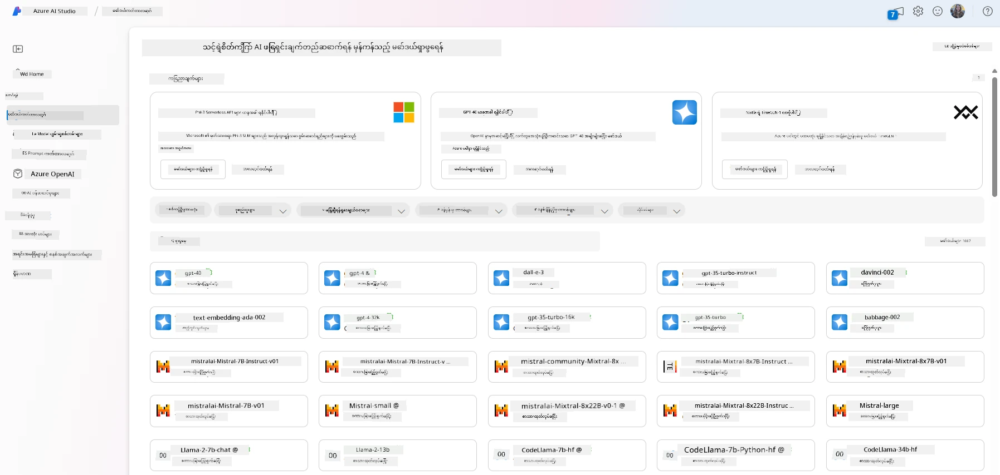

- ရည်ရွယ်ချက်အသုံးပြုမှုနှင့် သင်ကြားမှုဒေတာ အသေးစိတ်ဖော်ပြချက်၊ ကုဒ်နမူနာများနှင့် အတွင်းစဉ် သုံးသပ်ချက်စာကြည့်တိုက်ပေါ်လစီလက်မှတ်များပါဝင်သည့် မော်ဒယ်ကတ်ကို သုံးသပ်နိုင်သည်။

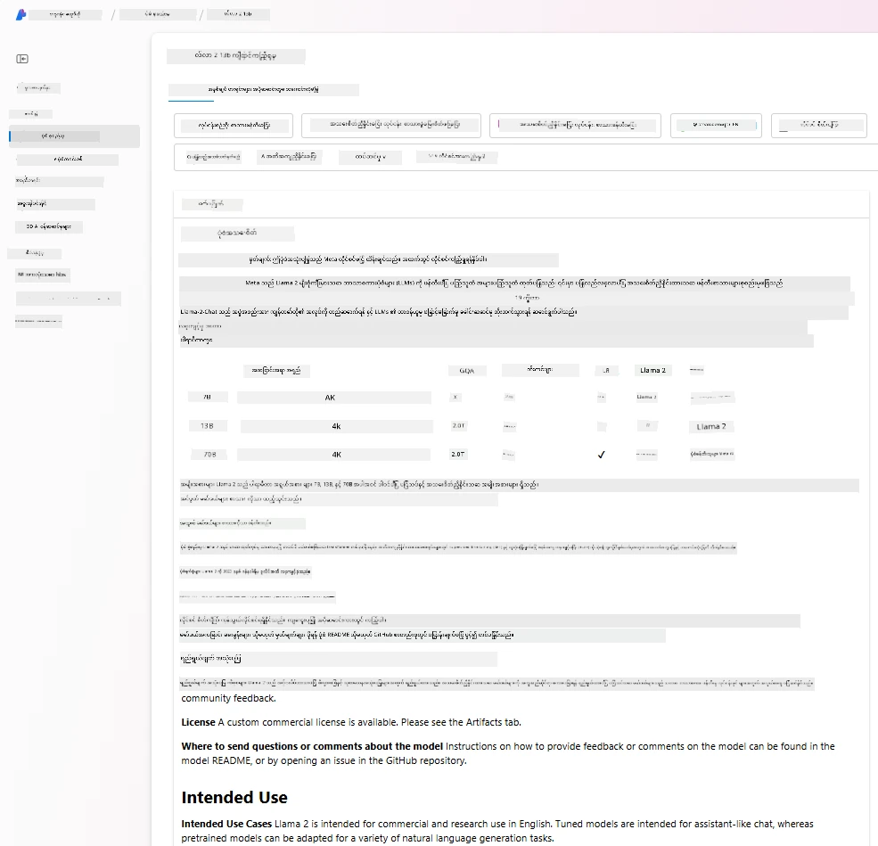

- စက်မှုလုပ်ငန်းတွင် ရရှိနိုင်သော မော်ဒယ်များနှင့် ဒေတာပုဂ္ဂိုလ်များကို နှိုင်းယှဉ်သုံးသပ်ကာ ဘယ်ဟာဟာ စီးပွားရေးအခြေအနေနှင့် ကိုက်ညီမလဲဆိုတာ [Model Benchmarks](https://learn.microsoft.com/azure/ai-foundry/concepts/model-benchmarks?WT.mc_id=academic-105485-koreyst) ပန်း နဲ့ ကြည့်ရှုနိုင်ပါသည်။

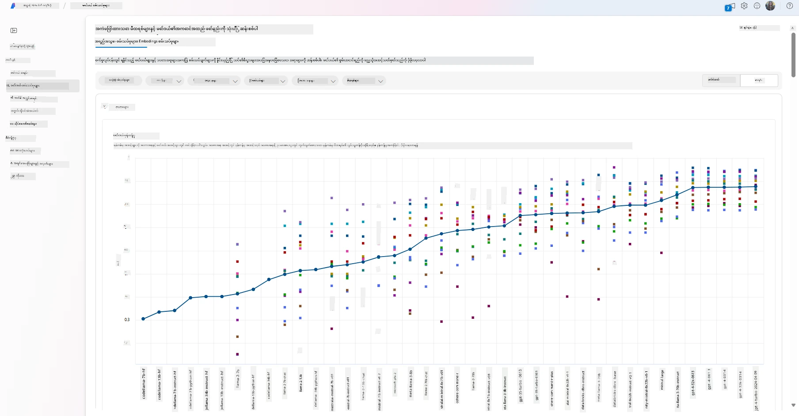

- Microsoft Foundry ၏ စမ်းသပ်မှုနှင့် ခြေရာခံမှု လုပ်ဆောင်နိုင်မှုများကိုအသုံးပြုပြီး စိတ်ကြိုက် သင်ကြားဒေတာများဖြင့် မော်ဒယ်များကို မှန်ကန်မှုတိုးတက်စေရန် အထောက်အကူပြု Fine-tune လုပ်နိုင်သည်။

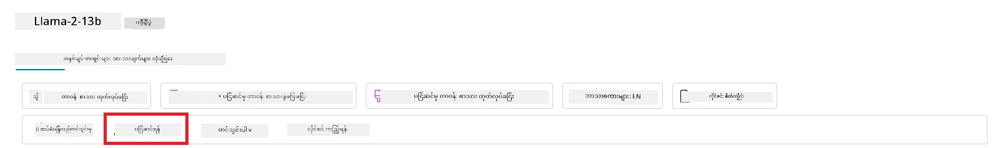

- မူလ Pre-trained မော်ဒယ် သို့မဟုတ် Fine-tuned မော်ဒယ်ကို အဝေးမှ မှန်ကန်စွာ အချိန်နှင့်တပြိုင်နက် ကောက်ချက်ချနိုင်သည့် inference endpoint သို့ မန္နေဂျ်ထားသော ကွန်ပျူတာ သို့မဟုတ် serverless တပ်ဆင်မှုရွေးစရာများဖြင့် တပ်ဆင်၍ အပလီကေးရှင်းများအတွက် အသုံးပြုနိုင်ပါသည်။

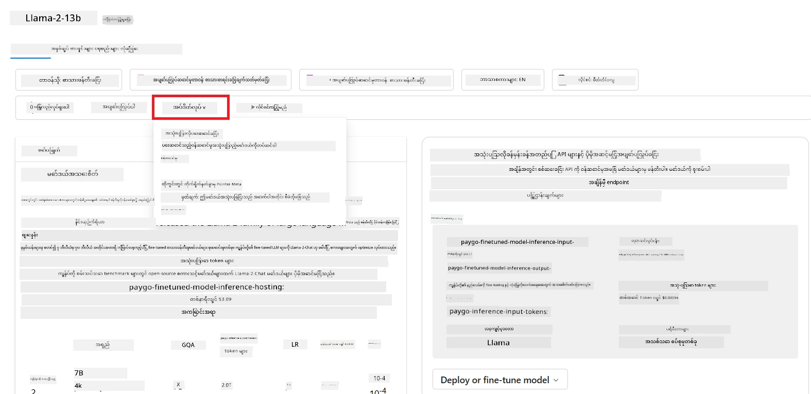

> [!NOTE]
> စာရင်းအတွင်းရှိ မော်ဒယ်အားလုံးကို မဆို Fine-tuning နှင့်/သို့မဟုတ် pay-as-you-go တပ်ဆင်မှုအတွက် လက်ရှိမှာ ရနိုင်သော မဟုတ်ပါ။ မော်ဒယ်၏ လက္ခဏာများနှင့် ကန့်သတ်ချက်များကို ကြည့်ရှုရန် မော်ဒယ်ကတ်ကို စစ်ဆေးပါ။

## LLM ရလဒ်များ တိုးတက်ကောင်းမွန်စေရေး

ကျွန်တော်တို့ စတင်လုပ်ကိုင်နေသော အဖွဲ့နှင့် အတူ LLM မျိုးစုံနှင့် Cloud ပလက်ဖောင်း (Microsoft Foundry) ကို ရှာဖွေပြီး မော်ဒယ်မျိုးစုံကို နှိုင်းယှဉ်၊ စမ်းသပ်ပြီး ဆောင်ရွက်မှု တိုးတက်စေနိုင်သည့် နည်းလမ်းများကို ရှာဖွေပေးနိုင်သော Endpoints တွင် တပ်ဆင် နိုင်သည်။

ဒါပေမယ့် ပြုလုပ်ပြီးဖြစ်သော မော်ဒယ်တစ်ခုကို အသုံးပြုခြင်းထက် Fine-tune လုပ်ခြင်းကို ဘယ်အချိန်တွင် စဉ်းစားသင့်သလဲ? သီးသန့် အလုပ်တာဝန်များအတွက် မော်ဒယ်တိုးတက်ရေးအတွက် အခြားနည်းလမ်းတွေအောင်လားရှိမလား?

စီးပွားရေးတစ်ခုက LLM မှ လိုအပ်သည့် ရလဒ်ရရှိရန် အသုံးပြုနိုင်သည့် နည်းလမ်းအနည်းငယ်ရှိသည်။ LLM ကို ထုတ်လုပ်မှု၌ ရွေးချယ်ဖြန့်ချိရာတွင် သင့်တော်သော သင်ကြားမှု အဆင့်များ၊ စိတ်ကြိုက်ပုံစံများ၊ မှန်ကန်မှု၊ ကုန်ကျစရိတ်နဲ့ အရည်အသွေးအဆင့်စုံပေါင်းပြီး မတူကွဲပြားသည့် နည်းလမ်းများကို ရွေးချယ်နိုင်သည်။ နည်းလမ်းအချို့မှာ အောက်ပါအတိုင်းဖြစ်သည်-

- **Context ဖြင့် Prompt engineering**။ ပြုံးတစ်ကြိမ်တွင် လိုအပ်သော စာသားရလဒ်ရရှိစေရန် Context ကို လုံလောက်စွာ ပံ့ပိုးပေးခြင်း။

- **Retrieval Augmented Generation, RAG**။ သင်၏ ဒေတာသည် ရွေးချယ်ထားသော ဒေတာဘေ့စ် သို့မဟုတ် ဝဘ်အင်တာဖေ့စ်တွင် တည်ရှိနိုင်သောကြောင့်၊ အဆိုပါဒေတာ သို့မဟုတ် ဒေတာခွဲတစ်ချို့ကို Prompt ရစဉ် တွဲဖက်တင်ရန်ရေးဆွဲခြင်းဖြင့် အသုံးပြုသူ၏ Prompt အစိတ်အပိုင်း တစ်ခုအဖြစ် ထည့်သွင်းနိုင်သည်။

- **Fine-tuned မော်ဒယ်**။ ဒီနေရာမှာ သင့်ဒေတာစီးရီးနှင့် မော်ဒယ်ကို နောက်ထပ် သင်ကြားပေးလိုက်သောကြောင့် မော်ဒယ်သည် ပိုမိုတိကျကောင်းမွန်စေပြီး သင့်လိုအပ်ချက်များနှင့် ဖြေကြားမှုများ ပိုမိုကိုက်ညီသော်လည်း ကုန်ကျစရိတ်အနည်းငယ် အများကြီး ဖြစ်နိုင်ပါသည်။

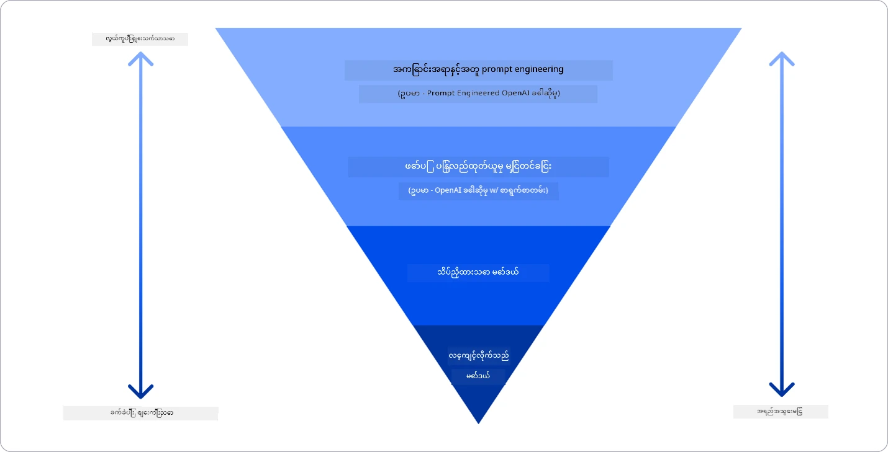

ရုပ်ပုံရင်းမြစ် - [Four Ways that Enterprises Deploy LLMs | Fiddler AI Blog](https://www.fiddler.ai/blog/four-ways-that-enterprises-deploy-llms?WT.mc_id=academic-105485-koreyst)

### Context ဖြင့် Prompt Engineering

Pre-trained LLM များသည် ပုဂ္ဂိုလ်ရေးဘာသာစကားလုပ်ငန်းများတွင် တော်တော်ကောင်းမွန်ပြီး၊ တစ်ကြောင်းတည်းစာလုံးခုံသို့မဟုတ် မေးခွန်းတစ်ခုတည်းကို ဖြည့်ဆည်းရန် ခေါ်ယူခြင်းဖြင့် "zero-shot" သင်ယူမှုအဖြစ် အလုပ်လုပ်သည်။

သို့သော် အသုံးပြုသူသည် သူ့မေးခွန်းကို အသေးစိတ်တောင်းဆိုမှုနှင့် နမူနာများဖြင့် ပိုမိုသတ်မှတ်ရည့် Context ပိုမိုထည့်သွင်းလျှင်၊ ဖြေဆိုချက်မှာ ပိုတိကျပြီး အသုံးပြုသူ မျှော်မှန်းချက်နီးစပ်သလောက် ဖြစ်လာပါသည်။ ဤအတွက် "one-shot" သင်ယူမှုဟု ခေါ်သည့်အခါမှာ ရှေ့ပြတက်ထားသော prompt တွင် နမူနာတစ်ခုသာ ပါဝင်ပါကဖြစ်ပြီး၊ ကျော်ပြောပါက "few shot learning" ဟု သိကြသည်။
Context ဖြင့် prompt engineering သည် အလျင်အမြန် တိုးတက်မှုရရှိစေသော အကျိုးမြတ်ဆုံး နည်းလမ်းဖြစ်သည်။

### Retrieval Augmented Generation (RAG)

LLM များတွင် သူတို့၏ သင်ကြားမှုအချိန်ကာလ တုန်းက အသုံးပြုခဲ့သော ဒေတာများအပေါ်မှသာ ဖြေဆိုနိုင်ခြင်းက အကန့်အသတ်ရှိသည်။ ထို့ကြောင့် သင်ကြားမှုပြီးဆုံးပြီးနောက် ဖြစ်ပွားသော အချက်အလက်များကို မသိကြပေ၊ ရုံးပိုင်သီးသန့်သတင်းအချက်အလက်များကို သိရှိခွင့်မရှိပါ (ကုမ္ပဏီဒေတာကဲ့သို့)။
ဤကိစ္စကို RAG နည်းပညာဖြင့် ဖြေရှင်းနိုင်ပြီး ယင်းသည် မိုက်ခရိုစော့ဖ် Vector database tools (ဥပမာ [Azure Vector Search](https://learn.microsoft.com/azure/search/vector-search-overview?WT.mc_id=academic-105485-koreyst)) အသုံးပြုကာ အရေးကြီးသောစာရွက်စာတမ်း အပိုင်းများကို prompt ဖော်ပြချက်၏ အတွင်းအချက်အလက် အဖြစ် ထည့်သွင်းရန်ရည်ရွယ်သည်။

ဤနည်းပညာသည် စီးပွားရေးတစ်ခုအတွက် ဒေတာလုံလောက်မှုမရှိခြင်း၊ အချိန်မလုံလောက်ခြင်း ၊ သို့မဟုတ် ရင်းမြစ်မလုံလောက်ခြင်းဖြင့် LLM တွင် Fine-tuning မပြုလုပ်နိုင်သော်လည်း သီးသန့်အလုပ်ထမ်းမှုတွင် အရည်အသွေးတိုးတက်မှုရစေရန်၊ ဖြစ်နိုင်သော ပုံမှန်မှန်မဟုတ်ချက်များ၊ ဟောင်းရေမှုများ သို့မဟုတ် ပံ့ပိုးမရသောအဖြေများကို လျှော့ချနိုင်ရန် အလွန် အထောက်အကူဖြစ်ပါသည်။

### Fine-tuned မော်ဒယ်

Fine-tuning သည် transfer learning ကို အသုံးပြု၍ မော်ဒယ်အား downstream အလုပ်တာဝန်တစ်ခုသို့မဟုတ် သီးသန့်ပြဿနာကို ဖြေရှင်းရန် ‘အလိုက်ဖက်’ ဖြစ်အောင် လုပ်ဆောင်ခြင်းဖြစ်သည်။ few-shot learning နှင့် RAG မှ မတူဘဲ အသစ်တစ်ခုပုံစံ မော်ဒယ်ကိုဖန်တီးပြီး အလေးချိန်များနဲ့ bias များကို ပြင်ဆင်နေသည်။ သင်ကြားမှုနမူနာအစုတစ်ခု ပါဝင်ရန် လိုအပ်ပြီး၊ မူလ input (prompt) နှင့် သက်ဆိုင် output (completion) ပါရှိသည်။
ထိုနည်းလမ်းကို အသုံးပြုသင့်ကိစ္စမှာ -

- **မူလရှည်ကြီးမဟုတ်သော သီးသန့် အလုပ်တာဝန်မော်ဒယ်များကို အသုံးပြုခြင်း**။ စီးပွားရေးက ပိုမိုများပြားသော Frontier မော်ဒယ်ကို ထပ်တလဲလဲ Prompt မထည့်ပဲ နည်းနည်းအသေးစားသော မော်ဒယ်ကို Fine-tune လုပ်လိုခြင်းဖြင့် ပိုမိုတန်ဖိုးရှိပြီး မြန်ဆန်သောဖြေရှင်းချက်ရရန်။

- **နောက်ကျချိန် (latency) ကို စဉ်းစားခြင်း**။ အသုံးပြုမှုနှင့် ကိုက်ညီသော latency အထူးကောင်းမှုရှိသောကြောင့် အလွန်ရှည်လျားသော prompt မသုံးနိုင်ခြင်း သို့မဟုတ် မော်ဒယ်သင်ယူရန် လိုအပ်တဲ့နမူနာအရေအတွက်သည် prompt ကန့်သတ်ချက် လက္ခဏာနှင့် ကိုက်ညီမှု မရှိခြင်း။

- **တည်ငြိမ်သော အပြုအမူကို ဖြန့်ချိခြင်း**။ စီးပွားရေးမှာ အရည်အသွေးမြင့် နမူနာများစွာရှိပြီး မော်ဒယ်ကို အလုပ်အစီအစဉ်၊ အထွက်ပုံစံ၊ အသံထွက် (tone), သို့မဟုတ် သီးသန့် ဒိုမိတ် စတိုင်အတိုင်း သေချာနီတိအောင် လိုလားသည်။ အဓိကပြဿနာဟာ နယူး Facts သို့မဟုတ် မူပိုင် စိတ်ပိုင်းဆိုင်ရာ သတင်းအချက်အလက်များ မှာ အပြောင်းအလဲများရှိပါက Fine-tuning အစား RAG ကို အသုံးပြုရန် လမ်းညွှန်သည်။

### သင်ကြားထားသော မော်ဒယ်

LLM ကို စတင်သင်ကြားခြင်းမှာ အမှန်တကယ်အခက်အခဲဆုံးနှင့် အဆင့်မြင့်ဆုံးနည်းလမ်းဖြစ်ပြီး များပြားသော ဒေတာ၊ ကျွမ်းကျင်သူများနှင့် သင့်တော်သော ကွန်ပျူတာ ထောက်ပံ့မှုများလိုအပ်သည်။ ဒီေနရာမှာတော့ စီးပွားရေးတစ်ခုမှာ သီးသန့် ဒိုမိန်း အသုံးပြုမှုရှိပြီး ဒိုမိန်းစင်တာဒေတာ စုစုပေါင်း ကြီးမားသောအခြေအနေတွင်သာ စဉ်းစားသင့်သည်။

## ဘာလဲ သေချာ စစ်ဆေးခြင်း

LLM အပြီးဆုံးဖြစ်ရလဒ် တိုးတက်ကောင်းမွန်ရန် ကောင်းမွန်တဲ့နည်းလမ်းဘာတွေရှိပါသလဲ?

1. Context ဖြင့် Prompt engineering
1. RAG
1. Fine-tuned မော်ဒယ်

A: တို့သုံးခုပဲ ကူညီပါမည်။ အမြန်တိုးတက်မှုများအတွက် Context ဖြင့် prompt engineering ဖြင့် စတင်ပြီး၊ မော်ဒယ်တွင် လက်ရှိအချက်အလက်များ သို့မဟုတ် ကိုယ်ပိုင်စီးပွားရေး ဒေတာလိုအပ်လျှင် RAG ကို အသုံးပြုပါ။ ပုံမှန် မလုပ်ရသေးသော နမူနာအရေအတွက်များရှိပြီး မော်ဒယ်အားအလုပ်စဉ်၊ ပုံစံ၊ အသံနှင့် ဒိုမိန်းပုံစံများကို အမြဲလိုက်နာစေလိုပါက fine-tuning ကို ရွေးချယ်ပါ။

## 🚀 စိန်ခေါ်မှု

သင်၏ စီးပွားရေးအတွက် RAG ကို [အသုံးပြုနည်း](https://learn.microsoft.com/azure/search/retrieval-augmented-generation-overview?WT.mc_id=academic-105485-koreyst) ပိုမိုလေ့လာဖတ်ရှုပါ။

## အထူးပါးပါး၊ သင်ယူမှု စဉ်ဆက်

ဒီသင်ခန်းစာကို ပြီးမြောက်ပြီးနောက် ကျွန်တော်တို့ရဲ့ [Generative AI Learning collection](https://aka.ms/genai-collection?WT.mc_id=academic-105485-koreyst) ကို ကြည့်ရှုပြီး Generative AI ရဲ့ အသိပညာကို ပိုမိုမြင့်မားလာအောင် ဆက်လက် သင်ယူလိုက်ပါ။

တတိယသင်ခန်းစာသို့ သွားရောက်ပြီး [တာဝန်ယူ၍ Generative AI ကို တည်ဆောက်နည်း](../03-using-generative-ai-responsibly/README.md?WT.mc_id=academic-105485-koreyst) ကို ကြည့်ရှုပါ။

---

<!-- CO-OP TRANSLATOR DISCLAIMER START -->
**ပြောကြားချက်**
ဤစာတမ်းကို AI ဘာသာပြန်ဝန်ဆောင်မှု [Co-op Translator](https://github.com/Azure/co-op-translator) အသုံးပြု၍ ဘာသာပြန်ထားပါသည်။ ကျွန်ုပ်တို့သည် တိကျမှန်ကန်မှုအတွက် ကြိုးပမ်းနေသော်လည်း၊ စက်ကိရိယာဘာသာပြန်ခြင်းများတွင် အမှားများ သို့မဟုတ် မှားယွင်းချက်များ ပါဝင်နိုင်ကြောင်း သတိပြုပါရန် လိုအပ်ပါသည်။ မူလစာတမ်းကို မူရင်းဘာသာဖြင့်သာ ယုံကြည်စိတ်ချရသော အချက်အလက်အဖြစ် သတ်မှတ်သင့်သည်။ အရေးကြီးသည့် သတင်းအချက်အလက်များအတွက် ပရော်ဖက်ရှင်နယ် လူသားဘာသာပြန်သူဝန်ဆောင်မှုကို အကြံပြုပါသည်။ ဤဘာသာပြန်ချက်ကို အသုံးပြုခြင်းမှ ဖြစ်ပေါ်လာသော နားလည်မှုကွာခြားမှုများ သို့မဟုတ် မမှန်ကန်သော အသုံးပြုမှုများအတွက် ကျွန်ုပ်တို့ တာဝန်မခံပါ။
<!-- CO-OP TRANSLATOR DISCLAIMER END -->