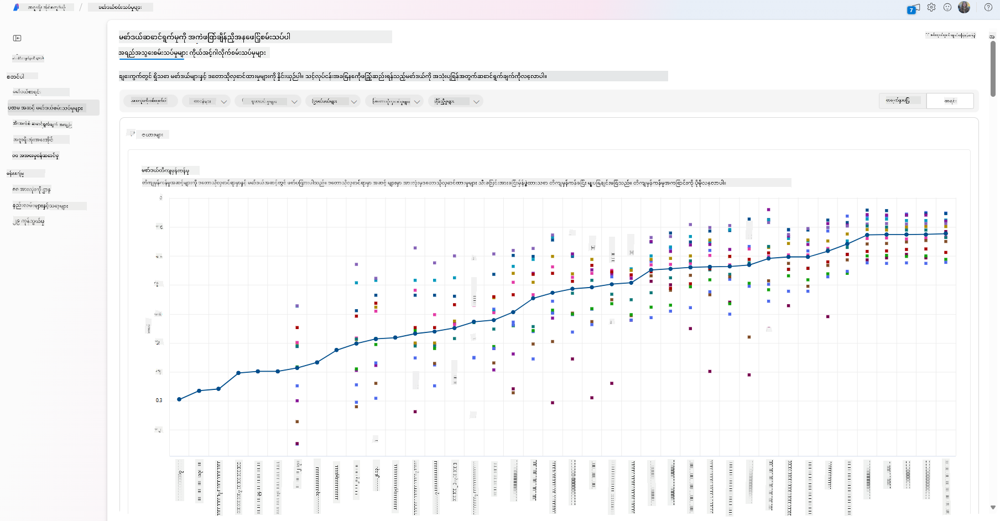
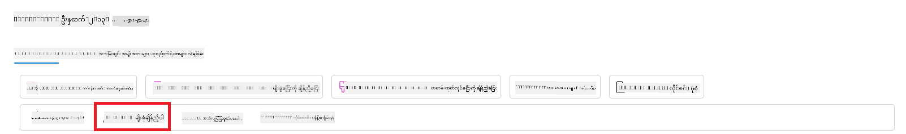
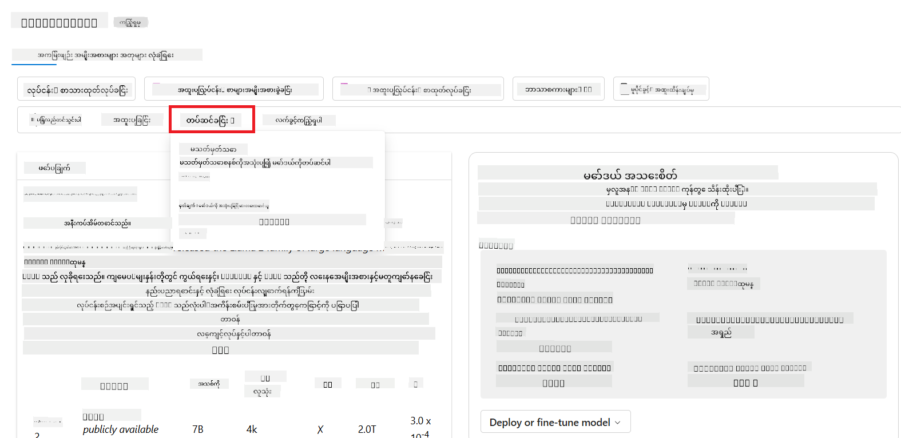
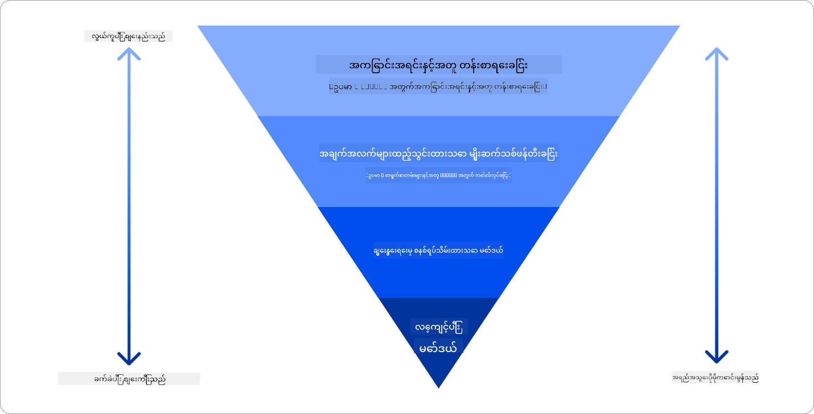

<!--
CO_OP_TRANSLATOR_METADATA:
{
  "original_hash": "e2f686f2eb794941761252ac5e8e090b",
  "translation_date": "2025-06-25T11:07:08+00:00",
  "source_file": "02-exploring-and-comparing-different-llms/README.md",
  "language_code": "my"
}
-->
# LLM မျိုးစုံကို လေ့လာခြင်းနှင့် နှိုင်းယှဉ်ခြင်း

> _ဒီသင်ခန်းစာရဲ့ ဗီဒီယိုကို ကြည့်ရန် အထက်ပါပုံကို နှိပ်ပါ_

ယခင်သင်ခန်းစာတွင် Generative AI က နည်းပညာလောကကို မည်သို့ပြောင်းလဲနေသည်၊ LLM များ မည်သို့ အလုပ်လုပ်သည်၊ နှင့် စတင်လုပ်ငန်းတစ်ခုက မည်သို့ အသုံးချနိုင်ပြီး ကြီးထွားစေနိုင်သည်ကို မြင်ရပါပြီ။ ဒီအခန်းမှာတော့ LLM မျိုးစုံကို နှိုင်းယှဉ်ပြီး အားသာချက်၊ အားနည်းချက်တွေကို နားလည်ဖို့ ကြိုးစားမှာဖြစ်ပါတယ်။

ကျွန်ုပ်တို့၏ စတင်လုပ်ငန်း၏ နောက်တစ်ဆင့်မှာ လက်ရှိ LLM များ၏ လောကကို လေ့လာပြီး ကျွန်ုပ်တို့၏ အသုံးပြုမှုအတွက် သင့်လျော်သည်များကို နားလည်ခြင်းဖြစ်သည်။

## အကြမ်းဖျဉ်း

ဒီသင်ခန်းစာမှာ အောက်ပါအကြောင်းအရာများ ပါဝင်ပါမည် -

- လက်ရှိ LLM မျိုးစုံ
- Azure တွင် သင့် အသုံးပြုမှုအတွက် မော်ဒယ်များကို စမ်းသပ်ခြင်း၊ ထပ်မံပြုပြင်ခြင်းနှင့် နှိုင်းယှဉ်ခြင်း
- LLM တစ်ခုကို မည်သို့ ဖြန့်ဝေရမည်

## သင်ယူရည်မှန်းချက်များ

ဒီသင်ခန်းစာပြီးဆုံးသောအခါ သင်သည် -

- သင့် အသုံးပြုမှုအတွက် မော်ဒယ်ကို ရွေးချယ်နိုင်မည်
- မော်ဒယ်၏ စွမ်းဆောင်ရည်ကို စမ်းသပ်ခြင်း၊ ပြုပြင်ခြင်းနှင့် တိုးတက်အောင် ပြုလုပ်နည်းကို နားလည်နိုင်မည်
- လုပ်ငန်းများသည် မော်ဒယ်များကို မည်သို့ ဖြန့်ဝေရန်သိရှိနိုင်မည်

## LLM မျိုးစုံကို နားလည်ပါ

LLM များကို၎င်းတို့၏ ဗိသုကာ၊ လေ့ကျင့်ရေးဒေတာနှင့် အသုံးပြုမှုအပေါ် မူတည်၍ အမျိုးအစားများစွာခွဲခြားနိုင်သည်။ ဤကွာခြားချက်များကို နားလည်ခြင်းက ကျွန်ုပ်တို့၏ စတင်လုပ်ငန်းအတွက် သင့်လျော်သော မော်ဒယ်ကို ရွေးချယ်နိုင်ရန်နှင့် စွမ်းဆောင်ရည်ကို စမ်းသပ်ခြင်း၊ ပြုပြင်ခြင်းနှင့် တိုးတက်အောင် ပြုလုပ်နိုင်ရန် ကူညီပါမည်။

LLM မော်ဒယ်အမျိုးမျိုးရှိပြီး သင့် ရည်ရွယ်ချက်၊ ဒေတာ၊ ပေးချင်သောစျေးနှုန်းနှင့် အခြားအရာများအပေါ် မူတည်၍ မော်ဒယ်ကို ရွေးချယ်ရပါမည်။

မော်ဒယ်များကို စာသား၊ အသံ၊ ဗီဒီယို၊ ပုံစံထုတ်လုပ်မှု အတွက် အသုံးပြုရန် ရည်ရွယ်ပါက မော်ဒယ်အမျိုးအစား မတူနိုင်ပါသည်။

- **အသံနှင့် စကားပြောအသိအမှတ်ပြုခြင်း**။ ဒီရည်ရွယ်ချက်အတွက် Whisper-type မော်ဒယ်များသည် စကားပြောအသိအမှတ်ပြုခြင်းအတွက် အထူးသင့်လျော်သည်။ [Whisper မော်ဒယ်များအကြောင်း အပြည့်အစုံကို ဒီမှာလေ့လာပါ](https://platform.openai.com/docs/models/whisper?WT.mc_id=academic-105485-koreyst)။

- **ပုံထုတ်လုပ်ခြင်း**။ ပုံထုတ်လုပ်ခြင်းအတွက် DALL-E နှင့် Midjourney တို့သည် နာမည်ကြီးရွေးချယ်မှုနှစ်ခုဖြစ်သည်။ [DALL-E အကြောင်း အပြည့်အစုံကို ဒီမှာဖတ်ပါ](https://platform.openai.com/docs/models/dall-e?WT.mc_id=academic-105485-koreyst)။

- **စာသားထုတ်လုပ်ခြင်း**။ မော်ဒယ်များအများစုသည် စာသားထုတ်လုပ်ခြင်းအတွက် လေ့ကျင့်ထားပြီး GPT-3.5 မှ GPT-4 အထိ ရွေးချယ်မှုအများကြီးရှိသည်။ [Azure OpenAI playground](https://oai.azure.com/portal/playground?WT.mc_id=academic-105485-koreyst) တွင် မော်ဒယ်များကို စွမ်းဆောင်ရည်နှင့် စျေးနှုန်းအရ ဘယ်ဟာ သင့် လိုအပ်ချက်ကို အကောင်းဆုံးဖြစ်မလဲ သုံးသပ်နိုင်ပါသည်။

- **Multi-modality**. အချက်အလက်မျိုးစုံကို ထိန်းချုပ်လိုပါက [gpt-4 turbo with vision or gpt-4o](https://learn.microsoft.com/azure/ai-services/openai/concepts/models#gpt-4-and-gpt-4-turbo-models?WT.mc_id=academic-105485-koreyst) ကဲ့သို့သော မော်ဒယ်များကို ရှာဖွေပါ။

မော်ဒယ်ရွေးချယ်ခြင်းသည် အခြေခံစွမ်းရည်များကို ရရှိသော်လည်း လုံလောက်မည်မဟုတ်ပါ။ မကြာခဏ သင့်ကုမ္ပဏီထူးခြားသောဒေတာများကို LLM သို့ ပြောရန်လိုအပ်သည်။ ထို့အပြင်၊ ၎င်းကို လုပ်ဆောင်ရန် နည်းလမ်းအချို့ရှိပြီး အနာဂတ်ပိုင်းတွင် ဆက်လက်ဖော်ပြပါမည်။

### Foundation Models နှင့် LLM များ

Foundation Model ဆိုသည်မှာ Stanford သုတေသနပြုသူများက ဆိုင်းငံ့ထားသော AI မော်ဒယ်ဖြစ်ပြီး အချို့သော အချက်အလက်များနှင့် လိုက်လျောညီထွေဖြစ်သည်။

- **သူတို့သည် unsupervised learning သို့မဟုတ် self-supervised learning ဖြင့် လေ့ကျင့်ထားသည်**၊ ၎င်းသည် လေ့ကျင့်ရေးလုပ်ငန်းစဉ်အတွက် လူသားမှတ်သားခြင်း သို့မဟုတ် သတ်မှတ်ခြင်း မလိုအပ်ဘဲ အမှတ်အသားမပါသော multi-modal data တွင် လေ့ကျင့်ထားခြင်းဖြစ်သည်။
- **သူတို့သည် အလွန်ကြီးမားသော မော်ဒယ်များဖြစ်သည်**၊ ၎င်းတို့သည် ဘီလီယံဂဏန်းများဖြင့် လေ့ကျင့်ထားသော အလွန်နက်ရှိုင်းသော နယူးရယ်နက်ဝေါ့ကို အခြေခံထားသည်။
- **သူတို့သည် ယေဘုယျအားဖြင့် အခြေခံအရင်းအမြစ်အဖြစ် သတ်မှတ်ထားသော မော်ဒယ်များအဖြစ် ရည်ရွယ်ထားသည်**၊ ၎င်းတို့သည် အခြားမော်ဒယ်များကို အခြေခံထားသော အခြေခံအရင်းအမြစ်အဖြစ် အသုံးပြုနိုင်သည်။

ဒီခွဲခြားချက်ကို ပိုမိုရှင်းလင်းစေရန် ChatGPT ကို ဥပမာယူပါမည်။ ChatGPT ရဲ့ ပထမဆုံးဗားရှင်းကို ဖန်တီးရန် GPT-3.5 မော်ဒယ်ကို အခြေခံအရင်းအမြစ်မော်ဒယ်အဖြစ် အသုံးပြုခဲ့သည်။

### ဖွင့်လှစ်မှုနှင့် ပိုင်ဆိုင်မှုမော်ဒယ်များ

LLM များကို ဖွင့်လှစ်မှု သို့မဟုတ် ပိုင်ဆိုင်မှုအရ ခွဲခြားနိုင်သည်။

ဖွင့်လှစ်မှုမော်ဒယ်များသည် အများပြည်သူကို ဖျော်ဖြေရန် ရရှိနိုင်ပြီး မည်သူမဆို အသုံးပြုနိုင်သော မော်ဒယ်များဖြစ်သည်။ ၎င်းတို့သည် ဖန်တီးသူ ကုမ္ပဏီ သို့မဟုတ် သုတေသနအသိုင်းအဝိုင်းမှ ဖျော်ဖြေရန် ရရှိနိုင်သည်။ အထူးသဖြင့် open-source မော်ဒယ်များသည် အများပြည်သူအသုံးပြုနိုင်ရန် ဖျော်ဖြေရန် ရရှိနိုင်သည်။ ၎င်းတို့သည် စမ်းသပ်မှုများနှင့် အမျိုးမျိုးသော အသုံးပြုမှုများအတွက် ပြုပြင်ပြောင်းလဲနိုင်သည်။

ပိုင်ဆိုင်မှုမော်ဒယ်များသည် ကုမ္ပဏီမှပိုင်ဆိုင်ထားပြီး အများပြည်သူအား ဖျော်ဖြေရန် မရရှိနိုင်သော မော်ဒယ်များဖြစ်သည်။ ၎င်းတို့သည် ထုတ်လုပ်မှုအတွက် အထူးသင့်လျော်သည်။

### Embedding, ပုံထုတ်လုပ်ခြင်း, စာသားနှင့် ကုဒ်ထုတ်လုပ်ခြင်း

LLM များကို ထုတ်လုပ်သည့် output အပေါ် မူတည်၍ ခွဲခြားနိုင်သည်။

Embedding မော်ဒယ်များသည် စာသားကို ကိန်းဂဏန်းဖြစ်စေသော မော်ဒယ်များဖြစ်သည်။ Embedding မော်ဒယ်များသည် သို့နော်ဂျီမော်ဒယ်များ၏ input အဖြစ် အသုံးပြုနိုင်သည်။

ပုံထုတ်လုပ်ခြင်းမော်ဒယ်များသည် ပုံများကို ထုတ်လုပ်သော မော်ဒယ်များဖြစ်သည်။ ပုံထုတ်လုပ်ခြင်းမော်ဒယ်များသည် ပုံတည်းဖြတ်ခြင်း၊ ပုံဖြင့်ပြောင်းခြင်းအတွက် အသုံးပြုနိုင်သည်။

စာသားနှင့် ကုဒ်ထုတ်လုပ်ခြင်းမော်ဒယ်များသည် စာသား သို့မဟုတ် ကုဒ်ကို ထုတ်လုပ်သော မော်ဒယ်များဖြစ်သည်။ စာသားထုတ်လုပ်ခြင်းမော်ဒယ်များသည် စာသားအကျဉ်းချုပ်ခြင်း၊ ဘာသာပြန်ခြင်းနှင့် မေးခွန်းဖြေဆိုခြင်းအတွက် အသုံးပြုနိုင်သည်။

### Encoder-Decoder နှင့် Decoder-only

LLM များ၏ ဗိသုကာအမျိုးအစားများကို ဆွေးနွေးရန် ဥပမာကို အသုံးပြုပါမည်။

သင်၏ မန်နေဂျာက သင်္ချာစာမေးပွဲရေးရန် တာဝန်ပေးလိုက်သည်ဟု သင်ခန့်မှန်းပါ။ သင့်တွင် အလုပ်တစ်ခုကို ပြုလုပ်သည့် အဖွဲ့ဝင်နှစ်ဦးရှိသည်။

အကြောင်းအရာဖန်တီးသူသည် Decoder-only မော်ဒယ်ကဲ့သို့ဖြစ်သည်။ ၎င်းတို့သည် ခေါင်းစဉ်ကို ကြည့်ပြီး သင်ရေးထားသော အကြောင်းအရာကို ကြည့်ပြီး သင့်ရဲ့ တင်ပြချက်ကို ရေးနိုင်သည်။

ပြန်လည်ဆန်းစစ်သူသည် Encoder-only မော်ဒယ်ကဲ့သို့ဖြစ်သည်။ ၎င်းတို့သည် ရေးထားသော အကြောင်းအရာကို ကြည့်ပြီး ၎င်းတို့၏ ဆက်နွယ်မှုကို နားလည်သည်။

Encoder-Decoder မော်ဒယ်သည် လှည့်လည်သုံးစွဲနိုင်သော အဖွဲ့ဝင်တစ်ဦးဖြစ်သည်။

### ဝန်ဆောင်မှုနှင့် မော်ဒယ်

ဝန်ဆောင်မှုနှင့် မော်ဒယ်ကြားက ခွဲခြားချက်ကို ဆွေးနွေးပါမည်။ ဝန်ဆောင်မှုသည် Cloud Service Provider မှပေးသော ထုတ်ကုန်ဖြစ်ပြီး မော်ဒယ်များ၊ ဒေတာနှင့် အခြားအစိတ်အပိုင်းများကို အထုပ်ပြုလုပ်ထားသော အရာဖြစ်သည်။

ဝန်ဆောင်မှုများသည် ထုတ်လုပ်မှုအတွက် အထူးသင့်လျော်ပြီး မော်ဒယ်များထက် အသုံးပြုရလွယ်ကူသည်။ သို့သော် ဝန်ဆောင်မှုများသည် အခမဲ့ မရရှိနိုင်ပါ။

မော်ဒယ်များသည် Neural Network များဖြစ်ပြီး parameters, weights, အစရှိသည်တို့ပါရှိသည်။

## Azure တွင် စွမ်းဆောင်ရည်ကို နားလည်ရန် မော်ဒယ်များကို စမ်းသပ်ခြင်းနှင့် ပြုပြင်ခြင်း

ကျွန်ုပ်တို့၏အဖွဲ့သည် လက်ရှိ LLM များ၏ လောကကို လေ့လာပြီး ၎င်းတို့၏ အခြေအနေများအတွက် ကောင်းသော မော်ဒယ်များကို ရှာဖွေပြီးနောက် နောက်တစ်ဆင့်မှာ ၎င်းတို့၏ ဒေတာနှင့် အလုပ်များတွင် စမ်းသပ်ခြင်းဖြစ်သည်။ ၎င်းသည် စမ်းသပ်ခြင်းနှင့် တိုင်းတာမှုများဖြင့် ပြုလုပ်သော စမ်းသပ်မှုလုပ်ငန်းစဉ်ဖြစ်သည်။

ကျွန်ုပ်တို့သည် ယခင်ပိုင်းတွင် ဖော်ပြခဲ့သော မော်ဒယ်များ (OpenAI မော်ဒယ်များ၊ open-source မော်ဒယ်များ) ကို [Model Catalog](https://learn.microsoft.com/azure/ai-studio/how-to/model-catalog-overview?WT.mc_id=academic-105485-koreyst) တွင် ရှာဖွေနိုင်ပါသည်။

[Azure AI Studio](https://learn.microsoft.com/azure/ai-studio/what-is-ai-studio?WT.mc_id=academic-105485-koreyst) သည် ဖွံ့ဖြိုးရေးလုပ်ငန်းကို တစ်ခုတည်းသော hub မှ စမ်းသပ်မှုမှ အကဲဖြတ်ခြင်းအထိ စီမံခန့်ခွဲရန် ဖန်တီးသူများအတွက် Cloud Platform တစ်ခုဖြစ်သည်။

Model Catalog တွင် -

- လိုအပ်သော Foundation Model ကို စိတ်ဝင်စားမှုအပေါ် မူတည်၍ ရှာဖွေပါ။ မော်ဒယ်များကို Azure OpenAI collection, Hugging Face collection စသည်ဖြင့် စုစည်းထားသည်။

- မော်ဒယ်ကဒ်ကို စစ်ဆေးပါ။ ၎င်းတွင် အသုံးပြုမှုနှင့် လေ့ကျင့်ရေးဒေတာ၏ အပြည့်အစုံဖော်ပြချက်၊ ကုဒ်နမူနာများနှင့် အတွင်းပိုင်းအကဲဖြတ်မှုစာကြည့်တိုက်ပေါ်တွင် အကဲဖြတ်မှုရလဒ်များ ပါဝင်သည်။
- စီးပွားရေးအခြေအနေကိုဖြည့်ဆည်းနိုင်ရန် စက်မှုလုပ်ငန်းတွင် ရရှိနိုင်သော မော်ဒယ်များနှင့် ဒေတာအစုများကို နှိုင်းယှဉ်သုံးသပ်ရန် [Model Benchmarks](https://learn.microsoft.com/azure/ai-studio/how-to/model-benchmarks?WT.mc_id=academic-105485-koreyst) ဖန်တီးထားသော ပန်းကို အသုံးပြုပါ။

- အထူးပြုလုပ်ငန်းတစ်ခုအတွက် မော်ဒယ်၏ စွမ်းဆောင်ရည်ကို တိုးတက်စေရန် မော်ဒယ်ကို စိတ်ကြိုက် လေ့ကျင့်မှုဒေတာဖြင့် ချိန်ညှိပါ၊ Azure AI Studio ၏ စမ်းသပ်ခြင်းနှင့် ခြေရာခံနိုင်စွမ်းများကို အသုံးပြုပါ။

- မူရင်း လေ့ကျင့်ပြီးသား မော်ဒယ် သို့မဟုတ် ချိန်ညှိပြီးသော ဗားရှင်းကို အဝေးမှ အချိန်နှင့်တပြေးညီ ခန့်မှန်းမှု - စီမံခန့်ခွဲထားသော ကွန်ပျူတာ - သို့မဟုတ် serverless api endpoint - [အသုံးပြုသလောက်ပေး](https://learn.microsoft.com/azure/ai-studio/how-to/model-catalog-overview#model-deployment-managed-compute-and-serverless-api-pay-as-you-go?WT.mc_id=academic-105485-koreyst) - လျှောက်ထားမှုများအတွက် အသုံးပြုနိုင်ရန် တင်သွင်းပါ။

> [!NOTE]
> catalog ထဲရှိ မော်ဒယ်အားလုံးသည် လက်ရှိ Fine-tuning နှင့်/သို့မဟုတ် အသုံးပြုသလောက်ပေး တင်သွင်းမှုများအတွက် မရရှိနိုင်သေးပါ။ မော်ဒယ်၏ စွမ်းဆောင်ရည်နှင့် ကန့်သတ်ချက်များအတွက် မော်ဒယ်ကဒ်ကို စစ်ဆေးပါ။

## LLM ရလဒ်များကို တိုးတက်စေရန်

ကျွန်ုပ်တို့သည် မတူကွဲပြားသော LLM မျိုးစုံနှင့် Cloud Platform (Azure Machine Learning) ကို စတင်စမ်းသပ်ပြီး မော်ဒယ်များကို နှိုင်းယှဉ်ခြင်း၊ စမ်းသပ်ဒေတာများတွင် သုံးသပ်ခြင်း၊ စွမ်းဆောင်ရည် တိုးတက်စေရန်နှင့် ခန့်မှန်းမှု endpoint များတွင် တင်သွင်းခြင်းတို့ကို လုပ်ဆောင်နိုင်ပါသည်။

ဒါပေမယ့် မော်ဒယ်ကို ချိန်ညှိခြင်းကို မည်သည့်အခါတွင် စဉ်းစားသင့်သလဲ။ လေ့ကျင့်ပြီးသား မော်ဒယ်ကို အသုံးပြုခြင်းထက် အခြားနည်းလမ်းများရှိပါသလား။

စီးပွားရေးလုပ်ငန်းတစ်ခုသည် LLM မှ လိုအပ်သော ရလဒ်များကို ရယူရန် အသုံးပြုနိုင်သော နည်းလမ်းအမျိုးမျိုးရှိပါသည်။ LLM ကို ထုတ်လုပ်မှုတွင် တင်သွင်းသောအခါ လေ့ကျင့်မှု အဆင့်အမျိုးမျိုး၊ ရှုပ်ထွေးမှု၊ ကုန်ကျစရိတ်နှင့် အရည်အသွေးကွဲပြားမှုများနှင့်အတူ မော်ဒယ်အမျိုးမျိုးကို ရွေးချယ်နိုင်ပါသည်။ နည်းလမ်းအမျိုးမျိုးရှိပါသည်-

- **Prompt engineering with context**. အကြောင်းအရာလုံလောက်စွာ ထည့်သွင်းပေးခြင်းဖြင့် လိုအပ်သော အဖြေများကို ရယူနိုင်ရန် ရည်ရွယ်ပါသည်။

- **Retrieval Augmented Generation, RAG**. သင့်ဒေတာသည် ဒေတာဘေ့စစ် သို့မဟုတ် ဝက်ဘ် endpoint တစ်ခုတွင် ရှိနေပါက ဤဒေတာ သို့မဟုတ် ဒေတာ၏ အစိတ်အပိုင်းတစ်ခုကို Prompting အချိန်တွင် ထည့်သွင်းရန် သေချာစေရန် သင့်အား သက်ဆိုင်ရာဒေတာကို ရယူပြီး အသုံးပြုသူ၏ Prompt ၏ အစိတ်အပိုင်းအဖြစ် ထည့်သွင်းနိုင်ပါသည်။

- **Fine-tuned model**. ဤနေရာတွင် သင်၏ကိုယ်ပိုင်ဒေတာဖြင့် မော်ဒယ်ကို ထပ်မံလေ့ကျင့်ပြီး သင့်လိုအပ်ချက်များအတွက် ပိုမိုတိကျပြီး တုံ့ပြန်မှုရှိလာသော်လည်း ကုန်ကျစရိတ်များဖြစ်နိုင်ပါသည်။

ပုံရင်းအရင်းအမြစ်: [စီးပွားရေးလုပ်ငန်းများ LLMs များကို မည်သို့ Deploy လုပ်ကြသည် | Fiddler AI Blog](https://www.fiddler.ai/blog/four-ways-that-enterprises-deploy-llms?WT.mc_id=academic-105485-koreyst)

### Prompt Engineering with Context

Pre-trained LLMs များသည် အထွေထွေ သဘာဝဘာသာစကား လုပ်ငန်းများတွင် အလွန်ကောင်းစွာ လုပ်ဆောင်နိုင်သည်၊ တစ်ကြောင်းစာကို ပြည့်စုံရန် သို့မဟုတ် မေးခွန်းတစ်ခုကို ဖြေရန် တိုတိုချင်း Prompt တစ်ခုဖြင့် ခေါ်ဆိုခြင်းဖြင့်တောင်ပါ။

သို့သော် အသုံးပြုသူက သူတို့၏ စုံစမ်းမေးမြန်းမှုကို အသေးစိတ်တောင်းဆိုချက်နှင့် ဥပမာများဖြင့် ဖွင့်ဆိုနိုင်လျှင် - အကြောင်းအရာ - အဖြေသည် ပိုမိုတိကျပြီး အသုံးပြုသူ၏ မျှော်မှန်းချက်များနှင့် ပိုမိုနီးကပ်လိမ့်မည်။ ဤကိစ္စတွင် Prompt တွင် ဥပမာတစ်ခုသာ ပါဝင်ပါက “one-shot” learning အဖြစ် ပြောဆိုပါသည်။ Prompt တွင် ဥပမာများစွာ ပါဝင်ပါက “few shot learning” ဟု ပြောဆိုပါသည်။
Prompt engineering with context သည် အစပြုရန် အကျိုးရှိစွာ စီမံခန့်ခွဲနိုင်သော နည်းလမ်းဖြစ်သည်။

### Retrieval Augmented Generation (RAG)

LLMs များတွင် သူတို့၏ လေ့ကျင့်မှုတွင် အသုံးပြုခဲ့သော ဒေတာကိုသာ အသုံးပြုနိုင်သည်ဆိုသော ကန့်သတ်ချက်ရှိသည်။ ဤသည်မှာ သူတို့သည် သူတို့၏ လေ့ကျင့်မှုဖြစ်စဉ်ပြီးနောက် ဖြစ်ပျက်ခဲ့သော အဖြစ်အပျက်များနှင့် ပတ်သက်သော အချက်အလက်များကို မသိကြောင်း၊ သီးသန့်မဟုတ်သော အချက်အလက်များ (ကုမ္ပဏီဒေတာကဲ့သို့) ကို မရနိုင်ကြောင်းကို ဆိုလိုသည်။
ဤကန့်သတ်ချက်ကို RAG ဖြင့် ဖြေရှင်းနိုင်သည်၊ Prompt length ကန့်သတ်ချက်များကို ထည့်စဉ်းစားပြီး စာရွက်စာတမ်းအပိုင်းအခွဲများအဖြစ် အပြင်ပန်းဒေတာဖြင့် Prompt ကို တိုးမြှင့်သည့် နည်းလမ်းတစ်ခုဖြစ်သည်။ ဤသည်ကို Vector database tools (ဥပမာ [Azure Vector Search](https://learn.microsoft.com/azure/search/vector-search-overview?WT.mc_id=academic-105485-koreyst)) များက အထောက်အပံ့ပေးသည်၊ ထို့ကြောင့် သတ်မှတ်ထားသော ဒေတာအရင်းအမြစ်မျိုးစုံမှ အသုံးဝင်သော အပိုင်းအခွဲများကို ရယူပြီး Prompt အကြောင်းအရာတွင် ထည့်သွင်းသည်။

ဤနည်းလမ်းသည် စီးပွားရေးလုပ်ငန်းတစ်ခုတွင် လုံလောက်သော ဒေတာ၊ လုံလောက်သော အချိန် သို့မဟုတ် LLM ကို ချိန်ညှိရန် အရင်းအမြစ်များ မရှိသော်လည်း အထူးပြုလုပ်ငန်းတစ်ခုတွင် စွမ်းဆောင်ရည်ကို တိုးတက်စေရန်နှင့် ဖျက်ဆီးမှုများ (ဥပမာ အဖြစ်မှန်ကို ပုံဖျက်ခြင်း သို့မဟုတ် အန္တရာယ်ဖြစ်စေနိုင်သော အကြောင်းအရာ) အန္တရာယ်များကို လျော့ချလိုပါက အထောက်အကူပြုသည်။

### Fine-tuned model

Fine-tuning သည် transfer learning ကို အသုံးပြု၍ မော်ဒယ်ကို အောက်ခြေတစ်ခုရှိ လုပ်ငန်းစဉ် သို့မဟုတ် ပြဿနာတစ်ခုကို ဖြေရှင်းရန် 'သင့်လျော်အောင်' ပြုလုပ်သည့် လုပ်ငန်းစဉ်တစ်ခုဖြစ်သည်။ Few-shot learning နှင့် RAG နှင့် ကွဲပြားစွာ၊ ဤသည်မှာ အလေးချိန်များနှင့် ဘက်များကို အပ်ဒိတ်လုပ်ပြီး မော်ဒယ်အသစ်တစ်ခုကို ဖန်တီးခြင်းဖြစ်သည်။ ဤသည်သည် တစ်ခုတည်းသော input (prompt) နှင့် ထိုနှင့်ဆက်စပ်သော output (completion) ပါဝင်သော လေ့ကျင့်မှု ဥပမာများ စုစည်းမှုတစ်ခု လိုအပ်သည်။
ဤသည်ကို အကြိုက်ဆုံး နည်းလမ်းဖြစ်သည်-

- **Using fine-tuned models**. စီးပွားရေးလုပ်ငန်းတစ်ခုသည် အရည်အသွေးမြင့်မော်ဒယ်များထက် နည်းပါးသော စွမ်းဆောင်ရည်ရှိသော Fine-tuned မော်ဒယ်များ (embedding မော်ဒယ်များကဲ့သို့) ကို အသုံးပြုလိုပါက အကျိုးရှိစွာ စီမံခန့်ခွဲနိုင်သော ဖြေရှင်းချက် ဖြစ်ပါသည်။

- **Considering latency**. အချိန်လွန်ကြာမှုသည် အထူးပြုလုပ်ငန်းတစ်ခုအတွက် အရေးကြီးသည်၊ ထို့ကြောင့် အလွန်ရှည်လျားသော Prompt များ သို့မဟုတ် မော်ဒယ်ကနေ လေ့လာသင့်သော ဥပမာများအရေအတွက်သည် Prompt အရှည်ကန့်သတ်ချက်နှင့် ကိုက်ညီမှုမရှိပါ။

- **Staying up to date**. စီးပွားရေးလုပ်ငန်းတစ်ခုတွင် အရည်အသွေးမြင့် ဒေတာများနှင့် အမှန်တကယ်တန်ဖိုးရှိသော အမှတ်အသားများရှိပြီး ဤဒေတာကို အချိန်နှင့်အမျှ သင့်လျော်အောင် ထိန်းသိမ်းရန် လိုအပ်သော အရင်းအမြစ်များ ရှိသည်။

### Trained model

LLM ကို အစမှ လေ့ကျင့်ခြင်းသည် ယူဆရသမျှအခက်အခဲများနှင့် အရှုပ်ထွေးဆုံး နည်းလမ်းဖြစ်ပြီး ဒေတာအမြောက်အမြား၊ ကျွမ်းကျင်သော အရင်းအမြစ်များနှင့် သင့်လျော်သော ကွန်ပျူတာစွမ်းအားကို လိုအပ်သည်။ ဤရွေးချယ်မှုကို စီးပွားရေးလုပ်ငန်းတစ်ခုတွင် နယ်ပယ်အထူးပြု လုပ်ငန်းကိစ္စနှင့် နယ်ပယ်အလယ်အလတ် ဒေတာအများအပြား ရှိသော အခြေအနေတွင်သာ စဉ်းစားသင့်သည်။

## သိမြင်မှု စစ်ဆေးခြင်း

LLM completion ရလဒ်များကို တိုးတက်စေရန် အကောင်းဆုံး နည်းလမ်းက ဘာဖြစ်နိုင်ပါသလဲ။

1. Prompt engineering with context
1. RAG
1. Fine-tuned model

A:3, အချိန်နှင့် အရင်းအမြစ်များနှင့် အရည်အသွေးမြင့် ဒေတာများ ရှိပါက ချိန်ညှိခြင်းသည် နောက်ဆုံးအဆင့်တွင် သင့်လျော်သော ရွေးချယ်မှုဖြစ်သည်။ သို့သော် အချိန်ကို အလေးထားပြီး တိုးတက်စေရန် ကြိုးစားနေပါက RAG ကို အရင်စဉ်းစားပါ။

## 🚀 စိန်ခေါ်မှု

သင့်စီးပွားရေးလုပ်ငန်းအတွက် [RAG ကို မည်သို့ အသုံးပြုရမည်](https://learn.microsoft.com/azure/search/retrieval-augmented-generation-overview?WT.mc_id=academic-105485-koreyst) ဆိုသည်ကို နောက်ထပ်ဖတ်ရှုပါ။

## အထူးကောင်းမွန်သော လုပ်ဆောင်ချက်၊ သင်ယူမှုကို ဆက်လက်လုပ်ဆောင်ပါ

ဤသင်ခန်းစာကို ပြီးမြောက်ပြီးနောက် [Generative AI Learning collection](https://aka.ms/genai-collection?WT.mc_id=academic-105485-koreyst) ကိုကြည့်ပါ၊ Generative AI သင်ယူမှုကို ဆက်လက်တိုးတက်စေရန်။

သင်ခန်းစာ 3 သို့ သွားပါ၊ Generative AI ကို တာဝန်ရှိစွာ [တည်ဆောက်ပုံ](../03-using-generative-ai-responsibly/README.md?WT.mc_id=academic-105485-koreyst)ကို ကြည့်ပါ!

**ကြေညာချက်**:  
ဤစာရွက်စာတမ်းကို AI ဘာသာပြန်ရေးဝန်ဆောင်မှု [Co-op Translator](https://github.com/Azure/co-op-translator) ကို အသုံးပြု၍ ဘာသာပြန်ထားပါသည်။ ကျွန်ုပ်တို့သည် မှန်ကန်မှုအတွက် ကြိုးစားသော်လည်း၊ အလိုအလျောက် ဘာသာပြန်မှုများတွင် အမှားများ သို့မဟုတ် မှားယွင်းမှုများ ပါဝင်နိုင်သည်ကို သိရှိထားပါ။ မူရင်းစာရွက်စာတမ်းကို ၎င်း၏မူလဘာသာစကားဖြင့် အာဏာတည်သောအရင်းအမြစ်အဖြစ် ထည့်သွင်းစဉ်းစားသင့်သည်။ အရေးကြီးသော အချက်အလက်များအတွက် လုပ်ကိုင်မှုကောင်းမွန်သော လူ့ဘာသာပြန်မှုကို အကြံပြုပါသည်။ ဤဘာသာပြန်မှုကို အသုံးပြုခြင်းမှ ဖြစ်ပေါ်လာသော အလွဲသုံးလွဲမှုများ သို့မဟုတ် အလွဲထင်မှားမှုများအတွက် ကျွန်ုပ်တို့သည် တာဝန်မယူပါ။