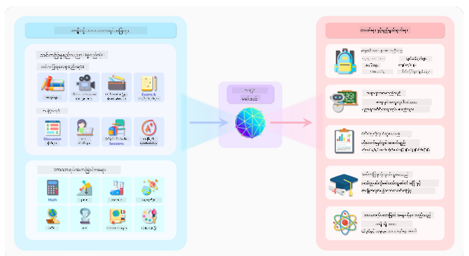
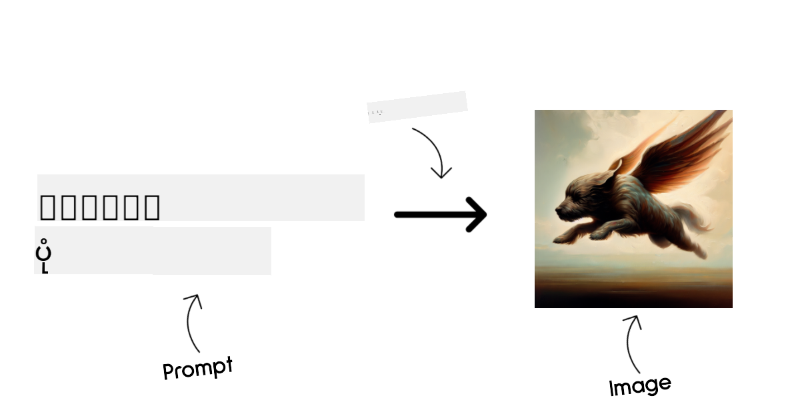
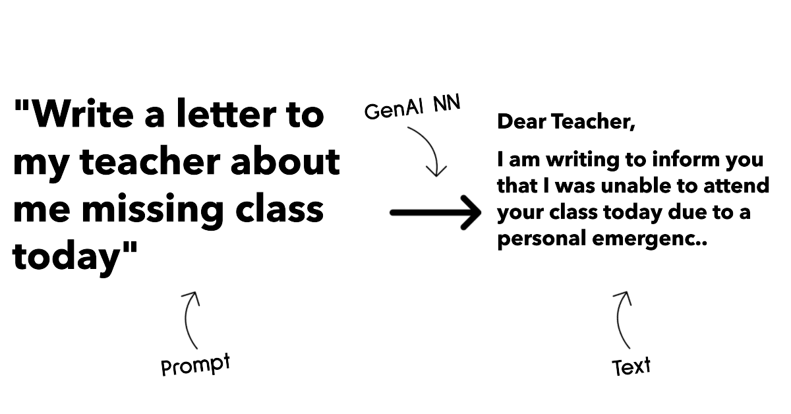
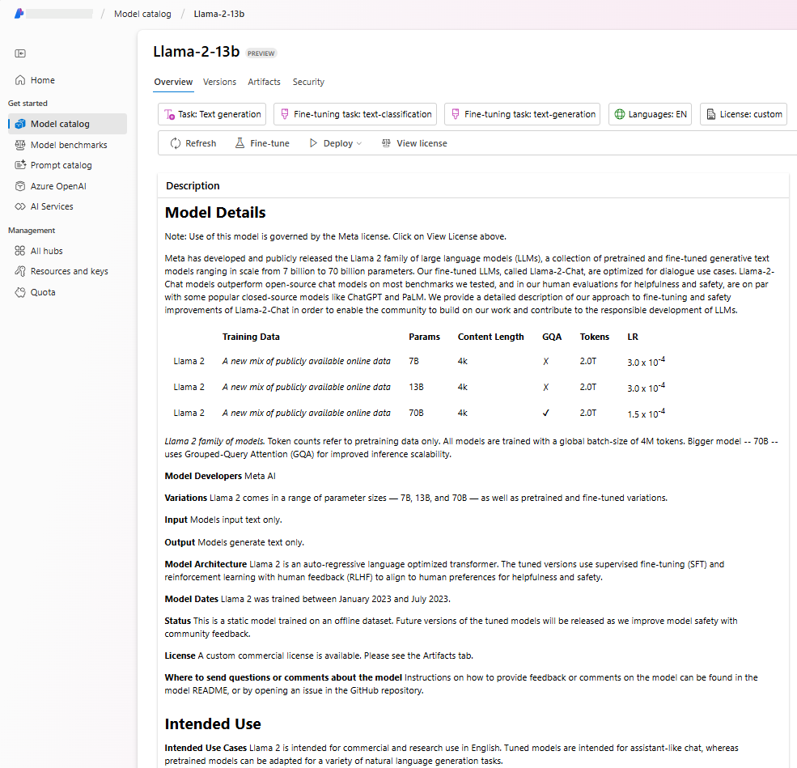
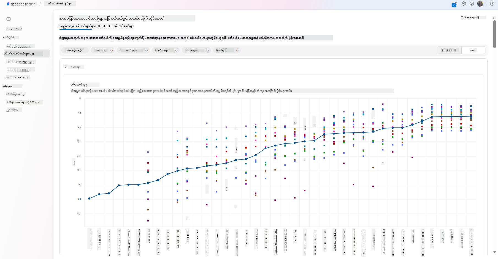
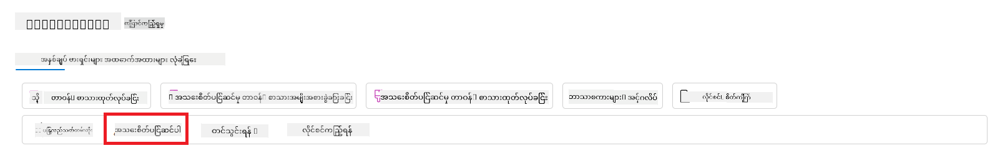
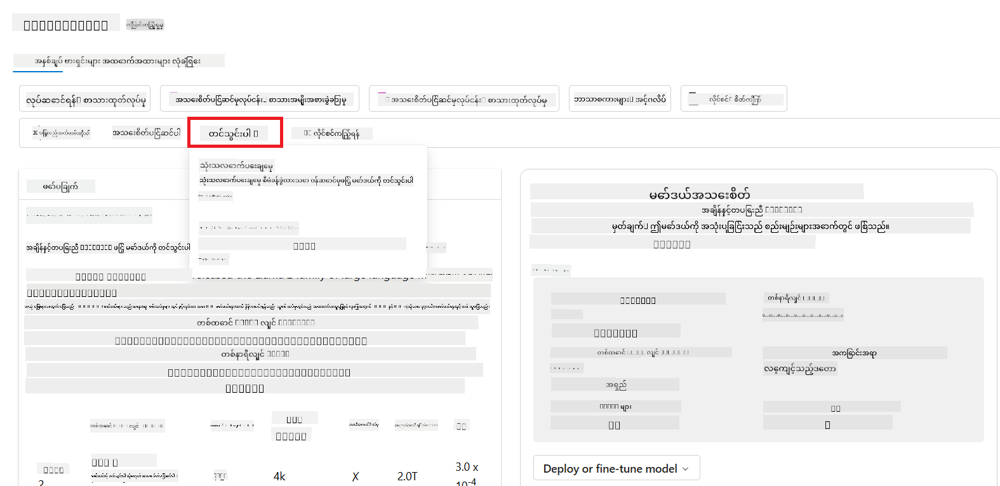

<!--
CO_OP_TRANSLATOR_METADATA:
{
  "original_hash": "e2f686f2eb794941761252ac5e8e090b",
  "translation_date": "2025-07-09T08:43:42+00:00",
  "source_file": "02-exploring-and-comparing-different-llms/README.md",
  "language_code": "my"
}
-->
# LLM များအမျိုးမျိုးကို ရှာဖွေခြင်းနှင့် နှိုင်းယှဉ်ခြင်း

> _ဤသင်ခန်းစာ၏ ဗီဒီယိုကို ကြည့်ရန် အပေါ်တွင်ရှိသော ပုံကို နှိပ်ပါ_

ယခင်သင်ခန်းစာတွင် Generative AI သည် နည်းပညာလောကကို မည်သို့ပြောင်းလဲနေသည်၊ Large Language Models (LLMs) များ မည်သို့ လည်ပတ်ကြသည်၊ စတားတပ်တစ်ခုကဲ့သို့ စီးပွားရေးလုပ်ငန်းတစ်ခုသည် ၎င်းတို့ကို မည်သို့ အသုံးချ၍ တိုးတက်မှုရရှိနိုင်သည်ကို ကြည့်ရှုခဲ့ပါသည်။ ဤအခန်းတွင်တော့ LLM များအမျိုးမျိုးကို နှိုင်းယှဉ်ပြီး ၎င်းတို့၏အားသာချက်များနှင့် အားနည်းချက်များကို နားလည်ရန် ကြိုးစားပါမည်။

စတားတပ်၏ ခရီးစဉ်တွင် နောက်တစ်ဆင့်မှာ လက်ရှိ LLM များ၏ ပတ်ဝန်းကျင်ကို ရှာဖွေပြီး မိမိတို့ အသုံးပြုမှုအတွက် သင့်တော်သော မော်ဒယ်များကို နားလည်ခြင်းဖြစ်သည်။

## နိဒါန်း

ဤသင်ခန်းစာတွင် ပါဝင်မည့်အကြောင်းအရာများမှာ -

- လက်ရှိ LLM များ၏ အမျိုးအစားများ။
- Azure တွင် မိမိအသုံးပြုမှုအတွက် မော်ဒယ်များကို စမ်းသပ်ခြင်း၊ ပြန်လည်တိုးတက်အောင်လုပ်ခြင်းနှင့် နှိုင်းယှဉ်ခြင်း။
- LLM တစ်ခုကို မည်သို့ တပ်ဆင်မည်နည်း။

## သင်ယူရမည့် ရည်မှန်းချက်များ

ဤသင်ခန်းစာပြီးဆုံးပြီးနောက် သင်သည် -

- မိမိအသုံးပြုမှုအတွက် သင့်တော်သော မော်ဒယ်ကို ရွေးချယ်နိုင်မည်။
- မော်ဒယ်၏ စွမ်းဆောင်ရည်ကို စမ်းသပ်၊ ပြန်လည်တိုးတက်အောင်လုပ်နည်းကို နားလည်နိုင်မည်။
- စီးပွားရေးလုပ်ငန်းများ မော်ဒယ်များကို မည်သို့ တပ်ဆင်ကြသည်ကို သိရှိနိုင်မည်။

## LLM များ၏ အမျိုးအစားများကို နားလည်ခြင်း

LLM များကို ၎င်းတို့၏ ဖွဲ့စည်းပုံ၊ လေ့ကျင့်သည့် ဒေတာနှင့် အသုံးပြုမှုအပေါ် မူတည်၍ အမျိုးအစားများစွာ ခွဲခြားနိုင်သည်။ ဤကွာခြားချက်များကို နားလည်ခြင်းဖြင့် စတားတပ်သည် မိမိတို့အခြေအနေသို့ သင့်တော်သော မော်ဒယ်ကို ရွေးချယ်နိုင်ပြီး စမ်းသပ်၊ ပြန်လည်တိုးတက်အောင်လုပ်နည်းကိုလည်း နားလည်နိုင်မည်ဖြစ်သည်။

LLM မော်ဒယ်အမျိုးအစားများစွာ ရှိပြီး မိမိအသုံးပြုလိုသည့် ရည်ရွယ်ချက်၊ ဒေတာ၊ ငွေပေးချေမှုစရိတ်နှင့် အခြားအချက်များပေါ် မူတည်၍ မော်ဒယ်ရွေးချယ်မှုကွဲပြားနိုင်သည်။

မော်ဒယ်များကို စာသား၊ အသံ၊ ဗီဒီယို၊ ပုံရိပ်ဖန်တီးခြင်း စသည့် အမျိုးအစားအလိုက် အသုံးပြုလိုပါက မတူညီသော မော်ဒယ်အမျိုးအစားကို ရွေးချယ်နိုင်ပါသည်။

- **အသံနှင့် စကားသိမြင်ခြင်း**။ ဤရည်ရွယ်ချက်အတွက် Whisper မော်ဒယ်များသည် စကားသိမြင်ခြင်းအတွက် အထူးသင့်တော်ပြီး အမျိုးမျိုးသော အသံများပေါ်တွင် လေ့ကျင့်ထားသည်။ ဘာသာစကားစုံစကားသိမြင်နိုင်သည်။ [Whisper မော်ဒယ်အကြောင်း ပိုမိုလေ့လာရန်](https://platform.openai.com/docs/models/whisper?WT.mc_id=academic-105485-koreyst)။

- **ပုံရိပ်ဖန်တီးခြင်း**။ ပုံရိပ်ဖန်တီးရန် DALL-E နှင့် Midjourney တို့သည် နာမည်ကြီးသော ရွေးချယ်စရာများဖြစ်သည်။ DALL-E ကို Azure OpenAI မှ ပံ့ပိုးပေးသည်။ [DALL-E အကြောင်း ပိုမိုဖတ်ရှုရန်](https://platform.openai.com/docs/models/dall-e?WT.mc_id=academic-105485-koreyst) နှင့် ဤသင်ခန်းစာ၏ အခန်း ၉ တွင်လည်း ပါဝင်သည်။

- **စာသားဖန်တီးခြင်း**။ မော်ဒယ်အများစုသည် စာသားဖန်တီးခြင်းအတွက် လေ့ကျင့်ထားပြီး GPT-3.5 မှ GPT-4 အထိ မော်ဒယ်များစွာ ရွေးချယ်နိုင်သည်။ GPT-4 သည် အကြီးဆုံးစျေးနှုန်းရှိသည်။ [Azure OpenAI playground](https://oai.azure.com/portal/playground?WT.mc_id=academic-105485-koreyst) တွင် စွမ်းဆောင်ရည်နှင့် စျေးနှုန်းအရ သင့်လိုအပ်ချက်နှင့် ကိုက်ညီသည့် မော်ဒယ်ကို စမ်းသပ်ကြည့်ရန် သင့်တော်သည်။

- **အမျိုးမျိုးသော ဒေတာပုံစံများကို ကိုင်တွယ်နိုင်ခြင်း**။ အမျိုးမျိုးသော ဒေတာများကို ထည့်သွင်းထုတ်ယူလိုပါက [gpt-4 turbo with vision သို့မဟုတ် gpt-4o](https://learn.microsoft.com/azure/ai-services/openai/concepts/models#gpt-4-and-gpt-4-turbo-models?WT.mc_id=academic-105485-koreyst) ကဲ့သို့သော OpenAI ၏ နောက်ဆုံးထွက် မော်ဒယ်များကို စဉ်းစားနိုင်သည်။ ဤမော်ဒယ်များသည် သဘာဝဘာသာစကားကို ဗီဇွယ်နားလည်မှုနှင့် ပေါင်းစပ်နိုင်ပြီး မျိုးစုံပုံစံ အင်တာဖေ့စ်များမှတဆင့် ဆက်သွယ်နိုင်သည်။

မော်ဒယ်ရွေးချယ်ခြင်းသည် အခြေခံစွမ်းရည်များကို ရရှိစေသော်လည်း မလုံလောက်နိုင်ပါ။ မကြာခဏ ကုမ္ပဏီအထူး ဒေတာများကို LLM ထံသို့ ထည့်သွင်းပြောပြရန် လိုအပ်သည်။ ၎င်းကို မည်သို့ ရှင်းလင်းမည်ဆိုသည်မှာ နောက်ပိုင်းအပိုင်းများတွင် ဆက်လက်ရှင်းပြပါမည်။

### Foundation Models နှင့် LLM များ

Foundation Model ဆိုသည်မှာ [Stanford သုတေသနပညာရှင်များက ဖန်တီးခဲ့သော စကားလုံး](https://arxiv.org/abs/2108.07258?WT.mc_id=academic-105485-koreyst) ဖြစ်ပြီး အောက်ပါအချက်များအရ သတ်မှတ်ထားသည် -

- **Unsupervised learning သို့မဟုတ် self-supervised learning ဖြင့် လေ့ကျင့်ထားသည်**။ အမှတ်အသားမထားသော မျိုးစုံဒေတာပေါ်တွင် လေ့ကျင့်ထားပြီး လူ့လက်မှတ်မလိုအပ်ပါ။
- **အလွန်ကြီးမားသော မော်ဒယ်များဖြစ်သည်**။ ဘီလျံပမာဏရှိသော parameter များပါဝင်သည့် နက်ရှိုင်းသော နယူးရယ်နက်ဝက်ခ်များဖြစ်သည်။
- **အခြားမော်ဒယ်များအတွက် အခြေခံအဖြစ် အသုံးပြုရန် ရည်ရွယ်သည်**။ အခြားမော်ဒယ်များကို fine-tuning ဖြင့် တည်ဆောက်ရာတွင် အစအဖြစ် အသုံးပြုနိုင်သည်။

ပုံရင်းမြစ် - [Essential Guide to Foundation Models and Large Language Models | by Babar M Bhatti | Medium](https://thebabar.medium.com/essential-guide-to-foundation-models-and-large-language-models-27dab58f7404)

ဤကွာခြားချက်ကို ပိုမိုရှင်းလင်းစေရန် ChatGPT ကို ဥပမာယူကြပါစို့။ ChatGPT ၏ ပထမဆုံးဗားရှင်းကို တည်ဆောက်ရာတွင် GPT-3.5 ကို foundation model အဖြစ် အသုံးပြုခဲ့သည်။ OpenAI သည် စကားပြောဆက်သွယ်မှုအတွက် အထူးပြုထားသော chat-specific ဒေတာများဖြင့် GPT-3.5 ကို fine-tune ပြုလုပ်ခဲ့သည်။

ပုံရင်းမြစ် - [2108.07258.pdf (arxiv.org)](https://arxiv.org/pdf/2108.07258.pdf?WT.mc_id=academic-105485-koreyst)

### Open Source နှင့် Proprietary Models

LLM များကို open source ဖြစ်ခြင်း သို့မဟုတ် proprietary ဖြစ်ခြင်းအရလည်း ခွဲခြားနိုင်သည်။

Open source မော်ဒယ်များသည် ပြည်သူလူထုအတွက် ဖွင့်လှစ်ထားပြီး မည်သူမဆို အသုံးပြုနိုင်သည်။ မော်ဒယ်ဖန်တီးသူ ကုမ္ပဏီ သို့မဟုတ် သုတေသနအသိုင်းအဝိုင်းမှ ထုတ်ပေးသည်။ ၎င်းတို့ကို စစ်ဆေး၊ ပြင်ဆင်၊ စိတ်ကြိုက်ပြုလုပ်နိုင်သည်။ သို့သော် ထုတ်လုပ်မှုအတွက် အကောင်းဆုံး မဖြစ်နိုင်သော်လည်း၊ ရန်ပုံငွေကန့်သတ်မှုရှိပြီး ရေရှည်ထိန်းသိမ်းမှု မရှိနိုင်သော်လည်း ဖြစ်နိုင်သည်။ နာမည်ကြီး open source မော်ဒယ်များမှာ [Alpaca](https://crfm.stanford.edu/2023/03/13/alpaca.html?WT.mc_id=academic-105485-koreyst), [Bloom](https://huggingface.co/bigscience/bloom) နှင့် [LLaMA](https://llama.meta.com) တို့ ဖြစ်သည်။

Proprietary မော်ဒယ်များသည် ကုမ္ပဏီပိုင်ဆိုင်ပြီး ပြည်သူအတွက် မဖွင့်လှစ်ထားသော မော်ဒယ်များဖြစ်သည်။ ထုတ်လုပ်မှုအတွက် အကောင်းဆုံး optimize ပြုလုပ်ထားပြီး စိတ်ကြိုက်ပြင်ဆင်ခြင်း မပြုလုပ်နိုင်ပါ။ အခမဲ့ မရနိုင်သော်လည်း စာရင်းသွင်းခြင်း သို့မဟုတ် ငွေပေးချေမှု လိုအပ်နိုင်သည်။ မော်ဒယ်လေ့ကျင့်ရာတွင် အသုံးပြုသော ဒေတာကို အသုံးပြုသူများ ထိန်းချုပ်၍ မရသဖြင့် ဒေတာလုံခြုံမှုနှင့် AI တာဝန်ယူမှုကို မော်ဒယ်ပိုင်ရှင်အား ယုံကြည်ရမည်။ နာမည်ကြီး proprietary မော်ဒယ်များမှာ [OpenAI မော်ဒယ်များ](https://platform.openai.com/docs/models/overview?WT.mc_id=academic-105485-koreyst), [Google Bard](https://sapling.ai/llm/bard?WT.mc_id=academic-105485-koreyst) နှင့် [Claude 2](https://www.anthropic.com/index/claude-2?WT.mc_id=academic-105485-koreyst) တို့ ဖြစ်သည်။

### Embedding, Image Generation နှင့် Text and Code Generation

LLM များကို ထုတ်ပေးသော output အမျိုးအစားအရလည်း ခွဲခြားနိုင်သည်။

Embedding မော်ဒယ်များသည် စာသားကို နံပါတ်ပုံစံ (embedding) သို့ ပြောင်းလဲပေးသည်။ ဤနံပါတ်ပုံစံသည် စကားလုံးများ သို့မဟုတ် စာကြောင်းများအကြား ဆက်နွယ်မှုကို စက်များနားလည်ရန် လွယ်ကူစေပြီး classification မော်ဒယ်များ သို့မဟုတ် clustering မော်ဒယ်များကဲ့သို့ နံပါတ်ပုံစံအပေါ် အခြေခံသော မော်ဒယ်များတွင် အသုံးပြုနိုင်သည်။ Embedding မော်ဒယ်များကို transfer learning အတွက် အသုံးပြုကြပြီး abundant data ရှိသော surrogate task အတွက် မော်ဒယ်တစ်ခု တည်ဆောက်ပြီး ထိုမော်ဒယ်၏ weights (embedding) များကို downstream task များတွင် ပြန်လည်အသုံးပြုသည်။ ဥပမာမှာ [OpenAI embeddings](https://platform.openai.com/docs/models/embeddings?WT.mc_id=academic-105485-koreyst) ဖြစ်သည်။

ပုံရိပ်ဖန်တီးမော်ဒယ်များသည် ပုံရိပ်များကို ဖန်တီးပေးသည်။ ဤမော်ဒယ်များကို ပုံရိပ်တည်းဖြတ်ခြင်း၊ ပုံရိပ်ပေါင်းစပ်ခြင်းနှင့် ပုံရိပ်ဘာသာပြန်ခြင်းတို့တွင် အသုံးပြုကြသည်။ ပုံရိပ်ဖန်တီးမော်ဒယ်များကို [LAION-5B](https://laion.ai/blog/laion-5b/?WT.mc_id=academic-105485-koreyst) ကဲ့သို့သော ပုံရိပ်ဒေတာအစုအဝေးကြီးများပေါ်တွင် လေ့ကျင့်ထားပြီး ပုံအသစ်များ ဖန်တီးခြင်း သို့မဟုတ် ရှိပြီးသားပုံများကို inpainting, super-resolution, colorization နည်းပညာများဖြင့် တည်းဖြတ်နိုင်သည်။ ဥပမာများမှာ [DALL-E-3](https://openai.com/dall-e-3?WT.mc_id=academic-105485-koreyst) နှင့် [Stable Diffusion မော်ဒယ်များ](https://github.com/Stability-AI/StableDiffusion?WT.mc_id=academic-105485-koreyst) ဖြစ်သည်။

စာသားနှင့် ကုဒ်ဖန်တီးမော်ဒယ်များသည် စာသား သို့မဟုတ် ကုဒ်များကို ဖန်တီးပေးသည်။ ဤမော်ဒယ်များကို စာသားအကျဉ်းချုပ်ခြင်း၊ ဘာသာပြန်ခြင်းနှင့် မေးခွန်းဖြေဆိုခြင်းတို့တွင် အသုံးပြုကြသည်။ စာသားဖန်တီးမော်ဒယ်များကို [BookCorpus](https://www.cv-foundation.org/openaccess/content_iccv_2015/html/Zhu_Aligning_Books_and_ICCV_2015_paper.html?WT.mc_id=academic-105485-koreyst) ကဲ့သို့သော စာသားဒေတာအစုအဝေးကြီးများပေါ်တွင် လေ့ကျင့်ထားပြီး စာသားအသစ်များ ဖန်တီးခြင်း သို့မဟုတ် မေးခွန်းများကို ဖြေဆိုနိုင်သည်။ ကုဒ်ဖန်တီးမော်ဒယ်များ၊ ဥပမာ [CodeParrot](https://huggingface.co/codeparrot?WT.mc_id=academic-105485-koreyst) သည် GitHub ကဲ့သို့သော ကုဒ်ဒေတာအစုအဝေးကြီးများပေါ်တွင် လေ့ကျင့်ထားပြီး ကုဒ်အသစ်များ ဖန်တီးခြင်း သို့မဟုတ် ရှိပြီးသားကုဒ်များမှ အမှားများကို ပြင်ဆင်နိုင်သည်။

### Encoder-Decoder နှင့် Decoder-only

LLM များ၏ ဖွဲ့စည်းပုံအမျိုးအစားများကို ရှင်းပြရန် အနားလမ်းတစ်ခု အသုံးပြုကြပါစို့။

သင်၏ မန်နေဂျာက ကျောင်းသားများအတွက် မေးခွန်းစာမေးပွဲရေးရန် တာဝန်ပေးလိုက်သည်။ သင်တွင် အလုပ်ဖော်နှစ်ဦးရှိပြီး တစ်ဦးသည် အကြောင်းအရာရေးသားခြင်းကို ကြီးကြပ်ပြီး တစ်ဦးသည် ပြန်လည်သုံးသပ်ခြင်းကို ကြီးကြပ်သည်။

အကြောင်းအရာရေးသားသူသည် Decoder-only မော်ဒယ်ကဲ့သို့ဖြစ်ပြီး၊ ခေါင်းစဉ်ကို ကြည့်ပြီး သင်ရေးသားထားသည့်အရာများကို အခြေခံ၍ သင်ခန်းစာရေးနိုင်သည်။ ၎င်းတို့သည် စိတ်ဝင်စားဖွယ်နှင့် အသိပညာပေးသော အကြောင်းအရာရေးသားရာတွင် ကောင်းမွန်သော်လည်း ခေါင်းစဉ်နှင့် သင်ယူရမည့် ရည်မှန်း
ကျွန်ုပ်တို့ ယခင်ပိုဒ်များတွင် ဖော်ပြခဲ့သော မော်ဒယ်အများစု (OpenAI မော်ဒယ်များ၊ Llama2 ကဲ့သို့သော open source မော်ဒယ်များနှင့် Hugging Face transformers) ကို [Azure AI Studio](https://ai.azure.com/?WT.mc_id=academic-105485-koreyst) တွင်ရှိသော [Model Catalog](https://learn.microsoft.com/azure/ai-studio/how-to/model-catalog-overview?WT.mc_id=academic-105485-koreyst) မှာ ရရှိနိုင်ပါသည်။

[Azure AI Studio](https://learn.microsoft.com/azure/ai-studio/what-is-ai-studio?WT.mc_id=academic-105485-koreyst) သည် developer များအတွက် generative AI application များ ဖန်တီးရန်နှင့် စမ်းသပ်မှုမှ စတင်၍ အကဲဖြတ်ခြင်းအထိ ဖွံ့ဖြိုးတိုးတက်မှု လုပ်ငန်းစဉ်အားလုံးကို စီမံခန့်ခွဲနိုင်ရန် Azure AI ဝန်ဆောင်မှုများအားလုံးကို တစ်နေရာတည်းတွင် GUI လွယ်ကူစွာ အသုံးပြုနိုင်သော Cloud Platform တစ်ခုဖြစ်သည်။ Azure AI Studio ၏ Model Catalog သည် အသုံးပြုသူအား အောက်ပါအရာများကို လုပ်ဆောင်နိုင်စေပါသည်-

- စိတ်ဝင်စားရာ Foundation Model ကို catalog ထဲမှ ရှာဖွေပါ - ပိုင်ဆိုင်မှုရှိသော မော်ဒယ်ဖြစ်စေ open source မော်ဒယ်ဖြစ်စေ၊ task, license သို့မဟုတ် name အလိုက် စစ်ထုတ်နိုင်သည်။ ရှာဖွေရေးကို ပိုမိုကောင်းမွန်စေရန် မော်ဒယ်များကို Azure OpenAI collection, Hugging Face collection စသည့် collection များအဖြစ် စုစည်းထားသည်။

- မော်ဒယ်ကတ်ကို ပြန်လည်သုံးသပ်ပါ၊ အသုံးပြုရန် ရည်ရွယ်ချက်နှင့် သင်ကြားမှုဒေတာ အသေးစိတ်ဖော်ပြချက်၊ ကုဒ်နမူနာများနှင့် အတွင်းပိုင်း အကဲဖြတ်မှုစာကြည့်တိုက်တွင် ရရှိသော အကဲဖြတ်မှုရလဒ်များ ပါဝင်သည်။

- စက်မှုလုပ်ငန်းတွင် ရရှိနိုင်သော မော်ဒယ်များနှင့် ဒေတာစုံများအပေါ် Benchmark များကို နှိုင်းယှဉ်၍ စီးပွားရေးအခြေအနေကို ဖြည့်ဆည်းနိုင်မည့် မော်ဒယ်ကို သတ်မှတ်နိုင်ရန် [Model Benchmarks](https://learn.microsoft.com/azure/ai-studio/how-to/model-benchmarks?WT.mc_id=academic-105485-koreyst) ပန်းလှများမှ ကြည့်ရှုနိုင်သည်။

- Azure AI Studio ၏ စမ်းသပ်မှုနှင့် လိုက်လံခြင်း စွမ်းဆောင်ရည်များကို အသုံးပြု၍ မိမိလိုအပ်သည့် အလုပ်ပမာဏအတွက် မော်ဒယ်စွမ်းဆောင်ရည် တိုးတက်စေရန် မိမိ၏ သင်ကြားမှုဒေတာဖြင့် မော်ဒယ်ကို fine-tune ပြုလုပ်နိုင်သည်။

- မူလ pre-trained မော်ဒယ် သို့မဟုတ် fine-tuned မော်ဒယ်ကို remote real time inference - managed compute - သို့မဟုတ် serverless api endpoint - [pay-as-you-go](https://learn.microsoft.com/azure/ai-studio/how-to/model-catalog-overview#model-deployment-managed-compute-and-serverless-api-pay-as-you-go?WT.mc_id=academic-105485-koreyst) ဖြင့် တပ်ဆင်နိုင်ပြီး application များမှ အသုံးပြုနိုင်စေသည်။

> [!NOTE]
> Catalog ထဲရှိ မော်ဒယ်အားလုံးကို လက်ရှိတွင် fine-tuning နှင့်/သို့မဟုတ် pay-as-you-go deployment အတွက် အသုံးပြုနိုင်ခြင်း မရှိပါ။ မော်ဒယ်၏ စွမ်းဆောင်ရည်နှင့် ကန့်သတ်ချက်များအတွက် မော်ဒယ်ကတ်ကို စစ်ဆေးပါ။

## LLM ရလဒ်များ တိုးတက်စေရန်

ကျွန်ုပ်တို့ startup အဖွဲ့နှင့်အတူ LLM မျိုးစုံနှင့် Cloud Platform (Azure Machine Learning) ကို စမ်းသပ်လေ့လာခဲ့ပြီး မော်ဒယ်များကို နှိုင်းယှဉ်ခြင်း၊ စမ်းသပ်ဒေတာပေါ်တွင် အကဲဖြတ်ခြင်း၊ စွမ်းဆောင်ရည် တိုးတက်စေရန်နှင့် inference endpoint များတွင် တပ်ဆင်နိုင်ခြင်းတို့ကို လုပ်ဆောင်နိုင်ခဲ့သည်။

သို့သော် မည်သည့်အချိန်တွင် pre-trained မော်ဒယ်ကို အသုံးပြုခြင်းထက် fine-tuning ပြုလုပ်သင့်သနည်း? အလုပ်ပမာဏအလိုက် မော်ဒယ်စွမ်းဆောင်ရည် တိုးတက်စေရန် အခြားနည်းလမ်းများ ရှိပါသလား?

LLM မှ ရလဒ်လိုအပ်ချက်များကို ရရှိစေရန် စီးပွားရေးလုပ်ငန်းများ အသုံးပြုနိုင်သည့် နည်းလမ်းအမျိုးမျိုး ရှိသည်။ LLM ကို production တွင် တပ်ဆင်ရာတွင် သင်သည် သင်ကြားမှုအဆင့်အတန်း၊ ရှုပ်ထွေးမှု၊ ကုန်ကျစရိတ်နှင့် အရည်အသွေး မတူညီသည့် မော်ဒယ်အမျိုးအစားများကို ရွေးချယ်နိုင်သည်။ အောက်ပါနည်းလမ်းများမှာ အမျိုးမျိုးဖြစ်ပါသည်-

- **Context ပါသော Prompt engineering**။ လိုအပ်သော အဖြေများရရှိစေရန် prompt ပေးသည့်အခါ လုံလောက်သော context ကို ပေးခြင်းဖြစ်သည်။

- **Retrieval Augmented Generation, RAG**။ သင့်ဒေတာသည် database သို့မဟုတ် web endpoint တစ်ခုတွင် ရှိနိုင်ပြီး၊ prompt ပေးသည့်အချိန်တွင် ထိုဒေတာ သို့မဟုတ် ဒေတာအပိုင်းအစကို ထည့်သွင်းရန် သင့်တော်သော ဒေတာကို ရယူပြီး အသုံးပြုသူ၏ prompt ၏ အစိတ်အပိုင်းအဖြစ် ထည့်သွင်းနိုင်သည်။

- **Fine-tuned မော်ဒယ်**။ မိမိ၏ ဒေတာဖြင့် မော်ဒယ်ကို နောက်ထပ် သင်ကြားမှု ပြုလုပ်ခြင်းဖြင့် မော်ဒယ်သည် ပိုမိုတိကျပြီး လိုအပ်ချက်များကို ပိုမိုတုံ့ပြန်နိုင်သော်လည်း ကုန်ကျစရိတ်များရှိနိုင်သည်။

ပုံရင်း: [Four Ways that Enterprises Deploy LLMs | Fiddler AI Blog](https://www.fiddler.ai/blog/four-ways-that-enterprises-deploy-llms?WT.mc_id=academic-105485-koreyst)

### Context ပါသော Prompt Engineering

Pre-trained LLM များသည် စာလုံးတိုတစ်ကြောင်းဖြည့်ခြင်း သို့မဟုတ် မေးခွန်းတစ်ခုကဲ့သို့သော အတိုချုပ် prompt ဖြင့်လည်း “zero-shot” သင်ယူမှုဖြင့် သဘာဝဘာသာစကား အလုပ်များတွင် ကောင်းစွာ လုပ်ဆောင်နိုင်သည်။

သို့သော် အသုံးပြုသူသည် မေးခွန်းကို အသေးစိတ် ဖော်ပြချက်နှင့် နမူနာများ (Context) ဖြင့် ပိုမိုကောင်းစွာ ဖွဲ့စည်းနိုင်သည့်အခါ အဖြေသည် ပိုမိုတိကျပြီး အသုံးပြုသူ မျှော်လင့်ချက်နှင့် နီးစပ်လာမည်ဖြစ်သည်။ ဤအခြေအနေတွင် prompt တွင် နမူနာတစ်ခုသာ ပါဝင်ပါက “one-shot” သင်ယူမှု၊ နမူနာများစွာ ပါဝင်ပါက “few-shot” သင်ယူမှု ဟု ခေါ်သည်။
Context ပါသော prompt engineering သည် စတင်ရန် အကောင်းဆုံးနှင့် စရိတ်သက်သာဆုံး နည်းလမ်းဖြစ်သည်။

### Retrieval Augmented Generation (RAG)

LLM များတွင် သင်ကြားမှုအချိန်တွင် အသုံးပြုခဲ့သော ဒေတာများကိုသာ အသုံးပြု၍ အဖြေထုတ်နိုင်ခြင်းကန့်သတ်ချက်ရှိသည်။ ၎င်းတို့သည် သင်ကြားမှုပြီးနောက် ဖြစ်ပွားသော အချက်အလက်များကို မသိကြပါ၊ မပုဂ္ဂလိက အချက်အလက်များ (ကုမ္ပဏီဒေတာကဲ့သို့) ကိုလည်း မရရှိနိုင်ပါ။
ဤကန့်သတ်ချက်ကို RAG နည်းပညာဖြင့် ဖြေရှင်းနိုင်ပြီး၊ prompt ကို စာရွက်စာတမ်း အပိုင်းအစများအဖြစ် ပြင်ပဒေတာဖြင့် တိုးမြှင့်ပေးသည်။ ဤနည်းပညာကို Vector database tools (ဥပမာ [Azure Vector Search](https://learn.microsoft.com/azure/search/vector-search-overview?WT.mc_id=academic-105485-koreyst)) မှ အထောက်အကူပြုကာ မတူညီသော ဒေတာရင်းမြစ်များမှ အသုံးဝင်သော အပိုင်းအစများကို ရှာဖွေပြီး prompt ၏ Context ထဲသို့ ထည့်သွင်းပေးသည်။

ဤနည်းလမ်းသည် စီးပွားရေးလုပ်ငန်းများတွင် ဒေတာ၊ အချိန် သို့မဟုတ် အရင်းအမြစ် မလုံလောက်သည့်အခါ LLM ကို fine-tune မလုပ်ဘဲ အလုပ်ပမာဏအလိုက် စွမ်းဆောင်ရည် တိုးတက်စေရန်နှင့် အမှားအယွင်း၊ အန္တရာယ်ရှိသော အကြောင်းအရာများ ဖြစ်ပေါ်မှုကို လျော့နည်းစေရန် အထောက်အကူပြုသည်။

### Fine-tuned မော်ဒယ်

Fine-tuning သည် transfer learning ကို အသုံးပြု၍ မော်ဒယ်ကို downstream task သို့မဟုတ် အထူးပြဿနာတစ်ခုကို ဖြေရှင်းရန် ‘သင့်တော်အောင်’ ပြုလုပ်ခြင်းဖြစ်သည်။ few-shot learning နှင့် RAG နှင့် ကွဲပြားပြီး မော်ဒယ်အသစ်တစ်ခုကို ဖန်တီးပေးပြီး အလေးချိန်များနှင့် bias များကို ပြင်ဆင်ပေးသည်။ သင်ကြားမှုနမူနာများတွင် input တစ်ခု (prompt) နှင့် output (completion) တစ်ခုစီ ပါဝင်ရမည်ဖြစ်သည်။
အောက်ပါအခြေအနေများတွင် ဤနည်းလမ်းကို ဦးစားပေးသင့်သည်-

- **Fine-tuned မော်ဒယ်များကို အသုံးပြုခြင်း**။ စွမ်းဆောင်ရည်နည်းသော မော်ဒယ်များ (embedding မော်ဒယ်များကဲ့သို့) ကို အသုံးပြုလိုသော စီးပွားရေးလုပ်ငန်းများအတွက် စရိတ်သက်သာပြီး မြန်ဆန်သော ဖြေရှင်းချက် ဖြစ်စေသည်။

- **Latency ကို စဉ်းစားခြင်း**။ အချိန်နှောင့်နှေးမှုသည် အရေးကြီးသော အသုံးပြုမှုတစ်ခုဖြစ်ပြီး အလွန်ရှည်လျားသော prompt များ သို့မဟုတ် မော်ဒယ်မှ သင်ယူရမည့် နမူနာအရေအတွက်သည် prompt အရှည်ကန့်သတ်ချက်နှင့် ကိုက်ညီမှုမရှိပါက။

- **အချက်အလက်အသစ်များနှင့် နောက်ဆုံးရထားရှိခြင်း**။ အရည်အသွေးမြင့် ဒေတာများနှင့် ground truth label များစွာရှိပြီး အချိန်အလိုက် ဒေတာများကို ထိန်းသိမ်းထားနိုင်သော အရင်းအမြစ်များ ရှိသော စီးပွားရေးလုပ်ငန်းများ။

### သင်ကြားပြီးသော မော်ဒယ်

LLM ကို အစမှ စတင်သင်ကြားခြင်းသည် အခက်အခဲအများဆုံးနှင့် ရှုပ်ထွေးဆုံးနည်းလမ်းဖြစ်ပြီး ဒေတာအရေအတွက် များပြားမှု၊ ကျွမ်းကျင်သော အရင်းအမြစ်များနှင့် သင့်တော်သော ကွန်ပျူတာစွမ်းအားများ လိုအပ်သည်။ ဤရွေးချယ်မှုကို စီးပွားရေးလုပ်ငန်းတွင် domain-specific အသုံးပြုမှုရှိပြီး domain-centric ဒေတာအရေအတွက် ကြီးမားသောအခါတွင်သာ စဉ်းစားသင့်သည်။

## အသိပညာ စစ်ဆေးခြင်း

LLM completion ရလဒ်များ တိုးတက်စေရန် အကောင်းဆုံးနည်းလမ်းက ဘာဖြစ်နိုင်ပါသလဲ?

1. Context ပါသော prompt engineering  
2. RAG  
3. Fine-tuned မော်ဒယ်  

ဖြေကြားချက်- ၃ ဖြစ်ပါသည်။ အချိန်၊ အရင်းအမြစ်နှင့် အရည်အသွေးမြင့် ဒေတာများ ရှိပါက fine-tuning သည် နောက်ဆုံးရထားရှိရန် အကောင်းဆုံးနည်းလမ်းဖြစ်သည်။ သို့သော် အချိန်မလုံလောက်ပါက RAG ကို ပထမဦးစွာ စဉ်းစားသင့်သည်။

## 🚀 စိန်ခေါ်မှု

သင့်စီးပွားရေးအတွက် [RAG ကို မည်သို့ အသုံးပြုနိုင်သည်ကို](https://learn.microsoft.com/azure/search/retrieval-augmented-generation-overview?WT.mc_id=academic-105485-koreyst) ပိုမိုလေ့လာပါ။

## ကောင်းမွန်သော အလုပ်၊ သင်ယူမှုကို ဆက်လက်လုပ်ဆောင်ပါ

ဤသင်ခန်းစာပြီးဆုံးပါက ကျွန်ုပ်တို့၏ [Generative AI Learning collection](https://aka.ms/genai-collection?WT.mc_id=academic-105485-koreyst) ကို ကြည့်ရှု၍ Generative AI အကြောင်း ပိုမိုတိုးတက်စေပါ။

Lesson 3 သို့ သွားပါက [Generative AI ကို တာဝန်ရှိစွာ တည်ဆောက်နည်း](../03-using-generative-ai-responsibly/README.md?WT.mc_id=academic-105485-koreyst) ကို လေ့လာနိုင်ပါသည်။

**အကြောင်းကြားချက်**  
ဤစာတမ်းကို AI ဘာသာပြန်ဝန်ဆောင်မှု [Co-op Translator](https://github.com/Azure/co-op-translator) ဖြင့် ဘာသာပြန်ထားပါသည်။ ကျွန်ုပ်တို့သည် တိကျမှန်ကန်မှုအတွက် ကြိုးစားသော်လည်း အလိုအလျောက် ဘာသာပြန်ခြင်းတွင် အမှားများ သို့မဟုတ် မှားယွင်းချက်များ ပါဝင်နိုင်ကြောင်း သတိပြုပါရန် မေတ္တာရပ်ခံအပ်ပါသည်။ မူရင်းစာတမ်းကို မိမိဘာသာစကားဖြင့်သာ တရားဝင်အချက်အလက်အဖြစ် ယူဆသင့်ပါသည်။ အရေးကြီးသော အချက်အလက်များအတွက် လူ့ပညာရှင်များ၏ ပရော်ဖက်ရှင်နယ် ဘာသာပြန်ခြင်းကို အကြံပြုပါသည်။ ဤဘာသာပြန်ချက်ကို အသုံးပြုရာမှ ဖြစ်ပေါ်လာနိုင်သည့် နားလည်မှုမှားယွင်းမှုများအတွက် ကျွန်ုပ်တို့သည် တာဝန်မခံပါ။