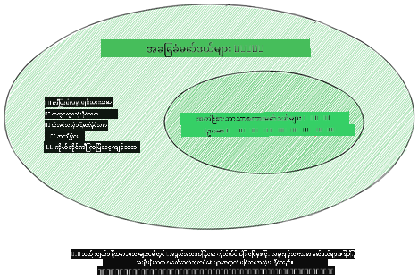
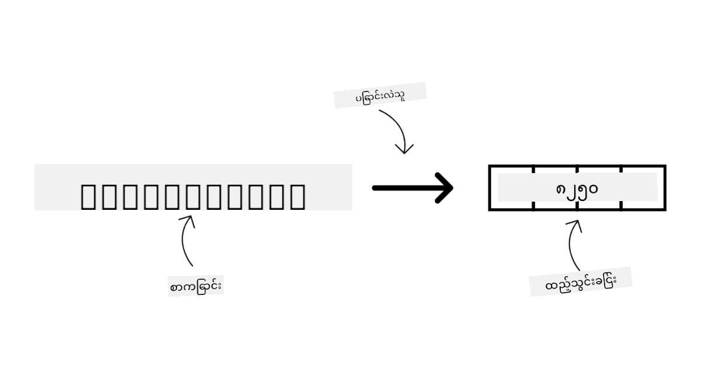
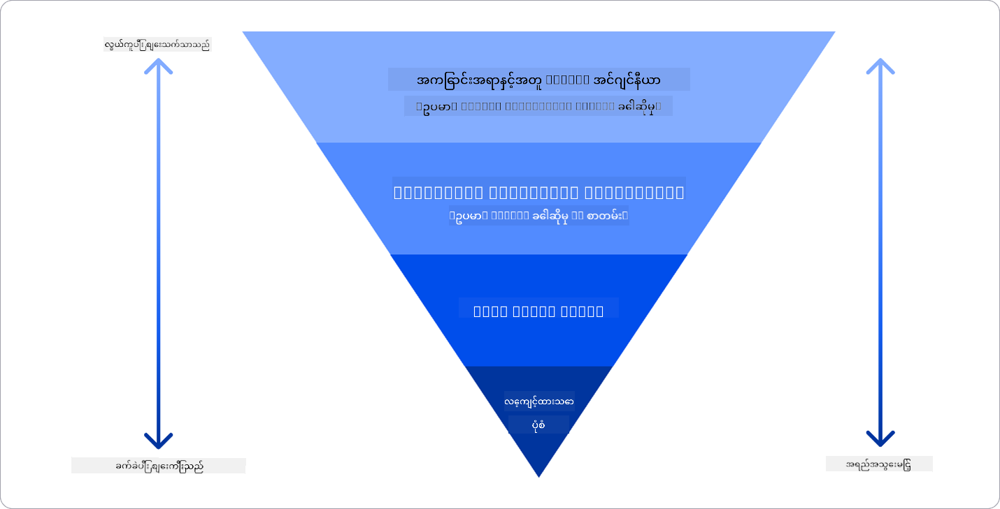

<!--
CO_OP_TRANSLATOR_METADATA:
{
  "original_hash": "6b7629b8ee4d7d874a27213e903d86a7",
  "translation_date": "2025-10-18T01:57:25+00:00",
  "source_file": "02-exploring-and-comparing-different-llms/README.md",
  "language_code": "my"
}
-->
# LLM များကိုလေ့လာခြင်းနှင့် နှိုင်းယှဉ်ခြင်း

> _အထက်ပါပုံကိုနှိပ်ပြီး ဒီသင်ခန်းစာရဲ့ ဗီဒီယိုကို ကြည့်ပါ_

ယခင်သင်ခန်းစာတွင် Generative AI သည် နည်းပညာလောကကို ဘယ်လိုပြောင်းလဲနေသည်၊ Large Language Models (LLMs) များသည် ဘယ်လိုအလုပ်လုပ်သည်၊ နှင့် ကျွန်ုပ်တို့၏ စတင်လုပ်ငန်းကဲ့သို့သော လုပ်ငန်းတစ်ခုသည် ၎င်းတို့ကို မည်သို့အသုံးချနိုင်ပြီး တိုးတက်မှုရရှိနိုင်သည်ကို ကြည့်ရှုခဲ့ပါသည်။ ဒီအခန်းမှာတော့ LLMs အမျိုးအစားများကို နှိုင်းယှဉ်ပြီး ၎င်းတို့၏ အားသာချက်များနှင့် အားနည်းချက်များကို နားလည်ရန် ကြည့်ရှုမည်ဖြစ်သည်။

ကျွန်ုပ်တို့၏ စတင်လုပ်ငန်း၏ နောက်ထပ်အဆင့်မှာ LLMs များ၏ လက်ရှိအခြေအနေကို လေ့လာပြီး ကျွန်ုပ်တို့၏ အသုံးချမှုအတွက် သင့်လျော်သော LLM ကို နားလည်ခြင်းဖြစ်သည်။

## အကျဉ်းချုပ်

ဒီသင်ခန်းစာမှာ အောက်ပါအကြောင်းအရာများကို လေ့လာမည်ဖြစ်သည်-

- လက်ရှိ LLMs အမျိုးအစားများ
- Azure တွင် သင့်အသုံးချမှုအတွက် မော်ဒယ်များကို စမ်းသပ်ခြင်း၊ ပြန်လည်တည်းဖြတ်ခြင်းနှင့် နှိုင်းယှဉ်ခြင်း
- LLM ကို မည်သို့ deploy လုပ်မည်

## သင်ယူရမည့်ရည်မှန်းချက်များ

ဒီသင်ခန်းစာကို ပြီးမြောက်ပြီးနောက်တွင်-

- သင့်အသုံးချမှုအတွက် သင့်တော်သော မော်ဒယ်ကို ရွေးချယ်နိုင်မည်။
- မော်ဒယ်၏ စွမ်းဆောင်ရည်ကို စမ်းသပ်ခြင်း၊ ပြန်လည်တည်းဖြတ်ခြင်းနှင့် တိုးတက်အောင်လုပ်ခြင်းကို နားလည်နိုင်မည်။
- လုပ်ငန်းများသည် မော်ဒယ်များကို deploy လုပ်ပုံကို သိရှိနိုင်မည်။

## LLMs အမျိုးအစားများကို နားလည်ခြင်း

LLMs များကို ၎င်းတို့၏ အဆောက်အအုံ၊ လေ့ကျင့်သည့် ဒေတာနှင့် အသုံးချမှုအပေါ် မူတည်၍ အမျိုးအစားများစွာဖြင့် ခွဲခြားနိုင်သည်။ ဒီကွာခြားချက်များကို နားလည်ခြင်းသည် ကျွန်ုပ်တို့၏ စတင်လုပ်ငန်းအတွက် သင့်တော်သော မော်ဒယ်ကို ရွေးချယ်ရန်အတွက် အထောက်အကူဖြစ်စေပြီး စွမ်းဆောင်ရည်ကို စမ်းသပ်ခြင်း၊ ပြန်လည်တည်းဖြတ်ခြင်းနှင့် တိုးတက်အောင်လုပ်ခြင်းကို နားလည်စေပါမည်။

LLM မော်ဒယ်အမျိုးအစားများစွာရှိပြီး သင့်ရည်မှန်းချက်၊ သင့်ဒေတာ၊ သင့်ရဲ့ကုန်ကျစရိတ်နှင့် အခြားအရာများပေါ်မူတည်ပြီး မော်ဒယ်ကို ရွေးချယ်ရမည်ဖြစ်သည်။

မော်ဒယ်များကို စာသား၊ အသံ၊ ဗီဒီယို၊ ပုံထုတ်လုပ်ခြင်းစသည်ဖြင့် အသုံးပြုရန် ရည်ရွယ်ပါက မော်ဒယ်အမျိုးအစားကွဲပြားမှုရှိနိုင်သည်။

- **အသံနှင့် စကားပြောကို မှတ်မိခြင်း**။ ဒီရည်ရွယ်ချက်အတွက် Whisper အမျိုးအစား မော်ဒယ်များသည် စကားပြောမှတ်မိမှုအတွက် အထူးသင့်လျော်သော ရွေးချယ်မှုကောင်းတစ်ခုဖြစ်သည်။ ၎င်းသည် အသံအမျိုးမျိုးကို လေ့ကျင့်ထားပြီး ဘာသာစကားများစွာကို မှတ်မိနိုင်သည်။ [Whisper အမျိုးအစား မော်ဒယ်များအကြောင်းကို ဒီမှာပိုမိုလေ့လာပါ](https://platform.openai.com/docs/models/whisper?WT.mc_id=academic-105485-koreyst)။

- **ပုံထုတ်လုပ်ခြင်း**။ ပုံထုတ်လုပ်မှုအတွက် DALL-E နှင့် Midjourney သည် နာမည်ကြီးသော ရွေးချယ်မှုနှစ်ခုဖြစ်သည်။ DALL-E ကို Azure OpenAI မှ ပေးထားသည်။ [DALL-E အကြောင်းကို ဒီမှာပိုမိုဖတ်ရှုပါ](https://platform.openai.com/docs/models/dall-e?WT.mc_id=academic-105485-koreyst) နှင့် ဒီသင်ခန်းစာ၏ အခန်း ၉ တွင်လည်း ဖတ်ရှုနိုင်ပါသည်။

- **စာသားထုတ်လုပ်ခြင်း**။ မော်ဒယ်များအများစုသည် စာသားထုတ်လုပ်မှုအတွက် လေ့ကျင့်ထားပြီး GPT-3.5 မှ GPT-4 အထိ ရွေးချယ်မှုများစွာရှိသည်။ ၎င်းတို့သည် ကုန်ကျစရိတ်များကွာခြားပြီး GPT-4 သည် အများဆုံးကုန်ကျစရိတ်ရှိသည်။ [Azure OpenAI playground](https://oai.azure.com/portal/playground?WT.mc_id=academic-105485-koreyst) ကို သင့်ရဲ့ လိုအပ်ချက်နှင့် ကုန်ကျစရိတ်အပေါ် မော်ဒယ်များကို အကဲဖြတ်ရန် ကြည့်ရှုရန် တန်ဖိုးရှိသည်။

- **Multi-modality**။ သင်သည် input နှင့် output အတွက် ဒေတာအမျိုးအစားများစွာကို ကိုင်တွယ်ရန် ရည်ရွယ်ပါက [gpt-4 turbo with vision or gpt-4o](https://learn.microsoft.com/azure/ai-services/openai/concepts/models#gpt-4-and-gpt-4-turbo-models?WT.mc_id=academic-105485-koreyst) ကဲ့သို့သော မော်ဒယ်များကို လေ့လာရန်လိုအပ်နိုင်သည်။ ၎င်းသည် OpenAI မော်ဒယ်များ၏ နောက်ဆုံးထုတ်ကုန်များဖြစ်ပြီး သဘာဝဘာသာစကားကို အမြင်နားလည်မှုနှင့် ပေါင်းစပ်နိုင်ပြီး multi-modal interface များမှတဆင့် အပြန်အလှန်ဆက်သွယ်မှုများကို အကောင်းဆုံးလုပ်ဆောင်နိုင်သည်။

မော်ဒယ်ကို ရွေးချယ်ခြင်းသည် အခြေခံစွမ်းရည်များကို ရရှိစေသော်လည်း ၎င်းသည် အလုံအလောက်မဖြစ်နိုင်ပါ။ အများအားဖြင့် သင့်လုပ်ငန်းအတွက် အထူးသတ်မှတ်ထားသော ဒေတာများကို LLM ကို မည်သို့ အသိပေးရမည်ဆိုသည်ကို နားလည်ရန်လိုအပ်သည်။ ၎င်းကို လုပ်ဆောင်ရန် နည်းလမ်းအမျိုးမျိုးရှိပြီး နောက်ပိုင်းအပိုင်းများတွင် ပိုမိုလေ့လာနိုင်ပါမည်။

### Foundation Models နှင့် LLMs

Foundation Model ဆိုသော စကားလုံးကို [Stanford သုတေသနသူများ](https://arxiv.org/abs/2108.07258?WT.mc_id=academic-105485-koreyst) မှ တီထွင်ခဲ့ပြီး အောက်ပါအချက်များအတိုင်း အဓိကထားသော AI မော်ဒယ်အဖြစ် သတ်မှတ်ခဲ့သည်-

- **Unsupervised learning သို့မဟုတ် self-supervised learning ကို အသုံးပြု၍ လေ့ကျင့်ထားသည်**။ ၎င်းသည် unlabeled multi-modal data ကို အသုံးပြု၍ လေ့ကျင့်ထားပြီး လူသားများ၏ annotation သို့မဟုတ် data ကို label လုပ်ခြင်းမလိုအပ်ပါ။
- **မော်ဒယ်များသည် အလွန်ကြီးမားသည်**။ အလွန်နက်ရှိုင်းသော neural networks များကို လေ့ကျင့်ထားပြီး parameters ဘီလီယံများပါဝင်သည်။
- **အခြေခံအဆောက်အအုံအဖြစ် အခြားမော်ဒယ်များအတွက် အသုံးပြုရန် ရည်ရွယ်ထားသည်**။ ၎င်းသည် အခြားမော်ဒယ်များကို အပေါ်တွင် တည်ဆောက်ရန် အခြေခံအဆောက်အအုံအဖြစ် အသုံးပြုနိုင်သည်။

ပုံရင်းအရင်းအမြစ်: [Essential Guide to Foundation Models and Large Language Models | by Babar M Bhatti | Medium
](https://thebabar.medium.com/essential-guide-to-foundation-models-and-large-language-models-27dab58f7404)

ဒီကွာခြားချက်ကို ပိုမိုရှင်းလင်းစေရန် ChatGPT ကို ဥပမာအနေနှင့် ယူဆောင်ပါမည်။ ChatGPT ၏ ပထမဆုံးဗားရှင်းကို တည်ဆောက်ရန် GPT-3.5 မော်ဒယ်ကို Foundation Model အဖြစ် အသုံးပြုခဲ့သည်။ ၎င်းသည် OpenAI သည် chat-specific data အချို့ကို အသုံးပြု၍ GPT-3.5 ကို ပြုပြင်ထားပြီး chatbot ကဲ့သို့သော စကားပြောအခြေအနေများတွင် စွမ်းဆောင်ရည်ကောင်းစေရန် အထူးပြုလုပ်ထားသည်။

ပုံရင်းအရင်းအမြစ်: [2108.07258.pdf (arxiv.org)](https://arxiv.org/pdf/2108.07258.pdf?WT.mc_id=academic-105485-koreyst)

### Open Source နှင့် Proprietary Models

LLMs များကို open source သို့မဟုတ် proprietary အဖြစ် ခွဲခြားနိုင်သည်။

Open-source မော်ဒယ်များသည် အများပြည်သူအတွက် ရရှိနိုင်ပြီး မည်သူမဆို အသုံးပြုနိုင်သော မော်ဒယ်များဖြစ်သည်။ ၎င်းတို့ကို ဖန်တီးသူကုမ္ပဏီ သို့မဟုတ် သုတေသနအသိုင်းအဝိုင်းမှ ရရှိနိုင်သည်။ မော်ဒယ်များကို စစ်ဆေးခြင်း၊ ပြုပြင်ခြင်းနှင့် LLMs ၏ အသုံးချမှုအမျိုးမျိုးအတွက် စိတ်ကြိုက်ပြုလုပ်ခြင်းများကို ခွင့်ပြုသည်။ သို့သော် ၎င်းတို့သည် အမြဲတမ်းအသုံးပြုရန် အကောင်းဆုံးမဖြစ်နိုင်ဘဲ proprietary မော်ဒယ်များကဲ့သို့ စွမ်းဆောင်ရည်မရှိနိုင်ပါ။ ထို့အပြင် open-source မော်ဒယ်များအတွက် ရန်ပုံငွေကနည်းပါးနိုင်ပြီး ရေရှည်ထိန်းသိမ်းမှုမရှိနိုင်သည့်အပြင် နောက်ဆုံးသုတေသနများနှင့် update မလုပ်နိုင်ပါ။ နာမည်ကြီး open-source မော်ဒယ်များတွင် [Alpaca](https://crfm.stanford.edu/2023/03/13/alpaca.html?WT.mc_id=academic-105485-koreyst), [Bloom](https://huggingface.co/bigscience/bloom) နှင့် [LLaMA](https://llama.meta.com) ပါဝင်သည်။

Proprietary မော်ဒယ်များသည် ကုမ္ပဏီတစ်ခုမှ ပိုင်ဆိုင်ထားပြီး အများပြည်သူအတွက် မရရှိနိုင်သော မော်ဒယ်များဖြစ်သည်။ ၎င်းတို့သည် အမြဲတမ်းအသုံးပြုရန်အတွက် အကောင်းဆုံးဖြစ်ရန် optimize လုပ်ထားသည်။ သို့သော် ၎င်းတို့ကို စစ်ဆေးခြင်း၊ ပြုပြင်ခြင်း သို့မဟုတ် အသုံးချမှုအမျိုးမျိုးအတွက် စိတ်ကြိုက်ပြုလုပ်ခြင်းကို ခွင့်မပြုပါ။ ထို့အပြင် ၎င်းတို့သည် အခမဲ့ရရှိနိုင်ခြင်းမရှိဘဲ subscription သို့မဟုတ် အသုံးပြုခပေးရန် လိုအပ်နိုင်သည်။ ထို့အပြင် မော်ဒယ်ကို လေ့ကျင့်ရန် အသုံးပြုသော ဒေတာကို ထိန်းချုပ်နိုင်ခြင်းမရှိဘဲ AI ကို တာဝန်ယူမှုနှင့် ဒေတာကိုယ်ရေးကိုယ်တာအချက်အလက်များကို ကာကွယ်ရန် model owner ကို ယုံကြည်ရမည်။ နာမည်ကြီး proprietary မော်ဒယ်များတွင် [OpenAI models](https://platform.openai.com/docs/models/overview?WT.mc_id=academic-105485-koreyst), [Google Bard](https://sapling.ai/llm/bard?WT.mc_id=academic-105485-koreyst) သို့မဟုတ် [Claude 2](https://www.anthropic.com/index/claude-2?WT.mc_id=academic-105485-koreyst) ပါဝင်သည်။

### Embedding, Image generation, Text နှင့် Code generation

LLMs များကို ၎င်းတို့ထုတ်လုပ်သော output အပေါ်မူတည်၍ ခွဲခြားနိုင်သည်။

Embeddings သည် စာသားကို ဂဏန်းပုံစံ (embedding ဟုခေါ်သည်) သို့ ပြောင်းလဲနိုင်သော မော်ဒယ်များဖြစ်သည်။ Embeddings သည် စကားလုံးများ သို့မဟုတ် စာကြောင်းများအကြား ဆက်နွယ်မှုများကို စက်များနားလည်ရန် ပိုမိုလွယ်ကူစေပြီး classification မော်ဒယ်များ သို့မဟုတ် clustering မော်ဒယ်များကဲ့သို့သော အခြားမော်ဒယ်များမှ input အဖြစ် အသုံးပြုနိုင်သည်။ Embedding မော်ဒယ်များကို transfer learning အတွက် အများအားဖြင့် အသုံးပြုသည်။ ဥပမာအားဖြင့် [OpenAI embeddings](https://platform.openai.com/docs/models/embeddings?WT.mc_id=academic-105485-koreyst) ကို ဖော်ပြနိုင်သည်။

Image generation မော်ဒယ်များသည် ပုံများကို ထုတ်လုပ်သော မော်ဒယ်များဖြစ်သည်။ ၎င်းတို့ကို ပုံတည်းဖြတ်ခြင်း၊ ပုံစီမံခြင်းနှင့် ပုံပြောင်းလဲခြင်းအတွက် အသုံးပြုနိုင်သည်။ Image generation မော်ဒယ်များသည် [LAION-5B](https://laion.ai/blog/laion-5b/?WT.mc_id=academic-105485-koreyst) ကဲ့သို့သော ပုံများ၏ ဒေတာများစွာကို လေ့ကျင့်ထားပြီး ပုံအသစ်များကို ထုတ်လုပ်ရန် သို့မဟုတ် ရှိပြီးသားပုံများကို တည်းဖြတ်ရန် အသုံးပြုနိုင်သည်။ ဥပမာများမှာ [DALL-E-3](https://openai.com/dall-e-3?WT.mc_id=academic-105485-koreyst) နှင့် [Stable Diffusion models](https://github.com/Stability-AI/StableDiffusion?WT.mc_id=academic-105485-koreyst) ဖြစ်သည်။

Text နှင့် code generation မော်ဒယ်များသည် စာသား သို့မဟုတ် code ကို ထုတ်လုပ်သော မော်ဒယ်များဖြစ်သည်။ ၎င်းတို့ကို စာသားအကျဉ်းချုပ်ရေးခြင်း၊ ဘာသာပြန်ခြင်းနှင့် မေးခွန်းများကို ဖြေဆိုခြင်းအတွက် အသုံးပြုနိုင်သည်။ Text generation မော်ဒယ်များသည် [BookCorpus](https://www.cv-foundation.org/openaccess/content_iccv_2015/html/Zhu_Aligning_Books_and_ICCV_2015_paper.html?WT.mc_id=academic-105485-koreyst) ကဲ့သို့သော စာသားဒေတာများစွာကို လေ့ကျင့်ထားပြီး စာသားအသစ်များကို ထုတ်လုပ်ရန် သို့မဟုတ် မေးခွန်းများကို ဖြေဆိုရန် အသုံးပြုနိုင်သည်။ Code generation မော်ဒယ်များကဲ့သို့ [CodeParrot](https://huggingface.co/codeparrot?WT.mc_id=academic-105485-koreyst) သည် GitHub ကဲ့သို့သော code ဒေတာများစွာကို လေ့ကျင့်ထားပြီး code အသစ်များကို ထုတ်လုပ်ရန် သို့မဟုတ် ရှိပြီးသား code တွင် bug များကို ပြုပြင်ရန် အသုံးပြုနိုင်သည်။

### Encoder-Decoder နှင့် Decoder-only

LLMs များ၏ architecture အမျိုးအစားများကို ဆွေးနွေးရန် analogy ကို အသုံးပြုပါမည်။

သင်၏မန်နေဂျာက သင်တန်းသားများအတွက် quiz ရေးရန် တာဝန်ပေးခဲ့သည်ဟု စဉ်းစားပါ။ သင်မှာ content ဖန်တီးသူနှင့် reviewer အဖြစ် colleagues နှစ်ဦးရှိသည်။

content ဖန်တီးသူသည် Decoder-only မော်ဒယ်ကဲ့သို့ဖြစ်ပြီး ၎င်းသည် topic ကိုကြည့်ပြီး သ
ကျွန်ုပ်တို့ အရင်ပိုဒ်များတွင် ဖော်ပြခဲ့သော မော်ဒယ်များ (OpenAI မော်ဒယ်များ၊ Llama2 ကဲ့သို့သော အခမဲ့ရရှိနိုင်သော မော်ဒယ်များ၊ Hugging Face transformers) အများစုကို [Azure AI Studio](https://ai.azure.com/?WT.mc_id=academic-105485-koreyst) ရှိ [Model Catalog](https://learn.microsoft.com/azure/ai-studio/how-to/model-catalog-overview?WT.mc_id=academic-105485-koreyst) တွင် ရရှိနိုင်ပါသည်။

[Azure AI Studio](https://learn.microsoft.com/azure/ai-studio/what-is-ai-studio?WT.mc_id=academic-105485-koreyst) သည် Cloud Platform တစ်ခုဖြစ်ပြီး Developer များအတွက် Generative AI အက်ပလီကေးရှင်းများ ဖန်တီးရန်နှင့် တီထွင်မှုမှ စတင်၍ အကဲဖြတ်ခြင်းအထိ တိုးတက်မှု လုပ်ငန်းစဉ်တစ်ခုလုံးကို စီမံခန့်ခွဲရန် ရည်ရွယ်ထားသော platform တစ်ခုဖြစ်သည်။ Azure AI Studio ရှိ Model Catalog သည် အသုံးပြုသူများကို အောက်ပါအတိုင်း အကျိုးကျေးဇူးများပေးနိုင်သည်-

- Catalog တွင် စိတ်ဝင်စားသော Foundation Model ကို ရှာဖွေပါ - proprietary သို့မဟုတ် open source ဖြစ်စေ၊ task, license, သို့မဟုတ် name ဖြင့် filter လုပ်နိုင်ပါသည်။ ရှာဖွေရန် ပိုမိုလွယ်ကူစေရန် မော်ဒယ်များကို collections အဖြစ် စီစဉ်ထားပြီး၊ ဥပမာအားဖြင့် Azure OpenAI collection, Hugging Face collection စသည်ဖြင့် ရှာဖွေနိုင်ပါသည်။

- Model card ကို ပြန်လည်သုံးသပ်ပါ၊ ရည်ရွယ်ချက်နှင့် သင်ကြားမှုအချက်အလက်များ၊ code samples နှင့် internal evaluations library တွင် အကဲဖြတ်မှုရလဒ်များ ပါဝင်သည်။

- Model Benchmarks ပန်းကို အသုံးပြု၍ စီးပွားရေးအခြေအနေနှင့် ကိုက်ညီသော မော်ဒယ်ကို သတ်မှတ်ရန်၊ စက်မှုလုပ်ငန်းတွင် ရရှိနိုင်သော မော်ဒယ်များနှင့် datasets များအကြား benchmark များကို နှိုင်းယှဉ်ပါ။

- Azure AI Studio ၏ experimentation နှင့် tracking စွမ်းရည်များကို အသုံးပြု၍ workload အထူးပြု performance ကို တိုးတက်စေရန် မော်ဒယ်ကို custom training data ဖြင့် fine-tune လုပ်ပါ။

- Original pre-trained model သို့မဟုတ် fine-tuned version ကို remote real-time inference - managed compute - သို့မဟုတ် serverless API endpoint - [pay-as-you-go](https://learn.microsoft.com/azure/ai-studio/how-to/model-catalog-overview#model-deployment-managed-compute-and-serverless-api-pay-as-you-go?WT.mc_id=academic-105485-koreyst) - သို့ deploy လုပ်ပါ၊ ထို့ကြောင့် အက်ပလီကေးရှင်းများသည် ၎င်းကို အသုံးပြုနိုင်ပါသည်။

> [!NOTE]
> Catalog တွင်ရှိသော မော်ဒယ်များအားလုံးကို fine-tuning နှင့်/သို့မဟုတ် pay-as-you-go deployment အတွက် လက်ရှိတွင် အသုံးပြုနိုင်မည်မဟုတ်ပါ။ မော်ဒယ်၏ စွမ်းရည်များနှင့် ကန့်သတ်ချက်များကို model card တွင် စစ်ဆေးပါ။

## LLM ရလဒ်များ တိုးတက်အောင်လုပ်ခြင်း

ကျွန်ုပ်တို့၏ စတင်လုပ်ငန်းအဖွဲ့နှင့်အတူ LLM များအမျိုးမျိုးနှင့် Cloud Platform (Azure Machine Learning) ကို စူးစမ်းလေ့လာခဲ့ပြီး မော်ဒယ်များကို နှိုင်းယှဉ်ခြင်း၊ စမ်းသပ်မှု data များတွင် အကဲဖြတ်ခြင်း၊ performance တိုးတက်အောင်လုပ်ခြင်းနှင့် inference endpoints တွင် deploy လုပ်ခြင်းတို့ကို လုပ်ဆောင်နိုင်ခဲ့သည်။

သို့သော် မော်ဒယ်ကို pre-trained အတိုင်း အသုံးပြုမည်ဆိုလျှင် fine-tuning လုပ်ရန် ဘယ်အချိန်တွင် စဉ်းစားသင့်သနည်း။ အထူး workload များတွင် မော်ဒယ် performance ကို တိုးတက်အောင်လုပ်ရန် အခြားနည်းလမ်းများ ရှိပါသလား။

LLM မှာ စီးပွားရေးလုပ်ငန်းအတွက် လိုအပ်သော ရလဒ်များရရှိစေရန် အမျိုးမျိုးသော နည်းလမ်းများကို အသုံးပြုနိုင်ပါသည်။ LLM ကို production တွင် deploy လုပ်သောအခါ training အဆင့်အမျိုးမျိုးရှိသော မော်ဒယ်များကို ရွေးချယ်နိုင်ပြီး၊ အဆင့်အတန်း၊ ကုန်ကျစရိတ်နှင့် အရည်အသွေးအမျိုးမျိုးရှိသည်။ အောက်ပါနည်းလမ်းများကို အသုံးပြုနိုင်ပါသည်-

- **Prompt engineering with context**။ Prompt ပေးသောအခါ သင့်ရလဒ်ကို ရရှိစေရန် context လုံလောက်အောင် ပေးရန် အဓိကထားပါ။

- **Retrieval Augmented Generation, RAG**။ သင့် data သည် database သို့မဟုတ် web endpoint တစ်ခုတွင် ရှိနိုင်ပြီး၊ prompt ပေးသောအခါ သင့် data သို့မဟုတ် ၎င်း၏ အစိတ်အပိုင်းတစ်ခုကို ထည့်သွင်းရန် အသုံးပြုနိုင်သည်။ Prompt နှင့်အတူ သက်ဆိုင်သော data ကို ရှာဖွေပြီး အသုံးပြုသူ၏ prompt အတွင်း ထည့်သွင်းနိုင်သည်။

- **Fine-tuned model**။ မော်ဒယ်ကို သင့် data ဖြင့် ထပ်မံ training လုပ်ခြင်းဖြင့် သင့်လိုအပ်ချက်များနှင့် ကိုက်ညီသော ရလဒ်များရရှိစေပြီး၊ ကုန်ကျစရိတ်များ တက်နိုင်သည်။

Img source: [Four Ways that Enterprises Deploy LLMs | Fiddler AI Blog](https://www.fiddler.ai/blog/four-ways-that-enterprises-deploy-llms?WT.mc_id=academic-105485-koreyst)

### Prompt Engineering with Context

Pre-trained LLMs များသည် generalized natural language tasks များတွင် အလွန်ကောင်းမွန်စွာ အလုပ်လုပ်နိုင်ပြီး၊ တစ်ကြောင်းစာမေးခွန်းတစ်ခု သို့မဟုတ် ပြည့်စုံစေရန် စာကြောင်းတစ်ကြောင်းကို prompt ပေးခြင်းဖြင့် “zero-shot” learning အဖြစ် အလုပ်လုပ်နိုင်သည်။

သို့သော် အသုံးပြုသူသည် ၎င်း၏မေးခွန်းကို အကြောင်းအရာများနှင့် အတိအကျ ဖော်ပြနိုင်လျှင်၊ အသုံးပြုသူ၏ မျှော်လင့်ချက်နှင့် အနီးစပ်ဆုံးဖြစ်သော အဖြေကို ရရှိနိုင်မည်ဖြစ်သည်။ Prompt တွင် ဥပမာတစ်ခုသာ ပါဝင်လျှင် “one-shot” learning ဟုခေါ်ပြီး၊ ဥပမာများစွာ ပါဝင်လျှင် “few-shot” learning ဟုခေါ်သည်။
Prompt engineering with context သည် စတင်ရန်အတွက် ကုန်ကျစရိတ်အနည်းဆုံးနည်းလမ်းဖြစ်သည်။

### Retrieval Augmented Generation (RAG)

LLMs တွင် training အတွင်း အသုံးပြုထားသော data ကိုသာ အသုံးပြုနိုင်သော ကန့်သတ်ချက်ရှိသည်။ ၎င်းသည် training ပြီးဆုံးပြီးနောက် ဖြစ်ပျက်သော အချက်အလက်များနှင့် company data ကဲ့သို့သော non-public information များကို မသိနိုင်ပါ။ 

ဤကန့်သတ်ချက်ကို RAG ဖြင့် ဖြေရှင်းနိုင်ပြီး၊ prompt length အကန့်အသတ်များကို ထည့်သွင်းစဉ်းစားပြီး external data ကို prompt အတွင်း ထည့်သွင်းခြင်းဖြင့် အဖြေကို တိုးတက်စေသည်။ Vector database tools (ဥပမာ [Azure Vector Search](https://learn.microsoft.com/azure/search/vector-search-overview?WT.mc_id=academic-105485-koreyst)) သည် pre-defined data sources များမှ အသုံးဝင်သော data အစိတ်အပိုင်းများကို ရှာဖွေပြီး prompt context အတွင်း ထည့်သွင်းပေးသည်။

ဤနည်းလမ်းသည် စီးပွားရေးလုပ်ငန်းတစ်ခုတွင် data လုံလောက်မှုမရှိခြင်း၊ အချိန်မလုံလောက်ခြင်း သို့မဟုတ် LLM ကို fine-tune လုပ်ရန် resources မလုံလောက်ခြင်းတို့ရှိသည့်အခါ workload အထူးပြု performance ကို တိုးတက်စေရန်နှင့် အမှားများကို လျှော့ချရန် အလွန်အသုံးဝင်သည်။

### Fine-tuned model

Fine-tuning သည် transfer learning ကို အသုံးပြု၍ မော်ဒယ်ကို downstream task သို့မဟုတ် အထူးပြုပြဿနာကို ဖြေရှင်းရန် “အလျင်အမြန်” ပြင်ဆင်ခြင်းဖြစ်သည်။ Few-shot learning နှင့် RAG တို့နှင့် မတူကွဲပြားပြီး၊ updated weights နှင့် biases များပါဝင်သော မော်ဒယ်အသစ်တစ်ခုကို ဖန်တီးရလိမ့်မည်။ ၎င်းသည် training examples များကို prompt နှင့် ၎င်းနှင့်ဆက်စပ်သော output (completion) ဖြင့် လိုအပ်သည်။
ဤနည်းလမ်းကို အောက်ပါအခြေအနေများတွင် သုံးသင့်သည်-

- **Fine-tuned မော်ဒယ်များကို အသုံးပြုခြင်း**။ စီးပွားရေးလုပ်ငန်းသည် high performance မော်ဒယ်များထက် less capable မော်ဒယ်များ (ဥပမာ embedding models) ကို အသုံးပြုလိုပါက၊ ကုန်ကျစရိတ်နည်းပြီး အချိန်တိုသော ဖြေရှင်းချက်ကို ရရှိစေသည်။

- **Latency ကို စဉ်းစားခြင်း**။ Latency သည် အထူးပြု use-case အတွက် အရေးကြီးသောအခါ၊ prompt များကို အလွန်ရှည်လျားစွာ အသုံးပြုရန် မဖြစ်နိုင်ပါ၊ သို့မဟုတ် မော်ဒယ်မှ သင်ယူရန်လိုအပ်သော ဥပမာများသည် prompt length limit နှင့် ကိုက်ညီမှုမရှိပါ။

- **Up-to-date ဖြစ်နေခြင်း**။ စီးပွားရေးလုပ်ငန်းတွင် အရည်အသွေးမြင့် data များနှင့် ground truth labels များရှိပြီး၊ ဤ data ကို အချိန်နှင့်တပြေးညီ update လုပ်ရန် resources များရှိပါက။

### Trained model

LLM ကို အစမှ training လုပ်ခြင်းသည် အလွန်ခက်ခဲပြီး အလွန်ရှုပ်ထွေးသော နည်းလမ်းဖြစ်ပြီး၊ data အများအပြား၊ ကျွမ်းကျင်သော resources နှင့် သင့်လျော်သော computational power လိုအပ်သည်။ ဤရွေးချယ်မှုကို domain-specific use case နှင့် domain-centric data အများအပြားရှိသော စီးပွားရေးလုပ်ငန်းအခြေအနေတွင်သာ စဉ်းစားသင့်သည်။

## Knowledge check

LLM completion ရလဒ်များကို တိုးတက်အောင်လုပ်ရန် ကောင်းမွန်သော နည်းလမ်းက ဘာဖြစ်နိုင်မလဲ။

1. Prompt engineering with context  
1. RAG  
1. Fine-tuned model  

A:3, သင့်တွင် အချိန်နှင့် resources ရှိပြီး high-quality data ရှိပါက၊ fine-tuning သည် up-to-date ဖြစ်နေဖို့အတွက် အကောင်းဆုံးရွေးချယ်မှုဖြစ်သည်။ သို့သော်၊ အကောင်းဆုံးဖြေရှင်းချက်ကို ရှာဖွေရန် အချိန်မလုံလောက်ပါက RAG ကို စဉ်းစားသင့်သည်။

## 🚀 Challenge

သင့်စီးပွားရေးလုပ်ငန်းအတွက် [RAG ကို အသုံးပြုခြင်း](https://learn.microsoft.com/azure/search/retrieval-augmented-generation-overview?WT.mc_id=academic-105485-koreyst) အကြောင်းကို ပိုမိုလေ့လာပါ။

## Great Work, Continue Your Learning

ဤသင်ခန်းစာကို ပြီးဆုံးပြီးနောက်၊ [Generative AI Learning collection](https://aka.ms/genai-collection?WT.mc_id=academic-105485-koreyst) ကို ကြည့်ရှု၍ Generative AI အသိပညာကို ဆက်လက်မြှင့်တင်ပါ။

Lesson 3 သို့ သွားပါ၊ အဲဒီမှာ [Generative AI ကို တာဝန်ယူမှုဖြင့် ဖန်တီးခြင်း](../03-using-generative-ai-responsibly/README.md?WT.mc_id=academic-105485-koreyst) အကြောင်းကို လေ့လာပါ!

---

**အကြောင်းကြားချက်**:  
ဤစာရွက်စာတမ်းကို AI ဘာသာပြန်ဝန်ဆောင်မှု [Co-op Translator](https://github.com/Azure/co-op-translator) ကို အသုံးပြု၍ ဘာသာပြန်ထားပါသည်။ ကျွန်ုပ်တို့သည် တိကျမှုအတွက် ကြိုးစားနေသော်လည်း အလိုအလျောက် ဘာသာပြန်မှုများတွင် အမှားများ သို့မဟုတ် မမှန်ကန်မှုများ ပါဝင်နိုင်သည်ကို သတိပြုပါ။ မူရင်းဘာသာစကားဖြင့် ရေးသားထားသော စာရွက်စာတမ်းကို အာဏာတရ အရင်းအမြစ်အဖြစ် သတ်မှတ်သင့်ပါသည်။ အရေးကြီးသော အချက်အလက်များအတွက် လူ့ဘာသာပြန်ပညာရှင်များကို အသုံးပြုရန် အကြံပြုပါသည်။ ဤဘာသာပြန်မှုကို အသုံးပြုခြင်းမှ ဖြစ်ပေါ်လာသော အလွဲအမှားများ သို့မဟုတ် အနားယူမှုများအတွက် ကျွန်ုပ်တို့သည် တာဝန်မယူပါ။