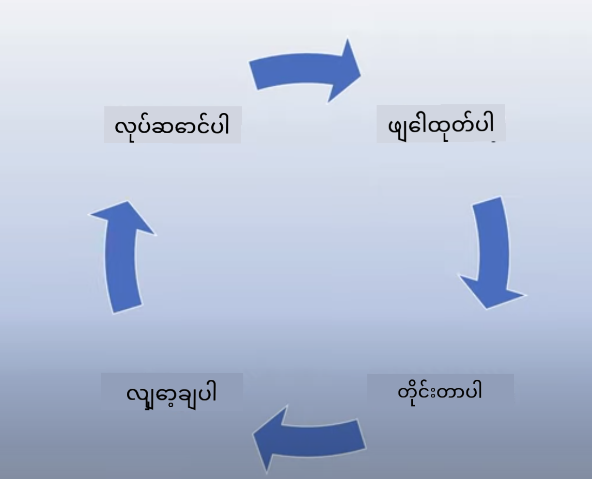

<!--
CO_OP_TRANSLATOR_METADATA:
{
  "original_hash": "7f8f4c11f8c1cb6e1794442dead414ea",
  "translation_date": "2025-07-09T09:05:21+00:00",
  "source_file": "03-using-generative-ai-responsibly/README.md",
  "language_code": "my"
}
-->
# Generative AI ကို တာဝန်ရှိစွာ အသုံးပြုခြင်း

> _ဓာတ်ပုံကို နှိပ်၍ ဤသင်ခန်းစာ၏ ဗီဒီယိုကို ကြည့်ရှုနိုင်ပါသည်_

AI နှင့် အထူးသဖြင့် Generative AI ကို စိတ်ဝင်စားဖွယ်ကောင်းစွာ ကြည့်ရှုရတာ လွယ်ကူပေမယ့်၊ တာဝန်ရှိစွာ အသုံးပြုနည်းကို စဉ်းစားဖို့ လိုအပ်ပါတယ်။ ထုတ်လွှင့်ချက်များကို တရားမျှတပြီး၊ အန္တရာယ်ကင်းစေရန် စဉ်းစားရမယ့် အချက်တွေ ရှိပါတယ်။ ဤအခန်းတွင် အဆိုပါအကြောင်းအရာများ၊ စဉ်းစားရမည့်အချက်များနှင့် AI အသုံးပြုမှုကို တိုးတက်အောင် လုပ်ဆောင်နည်းများကို ဖော်ပြပေးမှာ ဖြစ်ပါတယ်။

## နိဒါန်း

ဤသင်ခန်းစာတွင် ဖော်ပြမည့်အကြောင်းအရာများမှာ -

- Generative AI အက်ပလီကေးရှင်းများ တည်ဆောက်ရာတွင် Responsible AI ကို ဦးစားပေးရမည့် အကြောင်းရင်း
- Responsible AI ၏ အခြေခံ 원칙များနှင့် Generative AI နှင့် ဆက်စပ်မှု
- Strategy နှင့် ကိရိယာများမှတဆင့် Responsible AI 원칙များကို လက်တွေ့အသုံးချနည်း

## သင်ယူရမည့် ရည်မှန်းချက်များ

ဤသင်ခန်းစာပြီးဆုံးပြီးနောက် သင်သည် သိရှိရမည့်အချက်များမှာ -

- Generative AI အက်ပလီကေးရှင်းများ တည်ဆောက်ရာတွင် Responsible AI ၏ အရေးပါမှု
- Generative AI အက်ပလီကေးရှင်းများ တည်ဆောက်ရာတွင် Responsible AI ၏ အခြေခံ 원칙များကို ဘယ်အချိန်တွင် စဉ်းစားပြီး အသုံးချရမည်ကို
- Responsible AI ၏ အယူအဆကို လက်တွေ့အသုံးချရန် ရရှိနိုင်သည့် ကိရိယာများနှင့် မဟာဗျူဟာများ

## Responsible AI 원칙များ

Generative AI ၏ စိတ်လှုပ်ရှားမှုသည် မကြာသေးမီကထက် ပိုမိုမြင့်တက်လာသည်။ ဤစိတ်လှုပ်ရှားမှုကြောင့် နယူးဒီဗယ်လပ်ပါများ၊ အာရုံစိုက်မှုနှင့် ရန်ပုံငွေများ များပြားလာသည်။ Generative AI ကို အသုံးပြု၍ ထုတ်ကုန်များနှင့် ကုမ္ပဏီများ တည်ဆောက်လိုသူများအတွက် အလွန်ကောင်းမွန်သော်လည်း တာဝန်ရှိစွာ ဆောင်ရွက်ရန်လည်း အရေးကြီးပါသည်။

ဤသင်တန်းတစ်ခုလုံးတွင် ကျွန်ုပ်တို့သည် စတားတပ်နှင့် AI ပညာရေးထုတ်ကုန် တည်ဆောက်ခြင်းကို ဦးတည်ထားပါမည်။ ကျွန်ုပ်တို့သည် Responsible AI 원칙များဖြစ်သော Fairness, Inclusiveness, Reliability/Safety, Security & Privacy, Transparency နှင့် Accountability ကို အသုံးပြုမည်ဖြစ်ပြီး၊ ဤ 원칙များနှင့် Generative AI ကို ထုတ်ကုန်များတွင် အသုံးပြုရာတွင် ဆက်စပ်မှုကို လေ့လာသွားမည်ဖြစ်သည်။

## ဘာကြောင့် Responsible AI ကို ဦးစားပေးရသလဲ

ထုတ်ကုန်တစ်ခု တည်ဆောက်ရာတွင် အသုံးပြုသူ၏ အကျိုးစီးပွားကို ဦးစားပေးထားသော လူ့အခြေပြု နည်းလမ်းကို လိုက်နာခြင်းသည် အကောင်းဆုံးရလဒ်များကို ပေးစွမ်းနိုင်သည်။

Generative AI ၏ ထူးခြားချက်မှာ အသုံးပြုသူများအတွက် အကူအညီဖြစ်စေသော ဖြေကြားချက်များ၊ သတင်းအချက်အလက်များ၊ လမ်းညွှန်ချက်များနှင့် အကြောင်းအရာများကို ဖန်တီးပေးနိုင်ခြင်းဖြစ်သည်။ ဤလုပ်ငန်းစဉ်များကို လက်ဖြင့် များစွာလုပ်ဆောင်စရာမလိုဘဲ အံ့သြဖွယ်ရလဒ်များ ရရှိစေသည်။ သို့သော် သေချာစွာ စီမံကိန်းရေးဆွဲခြင်းနှင့် မဟာဗျူဟာများမရှိပါက အသုံးပြုသူများ၊ ထုတ်ကုန်နှင့် လူမှုအသိုင်းအဝိုင်းအပေါ် အန္တရာယ်ရှိသော ရလဒ်များ ဖြစ်ပေါ်စေနိုင်သည်။

အောက်တွင် အန္တရာယ်ရှိနိုင်သော ရလဒ်အချို့ကို ကြည့်ကြရအောင် (အားလုံးမဟုတ်ပါ) -

### Hallucinations

Hallucinations ဆိုသည်မှာ LLM တစ်ခုမှ ထုတ်ပေးသော အကြောင်းအရာသည် အပြည့်အစုံ မဟုတ်ဘဲ မမှန်ကန်သော သို့မဟုတ် အချက်အလက်အခြေခံချက်များနှင့် မကိုက်ညီသော အကြောင်းအရာများ ဖြစ်ပေါ်ခြင်းကို ဆိုလိုသည်။

ဥပမာအားဖြင့် ကျွန်ုပ်တို့၏ စတားတပ်အတွက် ကျောင်းသားများသည် သမိုင်းဆိုင်ရာ မေးခွန်းများကို မော်ဒယ်ထံ မေးမြန်းနိုင်သော လုပ်ဆောင်ချက်တစ်ခု တည်ဆောက်ကြပါစို့။ ကျောင်းသားတစ်ဦးက `Who was the sole survivor of Titanic?` ဟု မေးမြန်းသည်။

မော်ဒယ်မှ ထုတ်ပေးသော ဖြေကြားချက်မှာ အောက်ပါအတိုင်း ဖြစ်နိုင်သည် -

> _(အရင်းအမြစ်: [Flying bisons](https://flyingbisons.com?WT.mc_id=academic-105485-koreyst))_

ဤဖြေကြားချက်သည် ယုံကြည်စိတ်ချရပြီး အသေးစိတ်ဖြစ်သည်။ သို့သော် မမှန်ကန်ပါ။ သုတေသနအနည်းငယ်သာ ပြုလုပ်လျှင် Titanic မတော်တဆမှုတွင် တစ်ဦးထက်ပိုသော အသက်ရှင်သူများ ရှိကြောင်း သိရှိနိုင်သည်။ သုတေသန စတင်လေ့လာနေသော ကျောင်းသားအတွက် ဤဖြေကြားချက်သည် မေးမြန်းစရာမလိုဘဲ အမှန်တရားအဖြစ် ယူဆနိုင်သည်။ ၎င်းသည် AI စနစ်ကို ယုံကြည်စိတ်ချမှုမရှိစေပြီး ကျွန်ုပ်တို့၏ စတားတပ်၏ အမည်သရုပ်ကို ထိခိုက်စေနိုင်သည်။

LLM များ၏ မည်သည့် iteration မဆို hallucinations ကို လျော့နည်းစေရန် စွမ်းဆောင်ရည် တိုးတက်မှုများ ဖြစ်ပေါ်နေသည်။ ထိုတိုးတက်မှုများရှိသော်လည်း ကျွန်ုပ်တို့ application တည်ဆောက်သူများနှင့် အသုံးပြုသူများအနေဖြင့် ဤကန့်သတ်ချက်များကို အမြဲသတိထားရမည် ဖြစ်သည်။

### အန္တရာယ်ရှိသော အကြောင်းအရာများ

အရင်ပိုင်းတွင် LLM မှ မမှန်ကန်သော သို့မဟုတ် မနားလည်နိုင်သော ဖြေကြားချက်များ ထုတ်ပေးသောအခါကို ဖော်ပြခဲ့သည်။ ထို့အပြင် မော်ဒယ်မှ အန္တရာယ်ရှိသော အကြောင်းအရာများ ဖြေကြားသော အန္တရာယ်ကိုလည်း သတိထားရမည်။

အန္တရာယ်ရှိသော အကြောင်းအရာများကို အောက်ပါအတိုင်း သတ်မှတ်နိုင်သည် -

- ကိုယ်ပိုင်ထိခိုက်မှု သို့မဟုတ် အဖွဲ့အစည်းတစ်ခုအား ထိခိုက်စေခြင်းကို ညွှန်ကြားခြင်း သို့မဟုတ် အားပေးခြင်း
- မုန်းတီးမှု သို့မဟုတ် အလျော့စားသော အကြောင်းအရာများ
- တိုက်ခိုက်မှု သို့မဟုတ် အကြမ်းဖက်မှု စီမံကိန်းများ ညွှန်ကြားခြင်း
- တရားမဝင် အကြောင်းအရာ ရှာဖွေရန် သို့မဟုတ် တရားမဝင် လုပ်ရပ်များ ဆောင်ရွက်ရန် ညွှန်ကြားချက်များ
- လိင်ဆက်ဆံမှု အကြောင်းအရာများ ပြသခြင်း

ကျွန်ုပ်တို့၏ စတားတပ်အတွက် ကျောင်းသားများ မကြည့်ရောက်နိုင်စေရန် ဤအမျိုးအစား အကြောင်းအရာများကို တားဆီးနိုင်သော ကိရိယာများနှင့် မဟာဗျူဟာများ ရှိရန် လိုအပ်ပါသည်။

### တရားမျှတမှု မရှိခြင်း

တရားမျှတမှုကို “AI စနစ်သည် အကြိုက်အနှစ်သာရများနှင့် ခွဲခြားဆက်ဆံမှုများမှ လွတ်မြောက်ပြီး လူတိုင်းကို တရားမျှတစွာ ဆက်ဆံခြင်း” ဟု သတ်မှတ်သည်။ Generative AI ကမ္ဘာတွင် မော်ဒယ်ထုတ်လွှင့်ချက်များမှ နည်းပါးသော အဖွဲ့အစည်းများ၏ ထုတ်လွှင့်ချက်များကို ထပ်မံအားပေးခြင်း မဖြစ်စေရန် သေချာစေရန် လိုအပ်သည်။

ဤအမျိုးအစား ထုတ်လွှင့်ချက်များသည် အသုံးပြုသူများအတွက် ကောင်းမွန်သော ထုတ်ကုန်အတွေ့အကြုံများ ဖန်တီးရာတွင် မကောင်းစေသလို လူမှုအသိုင်းအဝိုင်းအပေါ်လည်း ထိခိုက်မှုများ ဖြစ်စေနိုင်သည်။ Application တည်ဆောက်သူများအနေဖြင့် Generative AI ဖြင့် ဖြေရှင်းချက်များ တည်ဆောက်ရာတွင် အသုံးပြုသူအုပ်စုများကို ကျယ်ပြန့်စွာ နှင့် မတူညီစွာ စဉ်းစားထားရမည် ဖြစ်သည်။

## Generative AI ကို တာဝန်ရှိစွာ အသုံးပြုနည်း

Responsible Generative AI ၏ အရေးပါမှုကို သိရှိပြီးနောက် AI ဖြေရှင်းချက်များကို တာဝန်ရှိစွာ တည်ဆောက်ရန် လုပ်ဆောင်နိုင်သည့် ၄ ချက်ကို ကြည့်ကြရအောင် -

### ဖြစ်နိုင်သော အန္တရာယ်များကို တိုင်းတာခြင်း

ဆော့ဖ်ဝဲ စမ်းသပ်မှုတွင် အသုံးပြုသူ၏ မျှော်မှန်းထားသော လုပ်ဆောင်ချက်များကို စမ်းသပ်သည်။ ထိုသို့ပင် အသုံးပြုသူများ အများဆုံး အသုံးပြုနိုင်သည့် မေးခွန်းများကို စမ်းသပ်ခြင်းသည် ဖြစ်နိုင်သော အန္တရာယ်များကို တိုင်းတာရန် ကောင်းမွန်သော နည်းလမ်းဖြစ်သည်။

ကျွန်ုပ်တို့၏ စတားတပ်သည် ပညာရေးထုတ်ကုန်တစ်ခု တည်ဆောက်နေသောကြောင့် ပညာရေးနှင့်ဆိုင်သော မေးခွန်းစာရင်းများ ပြင်ဆင်ထားသင့်သည်။ ဥပမာ - သင်ခန်းစာအကြောင်းအရာများ၊ သမိုင်းအချက်အလက်များ၊ ကျောင်းသားဘဝနှင့်ဆိုင်သော မေးခွန်းများ။

### ဖြစ်နိုင်သော အန္တရာယ်များကို လျော့နည်းစေရန်

ယခုအခါ မော်ဒယ်နှင့် ၎င်း၏ ဖြေကြားချက်များကြောင့် ဖြစ်ပေါ်နိုင်သည့် အန္တရာယ်များကို တားဆီး သို့မဟုတ် ကန့်သတ်နိုင်သော နည်းလမ်းများ ရှာဖွေကြရအောင်။ ဤကို အလွှာ ၄ ခုဖြင့် ကြည့်နိုင်သည် -

- **Model**။ သင့်အတွက် သင့်တော်သော မော်ဒယ်ကို ရွေးချယ်ခြင်း။ GPT-4 ကဲ့သို့ ပိုကြီးပြီး ရှုပ်ထွေးသော မော်ဒယ်များသည် အသေးစားနှင့် အထူးပြု အသုံးပြုမှုများတွင် အန္တရာယ်ရှိသော အကြောင်းအရာများ ပိုမိုဖြစ်ပေါ်စေနိုင်သည်။ သင်ကြားမှု ဒေတာဖြင့် fine-tune ပြုလုပ်ခြင်းကလည်း အန္တရာယ်ကို လျော့နည်းစေသည်။

- **Safety System**။ Safety system သည် မော်ဒယ်ကို ပံ့ပိုးပေးသည့် ပလက်ဖောင်းပေါ်တွင် အန္တရာယ်များကို လျော့နည်းစေရန် ကိရိယာများနှင့် ဖွဲ့စည်းမှုများ စုစည်းထားခြင်းဖြစ်သည်။ ဥပမာ - Azure OpenAI ဝန်ဆောင်မှုတွင် content filtering system ပါဝင်သည်။ ထို့အပြင် jailbreak attacks နှင့် bot များမှ မလိုလားအပ်သော လုပ်ဆောင်ချက်များကိုလည်း တွေ့ရှိနိုင်ရမည်။

- **Metaprompt**။ Metaprompts နှင့် grounding သည် မော်ဒယ်ကို အချို့သော အပြုအမူများနှင့် အချက်အလက်များအပေါ် အကန့်အသတ် သတ်မှတ်ရန် သို့မဟုတ် ဦးတည်ရန် နည်းလမ်းများဖြစ်သည်။ ဥပမာ - system inputs ကို အသုံးပြု၍ မော်ဒယ်၏ အကန့်အသတ်များ သတ်မှတ်ခြင်း၊ ထုတ်လွှင့်ချက်များကို စနစ်၏ အကွာအဝေး သို့မဟုတ် domain နှင့် ပိုမိုသက်ဆိုင်စေရန် ပေးခြင်း။

RAG (Retrieval Augmented Generation) ကဲ့သို့ နည်းပညာများကို အသုံးပြု၍ မော်ဒယ်ကို ယုံကြည်စိတ်ချရသော အရင်းအမြစ်များမှသာ သတင်းအချက်အလက် ရယူစေခြင်းလည်း ပါဝင်နိုင်သည်။ ဤသင်တန်းတွင် [search applications တည်ဆောက်ခြင်း](../08-building-search-applications/README.md?WT.mc_id=academic-105485-koreyst) အကြောင်း သင်ခန်းစာတစ်ခု ရှိသည်။

- **User Experience**။ နောက်ဆုံးအလွှာမှာ အသုံးပြုသူသည် ကျွန်ုပ်တို့၏ အက်ပလီကေးရှင်း UI/UX မှတဆင့် မော်ဒယ်နှင့် တိုက်ရိုက် ဆက်သွယ်ခြင်းဖြစ်သည်။ ထိုနည်းဖြင့် အသုံးပြုသူများ မော်ဒယ်ထံ ပေးပို့နိုင်သည့် input အမျိုးအစားများကို ကန့်သတ်နိုင်ပြီး အသုံးပြုသူထံ ပြသမည့် စာသား သို့မဟုတ် ပုံများကိုလည်း ထိန်းချုပ်နိုင်သည်။ AI အက်ပလီကေးရှင်းကို ထုတ်လုပ်ရာတွင် Generative AI အက်ပလီကေးရှင်း၏ လုပ်ဆောင်နိုင်မှုများနှင့် မလုပ်နိုင်သည့် အချက်များကို ဖော်ပြပေးရမည်။

ကျွန်ုပ်တို့တွင် [AI Applications များအတွက် UX ဒီဇိုင်း](../12-designing-ux-for-ai-applications/README.md?WT.mc_id=academic-105485-koreyst) သင်ခန်းစာတစ်ခုလုံး ရှိပါသည်။

- **Evaluate model**။ LLM များနှင့် အလုပ်လုပ်ရာတွင် မော်ဒယ်ကို သင်ကြားထားသော ဒေတာကို အမြဲထိန်းချုပ်၍ မရနိုင်သည့် အခက်အခဲ ရှိသည်။ ထိုသို့ဖြစ်သော်လည်း မော်ဒယ်၏ စွမ်းဆောင်ရည်နှင့် ထုတ်လွှင့်ချက်များကို အမြဲသုံးသပ်သင့်သည်။ မော်ဒယ်၏ တိကျမှု၊ ဆင်တူမှု၊ အခြေခံမှုနှင့် သက်ဆိုင်မှုကို တိုင်းတာခြင်းသည် transparency နှင့် ယုံကြည်မှု ပေးစွမ်းရာတွင် အရေးကြီးသည်။

### တာဝန်ရှိသော Generative AI ဖြေရှင်းချက် တည်ဆောက်ခြင်း

AI အက်ပလီကေးရှင်းများအတွက် လုပ်ငန်းဆောင်တာများ တည်ဆောက်ခြင်းသည် နောက်ဆုံးအဆင့်ဖြစ်သည်။ ဤတွင် ကျွန်ုပ်တို့၏ စတားတပ်၏ ဥပဒေ နှင့် လုံခြုံရေး ဌာနများနှင့် ပူးပေါင်း၍ စည်းမျဉ်းစည်းကမ်းများနှင့် ကိုက်ညီမှုရှိစေရန် လုပ်ဆောင်ရမည်။ စတင်ထုတ်လုပ်မည့်အချိန်တွင် ပေးပို့မှု၊ ဖြစ်ပွားနိုင်သည့် ပြဿနာများ ကိုင်တွယ်မှု

**အကြောင်းကြားချက်**  
ဤစာတမ်းကို AI ဘာသာပြန်ဝန်ဆောင်မှု [Co-op Translator](https://github.com/Azure/co-op-translator) ဖြင့် ဘာသာပြန်ထားပါသည်။ ကျွန်ုပ်တို့သည် တိကျမှန်ကန်မှုအတွက် ကြိုးစားသော်လည်း အလိုအလျောက် ဘာသာပြန်ခြင်းတွင် အမှားများ သို့မဟုတ် မှားယွင်းချက်များ ပါဝင်နိုင်ကြောင်း သတိပြုပါရန် မေတ္တာရပ်ခံအပ်ပါသည်။ မူရင်းစာတမ်းကို မိမိဘာသာစကားဖြင့်သာ တရားဝင်အရင်းအမြစ်အဖြစ် ယူဆသင့်ပါသည်။ အရေးကြီးသော အချက်အလက်များအတွက် လူ့ပညာရှင်များ၏ ပရော်ဖက်ရှင်နယ် ဘာသာပြန်ခြင်းကို အကြံပြုပါသည်။ ဤဘာသာပြန်ချက်ကို အသုံးပြုမှုကြောင့် ဖြစ်ပေါ်လာနိုင်သည့် နားလည်မှုမှားယွင်းမှုများအတွက် ကျွန်ုပ်တို့သည် တာဝန်မယူပါ။