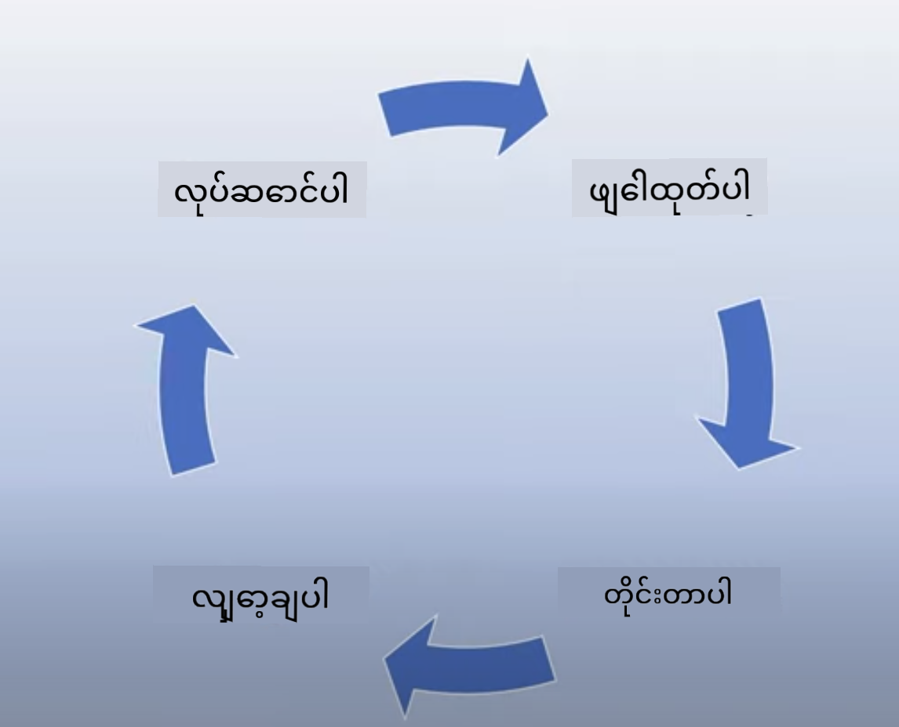

<!--
CO_OP_TRANSLATOR_METADATA:
{
  "original_hash": "13084c6321a2092841b9a081b29497ba",
  "translation_date": "2025-06-25T11:35:59+00:00",
  "source_file": "03-using-generative-ai-responsibly/README.md",
  "language_code": "my"
}
-->
# Generative AI ကို တာဝန်ရှိရှိ အသုံးပြုခြင်း

> _ဒီသင်ခန်းစာရဲ့ ဗီဒီယိုကို ကြည့်ရှုရန် အထက်ပါ ပုံကို နှိပ်ပါ_

AI နှင့် အထူးသဖြင့် Generative AI ကို စိတ်ဝင်စားဖွယ်ကောင်းလွန်းတတ်ပါသည်။ သို့သော် သင်သည် ၎င်းကို တာဝန်ရှိရှိ အသုံးပြုမည်ဖြစ်သောကြောင့် အလေးထားစဉ်းစားရန် လိုအပ်ပါသည်။ ထုတ်ကုန်သည် သမာသမတ်ကျမှု၊ ထိခိုက်မှုမရှိမှု စသဖြင့် ဘယ်လိုအချက်များကို စဉ်းစားရမည်ကို ဒီအခန်းက ရည်ရွယ်ချက်ပေးထားပြီး၊ ဘယ်လိုဆောင်ရွက်ရမည်ကို မျှော်မှန်းထားသည်။

## မိတ်ဆက်

ဒီသင်ခန်းစာမှာ အောက်ပါအကြောင်းအရာများကို ဖုံးကွယ်ပါမည်-

- Generative AI အက်ပလီကေးရှင်းများ တည်ဆောက်ရာတွင် Responsible AI ကို ဦးစားပေးရမည့် အကြောင်းရင်း
- Responsible AI ၏ အခြေခံကိုယ်ပိုင်အချက်များနှင့် Generative AI နှင့် ဘယ်လိုဆက်နွယ်ထားသည်ကို
- Strategy နှင့် Tooling မှတဆင့် ဒီ Responsible AI အချက်များကို လက်တွေ့ကျကျ အကောင်အထည်ဖော်ရန်

## သင်ယူရန် ရည်ရွယ်ချက်များ

ဒီသင်ခန်းစာကို ပြီးမြောက်ပြီးနောက် သင်သည် အောက်ပါအချက်များကို သိရှိပါမည်-

- Generative AI အက်ပလီကေးရှင်းများ တည်ဆောက်ရာတွင် Responsible AI ၏ အရေးကြီးမှု
- Generative AI အက်ပလီကေးရှင်းများ တည်ဆောက်ရာတွင် Responsible AI ၏ အခြေခံကိုယ်ပိုင်အချက်များကို ဘယ်အချိန်တွင် စဉ်းစားပြီး လက်တွေ့ကျကျ အကောင်အထည်ဖော်ရမည်
- Responsible AI ၏ အကြောင်းအရာကို လက်တွေ့ကျကျ အကောင်အထည်ဖော်ရန် သင်တို့တွင် ရရှိနိုင်သော လက်တွေ့ကျကျ Tools နှင့် Strategies

## Responsible AI ကိုယ်ပိုင်အချက်များ

Generative AI ၏ စိတ်လှုပ်ရှားမှုသည် ဘယ်တော့မှ မြင့်မားခဲ့သလိုမရှိပါ။ ဒီစိတ်လှုပ်ရှားမှုသည် ဒီကဏ္ဍသို့ Developer အသစ်များ၊ အာရုံစိုက်မှုများနှင့် အရင်းအမြစ်များကို ဆွဲဆောင်ခဲ့သည်။ Generative AI ကို အသုံးပြု၍ ထုတ်ကုန်များနှင့် ကုမ္ပဏီများ တည်ဆောက်လိုသော မည်သူမဆို အတွက် ဒီကဏ္ဍသည် အလွန်ကောင်းမွန်သော အခြေအနေဖြစ်သော်လည်း တာဝန်ရှိရှိ ဆက်လက်ဆောင်ရွက်ရန် အရေးကြီးပါသည်။

ဒီသင်တန်းတစ်ခုလုံးတွင် ကျွန်ုပ်တို့သည် ကျွန်ုပ်တို့၏ စတင်လုပ်ငန်းနှင့် AI ပညာရေးထုတ်ကုန်ကို တည်ဆောက်နေပါသည်။ ကျွန်ုပ်တို့သည် Responsible AI ၏ ကိုယ်ပိုင်အချက်များကို အသုံးပြုပါမည်- တရားမျှတမှု၊ လက်ခံမှု၊ ယုံကြည်စိတ်ချမှု/လုံခြုံမှု၊ လုံခြုံရေးနှင့် ကိုယ်ရေးအချက်အလက်များ၊ ပွင့်လင်းမြင်သာမှုနှင့် တာဝန်ခံမှု။ ဒီကိုယ်ပိုင်အချက်များနှင့်အတူ Generative AI ကို ကျွန်ုပ်တို့၏ထုတ်ကုန်များတွင် ဘယ်လိုအသုံးပြုမည်ကို လေ့လာပါမည်။

## ဘာကြောင့် Responsible AI ကို ဦးစားပေးသင့်သလဲ

ထုတ်ကုန်တစ်ခုကို တည်ဆောက်သောအခါ သင်၏အသုံးပြုသူ၏ အကျိုးကို ဦးစားပေး၍ လူ့အခြေပြု လမ်းစဉ်ကို လိုက်နာခြင်းက အကောင်းဆုံးရလဒ်များကို ဖြစ်ပေါ်စေသည်။

Generative AI ၏ ထူးခြားမှုမှာ အသုံးပြုသူများအတွက် အသုံးဝင်သော အဖြေများ၊ အချက်အလက်များ၊ လမ်းညွှန်ချက်များနှင့် အကြောင်းအရာများကို ဖန်တီးနိုင်စွမ်းဖြစ်သည်။ ၎င်းကို လက်ဖြင့် လုပ်ဆောင်ရန် လုပ်ငန်းစဉ်များ မရှိဘဲ လုပ်နိုင်ပြီး အလွန်အံ့သြဖွယ်ကောင်းသော ရလဒ်များကို ဖြစ်ပေါ်စေပါသည်။ သို့သော် လိုအပ်သော စီမံကိန်းများနှင့် လမ်းစဉ်များမပါလျှင် သင်၏ အသုံးပြုသူများ၊ ထုတ်ကုန်နှင့် လူမှုအသိုင်းအဝိုင်းတစ်ခုလုံးအတွက် အန္တရာယ်ဖြစ်နိုင်သော အချို့သော ရလဒ်များကို ဖြစ်ပေါ်စေနိုင်ပါသည်။

ဒီအန္တရာယ်ဖြစ်နိုင်သော ရလဒ်များအချို့ (အားလုံးမဟုတ်ပါ) ကို ကြည့်ကြပါစို့-

### Hallucinations

Hallucinations သည် LLM တစ်ခုက အကြောင်းအရာကို အပြီးအစီးမဟုတ်သော သို့မဟုတ် အခြားအချက်အလက်များအရ မှန်ကန်မှုမရှိသောအခါကို ဖော်ပြရန် အသုံးပြုသော စကားလုံးဖြစ်သည်။

ကျွန်ုပ်တို့၏ စတင်လုပ်ငန်းအတွက် မော်ဒယ်ကို သမိုင်းဆိုင်ရာ မေးခွန်းများကို မေးခွန်းထုတ်ရန် ကျောင်းသားများကို ခွင့်ပြုသော လုပ်ဆောင်ချက်တစ်ခုကို တည်ဆောက်လိုကြောင်း လိုက်နာကြည့်ပါစို့။ `Who was the sole survivor of Titanic?`

မော်ဒယ်က အောက်ပါအဖြေကို ထုတ်လုပ်သည်-

> _(Source: [Flying bisons](https://flyingbisons.com?WT.mc_id=academic-105485-koreyst))_

ဒီမှာ အလွန်သေချာပြီး အပြည့်အစုံဖြစ်သော အဖြေတစ်ခုဖြစ်သည်။ သို့သော် ဒါဟာ မှားယွင်းနေပါသည်။ အနည်းငယ်သော သုတေသနလုပ်ပါက Titanic Disaster မှ အသက်ရှင်ကျန်ရစ်သူ တစ်ဦးထက်ပိုရှိကြောင်း ရှာဖွေတွေ့ရှိနိုင်ပါသည်။ ဒီအကြောင်းအရာကို စတင်လေ့လာနေသော ကျောင်းသားတစ်ဦးအတွက် ဒီအဖြေသည် မေးခွန်းမထုတ်ဘဲ အချက်အလက်အဖြစ် လက်ခံရန် လုံလောက်သော စိတ်ဝင်စားဖွယ်ဖြစ်နိုင်ပါသည်။ ၎င်း၏ ရလဒ်များက AI စနစ်ကို ယုံကြည်စိတ်ချမှုမရှိခြင်းနှင့် ကျွန်ုပ်တို့၏ စတင်လုပ်ငန်း၏ ကောင်းမွန်မှုကို ထိခိုက်စေနိုင်ပါသည်။

ပေးထားသော LLM တစ်ခုချင်းစီ၏ iteration တစ်ခုချင်းစီနှင့်အတူ Hallucinations ကို လျှော့ချရန် လုပ်ဆောင်ချက်တိုးတက်မှုများကို တွေ့မြင်ရသည်။ ဒီတိုးတက်မှုနှင့်အတူ ကျွန်ုပ်တို့သည် အက်ပလီကေးရှင်းတည်ဆောက်သူများနှင့် အသုံးပြုသူများအနေဖြင့် ဒီကန့်သတ်ချက်များကို သိရှိထားရန် လိုအပ်ပါသည်။

### ထိခိုက်မှုရှိသော အကြောင်းအရာ

ယခင်ပိုင်းအပိုင်းတွင် LLM တစ်ခုက မှားယွင်းသော သို့မဟုတ် မဟုတ်သော အဖြေများကို ထုတ်လုပ်သောအခါကို ဖုံးကွယ်ခဲ့သည်။ ကျွန်ုပ်တို့ သတိထားရန် လိုအပ်သော အခြား အန္တရာယ်တစ်ခုမှာ မော်ဒယ်က ထိခိုက်မှုရှိသော အကြောင်းအရာဖြင့် တုံ့ပြန်သောအခါ ဖြစ်သည်။

ထိခိုက်မှုရှိသော အကြောင်းအရာကို အောက်ပါအတိုင်း အဓိပ္ပာယ်ဖွင့်ဆိုနိုင်ပါသည်-

- ကိုယ်ပိုင်ထိခိုက်မှု သို့မဟုတ် အုပ်စုအချို့ကို ထိခိုက်မှုရှိစေခြင်းကို လမ်းညွှန်ခြင်း သို့မဟုတ် လှုံ့ဆော်ခြင်း
- မုန်းတီးမှု သို့မဟုတ် အထင်အမြင်လျော့ကျစေသော အကြောင်းအရာ
- တိုက်ခိုက်မှု သို့မဟုတ် အကြမ်းဖက်မှု လှုပ်ရှားမှုများကို စီစဉ်ခြင်း
- မည်သည့် တရားမဝင် အကြောင်းအရာကို ရှာဖွေခြင်း သို့မဟုတ် တရားမဝင် လုပ်ဆောင်မှုများကို လုပ်ဆောင်ခြင်း
- လိင်ပိုင်းဆိုင်ရာ အကြောင်းအရာကို ဖော်ပြခြင်း

ကျွန်ုပ်တို့၏ စတင်လုပ်ငန်းအတွက် ကျွန်ုပ်တို့သည် ဒီအမျိုးအစားအကြောင်းအရာကို ကျောင်းသားများ မမြင်ရအောင် ကာကွယ်ရန် လက်တွေ့ကျကျ Tools နှင့် Strategies များကို သေချာစွာ ရှိထားချင်ပါသည်။

### သမာသမတ်ကျမှုမရှိခြင်း

သမာသမတ်ကျမှုကို “AI စနစ်သည် မတရားမှုနှင့် ကွဲပြားခြားနားမှုကင်းစင်စေခြင်းနှင့် မည်သူမဆိုကို သမာသမတ်ကျစွာနှင့် တန်းတူဆက်ဆံစေရန်” ဟု ဖော်ပြသည်။ Generative AI ၏ ကမ္ဘာတွင် ကျွန်ုပ်တို့သည် marginalized groups ၏ ကွဲပြားခြားနားသော ကမ္ဘာမြင်မှုပေါင်းများ မော်ဒယ်၏ ထုတ်ကုန်များဖြင့် ထပ်မံခိုင်မာစေခြင်းမရှိရန် သေချာချင်ပါသည်။

ဒီအမျိုးအစားထုတ်ကုန်များသည် ကျွန်ုပ်တို့၏ အသုံးပြုသူများအတွက် အပြုသဘောဆောင်သော ထုတ်ကုန်အတွေ့အကြုံများကို တည်ဆောက်ရန် ပျက်စီးစေသည့်အပြင် လူမှုအသိုင်းအဝိုင်းကို ထပ်မံ ထိခိုက်စေသည်။ အက်ပလီကေးရှင်းတည်ဆောက်သူများအနေဖြင့် Generative AI ဖြင့် ဖြေရှင်းချက်များကို တည်ဆောက်သောအခါ ကျယ်ဝန်းသော အသုံးပြုသူအစုကို အမြဲစဉ်းစားထားသင့်ပါသည်။

## Generative AI ကို ဘယ်လို တာဝန်ရှိရှိ အသုံးပြုမည်

ယခုတွင် Responsible Generative AI ၏ အရေးကြီးမှုကို ဖော်ထုတ်ပြီးနောက် ကျွန်ုပ်တို့၏ AI ဖြေရှင်းချက်များကို တာဝန်ရှိရှိ တည်ဆောက်ရန် လုပ်ဆောင်နိုင်သော ၄ ဆင့်ကို ကြည့်ကြပါစို့-

### ဖြစ်နိုင်သော အန္တရာယ်များကို တိုင်းတာပါ

ဆော့ဖ်ဝဲ စမ်းသပ်ခြင်းတွင် အသုံးပြုသူတစ်ဦး၏ လုပ်ဆောင်မှုများကို စမ်းသပ်ပါသည်။ ထို့အတူ အသုံးပြုသူများ မကြာခဏအသုံးပြုမည့် prompt များကို စမ်းသပ်ခြင်းသည် ဖြစ်နိုင်သော အန္တရာယ်ကို တိုင်းတာရန် ကောင်းမွန်သော နည်းလမ်းဖြစ်သည်။

ကျွန်ုပ်တို့၏ စတင်လုပ်ငန်းသည် ပညာရေးထုတ်ကုန်ကို တည်ဆောက်နေသောကြောင့် ပညာရေးနှင့် ဆက်စပ်သော prompt များစာရင်းကို ပြင်ဆင်ထားရပါမည်။ ၎င်းသည် သတ်မှတ်အကြောင်းအရာ၊ သမိုင်းဆိုင်ရာ အချက်အလက်များနှင့် ကျောင်းသားဘဝအကြောင်း prompt များကို ဖုံးကွယ်နိုင်သည်။

### ဖြစ်နိုင်သော အန္တရာယ်များကို လျှော့ချပါ

ယခုအခါမှာ မော်ဒယ်နှင့် ၎င်း၏ တုံ့ပြန်မှုများကြောင့် ဖြစ်နိုင်သော အန္တရာယ်ကို ကာကွယ် သို့မဟုတ် ကန့်သတ်နိုင်သော နည်းလမ်းများကို ရှာဖွေရန် အချိန်ဖြစ်သည်။ ၎င်းကို အတန်းအဆင့် ၄ ခုအဖြစ် ကြည့်နိုင်သည်-

- **Model**. သင့်အသုံးပြုမှုအတွက် သင့်တော်သော မော်ဒယ်ကို ရွေးချယ်ခြင်း။ GPT-4 ကဲ့သို့ ကြီးမားပြီး ဖန်တီးနိုင်စွမ်းရှိသော မော်ဒယ်များကို သေးငယ်ပြီး သတ်မှတ်ထားသော အသုံးပြုမှုများတွင် ထည့်သွင်းသောအခါ ထိခိုက်မှုရှိသော အကြောင်းအရာဖြစ်နိုင်မှုများကို ဖြစ်ပေါ်စေနိုင်ပါသည်။ သင်၏ လေ့ကျင့်မှုဒေတာကို အသုံးပြု၍ Fine-tune လုပ်ခြင်းသည် ထိခိုက်မှုရှိသော အကြောင်းအရာဖြစ်နိုင်မှုကို လျှော့ချပါသည်။

- **Safety System**. လုံခြုံရေးစနစ်သည် မော်ဒယ်ကို ဆာဗာပေးသည့် ပလပ်ဖောင်းတွင် အန္တရာယ်ကို လျှော့ချရန် ကူညီသော ကိရိယာများနှင့် ဖော်ပြချက်များဖြစ်သည်။ Azure OpenAI service တွင် content filtering system ကဲ့သို့ သင်္ကေတများသည် ဥပမာဖြစ်သည်။ စနစ်များသည် jailbreak တိုက်ခိုက်မှုများနှင့် bot များမှ တောင်းဆိုမှုများကဲ့သို့ မလိုလားအပ်သော လှုပ်ရှားမှုများကိုလည်း ထောက်လှမ်းသင့်သည်။

- **Metaprompt**. Metaprompts နှင့် grounding သည် သတ်မှတ်ထားသော လုပ်ဆောင်မှုများနှင့် အချက်အလက်များအပေါ် မော်ဒယ်ကို လမ်းညွှန် သို့မဟုတ် ကန့်သတ်နိုင်သော နည်းလမ်းများဖြစ်သည်။ ၎င်းသည် မော်ဒယ်၏ သတ်မှတ်ထားသော ကန့်သတ်ချက်များကို သတ်မှတ်ရန် စနစ် input များကို အသုံးပြုခြင်းဖြစ်နိုင်သည်။ ထို့အပြင် စနစ်၏ သတ်မှတ်ထားသော လယ်ယာသို့မဟုတ် domain နှင့် ပိုသက်ဆိုင်သော output များကို ပေးခြင်းဖြစ်နိုင်သည်။

၎င်းသည် Retrieval Augmented Generation (RAG) ကဲ့သို့သော နည်းလမ်းများကို အသုံးပြု၍ ယုံကြည်စိတ်ချရသော အရင်းအမြစ်များကိုသာ မော်ဒယ်မှ အချက်အလက်ကို ရယူရန် ဖြစ်နိုင်သည်။ ဒီသင်တန်း၏ နောက်ပိုင်းတွင် [ရှာဖွေမှုအက်ပလီကေးရှင်းများ တည်ဆောက်ခြင်း](../08-building-search-applications/README.md?WT.mc_id=academic-105485-koreyst) အတွက် သင်ခန်းစာတစ်ခု ရှိပါသည်

- **User Experience**. နောက်ဆုံးအတန်းအဆင့်မှာ အသုံးပြုသူသည် ကျွန်ုပ်တို့၏ အက်ပလီကေးရှင်း interface မှတဆင့် မော်ဒယ်နှင့် တိုက်ရိုက် အပြန်အလှန်ဆက်သွယ်သောနေရာဖြစ်သည်။ ဒီနည်းဖြင့် အသုံးပြုသူသည် မော်ဒယ်ကို ပေးပို့နိုင်သော input များအမျိုးအစားများကို ကန့်သတ်ရန် UI/UX ကို ဒီဇိုင်းဆွဲနိုင်သည်။ AI အက်ပလီကေးရှင်းကို တင်သွင်းသောအခါ ကျွန်ုပ်တို့၏ Generative AI အက်ပလီကေးရှင်းသည် ဘာလုပ်နိုင်သည်နှင့် ဘာလုပ်လို့မရနိုင်သည်ကို ပွင့်လင်းမြင်သာစွာ ဖော်ပြရပါမည်။

ကျွန်ုပ်တို့တွင် [AI အက်ပလီကေးရှင်းများအတွက် UX တည်ဆောက်ခြင်း](../12-designing-ux-for-ai-applications/README.md?WT.mc_id=academic-105485-koreyst) အတွက် သင်ခန်းစာတစ်ခု လုံးဝ dedicate ပြုထားပါသည်

- **Evaluate model**. LLM များနှင့် လုပ်ဆောင်ခြင်းသည် စိန်ခေါ်မှုဖြစ်သည်။ အကြောင်းမှာ မော်ဒယ်ကို လေ့ကျင့်သည့် ဒေတာကို အမြဲတမ်းထိန်းချုပ်နိုင်ခြင်းမရှိသောကြောင့် ဖြစ်

**အခွင့်အရေးရှင်**:  
ဒီစာရွက်ကို AI ဘာသာပြန်ဝန်ဆောင်မှု [Co-op Translator](https://github.com/Azure/co-op-translator) ကို အသုံးပြုပြီး ဘာသာပြန်ထားပါသည်။ ကျွန်ုပ်တို့သည် တိကျမှန်ကန်မှုကို ကြိုးစားသော်လည်း၊ အလိုအလျောက် ဘာသာပြန်ထားသော အချက်အလက်များတွင် အမှားများ သို့မဟုတ် မမှန်ကန်မှုများ ပါဝင်နိုင်သည်ကို သတိပြုပါ။ မူလစာရွက်ကို မူရင်းဘာသာစကားဖြင့် အာဏာတည်ရှိသော အရင်းအမြစ်အဖြစ် ရှုသင့်သည်။ အရေးကြီးသော အချက်အလက်များအတွက် လူ့ဘာသာပြန်ပညာရှင်၏ ဘာသာပြန်မှုကို အကြံပြုပါသည်။ ဒီဘာသာပြန်ကို အသုံးပြုခြင်းမှ ဖြစ်ပေါ်လာသော အလွဲသုံးလွဲမှုများ သို့မဟုတ် အထင်လွဲမှုများအတွက် ကျွန်ုပ်တို့သည် တာဝန်မယူပါ။