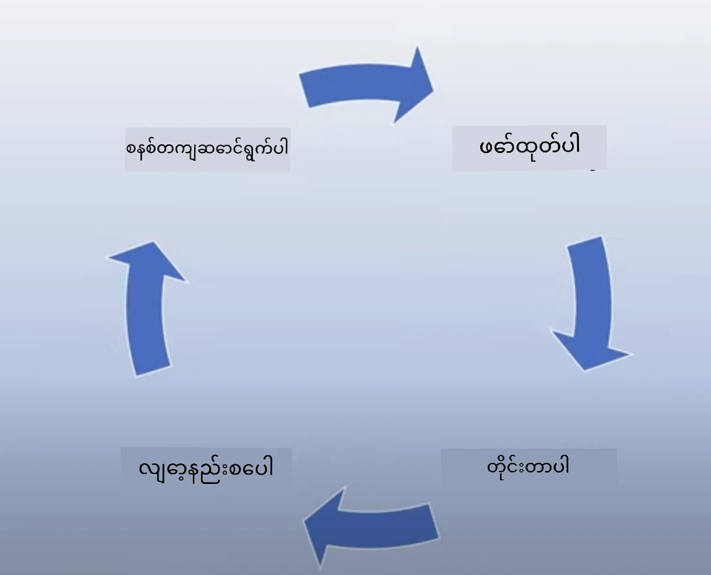

# ဇီဝမျိုးကူး AI ကို တာဝန်ရှိစွာ အသုံးပြုခြင်း

> _ဤသင်ခန်းစာ၏ ဗီဒီယိုကို ကြည့်ရန် အပေါ်ပုံကို နှိပ်ပါ_

AI နှင့် အထူးသဖြင့် ဇီဝမျိုးကူး AI အပေါ် စိတ်ဝင်စားဖွယ်ဖြစ်ခြင်းဟာ လွယ်ကူသော်လည်း၊ သင်၏ အသုံးပြုမှုကို တာဝန်ရှိစွာ ပြုလုပ်မည်ဆိုသည်မှာ အရေးကြီးပါသည်။ ထုတ်ကုန်သည် တရားမျှတပြီး၊ အန္တရာယ်မရှိစေရန်နှင့် အခြားအချက်များကို ပိုင်နိုင်ရန် သင်စဉ်းစားရန် လိုအပ်ပါသည်။ ဤအခန်းတွင် စဉ်းစားရန်အချက်များ၊ သင် စဉ်းစားရမည့်အချက်များနှင့် AI စံသတ်မှတ်ချက်အသုံးပြုခြင်းတိုးတက်စေရန် လုပ်ဆောင်ရန် လမ်းညွှန်ချက်များကို ပေးသွားမည်ဖြစ်သည်။

## နိဒါန်း

ဤသင်ခန်းစာတွင် ကောက်ချက်ချမည့်အချက်များမှာ -

- ဇီဝမျိုးကူး AI အပလီကေးရှင်းများ တည်ဆောက်ရာတွင် တာဝန်ရှိသော AI ကို မည်သည့်အကြောင်းပြချက်ဖြင့် ဦးစားပေးသင့်သည်ကို။
- တာဝန်ရှိသော AI ၏ အခြေခံ သဘောတရားများနှင့် ဇီဝမျိုးကူး AI အပေါ် ၎င်းတို့ ဆက်စပ်မှု။
- ဤတာဝန်ယူမှုအခြေခံ သဘောတရားများကို မူဝါဒနှင့် ကိရိယာများ ဖြင့် အကောင်အထည်ဖော်နည်း။

## သင်ယူရမည့်ရည်မှန်းချက်များ

ဤသင်ခန်းစာပြီးမြောက်ပါက သင်သိရှိမည့်အချက်များမှာ -

- ဇီဝမျိုးကူး AI အပလီကေးရှင်းများ တည်ဆောက်မှုတွင် တာဝန်ရှိသော AI ၏ အရေးပါမှု။
- ဇီဝမျိုးကူး AI အပလီကေးရှင်းတွေ တည်ဆောက်ရာတွင် တာဝန်ရှိသော AI ၏ အခြေခံသဘောတရားများကို မည်သည့်အချိန်တွင် စူးစမ်းသုံးသပ်ရမည်။
- တာဝန်ရှိသော AI ၏ အယူအဆများကို လက်တွေ့အသုံးပြုရန် အသုံးမည့် ကိရိယာများနှင့် မူဝါဒများ။

## တာဝန်ရှိသော AI ၏ သဘောတရားများ

ဇီဝမျိုးကူး AI ၏ အားကျခြင်းသည် ယခင်ကထက် များပြားစွာရှိလာပြီးဖြစ်သည်။ ဤအားကျမှုကြောင့် အသစ်သော တီထွင်ဖန်တီးသူများ၊ သတိစောင့်ခြင်းနှင့် ရင်းနှီးမြှုပ်နှံမှုများ ရရှိလာပါသည်။ ဇီဝမျိုးကူး AI အသုံးပြု၍ ထုတ်ကုန်နှင့် ကုမ္ပဏီများ တည်ဆောက်လိုသူများအတွက် ဒီကဏ္ဍသည် အတော်ပင် အကျိုးရှိသော်လည်း တာဝန်ရှိစွာ ဆောင်ရွက်ရန်လည်း အလွန်အရေးကြီးပါသည်။

ဤသင်တန်းတစ်ခုလုံးအတွင်း အနာဂတ် စတတ်အပ်ပြီး AI ပညာပေးထုတ်ကုန် တည်ဆောက်ရေးအပေါ် အာရုံစိုက်သွားမည်ဖြစ်သည်။ ကျနော်တို့သည် တာဝန်ရှိသော AI ၏ သဘောတရားများဖြစ်သည့် တရားမျှတမှု၊ ပါဝင်ဆောင်ရွက်မှု၊ ယုံကြည်စိတ်ချရမှု / လုံခြုံမှု၊ လုံခြုံရေးနှင့် ကိုယ်ရေးကိုယ်တာ လုံခြုံမှု၊ ထင်ရှားမှုနှင့် တာဝန်ယူမှုတို့ကို အသုံးပြုမည်။ ဤသဘောတရားများနှင့်အတူ ဇီဝမျိုးကူး AI ကို ကျွန်တော်တို့ထုတ်ကုန်များတွင် မည်သို့ အသုံးပြုသည်ကို ရှင်းလင်းလိုက်ပါမည်။

## တာဝန်ရှိသော AI ကို မည်ကည်း မှ ဦးစားပေးသင့်သလဲ

ထုတ်ကုန်တည်ဆောက်စဉ် လူမျိုးအခြေခံ မူဝါဒသည် အသုံးပြုသူ၏ အကျိုးစီးပွားကို ဦးစားပေးစဉ်းစားခြင်းဖြင့် အကောင်းဆုံးရလဒ်များကို ရရှိစေသည်။

ဇီဝမျိုးကူး AI ၏ ထူးခြားချက်မှာ အသုံးပြုသူများအတွက် အကောင်းသောအဖြေများ၊ သတင်းအချက်အလက်များ၊ လမ်းညွှန်ချက်များနှင့် အကြောင်းအရာများကို ဖန်တီးပေးနိုင်မှုအားဖြင့် ဖြစ်သည်။ ၎င်းကို လက်မလှုပ်ခင်လှုပ်ရှားမှုပြုမထားပဲလည်း အံ့ဩဖွယ်ကောင်းသော ရလဒ်များ ရရှိစေမည် ဖြစ်သည်။ သို့သော် မကောင်းသော အစီအစဉ်မရှိပါက အသုံးပြုသူများ၊ ထုတ်ကုန်နှင့် လူမှုခေတ်အပေါ် ဖောက်ပြန်ဆိုးကျိုးများ ဖြစ်ပေါ်စေနိုင်သည်။

အခု အောက်ပါ အန္တရာယ်ရှိနိုင်သော (အားလုံး မဟုတ်သော်လည်း) စိတ်မချရသော ရလဒ်များကို ကြည့်ကြမည် -

### မဟာဗျူဟာနှင့်ကွာခြားမှုများ

မဟာဗျူဟာများဆိုသည်မှာ LLM တစ်ခုက အကြောင်းအရာကို လူမသိအောင်မမှန်ကန်သော၊ ဒေတာနောက်ခံအရ မှန်ကန်မှု မရှိသော၊ မဖြစ်နိုင်သော အကြောင်းအရာများကို တင်ပြသည်။

ဥပမာအားဖြင့် ကျွန်ုပ်တို့၏ စတတ်အပ်စ်အတွက် သမိုင်းဆိုင်ရာ မေးခွန်းတစ်ခုကို မေးနိုင်သော အင်္ဂါရပ်တစ်ခု တည်ဆောက်သည်ဟု ယူဆပါစို့။ ကျောင်းသားတစ်ဦးက `တိုင်တံနစ်၏ တစ်ဦးတည်း ကျန်ရှိသူ ဘယ်သူလဲ?` ဟု မေးပါသည်။

မော်ဒယ်မှ အောက်ပါအဖြေကို ထုတ်ပြန်သည်-

> _(အရင်းအမြစ်: [Flying bisons](https://flyingbisons.com?WT.mc_id=academic-105485-koreyst))_

၎င်းမှာ အကောင်းဆုံး နှင့် တိကျစွာ ဖြေကြားမှု ဖြစ်ပေမဲ့ မမှန်ပါ။ ရှာဖွေမှုနည်းနည်းသာ ကုသရင် တိုင်တံနစ် မတော်တဆမှုတွင် ကျန်ရှိသူများသည် တစ်ဦးထက် မများဘူးဆိုသည်ကို သိရှိနိုင်ပါသည်။ ထိုအကြောင်းအရာကို အသုံးပြု၍ စတင်ရှာဖွေနေသော ကျောင်းသားအတွက် စကားပုံဖြစ်ပြီး၊ အမှန်တရားအဖြစ် ခံယူနိုင်ခြင်းရှိနိုင်သည်။ ၎င်းကြောင့် AI စနစ် မယုံကြည်စိတ်ချရမှု ဖြစ်ပေါ်ပြီး ကျွန်တော်တို့ စတတ်အပ်စ်၏ အတည်တကျမှုအပေါ် သက်ရောက်မှုရှိမည် ဖြစ်သည်။

LLM တစ်ခုချင်းစီ၏ အဆင့်သစ်တွင် မဟာဗျူဟာများကို လျော့နည်းစေရန် စွမ်းဆောင်ရည် တိုးတက်မှုများ လေ့လာတွေ့ရှိထားပါသည်။ ဤတိုးတက်မှုရှိသော်လည်း ထူးခွားသော အကြောင်းအရာများကို လျော့နည်းစေခြင်းအတွက် ကျွန်ုပ်တို့ application တည်ဆောက်သူများနှင့် အသုံးပြုသူများသည် ထိုကန့်သတ်ချက်များကို သတိပြု ဆောင်ရွက်ရမည် ဖြစ်သည်။

### အန္တရာယ်ရှိနိုင်သော အကြောင်းအရာများ

အရင်ပိုင်း အခန်းကဏ္ဍတွင် LLM မမှန်ကန်သော်လည်း အကြောင်းအရာများထုတ်ပေးသောအခါ ရှိခဲ့သော အန္တရာယ်များကို ဖော်ပြခဲ့သည်။ ထို့အပြင် မော်ဒယ်က အန္တရာယ်ရှိသော အကြောင်းအရာများ တုံ့ပြန်သောအခါ ဖြစ်နိုင်သော အန္တရာယ်များကိုပါ သတိပြုရမည်။

အန္တရာယ်ရှိသော အကြောင်းအရာများဆိုသည်မှာ-

- ကိုယ့်ကိုယ်ကို ထိခိုက်မှု သို့မဟုတ် အုပ်စုတစ်ချို့အား ထိခိုက်စေခြင်းကို ညွှန်ပြ သို့မဟုတ် ပံ့ပိုးခြင်း။
- မုန်းတီးထားသော သို့မဟုတ် ရိုင်းစိုင်းသော အကြောင်းအရာများ။
- တိုက်ခိုက်မှု၊ ခံညာမှု လျှူထားမှု စီစဉ်ခြင်း။
- မတရားအကြောင်းအရာများ ပစ္စည်း ရှာဖွေမှု သို့မဟုတ် မတရားလုပ်ရပ်များ ဆောင်ရွက်နည်းညွှန်ပြခြင်း။
- လိင်ပိုင်းဆိုင်ရာ အပြစ်ကျပ်သော အကြောင်းအရာ ပြသခြင်း။

ကျွန်တော်တို့၏ စတတ်အပ်စ်တွင် ကျောင်းသားများမှ ထောက်မခံရန်အတွက် ဒီအကြောင်းအရာများမြင်တွေ့ရခြင်းမှ ကာကွယ်ရန် ကိရိယာနှင့် မူဝါဒများ ရှိရမည်။

### တရားမျှတမှုမရှိခြင်း

တရားမျှတမှုကို “AI စနစ်သည် စွဲပြားမှုများနှင့် ခွဲခြားမှုများကင်းစင်ပြီး လူတိုင်းကို တရားမျှတစွာ နှင့် တူညီစွာ  ဆက်ဆံမှုရှိစေရန်” ဆိုသည်ဖြင့် သတ်မှတ်သည်။ ဇီဝမျိုးကူး AI ကမ္ဘာတွင် မော်ဒယ် တုံ့ပြန်ချက်များဖြင့် လူအခြေပြု အစုအဝေးများကို 제외ခြင်းမရှိစေရန် ကြိုးစားရမည်။

ဤအမျိုးအစား ထုတ်လွှင့်ချက်များသည် အသုံးပြုသူများအတွက် အကောင်းကျိုးဖြစ်စေရန် မဟုတ်သော်လည်း လူမှုအသိုင်းအဝိုင်းအပေါ် ဆိုးကျိုး ပို၍ ဖြစ်စေနိုင်သည်။ မော်ဒယ်ဖန်တီးသူများအနေဖြင့် ဇီဝမျိုးကူး AI ဖြင့် ဖြေရှင်းနည်းများ တည်ဆောက်ရာတွင် အသုံးပြုသူများ အများပြည်သူ အကျယ်အဝန်းကို အမြဲစဥ်းစားထားရမည်။

## ဇီဝမျိုးကူး AI ကို တာဝန်ရှိစွာ မည်ကည်း အသုံးပြုမလဲ

တာဝန်ရှိသော ဇီဝမျိုးကူး AI ၏ အရေးပါမှုကို ဆွဲထုတ်သွားပြီးနောက်၊ ကျွန်ုပ်တို့၏ AI ဖြေရှင်းနည်းများကို တာဝန်ရှိစွာ တည်ဆောက်ရေးအတွက် လုပ်ဆောင်ရမည့် ၄ ချက်ကို ကြည့်ရှုကြမယ် -

### ဖြစ်နိုင်သော အန္တရာယ်များ တိုင်းတာခြင်း

ဆိုက်ဘာစမ်းသပ်မှုတွင် အသုံးပြုသူ၏ လုပ်ဆောင်ချက် များကို စမ်းသပ်သည်။ တူညီသလို အသုံးပြုသူများ မိမိတို့ အသုံးပြုနိုင်ခြေများရှိသည့် prompt များကို စမ်းသပ်ခြင်းသည် ဖြစ်နိုင်သည့် အန္တရာယ်များကို တိုင်းတာရန် ကောင်းမွန်သည်။

ကျောင်းဆိုင်ရာ ထုတ်ကုန် တည်ဆောက်နေသူ ကျွန်တော်တို့ အနေနှင့် ကျောင်းဆိုင်ရာ prompt များ စုစည်းထားခြင်း ကောင်းမွန်ပါမည်။ ထူးခြားသောဘာသာရပ်၊ သမိုင်းစိတ်ဝင်စားမှုနှင့် ကျောင်းသူ နေ့စဉ် အသုံးပြုမှု အကြောင်း prompt များ ပါရှိရမည်။

### ဖြစ်နိုင်သော အန္တရာယ်များ ကန့်သတ်ခြင်း

မော်ဒယ်နှင့် ၎င်း၏ တုံ့ပြန်မှုများကြောင့် ဖြစ်နိုင်သော အန္တရာယ်များကို ကာကွယ်မှုပြုခြင်း သို့မဟုတ် ကန့်သတ်မှုပြုခြင်းဆိုင်ရာ နည်းလမ်းများကို ရှာဖွေရမည်။ ဤကိစ္စကို ၄ အလွှာ ခွဲ၍ လေ့လာကြမည်။

- **Model**. သင့်လျော်သည့် အသုံးပြုမှုအတွက် မော်ဒယ် အသစ်ရွေးခြင်း။ GPT-4 ကဲ့သို့ အကြီးစား နှင့် ရှုပ်ထွေးသော မော်ဒယ်များကို အသေးစား သားသာ သတ်မှတ်ချက်များတွင် အသုံးပြုလျှင် အန္တရာယ်များ ပိုမိုဖြစ်ပေါ်နိုင်သည်။ သင်္ကေတအချက်အလက်ဖြင့် လေ့ကျင့်ခြင်းဖြင့်လည်း အန္တရာယ်ပမာဏ ပြန်လျော့နည်းစေသည်။

- **Safety System**. မော်ဒယ်ကို ဝန်ဆောင်မှု ပလက်ဖောင်းတွင် ထောက်ပံ့သည့် ကိရိယာများနှင့် ပြင်ဆင်မှုများ စနစ်တကျရှိခြင်းဖြင့် အန္တရာယ် တားဆီးမှု။ ဥပမာအားဖြင့် Azure OpenAI ဝန်ဆောင်မှုတွင် သိမ်းဆည်းထားသည့် အကြောင်းအရာ စစ်တမ်းစနစ်။ ထို့အပြင် jailbreak တိုက်ခိုက်မှုများ၊ bot က တောင်းဆိုမှုများ စသည့် မလိုလားအပ်မှုများကို စတင် တွေ့ရှိရမည်။

- **Metaprompt**. Metaprompt နှင့် grounding သည် မော်ဒယ်ကို ထိန်းညှိခြင်း သို့မဟုတ် ကန့်သတ်ခြင်းနည်းလမ်းများ ဖြစ်သည်။ ဥပမာအားဖြင့် မော်ဒယ်၏ အကန့်အသတ်များ သတ်မှတ်ရန် system input များ အသုံးပြုခြင်း။ ထို့အပြင် စနစ်၏ အသုံးပြုခွင့်နှင့် ပို၍ သက်ဆိုင်မှုရှိသော output များ ပေးရန်လည်း ဖြစ်နိုင်သည်။

RAG (Retrieval Augmented Generation) နည်းလမ်း စသည်ဖြင့် ယုံကြည်စိတ်ချရသော ဘာသာရပ်များမှ သတင်းအချက်အလက်ကိုသာ မော်ဒယ်က ရှာဖွေထုတ်ယူစေသည်။ ဤသင်ခန်းစာတွင် [ရှာဖွေရေးအပလီကေးရှင်းများ တည်ဆောက်ခြင်း](../08-building-search-applications/README.md?WT.mc_id=academic-105485-koreyst) ကိုလည်း လေ့လာနိုင်သည်။

- **User Experience**. နောက်ဆုံးအလွှာမှာ အသုံးပြုသူသည် ကျွန်တော်တို့၏ အပလီကေးရှင်း UI/UX မှတဆင့် မော်ဒယ်နှင့် တိုက်ရိုက် ဆက်သွယ်မှုရှိသောနေရာ ဖြစ်သည်။ ဤနေရာတွင် အသုံးပြုသူက မော်ဒယ်သို့ ပေးပို့နိုင်သည့် input အမျိုးအစားများကို ကန့်သတ်ခြင်းနှင့် အသုံးပြုသူ မျက်နှာပြင်တွင် ပြသသည့် စာသား သို့မဟုတ် ပုံများကို ဒီဇိုင်းဆွဲခြင်းဖြစ်သည်။ AI အပလီကေးရှင်း တပ်ဆင်ရာတွင် ကျွန်ုပ်တို့၏ ဇီဝမျိုးကူး AI အတှကျ မည်သည့်အရာများ ပြုလုပ်နိုင်ပြီး မပြုလုပ်နိုင်သည်ကို ထင်ရှားစွာ ဖော်ပြရမည်။

ကျွန်တော်တို့တွင် [AI အပလီကေးရှင်းများအတွက် UX ဒီဇိုင်းဆွဲခြင်း](../12-designing-ux-for-ai-applications/README.md?WT.mc_id=academic-105485-koreyst) ကို လေ့လာရန် သင်ခန်းစာ တစ်ခုလုံး ရှိသည်။

- **Model အကဲဖြတ်ခြင်း**. LLM များနှင့်အတူ လုပ်ကိုင်ရာတွင် မော်ဒယ် သင်ကြားထားသည့် ဒေတာကို သင်အစွမ်းကုန် ထိန်းချုပ်နိုင်မှု မရှိသော်လည်း မော်ဒယ်၏ စွမ်းဆောင်ရည်နှင့် ထုတ်လွှင့်ချက်များကို အမြဲအကဲဖြတ်ရမည်။ မော်ဒယ်၏ တိကျမှု၊ ဆင်တူမှု၊ အခြေခံမှုပြုမှုနှင့် ထုတ်လွှင့်ချက် သက်ဆိုင်မှုများကို တိုင်းတာရန် အရေးပါသည်။ ၎င်းသည် ပါဝင်သူများနှင့် အသုံးပြုသူများအား ထင်ရှားမှုနှင့် ယုံကြည်မှုပိုင်ဆိုင်စေသည်။

### တာဝန်ရှိသော ဇီဝမျိုးကူး AI ဖြေရှင်းနည်းကို လည်ပတ်ခြင်း

AI အပလီကေးရှင်းများအတွက် လည်ပတ်မှု ပြုလုပ်မှု အဆင့်နောက်ဆုံးသည်။ ၎င်းတွင် စတတ်အပ်စ်၏ တခြားဌာနများဖြစ်သည့် ဥပဒေ ဌာနနှင့် လုံခြုံရေးတို့နှင့် ပူးပေါင်း၍ စည်းကမ်းများနှင့် ပြဋ္ဌာန်းချက်များကို လိုက်နာခြင်းပါဝင်သည်။ ထုတ်လုပ်ခြင်းမပြုမီ ပေးပို့ခြင်း၊ ဖြစ်ပေါ်နိုင်သော ပြဿနာများကို ကိုင်တွယ်နည်းများနှင့် ပြန်လည်ကောက်ကြံမှု စီမံချက်များ တည်ဆောက်ခြင်းအားဖြင့် အသုံးပြုသူများကို ဖြစ်နိုင်သော ဆိုးကျိုးများမှ ကာကွယ်ရန် ကြိုးပမ်းရမည်။

## ကိရိယာများ

တာဝန်ရှိသော AI ဖြေရှင်းနည်းများ ဖန်တီးရခြင်းမှာ အနည်းအကြီး ဆော့ကိုပ်တာပင်ဖြစ်ပေမယ့် လုပ်ငန်းဟာ ထိုကျ ကိုယ်တိုင် အလွန်တန်ဖိုးရှိသည်။ ဇီဝမျိုးကူး AI ဒေသ မြှင့်တင်လာမှုနှင့်အမျှ တာဝန်ရှိမှု တိုးတက်စေရန် ကိရိယာများပိုများလာမည်။ ဥပမာအားဖြင့် [Azure AI Content Safety](https://learn.microsoft.com/azure/ai-services/content-safety/overview?WT.mc_id=academic-105485-koreyst) သည် API တောင်းဆိုမှုမှတစ်ဆင့် အန္တရာယ်ရှိသော အကြောင်းအရာများနှင့် ပုံများကို မှတ်ထားနိုင်သည်။

## အသိပညာ စစ်ဆေးမှု

တာဝန်ရှိသော AI အသုံးပြုမှု များအတွက် သင့်စိတ်ပူရမည့်အရာများမှာ -

1. ဖြေချက်သည် မှန်ကန်မှုရှိသည်။
1. အန္တရာယ်ရှိသော အသုံးပြုမှုများ၊ AI ကို ပြစ်မှုများ အတွက် မသုံးရ။
1. AI က ဆွဲဖမ်းခြင်းနှင့် ခွဲခြားမှုမှ ကင်းရှင်းသည်။

အဖြေ- ၂ နှင့် ၃ မှန်သည်။ တာဝန်ရှိသော AI သည် အန္တရာယ်ရှိမှုများနှင့် အဆင်မပြေမှုများကင်းရှင်းရေးကို စဉ်းစားစေသည်။

## 🚀 စိန်ခေါ်မှု

[Azure AI Content Safety](https://learn.microsoft.com/azure/ai-services/content-safety/overview?WT.mc_id=academic-105485-koreyst) ကို ဖတ်ရှုပြီး သင့် အသုံးပြုမှုအတွက် မည်သည့်အရာကို လက်ခံယူနိုင်မည်ကို ကြည့်ပါ။

## အရမ်းကောင်းပါပြီ၊ သင်ယူမှုဆက်လက်လုပ်ဆောင်ပါ

ဤသင်ခန်းစာပြီးဆုံးရာတွင် ကျွန်ုပ်တို့၏ [Generative AI Learning collection](https://aka.ms/genai-collection?WT.mc_id=academic-105485-koreyst) ကို ပြန်လည်ကြည့်ရှု၍ ဇီဝမျိုးကူး AI အသိပညာ မြှင့်တင်ဆက်သွားနိုင်ပါသည်။

ဒုတိယသင်ခန်းစာသို့ ဆက်သွားပြီး [Prompt Engineering Fundamentals](../04-prompt-engineering-fundamentals/README.md?WT.mc_id=academic-105485-koreyst) ကိုလေ့လာလိုက်ပါ။

---

<!-- CO-OP TRANSLATOR DISCLAIMER START -->
**ပြောကြားချက်**
ဤစာတမ်းကို AI ဘာသာပြန်ဝန်ဆောင်မှု [Co-op Translator](https://github.com/Azure/co-op-translator) အသုံးပြု၍ ဘာသာပြန်ထားပါသည်။ ကျွန်ုပ်တို့သည် တိကျမှန်ကန်မှုအတွက် ကြိုးပမ်းနေသော်လည်း၊ စက်ကိရိယာဘာသာပြန်ခြင်းများတွင် အမှားများ သို့မဟုတ် မှားယွင်းချက်များ ပါဝင်နိုင်ကြောင်း သတိပြုပါရန် လိုအပ်ပါသည်။ မူလစာတမ်းကို မူရင်းဘာသာဖြင့်သာ ယုံကြည်စိတ်ချရသော အချက်အလက်အဖြစ် သတ်မှတ်သင့်သည်။ အရေးကြီးသည့် သတင်းအချက်အလက်များအတွက် ပရော်ဖက်ရှင်နယ် လူသားဘာသာပြန်သူဝန်ဆောင်မှုကို အကြံပြုပါသည်။ ဤဘာသာပြန်ချက်ကို အသုံးပြုခြင်းမှ ဖြစ်ပေါ်လာသော နားလည်မှုကွာခြားမှုများ သို့မဟုတ် မမှန်ကန်သော အသုံးပြုမှုများအတွက် ကျွန်ုပ်တို့ တာဝန်မခံပါ။
<!-- CO-OP TRANSLATOR DISCLAIMER END -->