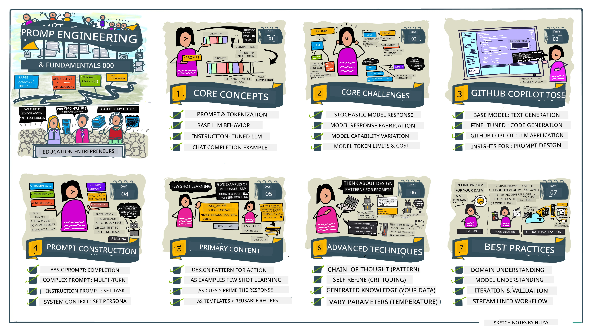
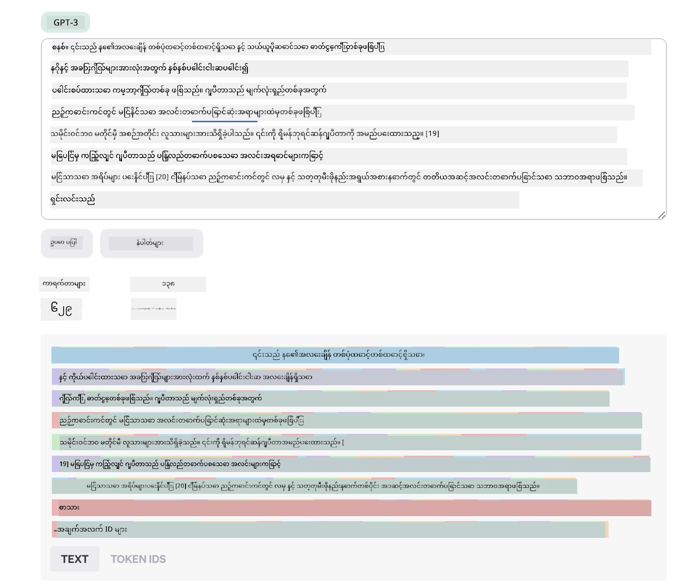
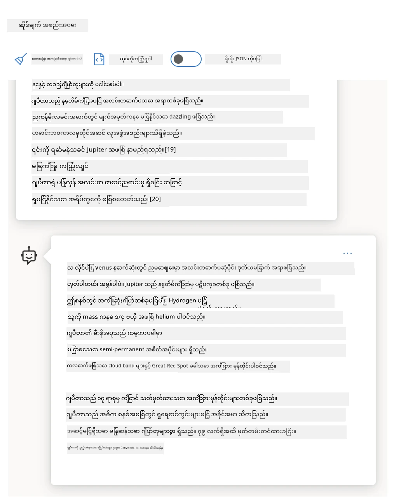
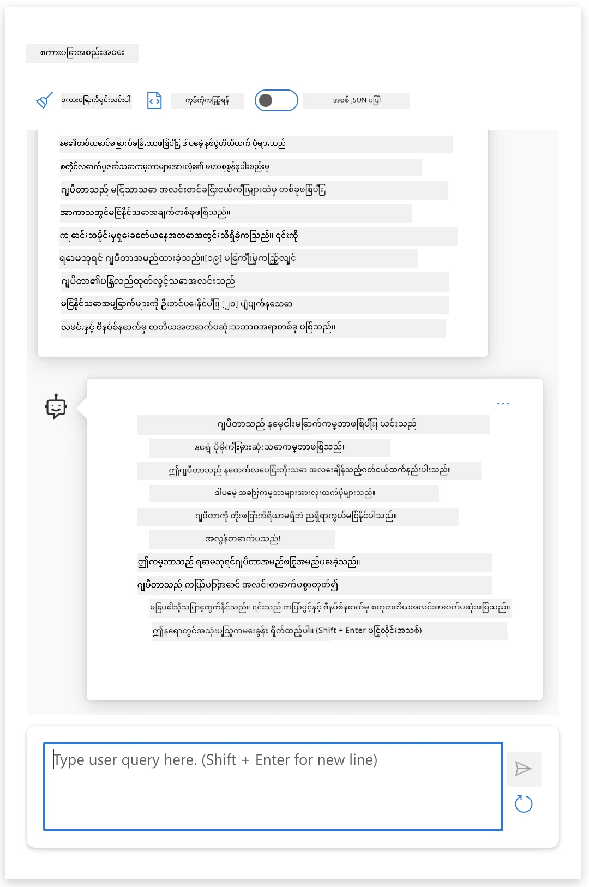
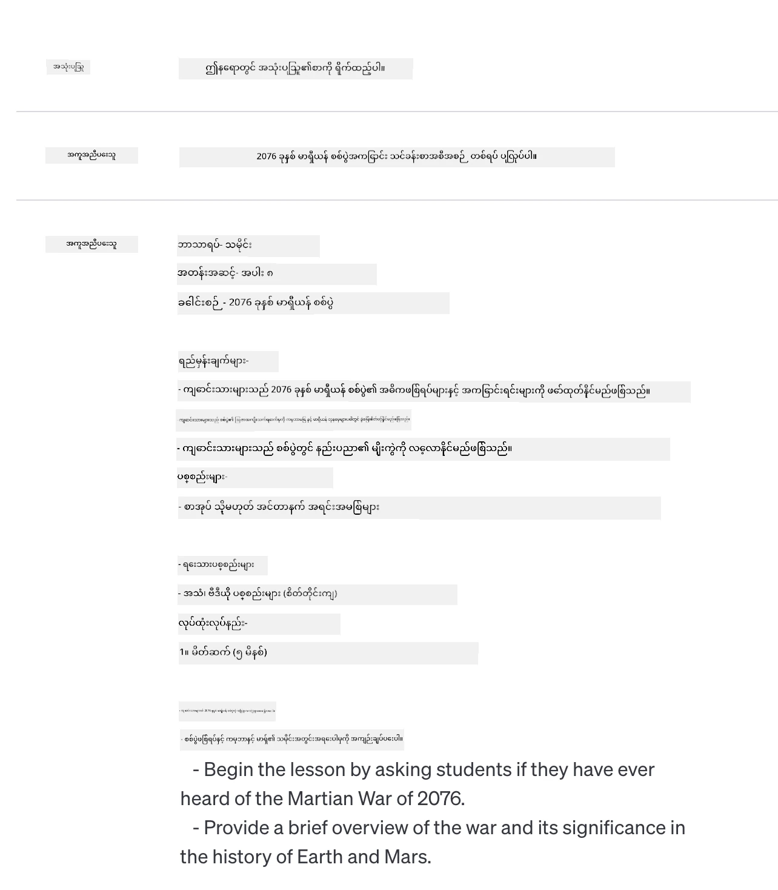
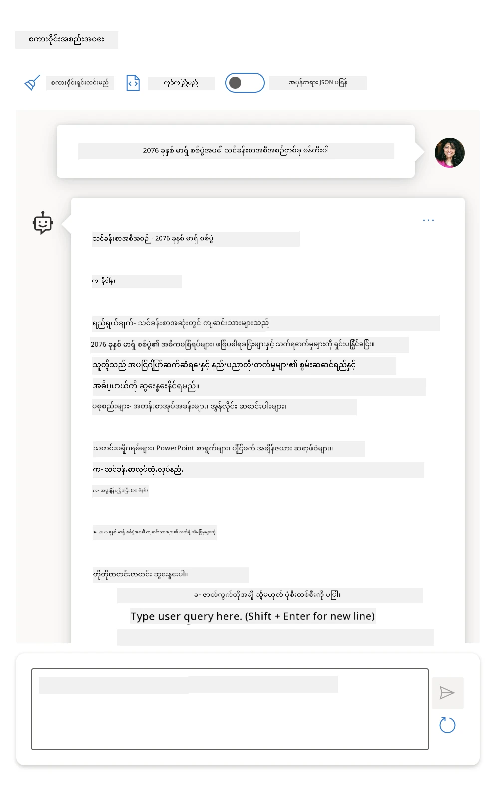
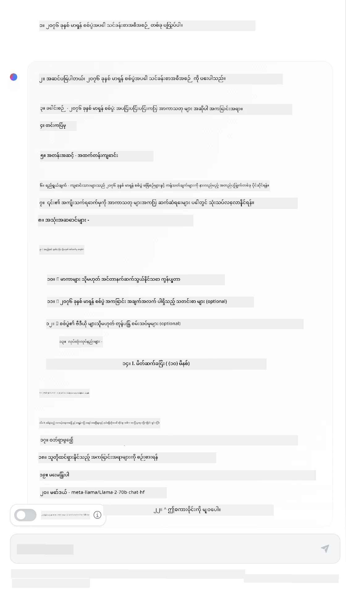

# အကြံပြုတင်ပြချက် အခြေခံများ

[](https://youtu.be/GElCu2kUlRs?si=qrXsBvXnCW12epb8)

## မိတ်ဆက်
ဤပိုင်းသင်ခန်းစာတွင် ဇိမ်ခံ AI မော်ဒယ်များအတွက် ထိရောက်တဲ့ အကြံပြုချက်များ ဖန်တီးရာတွင် လိုအပ်သော အယူအဆများနှင့် နည်းပညာများကို ဖော်ပြထားပါသည်။ LLM (Large Language Model) သို့ သင့် အကြံပြုချက်ကို ဘယ်လိုရေးသားတင်ပြသည်ဆိုတာ အရေးကြီးပါသည်။ သေချာစွာ ဖန်တီးထားသော အကြံပြုချက်တစ်ခုက ပြန်လည်ဖြေကြားမှုကို ပိုမိုကောင်းမွန်စေရန်ဖြစ်သည်။ သို့သော် _prompt_ နှင့် _prompt engineering_ စသည့် စကားလုံးများသည် တကယ်ဘာကို ဆိုလိုသနည်း? ကျွန်ုပ်တို့ LLM သို့ လွှဲပြောင်းပေးသော prompt _input_ ကို မည်သို့တိုးတက်အောင်လုပ်မလဲ? ဤအကြောင်းအရာများကို ဤအခန်းနှင့် နောက်တစ်ခန်းအတွင်း ဖြေကြားကြမည်ဖြစ်သည်။

_Generative AI_ သည် အသုံးပြုသူ တောင်းဆိုချက်များအပေါ် အကြောင်းအရာအသစ်များ (ဥပမာ၊ စာသား၊ ပုံများ၊ အသံ၊ ကုဒ် အစရှိသည်) ဖန်တီးနိုင်သည်။ ၎င်းသည် OpenAI ၏ GPT ("Generative Pre-trained Transformer") စီးရီးကဲ့သို့သော _ပြည့်စုံသောဘာသာစကားမော်ဒယ်များ_ ကို သဘာဝဘာသာစကားနှင့် ကုဒ် အသုံးပြုခြင်းအတွက် သင်ကြားထားခြင်းဖြင့် အကောင်အထည်ဖော်သည်။

အသုံးပြုသူများသည် နည်းပညာပိုင်း လေ့လာမှုများမလိုဘဲ လူသိများသော စကားပြောပုံစံများဖြင့် မော်ဒယ်များနှင့် ဆက်သွယ်နိုင်ပါသည်။ မော်ဒယ်များသည် _prompt-based_ ဖြစ်ပြီး၊ အသုံးပြုသူအနေဖြင့် စာသားအတိုး (prompt) တစ်ခု ပို့ပြီး AI မှ တုံ့ပြန်မှု (completion) ကို ပြန်လည်ရရှိပါသည်။ ထို့နောက် "AI နှင့် စကားပြောခြင်း" ကို အဆက်အသွယ်များဖြင့် ဆက်လက်လုပ်ဆောင်၍ ပြန်လည်ဖြေကြားချက်များသည် မျှော်မှန်းချက်နှင့် ကိုက်ညီသည်အထိ အကြံပြုချက်များကို မြှင့်တင်နိုင်သည်။

ယခု "Prompts" သည် ဇိမ်ခံ AI application များအတွက် အဓိက _ပရိုဂရမ်မင်း အင်တာဖေ့စ်_ ဖြစ်လာပြီး၊ မော်ဒယ်များအတွက် ကိစ္စကောင်းပြုရန်၌ လမ်းညွှန်ခြင်းနှင့် ပြန်လည်ဖြေကြားချက်များ၏ အရည်အသွေးကို သက်ရောက်စေသည်။ "Prompt Engineering" သည် မြန်ဆန်စွာ တိုးတက်နေသော သင်ယူမှုကွင်းဖြစ်ပြီး၊ _ဒီဇိုင်းဖန်တီးခြင်းနှင့် အကောင်းဆုံးနှင့် အဆင်ပြေဆုံး prompt များ ရှာဖွေပြင်ဆင်ခြင်း_ ပေါ်တွင် အာရုံစိုက်သည်။

## သင်ယူရန် ရည်မှန်းချက်များ

ဤသင်ခန်းစာတွင် သင်ယူမည့်အရာမှာ Prompt Engineering ဆိုသည်မှာဘာလဲ၊ အရေးကြီးသည့်အကြောင်း၊ နည်းလမ်းများဖြင့် မော်ဒယ်အမျိုးအစားနှင့် သုံးစွဲမှုရည်ရွယ်ချက်အတွက် ပိုမိုထိရောက်သော prompt များ ဖန်တီးနိုင်မည်။ prompt engineering ၏ အခြေခံ အယူအဆများနှင့် အကောင်းဆုံး လေ့ကျင့်နည်းများကို နားလည်မည် - သင်တန်းအတွင်း Jupyter Notebook ပတ်ဝန်းကျင်ကိုလည်း အသုံးပြုကြည့်လိမ့်မည်။

ဤသင်ခန်းစာပြီးဆုံးသည့်အချိန်တွင် ကျွန်ုပ်တို့သည် -

1. Prompt engineering ဆိုတာ အဘယ်ကြောင့် အရေးကြီးသလဲ စနစ်တကျရှင်းပြနိုင်မည်။
2. Prompt ၏ ကဏ္ဍတွေဖြစ်သည့် အစိတ်အပိုင်းတွေကို ဖော်ပြနိုင်မည်။
3. Prompt engineering အတွက် အကောင်းဆုံးလေ့ကျင့်နည်းများနှင့် နည်းပညာများကို သင်ယူနိုင်မည်။
4. သင်ယူထားသောနည်းပညာများကို တကယ့်နမူနာများတွင် အသုံးပြုပြီး OpenAI endpoint အသုံးပြုနိုင်မည်။

## အဓိက အကြောင်းအရာများ

Prompt Engineering: AI မော်ဒယ်များကို လိုအပ်သည့် အထွက်များ ပေးဆောင်ရန် လမ်းညွှန်ရန် အချက်အလက်(သို့)အချက်များကို ဒီဇိုင်းဖန်တီးခြင်းနှင့် ပြင်ဆင်ခြင်းလုပ်ငန်း။

Tokenization: စာသားကို မော်ဒယ်နားလည်၍ လုပ်ဆောင်နိုင်ရန် ပြောင်းလွှာရာ ကိန်းညဏ်သို့ (tokens) ခြားနားစိတ်ဖြတ်ခြင်း။

Instruction-Tuned LLMs: တိကျသည့် လမ်းညွန်ချက်များဖြင့် တိုးတက်တင်စားထားသော ပြည့်စုံသောဘာသာစကားမော်ဒယ်များ။

## သင်ယူရန် Sandbox ပတ်ဝန်းကျင်

Prompt engineering သည် လက်ရာအနုပညာအစဉ်မပြတ်ခြင်းထက် ပို၍ အနုပညာဖြစ်လာနေသည်။ ၎င်း၏ စိတ်ထဲသို့ နားလည်မှုတိုးတက်အောင် အကောင်းဆုံးနည်းလမ်းမှာ _လေ့ကျင့်မှုများ ရှိခြင်း_ နှင့် လွှမ်းမိုးမှုနှင့် အသုံးပြုမှုနယ်ပယ်ပေါင်းများစွာကို ထည့်သွင်း၍ လေ့လာသင်ယူတတ်ရန်ဖြစ်ပါသည်။

ဤသင်ခန်းစာတွင် Jupyter Notebook တစ်ခု ပါဝင်ပြီး သင်လေ့လာသည်များကို ၎င်းမှာ ကျင့်သုံးကြည့်နိုင်မည်။ လေ့ကျင့်ခေါင်းစဉ်များအတွက် -

1. **Azure OpenAI API key** - ဒေတာမျက်နှာချင်းဆိုင်သော LLM အတွက် ဝန်ဆောင်မှုပို့စ်ပါစင်။
2. **Python Runtime** - Notebook ကို လည်ပတ်ရန် လိုအပ်သည်။
3. **နယ်ပယ်ပြင်ပပတ်ဝန်းကျင်အပြင်** - _[SETUP](./../00-course-setup/02-setup-local.md?WT.mc_id=academic-105485-koreyst) လုပ်ဆောင်မှုများပြီး အဆင်သင့်ဖြစ်အောင်_။

Notebook တွင် အစပြုလေ့ကျင့်ခန်းများပါရှိသော်လည်း သင်နှစ်သက်ရာအတိုင်း _Markdown_ (ဖော်ပြချက်) နှင့် _Code_ (prompt တောင်းဆိုမှုများ) ကို ထပ်မံထည့်သွင်း၍ အကြောင်းအရာများ၊ ဆန်းသစ်ထူးခြားသော အကြံအချက်များ ရရှိနိုင်မည်။

## ရုပ်ပြထားသော လမ်းညွှန်

ဤသင်ခန်းစာအတွက် သင်သွားရမည့် အဓိက အကြောင်းအရာများကို ကြည့်ရှုရန် ရုပ်ပြလမ်းညွှန်တစ်ခုရှိသည်။ လမ်းညွှန်သည် အဓိက အကြောင်းအရာများနှင့် သင်ယူရန်အချက်များကို ဖော်ပြပြီး နည်းလမ်းများနှင့် အကောင်းဆုံး လေ့ကျင့်နည်းများ ထိတွေ့စွာ တင်ပြထားသည်။ သတိပြုရန်မှာ "Advanced Techniques" အပိုင်းသည် ထိုကွန်ရက်ချပ်တပ်၏ နောက်ပိုင်း အခန်းတွင် ပါဝင်သည့်အကြောင်းအရာများဖြစ်သည်။



## ကျွန်ုပ်တို့၏ စတားတပ်

ယခု _ဤအကြောင်းအရာ_ သည် ကျွန်ုပ်တို့၏ စတားတပ် မစ်ရှင်ဖြစ်သော [ပညာရေးတွင် AI ဆန်းသစ်တီထွင်မှုဖြန့်ချိခြင်း](https://educationblog.microsoft.com/2023/06/collaborating-to-bring-ai-innovation-to-education?WT.mc_id=academic-105485-koreyst) နှင့် မည်သို့ ဆက်စပ်သည်ကို ဆွေးနွေးကြပါစို့။ ကျွန်ုပ်တို့သည် _ကိုယ်ပိုင်သင်ယူမှု_ ထောက်ပံ့မှု AI အခြေပြု app များ ဖန်တီးလိုကြောင်း ဖော်ပြသည် - ထို့ကြောင့် အသုံးပြုသူအမျိုးအစား များစွာသည် မည်သို့ "prompt" များကို ဒီဇိုင်းဖန်တီးနိုင်မလဲ ခေါ်ဆိုကြည့်ရအောင် -

- **အုပ်ချုပ်ရေးမှူးများ** သည် AI ကို _သင်ရိုးအစီအစဉ်ဒေတာကို စီစစ်၍ ဖုံးကွယ်မှုများကို ဖော်ထုတ်ရန်_ တောင်းနိုင်သည်။ AI သည် ရလဒ်များကို စုစည်းဖော်ပြနိုင်ပြီး ကုဒ်ဖြင့် မြင်ကွင်းဖန်တီးနိုင်သည်။
- **ပညာပေးသူများ** သည် AI ကို _ရည်ရွယ်ထားသည့် မျက်နှာဖုံးနှင့် ခေါင်းစဉ်အပေါ် သင်ခန်းစာအစီအစဉ် တည်ဆောက်ရန်_ တောင်းနိုင်သည်။ AI သည် သတ်မှတ်ထားသော ပုံစံဖြင့် ကိုယ်ပိုင်အစုမိတ်အစီအစဉ် တည်ဆောက်ပေးသည်။
- **ကျောင်းသားများ** သည် AI ကို _ဒုက္ခရောက်သောဘာသာရပ်တစ်ခုတွင် သင်ကြားပေးရန်_ တောင်းနိုင်သည်။ AI သည် ကျောင်းသားအဆင့်နှင့် ကိုက်ညီသည့် သင်ခန်းစာ၊ အကြံဉာဏ်နှင့် နမူနာများဖြင့် လမ်းညွှန်ပေးနိုင်သည်။

ဤသည်သည် မျက်နှာဖြင့်သာ တစိတ်တပိုင်းဖြစ်သည်။ ပညာရေးအတတ်ပညာရှင်များက စုစည်းထားသည့် [Prompts For Education](https://github.com/microsoft/prompts-for-edu/tree/main?WT.mc_id=academic-105485-koreyst) ကို ကြည့်ရှုပါ - နောက်ထပ်နယ်ပယ်များကို အကျယ်တဝင့် သိရှိနိုင်မည်။ _ဤ prompt များမှ တစ်ချို့ကို sandbox တွင် သို့မဟုတ် OpenAI Playground တွင် ပြေးစမ်းကြည့်ပါ_။

<!--
LESSON TEMPLATE:
This unit should cover core concept #1.
Reinforce the concept with examples and references.

CONCEPT #1:
Prompt Engineering.
Define it and explain why it is needed.
-->

## Prompt Engineering ဆိုတာဘာလဲ?

ဤသင်ခန်းစာအစမှာ **Prompt Engineering** ကို _ဒီဇိုင်းပြုဆွဲခြင်းနှင့် မြှင့်တင်တိုးတက်အောင် ပြင်ဆင်ခြင်း_ ဆိုသည်ကို ဖေါ်ပြခဲ့သည်၊ ကြိုတင်သတ်မှတ်ထားသော မော်ဒယ်နှင့် ရည်ရွယ်ချက်အတွက် တဖြည်းဖြည်း ပြောင်းလဲပြီး၊ စနစ်မြင့်ကျသော၊ အရည်အသွေးရှိသော ပြန်လည်ဖြေကြားမှုကို ရသည်။ ၎င်းကို ၂ ခြေလှမ်းဖြင့် ထင်မြင်ကြရမည် -

- တစ်ခုမှာ မော်ဒယ်နှင့် ရည်ရွယ်ချက်အတွက် ပထမဆုံး အကြံပြုချက်ကို ဒီဇိုင်းဆွဲခြင်း
- ဒုတိယမှာ ပြန်လည်ဖြေကြားမှု အရည်အသွေး တိုးတက်အောင် အကြံပြုချက် ကို တစ်ကြိမ်ထပ် တစ်ကြိမ် ပြန်လည်ပြင်ဆင်ခြင်း

ဤသည် သဘောတူအတည်ပြုခြင်းနှင့် စမ်းသပ်သည့် လုပ်ငန်းစဉ်ဖြစ်ပြီး အသုံးပြုသူ ရှင်းလင်းမှုနှင့် ကြိုးပမ်းမှု လိုအပ်သည်။ ထိုကွောင့် အရေးကြီးခြင်းကို ခွဲခြားရန်အတွက် အောက်ပါသုံးအကြောင်းအရာကို နားလည်ရမည် -

- _Tokenization_ = မော်ဒယ်သည် prompt ကို မည်သို့ "မြင်" သနည်း
- _Base LLMs_ = နိဒါန်းမော်ဒယ်သည် prompt ကို မည်သို့ "လုပ်ဆောင်" သနည်း
- _Instruction-Tuned LLMs_ = မော်ဒယ်သည် "တာဝန်များ" ကို မည်သို့ "မြင်သနည်း"

### Tokenization

LLM သည် prompts များကို _token_ များ စီးရီးအဖြစ်မြင်ကာ မော်ဒယ်အမျိုးအစား (သို့မဟုတ် မော်ဒယ် ဗားရှင်းမှတ်တမ်း) အလိုက် အကြံပြုချက်တူညီမှုအား ကိုယ်တိုင် မတူကွဲပြားစွာ token လုပ်ကြသည်။ LLM များသည် ကျောင်းသားစာမဟုတ်သည့် စာသားမှုများဖြင့် မဟုတ်ဘဲ token များပေါ်က ချဲ့ထွင်သင်ကြားထားသောကြောင့် prompt ၏ token ဖြိုခွဲမှုသည် ပြန်လည်ဖြေကြားမှုအရည်အသွေးပေါ် အနက်ရောက်မှုရှိသည်။

tokenization ပြုလုပ်ပုံကို နားလည်ရန်အတွက် [OpenAI Tokenizer](https://platform.openai.com/tokenizer?WT.mc_id=academic-105485-koreyst) ကိရိယာကို အသုံးပြုကြည့်ပါ။ သင်၏ prompt ကို ကူးထည့်ပြီး token များအဖြစ် ဘယ်လိုပြောင်းလဲသွားသည်၊ အကွာအဝေးနဲ့အတူ လုံးတော်ပေါက်လုံးလေးများကို မည်သို့ စီစစ်ခြင်းများကို ဉာဏ်ရည်ထဲ ရောက်စေပါသည်။ ဤနမူနာတွင်ဟောင်းပြီး GPT-3 LLM ကို ခေါ်သည်၊ နောက်ဆုံးမော်ဒယ်နှင့် လိုက်လျှောက်စမ်းသပ်ခြင်းမှာ မတူကွဲပြားမှုရှိနိုင်သည်။



### အယူအဆ - နိဒါန်းမော်ဒယ်များ

prompt များ tokenized ပြီးလျှင် ["Base LLM"](https://blog.gopenai.com/an-introduction-to-base-and-instruction-tuned-large-language-models-8de102c785a6?WT.mc_id=academic-105485-koreyst) (သို့) နိဒါန်းမော်ဒယ်၏ အဓိကလုပ်ဆောင်ချက်မှာ ထို token စီးရီးမှ နောက်တစ်ခုကို တွက်ချက်ခန့်မှန်းခြင်း ဖြစ်သည်။ LLM များသည် ကြီးမားသော စာသား ဒေတာတစ်စုထဲတွင် သင်ကြားထား၍ token များအကြား ဆက်စပ်မှုကို သိရှိပြီး ယုံကြည်မှုနည်းနည်းဖြင့် ခန့်မှန်းနိုင်ပါသည်။ တစ်စုံတစ်ခုမှ တပုဒ်မှတ်ထူး ခံယူချက် (ဘာသာရပ်) ကို မမြင်သော်လည်း အနီးကပ်ဖော်ပြချက်လည်းရှိပါသည်။ အသုံးပြုသူ မှ တားဆီးသည် သို့မဟုတ်တစ်ခုခု ကြိုတင်ဆုံးဖြတ်ထားသော အခြေအနေဖြင့် ခန့်မှန်းမှုကို ရပ်တန့်သည်။

prompt-based completion ကို ကြည့်ရှုလိုပါသလား? အထက်ပါ prompt ကို Azure OpenAI Studio [_Chat Playground_](https://oai.azure.com/playground?WT.mc_id=academic-105485-koreyst) ထဲတွင် အရိုးရှင်းဆုံး သတ်မှတ်ချက်ဖြင့် ထည့်သွင်းကြည့်ပါ။ စနစ်တွင် prompt များကို သတင်းအချက်အလက် တောင်းဆိုမှုအဖြစ် ကိုင်တွယ်ပြီး၊ သင့်အား အယ့်လိုဖြေကြားမှုတစ်ခုကို ကြည့်ရှုရအောင် ဖြစ်သည်။

သို့သော် အသုံးပြုသူသည် ရည်ညွှန်းချက်တစ်ခုဖြင့် သတ်မှတ်ချက်အရ အစီအစဉ်တစ်ခုလိုလားပါက ဘာဖြစ်မည်နည်း? ၎င်းမှာ _instruction-tuned_ LLM များ ၏ အရေးပါမှုပါဝင်သည်။



### အယူအဆ - Instruction Tuned LLM များ

[Instruction Tuned LLM](https://blog.gopenai.com/an-introduction-to-base-and-instruction-tuned-large-language-models-8de102c785a6?WT.mc_id=academic-105485-koreyst) သည် နိဒါန်းမော်ဒယ်ကို ချိတ်ဆက်ပြီး သတ်မှတ်ချက်ရှိ သင်ခန်းစာများ (ဥပမာ၊ multi-turn "messages") ဖြင့် ဆက်သွယ်သော ဥပမာများဖြင့် ရေတွက်တတ်စေသည်။ AI ကို ထိုသတ်မှတ်ချက်များ လိုက်နာခိုင်းခြင်းဖြင့် ပြန်လည်ဖြေကြားမှုများ ထုတ်ပေးပါသည်။

၎င်းသည် RLHF (Reinforcement Learning with Human Feedback) ကဲ့သို့သော နည်းလမ်းများကိုအသုံးပြုပြီး မော်ဒယ်ကို _ညွှန်ကြားချက်များ လိုက်နာရန်_ နှင့် _တုံ့ပြန်မှုများမှ သင်ယူရန်_ သင်ကြားပေးသည်၊ ထို့ကြောင့် တကယ့်အသုံးပြုမှုများနှင့် အသုံးပြုသူ ရည်ရွယ်ချက်နှင့်ကျောပတ်မှု မြင့်မားသည့် ပြန်လည်ဖြေကြားမှုများ ထုတ်ပေးနိုင်သည်။

မကြာခင် စမ်းကြည့်ပါ - အထက်ပါ prompt ကို ပြန်လည်ဝင်ကြည့်ပါ၊ အခုတော့ _system message_ တွင် အောက်ပါညွှန်ကြားချက်ကို အခြေခံညွှန်ကြားချက်အဖြစ် ပြောင်းလဲပေးပါ။

> _ဤအကြောင်းအရာကို ဒုတိယတန်းကျောင်းသားအတွက် အကျဉ်းချုပ်ရေးပါ။ ၃-၅ ချက်များအပါအဝင် တစ်ပိုဒ်စာဖြင့် ထိန်းသိမ်းပါ။_

ရလဒ်သည် ရည်ရွယ်ချက်နှင့် ပုံစံကို လိုက်လျောညီထွေပြီဟု တွေ့မြင်နိုင်ပါသည်။ ပညာပေးသူတစ်ဦးသည် သင်ခန်းစာတွင် ယခု ပြန်လည်ဖြေကြားမှုကို တိုက်ရိုက်အသုံးပြုနိုင်ပါသည်။



## Prompt Engineering လိုအပ်သော အကြောင်းရင်း

prompt များကို LLM များက မည်သို့ လုပ်ဆောင်သည်ကို သိသည်မှာ ကောင်းသော်လည်း ဖြစ်ပေါ်လိုက်သည့်အချက်မှာ၊ လောလောဆယ် LLM များတွင် ရှိနေသည့် စိန်ခေါ်မှုများကြောင့် _ယုံကြည်စိတ်ချရပြီး မပြောင်းလဲသော ပြန်လည်ဖြေကြားမှုများ_ ရရှိရန် အကြံပြုချက် အခြေပြု နည်းလမ်းများကို စနစ်တကျ တည်ဆောက်ပြီး မြှင့်တင်ရန် လိုအပ်သည်။ ဥပမာ -

1. **မော်ဒယ်ဖြေကြားချက်များသည် ပျမ်းမျှမတည်ငြိမ်။** _တူညီသော prompt_ သည် မော်ဒယ် နှင့် ဗားရှင်းအလိုက် မတူညီသော နောက်ဆက်တွဲပြန်လည်ဖြေကြားမှုများရှိနိုင်သည်။ ၎င်းသည် တူညီသော မော်ဒယ်တစ်ခုဖြင့်တောင် အချိန်အလိုက် ပြောင်းလဲများ ရှိနိုင်သည်။ _Prompt engineering နည်းလမ်းများက ဤ စိတ်ခံစားမှု အမျိုးမျိုးကို နိမ့်ကျစေခတ်သည်_။

1. **မော်ဒယ်များသည် မဖြစ်နိုင်သောချက်များ ဖန်တီးနိုင်သည်။** မော်ဒယ်များသည် _ကြီးမားသော်လည်း အကန့်အသတ်ရှိသည့်_ သင်ကြားမှု ဒေတာအပေါ် သင်ကြားထားပြီး၊ လက်ရှိ ဒေတာအပြင် အကြောင်းအရာများ အပိုင်းအစ မရှိပါ။ ၎င်းကြောင့် အမှန်တကယ် မမှန်ကန်သော၊ စိတ်ကူးယဥ်ဖြစ်သည့်၊ သို့မဟုတ် သိထားသော အချက်အလက်နှင့် တိုက်ဆိုင်သည့် မဟုတ်သော ဖြေကြားချက်များ ထုတ်ပေးနိုင်သည်။ _Prompt Engineering နည်းလမ်းများက အသုံးပြုသူများအား ဤ သတင်းအဖျက်အဖြစ်များကို ရှာဖွေရန်နှင့် ပြင်ဆင်ရန် အကူအညီပေးသည်၊ ဥပမာ AI ထံမှ ကိုးကားချက်များ သို့မဟုတ် တရားဝင် အကြောင်းပြချက်များ မေးမြန်းပါ_။

1. **မော်ဒယ်စွမ်းရည်များမှာ ကွာခြားမှုပြုမည်။** နောက်ဆုံးမော်ဒယ်များ သို့မဟုတ် မော်ဒယ်မျိုးဆက်များသည် ပိုမိုကြွယ်ဝသော စွမ်းရည်များ ရှိပြီး သုံးစွဲမှုအလှည့်အပြောင်းများ၊ ကုန်ကျစရိတ်နှင့် ခက်ခဲမှုများကို သယ်ဆောင်လာသည်။ _Prompt engineering သည် မော်ဒယ် particular requirements များနှင့် ကိုက်ညီစေရန် အကောင်းဆုံးနည်းလမ်းများနှင့် လုပ်ငန်းစဉ်များ တီထွင်နိုင်ပြီး၊ ကွာခြားချက်များကို ဖုံးကွယ်ရန် အထောက်အကူဖြစ်သည်_။

OpenAI သို့မဟုတ် Azure OpenAI Playground တွင် စမ်းသပ်ကြည့်ပါ -

- မတူညီသော LLM ပြန်လည်ဦးဆောင်မှုများ (OpenAI, Azure OpenAI, Hugging Face) ဖြင့် တူညီ prompt ကို စမ်းသပ်ပါ - မျိုးစုံ ထွက်ရှိမှုများ တွေ့မြင်ပါသလား။
- တူညီသည် LLM ပြန်လည်ဦးဆောင်မှု (ဥပမာ Azure OpenAI playground) တွင် အတိအကျ prompt ကို ထပ်မံအသုံးပြုပါ - ထိုထပ်တူညီမှုများက မတူဘူးလား?

### Fabrications နမူနာ

ဤသင်တန်းတွင် ကျွန်ုပ်တို့ **"fabrication"** ဆိုသည်မှာ LLM များသည် သင်ကြားမှု မှတ်တမ်းတွင် မပါဝင်သော ကန့်သတ်ချက်များကြောင့် တစ်ခါတစ်ရံ အမှား သတင်းအချက်အလက် များ ဖန်တီးပေးခြင်း ဖြစ်ပါသည်။ လူမှုကဏ္ဍလက်ခံ သုတေသန စာတမ်းများတွင် _"hallucinations"_ ဟု ခေါ်ဆိုကြသော်လည်း ရုပ်ပိုင်းဆိုင်ရာ နှုတ်ဆက်လက်ခံသောအဓိပ္ပါယ် မရှိသည့် စကားလုံးဖြစ်သည့် အတွက် _"fabrication"_ သည် လူသားသဘောထားများအား မထည့်သွင်းဘဲ စက်ရုပ်အားသာ လုံးဝမတူနိုင်သော မှုများအဖြစ် ခွဲခြားဖော်ပြရန် သတိပြုထားပါသည်။ ဤသည်သည် [အတာဝန်ရှိ AI လမ်းညွှန်ချက်](https://www.microsoft.com/ai/responsible-ai?WT.mc_id=academic-105485-koreyst) နှင့် လည်း ကိုက်ညီသည်၊ ဖြစ်နိုင်သော မသင့်တော်မှုများနှင့် မပါဝင်ခြင်းများကို သန့်ရှင်းစေလိမ့်မည်။

fabrications မည်သို့ဖြစ်သည်ကို နားလည်ရအောင် စွန့်စားကြည့်ပါ။ သင်၏ prompt သည် သင်ကြားမှု ဒေတာ၌ မတွေ့ရှိနိုင်သော မရှိသည့် ခေါင်းစဉ်တစ်ခုအတွက် အကြောင်းအရာ ဖန်တီးရန် သတ်မှတ်ချက် ဖြစ်သည်ဟု စဉ်းစားပါ။ ဥပမာ - ကျွန်ုပ်စမ်းသပ်ခဲ့သည့် promptမှာ -

> **Prompt:** 2076 ခုနှစ် မာတီယန် စစ်ပွဲ အပေါ် သင်ခန်းစာအစီအစဉ် လုပ်ပါ။
ဝက်ဘ်ရှာဖွေရေးကနေ ကျွန်ုပ်တို့ကိုပြသခဲ့တာက မာရှန် စစ်ပွဲများအကြောင်း စာအုပ်တွေ သို့မဟုတ် ရုပ်မြင်သံကြား စီးရီးများလို ဖန်တီးရာဇဝင် ဒတ်တာတွေအကြောင်းရှိသော်လည်း ၂၀၇၆ ခုနှစ်အတွက် မရှိသေးပါ။ ပုံမှန်အာရုံလည်း ၂၀၇၆ ဟာ _အနာဂတ်ကာလ_ ဖြစ်တဲ့အတွက် အမှန်တကယ် ဖြစ်ခဲ့တဲ့ ဖြစ်ရပ်တွေနဲ့ ချိတ်ဆက်လို့ မရနိုင်ပေ။

အဲဒီနဲ့အတူ ဒီ prompt ကို LLM ပံ့ပိုးပေးတဲ့ ပံ့ပိုးသူတွေနဲ့ ကြိုးစား run ရင် ဘာဖြစ်မလဲ?

> **ဖြေကြားချက် ၁**: OpenAI Playground (GPT-35)



> **ဖြေကြားချက် ၂**: Azure OpenAI Playground (GPT-35)



> **ဖြေကြားချက် ၃**: : Hugging Face Chat Playground (LLama-2)



မျှော်လင့်သလို ပုံစံတစ်ခုချင်း (သို့) ပုံစံဗားရှင်းတစ်ခုချင်းဟာ stochastic အပြုအမူနဲ့ ပုံစံစွမ်းရည်အမျိုးမျိုးကြောင့် အနည်းငယ်ကွဲပြားတဲ့ ဖြေကြားချက်တွေ ပြုလုပ်ပေးတယ်။ ဥပမာ၊ ပုံစံတစ်ခုက အတန်း ၈ အခြေခံရည်ရွယ်ချက် အသိပညာရှိသူအတွက်ဖြစ်ပြီး အခြားတစ်ခုကတော့ အထက်တန်းကျောင်း ကျောင်းသားအတွက်ထားပြောချက်ဖြစ်တယ်။ ဒါပေမယ့် သုံးခုလုံးက မသိသေးတဲ့ အသုံးပြုသူကို ထိုဖြစ်ရပ်ဟာ အမှန်တကယ် ဖြစ်ခဲ့တယ်ဆိုတာ ယုံကြည်စေနိုင်တဲ့ ဖြေကြားချက်တွေ ထုတ်ပေးခဲ့တယ်။

_metaprompting_ နဲ့ _temperature configuration_ စတဲ့ prompt အင်ဂျင်နီယာနည်းလမ်းတွေက ပုံစံဖန်တီးမှု error တွေကို တစ်ဖြည်းဖြည်း လျော့နည်းစေဖို့ကူညီတယ်။ အဲဒီနည်းလမ်းအသစ်တွေကို prompt လမ်းကြောင်းထဲမှာ seamless integrate လုပ်ပေးတဲ့ prompt _architecture_ အသစ်တွေ ရှိလာပြီး ၎င်းတို့က အဲဒီဖန်တီးမှု ဖျော်ယမကာ အချိုးအစားတစ်စိတ်တစ်ပိုင်း လျော့ချပေးတယ်။

## ကိစ္စလေ့လာမှု: GitHub Copilot

ဒီအပိုင်းကို ပြီးမြောက်စေဖို့ GitHub Copilot အကြောင်းကိစ္စလေ့လာမှုတစ်ခု ကြည့်ကြရအောင် - [GitHub Copilot](https://github.com/features/copilot?WT.mc_id=academic-105485-koreyst)။

GitHub Copilot သည် သင့်ရဲ့ "AI အဖော်နှုတ် အစီအစဉ်ရေးဆရာ" ဖြစ်ပြီး၊ စာသား prompt ကနေ ကုဒ်အပြည့်အစုံ ပြောင်းပေးပြီး သင့်ဖွံ့ဖြိုးရေးပတ်ဝန်းကျင် (ဥပမာ၊ Visual Studio Code) ကို တစိတ်တပိုင်း ပြည့်စုံခြင်းဖြင့် ပေါင်းစည်းထားသည်။ အောက်ပါ ဘလော့များတွင် ဖော်ပြထားသလို၊ အစောပိုင်းဗားရှင်းဟာ OpenAI Codex မော်ဒယ်အပေါ်အခြေခံပြီး မော်ဒယ်အား တိကျမှန်ကန်စွာသတ်မှတ်ပေးဖို့နှင့် ပိုမိုကောင်းမွန်သော prompt အင်ဂျင်နီယာနည်းလမ်းများ ဖန်တီးပေးဖို့ အင်ဂျင်နီယာများ အလျင်အမြန်သိရှိလာခဲ့သည်။ ဇူလိုင်လတွင် [Codex အလွန်တိုးတက်ပြီး ပိုမိုထက်မြက်သော AI မော်ဒယ်တစ်ခုကို တင်သွင်းခဲ့သည်](https://github.blog/2023-07-28-smarter-more-efficient-coding-github-copilot-goes-beyond-codex-with-improved-ai-model/?WT.mc_id=academic-105485-koreyst) သည် ပိုမိုမြန်ဆန်သော အကြံပြုချက်များအတွက်ဖြစ်သည်။

၎င်းတို့၏သင်ယူမှုခရီးကို အဆက်အစပ်လိုက်ဖတ်ရန်။

- **2023 မေလ** | [GitHub Copilot သည် သင့်ကုဒ်ကို ပိုမိုနားလည်လာခဲ့သည်](https://github.blog/2023-05-17-how-github-copilot-is-getting-better-at-understanding-your-code/?WT.mc_id=academic-105485-koreyst)
- **2023 မေလ** | [GitHub အတွင်း: GitHub Copilot အောက်ခံ LLM များနဲ့ ပူးပေါင်းဆောင်ရွက်ခြင်း](https://github.blog/2023-05-17-inside-github-working-with-the-llms-behind-github-copilot/?WT.mc_id=academic-105485-koreyst)
- **2023 ဇွန်** | [GitHub Copilot အတွက် ပိုကောင်းတဲ့ prompt တွေက ဘယ်လိုရေးရမလဲ](https://github.blog/2023-06-20-how-to-write-better-prompts-for-github-copilot/?WT.mc_id=academic-105485-koreyst)
- **2023 ဇူလိုင်** | [GitHub Copilot သည် Codex ကို ကျော်လွန်ပြီး ပိုမိုတိုးတက်သော AI မော်ဒယ်နဲ့ တိုးတက်လာ](https://github.blog/2023-07-28-smarter-more-efficient-coding-github-copilot-goes-beyond-codex-with-improved-ai-model/?WT.mc_id=academic-105485-koreyst)
- **2023 ဇူလိုင်** | [တီထွင်သူများအတွက် prompt အင်ဂျင်နီယာနဲ့ LLM သွားကြောင်းလမ်းညွှန်](https://github.blog/2023-07-17-prompt-engineering-guide-generative-ai-llms/?WT.mc_id=academic-105485-koreyst)
- **2023 စက်တင်ဘာ** | [လုပ်ငန်းကြီး LLM အက်ပ်တစ်ခု တည်ဆောက်နည်း: GitHub Copilot မှ သင်ခန်းစာများ](https://github.blog/2023-09-06-how-to-build-an-enterprise-llm-application-lessons-from-github-copilot/?WT.mc_id=academic-105485-koreyst)

ဒီလိုပုံစံနဲ့ [တီထွင်မှု ဘလော့](https://github.blog/category/engineering/?WT.mc_id=academic-105485-koreyst) တွေကိုလည်း ကြည့်ရှုနိုင်ပြီး [ဒီလို](https://github.blog/2023-09-27-how-i-used-github-copilot-chat-to-build-a-reactjs-gallery-prototype/?WT.mc_id=academic-105485-koreyst) ပုံစံတွေနဲ့ နည်းလမ်းတွေကို ကိုယ်တွေ့အတွေ့အကြုံ အတွက် _အသုံးပြုထားပုံ_ ကို ရှုမြင်နိုင်ပါတယ်။

---

<!--
LESSON TEMPLATE:
This unit should cover core concept #2.
Reinforce the concept with examples and references.

CONCEPT #2:
Prompt Design.
Illustrated with examples.
-->

## Prompt တည်ဆောက်ခြင်း

prompt အင်ဂျင်နီယာနဲ့ ဘာကြောင့် အရေးပါလဲဆိုတာကို သေချာသိလာပြီ၊ ယခုတော့ prompt တွေကို ဘယ်လို _တည်ဆောက်_ ကြတဲ့ ပြောကြပါစို့။ ဒါက ကြိုးစားမှုများအတွက် ဖြေရှင်းနည်းများကို ချိန်ညှိသုံးသပ်နိုင်ဖို့ အရေးပါတဲ့ အဆင့်တစ်ခုဖြစ်တယ်။

### အခြေခံ Prompt

အခြေခံ prompt ဆိုတာက ပုံမှန်မည်သည့် context မပါဘဲ ပုံစံတစ်ခုအနေနဲ့ မော်ဒယ်သို့ စာသား input ပို့ခြင်းဖြစ်သည်။ ဥပမာချင်းကို ယခုမြင်ရမှာမှာ US နိုင်ငံသား သီချင်းစာတစ်ဖွဲ့အစီအစဉ် အစပိုင်း စာသားအချို့ကို OpenAI [Completion API](https://platform.openai.com/docs/api-reference/completions?WT.mc_id=academic-105485-koreyst) သို့ ပို့လိုက်တာမှာ တစ်ချက်တည်းနဲ့ နောက်တစ်ချောင်းစာဒီလင်းကို ဖြည့်စွက်ပေးရန်ဖြစ်ပြီး အခြေခံ ခန့်မှန်းမှုပုံစံကို ဖော်ပြသည်။

| Prompt (Input)     | Completion (Output)                                                                                                                        |
| :----------------- | :----------------------------------------------------------------------------------------------------------------------------------------- |
| Oh say can you see | It sounds like you're starting the lyrics to "The Star-Spangled Banner," the national anthem of the United States. The full lyrics are ... |

### စုံလင်ပြီး ခက်ခဲသည့် Prompt

အခြေခံ prompt ထဲက context နဲ့ အကြံပြုချက်များ ထည့်လိုက်ကြမယ်။ [Chat Completion API](https://learn.microsoft.com/azure/ai-services/openai/how-to/chatgpt?WT.mc_id=academic-105485-koreyst) မှာတော့ _messages_ စုစုပေါင်းအဖြစ် စုစည်းနိုင်သည်။

- Input/output ရှိသည့် input အသုံးပြုသူနှင့် assistant ဖြေကြားချက် တွဲဖက်ချက်။
- assistant အပြုအမူ သို့မဟုတ် ကိုယ်ပိုင်ကြိုက်နှစ်သက်မှု အတွက် system message ဖြင့် context သတ်မှတ်ခြင်း။

ယခုအချိန်တွင် ရှိထားတဲ့ context နှင့် စကားပြောဆိုမှုမှ အချက်အလက်နှင့် အကျိုးသက်ရောက်မှုကို tokenization ဖြင့် ကောင်းစွာ ဖမ်းယူထားသည်။ system context ကို ပြောင်းလဲခြင်းက အလိုအလျောက် assistant ၏ အရည်အသွေး အပေါ်မှာ အသုံးပြုသူ input ကြီးအားသာသည့်ထက် ထိရောက်မှုရှိစေသည်။

```python
response = openai.chat.completions.create(
    model="gpt-3.5-turbo",
    messages=[
        {"role": "system", "content": "You are a helpful assistant."},
        {"role": "user", "content": "Who won the world series in 2020?"},
        {"role": "assistant", "content": "The Los Angeles Dodgers won the World Series in 2020."},
        {"role": "user", "content": "Where was it played?"}
    ]
)
```

### အညွှန်း prompt

အထက်ပါ ဥပမာများထဲမှာ user prompt က ရိုးရာ အသုံးပြုသူအနေဖြင့် မေးမြန်းတာအတိုင်းဖြစ်ပါသည်။ _instruction_ prompt တွင်တော့ AI အတွက် ပိုပြီး အသေးစိတ်တာဝန်သတ်မှတ်ချက်များ ပေးပို့နိုင်သည်။ ဥပမာ:

| Prompt (Input)                                                                                                                                                                                                                         | Completion (Output)                                                                                                        | Instruction Type    |
| :------------------------------------------------------------------------------------------------------------------------------------------------------------------------------------------------------------------------------------- | :------------------------------------------------------------------------------------------------------------------------- | :------------------ |
| Write a description of the Civil War                                                                                                                                                                                                   | _returned a simple paragraph_                                                                                              | Simple              |
| Write a description of the Civil War. Provide key dates and events and describe their significance                                                                                                                                     | _returned a paragraph followed by a list of key event dates with descriptions_                                             | Complex             |
| Write a description of the Civil War in 1 paragraph. Provide 3 bullet points with key dates and their significance. Provide 3 more bullet points with key historical figures and their contributions. Return the output as a JSON file | _returns more extensive details in a text box, formatted as JSON that you can copy-paste to a file and validate as needed_ | Complex. Formatted. |

## မူလ အကြောင်းအရာ

အထက်ပါ ဥပမာများတွင် prompt က ပိုမိုအခွင့်အရေးကျသော နေရာမရှိသေး၊ LLM ကို မည်သည့် pre-trained ဒေတာအချက်အလက်များကို အသုံးပြုရမည်ကို ဆုံးဖြတ်ခွင့် ပေးထားသည်။ _မူလအကြောင်းအရာ_ ဒီဇိုင်းပုံစံတွင် input စာသားကို နှစ်ပိုင်းခွဲသည်-

- အညွှန်း (လုပ်ဆောင်ချက်)
- အသက်သက်ရောက်မှုရှိသော အကြောင်းအရာ (လုပ်ဆောင်ချက်ကို သက်ရောက်စေသည်)

ဥပမာမှာ အညွှန်းထဲမှာ "2 ဝေါဟာရစာအကျဉ်းချုပ်ပေးပါ" ဆိုထားသည်။

| Prompt (Input)                                                                                                                                                                                                                                                                                                                                                                                                                                                                                                                                                                                                                                                                                      | Completion (Output)                                                                                                                                                                                                                                                                             |
| :-------------------------------------------------------------------------------------------------------------------------------------------------------------------------------------------------------------------------------------------------------------------------------------------------------------------------------------------------------------------------------------------------------------------------------------------------------------------------------------------------------------------------------------------------------------------------------------------------------------------------------------------------------------------------------------------------- | :---------------------------------------------------------------------------------------------------------------------------------------------------------------------------------------------------------------------------------------------------------------------------------------------- |
| Jupiter is the fifth planet from the Sun and the largest in the Solar System. It is a gas giant with a mass one-thousandth that of the Sun, but two-and-a-half times that of all the other planets in the Solar System combined. Jupiter is one of the brightest objects visible to the naked eye in the night sky, and has been known to ancient civilizations since before recorded history. It is named after the Roman god Jupiter.[19] When viewed from Earth, Jupiter can be bright enough for its reflected light to cast visible shadows,[20] and is on average the third-brightest natural object in the night sky after the Moon and Venus. <br/> **Summarize this in 2 short sentences** | Jupiter, the fifth planet from the Sun, is the largest in the Solar System and is known for being one of the brightest objects in the night sky. Named after the Roman god Jupiter, it's a gas giant whose mass is two-and-a-half times that of all other planets in the Solar System combined. |

မူလအကြောင်းအရာ ပါဝင်ခြင်းကို အောက်ပါအတိုင်း အသုံးပြုနိုင်သည် -

- **ဥပမာများ** - မော်ဒယ်ကို တိုက်ရိုက်လုပ်ဆောင်ရန် မပြောဘဲ များသောအားဖြင့် စနစ်တကျ ဥပမာလေးတွေ ပေးပြီး ပုံစံကို သင်ကြားပေးသည်။
- **အချက်ပြချက်များ** - အညွှန်းနောက်တွင် "cue" တစ်ခု ထည့်ပြီး ထည့်သွင်းမှုသည် အာရုံစိုက်ပြုလုပ်မှုဖြစ်စေသည်။
- **ပုံစံများ** - ဒေတာနှင့်လိုက်ဖက်အောင် variable တွေကို ထည့်သွင်း၍ အသုံးပြုနိုင်တဲ့ ပြန်လည်အသုံးပြုနိုင်သော prompt အခြားပုံစံများ။

ဒီနည်းလမ်းတွေကို လက်တွေ့ ကြည့်ကြရအောင်။

### ဥပမာများ အသုံးပြုခြင်း

ဒီနည်းလမ်းက အသုံးပြုသူ လိုအပ်ချက်အတိုင်း မဟုတ်တဲ့အတွက် မော်ဒယ်ကို တိုးတက်တယ် ဆိုတာ ပုံမှန်သော output ဥပမာတွေကို ပေးပြီး ဤအတိုင်း output ပုံစံကို မော်ဒယ်ကို ခန့်မှန်းခွင့်ပေးခြင်းဖြစ်သည်။ ဥပမာ အရေအတွက်အရ zero-shot prompt၊ one-shot prompt၊ few-shot prompt စသဖြင့် ခွဲခြားနိုင်သည်။

prompt ထဲမှာ သုံးဟာ ပါဝင်သည်-

- တာဝန်ဖေါ်ပြချက်
- လိုအပ်သည့် output သာဂုဏ်သက်သက် ဖြစ်သော ဥပမာအနည်းငယ်
- နောက်တစ်ခုအဖြစ် ဖြစ်လာမည့် task ဖော်ပြချက် အစတစ်ခုဖြစ်သည်။

| သင်ယူမှု အမျိုးအစား | Prompt (Input)                                                                                                                                        | Completion (Output)         |
| :------------ | :---------------------------------------------------------------------------------------------------------------------------------------------------- | :-------------------------- |
| Zero-shot     | "The Sun is Shining". Translate to Spanish                                                                                                            | "El Sol está brillando".    |
| One-shot      | "The Sun is Shining" => ""El Sol está brillando". <br> "It's a Cold and Windy Day" =>                                                                 | "Es un día frío y ventoso". |
| Few-shot      | The player ran the bases => Baseball <br/> The player hit an ace => Tennis <br/> The player hit a six => Cricket <br/> The player made a slam-dunk => | Basketball                  |
|               |                                                                                                                                                       |                             |

zero-shot prompt မှာ "Translate to Spanish" လို့ တိုက်ရိုက် အညွှန်းပေးဖို့ လိုခဲ့ရပေမဲ့ one-shot မှာတော့ အဲဒီအညွှန်းကို ဘယ်လို စိတ်ဝင်စားမှု ခံယူသွားတယ်ဆိုတာ တွေ့ရသည်။ few-shot မှာ ဥပမာများ ပိုမိုရှိခြင်းကြောင့် မော်ဒယ်က ပိုတိကျမှုရစေသည်၊ အညွှန်းဖော်ပြချက်လည်း မလိုအပ်တော့ပါ။

### Prompt Cue များ

မူလအကြောင်းအရာကို အသုံးပြုရာမှာ cue များ ပေးခြင်းဟာ နည်းလမ်းတစ်ခုဖြစ်သည်။ ဒီနည်းလမ်းမှာ မော်ဒယ်ကို ရည်ရွယ်ချက် output ပုံစံအတိုင်း စတင်ပြီး လမ်းညွှန်ချက်အနေနဲ့ သွားလာစေသည်။ မော်ဒယ်က ဤ cue ကို ဆက်လက် သုံးပြီး လိုရာ output ဖြေဆိုစေမည်။

| Cue အရေအတွက် | Prompt (Input)                                                                                                                                                                                                                                                                                                                                                                                                                                               | Completion (Output)                                                                                                                                                                                                                                                                                       |
| :------------- | :----------------------------------------------------------------------------------------------------------------------------------------------------------------------------------------------------------------------------------------------------------------------------------------------------------------------------------------------------------------------------------------------------------------------------------------------------------- | :-------------------------------------------------------------------------------------------------------------------------------------------------------------------------------------------------------------------------------------------------------------------------------------------------------- |
| 0              | Jupiter is the fifth planet from the Sun and the largest in the Solar System. It is a gas giant with a mass one-thousandth that of the Sun, but two-and-a-half times that of all the other planets in the Solar System combined. Jupiter is one of the brightest objects visible to the naked eye in the night sky, and has been known to ancient civilizations since before recorded history. <br/>**Summarize This**                                       | Jupiter is the largest planet in our Solar System and the fifth one from the Sun. It is a gas giant with a mass 1/1000th of the Sun's, but it is heavier than all the other planets combined. Ancient civilizations have known about Jupiter for a long time, and it is easily visible in the night sky.. |
| 1              | Jupiter သည် နေမှ ၅ ကြိမ်ပလာနက် ဖြစ်ပြီး နေ့လယ် စနစ်တွင် အကြီးဆုံး ဖြစ်သည်။ ၎င်းသည် မိုးငွေ့ကြီးတစ်ခုဖြစ်ပြီး နေအလေးချိန်၏ တစ်ထောင်ပေါင်းတစ်ခုဖြစ်သော်လည်း နေ့လယ် စနစ်ရှိ အခြားပလာနက်များအားလုံးအပေါင်း နှစ်တစ်ဝက်ခန့်ထက်ပိုပါသည်။ Jupiter သည် ညမိုးကောင်းကင်တွင် မြင်နိုင်သည့် အလင်းတောက်များထဲမှ တစ်ခုဖြစ်ပြီး မှတ်တမ်းတင်ထားသော သမိုင်းမတိုင်မှီ ကာလများက အရင်က သမိုင်းသမားများသိခဲ့ကြသည်။ <br/>**ဒါကိုဆိုလိုချက်ချုပ်ပါ** <br/> ကျွန်ုပ်တို့သင်ယူခဲ့သည်မှာ Jupiter သည် နေမှ ၅ ကြိမ်ပလာနက်ဖြစ်ပြီး နေ့လယ်စနစ်တွင် အကြီးဆုံး ဖြစ်သည်။ ၎င်းသည် မိုးငွေ့ကြီးတစ်ခုဖြစ်ပြီး နေအလေးချိန်၏ တစ်ထောင်ပေါင်းတစ်ခုဖြစ်သော်လည်း အခြားပလာနက်အားလုံးပေါင်းစပ်မှုနှစ်တစ်ဝက်ခန့်ထက်ပိုသည်။ မျက်စိဖြင့် လွယ်ကူစွာမြင်နိုင်ပြီး အဖွံ့ဖြိုးမှုနှင့်အတူ သိရှိကြပြီးသား ဖြစ်ပါသည်။                        |
| 2              | Jupiter သည် နေမှ ၅ ကြိမ်ပလာနက် ဖြစ်ပြီး နေ့လယ် စနစ်တွင် အကြီးဆုံး ဖြစ်သည်။ ၎င်းသည် မိုးငွေ့ကြီးတစ်ခုဖြစ်ပြီး နေအလေးချိန်၏ တစ်ထောင်ပေါင်းတစ်ခုဖြစ်သော်လည်း နေ့လယ် စနစ်ရှိ အခြားပလာနက်များအားလုံးအပေါင်း နှစ်တစ်ဝက်ခန့်ထက်ပိုပါသည်။ Jupiter သည် ညမိုးကောင်းကင်တွင် မြင်နိုင်သည့် အလင်းတောက်များထဲမှ တစ်ခုဖြစ်ပြီး မှတ်တမ်းတင်ထားသော သမိုင်းမတိုင်မှီ ကာလများက အရင်က သမိုင်းသမားများသိခဲ့ကြသည်။ <br/>**ဒါကိုဆိုလိုချက်ချုပ်ပါ** <br/> ကျွန်ုပ်တို့သိရှိခဲ့သော အချက် ၃ ခုအထိဆုံး:         | 1. Jupiter သည် နေမှ ၅ ကြိမ်ပလာနက်ဖြစ်ပြီး နေ့လယ်စနစ်တွင် အကြီးဆုံး ဖြစ်သည်။ <br/> 2. ၎င်းသည် နေအလေးချိန်၏ တစ်ထောင်ပေါင်းတစ်ခုဖြစ်သော်လည်း မိုးငွေ့ကြီးတစ်ခုဖြစ်သည်...<br/> 3. Jupiter သည် အဖွံ့ဖြိုးမှု ကာလများမှစ၍ မျက်စိဖြင့် မြင်နိုင်ခဲ့သည် ...                                                                       |
|                |                                                                                                                                                                                                                                                                                                                                                                                                                                                              |                                                                                                                                                                                                                                                                                                           |

### Prompt Templates

Prompt template သည် _သတ်မှတ်ပြီးသား prompt အချက်အလက်_ ဖြစ်ပြီး အသုံးပြုလိုသောအခါ သိမ်းဆည်း၍ ထပ်မံအသုံးပြုနိုင်သည်။ ပုံမှန်အားဖြင့်၊ ၎င်းသည် interactive prompt အစိတ်အပိုင်းများ (user နှင့် system ပို့စ်များ) နှင့် API စာတမ်း format ကိုပေးသည့် [OpenAI မှ ဤဥပမာ](https://platform.openai.com/examples?WT.mc_id=academic-105485-koreyst) ကဲ့သို့သော prompt ဥပမာစုစည်းမှု တစ်ခုဖြစ်သည်။

ပိုရိုးရှင်းသော အကြောင်းအရာတွင် [LangChain မှ ဤဥပမာ](https://python.langchain.com/docs/concepts/prompt_templates/?WT.mc_id=academic-105485-koreyst) ကဲ့သို့ အချက်အလက်အသုံးပြုသူ input, system context, ပြင်ပဒေတာ စသည်မှ ထည့်သွင်းနိုင်သော _placeholder များ_ ပါဝင်သည့် ပုံစံဖြစ်၍၊ ဖြည့်စွက်ရေးသားမှုကို dynamic အဖြစ် ပြုလုပ်နိုင်သည်။ အဲဒီနည်းလမ်းဖြင့် user experience ကို **ပရိုဂရမ်အဆင့်သဘောတူညီမှုဖြင့်** ထပ်မံ ပြုလုပ်နိုင်သည်။

နောက်ဆုံးတွင် template များ၏ တန်ဖိုးမှာ အထူး လျှောက်လွှာ ဆိုင်ရာ context သို့မဟုတ် ရည်မှတ်ထားသော အသုံးပြုသူအုပ်စုအတွက် ပိုမိုမွန်ကန်တဲ့ ပြန်လည်ဖြေကြားမှုများ ပြုလုပ်နိုင်ရန် အထူးပြု စာကြောင်းများနှင့် ဥပမာများဖြင့် _prompt စာကြောင်းစု_ များ ဖန်တီးပေးနိုင်ခြင်းဖြစ်သည်။ [Prompts For Edu](https://github.com/microsoft/prompts-for-edu?WT.mc_id=academic-105485-koreyst) စုစည်းမှုသည် သင်ကြားရေးလောကအတွက် သင်ခန်းစာအစီအစဉ်၊ သင်ရိုးညွှန်းတမ်းဒီဇိုင်း၊ ကျောင်းသားများကိုတတ်မြောက်စေရေး ဥပမာများ စုစည်းပြုစုထားသည်။

## Supporting Content

Prompt ဖန်တီးမှုတွင် အမိန့် (task) နှင့် အဓိကအကြောင်းအရာ (primary content) သတ်မှတ်ထားလျှင်၊ _ဒုတိယအကြောင်းအရာ_ သည် ထောက်ပံ့ရေးအကြောင်းအရာကဲ့သို့ဖြစ်ပြီး **ထွက်ရှိမှုကို သက်ရောက်စေသည်**။ ရလဒ်ကို အလိုရှိသည့်သဘောအတိုင်း ပြုလုပ်ရန် tuning အချက်များ၊ ဖော်ပြပုံ စည်းမျဉ်းများ၊ သတင်းအချက်အလက် စုစည်းမှုများ စသည်တို့ ပါဝင်နိုင်သည်။

ဥပမာ - သင်တန်းစာရင်းတွင် အားလုံးသောသင်တန်းများအတွက် metadata (အမည်၊ ဖော်ပြချက်၊ အဆင့်၊ တံဆိပ်များ၊ သင်ကြားသူစသည်) ပါရှိသည် ထိုသင်တန်းစာရင်းအား -

- _2023 နွေရာသီအစီအစဉ်ကို စုစည်းခြင်း_ အား အမိန့်တစ်ခုအဖြစ် သတ်မှတ်ပါ
- သင်တန်းရဲ့ တိုτύးထုတ်ပုံ အနည်းငယ်ကို အဓိကအကြောင်းအရာ အဖြစ် အသုံးပြုပါ
- ဒုတိယအကြောင်းအရာ အဖြစ် ဆိုင်းငံ့ထားသော မိန့်ခွန်း ၅ ခုကို ဖော်ပြပါ။

ဒီနည်းဖြင့် မော်ဒယ်သည် အနည်းငယ်သော ဥပမာများဖြင့် ဖော်ပြထားသည့် ပုံစံအတိုင်း အကျဉ်းချုပ် ပေးနိုင်မည်မဟုတ်ပဲ ဒုတိယအကြောင်းအရာရှိ tag ၅ ခုကို优先စဉ်လိုက် ပေးနိုင်ပါသည်။

---

<!--
LESSON TEMPLATE:
ဤယူနစ်တွင် အဓိက အယူအဆ #1 ကို ဖော်ပြပါ။
ဥပမာများနှင့် ကိုးကားချက်များ ဖြင့် အမြဲတမ်းခိုင်မာစေပါ။

CONCEPT #3:
Prompt Engineering နည်းပညာများ။
Prompt engineering အတွက် အခြေခံနည်းလမ်းများက ဘာတွေရှိသလဲ?
လေ့ကျင့်ခန်းများဖြင့် ဖော်ပြပါ။
-->

## Prompting Best Practices

Prompt များကို _ဖန်တီးနိုင်သည့်_ နည်းလမ်းကို သင်သိပြီးနောက်၊ _ဒီဇိုင်းဆွဲရာတွင်_ အကောင်းဆုံးလုပ်နည်းများ ကို ထည့်သွင်းစဉ်းစားနိုင်သည်။ ၎င်းသည် နှစ်ပိုင်းအဖြစ် စဉ်းစားနိုင်သည် - မှန်ကန်သော _စိတ်ထား_ နှင့် မှန်ကန်သော _နည်းလမ်းများ_ ကို အသုံးချခြင်း။

### Prompt Engineering စိတ်ထား

Prompt Engineering သည် လေ့လာပြန်ပြင်ခြင်းဖြစ်သောကြောင့် အောက်ပါ သုံးချက်ကို အတိအကျ မှတ်မိထားပါ။

1. **Domain နားလည်မှု အရေးကြီးသည်။** ဖြေကြားမှုတိကျမြောက်မောက်မှုမှာ အသုံးပြုသူ သို့မဟုတ် လျှောက်လွှာ လက်တွေ့သုံးသော _ဒိုမိန်း_ အပေါ် မူတည်သည်။ သင်၏ intuition နှင့် ဒိုမိန်း နယ်ပယ် ပညာရပ်များဖြင့် **နည်းလမ်းများကို စိတ်ကြိုက် ပြင်ဆင်ပါ။** ဥပမာ၊ စနစ် prompt များတွင် _ဒိုမိန်း-အထူးအကျင့်_ သတ်မှတ်ခြင်း သို့မဟုတ် သုံးသူ prompt များတွင် _ဒိုမိန်း-အထူး template များ_ အသုံးပြုမှု။ ဒိုမိန်း လိုက်ဖက်သော context များ ပါဝင်သည့် ဒုတိယအကြောင်းအရာ ပေးပို့ခြင်း သို့မဟုတ် _ဒိုမိန်း-အထူး အချက်အလက်၊ ဥပမာ_ များဖြင့် မော်ဒယ်အား တိုက်ရိုက် လမ်းပြခြင်း။

2. **မော်ဒယ် နားလည်မှု အရေးကြီးသည်။** မော်ဒယ်များမှာ stochastic ဖြစ်ကြောင်း ကျွန်ုပ်တို့ သိသည်။ သို့သော် မော်ဒယ် တည်ဆောက်ခြင်းသည် သင်ကြားရေး ဒေတာအစုအဝေး (pre-trained knowledge), ပံ့ပိုးမှုများ (API သို့ SDK မှတဆင့်), အထူးပြုထားသော မျိုး (code, ပုံ, စာသား စသည်)အရ ကွဲပြားနိုင်သည်။ သင်အား အသုံးပြုသော မော်ဒယ်၏ အားသာချက်များနှင့် ကန့်သတ်ချက်များကို နားလည်ပြီး၊ အထူးပြု template များ ဖန်တီးထုတ်လုပ်ရာတွင် စဉ်ဆက်မပြတ် အသုံးချပါ။

3. **လွှဲပြောင်းချက်နှင့် အတည်ပြုမှုအရေးကြီးသည်။** မော်ဒယ်များသည် မြန်ဆန်စွာ တိုးတက်လာပြီး၊ prompt engineering နည်းလမ်းများလည်း တိုးတက်လျက်ရှိသည်။ ဟိုမျိုးကိုယ်ပိုင် အသုံးပြုမှုအတွက် သင်နှင့် သက်ဆိုင်ရာ context သို့မဟုတ် စံချက်များရှိနိုင်သည်။ Prompt engineering tools များနှင့် နည်းလမ်းများကို အသုံးပြုပြီး prompt ဖန်တီးခြင်းကို အစကစပြီး ပြန်လည်စမ်းသပ်၊ အတည်ပြုပါ။ သင်၏ အတွေးများကို မှတ်တမ်းတင်ပြီး **ပညာရပ် အခြေခံစာကြည့်စာတမ်း (prompt library)** ဖန်တီး၍ အခြားသူများအတွက် အလျင်မြန်ဆုံး တိုးတက်မှုအတွက် အသုံးပြုနိုင်ပါသည်။

## အကောင်းဆုံး လုပ်နည်းများ

ယခု [OpenAI](https://help.openai.com/en/articles/6654000-best-practices-for-prompt-engineering-with-openai-api?WT.mc_id=academic-105485-koreyst) နှင့် [Azure OpenAI](https://learn.microsoft.com/azure/ai-services/openai/concepts/prompt-engineering#best-practices?WT.mc_id=academic-105485-koreyst) ၏ အကြံပြုချက်များဖြင့် အထွေထွေ အကောင်းဆုံးလုပ်နည်းများကြည့်ကြမည်။

| ဘာလဲ                              | ဘာကြောင့်လဲ                                                                                                                                                                                                                                       |
| :-------------------------------- | :------------------------------------------------------------------------------------------------------------------------------------------------------------------------------------------------------------------------------------------------ |
| နောက်ဆုံး မော်ဒယ်များကို သုံးသပ်ပါ။       | မော်ဒယ်အသစ်များသည် အရည်အသွေးနှင့် လုပ်ဆောင်ချက်ပိုမိုကောင်းမွန်နိုင်သဖြင့် သုံးသပ်ပြီး သင့်လျော်မှုနှင့် ရွှေ့ပြောင်းရေးဆုံးဖြတ်ချက်များ ပြုလုပ်ပါ။                                                                                                     |
| အမိန့်များနှင့် context ကို ခွဲခြားပါ   | သင်၏ မော်ဒယ်/ဝန်ဆောင်မှုသည် _delimiters_ ထည့်သွင်းပြီး အမိန့်များ၊ အဓိကနှင့် ဒုတိယအကြောင်းအရာကို ထိပ်တန်းရှင်းလင်းစွာ သတ်မှတ်နိုင်သလား စစ်ဆေးပါ။ ၎င်းသည် token အလေးချိန် သတ်မှတ်မှုကို တိကျစေရန် အကူအညီဖြစ်စေသည်။                                         |
| တိကျရှင်းလင်းစွာရေးပါ             | ပိုမိုသေချာစေရန် context, ရလဒ်, အရှည်, ဖော်ပြပုံ၊ စတိုင်စသည်တို့ကို အသေးစိတ် ဖော်ပြပါ။ ၎င်းသည် ဖြေကြားချက်အရည်အသွေးနှင့် တိကျမှု တိုးမြှင့်ပေးမည်။ ပြန်လည်အသုံးပြုနိုင်သည့် template များကို မှတ်တမ်းတင်ပါ။                                                       |
| ဖော်ပြချက်များ၊ ဥပမာများအပါအဝင်       | မော်ဒယ်များသည် "ပြပါ၊ ပြောပါ" နည်းလမ်းထက် ပိုမိုကောင်းမွန်စွာ ဖြေကြားနိုင်သည်။ ပထမဆုံးမှာ `zero-shot` ဖြင့် အမိန့်ပေးပါ (ဥပမာမပါ)၊ ထို့နောက် `few-shot` ဖြင့် ပိုမိုတိကျသော ဥပမာအနည်းငယ် ထည့်သွင်းပါ။ ပုံပေါင်းသ လည်း အသုံးပြုနိုင်သည်။                                                   |
| ဖြေကြားမှု စတင်အတွက် စကားလုံးများထည့်သွင်းပါ | တုံ့ပြန်မှုအတွက် စတင်စကားလုံး သို့မဟုတ် စကားစု တစ်ချို့ပေးကာ မော်ဒယ်အား လမ်းညွှန်ပါ။                                                                                                                              |
| နှစ်ကြိမ် ပြောဆိုပါ                    | တခါတရံ မော်ဒယ်ကို ပြန်လည်ထပ်မံပြောရန် လိုအပ်နိုင်သည်။ အဓိက အကြောင်းအရာ၏ မတိုင်မီ နှင့် ပြီးနောက် အမိန့်ပေးပါ၊ အမိန့်နှင့် စကားလုံး စသည်ဖြင့် ဖြစ်ပါစေ။ စမ်းသပ်ပြင်ဆင်ခြင်းဖြင့် ရလဒ်ကောင်း ထွက်ရှိမှု ဖော်ထုတ်ပါ။                                                              |
| အစဉ်အလာအရေးကြီးသည်                 | မော်ဒယ်အား သတင်းအချက်အလက်တင်သွင်းရာတွင် အချက်အစဉ်သည် ထွက်ဖြစ်မှု အပေါ် သက်ရောက်မှုရှိနိုင်ပါသည်၊ သို့သော် တပ်မိခံထားသော ဥပမာများတွေလည်း ထိခိုက်နိုင်သည်။ ဆောင်ရွက်နည်းအမျိုးမျိုး စမ်းသပ်ကြည့်ပါ။                                                                             |
| မော်ဒယ်ကို “ချွတ်ပေးနိုင်ခြင်း” ပေးပါ   | အလုပ်လုပ်ခဲတဲ့အခါ မဖြည့်နိုင်တဲ့အတွက် မော်ဒယ်အား _fallback_ ဖြေကြားမှု ပေးစေပါ။ ၎င်းသည် မမှန်သော သို့မဟုတ် ပြုစုပျက်ပြားဖြစ်သော ဖြေကြားချက်များ ထွက်ပေါ်ခြင်းကို လျော့နည်းစေမည်။                                                        |
|                                   |                                                                                                                                                                                                                                                   |

အကောင်းဆုံးလုပ်နည်းများဖြင့် ပြုလုပ်ရာတွင် _သင့်အတွက်_ မူတည်ပြီး မော်ဒယ်၊ လုပ်ဆောင်ချက်၊ ဒိုမိန်း အပေါ် မတူညီနိုင်ကြောင်း သတိပြုပါ။ ဒါများကို စတင်အနေဖြင့် အသုံးပြုပြီး ရလဒ်ကောင်းရသော နည်းလမ်းတွေကို စမ်းသပ်ရှာဖွေပါ။ မော်ဒယ်အသစ်များ၊ ကိရိယာအသစ်များ ရရှိသည့်အခါ Prompt Engineering စနစ်ကို ထပ်မံ စိစစ်ပြုပြင်ပါ။ အာရုံစိုက်ချက်မှာ လုပ်ငန်းစဉ်၏ ပမာဏနှင့် ဖြေကြားမှုအရည်အသွေး ဖြစ်ပါသည်။

<!--
LESSON TEMPLATE:
ဤယူနစ်တွင် ကိုက်ညီပါက ကုဒ် စိန်ခေါ်မှုတစ်ခု ပေးပါ

CHALLENGE:
Instruction များ၌ ကုဒ် မှတ်စုများသာ ပါဝင်သည့် Jupyter Notebook သို့ ချိတ်ဆက်မှု (code များ ဘယ်ကိုမှ မဖြည့်ထား) ပါရှိသည်။

SOLUTION:
၎င်း Notebook ကို ကူးယူၿပီး prompt ဖြည့်သွင်းပြီး သုံးသည့်အတွက် ဥပမာတစ်ခု ပြသထားသည့် ကုဒ်ဖြေရှင်းချက် ပါဝင်သည်။
-->

## ပို့ချမှု

ဂုဏ်ယူပါတယ်! သင် သင်ခန်းစာအဆုံးသတ်လိုက်ပြီး ဖြစ်သည်! အဲဒီအယူအဆနဲ့ နည်းလမ်းတွေကို တကယ်ကြိုးစားကြည့်ဖို့ အခွင့်အရေးပေးချင်ပါတယ်။

ကျွန်ုပ်တို့အတွက် Jupyter Notebook တစ်ခုမှာ လေ့ကျင့်ခန်းများ ရှိပါတယ်၊ တည်ဆောက်ထားသည့် Notebook တွင် သင်တန်းထဲ နှင့် Code cells ဖြင့် အသေးစိတ် အကြံပြုချက်များ လေ့လာနိုင်သည်။

### စတင်ရန် repo ကို fork လုပ်ပါ၊

- (အကြံပြု) GitHub Codespaces ကို စတင်ပါ
- (လဲလှယ်၍) repo ကို ဒေါင်းလုဒ်ထည့်ပြီး Docker Desktop ဖြင့် အသုံးပြုပါ
- (လဲလှယ်၍) သင်ကြိုက်နှစ်သက်သော Notebook runtime တွင် ဖွင့်ပါ။

### အပြီးမှာ environment variables ကို ပြင်ဆင်ပါ

- .env.copy ကို repo ၏ root မှ .env သို့ ကူးယူ၍ `AZURE_OPENAI_API_KEY`, `AZURE_OPENAI_ENDPOINT`, နှင့် `AZURE_OPENAI_DEPLOYMENT` တန်ဖိုးများ ဖြည့်ပါ။ ပြန်လာ၍ [Learning Sandbox section](../../../04-prompt-engineering-fundamentals) တွင် နည်းလမ်း သင်ယူနိုင်ပါသည်။

### Jupyter Notebook ကို ဖွင့်ပါ

- runtime kernel ကို ရွေးချယ်ပါ။ ရွေးချယ်မှု ၁ သို့မဟုတ် ၂ ဖြစ်ပါက dev container မှ ပေးသော default Python 3.10.x kernel ကို ရွေးချယ်ပါ။

လေ့ကျင့်ခန်းများ ပြုလုပ်ဖို့ ပြင်ဆင်ပြီးဖြစ်ပါသည်။ မှန်ကန်မှားယွင်းမှု မရှိပါ၊ လေ့လာမှုအတွက် စမ်းသပ်ဖြေရှင်းခြင်း ရှိပါသည်။ မော်ဒယ်နှင့် အလယ်အလတ် ဒိုမိန်းအတွက် ပိုမိုသိမြင်စေရန် intuition တည်ဆောက်ပါ။

_ဒီသင်ခန်းစာတွင် Code Solution အပိုင်း မပါဝင်ပေ။ မျှဝေသည့် တစ်ဦးချင်း အဆုံးထွက်တွင် "My Solution:" ဆိုသော Markdown ကွက်များ ပါဝင်မည်။_

 <!--
LESSON TEMPLATE:
အပိုင်းကို အနှုတ်ချုပ် နှင့် ကိုယ်တိုင်ဖတ်ရှုရန် ရင်းမြစ်များဖြင့် ဖုံးအုပ်ပါ။
-->

## အတည်ပြုမေးခွန်း

အောက်ဖော်ပြပါ prompt များထဲမှ သင့်တင့်သော အကောင်းဆုံး prompt သည် မည်သို့နည်း?

1. ကျွန်ုပ်အား အနီရောင် ကားရဲ့ ပုံတစ်ပုံ ပြပါ။
2. ကျွန်ုပ်အား Volvo ထုတ်လုပ်သော XC90 မော်ဒယ် အနီရောင် ကား ပုံတစ်ပုံ ပြပါ၊ နယ်တန်းတစ်နေရာတွင် နေရောင်ခြည် ထွက်နေသည်။
3. ကျွန်ုပ်အား Volvo ထုတ်လုပ်သော XC90 မော်ဒယ် အနီရောင် ကား ပုံတစ်ပုံ ပြပါ။

ဖြေကြောင်း: ၂ ဖြစ်သည်၊ ၎င်းသည် အကောင်းဆုံး prompt ဖြစ်သည်၊ "ဘာ" ဆိုတာကို အသေးစိတ်ဖော်ပြ၍ မော်ဒယ်နောက်ခံအနေဖြင့် ပုံစံတိကျစေသည် (ကားတစ်စီးသာမက တိကျသော အမျိုးအစားနှင့် မော်ဒယ်) နှင့် စုစည်းတည်နေရာကို ဖော်ပြထားသည်။ ၃ သည် နောက်တစ်ဆင့်ကောင်းမွန်သော prompt ဖြစ်သည်။

## 🚀 စိန်ခေါ်မှု

"cue" နည်းလမ်းကို အောက်ပါ prompt တွင် အသုံးချနိုင်မလား စမ်းကြည့်ပါ - "Show me an image of red car of make Volvo and " ၏ စာဝကြောင်း ဖြည့်ပါ။ ဖြေကြောင်းဘာ 나오고 ဘယ်လိုတိုးတက်အောင် ပြုလုပ်မလဲ?

## ကောင်းသော အလုပ်! သင်ကြားမှု ချုပ်ဆွဲခြင်းကို ဆက်လက်ယူဆောင်ပါ

Prompt Engineering အကြောင်း ပိုမိုသိရှိလိုပါက [ဆက်လက်သင်ယူရေး စာမျက်နှာ](https://aka.ms/genai-collection?WT.mc_id=academic-105485-koreyst) သို့ သွားပါ၊ ဤအကြောင်းအရာအတွက် အကောင်းဆုံး ရင်းမြစ်များ မြင်တွေ့နိုင်ပါသည်။

Lesson 5 သို့ သွားပါ၊ ၎င်းတွင် [တိုးတက်သော Prompt နည်းလမ်းများ](../05-advanced-prompts/README.md?WT.mc_id=academic-105485-koreyst) ကို လေ့လာကြမည်။

---

<!-- CO-OP TRANSLATOR DISCLAIMER START -->
**မှတ်ချက်**  
ဤစာတမ်းကို AI ဘာသာပြန်ခြင်းဝန်ဆောင်မှု [Co-op Translator](https://github.com/Azure/co-op-translator) ဖြင့် ဘာသာပြန်ထားပါသည်။ ကျွန်ုပ်တို့သည် မှန်ကန်မှုအတွက် ကြိုးစားပေမယ့် အလိုအလျောက် ဘာသာပြန်ခြင်းသည် အမှားများ သို့မဟုတ် မှန်ကန်မှု လျော့ပါးချက်များ ပါဝင်နိုင်ကြောင်း သိရှိရန် လိုအပ်ပါသည်။ မူရင်းစာတမ်းကို မူရင်းဘာသာဖြင့် တိုက်ရိုက်အတိုင်း ယုံကြည်ရန် သင့်တော်ပါသည်။ အရေးပါတဲ့ သတင်းအချက်အလက်များအတွက် မူလလူသား ဘာသာပြန်သူများ၏ ဝန်ဆောင်မှုကို အသုံးပြုရန် အကြံပြုပါသည်။ ဤဘာသာပြန်ခြင်းကို အသုံးပြုမှုကြောင့် ဖြစ်ပေါ်လာသည့် နားလည်မှု မှားယွင်းမှုများအတွက် ကျွန်ုပ်တို့ တာဝန်မခံပါ။
<!-- CO-OP TRANSLATOR DISCLAIMER END -->