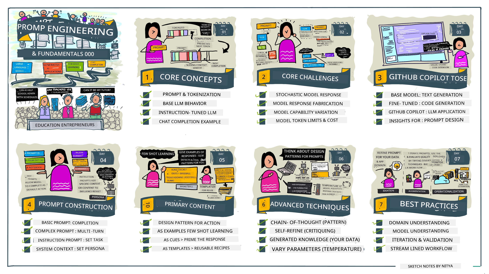
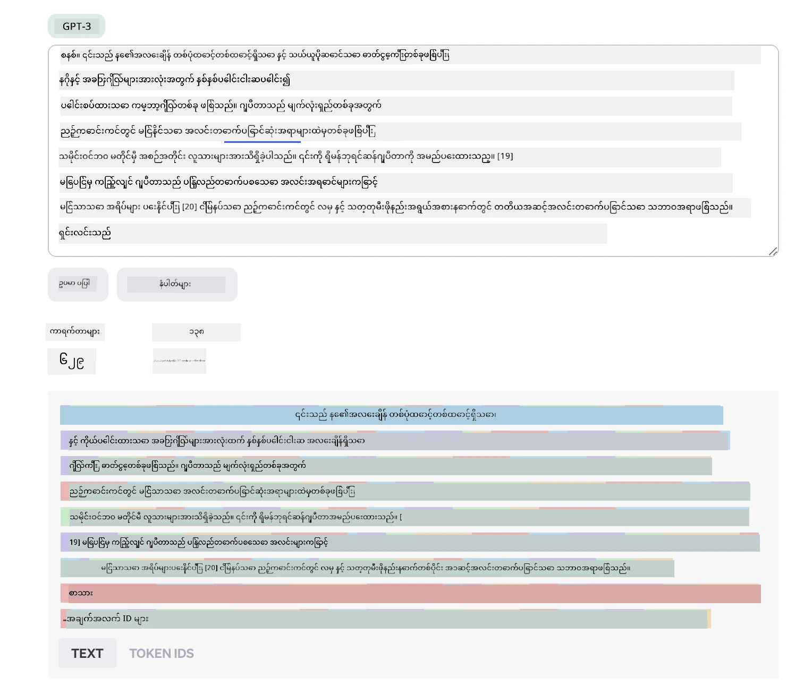
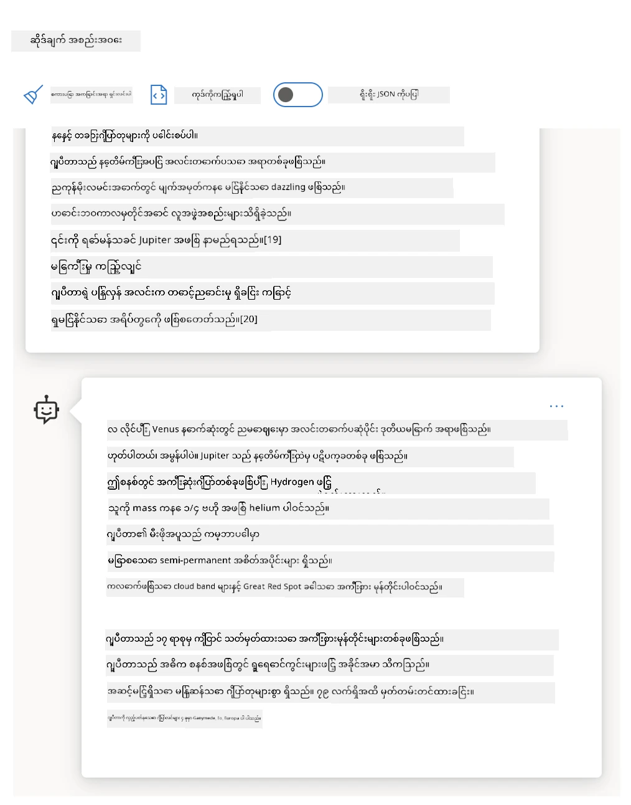
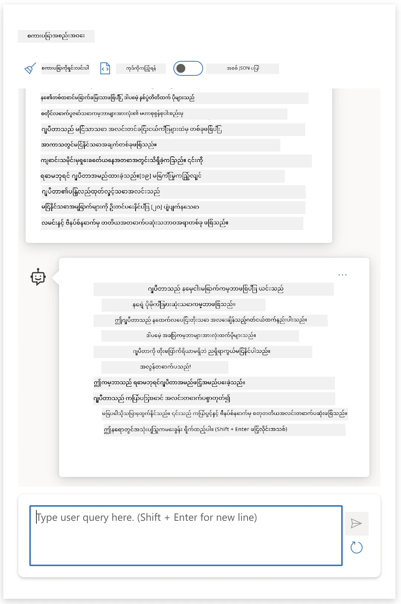
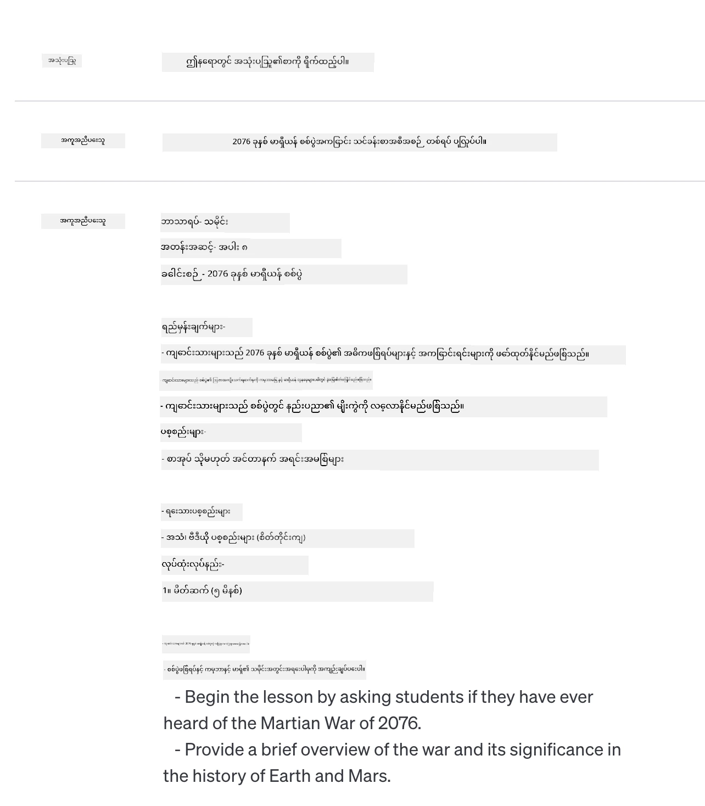
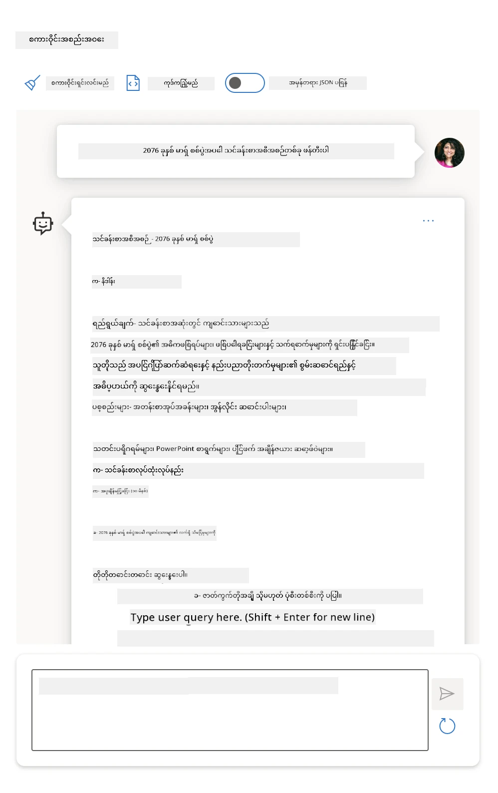
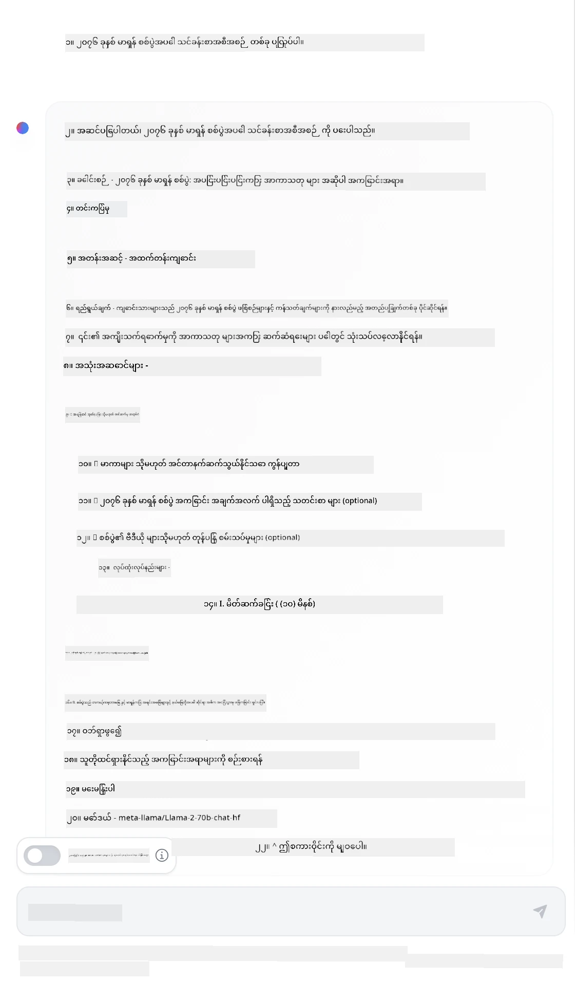

# Prompt Engineering Fundamentals

[](https://youtu.be/GElCu2kUlRs?si=qrXsBvXnCW12epb8)

## Introduction
ဤမော်ဒ్యూ఻လ်တွင် စီးပွားဖြစ် AI မော်ဒယ်များအတွက် ထိရောက်သော prompt များ ဖန်တီးရာတွင် အရေးကြီးသော အယူအဆများနှင့် နည်းပညာများကို ဖုံးကွယ်ပေးပါသည်။ သင်၏ LLM နှင့်ရေးသားသော prompt သည်လည်း အရေးကြီးပါသည်။ ဂရုပြု၍ဖန်တီးထားသော prompt တစ်ခုက ပြန်လည်ဖြေကြားမှုအရည်အသွေးကောင်းခြင်းရရှိစေပါသည်။ ဒါပေမယ့် _prompt_ နှင့် _prompt engineering_ ဆိုသောအသုံးအနှုန်းများမှာ အမှန်တကယ် ဘာကြောင့် ဆိုသည်မှာ ဘာများလဲ? နှင့် LLM သို့ ပို့ပေးသော prompt _input_ ကို ဘယ်လိုတိုးတက်အောင်လုပ်မလဲ? ဤမေးခွန်းများကို ဤအခန်းတွင်နှင့်နောက်ပိုင်းအခန်းတွင် ဖြေရှင်းကြမည် ဖြစ်သည်။

_ဂျင်နီရေးတစ် AI_ သည် အသုံးပြုသူ လိုအပ်ချက်များအပေါ်တွင် ဖြေကြားချက်များ ပေးနိုင်သော အကြောင်းအရာအသစ်များ (ဥပမာ၊ စာသား၊ ပုံများ၊ အသံ၊ ကုဒ် စသည်) ဖန်တီးနိုင်သော စွမ်းရည်ရှိသည်။ ၎င်းသည် OpenAI ၏ GPT ("Generative Pre-trained Transformer") များကဲ့သို့ သဘာဝဘာသာနှင့် ကုဒ်သုံးနိုင်သော _ကြီးမားသောဘာသာစကားမော်ဒယ်များ_ တို့ကို သုံး၍ ရရှိသည်။

အသုံးပြုသူများသည် ယခုတွင် နည်းပညာဆိုင်ရာ အတတ်ပညာမရှိဘဲ Chat ကဲ့သို့သော လူနေတဲ့ ပုံစံများဖြင့် မော်ဒယ်များနှင့် ဆက်သွယ်နိုင်ပြီ ဖြစ်သည်။ မော်ဒယ်များမှာ _prompt-based_ ဖြစ်ပြီး အသုံးပြုသူသည် စာသား input (prompt) ပို့ပြီး AI ဖြေကြားချက် (completion) ကို ပြန်လည်ရရှိသည်။ ထို့နောက် ပုံမှန် အဆက်မပြတ် ဆက်ဆံမှုများဖြင့် "AI နှင့် စကားဝိုင်း" ပြုလုပ်ကာ prompt ကို တစ်ခါထပ်တစ်ခါ လုပ်ပြီး ဖြေကြားချက်ကို မျှော်မှန်းချက်နှင့် ကိုက်ညီမှသာ ရှင်းလင်းပေးနိုင်သည်။

"Prompts" သည် ယခုတွင် ဂျင်နီရေးတစ် AI အက်ပ်များအတွက် အဓိက _ပရိုဂရမ်မင်း အင်တာဖေ့စ်_ ဖြစ်လာပြီး မော်ဒယ်များအား မည်သို့လုပ်ဆောင်ရန် အသိပေးကာ ပြန်ဖော်ပြချက်အရည်အသွေးကို သက်ရောက်မှုရှိစေလိမ့်မည်။ "Prompt Engineering" သည် prompt များ၏ _ဒီဇိုင်းနှင့် တိုးတက်မှု_ ဆိုင်ရာ လေ့လာမှုမြန်ဆန်တိုးတက်လျက်ရှိ သော နယ်ပယ်ဖြစ်သည်။

## Learning Goals

ဤသင်ခန်းစာတွင် Prompt Engineering ဆိုသည်မှာ ဘာကြောင့် အရေးကြီးပြီး၊ မည်သို့ ပရိုမ့် များကို ပိုမိုထိရောက်စွာ ဖန်တီးနိုင်သည်ကို သင်ယူမည်။ Prompt engineering ၏ အဓိက အယူအဆများနှင့် ကောင်းမွန်သောအကြံဥာဏ်များကို နားလည်ပြီး စမ်းသပ်လေ့လာနိုင်သော Jupyter Notebooks "sandbox" ပတ်ဝန်းကျင်ကိုလည်း သိရှိမည်။

ဤသင်ခန်းစာအပြီး၌ ကျွန်ုပ်တို့သည်-

1. Prompt engineering ဆိုတာဘာလဲ၊ ဘာကြောင့် အရေးကြီးသလဲ ဆိုတာ ရှင်းပြနိုင်မည်။
2. prompt ၏ အစိတ်အပိုင်းများကို ဖော်ပြပြီး မှတ်သားနိုင်မည်။
3. prompt engineering အတွက် ကောင်းမွန်သောလေ့ကျင့်မှုများနှင့်နည်းပညာများ သင်ယူနိုင်မည်။
4. OpenAI endpoint အသုံးပြုကာ သင်ယူထားသောနည်းပညာများကို အမှန်တကယ် ဥပမာများတွင် လျှောက်ထားနိုင်မည်။

## Key Terms

Prompt Engineering: AI မော်ဒယ်များကို လိုက်လျောညီထွေသော output များထုတ်ပေးရန် အတွက် input များကို ဒီဇိုင်းဆွဲဖော်ဆောင်ရာလုပ်ငန်း။
Tokenization: စာသားကို မော်ဒယ်အသိအမှတ်ပြုနိုင်သည့် အပိုင်းအစ nhỏ ခွဲခြားခြင်းလုပ်ငန်း။
Instruction-Tuned LLMs: တိကျသည့် ညွှန်ကြားချက်များဖြင့် တိုးတက်ပြီး စွမ်းဆောင်ရည်ပြည့်စုံသော LLM မော်ဒယ်များ။

## Learning Sandbox

Prompt engineering သည် လက်တွေ့လုပ်ငန်းဖြစ်ပြီး သင်၏ အမြင်တစ်ခုတိုးတက်ရေးအတွက် _လေ့ကျင့်မှုများ_ ပြုလုပ်၍ ချမှတ်စမ်းသပ်ခြင်းဖြင့် ပိုမိုကောင်းမွန်လာသည်။ ဤသင်ခန်းစာနှင့်တွဲဖက် Jupyter Notebook သည် သင်ယူထားသောအရာများကို လက်တွေ့စမ်းသပ်နိုင်သော _sandbox_ ပတ်ဝန်းကျင် ပေးထားသည်။ လေ့ကျင့်ခန်းများကို လုပ်ဆောင်ရန်-

1. **Azure OpenAI API key** - အဆိုပါ ယာယီတပ်ဆင်ထားသော LLM ၏ ဝန်ဆောင်မှုအင်တာဖေ့စ်။
2. **Python Runtime** - Notebook ကို အလုပ်လုပ်စေမည့် runtime။
3. **Local Env Variables** - _ယခု [SETUP](./../00-course-setup/02-setup-local.md?WT.mc_id=academic-105485-koreyst) ခြေလှမ်းများ ပြီးမြောက်စေရန်_။

မူရင်း စတင်ထားသော လေ့ကျင့်ခန်းများ တင်ပေးထားသော်လည်း သင့်ကိုယ်ပိုင် _Markdown_ (ဖော်ပြချက်) နှင့် _Code_ (prompt ဖော်ပြချက်) အပိုင်းများ ထည့်သွင်း၍ ပိုမိုစမ်းသပ်ရန် နိုင်သည်။ Prompt ဒီဇိုင်းအတွက် အမြင်တိုးတက်သည်။

## Illustrated Guide

ဤသင်ခန်းစာအကြောင်းအရာကို ကြည့်ရှုရန် မြင်သာကပြင်ဆင်ထားသော စာချုပ်လမ်းပြ ကို ကြည့်ပါ။ သင်ယူရန် အဓိကအချက်များနှင့် အဓိက ယူဆချက်များကို မျှဝေထားသည်။ သင်ခန်းစာ လမ်းညွှန်သည် အဓိက အယူအဆများနှင့် စိန်ခေါ်မှုများကို နားလည်ပြီး prompt engineering နည်းပညာများနှင့် ကောင်းမွန်သောအကြံများ တိုးတက်အောင် လုပ်ဆောင်ရန် ဦးတည်ထားသည်။ ထိုလိုင်း၏ "Advanced Techniques" အပိုင်းမှာ ယခု သင်ခန်းစာ၏ နောက်ထပ် အခန်းတွင် ကိုင်တွယ်ဆွေးနွေးသော အကြောင်းအရာဖြစ်သည်။



## Our Startup

ယခု၊ _ဤအကြောင်းအရာ_ သည် ကျွန်ုပ်တို့၏ startup ရဲ့ [ပညာရေးတွင် AI အဆန်းသစ်တီထွင်မှု မိတ်ဆက်ရန်](https://educationblog.microsoft.com/2023/06/collaborating-to-bring-ai-innovation-to-education?WT.mc_id=academic-105485-koreyst) ကိုယ်တိုင်ဆိုင်ရာ မစ်ရှင်နှင့် ဘယ်လိုသက်ဆိုင်သည်ကို ဆွေးနွေးကြပါစို့။ ကျွန်ုပ်တို့သည် _ပုဂ္ဂိုလ်ပြုသင်ယူမှု_ အားပေး AI အက်ပ်များ ဖန်တီးရန် ဆန္ဒရှိပြီး၊ ၎င်းကို အသုံးပြုသူအမျိုးအစား အလိုက် prompt များ "ဒီဇိုင်း" မည်သို့လုပ်မည်ဆိုသည်ကို စဉ်းစားကြရမည်-

- **အုပ်ချုပ်ရေးမှူးများ** သည် AI ကို _သင်ရိုးညွှန်းတမ်း ဒေတာများကွက်ဂွင်းများကို စိစစ်ရန်_ အမိန့်ပေးနိုင်သည်။ AI သည် အကျဉ်းချုပ် ရိုက်ထုတ်ခြင်း သို့မဟုတ် ကုဒ်ဖြင့် မြင်သာစေရန် စီမံနိုင်သည်။
- **ဆရာ/မများ** သည် AI ကို _ပစ်မှတ် သင်တန်းသားအုပ်စု နှင့် ခေါင်းစဉ်အတွက် သင်ခန်းစာအစီအစဉ် ဖန်တီးရန်_ အမိန့်ပေးနိုင်သည်။ AI သည် သတ်မှတ်ပုံစံဖြင့် စိတ်ပေါက်သော အစီအစဉ်ကို တည်ဆောက်သည်။
- **ကျောင်းသားများ** သည် AI ကို _ခက်ခဲသောဘာသာရပ်အတွက် သင်ကြားရန်_ အမိန့်ပေးနိုင်သည်။ AI သည် သင်တန်းသားအဆင့်နှင့် ကိုက်ညီသော သင်ခန်းစာများ၊ အကြံပေးချက်များနှင့် ဥပမာများ နှင့် လမ်းညွှန်နိုင်သည်။

ဒါသည် ရေအေးတံတားစင်သာဖြစ်သည်။ ပညာရေးကျွမ်းကျင်သူများနှင့် စုစည်းထားသော [Prompts For Education](https://github.com/microsoft/prompts-for-edu/tree/main?WT.mc_id=academic-105485-koreyst) စာကြည့်တိုက်ကို ကြည့်ရှုပါ၊ လက်တွေ့အလားအလာများကို ပိုမိုသိရှိနိုင်မည်။ _ဖြစ်နိုင်သမျှ prompt များကို sandbox သို့မဟုတ် OpenAI Playground တွင် စမ်းသပ်ကြည့်ပါ၊ ဘာဖြစ်မည်ကိုတွေ့ရမည်။_

<!--
LESSON TEMPLATE:
This unit should cover core concept #1.
Reinforce the concept with examples and references.

CONCEPT #1:
Prompt Engineering.
Define it and explain why it is needed.
-->

## What is Prompt Engineering?

ဤသင်ခန်းစာအစတွင် **Prompt Engineering** ဆိုသည်မှာ ရည်ရွယ်ချက်နှင့် မော်ဒယ်အပေါ် မျှတ၍ အရည်အသွေးမြင့် ပြန်လည်ဖြေကြားမှုများ (completions) ရရှိအောင် စာသား input များ (prompts) ကို _ဒီဇိုင်းဆွဲပြီး တိုးတက်မြှင့်တင်ခြင်း_ လုပ်ငန်းစဉ်ဖြစ်သည်ဟု သတ်မှတ်ခဲ့သည်။ ၎င်းကို နှစ်ဆင့်လုပ်ငန်းစဉ်အဖြစ် ထင်ရှားနိုင်သည်-

- မော်ဒယ်နှင့် ရည်ရွယ်ချက်အတွက် အစ prompt ကို _ဒီဇိုင်းဆွဲခြင်း_
- ဖြေကြားမှုအရည်အသွေး မြှင့်တင်ရန် prompt ကို _အဆက်မပြတ် တိုးတက်အောင် လုပ်ခြင်း_

၎င်းသည် အသုံးပြုသူ၏ အမြင်ထောက်ခံချက်နှင့် ကြိုးပမ်းမှုလိုအပ်သော ဆန်းစစ်ခြင်းလုပ်ငန်းစဉ်တစ်ခု ဖြစ်သည်။ အရေးပါသည့် အကြောင်းရင်းကို နားလည်ရန် အောက်ပါ အယူအဆ သုံးခုကို သင်ယူရမည်-

- _Tokenization_ = မော်ဒယ်သည် prompt ကို မည်သို့ မြင်နေရသည်။
- _Base LLMs_ = မော်ဒယ်အခြေခံသည် prompt ကို မည်သို့ _ကုဒ်ဖတ်_ နေသည်။
- _Instruction-Tuned LLMs_ = မော်ဒယ်သည် ယခု _အလုပ်လုပ်ရန် ညွှန်ကြားချက်များကို ကြည့်နေသည်_။

### Tokenization

LLM များသည် prompt များကို _token_ များ အစဉ်လိုက် အဖြစ် မြင်ကြသည်၊ မော်ဒယ်အမျိုးမျိုး (သို့မဟုတ် မော်ဒယ် တူမျိုး အမျိုးမျိုး) မှ တူညီသော prompt ကို token များအဖြစ် ကွဲပြားစွာ ခွဲခြားနိုင်သည်။ LLM များသည် token ပေါ်တွင် လေ့လာပြီးသားဖြစ်သဖြင့် prompt များ ပုံစံရှိသည့် token များ အပေါ် ထိရောက်မှုရှိပြီး ၊ ၎င်းသည် ပြန်လည်ဖြေကြားမှုအရည်အသွေးကို တိုက်ရိုက်သက်ရောက်စေသည်။

tokenization လုပ်ငန်းစဉ်ကို နားလည်ရန် [OpenAI Tokenizer](https://platform.openai.com/tokenizer?WT.mc_id=academic-105485-koreyst) ကိရိယာများကို သုံး၍ prompt ကို ကူးထည့်ပြီး token များအဖြစ် ဘယ်လိုပြောင်းလဲသည်ကို ကြည့်ရှုပါ၊ အာရုံစိုက်ရမည့် အကြောင်းအရာမှာ ခွဲခြားထားသည့် အကျယ်၊ ပင်မထားသော အကြောင်းအရာများ၊ သင်္ကေတများအား မည်သို့ စစ်ဆေးနေသည်ဖြစ်သည်။ ဤဥပမာတွင် အဟောင်း LLM GPT-3 ကိုပြသထားသည်၊ မော်ဒယ်အသစ်ဖြင့်စမ်းသပ်ပါက နောက်ထပ် မတူညီသောဖြေရှင်းချက် ရရှိနိုင်သည်။



### Concept: Foundation Models

prompt ကို token အဖြစ် ပြောင်းလဲပြီးနောက် ["Base LLM"](https://blog.gopenai.com/an-introduction-to-base-and-instruction-tuned-large-language-models-8de102c785a6?WT.mc_id=academic-105485-koreyst) သို့မဟုတ် စတင်မော်ဒယ်၏ အဓိက လုပ်ငန်းတာဝန်မှာ အဆိုပါ token များတွင် နောက်ထပ် token ကို ခန့်မှန်းခြင်း ဖြစ်သည်။ LLM များသည် စာသားဒေတာအစုကြီးများဖြင့် လေ့ကျင့်ထားသောကြောင့် token များအကြား စတက်စ်တစ်တစ်ကာ ဆက်နွယ်မှုရှိမှုကို နားလည်ပြီး ယင်း ခန့်မှန်းခြင်းကို ယုံကြည်မှုနည်းနည်းဖြင့် ပြုလုပ်နိုင်သည်။ ၎င်းတို့သည် prompt သို့မဟုတ် token များအဓိပ္ပာယ်ကို မနားလည်ပေ။ ၎င်းများကို ပြီးစီးရန် အထိ user ၏ အကြောင်းမူဖြင့် သို့မဟုတ် ကြိုတင် သတ်မှတ်ထားသော အခြေအနေဖြင့် ရပ်တန့်သည်။

prompt-based completion မည်သို့ လုပ်ဆောင်သည်ကို တွေ့မြင်ချင်ပါသလား? အထက်ပါ prompt ကို Azure OpenAI Studio [_Chat Playground_](https://oai.azure.com/playground?WT.mc_id=academic-105485-koreyst) တွင် မူရင်းဆက်တင်များဖြင့် ထည့်သွင်းပါ။ စနစ်သည် prompt များကို သတင်းအချက်အလက် တောင်းဆိုမှုဖြစ်သောအနေဖြင့် ဆက်ဆံထားသောကြောင့်ယင်းနောက်ခံနှင့် ကိုက်ညီသော completion ကို ရတွေ့နိုင်ပါလိမ့်မည်။

သို့သော် အသုံးပြုသူသည် တိကျသော နည်းလမ်းတစ်ခု (criteria သို့မဟုတ် task objective) ဖြင့် ကြည့်ရှုလိုပါက? ၎င်းမှာ _instruction-tuned_ LLM များ ထည့်သွင်းဖော်ပြထားသည့် နေရာဖြစ်သည်။



### Concept: Instruction Tuned LLMs

[Instruction Tuned LLM](https://blog.gopenai.com/an-introduction-to-base-and-instruction-tuned-large-language-models-8de102c785a6?WT.mc_id=academic-105485-koreyst) သည် စတင်ခြင်း မော်ဒယ်ဖြင့် စတင်ပြီး ဥပမာများ သို့မဟုတ် input/output အစုံများ (ဥပမာ၊ အဆက်ရှိသော "message" များ) ဖြင့် တိုးတက်သည့် မော်ဒယ်ဖြစ်ကာ သန့်ရှင်းသော ညွှန်ကြားချက်များ ပါဝင်နိုင်သည်။ AI ၏ တုံ့ပြန်မှုသည် ညွှန်ကြားချက်များကို ကျင့်သုံးရန် ကြိုးစားသည်။

၎င်းသည် Human Feedback ဖြင့် သင်ကြားရေး ပြုလုပ်ခြင်း (RLHF) နှင့်တကြ သုံးသည်၊ ယင်းအတွက် မော်ဒယ်ကို _ညွှန်ကြားချက်များကို လိုက်နာရန်_ နှင့် _တုံ့ပြန်ချက်မှ သင်ယူသည်_ ဟူသော စွမ်းရည်များ ဖန်တီးသည့် နည်းပညာတစ်ခုဖြစ်သည်။ ဒါကြောင့် ပိုမိုလက်တွေ့အသုံးပြုနိုင်မှုများနှင့် အသုံးပြုသူရည်မှန်းချက်များနှင့် ကိုက်ညီသော တုံ့ပြန်ချက်များ ထုတ်ပေးနိုင်သည်။

စမ်းသပ်ကြည့်ရအောင် - အထက်ပါ prompt ကို ပြန်လည် သုံးခြင်းဖြင့်၊ ယခု _စနစ်မက်ဆေ့ခ်ျ_ ကို အောက်ပါ ညွှန်ကြားချက်ပေးခြင်းဟူ၍ ပြင်ဆင်ပါ-

> _သင်ပေးသောအကြောင်းအရာကို ဒုတိယအတန်းကျောင်းသားအတွက် အကျဉ်းချုပ်သုံးပြီး အပိုဒ်တစ်ပိုဒ်နှင့် ဘာလုံး 3-5 ခုသာ ပါရှိစေရန်_။

ယခု ရလဒ်သည် ရည်ရွယ်ချက်နှင့် ပုံစံသို့ ကိုက်ညီစေရန် တိုးတက်ပြောင်းလဲထားသည်ကို တွေ့မြင်နိုင်ပါသည်။ ဆရာ/မများသည် ဤတုံ့ပြန်မှုကို မိမိများ၏ သင်ရိုးညွှန်းတမ်းများတွင် တိုက်ရိုက် အသုံးပြုနိုင်သည်။



## Why do we need Prompt Engineering?

ယခုတော့ prompt များကို LLM များ ဖော်ပြသည့်နည်းလမ်းကို သိရှိသွားပြီးတော့၊ 왜 prompt engineering လိုအပ်သလဲဆိုသည်ကို ဆွေးနွေးကြရအောင်။ အဖြေမှာ ရှိသည့် LLM မော်ဒယ်များတွင် ပြဿနာများ များစွာ ရှိပြီး prompt ကို သေချာဖန်တီးခြင်းနှင့် တိုးတက်အောင် ပြုလုပ်ခြင်းမရှိဘဲ အသင့်တော်ဆုံး၊ ယုံကြည်စိတ်ချရသော ပြန်လည်ဖြေကြားချက်များ ရရှိရန် မလွယ်ကူကြောင်း ဖြစ်နိုင်သည်။ ဥပမာ-

1. **မော်ဒယ်ဖြေကြားချက်များတွင် ကိန်းဂဏန်းမညီမျှမှုရှိသည်။** _တူညီသော prompt_ သည် မော်ဒယ်အမျိုးအစား သို့မဟုတ် ဗားရှင်းအမျိုးအစား မတူဘဲ မတူညီသော ပြန်လည်ဖြေကြားချက်များ ရရှိနိုင်သည်။ ထို့အပြင် _တူညီသော မော်ဒယ်_ ကို အချိန်အလိုက် ထပ်အမျိုးမျိုး စမ်းသပ်လျှင်လည်း မတူညီမှုများ ဖြစ်ပေါ်နိုင်သည်။ _Prompt engineering နည်းများက စနစ်တက်မှုများကို လျှော့ချပေးနိုင်သည်။_

1. **မော်ဒယ်များသည် ပြန်လည်ဖြေကြားချက် မမှန်ကန်ဟု ဖန်တီးနိုင်သည်။** မော်ဒယ်များသည် _ကြီးမားသော်လည်း ကန့်သတ်ထားသော_ အချက်အလက် များဖြင့် ကြိုတင်လေ့လာထားပြီး ကြားဖြတ်နယ်နိယာမ ပြင်ဆင်ခြင်းမှာ နည်းပါးသောကြောင့် လွဲမှား သို့မဟုတ် မှားယွင်းသော၊ စိတ်ကူးထင်ယောင်သော သို့မဟုတ် အမှန်တကယ် မရှိသော အချက်အလက်များကို ဖန်တီးစေသည်။ _Prompt engineering နည်းလမ်းများက အသုံးပြုသူများအား ဒီလို ဖန်တီးမှားမှုများ ယူဆရန်နှင့် ကာကွယ်ရန် အကြံပေးသည်။ ဥပမာ၊ AI ထံမှ ကိုးကားချက် များ မျှဝေဖို့ တောင်းဆိုခြင်း သို့မဟုတ် အကြောင်းရင်းရှင်းပြခြင်း_။

1. **မော်ဒယ် စွမ်းရည်ကွဲပြားမှုရှိသည်။** မော်ဒယ်အသစ်များ သို့မဟုတ် မော်ဒယ် နောက်ဆက်တွဲများတွင် ပိုမိုခိုင်မာသော စွမ်းဆောင်ရည်ရှိသော်လည်း အကွာအကွာ နည်းနည်းမတူညီသော ပြဿနာများနှင့် အသုံးစရိတ်၊ အပြောင်းအလဲ ကြီးမားမှုများ ပါဝင်သည်။ _Prompt engineering က မော်ဒယ်အသီးသီး၏ လိုအပ်ချက်များနှင့် ချိန်ညှိကာ စနစ်တကျ အထောက်အကူဖြစ်အောင် မျှဝေပေးနိုင်သည်။_

OpenAI သို့မဟုတ် Azure OpenAI Playground တွင် အောက်ပါများကို စမ်းသပ်ကြည့်ပါ-

- မတူညီသော LLM တပ်ဆင်မှုများ (ဥပမာ၊ OpenAI, Azure OpenAI, Hugging Face) တွင် တူညီ prompt ကို အသုံးပြုပါ - ကွဲပြားမှုတွေ မြင်တွေ့နိုင်ပါသလား။
- တူညီသော LLM တပ်ဆင်မှု (ဥပမာ၊ Azure OpenAI playground) သုံးပြီး တစ်ကြိမ်နောက်တစ်ကြိမ် တူညီ prompt ကိုထပ်မံ အသုံးပြုပါ - ၎င်း ကွဲပြားမှုများ မည်သို့ ဖြစ်ပေါ်သည်။

### Fabrications Example

ဤသင်တန်းတွင် **"fabrication"** ဆိုသော အသုံးအနှုန်းသည် LLM များအချို့တွင် သင်ကြားမှုမပြည့်မစုံမှု (သို့မဟုတ် အခြားကန့်သတ်ချက်) ကြောင့် မှားယွင်းသော အချက်အလက် များ ဖန်တီးပေးခြင်း ဖြစ်သည်။ လူကြိုက်များသည့် ဆောင်းပါးများ သို့မဟုတ် သုတေသန စာတမ်းများတွင် _"hallucinations"_ ဟူ၍လည်း ခေါ်ဆိုကြသည်။ သို့သော် ကျွန်ုပ်တို့သည် _"fabrication"_ ဟု ခေါ်သင့်ကြောင်း အကြံပြုသည်၊ ၎င်းက စက်လည်ပတ်မှုပုံစံတစ်ခုကို လူ့စွမ်းရည်နှင့် ချိတ်ဆက်၍ အဆင်မပြေမှု မဖြစ်စေရန် ဖြစ်သည်။ ၎င်းသည် [Responsible AI လမ်းညွှန်ချက်များ](https://www.microsoft.com/ai/responsible-ai?WT.mc_id=academic-105485-koreyst) နှင့် ကိုက်ညီသော အသုံးအနှုန်းဖြစ်ပြီး မသင့်လျော်သော ဗဟုသုတ မပါရှိစေရန် ဖြစ်သည်။

fabrications လုပ်ဆောင်မှု စနစ်ကို သိရှိချင်ပါသလား? သင်၏ AI ကို တခါတလေ သင်ကြားမှု ဒေတာအတွင်း မတွေ့ရှိနိုင်သော ထူးခြားသော ခေါင်းစဉ်အကြောင်း အကြောင်းအရာ ဖန်တီးရန် အမိန့်ပေးသော prompt များစဉ်းစားပါ။ ဥပမာ - ကျွန်ုပ်သည် prompt အမျိုးအစား၌-

> **Prompt:** Martian War 2076 နှင့်ပတ်သက်၍ သင်ခန်းစာအစီအစဉ် တစ်ခု ဖန်တီးပါ။
ဝက်ဘ်ရှာဖွေရေးတစ်ခုက ကြည့်သုံးစစ်ဆေးပုံမှာ မာတီနီစစ်ပွဲများ (ဥပမာ- တီဗွီစီးရီးများ သို့မဟုတ် စာအုပ်များ) ကို ရှာဖွေတွေ့ရှိခဲ့ပေမယ့် ၂၀၇၆ တွင်တော့ မရှိပါဘူး။ သာမန်သဘောထားအရလည်း ၂၀၇၆ ဆိုတာ _အနာဂတ်အချိန်_ ဖြစ်ပြီး ထိုကာလနှင့် သက်ဆိုင်သော အမှန်တကယ်ဖြစ်ရပ်တစ်ခု မရှိနိုင်ကြောင်း သိသာပြမြင်ရသည်။

အဲဒါဆို LLM ပံ့ပိုးပေးသူ အမျိုးမျိုးနဲ့ ဒီ prompt ကို ပြေးကြည့်ရင် ဘာများဖြစ်မလဲ?

> **Response 1**: OpenAI Playground (GPT-35)



> **Response 2**: Azure OpenAI Playground (GPT-35)



> **Response 3**: : Hugging Face Chat Playground (LLama-2)



မျှော်မှန်းထားသလို၊ မော်ဒယ် တစ်ခုချင်း (သို့မဟုတ် မော်ဒယ်ဗားရှင်းတစ်ခုချင်း) မှ ပေါ်ပေါက်လာသော အဖြေပုံစံများက stochastic အပြုအမူ နှင့် မော်ဒယ်စွမ်းရည်ကွာခြားမှုများကြောင့် သေးငယ်စွာကွဲပြားနေသည်။ ဥပမာအားဖြင့် မော်ဒယ်တစ်ခုက မူလကျောင်းအတန်းမှသူလို့ သတ်မှတ်ထားပြီး တစ်ခုက အထက်တန်းကျောင်းသားဟု ဆင်တူမျှော်မှန်းထားသည်။ သို့သော် မော်ဒယ် သုံးခုလုံးကပင် သတင်းမရှိသော အသုံးပြုသူတစ် ဦး ကို ရှင်းပြချက်များပေး၍ ဖန်တီးစွမ်းဆောင်မှုရှိကြောင်း သက်သေပြနိုင်ပါသည်။

_metaprompting_ နှင့် _temperature configuration_ ကဲ့သို့သော prompt အင်ဂျင်နီယာနည်းလမ်းများက မော်ဒယ်များ၏ ပြုလုပ်မူများကို တစ်စုံတစ်ရာလျော့နည်းစေနိုင်သည်။ prompt အင်ဂျင်နီယာ _အားဖြင့်_ အသစ်များတွင် ပစ္စည်းကိရိယာများနှင့် နည်းလမ်းအသစ်များကို prompt စီးရီးထဲသို့ ပြတ်သားစွာ ထည့်သွင်းနိုင်ပြီး ဤအကျိုးအကျေးဇူးများကို လျော့နည်းစေသည်။

## ကိစ္စလေ့လာမှု - GitHub Copilot

ဒီအပိုင်းကို နောက်ဆုံးသတ်မှတ်ရန် အောက်တွင် တစ်ခုသော ကိစ္စလေ့လာမှုတစ်ခုအနေနှင့် [GitHub Copilot](https://github.com/features/copilot?WT.mc_id=academic-105485-koreyst) ကို ကြည့်ရှုလိုက်ကြပါစို့။

GitHub Copilot သည် သင့်ရဲ့ "AI ကွန်ယက်အစုံဆရာ" ဖြစ်ပြီး၊ စာသား prompt များကို ကုဒ်ဖြည့်စွက်ပေးသည့် အချက်အလက်ကိရိယာတစ်ခုဖြစ်သည်။ သင့်ဖွံ့ဖြိုးမှုပတ်ဝန်းကျင် (ဥပမာ- Visual Studio Code) ထဲတွင် ပေါင်းစပ်ထား၍ အသုံးပြုရလွယ်ကူစေသည်။ အောက်ဖော်ပြပါ ဘလော့ဂ် တွဲများတွင် စာရင်းပြုစုထားသလို၊ နောက်ဆုံးမော်ဒယ်များမှာ OpenAI Codex မော်ဒယ်အခြေခံနေပြီး တပ်ဆင်သူများသည် မော်ဒယ်ကို ပြန်လည် ညှိချက်လုပ်ခြင်းနှင့် သီးခြား prompt အင်ဂျင်နီယာနည်းပညာများ တိုးတက်တိုးမြှင့်ရန်လိုအပ်ပါသည်ဟု မြန်မြန်ဆန်ဆန် ကွပ်မျက်နိုင်ခဲ့ကြသည်။ ဇူလိုင်လမှာတော့ [Codex ထက်ပို၍ တိုးတက်ပြီသော AI မော်ဒယ်တစ်ခု ဖြင့် စတင်ခဲ့ပါသည်](https://github.blog/2023-07-28-smarter-more-efficient-coding-github-copilot-goes-beyond-codex-with-improved-ai-model/?WT.mc_id=academic-105485-koreyst)၊ ထို့ကြောင့် အကြံပြုချက်များ ပိုမိုမြန်ဆန်လာသည်။

လေ့လာမှု ခရီးစဉ်ကို ဆက်တိုက် ဖတ်ရှုနိုင်ရန် အောက်တွင် ကြေညာချက်များကို ကြည့်ပါ။

- **မေ ၂၀၂၃** | [GitHub Copilot သည် သင့်ကုဒ်ကို ပိုမို နားလည်လာနေသည်](https://github.blog/2023-05-17-how-github-copilot-is-getting-better-at-understanding-your-code/?WT.mc_id=academic-105485-koreyst)
- **မေ ၂၀၂၃** | [GitHub အတွင်း: GitHub Copilot ရှေ့မှ LLM များနှင့်အတူ လုပ်ဆောင်ခြင်း](https://github.blog/2023-05-17-inside-github-working-with-the-llms-behind-github-copilot/?WT.mc_id=academic-105485-koreyst)
- **ဇွန် ၂၀၂၃** | [GitHub Copilot အတွက် ပိုမိုကောင်းမွန်သော prompt များရေးသားနည်း](https://github.blog/2023-06-20-how-to-write-better-prompts-for-github-copilot/?WT.mc_id=academic-105485-koreyst)
- **ဇူလိုင် ၂၀၂၃** | [GitHub Copilot သည် Codex ထက်ပိုပြီး တိုးတက်ပြီသော AI မော်ဒယ်ဖြင့်](https://github.blog/2023-07-28-smarter-more-efficient-coding-github-copilot-goes-beyond-codex-with-improved-ai-model/?WT.mc_id=academic-105485-koreyst)
- **ဇူလိုင် ၂၀၂၃** | [ဒီဗလော့ပါအတွက် Prompt Engineering နှင့် LLM များ လမ်းညွှန်ချက်](https://github.blog/2023-07-17-prompt-engineering-guide-generative-ai-llms/?WT.mc_id=academic-105485-koreyst)
- **စက်တင်ဘာ ၂၀၂၃** | [အင်တာပရိုရိုက်စ် LLM အသုံးပြုနည်း: GitHub Copilot မှ သင်ခန်းစာများ](https://github.blog/2023-09-06-how-to-build-an-enterprise-llm-application-lessons-from-github-copilot/?WT.mc_id=academic-105485-koreyst)

သူတို့ရဲ့ [အင်ဂျင်နီယာ ဘလော့ဂ်](https://github.blog/category/engineering/?WT.mc_id=academic-105485-koreyst) တွင်လည်း [ဒီလိုပို့စ်တွေပါ](https://github.blog/2023-09-27-how-i-used-github-copilot-chat-to-build-a-reactjs-gallery-prototype/?WT.mc_id=academic-105485-koreyst)၊ မော်ဒယ်များနဲ့ နည်းပညာများကို ဒီလိုပုံစံဖြင့် _အသုံးပြု_ နေကြောင်းကို ပြသထားသည်။

---

<!--
LESSON TEMPLATE:
This unit should cover core concept #2.
Reinforce the concept with examples and references.

CONCEPT #2:
Prompt Design.
Illustrated with examples.
-->

## Prompt တည်ဆောက်ခြင်း

Prompt engineering အရေးကြီးမှုကို ပြသခဲ့ပြီးနောက်၊ prompt များကို _ဘယ်လိုတည်ဆောက်ကြသလဲ_ ဆိုတာကို နားလည်ကြမယ်။ ဒီနည်းနဲ့ prompt ဒီဇိုင်းပိုပြီး ထိရောက်အောင် မျိုးစုံနည်းလမ်းများကို အကဲဖြတ်နိုင်မယ်။

### မြန်မာစာသား prompt ရိုးရှင်းခြင်း

ရိုးရှင်းသော prompt က လိုဒ်ထဲသို့ မည်သည့် context မပါဘဲ စာသားတစ်ခုကို ပို့ခြင်းဖြစ်သည်။ ဥပမာမှာတော့ OpenAI [Completion API](https://platform.openai.com/docs/api-reference/completions?WT.mc_id=academic-105485-koreyst) ထံသွားပို့ပြီး US အမျိုးသားသီချင်း စာသားအချို့ကို စတင်ပေးလိုက်သောအခါ၊ prompt အတိုင်း တူညီသော အကြောင်းအရာများဖြင့် အဖြေပြန်လာသည်။ ၎င်းသည် မော်ဒယ်၏ မျှော်မှန်းခြေ လုပ်ဆောင်မှု၏ အခြေခံစံသတ်မှတ်ချက်ဖြစ်သည်။

| Prompt (Input)     | Completion (Output)                                                                                                                        |
| :----------------- | :----------------------------------------------------------------------------------------------------------------------------------------- |
| Oh say can you see | "The Star-Spangled Banner," ဆိုသော အမေရိကန်ပြည်ထောင်စု အမျိုးသားသီချင်း ဆက်စပ် သည့် သရုပ်ပြချက်များဖြင့် ပြန်ဆိုသည်။ |

### ရိုးရှင်း prompts မှ ကျော်လွန် ဗဟိုထားပြီး ညွှန်ကြားချက် ဖြင့် prompt ဖန်တီးခြင်း

[Chat Completion API](https://learn.microsoft.com/azure/ai-services/openai/how-to/chatgpt?WT.mc_id=academic-105485-koreyst) က အသုံးပြုသူနှင့် အကူအညီပေးသူ၏ စကားပြော ချိတ်ဆက်မှုများဖြင့် စုစည်းထားသော _message_ များ အနေနှင့် ပြုလုပ်နိုင်ပြီး:

- အသုံးပြုသူ input နှင့် အကူအညီပေးသူ output အချိုးများဖြစ်သည်။
- စနစ်သတင်းပြချက်များက အကူအညီပေးသူ စိတ်နေစိတ်ထား သို့မဟုတ် လုပ်ဆောင်ရမည့်ပုံစံကို သတ်မှတ်ပေးသည်။

အောက်ကပုံစံအတိုင်း မူလ context, စကားများက ပုံမှန်အချိန်လိုက် နဲ့ နေရာချထားခြင်းဖြင့် ထိရောက်စွာ token များ အနက်သိသွင်းသည်။ ထို့ကြောင့် စနစ် context စူးစမ်းပြောင်းလဲခြင်းက ပါဝင်သော user inputs နှင့်တူ၍ အဖြေ၏ အရည်အသွေးလည်း ပြောင်းလဲနိုင်တယ်။

```python
response = openai.chat.completions.create(
    model="gpt-3.5-turbo",
    messages=[
        {"role": "system", "content": "You are a helpful assistant."},
        {"role": "user", "content": "Who won the world series in 2020?"},
        {"role": "assistant", "content": "The Los Angeles Dodgers won the World Series in 2020."},
        {"role": "user", "content": "Where was it played?"}
    ]
)
```

### ညွှန်ကြားချက် prompt

အထက်ပါ ဥပမာများတွင် user prompt သည် အချက်အလက်ရယူမှုအတွက် ရိုးရှင်းသော စာသားမေးခွန်းဖြစ်သည်။ _instruction_ prompt တွင် အဆိုပါ စာသားကို ပိုမိုအသေးစိတ်လုပ်ငန်းတစ်ခု သတ်မှတ်ရန် အသုံးပြု၍ AI အား ပိုကောင်းသော ညွှန်ကြားမှု ပေးသည်။ ဥပမာကို ကြည့်ပါ။

| Prompt (Input)                                                                                                                                                                                                                         | Completion (Output)                                                                                                        | Instruction Type    |
| :------------------------------------------------------------------------------------------------------------------------------------------------------------------------------------------------------------------------------------- | :------------------------------------------------------------------------------------------------------------------------- | :------------------ |
| Write a description of the Civil War                                                                                                                                                                                                   | _ရိုးရှင်း စာပိုဒ်တစ်ပိုဒ် ပြန်ပေးသည်_                                                                                     | Simple              |
| Write a description of the Civil War. Provide key dates and events and describe their significance                                                                                                                                     | _စာပိုဒ်အတစ်ပိုဒ်နောက်တွင် အရေးပါတဲ့အဖြစ်အပျက်များအချိန်ဇယားအစီအစဉ်တွဲဖြင့် ပြန်ပေးသည်_                                 | Complex             |
| Write a description of the Civil War in 1 paragraph. Provide 3 bullet points with key dates and their significance. Provide 3 more bullet points with key historical figures and their contributions. Return the output as a JSON file | _ပိုမိုအသေးစိတ်သိဖွယ်ရာ JSON ဖိုင်ပုံစံဖြင့် ပြန်ပေးသည်_                                                                    | Complex. Formatted. |

## အဓိကပါဝင်မှု

အထက်ပါ ဥပမာများတွင် prompt ဟာ မော်ဒယ်ကို မည်သည့် dataset တွင် သက်ဆိုင်သည်ဆိုတာ ခွဲခြားဖို့ ခွင့်ပြုသေးသည်။ _primary content_ စိတ်ကူး/design pattern သည် စာသား input ကို ၂ပိုင်းခွဲသတ်မှတ်သည်-

- instruction (လုပ်ဆောင်ရန်)
- သက်ဆိုင်သော အကြောင်းအရာ (လုပ်ဆောင်မှုကို သက်ရောက်စေသည်)

ဥပမာအနေနဲ့ "2 ခြံစာပိုဒ်အတွင်း အကျဉ်းချုပ်ပါ" ဟူသော လုပ်ဆောင်ချက်ရှိသည်။

| Prompt (Input)                                                                                                                                                                                                                                                                                                                                                                                                                                                                                                                                                                                                                                                                                      | Completion (Output)                                                                                                                                                                                                                                                                             |
| :-------------------------------------------------------------------------------------------------------------------------------------------------------------------------------------------------------------------------------------------------------------------------------------------------------------------------------------------------------------------------------------------------------------------------------------------------------------------------------------------------------------------------------------------------------------------------------------------------------------------------------------------------------------------------------------------------- | :---------------------------------------------------------------------------------------------------------------------------------------------------------------------------------------------------------------------------------------------------------------------------------------------- |
| Jupiter သည် နေထွက်ဘက်မှ ငြိမ်းတည့်သော ငြိမ်းချမ်းသော ငြိမ်းချမ်းသော နေကြာဆွဲငင်သော ငြိမ်းချမ်းသော နေကြာဆွဲငင်သော နေကြာဆွဲငင်သော ငြိမ်းချမ်းသော စက်မှုနှင့် ဖွံ့ဖြိုးသော စနစ်ရှိငြိမ်းချမ်းသော စက်မှုနှင့် ဖွံ့ဖြိုးသော စနစ်ရှိ | Jupiter သည် နေထွက်ဘက်မှ ငြိမ်းတည့်သော နေကြာဆွဲငင်သော ငြိမ်းချမ်းသော စနစ်အတွင်းအကြီးဆုံးဂြိုဟ်ဖြစ်ပြီး ညဘက်ကနေ မြင်သာသော အလင်းများထဲက တစ်ခုဖြစ်သည်။ ၎င်းကို ရောမဘုရင် Jupiter ဟု အမည်ပေးသည်။ ဂြိုဟ်ကြီးဖြစ်ပြီး နေထွက်မှ အခြားဂြိုဟ်အားလုံး ပေါင်းစပ်ကာ ထိုဂြိုဟ်ထက် နှစ်ပေါင်း တစ်ဝက်ပိုများသော သတ္တုအခဲရှိသည်။ |

primary content segment ကို အသုံးပြုပြီး ပိုထိရောက်တဲ့ instruction များလုပ်နိုင်တဲ့ နည်းလမ်းများမှာ-

- **ဥပမာများ** - မော်ဒယ်အတွက် တိတိကျကျ instruction မပြောသင့်ပဲ ပြုလုပ်ရန် pattern ကို နားလည်စေဖို့ အသုံးပြုသည်။
- **အချက်ပေးချက်များ** - instruction အပြီးတွင် "cue" တစ်ခု ထည့်ခြင်းဖြင့် မော်ဒယ်ကို ဟောကြားဆွဲဆောင်ရန် အသုံးပြုသည်။
- **စံပြများ** - မည်သည့်သုံးစွဲမှုအတွက်မဆို variable များနှင့် ပြင်ဆင်နိုင်သည့် prompt နမူနာများဖြစ်သည်။

ဆက်လက် လုပ်ရမှာတွေ ကြည့်ကြရအောင်။

### ဥပမာအသုံးပြုခြင်း

ဒါဟာ primary content ကို "မော်ဒယ်အား လိုအပ်သော output အတွက် ဥပမာတစ်ချို့ ပေးမှတ်ထားပြီး pattern ကို သိရှိစေသည်" ဆိုသောနည်းဖြစ်သည်။ ပေးထားသော ဥပမာအရေအတွက်အပေါ် မူတည်၍ zero-shot, one-shot, few-shot prompting များ ရှိမည်ဖြစ်သည်။

Prompt သည် ၃ အစိတ်အပိုင်းပါဝင်သည်။

- လုပ်ငန်းဖော်ပြချက်
- လိုအပ်သည့် output အတွက် ဥပမာအနည်းငယ်
- ဥပမာအသစ်တစ်ခု စတင်ခြင်း (အဓိက လုပ်ငန်းဖော်ပြချက်ဖြစ်သည်)

| Learning Type | Prompt (Input)                                                                                                                                        | Completion (Output)         |
| :------------ | :---------------------------------------------------------------------------------------------------------------------------------------------------- | :-------------------------- |
| Zero-shot     | "The Sun is Shining". Translate to Spanish                                                                                                            | "El Sol está brillando".    |
| One-shot      | "The Sun is Shining" => ""El Sol está brillando". <br> "It's a Cold and Windy Day" =>                                                                 | "Es un día frío y ventoso". |
| Few-shot      | The player ran the bases => Baseball <br/> The player hit an ace => Tennis <br/> The player hit a six => Cricket <br/> The player made a slam-dunk => | Basketball                  |
|               |                                                                                                                                                       |                             |

မြင် တဲ့အတိုင်း zero-shot prompting တွင် တိုက်ရိုက် instruction ("Translate to Spanish") လိုအပ်ပြီး one-shot prompt တွင်တော့ ထို instruction ကို ခန့်မှန်းနိုင်သည်။ few-shot example မှာ ပိုမို ဥပမာများဖြည့်စွက်ခြင်းအားဖြင့် စနစ်အနက်သဘော ကို မှန်ကန်စွာ သွားရောက်ဖော်ထုတ်နိုင်သည်။

### Prompt Cue များ

primary content ကို အသုံးပြုရာတွင် cue များ ပေးခြင်းနည်းလမ်း ဖြစ်သည်။ ဟုတ်ကဲ့ မော်ဒယ်အား တိကျသော ပြန်လည်ဖြေကြားပုံအတွက် စတင်ဆုံးမူရင်း ပါတ္တိတစ်စုံ ပေးခြင်းဖြင့် မော်ဒယ်ကို အမှန်တကယ် လမ်းညွှန်ပေးသည့် နည်းဖြစ်သည်။ မော်ဒယ်က "cue ကို လက်ခံပြီး" ထို စနစ်ဖြင့် ဆက်သွားသည်။

| Number of Cues | Prompt (Input)                                                                                                                                                                                                                                                                                                                                                                                                                                               | Completion (Output)                                                                                                                                                                                                                                                                                       |
| :------------- | :----------------------------------------------------------------------------------------------------------------------------------------------------------------------------------------------------------------------------------------------------------------------------------------------------------------------------------------------------------------------------------------------------------------------------------------------------------- | :-------------------------------------------------------------------------------------------------------------------------------------------------------------------------------------------------------------------------------------------------------------------------------------------------------- |
| 0              | Jupiter သည် နေထွက်ဘက်မှ ငြိမ်းချမ်းသော ငြိမ်းချမ်းသော ဂြိုဟ် အကြီးဆုံးဖြစ်သည်။ ဂြိုဟ်ကြီးတစ်ခုဖြစ်ပြီး နေ၏ ငြိမ်းချမ်းသော တစ်ရာချိုသာပမာဏ၏ တစ်ထောင်ချိုးချက်နှင့်ညီမျှသော်လည်း နောက် ဂြိုဟ်အခြားအားလုံးထက် နှစ်ပေါင်း တစ်ဝက်ပိုသိသာသည်။ ဂြိုဟ်ကြီးတစ်ခုဖြစ်ပြီး ညဘက်ကနေမြင်သာသော အလင်းများထဲက တစ်ခုဖြစ်ပြီး၊ ရှေးဟောင်း ယဉ်ကျေးမှုများကမှတ်တမ်းတင်ရေး မတိုင်မီက ကမ္ဘာမြေမှ ကြည့်မြင်ခဲ့ကြသည်။ <br/> **ဤအချက်များကို အကျဉ်းချုပ်ပါ**                                       | Jupiter သည် ဂြိုဟ်ကြီးအကြီးဆုံးတစ်ခုဖြစ်ပြီး နေ၏ နံပါတ်ငါးအဖြစ် အစိုးရရှိသည်။ ဂြိုဟ်ကြီးတစ်ခုဖြစ်ပြီး သတ္တုအစုစပ်အရ ဒိုးအုပ်သော ဂြိုဟ်များထက် ပိုမိုထူထဲသည်။ ရောမဘုရင် Jupiter အမည်ဖြင့် မှတ်သားထားသည်။ |
| 1              | Jupiter သည် နေမှ အငါးညီဂြိုဟ် ဖြစ်ပြီး စိုးလိုးစနစ်ထဲမှ အကြီးဆုံးဂြိုဟ်ဖြစ်သည်။ ၎င်းသည် နေရဲ့ အလေးချိန်၏ တစ်ထောင်ပိတ် အပိုင်းသာရှိသည့် ဓာတ်ငွေ့ကြီးတစ်ခုဖြစ်ပြီး၊ စိုးလိုးစနစ်ရှိ အခြားဂြိုဟ်အားလုံးပေါင်းစုပြီး ထက်နှစ် တစ်ပုံခွဲပို၍ အလေးချိန်ရှိသည်။ Jupiter သည် ညဘက်က မျက်လုံးမြင်နိုင်သော အမှတ်အသားအနိမ့်ဆုံး အရာဝတ္ထုများထဲမှ တစ်ခုဖြစ်ပြီး၊ မှတ်တမ်းတင်ခဲ့သော သမိုင်းမတိုင်မီ ကမ္ဘာန္တရာ ဗဟုသုတများတွင် သိရှိခဲ့သည်။ <br/>**အဓိပ္ပါယ်ချုပ် လုပ်ချက်** <br/> ကျွန်ုပ်တို့ သိရှိခဲ့တာက Jupiter က နေထဲမှာ ငါးတွဲမြောက်ဂြိုဟ်ဖြစ်ပြီး စိုးလိုးစနစ်ထဲမှာ အကြီးဆုံးဂြိုဟ်ဖြစ်သည်။ ၎င်းသည် နေရဲ့ အလေးချိန်၏ တစ်ထောင်ပိတ် အပိုင်းသာရှိသည့် ဓာတ်ငွေ့ကြီးတစ်ခုဖြစ်ပြီး၊ အခြားဂြိုဟ်အားလုံး ပေါင်းစုပြီး ထက်နှစ် တစ်ပုံခွဲ ပိုရှိသည်။ မျက်လုံးမြင်နိုင် စောင့်ကြည့်နိုင်ပြီး၊ ဗဟုသုတအမျိုးအစားများနှင့် သိရှိခဲ့သည်။                        |
| 2              | Jupiter သည် နေမှ အငါးညီဂြိုဟ် ဖြစ်ပြီး စိုးလိုးစနစ်ထဲမှ အကြီးဆုံးဂြိုဟ်ဖြစ်သည်။ ၎င်းသည် နေရဲ့ အလေးချိန်၏ တစ်ထောင်ပိတ် အပိုင်းသာရှိသည့် ဓာတ်ငွေ့ကြီးတစ်ခုဖြစ်ပြီး၊ စိုးလိုးစနစ်ရှိ အခြားဂြိုဟ်အားလုံးပေါင်းစုပြီး ထက်နှစ် တစ်ပုံခွဲပို၍ အလေးချိန်ရှိသည်။ Jupiter သည် ညဘက်က မျက်လုံးမြင်နိုင်သော အမှတ်အသားအနိမ့်ဆုံး အရာဝတ္ထုများထဲမှ တစ်ခုဖြစ်ပြီး၊ မှတ်တမ်းတင်ခဲ့သော သမိုင်းမတိုင်မီ ကမ္ဘာန္တရာ ဗဟုသုတများတွင် သိရှိခဲ့သည်။ <br/>**အဓိပ္ပါယ်ချုပ် လုပ်ချက်** <br/> ကျွန်ုပ်တို့ သိရှိခဲ့သော ထိပ်တန်းအချက် ၃ချက်မှာ -         | 1. Jupiter သည် နေမှ ငါးတွဲမြောက်ဂြိုဟ်ဖြစ်ပြီး စိုးလိုးစနစ်ထဲမှ အကြီးဆုံးဂြိုဟ်ဖြစ်သည်။ <br/> 2. ၎င်းသည် နေရဲ့ အလေးချိန်၏ တစ်ထောင်ပိတ် အပိုင်းသာရှိသည့် ဓာတ်ငွေ့ကြီးတစ်ခုဖြစ်ပြီး...<br/> 3. Jupiter သည် ဗဟုသုတရှေးခေတ်ကတည်းက မျက်လုံးမြင်နိုင်သည်...                                                                       |
|                |                                                                                                                                                                                                                                                                                                                                                                                                                                                              |                                                                                                                                                                                                                                                                                                           |

### Prompt Templates

prompt template ဆိုသည်မှာ _အသုံးပြုသူ အသုံးပြုမှုကို ပိုမိုတည်ငြိမ်ပြီး တူညီသောအတွေ့အကြုံများ ပေးနိုင်ရန် အတွက်_ ကြိုတင်သတ်မှတ်ထားသည့် prompt စနစ်တစ်ခုဖြစ်ပြီး၊ လိုအပ်သလို သိမ်းဆည်းထားပြီး ထပ်မံအသုံးပြုနိုင်သည်။ ၎င်းသည် အလွယ်တကူ ဖော်ပြရမည် ဆိုရင် [OpenAI ထံမှ ဤဥပမာ](https://cookbook.openai.com/examples/gpt4-1_prompting_guide?WT.mc_id=academic-105485-koreyst) အတိုင်း၊ အသုံးပြုသူနှင့် စနစ် စာတိုက်ပို့မှုများ ပြုလုပ်သော အပိုင်းများနှင့် API မှတဆင့် ပေးပို့သော format ကို ပါဝင်သော်လည်း အဓိကအားဖြင့် စာတမ်းများစုစည်းမှုဖြစ်သည်။

၎င်း၏ ရှုပ်ထွေးဆုံးပုံသည် [LangChain မှ ဤဥပမာ](https://python.langchain.com/docs/concepts/prompt_templates/?WT.mc_id=academic-105485-koreyst) အတိုင်း ဖြစ်ပြီး၊ _နေရာချထားချက်များ_ ပါဝင်၍ မတူညီသည့် ဒေတာများ (အသုံးပြုသူရိုက်ထည့်ချက်၊ စနစ်ဆိုင်ရာ နောက်ခံ၊ ပြင်ပဒေတာ များ စသည်) အသုံးပြု၍ prompt ကို ကုဒ်ဖြင့် dynamic ဖန်တီးပေးနိုင်စေသည်။ ထို့ကြောင့် အသုံးပြုသူတွေ့ရှိချက်ကို **စနစ်တကျ** အတိုင်း ပြန်လည်ထုတ်လုပ်ရာတွင် နှစ်သက်ရာ prompt များ စုစည်းထားသည့် စာတိုက်စာကြည့်တိုက်အဖြစ်အသုံးပြုနိုင်သည်။

နောက်ဆုံးတွင်၊ template များ၏ အမှန်တကယ်တန်ဖိုးမှာ ဂုဏ်သတ္တိ ဆောင်သော vertical အသုံးပြုမှု domain အတွက် အချက်အလက်များ၊ ဥပမာများ ထည့်သွင်းပြီး အသုံးပြုသူအား ပိုမိုသင့်တော်ပြီး မှန်ကန်သော တုံ့ပြန်ချက်များ ပေးနိုင်ရန် _prompt စာတိုက်များ_ ဖန်တီး၍ ထုတ်ဝေရေး ဖြစ်သည်။ [Prompts For Edu](https://github.com/microsoft/prompts-for-edu?WT.mc_id=academic-105485-koreyst) သည် သင်ကြားရေး domain အတွက် သင်ခန်းစာအစီအစဉ်၊ ပုဂံရှင်ရေး၊ ကျောင်းသားလေ့လာပေးမှု စသည့် အဓိက ရည်ရွယ်ချက်များနှင့် အာရုံစိုက်၍ prompt စာတိုက်ကို စုစည်းထားသော ထူးခြားသော ဥပမာတစ်ခု ဖြစ်သည်။

## ထောက်ပံ့ပေးသော အကြောင်းအရာ

prompt ဖန်တီးခြင်းကို အမိန့် (တာဝန်) နှင့် ရည်ရွယ်ချက် (အဓိက အကြောင်းအရာ) ဟု ခွဲခြား၍ စဉ်းစားပါက _ဒုတိယအကြောင်းအရာ_ သည် **ထုတ်ကုန်ကို ထိထိရောက်ရောက် သွားရန် ထည့်သွင်းသော အထောက်အကူပြု နောက်ခံ အကြောင်းအရာ** တစ်မျိုးဖြစ်သည်။ ၎င်းတွင် တုန့်ပြန်မှု၏ ပုံစံ၊ ဖော်ပြပုံ၊ အကြောင်းအရာဝိသေသလက္ခဏာ စနစ်များ ထည့်သွင်းနိုင်ပြီး မော်ဒယ်အား အသုံးပြုသူ ရည်ရွယ်ချက်နှင့် ကိုက်ညီစေသည်။

ဥပမာ - သင်တန်း စာရင်းတွင် အလွန်ကျယ်ပြန့်သော မီတာဒေတာ (နာမည်၊ ဖော်ပြချက်၊ အဆင့်၊ မီတာဒေတာ တဲ့များ၊ ဆရာ/ဆရာမ စသည့် အချက်အလက်) ပါရှိသော ဖိုင်ရှိပါက -

- "Fall 2023 သင်တန်း စာရင်းကို အကျဉ်းချုပ် ဖော်ပြပါ" ဟု အမိန့် သတ်မှတ်နိုင်သည်။
- အဓိက အကြောင်းအရာအနေဖြင့် လိုအပ်သည့် ထုတ်ကုန် မှာ ခြုံငုံရေးရာအဖြစ် နမူနာအချို့ကို ထည့်သွင်းနိုင်သည်။
- ဒုတိယအကြောင်းအရာအနေဖြင့် အလွန်စိတ်ဝင်စားစရာအမှတ် ၅ ချက်ကို ဖော်ထုတ်နိုင်သည်။

ယခု မော်ဒယ်သည် နမူနာအချို့အတိုင်း စာရင်းဖော်ပြသည့်ပုံစံအတိုင်း အကျဉ်းချုပ် တင်ပြပေးနိုင်သည်။ ထို့အပြင် ပေါင်းစပ်ချက်များရှိပါက ဒုတိယအကြောင်းအရာထဲ ဖော်ထုတ်ထားသော အမှတ် ၅ ချက်ကို ဦးစားပေးကိုင်တွယ်စေနိုင်သည်။

---

<!--
LESSON TEMPLATE:
This unit should cover core concept #1.
Reinforce the concept with examples and references.

CONCEPT #3:
Prompt Engineering Techniques.
What are some basic techniques for prompt engineering?
Illustrate it with some exercises.
-->

## Prompting Best Practices

prompt များအား _ဖန်တီးနည်း_ လေ့လာပြီးနောက်၊ ထိရောက်သော prompt များ ဒီဇိုင်းဆွဲနည်းများကို စဉ်းစားနိုင်သည်။ ၎င်းသည် နှစ်ပိုင်းဖြစ်ပြီး - နည်းလမ်းမှန်ကို _စိတ်ထားခံယူမှု_ နှင့် နည်းလမ်းမှန် _နည်းပညာ_ ကို လိုက်နာခြင်းဖြစ်သည်။

### Prompt Engineering Mindset

Prompt Engineering သည် ထပ်တလဲလဲ လေ့လာသည့် လုပ်ငန်းဖြစ်သဖြင့် အောက်ပါ အချက်အသုံးသုံးခုကို မှတ်သားထားရန် အရေးကြီးသည်-

1. **Domain ကို နားလည်မှု အရေးကြီးသည်။** တုံ့ပြန်မှု မှန်ကန်မှုနှင့် သင့်တော်မှုမှာ အဆိုပါ application သို့မဟုတ် အသုံးပြုသူ လုပ်ဆောင်ရာ domain ကို အခြေခံသည်။ စိတ်ဝင်စားမှုနှင့် domain ကြားသည့် ကျွမ်းကျင်မှုများကို အသုံးပြု၍ နည်းလမ်းများကို **ပုံစံချိန်ညှိပါ**။ ဥပမာအားဖြင့်၊ စနစ် prompt များတွင် domain အထူးအသိပညာများ ထည့်သွင်းခြင်း၊ အသုံးပြုသူ prompt များတွင် domain တစ်ခုထူးခြားသော template များ အသုံးပြုခြင်း၊ ဒုတိယအကြောင်းအရာတွင် domain အချက်အလက်များ ထည့်သွင်းခြင်း သို့မဟုတ် domain အထူး လူသုံးအမှတ်အသားများနှင့် ဥပမာများ ဖြင့် မော်ဒယ်အား သက်ဆိုင်ရာ အသုံးပြုမှု ပုံဆွဲ သွားစေခြင်း။

2. **Model ကို နားလည်မှု အရေးကြီးသည်။** မော်ဒယ်များသည် သဘာဝအားဖြင့် မတည့်တောက်ဖြစ်သည်ဟု သိရှိကြသည်။ သို့သော် မော်ဒယ် ဒေတာသင်ကြားမှု (pre-trained knowledge)၊ ပေးနိုင်သော ဖွံ့ဖြိုးမှုမြင့် အင်္ဂါရပ်များ (API သို့မဟုတ် SDK မှတဆင့်) နှင့် ၎င်းများအား optimize လုပ်ထားသော အကြောင်းအရာအမျိုးအစား (coding, ပုံရိပ်, စာသား) အပေါ် မတူညီမှု ရှိနိုင်သည်။ သင်အသုံးပြုမည့် မော်ဒယ်၏ အားသာချက်နှင့် ကန့်သတ်ချက်များအား နားလည်ပြီး၊ တာဝန်ကိစ္စများအား ဦးစားပေးအသုံးပြုခြင်း သို့မဟုတ် မော်ဒယ်၏ အင်္ဂါရပ်များအတွက် အထူးသင့်လျော်သည့် template များ တည်ဆောက်ခြင်း။

3. **ထပ်တိုး ပြန်လည် စစ်ဆေးမှု အရေးကြီးသည်။** မော်ဒယ်များသည် အလွန်အမြန် ဖွံ့ဖြိုးတိုးတက်လျက်ရှိပြီး၊ prompt engineering နည်းလမ်းများလည်း ထပ်တိုးတက်ကောင်းလာသည်။ သင်သည် domain ကျွမ်းကျင်သူတစ်ဦးအနေနှင့် မိမိ၏ application အထူးသင့်လျော်မှု အချက်များရှိနိုင်ပြီး၊ ၎င်းများသည် များပြားသော အသိုင်းအဝိုင်းတွင် မလိုက်ဖက်နိုင်ပါ။ prompt engineering ကိရိယာနှင့် နည်းလမ်းများအား အသုံးပြု၍ prompt ဖန်တီးမှု စတင်၊ ထပ်တိုးပြီး ကိုယ်တိုင် အမြင်နှင့် domain ကျွမ်းကျင်မှု ဖြင့် အတည်ပြုပါ။ သင်၏ သတိပေးချက်များအား မှတ်တမ်းတင်ပြီး၊ အခြားသူများ ဆက်လက် အသုံးပြုနိုင်သည့် **အသိပညာ စနစ်** (ဥပမာ prompt စာတိုက်များ) အနေနှင့် ဖန်တီးပေးပါ။

## အကောင်းဆုံး လေ့ကျင့်သင့်သော နည်းလမ်းများ

ယခု အောက်တွင် [OpenAI](https://help.openai.com/en/articles/6654000-best-practices-for-prompt-engineering-with-openai-api?WT.mc_id=academic-105485-koreyst) နှင့် [Azure OpenAI](https://learn.microsoft.com/azure/ai-services/openai/concepts/prompt-engineering#best-practices?WT.mc_id=academic-105485-koreyst) ၏ အကြံပြုချက်များ အတိုင်း အသုံးမပြုသင့်သော နည်းလမ်းများကို ကြည့်ရှုပါ။

| အကြောင်းအရာ                     | ဘာကြောင့်                                                                                                                              |
| :-------------------------------- | :------------------------------------------------------------------------------------------------------------------------------------- |
| နောက်ဆုံး မော်ဒယ်များကို စမ်းသပ်ပါ။  | မော်ဒယ်မျိုးဆက်အသစ်များတွင် လုပ်ဆောင်မှုနှင့် အရည်အသွေး တိုးတက်မှုရှိနိုင်သော်လည်း၊ ကုန်ကျစရိတ် ပိုများနိုင်သည်။ ထိုသို့ ပြောင်းလဲမှုများအား သုံးသပ်ပြီး ပြောင်းရွှေ့မှု ဆုံးဖြတ်ပါ။                                |
| အမိန့်များနှင့် နောက်ခံ အကြောင်းအရာ ခွဲခြားပါ | မော်ဒယ်/ပေးသူများသည် အမိန့်၊ အဓိက နှင့် ဒုတိယအကြောင်းအရာများ ခွဲခြားရန် _delimiters_ အမျိုးအစား သတ်မှတ်ထားသည်ဆိုပါက အသုံးပြုပါ။ ၎င်းက tokens လေးနက်မှန်ကန်စွာ အလေးချိန်ပေးစေသည်။     |
| တိကျရှင်းလင်းစွာ ဖော်ပြပါ            | လိုအပ်သည့် အကြောင်းအရာ၊ ရလဒ်၊ အရှည်၊ ပုံစံ၊ ပုံစံစွဲစသည်အကြောင်းကိုပို၍ ဖော်ပြပါ။ ပြန်လည်တုံ့ပြန်မှု အရည်အသွေးနှင့် တည်ငြိမ်မှု တိုးတက်စေသည်။ နမူနာ ဖော်ပြချက်များ ပုံစံတူမှုများ စုစည်းပါ။                |
| ဖော်ပြချက်များနှင့် ဥပမာများ သုံးပါ     | မော်ဒယ်များမှာ "ပြသပြောပြ" နည်းလမ်းအား ပိုပြီး ထင်ဟပ်နိုင်သည်။ `zero-shot` ပြုပြင်မှုတစ်ခုအဖြစ် ၎င်းအား အမိန့်ပေးပြီး (ဥပမာ မပါဘဲ) တစ်ခုနှင့် `few-shot` နည်းဖြင့် အဆင့်မြှင့်ခြင်းသာ သုံးပါ။ ဥပမာများနှင့် ဆင်တူစကားများ သုံးပါ။ |
| သတိပေးချက်များ ဖြင့် ပြုလုပ်ရန် စတင်ပါ    | ပြန်လည်တုံ့ပြန်မှုအတွက် စကားလုံးအစဖြင့် စတင်ရန် နည်းလမ်းများ သို့မဟုတ် စကားစုအစများ ပြန်လည်တင်ပြပါ။                                                                         |
| မိမိကိုယ်ကို ထပ်ကြိုးစားပါ              | အချို့အခါ မော်ဒယ်ထဲ နှစ်ခါ ထပ်ပြောရပါလိမ့်မည်။ အမိန့်များအား အဓိက အကြောင်းအရာမတိုင်ခင်နှင့်နောက်တွင် ပေးခြင်း၊ အမိန့်နှင့် သတိပေးချက် တပြိုင်နက် ပေးခြင်း စသည်ဖြင့် ပြုလုပ်ပါ။ ထပ်တိုးကာ စစ်ဆေးပါ။                      |
| အစီအစဉ် အရေးကြီးသည်                   | မော်ဒယ်ထံ အချက်အလက်ပေးပုံ သည် ပြန်လည်တုံ့ပြန်မှုကို သက်ရောက်စေနိုင်သည်။ အထူးသဖြင့် သင်ယူမှု ဥပမာများတွင် ခေတ်ရေဒီယိုလူကြိုက်ဖြစ်မှုကြောင့် အစီအစဉ် ကောင်းဆုံးကို ကြိုးစားစမ်းသပ်ပါ။                               |
| မော်ဒယ်အားအလုပ်မဖြစ်နိုင်ပါက "ထွက်ခွာ" ရန် ခွင့်ပြုပါ | မော်ဒယ်သည် တာဝန်ကို ပြီးမြောက်စွာလုပ်ဆောင်၍ မရင် တုံ့ပြန်မှု မမှန်ကန်မှု သို့မဟုတ် တုန့်ပြန်မှု နောက်ခံသရုပ်မှားမှု ဖြစ်မှုပျော့သိပ်စေသည်။                                                                     |
|                                   |                                                                                                                                                                                                       |

အကောင်းဆုံး လေ့ကျင့်မှုများသည် မော်ဒယ်၊ တာဝန်နှင့် domain အပေါ် မူတည်၍ _သင်၏ အကျင့်ဝတ်များ ကွဲပြားနိုင်_ သည်။ ၎င်းတို့ကို အစအဖြစ် အသုံးပြု၍ ထပ်တိုးလေ့လာသင့်သည်။ မော်ဒယ်အသစ်များနှင့် ကိရိယာအသစ်များထွက်လာသည့်အချိန်တွင် သင့် prompt engineering လုပ်ငန်းစဉ်ကို ထပ်ဆင့်သုံးသပ်ခြင်းနှင့် တုံ့ပြန်မှုအရည်အသွေးကို အမြဲ ဦးစားပေးဖို့ လိုအပ်သည်။

<!--
LESSON TEMPLATE:
This unit should provide a code challenge if applicable

CHALLENGE:
Link to a Jupyter Notebook with only the code comments in the instructions (code sections are empty).

SOLUTION:
Link to a copy of that Notebook with the prompts filled in and run, showing what one example could be.
-->

## Assignment

ကြိုဆိုပါတယ်! သင်သည် သင်ခန်းစာ အဆုံးသတ်နှင့်အတူ အထူးသဖြင့် အဆိုပါ သဘောတရားများနှင့် နည်းလမ်းအချို့ကို လေ့ကျင့်ရန် အချိန်ရောက်ပြီ!

သင့်အား Jupyter Notebook ဖြင့် လေ့ကျင့်ခန်းများကို အပြန်အလှန် ပြုလုပ်နိုင်သည်။ သင်၏ ကိုယ်ပိုင် Markdown နှင့် Code ကွန်ယက်များဖြင့် Notebook ကို တိုးချဲ့၍ အကြံများနှင့် နည်းလမ်းများကို ကိုယ်တိုင်လေ့လာနိုင်သည်။

### စတင်ရန်၊ repo ကို fork ပြုလုပ်ပါ၊ ထို့နောက်

- (အကြံပြုချက်) GitHub Codespaces ကို ဖွင့်ပါ
- (အခြားနည်း) repo ကို သင့် device ဆီ clone ပြုလုပ်၍ Docker Desktop ဖြင့် အသုံးပြုပါ
- (အခြားနည်း) သင်နှစ်သက်ရာ Notebook runtime ပတ်ဝန်းကျင်တွင် Notebook ကို ဖွင့်ပါ။

### နောက်တစ်ခုအနေဖြင့် သင့်ပတ်ဝန်းကျင် variable များကို ပြင်ဆင်ပါ

- repo အမြစ်မှ `.env.copy` ကို `.env` သို့ကူးယူကာ `AZURE_OPENAI_API_KEY`, `AZURE_OPENAI_ENDPOINT`, နှင့် `AZURE_OPENAI_DEPLOYMENT` အမှတ်တံဆိပ်များ ဖြည့်ပါ။ ပြန်လည် သင်ယူရန်အတွက် [Learning Sandbox အပိုင်း](#learning-sandbox) သို့ ဝင်ကြည့်ပါ။

### နောက်တစ်ခုအနေဖြင့် Jupyter Notebook ကို ဖွင့်ပါ

- runtime kernel ကို ရွေးချယ်ပါ။ option 1 သို့မဟုတ် 2 ကို သုံးလျှင်၊ dev container မှ ပေးထားသော default Python 3.10.x kernel ကိုရွေးပါ။

သင်ဖြေဆိုရန် ပြင်ဆင်ပြီးဖြစ်သည်။ ယခုမှာ _မှန်ကန်မှားယွင်းမှု မရှိသည့်_ အဖြေများ မရှိပါ—စမ်းသပ်မှုနှင့် စိတ်နေစိတ်ထားဖြင့် ဆန်းစစ်ခြင်းဖြင့် သင်၏ အတွေးအခေါ်ကို တိုးတက်အောင် ဆောင်ရွက်ရန် ဖြစ်သည်။

_ဒီအကြောင်းကြောင့် သင်ခန်းစာတွင် Code Solution အပိုင်း မပါရှိပါ။ ဒစ်ဇိုင်းဖြင့် "My Solution:" ဟုခေါင်းစဉ်ထားသော Markdown ကောင်များတွင် တစ်ခုတည်းသော နမူနာ ထုတ်ကုန်အဖြေပါ အဆင့်ထားသည်။_

 <!--
LESSON TEMPLATE:
Wrap the section with a summary and resources for self-guided learning.
-->

## Knowledge check

အောက်ပါအချက်များထဲမှ အကောင်းဆုံး စံသတ်မှတ်ချက်များနှင့် ကိုက်ညီသော prompt တစ်ခုမှာ မည်သည်နည်း။

1. အနီရောင် မော်တော်ယာဉ်ပုံရိပ် ပြပါ။
2. အနီရောင် မော်တော်ယာဉ်ပုံရိပ်။ Volvo မော်တော်ယာဉ်၏ XC90 မော်ဒယ်ဖြစ်ပြီး ကျောက်တန်းကြားတွင် နေချည်နေသည့် ပတ်ဝန်းကျင်ရှိသည်။
3. အနီရောင် မော်တော်ယာဉ်ပုံရိပ်။ Volvo မော်တော်ယာဉ်၏ XC90 မော်ဒယ်ဖြစ်သည်။

အဖြေ: 2 ဖြစ်သည်။ အကြောင်းပြချက်မှာ ၎င်းသည် "ဘာကို" အကြောင်း ဖော်ပြပြီး၊ သတ်မှတ်ချက်များ ပေးထားထားသည့် အထူးသဖြင့် တစ်ခုတည်း မဟုတ်ဘဲ ထူးခြားသော မော်တော်ယာဉ်တစ်စီးနှင့် အခြေအနေ ရှင်းပြထားသည်။ 3 သည် နောက်ဆုံးအကောင်းဆုံး ဖြစ်သည်။ ၎င်းမှာ ဖော်ပြချက်များ အများအပြား ပါဝင်သည်။

## 🚀 Challenge

"cue" နည်းလမ်းကို အသုံးပြု၍ စမ်းသပ်ပါ။ prompt ထည့်သည့် စကားကြောင်းမှာ “Show me an image of red car of make Volvo and ” ဖြစ်ပါသည်။ ၎င်း အဖြေ ဘာဖြစ်သနည်း။ ၎င်းကို မည်သို့ တိုးတက်အောင် ပြုလုပ်နိုင်သနည်း။

## လုပ်ဆောင်မှုကောင်းပါတယ်! သင်၏ သင်ယူမှု ဆက်လက်လုပ်ဆောင်ပါ

Prompt Engineering သဘောတရား မျိုးစုံကို ပိုမို လေ့လာလိုပါက [ဆက်လက်သင်ယူမှု စာမျက်နှာ](https://aka.ms/genai-collection?WT.mc_id=academic-105485-koreyst) သို့ သွားပါက ဤအကြောင်းအရာနှင့် ပတ်သက်သော အကောင်းဆုံး အရင်းအမြစ်များရရှိနိုင်သည်။

Lesson 5 သို့ သွားကာ [အဆင့်မြင့် prompting နည်းလမ်းများ](../05-advanced-prompts/README.md?WT.mc_id=academic-105485-koreyst) ကို ကြည့်ရှုနိုင်သည်!

---

<!-- CO-OP TRANSLATOR DISCLAIMER START -->
**ပြောကြားချက်**
ဤစာတမ်းကို AI ဘာသာပြန်ဝန်ဆောင်မှု [Co-op Translator](https://github.com/Azure/co-op-translator) အသုံးပြု၍ ဘာသာပြန်ထားပါသည်။ ကျွန်ုပ်တို့သည် တိကျမှန်ကန်မှုအတွက် ကြိုးပမ်းနေသော်လည်း၊ စက်ကိရိယာဘာသာပြန်ခြင်းများတွင် အမှားများ သို့မဟုတ် မှားယွင်းချက်များ ပါဝင်နိုင်ကြောင်း သတိပြုပါရန် လိုအပ်ပါသည်။ မူလစာတမ်းကို မူရင်းဘာသာဖြင့်သာ ယုံကြည်စိတ်ချရသော အချက်အလက်အဖြစ် သတ်မှတ်သင့်သည်။ အရေးကြီးသည့် သတင်းအချက်အလက်များအတွက် ပရော်ဖက်ရှင်နယ် လူသားဘာသာပြန်သူဝန်ဆောင်မှုကို အကြံပြုပါသည်။ ဤဘာသာပြန်ချက်ကို အသုံးပြုခြင်းမှ ဖြစ်ပေါ်လာသော နားလည်မှုကွာခြားမှုများ သို့မဟုတ် မမှန်ကန်သော အသုံးပြုမှုများအတွက် ကျွန်ုပ်တို့ တာဝန်မခံပါ။
<!-- CO-OP TRANSLATOR DISCLAIMER END -->