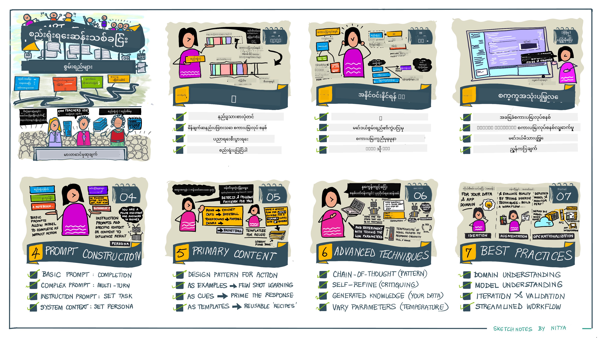
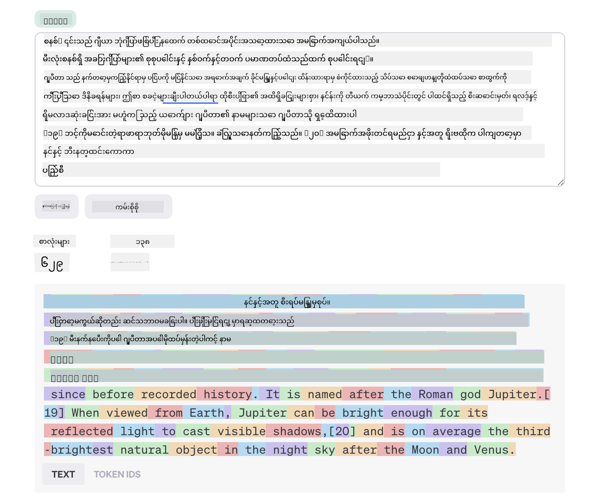

<!--
CO_OP_TRANSLATOR_METADATA:
{
  "original_hash": "a45c318dc6ebc2604f35b8b829f93af2",
  "translation_date": "2025-06-25T13:41:05+00:00",
  "source_file": "04-prompt-engineering-fundamentals/README.md",
  "language_code": "my"
}
-->
# Prompt Engineering Fundamentals

## အကြောင်းအရာမိတ်ဆက်
ဤ module တွင် generative AI မော်ဒယ်များတွင် ထိရောက်သော prompts များ ဖန်တီးရန် အရေးကြီးသော အယူအဆများနှင့် နည်းပညာများကို လေ့လာပါသည်။ သင့်၏ prompt ကို LLM သို့ ရေးသားပုံသည်လည်း အရေးကြီးပါသည်။ Prompt ကို အကောင်းဆုံး ပြုလုပ်နိုင်ပါက ထင်ဟပ်မှုအရည်အသွေးကို ပိုမိုကောင်းမွန်စေပါသည်။ _prompt_ နှင့် _prompt engineering_ ဆိုသော စကားလုံးများ၏ အဓိပ္ပါယ်က ဘာလဲ။ LLM သို့ ပေးပို့သော prompt _input_ ကို ဘယ်လိုကောင်းမွန်အောင် ပြုလုပ်ရမလဲ။ ဤအခန်းနှင့် နောက်အခန်းတွင် ကျွန်ုပ်တို့ ဖြေရှင်းရန် ကြိုးစားမည့် မေးခွန်းများဖြစ်သည်။

_Generative AI_ သည် အသုံးပြုသူတောင်းဆိုမှုများအတွက် အသစ်သော အကြောင်းအရာ (ဥပမာ-စာသား၊ ပုံများ၊ အသံ၊ ကုဒ်စသည်) ဖန်တီးနိုင်သည်။ ယင်းသည် သဘာဝဘာသာစကားနှင့် ကုဒ်ကို အသုံးပြုရန် လေ့ကျင့်ထားသော OpenAI ၏ GPT ("Generative Pre-trained Transformer") စီးရီးကဲ့သို့ _Large Language Models_ ကို အသုံးပြု၍ ရရှိသည်။

အသုံးပြုသူများသည် chat ကဲ့သို့ ရင်းနှီးသော ပုံစံများကို အသုံးပြု၍ ဤမော်ဒယ်များနှင့် အပြန်အလှန် ဆက်သွယ်နိုင်ပြီး နည်းပညာကျွမ်းကျင်မှု သို့မဟုတ် လေ့ကျင့်မှုမလိုအပ်ပါ။ မော်ဒယ်များသည် _prompt-based_ ဖြစ်သည် - အသုံးပြုသူများသည် စာသား input (prompt) ပေးပို့ပြီး AI ထံမှ ထင်ဟပ်မှု (completion) ရရှိသည်။ ထို့နောက် "AI နှင့် စကားပြော" iteratively, multi-turn conversations တွင် စကားပြောကာ ထင်ဟပ်မှုသည် သူတို့မျှော်လင့်ချက်နှင့် ကိုက်ညီသည်အထိ prompt ကို ပြုပြင်နိုင်သည်။

"Prompts" သည် generative AI app များအတွက် အဓိက _programming interface_ ဖြစ်လာပြီး မော်ဒယ်များကို ဘာလုပ်ရမည်ကို ပြောပြခြင်းနှင့် ပြန်လည်ရရှိသော ထင်ဟပ်မှုများ၏ အရည်အသွေးကို သက်ရောက်စေသည်။ "Prompt Engineering" သည် prompt များကို _design and optimization_ ပြုလုပ်၍ အရည်အသွေးမြင့် ထင်ဟပ်မှုများကို အချိန်အတိုင်းအတာကြီးစွာ ပေးပို့နိုင်စေရန် အာရုံစိုက်သော မြန်မြန်ဆန်ဆန် ကြီးထွားလာသော သုတေသနအပိုင်းဖြစ်သည်။

## လေ့လာရန် ရည်မှန်းချက်များ

ဤသင်ခန်းစာတွင် Prompt Engineering ဆိုသည်မှာ ဘာလဲ၊ ဘာကြောင့် အရေးကြီးပါသလဲ၊ သတ်မှတ်ထားသော မော်ဒယ်နှင့် လျှောက်လွှာရည်ရွယ်ချက်အတွက် ထိရောက်သော prompts များကို ဘယ်လိုဖန်တီးနိုင်မလဲကို လေ့လာပါမည်။ Prompt engineering အတွက် အဓိက အယူအဆများနှင့် အကောင်းဆုံးလက်တွေ့ကျသော နည်းလမ်းများကို နားလည်ပြီး - ဤအယူအဆများကို အမှန်တကယ်သော ဥပမာများတွင် ချမှတ်ထားသော interactive Jupyter Notebooks "sandbox" ပတ်ဝန်းကျင်ကို လေ့လာပါမည်။

ဤသင်ခန်းစာ၏ အဆုံးတွင် ကျွန်ုပ်တို့သည်-

1. Prompt engineering ဆိုသည်မှာ ဘာလဲ၊ ဘာကြောင့် အရေးကြီးပါသလဲကို ရှင်းပြနိုင်မည်။
2. Prompt ၏ အစိတ်အပိုင်းများနှင့် ၎င်းတို့ကို ဘယ်လို အသုံးပြုကြောင်း ရှင်းပြနိုင်မည်။
3. Prompt engineering အတွက် အကောင်းဆုံး လက်တွေ့ကျသော နည်းလမ်းများနှင့် နည်းပညာများကို လေ့လာနိုင်မည်။
4. OpenAI endpoint ကို အသုံးပြုပြီး အမှန်တကယ်သော ဥပမာများတွင် လေ့လာခဲ့သော နည်းပညာများကို လက်တွေ့ကျစွာ အသုံးချနိုင်မည်။

## အဓိက စကားလုံးများ

Prompt Engineering: AI မော်ဒယ်များကို ရည်ရွယ်ထားသော ထွက်ကုန်များထုတ်လုပ်ရန် လမ်းညွှန်သည့် input များကို ဒီဇိုင်းပြုလုပ်ခြင်းနှင့် ပြုပြင်ခြင်း လေ့ကျင့်မှု။
Tokenization: စာသားကို မော်ဒယ်တစ်ခု သိရှိနိုင်ပြီး အလုပ်လုပ်နိုင်သော token များဟု ခွဲခြားပြောင်းလဲခြင်း လုပ်ငန်းစဉ်။
Instruction-Tuned LLMs: ထင်ဟပ်မှု တိကျမှုနှင့် သက်ဆိုင်မှုကို တိုးတက်စေရန် သတ်မှတ်ထားသော ညွှန်ကြားချက်များဖြင့် အဆင်ပြေအောင် ပြုပြင်ထားသော Large Language Models (LLMs) များ။

## Learning Sandbox

Prompt engineering သည် လက်ရှိတွင် သိပ္ပံထက် အနုပညာ ပိုဖြစ်သည်။ ၎င်းကို လေ့ကျင့်ရန် ကျွန်ုပ်တို့၏ အထွေထွေသဘောပေါက်မှုကို တိုးတက်အောင်ပြုလုပ်ရန် အကောင်းဆုံးနည်းလမ်းသည် _ပိုမိုလေ့ကျင့်ခြင်း_ ဖြစ်ပြီး အကောင်းဆုံးနည်းလမ်းများနှင့် မော်ဒယ်-သီးသန့် optimization များနှင့် ပေါင်းစပ်ထားသော လျှောက်လွှာ domain ကျွမ်းကျင်မှုကို လက်တွေ့ကျစွာ အသုံးချခြင်းဖြစ်သည်။

ဤသင်ခန်းစာနှင့် တွဲဖက်ထားသော Jupyter Notebook သည် သင်လေ့လာသည့်အတိုင်း - သို့မဟုတ် အဆုံးတွင် code challenge အပိုင်းအဖြစ် ကြိုးစားကြည့်နိုင်သော _sandbox_ ပတ်ဝန်းကျင်ကို ပေးသည်။ လေ့ကျင့်ခန်းများကို အကောင်အထည်ဖော်ရန် သင့်တွင် အောက်ပါအရာများ လိုအပ်ပါမည်-

1. **An Azure OpenAI API key** - LLM ကို ဖျော်ဖြေရန် service endpoint။
2. **A Python Runtime** - Notebook ကို အကောင်အထည်ဖော်နိုင်သော။
3. **Local Env Variables** - _ပြင်ဆင်ရန် [SETUP](./../00-course-setup/SETUP.md?WT.mc_id=academic-105485-koreyst) လုပ်ငန်းစဉ်များကို အခုပြီးမြောက်ပါ_။

Notebook သည် _starter_ လေ့ကျင့်ခန်းများနှင့် လာသည် - သို့သော် သင်သည် သင့်ကိုယ်ပိုင် _Markdown_ (ဖျော်ဖြေရန်) နှင့် _Code_ (prompt requests) အပိုင်းများကို ထည့်သွင်းရန် လှုံ့ဆော်ထားပြီး - ပိုမိုများသော ဥပမာများ သို့မဟုတ် အယူအဆများကို ကြိုးစားကြည့်ရန် - နှင့် prompt design အတွက် သင့်အထွေထွေသဘောပေါက်မှုကို တည်ဆောက်ပါ။

## Illustrated Guide

ဤသင်ခန်းစာကို စိတ်မပါဘဲ များပြားသောအကြောင်းအရာကို လေ့လာရန် လိုချင်ပါသလား။ ဤ illustrated guide ကို ကြည့်ပါ၊ ၎င်းသည် ဖုံးအုပ်ထားသော အဓိက အကြောင်းအရာများနှင့် တစ်ခုချင်းစီတွင် သင့်အတွက် စဉ်းစားရန် အဓိက takeaways များကို အထင်အမြင်ပေးသည်။ သင်ခန်းစာ၏ လမ်းကြောင်းသည် အဓိက အယူအဆများနှင့် စိန်ခေါ်မှုများကို နားလည်ခြင်းမှ အဆင့်မြင့် prompt engineering နည်းပညာများနှင့် အကောင်းဆုံးလက်တွေ့ကျသော နည်းလမ်းများဖြင့် ဖြေရှင်းခြင်းသို့ ချိန်ညှိသည်။ ဤလမ်းညွှန်အတွင်း "Advanced Techniques" အပိုင်းသည် ဤသင်ခန်းစာ၏ _နောက်_ အခန်းတွင် ဖုံးအုပ်ထားသော အကြောင်းအရာကို ဆိုလိုသည်။

## ကျွန်ုပ်တို့၏ စတင်လုပ်ငန်း

အခုတော့ [ပညာရေးတွင် AI innovation ပေးဆောင်ရန်](https://educationblog.microsoft.com/2023/06/collaborating-to-bring-ai-innovation-to-education?WT.mc_id=academic-105485-koreyst) ကျွန်ုပ်တို့၏ စတင်လုပ်ငန်း မစ်ရှင်နှင့် ဤအကြောင်းအရာသည် ဘယ်လိုဆက်စပ်နေသည်ကို ပြောကြားပါစို့။ ကျွန်ုပ်တို့သည် _ပုဂ္ဂိုလ်ရေး လေ့လာရေး_ ၏ AI-powered applications ကို တည်ဆောက်လိုပါသည် - ထို့ကြောင့် ကျွန်ုပ်တို့၏ application ၏ အသုံးပြုသူများက ဘယ်လို "design" prompts များကို တွေးတောကြမည်ကို တွေးကြည့်ပါစို့:

- **အုပ်ချုပ်ရေးမှူးများ** သည် AI ကို _သင်ရိုးညွှန်းတမ်းဒေတာကို ချိုးဖောက်ရန် လေ့လာရန်_ တောင်းဆိုနိုင်သည်။ AI သည် ရလဒ်များကို အကျဉ်းချုပ်ရန် သို့မဟုတ် ကုဒ်ဖြင့် visualization ပြုလုပ်ရန် ပြုလုပ်နိုင်သည်။
- **ပညာရေးသမားများ** သည် AI ကို _ပစ်မှတ်ပရိသတ်နှင့် အကြောင်းအရာအတွက် သင်ခန်းစာအစီအစဉ်ကို ဖန်တီးရန်_ တောင်းဆိုနိုင်သည်။ AI သည် သတ်မှတ်ထားသော ပုံစံတွင် ပုဂ္ဂိုလ်ရေးအစီအစဉ်ကို တည်ဆောက်နိုင်သည်။
- **ကျောင်းသားများ** သည် AI ကို _ခက်ခဲသောဘာသာရပ်တွင် ကိုယ်ပိုင်လေ့လာရန်_ တောင်းဆိုနိုင်သည်။ AI သည် ယခု ကျောင်းသားများကို ၎င်းတို့၏အဆင့်အတန်းနှင့် ကိုက်ညီသော သင်ခန်းစာများ၊ အညွှန်းများနှင့် ဥပမာများဖြင့် လမ်းညွှန်နိုင်သည်။

ဤ iceberg ၏ ထိပ်မှာသာဖြစ်သည်။ [Prompts For Education](https://github.com/microsoft/prompts-for-edu/tree/main?WT.mc_id=academic-105485-koreyst) ကို ကြည့်ပါ - ပညာရေးကျွမ်းကျင်သူများက စုစည်းထားသော အခမဲ့ prompts library - လုပ်နိုင်သော အခွင့်အလမ်းများ၏ ပိုမိုကျယ်ပြန့်သော အမြင်ကို ရရှိရန်! _sandbox တွင် ထို့အပြင် OpenAI Playground ကို အသုံးပြု၍ ထို့အပြင် အခြား prompt များကို လုပ်ဆောင်ကြည့်ပါ_

<!--
LESSON TEMPLATE:
ဤ unit သည် အဓိက concept #1 ကို ဖုံးအုပ်ထားသင့်သည်။
ဥပမာများနှင့် ကိုးကားချက်များဖြင့် အယူအဆကို ခိုင်မာစေပါ။

CONCEPT #1:
Prompt Engineering.
၎င်းကို သတ်မှတ်ပြီး ဘာကြောင့် လိုအပ်သည်ကို ရှင်းပြပါ။
-->

## Prompt Engineering ဆိုသည်မှာ ဘာလဲ?

ကျွန်ုပ်တို့သည် ဤသင်ခန်းစာကို _designing and optimizing_ text inputs (prompts) လုပ်ငန်းစဉ်အဖြစ် **Prompt Engineering** ကို သတ်မှတ်ခြင်းဖြင့် စတင်ခဲ့သည်။ သတ်မှတ်ထားသော application ရည်ရွယ်ချက်နှင့် မော်ဒယ်အတွက် consistent and quality responses (completions) ပေးရန်။ ကျွန်ုပ်တို့သည် ၎င်းကို ၂-အဆင့် လုပ်ငန်းစဉ်အဖြစ် စဉ်းစားနိုင်သည်-

- သတ်မှတ်ထားသော မော်ဒယ်နှင့် ရည်ရွယ်ချက်အတွက် မူလ prompt ကို _designing_
- ထင်ဟပ်မှု၏ အရည်အသွေးကို တိုးတက်အောင် ပြုလုပ်ရန် prompt ကို _refining_ iteratively

ဤသည်သည် အကောင်းဆုံးရလဒ်များကို ရရှိရန် အသုံးပြုသူ၏ အထွေထွေသဘောပေါက်မှုနှင့် ကြိုးစားမှု လိုအပ်သော trial-and-error လုပ်ငန်းစဉ်ဖြစ်သည်။ ထို့ကြောင့် အရေးကြီးပါသလဲ။ ဤမေးခွန်းကို ဖြေရှင်းရန် ကျွန်ုပ်တို့သည် အရင်ဆုံး အဓိက အယူအဆ ၃ ခုကို နားလည်ရန် လိုအပ်သည်-

- _Tokenization_ = မော်ဒယ်သည် prompt ကို "မြင်" သည့်ပုံစံ
- _Base LLMs_ = foundation model သည် prompt ကို "အလုပ်လုပ်" သည့်ပုံစံ
- _Instruction-Tuned LLMs_ = မော်ဒယ်သည် "tasks" ကို "မြင်" သည့်ပုံစံ

### Tokenization

LLM သည် prompts များကို _sequence of tokens_ အဖြစ်မြင်ပြီး မော်ဒယ်များ (သို့မဟုတ် မော်ဒယ်၏ ဗားရှင်းများ) များသည် prompt တစ်ခုတည်းကို မတူညီသော နည်းလမ်းများဖြင့် tokenize ပြုလုပ်နိုင်သည်။ LLMs များသည် token များ (raw text များမဟုတ်) အပေါ်တွင် လေ့ကျင့်ထားသောကြောင့် prompt များကို tokenize ပြုလုပ်သည့် နည်းလမ်းသည် ထင်ဟပ်မှုအရည်အသွေးအပေါ် တိုက်ရိုက် သက်ရောက်မှုရှိသည်။

Tokenization လုပ်ပုံကို နားလည်ရန် [OpenAI Tokenizer](https://platform.openai.com/tokenizer?WT.mc_id=academic-105485-koreyst) ကဲ့သို့သော ကိရိယာများကို ကြိုးစားပါ။ သင်၏ prompt ကို ကူးယူပြီး - whitespace အက္ခရာများနှင့် punctuation အမှတ်များကို ဘယ်လို handling ပြုလုပ်သည်ကို ဂရုပြုပါ။ ဤဥပမာသည် အဟောင်း LLM (GPT-3) ကို ပြသသည် - ထို့ကြောင့် ဤကို အဆင့်မြင့်မော်ဒယ်ဖြင့် ကြိုးစားခြင်းသည် မတူညီသောရလဒ်ကို ရရှိနိုင်သည်။

### Concept: Foundation Models

Prompt တစ်ခုကို tokenize ပြုလုပ်ပြီးလျှင် ["Base LLM"](https://blog.gopenai.com/an-introduction-to-base-and-instruction-tuned-large-language-models-8de102c785a6?WT.mc_id=academic-105485-koreyst) (သို့မဟုတ် Foundation model) ၏ အဓိက လုပ်ဆောင်ချက်မှာ ၎င်း sequence တွင် token ကို ခန့်မှန်းခြင်းဖြစ်သည်။ LLMs များသည် စာသား dataset ကြီးများဖြင့် လေ့ကျင့်ထားသောကြောင့် token များအကြား စာရင်းဇယားဆိုင်ရာ ဆက်နွယ်မှုများကို ကောင်းစွာ သိရှိထားပြီး ယင်းခန့်မှန်းချက်ကို ယုံကြည်မှုအချို့ဖြင့် ပြုလုပ်နိုင်သည်။ ၎င်းတို့သည် prompt သို့မဟုတ် token တွင် စကားလုံးများ၏ _အဓိပ္ပါယ်_ ကို မသိကြပါ။ ၎င်းတို့သည် ၎င်းတို့၏ နောက်ထပ်ခန့်မှန်းချက်ဖြင့် "ပြီးမြောက်" လုပ်နိုင်သည့် pattern ကိုသာ မြင်ကြသည်။ ၎င်းတို့သည် အသုံးပြုသူ၏ အထိမ်းအမှတ် သို့မဟုတ် သတ်မှတ်ထားသော အခြေအနေတစ်ခုအထိ ရပ်တန့်သည်အထိ sequence ကို ဆက်လက်ခန့်မှန်းနိုင်သည်။

Prompt-based completion လုပ်ပုံကို ဘယ်လိုမြင်ချင်ပါသလဲ။ အထက်ပါ prompt ကို Azure OpenAI Studio [_Chat Playground_](https://oai.azure.com/playground?WT.mc_id=academic-105485-koreyst) ထဲတွင် default settings ဖြင့် ထည့်ပါ။ စနစ်သည် prompts များကို အချက်အလက်တောင်းဆိုမှုများအဖြစ် ဆက်ဆံရန် ဖွဲ့စည်းထားသောကြောင့် - ဤ context ကို ဖြည့်စွက်သော ထင်ဟပ်မှုကို ကြည့်ရှုရမည်။

ဒါပေမယ့် အသုံးပြုသူသည် task ရည်ရွယ်ချက် သို့မဟုတ် criteria အချို့ကို ဖြည့်ဆည်းသော အရာတစ်ခုကို ကြည့်ရှုလိုပါက အဘယ်သို့ပြုလုပ်ရမည်နည်း။ ဤသည်မှာ _
အဆုံးမှာတော့ template တွေရဲ့ တန်ဖိုးအမှန်က ကိုယ်ရည်ရွယ်ထားတဲ့ အသုံးပြုသူအပေါ်ပိုမိုသင့်လျော်ပြီး တိကျမှန်ကန်တဲ့ အဖြေများပေးနိုင်အောင် အထူးပြုထားတဲ့ _prompt library_ များကို လက်တလောဖြစ်စေဖန်တီးနိုင်ခြင်းနှင့်ထုတ်ဝေခြင်းတွင် ရှိသည်။ [Prompts For Edu](https://github.com/microsoft/prompts-for-edu?WT.mc_id=academic-105485-koreyst) repository သည် ဤနည်းလမ်း၏ ကောင်းမွန်သော နမူနာတစ်ခုဖြစ်ပြီး ပညာရေးနယ်ပယ်အတွက် prompt များကို စုစည်းထားသော library တစ်ခုဖြစ်သည်။ ဂျာနယ်စီမံကိန်းများ၊ သင်ရိုးညွှန်းတမ်းဒီဇိုင်း၊ ကျောင်းသားများကို သင်ကြားပေးခြင်းစသည့် အဓိကရည်ရွယ်ချက်များကို အထူးပြုထားသည်။

## Supporting Content

prompt တစ်ခုကို တည်ဆောက်ခြင်းကို အကြောင်းအရာ (task) နှင့် အဓိကအကြောင်းအရာ (primary content) ပါဝင်သည်ဟု တွေးပါက _secondary content_ သည် **အထွက်ကို တစ်နည်းနည်းဖြင့် အကျိုးသင့်အောင် လုပ်ဆောင်ရန်** ကျွန်ုပ်တို့ ပေးသည့် အပိုအကြောင်းအရာကဲ့သို့ဖြစ်သည်။ ၎င်းသည် ထုတ်ကုန်ကို အသုံးပြုသူ၏ ရည်ရွယ်ချက်များနှင့် မျှော်လင့်ချက်များနှင့် ကိုက်ညီအောင် _ထုံးစံပြု_ ပြုလုပ်နိုင်ရန် ကူညီပေးသော parameter များ၊ formatting ညွှန်ကြားချက်များ၊ အကြောင်းအရာခွဲခြားမှုများ စသည့် အရာများဖြစ်နိုင်သည်။

ဥပမာ - သင်ရိုးညွှန်းတမ်းတွင် ရရှိနိုင်သည့် သင်ခန်းစာများအားလုံးအတွက် ကျယ်ပြန့်သော metadata (အမည်၊ ဖျော်ဖြေရေး၊ အဆင့်၊ metadata တံဆိပ်များ၊ သင်ကြားသူစသည်ဖြင့်) ပါဝင်သော သင်ရိုးညွှန်းတမ်းတစ်ခုရှိပါက -

- "Fall 2023 အတွက် သင်ရိုးညွှန်းတမ်းကို အကျဉ်းချုပ်ပါ" ဟု အကြောင်းအရာတစ်ခုကို သတ်မှတ်နိုင်သည်။
- အဓိကအကြောင်းအရာကို အသုံးပြု၍ ရည်ရွယ်သော အထွက်၏ နမူနာအချို့ကို ပေးနိုင်သည်။
- secondary content ကို အသုံးပြု၍ စိတ်ဝင်စားမှုရှိသော ထိပ်ဆုံး ၅ ခုသော "တံဆိပ်များ" ကို ဖော်ထုတ်နိုင်သည်။

ယခု မော်ဒယ်သည် နမူနာအချို့က ပြထားသည့် ပုံစံအတိုင်း အကျဉ်းချုပ်ပေးနိုင်သည် - သို့သော် ရလဒ်တွင် တံဆိပ်များစွာပါရှိပါက secondary content တွင် ဖော်ပြထားသော ၅ ခုသော တံဆိပ်များကို ဦးစားပေးနိုင်သည်။

---

<!--
LESSON TEMPLATE:
ဤယူနစ်သည် အခြေခံအယူအဆ #1 ကို ဖုံးလွှမ်းရမည်။
ဥပမာများနှင့် ကိုးကားချက်များဖြင့် အယူအဆကို ခိုင်မာအောင်လုပ်ပါ။

အယူအဆ #3:
Prompt Engineering နည်းပညာများ။
Prompt Engineering အတွက် အခြေခံနည်းလမ်းများအချို့ကဘာလဲ?
အရာအချို့ကို လေ့ကျင့်ခန်းဖြင့် ဖျော်ဖြေရန်။
-->

## Prompting Best Practices

ယခုကျွန်ုပ်တို့သည် prompt များကို _တည်ဆောက်_ နိုင်သည်ကို သိရှိပြီးဖြစ်သောကြောင့် အကောင်းဆုံးနည်းလမ်းများကို ထင်ဟပ်ရန် _ဒီဇိုင်း_ ဆွဲနိုင်ပုံကို စဉ်းစားနိုင်သည်။ ၎င်းကို အပိုင်းနှစ်ပိုင်းဖြင့် တွေးနိုင်သည် - မှန်ကန်သော _စိတ်ထား_ ရှိခြင်းနှင့် မှန်ကန်သော _နည်းလမ်းများ_ ကို အသုံးပြုခြင်းဖြစ်သည်။

### Prompt Engineering Mindset

Prompt Engineering သည် ကြိုးစားမှုနှင့် အမှားဖြစ်သော လုပ်ငန်းစဉ်ဖြစ်သောကြောင့် ညွှန်ကြားချက်များကို အထွေထွေသုံးသပ်စဉ်းစားပါ။

1. **နယ်ပယ်နားလည်မှုသည် အရေးကြီးသည်။** အဖြေများ၏ တိကျမှုနှင့် သင့်လျော်မှုသည် ထို အပလီကေးရှင်း သို့မဟုတ် အသုံးပြုသူ တည်ရှိရာ _နယ်ပယ်_ ၏ လုပ်ဆောင်ချက်တစ်ခုဖြစ်သည်။ သင်၏ အထင်အမြင်နှင့် နယ်ပယ်ကျွမ်းကျင်မှုကို အသုံးပြု၍ နည်းလမ်းများကို ထပ်မံ **စိတ်ကြိုက်ပြုပြင်ပါ**။ ဥပမာအားဖြင့် သင်၏ system prompt များတွင် _နယ်ပယ်အထူးပြု ကိုယ်ရည်ကိုယ်သွေးများ_ ကို သတ်မှတ်ပါ သို့မဟုတ် သင်၏ user prompt များတွင် _နယ်ပယ်အထူးပြု template များ_ ကို အသုံးပြုပါ။ နယ်ပယ်အထူးပြု အခြေအနေများကို ဖေါ်ပြသည့် secondary content ကို ပေးပါ သို့မဟုတ် မော်ဒယ်ကို ရင်းနှီးသော အသုံးပြုမှု ပုံစံများသို့ ဦးတည်ရန် _နယ်ပယ်အထူးပြု အချက်ပြများနှင့် ဥပမာများ_ ကို အသုံးပြုပါ။

2. **မော်ဒယ်နားလည်မှုသည် အရေးကြီးသည်။** မော်ဒယ်များသည် သဘာဝအားဖြင့် stochastic ဖြစ်ကြောင်း ကျွန်ုပ်တို့သိသည်။ သို့သော် မော်ဒယ်အကောင်အထည်ဖော်မှုများသည် ၎င်းတို့ အသုံးပြုသည့် သင်ကြားမှုဒေတာစု (ကြိုတင်သိရှိမှု)၊ ၎င်းတို့ပေးသည့် စွမ်းရည်များ (ဥပမာ API သို့မဟုတ် SDK) နှင့် ၎င်းတို့ကို အထူးပြုထားသော အကြောင်းအရာအမျိုးအစား (ဥပမာ ကုဒ်၊ ပုံများ၊ စာသား) အရ ကွဲပြားနိုင်သည်။ သင်အသုံးပြုနေသော မော်ဒယ်၏ အားသာချက်များနှင့် ကန့်သတ်ချက်များကို နားလည်ပြီး ထိုအတတ်ပညာကို အသုံးပြု၍ _လုပ်ငန်းတာဝန်များကို ဦးစားပေး_ သို့မဟုတ် မော်ဒယ်၏ စွမ်းရည်များအတွက် အထူးပြုထားသော _စိတ်ကြိုက် template များ_ တည်ဆောက်ပါ။

3. **ထပ်ခါတလဲလဲနှင့် အတည်ပြုမှုသည် အရေးကြီးသည်။** မော်ဒယ်များသည် အလျင်အမြန် တိုးတက်နေပြီး prompt engineering အတွက် နည်းလမ်းများလည်း ထိုနည်းတူ တိုးတက်နေသည်။ နယ်ပယ်ကျွမ်းကျင်သူအဖြစ် သင်၏ အသေးစိတ် အပလီကေးရှင်း သို့မဟုတ် ကျယ်ပြန့်သော လူမှုအသိုင်းအဝိုင်းကို သက်ဆိုင်မည့် အခြေအနေများ သို့မဟုတ် စံသတ်မှတ်ချက်များရှိနိုင်သည်။ prompt engineering tools & techniques များကို အသုံးပြု၍ prompt တည်ဆောက်ခြင်းကို "စတင်" ပြီးနောက် သင်၏ အထင်အမြင်နှင့် နယ်ပယ်ကျွမ်းကျင်မှုကို အသုံးပြု၍ ရလဒ်များကို ထပ်ခါတလဲလဲနှင့် အတည်ပြုပါ။ သင်၏ အမြင်များကို မှတ်တမ်းတင်ပြီး အခြားသူများအတွက် အသစ်သော အခြေခံလိုင်းအဖြစ် အသုံးပြုနိုင်သော **အတတ်ပညာအခြေခံ** (ဥပမာ prompt library များ) တစ်ခုကို ဖန်တီးပါ၊ အနာဂတ်တွင် ပိုမိုလျင်မြန်သော iteration များအတွက်။

## Best Practices

ယခု OpenAI နှင့် Azure OpenAI အသုံးပြုသူများမှ [OpenAI](https://help.openai.com/en/articles/6654000-best-practices-for-prompt-engineering-with-openai-api?WT.mc_id=academic-105485-koreyst) နှင့် [Azure OpenAI](https://learn.microsoft.com/azure/ai-services/openai/concepts/prompt-engineering#best-practices?WT.mc_id=academic-105485-koreyst) မှ အကြံပြုထားသော အခြေခံ နည်းလမ်းများကို ကြည့်ကြပါစို့။

| အရာ                           | အကြောင်းပြချက်                                                                                                                                                                                                                                              |
| :---------------------------- | :-------------------------------------------------------------------------------------------------------------------------------------------------------------------------------------------------------------------------------------------------------------- |
| နောက်ဆုံးထွက် မော်ဒယ်များကို အကဲဖြတ်ပါ | မော်ဒယ်အသစ်များသည် ပိုမိုကောင်းမွန်သော အင်္ဂါရပ်များနှင့် အရည်အသွေးများ ရှိနိုင်သော်လည်း အကျိုးသက်ရောက်မှုအတွက် အကဲဖြတ်ပြီးမှ ပြောင်းရွှေ့မှု ဆုံးဖြတ်ချက်များကို ပြုလုပ်ပါ။                                                                                       |
| ညွှန်ကြားချက်များနှင့် အခြေအနေများကို ခွဲခြားပါ | သင်၏ မော်ဒယ်/ပေးသွင်းသူက _delimiters_ ကို သတ်မှတ်ထားပါက ညွှန်ကြားချက်များ၊ အဓိကနှင့် အတွဲလိုက် အကြောင်းအရာများကို ပိုမိုရှင်းလင်းစွာ ခွဲခြားပါ။ ၎င်းသည် မော်ဒယ်များကို အတိုကောက်များကို ပိုမိုတိကျစွာ ပေးနိုင်ရန် ကူညီပေးနိုင်သည်။                                           |
| အထူးပြုဖြစ်ပြီး ရှင်းလင်းမှုရှိပါစေ | ရည်ရွယ်ထားသော အခြေအနေ၊ အထွက်၊ အရှည်၊ ပုံစံ၊ စတိုင်စသည်တို့ကို အသေးစိတ်ဖေါ်ပြပါ။ ၎င်းသည် အဖြေများ၏ အရည်အသွေးနှင့် တိကျမှုနှစ်ခုစလုံးကို တိုးတက်စေပါလိမ့်မည်။ အသုံးပြုနိုင်သော template များတွင် စာရွက်ချက်များကို ဖမ်းယူပါ။                                                         |
| ဖျော်ဖြေရန်၊ ဥပမာများကို အသုံးပြုပါ | မော်ဒယ်များသည် "ပြပါနှင့် ပြောပါ" လမ်းစဉ်ကို ပိုမိုကောင်းစွာ တုံ့ပြန်နိုင်သည်။ `zero-shot` approach where you give it an instruction (but no examples) then try `few-shot` as a refinement, providing a few examples of the desired output. Use analogies. |
| Use cues to jumpstart completions | Nudge it towards a desired outcome by giving it some leading words or phrases that it can use as a starting point for the response.                                                                                                               |
| Double Down                       | Sometimes you may need to repeat yourself to the model. Give instructions before and after your primary content, use an instruction and a cue, etc. Iterate & validate to see what works.                                                         |
| Order Matters                     | The order in which you present information to the model may impact the output, even in the learning examples, thanks to recency bias. Try different options to see what works best.                                                               |
| Give the model an “out”           | Give the model a _fallback_ completion response it can provide if it cannot complete the task for any reason. This can reduce chances of models generating false or fabricated responses.                                                         |
|                                   |                                                                                                                                                                                                                                                   |

As with any best practice, remember that _your mileage may vary_ based on the model, the task and the domain. Use these as a starting point, and iterate to find what works best for you. Constantly re-evaluate your prompt engineering process as new models and tools become available, with a focus on process scalability and response quality.

<!--
LESSON TEMPLATE:
This unit should provide a code challenge if applicable

CHALLENGE:
Link to a Jupyter Notebook with only the code comments in the instructions (code sections are empty).

SOLUTION:
Link to a copy of that Notebook with the prompts filled in and run, showing what one example could be.
-->

## Assignment

Congratulations! You made it to the end of the lesson! It's time to put some of those concepts and techniques to the test with real examples!

For our assignment, we'll be using a Jupyter Notebook with exercises you can complete interactively. You can also extend the Notebook with your own Markdown and Code cells to explore ideas and techniques on your own.

### To get started, fork the repo, then

- (Recommended) Launch GitHub Codespaces
- (Alternatively) Clone the repo to your local device and use it with Docker Desktop
- (Alternatively) Open the Notebook with your preferred Notebook runtime environment.

### Next, configure your environment variables

- Copy the `.env.copy` file in repo root to `.env` and fill in the `AZURE_OPENAI_API_KEY`, `AZURE_OPENAI_ENDPOINT` and `AZURE_OPENAI_DEPLOYMENT` တန်ဖိုးများကို စတင်ပါ။ [Learning Sandbox အပိုင်း](../../../04-prompt-engineering-fundamentals/04-prompt-engineering-fundamentals) သို့ ပြန်သွားပြီး ဘယ်လိုလုပ်ရမည်ကို လေ့လာပါ။

### နောက်တစ်ခုမှာ Jupyter Notebook ကို ဖွင့်ပါ

- runtime kernel ကို ရွေးပါ။ ရွေးချယ်မှု 1 သို့မဟုတ် 2 ကို အသုံးပြုပါက dev container မှ ပေးထားသော အမည်မပြောင်းရသည့် Python 3.10.x kernel ကို ရွေးပါ။

လေ့ကျင့်ခန်းများကို စတင်လည်ပတ်ရန် သင်အဆင်သင့်ဖြစ်ပါပြီ။ ဤနေရာတွင် _မှန်ကန်မှုနှင့် အမှား_ မရှိပါ - စမ်းသပ်မှုနှင့် အမှားဖြင့် ရွေးချယ်စရာများကို စူးစမ်းပြီး သတ်မှတ်ထားသော မော်ဒယ်နှင့် အပလီကေးရှင်းနယ်ပယ်အတွက် ဘာက အလုပ်ဖြစ်သလဲဆိုတာကို အထင်အမြင်တစ်ခု ဖွဲ့ဆောင်ပါ။

_ဤကြောင့် ဤသင်ခန်းစာတွင် Code Solution အပိုင်းများ မပါရှိပါ။ ၎င်း၏ အစား၊ Notebook တွင် "My Solution:" ဟူသော Markdown cells များပါရှိပြီး ကိုးကားရန် အထွက်ဖြစ်စဉ်တစ်ခုကို ပြသထားပါမည်။_

 <!--
LESSON TEMPLATE:
အခန်းကို အကျဉ်းချုပ်နှင့် ကိုယ်ပိုင်လေ့လာမှုအတွက် အရင်းအမြစ်များဖြင့် ဖုံးလွှမ်းပါ။
-->

## Knowledge check

အောက်ပါအရာများထဲမှ အခြေခံ နည်းလမ်းများအချို့ကို လိုက်နာထားသော ကောင်းမွန်သော prompt တစ်ခုက ဘာဖြစ်နိုင်မည်နည်း?

1. အနီရောင်ကားပုံတစ်ပုံပြပါ
2. Volvo အမှတ်တံဆိပ် XC90 မော်ဒယ်ရှိ အနီရောင်ကားတစ်စီးကို နေရောင်ချိန်တွင် ချောက်ကမ်းစပ်တွင်ရပ်ထားသောပုံကို ပြပါ
3. Volvo အမှတ်တံဆိပ် XC90 မော်ဒယ်ရှိ အနီရောင်ကားတစ်စီးကို ပြပါ

A: 2, ၎င်းသည် "ဘာ" အကြောင်းအသေးစိတ်ကို ပေးပြီး အသေးစိတ်အချက်အလက်များထဲသို့ ဝင်ရောက်သည့် အကောင်းဆုံး prompt ဖြစ်သည် (မည်သည့်ကားမဆိုမဟုတ်ပဲ အမှတ်တံဆိပ်နှင့် မော်ဒယ်ကို အထူးပြုထားသည်) ၎င်းသည် ပတ်ဝန်းကျင်ကိုလည်း ဖေါ်ပြသည်။ 3 သည် နောက်ဆုံးကောင်းမွန်သည်၊ ၎င်းသည်လည်း ဖျော်ဖြေရန် အသေးစိတ်အချက်အလက်များ ပါဝင်သည်။

## 🚀 Challenge

"Volvo အမှတ်တံဆိပ်ရှိ အနီရောင်ကား၏ ပုံတစ်ပုံပြပါ" ဟု စာကြောင်းကို ပြည့်စုံစေရန် "cue" နည်းလမ်းကို အသုံးပြုနိုင်ပါက ကြိုးစားကြည့်ပါ။ ၎င်းသည် ဘာဖြစ်စေပြီး၊ သင်က ၎င်းကို ဘယ်လိုတိုးတက်အောင်လုပ်မလဲ?

## Great Work! Continue Your Learning

Prompt Engineering အယူအဆများကို ပိုမိုလေ့လာလိုပါသလား? ဤအကြောင်းအရာနှင့် သက်ဆိုင်သော အခြားကောင်းမွန်သော အရင်းအမြစ်များကို ရှာဖွေရန် [continued learning page](https://aka.ms/genai-collection?WT.mc_id=academic-105485-koreyst) သို့ သွားပါ။

[အဆင့်မြင့် prompt နည်းလမ်းများ](../05-advanced-prompts/README.md?WT.mc_id=academic-105485-koreyst) ကို ကြည့်ရန် သင်ခန်းစာ ၅ သို့ သွားပါ!

**အခွင့်လွှာ**:  
ဤစာရွက်ကို AI ဘာသာပြန်စနစ် [Co-op Translator](https://github.com/Azure/co-op-translator) ကို အသုံးပြု၍ ဘာသာပြန်ထားပါသည်။ ကျွန်ုပ်တို့သည် တိကျမှန်ကန်မှုကို အလေးထားသော်လည်း၊ အလိုအလျောက် ဘာသာပြန်ခြင်းတွင် အမှားများ သို့မဟုတ် မမှန်ကန်မှုများ ရှိနိုင်ကြောင်း သတိပြုပါ။ မူရင်းစာရွက်ကို ၎င်း၏ ဒေသန္တရ ဘာသာစကားဖြင့် အာဏာတော်ဆိုင်သော အရင်းအမြစ်အဖြစ် တွင်ယူရမည်ဖြစ်သည်။ အရေးကြီးသော အချက်အလက်များအတွက် လူသား အကျိုးဆောင် ဘာသာပြန်ခြင်းကို အကြံပြုပါသည်။ ဤဘာသာပြန်ကို အသုံးပြုခြင်းမှ ဖြစ်ပေါ်လာသော အလွဲသဖြစ်မှုများ သို့မဟုတ် အလွဲအကြောင်းအရာများအတွက် ကျွန်ုပ်တို့သည် တာဝန်မယူပါ။