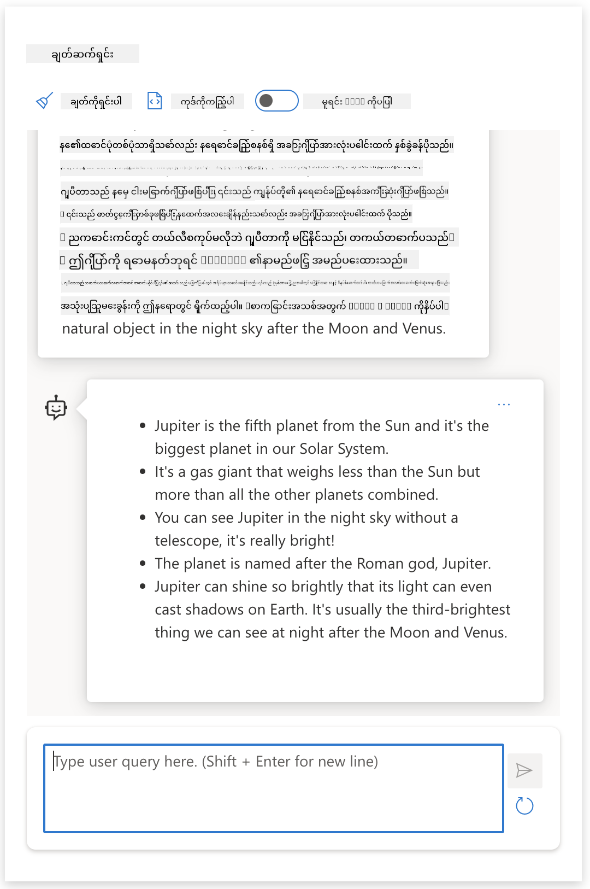
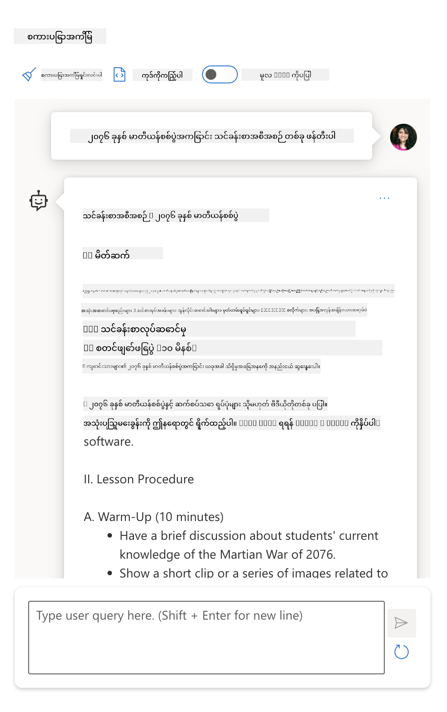
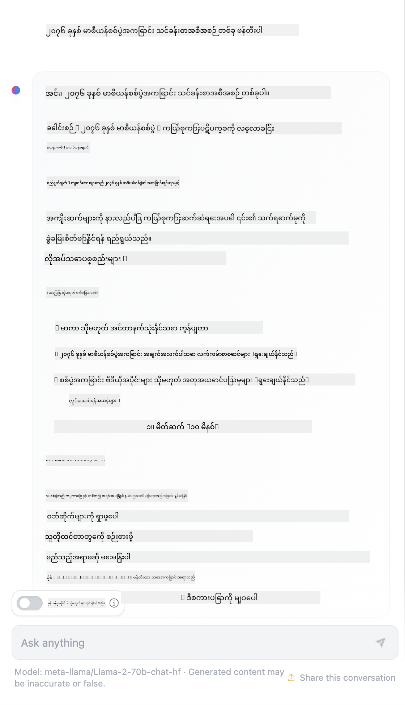

<!--
CO_OP_TRANSLATOR_METADATA:
{
  "original_hash": "8b3cb38518cf4fe7714d2f5e74dfa3eb",
  "translation_date": "2025-10-03T10:39:02+00:00",
  "source_file": "04-prompt-engineering-fundamentals/README.md",
  "language_code": "my"
}
-->
# Prompt Engineering အခြေခံများ

[](https://aka.ms/gen-ai-lesson4-gh?WT.mc_id=academic-105485-koreyst)

## အကျဉ်းချုပ်
ဒီ module မှာ Generative AI models တွေမှာ အကျိုးရှိတဲ့ prompts တွေဖန်တီးဖို့အတွက် အရေးကြီးတဲ့ အယူအဆတွေ၊ နည်းလမ်းတွေကို လေ့လာပါမယ်။ LLM ကို prompt ရေးသားပုံကလည်း အရေးကြီးပါတယ်။ Prompt ကို သေချာစွာ ဖန်တီးရေးသားခြင်းက response quality ကို ပိုမိုကောင်းမွန်စေနိုင်ပါတယ်။ ဒါပေမယ့် _prompt_ နဲ့ _prompt engineering_ ဆိုတာ ဘာလဲ? LLM ကို ပေးပို့တဲ့ prompt _input_ ကို ဘယ်လိုတိုးတက်အောင်လုပ်မလဲ? ဒီအခန်းနဲ့ နောက်အခန်းမှာ ဒီမေးခွန်းတွေကို ဖြေရှင်းကြည့်ပါမယ်။

_Generative AI_ က အသုံးပြုသူရဲ့ တောင်းဆိုမှုအပေါ် အခြေခံပြီး အကြောင်းအရာအသစ် (ဥပမာ - စာသား၊ ပုံရိပ်၊ အသံ၊ ကုဒ်စသည်) ဖန်တီးနိုင်ပါတယ်။ ဒါကို OpenAI ရဲ့ GPT ("Generative Pre-trained Transformer") စီးရီးလို _Large Language Models_ တွေကို သဘာဝဘာသာစကားနဲ့ ကုဒ်အသုံးပြုဖို့ လေ့ကျင့်ထားတဲ့နည်းလမ်းတွေကို အသုံးပြုပြီး အောင်မြင်စေပါတယ်။

အသုံးပြုသူတွေဟာ chat လိုမျိုး ရိုးရှင်းပြီး နည်းပညာအတတ်ပညာမလိုအပ်တဲ့ နည်းလမ်းတွေနဲ့ ဒီ models တွေနဲ့ အပြန်အလှန် ဆက်သွယ်နိုင်ပါပြီ။ ဒီ models တွေဟာ _prompt-based_ ဖြစ်ပြီး အသုံးပြုသူတွေက text input (prompt) ပေးပို့ပြီး AI response (completion) ကို ပြန်လည်ရရှိပါတယ်။ ထို့နောက် "AI နဲ့ စကားပြော" လုပ်ပြီး multi-turn conversations တွေမှာ prompt ကို ပြန်လည်တိုးတက်အောင်လုပ်နိုင်ပါတယ်၊ response က အသုံးပြုသူရဲ့ မျှော်မှန်းချက်နဲ့ ကိုက်ညီအောင်။

"Prompts" ဟာ အခုဆိုရင် generative AI apps တွေအတွက် အဓိက _programming interface_ ဖြစ်လာပြီး models တွေကို ဘာလုပ်ရမလဲဆိုတာ ပြောပြပေးပြီး response quality ကို ထိန်းချုပ်နိုင်ပါတယ်။ "Prompt Engineering" ဆိုတာ prompt တွေကို _design နဲ့ optimization_ လုပ်ပြီး response quality ကို အဆင့်မြှင့်တင်ဖို့ အဓိကထားတဲ့ လျင်မြန်စွာတိုးတက်လာတဲ့ သုတေသနနယ်ပယ်တစ်ခုဖြစ်ပါတယ်။

## သင်ယူရမယ့် အချက်များ

ဒီသင်ခန်းစာမှာ Prompt Engineering ဆိုတာ ဘာလဲ၊ ဘာကြောင့် အရေးကြီးလဲ၊ နဲ့ model နဲ့ application ရည်ရွယ်ချက်အတွက် ပိုမိုထိရောက်တဲ့ prompts တွေကို ဘယ်လိုဖန်တီးရမလဲဆိုတာကို လေ့လာပါမယ်။ Prompt engineering ရဲ့ အဓိကအယူအဆတွေ၊ အကောင်းဆုံးနည်းလမ်းတွေကို နားလည်ပြီး Jupyter Notebooks "sandbox" ပတ်ဝန်းကျင်မှာ အမှန်တကယ်သော ဥပမာတွေကို အသုံးပြုပြီး ဒီအယူအဆတွေကို လေ့လာပါမယ်။

ဒီသင်ခန်းစာအဆုံးမှာ ကျွန်တော်တို့:

1. Prompt engineering ဆိုတာ ဘာလဲ၊ ဘာကြောင့် အရေးကြီးလဲဆိုတာ ရှင်းပြနိုင်ပါမယ်။
2. Prompt ရဲ့ အစိတ်အပိုင်းတွေကို ရှင်းပြပြီး ဘယ်လိုအသုံးပြုရမလဲဆိုတာ ရှင်းပြနိုင်ပါမယ်။
3. Prompt engineering အတွက် အကောင်းဆုံးနည်းလမ်းတွေကို လေ့လာနိုင်ပါမယ်။
4. OpenAI endpoint ကို အသုံးပြုပြီး အမှန်တကယ်သော ဥပမာတွေမှာ လေ့လာထားတဲ့ နည်းလမ်းတွေကို အသုံးချနိုင်ပါမယ်။

## အဓိကအကြောင်းအရာများ

Prompt Engineering: AI models တွေကို ရည်ရွယ်ချက်အတိုင်း output ထုတ်ပေးစေဖို့ input တွေကို design နဲ့ refine လုပ်တဲ့ လေ့ကျင့်မှု။
Tokenization: Text ကို model နားလည်နိုင်တဲ့ tokens လို့ခေါ်တဲ့ အစိတ်အပိုင်းသေးသေးလေးတွေ အဖြစ် ပြောင်းလဲတဲ့ လုပ်ငန်းစဉ်။
Instruction-Tuned LLMs: သတ်မှတ်ထားတဲ့ အညွှန်းတွေကို အသုံးပြုပြီး response accuracy နဲ့ relevance ကို တိုးတက်အောင် လေ့ကျင့်ထားတဲ့ Large Language Models (LLMs)။

## Learning Sandbox

Prompt engineering ဟာ အခုအချိန်မှာ သိပ္ပံထက် အနုပညာပိုများပါတယ်။ Prompt engineering ကို ပိုမိုနားလည်ဖို့အကောင်းဆုံးနည်းလမ်းက _အများကြီးလေ့ကျင့်_ပြီး trial-and-error နည်းလမ်းကို အသုံးပြုဖို့ပါ။ ဒါကို application domain အတတ်ပညာနဲ့ model-specific optimizations တွေကို ပေါင်းစပ်ပြီး လုပ်ဆောင်ရပါမယ်။

ဒီသင်ခန်းစာနဲ့အတူလာတဲ့ Jupyter Notebook မှာ သင်လေ့လာရင်း သို့မဟုတ် code challenge အဆုံးမှာ လေ့ကျင့်ဖို့ _sandbox_ ပတ်ဝန်းကျင်ကို ပေးထားပါတယ်။ Exercises တွေကို run လုပ်ဖို့အတွက် သင်လိုအပ်တာတွေက:

1. **Azure OpenAI API key** - LLM ကို deploy လုပ်ထားတဲ့ service endpoint.
2. **Python Runtime** - Notebook ကို run လုပ်နိုင်ဖို့။
3. **Local Env Variables** - _[SETUP](./../00-course-setup/02-setup-local.md?WT.mc_id=academic-105485-koreyst) အဆင့်တွေကို အခုလုပ်ပြီး ပြင်ဆင်ထားပါ_။

Notebook မှာ _starter_ exercises တွေ ပါဝင်ပြီး သင်ကိုယ်တိုင် _Markdown_ (ဖော်ပြချက်) နဲ့ _Code_ (prompt requests) အပိုင်းတွေ ထည့်ပြီး ဥပမာတွေ သို့မဟုတ် အကြံဉာဏ်တွေကို စမ်းသပ်နိုင်ပါတယ် - Prompt design အတွက် intuition ကို တိုးတက်အောင်လုပ်ပါ။

## ရှင်းလင်းထားတဲ့ လမ်းညွှန်

ဒီသင်ခန်းစာမှာ ဘာတွေကို လေ့လာရမလဲဆိုတာကို စတင်မလုပ်ခင် အကြမ်းဖျင်းနားလည်ချင်ပါသလား? ဒီရှင်းလင်းထားတဲ့ လမ်းညွှန်ကို ကြည့်ပါ။ အဓိကအကြောင်းအရာတွေကို ဖော်ပြပြီး သင့်အတွက် အဓိက takeaway တွေကို အဓိကထားပြထားပါတယ်။ Lesson roadmap က အဓိကအယူအဆနဲ့ စိန်ခေါ်မှုတွေကို နားလည်ဖို့ကနေ prompt engineering techniques နဲ့ အကောင်းဆုံးနည်းလမ်းတွေကို အသုံးပြုဖို့အထိ သင့်ကို လမ်းညွှန်ပေးပါတယ်။ "Advanced Techniques" အပိုင်းက ဒီသင်ခန်းစာရဲ့ နောက်အခန်းမှာ ဖော်ပြမယ့် အကြောင်းအရာကို ရည်ညွှန်းထားပါတယ်။


## ကျွန်တော်တို့ရဲ့ စတင်မှု

အခုတော့ [ပညာရေးမှာ AI နည်းပညာတိုးတက်မှု](https://educationblog.microsoft.com/2023/06/collaborating-to-bring-ai-innovation-to-education?WT.mc_id=academic-105485-koreyst) ကို ရောက်ရှိစေဖို့ ကျွန်တော်တို့ရဲ့ စတင်မှုရည်မှန်းချက်နဲ့ ဒီအကြောင်းအရာက ဘယ်လိုဆက်စပ်နေလဲဆိုတာကို ပြောကြည့်ပါမယ်။ ကျွန်တော်တို့ _personalized learning_ အတွက် AI-powered applications တွေ ဖန်တီးချင်ပါတယ် - ဒါကြောင့် ကျွန်တော်တို့ app ရဲ့ အသုံးပြုသူအမျိုးမျိုးက prompts တွေကို "design" ဘယ်လိုလုပ်မလဲဆိုတာကို စဉ်းစားကြည့်ပါမယ်:

- **အုပ်ချုပ်သူများ** က AI ကို _curriculum data ကို ခွဲခြမ်းစိတ်ဖြာပြီး coverage gaps တွေကို ရှာဖွေဖို့_ တောင်းဆိုနိုင်ပါတယ်။ AI က ရလဒ်တွေကို အကျဉ်းချုပ်ပေးနိုင်သလို code နဲ့ visualization လုပ်ပေးနိုင်ပါတယ်။
- **ဆရာ/ဆရာမများ** က AI ကို _target audience နဲ့ topic အတွက် lesson plan တစ်ခု ဖန်တီးဖို့_ တောင်းဆိုနိုင်ပါတယ်။ AI က သတ်မှတ်ထားတဲ့ format နဲ့ personalized plan တစ်ခု ဖန်တီးပေးနိုင်ပါတယ်။
- **ကျောင်းသားများ** က AI ကို _ခက်ခဲတဲ့ဘာသာရပ်မှာ သင်ကြားပေးဖို့_ တောင်းဆိုနိုင်ပါတယ်။ AI က ကျောင်းသားတွေရဲ့ အဆင့်အလိုက် lessons, hints, နဲ့ ဥပမာတွေကို လမ်းညွှန်ပေးနိုင်ပါတယ်။

ဒါက iceberg ရဲ့ ထိပ်ပိုင်းသာ ဖြစ်ပါတယ်။ [Prompts For Education](https://github.com/microsoft/prompts-for-edu/tree/main?WT.mc_id=academic-105485-koreyst) - ပညာရေးအတတ်ပညာရှင်တွေက curate လုပ်ထားတဲ့ open-source prompts library ကို ကြည့်ပြီး အခွင့်အလမ်းတွေကို ပိုမိုနားလည်ပါ။ _ဒီ prompts တွေကို sandbox မှာ run လုပ်ကြည့်ပါ၊ သို့မဟုတ် OpenAI Playground ကို အသုံးပြုပြီး ဘာဖြစ်မလဲကြည့်ပါ!_

## Prompt Engineering ဆိုတာ ဘာလဲ?

ဒီသင်ခန်းစာကို Prompt Engineering ကို _design နဲ့ optimize_ လုပ်ပြီး application ရည်ရွယ်ချက်နဲ့ model အတွက် consistent နဲ့ quality responses (completions) ကို ရရှိစေဖို့ လုပ်ဆောင်တဲ့ လုပ်ငန်းစဉ်အဖြစ် သတ်မှတ်ပြီး စတင်ခဲ့ပါတယ်။ ဒီကို ၂-အဆင့်လုပ်ငန်းစဉ်အဖြစ် စဉ်းစားနိုင်ပါတယ်:

- model နဲ့ ရည်ရွယ်ချက်အတွက် အစပိုင်း prompt ကို _design_ လုပ်ခြင်း
- response quality ကို တိုးတက်အောင် prompt ကို _refine_ လုပ်ခြင်း

ဒီဟာက trial-and-error လုပ်ငန်းစဉ်ဖြစ်ပြီး optimal results ရဖို့ အသုံးပြုသူရဲ့ intuition နဲ့ ကြိုးစားမှုလိုအပ်ပါတယ်။ ဒါကြောင့် အရေးကြီးတာလဲ? ဒီမေးခွန်းကို ဖြေရှင်းဖို့ အရင်ဆုံး အောက်ပါ concept သုံးခုကို နားလည်ဖို့လိုပါတယ်:

- _Tokenization_ = model က prompt ကို "မြင်"တဲ့ နည်းလမ်း
- _Base LLMs_ = foundation model က prompt ကို "process" လုပ်တဲ့ နည်းလမ်း
- _Instruction-Tuned LLMs_ = model က "tasks" တွေကို "မြင်"နိုင်တဲ့ နည်းလမ်း

### Tokenization

LLM က prompts တွေကို _tokens အစဉ်လိုက်_ မြင်ပြီး model (သို့မဟုတ် model version) အမျိုးမျိုးက prompt တစ်ခုကို tokenized လုပ်တဲ့ နည်းလမ်းက မတူနိုင်ပါတယ်။ LLMs တွေဟာ tokens (raw text မဟုတ်) တွေကို training လုပ်ထားတာကြောင့် prompt tokenized လုပ်ပုံက response quality ကို တိုက်ရိုက်သက်ရောက်ပါတယ်။

Tokenization ဘယ်လိုအလုပ်လုပ်တယ်ဆိုတာကို နားလည်ဖို့ [OpenAI Tokenizer](https://platform.openai.com/tokenizer?WT.mc_id=academic-105485-koreyst) လို tools တွေကို စမ်းသပ်ကြည့်ပါ။ သင့် prompt ကို ကူးထည့်ပြီး tokens အဖြစ် ပြောင်းလဲပုံကို ကြည့်ပါ၊ whitespace characters နဲ့ punctuation marks ကို ဘယ်လို handling လုပ်တယ်ဆိုတာကို သတိထားပါ။ ဒီဥပမာက အဟောင်း LLM (GPT-3) ကို ပြထားတာဖြစ်ပြီး နောက်ဆုံး model နဲ့ စမ်းသပ်ကြည့်ရင် အခြားအဖြေတွေ ရနိုင်ပါတယ်။


### Concept: Foundation Models

Prompt ကို tokenized လုပ်ပြီးရင် ["Base LLM"](https://blog.gopenai.com/an-introduction-to-base-and-instruction-tuned-large-language-models-8de102c785a6?WT.mc_id=academic-105485-koreyst) (သို့မဟုတ် Foundation model) ရဲ့ အဓိကလုပ်ဆောင်ချက်က sequence ထဲမှာ token ကို predict လုပ်တာဖြစ်ပါတယ်။ LLMs တွေဟာ text datasets အကြီးအကျယ်မှာ training လုပ်ထားတာကြောင့် tokens တွေကြားက statistical relationships တွေကို သိပြီး confidence နဲ့ predict လုပ်နိုင်ပါတယ်။ Prompt သို့မဟုတ် token ရဲ့ _အဓိပ္ပာယ်_ ကို model က နားမလည်ပေမယ့် pattern ကို "complete" လုပ်နိုင်ပါတယ်။ User intervention သို့မဟုတ် pre-established condition တစ်ခုနဲ့ terminated လုပ်တဲ့အထိ sequence ကို ဆက်လက် predict လုပ်နိုင်ပါတယ်။

Prompt-based completion ဘယ်လိုအလုပ်လုပ်တယ်ဆိုတာကို ကြည့်ချင်ပါသလား? အထက်ပါ prompt ကို Azure OpenAI Studio [_Chat Playground_](https://oai.azure.com/playground?WT.mc_id=academic-105485-koreyst) မှာ default settings နဲ့ ထည့်ပါ။ System က prompts တွေကို information requests အဖြစ် သတ်မှတ်ထားပြီး ဒီ context ကို ဖြည့်ဆည်းတဲ့ completion ကို မြင်ရပါမယ်။

ဒါပေမယ့် အသုံးပြုသူက သတ်မှတ် criteria သို့မဟုတ် task objective ကို ဖြည့်ဆည်းတဲ့ အထူးအကြောင်းအရာကို မြင်ချင်ရင် _instruction-tuned_ LLMs တွေက အရေးကြီးလာပါတယ်။


### Concept: Instruction Tuned LLMs

[Instruction Tuned LLM](https://blog.gopenai.com/an-introduction-to-base-and-instruction-tuned-large-language-models-8de102c785a6?WT.mc_id=academic-105485-koreyst) ဟာ foundation model ကို အခြေခံပြီး input/output pairs (ဥပမာ - multi-turn "messages") တွေကို အသုံးပြုပြီး _အညွှန်းတွေ_ ထည့်သွင်းပြီး AI response ကို instruction ကို follow လုပ်ဖို့ fine-tune လုပ်ထားပါတယ်။

ဒီမှာ Reinforcement Learning with Human Feedback (RLHF) လို techniques တွေကို အသုံးပြုပြီး model ကို _အညွှန်းတွေကို follow လုပ်ဖို့_ နဲ့ _feedback ကနေ သင်ယူဖို့_ training လုပ်ထားပြီး practical applications တွေမှာ ပိုမိုသင့်လျော်တဲ့ response တွေကို ထုတ်ပေးနိုင်ပါတယ်။

စမ်းသပ်ကြည့်ပါ - အထက်ပါ prompt ကို ပြန်လည်အသုံးပြုပြီး _system message_ ကို အောက်ပါအညွှန်းအဖြစ် ပြောင်းလဲပါ:

> _သင်ပေးတဲ့ content ကို ဒုတိယတန်းကျောင်းသားအတွက် အကျဉ်းချုပ်ပေးပါ။ ရလဒ်ကို ၃-၅ bullet points ပါတဲ့ paragraph တစ်ခုအဖြစ် ထားပါ။_

ရလဒ်က ရည်ရွယ်ချက်နဲ့ format ကို reflect လုပ်တာကို မြင်ရပါမယ်။ ဆရာ/ဆရာမတစ်ဦးက အခု response ကို သူ့အတန်းအတွက် slides မှာ တိုက်ရိုက်အသုံးပြုနိုင်ပါပြီ။



## Prompt Engineering ဘာကြောင့် လိုအပ်လဲ?

Prompt တွေကို LLMs က ဘယ်လို process လုပ်တယ်ဆိုတာကို သိပြီးရင် _prompt engineering_ ဘာကြောင့် လိုအပ်လဲဆိုတာကို ပြောကြည့်ပါမယ်။ အဖြေက အခု LLMs တွေမှာ _reliable နဲ့ consistent completions_ ရဖို့ prompt construction နဲ့ optimization မှာ ကြိုးစားမှုမပါဘဲ အခက်အခဲတွေ ရှိနေတဲ့အကြောင်းကို ပြောပြပါတယ်။ ဥပမာအားဖြင့်:

1. **Model responses တွေဟာ stochastic ဖြစ်ပါတယ်။** _တစ်ခုတည်းသော prompt_ က model သို့မဟုတ် model version မတူတာကြောင့် response မတူနိုင်ပါတယ်။ တစ်ချို့အချိန်မှာ _တစ်ခုတည်းသော model_ နဲ့ response မတူနိုင်ပါတယ်။ _Prompt engineering techniques တွေက guardrails ပိုကောင်းစေဖို့ variations တွေကို လျှော့ချနိုင်ပါတယ်_။

1. **Models တွေ response တွေကို ဖန်တီးနိုင်ပါတယ်။** Models တွေဟာ _ကြီးမားပေမယ့် အကန့်အသတ်ရှိတဲ့_ datasets တွေကို training လုပ်ထားတာကြောင့် training scope အပြင်မှာရှိတဲ့ concepts တွေကို မသိနိုင်ပါဘူး။ ဒီအ
အင်တာနက်ရှာဖွေမှုတစ်ခုက မာတီယန်စစ်ပွဲများအကြောင်း (ဥပမာ - ရုပ်မြင်သံကြားစီးရီးများ သို့မဟုတ် စာအုပ်များ) ရှိကြောင်းပြသခဲ့သည်။ သို့သော် ၂၀၇၆ ခုနှစ်တွင် မရှိပါ။ သာမန်အမြင်ကလည်း ၂၀၇၆ ခုနှစ်သည် **အနာဂတ်** ဖြစ်ပြီး အမှန်တကယ်ဖြစ်ရပ်နှင့် ဆက်စပ်နိုင်မည်မဟုတ်ကြောင်း ပြောပြသည်။

ဒါဆိုရင် ဒီပရောမကို အခြားသော LLM ပံ့ပိုးသူများနှင့်အတူ အသုံးပြုမည်ဆိုလျှင် ဘာဖြစ်မလဲ?

> **တုံ့ပြန်မှု ၁**: OpenAI Playground (GPT-35)


> **တုံ့ပြန်မှု ၂**: Azure OpenAI Playground (GPT-35)



> **တုံ့ပြန်မှု ၃**: Hugging Face Chat Playground (LLama-2)



မျှော်လင့်ထားသလို၊ မော်ဒယ် (သို့မဟုတ် မော်ဒယ်ဗားရှင်း) တစ်ခုစီသည် stochastic အပြုအမူနှင့် မော်ဒယ်စွမ်းရည်ကွဲပြားမှုများကြောင့် အနည်းငယ်ကွဲပြားသော တုံ့ပြန်မှုများကို ထုတ်လုပ်သည်။ ဥပမာအားဖြင့် မော်ဒယ်တစ်ခုသည် ၈ တန်းကျောင်းသားများကို ပစ်မှတ်ထားပြီး အခြားတစ်ခုသည် အထက်တန်းကျောင်းသားများကို သတ်မှတ်သည်။ သို့သော် မော်ဒယ်သုံးခုလုံးသည် အမှန်တကယ်ဖြစ်ရပ်ဟု မသိသောအသုံးပြုသူကို ယုံကြည်စေမည့် တုံ့ပြန်မှုများကို ထုတ်လုပ်ခဲ့သည်။

ပရောမအင်ဂျင်နီယာနည်းလမ်းများဖြစ်သော **metaprompting** နှင့် **temperature configuration** က မော်ဒယ်မှ အတုအယောင်များကို တစ်စိတ်တစ်ပိုင်း လျှော့ချနိုင်သည်။ ပရောမအင်ဂျင်နီယာ **architecture** အသစ်များသည် prompt flow အတွင်းသို့ ကိရိယာအသစ်များနှင့် နည်းလမ်းအသစ်များကို အလွယ်တကူ ပေါင်းစပ်သွင်းဆောင်ရွက်ခြင်းဖြင့် ဒီအကျိုးသက်ရောက်မှုများကို လျှော့ချရန် သို့မဟုတ် လျှော့ချပေးရန် အထောက်အကူပြုသည်။

## ကိစ္စလေ့လာမှု: GitHub Copilot

ဒီအပိုင်းကို GitHub Copilot အကြောင်း Case Study တစ်ခုကို ကြည့်ပြီး ပရောမအင်ဂျင်နီယာနည်းလမ်းများကို အမှန်တကယ်ဖြေရှင်းချက်များတွင် ဘယ်လိုအသုံးပြုသည်ကို နားလည်စေခြင်းဖြင့် အဆုံးသတ်ကြမည်။

GitHub Copilot သည် "AI Pair Programmer" ဖြစ်ပြီး - စာသားပရောမများကို ကုဒ်အပြီးသတ်များအဖြစ် ပြောင်းလဲပေးပြီး သင့်ဖွံ့ဖြိုးရေးပတ်ဝန်းကျင် (ဥပမာ - Visual Studio Code) တွင် အလွယ်တကူအသုံးပြုနိုင်စေရန် ပေါင်းစပ်ထားသည်။ အောက်ပါ ဘလော့ဂ်များတွင် မှတ်တမ်းတင်ထားသည့်အတိုင်း၊ အစောပိုင်းဗားရှင်းသည် OpenAI Codex မော်ဒယ်ကို အခြေခံထားပြီး - အင်ဂျင်နီယာများသည် မော်ဒယ်ကို ပိုမိုကောင်းမွန်စေရန် Fine-tune လုပ်ရန်နှင့် ပရောမအင်ဂျင်နီယာနည်းလမ်းများကို တိုးတက်စေရန် လျင်မြန်စွာ နားလည်ခဲ့သည်။ ဇူလိုင်လတွင် [Codex ကို ကျော်လွန်သည့် AI မော်ဒယ်တစ်ခုကို စတင်မိတ်ဆက်ခဲ့သည်](https://github.blog/2023-07-28-smarter-more-efficient-coding-github-copilot-goes-beyond-codex-with-improved-ai-model/?WT.mc_id=academic-105485-koreyst) အကြံပြုချက်များကို ပိုမိုလျင်မြန်စေရန်။

သူတို့၏ သင်ယူမှုခရီးကို လိုက်နာရန် အောက်ပါ ပို့စ်များကို အစဉ်လိုက်ဖတ်ပါ။

- **မေ ၂၀၂၃** | [GitHub Copilot သည် သင့်ကုဒ်ကို ပိုမိုနားလည်နိုင်စေရန် တိုးတက်လာနေသည်](https://github.blog/2023-05-17-how-github-copilot-is-getting-better-at-understanding-your-code/?WT.mc_id=academic-105485-koreyst)
- **မေ ၂၀၂၃** | [GitHub အတွင်း: GitHub Copilot အတွက် LLM များနှင့် အလုပ်လုပ်ခြင်း](https://github.blog/2023-05-17-inside-github-working-with-the-llms-behind-github-copilot/?WT.mc_id=academic-105485-koreyst).
- **ဇွန် ၂၀၂၃** | [GitHub Copilot အတွက် ပရောမများကို ပိုမိုကောင်းမွန်စွာ ရေးသားနည်း](https://github.blog/2023-06-20-how-to-write-better-prompts-for-github-copilot/?WT.mc_id=academic-105485-koreyst).
- **ဇူလိုင် ၂၀၂၃** | [GitHub Copilot သည် Codex ကို ကျော်လွန်သည့် AI မော်ဒယ်ဖြင့် တိုးတက်လာနေသည်](https://github.blog/2023-07-28-smarter-more-efficient-coding-github-copilot-goes-beyond-codex-with-improved-ai-model/?WT.mc_id=academic-105485-koreyst)
- **ဇူလိုင် ၂၀၂၃** | [Developer များအတွက် Prompt Engineering နှင့် LLM များအကြောင်း လမ်းညွှန်](https://github.blog/2023-07-17-prompt-engineering-guide-generative-ai-llms/?WT.mc_id=academic-105485-koreyst)
- **စက်တင်ဘာ ၂၀၂၃** | [Enterprise LLM App တစ်ခုကို ဘယ်လိုတည်ဆောက်မလဲ: GitHub Copilot မှ သင်ခန်းစာများ](https://github.blog/2023-09-06-how-to-build-an-enterprise-llm-application-lessons-from-github-copilot/?WT.mc_id=academic-105485-koreyst)

သို့မဟုတ် [Engineering Blog](https://github.blog/category/engineering/?WT.mc_id=academic-105485-koreyst) ကိုလည်း Browse လုပ်ပြီး [ဒီတစ်ခု](https://github.blog/2023-09-27-how-i-used-github-copilot-chat-to-build-a-reactjs-gallery-prototype/?WT.mc_id=academic-105485-koreyst) ကဲ့သို့သော ပို့စ်များကို ဖတ်ရှုနိုင်ပါသည်။ ဒီမော်ဒယ်များနှင့် နည်းလမ်းများကို အမှန်တကယ်လက်တွေ့အသုံးချမှုများအတွက် ဘယ်လိုအသုံးပြုသည်ကို ပြသထားသည်။

---

## ပရောမတည်ဆောက်ခြင်း

ပရောမအင်ဂျင်နီယာသည် အရေးကြီးကြောင်း ကြည့်ရှုခဲ့ပြီး - ယခု ပရောမများကို **တည်ဆောက်**ပုံကို နားလည်ပြီး ပိုမိုထိရောက်သော ပရောမဒီဇိုင်းနည်းလမ်းများကို အကဲဖြတ်နိုင်ရန် လေ့လာကြမည်။

### အခြေခံပရောမ

အခြေခံပရောမသည် မော်ဒယ်သို့ ပေးပို့သော စာသား input တစ်ခုဖြစ်ပြီး အခြား context မပါဝင်ပါ။ ဤသည်မှာ ဥပမာတစ်ခုဖြစ်သည် - အမေရိကန်အမျိုးသားသီချင်း၏ ပထမဆုံးစကားလုံးများကို OpenAI [Completion API](https://platform.openai.com/docs/api-reference/completions?WT.mc_id=academic-105485-koreyst) သို့ ပေးပို့သောအခါ၊ **အလျင်အမြန်** အောက်ပါလိုင်းများဖြင့် တုံ့ပြန်မှုကို ပြည့်စုံစေသည်။

| ပရောမ (Input)     | တုံ့ပြန်မှု (Output)                                                                                                                        |
| :----------------- | :----------------------------------------------------------------------------------------------------------------------------------------- |
| Oh say can you see | "The Star-Spangled Banner" သီချင်း၏ စာသားများကို စတင်ပြောဆိုနေသလို ထင်ရသည်။ အမေရိကန်အမျိုးသားသီချင်း၏ အပြည့်အစုံစာသားများမှာ ... |

### ရှုပ်ထွေးသောပရောမ

ယခုအခြေခံပရောမတွင် context နှင့် အညွှန်းများကို ထည့်သွင်းပါ။ [Chat Completion API](https://learn.microsoft.com/azure/ai-services/openai/how-to/chatgpt?WT.mc_id=academic-105485-koreyst) သည် **messages** အစုအဖွဲ့အဖြစ် ရှုပ်ထွေးသောပရောမကို တည်ဆောက်ရန် ခွင့်ပြုသည်။

- Input/output အတွဲများသည် **အသုံးပြုသူ** input နှင့် **အကူအညီပေးသူ** response ကို ကိုယ်စားပြုသည်။
- System message သည် အကူအညီပေးသူ၏ အပြုအမူ သို့မဟုတ် ပုဂ္ဂိုလ်ရေးကို context အဖြစ် သတ်မှတ်သည်။

```python
response = openai.chat.completions.create(
    model="gpt-3.5-turbo",
    messages=[
        {"role": "system", "content": "You are a helpful assistant."},
        {"role": "user", "content": "Who won the world series in 2020?"},
        {"role": "assistant", "content": "The Los Angeles Dodgers won the World Series in 2020."},
        {"role": "user", "content": "Where was it played?"}
    ]
)
```


### အညွှန်းပရောမ

အထက်ပါ ဥပမာများတွင် အသုံးပြုသူပရောမသည် အချက်အလက်တောင်းဆိုမှုအဖြစ် ရိုးရှင်းသော စာသား query ဖြစ်သည်။ **အညွှန်းပရောမ**များဖြင့် စာသားကို အသေးစိတ်ဖော်ပြရန် အသုံးပြုနိုင်ပြီး AI ကို ပိုမိုကောင်းမွန်သော လမ်းညွှန်မှုများပေးနိုင်သည်။ ဤသည်မှာ ဥပမာတစ်ခုဖြစ်သည်-

| ပရောမ (Input)                                                                                                                                                                                                                         | တုံ့ပြန်မှု (Output)                                                                                                        | အညွှန်းအမျိုးအစား    |
| :------------------------------------------------------------------------------------------------------------------------------------------------------------------------------------------------------------------------------------- | :------------------------------------------------------------------------------------------------------------------------- | :------------------ |
| Write a description of the Civil War                                                                                                                                                                                                   | _ရိုးရှင်းသော စာပိုဒ်တစ်ခုကို ပြန်ပေးသည်_                                                                                              | ရိုးရှင်း              |
| Write a description of the Civil War. Provide key dates and events and describe their significance                                                                                                                                     | _စာပိုဒ်တစ်ခုနှင့် အဓိကဖြစ်ရပ်ရက်များနှင့် ဖော်ပြချက်များကို ပြန်ပေးသည်_                                             | ရှုပ်ထွေး             |
| Write a description of the Civil War in 1 paragraph. Provide 3 bullet points with key dates and their significance. Provide 3 more bullet points with key historical figures and their contributions. Return the output as a JSON file | _ပိုမိုကျယ်ပြန့်သော အသေးစိတ်ကို JSON အဖြစ် format ပြုလုပ်ပြီး ပြန်ပေးသည်_ | ရှုပ်ထွေး။ Format ပြုလုပ်ထားသည်။ |

## အဓိကအကြောင်းအရာ

အထက်ပါ ဥပမာများတွင် ပရောမသည် အလွတ်တန်းဖြစ်ပြီး LLM သည် ၎င်း၏ pre-trained dataset မှ သက်ဆိုင်သော အချက်အလက်ကို ဆုံးဖြတ်နိုင်သည်။ **အဓိကအကြောင်းအရာ** ဒီဇိုင်းပုံစံဖြင့် input စာသားကို အပိုင်းနှစ်ခုအဖြစ် ခွဲခြားထားသည်-

- အညွှန်း (လုပ်ဆောင်မှု)
- သက်ဆိုင်သောအကြောင်းအရာ (လုပ်ဆောင်မှုကို သက်ရောက်စေသည်)

ဥပမာအားဖြင့် အညွှန်းမှာ "ဒီကို ၂ စာကြောင်းအတိုင်း အကျဉ်းချုပ်ပါ" ဖြစ်သည်။

| ပရောမ (Input)                                                                                                                                                                                                                                                                                                                                                                                                                                                                                                                                                                                                                                                                                      | တုံ့ပြန်မှု (Output)                                                                                                                                                                                                                                                                             |
| :-------------------------------------------------------------------------------------------------------------------------------------------------------------------------------------------------------------------------------------------------------------------------------------------------------------------------------------------------------------------------------------------------------------------------------------------------------------------------------------------------------------------------------------------------------------------------------------------------------------------------------------------------------------------------------------------------- | :---------------------------------------------------------------------------------------------------------------------------------------------------------------------------------------------------------------------------------------------------------------------------------------------- |
| Jupiter သည် နေမှ ၅ ကြယ်မြှောက်ဂြိုဟ်ဖြစ်ပြီး နေကြာစနစ်တွင် အကြီးဆုံးဂြိုဟ်ဖြစ်သည်။ ၎င်းသည် ဂက်စ်ဂျိုင်န့်ဖြစ်ပြီး ၎င်း၏အလေးချိန်သည် နေ၏ ၁/၁၀၀၀ ဖြစ်သော်လည်း နေကြာစနစ်ရှိ အခြားဂြိုဟ်အားလုံး၏ အလေးချိန်ထက် ၂.၅ ဆ ပိုမိုသည်။ Jupiter သည် မျက်လုံးဖြင့် မြင်နိုင်သော ညအခါကောင်းကင်တွင် အလင်းပြန်လည်ပေးသော အကြီးဆုံးအရာများထဲမှ တစ်ခုဖြစ်ပြီး မှတ်တမ်းတင်မီ အနာဂတ်လူ့အဖွဲ့အစည်းများမှ သိရှိခဲ့သည်။ ၎င်းကို ရိုမန်ဘုရင် Jupiter အမည်ဖြင့် အမည်ပေးခဲ့သည်။ [19] မြေကနေကြည့်ရှုသောအခါ Jupiter သည် ၎င်း၏အလင်းပြန်လည်မှုကြောင့် မြင်သာသောအရိပ်များကို ဖန်တီးနိုင်လောက်အောင် တောက်ပနိုင်ပြီး [20] ၎င်းသည် ညကောင်းကင်တွင် လမင်းနှင့် Venus အပြီး သဘာဝအရာဝတ္ထုအတောက်ပဆုံးဖြစ်သည်။ <br/> **ဒီကို ၂ စာကြောင်းအတိုင်း အကျဉ်းချုပ်ပါ** | Jupiter သည် နေမှ ၅ ကြယ်မြှောက်ဂြိုဟ်ဖြစ်ပြီး နေကြာစနစ်တွင် အကြီးဆုံးဂြိုဟ်ဖြစ်သည်။ ၎င်းသည် ရိုမန်ဘုရင် Jupiter အမည်ဖြင့် အမည်ပေးထားသော ဂက်စ်ဂျိုင်န့်ဖြစ်ပြီး ၎င်း၏အလေးချိန်သည် နေကြာစနစ်ရှိ အခြားဂြိုဟ်အားလုံး၏ အလေးချိန်ထက် ၂.၅ ဆ ပိုမိုသည်။ |

အဓိကအကြောင်းအရာ segment ကို အမျိုးမျိုးအသုံးပြု၍ ပိုမိုထိရောက်သော အညွှန်းများကို ဖန်တီးနိုင်သည်-

- **ဥပမာများ** - မော်ဒယ်ကို explicit အညွှန်းဖြင့် ဘာလုပ်ရမည်ကို မပြောဘဲ၊ output အချို့ကို ပေးပြီး pattern ကို infer လုပ်စေပါ။
- **Cues** - အညွှန်းကို "cue" ဖြင့် အစပြု၍ completion ကို guide လုပ်ပါ။
- **Templates** - ၎င်းသည် prompt များအတွက် placeholders (variables) ပါဝင်သော ထပ်တလဲလဲ 'recipes' ဖြစ်ပြီး data ဖြင့် customize လုပ်၍ သတ်မှတ်ထားသော အသုံးပြုမှုများအတွက် အသုံးပြုနိုင်သည်။

ဒီနည်းလမ်းများကို လက်တွေ့အသုံးပြုကြည့်ပါ။

### ဥပမာများအသုံးပြုခြင်း

ဤနည်းလမ်းသည် **primary content** ကို အသုံးပြု၍ မော်ဒယ်ကို output အချို့ကို "အစာကျွေး"ပြီး output pattern ကို infer လုပ်စေသည်။ ပေးထားသော ဥပမာအရေအတွက်ပေါ်မူတည်၍ zero-shot prompting, one-shot prompting, few-shot prompting စသည်ဖြင့် ရှိနိုင်သည်။

ပရောမသည် အောက်ပါ component သုံးခုပါဝင်သည်-

- တစ်ခုခုလုပ်ဆောင်ရန် task ဖော်ပြချက်
- output အချို့၏ ဥပမာများ
- ဥပမာအသစ်၏ opening (implicit task ဖော်ပြချက်ဖြစ်လာသည်)

| သင်ယူမှုအမျိုးအစား | ပရောမ (Input)                                                                                                                                        | တုံ့ပြန်မှု (Output)         |
| :------------ | :---------------------------------------------------------------------------------------------------------------------------------------------------- | :-------------------------- |
| Zero-shot     | "The Sun is Shining". Translate to Spanish                                                                                                            | "El Sol está brillando".    |
| One-shot      | "The Sun is Shining" => ""El Sol está brillando". <br> "It's a Cold and Windy Day" =>                                                                 | "Es un día frío y ventoso". |
| Few-shot      | The player ran the bases => Baseball <br/> The player hit an ace => Tennis <br/> The player hit a six => Cricket <br/> The player made a slam-dunk => | Basketball                  |

Zero-shot prompting တွင် explicit အညွှန်း ("Translate to Spanish") ပေးရန်လိုအပ်သော်လည်း၊ one-shot prompting ဥပမာတွင် ၎င်းကို infer လုပ်နိုင်သည်။ Few-shot ဥပမာသည် ဥပမာများ ပိုမိုထည့်သွင်းခြင်းဖြင့် မော်ဒယ်များကို ပိုမိုတိကျသော inference လုပ်နိုင်
| 1              | Jupiter သည် နေမှ ငါးခုမြောက်ဂြိုဟ်ဖြစ်ပြီး နေကြယ်စနစ်တွင် အကြီးဆုံးဂြိုဟ်ဖြစ်သည်။ ၎င်းသည် ဓာတ်ငွေ့ကြီးဂြိုဟ်တစ်ခုဖြစ်ပြီး ၎င်း၏အလေးချိန်သည် နေ၏ တစ်ထောင်ပုံတစ်ပုံသာရှိသော်လည်း နေကြယ်စနစ်ရှိ အခြားဂြိုဟ်များအားလုံးပေါင်းထက် နှစ်ဆခွဲပိုကြီးသည်။ Jupiter သည် ညဉ့်ကောင်းကင်တွင် မျက်လုံးဖြင့်မြင်နိုင်သော အလင်းအတိအကျများထဲမှ တစ်ခုဖြစ်ပြီး သမိုင်းမှတ်တမ်းမရှိခင်ကတည်းက အဟောင်းအကျိုးရှိသော လူ့အဖွဲ့အစည်းများက သိရှိခဲ့သည်။ <br/>**အကျဉ်းချုပ်ရေးပါ** <br/> ကျွန်ုပ်တို့သိရှိခဲ့သည်မှာ Jupiter | သည် နေမှ ငါးခုမြောက်ဂြိုဟ်ဖြစ်ပြီး နေကြယ်စနစ်တွင် အကြီးဆုံးဂြိုဟ်ဖြစ်သည်။ ၎င်းသည် ဓာတ်ငွေ့ကြီးဂြိုဟ်တစ်ခုဖြစ်ပြီး ၎င်း၏အလေးချိန်သည် နေ၏ တစ်ထောင်ပုံတစ်ပုံသာရှိသော်လည်း အခြားဂြိုဟ်များအားလုံးပေါင်းထက် နှစ်ဆခွဲပိုကြီးသည်။ ၎င်းသည် မျက်လုံးဖြင့် မြင်နိုင်ပြီး အဟောင်းအကျိုးရှိသောအချိန်ကတည်းက သိရှိခဲ့သည်။                        |
| 2              | Jupiter သည် နေမှ ငါးခုမြောက်ဂြိုဟ်ဖြစ်ပြီး နေကြယ်စနစ်တွင် အကြီးဆုံးဂြိုဟ်ဖြစ်သည်။ ၎င်းသည် ဓာတ်ငွေ့ကြီးဂြိုဟ်တစ်ခုဖြစ်ပြီး ၎င်း၏အလေးချိန်သည် နေ၏ တစ်ထောင်ပုံတစ်ပုံသာရှိသော်လည်း နေကြယ်စနစ်ရှိ အခြားဂြိုဟ်များအားလုံးပေါင်းထက် နှစ်ဆခွဲပိုကြီးသည်။ Jupiter သည် ညဉ့်ကောင်းကင်တွင် မျက်လုံးဖြင့်မြင်နိုင်သော အလင်းအတိအကျများထဲမှ တစ်ခုဖြစ်ပြီး သမိုင်းမှတ်တမ်းမရှိခင်ကတည်းက အဟောင်းအကျိုးရှိသော လူ့အဖွဲ့အစည်းများက သိရှိခဲ့သည်။ <br/>**အကျဉ်းချုပ်ရေးပါ** <br/> ကျွန်ုပ်တို့သိရှိခဲ့သော အချက် ၃ ခု:         | 1. Jupiter သည် နေမှ ငါးခုမြောက်ဂြိုဟ်ဖြစ်ပြီး နေကြယ်စနစ်တွင် အကြီးဆုံးဂြိုဟ်ဖြစ်သည်။ <br/> 2. ၎င်းသည် ဓာတ်ငွေ့ကြီးဂြိုဟ်တစ်ခုဖြစ်ပြီး ၎င်း၏အလေးချိန်သည် နေ၏ တစ်ထောင်ပုံတစ်ပုံသာရှိသည်...<br/> 3. Jupiter သည် အဟောင်းအကျိုးရှိသောအချိန်ကတည်းက မျက်လုံးဖြင့် မြင်နိုင်ခဲ့သည်...                                                                       |
|                |                                                                                                                                                                                                                                                                                                                                                                                                                                                              |                                                                                                                                                                                                                                                                                                           |

### Prompt Templates

Prompt Template ဆိုသည်မှာ _prompt အတွက် ကြိုတင်ပြင်ဆင်ထားသော နည်းလမ်း_ တစ်ခုဖြစ်ပြီး အသုံးပြုသူများအတွက် အတွေ့အကြုံများကို ပိုမိုတိကျစွာ ထိန်းသိမ်းနိုင်ရန် အချိန်တိုင်းတွင် ပြန်လည်အသုံးပြုနိုင်သော prompt ကို သိမ်းဆည်းထားခြင်းဖြစ်သည်။ အလွယ်တကူ နားလည်နိုင်သော ပုံစံတွင် [OpenAI မှ](https://platform.openai.com/examples?WT.mc_id=academic-105485-koreyst) ရရှိနိုင်သော ဤဥပမာကဲ့သို့ prompt အပိုင်းများ (အသုံးပြုသူနှင့် စနစ်မက်ဆေ့) နှင့် API-driven request format ကို ပံ့ပိုးပေးသည်။

ပိုမိုရှုပ်ထွေးသောပုံစံတွင် [LangChain မှ ဤဥပမာ](https://python.langchain.com/docs/concepts/prompt_templates/?WT.mc_id=academic-105485-koreyst) ကဲ့သို့ _placeholder_ များပါဝင်ပြီး အသုံးပြုသူ input, စနစ် context, အပြင်ပေါ် data source များမှ data များကို prompt ကို dynamic အဖြစ် ဖန်တီးရန် အစားထိုးနိုင်သည်။ ၎င်းသည် prompt များကို ပြန်လည်အသုံးပြုနိုင်သော library အဖြစ် ဖန်တီးရန် ခွင့်ပြုသည်။

နောက်ဆုံးတွင် template များ၏ တန်ဖိုးသည် vertical application domain များအတွက် _prompt libraries_ ဖန်တီးခြင်းဖြစ်သည်။ ဤနေရာတွင် prompt template သည် application-specific context သို့မဟုတ် ဥပမာများကို optimization လုပ်ပြီး targeted user audience အတွက် ပိုမိုသက်ဆိုင်သော output များကို ပေးနိုင်သည်။ [Prompts For Edu](https://github.com/microsoft/prompts-for-edu?WT.mc_id=academic-105485-koreyst) repository သည် ဤနည်းလမ်းကို အသုံးပြုထားသော ပုံစံကောင်းတစ်ခုဖြစ်ပြီး ပညာရေးကဏ္ဍအတွက် prompt များကို စုစည်းထားသည်။

## Supporting Content

Prompt ကို ဖန်တီးခြင်းသည် instruction (task) နှင့် target (primary content) ရှိသည်ဟု တွေးလျှင် _secondary content_ သည် output ကို **တစ်နည်းနည်းဖြင့် အကျိုးသက်ရောက်မှုရှိစေရန်** ပံ့ပိုးပေးသော အပို context ဖြစ်သည်။ ၎င်းသည် tuning parameters, formatting instructions, topic taxonomies စသည်ဖြင့် user objectives သို့မဟုတ် မျှော်လင့်ချက်များနှင့် ကိုက်ညီစေရန် model response ကို _tailor_ လုပ်နိုင်သည်။

ဥပမာ - curriculum တွင် courses များ၏ extensive metadata (name, description, level, metadata tags, instructor စသည်) ရှိပါက:

- "Fall 2023 အတွက် course catalog ကို အကျဉ်းချုပ်ရေးပါ" ဟု instruction ကို သတ်မှတ်နိုင်သည်။
- primary content ကို output format ကို ဥပမာများဖြင့် ပံ့ပိုးပေးနိုင်သည်။
- secondary content ကို အဓိက tag ၅ ခုကို သတ်မှတ်နိုင်သည်။

model သည် ဥပမာများတွင် ဖော်ပြထားသော format ကို အသုံးပြု၍ အကျဉ်းချုပ်ပေးနိုင်သည်။ tags များစွာပါဝင်ပါက secondary content တွင် သတ်မှတ်ထားသော tag များကို ဦးစားပေးနိုင်သည်။

---

<!--
LESSON TEMPLATE:
ဤ unit သည် core concept #1 ကို ဖော်ပြသင့်သည်။
ဥပမာများနှင့် ရင်းမြစ်များဖြင့် concept ကို reinforcement လုပ်ပါ။

CONCEPT #3:
Prompt Engineering Techniques.
Prompt engineering အတွက် အခြေခံနည်းလမ်းများက ဘာလဲ?
ဥပမာများဖြင့် ရှင်းပြပါ။
-->

## Prompting Best Practices

Prompt များကို _ဖန်တီး_ နည်းလမ်းကို သိပြီးနောက် _design_ လုပ်နည်းကို စဉ်းစားနိုင်သည်။ ၎င်းကို _mindset_ နှင့် _techniques_ ဟူ၍ နှစ်ပိုင်းခွဲ၍ တွေးနိုင်သည်။

### Prompt Engineering Mindset

Prompt Engineering သည် အတွေ့အကြုံနှင့် ပြင်ဆင်မှုများကို လိုအပ်သော လုပ်ငန်းစဉ်ဖြစ်သည်။ အောက်ပါ အဓိကအချက် ၃ ခုကို သတိထားပါ:

1. **Domain Understanding အရေးကြီးသည်။** Response accuracy နှင့် relevance သည် application သို့မဟုတ် user ၏ _domain_ အပေါ် မူတည်သည်။ သင်၏ intuition နှင့် domain expertise ကို အသုံးပြု၍ **နည်းလမ်းများကို customize** လုပ်ပါ။ ဥပမာ - system prompts တွင် _domain-specific personalities_ သတ်မှတ်ခြင်း၊ user prompts တွင် _domain-specific templates_ အသုံးပြုခြင်း၊ domain-specific context ကို secondary content အဖြစ် ပံ့ပိုးပေးခြင်း စသည်ဖြင့် model ကို သက်ဆိုင်သော usage patterns များသို့ ဦးတည်စေပါ။

2. **Model Understanding အရေးကြီးသည်။** Model များသည် stochastic ဖြစ်သည်။ သို့သော် model implementations များသည် training dataset (pre-trained knowledge), capabilities (API သို့မဟုတ် SDK), optimized content type (code, images, text) စသည်ဖြင့် ကွဲပြားနိုင်သည်။ သင်အသုံးပြုနေသော model ၏ အားသာချက်များနှင့် အားနည်းချက်များကို နားလည်ပြီး _tasks များကို prioritize_ လုပ်ပါ သို့မဟုတ် model ၏ capabilities အတွက် optimize လုပ်ထားသော _customized templates_ ဖန်တီးပါ။

3. **Iteration & Validation အရေးကြီးသည်။** Model များနှင့် prompt engineering နည်းလမ်းများသည် အလျင်အမြန် တိုးတက်နေသည်။ သင်၏ specific application အတွက် သက်ဆိုင်သော context သို့မဟုတ် criteria များကို အသုံးပြု၍ prompt engineering tools & techniques ကို "jump start" လုပ်ပါ။ ထို့နောက် iteration လုပ်ပြီး သင်၏ intuition နှင့် domain expertise ကို အသုံးပြု၍ result များကို validate လုပ်ပါ။ သင်၏ insights များကို မှတ်တမ်းတင်ပြီး prompt libraries အဖြစ် ဖန်တီးပါ။

## Best Practices

[OpenAI](https://help.openai.com/en/articles/6654000-best-practices-for-prompt-engineering-with-openai-api?WT.mc_id=academic-105485-koreyst) နှင့် [Azure OpenAI](https://learn.microsoft.com/azure/ai-services/openai/concepts/prompt-engineering#best-practices?WT.mc_id=academic-105485-koreyst) မှ အကြံပြုထားသော common best practices များကို ကြည့်ပါ။

| အရာ                              | အကြောင်းအရာ                                                                                                                                                                                                                                               |
| :-------------------------------- | :------------------------------------------------------------------------------------------------------------------------------------------------------------------------------------------------------------------------------------------------ |
| နောက်ဆုံးထွက် model များကို စမ်းသုံးပါ။       | Model များ၏ နောက်ဆုံးထွက် version များတွင် feature များနှင့် quality များ တိုးတက်လာနိုင်သော်လည်း ကုန်ကျစရိတ်များ မြင့်တက်နိုင်သည်။ ၎င်းတို့၏ အကျိုးသက်ရောက်မှုကို စမ်းသုံးပြီး migration ဆုံးဖြတ်ချက်များကို လုပ်ဆောင်ပါ။                                                                                |
| Instruction နှင့် context ကို ခွဲခြားပါ။   | Model/provider သည် instruction, primary content နှင့် secondary content ကို delimiters ဖြင့် ခွဲခြားထားသည်ကို စစ်ဆေးပါ။ ၎င်းသည် model များ token များကို ပိုမိုတိကျစွာ အလေးပေးနိုင်စေသည်။                                                         |
| တိကျပြီးရှင်းလင်းစွာရေးပါ။             | မျှော်လင့်သော context, outcome, length, format, style စသည်တို့ကို ပိုမိုအသေးစိတ်ဖော်ပြပါ။ ၎င်းသည် response များ၏ quality နှင့် consistency ကို တိုးတက်စေပါမည်။ recipe များကို reusable templates အဖြစ် သိမ်းဆည်းပါ။                                                          |
| ရှင်းလင်းစွာဖော်ပြပြီး ဥပမာများကို အသုံးပြုပါ။      | Model များသည် "show and tell" နည်းလမ်းကို ပိုမိုတုံ့ပြန်နိုင်သည်။ `zero-shot` နည်းလမ်းဖြင့် စတင်ပြီး instruction ကိုပေးပါ (ဥပမာမပါ)၊ ထို့နောက် `few-shot` နည်းလမ်းဖြင့် output format ကို refine လုပ်ပါ။ Analogies ကို အသုံးပြုပါ။ |
| Cues ကို အသုံးပြု၍ completions ကို jumpstart လုပ်ပါ။ | Response ကို စတင်ရန် model ကို leading words သို့မဟုတ် phrases များပေးပါ။                                                                                                               |
| Double Down လုပ်ပါ။                       | တစ်ခါတစ်ရံ model ကို instruction များကို ထပ်ခါတလဲလဲပေးရန် လိုအပ်နိုင်သည်။ Primary content မတိုင်မီနှင့် primary content မပြီးမီ instruction များကို ပေးပါ။ Iteration လုပ်ပြီး အကောင်းဆုံးနည်းလမ်းကို ရှာပါ။                                                         |
| အစီအစဉ်အရေးကြီးသည်။                     | Model သည် recency bias ရှိသဖြင့် information များကို တင်ပြသော အစီအစဉ်သည် output ကို သက်ရောက်နိုင်သည်။ အကောင်းဆုံးနည်းလမ်းကို ရှာရန် အစီအစဉ်များကို စမ်းသုံးပါ။                                                               |
| Model ကို fallback response ပေးပါ။           | Model သည် task ကို ပြီးစီးနိုင်မည်မဟုတ်ပါက fallback response ကို ပေးနိုင်ရန် option တစ်ခုကို ပေးပါ။ ၎င်းသည် false သို့မဟုတ် fabricated responses များကို လျော့နည်းစေပါမည်။                                                         |
|                                   |                                                                                                                                                                                                                                                   |

Best practices များကို model, task နှင့် domain အပေါ် မူတည်၍ သုံးစွဲမှုကွဲပြားနိုင်သည်။ ဤအချက်များကို starting point အဖြစ် အသုံးပြုပြီး သင်အတွက် အကောင်းဆုံးနည်းလမ်းကို ရှာပါ။ Model များနှင့် tools များအသစ်ထွက်လာသည်နှင့်အမျှ prompt engineering process ကို ပြန်လည်သုံးသပ်ပါ။

<!--
LESSON TEMPLATE:
ဤ unit သည် code challenge ကို ပံ့ပိုးသင့်သည်။

CHALLENGE:
Jupyter Notebook ကို link လုပ်ပြီး code comment များကိုသာ ထည့်ပါ (code section များကို အလွတ်ထားပါ)။

SOLUTION:
Prompt များကို ဖြည့်ပြီး run လုပ်ထားသော Notebook ကို link လုပ်ပါ။
-->

## Assignment

ဂုဏ်ယူပါတယ်! သင် lesson ၏ နောက်ဆုံးအပိုင်းကို ရောက်ရှိပြီး prompt engineering concept များနှင့် နည်းလမ်းများကို အကောင်အထည်ဖော်ရန် အချိန်ရောက်ပါပြီ။

Assignment အတွက် Jupyter Notebook ကို အသုံးပြု၍ interactive exercises များကို ပြုလုပ်ပါ။ သင်၏ idea များနှင့် techniques များကို explore လုပ်ရန် Markdown နှင့် Code cells များကို ထပ်မံထည့်သွင်းနိုင်ပါသည်။

### စတင်ရန် repo ကို fork လုပ်ပါ၊ ထို့နောက်

- (အကြံပြု) GitHub Codespaces ကို အသုံးပြုပါ။
- (အခြားရွေးချယ်မှု) Repo ကို local device သို့ clone လုပ်ပြီး Docker Desktop ဖြင့် အသုံးပြုပါ။
- (အခြားရွေးချယ်မှု) Notebook ကို သင်နှစ်သက်သော runtime environment ဖြင့် ဖွင့်ပါ။

### နောက်တစ်ဆင့် environment variables ကို configure လုပ်ပါ။

- Repo root တွင် `.env.copy` ဖိုင်ကို `.env` အဖြစ် copy လုပ်ပြီး `AZURE_OPENAI_API_KEY`, `AZURE_OPENAI_ENDPOINT` နှင့် `AZURE_OPENAI_DEPLOYMENT` values များကို ဖြည့်ပါ။ [Learning Sandbox section](../../../04-prompt-engineering-fundamentals/04-prompt-engineering-fundamentals) သို့ ပြန်သွားပါ။

### နောက်တစ်ဆင့် Jupyter Notebook ကို ဖွင့်ပါ။

- Runtime kernel ကို ရွေးပါ။ Option 1 သို့မဟုတ် 2 ကို အသုံးပြုပါက dev container မှ default Python 3.10.x kernel ကို ရွေးပါ။

Exercises များကို run လုပ်ရန် အဆင်သင့်ဖြစ်ပါပြီ။ ဤ lesson တွင် _right and wrong_ အဖြေများမရှိပါ - model နှင့် application domain အတွက် trial-and-error ဖြင့် options များကို စမ်းသုံးပြီး intuition ကို တည်ဆောက်ပါ။

_ဤအကြောင်းကြောင့် lesson တွင် Code Solution segment မပါဝင်ပါ။ Notebook တွင် "My Solution:" ဟု အမည်ပေးထားသော Markdown cells တွင် reference output တစ်ခုကို ဖော်ပြထားပါမည်။_

 <!--
LESSON TEMPLATE:
ဤအပိုင်းကို အကျဉ်းချုပ်နှင့် self-guided learning အတွက် resources များဖြင့် wrap လုပ်ပါ။
-->

## Knowledge check

အောက်ပါ prompt များထဲမှ အကောင်းဆုံး prompt သည် အဘယ်နည်း။

1. Show me an image of red car
2. Show me an image of red car of make Volvo and model XC90 parked by a cliff with the sun setting
3. Show me an image of red car of make Volvo and model XC90

A: 2, ၎င်းသည် အကောင်းဆုံး prompt ဖြစ်သည်။ အကြောင်းမှာ "ဘာ" ကို ဖော်ပြပြီး အကြောင်းအရာကို အသေးစိတ်ဖော်ပြထားသည် (မည်သည့်ကားမဆိုမဟုတ်ဘဲ make နှင့် model ကို သတ်မှတ်ထားသည်)။ ၎င်းသည် setting ကိုလည်း ဖော်ပြထားသည်။ 3 သည် description များစွာပါဝင်သည့်အတွက် နောက်ဆုံးအကောင်းဆုံးဖြစ်သည်။

## 🚀 Challenge

"Show me an image of red car of make Volvo and " ဟု prompt ကို အသုံးပြု၍ "cue" technique ကို အသ

---

**အကြောင်းကြားချက်**:  
ဤစာရွက်စာတမ်းကို AI ဘာသာပြန်ဝန်ဆောင်မှု [Co-op Translator](https://github.com/Azure/co-op-translator) ကို အသုံးပြု၍ ဘာသာပြန်ထားပါသည်။ ကျွန်ုပ်တို့သည် တိကျမှုအတွက် ကြိုးစားနေသော်လည်း အလိုအလျောက် ဘာသာပြန်မှုများတွင် အမှားများ သို့မဟုတ် မတိကျမှုများ ပါဝင်နိုင်သည်ကို သတိပြုပါ။ မူရင်းဘာသာစကားဖြင့် ရေးသားထားသော စာရွက်စာတမ်းကို အာဏာတရ အရင်းအမြစ်အဖြစ် သတ်မှတ်သင့်ပါသည်။ အရေးကြီးသော အချက်အလက်များအတွက် လူက ဘာသာပြန်မှုကို အသုံးပြုရန် အကြံပြုပါသည်။ ဤဘာသာပြန်မှုကို အသုံးပြုခြင်းမှ ဖြစ်ပေါ်လာသော အလွဲအလွဲအချော်များ သို့မဟုတ် အနားယူမှုများအတွက် ကျွန်ုပ်တို့သည် တာဝန်မယူပါ။