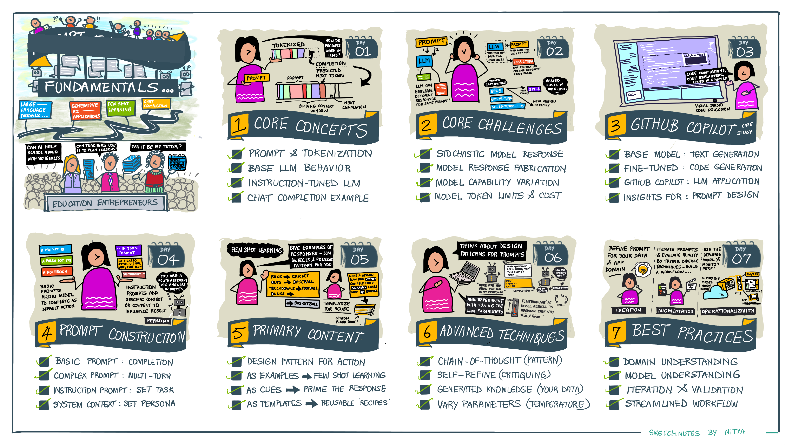

<!--
CO_OP_TRANSLATOR_METADATA:
{
  "original_hash": "0135e6c271f3ece8699050d4debbce88",
  "translation_date": "2025-10-18T02:06:54+00:00",
  "source_file": "04-prompt-engineering-fundamentals/README.md",
  "language_code": "my"
}
-->
# Prompt Engineering အခြေခံ

[](https://youtu.be/GElCu2kUlRs?si=qrXsBvXnCW12epb8)

## အကျဉ်းချုပ်
ဒီ module မှာ generative AI models တွေမှာ prompt တွေကို ထိရောက်စွာဖန်တီးနိုင်ဖို့အတွက် အရေးကြီးတဲ့အယူအဆတွေ၊ နည်းလမ်းတွေကို လေ့လာပါမယ်။ LLM ကို prompt ရေးသားပုံကလည်း အရေးကြီးပါတယ်။ Prompt ကို သေချာစွာရေးသားနိုင်ရင် response quality ပိုမိုကောင်းမွန်စေပါတယ်။ ဒါပေမယ့် _prompt_ နဲ့ _prompt engineering_ ဆိုတာ ဘာလဲ? LLM ကို ပေးပို့တဲ့ prompt _input_ ကို ဘယ်လိုတိုးတက်အောင်လုပ်မလဲ? ဒီ chapter နဲ့ နောက် chapter မှာ ဒီမေးခွန်းတွေကို ဖြေရှင်းဖို့ ကြိုးစားပါမယ်။

_Generative AI_ က အသုံးပြုသူရဲ့တောင်းဆိုမှုကို အခြေခံပြီး content အသစ် (ဥပမာ - text, images, audio, code စသည်) ဖန်တီးနိုင်ပါတယ်။ ဒါကို OpenAI ရဲ့ GPT ("Generative Pre-trained Transformer") စီးရီးလို natural language နဲ့ code ကို သင်ကြားထားတဲ့ _Large Language Models_ တွေကို အသုံးပြုပြီး အောင်မြင်စေပါတယ်။

အသုံးပြုသူတွေဟာ chat လိုမျိုး ရိုးရှင်းတဲ့နည်းလမ်းတွေနဲ့ ဒီ models တွေနဲ့ အပြန်အလှန် ဆွေးနွေးနိုင်ပါတယ်။ Models တွေဟာ _prompt-based_ ဖြစ်ပြီး - အသုံးပြုသူတွေက text input (prompt) ကို ပေးပို့ပြီး AI response (completion) ကို ပြန်လည်ရရှိပါတယ်။ ထို့နောက် "AI နဲ့ စကားပြော" လုပ်ပြီး multi-turn conversations တွေမှာ prompt ကို ပြင်ဆင်ပြီး response ကို မျှော်လင့်ချက်နဲ့ ကိုက်ညီအောင်လုပ်နိုင်ပါတယ်။

"Prompts" တွေဟာ generative AI apps တွေအတွက် အဓိက _programming interface_ ဖြစ်လာပြီး models တွေကို ဘာလုပ်မလဲဆိုတာ ပြောပြပေးပြီး ပြန်ပေးတဲ့ response quality ကိုလည်း ထိန်းညှိပေးပါတယ်။ "Prompt Engineering" ဆိုတာ prompt တွေကို _design နဲ့ optimization_ လုပ်ပြီး consistent နဲ့ quality responses တွေကို အကျိုးရှိရှိရရှိစေဖို့ အာရုံစိုက်တဲ့ အမြန်တိုးတက်နေတဲ့ သုတေသနနယ်ပယ်တစ်ခုဖြစ်ပါတယ်။

## သင်ယူရမယ့်အရာများ

ဒီသင်ခန်းစာမှာ Prompt Engineering ဆိုတာဘာလဲ၊ ဘာကြောင့် အရေးကြီးလဲ၊ နောက်ပြီး model နဲ့ application ရည်ရွယ်ချက်အတွက် ထိရောက်တဲ့ prompts တွေကို ဘယ်လိုဖန်တီးနိုင်မလဲဆိုတာကို သင်ယူပါမယ်။ Prompt engineering အတွက် အဓိကအယူအဆတွေ၊ အကောင်းဆုံးနည်းလမ်းတွေကို နားလည်ပြီး - ဒီအယူအဆတွေကို အမှန်တကယ်သော ဥပမာတွေမှာ အသုံးချပုံကို မြင်နိုင်တဲ့ interactive Jupyter Notebooks "sandbox" ပတ်ဝန်းကျင်အကြောင်းကိုလည်း သင်ယူပါမယ်။

ဒီသင်ခန်းစာပြီးဆုံးတဲ့အခါမှာ -

1. Prompt engineering ဆိုတာဘာလဲ၊ ဘာကြောင့် အရေးကြီးလဲဆိုတာ ရှင်းပြနိုင်မယ်။
2. Prompt ရဲ့ components တွေကို ရှင်းပြပြီး ဘယ်လိုအသုံးပြုရမယ်ဆိုတာ ရှင်းပြနိုင်မယ်။
3. Prompt engineering အတွက် အကောင်းဆုံးနည်းလမ်းတွေကို သင်ယူနိုင်မယ်။
4. OpenAI endpoint ကို အသုံးပြုပြီး သင်ယူထားတဲ့နည်းလမ်းတွေကို အမှန်တကယ်သော ဥပမာတွေမှာ အသုံးချနိုင်မယ်။

## အဓိကအသုံးအနှုန်းများ

Prompt Engineering: AI models တွေကို ရည်ရွယ်ချက်အလိုက် output ကိုထုတ်ပေးစေဖို့ input တွေကို design နဲ့ refine လုပ်တဲ့အတတ်ပညာ။
Tokenization: Text ကို model နားလည်နိုင်တဲ့ tokens လို့ခေါ်တဲ့ အပိုင်းငယ်တွေ အဖြစ် ပြောင်းလဲတဲ့လုပ်ငန်းစဉ်။
Instruction-Tuned LLMs: Response accuracy နဲ့ relevance ကို တိုးတက်စေဖို့ အထူးညွှန်းချက်တွေနဲ့ fine-tune လုပ်ထားတဲ့ Large Language Models (LLMs)။

## Learning Sandbox

Prompt engineering ဟာ လက်ရှိအခြေအနေမှာ သိပ္ပံနည်းကျထက် အနုပညာဆန်တဲ့အရာဖြစ်ပါတယ်။ Prompt engineering ကို ပိုမိုနားလည်နိုင်ဖို့အတွက် _အတွေ့အကြုံ_ ရရှိဖို့နဲ့ application domain expertise ကို model-specific optimizations နဲ့ ပေါင်းစပ်ပြီး trial-and-error နည်းလမ်းကို အသုံးပြုဖို့ အကောင်းဆုံးနည်းလမ်းဖြစ်ပါတယ်။

ဒီသင်ခန်းစာနဲ့အတူလာတဲ့ Jupyter Notebook ဟာ သင်ယူထားတဲ့အရာတွေကို စမ်းသပ်နိုင်တဲ့ _sandbox_ ပတ်ဝန်းကျင်ကို ပေးထားပြီး - သင်ယူနေစဉ်မှာပဲ သို့မဟုတ် code challenge အဆုံးမှာ စမ်းသပ်နိုင်ပါတယ်။ Exercises တွေကို run လုပ်ဖို့အတွက် -

1. **Azure OpenAI API key** - deployed LLM အတွက် service endpoint
2. **Python Runtime** - Notebook ကို run လုပ်နိုင်တဲ့ environment
3. **Local Env Variables** - _[SETUP](./../00-course-setup/02-setup-local.md?WT.mc_id=academic-105485-koreyst) အဆင့်တွေကို အခုလုပ်ဆောင်ပါ_

Notebook မှာ _starter_ exercises တွေ ပါဝင်ပြီး - သင့်ကိုယ်တိုင် _Markdown_ (description) နဲ့ _Code_ (prompt requests) အပိုင်းတွေကို ထည့်သွင်းပြီး ဥပမာတွေ သို့မဟုတ် အကြံဉာဏ်အသစ်တွေကို စမ်းသပ်နိုင်ပါတယ် - နောက်ပြီး prompt design အတွက် သင့်ရဲ့အတွေ့အကြုံကို တိုးတက်စေပါမယ်။

## ရှင်းလင်းပြပုံ

ဒီသင်ခန်းစာမှာ ဘာတွေကို လေ့လာရမယ်ဆိုတာကို အဓိကအချက်တွေကို ရှင်းလင်းပြပေးထားတဲ့ guide ကို ကြည့်ရှုနိုင်ပါတယ်။ ဒီ lesson roadmap က core concepts နဲ့ challenges တွေကို နားလည်စေပြီး prompt engineering techniques နဲ့ အကောင်းဆုံးနည်းလမ်းတွေကို အသုံးပြုပြီး ပြဿနာတွေကို ဖြေရှင်းပုံကို ပြသပေးပါတယ်။ ဒီ guide ရဲ့ "Advanced Techniques" အပိုင်းကတော့ curriculum ရဲ့ _နောက် chapter_ မှာ လေ့လာရမယ့် content ကို ရည်ညွှန်းထားပါတယ်။



## ကျွန်တော်တို့ရဲ့ Startup

အခုတော့ _ဒီအကြောင်းအရာ_ ဟာ ကျွန်တော်တို့ရဲ့ startup mission [AI နည်းပညာကို ပညာရေးမှာ တိုးတက်အောင်လုပ်ဆောင်ခြင်း](https://educationblog.microsoft.com/2023/06/collaborating-to-bring-ai-innovation-to-education?WT.mc_id=academic-105485-koreyst) နဲ့ ဘယ်လိုဆက်စပ်နေလဲဆိုတာကို ပြောကြမယ်။ ကျွန်တော်တို့ဟာ _personalized learning_ အတွက် AI-powered applications တွေ ဖန်တီးချင်ပါတယ် - ဒါကြောင့် ကျွန်တော်တို့ app ကို အသုံးပြုမယ့် အသုံးပြုသူအမျိုးမျိုးက "design" prompts တွေကို ဘယ်လိုလုပ်မလဲဆိုတာကို စဉ်းစားကြည့်ရမယ်။

- **အုပ်ချုပ်ရေးမှူးများ** က AI ကို _curriculum data ကို ခွဲခြမ်းစိတ်ဖြာပြီး coverage gaps တွေကို ရှာဖွေဖို့_ တောင်းဆိုနိုင်ပါတယ်။ AI က ရလဒ်တွေကို အကျဉ်းချုပ်ပေးနိုင်သလို code နဲ့ visualizations တွေကိုလည်း ဖန်တီးပေးနိုင်ပါတယ်။
- **ဆရာ/ဆရာမများ** က AI ကို _target audience နဲ့ topic အတွက် lesson plan တစ်ခု ဖန်တီးပေးဖို့_ တောင်းဆိုနိုင်ပါတယ်။ AI က personalized plan ကို သတ်မှတ်ထားတဲ့ format နဲ့ ဖန်တီးပေးနိုင်ပါတယ်။
- **ကျောင်းသားများ** က AI ကို _ခက်ခဲတဲ့ဘာသာရပ်မှာ သင်ကြားပေးဖို့_ တောင်းဆိုနိုင်ပါတယ်။ AI က ကျောင်းသားတွေရဲ့အဆင့်အလိုက် lessons, hints & examples တွေကို လမ်းညွှန်ပေးနိုင်ပါတယ်။

ဒါက အစပိုင်းပဲဖြစ်ပါတယ်။ [Prompts For Education](https://github.com/microsoft/prompts-for-edu/tree/main?WT.mc_id=academic-105485-koreyst) ကို ကြည့်ရှုပါ - ပညာရေးအထူးကျွမ်းကျင်သူတွေက curated လုပ်ထားတဲ့ open-source prompts library ဖြစ်ပြီး - အခွင့်အလမ်းတွေကို ပိုမိုနားလည်နိုင်ဖို့ အထောက်အကူဖြစ်စေပါမယ်! _Sandbox မှာ သို့မဟုတ် OpenAI Playground ကို အသုံးပြုပြီး ဒီ prompts တွေကို run လုပ်ကြည့်ပြီး ဘာဖြစ်လဲကြည့်ပါ!_

<!--
LESSON TEMPLATE:
ဒီ unit မှာ core concept #1 ကို လေ့လာရမယ်။
ဥပမာတွေ နဲ့ ရည်ညွှန်းချက်တွေကို အသုံးပြုပြီး concept ကို အတည်ပြုပါ။

CONCEPT #1:
Prompt Engineering.
ဒါကို အဓိကအကြောင်းအရာကို ရှင်းပြပြီး ဘာကြောင့် အရေးကြီးလဲဆိုတာ ရှင်းပြပါ။
-->

## Prompt Engineering ဆိုတာဘာလဲ?

ဒီသင်ခန်းစာကို Prompt Engineering ကို _design နဲ့ optimize_ လုပ်ပြီး application ရည်ရွယ်ချက်နဲ့ model အတွက် consistent နဲ့ quality responses (completions) ကိုရရှိစေဖို့ လုပ်ဆောင်တဲ့ လုပ်ငန်းစဉ်အဖြစ် သတ်မှတ်ပြီး စတင်ခဲ့ပါတယ်။ ဒီကို ၂-အဆင့်လုပ်ငန်းစဉ်အဖြစ် စဉ်းစားနိုင်ပါတယ် -

- model နဲ့ ရည်ရွယ်ချက်အလိုက် initial prompt ကို _design_ လုပ်ခြင်း
- response quality ကို တိုးတက်အောင် _refine_ လုပ်ခြင်း

ဒီဟာက trial-and-error လုပ်ငန်းစဉ်ဖြစ်ပြီး optimal results ရဖို့ အသုံးပြုသူရဲ့ intuition နဲ့ ကြိုးစားမှုလိုအပ်ပါတယ်။ ဒါကြောင့် အရေးကြီးတာလဲဆိုတာ ဘာလဲ? ဒီမေးခွန်းကို ဖြေရှင်းဖို့အတွက် အဓိက concept သုံးခုကို အရင်နားလည်ရပါမယ် -

- _Tokenization_ = model က prompt ကို "မြင်"တဲ့နည်းလမ်း
- _Base LLMs_ = foundation model က prompt ကို "လုပ်ဆောင်"တဲ့နည်းလမ်း
- _Instruction-Tuned LLMs_ = model က "tasks" တွေကို "မြင်"နိုင်တဲ့နည်းလမ်း

### Tokenization

LLM က prompts တွေကို _tokens တွေ အစီအစဉ်_ အဖြစ် မြင်ပါတယ်။ မတူညီတဲ့ models (သို့မဟုတ် model versions) တွေက prompt တစ်ခုကို tokenize လုပ်တဲ့နည်းလမ်း မတူနိုင်ပါတယ်။ LLMs တွေဟာ tokens တွေကို သင်ကြားထားပြီး (raw text ကိုမဟုတ်ပါ) prompt တွေ tokenize လုပ်ပုံဟာ generated response quality ကို တိုက်ရိုက်သက်ရောက်မှုရှိပါတယ်။

Tokenization လုပ်ပုံကို နားလည်ဖို့ [OpenAI Tokenizer](https://platform.openai.com/tokenizer?WT.mc_id=academic-105485-koreyst) လို tools တွေကို စမ်းသပ်ကြည့်ပါ။ Prompt ကို copy လုပ်ပြီး tokens တွေ အဖြစ် ပြောင်းလဲပုံကို ကြည့်ပါ။ Whitespace characters နဲ့ punctuation marks တွေကို ဘယ်လိုကိုင်တွယ်ထားလဲဆိုတာကိုလည်း သတိထားပါ။ ဥပမာမှာ GPT-3 LLM ကို ပြထားပြီး - နောက်ဆုံးပေါ် model နဲ့ စမ်းကြည့်ရင် အခြားအခြေအနေတစ်ခုကို ရနိုင်ပါတယ်။


### Concept: Foundation Models

Prompt ကို tokenize လုပ်ပြီးတဲ့အခါ ["Base LLM"](https://blog.gopenai.com/an-introduction-to-base-and-instruction-tuned-large-language-models-8de102c785a6?WT.mc_id=academic-105485-koreyst) (သို့မဟုတ် Foundation model) ရဲ့ အဓိကလုပ်ဆောင်ချက်က sequence ထဲမှာ token ကို predict လုပ်တာဖြစ်ပါတယ်။ LLMs တွေဟာ text datasets အများကြီးကို သင်ကြားထားပြီး tokens တွေကြားက statistical relationships တွေကို သိရှိထားပါတယ်။ ဒါကြောင့် prediction ကို confidence နဲ့လုပ်နိုင်ပါတယ်။ Prompt သို့မဟုတ် token ရဲ့ _အဓိပ္ပါယ်_ ကို model က နားမလည်ပေမယ့် pattern ကို "complete" လုပ်နိုင်ပါတယ်။ User intervention သို့မဟုတ် pre-established condition တစ်ခုနဲ့ ရပ်တန့်တဲ့အထိ sequence ကို ဆက်လက် predict လုပ်နိုင်ပါတယ်။

Prompt-based completion လုပ်ပုံကို မြင်ချင်ပါသလား? အထက်ပါ prompt ကို Azure OpenAI Studio [_Chat Playground_](https://oai.azure.com/playground?WT.mc_id=academic-105485-koreyst) မှာ default settings နဲ့ ထည့်ပါ။ System က prompts တွေကို information requests အဖြစ်ကိုင်တွယ်ထားပြီး - ဒီ context ကို ဖြည့်ဆည်းတဲ့ completion ကို မြင်ရပါမယ်။

ဒါပေမယ့် user က criteria သို့မဟုတ် task objective တစ်ခုကို ဖြည့်ဆည်းတဲ့ အထူးတိကျတဲ့အရာကို မြင်ချင်တယ်ဆိုရင်တော့ _instruction-tuned_ LLMs တွေက အရေးပါတဲ့အခန်းကဏ္ဍကို ထည့်သွင်းပေးနိုင်ပါတယ်။


### Concept: Instruction Tuned LLMs

[Instruction Tuned LLM](https://blog.gopenai.com/an-introduction-to-base-and-instruction-tuned-large-language-models-8de102c785a6?WT.mc_id=academic-105485-koreyst) ဟာ foundation model ကို အခြေခံပြီး examples သို့မဟုတ် input/output pairs (ဥပမာ - multi-turn "messages") တွေကို အသုံးပြုပြီး fine-tune လုပ်ထားပါတယ်။ ဒီမှာ instructions တွေကို ထည့်သွင်းထားပြီး AI response က instruction ကို လိုက်နာဖို့ ကြိုးစားပါတယ်။

Reinforcement Learning with Human Feedback (RLHF) လို techniques တွေကို အသုံးပြုပြီး model ကို _instructions_ တွေကို လိုက်နာဖို့ သင်ကြားပြီး _feedback_ ကနေ သင်ယူနိုင်စေပါတယ်။ ဒီလိုနည်းလမ်းတွေက practical applications တွေမှာ အသုံးဝင်တဲ့ response တွေကို ထုတ်ပေးနိုင်စေပြီး user objectives တွေကို ပိုမိုသက်ဆိုင်အောင်လုပ်နိုင်ပါတယ်။

စမ်းကြည့်လိုက်ရအောင် - အထက်ပါ prompt ကို ပြန်သွားကြည့်ပြီး _system message_ ကို အောက်ပါ instruction အဖြစ် context အနေနဲ့ ပြောင်းပါ -

> _သင်ပေးတဲ့ content ကို second-grade ကျောင်းသားအတွက် အကျဉ်းချုပ်ပေးပါ။ Result ကို paragraph တစ်ခုနဲ့ 3-5 bullet points ထဲမှာ ထားပါ။_

Result က ရည်ရွယ်ချက်နဲ့ format ကို ကိုက်ညီတဲ့အတိုင်း ပြောင်းလဲလာတာကို မြင်ရပါမယ်။ Educator တစ်ယောက်က ဒီ response ကို class အတွက် slides တွေမှာ တိုက်ရိုက်အသုံးပြုနိုင်ပါပြီ။


## Prompt Engineering ဘာကြောင့်လိုအပ်လဲ?

Prompt တွေကို LLMs တွေက ဘယ်လို process လုပ်တယ်ဆိုတာကို သိပြီးတဲ့အခါ - _ဘာကြောင့်_ prompt engineering လိုအပ်လဲဆိုတာကို ပြောကြမယ်။ အဖြေက LLMs တွေဟာ _reliable နဲ့ consistent completions_ ကို ရရှိဖို့ prompt construction နဲ့ optimization မှာ ကြိုးစားမှုမရှိရင် အခက်အခဲတွေရှိနိုင်တဲ့ challenges တွေကို ရှိနေတဲ့အတွက် ဖြစ်ပါတယ်။ ဥပမာ -

1. **Model responses ဟာ stochastic ဖြစ်ပါတယ်။** _prompt တစ်ခု_ က မတူတဲ့ models သို့မဟုတ် model versions တွေမှာ response မတူနိုင်ပါတယ်။ တစ်ချို့အချိန်မှာ _တူညီတဲ့ model_ မှာ response မတူနိုင်ပါတယ်။ _Prompt engineering techniques တွေက guardrails တွေကို ပိုမိုကောင်းမွန်စေဖို့ ကူညီနိုင်ပါတယ်_။

1. **Models တွေဟာ response တွေကို ဖန်တီးနိုင်ပါတယ်။** Models တွေဟာ _ကြီးမား
အင်တာနက်ရှာဖွေမှုတစ်ခုက မားစ်ဂြိုဟ်ပေါ်မှာဖြစ်ပွားခဲ့တဲ့စစ်ပွဲများ (ဥပမာ-ရုပ်သံဇာတ်လမ်းတွဲများ သို့မဟုတ် စာအုပ်များ) အကြောင်းကို ဖော်ပြပေးခဲ့ပေမယ့် ၂၀၇၆ ခုနှစ်မှာတော့ မရှိပါဘူး။ သဘာဝကျကျတွေးလျှင် ၂၀၇၆ ခုနှစ်ဟာ _အနာဂတ်_ ဖြစ်ပြီး အမှန်တကယ်ဖြစ်ပွားခဲ့တဲ့ အဖြစ်အပျက်တစ်ခုနဲ့ ဆက်စပ်မှုမရှိနိုင်ပါ။

ဒါဆိုရင် ဒီ prompt ကို LLM ပံ့ပိုးသူများနှင့်အတူ run လုပ်လိုက်ရင် ဘာဖြစ်မလဲ?

> **တုံ့ပြန်မှု ၁**: OpenAI Playground (GPT-35)


> **တုံ့ပြန်မှု ၂**: Azure OpenAI Playground (GPT-35)


> **တုံ့ပြန်မှု ၃**: Hugging Face Chat Playground (LLama-2)


မျှော်လင့်ထားသလိုပဲ၊ မော်ဒယ် (သို့မဟုတ် မော်ဒယ်ဗားရှင်း) တစ်ခုစီက stochastic အပြုအမူနဲ့ မော်ဒယ်စွမ်းရည်ကွဲပြားမှုကြောင့် response များက အနည်းငယ်ကွဲပြားမှုရှိပါတယ်။ ဥပမာအားဖြင့် မော်ဒယ်တစ်ခုက ၈ တန်းကျောင်းသားများကို ပစ်မှတ်ထားပြီး၊ တစ်ခုက အထက်တန်းကျောင်းသားများကို ပစ်မှတ်ထားပါတယ်။ ဒါပေမယ့် မော်ဒယ်သုံးခုလုံးက အမှန်တကယ်မသိတဲ့ အသုံးပြုသူကို အဖြစ်အပျက်ဟာ အမှန်တကယ်ဖြစ်ပွားခဲ့တယ်လို့ ယုံကြည်စေမယ့် တုံ့ပြန်မှုများကို ဖန်တီးနိုင်ခဲ့ပါတယ်။

_prompt engineering_ နည်းလမ်းများဖြစ်တဲ့ _metaprompting_ နဲ့ _temperature configuration_ တို့က မော်ဒယ်မှားယွင်းမှုများကို တစ်စိတ်တစ်ပိုင်းလျှော့ချနိုင်ပါတယ်။ _prompt engineering_ အဆောက်အအုံအသစ်များကလည်း prompt flow ထဲမှာ seamlessly tools အသစ်များနဲ့ နည်းလမ်းအသစ်များကို ပေါင်းစပ်ထည့်သွင်းပြီး ဒီအကျိုးဆက်များကို လျှော့ချရန် သို့မဟုတ် လျှော့ချရန် အထောက်အကူပြုပါတယ်။

## ကိစ္စလေ့လာမှု: GitHub Copilot

ဒီအပိုင်းကို အမှီအခိုကောင်းတဲ့ prompt engineering ကို အမှန်တကယ်အသုံးချတဲ့ နည်းလမ်းများကို GitHub Copilot အပေါ်မှာ လေ့လာခြင်းဖြင့် အဆုံးသတ်ကြမယ်။

GitHub Copilot ဟာ "AI Pair Programmer" ဖြစ်ပြီး - text prompt များကို code completions အဖြစ် ပြောင်းလဲပေးပြီး သင့်ရဲ့ development environment (ဥပမာ-Visual Studio Code) ထဲမှာ seamless user experience ရရှိစေပါတယ်။ အောက်ပါ blog series တွေမှာ documentation လုပ်ထားသလို၊ အစောပိုင်းဗားရှင်းဟာ OpenAI Codex မော်ဒယ်ကို အခြေခံထားပြီး - အင်ဂျင်နီယာများက မော်ဒယ်ကို fine-tune လုပ်ရန်အတွက် prompt engineering နည်းလမ်းများကို တိုးတက်အောင်လုပ်ရမယ်ဆိုတာ မြန်မြန်သိရှိခဲ့ပါတယ်။ ဇူလိုင်လမှာတော့ [Codex ထက်ပိုမိုတိုးတက်တဲ့ AI မော်ဒယ်ကို စတင်မိတ်ဆက်ခဲ့ပါတယ်](https://github.blog/2023-07-28-smarter-more-efficient-coding-github-copilot-goes-beyond-codex-with-improved-ai-model/?WT.mc_id=academic-105485-koreyst) အမြန်ဆုံးအကြံပေးမှုများအတွက်။

သူတို့ရဲ့ လေ့လာမှုခရီးကိုနားလည်ဖို့ အောက်ပါ post များကို အစဉ်လိုက်ဖတ်ပါ။

- **2023 မေ** | [GitHub Copilot ဟာ သင့် code ကို ပိုမိုနားလည်နိုင်ဖို့ တိုးတက်လာနေပါတယ်](https://github.blog/2023-05-17-how-github-copilot-is-getting-better-at-understanding-your-code/?WT.mc_id=academic-105485-koreyst)
- **2023 မေ** | [GitHub အတွင်း: GitHub Copilot အတွက် LLMs တွေနဲ့ အလုပ်လုပ်ခြင်း](https://github.blog/2023-05-17-inside-github-working-with-the-llms-behind-github-copilot/?WT.mc_id=academic-105485-koreyst).
- **2023 ဇွန်** | [GitHub Copilot အတွက် prompt များကို ပိုမိုကောင်းမွန်စွာရေးသားနည်း](https://github.blog/2023-06-20-how-to-write-better-prompts-for-github-copilot/?WT.mc_id=academic-105485-koreyst).
- **2023 ဇူလိုင်** | [GitHub Copilot ဟာ Codex ထက်ပိုမိုတိုးတက်တဲ့ AI မော်ဒယ်နဲ့ ရောက်ရှိလာပြီ](https://github.blog/2023-07-28-smarter-more-efficient-coding-github-copilot-goes-beyond-codex-with-improved-ai-model/?WT.mc_id=academic-105485-koreyst)
- **2023 ဇူလိုင်** | [Developer များအတွက် Prompt Engineering နဲ့ LLMs လမ်းညွှန်](https://github.blog/2023-07-17-prompt-engineering-guide-generative-ai-llms/?WT.mc_id=academic-105485-koreyst)
- **2023 စက်တင်ဘာ** | [Enterprise LLM app တစ်ခုကို ဘယ်လိုတည်ဆောက်မလဲ: GitHub Copilot မှ သင်ခန်းစာများ](https://github.blog/2023-09-06-how-to-build-an-enterprise-llm-application-lessons-from-github-copilot/?WT.mc_id=academic-105485-koreyst)

သင့်ရဲ့ [Engineering blog](https://github.blog/category/engineering/?WT.mc_id=academic-105485-koreyst) ကိုလည်း browse လုပ်ပြီး [ဒီတစ်ခု](https://github.blog/2023-09-27-how-i-used-github-copilot-chat-to-build-a-reactjs-gallery-prototype/?WT.mc_id=academic-105485-koreyst) ကဲ့သို့သော post များကို ဖတ်ရှုနိုင်ပါတယ်။ ဒီ post တွေက မော်ဒယ်များနဲ့ နည်းလမ်းများကို အမှန်တကယ် applications တွေမှာ အသုံးချပုံကို ပြသပေးပါတယ်။

---

## Prompt တည်ဆောက်ခြင်း

_prompt engineering_ အရေးကြီးတဲ့အကြောင်းကို ကြည့်ပြီးပြီ - အခုတော့ prompt များကို _တည်ဆောက်ပုံ_ ကို နားလည်ဖို့ကြိုးစားပြီး prompt design ကို ပိုမိုထိရောက်စေမယ့် နည်းလမ်းများကို သုံးသပ်ကြည့်ရအောင်။

### အခြေခံ Prompt

အခြေခံ prompt ကတော့ context မပါဘဲ မော်ဒယ်ကို text input ပို့ပေးတဲ့အခါမှာ ဖြစ်ပါတယ်။ ဥပမာ - US အမျိုးသားသီချင်းရဲ့ ပထမဆုံးစကားလုံးများကို OpenAI [Completion API](https://platform.openai.com/docs/api-reference/completions?WT.mc_id=academic-105485-koreyst) ကို ပို့လိုက်တဲ့အခါမှာ _response_ ကို အလျင်အမြန် _ပြီးစီး_ ပေးပြီး အခြေခံအနေနဲ့ အနာဂတ်ကိုခန့်မှန်းပေးတဲ့ အပြုအမူကို ပြသပါတယ်။

| Prompt (Input)     | Completion (Output)                                                                                                                        |
| :----------------- | :----------------------------------------------------------------------------------------------------------------------------------------- |
| Oh say can you see | သင်ဟာ "The Star-Spangled Banner" လို့ခေါ်တဲ့ US အမျိုးသားသီချင်းရဲ့ သီချင်းစာသားတွေကို စတင်ရေးသားနေသလိုပဲ။ အပြည့်အစုံစာသားတွေက... |

### ရှုပ်ထွေးတဲ့ Prompt

အခုတော့ အခြေခံ prompt ကို context နဲ့ အညွှန်းများထည့်ပြီး ရှုပ်ထွေးတဲ့ prompt တစ်ခုအဖြစ် ပြောင်းလဲကြည့်ရအောင်။ [Chat Completion API](https://learn.microsoft.com/azure/ai-services/openai/how-to/chatgpt?WT.mc_id=academic-105485-koreyst) က prompt ကို _messages_ တွေစုစည်းမှုအဖြစ် တည်ဆောက်ခွင့်ပေးပြီး -

- _user_ input နဲ့ _assistant_ response ကို ပြန်လည်ထင်ဟပ်တဲ့ input/output တွဲများ။
- assistant ရဲ့ အပြုအမူ သို့မဟုတ် ပုဂ္ဂိုလ်ရေးအတွက် context ကို သတ်မှတ်ပေးတဲ့ system message။

request ဟာ အောက်ပါပုံစံဖြင့် ဖြစ်လာပြီး၊ _tokenization_ က context နဲ့ စကားဝိုင်းထဲက သက်ဆိုင်တဲ့ အချက်အလက်များကို ထိရောက်စွာ ဖမ်းယူနိုင်ပါတယ်။ အခုတော့ system context ကို ပြောင်းလဲခြင်းဟာ user input တွေထက် response quality အပေါ် ပိုမိုအကျိုးသက်ရောက်နိုင်ပါတယ်။

```python
response = openai.chat.completions.create(
    model="gpt-3.5-turbo",
    messages=[
        {"role": "system", "content": "You are a helpful assistant."},
        {"role": "user", "content": "Who won the world series in 2020?"},
        {"role": "assistant", "content": "The Los Angeles Dodgers won the World Series in 2020."},
        {"role": "user", "content": "Where was it played?"}
    ]
)
```

### Instruction Prompt

အထက်မှာပါတဲ့ ဥပမာတွေမှာ user prompt က သတင်းအချက်အလက်တောင်းဆိုမှုအတွက် ရိုးရိုး text query ဖြစ်ပါတယ်။ _instruction_ prompts တွေကို အသုံးပြုရင်တော့ AI ကို ပိုမိုကောင်းမွန်တဲ့ လမ်းညွှန်မှုတွေ ပေးနိုင်ပြီး task ကို ပိုမိုအသေးစိတ်ဖော်ပြနိုင်ပါတယ်။ ဥပမာ -

| Prompt (Input)                                                                                                                                                                                                                         | Completion (Output)                                                                                                        | Instruction Type    |
| :------------------------------------------------------------------------------------------------------------------------------------------------------------------------------------------------------------------------------------- | :------------------------------------------------------------------------------------------------------------------------- | :------------------ |
| Write a description of the Civil War                                                                                                                                                                                                   | _ရိုးရိုးစာပိုဒ်တစ်ခုကို ပြန်ပေးခဲ့သည်_                                                                                  | ရိုးရိုး              |
| Write a description of the Civil War. Provide key dates and events and describe their significance                                                                                                                                     | _အဓိကဖြစ်ရပ်ရက်စွဲများနဲ့ ဖော်ပြချက်များပါဝင်တဲ့စာပိုဒ်ကို ပြန်ပေးခဲ့သည်_                                              | ရှုပ်ထွေး            |
| Write a description of the Civil War in 1 paragraph. Provide 3 bullet points with key dates and their significance. Provide 3 more bullet points with key historical figures and their contributions. Return the output as a JSON file | _ပိုမိုအသေးစိတ်ဖော်ပြချက်များကို JSON format နဲ့ ပြန်ပေးခဲ့သည်၊ file ထဲကို copy-paste လုပ်ပြီး validate လုပ်နိုင်သည်_         | ရှုပ်ထွေး။ format ပါ။ |

## Primary Content

အထက်မှာပါတဲ့ ဥပမာတွေမှာ prompt က အလွတ်တန်းဖြစ်ပြီး၊ LLM ဟာ pre-trained dataset ထဲက သက်ဆိုင်ရာကို ဆုံးဖြတ်နိုင်ပါတယ်။ _primary content_ design pattern နဲ့တော့ input text ကို အပိုင်းနှစ်ခုအဖြစ် ခွဲခြားထားပါတယ် -

- instruction (လုပ်ဆောင်မှု)
- သက်ဆိုင်ရာ content (လုပ်ဆောင်မှုကို သက်ရောက်စေသော)

ဥပမာ - instruction က "ဒီကို ၂ စာကြောင်းနဲ့ အကျဉ်းချုပ်ရေးပါ" ဖြစ်ပါတယ်။

| Prompt (Input)                                                                                                                                                                                                                                                                                                                                                                                                                                                                                                                                                                                                                                                                                      | Completion (Output)                                                                                                                                                                                                                                                                             |
| :-------------------------------------------------------------------------------------------------------------------------------------------------------------------------------------------------------------------------------------------------------------------------------------------------------------------------------------------------------------------------------------------------------------------------------------------------------------------------------------------------------------------------------------------------------------------------------------------------------------------------------------------------------------------------------------------------- | :---------------------------------------------------------------------------------------------------------------------------------------------------------------------------------------------------------------------------------------------------------------------------------------------- |
| Jupiter is the fifth planet from the Sun and the largest in the Solar System. It is a gas giant with a mass one-thousandth that of the Sun, but two-and-a-half times that of all the other planets in the Solar System combined. Jupiter is one of the brightest objects visible to the naked eye in the night sky, and has been known to ancient civilizations since before recorded history. It is named after the Roman god Jupiter.[19] When viewed from Earth, Jupiter can be bright enough for its reflected light to cast visible shadows,[20] and is on average the third-brightest natural object in the night sky after the Moon and Venus. <br/> **Summarize this in 2 short sentences** | Jupiter, the fifth planet from the Sun, is the largest in the Solar System and is known for being one of the brightest objects in the night sky. Named after the Roman god Jupiter, it's a gas giant whose mass is two-and-a-half times that of all other planets in the Solar System combined. |

_primary content_ segment ကို ပိုမိုထိရောက်တဲ့ instructions များကို ဖန်တီးရန် အမျိုးမျိုးအသုံးပြုနိုင်ပါတယ် -

- **Examples** - မော်ဒယ်ကို explicit instruction မပေးဘဲ၊ output အတွက် ဥပမာများပေးပြီး pattern ကို သုံးစွဲစေခြင်း။
- **Cues** - instruction အပြီးမှာ "cue" တစ်ခုထည့်ပြီး completion ကို guide လုပ်ခြင်း။
- **Templates** - prompt များအတွက် placeholders (variables) ပါဝင်တဲ့ repeatable 'recipes' များဖြင့် data ကို customize လုပ်နိုင်ခြင်း။

အခုတော့ ဒီနည်းလမ်းတွေကို လေ့လာကြည့်ရအောင်။

### Examples အသုံးပြုခြင်း

ဒီနည်းလမ်းကတော့ primary content ကို "မော်ဒယ်ကို" _desired output_ အတွက် ဥပမာများပေးပြီး၊ output pattern ကို သုံးစွဲစေခြင်းဖြစ်ပါတယ်။ ပေးထားတဲ့ ဥပမာအရေအတွက်ပေါ်မူတည်ပြီး၊ zero-shot prompting, one-shot prompting, few-shot prompting စသည်ဖြင့် ရှိနိုင်ပါတယ်။

prompt ဟာ အခုတော့ အစိတ်အပိုင်းသုံးခုပါဝင်ပါတယ် -

- Task ဖော်ပြချက်
- Desired output အတွက် ဥပမာများ
- New example ရဲ့ opening (implicit task ဖော်ပြချက်ဖြစ်လာသည်)

| Learning Type | Prompt (Input)                                                                                                                                        | Completion (Output)         |
| :------------ | :---------------------------------------------------------------------------------------------------------------------------------------------------- | :-------------------------- |
| Zero-shot     | "The Sun is Shining". Translate to Spanish                                                                                                            | "El Sol está brillando".    |
| One-shot      | "The Sun is Shining" => ""El Sol está brillando". <br> "It's a Cold and Windy Day" =>                                                                 | "Es un día frío y ventoso". |
| Few-shot      | The player ran the bases => Baseball <br/> The player hit an ace => Tennis <br/> The player hit a six => Cricket <br/> The player made a slam-dunk => | Basketball                  |
|               |                                                                                                                                                       |                             |

Zero-shot prompting မှာ explicit instruction ("Translate to Spanish") ကို ပေးရတာကို သတိထားပါ၊ ဒါပေမယ့် One-shot prompting ဥပမာမှာတော့ အဲဒီ instruction ကို infer လုပ်နိုင်ပါတယ်။ Few-shot ဥပမာကတော့ ဥပမာများ ပိုမိုပေးခြင်းက မော်ဒယ်များကို ပိုမိုတိကျတဲ့ inference လုပ်နိုင်စေတဲ့အပေါ် သက်ရောက်မှုရှိတာကို ပြသပါတယ်။

### Prompt Cues

_primary content_ ကို အသုံးပြုတဲ့ နည်းလမ်းတစ်ခုကတော့ _cues_ ပေးခြင်းဖြစ်ပါတယ်။ ဒီအခါမှာတော့ _desired response format_ ကို ပြသတဲ့ snippet တစ်ခုကို _start off_ အနေနဲ့ ပေးပြီး၊ မော်ဒယ်ကို အဲဒီ format နဲ့ ဆက်လက်လုပ်ဆောင်စေခြင်းဖြစ်ပါတယ်။

| Number of Cues | Prompt (Input)                                                                                                                                                                                                                                                                                                                                                                                                                                               | Completion (Output)                                                                                                                                                                                                                                                                                       |
| :------------- | :----------------------------------------------------------------------------------------------------------------------------------------------------------------------------------------------------------------------------------------------------------------------------------------------------------------------------------------------------------------------------------------------------------------------------------------------------------- | :-------------------------------------------------------------------------------------------------------------------------------------------------------------------------------------------------------------------------------------------------------------------------------------------------------- |
| 0              | Jupiter is the fifth planet from the Sun and the largest in the Solar System. It is a gas giant with a mass one-thousandth that of the Sun, but two-and-a-half times that of all the other planets in the Solar System combined. Jupiter is one of the brightest objects visible to the naked eye in the night sky, and has been known to ancient civilizations since before recorded history. <br/>**Summarize This**                                       | Jupiter is the largest planet in our Solar System and the fifth one from the Sun. It is a gas giant with a mass 1/1000th of the Sun's, but it is heavier than all the other planets combined. Ancient civilizations have known about Jupiter for a long time, and it is easily visible in the night sky.. |
| 1              | ဂျူပီတာသည် နေမှ ငါးခုမြောက်ဂြိုဟ်ဖြစ်ပြီး နေစကြာဝဠာတွင် အကြီးဆုံးဂြိုဟ်ဖြစ်သည်။ ၎င်းသည် ဓာတ်ငွေ့ကြီးဂြိုဟ်တစ်ခုဖြစ်ပြီး ၎င်း၏အလေးချိန်သည် နေ၏တစ်ထောင်ပုံတစ်ပုံသာရှိသော်လည်း နေစကြာဝဠာရှိ အခြားဂြိုဟ်အားလုံး၏အလေးချိန်ထက် နှစ်ဆခွဲကျော်များသည်။ ဂျူပီတာသည် ညဉ့်ကောင်းကင်တွင် မျက်လုံးဖြင့်မြင်နိုင်သော အလင်းအတောက်ဆုံးအရာများထဲမှ တစ်ခုဖြစ်ပြီး မှတ်တမ်းတင်သမိုင်းမတိုင်မီကတည်းက အဟောင်းအကျွမ်းရှိသော လူ့အဖွဲ့အစည်းများမှ သိရှိခဲ့သည်။ <br/>**အကျဉ်းချုပ်ရေးပါ** <br/> ကျွန်ုပ်တို့သိရှိခဲ့သည်မှာ ဂျူပီတာ | သည် နေမှ ငါးခုမြောက်ဂြိုဟ်ဖြစ်ပြီး နေစကြာဝဠာတွင် အကြီးဆုံးဂြိုဟ်ဖြစ်သည်။ ၎င်းသည် ဓာတ်ငွေ့ကြီးဂြိုဟ်တစ်ခုဖြစ်ပြီး ၎င်း၏အလေးချိန်သည် နေ၏တစ်ထောင်ပုံတစ်ပုံသာရှိသော်လည်း နေစကြာဝဠာရှိ အခြားဂြိုဟ်အားလုံး၏အလေးချိန်ထက် နှစ်ဆခွဲကျော်များသည်။ ၎င်းသည် မျက်လုံးဖြင့် အလွယ်တကူမြင်နိုင်ပြီး အဟောင်းအကျွမ်းရှိသောအချိန်ကတည်းက သိရှိခဲ့သည်။                        |
| 2              | ဂျူပီတာသည် နေမှ ငါးခုမြောက်ဂြိုဟ်ဖြစ်ပြီး နေစကြာဝဠာတွင် အကြီးဆုံးဂြိုဟ်ဖြစ်သည်။ ၎င်းသည် ဓာတ်ငွေ့ကြီးဂြိုဟ်တစ်ခုဖြစ်ပြီး ၎င်း၏အလေးချိန်သည် နေ၏တစ်ထောင်ပုံတစ်ပုံသာရှိသော်လည်း နေစကြာဝဠာရှိ အခြားဂြိုဟ်အားလုံး၏အလေးချိန်ထက် နှစ်ဆခွဲကျော်များသည်။ ဂျူပီတာသည် ညဉ့်ကောင်းကင်တွင် မျက်လုံးဖြင့်မြင်နိုင်သော အလင်းအတောက်ဆုံးအရာများထဲမှ တစ်ခုဖြစ်ပြီး မှတ်တမ်းတင်သမိုင်းမတိုင်မီကတည်းက အဟောင်းအကျွမ်းရှိသော လူ့အဖွဲ့အစည်းများမှ သိရှိခဲ့သည်။ <br/>**အကျဉ်းချုပ်ရေးပါ** <br/> ကျွန်ုပ်တို့သိရှိခဲ့သော အချက် ၃ ခု:         | ၁။ ဂျူပီတာသည် နေမှ ငါးခုမြောက်ဂြိုဟ်ဖြစ်ပြီး နေစကြာဝဠာတွင် အကြီးဆုံးဂြိုဟ်ဖြစ်သည်။ <br/> ၂။ ၎င်းသည် ဓာတ်ငွေ့ကြီးဂြိုဟ်တစ်ခုဖြစ်ပြီး ၎င်း၏အလေးချိန်သည် နေ၏တစ်ထောင်ပုံတစ်ပုံသာရှိသည်...<br/> ၃။ ဂျူပီတာသည် အဟောင်းအကျွမ်းရှိသောအချိန်ကတည်းက မျက်လုံးဖြင့်မြင်နိုင်ခဲ့သည်...                                                                       |
|                |                                                                                                                                                                                                                                                                                                                                                                                                                                                              |                                                                                                                                                                                                                                                                                                           |

### Prompt Templates

Prompt Template ဆိုသည်မှာ _prompt ရေးသားရန်အတွက် ကြိုတင်ပြင်ဆင်ထားသော နည်းလမ်း_ တစ်ခုဖြစ်ပြီး အသုံးပြုသူများအတွက် ပိုမိုတိကျသော အတွေ့အကြုံများကို အကျိုးရှိစွာ အသုံးချနိုင်ရန် သိမ်းဆည်းထားပြီး လိုအပ်သလို အသုံးပြုနိုင်သော အရာတစ်ခုဖြစ်သည်။ အလွယ်ဆုံးပုံစံတွင် [OpenAI မှ](https://platform.openai.com/examples?WT.mc_id=academic-105485-koreyst) ပေးထားသော ဥပမာတစ်ခုကဲ့သို့ prompt အပိုင်းအစများ (အသုံးပြုသူနှင့် စနစ်မက်ဆေ့) နှင့် API-driven request format ကို ပေးထားပြီး - အကျိုးရှိစွာ အသုံးပြုနိုင်ရန် အထောက်အကူပြုသည်။

ပိုမိုရှုပ်ထွေးသောပုံစံတွင် [LangChain မှ ဥပမာ](https://python.langchain.com/docs/concepts/prompt_templates/?WT.mc_id=academic-105485-koreyst) ကဲ့သို့ _placeholder_ များပါဝင်ပြီး အသုံးပြုသူ၏ input, စနစ် context, အပြင်ပလွှာမှ ဒေတာများစသည်ဖြင့် prompt ကို dynamic အဖြစ် ဖန်တီးရန် အသုံးပြုနိုင်သည်။ ၎င်းသည် prompt များကို library အဖြစ် ဖန်တီးပြီး **programmatically** အကျိုးရှိစွာ အသုံးပြုနိုင်ရန် အထောက်အကူပြုသည်။

နောက်ဆုံးတွင် template များ၏ တန်ဖိုးသည် vertical application domains အတွက် _prompt libraries_ ဖန်တီးပြီး - prompt template ကို application-specific context သို့မဟုတ် ဥပမာများနှင့်အတူ _optimized_ လုပ်ပြီး targeted user audience အတွက် ပိုမိုသက်ဆိုင်သော output များကို ဖန်တီးနိုင်စေခြင်းဖြစ်သည်။ [Prompts For Edu](https://github.com/microsoft/prompts-for-edu?WT.mc_id=academic-105485-koreyst) repository သည် ဤနည်းလမ်းကို အသုံးပြုထားသော ဥပမာကောင်းတစ်ခုဖြစ်ပြီး သင်ကြားရေးနယ်ပယ်အတွက် prompt များကို စုစည်းထားပြီး သင်ခန်းစာအစီအစဉ်ရေးဆွဲခြင်း၊ သင်ရိုးညွှန်းတမ်းဒီဇိုင်း၊ ကျောင်းသားများကို သင်ကြားခြင်းစသည်တို့ကို အဓိကထားသည်။

## Supporting Content

Prompt ကို တည်ဆောက်ခြင်းကို instruction (task) နှင့် target (primary content) ရှိသည်ဟု တွေးလျှင် _secondary content_ သည် output ကို **တစ်နည်းနည်းဖြင့် အကျိုးသက်ရောက်မှုရှိစေခြင်း** အတွက် ပေးသော အပို context တစ်ခုဖြစ်သည်။ ၎င်းသည် tuning parameters, formatting instructions, topic taxonomies စသည်တို့ဖြစ်နိုင်ပြီး model ကို _desired user objectives_ သို့မဟုတ် _expectations_ နှင့် ကိုက်ညီစေရန် response ကို _tailor_ လုပ်နိုင်စေသည်။

ဥပမာ: Fall 2023 သင်ရိုးညွှန်းတမ်းကို အကျဉ်းချုပ်ရေးရန် instruction တစ်ခု သတ်မှတ်ပြီး သင်ရိုးညွှန်းတမ်းတွင် ပါဝင်သော course catalog metadata (name, description, level, metadata tags, instructor စသည်တို့) ကို အသုံးပြုပါ။

- instruction ကို "Fall 2023 သင်ရိုးညွှန်းတမ်းကို အကျဉ်းချုပ်ရေးပါ" ဟု သတ်မှတ်နိုင်သည်။
- primary content ကို output format ကို ဥပမာများဖြင့် ပေးနိုင်သည်။
- secondary content ကို အဓိက tag ၅ ခုကို သတ်မှတ်နိုင်သည်။

model သည် ဥပမာများတွင် ဖော်ပြထားသော format အတိုင်း အကျဉ်းချုပ်ပေးနိုင်ပြီး result တွင် tag များစွာပါဝင်ပါက secondary content တွင် သတ်မှတ်ထားသော tag ၅ ခုကို ဦးစားပေးနိုင်သည်။

---

<!--
LESSON TEMPLATE:
ဤ unit သည် core concept #1 ကို ဖော်ပြသင့်သည်။
ဥပမာများနှင့် ရင်းမြစ်များဖြင့် concept ကို အတည်ပြုပါ။

CONCEPT #3:
Prompt Engineering Techniques.
Prompt engineering အတွက် အခြေခံနည်းလမ်းများကော ရှိပါသလား။
အတန်းလေ့ကျင့်ခန်းများဖြင့် ဖော်ပြပါ။
-->

## Prompting Best Practices

Prompt များကို _တည်ဆောက်_ နည်းလမ်းကို သိရှိပြီးနောက် _design_ လုပ်ရန်အတွက် အကောင်းဆုံးနည်းလမ်းများကို တွေးဆနိုင်ပါပြီ။ ၎င်းကို _mindset_ မှန်ကန်မှုနှင့် _techniques_ မှန်ကန်မှုတို့အပေါ် အခြေခံ၍ တွေးဆနိုင်သည်။

### Prompt Engineering Mindset

Prompt Engineering သည် အမှားအမှန်များကို စမ်းသပ်ခြင်းဖြစ်သောကြောင့် အောက်ပါ အချက် ၃ ချက်ကို အဓိကထားသင့်သည်-

1. **နယ်ပယ်ကို နားလည်မှု အရေးကြီးသည်။** Response အတိအကျမှုနှင့် သက်ဆိုင်မှုသည် application သို့မဟုတ် user ၏ _domain_ အပေါ် မူတည်သည်။ သင်၏ intuition နှင့် domain expertise ကို အသုံးပြု၍ **နည်းလမ်းများကို အထူးပြုလုပ်ပါ**။ ဥပမာအားဖြင့် စနစ် prompt များတွင် _domain-specific personalities_ ကို သတ်မှတ်ပါ၊ သို့မဟုတ် အသုံးပြုသူ prompt များတွင် _domain-specific templates_ ကို အသုံးပြုပါ။ domain-specific contexts ကို ဖော်ပြသော secondary content ကို ပေးပါ၊ သို့မဟုတ် _domain-specific cues နှင့် ဥပမာများ_ ကို အသုံးပြု၍ model ကို ရင်းနှီးသော အသုံးပြုမှုပုံစံများသို့ ဦးတည်စေပါ။

2. **Model ကို နားလည်မှု အရေးကြီးသည်။** Model များသည် သဘာဝအားဖြင့် stochastic ဖြစ်သည်ကို ကျွန်ုပ်တို့သိသည်။ သို့သော် model implementation များသည် ၎င်းတို့အသုံးပြုသော training dataset (pre-trained knowledge), ၎င်းတို့ပေးသော capabilities (ဥပမာ API သို့မဟုတ် SDK) နှင့် optimized လုပ်ထားသော content အမျိုးအစား (ဥပမာ code vs. images vs. text) အပေါ် မူတည်၍ ကွဲပြားနိုင်သည်။ သင်အသုံးပြုနေသော model ၏ အားသာချက်များနှင့် အားနည်းချက်များကို နားလည်ပြီး _tasks_ များကို ဦးစားပေးရန် သို့မဟုတ် model ၏ capabilities အပေါ် မူတည်၍ _customized templates_ များကို တည်ဆောက်ရန် အသုံးပြုပါ။

3. **Iteration & Validation အရေးကြီးသည်။** Model များသည် အလျင်အမြန် တိုးတက်နေပြီး prompt engineering အတွက် နည်းလမ်းများလည်း တိုးတက်နေသည်။ Domain expert အနေဖြင့် သင်၏ application အတွက် သက်ဆိုင်သော context သို့မဟုတ် criteria များရှိနိုင်ပြီး ၎င်းသည် broader community အတွက် မသက်ဆိုင်နိုင်ပါ။ Prompt engineering tools & techniques များကို အသုံးပြု၍ prompt တည်ဆောက်မှုကို "jump start" လုပ်ပြီး သင်၏ intuition နှင့် domain expertise ကို အသုံးပြု၍ result များကို iterate နှင့် validate လုပ်ပါ။ သင်၏ insights များကို မှတ်တမ်းတင်ပြီး prompt libraries ကဲ့သို့သော **knowledge base** ကို ဖန်တီးပါ။ ၎င်းသည် အနာဂတ်တွင် prompt engineering process ကို မြန်ဆန်စေပြီး response quality ကို မြှင့်တင်ရန် အသစ်သော baseline အဖြစ် အသုံးပြုနိုင်သည်။

## Best Practices

[OpenAI](https://help.openai.com/en/articles/6654000-best-practices-for-prompt-engineering-with-openai-api?WT.mc_id=academic-105485-koreyst) နှင့် [Azure OpenAI](https://learn.microsoft.com/azure/ai-services/openai/concepts/prompt-engineering#best-practices?WT.mc_id=academic-105485-koreyst) မှ အကြံပြုထားသော prompt engineering အတွက် အကောင်းဆုံးနည်းလမ်းများကို အောက်တွင် ဖော်ပြထားသည်-

| အရာ                              | အကြောင်းအရာ                                                                                                                                                                                                                                               |
| :-------------------------------- | :------------------------------------------------------------------------------------------------------------------------------------------------------------------------------------------------------------------------------------------------ |
| နောက်ဆုံး model များကို သုံးသပ်ပါ။       | Model အသစ်များသည် feature များနှင့် အရည်အသွေးပိုမိုကောင်းမွန်လာနိုင်သော်လည်း ကုန်ကျစရိတ်များ ပိုမိုများလာနိုင်သည်။ ၎င်းတို့၏ သက်ရောက်မှုကို သုံးသပ်ပြီး migration ဆုံးဖြတ်ချက်များကို ပြုလုပ်ပါ။                                                                                |
| Instruction နှင့် context ကို ခွဲခြားပါ   | Model/provider သည် instruction, primary နှင့် secondary content များကို ပိုမိုရှင်းလင်းစွာ ခွဲခြားရန် _delimiters_ ကို သတ်မှတ်ထားသည်ကို စစ်ဆေးပါ။ ၎င်းသည် model များကို token များကို ပိုမိုတိကျစွာ အလေးပေးစေပါသည်။                                                         |
| တိကျပြီးရှင်းလင်းစေပါ             | သင်လိုချင်သော context, outcome, length, format, style စသည်တို့ကို ပိုမိုအသေးစိတ်ဖော်ပြပါ။ ၎င်းသည် response များ၏ အရည်အသွေးနှင့် တိကျမှုကို တိုးတက်စေပါသည်။ Recipe များကို reusable templates တွင် သိမ်းဆည်းပါ။                                                          |
| ဖော်ပြပြီး ဥပမာများကို အသုံးပြုပါ      | Model များသည် "show and tell" နည်းလမ်းကို ပိုမိုကောင်းမွန်စွာ တုံ့ပြန်နိုင်သည်။ `zero-shot` နည်းလမ်းဖြင့် စတင်ပြီး instruction ကိုပေးပါ (ဥပမာမပါဘဲ)၊ ထို့နောက် `few-shot` နည်းလမ်းဖြင့် output format ကို ဥပမာများဖြင့် refine လုပ်ပါ။ Analogy များကို အသုံးပြုပါ။ |
| Cues ကို အသုံးပြု၍ completions ကို စတင်ပါ | Response ကို စတင်ရန် model ကို အစစီရင်ဆိုင်စေသော စကားလုံးများ သို့မဟုတ် စကားစုများကို ပေးပါ။                                                                                                               |
| Double Down                       | တစ်ခါတစ်ရံ model ကို ထပ်ခါတလဲလဲ ပြောရန် လိုအပ်နိုင်သည်။ Primary content မတိုင်မီနှင့်ပြီးနောက် instruction များကို ပေးပါ၊ instruction နှင့် cue ကို အသုံးပြုပါ၊ စမ်းသပ်ပြီး အကောင်းဆုံးနည်းလမ်းကို ရှာပါ။                                                         |
| Order Matters                     | Model သည် recency bias ကြောင့် သင်ဖော်ပြသော အချက်အလက်များ၏ အစီအစဉ်အပေါ် response ကို သက်ရောက်မှုရှိနိုင်သည်။ အကောင်းဆုံးနည်းလမ်းကို ရှာဖွေရန် အခြားရွေးချယ်မှုများကို စမ်းသပ်ပါ။                                                               |
| Model ကို "out" ပေးပါ           | Model သည် task ကို ပြီးမြောက်စေရန် မဖြစ်နိုင်ပါက _fallback_ completion response ကို ပေးပါ။ ၎င်းသည် model များမှ အမှားများ သို့မဟုတ် ဖန်တီးထားသော response များကို လျော့နည်းစေပါသည်။                                                         |
|                                   |                                                                                                                                                                                                                                                   |

Best practice များနှင့်အတူ model, task နှင့် domain အပေါ် မူတည်၍ _your mileage may vary_ ဖြစ်နိုင်သည်ကို မှတ်သားပါ။ ၎င်းတို့ကို စတင်ရန်အနေဖြင့် အသုံးပြုပြီး သင်အတွက် အကောင်းဆုံးနည်းလမ်းကို ရှာဖွေပါ။ Model နှင့် tools အသစ်များရရှိလာသည်နှင့်အမျှ prompt engineering process ကို အမြဲပြန်လည်သုံးသပ်ပါ၊ process scalability နှင့် response quality ကို အဓိကထားပါ။

<!--
LESSON TEMPLATE:
ဤ unit သည် code challenge ကို ပေးသင့်သည်။

CHALLENGE:
Code section များကို အလွတ်ထားပြီး code comments ကိုသာ instructions အဖြစ် Jupyter Notebook တွင် link ပေးပါ။

SOLUTION:
Prompt များကို ဖြည့်ပြီး run လုပ်ထားသော Notebook ကို link ပေးပါ၊ ဥပမာ output ကို ဖော်ပြထားသည်။
-->

## Assignment

ဂုဏ်ယူပါတယ်! သင်သည် သင်ခန်းစာ၏ အဆုံးသို့ ရောက်ရှိခဲ့ပါပြီ! အမှန်တကယ်သော ဥပမာများနှင့်အတူ concepts နှင့် techniques များကို စမ်းသပ်ရန် အချိန်ရောက်ပါပြီ!

ဤ assignment အတွက် Jupyter Notebook ကို အသုံးပြု၍ interactively လေ့ကျင့်ခန်းများကို ပြီးမြောက်နိုင်ပါသည်။ သင်၏ကိုယ်ပိုင် Markdown နှင့် Code cells များကို အသုံးပြု၍ idea များနှင့် techniques များကို explore လုပ်နိုင်ပါသည်။

### စတင်ရန်အတွက် repo ကို fork လုပ်ပါ၊ ထို့နောက်

- (အကြံပြုသည်) GitHub Codespaces ကို ဖွင့်ပါ
- (အခြားရွေးချယ်မှု) Repo ကို သင်၏ local device သို့ clone လုပ်ပြီး Docker Desktop ဖြင့် အသုံးပြုပါ
- (အခြားရွေးချယ်မှု) Notebook

---

**အကြောင်းကြားချက်**:  
ဤစာရွက်စာတမ်းကို AI ဘာသာပြန်ဝန်ဆောင်မှု [Co-op Translator](https://github.com/Azure/co-op-translator) ကို အသုံးပြု၍ ဘာသာပြန်ထားပါသည်။ ကျွန်ုပ်တို့သည် တိကျမှုအတွက် ကြိုးစားနေသော်လည်း အလိုအလျောက် ဘာသာပြန်မှုများတွင် အမှားများ သို့မဟုတ် မတိကျမှုများ ပါဝင်နိုင်သည်ကို သတိပြုပါ။ မူရင်းဘာသာစကားဖြင့် ရေးသားထားသော စာရွက်စာတမ်းကို အာဏာတရ အရင်းအမြစ်အဖြစ် သတ်မှတ်သင့်ပါသည်။ အရေးကြီးသော အချက်အလက်များအတွက် လူ့ဘာသာပြန်ပညာရှင်များကို အသုံးပြုရန် အကြံပြုပါသည်။ ဤဘာသာပြန်မှုကို အသုံးပြုခြင်းမှ ဖြစ်ပေါ်လာသော အလွဲအမှားများ သို့မဟုတ် အနားယူမှုများအတွက် ကျွန်ုပ်တို့သည် တာဝန်မယူပါ။