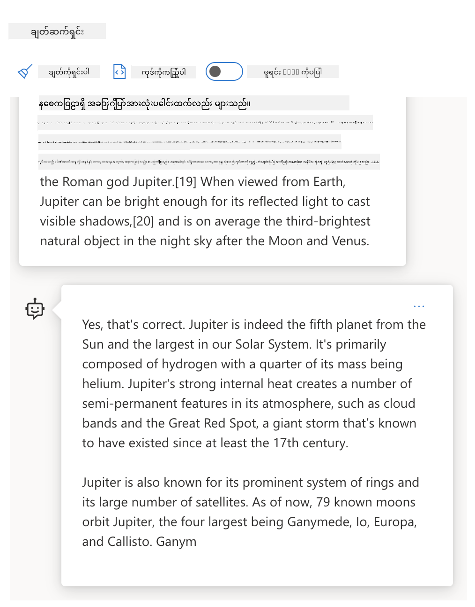
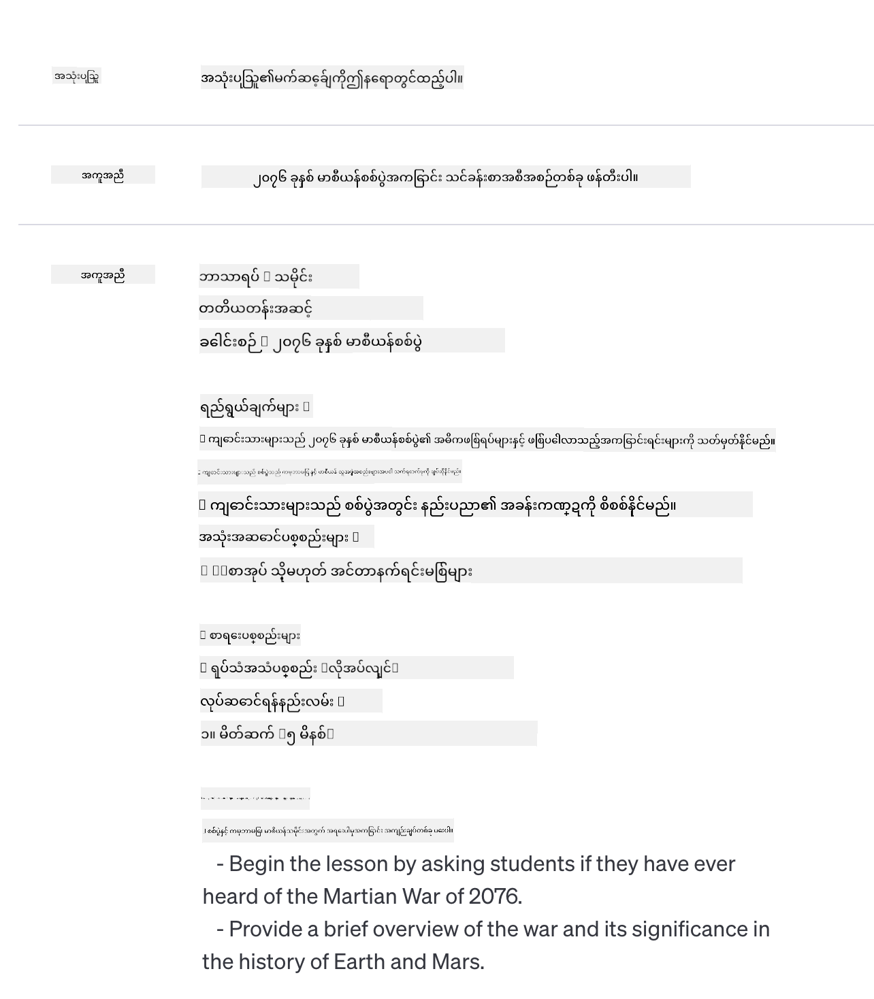

<!--
CO_OP_TRANSLATOR_METADATA:
{
  "original_hash": "a45c318dc6ebc2604f35b8b829f93af2",
  "translation_date": "2025-07-09T11:17:11+00:00",
  "source_file": "04-prompt-engineering-fundamentals/README.md",
  "language_code": "my"
}
-->
# Prompt Engineering အခြေခံများ

[](https://aka.ms/gen-ai-lesson4-gh?WT.mc_id=academic-105485-koreyst)

## နိဒါန်း  
ဒီမော်ဂျူးမှာ generative AI မော်ဒယ်တွေမှာ ထိရောက်တဲ့ prompt တွေ ဖန်တီးဖို့ အရေးကြီးတဲ့ အယူအဆနဲ့ နည်းပညာတွေကို ဖော်ပြထားပါတယ်။ LLM ကို prompt ရေးပုံဟာလည်း အရေးကြီးပါတယ်။ ဂရုစိုက်ပြီး ဖန်တီးထားတဲ့ prompt က တုံ့ပြန်မှုအရည်အသွေးကို ပိုမိုကောင်းမွန်စေပါတယ်။ ဒါပေမယ့် _prompt_ နဲ့ _prompt engineering_ ဆိုတဲ့ စကားလုံးတွေက ဘာကို ဆိုလိုတာလဲ? LLM ကို ပို့တဲ့ prompt _input_ ကို ဘယ်လိုတိုးတက်အောင်လုပ်မလဲ? ဒီမေးခွန်းတွေကို ဒီအခန်းနဲ့ နောက်အခန်းမှာ ဖြေရှင်းကြမယ်။

_Generative AI_ က အသုံးပြုသူတောင်းဆိုချက်အပေါ် မူတည်ပြီး အသစ်သော အကြောင်းအရာများ (စာသား၊ ပုံ၊ အသံ၊ ကုဒ် စသည်) ဖန်တီးနိုင်ပါတယ်။ ဒါကို OpenAI ရဲ့ GPT ("Generative Pre-trained Transformer") စီးရီးလို _Large Language Models_ တွေကို သဘာဝဘာသာစကားနဲ့ ကုဒ် အသုံးပြုဖို့ လေ့ကျင့်ထားတာဖြင့် ရရှိပါတယ်။

အသုံးပြုသူတွေကတော့ နည်းပညာပိုင်း ကျွမ်းကျင်မှုမလိုဘဲ စကားပြောပုံစံနဲ့ ဒီမော်ဒယ်တွေနဲ့ ဆက်သွယ်နိုင်ပြီ ဖြစ်ပါတယ်။ ဒီမော်ဒယ်တွေက _prompt-based_ ဖြစ်ပြီး အသုံးပြုသူက စာသား input (prompt) ပေးပြီး AI ရဲ့ တုံ့ပြန်ချက် (completion) ကို ရရှိပါတယ်။ ထို့နောက် "AI နဲ့ စကားပြော" လုပ်ပြီး မိမိလိုချင်တဲ့ တုံ့ပြန်ချက်ရအောင် prompt ကို အဆက်မပြတ် ပြင်ဆင်နိုင်ပါတယ်။

"Prompts" တွေက ယခု generative AI အက်ပ်တွေမှာ အဓိက _ပရိုဂရမ်မင်း အင်တာဖေ့စ်_ ဖြစ်လာပြီး မော်ဒယ်တွေကို ဘာလုပ်ရမယ်ဆိုတာ ပြောပြပေးပြီး တုံ့ပြန်ချက်အရည်အသွေးကို သက်ရောက်စေပါတယ်။ "Prompt Engineering" ဆိုတာကတော့ prompt တွေကို ဒီဇိုင်းဆွဲခြင်းနဲ့ တိုးတက်အောင်လုပ်ခြင်းကို အဓိကထားတဲ့ လေ့လာမှုနယ်ပယ် တစ်ခုဖြစ်ပြီး တုံ့ပြန်ချက်တွေကို တည်ငြိမ်ပြီး အရည်အသွေးမြင့်စေဖို့ ရည်ရွယ်ပါတယ်။

## သင်ယူရမည့် ရည်မှန်းချက်များ

ဒီသင်ခန်းစာမှာ Prompt Engineering ဆိုတာဘာလဲ၊ ဘာကြောင့် အရေးကြီးတာလဲ၊ မော်ဒယ်နဲ့ အက်ပ်ရည်ရွယ်ချက်အတွက် ထိရောက်တဲ့ prompt တွေကို ဘယ်လိုဖန်တီးမလဲဆိုတာ သင်ယူမှာဖြစ်ပါတယ်။ Prompt engineering ရဲ့ အဓိကအယူအဆနဲ့ အကောင်းဆုံး လေ့လာမှုနည်းလမ်းတွေကို နားလည်ပြီး Jupyter Notebooks "sandbox" ပတ်ဝန်းကျင်တစ်ခုမှာ ဒီအယူအဆတွေကို လက်တွေ့အသုံးပြုနည်းကိုလည်း သင်ယူပါမယ်။

ဒီသင်ခန်းစာအဆုံးမှာ ကျွန်တော်တို့က:

1. Prompt engineering ဆိုတာဘာလဲ၊ ဘာကြောင့် အရေးကြီးတာလဲ ဆိုတာ ရှင်းပြနိုင်ပါမယ်။
2. Prompt ရဲ့ အစိတ်အပိုင်းတွေကို ဖော်ပြနိုင်ပြီး ဘယ်လိုအသုံးပြုကြောင်း သိရှိနိုင်ပါမယ်။
3. Prompt engineering အတွက် အကောင်းဆုံး လေ့လာမှုနည်းလမ်းနဲ့ နည်းပညာတွေကို သင်ယူနိုင်ပါမယ်။
4. သင်ယူထားတဲ့ နည်းလမ်းတွေကို OpenAI endpoint ကို အသုံးပြုပြီး လက်တွေ့ ဥပမာတွေနဲ့ လုပ်ဆောင်နိုင်ပါမယ်။

## အဓိက စကားလုံးများ

Prompt Engineering: AI မော်ဒယ်တွေကို လိုချင်တဲ့ အထွက်များ ထုတ်ပေးဖို့ အတွက် input တွေကို ဒီဇိုင်းဆွဲပြီး တိုးတက်အောင်လုပ်ခြင်း။

Tokenization: စာသားကို မော်ဒယ်နားလည်နိုင်တဲ့ အပိုင်းသေးသေးလေးတွေ (tokens) အဖြစ် ပြောင်းလဲခြင်း။

Instruction-Tuned LLMs: တိကျတဲ့ ညွှန်ကြားချက်တွေနဲ့ တိုးတက်အောင် လေ့ကျင့်ထားတဲ့ Large Language Models (LLMs)။

## သင်ယူမှု Sandbox

Prompt engineering က ယခုအချိန်မှာ သိပ္ပံနည်းပညာထက် အနုပညာပိုင်းနဲ့ ပိုဆက်နွယ်ပါတယ်။ အတွေ့အကြုံ တိုးတက်ဖို့အတွက် _လေ့ကျင့်မှုများ_ ပြုလုပ်ပြီး လုပ်ဆောင်မှုနဲ့ အမှားပြန်ပြင်မှုနည်းလမ်းကို ပေါင်းစပ်သုံးသင့်ပါတယ်။ ဒါဟာ လုပ်ငန်းနယ်ပယ် ကျွမ်းကျင်မှုနဲ့ အကြံပြုနည်းလမ်းတွေ၊ မော်ဒယ်အလိုက် တိုးတက်မှုတွေကို ပေါင်းစပ်သုံးခြင်းဖြစ်ပါတယ်။

ဒီသင်ခန်းစာနဲ့ တွဲဖက်ထားတဲ့ Jupyter Notebook က သင်ယူထားတာတွေကို လက်တွေ့စမ်းသပ်နိုင်တဲ့ _sandbox_ ပတ်ဝန်းကျင် ဖြစ်ပါတယ်။ လေ့ကျင့်ခန်းတွေကို လုပ်ဆောင်ဖို့အတွက် လိုအပ်တာတွေက:

1. **Azure OpenAI API key** - တပ်ဆင်ထားတဲ့ LLM အတွက် ဝန်ဆောင်မှု endpoint။
2. **Python Runtime** - Notebook ကို အလုပ်လုပ်စေဖို့။
3. **Local Env Variables** - _[SETUP](./../00-course-setup/SETUP.md?WT.mc_id=academic-105485-koreyst) လုပ်ဆောင်ချက်တွေကို အခုတင် ပြီးစီးထားဖို့_။

Notebook မှာ _စတင်ဖို့_ လေ့ကျင့်ခန်းတွေ ပါဝင်ပြီး သင့်ရဲ့ _Markdown_ (ဖော်ပြချက်) နဲ့ _Code_ (prompt တောင်းဆိုချက်) အပိုင်းတွေကို ထပ်ထည့်ပြီး နမူနာများ သို့မဟုတ် အကြံဉာဏ်အသစ်တွေ စမ်းသပ်နိုင်ပါတယ်။ ဒါက prompt ဒီဇိုင်းအတွက် သင့်ရဲ့ အတွေးအမြင် တိုးတက်စေပါလိမ့်မယ်။

## ပုံဖော်ထားသော လမ်းညွှန်

ဒီသင်ခန်းစာမှာ ဘာတွေ ပါဝင်မလဲ ကြိုတင် သိချင်ပါသလား? ဒီပုံဖော်ထားတဲ့ လမ်းညွှန်ကို ကြည့်ပါ။ အဓိက ခေါင်းစဉ်တွေ၊ သင်ယူရမယ့် အချက်အလက်တွေကို ဖော်ပြထားပြီး သင်ယူမှု လမ်းကြောင်းကို ရှင်းပြထားပါတယ်။ ဒီလမ်းညွှန်မှာ "Advanced Techniques" အပိုင်းက ဒီသင်ရိုးစာအုပ်ရဲ့ _နောက်တစ်ခန်း_ မှာ ပါဝင်တဲ့ အကြောင်းအရာတွေကို ရည်ညွှန်းထားတာ ဖြစ်ပါတယ်။


## ကျွန်တော်တို့ စတားတပ်

ယခုအခန်းက ကျွန်တော်တို့ စတားတပ်ရဲ့ [ပညာရေးထဲမှာ AI နည်းပညာတိုးတက်မှုကို ယူဆောင်ရန်](https://educationblog.microsoft.com/2023/06/collaborating-to-bring-ai-innovation-to-education?WT.mc_id=academic-105485-koreyst) ရည်မှန်းချက်နဲ့ ဘယ်လို ဆက်နွယ်နေသလဲ ပြောကြမယ်။ ကျွန်တော်တို့က _ပုဂ္ဂိုလ်ရေးသင်ယူမှု_ အတွက် AI အခြေပြု အက်ပ်တွေ ဖန်တီးချင်ပါတယ်။ ဒါကြောင့် အသုံးပြုသူအမျိုးမျိုးက မိမိတို့ အက်ပ်အတွက် prompt တွေကို ဘယ်လို "ဒီဇိုင်းဆွဲ" နိုင်မလဲ ဆိုတာ စဉ်းစားကြရအောင်။

- **အုပ်ချုပ်သူများ** က AI ကို _သင်ရိုးညွှန်းတမ်း ဒေတာကို ခွဲခြမ်းစိတ်ဖြာပြီး ဖုံးလွှမ်းမှု အားနည်းချက်တွေ ရှာဖွေဖို့_ တောင်းနိုင်ပါတယ်။ AI က ရလဒ်တွေကို အကျဉ်းချုပ်ပေးခြင်း သို့မဟုတ် ကုဒ်နဲ့ မြင်ကွင်းဖော်ပြပေးနိုင်ပါတယ်။
- **ဆရာ/ဆရာမများ** က AI ကို _ပစ်မှတ်ပရိသတ်နဲ့ ခေါင်းစဉ်အတွက် သင်ခန်းစာအစီအစဉ် တစ်ခု ဖန်တီးဖို့_ တောင်းနိုင်ပါတယ်။ AI က သတ်မှတ်ထားတဲ့ ပုံစံအတိုင်း ပုဂ္ဂိုလ်ရေးအစီအစဉ်ကို တည်ဆောက်ပေးနိုင်ပါတယ်။
- **ကျောင်းသား/သူများ** က AI ကို _ခက်ခဲတဲ့ဘာသာရပ်တစ်ခုမှာ သင်ကြားပေးဖို့_ တောင်းနိုင်ပါတယ်။ AI က ကျောင်းသား/သူတွေအတွက် အဆင့်သင့်တော်တဲ့ သင်ခန်းစာ၊ အကြံပြုချက်နဲ့ ဥပမာတွေ ပေးနိုင်ပါတယ်။

ဒါကတော့ အစိတ်အပိုင်းတစ်စိတ်တစ်ပိုင်းသာ ဖြစ်ပါတယ်။ ပိုမိုကျယ်ပြန့်တဲ့ အကြောင်းအရာတွေကို သိရှိချင်ရင် [Prompts For Education](https://github.com/microsoft/prompts-for-edu/tree/main?WT.mc_id=academic-105485-koreyst) ကို ကြည့်ပါ။ ဒီဟာက ပညာရေးကျွမ်းကျင်သူတွေက စုစည်းထားတဲ့ open-source prompts စာကြည့်တိုက် ဖြစ်ပါတယ်။ _sandbox မှာ ဒါတွေကို စမ်းသပ်ကြည့်ပါ၊ ဒါမှမဟုတ် OpenAI Playground ကို အသုံးပြုပြီး ဘာဖြစ်မလဲ ကြည့်ပါ!_

<!--  
LESSON TEMPLATE:  
This unit should cover core concept #1.  
Reinforce the concept with examples and references.  

CONCEPT #1:  
Prompt Engineering.  
Define it and explain why it is needed.  
-->

## Prompt Engineering ဆိုတာဘာလဲ?

ဒီသင်ခန်းစာကို စတင်တဲ့အခါမှာ **Prompt Engineering** ကို _ဒီဇိုင်းဆွဲခြင်းနဲ့ တိုးတက်အောင်လုပ်ခြင်း_ လုပ်ငန်းစဉ်အဖြစ် သတ်မှတ်ပြီး တစ်ခုချင်းစီအတွက် တုံ့ပြန်ချက် (completion) တွေကို တည်ငြိမ်ပြီး အရည်အသွေးမြင့်စေဖို့ ရည်ရွယ်ပါတယ်။ ဒါကို ၂ဆင့်လုပ်ငန်းစဉ်အဖြစ် တွေးနိုင်ပါတယ်။

- မော်ဒယ်နဲ့ ရည်ရွယ်ချက်အတွက် အစပိုင်း prompt ကို _ဒီဇိုင်းဆွဲခြင်း_  
- တုံ့ပြန်ချက်အရည်အသွေး တိုးတက်အောင် prompt ကို _အဆက်မပြတ် ပြင်ဆင်ခြင်း_

ဒါဟာ လုပ်ဆောင်မှုနဲ့ အမှားပြန်ပြင်မှုနည်းလမ်းဖြစ်ပြီး အသုံးပြုသူရဲ့ အတွေးအမြင်နဲ့ ကြိုးပမ်းမှုလိုအပ်ပါတယ်။ ဒါဆို ဘာကြောင့် အရေးကြီးတာလဲ? ဒီမေးခွန်းကို ဖြေရှင်းဖို့ အောက်ပါ အယူအဆ ၃ ခုကို နားလည်ဖို့ လိုပါတယ်။

- _Tokenization_ = မော်ဒယ်က prompt ကို ဘယ်လို "မြင်" တယ်ဆိုတာ  
- _Base LLMs_ = အခြေခံမော်ဒယ်က prompt ကို ဘယ်လို "လုပ်ဆောင်" တယ်ဆိုတာ  
- _Instruction-Tuned LLMs_ = မော်ဒယ်က "တာဝန်" တွေကို ဘယ်လို မြင်တယ်ဆိုတာ  

### Tokenization

LLM က prompt တွေကို _token_ တွေ စဉ်ဆက်ဖြစ်စေပြီး မော်ဒယ်အမျိုးအစား (သို့မဟုတ် မော်ဒယ်ဗားရှင်း) အလိုက် တူညီတဲ့ prompt ကို token မျိုးစုံနဲ့ ခွဲခြားနိုင်ပါတယ်။ LLM တွေဟာ စာသားမဟုတ်ပဲ token တွေကို သင်ကြားထားတာကြောင့် prompt တွေ token ဖြစ်ပုံဟာ တုံ့ပြန်ချက်အရည်အသွေးကို တိုက်ရိုက် သက်ရောက်စေပါတယ်။

tokenization ဘယ်လို လုပ်ဆောင်တာကို နားလည်ဖို့အတွက် [OpenAI Tokenizer](https://platform.openai.com/tokenizer?WT.mc_id=academic-105485-koreyst) လို ကိရိယာတွေကို စမ်းသပ်ကြည့်ပါ။ သင့် prompt ကို ကူးထည့်ပြီး token တွေ ဘယ်လို ပြောင်းလဲသွားတာကို ကြည့်ပါ။ အထူးသဖြင့် အနားလေးများနဲ့ အနားကွပ်သင်္ကေတတွေကို ဘယ်လို ကိုင်တွယ်ထားတာကို သတိထားပါ။ ဤနမူနာမှာ အဟောင်း LLM (GPT-3) ကို ပြထားတာဖြစ်ပြီး နောက်ဆုံးမော်ဒယ်နဲ့ စမ်းသပ်ရင် ရလဒ်ကွဲပြားနိုင်ပါတယ်။


### အယူအဆ: အခြေခံမော်ဒယ်များ

prompt ကို token ဖြစ်အောင် ပြောင်းပြီးနောက်မှာ ["Base LLM"](https://blog.gopenai.com/an-introduction-to-base-and-instruction-tuned-large-language-models-8de102c785a6?WT.mc_id=academic-105485-koreyst) (သို့မဟုတ် Foundation model) ရဲ့ အဓိကတာဝန်က token စဉ်ထဲက နောက်ထပ် token ကို ခန့်မှန်းပေးခြင်း ဖြစ်ပါတယ်။ LLM တွေဟာ စာသားဒေတာအစုအဝေးကြီးတွေမှာ သင်ကြားထားတာကြောင့် token တွေကြား ရှိတဲ့ စာရင်းအင်းဆက်နွယ်မှုကို ကောင်းစွာ နားလည်ပြီး ယုံကြည်စိတ်ချစွာ ခန့်မှန်းနိုင်ပါတယ်။ ဒါပေမယ့် prompt ထဲမှာ ပါတဲ့ စကားလုံးတွေ သို့မဟုတ် token တွေရဲ့ _အဓိပ္ပာယ်_ ကို နားမလည်ပါဘူး။ သူတို့မြင်တာက "pattern" တစ်ခုဖြစ်ပြီး နောက်ထပ် ခန့်မှန်းချက်နဲ့ ပြည့်စုံအောင် ဆက်လုပ်တာပါ။ အသုံးပြုသူ ရပ်တန့်တဲ့အထိ သို့မဟုတ် ကြိုတင်သတ်မှတ်ထားတဲ့ အခြေအနေတစ်ခုဖြစ်လာတဲ့အထိ ဆက်လက် ခန့်မှန်းနိုင်ပါတယ်။

prompt-based completion ဘယ်လို လုပ်ဆောင်တာ ကြည့်ချင်ပါသလား? အထက်ပါ prompt ကို Azure OpenAI Studio [_Chat Playground_](https://oai.azure.com/playground?WT.mc_id=academic-105485-koreyst) မှာ ပုံမှန် ဆက်တင်တွေဖြင့် ထည့်သွင်းကြည့်ပါ။ စနစ်က prompt တွေကို သတင်းအချက်အလက် တောင်းဆိုချက်အဖြစ် ကိုင်တွယ်ထားတာကြောင့် ဒီအခြေအနေကို ဖြည့်ဆည်းတဲ့ တုံ့ပြန်ချက်ကို တွေ့ရပါလိမ့်မယ်။

ဒါပေမယ့် အသုံးပြုသူက တိကျတဲ့ အချက်အလက် သို့မဟုတ် တာဝန် ရည်ရွယ်ချက်တစ်ခုနဲ့ ကိုက်ညီတဲ့ တုံ့ပြန်ချက်ကို ကြည့်ချင်ရင် ဘာလုပ်မလဲ? ဒီမှာ _instruction-tuned_ LLMs တွေ ပါဝင်လာပါတယ်။



### အယူအဆ: Instruction Tuned LLMs

[Instruction Tuned LLM](https://blog.gopenai.com/an-introduction-to-base-and-instruction-tuned-large-language-models-8de102c785a6?WT.mc_id=academic-105485-koreyst) က အခြေခံမော်ဒယ်ကို အခြေခံပြီး ဥပမာများ သို့မဟုတ် input/output စုံတွေနဲ့ (ဥပမာ၊ multi-turn "messages") တိကျတဲ့ ညွှန်ကြားချက်တွေ ပါဝင်တဲ့ အချက်အလက်တွေနဲ့ တိုးတက်အောင် လေ့ကျင့်ထားတာ ဖြစ်ပါတယ်။ AI ရဲ့ တုံ့ပြန်ချက်က ညွှန်ကြားချက်ကို လိုက်နာဖို့ ကြိုးစားပါတယ်။

ဒါဟာ Reinforcement Learning with Human Feedback (RLHF) နည်းလမ်းတွေကို အသုံးပြုပြီး မော်ဒယ်ကို _ညွှန်ကြားချက်တွေ လိုက်န
# 2076 ခုနှစ် မာတီယန် စစ်ပွဲ သင်ခန်းစာအစီအစဉ်

## သင်ခန်းစာအကျဉ်းချုပ်  
ဒီသင်ခန်းစာမှာ 2076 ခုနှစ် မာတီယန် စစ်ပွဲ၏ အကြောင်းအရာ၊ အကြောင်းရင်းများ၊ အကျိုးသက်ရောက်မှုများနှင့် အနာဂတ်အတွက် သင်ခန်းစာများကို လေ့လာပါမည်။

## သင်ခန်းစာရည်မှန်းချက်များ  
- မာတီယန် စစ်ပွဲ၏ နောက်ခံအကြောင်းအရာကို နားလည်နိုင်ရန်  
- စစ်ပွဲဖြစ်ပွားရခြင်း၏ အကြောင်းရင်းများကို ရှာဖွေသိရှိရန်  
- စစ်ပွဲ၏ အကျိုးသက်ရောက်မှုများကို ခွဲခြမ်းစိတ်ဖြာနိုင်ရန်  
- အနာဂတ်တွင် ဒီလိုအခြေအနေများကို မဖြစ်ပေါ်စေရန် သင်ခန်းစာများကို သဘောပေါက်ရန်  

## သင်ခန်းစာအကြောင်းအရာ  
### 1. မာတီယန် စစ်ပွဲ၏ နောက်ခံ  
- 2076 ခုနှစ်တွင် မာတီယန်တွင် ဖြစ်ပွားခဲ့သော စစ်ပွဲ၏ အခြေခံအချက်များ  
- မာတီယန်အာကာသစခန်းများနှင့် လူသားအုပ်စုများ၏ ဆက်ဆံရေး  

### 2. စစ်ပွဲဖြစ်ပွားရခြင်း၏ အကြောင်းရင်းများ  
- အရင်းအမြစ်များအပေါ် အပစ်အခတ်  
- နည်းပညာနှင့် အာကာသအရင်းအမြစ်များအတွက် ယှဉ်ပြိုင်မှု  
- နိုင်ငံတကာနှင့် အာကာသအဖွဲ့အစည်းများ၏ နိုင်ငံရေးအကျိုးဆက်များ  

### 3. စစ်ပွဲ၏ အကျိုးသက်ရောက်မှုများ  
- လူ့ဘောင်အပေါ် သက်ရောက်မှုများ  
- နည်းပညာတိုးတက်မှုများနှင့် စီးပွားရေးအကျိုးသက်ရောက်မှုများ  
- အာကာသအုပ်ချုပ်မှုနှင့် နိုင်ငံရေးပြောင်းလဲမှုများ  

### 4. သင်ခန်းစာများနှင့် အနာဂတ်အတွက် အကြံပြုချက်များ  
- စစ်ပွဲကဲ့သို့သော အခြေအနေများကို ရှောင်ရှားရန် နည်းလမ်းများ  
- အာကာသတွင် ငြိမ်းချမ်းရေးနှင့် ပူးပေါင်းဆောင်ရွက်မှု တိုးတက်စေရန် အရေးပါမှု  
- နည်းပညာနှင့် လူ့အဖွဲ့အစည်းများ၏ တာဝန်များ  

## သင်ခန်းစာဆောင်ရွက်မှု  
- အဖွဲ့လိုက် ဆွေးနွေးပွဲများ  
- စစ်ပွဲအကြောင်း ရုပ်ပုံများနှင့် ဗီဒီယိုများ ကြည့်ရှုခြင်း  
- သင်ခန်းစာအပြီး စာမေးပွဲနှင့် အကဲဖြတ်မှု  

## အရင်းအမြစ်များ  
- စာအုပ်များ၊ ဆောင်းပါးများနှင့် အင်တာနက်အရင်းအမြစ်များ  
- သက်ဆိုင်ရာ သုတေသနစာတမ်းများ  

ဒီသင်ခန်းစာအစီအစဉ်သည် မာတီယန် စစ်ပွဲ၏ အကျိုးသက်ရောက်မှုများကို နားလည်ပြီး အနာဂတ်တွင် ငြိမ်းချမ်းရေးကို ထိန်းသိမ်းနိုင်ရန် အထောက်အကူဖြစ်စေမည်ဖြစ်သည်။
ဝက်ဘ်ရှာဖွေမှုတစ်ခုက မာရှင်စစ်ပွဲများအကြောင်း (ဥပမာ - တီဗွီစီးရီး သို့မဟုတ် စာအုပ်များ) စိတ်ကူးယဉ်ဇာတ်လမ်းများ ရှိကြောင်း ပြသပေမယ့် ၂၀၇၆ ခုနှစ်အတွက်တော့ မရှိပါဘူး။ သာမာန်အတွေးအခေါ်အရ ၂၀၇၆ ခုနှစ်ဟာ _အနာဂတ်_ ဖြစ်တဲ့အတွက် အမှန်တကယ်ဖြစ်ပွားခဲ့တဲ့ ဖြစ်ရပ်တစ်ခုနဲ့ ဆက်စပ်နိုင်ခြင်း မရှိပါ။

ဒါဆို ဒီ prompt ကို LLM ပံ့ပိုးသူ မတူညီတဲ့သူတွေနဲ့ ပြေးကြည့်ရင် ဘာဖြစ်မလဲ?

> **Response 1**: OpenAI Playground (GPT-35)



> **Response 2**: Azure OpenAI Playground (GPT-35)


> **Response 3**: : Hugging Face Chat Playground (LLama-2)


မျှော်လင့်ထားသလို၊ မော်ဒယ်တစ်ခုချင်း (သို့မဟုတ် မော်ဒယ်ဗားရှင်းတစ်ခုချင်း) မှ stochastic လုပ်ဆောင်ချက်နဲ့ မော်ဒယ်စွမ်းရည်ကွဲပြားမှုကြောင့် တုံ့ပြန်ချက်တွေက နည်းနည်းကွာခြားပါတယ်။ ဥပမာ၊ မော်ဒယ်တစ်ခုက အတန်း ၈ ကျောင်းသားတွေအတွက် ရည်ရွယ်ထားပြီး တစ်ခုကတော့ အထက်တန်းကျောင်းသားတွေအတွက် ထင်မြင်ထားတာပါ။ ဒါပေမယ့် မော်ဒယ်သုံးခုလုံးက အချက်အလက်မရှိတဲ့ အသုံးပြုသူတစ်ယောက်ကို ဒီဖြစ်ရပ်ဟာ အမှန်တကယ်ဖြစ်ခဲ့တယ်လို့ ယုံကြည်စေဖို့ တုံ့ပြန်ချက်တွေ ထုတ်ပေးနိုင်ခဲ့ပါတယ်။

_prompt engineering_ နည်းလမ်းတွေဖြစ်တဲ့ _metaprompting_ နဲ့ _temperature configuration_ က မော်ဒယ်မှားယွင်းမှုတွေကို တစ်စိတ်တစ်ပိုင်း လျော့နည်းစေနိုင်ပါတယ်။ အသစ်ထွက်လာတဲ့ prompt engineering _architectures_ တွေကလည်း အသစ်ထည့်သွင်းထားတဲ့ ကိရိယာနဲ့ နည်းလမ်းတွေကို prompt လည်ပတ်မှုထဲမှာ အဆင်ပြေစွာ ပေါင်းစပ်သုံးစွဲနိုင်ဖို့ ရည်ရွယ်ပါတယ်၊ ဒီအကျိုးသက်ရောက်မှုတွေကို လျော့နည်းစေဖို့။

## အမှုလေ့လာမှု - GitHub Copilot

ဒီအပိုင်းကို ပြီးဆုံးစေဖို့ prompt engineering ကို အမှန်တကယ် အသုံးပြုထားတဲ့ နမူနာတစ်ခုကို ကြည့်ကြမယ် - အမှုလေ့လာမှုတစ်ခုအနေနဲ့ [GitHub Copilot](https://github.com/features/copilot?WT.mc_id=academic-105485-koreyst) ကို ကြည့်ပါ။

GitHub Copilot ဟာ သင့်ရဲ့ "AI အဖက်ဖက် Programmer" ဖြစ်ပြီး စာသား prompt တွေကို ကုဒ်ဖြည့်စွက်ချက်တွေဖြစ်အောင် ပြောင်းပေးပါတယ်။ သင့်ဖွံ့ဖြိုးရေးပတ်ဝန်းကျင် (ဥပမာ - Visual Studio Code) ထဲမှာ ပေါင်းစပ်ထားပြီး အသုံးပြုသူအတွေ့အကြုံကို အဆင်ပြေစေပါတယ်။ အောက်ပါ ဘလော့ဂ်စီးရီးတွေမှာ ဖော်ပြထားသလို၊ အစောပိုင်းဗားရှင်းဟာ OpenAI Codex မော်ဒယ်အပေါ် အခြေခံထားပြီး အင်ဂျင်နီယာတွေက မော်ဒယ်ကို ပိုမိုကောင်းမွန်အောင် fine-tune လုပ်ဖို့နဲ့ prompt engineering နည်းလမ်းတွေ တိုးတက်အောင် ဖန်တီးဖို့ လျင်မြန်စွာ သိရှိခဲ့ကြပါတယ်။ ဇူလိုင်လမှာတော့ [Codex ထက်ပိုမိုကောင်းမွန်တဲ့ AI မော်ဒယ်အသစ်တစ်ခုကို မိတ်ဆက်ခဲ့](https://github.blog/2023-07-28-smarter-more-efficient-coding-github-copilot-goes-beyond-codex-with-improved-ai-model/?WT.mc_id=academic-105485-koreyst)ပြီး ပိုမိုမြန်ဆန်တဲ့ အကြံပြုချက်တွေ ပေးနိုင်ပါတယ်။

သူတို့ရဲ့ သင်ယူမှု ခရီးစဉ်ကို အောက်ပါ ပို့စ်တွေကို အစဉ်လိုက် ဖတ်ရှုပါ။

- **May 2023** | [GitHub Copilot သင့်ကုဒ်ကို နားလည်မှု ပိုမိုကောင်းမွန်လာ](https://github.blog/2023-05-17-how-github-copilot-is-getting-better-at-understanding-your-code/?WT.mc_id=academic-105485-koreyst)
- **May 2023** | [GitHub အတွင်း: GitHub Copilot အောက်က LLM များနှင့် လုပ်ဆောင်ခြင်း](https://github.blog/2023-05-17-inside-github-working-with-the-llms-behind-github-copilot/?WT.mc_id=academic-105485-koreyst)
- **Jun 2023** | [GitHub Copilot အတွက် ပိုမိုကောင်းမွန်တဲ့ prompt များရေးသားနည်း](https://github.blog/2023-06-20-how-to-write-better-prompts-for-github-copilot/?WT.mc_id=academic-105485-koreyst)
- **Jul 2023** | [GitHub Copilot က Codex ထက်ပိုမိုကောင်းမွန်တဲ့ AI မော်ဒယ်နဲ့ တိုးတက်လာ](https://github.blog/2023-07-28-smarter-more-efficient-coding-github-copilot-goes-beyond-codex-with-improved-ai-model/?WT.mc_id=academic-105485-koreyst)
- **Jul 2023** | [Developer များအတွက် Prompt Engineering နဲ့ LLM များ လမ်းညွှန်ချက်](https://github.blog/2023-07-17-prompt-engineering-guide-generative-ai-llms/?WT.mc_id=academic-105485-koreyst)
- **Sep 2023** | [Enterprise LLM app တည်ဆောက်နည်း: GitHub Copilot မှ သင်ခန်းစာများ](https://github.blog/2023-09-06-how-to-build-an-enterprise-llm-application-lessons-from-github-copilot/?WT.mc_id=academic-105485-koreyst)

ဒီလိုပဲ [Engineering blog](https://github.blog/category/engineering/?WT.mc_id=academic-105485-koreyst) မှာလည်း [ဒီလိုပို့စ်တွေ](https://github.blog/2023-09-27-how-i-used-github-copilot-chat-to-build-a-reactjs-gallery-prototype/?WT.mc_id=academic-105485-koreyst) ကို ကြည့်ရှုနိုင်ပြီး ဒီမော်ဒယ်တွေနဲ့ နည်းလမ်းတွေကို အမှန်တကယ် အသုံးချတဲ့ နည်းလမ်းတွေကို တွေ့မြင်နိုင်ပါတယ်။

---

## Prompt ဖန်တီးခြင်း

Prompt engineering အရေးကြီးတဲ့အကြောင်းကို ကြည့်ပြီးသားဖြစ်တဲ့အတွက်၊ prompt တွေကို ဘယ်လို _ဖန်တီး_ လုပ်ကြောင်း နားလည်ကြမယ်၊ ထို့နောက် ပိုမိုထိရောက်တဲ့ prompt ဒီဇိုင်းအတွက် နည်းလမ်းမျိုးစုံကို သုံးသပ်နိုင်ဖို့ ဖြစ်ပါတယ်။

### အခြေခံ Prompt

အခြေခံ prompt က မော်ဒယ်ထံ ပို့တဲ့ စာသား input တစ်ခုဖြစ်ပြီး အခြား context မပါဘဲ ဖြစ်ပါတယ်။ ဥပမာ - OpenAI [Completion API](https://platform.openai.com/docs/api-reference/completions?WT.mc_id=academic-105485-koreyst) ကို အမေရိကန်နိုင်ငံအမျိုးသားသီချင်း စာသားအစပိုင်းကို ပို့လိုက်တဲ့အခါ၊ မော်ဒယ်က ချက်ချင်းနောက်တစ်ချောင်းချောင်းကို _ဖြည့်စွက်_ ပြီး အခြေခံခန့်မှန်းမှု လုပ်ဆောင်ချက်ကို ပြသပါတယ်။

| Prompt (Input)     | Completion (Output)                                                                                                                        |
| :----------------- | :----------------------------------------------------------------------------------------------------------------------------------------- |
| Oh say can you see | သင် "The Star-Spangled Banner" ဆိုတဲ့ အမေရိကန်နိုင်ငံအမျိုးသားသီချင်း စာသားအစကို စတင်ဆိုနေသလို ကြားရပါတယ်။ အပြည့်အစုံကတော့ ... ဖြစ်ပါတယ်။ |

### ရှုပ်ထွေး Prompt

အခုတော့ အခြေခံ prompt ကို context နဲ့ ညွှန်ကြားချက်တွေ ထည့်လိုက်ကြမယ်။ [Chat Completion API](https://learn.microsoft.com/azure/ai-services/openai/how-to/chatgpt?WT.mc_id=academic-105485-koreyst) ကတော့ _messages_ စုစည်းမှုအဖြစ် ရှုပ်ထွေး prompt တစ်ခု ဖန်တီးနိုင်ပါတယ်၊ အဲဒီမှာ -

- _user_ input နဲ့ _assistant_ တုံ့ပြန်ချက်တို့ကို input/output စုံတွေနဲ့ ဖော်ပြထားတယ်။
- assistant ၏ အပြုအမူ သို့မဟုတ် ကိုယ်ရည်ကိုယ်သွေးကို သတ်မှတ်တဲ့ system message ပါဝင်တယ်။

အခု request က အောက်ပါပုံစံဖြစ်ပြီး _tokenization_ က context နဲ့ စကားပြောဆိုမှုမှ သက်ဆိုင်ရာ အချက်အလက်တွေကို ထိရောက်စွာ ဖမ်းယူပါတယ်။ system context ပြောင်းလဲခြင်းကလည်း user input တွေနဲ့တူညီတဲ့ အကျိုးသက်ရောက်မှုရှိနိုင်ပါတယ်။

```python
response = openai.chat.completions.create(
    model="gpt-3.5-turbo",
    messages=[
        {"role": "system", "content": "You are a helpful assistant."},
        {"role": "user", "content": "Who won the world series in 2020?"},
        {"role": "assistant", "content": "The Los Angeles Dodgers won the World Series in 2020."},
        {"role": "user", "content": "Where was it played?"}
    ]
)
```

### ညွှန်ကြားချက် Prompt

အထက်ပါ ဥပမာတွေမှာ user prompt က သတင်းအချက်အလက် တောင်းဆိုမှုတစ်ခုအဖြစ် ရိုးရှင်းတဲ့ စာသားမေးခွန်းဖြစ်ပါတယ်။ _instruction_ prompt တွေမှာတော့ အဲဒီစာသားကို ပိုမိုအသေးစိတ် အလုပ်တာဝန်တစ်ခုအဖြစ် သတ်မှတ်ပေးပြီး AI ကို ပိုမိုကောင်းမွန်တဲ့ လမ်းညွှန်ချက်ပေးနိုင်ပါတယ်။ ဥပမာ -

| Prompt (Input)                                                                                                                                                                                                                         | Completion (Output)                                                                                                        | Instruction Type    |
| :------------------------------------------------------------------------------------------------------------------------------------------------------------------------------------------------------------------------------------- | :------------------------------------------------------------------------------------------------------------------------- | :------------------ |
| Write a description of the Civil War                                                                                                                                                                                                   | _ရိုးရှင်းတဲ့ ပုဒ်မတစ်ပုဒ် ပြန်ပေးခဲ့သည်_                                                                                 | ရိုးရှင်း             |
| Write a description of the Civil War. Provide key dates and events and describe their significance                                                                                                                                     | _ပုဒ်မတစ်ပုဒ်နဲ့ အရေးကြီးတဲ့ ဖြစ်ရပ်ရက်တွေစာရင်းနဲ့ ဖော်ပြချက်တွေ ပြန်ပေးခဲ့သည်_                                         | ရှုပ်ထွေး             |
| Write a description of the Civil War in 1 paragraph. Provide 3 bullet points with key dates and their significance. Provide 3 more bullet points with key historical figures and their contributions. Return the output as a JSON file | _ပိုမိုအသေးစိတ် ဖော်ပြချက်တွေနဲ့ JSON ဖိုင်အဖြစ် ပြန်ပေးခဲ့သည်_                                                              | ရှုပ်ထွေး၊ ဖော်မတ်ထားသည် |

## အဓိက အကြောင်းအရာ

အထက်ပါ ဥပမာတွေမှာ prompt က များစွာဖွင့်လှစ်ထားပြီး LLM ကို သူ့ရဲ့ pre-trained ဒေတာအစုအဝေးထဲက သက်ဆိုင်ရာ အပိုင်းကို ဆုံးဖြတ်ခွင့် ပေးထားပါတယ်။ _primary content_ ဒီဇိုင်းပုံစံမှာတော့ input စာသားကို နှစ်ပိုင်းခွဲထားပါတယ် -

- ညွှန်ကြားချက် (လုပ်ဆောင်ချက်)
- လုပ်ဆောင်ချက်ကို သက်ရောက်စေမယ့် သက်ဆိုင်ရာ အကြောင်းအရာ

ဥပမာ - "ဒီကို ၂ စာကြောင်းနဲ့ အကျဉ်းချုပ်ပါ" ဆိုတဲ့ instruction ပါတဲ့ အောက်ပါနမူနာ။

| Prompt (Input)                                                                                                                                                                                                                                                                                                                                                                                                                                                                                                                                                                                                                                                                                      | Completion (Output)                                                                                                                                                                                                                                                                             |
| :-------------------------------------------------------------------------------------------------------------------------------------------------------------------------------------------------------------------------------------------------------------------------------------------------------------------------------------------------------------------------------------------------------------------------------------------------------------------------------------------------------------------------------------------------------------------------------------------------------------------------------------------------------------------------------------------------- | :---------------------------------------------------------------------------------------------------------------------------------------------------------------------------------------------------------------------------------------------------------------------------------------------- |
| Jupiter သည် နေမှ ငါးမြောက်ဂြိုဟ်ဖြစ်ပြီး နေကြယ်စနစ်အတွင်း အကြီးဆုံးဂြိုဟ်ဖြစ်သည်။ ဂျူပီတာသည် နေကြယ်၏ တစ်ပုံတစ်ပေါ်တန်ခိုး၏ တစ်ထောင်ပုံတစ်ပုံသာရှိသော်လည်း နေကြယ်စနစ်ရှိ အခြားဂြိုဟ်များအားလုံး၏ တန်ခိုးပေါင်း၏ နှစ်နှစ်ပေါင်းခွဲပုံရှိသည်။ ဂျူပီတာသည် ညဘက်က မျက်စိဖြင့်မြင်နိုင်သည့် အလင်းတောက်ပဆုံး အရာဝတ္ထုများထဲမှ တစ်ခုဖြစ်ပြီး သမိုင်းမှတ်တမ်းမတိုင်မီကာလကတည်းက လူ့ယဉ်ကျေးမှုများသိရှိခဲ့ကြသည်။ ဂျူပီတာကို ရောမဘုရား Jupiter အမည်ပေးထားသည်။[19] မြေကြီးမှ ကြည့်လျှင် ဂျူပီတာ၏ ပြန်လှည့်အလင်းသည် မျက်နှာပြင်ပေါ်တွင် အရိပ်များ ဖန်တီးနိုင်သည့်အထိ တောက်ပနိုင်ပြီး[20] လအောက်ကာ ဗီနပ်စ်နောက်တွင် ညဘက်က သဘာဝအရာဝတ္ထုများထဲတွင် တတိယအလင်းတောက်ပဆုံး ဖြစ်သည်။ <br/> **ဒီကို ၂ စာကြောင်းနဲ့ အကျဉ်းချုပ်ပါ** | Jupiter သည် နေမှ ငါးမြောက်ဂြိုဟ်ဖြစ်ပြီး နေကြယ်စနစ်အတွင်း အကြီးဆုံးဖြစ်သည်။ ညဘက်က အလင်းတောက်ပဆုံး အရာဝတ္ထုများထဲမှ တစ်ခုဖြစ်ပြီး ရောမဘုရား Jupiter အမည်ပေးထားသည်။ ဂျူပီတာသည် အခြားဂြိုဟ်များ၏ တန်ခိုးပေါင်း၏ နှစ်နှစ်ပေါင်းခွဲပုံရှိသော ဓာတ်ငွေ့ဂြိုဟ်တစ်ခုဖြစ်သည်။ |

primary content အပိုင်းကို အမျိုးမျိုးနည်းလမ်းနဲ့ အသုံးပြုနိုင်ပြီး ပိုမိုထိရောက်တဲ့ ညွှန်ကြားချက်တွေ ပေးနိုင်ပါတယ် -

- **ဥပမာများ** - မော်ဒယ်ကို တိုက်ရိုက် ညွှန်ကြားချက်ပေးခြင်းမပြုဘဲ၊ လုပ်ဆောင်ရမယ့် ပုံစံနမူနာတွေ ပေးပြီး မော်ဒယ်ကို ပုံစံကို ခန့်မှန်းခွင့်ပေးခြင်း။
- **အချက်ပြများ** - ညွှန်ကြားချက်နောက်မှာ "cue" တစ်ခု ထည့်ပြီး မော်ဒယ်ကို ပိုမိုသက်ဆိုင်ရာ တုံ့ပြန်ချက်ပေးဖို့ ဦးတည်စေခြင်း။
- **ပုံစံများ** - placeholder (variable) တွေနဲ့ ပြန်လည်အသုံးပြုနိုင်တဲ့ prompt များဖြစ်ပြီး အချက်အလက်အမျိုးမျိုးနဲ့ ကိုက်ညီအောင် ပြင်ဆင်နိုင်သည်။

ဒီနည်းလမ်းတွေကို လက်တွေ့ကြည့်ကြမယ်။

### ဥပမာများ အသုံးပြုခြင်း

ဒီနည်းလမ်းမှာ primary content ကို အသုံးပြုပြီး လုပ်ဆောင်ချက်အတွက် လိုချင်တဲ့ output နမူနာတွေကို မော်ဒယ်ထံ "ထည့်သွင်း" ပေးပြီး မော်ဒယ်ကို output ပုံစံကို ခန့်မှန်းခွင့်ပေးပါတယ်။ ဥပမာအရေအတွက်ပေါ်မူတည်ပြီး zero-shot, one-shot, few-shot prompting စသဖြင့် ခွဲခြားနိုင်ပါတယ်။

prompt က အောက်ပါ အစိတ်အပိုင်း သုံးခုပါဝင်ပါတယ် -

- လုပ်ငန်းတာဝန် ဖော်ပြချက်
- လိုချင်တဲ့ output နမူနာအနည်းငယ်
- နမူနာအသစ်တစ်ခု စတင်ခြင်း (implicit task description ဖြစ်လာသည်)

| Learning Type | Prompt (Input)                                                                                                                                        | Completion (Output)         |
| :------------ | :---------------------------------------------------------------------------------------------------------------------------------------------------- | :-------------------------- |
| Zero-shot     | "The Sun is Shining". Translate to Spanish                                                                                                            | "El Sol está brillando".    |
| One-shot      | "The Sun is Shining" => ""El Sol está brillando". <br> "It's a Cold and Windy Day" =>                                                                 | "Es un día frío y ventoso". |
| Few-shot      | The player ran the bases => Baseball <br/> The player hit an ace => Tennis <br/> The player hit a six => Cricket <br/> The player made a slam-dunk => | Basketball                  |
|               |                                                                                                                                                       |                             |

Zero

**Summarize This**                                       | ဂျူပီတာသည် ကျွန်ုပ်တို့၏ နေကြယ်စနစ်အတွင်း အကြီးဆုံးဂြိုဟ်ဖြစ်ပြီး နေထံမှ ငါးမြောက်ဂြိုဟ်ဖြစ်သည်။ ဂျူပီတာသည် နေ၏ အလေးချိန် ၁/၁၀၀၀ ပမာဏရှိသော်လည်း အခြားဂြိုဟ်များအားလုံးပေါင်းစပ်ထားသည့်အထက်ပို၍ အလေးချိန်ရှိသော ဓာတ်ငွေ့ကြီးတစ်ခုဖြစ်သည်။ အစဉ်အလာအရ ဂျူပီတာကို ရှေးဟောင်းယဉ်ကျေးမှုများက အချိန်ကြာရှည်ကတည်းက သိရှိခဲ့ပြီး ညဘက်ကောင်းကင်တွင် လွယ်ကူစွာမြင်နိုင်သည်။ |
| 1              | ဂျူပီတာသည် နေထံမှ ငါးမြောက်ဂြိုဟ်ဖြစ်ပြီး နေကြယ်စနစ်အတွင်း အကြီးဆုံးဂြိုဟ်ဖြစ်သည်။ ဂျူပီတာသည် နေ၏ အလေးချိန် ၁/၁၀၀၀ ပမာဏရှိသော်လည်း နေကြယ်စနစ်ရှိ အခြားဂြိုဟ်များအားလုံးပေါင်းစပ်ထားသည့်အလေးချိန်ထက် နှစ်နှစ်ခွဲပိုများသည်။ ဂျူပီတာသည် ညဘက်ကောင်းကင်တွင် မျက်စိဖြင့် ရှင်းလင်းထင်ရှားစွာ မြင်နိုင်သော အလင်းရောင်အရာဝတ္ထုများထဲမှ တစ်ခုဖြစ်ပြီး ရှေးဟောင်းယဉ်ကျေးမှုများက မှတ်တမ်းမတင်မီကာလကတည်းက သိရှိခဲ့သည်။ <br/>**Summarize This** <br/> ကျွန်ုပ်တို့ သင်ယူခဲ့သည်မှာ ဂျူပီတာသည် | နေထံမှ ငါးမြောက်ဂြိုဟ်ဖြစ်ပြီး နေကြယ်စနစ်အတွင်း အကြီးဆုံးဂြိုဟ်ဖြစ်သည်။ ဂျူပီတာသည် နေ၏ အလေးချိန် ၁/၁၀၀၀ ပမာဏရှိသော်လည်း အခြားဂြိုဟ်များအားလုံးပေါင်းစပ်ထားသည့်အလေးချိန်ထက် နှစ်နှစ်ခွဲပိုများသည်။ မျက်စိဖြင့် လွယ်ကူစွာမြင်နိုင်ပြီး ရှေးဟောင်းကာလကတည်းက သိရှိခဲ့သည်။                        |
| 2              | ဂျူပီတာသည် နေထံမှ ငါးမြောက်ဂြိုဟ်ဖြစ်ပြီး နေကြယ်စနစ်အတွင်း အကြီးဆုံးဂြိုဟ်ဖြစ်သည်။ ဂျူပီတာသည် နေ၏ အလေးချိန် ၁/၁၀၀၀ ပမာဏရှိသော်လည်း နေကြယ်စနစ်ရှိ အခြားဂြိုဟ်များအားလုံးပေါင်းစပ်ထားသည့်အလေးချိန်ထက် နှစ်နှစ်ခွဲပိုများသည်။ ဂျူပီတာသည် ညဘက်ကောင်းကင်တွင် မျက်စိဖြင့် ရှင်းလင်းထင်ရှားစွာ မြင်နိုင်သော အလင်းရောင်အရာဝတ္ထုများထဲမှ တစ်ခုဖြစ်ပြီး ရှေးဟောင်းယဉ်ကျေးမှုများက မှတ်တမ်းမတင်မီကာလကတည်းက သိရှိခဲ့သည်။ <br/>**Summarize This** <br/> ကျွန်ုပ်တို့ သင်ယူခဲ့သော ထိပ်တန်း ၃ ချက်မှာ-         | ၁။ ဂျူပီတာသည် နေထံမှ ငါးမြောက်ဂြိုဟ်ဖြစ်ပြီး နေကြယ်စနစ်အတွင်း အကြီးဆုံးဂြိုဟ်ဖြစ်သည်။ <br/> ၂။ ဂျူပီတာသည် နေ၏ အလေးချိန် ၁/၁၀၀၀ ပမာဏရှိသည်...<br/> ၃။ ဂျူပီတာကို ရှေးဟောင်းကာလကတည်းက မျက်စိဖြင့် မြင်နိုင်ခဲ့သည်...                                                                       |
|                |                                                                                                                                                                                                                                                                                                                                                                                                                                                              |                                                                                                                                                                                                                                                                                                           |

### Prompt Templates

Prompt template ဆိုသည်မှာ _ကြိုတင်သတ်မှတ်ထားသော prompt အတွက် အချက်အလက်များစုစည်းမှု_ ဖြစ်ပြီး၊ လိုအပ်သလို သိမ်းဆည်းထား၍ ပြန်လည်အသုံးပြုနိုင်သည်။ အလွယ်တကူပြောရမယ်ဆိုရင် [OpenAI မှ ဤဥပမာ](https://platform.openai.com/examples?WT.mc_id=academic-105485-koreyst) ကဲ့သို့ prompt အစိတ်အပိုင်းများ (အသုံးပြုသူနှင့် စနစ်စာတိုက်များ) နှင့် API မှတဆင့် တောင်းဆိုမှုဖော်မတ်များ ပါဝင်သော prompt ဥပမာစုစည်းမှုတစ်ခုဖြစ်သည်။

ပိုမိုရှုပ်ထွေးသော ပုံစံတွင် [LangChain မှ ဤဥပမာ](https://python.langchain.com/docs/concepts/prompt_templates/?WT.mc_id=academic-105485-koreyst) ကဲ့သို့ _placeholder_ များပါဝင်ပြီး၊ အသုံးပြုသူထည့်သွင်းချက်၊ စနစ်အခြေအနေ၊ ပြင်ပဒေတာများကဲ့သို့ အချက်အလက်အမျိုးမျိုးဖြင့် အစားထိုးနိုင်သည်။ ၎င်းက prompt များကို dynamic အဖြစ် ဖန်တီးနိုင်ပြီး၊ အကြောင်းအရာတူညီသော အသုံးပြုသူအတွေ့အကြုံများကို **အစဉ်လိုက်** ထိန်းသိမ်းပေးနိုင်သည်။

နောက်ဆုံးတွင် template များ၏ အဓိကတန်ဖိုးမှာ vertical application domain များအတွက် _prompt စုစည်းမှု_ များ ဖန်တီးထုတ်ဝေခြင်းဖြစ်ပြီး၊ ၎င်းသည် အသုံးပြုသူအတွက် ပိုမိုသင့်တော်ပြီး တိကျသော တုံ့ပြန်မှုများ ရရှိစေရန် အထူးပြုထားသည်။ [Prompts For Edu](https://github.com/microsoft/prompts-for-edu?WT.mc_id=academic-105485-koreyst) repository သည် ပညာရေးနယ်ပယ်အတွက် သင်ခန်းစာအစီအစဉ်၊ သင်ရိုးညွှန်းတမ်းဒီဇိုင်း၊ ကျောင်းသားလေ့ကျင့်မှု စသည့် အဓိကရည်ရွယ်ချက်များအပေါ် အာရုံစိုက်၍ prompt စုစည်းမှုများကို စုစည်းထားသည့် ကောင်းမွန်သော ဥပမာတစ်ခုဖြစ်သည်။

## Supporting Content

Prompt ဖန်တီးခြင်းကို အမိန့် (တာဝန်) နှင့် ရည်မှန်းချက် (အဓိကအကြောင်းအရာ) အဖြစ် တွေးမယ်ဆိုရင် _ဒုတိယအကြောင်းအရာ_ သည် ထုတ်လွှင့်ချက်ကို **တစ်ဖက်သို့ သက်ရောက်မှုရှိစေရန်** ပံ့ပိုးပေးသော အပိုဆောင်းအကြောင်းအရာကဲ့သို့ဖြစ်သည်။ ၎င်းတွင် tuning parameters, ဖော်မတ်ညွှန်းချက်များ၊ ခေါင်းစဉ်အမျိုးအစားများ စသည်တို့ ပါဝင်နိုင်ပြီး မော်ဒယ်ကို အသုံးပြုသူရဲ့ ရည်ရွယ်ချက်နှင့် မျှော်မှန်းချက်များနှင့် ကိုက်ညီစေရန် _တုံ့ပြန်မှုကို ကိုက်ညီစေ_ သည်။

ဥပမာ - သင်တန်းစာရင်းတွင် အမည်၊ ဖော်ပြချက်၊ အဆင့်၊ metadata tag များ၊ သင်ကြားသူ စသည့် အချက်အလက်များ ပါဝင်သော အကြောင်းအရာများရှိပါက -

- "Fall 2023 သင်တန်းစာရင်းကို အကျဉ်းချုပ်ပြပါ" ဟု အမိန့်သတ်မှတ်နိုင်သည်
- အဓိကအကြောင်းအရာအဖြစ် လိုအပ်သည့် ထုတ်လွှင့်ချက် ဥပမာအနည်းငယ် ပေးနိုင်သည်
- ဒုတိယအကြောင်းအရာအဖြစ် အဓိကစိတ်ဝင်စားမှုရှိသော "tag" ၅ ခုကို သတ်မှတ်နိုင်သည်

ယခု မော်ဒယ်သည် ဥပမာအနည်းငယ်ဖြင့် ဖော်ပြထားသည့် ဖော်မတ်အတိုင်း အကျဉ်းချုပ်တစ်ခု ပေးနိုင်သည်။ ထို့အပြင် ရလဒ်တွင် tag များစွာပါရှိပါက ဒုတိယအကြောင်းအရာတွင် သတ်မှတ်ထားသော tag ၅ ခုကို ဦးစားပေးနိုင်သည်။

---

<!--
LESSON TEMPLATE:
This unit should cover core concept #1.
Reinforce the concept with examples and references.

CONCEPT #3:
Prompt Engineering Techniques.
What are some basic techniques for prompt engineering?
Illustrate it with some exercises.
-->

## Prompting Best Practices

Prompt များကို _ဖန်တီးနည်း_ ကို သိရှိပြီးနောက်၊ ၎င်းတို့ကို _ဒီဇိုင်းဆွဲနည်း_ ကို စဉ်းစားနိုင်ပြီဖြစ်သည်။ ၎င်းကို နှစ်ပိုင်းအဖြစ် တွေးနိုင်သည် - မှန်ကန်သော _စိတ်ထား_ ရှိခြင်းနှင့် မှန်ကန်သော _နည်းလမ်းများ_ ကို အသုံးပြုခြင်း။

### Prompt Engineering Mindset

Prompt Engineering သည် စမ်းသပ်မှုပုံစံဖြစ်သောကြောင့် အောက်ပါ အချက်သုံးချက်ကို အမြဲစဉ်းစားထားပါ-

1. **နယ်ပယ်နားလည်မှု အရေးကြီးသည်။** တုံ့ပြန်မှု တိကျမှုနှင့် သင့်တော်မှုသည် အသုံးပြုသူ သို့မဟုတ် အက်ပလီကေးရှင်း လည်ပတ်နေသော _နယ်ပယ်_ ပေါ်မူတည်သည်။ သင်၏ အတွေးအမြင်နှင့် နယ်ပယ်ကျွမ်းကျင်မှုကို အသုံးပြု၍ _နယ်ပယ်အထူးနည်းလမ်းများ_ ကို ပိုမိုစိတ်ကြိုက်ပြုလုပ်ပါ။ ဥပမာ - စနစ် prompt များတွင် _နယ်ပယ်အထူးပုဂ္ဂိုလ်များ_ သတ်မှတ်ခြင်း၊ အသုံးပြုသူ prompt များတွင် _နယ်ပယ်အထူး template များ_ အသုံးပြုခြင်း၊ ဒုတိယအကြောင်းအရာတွင် နယ်ပယ်အထူးအခြေအနေများ ထည့်သွင်းခြင်း၊ မော်ဒယ်ကို နားလည်စေရန် _နယ်ပယ်အထူး အချက်အလက်များနှင့် ဥပမာများ_ အသုံးပြုခြင်း။

2. **မော်ဒယ်နားလည်မှု အရေးကြီးသည်။** မော်ဒယ်များသည် သဘာဝအားဖြင့် စတိုကတ်စတစ်ဖြစ်ကြောင်း သိရှိသည်။ သို့သော် မော်ဒယ်များ၏ လေ့ကျင့်မှု ဒေတာအစုအဝေး (pre-trained knowledge), ၎င်းတို့ပေးနိုင်သော စွမ်းဆောင်ရည်များ (API သို့မဟုတ် SDK မှတဆင့်), နှင့် အထူးပြုထားသော အကြောင်းအရာအမျိုးအစား (code, ပုံများ, စာသား စသည်) မတူညီနိုင်သည်။ သင်အသုံးပြုနေသော မော်ဒယ်၏ အားသာချက်နှင့် ကန့်သတ်ချက်များကို နားလည်ပြီး၊ ၎င်းအရ _တာဝန်များကို ဦးစားပေး_ သို့မဟုတ် မော်ဒယ်၏ စွမ်းဆောင်ရည်အတွက် _စိတ်ကြိုက် template များ_ ဖန်တီးပါ။

3. **ပြန်လည်စမ်းသပ်ခြင်းနှင့် အတည်ပြုခြင်း အရေးကြီးသည်။** မော်ဒယ်များသည် အလျင်အမြန် တိုးတက်နေပြီး၊ prompt engineering နည်းလမ်းများလည်း တိုးတက်နေသည်။ နယ်ပယ်ကျွမ်းကျင်သူအနေနှင့် သင်၏ အက်ပလီကေးရှင်းအတွက် အခြား context သို့မဟုတ် စံနှုန်းများရှိနိုင်ပြီး၊ ၎င်းသည် လူထုအတွက် မဖြစ်နိုင်ပါ။ Prompt engineering ကိရိယာများနှင့် နည်းလမ်းများကို အသုံးပြု၍ prompt ဖန်တီးမှုကို "စတင်" ပြီး၊ သင်၏ အတွေးအမြင်နှင့် နယ်ပယ်ကျွမ်းကျင်မှုဖြင့် ပြန်လည်စမ်းသပ် အတည်ပြုပါ။ သင်၏ အတွေ့အကြုံများကို မှတ်တမ်းတင်ပြီး **အသိပညာအခြေခံ** (ဥပမာ - prompt စုစည်းမှုများ) ဖန်တီးပါ၊ ၎င်းကို အခြားသူများအတွက် အခြေခံအဖြစ် အသုံးပြုနိုင်စေရန်၊ အနာဂတ်တွင် အမြန်ပြန်လည်တိုးတက်မှုများအတွက်။

## Best Practices

ယခု [OpenAI](https://help.openai.com/en/articles/6654000-best-practices-for-prompt-engineering-with-openai-api?WT.mc_id=academic-105485-koreyst) နှင့် [Azure OpenAI](https://learn.microsoft.com/azure/ai-services/openai/concepts/prompt-engineering#best-practices?WT.mc_id=academic-105485-koreyst) ၏ အကြံပြုချက်များအရ အထွေထွေ အကောင်းဆုံးလေ့လာမှုများကို ကြည့်ကြရအောင်။

| ဘာလဲ                              | ဘာကြောင့်လဲ                                                                                                                                                                                                                                               |
| :-------------------------------- | :------------------------------------------------------------------------------------------------------------------------------------------------------------------------------------------------------------------------------------------------ |
| နောက်ဆုံးမော်ဒယ်များကို သုံးသပ်ပါ။       | မော်ဒယ်အသစ်များတွင် အင်္ဂါရပ်များနှင့် အရည်အသွေး တိုးတက်မှုရှိနိုင်သော်လည်း ကုန်ကျစရိတ်များ ပိုမိုမြင့်တက်နိုင်သည်။ ထိရောက်မှုအပေါ် သုံးသပ်ပြီး ပြောင်းရွှေ့မှု ဆုံးဖြတ်ချက်များ ချပါ။                                                                                |
| အမိန့်များနှင့် အကြောင်းအရာကို ခွဲခြားပါ   | မော်ဒယ် သို့မဟုတ် ပံ့ပိုးသူက _delimiters_ များ သတ်မှတ်ထားသည်ကို စစ်ဆေးပါ၊ ၎င်းက အမိန့်များ၊ အဓိကနှင့် ဒုတိယအကြောင်းအရာများကို ပိုမိုရှင်းလင်းစွာ ခွဲခြားနိုင်စေသည်။ ၎င်းက မော်ဒယ်များအား token များကို ပိုမိုတိကျစွာ အလေးပေးရန် ကူညီပေးသည်။                                                         |
| သေချာရှင်းလင်းစွာ ဖော်ပြပါ             | လိုအပ်သည့် အကြောင်းအရာ၊ ရလဒ်၊ အရှည်၊ ဖော်မတ်၊ စတိုင် စသည့် အသေးစိတ်များ ပိုမိုပေးပါ။ ၎င်းက တုံ့ပြန်မှု၏ အရည်အသွေးနှင့် တည်ငြိမ်မှုကို တိုးတက်စေပြီး ပြန်လည်အသုံးပြုနိုင်သော template များ ဖန်တီးရန် ကူညီသည်။                                                          |
| ဖော်ပြချက်များနှင့် ဥပမာများ အသုံးပြုပါ      | မော်ဒယ်များသည် "ပြသပြောပြ" နည်းလမ်းကို ပိုမိုကောင်းစွာ တုံ့ပြန်နိုင်သည်။ `zero-shot` နည်းလမ်းဖြင့် အမိန့်ပေးပြီး (ဥပမာမပါ) စတင်၍၊ ထို့နောက် `few-shot` နည်းလမ်းဖြင့် လိုအပ်သည့် ထုတ်လွှင့်ချက် ဥပမာအနည်းငယ် ပေး၍ တိုးတက်အောင်လုပ်ပါ။ ဆင်တူညီမျှမှုများကို အသုံးပြုပါ။ |
| တုံ့ပြန်မှု စတင်ရန် cue များ အသုံးပြုပါ | တုံ့ပြန်မှုကို စတင်ရန် စကားလုံး သို့မဟုတ် စကားစုများ ပေး၍ မော်ဒယ်အား လမ်းညွှန်ပါ။                                                                                                               |
| ထပ်မံပြောဆိုပါ                       | တခါတရံ မော်ဒယ်အား ထပ်မံပြောဆိုရန် လိုအပ်နိုင်သည်။ အဓိကအကြောင်းအရာမတိုင်မီနှင့်နောက်တွင် အမိန့်ပေးခြင်း၊ အမိန့်နှင့် cue တို့ကို အသုံးပြုခြင်း စသည်ဖြင့် ပြုလုပ်ပါ။ စမ်းသပ်ပြီး အလုပ်ဖြစ်စေသည့် နည်းလမ်းကို ရှာဖွေပါ။                                                         |
| အစဉ်အလာ အရေးကြီးသည်                 | မော်ဒယ်အား သတင်းအချက်အလက်များကို တင်ပြသည့် အစဉ်အလာသည် ထုတ်လွှင့်မှုကို သက်ရောက်စေနိုင်သည်၊ သင်ယူမှု ဥပမာများတွင်ပါ။ အမျိုးမျိုးသော နည်းလမ်းများကို စမ်းသပ်ကြည့်ပါ

**အကြောင်းကြားချက်**  
ဤစာတမ်းကို AI ဘာသာပြန်ဝန်ဆောင်မှု [Co-op Translator](https://github.com/Azure/co-op-translator) ဖြင့် ဘာသာပြန်ထားပါသည်။ ကျွန်ုပ်တို့သည် တိကျမှန်ကန်မှုအတွက် ကြိုးစားသော်လည်း၊ အလိုအလျောက် ဘာသာပြန်ခြင်းများတွင် အမှားများ သို့မဟုတ် မှားယွင်းချက်များ ပါဝင်နိုင်ကြောင်း သတိပြုပါရန် မေတ္တာရပ်ခံအပ်ပါသည်။ မူရင်းစာတမ်းကို မိမိဘာသာစကားဖြင့်သာ တရားဝင်အရင်းအမြစ်အဖြစ် သတ်မှတ်သင့်ပါသည်။ အရေးကြီးသော အချက်အလက်များအတွက် လူ့ဘာသာပြန်ပညာရှင်မှ ဘာသာပြန်ခြင်းကို အကြံပြုပါသည်။ ဤဘာသာပြန်ချက်ကို အသုံးပြုရာမှ ဖြစ်ပေါ်လာနိုင်သည့် နားလည်မှုမှားယွင်းမှုများအတွက် ကျွန်ုပ်တို့ တာဝန်မယူပါ။