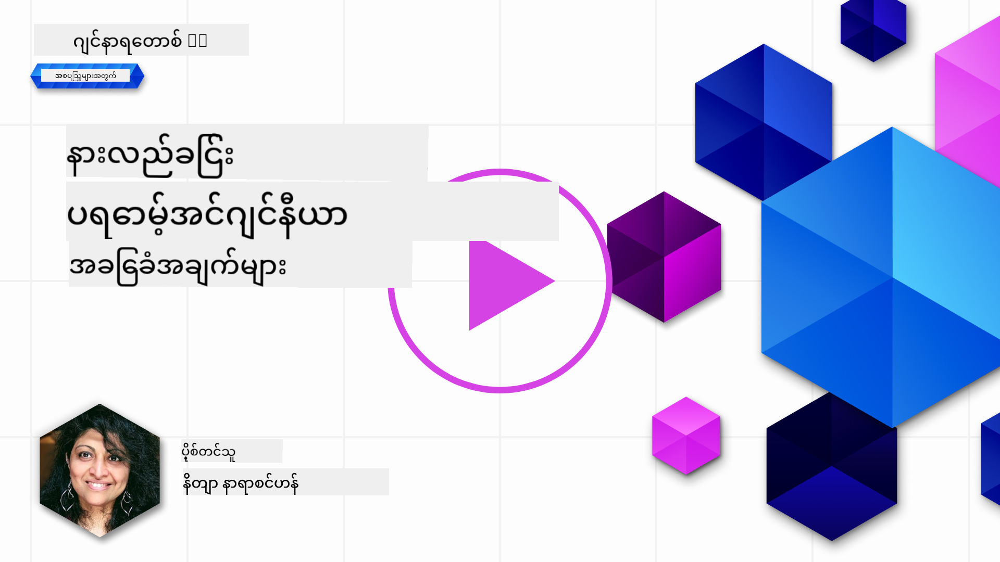

<!--
CO_OP_TRANSLATOR_METADATA:
{
  "original_hash": "dcbaaae026cb50fee071e690685b5843",
  "translation_date": "2025-08-26T19:59:12+00:00",
  "source_file": "04-prompt-engineering-fundamentals/README.md",
  "language_code": "my"
}
-->
# Prompt Engineering အခြေခံ

[](https://aka.ms/gen-ai-lesson4-gh?WT.mc_id=academic-105485-koreyst)

## မိတ်ဆက်

ဒီ module မှာ Generative AI မော်ဒယ်တွေမှာ ထိရောက်တဲ့ prompt တွေ ဖန်တီးဖို့ အရေးကြီးတဲ့ အယူအဆတွေနဲ့ နည်းလမ်းတွေကို လေ့လာသွားမှာပါ။ LLM ကို prompt တစ်ခုရေးပေးတဲ့ နည်းလမ်းကလည်း အရေးကြီးပါတယ်။ သေချာစွာ ပြင်ဆင်ထားတဲ့ prompt တစ်ခုက ပိုမိုကောင်းမွန်တဲ့ အဖြေကို ရရှိစေနိုင်ပါတယ်။ ဒါပေမယ့် _prompt_ နဲ့ _prompt engineering_ ဆိုတာ တကယ်ဘာလဲ? LLM ကို ပိုမိုကောင်းမွန်တဲ့ prompt _input_ ပေးဖို့ ဘယ်လိုလုပ်ရမလဲ? ဒီအခန်းနဲ့ နောက်အခန်းမှာ ဒီမေးခွန်းတွေကို ဖြေရှင်းသွားမှာပါ။

_Generative AI_ ဆိုတာ အသုံးပြုသူတောင်းဆိုချက်အပေါ် မူတည်ပြီး (စာသား၊ ပုံ၊ အသံ၊ ကုဒ်စသည်ဖြင့်) အကြောင်းအမျိုးမျိုးကို အသစ်ဖန်တီးနိုင်တဲ့ နည်းပညာပါ။ ဒါကို OpenAI ရဲ့ GPT ("Generative Pre-trained Transformer") စီးရီးလို _Large Language Models_ တွေသုံးပြီး သဘာဝဘာသာစကားနဲ့ ကုဒ်တွေကို သင်ကြားထားတာပါ။

ယနေ့မှာ အသုံးပြုသူတွေက နည်းပညာအတတ်ပညာမလိုဘဲ chat လိုမျိုး ရိုးရှင်းတဲ့နည်းလမ်းနဲ့ ဒီမော်ဒယ်တွေကို အသုံးပြုနိုင်ပါပြီ။ ဒီမော်ဒယ်တွေက _prompt-based_ ဖြစ်ပြီး အသုံးပြုသူက စာသား input (prompt) တစ်ခု ပေးလိုက်ရင် AI က အဖြေ (completion) ပြန်ပေးပါတယ်။ ပြီးတော့ "AI နဲ့ စကားပြော" လုပ်သလို တစ်ကြိမ်ပြီးတစ်ကြိမ် ပြန်လည်ပြင်ဆင်နိုင်ပါတယ်။ 

"Prompts" တွေက အခု Generative AI app တွေအတွက် အဓိက _programming interface_ ဖြစ်လာပြီး မော်ဒယ်ကို ဘာလုပ်စေချင်လဲ၊ ဘယ်လိုအဖြေမျိုး ပြန်ချင်လဲ ဆိုတာ သတ်မှတ်ပေးပါတယ်။ "Prompt Engineering" ဆိုတာကလည်း prompt တွေကို _ဒီဇိုင်းဆွဲခြင်းနဲ့ တိုးတက်အောင် ပြင်ဆင်ခြင်း_ ကို ဦးတည်တဲ့ အထူးပြုလေ့လာမှုတစ်ခုဖြစ်လာပါတယ်။

## သင်ယူရမယ့် ရည်ရွယ်ချက်များ

ဒီသင်ခန်းစာမှာ Prompt Engineering ဆိုတာဘာလဲ၊ ဘာကြောင့်အရေးကြီးလဲ၊ မော်ဒယ်တစ်ခုနဲ့ app ရည်ရွယ်ချက်အတွက် ပိုထိရောက်တဲ့ prompt တွေ ဘယ်လိုရေးရမလဲ ဆိုတာကို လေ့လာသွားမှာပါ။ Prompt engineering အတွက် အဓိကအယူအဆတွေနဲ့ အကောင်းဆုံးလေ့ကျင့်နည်းတွေကို နားလည်သွားမှာဖြစ်ပြီး၊ Jupyter Notebooks "sandbox" ပတ်ဝန်းကျင်မှာလည်း ဒီအယူအဆတွေကို လက်တွေ့သုံးသပ်နိုင်ပါလိမ့်မယ်။

ဒီသင်ခန်းစာအဆုံးမှာတော့-

1. Prompt engineering ဆိုတာဘာလဲ၊ ဘာကြောင့်အရေးကြီးလဲ ဆိုတာ ရှင်းပြနိုင်မယ်။
2. Prompt တစ်ခုရဲ့ အစိတ်အပိုင်းတွေ ဘာတွေလဲ၊ ဘယ်လိုအသုံးပြုသလဲ ဆိုတာ ရှင်းပြနိုင်မယ်။
3. Prompt engineering အတွက် အကောင်းဆုံးလေ့ကျင့်နည်းနဲ့ နည်းလမ်းတွေကို သင်ယူနိုင်မယ်။
4. သင်ယူထားတဲ့ နည်းလမ်းတွေကို OpenAI endpoint သုံးပြီး လက်တွေ့ ဥပမာတွေနဲ့ အသုံးချနိုင်မယ်။

## အဓိက အသုံးအနှုန်းများ

Prompt Engineering: AI မော်ဒယ်တွေကို မိမိလိုချင်တဲ့ output ကို ထုတ်ပေးအောင် input တွေကို ဒီဇိုင်းဆွဲပြီး ပြင်ဆင်ပေးတဲ့ လုပ်ငန်းစဉ်။
Tokenization: စာသားကို မော်ဒယ်နားလည်နိုင်အောင် token လေးတွေ အဖြစ် ခွဲခြားပြောင်းလဲခြင်း။
Instruction-Tuned LLMs: သတ်မှတ်ထားတဲ့ ညွှန်ကြားချက်တွေနဲ့ ထပ်မံသင်ကြားထားတဲ့ LLM မော်ဒယ်တွေ၊ အဖြေတိကျမှုနဲ့ သက်ဆိုင်မှု ပိုကောင်းစေတယ်။

## သင်ကြားမှု Sandbox

Prompt engineering က ယခုအချိန်မှာ သိပ္ပံထက် အနုပညာပိုင်းပိုများပါတယ်။ ဒီအပေါ် အထောက်အထားကောင်းအောင် လေ့ကျင့်မှုများလုပ်ပြီး၊ လုပ်ကြံကြည့်ကြည့်နည်းနဲ့ domain အတတ်ပညာ၊ အကြံပြုနည်းလမ်းတွေနဲ့ မော်ဒယ်အလိုက် ပြင်ဆင်မှုတွေကို ပေါင်းစပ်သုံးသင့်ပါတယ်။

ဒီသင်ခန်းစာနဲ့ လိုက်ပါလာတဲ့ Jupyter Notebook မှာ သင်သင်ယူသမျှကို _sandbox_ ပတ်ဝန်းကျင်မှာ လက်တွေ့စမ်းသပ်နိုင်ပါတယ်။ လေ့ကျင့်ခန်းတွေကို run လုပ်ဖို့တော့-

1. **Azure OpenAI API key** တစ်ခု - LLM တစ်ခုကို deploy လုပ်ထားတဲ့ service endpoint
2. **Python Runtime** - Notebook ကို run လုပ်နိုင်ဖို့
3. **Local Env Variables** - _[SETUP](./../00-course-setup/02-setup-local.md?WT.mc_id=academic-105485-koreyst) လုပ်ဆောင်ဖို့ လိုအပ်ပါတယ်_

Notebook မှာ _starter_ လေ့ကျင့်ခန်းတွေ ပါလာပေမယ့် မိမိစိတ်ကြိုက် _Markdown_ (ဖော်ပြချက်) နဲ့ _Code_ (prompt requests) အပိုင်းတွေ ထပ်ထည့်ပြီး ပိုမိုစမ်းသပ်နိုင်ပါတယ်။ ဒီလိုလုပ်ခြင်းက prompt ဒီဇိုင်းအပေါ် အထောက်အထားကောင်းစေပါတယ်။

## ပုံဖော်လမ်းညွှန်

ဒီသင်ခန်းစာမှာ ဘာတွေပါဝင်မလဲ၊ အဓိကအချက်တွေ ဘာတွေလဲ ဆိုတာကို အရင်ဆုံး သိချင်ရင် ဒီပုံဖော်လမ်းညွှန်ကို ကြည့်ပါ။ ဒီလမ်းညွှန်မှာ အဓိကအကြောင်းအရာတွေနဲ့ သင်ယူရမယ့် အချက်အလက်တွေကို တစ်ခုချင်းစီအတွက် ဖော်ပြထားပါတယ်။ သင်ခန်းစာ roadmap က အဓိကအယူအဆနဲ့ စိန်ခေါ်မှုတွေကို နားလည်စေပြီး၊ အဲ့ဒီအချက်တွေကို prompt engineering နည်းလမ်းတွေနဲ့ ဖြေရှင်းနိုင်အောင် လမ်းညွှန်ပေးပါတယ်။ "Advanced Techniques" ဆိုတဲ့အပိုင်းကတော့ နောက်အခန်းမှာ ဆက်လက်လေ့လာရမယ့် အကြောင်းအရာတွေပါ။


## ကျွန်ုပ်တို့ရဲ့ စတားတပ်

အခုတော့ _ဒီအကြောင်းအရာ_ က ကျွန်ုပ်တို့ရဲ့ [ပညာရေးအတွက် AI နည်းပညာတိုးတက်မှု](https://educationblog.microsoft.com/2023/06/collaborating-to-bring-ai-innovation-to-education?WT.mc_id=academic-105485-koreyst) ရယူဖို့ စတားတပ်ရဲ့ ရည်ရွယ်ချက်နဲ့ ဘယ်လိုဆက်စပ်လဲ ဆိုတာ ပြောပါစို့။ ကျွန်ုပ်တို့က _ပုဂ္ဂိုလ်ရေးသင်ယူမှု_ အတွက် AI နည်းပညာပါဝင်တဲ့ app တွေ တည်ဆောက်ချင်ပါတယ်။ ဒါကြောင့် app ကို အသုံးပြုမယ့် လူအမျိုးမျိုးက ဘယ်လို prompt တွေ ဒီဇိုင်းဆွဲနိုင်မလဲ ဆိုတာ စဉ်းစားကြည့်ရအောင်-

- **အုပ်ချုပ်သူများ** က AI ကို _သင်ရိုးညွှန်းတမ်းဒေတာတွေကို ချွတ်ယွင်းချက်တွေ ရှာဖွေဖို့_ တောင်းနိုင်ပါတယ်။ AI က အကျဉ်းချုပ်ပေးနိုင်သလို၊ ကုဒ်နဲ့ visual ပြပေးနိုင်ပါတယ်။
- **ဆရာ/ဆရာမများ** က AI ကို _ပစ်မှတ်အုပ်စုနဲ့ ခေါင်းစဉ်အတွက် သင်ခန်းစာအစီအစဉ် တစ်ခု ဖန်တီးပေးပါ_ လို့ တောင်းနိုင်ပါတယ်။ AI က သတ်မှတ်ထားတဲ့ format နဲ့ ပုဂ္ဂိုလ်ရေးသင်ခန်းစာအစီအစဉ် တည်ဆောက်ပေးနိုင်ပါတယ်။
- **ကျောင်းသား/သူများ** က AI ကို _ခက်ခဲတဲ့ဘာသာရပ်မှာ သင်ကြားပေးပါ_ လို့ တောင်းနိုင်ပါတယ်။ AI ကတော့ သူတို့အဆင့်အလိုက် သင်ခန်းစာ၊ အကြံပြုချက်၊ ဥပမာတွေ ပေးနိုင်ပါပြီ။

ဒါကတော့ အစိတ်အပိုင်းတစ်ခုသာပါ။ [Prompts For Education](https://github.com/microsoft/prompts-for-edu/tree/main?WT.mc_id=academic-105485-koreyst) ကိုလည်း ကြည့်ပါ - ပညာရေးအထူးပြုသူတွေ စုစည်းထားတဲ့ open-source prompts library တစ်ခုပါ။ _အဲ့ဒီ prompt တွေကို sandbox မှာ သို့မဟုတ် OpenAI Playground မှာ run ကြည့်ပြီး ဘာဖြစ်လာလဲ စမ်းသပ်ကြည့်ပါ!_

## Prompt Engineering ဆိုတာဘာလဲ?

ဒီသင်ခန်းစာအစမှာ **Prompt Engineering** ကို _တစ်ခုတည်းသော app ရည်ရွယ်ချက်နဲ့ မော်ဒယ်အတွက် တည်ငြိမ်ပြီး အရည်အသွေးမြင့်တဲ့ အဖြေ (completion) တွေ ရရှိအောင် စာသား input (prompt) တွေကို ဒီဇိုင်းဆွဲခြင်းနဲ့ တိုးတက်အောင် ပြင်ဆင်ခြင်း_ လုပ်ငန်းစဉ်အဖြစ် သတ်မှတ်ခဲ့ပါတယ်။ ဒါကို ၂ ချက်ခွဲစဉ်းစားနိုင်ပါတယ်-

- သတ်မှတ်ထားတဲ့ မော်ဒယ်နဲ့ ရည်ရွယ်ချက်အတွက် _အစ prompt ကို ဒီဇိုင်းဆွဲခြင်း_
- အဖြေ quality ပိုကောင်းအောင် _prompt ကို တစ်ကြိမ်ပြီးတစ်ကြိမ် ပြင်ဆင်ခြင်း_

ဒါကတော့ trial-and-error နည်းနဲ့ အသုံးပြုသူရဲ့ အတွေးအမြင်နဲ့ ကြိုးစားမှုလိုအပ်တဲ့ လုပ်ငန်းစဉ်ပါ။ ဒါဆို ဘာကြောင့် အရေးကြီးတာလဲ? ဒီမေးခွန်းကို ဖြေဖို့ အရင်ဆုံး အောက်ပါ သုံးခုကို နားလည်ရပါမယ်-

- _Tokenization_ = မော်ဒယ်က prompt ကို "မြင်" နည်း
- _Base LLMs_ = foundation model က prompt ကို "လုပ်ဆောင်" နည်း
- _Instruction-Tuned LLMs_ = မော်ဒယ်က "task" တွေကို "မြင်" နိုင်လာပုံ

### Tokenization

LLM တစ်ခုက prompt ကို _token တွေရဲ့ အစဉ်လိုက်_ မြင်ပါတယ်။ မော်ဒယ်အမျိုးမျိုး (သို့မဟုတ် မော်ဒယ် version မတူတာ) က prompt တစ်ခုကို token ခွဲနည်း မတူနိုင်ပါတယ်။ LLM တွေက token တွေပေါ်မှာပဲ သင်ကြားထားတာမို့ prompt ကို ဘယ်လို tokenize လုပ်သလဲဆိုတာက ပြန်ထုတ်တဲ့ အဖြေ quality ကို တိုက်ရိုက် သက်ရောက်ပါတယ်။

Tokenization ဘယ်လိုအလုပ်လုပ်လဲဆိုတာ သိချင်ရင် [OpenAI Tokenizer](https://platform.openai.com/tokenizer?WT.mc_id=academic-105485-koreyst) လို tool တွေကို သုံးကြည့်ပါ။ မိမိရဲ့ prompt ကို ကူးထည့်ပြီး ဘယ်လို token တွေဖြစ်သွားလဲ၊ whitespace နဲ့ punctuation တွေကို ဘယ်လိုကိုင်တွယ်သလဲ ကြည့်ပါ။ ဥပမာမှာ GPT-3 လို အဟောင်းမော်ဒယ်ကို ပြထားတာမို့ မော်ဒယ်အသစ်နဲ့ စမ်းကြည့်ရင် အနည်းငယ်ကွာခြားနိုင်ပါတယ်။


### အယူအဆ - Foundation Models

Prompt ကို tokenize လုပ်ပြီးရင် ["Base LLM"](https://blog.gopenai.com/an-introduction-to-base-and-instruction-tuned-large-language-models-8de102c785a6?WT.mc_id=academic-105485-koreyst) (သို့မဟုတ် Foundation model) ရဲ့ အဓိကလုပ်ဆောင်ချက်က အဲ့ဒီ token အစဉ်ထဲမှာ နောက်ထပ် token ကို ခန့်မှန်းထုတ်ပေးတာပါ။ LLM တွေက စာသား dataset ကြီးကြီးတွေကို သင်ကြားထားတာမို့ token တွေကြား အဆက်အသွယ်ကို ကောင်းကောင်းသိပြီး ခန့်မှန်းနိုင်ပါတယ်။ ဒါပေမယ့် သူတို့က prompt ထဲက စကားလုံးတွေကို အဓိပ္ပါယ်နားမလည်ပါဘူး၊ pattern တွေကိုပဲ "ပြီးမြောက်" အောင် ခန့်မှန်းထုတ်ပေးတာပါ။ User ရပ်တန့်မချင်း သို့မဟုတ် သတ်မှတ်ထားတဲ့ အခြေအနေတစ်ခုဖြစ်လာမချင်း နောက်ထပ် token တွေ ခန့်မှန်းထုတ်ပေးနိုင်ပါတယ်။

Prompt-based completion ဘယ်လိုအလုပ်လုပ်လဲ ကြည့်ချင်ရင် Azure OpenAI Studio ရဲ့ [_Chat Playground_](https://oai.azure.com/playground?WT.mc_id=academic-105485-koreyst) မှာ အထက်ပါ prompt ကို default setting နဲ့ ထည့်ကြည့်ပါ။ System က prompt ကို အချက်အလက်တောင်းဆိုချက်အနေနဲ့ ကိုင်တွယ်ထားလို့ အဲ့ဒီ context ကို ဖြည့်ဆည်းတဲ့ completion တစ်ခုကို မြင်ရပါလိမ့်မယ်။

ဒါပေမယ့် user က သတ်မှတ်ထားတဲ့ criteria သို့မဟုတ် task ရည်ရွယ်ချက်နဲ့ ကိုက်ညီတဲ့ အဖြေတစ်ခုလိုချင်ရင်တော့ _instruction-tuned_ LLMs တွေလိုအပ်လာပါတယ်။


### အယူအဆ - Instruction Tuned LLMs

[Instruction Tuned LLM](https://blog.gopenai.com/an-introduction-to-base-and-instruction-tuned-large-language-models-8de102c785a6?WT.mc_id=academic-105485-koreyst) တစ်ခုက foundation model ကို အခြေခံပြီး ဥပမာတွေ သို့မဟုတ် input/output pair (ဥပမာ- multi-turn "messages") တွေနဲ့ ထပ်မံသင်ကြားထားပါတယ်။ ဒီမှာတော့ ညွှန်ကြားချက်တွေ ပါဝင်နိုင်ပြီး AI က အဲ့ဒီညွှန်ကြားချက်ကို လိုက်နာဖို့ ကြိုးစားပါတယ်။

ဒါကို Reinforcement Learning with Human Feedback (RLHF) လို နည်းလမ်းတွေသုံးပြီး မော်ဒယ်ကို _ညွှန်ကြားချက်လိုက်နာခြင်း_ နဲ့ _တုံ့ပြန်ချက်မှ သင်ယူခြင်း_ လုပ်နိုင်အောင် သင်ကြားပါတယ်။ ဒါကြောင့် practical application တွေမှာ ပိုသင့်တော်တဲ့၊ အသုံးပြုသူရဲ့ ရည်ရွယ်ချက်နဲ့ ပိုသက်ဆိုင်တဲ့ အဖြေတွေ ထုတ်ပေးနိုင်ပါတယ်။

စမ်းကြည့်ကြည့်ရအောင် - အထက်ပါ prompt ကို ပြန်သုံးပြီး _system message_ ကို အောက်ပါ instruction နဲ့ ပြောင်းပေးပါ-

> _ပေးထားတဲ့ အကြောင်းအရာကို ဒုတိယတန်းကျောင်းသားအတွက် အကျဉ်းချုပ်ရေးပါ။ အကြောင်းအရာကို စာပိုဒ်တစ်ခုနဲ့ bullet point ၃-၅ ခုထဲမှာ ထည့်ပါ။_

အခုတော့ အဖြေက မိမိလိုချင်တဲ့ ရည်ရွယ်ချက်နဲ့ format ကို ပိုသက်ဆိုင်လာတာ မြင်ရပါလိမ့်မယ်။ ဆရာ/ဆရာမတစ်ယောက်က ဒီအဖြေကို သူ့ရဲ့ slides မှာ တိုက်ရိုက်သုံးနိုင်ပါပြီ။


## ဘာကြောင့် Prompt Engineering လိုအပ်တာလဲ?

Prompt တွေကို LLM တွေ ဘယ်လို process လုပ်တယ်ဆိုတာ သိပြီးပြီဆိုရင် _ဘာကြောင့်_ prompt engineering လိုအပ်သလဲ ဆိုတာ ပြောပါစို့။ အကြောင်းကတော့ ယနေ့ LLM တွေမှာ _တည်င
> **Prompt:** ၂၀၇၆ ခုနှစ် မာစီယန်စစ်ပွဲအကြောင်း သင်ခန်းစာအစီအစဉ် တစ်ခုရေးပါ။

# ၂၀၇၆ ခုနှစ် မာစီယန်စစ်ပွဲ သင်ခန်းစာအစီအစဉ်

## သင်ခန်းစာရည်ရွယ်ချက်
- မာစီယန်စစ်ပွဲဖြစ်ပွားရခြင်းရင်းမြစ်များကို နားလည်စေခြင်း
- စစ်ပွဲအတွင်း ဖြစ်ပေါ်ခဲ့သော နည်းပညာအသစ်များ၊ မဟာဗျူဟာများကို လေ့လာခြင်း
- စစ်ပွဲအပြီး လူ့အဖွဲ့အစည်းအပေါ် သက်ရောက်မှုများကို ဆန်းစစ်ခြင်း

## သင်ခန်းစာအကြောင်းအရာ

### ၁။ မာစီယန်စစ်ပွဲအကြောင်း အကျဉ်းချုပ်
- ၂၀၇၆ ခုနှစ်တွင် မာစီယန်စစ်ပွဲ ဘယ်လိုစတင်ခဲ့သလဲ
- Earth နဲ့ Mars ကြား အဓိကအကြောင်းရင်းများ

### ၂။ စစ်ပွဲအတွင်း နည်းပညာအသစ်များ
- AI စစ်တပ်များ၊ ဒြပ်စင်လှုပ်ရှားမှုနည်းပညာ
- စစ်ပွဲအတွင်း အသုံးပြုခဲ့သော နည်းပညာများ

### ၃။ မဟာဗျူဟာများနှင့် စစ်တပ်ခေါင်းဆောင်မှု
- Earth နဲ့ Mars တို့ရဲ့ စစ်ဗျူဟာများ
- ခေါင်းဆောင်များ၏ ဆုံးဖြတ်ချက်များ

### ၄။ လူ့အဖွဲ့အစည်းအပေါ် သက်ရောက်မှု
- စစ်ပွဲကြောင့် လူ့ဘောင်အပေါ် ဖြစ်ပေါ်လာသော ပြောင်းလဲမှုများ
- စစ်ပြီးနောက် ပြန်လည်ထူထောင်ရေး

## လုပ်ငန်းစဉ်များ

- မာစီယန်စစ်ပွဲအကြောင်း သုတေသနလုပ်ခြင်း
- အုပ်စုလိုက် ဆွေးနွေးပွဲများ
- စစ်ပွဲအတွင်း အသုံးပြုခဲ့သော နည်းပညာများကို ပုံဆွဲခြင်း
- စစ်ပြီးနောက် လူ့ဘောင်အပေါ် သက်ရောက်မှုများကို ဆန်းစစ်ရေးသားခြင်း

## သင်ခန်းစာအဆုံးတွင် မေးခွန်းများ

1. မာစီယန်စစ်ပွဲဖြစ်ပွားရခြင်းရင်းမြစ်များကို ရှင်းပြပါ။
2. စစ်ပွဲအတွင်း အသုံးပြုခဲ့သော နည်းပညာအသစ်များကို နမူနာပေးပါ။
3. စစ်ပွဲအပြီး လူ့အဖွဲ့အစည်းအပေါ် ဘယ်လိုသက်ရောက်မှုများရှိခဲ့သလဲ။

## အရင်းအမြစ်များ
- ၂၀၇၆ Martian War Chronicles (စာအုပ်)
- Martian War Documentary (ဗီဒီယို)
- www.martianwar2076.com (ဝက်ဘ်ဆိုက်)
ဝက်ဘ်ရှာဖွေမှုအရ မာစီယန်စစ်ပွဲနဲ့ပတ်သက်တဲ့ စိတ်ကူးယဉ်အကောင်အထည်ဖော်ထားတဲ့အကြောင်းအရာတွေ (ဥပမာ - ရုပ်သံဇာတ်လမ်းတွဲ၊ စာအုပ်တွေ) ရှိပေမယ့် ၂၀၇၆ ခုနှစ်မှာတော့ မရှိပါဘူး။ သဘောတရားအရလည်း ၂၀၇၆ ခုနှစ်က အနာဂတ်ဖြစ်တာကြောင့် တကယ်ဖြစ်ပွားခဲ့တဲ့အဖြစ်အပျက်တစ်ခုနဲ့ ချိတ်ဆက်နိုင်မယ့်အခြေအနေမရှိပါဘူး။

ဒါဆိုရင် ဒီပရောမ့်ကို LLM ပံ့ပိုးသူအမျိုးမျိုးနဲ့ run လုပ်ကြည့်ရင် ဘာတွေဖြစ်လာမလဲ?

> **Response 1**: OpenAI Playground (GPT-35)


> **Response 2**: Azure OpenAI Playground (GPT-35)


> **Response 3**: : Hugging Face Chat Playground (LLama-2)


မျှော်လင့်ထားသလိုပဲ၊ မော်ဒယ်တစ်ခုချင်းစီ (သို့မဟုတ် မော်ဒယ်ဗားရှင်း) မှာ stochastic လုပ်ဆောင်မှုနဲ့ မော်ဒယ်စွမ်းရည်ကွာခြားမှုကြောင့် အနည်းငယ်ကွဲပြားတဲ့အဖြေတွေထုတ်ပေးပါတယ်။ ဥပမာတစ်ခုအနေနဲ့ မော်ဒယ်တစ်ခုက ၈ တန်းကျောင်းသားတွေအတွက် ရည်ရွယ်ထားသလို၊ တစ်ခုကတော့ အထက်တန်းကျောင်းသားအနေနဲ့ယူဆထားပါတယ်။ ဒါပေမယ့် မော်ဒယ်သုံးခုလုံးက တကယ်မသိတဲ့အသုံးပြုသူတစ်ယောက်ကို ဒီဖြစ်ရပ်က တကယ်ဖြစ်ခဲ့တယ်လို့ ယုံကြည်စေမယ့်အဖြေတွေထုတ်ပေးနိုင်ပါတယ်။

_metaprompting_ နဲ့ _temperature configuration_ လို prompt engineering နည်းလမ်းတွေက မော်ဒယ်အနုမြူအဖြစ်အပျက်တွေကို တစ်စိတ်တစ်ပိုင်းလောက် လျှော့ချနိုင်ပါတယ်။ အသစ်ထွက်လာတဲ့ prompt engineering _architectures_ တွေမှာလည်း နောက်ထပ်ကိရိယာနဲ့နည်းလမ်းအသစ်တွေကို prompt flow ထဲမှာ ချောချောမွေ့မွေ့ ထည့်သွင်းအသုံးပြုနိုင်အောင် ဖန်တီးထားပါတယ်။

## Case Study: GitHub Copilot

ဒီအပိုင်းကို နောက်ဆုံးသတ်မှတ်ဖို့ အနာဂတ်မှာ prompt engineering ကို တကယ်အသုံးချထားတဲ့ နမူနာတစ်ခုကို ကြည့်ပြီး နားလည်သဘောပေါက်စေချင်ပါတယ်။ ဒါကတော့ [GitHub Copilot](https://github.com/features/copilot?WT.mc_id=academic-105485-koreyst) ဖြစ်ပါတယ်။

GitHub Copilot က သင့်ရဲ့ "AI Pair Programmer" ဖြစ်ပြီး - စာသားပုံစံနဲ့ပေးတဲ့ prompt ကို ကုဒ်အဖြစ် ပြောင်းပေးနိုင်ပါတယ်။ ဒါ့အပြင် သင့်ရဲ့ development environment (ဥပမာ Visual Studio Code) ထဲမှာ တစ်ပြိုင်နက်တည်း ပေါင်းစပ်အသုံးပြုနိုင်လို့ အသုံးပြုသူအတွက် အဆင်ပြေဆုံးအတွေ့အကြုံရရှိစေပါတယ်။ အောက်မှာဖော်ပြထားတဲ့ ဘလော့ဂ်စီးရီးတွေမှာ ဖော်ပြထားသလို၊ အစောပိုင်းဗားရှင်းက OpenAI Codex မော်ဒယ်ကို အခြေခံထားပြီး၊ အင်ဂျင်နီယာတွေက မော်ဒယ်ကို fine-tune လုပ်ဖို့နဲ့ ပိုမိုကောင်းမွန်တဲ့ prompt engineering နည်းလမ်းတွေ ဖန်တီးဖို့ လိုအပ်ကြောင်း မြန်မြန်ဆန်ဆန် သိရှိလာကြပါတယ်။ ဒီလိုနဲ့ ဇူလိုင်လမှာ [Codex ထက် ပိုမိုတိုးတက်တဲ့ AI မော်ဒယ်အသစ်](https://github.blog/2023-07-28-smarter-more-efficient-coding-github-copilot-goes-beyond-codex-with-improved-ai-model/?WT.mc_id=academic-105485-koreyst) ကို မိတ်ဆက်ခဲ့ပြီး ပိုမြန်မြန်ဆန်ဆန် အကြံပြုချက်တွေ ထုတ်ပေးနိုင်လာပါတယ်။

သူတို့ရဲ့ သင်ယူမှုခရီးကို နားလည်ဖို့ အောက်ပါပို့စ်တွေကို အစဉ်လိုက်ဖတ်ကြည့်ပါ။

- **May 2023** | [GitHub Copilot က သင့်ကုဒ်ကို ပိုမိုနားလည်လာပြီ](https://github.blog/2023-05-17-how-github-copilot-is-getting-better-at-understanding-your-code/?WT.mc_id=academic-105485-koreyst)
- **May 2023** | [GitHub အတွင်း: GitHub Copilot နောက်က LLMs တွေနဲ့ အလုပ်လုပ်ခြင်း](https://github.blog/2023-05-17-inside-github-working-with-the-llms-behind-github-copilot/?WT.mc_id=academic-105485-koreyst)
- **Jun 2023** | [GitHub Copilot အတွက် ပိုကောင်းတဲ့ prompt တွေ ဘယ်လိုရေးမလဲ](https://github.blog/2023-06-20-how-to-write-better-prompts-for-github-copilot/?WT.mc_id=academic-105485-koreyst)
- **Jul 2023** | [.. GitHub Copilot က တိုးတက်လာတဲ့ AI မော်ဒယ်နဲ့ Codex ထက်ကျော်လွန်လာပြီ](https://github.blog/2023-07-28-smarter-more-efficient-coding-github-copilot-goes-beyond-codex-with-improved-ai-model/?WT.mc_id=academic-105485-koreyst)
- **Jul 2023** | [Developer များအတွက် Prompt Engineering နဲ့ LLMs လမ်းညွှန်](https://github.blog/2023-07-17-prompt-engineering-guide-generative-ai-llms/?WT.mc_id=academic-105485-koreyst)
- **Sep 2023** | [Enterprise LLM app တစ်ခု ဘယ်လိုတည်ဆောက်မလဲ: GitHub Copilot မှ သင်ခန်းစာများ](https://github.blog/2023-09-06-how-to-build-an-enterprise-llm-application-lessons-from-github-copilot/?WT.mc_id=academic-105485-koreyst)

ဒါ့အပြင် သူတို့ရဲ့ [Engineering blog](https://github.blog/category/engineering/?WT.mc_id=academic-105485-koreyst) ကိုလည်း သွားလေ့လာနိုင်ပါတယ်။ ဥပမာ [ဒီပို့စ်](https://github.blog/2023-09-27-how-i-used-github-copilot-chat-to-build-a-reactjs-gallery-prototype/?WT.mc_id=academic-105485-koreyst) ကဲ့သို့ မော်ဒယ်နဲ့နည်းလမ်းတွေကို တကယ်အသုံးချပြီး အလုပ်လုပ်သည့်နည်းလမ်းတွေကို ဖော်ပြထားပါတယ်။

---

## Prompt Construction

Prompt engineering ဘာကြောင့်အရေးကြီးသလဲဆိုတာ မြင်တွေ့ပြီးပြီ - အခုတော့ prompt တွေကို ဘယ်လို _တည်ဆောက်_ တာလဲဆိုတာ နားလည်ကြည့်ရအောင်။ ဒါကြောင့် ပိုထိရောက်တဲ့ prompt design နည်းလမ်းမျိုးစုံကို တိုင်းတာနိုင်ပါလိမ့်မယ်။

### Basic Prompt

အရင်ဆုံး အခြေခံ prompt နဲ့ စတင်ကြရအောင် - မည်သည့် context မှမပါဘဲ မော်ဒယ်ကို တိုက်ရိုက်ပေးတဲ့ စာသား input တစ်ခုပါ။ ဥပမာအနေနဲ့ - အမေရိကန်အမျိုးသားသံတေးရဲ့ ပထမဆုံးစကားလုံးအနည်းငယ်ကို OpenAI [Completion API](https://platform.openai.com/docs/api-reference/completions?WT.mc_id=academic-105485-koreyst) ကို ပေးပို့လိုက်ရင် မော်ဒယ်က ခန့်မှန်းမှုအခြေခံပြီး နောက်ထပ်စာကြောင်းတွေကို ချက်ချင်း ဖြည့်ပေးပါတယ်။

| Prompt (Input)     | Completion (Output)                                                                                                                        |
| :----------------- | :----------------------------------------------------------------------------------------------------------------------------------------- |
| Oh say can you see | သင် "The Star-Spangled Banner" ဆိုတဲ့ အမေရိကန်အမျိုးသားသံတေးစာသားကို စတင်ရေးသားနေသလိုပဲ။ အပြည့်အစုံစာသားက ... |

### Complex Prompt

အခုတော့ အခြေခံ prompt ထဲကို context နဲ့ ညွှန်ကြားချက်တွေ ထပ်ထည့်ကြည့်ရအောင်။ [Chat Completion API](https://learn.microsoft.com/azure/ai-services/openai/how-to/chatgpt?WT.mc_id=academic-105485-koreyst) က prompt တစ်ခုကို _messages_ အဖြစ် စုစည်းပေးနိုင်ပါတယ်။

- Input/output pair တွေက _user_ input နဲ့ _assistant_ response ကို ကိုယ်စားပြုပါတယ်။
- System message က assistant ရဲ့ အပြုအမူ သို့မဟုတ် ကိုယ်ရည်ကိုယ်သွေးအတွက် context ကို သတ်မှတ်ပေးပါတယ်။

Request က အောက်ပါပုံစံအတိုင်း ဖြစ်လာပြီး၊ _tokenization_ က context နဲ့ စကားပြောမှုထဲက သက်ဆိုင်ရာအချက်အလက်တွေကို ထိရောက်စွာ ဖမ်းယူပေးပါတယ်။ အခုတော့ system context ကို ပြောင်းလဲတာက user input ပြောင်းတာနဲ့ တူညီအောင် completion quality ကို သက်ရောက်စေနိုင်ပါပြီ။

```python
response = openai.chat.completions.create(
    model="gpt-3.5-turbo",
    messages=[
        {"role": "system", "content": "You are a helpful assistant."},
        {"role": "user", "content": "Who won the world series in 2020?"},
        {"role": "assistant", "content": "The Los Angeles Dodgers won the World Series in 2020."},
        {"role": "user", "content": "Where was it played?"}
    ]
)
```

### Instruction Prompt

အထက်ပါဥပမာတွေမှာ user prompt က သတင်းအချက်အလက်တောင်းဆိုတဲ့ ရိုးရှင်းတဲ့ စာသားတစ်ခုပါ။ _Instruction_ prompt တွေမှာတော့ AI ကို ပိုမိုတိကျတဲ့ လုပ်ဆောင်ရမယ့်အလုပ်ကို ညွှန်ကြားနိုင်အောင် စာသားနဲ့ဖော်ပြနိုင်ပါတယ်။ ဥပမာတစ်ခုကတော့ -

| Prompt (Input)                                                                                                                                                                                                                         | Completion (Output)                                                                                                        | Instruction Type    |
| :------------------------------------------------------------------------------------------------------------------------------------------------------------------------------------------------------------------------------------- | :------------------------------------------------------------------------------------------------------------------------- | :------------------ |
| Write a description of the Civil War                                                                                                                                                                                                   | _ရိုးရှင်းတဲ့စာပိုဒ်တစ်ခု ပြန်ပေးသည်_                                                                                   | ရိုးရှင်းသော         |
| Write a description of the Civil War. Provide key dates and events and describe their significance                                                                                                                                     | _စာပိုဒ်တစ်ခုနောက်မှာ အရေးကြီးတဲ့နေ့ရက်နဲ့ဖြစ်ရပ်စာရင်းကို ဖော်ပြပေးသည်_                                               | စုစုပေါင်း           |
| Write a description of the Civil War in 1 paragraph. Provide 3 bullet points with key dates and their significance. Provide 3 more bullet points with key historical figures and their contributions. Return the output as a JSON file | _ပိုမိုအသေးစိတ်အချက်အလက်များကို JSON format နဲ့ ပြန်ပေးသည်၊ ဖိုင်ထဲသို့ copy-paste လုပ်နိုင်သည်_                          | စုစုပေါင်း၊ format ပါ |

## Primary Content

အထက်ပါဥပမာတွေမှာ prompt က အတော်လေး ဖွင့်လှစ်ထားတာမို့ LLM က သူ့ရဲ့ pre-trained dataset ထဲက ဘာတွေသက်ဆိုင်လဲဆိုတာ ကိုယ်တိုင်ဆုံးဖြတ်နိုင်ပါတယ်။ _Primary content_ design pattern မှာတော့ input text ကို အပိုင်းနှစ်ပိုင်းခွဲပါတယ် -

- instruction (လုပ်ဆောင်ချက်)
- သက်ဆိုင်ရာအကြောင်းအရာ (လုပ်ဆောင်ချက်ကို သက်ရောက်စေမယ့်အကြောင်းအရာ)

ဥပမာတစ်ခုက "ဒီအကြောင်းအရာကို စာကြောင်း ၂ ကြောင်းနဲ့ အကျဉ်းချုပ်ရေးပါ" ဆိုတဲ့ instruction ပါ။

| Prompt (Input)                                                                                                                                                                                                                                                                                                                                                                                                                                                                                                                                                                                                                                                                                      | Completion (Output)                                                                                                                                                                                                                                                                             |
| :-------------------------------------------------------------------------------------------------------------------------------------------------------------------------------------------------------------------------------------------------------------------------------------------------------------------------------------------------------------------------------------------------------------------------------------------------------------------------------------------------------------------------------------------------------------------------------------------------------------------------------------------------------------------------------------------------- | :---------------------------------------------------------------------------------------------------------------------------------------------------------------------------------------------------------------------------------------------------------------------------------------------- |
| Jupiter is the fifth planet from the Sun and the largest in the Solar System. It is a gas giant with a mass one-thousandth that of the Sun, but two-and-a-half times that of all the other planets in the Solar System combined. Jupiter is one of the brightest objects visible to the naked eye in the night sky, and has been known to ancient civilizations since before recorded history. It is named after the Roman god Jupiter.[19] When viewed from Earth, Jupiter can be bright enough for its reflected light to cast visible shadows,[20] and is on average the third-brightest natural object in the night sky after the Moon and Venus. <br/> **Summarize this in 2 short sentences** | Jupiter သည် နေရဲ့ ငါးမြောက်ဂြိုဟ်ဖြစ်ပြီး နေရဲ့စနစ်ထဲမှာ အကြီးဆုံးဖြစ်သည်။ ဗဟုသုတအရ တောင်သူကြီး Jupiter ၏နာမည်ကို ယူထားပြီး၊ အခြားဂြိုဟ်အားလုံးပေါင်းထက် နှစ်ဆခွဲခန့် ပိုလေးသည်။ |

Primary content segment ကို ပိုထိရောက်တဲ့ instruction တွေ ပေးဖို့ နည်းလမ်းအမျိုးမျိုးနဲ့ အသုံးချနိုင်ပါတယ် -

- **ဥပမာများ** - မော်ဒယ်ကို တိုက်ရိုက်ညွှန်ကြားမယ့်အစား လုပ်ဆောင်ရမယ့်အလုပ်နမူနာတွေ ပေးပြီး pattern ကို ကိုယ်တိုင် ချုပ်ဆွဲစေပါ။
- **Cue များ** - instruction နောက်မှာ "cue" တစ်ခု ထည့်ပေးပြီး မော်ဒယ်ကို သက်ဆိုင်ရာအဖြေဘက်ကို ဦးတည်စေပါ။
- **Template များ** - prompt တွေအတွက် variable (placeholder) ပါတဲ့ recipe အနေနဲ့ အသုံးပြုနိုင်ပြီး၊ သီးသန့် use case များအတွက် data ဖြည့်သွင်းနိုင်ပါတယ်။

အခုနည်းလမ်းတွေကို လက်တွေ့ကြည့်ကြရအောင်။

### Using Examples

ဒီနည်းလမ်းက primary content ထဲမှာ လုပ်ဆောင်ရမယ့်အလုပ်နမူနာတွေ ထည့်ပေးပြီး မော်ဒယ်ကို pattern ကို ကိုယ်တိုင် ချုပ်ဆွဲစေပါတယ်။ ပေးတဲ့ဥပမာအရေအတွက်ပေါ်မူတည်ပြီး zero-shot prompting, one-shot prompting, few-shot prompting စသဖြင့် ခွဲခြားနိုင်ပါတယ်။

Prompt မှာ အောက်ပါအချက် ၃ ချက်ပါဝင်ပါတယ် -

- Task ကိုဖော်ပြခြင်း
- လိုချင်တဲ့ output နမူနာအနည်းငယ်
- နမူနာအသစ်တစ်ခုစတင်ခြင်း (ဒါက implicit task description ဖြစ်လာတယ်)

| Learning Type | Prompt (Input)                                                                                                                                        | Completion (Output)         |
| :------------ | :---------------------------------------------------------------------------------------------------------------------------------------------------- | :-------------------------- |
| Zero-shot     | "The Sun is Shining". Translate to Spanish                                                                                                            | "El Sol está brillando".    |
| One-shot      | "The Sun is Shining" => ""El Sol está brillando". <br> "It's a Cold and Windy Day" =>                                                                 | "Es un día frío y ventoso". |
| Few-shot      | The player ran the bases => Baseball <br/> The player hit an ace => Tennis <br/> The player hit a six => Cricket <br/> The player made a slam-dunk => | Basketball                  |
|               |                                                                                                                                                       |                             |

Zero-shot prompting မှာ "Translate to Spanish" ဆိုတဲ့ explicit instruction ပေးရတာကို သတိထားကြည့်ပါ၊ ဒါပေမယ့် one-shot prompting မှာတော့ မော်ဒယ်က ကိုယ်တိုင် ချုပ်ဆွဲနိုင်ပါတယ်။ Few-shot example မှာတော့ ဥပမာများ ပိုထည့်ပေးတာနဲ့ မော်ဒယ်က ပိုတိကျတဲ့အဖြေထုတ်နိုင်ပါတယ်။

### Prompt Cues

Primary content ကို အသုံးချတဲ့ နောက်ထပ်နည်းလမ်းတစ်ခုက _cue_ တွေ ပေးခြင်းပါ။ ဒီအခါမှာတော့ မော်ဒယ်ကို လိုချင်တဲ့ output format ကို စတင်ပေးပြီး၊ မော်ဒယ်က အဲ့ဒီ cue ကို ဆက်လက်ရေးသားသွားစေပါတယ်။

| Number of Cues | Prompt (Input)                                                                                                                                                                                                                                                                                                                                                                                                                                               | Completion (Output)                                                                                                                                                                                                                                                                                       |
| :------------- | :----------------------------------------------------------------------------------------------------------------------------------------------------------------------------------------------------------------------------------------------------------------------------------------------------------------------------------------------------------------------------------------------------------------------------------------------------------- | :-------------------------------------------------------------------------------------------------------------------------------------------------------------------------------------------------------------------------------------------------------------------------------------------------------- |
| 0              | Jupiter is the fifth planet from the Sun and the largest in the Solar System. It is a gas giant with a mass one-thousandth that of the Sun, but two-and-a-half times that of all the other planets in the Solar System combined. Jupiter is one of the brightest objects visible to the naked eye in the night sky, and has been known to ancient civilizations since before recorded history.

**အကျဉ်းချုပ်ရေးပါ**                                       | Jupiter သည် နေရောင်ခြည်မှ ငါးခုမြောက်ဂြိုဟ်ဖြစ်ပြီး နေရောင်ခြည်စနစ်အတွင်း အကြီးဆုံးဂြိုဟ်လည်းဖြစ်သည်။ ၎င်းသည် ဓာတ်ငွေ့ကြီးဂြိုဟ်တစ်လုံးဖြစ်ပြီး ၎င်း၏အလေးချိန်သည် နေရောင်ခြည်၏ ၁/၁၀၀၀ သာရှိသော်လည်း အခြားဂြိုဟ်အားလုံးပေါင်းထက် ပိုလေးသည်။ ရှေးအခေတ် လူ့အဖွဲ့အစည်းများက Jupiter ကို အကြာကြီးကတည်းက သိကြပြီး ညအချိန်ကောင်းကင်တွင်လည်း လွယ်လင့်တကူမြင်နိုင်သည်။ |
| 1              | Jupiter သည် နေရောင်ခြည်မှ ငါးခုမြောက်ဂြိုဟ်ဖြစ်ပြီး နေရောင်ခြည်စနစ်အတွင်း အကြီးဆုံးဂြိုဟ်လည်းဖြစ်သည်။ ၎င်းသည် ဓာတ်ငွေ့ကြီးဂြိုဟ်တစ်လုံးဖြစ်ပြီး ၎င်း၏အလေးချိန်သည် နေရောင်ခြည်၏ ၁/၁၀၀၀ သာရှိသော်လည်း နေရောင်ခြည်စနစ်အတွင်းရှိ အခြားဂြိုဟ်အားလုံးပေါင်းထက် နှစ်ဆခွဲလောက် ပိုလေးသည်။ Jupiter သည် ညအချိန်ကောင်းကင်တွင် မျက်စိဖြင့်တောင် မြင်နိုင်သော အလင်းအိမ်အနက် တစ်ခုဖြစ်ပြီး ရှေးအခေတ် လူ့အဖွဲ့အစည်းများက မှတ်တမ်းတင်မီကတည်းက သိကြသည်။ <br/>**အကျဉ်းချုပ်ရေးပါ** <br/> ကျွန်ုပ်တို့သိရှိလာတာက Jupiter သည် နေရောင်ခြည်မှ ငါးခုမြောက်ဂြိုဟ်ဖြစ်ပြီး နေရောင်ခြည်စနစ်အတွင်း အကြီးဆုံးဂြိုဟ်ဖြစ်သည်။ ၎င်းသည် ဓာတ်ငွေ့ကြီးဂြိုဟ်တစ်လုံးဖြစ်ပြီး ၎င်း၏အလေးချိန်သည် နေရောင်ခြည်၏ ၁/၁၀၀၀ သာရှိသော်လည်း အခြားဂြိုဟ်အားလုံးပေါင်းထက် နှစ်ဆခွဲလောက် ပိုလေးသည်။ မျက်စိဖြင့်လည်း လွယ်လင့်တကူမြင်နိုင်ပြီး ရှေးအခေတ်ကတည်းက သိကြသည်။                        |
| 2              | Jupiter သည် နေရောင်ခြည်မှ ငါးခုမြောက်ဂြိုဟ်ဖြစ်ပြီး နေရောင်ခြည်စနစ်အတွင်း အကြီးဆုံးဂြိုဟ်လည်းဖြစ်သည်။ ၎င်းသည် ဓာတ်ငွေ့ကြီးဂြိုဟ်တစ်လုံးဖြစ်ပြီး ၎င်း၏အလေးချိန်သည် နေရောင်ခြည်၏ ၁/၁၀၀၀ သာရှိသော်လည်း နေရောင်ခြည်စနစ်အတွင်းရှိ အခြားဂြိုဟ်အားလုံးပေါင်းထက် နှစ်ဆခွဲလောက် ပိုလေးသည်။ Jupiter သည် ညအချိန်ကောင်းကင်တွင် မျက်စိဖြင့်တောင် မြင်နိုင်သော အလင်းအိမ်အနက် တစ်ခုဖြစ်ပြီး ရှေးအခေတ် လူ့အဖွဲ့အစည်းများက မှတ်တမ်းတင်မီကတည်းက သိကြသည်။ <br/>**အကျဉ်းချုပ်ရေးပါ** <br/> ကျွန်ုပ်တို့သိရှိလာသော အချက် ၃ ချက်အထိပ်ဆုံးမှာ-         | ၁။ Jupiter သည် နေရောင်ခြည်မှ ငါးခုမြောက်ဂြိုဟ်ဖြစ်ပြီး နေရောင်ခြည်စနစ်အတွင်း အကြီးဆုံးဂြိုဟ်ဖြစ်သည်။ <br/> ၂။ ၎င်းသည် ဓာတ်ငွေ့ကြီးဂြိုဟ်တစ်လုံးဖြစ်ပြီး ၎င်း၏အလေးချိန်သည် နေရောင်ခြည်၏ ၁/၁၀၀၀ သာရှိသည်...<br/> ၃။ Jupiter သည် ရှေးအခေတ်ကတည်းက မျက်စိဖြင့်မြင်နိုင်ခဲ့သည် ...                                                                       |
|                |                                                                                                                                                                                                                                                                                                                                                                                                                                                              |                                                                                                                                                                                                                                                                                                           |

### Prompt Templates

Prompt template ဆိုသည်မှာ _ကြိုတင်သတ်မှတ်ထားသော prompt အညွှန်း_ တစ်ခုဖြစ်ပြီး လိုအပ်သလို သိမ်းဆည်းပြီး ပြန်လည်အသုံးပြုနိုင်သည်။ ၎င်းသည် prompt ကို တစ်ပြိုင်နက်တည်း အတူတူအသုံးပြုနိုင်ရန်အတွက် အထောက်အကူပြုသည်။ အလွယ်တကူပြောရမယ်ဆိုရင် [OpenAI မှ ဥပမာ](https://platform.openai.com/examples?WT.mc_id=academic-105485-koreyst) ကဲ့သို့ prompt ဥပမာများစုစည်းထားခြင်းဖြစ်ပြီး၊ user နှင့် system message များအပါအဝင် interactive prompt component များနှင့် API အသုံးပြုသော request format များပါဝင်သည်။ ဒါကြောင့် ပြန်လည်အသုံးပြုနိုင်သည်။

ပိုမိုရှုပ်ထွေးသောပုံစံတွင် [LangChain မှ ဥပမာ](https://python.langchain.com/docs/concepts/prompt_templates/?WT.mc_id=academic-105485-koreyst) ကဲ့သို့ _placeholder_ များပါဝင်ပြီး၊ ၎င်းကို အသုံးပြုသူရဲ့ input, system context, ပြင်ပ data source များစသည့် အမျိုးမျိုးသော data များဖြင့် အစားထိုးနိုင်သည်။ ဒါကြောင့် prompt ကို dynamic ဖြစ်အောင် ဖန်တီးနိုင်သည်။ ဒီလိုနဲ့ ပြန်လည်အသုံးပြုနိုင်သော prompt များကို စုစည်းထားသော library တစ်ခုဖန်တီးနိုင်ပြီး၊ အကြိမ်ကြိမ်အသုံးပြုနိုင်သည်။

နောက်ဆုံးမှာတော့ template များရဲ့ တန်ဖိုးအကြီးဆုံးက prompt library များကို vertical application domain များအတွက် ဖန်တီးနိုင်ခြင်းဖြစ်သည်။ ဒီအခါမှာ prompt template ကို application-specific context သို့မဟုတ် ဥပမာများဖြင့် အထူးသဖြင့် optimize လုပ်ထားပြီး၊ အသုံးပြုသူအုပ်စုအတွက် ပိုမိုသက်ဆိုင်မှုရှိစေသည်။ [Prompts For Edu](https://github.com/microsoft/prompts-for-edu?WT.mc_id=academic-105485-koreyst) repository သည် ဥပမာကောင်းတစ်ခုဖြစ်ပြီး၊ ပညာရေးနယ်ပယ်အတွက် prompt library များကို စုစည်းထားသည်။ ဥပမာ lesson planning, curriculum design, student tutoring စသည့် အဓိကရည်ရွယ်ချက်များအပေါ် အထူးအာရုံစိုက်ထားသည်။

## Supporting Content

Prompt တစ်ခုဖန်တီးရာတွင် instruction (task) တစ်ခုနဲ့ target (primary content) တစ်ခုရှိတယ်လို့ယူဆရင်၊ _secondary content_ ဆိုတာကတော့ output ကို **တစ်နည်းနည်းနဲ့ သက်ရောက်မှုရှိအောင်** ထည့်ပေးတဲ့ အခြား context များဖြစ်သည်။ ဥပမာ parameter များချိန်ညှိခြင်း၊ format ပြင်ဆင်ခြင်း၊ topic taxonomies စသည်ဖြင့် model ကို အသုံးပြုသူရဲ့ ရည်ရွယ်ချက်နှင့် ကိုက်ညီအောင် tailor လုပ်ပေးနိုင်သည်။

ဥပမာ- သင်တန်းစာရင်းတစ်ခုမှာ (နာမည်၊ ဖော်ပြချက်၊ အဆင့်၊ metadata tag များ၊ သင်ကြားသူ စသည်ဖြင့်) metadata များစွာပါဝင်နေပါစေ။

- "Fall 2023 အတွက် သင်တန်းစာရင်းကို အကျဉ်းချုပ်ရေးပါ" ဆိုတဲ့ instruction တစ်ခုသတ်မှတ်နိုင်သည်။
- Primary content အနေနဲ့ ရလဒ်အနည်းငယ် ဥပမာများထည့်ပေးနိုင်သည်။
- Secondary content အနေနဲ့ စိတ်ဝင်စားစရာ "tag" ၅ ခုကို ရွေးချယ်နိုင်သည်။

ဒီလိုနဲ့ model က ဥပမာအတိုင်း အကျဉ်းချုပ်တစ်ခုထုတ်ပေးနိုင်သလို၊ ရလဒ်တစ်ခုမှာ tag များစွာပါဝင်ရင်လည်း secondary content မှာ သတ်မှတ်ထားတဲ့ tag ၅ ခုကို ဦးစားပေးဖော်ပြနိုင်သည်။

---

<!--
LESSON TEMPLATE:
ဒီယူနစ်မှာ core concept #1 ကို ဖော်ပြသင့်ပါတယ်။
ဥပမာများနဲ့ ကိုးကားချက်များဖြင့် ထပ်မံသေချာအောင်လုပ်ပါ။

CONCEPT #3:
Prompt Engineering နည်းလမ်းများ။
Prompt engineering အတွက် အခြေခံနည်းလမ်းများ ဘာတွေရှိသလဲ?
လေ့ကျင့်ခန်းများဖြင့် ရှင်းပြပါ။
-->

## Prompting Best Practices

Prompt များကို _ဘယ်လိုဖန်တီးရမလဲ_ သိပြီးပြီဆိုရင်၊ အကောင်းဆုံးနည်းလမ်းများအတိုင်း _ဒီဇိုင်းဆွဲ_ နိုင်ဖို့ စဉ်းစားနိုင်ပါပြီ။ ဒါကို နှစ်ပိုင်းခွဲစဉ်းစားနိုင်ပါတယ်- _စိတ်ထား_ မှန်အောင်လုပ်ခြင်းနဲ့ _နည်းလမ်း_ မှန်အောင်အသုံးပြုခြင်း။

### Prompt Engineering Mindset

Prompt Engineering ဆိုတာ စမ်းသပ်-ပြင်ဆင်လုပ်ရတဲ့ လုပ်ငန်းစဉ်ဖြစ်လို့ အောက်ပါ အချက်သုံးချက်ကို အဓိကထားစဉ်းစားပါ-

1. **နယ်ပယ်နားလည်မှု အရေးကြီးသည်။** တုံ့ပြန်မှုတိကျမှုနဲ့ သက်ဆိုင်မှုက အဲ့ဒီ application သို့မဟုတ် အသုံးပြုသူရဲ့ _နယ်ပယ်_ ပေါ်မူတည်ပါတယ်။ ကိုယ့်ရဲ့ အတွေ့အကြုံနဲ့ နယ်ပယ်ကျွမ်းကျင်မှုကို အသုံးချပြီး **နည်းလမ်းများကို ထပ်မံစိတ်ကြိုက်ပြင်ဆင်ပါ**။ ဥပမာ system prompt တွင် _နယ်ပယ်အလိုက် ပုဂ္ဂိုလ်ရေး_ သတ်မှတ်ခြင်း၊ user prompt တွင် _နယ်ပယ်အလိုက် template_ အသုံးပြုခြင်း၊ secondary content တွင် နယ်ပယ်အလိုက် context ထည့်ခြင်း၊ သို့မဟုတ် နယ်ပယ်အလိုက် cue နဲ့ ဥပမာများထည့်ခြင်းစသည်ဖြင့် model ကို မိမိနယ်ပယ်အတွင်း အသုံးများသော usage pattern များသို့ ဦးတည်စေပါ။

2. **Model နားလည်မှု အရေးကြီးသည်။** Model များသည် သဘာဝအားဖြင့် stochastic ဖြစ်သည်။ ဒါ့အပြင် model implementation များသည် အသုံးပြုသည့် training dataset (pre-trained knowledge), ပေးသော capability (ဥပမာ API သို့မဟုတ် SDK), optimize လုပ်ထားသော content အမျိုးအစား (ဥပမာ code, image, text) စသည်ဖြင့် ကွဲပြားနိုင်သည်။ ကိုယ်အသုံးပြုမယ့် model ရဲ့ အားသာချက်နဲ့ အားနည်းချက်ကို နားလည်ပြီး၊ _task များကို ဦးစားပေးခြင်း_ သို့မဟုတ် _model ရဲ့ capability နဲ့ ကိုက်ညီအောင် template များဖန်တီးခြင်း_ ပြုလုပ်ပါ။

3. **ထပ်ခါထပ်ခါစမ်းသပ်ခြင်းနှင့် အတည်ပြုခြင်း အရေးကြီးသည်။** Model များက တိုးတက်လာနေသလို prompt engineering နည်းလမ်းများလည်း တိုးတက်လာနေသည်။ ကိုယ့်နယ်ပယ်အတွက် သီးသန့် context သို့မဟုတ် criteria များရှိနိုင်ပြီး၊ အများစုနဲ့ မတူနိုင်ပါ။ Prompt engineering tool နဲ့ နည်းလမ်းများကို အသုံးပြုပြီး prompt ဖန်တီးမှုကို စတင်ပါ၊ ပြီးရင် ကိုယ့်အတွေးအမြင်နဲ့ နယ်ပယ်ကျွမ်းကျင်မှုကို အသုံးပြုပြီး ထပ်ခါထပ်ခါစမ်းသပ်၊ အတည်ပြုပါ။ ကိုယ့်ရဲ့ အတွေ့အကြုံများကို မှတ်တမ်းတင်ပြီး **knowledge base** (ဥပမာ prompt library) တစ်ခုဖန်တီးပါ။ ဒါက အနာဂတ်မှာ အခြားသူများအတွက် baseline အသစ်ဖြစ်လာနိုင်ပြီး၊ ပိုမြန်မြန် iteration လုပ်နိုင်စေပါလိမ့်မယ်။

## Best Practices

အခုတော့ [OpenAI](https://help.openai.com/en/articles/6654000-best-practices-for-prompt-engineering-with-openai-api?WT.mc_id=academic-105485-koreyst) နဲ့ [Azure OpenAI](https://learn.microsoft.com/azure/ai-services/openai/concepts/prompt-engineering#best-practices?WT.mc_id=academic-105485-koreyst) မှ အကြံပြုထားတဲ့ နည်းလမ်းကောင်းများကို ကြည့်ကြရအောင်။

| ဘာလဲ                              | ဘာကြောင့်                                                                                                                                                                                                                                               |
| :-------------------------------- | :------------------------------------------------------------------------------------------------------------------------------------------------------------------------------------------------------------------------------------------------ |
| နောက်ဆုံးထွက် model များကို စမ်းသပ်ပါ။       | မကြာသေးမီထွက်လာတဲ့ model များမှာ feature အသစ်များ၊ အရည်အသွေးပိုကောင်းလာနိုင်ပေမယ့်၊ ကုန်ကျစရိတ်ပိုများနိုင်သည်။ သက်ရောက်မှုကို စမ်းသပ်ပြီးမှ ပြောင်းလဲသုံးစွဲမလား ဆုံးဖြတ်ပါ။                                                                                |
| Instruction နဲ့ context ကို ခွဲထားပါ   | ကိုယ်သုံးမယ့် model/provider မှာ _delimiter_ သတ်မှတ်ပေးထားလား စစ်ဆေးပါ။ Instruction, primary, secondary content များကို ပိုရှင်းရှင်းလင်းလင်း ခွဲနိုင်စေပါတယ်။ ဒါက model ကို token များကို ပိုတိကျစွာ အလေးပေးခွင့်ရစေပါတယ်။                                                         |
| တိကျရှင်းလင်းစွာရေးပါ             | ရည်ရွယ်ချက်, ရလဒ်, အရှည်, format, style စသည်တို့ကို ပိုမိုအသေးစိတ်ဖော်ပြပါ။ ဒါက တုံ့ပြန်မှုရဲ့ အရည်အသွေးနဲ့ တည်ငြိမ်မှုကို တိုးတက်စေပါတယ်။ Template များအဖြစ် သိမ်းဆည်းထားပါ။                                                          |
| ဖော်ပြချက်များ၊ ဥပမာများထည့်ပါ      | Model များသည် "ပြပြပြပြပြပြပြပြပြပြပြပြပြပြပြပြပြပြပြပြပြပြပြပြပြပြပြပြပြပြပြပြပြပြပြပြပြပြပြပြပြပြပြပြပြပြပြပြပြပြပြပြပြပြပြပြပြပြပြပြပြပြပြပြပြပြပြပြပြပြပြပြပြပြပြပြပြပြပြပြပြပြပြပြပြပြပြပြပြပြပြပြပြပြပြပြပြပြပြပြပြပြပြပြပြပြပြပြပြပြပြပြပြပြပြပြပြပြပြပြပြပြပြပြပြပြပြပြပြပြပြပြပြပြပြပြပြပြပြပြပြပြပြပြပြပြပြပြပြပြပြပြပြပြပြပြပြပြပြပြပြပြပြပြပြပြပြပြပြပြပြပြပြပြပြပြပြပြပြပြပြပြပြပြပြပြပြပြပြပြပြပြပြပြပြပြပြပြပြပြပြပြပြပြပြပြပြပြပြပြပြပြပြပြပြပြပြပြပြပြပြပြပြပြပြပြပြပြပြပြပြပြပြပြပြပြပြပြပြပြပြပြပြပြပြပြပြပြပြပြပြပြပြပြပြပြပြပြပြပြပြပြပြပြပြပြပြပြပြပြပြပြပြပြပြပြပြပြပြပြပြပြပြပြပြပြပြပြပြပြပြပြပြပြပြပြပြပြပြပြပြပြပြပြပြပြပြပြပြပြပြပြပြပြပြပြပြပြပြပြပြပြပြပြပြပြပြပြပြပြပြပြပြပြပြပြပြပြပြပြပြပြပြပြပြပြပြပြပြပြပြပြပြပြပြပြပြပြပြပြပြပြပြပြပြပြပြပြပြပြပြပြပြပြပြပြပြပြပြပြပြပြပြပြပြပြပြပြပြပြပြပြပြပြပြပြပြပြပြပြပြပြပြပြပြပြပြပြပြပြပြပြပြပြပြပြပြပြပြပြပြပြပြပြပြပြပြပြပြပြပြပြပြပြပြပြပြပြပြပြပြပြပြပြပြပြပြပြပြပြပြပြပြပြပြပြပြပြပြပြပြပြပြပြပြပြပြပြပြပြပြပြပြပြပြပြပြပြပြပြပြပြပြပြပြပြပြပြပြပြပြပြပြပြပြပြပြပြပြပြပြပြပြပြပြပြပြပြပြပြပြပြပြပြပြပြပြပြပြပြပြပြပြပြပြပြပြပြပြပြပြပြပြပြပြပြပြပြပြပြပြပြပြပြပြပြပြပြပြပြပြပြပြပြပြပြပြပြပြပြပြပြပြပြပြပြပြပြပြပြပြပြပြပြပြပြပြပြပြပြပြ

---

**သတိပေးချက်**:
ဤစာရွက်စာတမ်းကို AI ဘာသာပြန်ဝန်ဆောင်မှု [Co-op Translator](https://github.com/Azure/co-op-translator) ကို အသုံးပြု၍ ဘာသာပြန်ထားပါသည်။ ကျွန်ုပ်တို့သည် တိကျမှုအတွက် ကြိုးစားနေသော်လည်း၊ အလိုအလျောက် ဘာသာပြန်မှုများတွင် အမှားများ သို့မဟုတ် မတိကျမှုများ ပါဝင်နိုင်သည်ကို သတိပြုပါ။ မူရင်းစာရွက်စာတမ်းသည် ၎င်း၏ မူလဘာသာစကားတွင် အာဏာပိုင်အရင်းအမြစ်အဖြစ် ယူဆသင့်ပါသည်။ အရေးကြီးသော အချက်အလက်များအတွက် လူ့ဘာသာပြန်ပညာရှင်များကို အသုံးပြုရန် အကြံပြုပါသည်။ ဤဘာသာပြန်မှုကို အသုံးပြုခြင်းမှ ဖြစ်ပေါ်လာသော နားလည်မှုမှားခြင်း သို့မဟုတ် အနားလည်မှားခြင်းများအတွက် ကျွန်ုပ်တို့သည် တာဝန်ယူမည်မဟုတ်ပါ။