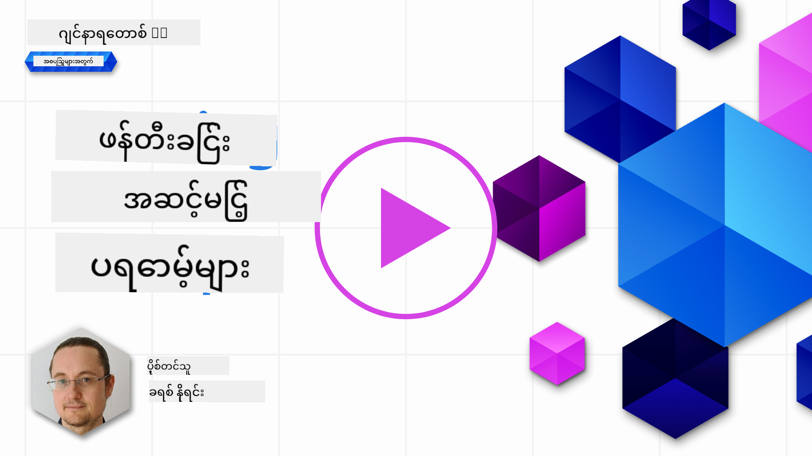

<!--
CO_OP_TRANSLATOR_METADATA:
{
  "original_hash": "b2651fb16bcfbc62b8e518751ed90fdb",
  "translation_date": "2025-10-18T01:48:29+00:00",
  "source_file": "05-advanced-prompts/README.md",
  "language_code": "my"
}
-->
# အဆင့်မြင့် Prompt များဖန်တီးခြင်း

[](https://youtu.be/BAjzkaCdRok?si=NmUIyRf7-cDgbjtt)

ယခင်အခန်းမှ သင်ယူမှုများကို ပြန်လည်သုံးသပ်ကြပါစို့-

> Prompt _engineering_ ဆိုသည်မှာ **မော်ဒယ်ကို ပိုမိုသက်ဆိုင်သော အဖြေများ** ရရှိစေရန် ပိုမိုအသုံးဝင်သောညွှန်ကြားချက်များ သို့မဟုတ် အကြောင်းအရာများပေးခြင်းဖြင့် လမ်းညွှန်ပေးသော လုပ်ငန်းစဉ်ဖြစ်သည်။

Prompt ရေးသားခြင်းတွင်လည်း အဆင့်နှစ်ဆင့်ရှိသည်- prompt ကိုဖွဲ့စည်းခြင်း (သက်ဆိုင်သောအကြောင်းအရာများပေးခြင်း) နှင့် _optimization_ (prompt ကိုတဖြည်းဖြည်းတိုးတက်အောင်လုပ်ခြင်း)။

ယခုအချိန်တွင် prompt ရေးသားပုံအခြေခံကို နားလည်ထားပြီးဖြစ်သော်လည်း ပိုမိုနက်ရှိုင်းစွာလေ့လာရန်လိုအပ်ပါသည်။ ဤအခန်းတွင် သင်သည် prompt များကို အမျိုးမျိုးစမ်းသပ်ခြင်းမှ စ၍ prompt တစ်ခုသည် အခြားတစ်ခုထက် အကောင်းဆုံးဖြစ်ရခြင်း၏ အကြောင်းရင်းကို နားလည်သွားမည်ဖြစ်သည်။ သင်သည် prompt များကို ဖန်တီးရာတွင် မည်သည့် LLM တွင်မဆို အသုံးပြုနိုင်သော အခြေခံနည်းလမ်းများကို လိုက်နာ၍ prompt များကို ဖန်တီးပုံကို သင်ယူမည်ဖြစ်သည်။

## အကျဉ်းချုပ်

ဤအခန်းတွင် ကျွန်ုပ်တို့ အောက်ပါအကြောင်းအရာများကို လေ့လာမည်-

- Prompt engineering အပေါ် သင်၏အသိပညာကို တိုးချဲ့ခြင်းနှင့် သင်၏ prompt များတွင် နည်းလမ်းအမျိုးမျိုးကို အသုံးပြုခြင်း။
- Prompt များကို output များကွဲပြားစေရန် ပြင်ဆင်ခြင်း။

## သင်ယူရမည့်ရည်မှန်းချက်များ

ဤသင်ခန်းစာကို ပြီးမြောက်ပြီးနောက်တွင် သင်သည်-

- Prompt engineering နည်းလမ်းများကို အသုံးပြု၍ သင်၏ prompt များ၏ရလဒ်ကို တိုးတက်အောင်လုပ်နိုင်မည်။
- Prompting ကို output ကွဲပြားစေခြင်း သို့မဟုတ် deterministic ဖြစ်စေခြင်းတို့ကို ဆောင်ရွက်နိုင်မည်။

## Prompt engineering

Prompt engineering ဆိုသည်မှာ သင်လိုအပ်သောရလဒ်ကို ရရှိစေရန် prompt များကို ဖန်တီးခြင်းဖြစ်သည်။ Prompt engineering သည် စာသား prompt ရေးခြင်းသာမက ပိုမိုကျယ်ပြန့်သော နည်းလမ်းများပါရှိသည်။ Prompt engineering သည် engineering အတတ်ပညာတစ်ခုမဟုတ်ပါ၊ သင်လိုအပ်သောရလဒ်ကို ရရှိစေရန် အသုံးပြုနိုင်သော နည်းလမ်းများဖြစ်သည်။

### Prompt တစ်ခု၏ ဥပမာ

အခြေခံ prompt တစ်ခုကို ယူကြည့်ပါ-

> ပထဝီဝင်ဆိုင်ရာမေးခွန်း ၁၀ ခု ဖန်တီးပါ။

ဤ prompt တွင် သင်သည် prompt နည်းလမ်းအမျိုးမျိုးကို အမှန်တကယ်အသုံးပြုနေပါသည်။

ဤကို ခွဲခြမ်းစိတ်ဖြာကြည့်ပါ။

- **အကြောင်းအရာ**, "ပထဝီဝင်" အကြောင်းကို သတ်မှတ်ထားသည်။
- **output ကို ကန့်သတ်ခြင်း**, မေးခွန်း ၁၀ ခုထက်မပိုစေရန်လိုသည်။

### အခြေခံ prompt များ၏ ကန့်သတ်ချက်များ

သင်လိုအပ်သောရလဒ်ကို ရရှိမည်မရရှိမည်မသိပါ။ မေးခွန်းများကို ဖန်တီးပေးမည်ဖြစ်သော်လည်း ပထဝီဝင်သည် အကြီးမားသောအကြောင်းအရာဖြစ်ပြီး အောက်ပါအကြောင်းရင်းများကြောင့် သင်လိုအပ်သောအတိုင်းမရနိုင်ပါ-

- **အကြီးမားသောအကြောင်းအရာ**, ၎င်းသည် နိုင်ငံများ၊ မြို့တော်များ၊ မြစ်များစသည်ဖြင့် မည်သည့်အကြောင်းအရာကိုဖြစ်မည်ကို မသိနိုင်ပါ။
- **ပုံစံ**, မေးခွန်းများကို သင်တစ်စုံတစ်ရာပုံစံဖြင့် ရေးသားလိုပါက အခြေအနေကောင်းမည်မဟုတ်ပါ။

သင့်အနေဖြင့် prompt များဖန်တီးရာတွင် စဉ်းစားရန်အရာများစွာရှိသည်ကို တွေ့နိုင်ပါသည်။

ယခုအချိန်ထိ ကျွန်ုပ်တို့သည် အခြေခံ prompt ဥပမာတစ်ခုကို တွေ့မြင်ခဲ့ပြီးဖြစ်သော်လည်း Generative AI သည် လူများကို အမျိုးမျိုးသော အခန်းကဏ္ဍများနှင့် စက်မှုလုပ်ငန်းများတွင် အကူအညီပေးနိုင်ရန် ပိုမိုတိုးတက်စွာလုပ်ဆောင်နိုင်သည်။ အခြေခံနည်းလမ်းများကို နောက်တစ်ဆင့်တွင် လေ့လာကြည့်ရအောင်။

### Prompting အတွက် နည်းလမ်းများ

ပထမဦးဆုံး ကျွန်ုပ်တို့သည် prompting သည် LLM ၏ _emergent_ အကျိုးသက်ရောက်မှုဖြစ်သည်ကို နားလည်ရန်လိုအပ်သည်။ ၎င်းသည် မော်ဒယ်တွင် တိုက်ရိုက်ပါဝင်သော feature မဟုတ်ဘဲ မော်ဒယ်ကို အသုံးပြုသည့်အခါ တွေ့ရှိရသောအရာတစ်ခုဖြစ်သည်။

LLM ကို prompt များဖန်တီးရန် အသုံးပြုနိုင်သော အခြေခံနည်းလမ်းများ ရှိသည်။ ၎င်းတို့ကို လေ့လာကြည့်ရအောင်-

- **Zero-shot prompting**, prompting ၏ အခြေခံဆုံးပုံစံဖြစ်သည်။ ၎င်းသည် LLM ၏ training data အပေါ်အခြေခံ၍ တုံ့ပြန်မှုတစ်ခုကို တောင်းဆိုသော prompt တစ်ခုဖြစ်သည်။
- **Few-shot prompting**, ၎င်းသည် LLM ကို ၎င်း၏တုံ့ပြန်မှုကို ဖန်တီးရန် အားကိုးနိုင်သော ဥပမာ ၁ ခု သို့မဟုတ် အများကြီးပေးခြင်းဖြင့် လမ်းညွှန်ပေးသော prompting ပုံစံဖြစ်သည်။
- **Chain-of-thought**, ၎င်းသည် LLM ကို ပြဿနာတစ်ခုကို အဆင့်ဆင့် ခွဲခြမ်းစိတ်ဖြာပေးရန် ပြောပြသော prompting ပုံစံဖြစ်သည်။
- **Generated knowledge**, prompt တစ်ခု၏ output ကို တိုးတက်အောင်လုပ်ရန် သင်၏ prompt အတွင်း generated facts သို့မဟုတ် knowledge ကို ထပ်မံပေးနိုင်သည်။
- **Least to most**, chain-of-thought နှင့်တူသည်။ ၎င်းသည် ပြဿနာတစ်ခုကို အဆင့်ဆင့် ခွဲခြမ်းစိတ်ဖြာပြီး ၎င်းအဆင့်များကို အစဉ်လိုက်လုပ်ဆောင်ရန် တောင်းဆိုခြင်းဖြစ်သည်။
- **Self-refine**, ၎င်းသည် LLM ၏ output ကို ဝေဖန်ပြီး ထို output ကို တိုးတက်အောင်လုပ်ရန် တောင်းဆိုခြင်းဖြစ်သည်။
- **Maieutic prompting**, ၎င်းသည် LLM ၏အဖြေမှန်ကန်မှုကို အာမခံရန် ၎င်း၏အဖြေ၏ အစိတ်အပိုင်းများကို ရှင်းပြရန် တောင်းဆိုခြင်းဖြစ်သည်။ ၎င်းသည် self-refine ၏ ပုံစံတစ်မျိုးဖြစ်သည်။

### Zero-shot prompting

ဤ prompting ပုံစံသည် အလွန်ရိုးရှင်းပြီး prompt တစ်ခုသာပါဝင်သည်။ ဤနည်းလမ်းသည် LLM များကို စတင်လေ့လာနေစဉ်တွင် သင်အသုံးပြုနေသော နည်းလမ်းဖြစ်နိုင်သည်။ ဥပမာ-

- Prompt: "Algebra ဆိုတာဘာလဲ?"
- Answer: "Algebra သည် သင်္ချာအခန်းကဏ္ဍတစ်ခုဖြစ်ပြီး သင်္ချာသင်္ကေတများနှင့် ၎င်းတို့ကို စီမံခန့်ခွဲပုံများကို လေ့လာခြင်းဖြစ်သည်။"

### Few-shot prompting

ဤ prompting ပုံစံသည် တုံ့ပြန်မှုကို ဖန်တီးရာတွင် LLM ကို အချို့သော ဥပမာများပေးခြင်းဖြင့် အကူအညီပေးသည်။ ၎င်းသည် တစ်ခုတည်းသော prompt နှင့် အပို task-specific data ပါဝင်သည်။ ဥပမာ-

- Prompt: "Shakespeare ပုံစံဖြင့် ကဗျာတစ်ပုဒ်ရေးပါ။ ဤသည်မှာ Shakespearean sonnets ၏ ဥပမာများဖြစ်သည်။
 
အကြောင်းအရာများကွဲပြားမှုများကို သင်မြင်နိုင်ပါသည်။

> သတိပြုပါ၊ ထွက်ရှိမှုကို ကွဲပြားစေဖို့အတွက် top-k, top-p, repetition penalty, length penalty, diversity penalty စသည်တို့ကဲ့သို့သော parameter များကို ပြောင်းလဲနိုင်သော်လည်း၊ ၎င်းတို့သည် ဒီသင်ခန်းစာ၏ အကျယ်အဝန်းအတွင်း မပါဝင်ပါ။

## လုပ်ဆောင်ရန်ကောင်းသောအချက်များ

သင်လိုချင်သောအရာကို ရရှိရန် ကြိုးစားရန်အတွက် အသုံးပြုနိုင်သော လုပ်ဆောင်ချက်များစွာရှိသည်။ Prompting ကို ပိုမိုအသုံးပြုလာသည်နှင့်အမျှ သင်၏ပုံစံကို ရှာဖွေတွေ့ရှိမည်ဖြစ်သည်။

ကျွန်ုပ်တို့ဖော်ပြခဲ့သောနည်းလမ်းများအပြင် LLM ကို prompt လုပ်ရာတွင် သတိထားစရာ ကောင်းသောအချက်များလည်း ရှိသည်။

ဤအချက်များကို သတိထားပါ:

- **အကြောင်းအရာကို သတ်မှတ်ပါ**။ အကြောင်းအရာသည် အရေးကြီးသည်၊ domain, topic စသည်တို့ကဲ့သို့သော အချက်များကို သတ်မှတ်နိုင်လျှင် ပိုမိုကောင်းမွန်ပါမည်။
- ထွက်ရှိမှုကို ကန့်သတ်ပါ။ သင်ထွက်ရှိမှုအရေအတွက် သို့မဟုတ် အရှည်ကို သတ်မှတ်လိုပါက၊ ၎င်းကို ဖော်ပြပါ။
- **ဘာလုပ်မည်နှင့် ဘယ်လိုလုပ်မည်ကို သတ်မှတ်ပါ**။ သင်လိုချင်သောအရာနှင့် ဘယ်လိုလိုချင်သည်ကို ဖော်ပြရန် မမေ့ပါနှင့်၊ ဥပမာအားဖြင့် "Python Web API တစ်ခုကို products နှင့် customers routes ဖြင့် ဖန်တီးပါ၊ ၎င်းကို ဖိုင် ၃ ခုအတွင်း ခွဲပါ"။
- **Template များကို အသုံးပြုပါ**။ မကြာခဏ၊ သင်၏ကုမ္ပဏီမှ အချက်အလက်များဖြင့် prompt များကို အဆင့်မြှင့်လိုပါမည်။ Template များကို အသုံးပြုပါ။ Template များတွင် အချက်အလက်များဖြည့်ရန် variable များပါဝင်နိုင်သည်။
- **စာလုံးပေါင်းမှန်ကန်စွာရေးပါ**။ LLM များသည် မှန်ကန်သောအဖြေကို ပေးနိုင်သော်လည်း၊ သင်စာလုံးပေါင်းမှန်ကန်စွာရေးပါက ပိုမိုကောင်းမွန်သောအဖြေကို ရရှိပါမည်။

## လုပ်ငန်းတာဝန်

Flask ကို အသုံးပြု၍ ရိုးရှင်းသော API တစ်ခုကို ဖန်တီးပုံကို ပြသထားသော Python code ဖြစ်သည်:

```python
from flask import Flask, request

app = Flask(__name__)

@app.route('/')
def hello():
    name = request.args.get('name', 'World')
    return f'Hello, {name}!'

if __name__ == '__main__':
    app.run()
```

GitHub Copilot သို့မဟုတ် ChatGPT ကဲ့သို့သော AI အကူအညီပေးသူကို အသုံးပြုပြီး "self-refine" နည်းလမ်းကို အသုံးပြု၍ code ကို တိုးတက်အောင် ပြုလုပ်ပါ။

## ဖြေရှင်းချက်

Code တွင် သင့်တော်သော prompt များ ထည့်သွင်းခြင်းဖြင့် လုပ်ငန်းတာဝန်ကို ဖြေရှင်းရန် ကြိုးစားပါ။

> [!TIP]
> တိုးတက်မှုများကို တစ်ခုခုအတိုင်းအတာအတွင်း ကန့်သတ်ရန် prompt ကို ဖော်ပြပါ။ Architecture, performance, security စသည်တို့ကဲ့သို့သော အထူးနည်းလမ်းဖြင့် တိုးတက်အောင် ပြုလုပ်ရန်လည်း မေးမြန်းနိုင်ပါသည်။

[ဖြေရှင်းချက်](../../../05-advanced-prompts/python/aoai-solution.py)

## အသိပညာစစ်ဆေးခြင်း

ဘာကြောင့် chain-of-thought prompting ကို အသုံးပြုသင့်သလဲ? မှန်ကန်သောအဖြေ ၁ ခုနှင့် မှားယွင်းသောအဖြေ ၂ ခုကို ပြပါ။

1. LLM ကို ပြဿနာကို ဖြေရှင်းပုံ သင်ပေးရန်။
1. B, LLM ကို code အတွင်းရှိ အမှားများကို ရှာဖွေရန် သင်ပေးရန်။
1. C, LLM ကို အခြားသော ဖြေရှင်းချက်များကို ရှာဖွေရန် ညွှန်ကြားရန်။

A: 1, အကြောင်းမူကား chain-of-thought သည် LLM ကို ပြဿနာကို ဖြေရှင်းပုံကို အဆင့်ဆင့်ပေးခြင်းနှင့် အလားတူပြဿနာများကို ဘယ်လိုဖြေရှင်းခဲ့သည်ကို ဖော်ပြခြင်းဖြစ်သည်။

## 🚀 စိန်ခေါ်မှု

သင်သည် လုပ်ငန်းတာဝန်တွင် self-refine နည်းလမ်းကို အသုံးပြုခဲ့သည်။ သင်ဖန်တီးထားသော အစီအစဉ်တစ်ခုကို ယူပြီး ၎င်းတွင် အဆင့်မြှင့်လိုသော အချက်များကို စဉ်းစားပါ။ ယခု self-refine နည်းလမ်းကို အသုံးပြု၍ အဆိုပါ ပြောင်းလဲမှုများကို အကောင်အထည်ဖော်ပါ။ အကျိုးအမြတ်သည် ပိုမိုကောင်းမွန်သလား၊ မကောင်းသလား?

## အလွန်ကောင်းမွန်သောအလုပ်! သင်၏သင်ယူမှုကို ဆက်လက်လုပ်ဆောင်ပါ

ဤသင်ခန်းစာကို ပြီးမြောက်ပြီးနောက်၊ [Generative AI Learning collection](https://aka.ms/genai-collection?WT.mc_id=academic-105485-koreyst) ကို ကြည့်ရှု၍ Generative AI အသိပညာကို ဆက်လက်မြှင့်တင်ပါ!

Lesson 6 သို့ သွားပါ၊ Prompt Engineering အသိပညာကို အသုံးပြု၍ [text generation apps](../06-text-generation-apps/README.md?WT.mc_id=academic-105485-koreyst) ဖန်တီးခြင်းကို လေ့လာမည်။

---

**အကြောင်းကြားချက်**:  
ဤစာရွက်စာတမ်းကို AI ဘာသာပြန်ဝန်ဆောင်မှု [Co-op Translator](https://github.com/Azure/co-op-translator) ကို အသုံးပြု၍ ဘာသာပြန်ထားပါသည်။ ကျွန်ုပ်တို့သည် တိကျမှုအတွက် ကြိုးစားနေသော်လည်း အလိုအလျောက် ဘာသာပြန်မှုများတွင် အမှားများ သို့မဟုတ် မမှန်ကန်မှုများ ပါဝင်နိုင်သည်ကို သတိပြုပါ။ မူရင်းဘာသာစကားဖြင့် ရေးသားထားသော စာရွက်စာတမ်းကို အာဏာတရားရှိသော အရင်းအမြစ်အဖြစ် သတ်မှတ်သင့်ပါသည်။ အရေးကြီးသော အချက်အလက်များအတွက် လူက ဘာသာပြန်မှုကို အကြံပြုပါသည်။ ဤဘာသာပြန်မှုကို အသုံးပြုခြင်းမှ ဖြစ်ပေါ်လာသော အလွဲအမှားများ သို့မဟုတ် အနားယူမှုများအတွက် ကျွန်ုပ်တို့သည် တာဝန်မယူပါ။