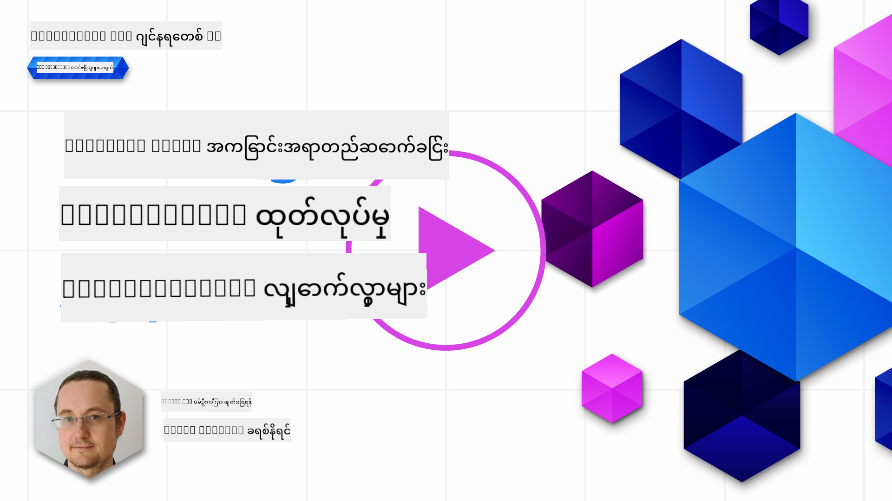

<!--
CO_OP_TRANSLATOR_METADATA:
{
  "original_hash": "5ec6c92b629564538ef397c550adb73e",
  "translation_date": "2025-06-25T14:59:47+00:00",
  "source_file": "06-text-generation-apps/README.md",
  "language_code": "my"
}
-->
# စာသားထုတ်လုပ်ခြင်း အက်ပ်များ တည်ဆောက်ခြင်း

[](https://aka.ms/gen-ai-lesson6-gh?WT.mc_id=academic-105485-koreyst)

> _(ဤသင်ခန်းစာ၏ ဗီဒီယိုကို ကြည့်ရန် အထက်ပါ ပုံကို နှိပ်ပါ)_

ဒီသင်ရိုးမှာ ကြည့်ပြီးပါပြီဆိုရင်၊ prompt များကဲ့သို့သော အခြေခံအကြောင်းအရာများနှင့် "prompt engineering" ဟုခေါ်သော အထူးပြုဘာသာရပ်တစ်ခုတည်းတည်းရှိသည်ကို တွေ့မြင်ခဲ့ရပါပြီ။ ChatGPT, Office 365, Microsoft Power Platform စသဖြင့် သင်တို့နှင့်အတူ ပူးပေါင်းဆောင်ရွက်နိုင်သော အထောက်အကူပြုကိရိယာများစွာရှိပြီး၊ စီမံချက်များကို အသုံးပြု၍ တစ်ခုခုကို ပြီးမြောက်စေရန် အထောက်အကူပြုသည်။

ဤကဲ့သို့သော အတွေ့အကြုံကို အက်ပ်တစ်ခုတွင် ထည့်သွင်းရန်၊ prompt, completions နှင့် အလုပ်လုပ်ရန် စာကြည့်တိုက်တစ်ခုရွေးချယ်ခြင်းကဲ့သို့သော အကြောင်းအရာများကို နားလည်ရန် လိုအပ်သည်။ ဤအခန်းတွင် သင်လေ့လာနိုင်ပါသည်။

## နိဒါန်း

ဤအခန်းတွင် သင်သည် -

- openai စာကြည့်တိုက်နှင့် ၎င်း၏ အခြေခံအကြောင်းအရာများကို လေ့လာပါ။
- openai ကို အသုံးပြု၍ စာသားထုတ်လုပ်ခြင်း အက်ပ်တစ်ခု တည်ဆောက်ပါ။
- prompt, temperature, နှင့် tokens ကဲ့သို့သော အကြောင်းအရာများကို အသုံးပြု၍ စာသားထုတ်လုပ်ခြင်း အက်ပ်တစ်ခု တည်ဆောက်ပုံကို နားလည်ပါ။

## သင်ယူရန်ရည်ရွယ်ချက်များ

ဤသင်ခန်းစာ၏ အဆုံးတွင် သင်သည် -

- စာသားထုတ်လုပ်ခြင်း အက်ပ်သည် အဘယ်အရာဖြစ်ကြောင်း ရှင်းပြနိုင်ပါမည်။
- openai ကို အသုံးပြု၍ စာသားထုတ်လုပ်ခြင်း အက်ပ်တစ်ခု တည်ဆောက်နိုင်ပါမည်။
- သင့်အက်ပ်ကို tokens ပမာဏကို များသို့မဟုတ် နည်းသလို ပြင်ဆင်ပြီး အထွက်ကို အမျိုးမျိုးပြောင်းလဲရန် temperature ကိုလည်း ပြောင်းလဲနိုင်ပါမည်။

## စာသားထုတ်လုပ်ခြင်း အက်ပ်ဆိုတာ ဘာလဲ?

ပုံမှန်အားဖြင့် သင်သည် အက်ပ်တစ်ခုကို တည်ဆောက်သည်ဆိုပါက အောက်ပါကဲ့သို့ အင်တာဖေ့စ်တစ်ခု ရှိသည် -

- အမိန့်အခြေခံ။ Console အက်ပ်များသည် သင်သည် အမိန့်တစ်ခုရိုက်ထည့်ပြီး ၎င်းသည် တစ်စုံတစ်ခုကို ဆောင်ရွက်သော နမူနာအက်ပ်များဖြစ်သည်။ ဥပမာအားဖြင့် `git` သည် အမိန့်အခြေခံ အက်ပ်တစ်ခုဖြစ်သည်။
- အသုံးပြုသူ အင်တာဖေ့စ် (UI)။ အက်ပ်အချို့တွင် ဂရပ်ဖစ်အသုံးပြုသူ အင်တာဖေ့စ် (GUIs) ရှိပြီး သင်သည် ခလုတ်များကို နှိပ်ခြင်း၊ စာသားရိုက်ထည့်ခြင်း၊ ရွေးချယ်မှုများကို ရွေးခြင်းစသဖြင့် လုပ်ဆောင်နိုင်သည်။

### Console နှင့် UI အက်ပ်များမှာ ကန့်သတ်ချက်များ ရှိသည်

အမိန့်အခြေခံ အက်ပ်နှင့် နှိုင်းယှဉ်ပါက -

- **ကန့်သတ်ချက်များ ရှိသည်**။ သင်သည် အက်ပ်က ပံ့ပိုးသော အမိန့်များကိုသာ ရိုက်ထည့်နိုင်ပြီး အခြားအမိန့်များကို ရိုက်ထည့်၍ မရပါ။
- **ဘာသာစကားအထူးပြု**။ အက်ပ်အချို့သည် ဘာသာစကားများစွာကို ပံ့ပိုးပေးနိုင်သော်လည်း ပုံမှန်အားဖြင့် အက်ပ်ကို အထူးပြုဘာသာစကားတစ်ခုအတွက် တည်ဆောက်ထားပြီး သင်သည် အခြားဘာသာစကားပံ့ပိုးမှုကို ထည့်သွင်းနိုင်သော်လည်း။

### စာသားထုတ်လုပ်ခြင်း အက်ပ်များ၏ အကျိုးကျေးဇူးများ

အကယ်၍ စာသားထုတ်လုပ်ခြင်း အက်ပ်သည် မည်သို့ ကွဲပြားသည်လဲ?

စာသားထုတ်လုပ်ခြင်း အက်ပ်တွင် သင်သည် ပိုမိုကျယ်ပြန့်သော လွတ်လပ်မှု ရရှိပြီး အမိန့်များစွာ သို့မဟုတ် အထူးပြု ဘာသာစကားတစ်ခုကိုသာ ကန့်သတ်ထားခြင်း မရှိပါ။ ၎င်းအစား သင်သည် သဘာဝဘာသာစကားကို အသုံးပြု၍ အက်ပ်နှင့် အပြန်အလှန် ဆက်သွယ်နိုင်သည်။ အခြားအကျိုးကျေးဇူးတစ်ခုမှာ သင်သည် အချက်အလက်များစွာကို သင်ယူထားသော ဒေတာအရင်းအမြစ်နှင့် အပြန်အလှန် ဆက်သွယ်နေပြီး ပုံမှန်အက်ပ်သည် ဒေတာဘေ့စ်တွင် ရှိသောအရာများကိုသာ ကန့်သတ်ထားနိုင်သည်။

### စာသားထုတ်လုပ်ခြင်း အက်ပ်ဖြင့် ဘာကို တည်ဆောက်နိုင်မလဲ?

တည်ဆောက်နိုင်သော အရာများစွာ ရှိသည်။ ဥပမာအားဖြင့် -

- **Chatbot**။ သင့်ကုမ္ပဏီနှင့် ၎င်း၏ ထုတ်ကုန်များကဲ့သို့သော အကြောင်းအရာများကို ဖြေကြားပေးသည့် chatbot တစ်ခုသည် သင့်လျော်သည်။
- **အကူအညီပေးသူ**။ LLMs သည် စာသားကို အကျဉ်းချုပ်ခြင်း၊ စာသားမှ အထောက်အထားရယူခြင်း၊ ရေးသားခြင်းကဲ့သို့သော အရာများတွင် အထူးကောင်းမွန်သည်။
- **Code assistant**။ သင်အသုံးပြုသည့် ဘာသာစကားမော်ဒယ်ပေါ်မူတည်၍ သင်ကို ကုဒ်ရေးရာတွင် အကူအညီပေးသည့် code assistant တစ်ခု တည်ဆောက်နိုင်သည်။ ဥပမာအားဖြင့် GitHub Copilot နှင့် ChatGPT ကဲ့သို့သော ထုတ်ကုန်ကို အသုံးပြု၍ သင်ကို ကုဒ်ရေးရာတွင် အကူအညီပေးနိုင်သည်။

## ဘယ်လို စတင်ရမလဲ?

အိုကေ၊ သင်သည် LLM နှင့် ပေါင်းစပ်ရန် နည်းလမ်းတစ်ခု ရှာဖွေရန် လိုအပ်သည်၊ ယေဘူယျအားဖြင့် အောက်ပါ နည်းလမ်းနှစ်ခု ပါဝင်သည် -

- API ကို အသုံးပြုပါ။ ဤတွင် သင်သည် သင့် prompt နှင့်အတူ ဝဘ်တောင်းဆိုမှုများကို တည်ဆောက်ပြီး ထုတ်လုပ်ထားသော စာသားကို ပြန်လည်ရယူသည်။
- စာကြည့်တိုက်ကို အသုံးပြုပါ။ စာကြည့်တိုက်များသည် API ခေါ်ဆိုမှုများကို ကွက်ကွက်ကွင်းကွင်းလုပ်ဆောင်ရန် အထောက်အကူပြုသည်။

## Libraries/SDKs

LLMs နှင့် အလုပ်လုပ်ရန် အတွက် လူသိများသော စာကြည့်တိုက်အချို့ ရှိသည် -

- **openai**, ဤစာကြည့်တိုက်သည် သင့်မော်ဒယ်နှင့် ချိတ်ဆက်ရန်နှင့် prompt များကို ပေးပို့ရန် လွယ်ကူစေသည်။

ထို့နောက် အဆင့်မြင့်အဆင့်တွင် လည်ပတ်သော စာကြည့်တိုက်များ ရှိသည် -

- **Langchain**။ Langchain သည် လူသိများပြီး Python ကို ပံ့ပိုးပေးသည်။
- **Semantic Kernel**။ Semantic Kernel သည် Microsoft ၏ စာကြည့်တိုက်ဖြစ်ပြီး C#, Python, နှင့် Java ဘာသာစကားများကို ပံ့ပိုးပေးသည်။

## openai ကို အသုံးပြု၍ ပထမဆုံးအက်ပ်

ကျွန်ုပ်တို့ ပထမဆုံးအက်ပ်ကို ဘယ်လိုတည်ဆောက်နိုင်မလဲ၊ ဘယ်လိုစာကြည့်တိုက်များလိုအပ်သည်၊ ဘယ်လောက်လိုအပ်သည် စသဖြင့် ကြည့်ကြပါစို့။

### openai ကို ထည့်သွင်းပါ

OpenAI သို့မဟုတ် Azure OpenAI နှင့် အပြန်အလှန်ဆက်သွယ်ရန် စာကြည့်တိုက်များစွာ ရှိသည်။ C#, Python, JavaScript, Java စသဖြင့် အမျိုးမျိုးသော ပရိုဂရမ်မာဘာသာစကားများကိုလည်း အသုံးပြုနိုင်သည်။ `openai` Python စာကြည့်တိုက်ကို အသုံးပြုရန် ကျွန်ုပ်တို့ ရွေးချယ်ထားပြီး၊ `pip` ကို အသုံးပြု၍ ၎င်းကို ထည့်သွင်းပါမည်။

```bash
pip install openai
```

### အရင်းအမြစ်တစ်ခု ဖန်တီးပါ

သင်သည် အောက်ပါ လုပ်ဆောင်ချက်များကို ဆောင်ရွက်ရန် လိုအပ်ပါသည် -

- Azure တွင် အကောင့်တစ်ခု ဖန်တီးပါ [https://azure.microsoft.com/free/](https://azure.microsoft.com/free/?WT.mc_id=academic-105485-koreyst)။
- Azure OpenAI ကို ဝင်ရောက်အသုံးပြုပါ။ [https://learn.microsoft.com/azure/ai-services/openai/overview#how-do-i-get-access-to-azure-openai](https://learn.microsoft.com/azure/ai-services/openai/overview#how-do-i-get-access-to-azure-openai?WT.mc_id=academic-105485-koreyst) သို့ သွား၍ ဝင်ရောက်အသုံးပြုမှုကို တောင်းဆိုပါ။

  > [!NOTE]
  > စာရေးချိန်တွင်၊ သင်သည် Azure OpenAI ကို ဝင်ရောက်အသုံးပြုရန် လျှောက်ထားရပါမည်။

- Python ကို ထည့်သွင်းပါ <https://www.python.org/>
- Azure OpenAI Service အရင်းအမြစ်တစ်ခု ဖန်တီးထားပါ။ [အရင်းအမြစ်တစ်ခု ဖန်တီးခြင်း](https://learn.microsoft.com/azure/ai-services/openai/how-to/create-resource?pivots=web-portal?WT.mc_id=academic-105485-koreyst) အတွက် ဤလမ်းညွှန်ကို ကြည့်ပါ။

### API key နှင့် endpoint ကို ရှာဖွေပါ

ဤအချိန်တွင် သင်သည် သင့် `openai` စာကြည့်တိုက်ကို ဘယ် API key ကို အသုံးပြုရမည်ကို ပြောပြရန် လိုအပ်ပါသည်။ သင့် API key ကို ရှာဖွေရန်၊ Azure OpenAI အရင်းအမြစ်၏ "Keys and Endpoint" အပိုင်းသို့ သွား၍ "Key 1" တန်ဖိုးကို ကူးယူပါ။


ယခု သင်သည် ဤအချက်အလက်ကို ကူးယူပြီး၊ စာကြည့်တိုက်များကို ၎င်းကို အသုံးပြုရန် ညွှန်ကြားပါစို့။

> [!NOTE]
> သင့် API key ကို သင်၏ ကုဒ်မှ ခွဲခြားရန် တန်ဖိုးရှိသည်။ သင်သည် ပတ်ဝန်းကျင် အပြောင်းအလဲများကို အသုံးပြုခြင်းဖြင့် ၎င်းကို ပြုလုပ်နိုင်သည်။
>
> - ပတ်ဝန်းကျင် အပြောင်းအလဲ `OPENAI_API_KEY` to your API key.
>   `export OPENAI_API_KEY='sk-...'` ကို သတ်မှတ်ပါ

### Azure ကို ဖွဲ့စည်းမှုကို စတင်ပြင်ဆင်ပါ

သင်သည် Azure OpenAI ကို အသုံးပြုပါက၊ ဖွဲ့စည်းမှုကို မည်သို့ စတင်ပြင်ဆင်ရမည်ဆိုသည်မှာ -

```python
openai.api_type = 'azure'
openai.api_key = os.environ["OPENAI_API_KEY"]
openai.api_version = '2023-05-15'
openai.api_base = os.getenv("API_BASE")
```

အထက်တွင် ကျွန်ုပ်တို့ သတ်မှတ်ထားသည်မှာ -

- `api_type` to `azure`. This tells the library to use Azure OpenAI and not OpenAI.
- `api_key`, this is your API key found in the Azure Portal.
- `api_version`, this is the version of the API you want to use. At the time of writing, the latest version is `2023-05-15`.
- `api_base`, this is the endpoint of the API. You can find it in the Azure Portal next to your API key.

> [!NOTE] > `os.getenv` is a function that reads environment variables. You can use it to read environment variables like `OPENAI_API_KEY` and `API_BASE`. Set these environment variables in your terminal or by using a library like `dotenv`.

## Generate text

The way to generate text is to use the `Completion` class ဖြစ်သည်။ ဤသည်မှာ နမူနာဖြစ်သည် -

```python
prompt = "Complete the following: Once upon a time there was a"

completion = openai.Completion.create(model="davinci-002", prompt=prompt)
print(completion.choices[0].text)
```

အထက်ပါကုဒ်တွင် ကျွန်ုပ်တို့သည် completion object တစ်ခုကို ဖန်တီးပြီး ကျွန်ုပ်တို့ အသုံးပြုလိုသည့် မော်ဒယ်နှင့် prompt ကို ပေးပို့သည်။ ထို့နောက် ထုတ်လုပ်ထားသော စာသားကို ပုံနှိပ်သည်။

### Chat completions

ယခုအထိ သင်သည် ကျွန်ုပ်တို့ `Completion` to generate text. But there's another class called `ChatCompletion` ကို chatbots များအတွက် ပိုသင့်လျော်သည်ဟု တွေ့မြင်ခဲ့ပါပြီ။ ၎င်းကို အသုံးပြုခြင်း၏ နမူနာဖြစ်သည် -

```python
import openai

openai.api_key = "sk-..."

completion = openai.ChatCompletion.create(model="gpt-3.5-turbo", messages=[{"role": "user", "content": "Hello world"}])
print(completion.choices[0].message.content)
```

ဤလုပ်ဆောင်ချက်အပေါ် အပိုင်းကို လာမည့် အခန်းတွင် ပိုမိုလေ့လာပါမည်။

## လေ့ကျင့်မှု - သင့်ပထမဆုံး စာသားထုတ်လုပ်ခြင်း အက်ပ်

ယခု ကျွန်ုပ်တို့သည် openai ကို မည်သို့ စတင်ပြင်ဆင်ရန်နှင့် ဖွဲ့စည်းရမည်ကို လေ့လာပြီးပါပြီ၊ သင့်ပထမဆုံး စာသားထုတ်လုပ်ခြင်း အက်ပ်ကို တည်ဆောက်ရန် အချိန်ရောက်ပါပြီ။ သင့်အက်ပ်ကို တည်ဆောက်ရန်၊ အောက်ပါ လုပ်ဆောင်ချက်များကို လိုက်နာပါ -

1. အ_virtual environment_ ဖန်တီးပြီး openai ကို ထည့်သွင်းပါ -

   ```bash
   python -m venv venv
   source venv/bin/activate
   pip install openai
   ```

   > [!NOTE]
   > သင်သည် Windows ကို အသုံးပြုပါက `venv\Scripts\activate` instead of `source venv/bin/activate`.

   > [!NOTE]
   > Locate your Azure OpenAI key by going to [https://portal.azure.com/](https://portal.azure.com/?WT.mc_id=academic-105485-koreyst) and search for `Open AI` and select the `Open AI resource` and then select `Keys and Endpoint` and copy the `Key 1` တန်ဖိုးကို ရိုက်ထည့်ပါ။

1. _app.py_ ဖိုင်တစ်ခု ဖန်တီးပြီး အောက်ပါကုဒ်ကို ထည့်ပါ -

   ```python
   import openai

   openai.api_key = "<replace this value with your open ai key or Azure OpenAI key>"

   openai.api_type = 'azure'
   openai.api_version = '2023-05-15'
   openai.api_base = "<endpoint found in Azure Portal where your API key is>"
   deployment_name = "<deployment name>"

   # add your completion code
   prompt = "Complete the following: Once upon a time there was a"
   messages = [{"role": "user", "content": prompt}]

   # make completion
   completion = openai.chat.completions.create(model=deployment_name, messages=messages)

   # print response
   print(completion.choices[0].message.content)
   ```

   > [!NOTE]
   > သင်သည် Azure OpenAI ကို အသုံးပြုပါက၊ သင့် Azure OpenAI key ကို `api_type` to `azure` and set the `api_key` သတ်မှတ်ရန် လိုအပ်သည်။

   သင်သည် အောက်ပါကဲ့သို့သော အထွက်ကို မြင်ရပါမည် -

   ```output
    very unhappy _____.

   Once upon a time there was a very unhappy mermaid.
   ```

## ကွဲပြားခြားနားသော အရာများအတွက် ကွဲပြားခြားနားသော prompt များ

ယခု သင်သည် prompt ကို အသုံးပြု၍ စာသားကို မည်သို့ ထုတ်လုပ်ရမည်ကို ကြည့်ပြီးပါပြီ။ သင်သည် ပြုပြင်ပြောင်းလဲနိုင်သော ပရိုဂရမ်တစ်ခုကို ထည့်သွင်းထားပြီး အမျိုးမျိုးသော စာသားများကို ထုတ်လုပ်နိုင်ပါပြီ။

prompt များကို အမျိုးမျိုးသော လုပ်ငန်းများအတွက် အသုံးပြုနိုင်သည်။ ဥပမာအားဖြင့် -

- **စာသားအမျိုးအစား တစ်ခုကို ထုတ်လုပ်ပါ**။ ဥပမာအားဖြင့် ကဗျာတစ်ပုဒ်၊ မေးခွန်းများ စသဖြင့် ထုတ်လုပ်နိုင်သည်။
- **အချက်အလက် ရှာဖွေပါ**။ prompt များကို အသုံးပြု၍ အောက်ပါနမူနာကဲ့သို့သော အချက်အလက်များကို ရှာဖွေနိုင်သည် - 'web development တွင် CORS သည် အဘယ်အရာကို ဆိုလိုသနည်း?'။
- **ကုဒ်ကို ထုတ်လုပ်ပါ**။ prompt များကို အသုံးပြု၍ ကုဒ်ကို ထုတ်လုပ်နိုင်သည်၊ ဥပမာအားဖြင့် အီးမေးလ်များကို အတည်ပြုရန် အသုံးပြုသော regular expression တစ်ခု ဖွံ့ဖြိုးစေခြင်း သို့မဟုတ် ဝဘ်အက်ပ်ကဲ့သို့သော အစီအစဉ်တစ်ခုလုံးကို ထုတ်လုပ်ခြင်း။

## ပို၍ လက်တွေ့ကျသော သုံးစွ

**အာမခံချက်**:  
ဤစာရွက်စာတမ်းကို AI ဘာသာပြန်ဆော့ဖ်ဝဲ [Co-op Translator](https://github.com/Azure/co-op-translator) ကို အသုံးပြု၍ ဘာသာပြန်ထားပါသည်။ ကျွန်ုပ်တို့သည် တိကျမှုအတွက် ကြိုးစားနေစဉ် အလိုအလျောက် ဘာသာပြန်ချက်များတွင် အမှားများ သို့မဟုတ် မတိကျမှုများ ပါဝင်နိုင်သည်ကို ကျေးဇူးပြု၍ သတိပြုပါ။ မူလဘာသာစကားဖြင့် ရေးသားထားသည့် စာရွက်စာတမ်းကို အာဏာတရားရှိသော ရင်းမြစ်အဖြစ် ရှုစားသင့်ပါသည်။ အရေးကြီးသော အချက်အလက်များအတွက် လူက ဘာသာပြန်မှုကို အကြံပြုပါသည်။ ဤဘာသာပြန်ချက်ကို အသုံးပြုမှုမှ ဆင့်ပွားသော အလွဲသဘောပေါက်မှုများ သို့မဟုတ် အနားလည်မှားမှုများအတွက် ကျွန်ုပ်တို့သည် တာဝန်မယူပါ။