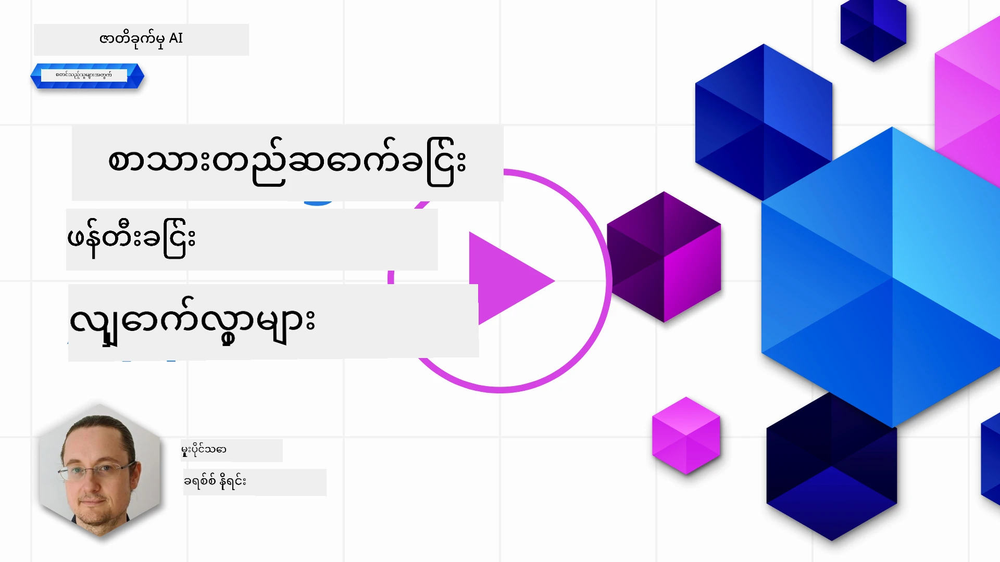

# စာသားတည်ဆောက်မှုအက်ပလီကေးရှင်းများ တည်ဆောက်ခြင်း

[](https://youtu.be/0Y5Luf5sRQA?si=t_xVg0clnAI4oUFZ)

> _(ဒီသင်ခန်းစာ၏ ဗီဒီယိုကို ကြည့်ရန် ပုံနှိပ်ပါ)_

သင်ဦးစီးသင်ယူလာတဲ့ ဤသင်ခန်းစာတွင် prompt များနှင့် "prompt engineering" ဟုခေါ်သော အထူးအသိပညာနယ်ပယ်တစ်ခုအပါအဝင် မူလယူဆချက်များကိုတွေ့ရှိခဲ့ပါသည်။ ChatGPT, Office 365, Microsoft Power Platform စသည့် ကိရိယာများသည် မိမိလိုသောအရာကို ပြုလုပ်ရန် prompt များအတိုင်း အသုံးပြုရန် ထောက်ပံ့ပေးပါသည်။

သင်တစ်ခုတည်းသော အက်ပလီကေးရှင်းတွင် ထိုအတွေ့အကြုံကို ထည့်သွင်းလိုပါက prompt, completion များ၊ အသုံးပြုရန်စာကြည့်တိုက်ရွေးချယ်ခြင်းကဲ့သို့သော မူလယူဆချက်များကို နားလည်ရန် လိုအပ်ပါသည်။ ဤအခန်းတွင် ထိုသင်ကြားချက်များကို သင်ယူမည်ဖြစ်သည်။

## နိဒါန်း

ဤအခန်းတွင် သင်သည်:

- openai စာကြည့်တိုက်နှင့် ၎င်း၏ မူလယူဆချက်များကို လေ့လာမည်။
- openai ကို အသုံးပြု၍ စာသားတည်ဆောက်မှုအက်ပလီကေးရှင်း တည်ဆောက်မည်။
- prompt, temperature, tokens ကဲ့သို့သော မူလယူဆချက်များကို အသုံးပြုပြီး စာသားတည်ဆောက်မှုအက်ပလီကေးရှင်း တည်ဆောက်နည်းကို နားလည်မည်။

## သင်ယူရမည့် ရည်မှန်းချက်များ

ဤသင်ခန်းစာအဆုံးတွင် သင်သည်:

- စာသားတည်ဆောက်မှုအက်ပလီကေးရှင်း ဆိုသည်မှာ မည်သည်ကို ရှင်းပြနိုင်မည်။
- openai ကို အသုံးပြု၍ စာသားတည်ဆောက်မှုအက်ပလီကေးရှင်း တည်ဆောက်နိုင်မည်။
- ထူးခြားသော ထွက်ရှိမှုအတွက် tokens ပမာဏကို သိပ်များသိပ်နည်း ပြင်ဆင်ခြင်းနှင့် temperature ကို ပြောင်းလဲတပ်ဆင်နိုင်မည်။

## စာသားတည်ဆောက်မှုအက်ပလီကေးရှင်း ဆိုသည်မှာ မည်သည်နည်း?

ပုံမှန်အားဖြင့် အက်ပလီကေးရှင်းတစ်ခု တည်ဆောက်သည်မှာ အောက်ပါအတိုင်း မျက်နှာပြင်တစ်ခုရှိပါသည်။

- ကွန်မန်း့ အခြေခံ. ကွန်ဆိုလ်အက်ပလီကေးရှင်းများမှာ သင်ကွန်မန်း့ ရိုက်ထည့်ပြီး ကိစ္စတစ်ခု အကောင်အထည်ဖော်နိုင်သည်။ ဥပမာ `git` သည် ကွန်မန်း့ အခြေခံအက်ပလီကေးရှင်းဖြစ်သည်။
- အသုံးပြုသူ မျက်နှာပြင် (UI)။ အချို့အက်ပလီကေးရှင်းများတွင် ဂရပ်ဖစ်မဲ့အသုံးပြုသူ ရှေ့တန်းရှိ၍ ခလုတ်များနှိပ်၍ စာသားရိုက်ထည့်၍ ရွေးချယ်မှုများပြုလုပ်နိုင်သည်။

### ကွန်ဆိုလ်နှင့် UI အက်ပလီကေးရှင်းများမှာ ကန့်သတ်ချက်ရှိသည်

သင်ကွန်မန်း့ ရိုက်ထည့်ရသော ကွန်မန်း့အခြေခံအက်ပလီကေးရှင်းနှင့် နှိုင်းယှဥ်ကြည့်ပါ။

- **ကန့်သတ်ရာ**။ သင်ရိုက်ထည့်နိုင်သော ကွန်မန်း့သည် အက်ပလီကေးရှင်း ထောက်ပံ့သော သီးသန့်ကွန်မန်း့များသာ ဖြစ်သည်။
- **ဘာသာစကား အထူးသီးသန့်**။ အချို့အက်ပလီကေးရှင်းများသည် ဘာသာစကားများစွာကို ထောက်ပံ့နိုင်သော်လည်း ပုံမှန်အားဖြင့် အက်ပလီကေးရှင်းသည် တစ်ခုသောဘာသာစကားအတွက်တည်ဆောက်ထားပြီး များစွာသောဘာသာစကား ထပ်မံထည့်သွင်းနိုင်သည်။

### စာသားတည်ဆောက်မှုအက်ပလီကးရှင်း၏ အကျိုးကျေးဇူးများ

စာသားတည်ဆောက်မှုအက်ပလီကေးရှင်း သည် မည်သို့ ကွာခြားသနည်း?

စာသားတည်ဆောက်မှုအက်ပလီကေးရှင်းတွင် သင်သည် ပိုမိုပြောင်းလဲနိုင်မှုရှိပြီး သတ်မှတ်လက်ခံထားသော ကွန်မန်း့များ သို့မဟုတ် သီးသန့်ဘာသာစကားတစ်ခုတွင် ကန့်သတ်ခြင်း မရှိပါ။ မူဝါဒအားဖြင့် သဘာဝဘာသာစကားကို အသုံးပြုပြီး အက်ပလီကေးရှင်းနှင့် ဆက်သွယ်နိုင်ပြီး ယခင်အက်ပလီကေးရှင်းတွင် မရှိသည့် အချက်အလက်ကြီးမားသော အချက်အလက်စုစည်းမှုနှင့် လေ့ကျင့်ထားသော ဒေတာရင်းမြစ်ကို အသုံးပြုနိုင်သည်။

### စာသားတည်ဆောက်မှုအက်ပလီကေးရှင်းဖြင့် ဘာရှိနိုင်မလဲ?

များစွာသော အရာများတည်ဆောက်နိုင်သည်။ ဥပမာ:

- **စကားပြောတုံ့ပြန်သူ**။ ကုမ္ပဏီနှင့် ထုတ်ကုန်များနှင့်ဂရုစိုက်သော မေးခွန်းများကို ဖြေကြားပေးနိုင်သော စကားပြောတုံ့ပြန်သူသည် လိုက်ဖက်သည်။
- **ကူညီပေးသူ**။ LLM များသည် စာသားကို ကြားလုံးချုပ်ခြင်း၊ သဘောရလဒ်ရယူခြင်း၊ အလုပ်အကိုင်ဆောင်းပါးများ ကဲ့သို့သော စာသားပုံစံများထုတ်ပေးနိုင်ခြင်းတို့တွင် ထူးခြားသည်။
- **ကုဒ်ကူညီသူ**။ သင်အသုံးပြုသော ဘာသာစကားပုံစံပေါ်မူတည်၍ ကုဒ်ရေးရန် ကူညီပေးသော ကူညီသူ တည်ဆောက်နိုင်သည်။ ဥပမာ GitHub Copilot နှင့် ChatGPT တို့ကို ကုဒ်ရေးရာတွင် ကူညီရန် အသုံးပြုနိုင်သည်။

## မည်သို့ စတင်နိုင်မည်နည်း?

LLM နှင့် ပေါင်းစည်းရန် နည်းလမ်းနှစ်မျိုးရှိပြီး မြောက်မည်မှာ အောက်ပါနည်းလမ်းများဖြစ်သည်။

- API အသုံးပြုခြင်း။ ဒီမှာ သင့် prompt ဖြင့် ဝက်ဘ်တောင်းဆိုမှုများ တည်ဆောက်ပြီး စာသားကို ထုတ်စဉ့်ဖြေကြားချက်ရယူသည်။
- စာကြည့်တိုက် အသုံးပြုခြင်း။ စာကြည့်တိုက်များသည် API ခေါ်ဆိုမှုများကို ဖုံးကွယ်ပေးပြီး အသုံးပြုရ လွယ်ကူစေသည်။

## စာကြည့်တိုက်/SDK များ

LLM များအတွက် နာမည်ကြီး စာကြည့်တိုက်အနည်းငယ်ရှိသည်။

- **openai**, ဤစာကြည့်တိုက်သည် မော်ဒယ်နှင့် ချိတ်ဆက်၍ prompt များ ထည့်သွင်းရလွယ်ကူစေသည်။

ထို့အပြင် အဆင့်မြင့် စာကြည့်တိုက်များလည်းရှိသည်။

- **Langchain**။ Langchain သည် နာမည်ကြီးပြီး Python ကို ထောက်ပံ့သည်။
- **Semantic Kernel**။ Semantic Kernel သည် Microsoft မှထုတ်ဝေပြီး C#, Python, Java ဘာသာစကားများကို ထောက်ပံ့သည်။

## openai ကို အသုံးပြု၍ ပထမဆုံး အက်ပလီကေးရှင်း

ပထမဆုံး အက်ပလီကေးရှင်းကို မည်သို့ တည်ဆောက်မည်၊ လိုအပ်သော စာကြည့်တိုက်များ၊ လိုအပ်ချက်အားလုံးကို ကြည့်ကြရအောင်။

### openai ကို 설치

OpenAI သို့မဟုတ် Azure OpenAI နှင့် ဆက်သွယ်ရန် များစွာသော စာကြည့်တိုက်များရှိပြီး C#, Python, JavaScript, Java နှင့် ထပ်မံသော ဘာသာစကားများကို အသုံးပြုနိုင်သည်။ ကျွန်ုပ်တို့သည် `openai` Python စာကြည့်တိုက်ကို ရွေးချယ်ပြီး `pip` ဖြင့် 설치 လုပ်မည်။

```bash
pip install openai
```

### အရင်းအမြစ် တည်ဆောက်ခြင်း

အောက်ပါအဆင့်များကို ကျင်းပရမည်။

- Azure တွင် အကောင့် ဖန်တီးပါ [https://azure.microsoft.com/free/](https://azure.microsoft.com/free/?WT.mc_id=academic-105485-koreyst)။
- Azure OpenAI သို့ ဝင်ရောက်ခွင့်ရယူပါ။ [https://learn.microsoft.com/azure/ai-foundry/openai/overview#how-do-i-get-access-to-azure-openai](https://learn.microsoft.com/azure/ai-foundry/openai/overview#how-do-i-get-access-to-azure-openai?WT.mc_id=academic-105485-koreyst) သို့ သွားပြီး ဝင်ရောက်ခွင့် တောင်းဆိုပါ။

  > [!NOTE]
  > စာရေးချိန်အခါတွင် Azure OpenAI ဝင်ရောက်ခွင့်ကို လျှောက်ထားရမည်။

- Python ကို 설치 <https://www.python.org/>
- Azure OpenAI Service အရင်းအမြစ် တစ်ခု ဖန်တီးပြီး ဖြစ်ထားရမည်။ [အရင်းအမြစ်ဖန်တီးခြင်း ဦးတည်ချက်ကိုကြည့်ရှုရန်](https://learn.microsoft.com/azure/ai-foundry/openai/how-to/create-resource?pivots=web-portal?WT.mc_id=academic-105485-koreyst)။

### API key နှင့် အဆုံးအဖြတ် တည်နေရာ ရှာဖွေခြင်း

ယခုအချိန်တွင် သင့် `openai` စာကြည့်တိုက်အတွက် အသုံးပြုမည့် API key ကို ပြောပြရန် လိုအပ်သည်။ သင့် API key ကို ရှာရန် Azure OpenAI အရင်းအမြစ်၏ "Keys and Endpoint" အပိုင်းသို့သွားပြီး "Key 1" တန်ဖိုးကို ကူးယူပါ။


ယခု သတင်းအချက်အလက်ကို ကူးယူပြီး စာကြည့်တိုက်များအား အသုံးပြုရန် ညွှန်ကြားပါ။

> [!NOTE]
> API key ကို ကုဒ်မှ ခွဲထုတ်ထားသင့်သည်။ ဘာသာရပ်ပတ်ဝန်းကျင် အပြောင်းအလဲများအား အသုံးပြု၍ ၎င်းကို ဆောင်ကြဉ်းနိုင်သည်။
>
> - environment variable `OPENAI_API_KEY` ကို သင့် API key ဖြင့် သတ်မှတ်ပါ။
>   `export OPENAI_API_KEY='sk-...'`

### Azure Configuration ကို သတ်မှတ်ခြင်း

Azure OpenAI ကို အသုံးပြုပါက (Microsoft Foundry ၏ အစိတ်) config ကို အောက်ပါအတိုင်း သတ်မှတ်ပါ။ ကျွန်ုပ်တို့သည် Azure OpenAI `/openai/v1/` အဆုံးအဖြတ်တွင် တည်နေသော `OpenAI` client ကို သုံးမည်၊ ယင်းသည် Responses API နှင့် လုပ်ဆောင်ပြီး `api_version` မလိုအပ်ပါ။

```python
import os
from openai import OpenAI

client = OpenAI(
    api_key=os.environ["AZURE_OPENAI_API_KEY"],
    base_url=f"{os.environ['AZURE_OPENAI_ENDPOINT'].rstrip('/')}/openai/v1/",
)
```

အထက်တွင် သတ်မှတ်ထားသည်မှာ

- `api_key`, ၎င်းမှာ သင့် API key ဖြစ်ပြီး Azure Portal သို့ Microsoft Foundry portal တွင် ရှိသည်။
- `base_url`, သင်၏ Foundry resource endpoint ဖြစ်ပြီး `/openai/v1/` များကို ပူးတွဲထည့်ထားသည်။ stable v1 endpoint သည် OpenAI နှင့် Azure OpenAI အတွက် လည်းကောင်း `api_version` မလိုအပ်သော။

> [!NOTE] > `os.environ` သည် environment variables များကို ဖတ်ရန် အသုံးပြုသည်။ `AZURE_OPENAI_API_KEY` နှင့် `AZURE_OPENAI_ENDPOINT` ကဲ့သို့ environment variables များကို ဖတ်ရန် အသုံးပြုနိုင်သည်။ ထို variables များကို တာမင်နယ်တွင် သတ်မှတ်ရန် သို့မဟုတ် `dotenv` ကဲ့သို့စာကြည့်တိုက်ဖြင့် သတ်မှတ်နိုင်သည်။

## စာသား ထုတ်လုပ်ခြင်း

စာသားထုတ်လုပ်ရန် `responses.create` method ဖြင့် Responses API ကို သုံးသည်။ ဥပမာမှာ အောက်ပါအတိုင်းဖြစ်သည်။

```python
prompt = "Complete the following: Once upon a time there was a"

response = client.responses.create(
    model="gpt-5-mini",  # ဒါက သင့်မော်ဒယ် တပ်ဆင်မှုအမည်ဖြစ်သည်။
    input=prompt,
    store=False,
)
print(response.output_text)
```

အပေါ်ပါကုဒ်တွင် response တစ်ခု ဖန်တီးပြီး အသုံးပြုမည့်မော်ဒယ်နှင့် prompt ကို ဖြတ်သန်းသွားသည်။ ထို့နောက် `response.output_text` ဖြင့် ထွက်ရှိသော စာသားကို ပန်းနှိပ်ပြပါသည်။

### Multi-turn စကားပြောဆိုခြင်းများ

Responses API သည် တစ်ခေါက်စာသားထုတ်လုပ်မှုနှင့် multi-turn စကားပြောစက်များစွာ အသုံးပြုသည် - သင်သည် စကားပြန်ပြောဆိုမှု တည်ဆောက်ရန် `input` တွင် မက်ဆေ့ခ်ျစာရင်းပေးရသည်။

```python
from openai import OpenAI

client = OpenAI(api_key="sk-...")

response = client.responses.create(model="gpt-5-mini", input="Hello world", store=False)
print(response.output_text)
```

ဤလုပ်ဆောင်ချက်အကြောင်း နောက်ဆုံးအခန်းတွင် ပိုမိုရှင်းပြမည်။

## လေ့ကျင့်ခန်း - သင့်ပထမဆုံး စာသားတည်ဆောက်မှု အက်ပလီကေးရှင်း

openai ကို သတ်မှတ်ခြင်းနှင့် config ပြင်ဆင်သည်ကို သင်ယူပြီးနောက် သင့်ပထမဆုံး စာသားတည်ဆောက်မှု အက်ပလီကေးရှင်း တည်ဆောက်ရန်အချိန် ရောက်ပါပြီ။ အက်ပလီကေးရှင်း တည်ဆောက်ရန် အောက်ပါအဆင့်များကို လိုက်နာပါ။

1. virtual environment တစ်ခု ဖန်တီးပြီး openai ကို 설치 လုပ်ပါ။

   ```bash
   python -m venv venv
   source venv/bin/activate
   pip install openai
   ```

   > [!NOTE]
   > Windows အသုံးပြုသူများသည် `source venv/bin/activate` အစား `venv\Scripts\activate` ရိုက်ထည့်ပါ။

   > [!NOTE]
   > Azure OpenAI key ကို [https://portal.azure.com/](https://portal.azure.com/?WT.mc_id=academic-105485-koreyst) သို့ သွား၍ `Open AI` ကို ရှာဖွေပြီး `Open AI resource` ကို ရွေးချယ်ပါ။ ထို့နောက် `Keys and Endpoint` တွင် `Key 1` ကို ကူးယူပါ။

1. _app.py_ ဖိုင်ကို ဖန်တီးပြီး အောက်ပါ ကုဒ်ကို ထည့်ပါ။

   ```python
   import os
   from openai import OpenAI

   client = OpenAI(
       api_key="<replace this value with your Azure OpenAI key>",
       base_url="<endpoint found in Azure Portal>/openai/v1/",
   )
   deployment_name = "<deployment name>"

   # သင့်ပြီးမြောက်သောကုဒ်ကို ထည့်ပါ
   prompt = "Complete the following: Once upon a time there was a"

   # Responses API ကို အသုံးပြု၍ မေးမြန်းမှုတစ်ခု ပြုလုပ်ပါ
   response = client.responses.create(model=deployment_name, input=prompt, store=False)

   # ဖြေကြားချက်ကို ပုံနှိပ်ပါ
   print(response.output_text)
   ```

   > [!NOTE]
   > plain OpenAI (Azure မဟုတ်) သုံးသည်ဆိုလျှင် `client = OpenAI(api_key="<replace this value with your OpenAI key>")` (base_url မပါ) အသုံးပြုပြီး model name `gpt-5-mini` စသဖြင့် deployment name အစား သတ်မှတ်ပါ။

   အောက်ပါကဲ့သို့ ထွက်ရှိမှုတစ်ခုပြပါလိမ့်မည်။

   ```output
    very unhappy _____.

   Once upon a time there was a very unhappy mermaid.
   ```

## အမျိုးမျိုးသော prompt များ၊ အမျိုးမျိုးသော ရည်မှန်းချက်များအတွက်

ယခု prompt ဖြင့် စာသားထုတ်လုပ်နည်းကို မြင်ကြသည်။ သင့်တွင် ပြင်ဆင်နိုင်ပြီး ခွဲခြားပြောင်းလဲနိုင်သည့် အစီအစဉ်တစ်ခုလည်း ရှိပြီဖြစ်သည်။

prompt များကို အမျိုးမျိုးသော လုပ်ငန်းများအတွက် အသုံးပြုနိုင်သည်။ ဥပမာ -

- **စာသားအမျိုးအစား ထုတ်လုပ်ခြင်း**။ ဥပမာ ကဗျာရေးခြင်း၊ မေးခွန်းများဖန်တီးခြင်း စသဖြင့်။
- **သတင်းအချက်အလက် ရှာဖွေခြင်း**။ 'web development တွင် CORS ဆိုသည်မှာ မည်သည့် အဓိပ္ပါယ်ရှိသနည်း?' ကဲ့သို့ သတင်းအချက်အလက် ရှာဖွေရန် prompt များ အသုံးပြုနိုင်သည်။
- **ကုဒ် ရေးခြင်း**။ ဥပမာ အီးမေးလ်အတည်ပြုရန် regular expression တစ်ခုဖန်တီးခြင်း၊ ဒါမှမဟုတ် ဝဘ်အက်ပလီကေးရှင်း အစီအစဉ်တစ်ခု လုံးကို ဖန်တီးခြင်း။

## ပိုပြီး အသုံးဝင်သော နမူနာ - ဟင်းချက် နမူနာဖန်တီးသူ

သင်အိမ်မှာ ပါဝင်ပစ္စည်းများရှိပြီး စားဖိုပြင်ဆင်လိုပါက ဟင်းချက်လိုအပ်သည်။ ဟင်းချက် ရှာဖွေရန် အင်ဂျင်တစ်ခု သို့မဟုတ် LLM ကို အသုံးပြုနိုင်သည်။

အောက်ပါကဲ့သို့ prompt ရေးနိုင်ပါသည် -

> "ကျေးဇူးပြု၍ ကြက်သား၊ အာလူး၊ မုန်လာဥ ပါဝင်သော ဟင်းလျာ ၅ ခု ပြပါ။ တစ်ခုချင်းစီအတွက် အသုံးပြုသည့် ပါဝင်ပစ္စည်းများအားလုံးကို ဖော်ပြပါ။"

အထက်ဖော်ပြပါ prompt အတွက် ထိုမို့လား တုံ့ပြန်မှုအတိုင်းဖြစ်နိုင်ပါသည် -

```output
1. Roasted Chicken and Vegetables:
Ingredients:
- 4 chicken thighs
- 2 potatoes, cut into cubes
- 2 carrots, cut into cubes
- 2 tablespoons olive oil
- 2 cloves garlic, minced
- 1 teaspoon dried thyme
- 1 teaspoon dried oregano
- Salt and pepper, to taste

2. Chicken and Potato Stew:
Ingredients:
- 2 tablespoons olive oil
- 1 onion, diced
- 2 cloves garlic, minced
- 2 chicken breasts, cut into cubes
- 2 potatoes, cut into cubes
- 2 carrots, cut into cubes
- 1 teaspoon dried oregano
- 1 teaspoon dried thyme
- 1 cup chicken broth
- Salt and pepper, to taste

3. Chicken and Potato Bake:
Ingredients:
- 2 tablespoons olive oil
- 2 chicken breasts, cut into cubes
- 2 potatoes, cut into cubes
- 2 carrots, cut into cubes
- 1 onion, diced
- 2 cloves garlic, minced
- 1 teaspoon dried oregano
- 1 teaspoon dried thyme
- 1 cup chicken broth
- Salt and pepper, to taste

4. Chicken and Potato Soup:
Ingredients:
- 2 tablespoons olive oil
- 1 onion, diced
- 2 cloves garlic, minced
- 2 chicken breasts, cut into cubes
- 2 potatoes, cut into cubes
- 2 carrots, cut into cubes
- 1 teaspoon dried oregano
- 1 teaspoon dried thyme
- 4 cups chicken broth
- Salt and pepper, to taste

5. Chicken and Potato Hash:
Ingredients:
- 2 tablespoons olive oil
- 2 chicken breasts, cut into cubes
- 2 potatoes, cut into cubes
- 2 carrots, cut into cubes
- 1 onion, diced
- 2 cloves garlic, minced
- 1 teaspoon dried oregano
```

ဒီရလဒ်ကောင်းသည်၊ ဘာချက်မလဲ သိရှိပြီ။ ဤအချိန်တွင် အသုံးဝင်သော တိုးတက်မှုများဖြစ်နိုင်သည့်အကြောင်းများမှာ -

- မကျေနပ်သည့်၊ သို့မဟုတ် အာရုံခံသော ပါဝင်ပစ္စည်းများကို စစ်ထုတ်ခြင်း။
- အိမ်တွင် မရှိသေးသော ပါဝင်ပစ္စည်းများအတွက် စျေးဝယ်စာရင်း ထုတ်ပေးခြင်း။

ထိုအတိုးတက်မှုများအတွက် ထပ်မံ prompt ရေးစရာလိုသည်။

> "ကျွန်ုပ်သည် ကြက်သွန်ဖြူအား အာရုံခံသည်ဖြစ်၍ ထိုဟင်းချက်များအား ဖယ်ရှားပေးပါ။ ထို့ပြင် ကျွန်ုပ်၏ အိမ်တွင် ကြက်သား၊ အာလူး နှင့် မုန်လာဥ ရှိပြီးကြောင်း အလေးထား၍ စျေးဝယ်စာရင်း ထုတ်ပေးပါ။"

ယခု သင်သည် ရလဒ်အသစ် တစ်ခု ရရှိပါသည် -

```output
1. Roasted Chicken and Vegetables:
Ingredients:
- 4 chicken thighs
- 2 potatoes, cut into cubes
- 2 carrots, cut into cubes
- 2 tablespoons olive oil
- 1 teaspoon dried thyme
- 1 teaspoon dried oregano
- Salt and pepper, to taste

2. Chicken and Potato Stew:
Ingredients:
- 2 tablespoons olive oil
- 1 onion, diced
- 2 chicken breasts, cut into cubes
- 2 potatoes, cut into cubes
- 2 carrots, cut into cubes
- 1 teaspoon dried oregano
- 1 teaspoon dried thyme
- 1 cup chicken broth
- Salt and pepper, to taste

3. Chicken and Potato Bake:
Ingredients:
- 2 tablespoons olive oil
- 2 chicken breasts, cut into cubes
- 2 potatoes, cut into cubes
- 2 carrots, cut into cubes
- 1 onion, diced
- 1 teaspoon dried oregano
- 1 teaspoon dried thyme
- 1 cup chicken broth
- Salt and pepper, to taste

4. Chicken and Potato Soup:
Ingredients:
- 2 tablespoons olive oil
- 1 onion, diced
- 2 chicken breasts, cut into cubes
- 2 potatoes, cut into cubes
- 2 carrots, cut into cubes
- 1 teaspoon dried oregano
- 1 teaspoon dried thyme
- 4 cups chicken broth
- Salt and pepper, to taste

5. Chicken and Potato Hash:
Ingredients:
- 2 tablespoons olive oil
- 2 chicken breasts, cut into cubes
- 2 potatoes, cut into cubes
- 2 carrots, cut into cubes
- 1 onion, diced
- 1 teaspoon dried oregano

Shopping List:
- Olive oil
- Onion
- Thyme
- Oregano
- Salt
- Pepper
```

၎င်းမှာ ကြက်သွန်ဖြူ မပါသော ဟင်းလျာငါးခုဖြစ်ပြီး သင့်အိမ်ရှိ အရာများအရ စျေးဝယ်စာရင်းတစ်ခုပါရှိသည်။

## လေ့ကျင့်ခန်း - ဟင်းချက်ဖန်တီးသူ တည်ဆောက်ခြင်း

မျက်မှောက်ဇာတ်ကြောင်းကို လိုက်ပြီး ကုဒ်ရေးရန်အတွက် အောက်ပါအဆင့်များကို လိုက်နာပါ။

1. ရှိပြီးသား _app.py_ ဖိုင်ကို စတင်အနေအထားအနေဖြင့် အသုံးပြုပါ။
1. `prompt` variable ကို ရှာဖွေပြီး အောက်ပါ ကုဒ်သို့ ပြောင်းပါ။

   ```python
   prompt = "Show me 5 recipes for a dish with the following ingredients: chicken, potatoes, and carrots. Per recipe, list all the ingredients used"
   ```

   ယခု ကုဒ်ကို run ပြုလုပ်ပါက အောက်ပါကဲ့သို့ ထွက်ရှိမှုကို မြင်တွေ့နိုင်ပါသည်။

   ```output
   -Chicken Stew with Potatoes and Carrots: 3 tablespoons oil, 1 onion, chopped, 2 cloves garlic, minced, 1 carrot, peeled and chopped, 1 potato, peeled and chopped, 1 bay leaf, 1 thyme sprig, 1/2 teaspoon salt, 1/4 teaspoon black pepper, 1 1/2 cups chicken broth, 1/2 cup dry white wine, 2 tablespoons chopped fresh parsley, 2 tablespoons unsalted butter, 1 1/2 pounds boneless, skinless chicken thighs, cut into 1-inch pieces
   -Oven-Roasted Chicken with Potatoes and Carrots: 3 tablespoons extra-virgin olive oil, 1 tablespoon Dijon mustard, 1 tablespoon chopped fresh rosemary, 1 tablespoon chopped fresh thyme, 4 cloves garlic, minced, 1 1/2 pounds small red potatoes, quartered, 1 1/2 pounds carrots, quartered lengthwise, 1/2 teaspoon salt, 1/4 teaspoon black pepper, 1 (4-pound) whole chicken
   -Chicken, Potato, and Carrot Casserole: cooking spray, 1 large onion, chopped, 2 cloves garlic, minced, 1 carrot, peeled and shredded, 1 potato, peeled and shredded, 1/2 teaspoon dried thyme leaves, 1/4 teaspoon salt, 1/4 teaspoon black pepper, 2 cups fat-free, low-sodium chicken broth, 1 cup frozen peas, 1/4 cup all-purpose flour, 1 cup 2% reduced-fat milk, 1/4 cup grated Parmesan cheese

   -One Pot Chicken and Potato Dinner: 2 tablespoons olive oil, 1 pound boneless, skinless chicken thighs, cut into 1-inch pieces, 1 large onion, chopped, 3 cloves garlic, minced, 1 carrot, peeled and chopped, 1 potato, peeled and chopped, 1 bay leaf, 1 thyme sprig, 1/2 teaspoon salt, 1/4 teaspoon black pepper, 2 cups chicken broth, 1/2 cup dry white wine

   -Chicken, Potato, and Carrot Curry: 1 tablespoon vegetable oil, 1 large onion, chopped, 2 cloves garlic, minced, 1 carrot, peeled and chopped, 1 potato, peeled and chopped, 1 teaspoon ground coriander, 1 teaspoon ground cumin, 1/2 teaspoon ground turmeric, 1/2 teaspoon ground ginger, 1/4 teaspoon cayenne pepper, 2 cups chicken broth, 1/2 cup dry white wine, 1 (15-ounce) can chickpeas, drained and rinsed, 1/2 cup raisins, 1/2 cup chopped fresh cilantro
   ```

   > သတိပြုရန်၊ သင့် LLM သည် ရိုးရှင်းမှုမရှိသောအတွက် အချိန်တိုင်း run ပြုလုပ်ရာတွင် အမျိုးမျိုးသော ရလဒ်များ ရနိုင်ပါသည်။

   ကောင်းပါတယ်၊ ကိစ္စများ တိုးတက်အောင် ဘယ်လိုပြုလုပ်မလဲ ကြည့်ရအောင်။ စနစ်ကို ပိုမိုပြောင်းလဲနိုင်ရန်တွက်အတွက် အသုံးပြုသူထံမှ ပါဝင်ပစ္စည်းနှင့် ဟင်းလျာအရေအတွက်ကို ထည့်သွင်းနိုင်သည့် အသွင်ပြောင်းပါ။

1. အောက်ပါအတိုင်း ကုဒ်ကို ပြောင်းလဲပါ။

   ```python
   no_recipes = input("No of recipes (for example, 5): ")

   ingredients = input("List of ingredients (for example, chicken, potatoes, and carrots): ")

   # အချက်အလက်များနှင့်ပေါင်းစပ်ပြီး ဟင်းချက်နည်းများ၏ အရေအတွက်ကို prompt ထဲသို့ထည့်ပါ
   prompt = f"Show me {no_recipes} recipes for a dish with the following ingredients: {ingredients}. Per recipe, list all the ingredients used"
   ```

   စမ်းသပ် run ပြုလုပ်မှု အနေဖြင့် အောက်ပါအတိုင်း ဖြစ်နိုင်သည်။

   ```output
   No of recipes (for example, 5): 3
   List of ingredients (for example, chicken, potatoes, and carrots): milk,strawberries

   -Strawberry milk shake: milk, strawberries, sugar, vanilla extract, ice cubes
   -Strawberry shortcake: milk, flour, baking powder, sugar, salt, unsalted butter, strawberries, whipped cream
   -Strawberry milk: milk, strawberries, sugar, vanilla extract
   ```

### filter နှင့် shopping list ထည့်စွမ်းအား မြှင့်တင်ခြင်း

ယခု ကျွန်ုပ်တို့တွင် ဟင်းချက်ထုတ်ပေးနိုင်ပြီး အသုံးပြုသူမှ ထည့်သွင်းသည့် ဟင်းသီးဟင်းရွက်များနှင့် ဟင်းလျာ အရေအတွက်အပေါ် မူတည်၍ ပြောင်းလဲနိုင်သည့် အက်ပလီကေးရှင်း ရှိသည်။

အဆင့်မြှင့်တင်ရန်အတွက် အောက်ပါအချက်များကို ထပ်မံ အသုံးပြုလိုသည်။

- **ပါဝင်ပစ္စည်းများ စစ်ထုတ်ခြင်း**။ မနှစ်မြို့သော သို့မဟုတ် အာရုံခံသော ပါဝင်ပစ္စည်းများကို စစ်ထုတ်နိုင်ရန်လိုသည်။ ၎င်းလုပ်ဆောင်ရန်အတွက် ရှိပြီးသား prompt ကို ပြင်ဆင်၍ အဆုံးတွင် filter အခြေအနေ ထည့်လိုက်ပါ။

  ```python
  filter = input("Filter (for example, vegetarian, vegan, or gluten-free): ")

  prompt = f"Show me {no_recipes} recipes for a dish with the following ingredients: {ingredients}. Per recipe, list all the ingredients used, no {filter}"
  ```

  အထက်တွင် prompt အဆုံးတွင် `{filter}` ကို ထည့်ပြီး အားလုံး User ထံမှ filter အချက်ကို ဖမ်းယူသည်။

  အစီအစဉ်ကို run ပြုလုပ်ဲရာ input ဥပမာ -

  ```output
  No of recipes (for example, 5): 3
  List of ingredients (for example, chicken, potatoes, and carrots): onion,milk
  Filter (for example, vegetarian, vegan, or gluten-free): no milk

  1. French Onion Soup

  Ingredients:

  -1 large onion, sliced
  -3 cups beef broth
  -1 cup milk
  -6 slices french bread
  -1/4 cup shredded Parmesan cheese
  -1 tablespoon butter
  -1 teaspoon dried thyme
  -1/4 teaspoon salt
  -1/4 teaspoon black pepper

  Instructions:

  1. In a large pot, sauté onions in butter until golden brown.
  2. Add beef broth, milk, thyme, salt, and pepper. Bring to a boil.
  3. Reduce heat and simmer for 10 minutes.
  4. Place french bread slices on soup bowls.
  5. Ladle soup over bread.
  6. Sprinkle with Parmesan cheese.

  2. Onion and Potato Soup

  Ingredients:

  -1 large onion, chopped
  -2 cups potatoes, diced
  -3 cups vegetable broth
  -1 cup milk
  -1/4 teaspoon black pepper

  Instructions:

  1. In a large pot, sauté onions in butter until golden brown.
  2. Add potatoes, vegetable broth, milk, and pepper. Bring to a boil.
  3. Reduce heat and simmer for 10 minutes.
  4. Serve hot.

  3. Creamy Onion Soup

  Ingredients:

  -1 large onion, chopped
  -3 cups vegetable broth
  -1 cup milk
  -1/4 teaspoon black pepper
  -1/4 cup all-purpose flour
  -1/2 cup shredded Parmesan cheese

  Instructions:

  1. In a large pot, sauté onions in butter until golden brown.
  2. Add vegetable broth, milk, and pepper. Bring to a boil.
  3. Reduce heat and simmer for 10 minutes.
  4. In a small bowl, whisk together flour and Parmesan cheese until smooth.
  5. Add to soup and simmer for an additional 5 minutes, or until soup has thickened.
  ```

  မြင်နိုင်သည့်အတိုင်း တစ်ခုချင်းစီတွင် နို့ပဲ ပါဝင်သော ဟင်းလျာများကို စစ်ထုတ်ထားသည်။ ဒါပေမယ့် သင်သည် Lactose မခံနိုင်သူ ဟုတ်လျင် ချိစ်ပါဝင်သောဟင်းလျာများအားလုံးကိုလည်း စစ်ထုတ်လိုတတ်ပြီး သေချာ ပြန်နားလည်ရန်လိုအပ်သည်။


- **ဝယ်စရာစာရင်း တစ်ခု ဖန်တီးပါ**။ မိမိတို့အိမ်မှာ ရှိပြီးသားအရာတွေကို တွက်ချက်ပြီး ဝယ်စရာစာရင်း တစ်ခု ဖန်တီးပေးချင်ပါတယ်။

  ဒီလုပ်ဆောင်ချက်အတွက် တစ်ခါတည်း prompt တစ်ခုနဲ့ အားလုံးကို ဖြေရှင်းဖို့ ကြိုးစားနိုင်သလို၊ prompt နှစ်ခုပဲ ခွဲပြီး လုပ်နိုင်ပါတယ်။ နောက်ဆုံးနည်းလမ်းကို ကြိုးစားကြည့်လိုက်ပါမယ်။ ဒီမှာ prompt တစ်ခု ပေါင်းထည့်ဖို့ ထောက်ပြထားပါတယ်၊ ဒါပေမဲ့ အဲဒီလုပ်ဆောင်မှုပြီးနောက် အဲဒီရလဒ်ကို နောက် prompt ရဲ့ context အဖြစ် ထည့်ပေးဖို့ လိုပါတယ်။

  ပထမ prompt ကနေ ရလာတဲ့ရလဒ်ကို မျက်နှာပြင်မှာ ပန်းနှိပ်ထုတ်ပေးနေတဲ့ ကုဒ်အပိုင်းကို ရှာဖွေပြီး အောက်မှာ ဖော်ပြထားတဲ့ ကုဒ်ကို ထည့်ပေးပါ။

  ```python
  old_prompt_result = response.output_text
  prompt = "Produce a shopping list for the generated recipes and please don't include ingredients that I already have."

  new_prompt = f"{old_prompt_result} {prompt}"
  response = client.responses.create(model=deployment_name, input=new_prompt, max_output_tokens=1200, store=False)

  # တုံ့ပြန်ချက်ကို ပုံနှိပ်ပါ
  print("Shopping list:")
  print(response.output_text)
  ```

  အောက်ပါအချက်များကို သတိပြုပါ။

  1. ပထမ prompt ကနေ ရလာတဲ့ရလဒ်ကို အသစ် prompt ထဲ ထည့်သွင်းပြီး prompt အသစ်ကို ဖန်တီးနေသည်။

     ```python
     new_prompt = f"{old_prompt_result} {prompt}"
     ```

  1. တောင်းဆိုမှုအသစ်လုပ်ပေမဲ့ ပထမ prompt မှာ မေးထားတဲ့ token အရေအတွက်ကိုပါ စဉ်းစားပြီး ဒီခါတော့ `max_output_tokens` ကို ၁၂၀၀ သတ်မှတ်ပါတယ်။

     ```python
     response = client.responses.create(model=deployment_name, input=new_prompt, max_output_tokens=1200, store=False)
     ```

     ဒီကုဒ်ကို လုပ်ဆောင်ကြည့်ပြီးတော့ အောက်ပါ အထွက်ကို ရရှိမယ်။

     ```output
     No of recipes (for example, 5): 2
     List of ingredients (for example, chicken, potatoes, and carrots): apple,flour
     Filter (for example, vegetarian, vegan, or gluten-free): sugar


     -Apple and flour pancakes: 1 cup flour, 1/2 tsp baking powder, 1/2 tsp baking soda, 1/4 tsp salt, 1 tbsp sugar, 1 egg, 1 cup buttermilk or sour milk, 1/4 cup melted butter, 1 Granny Smith apple, peeled and grated
     -Apple fritters: 1-1/2 cups flour, 1 tsp baking powder, 1/4 tsp salt, 1/4 tsp baking soda, 1/4 tsp nutmeg, 1/4 tsp cinnamon, 1/4 tsp allspice, 1/4 cup sugar, 1/4 cup vegetable shortening, 1/4 cup milk, 1 egg, 2 cups shredded, peeled apples
     Shopping list:
     -Flour, baking powder, baking soda, salt, sugar, egg, buttermilk, butter, apple, nutmeg, cinnamon, allspice
     ```

## သင့် စနစ်ကို တိုးတက်အောင်လုပ်ပါ

ယနေ့အထိ ကျွန်ုပ်တို့ ရှိတာက လုပ်ဆောင်ရတာဖြစ်ပြီး၊ ပိုမိုတိုးတက်အောင် လုပ်သင့်သော ပြင်ဆင်ချက်များ ရှိသည်။ လုပ်သင့်သည့် အချက်အချို့မှာ -

- **လျှို့ဝှက်ချက်များကို ကုဒ်ထဲမှ ခွဲထုတ်ပါ**၊ API key စသော လျှို့ဝှက်ချက်များကို ကုဒ်ထဲ မထားသင့်ပါ၊ ဘေးကင်းရာထဲသိုထားသင့်သည်။ လျှို့ဝှက်ချက်များကို ကုဒ်နဲ့ ခွဲထုတ်ဖို့ `python-dotenv` ကဲ့သို့သော စာကြည့်တိုက်များကို အသုံးပြု၍ `environment variables` မှတဆင့် ဖိုင်မှ load လုပ်နိုင်သည်။ ကုဒ်အတွင်းမှာ ဤအတိုင်း ဖြစ်သည်။

  1. အောက်ပါ အကြောင်းအရာပါ `.env` ဖိုင်တစ်ခု ဖန်တီးပါ -

     ```bash
     OPENAI_API_KEY=sk-...
     ```

     > ပြောကြားချက်၊ Microsoft Foundry တွင် Azure OpenAI သုံးပါက အောက်ပါ environment variables များ သတ်မှတ်ရပါမည် -

     ```bash
     AZURE_OPENAI_API_KEY=<replace>
     AZURE_OPENAI_ENDPOINT=<replace>
     AZURE_OPENAI_API_VERSION=2024-10-21
     ```

     ကုဒ်အတွင်းတွင် environment variables များကို အောက်ပါအတိုင်း ပြောင်းလဲ load လုပ်မည်။

     ```python
     import os
     from dotenv import load_dotenv
     from openai import OpenAI

     load_dotenv()

     client = OpenAI(api_key=os.environ["OPENAI_API_KEY"])
     ```

- **Token အရှည်အလျားအကြောင်း**။ ဖန်တီးလိုသော စာသားအတွက် token များ လိုအပ်မှုကို စဉ်းစားသင့်သည်။ Token များမှာ ငွေဆောင်ကြေးရှိသည်၊ ထို့ကြောင့် ခွင့်ပြုသလို token အရေအတွက် လျှော့ချရန် ကြိုးစားပါ။ ဥပမာ၊ prompt ကိုဖော်ပြသည့် ဗျူဟာအား token နည်းစွာ သုံးနိုင်အောင် ပြောင်းလဲနိုင်ပါသလား၊ စသည်ဖြင့်။

  အသုံးပြု token ပမာဏပြောင်းရန် `max_output_tokens` ပယ်ရာမီတာကို အသုံးပြုနိုင်သည်။ ဥပမာ token ၁၀၀ သုံးလိုလျှင် အောက်ပါအတိုင်း။

  ```python
  response = client.responses.create(model=deployment, input=prompt, max_output_tokens=100, store=False)
  ```

- **အပူချိန် (temperature) အသုံးပြုမှုစမ်းသပ်ခြင်း**။ အပူချိန်ကို ယခုထိ မဖော်ပြခဲ့သေးပေမဲ့ စိတ်ကြိုက်ထွက်ပေါ်မှုအပေါ် အရေးကြီးသော ဘာသာရပ်တစ်ခုဖြစ်သည်။ အပူချိန်တန်ဖိုး မြင့်မားလျှင် ထွက်လာသည်မှာ ပိုမိုကျပန်းမှောက်မားပါသည်။ အပူချိန်တန်ဖိုး နိမ့်လျှင် ထွက်ပေါ်မှု ပိုမိုစနစ်တကျ ခန့်မှန်းနိုင်သည်။ ထွက်ပေါ်မှု အမျိုးအစား ရွေးချယ်လိုသလား စဉ်းစားပါ။

  အပူချိန် ပြောင်းလဲဖို့ `temperature` ပယ်ရာမီတာကို အသုံးပြုနိုင်သည်။ ဥပမာ အပူချိန် 0.5 သတ်မှတ်လိုပါက -

  ```python
  response = client.responses.create(model=deployment, input=prompt, temperature=0.5, store=False)
  ```

  > မှတ်ချက်၊ 1.0 နီးစပ်လျှင် ထွက်ပေါ်မှု ပိုမိုကွဲပြားစေသည်။

- **လက်ရှိ reasoning မော်ဒယ်များတွင် `temperature` မသုံးသော်လည်းရသည်**။ 2026 ခုနှစ်အတွက် အရေးပါတဲ့အပြောင်းအလဲဖြစ်သည်။ Microsoft Foundry မှ သုံးနေသော ယနေ့ non-deprecated မော်ဒယ်များသည် **reasoning မော်ဒယ်များ** (GPT-5 မိသားစု၊ o-series) ဖြစ်ပြီး၊ ဤမော်ဒယ်များတွင် `temperature` တို့ `top_p` (နှင့် `max_tokens` ကို `max_output_tokens` နဲ့ အစားထိုးသုံးရန်) မပံ့ပိုးပါ။ `gpt-5-mini` ကို `temperature` ဖြင့် တောင်းဆိုရင် "parameter not supported" အမှားတက်မည်။ ထို့ကြောင့် အပူချိန် ဥပမာကို စမ်းသုံးချင်တယ်ဆိုရင် sampling controls များကို ယူဆောင်နေသေးသော မော်ဒယ်တစ်ခု ဖြစ်သည့် open **Llama** မော်ဒယ် (ဥပမာ `Llama-3.3-70B-Instruct` - [Microsoft Foundry model catalog](https://ai.azure.com/catalog/models?WT.mc_id=academic-105485-koreyst) မှ) ကို အသုံးပြုပါ။ Foundry Models / Azure AI Inference endpoint မှ ဖေါ်ပြသည့်နည်းနဲ့ ကူးယူနိုင်သည် (githubmodels-* နမူနာများနဲ့တူညီသည်)။ GPT-5 ကဲ့သို့သော reasoning မော်ဒယ်များအတွက် ထွက်ပေါ်မှုကို ထိန်းချုပ်နည်းကတော့ -
  - **Prompt engineering** - သန့်ရှင်းသောညွှန်ကြားချက်များ၊ ဥပမာများ၊ နှင့် ဖွဲ့စည်းထားသောထွက်ပေါ်မှု (အတန်း [04 - Prompt Engineering](../04-prompt-engineering-fundamentals/README.md?WT.mc_id=academic-105485-koreyst) တွင် ကြည့်ပါ) က sampling controls များကို အစားထိုးသည်။
  - **Reasoning controls** - reasoning effort/verbosity က reasoning အာဏာနှင့် ပမာဏကို latency နှင့် ကျသင့်စရိတ် အကာအကွယ်ပြုသည်။

  အကျဉ်းချုပ်အားဖြင့် `temperature`/`top_p` များသည် မော်ဒယ်တချို့တွင် (Llama, Mistral, Phi, GPT-4.x မိသားစု - GPT-4.x မှာ deprecating ဖြစ်နေ) မှန်ကန်စွာ အသုံးပြုနိုင်သော်လည်း အနာဂတ် လမ်းကြောင်းမှာ reasoning မော်ဒယ်များ (GPT-5 ကဲ့သို့) တွင် prompt engineering နှင့် reasoning controls ကို အဦးစားပေးသုံးသည်။

## လမ်းညွှန်ချက်

ဒီလက်တွေ့လေ့ကျင့်ခန်းအတွက် ဘာဖန်တီးမလဲ ကိုယ်စားရွေးနိုင်ပါတယ်။

အောက်ပါ အကြံပြုချက်များ ရှိသည် -

- ရိုးရိုး recipe generator ကွန်ပျူတာပရိုဂရမ်ကို ပိုမိုတိုးတက်အောင် ပြင်ဆင်ပါ။ အပူချိန် တန်ဖိုးများ အပြင် prompts များနဲ့ ကစားကြည့်၍ လုပ်ဖော်ကိုင်ဖက် ဟု ရနိုင်သည့် အရာများ ကြည့်ပါ။
- "အတန်းထဲ အတူလေ့လာသူ" အကြောင်း မူရင်း application တစ်ခု တည်ဆောက်ပါ။ ဥပမာ Python အကြောင်း မေးမြန်းနိုင်၊ "Python မှာ @topic" ဆိုသည့် prompt များပါ အားဖြင့်၊ သို့မဟုတ် ကိုးကားအဖြစ် ပရိုမ့်တစ်ခုဖြင့် ကုဒ် ပြသနိုင်ပါစေ။
- သမိုင်းဘော့၊ သမိုင်းကို အသက်ဝင်စေချင်ပါက၊ ဘော့ကို သမိုင်းဇာတ်ကောင်တစ်ယောက်အဖြစ် ဖော်ထုတ်ပြီး ကိုယ်ရေးကိုယ်တာနှင့် အချိန်ဇယား အကြောင်း မေးမြန်းပါ။

## ဖြေရှင်းချက်

### အတန်းထဲ အတူလေ့လာသူ

အောက်မှာ စတင်ရန် prompt တစ်ခု ဖော်ပြထားပြီး၊ မိမိစိတ်ကြိုက် ပြင်ဆင် စမ်းသပ်ကြည့်နိုင်ပါသည်။

```text
- "You're an expert on the Python language

    Suggest a beginner lesson for Python in the following format:

    Format:
    - concepts:
    - brief explanation of the lesson:
    - exercise in code with solutions"
```

### သမိုင်းဘော့

အသုံးပြုနိုင်သော prompt များ အနည်းငယ်တာပါ -

```text
- "You are Abe Lincoln, tell me about yourself in 3 sentences, and respond using grammar and words like Abe would have used"
- "You are Abe Lincoln, respond using grammar and words like Abe would have used:

   Tell me about your greatest accomplishments, in 300 words"
```

## သိမှတ်မှု စစ်ဆေးမှု

အပူချိန် (temperature) ဆိုသည်မှာ ဘာလုပ်ဆောင်သနည်း?

1. ထွက်ပေါ်မှု ဘယ်လောက်ကျပန်းမှောက်မလဲ ကို ထိန်းချုပ်သည်။
1. ဖြေဆိုချက် အရွယ်အစားကို ထိန်းချုပ်သည်။
1. အသုံးပြု token အရေအတွက်ကို ထိန်းချုပ်သည်။

## 🚀 စိန်ခေါ်မှု

လက်တွေ့လုပ်ဆောင်နေစဉ် အပူချိန်ကို မတူအောင် လဲချိန်ကြည့်ပါ၊ 0, 0.5, 1 တန်ဖိုးထားကြည့်ပါ။ 0 သည် အနည်းဆုံး ကွဲပြားမှု ဖြစ်ပြီး 1 သည် အများဆုံး ဖြစ်သည်။ သင်၏ application တွင် ဘယ်တန်ဖိုးအကောင်းဆုံးလဲ?

## အံ့ဩဖွယ် ကောင်းပါတယ်! သင်၏ သင်ယူမှု ဖွံ့ဖြိုးပါ

ဒီသင်ခန်းစာပြီးနောက် ကျွန်ုပ်တို့ရဲ့ [Generative AI Learning collection](https://aka.ms/genai-collection?WT.mc_id=academic-105485-koreyst) ကို ကြည့်ရှုပြီး Generative AI သိမြင်မှု ပိုမိုမြှင့်တင်လိုက်ပါ!

Lesson 7 ကို သွားရောက်ပြီး [chat applications ပေါ်လုပ်နည်း](../07-building-chat-applications/README.md?WT.mc_id=academic-105485-koreyst) လေ့လာကြမယ်။

---

<!-- CO-OP TRANSLATOR DISCLAIMER START -->
**ပြောကြားချက်**
ဤစာတမ်းကို AI ဘာသာပြန်ဝန်ဆောင်မှု [Co-op Translator](https://github.com/Azure/co-op-translator) အသုံးပြု၍ ဘာသာပြန်ထားပါသည်။ ကျွန်ုပ်တို့သည် တိကျမှန်ကန်မှုအတွက် ကြိုးပမ်းနေသော်လည်း၊ စက်ကိရိယာဘာသာပြန်ခြင်းများတွင် အမှားများ သို့မဟုတ် မှားယွင်းချက်များ ပါဝင်နိုင်ကြောင်း သတိပြုပါရန် လိုအပ်ပါသည်။ မူလစာတမ်းကို မူရင်းဘာသာဖြင့်သာ ယုံကြည်စိတ်ချရသော အချက်အလက်အဖြစ် သတ်မှတ်သင့်သည်။ အရေးကြီးသည့် သတင်းအချက်အလက်များအတွက် ပရော်ဖက်ရှင်နယ် လူသားဘာသာပြန်သူဝန်ဆောင်မှုကို အကြံပြုပါသည်။ ဤဘာသာပြန်ချက်ကို အသုံးပြုခြင်းမှ ဖြစ်ပေါ်လာသော နားလည်မှုကွာခြားမှုများ သို့မဟုတ် မမှန်ကန်သော အသုံးပြုမှုများအတွက် ကျွန်ုပ်တို့ တာဝန်မခံပါ။
<!-- CO-OP TRANSLATOR DISCLAIMER END -->