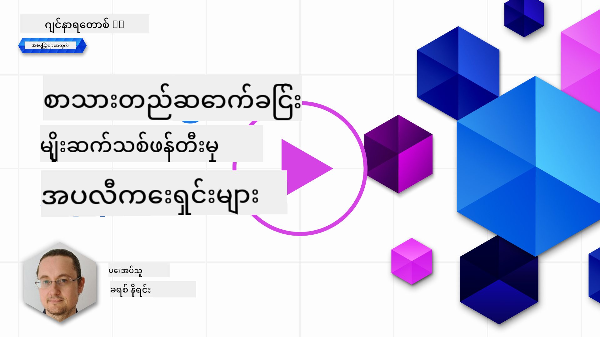

<!--
CO_OP_TRANSLATOR_METADATA:
{
  "original_hash": "ce8224073b86b728ed52b19bed7932fd",
  "translation_date": "2025-07-09T12:12:08+00:00",
  "source_file": "06-text-generation-apps/README.md",
  "language_code": "my"
}
-->
# စာသားဖန်တီးမှု အက်ပလီကေးရှင်းများ တည်ဆောက်ခြင်း

[](https://aka.ms/gen-ai-lesson6-gh?WT.mc_id=academic-105485-koreyst)

> _(ဓာတ်ပုံကိုနှိပ်၍ ဤသင်ခန်းစာ၏ ဗီဒီယိုကိုကြည့်ရှုနိုင်ပါသည်)_

ယခုထိ သင်ကြားမှုအစီအစဉ်တွင် prompt များနှင့် "prompt engineering" ဟုခေါ်သော အထူးနယ်ပယ်တစ်ခုအပါအဝင် အခြေခံအယူအဆများကို တွေ့ရှိခဲ့ပါပြီ။ ChatGPT, Office 365, Microsoft Power Platform စသည့် ကိရိယာများသည် prompt များကို အသုံးပြု၍ တစ်စုံတစ်ရာ ပြုလုပ်နိုင်ရန် ကူညီပေးပါသည်။

သင်၏အက်ပလီကေးရှင်းတွင် ဒီလိုအတွေ့အကြုံကို ထည့်သွင်းလိုပါက prompt, completion စသည့် အယူအဆများကို နားလည်ပြီး အသုံးပြုမည့် library ကို ရွေးချယ်ရပါမည်။ ဒီအခန်းမှာတော့ အဲဒီအကြောင်းတွေကို သင်ယူသွားမှာ ဖြစ်ပါတယ်။

## နိဒါန်း

ဒီအခန်းမှာ သင်:

- openai library နှင့် ၎င်း၏ အခြေခံအယူအဆများကို လေ့လာမည်။
- openai ကို အသုံးပြု၍ စာသားဖန်တီးမှု အက်ပလီကေးရှင်း တည်ဆောက်မည်။
- prompt, temperature, tokens စသည့် အယူအဆများကို အသုံးပြုပြီး စာသားဖန်တီးမှု အက်ပလီကေးရှင်း တည်ဆောက်နည်းကို နားလည်မည်။

## သင်ယူရမည့် ရည်မှန်းချက်များ

ဤသင်ခန်းစာအပြီးတွင် သင်သည်:

- စာသားဖန်တီးမှု အက်ပလီကေးရှင်း ဆိုတာဘာလဲ ဆိုတာ ရှင်းပြနိုင်မည်။
- openai ကို အသုံးပြု၍ စာသားဖန်တီးမှု အက်ပလီကေးရှင်း တည်ဆောက်နိုင်မည်။
- tokens အရေအတွက်ကို ပိုမိုသုံးစွဲခြင်း သို့မဟုတ် လျော့နည်းစွာ သုံးစွဲခြင်းနှင့် temperature ကို ပြောင်းလဲ၍ ထွက်ရှိမှု မတူညီစေခြင်းကို ပြုလုပ်နိုင်မည်။

## စာသားဖန်တီးမှု အက်ပလီကေးရှင်း ဆိုတာဘာလဲ?

ပုံမှန်အားဖြင့် အက်ပလီကေးရှင်းတစ်ခု တည်ဆောက်သောအခါ အောက်ပါအတိုင်း အင်တာဖေ့စ်တစ်ခုရှိပါသည်-

- Command-based. Console အက်ပလီကေးရှင်းများမှာ command တစ်ခုရိုက်ထည့်ပြီး အလုပ်တစ်ခုကို ဆောင်ရွက်ပေးသော အက်ပလီကေးရှင်းများဖြစ်သည်။ ဥပမာ `git` သည် command-based အက်ပလီကေးရှင်းတစ်ခုဖြစ်သည်။
- User interface (UI). အချို့အက်ပလီကေးရှင်းများတွင် button များနှိပ်ခြင်း၊ စာသားထည့်ခြင်း၊ ရွေးချယ်မှုများပြုလုပ်ခြင်း စသည့် graphical user interface (GUI) များပါဝင်သည်။

### Console နှင့် UI အက်ပလီကေးရှင်းများမှာ ကန့်သတ်ချက်ရှိသည်

Command-based အက်ပလီကေးရှင်းတစ်ခုနှင့် နှိုင်းယှဉ်ပါက-

- **ကန့်သတ်ချက်ရှိသည်။** မည်သည့် command မဆို ရိုက်ထည့်၍ မရပါ၊ အက်ပလီကေးရှင်းက ထောက်ပံ့သော command များသာ အသုံးပြုနိုင်သည်။
- **ဘာသာစကားအထူးပြု။** အချို့အက်ပလီကေးရှင်းများသည် ဘာသာစကားများစွာကို ထောက်ပံ့ပေမယ့် ပုံမှန်အားဖြင့် တစ်ခုတည်းသော ဘာသာစကားအတွက် တည်ဆောက်ထားပြီး အခြားဘာသာစကားများ ထည့်သွင်းနိုင်သည်။

### စာသားဖန်တီးမှု အက်ပလီကေးရှင်း၏ အကျိုးကျေးဇူးများ

စာသားဖန်တီးမှု အက်ပလီကေးရှင်းသည် မည်သို့ကွဲပြားသနည်း?

စာသားဖန်တီးမှု အက်ပလီကေးရှင်းတွင် သင်သည် command များ သို့မဟုတ် အထူးသတ်မှတ်ထားသော input ဘာသာစကားတစ်ခုတွင် ကန့်သတ်မထားဘဲ သဘာဝဘာသာစကားဖြင့် အက်ပလီကေးရှင်းနှင့် ဆက်သွယ်နိုင်သည်။ ထို့အပြင် သင်သည် အချက်အလက်များစွာပါဝင်သော ဒေတာအရင်းအမြစ်နှင့် ဆက်သွယ်နေသောကြောင့် ပုံမှန်အက်ပလီကေးရှင်းများက database ထဲရှိ အချက်အလက်များအပေါ် ကန့်သတ်ထားသည့်အတိုင်း မဟုတ်ပါ။

### စာသားဖန်တီးမှု အက်ပလီကေးရှင်းဖြင့် ဘာတွေ တည်ဆောက်နိုင်မလဲ?

တည်ဆောက်နိုင်သည့် အရာများစွာရှိသည်။ ဥပမာ-

- **Chatbot**. ကုမ္ပဏီနှင့် ထုတ်ကုန်များအကြောင်း မေးခွန်းများကို ဖြေဆိုပေးနိုင်သော chatbot တစ်ခု။
- **အကူအညီပေးသူ**. LLM များသည် စာသားကို အကျဉ်းချုပ်ခြင်း၊ စာသားမှ အချက်အလက် ရယူခြင်း၊ ရုပ်သံစာတမ်းများ (resume) စသည်ဖြင့် စာသားထုတ်လုပ်ခြင်းတို့တွင် အထူးကောင်းမွန်သည်။
- **Code assistant**. သင်အသုံးပြုမည့် language model အပေါ်မူတည်၍ ကုဒ်ရေးရာတွင် ကူညီပေးနိုင်သော code assistant တစ်ခု တည်ဆောက်နိုင်သည်။ ဥပမာ GitHub Copilot သို့မဟုတ် ChatGPT ကို အသုံးပြု၍ ကုဒ်ရေးရာကူညီမှုရနိုင်သည်။

## မည်သို့ စတင်ရမည်နည်း?

LLM နှင့် ပေါင်းစည်းရန် နည်းလမ်းနှစ်မျိုးရှိသည်-

- API အသုံးပြုခြင်း။ ဒီမှာ သင်သည် prompt ဖြင့် web request များ ဖန်တီးပြီး ဖန်တီးထားသော စာသားကို ပြန်လည်ရယူသည်။
- Library အသုံးပြုခြင်း။ Library များသည် API ခေါ်ဆိုမှုများကို ထုပ်ပိုးကာ အသုံးပြုရ လွယ်ကူစေသည်။

## Libraries/SDKs

LLM များနှင့် အလုပ်လုပ်ရာတွင် လူသိများသော library များမှာ-

- **openai** - ဒီ library သည် မော်ဒယ်နှင့် ချိတ်ဆက်ပြီး prompt များ ပို့ရန် လွယ်ကူစေသည်။

ထို့အပြင် အဆင့်မြင့် library များမှာ-

- **Langchain** - Langchain သည် လူသိများပြီး Python ကို ထောက်ပံ့သည်။
- **Semantic Kernel** - Semantic Kernel သည် Microsoft မှ ထုတ်လုပ်ပြီး C#, Python, Java ဘာသာစကားများကို ထောက်ပံ့သည်။

## openai ကို အသုံးပြု၍ ပထမဆုံး အက်ပလီကေးရှင်း

ပထမဆုံး အက်ပလီကေးရှင်းကို မည်သို့ တည်ဆောက်မည်၊ မည်သည့် library များလိုအပ်မည်၊ လိုအပ်ချက်များကို ကြည့်ကြရအောင်။

### openai ကို ထည့်သွင်းခြင်း

OpenAI သို့မဟုတ် Azure OpenAI နှင့် ဆက်သွယ်ရန် library များစွာ ရှိသည်။ C#, Python, JavaScript, Java စသည့် programming language များကို အသုံးပြုနိုင်သည်။ ကျွန်ုပ်တို့သည် `openai` Python library ကို ရွေးချယ်ထားပြီး `pip` ဖြင့် ထည့်သွင်းမည်။

```bash
pip install openai
```

### resource တစ်ခု ဖန်တီးခြင်း

အောက်ပါအဆင့်များကို လုပ်ဆောင်ရမည်-

- Azure တွင် အကောင့်တစ်ခု ဖန်တီးပါ [https://azure.microsoft.com/free/](https://azure.microsoft.com/free/?WT.mc_id=academic-105485-koreyst)။
- Azure OpenAI သို့ ဝင်ရောက်ခွင့် ရယူပါ။ [https://learn.microsoft.com/azure/ai-services/openai/overview#how-do-i-get-access-to-azure-openai](https://learn.microsoft.com/azure/ai-services/openai/overview#how-do-i-get-access-to-azure-openai?WT.mc_id=academic-105485-koreyst) သို့ သွား၍ ဝင်ရောက်ခွင့် တောင်းဆိုပါ။

  > [!NOTE]
  > ရေးသားချိန်တွင် Azure OpenAI ဝင်ရောက်ခွင့် ရယူရန် လျှောက်ထားရပါသည်။

- Python ကို ထည့်သွင်းပါ <https://www.python.org/>
- Azure OpenAI Service resource တစ်ခု ဖန်တီးထားရမည်။ resource ဖန်တီးနည်းကို ဒီလင့်ခ်တွင် ကြည့်ရှုနိုင်သည် [create a resource](https://learn.microsoft.com/azure/ai-services/openai/how-to/create-resource?pivots=web-portal?WT.mc_id=academic-105485-koreyst)။

### API key နှင့် endpoint ကို ရှာဖွေခြင်း

ယခုအချိန်တွင် `openai` library သို့ အသုံးပြုမည့် API key ကို သတ်မှတ်ရမည်။ API key ရှာဖွေရန် Azure OpenAI resource ၏ "Keys and Endpoint" အပိုင်းသို့ သွားပြီး "Key 1" ကို ကူးယူပါ။


ဒီအချက်အလက်များကို ကူးယူပြီး library များကို အသုံးပြုရန် ညွှန်ကြားပါမည်။

> [!NOTE]
> API key ကို ကိုးကားရာတွင် ကုဒ်မှ ကွဲထွက်ထားသင့်သည်။ environment variable များဖြင့် ထားသင့်သည်။
>
> - environment variable `OPENAI_API_KEY` ကို သင့် API key ဖြင့် သတ်မှတ်ပါ။
>   `export OPENAI_API_KEY='sk-...'`

### Azure အတွက် configuration ကို ပြင်ဆင်ခြင်း

Azure OpenAI ကို အသုံးပြုပါက configuration ပြုလုပ်နည်းမှာ-

```python
openai.api_type = 'azure'
openai.api_key = os.environ["OPENAI_API_KEY"]
openai.api_version = '2023-05-15'
openai.api_base = os.getenv("API_BASE")
```

အထက်ပါမှာ-

- `api_type` ကို `azure` သတ်မှတ်သည်။ ဒီလို library ကို Azure OpenAI အသုံးပြုရန် ပြောသည်။
- `api_key` သည် Azure Portal တွင် ရှာဖွေထားသော API key ဖြစ်သည်။
- `api_version` သည် အသုံးပြုလိုသော API ဗားရှင်းဖြစ်သည်။ ရေးသားချိန်တွင် နောက်ဆုံးဗားရှင်းမှာ `2023-05-15` ဖြစ်သည်။
- `api_base` သည် API endpoint ဖြစ်ပြီး Azure Portal တွင် API key အနားတွင် ရှိသည်။

> [!NOTE] > `os.getenv` သည် environment variable များကို ဖတ်ရန် အသုံးပြုသော function ဖြစ်သည်။ `OPENAI_API_KEY` နှင့် `API_BASE` ကဲ့သို့သော environment variable များကို ဖတ်ရန် အသုံးပြုနိုင်သည်။ terminal တွင် သို့မဟုတ် `dotenv` ကဲ့သို့သော library ဖြင့် သတ်မှတ်နိုင်သည်။

## စာသား ဖန်တီးခြင်း

စာသားဖန်တီးရန် `Completion` class ကို အသုံးပြုသည်။ ဥပမာ-

```python
prompt = "Complete the following: Once upon a time there was a"

completion = openai.Completion.create(model="davinci-002", prompt=prompt)
print(completion.choices[0].text)
```

အထက်ပါကုဒ်တွင် completion object တစ်ခု ဖန်တီးပြီး အသုံးပြုမည့် model နှင့် prompt ကို ပေးပို့သည်။ ထို့နောက် ဖန်တီးထားသော စာသားကို ပုံနှိပ်သည်။

### Chat completions

ယခုထိ `Completion` ကို အသုံးပြု၍ စာသားဖန်တီးနည်းကို မြင်တွေ့ခဲ့သည်။ သို့သော် chatbot များအတွက် သင့်တော်သော `ChatCompletion` ဟုခေါ်သော class တစ်ခုလည်း ရှိသည်။ အသုံးပြုနည်း ဥပမာ-

```python
import openai

openai.api_key = "sk-..."

completion = openai.ChatCompletion.create(model="gpt-3.5-turbo", messages=[{"role": "user", "content": "Hello world"}])
print(completion.choices[0].message.content)
```

ဒီလုပ်ဆောင်ချက်အကြောင်းကို နောက်ထပ်အခန်းတွင် ဆက်လက်ရှင်းပြမည်။

## လေ့ကျင့်ခန်း - ပထမဆုံး စာသားဖန်တီးမှု အက်ပလီကေးရှင်း

openai ကို ပြင်ဆင်ပြီး အသုံးပြုနည်း သင်ယူပြီးနောက် သင့်ပထမဆုံး စာသားဖန်တီးမှု အက်ပလီကေးရှင်းကို တည်ဆောက်ရန် အောက်ပါအဆင့်များကို လိုက်နာပါ-

1. virtual environment တစ်ခု ဖန်တီးပြီး openai ကို ထည့်သွင်းပါ-

   ```bash
   python -m venv venv
   source venv/bin/activate
   pip install openai
   ```

   > [!NOTE]
   > Windows အသုံးပြုပါက `source venv/bin/activate` အစား `venv\Scripts\activate` ဟု ရိုက်ထည့်ပါ။

   > [!NOTE]
   > Azure OpenAI key ကို ရှာဖွေရန် [https://portal.azure.com/](https://portal.azure.com/?WT.mc_id=academic-105485-koreyst) သို့ သွားပြီး `Open AI` ကို ရှာဖွေပါ၊ `Open AI resource` ကို ရွေးချယ်ပြီး `Keys and Endpoint` တွင် `Key 1` ကို ကူးယူပါ။

1. _app.py_ ဖိုင်တစ်ခု ဖန်တီးပြီး အောက်ပါကုဒ်ကို ထည့်ပါ-

   ```python
   import openai

   openai.api_key = "<replace this value with your open ai key or Azure OpenAI key>"

   openai.api_type = 'azure'
   openai.api_version = '2023-05-15'
   openai.api_base = "<endpoint found in Azure Portal where your API key is>"
   deployment_name = "<deployment name>"

   # add your completion code
   prompt = "Complete the following: Once upon a time there was a"
   messages = [{"role": "user", "content": prompt}]

   # make completion
   completion = openai.chat.completions.create(model=deployment_name, messages=messages)

   # print response
   print(completion.choices[0].message.content)
   ```

   > [!NOTE]
   > Azure OpenAI ကို အသုံးပြုပါက `api_type` ကို `azure` သတ်မှတ်ပြီး `api_key` ကို သင့် Azure OpenAI key ဖြင့် သတ်မှတ်ရမည်။

   အောက်ပါအတိုင်း output တစ်ခုကို မြင်ရမည်-

   ```output
    very unhappy _____.

   Once upon a time there was a very unhappy mermaid.
   ```

## မတူညီသော prompt များ၊ မတူညီသော ရည်ရွယ်ချက်များအတွက်

ယခု prompt အသုံးပြု၍ စာသားဖန်တီးနည်းကို မြင်တွေ့ပြီး သင့်မှာ ပြင်ဆင်ပြောင်းလဲနိုင်သော အစီအစဉ်တစ်ခု ရှိပါပြီ။

Prompt များကို အမျိုးမျိုးသော လုပ်ငန်းများအတွက် အသုံးပြုနိုင်သည်။ ဥပမာ-

- **စာသားအမျိုးအစား ဖန်တီးခြင်း**။ ဥပမာ ကဗျာတစ်ပုဒ်၊ စာမေးပွဲမေးခွန်းများ စသည်ဖြင့် ဖန်တီးနိုင်သည်။
- **အချက်အလက် ရှာဖွေခြင်း**။ ဥပမာ 'web development တွင် CORS ဆိုတာ ဘာလဲ?' ကဲ့သို့သော အချက်အလက် ရှာဖွေရန် prompt များ အသုံးပြုနိုင်သည်။
- **ကုဒ် ဖန်တီးခြင်း**။ ဥပမာ email များကို စစ်ဆေးရန် regular expression ဖန်တီးခြင်း သို့မဟုတ် web app တစ်ခု လုံးကို ဖန်တီးခြင်း။

## ပိုမိုအသုံးဝင်သော ကိစ္စရပ်- ဟင်းချက်နည်း ဖန်တီးသူ

အိမ်တွင် ပါဝင်ပစ္စည်းများရှိပြီး ဟင်းချက်ချင်သည်ဟု စဉ်းစားပါစို့။ အဲဒီအတွက် ဟင်းချက်နည်းတစ်ခု လိုအပ်သည်။ ဟင်းချက်နည်း ရှာဖွေရန် ရှာဖွေမှုစက်တစ်ခု သုံးနိုင်သလို LLM ကိုလည်း အသုံးပြုနိုင်သည်။

အောက်ပါ prompt ကို ရေးနိုင်သည်-

> "chicken, potatoes, carrots ပါဝင်သော ဟင်းချက်အမျိုးအစား ၅ မျိုး ပြပါ။ ဟင်းချက်တစ်ခုစီအတွက် အသုံးပြုသော ပါဝင်ပစ္စည်းများအားလုံးကို ဖော်ပြပါ"

အထက်ပါ prompt အရ ရလာမည့် အဖြေမှာ-

```output
1. Roasted Chicken and Vegetables:
Ingredients:
- 4 chicken thighs
- 2 potatoes, cut into cubes
- 2 carrots, cut into cubes
- 2 tablespoons olive oil
- 2 cloves garlic, minced
- 1 teaspoon dried thyme
- 1 teaspoon dried oregano
- Salt and pepper, to taste

2. Chicken and Potato Stew:
Ingredients:
- 2 tablespoons olive oil
- 1 onion, diced
- 2 cloves garlic, minced
- 2 chicken breasts, cut into cubes
- 2 potatoes, cut into cubes
- 2 carrots, cut into cubes
- 1 teaspoon dried oregano
- 1 teaspoon dried thyme
- 1 cup chicken broth
- Salt and pepper, to taste

3. Chicken and Potato Bake:
Ingredients:
- 2 tablespoons olive oil
- 2 chicken breasts, cut into cubes
- 2 potatoes, cut into cubes
- 2 carrots, cut into cubes
- 1 onion, diced
- 2 cloves garlic, minced
- 1 teaspoon dried oregano
- 1 teaspoon dried thyme
- 1 cup chicken broth
- Salt and pepper, to taste

4. Chicken and Potato Soup:
Ingredients:
- 2 tablespoons olive oil
- 1 onion, diced
- 2 cloves garlic, minced
- 2 chicken breasts, cut into cubes
- 2 potatoes, cut into cubes
- 2 carrots, cut into cubes
- 1 teaspoon dried oregano
- 1 teaspoon dried thyme
- 4 cups chicken broth
- Salt and pepper, to taste

5. Chicken and Potato Hash:
Ingredients:
- 2 tablespoons olive oil
- 2 chicken breasts, cut into cubes
- 2 potatoes, cut into cubes
- 2 carrots, cut into cubes
- 1 onion, diced
- 2 cloves garlic, minced
- 1 teaspoon dried oregano
```

ဒီရလဒ်ကောင်းပါတယ်၊ ဘာချက်မလဲ သိသွားပြီ။ ဒီအချိန်မှာ အဆင်ပြေစေရန် အဆင်ပြေစေမည့် အချက်များမှာ-

- မကြိုက်သော သို့မဟုတ် အာလားဂျီရှိသော ပါဝင်ပစ္စည်းများကို ဖယ်ရှားခြင်း။
- မရှိသေးသော ပါဝင်ပစ္စည်းများအတွက် စျေးဝယ်စာရင်း ထုတ်ပေးခြင်း။

အထက်ပါအခြေအနေများအတွက် အပို prompt တစ်ခု ထည့်ပါ-

> "ကျွန်တော် အာလားဂျီရှိသောကြောင့် ကြက်သွန်ဖြူပါဝင်သော ဟင်းချက်များကို ဖယ်ရှားပေးပါ။ အစားထိုးအရာတစ်ခု ထည့်ပေးပါ။ ထို့အပြင် ကျွန်တော်မှာ chicken, potatoes, carrots ရှိပြီးဖြစ်သော
1. ကျွန်တော်တို့ request အသစ်တစ်ခု ပြုလုပ်မယ်၊ ဒါပေမယ့် ပထမဆုံး prompt မှာ မေးထားတဲ့ token အရေအတွက်ကိုလည်း စဉ်းစားပြီး ဒီတစ်ခါ `max_tokens` ကို 1200 လို့ သတ်မှတ်ပါတယ်။

```python
     completion = openai.Completion.create(engine=deployment_name, prompt=new_prompt, max_tokens=1200)
     ```

ဒီ code ကို လှည့်စားကြည့်ရင် အောက်ပါ output ကို ရရှိမှာ ဖြစ်ပါတယ်။

```output
     No of recipes (for example, 5): 2
     List of ingredients (for example, chicken, potatoes, and carrots): apple,flour
     Filter (for example, vegetarian, vegan, or gluten-free): sugar


     -Apple and flour pancakes: 1 cup flour, 1/2 tsp baking powder, 1/2 tsp baking soda, 1/4 tsp salt, 1 tbsp sugar, 1 egg, 1 cup buttermilk or sour milk, 1/4 cup melted butter, 1 Granny Smith apple, peeled and grated
     -Apple fritters: 1-1/2 cups flour, 1 tsp baking powder, 1/4 tsp salt, 1/4 tsp baking soda, 1/4 tsp nutmeg, 1/4 tsp cinnamon, 1/4 tsp allspice, 1/4 cup sugar, 1/4 cup vegetable shortening, 1/4 cup milk, 1 egg, 2 cups shredded, peeled apples
     Shopping list:
     -Flour, baking powder, baking soda, salt, sugar, egg, buttermilk, butter, apple, nutmeg, cinnamon, allspice
     ```

## သင့် setup ကို တိုးတက်အောင်လုပ်ပါ

ယခုအချိန်မှာ ကျွန်တော်တို့မှာ အလုပ်လုပ်တဲ့ code ရှိပြီးဖြစ်ပေမယ့် ပိုမိုတိုးတက်အောင် ပြင်ဆင်သင့်တဲ့ အချက်အချို့ ရှိပါတယ်။ ပြင်ဆင်သင့်တဲ့ အချက်အချို့မှာ:

- **လျှို့ဝှက်ချက်တွေကို code ကနေ ခွဲထုတ်ထားပါ**, ဥပမာ API key ကဲ့သို့။ လျှို့ဝှက်ချက်တွေကို code ထဲမှာ မထားသင့်ပါဘူး၊ လုံခြုံတဲ့နေရာမှာ သိမ်းဆည်းထားသင့်ပါတယ်။ လျှို့ဝှက်ချက်တွေကို code ကနေ ခွဲထုတ်ဖို့အတွက် environment variables နဲ့ `python-dotenv` ကဲ့သို့သော library တွေကို အသုံးပြုနိုင်ပါတယ်။ အောက်မှာ code နဲ့ ဘယ်လိုလုပ်ရမလဲ ပြထားပါတယ်။

  1. အောက်ပါအတိုင်း `.env` ဖိုင်တစ်ခု ဖန်တီးပါ။

     ```bash
     OPENAI_API_KEY=sk-...
     ```

     
> သတိပြုရန်၊ Azure အတွက်တော့ အောက်ပါ environment variables တွေကို သတ်မှတ်ပေးရပါမယ်။

     ```bash
     OPENAI_API_TYPE=azure
     OPENAI_API_VERSION=2023-05-15
     OPENAI_API_BASE=<replace>
     ```

     Code ထဲမှာတော့ environment variables တွေကို အောက်ပါအတိုင်း load လုပ်နိုင်ပါတယ်။

     ```python
     from dotenv import load_dotenv

     load_dotenv()

     openai.api_key = os.environ["OPENAI_API_KEY"]
     ```

- **Token အရှည်အကြောင်း**။ ကျွန်တော်တို့ လိုချင်တဲ့ စာသားကို ဖန်တီးဖို့ token အရေအတွက်ကို စဉ်းစားသင့်ပါတယ်။ Token တွေက ငွေကုန်ကျစရိတ်ရှိတာကြောင့် ဖြစ်နိုင်သမျှ token အရေအတွက်ကို စီးပွားဖြစ်အောင် သုံးသင့်ပါတယ်။ ဥပမာ prompt ကို ဘယ်လိုဖော်ပြရင် token အနည်းငယ်နဲ့ ရနိုင်မလဲ စဉ်းစားကြည့်ပါ။

  Token အရေအတွက်ကို ပြောင်းလဲချင်ရင် `max_tokens` parameter ကို အသုံးပြုနိုင်ပါတယ်။ ဥပမာ token 100 လိုချင်ရင် အောက်ပါအတိုင်းရေးနိုင်ပါတယ်။

  ```python
  completion = client.chat.completions.create(model=deployment, messages=messages, max_tokens=100)
  ```

- **Temperature နဲ့ စမ်းသပ်ခြင်း**။ Temperature ဆိုတာ ကျွန်တော်တို့ မပြောခဲ့သေးပေမယ့် အရေးကြီးတဲ့ context တစ်ခုပါ။ Temperature တန်ဖိုးမြင့်လာရင် output က ပိုမို အလွဲအလွန် ဖြစ်လာမှာဖြစ်ပြီး၊ တန်ဖိုးနိမ့်လာရင် output က ပိုမို ခန့်မှန်းနိုင်လောက်အောင် ဖြစ်လာမှာ ဖြစ်ပါတယ်။ output မှာ မတူညီမှုရှိစေချင်တာလား၊ မရှိစေချင်တာလား စဉ်းစားပါ။

  Temperature ကို ပြောင်းချင်ရင် `temperature` parameter ကို အသုံးပြုနိုင်ပါတယ်။ ဥပမာ temperature 0.5 သတ်မှတ်ချင်ရင် အောက်ပါအတိုင်းရေးနိုင်ပါတယ်။

  ```python
  completion = client.chat.completions.create(model=deployment, messages=messages, temperature=0.5)
  ```

  > သတိပြုရန်၊ 1.0 နီးပါး ဖြစ်လာရင် output က ပိုမို မတူညီမှုရှိလာမှာ ဖြစ်ပါတယ်။

## အလုပ်အပ်

ဒီအလုပ်အပ်မှာ ဘာလုပ်မလဲ ကိုယ်ရွေးချယ်နိုင်ပါတယ်။

အကြံပြုချက်အချို့ကတော့ -

- Recipe generator app ကို ပိုမိုတိုးတက်အောင် ပြင်ဆင်ပါ။ Temperature တန်ဖိုးတွေနဲ့ prompt တွေကို စမ်းသပ်ပြီး ဘာတွေထွက်လာမလဲ ကြည့်ပါ။
- "study buddy" တစ်ခု တည်ဆောက်ပါ။ ဒီ app က Python ကဲ့သို့သော အကြောင်းအရာတစ်ခုအပေါ် မေးခွန်းတွေကို ဖြေဆိုပေးနိုင်ရမယ်။ ဥပမာ "Python မှာ certain topic ဆိုတာဘာလဲ?" ဆိုတဲ့ prompt တွေ သို့မဟုတ် "certain topic အတွက် code ပြပါ" ဆိုတဲ့ prompt တွေ ထည့်နိုင်ပါတယ်။
- History bot တစ်ခု ဖန်တီးပါ။ သမိုင်းကို အသက်သွင်းပေးဖို့၊ သမိုင်းကာလက လူတစ်ယောက်အဖြစ် bot ကို သတ်မှတ်ပြီး သူ့ဘဝနဲ့ အချိန်ကာလအကြောင်း မေးမြန်းနိုင်ပါစေ။

## ဖြေရှင်းချက်

### Study buddy

အောက်မှာ စတင်အသုံးပြုနိုင်တဲ့ prompt တစ်ခု ရှိပါတယ်၊ ကိုယ်ကြိုက်သလို အသုံးပြုပြီး ပြင်ဆင်နိုင်ပါတယ်။

```text
- "You're an expert on the Python language

    Suggest a beginner lesson for Python in the following format:

    Format:
    - concepts:
    - brief explanation of the lesson:
    - exercise in code with solutions"
```

### History bot

အသုံးပြုနိုင်တဲ့ prompt အချို့ကတော့ -

```text
- "You are Abe Lincoln, tell me about yourself in 3 sentences, and respond using grammar and words like Abe would have used"
- "You are Abe Lincoln, respond using grammar and words like Abe would have used:

   Tell me about your greatest accomplishments, in 300 words"
```

## သိမှတ်စစ်ဆေးခြင်း

Temperature ဆိုတဲ့ အယူအဆက ဘာလုပ်ဆောင်သလဲ?

1. Output က ဘယ်လောက် အလွဲအလွန် ဖြစ်မလဲ ထိန်းချုပ်တယ်။
1. တုံ့ပြန်မှု အရွယ်အစားကို ထိန်းချုပ်တယ်။
1. အသုံးပြုတဲ့ token အရေအတွက်ကို ထိန်းချုပ်တယ်။

## 🚀 စိန်ခေါ်မှု

အလုပ်အပ်မှာ အလုပ်လုပ်တဲ့အခါ temperature ကို မတူညီအောင် ပြောင်းလဲကြည့်ပါ၊ 0, 0.5, 1 တန်ဖိုးတွေ သတ်မှတ်ကြည့်ပါ။ 0 က အနည်းဆုံး မတူညီမှုရှိပြီး 1 က အများဆုံး မတူညီမှုရှိတာ ဖြစ်ပါတယ်။ ကိုယ့် app အတွက် ဘယ်တန်ဖိုးက အကောင်းဆုံးလဲ?

## အလွန်ကောင်းပါတယ်! သင်ယူမှုကို ဆက်လက်လုပ်ဆောင်ပါ

ဒီသင်ခန်းစာပြီးဆုံးပြီးနောက် ကျွန်တော်တို့ရဲ့ [Generative AI Learning collection](https://aka.ms/genai-collection?WT.mc_id=academic-105485-koreyst) ကို ကြည့်ရှုဖို့ မမေ့ပါနဲ့၊ Generative AI အကြောင်း ပိုမိုတိုးတက်စေဖို့ အကောင်းဆုံးနေရာပါ။

Lesson 7 ကို သွားပြီး [chat applications တည်ဆောက်နည်း](../07-building-chat-applications/README.md?WT.mc_id=academic-105485-koreyst) ကို လေ့လာကြမယ်။

**အကြောင်းကြားချက်**  
ဤစာတမ်းကို AI ဘာသာပြန်ဝန်ဆောင်မှု [Co-op Translator](https://github.com/Azure/co-op-translator) ဖြင့် ဘာသာပြန်ထားပါသည်။ ကျွန်ုပ်တို့သည် တိကျမှန်ကန်မှုအတွက် ကြိုးစားသော်လည်း အလိုအလျောက် ဘာသာပြန်ခြင်းတွင် အမှားများ သို့မဟုတ် မှားယွင်းချက်များ ပါဝင်နိုင်ကြောင်း သတိပြုပါရန် မေတ္တာရပ်ခံအပ်ပါသည်။ မူရင်းစာတမ်းကို မူလဘာသာဖြင့်သာ တရားဝင်အရင်းအမြစ်အဖြစ် ယူဆသင့်ပါသည်။ အရေးကြီးသော အချက်အလက်များအတွက် လူ့ဘာသာပြန်ပညာရှင်မှ ဘာသာပြန်ခြင်းကို အကြံပြုပါသည်။ ဤဘာသာပြန်ချက်ကို အသုံးပြုရာမှ ဖြစ်ပေါ်လာနိုင်သည့် နားလည်မှုမှားယွင်းမှုများအတွက် ကျွန်ုပ်တို့သည် တာဝန်မယူပါ။