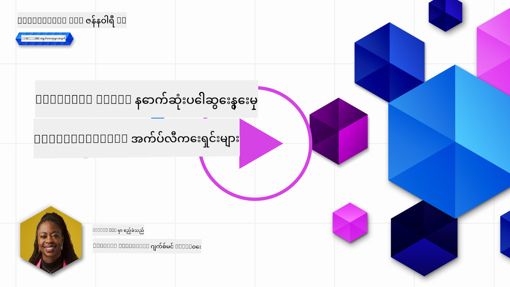
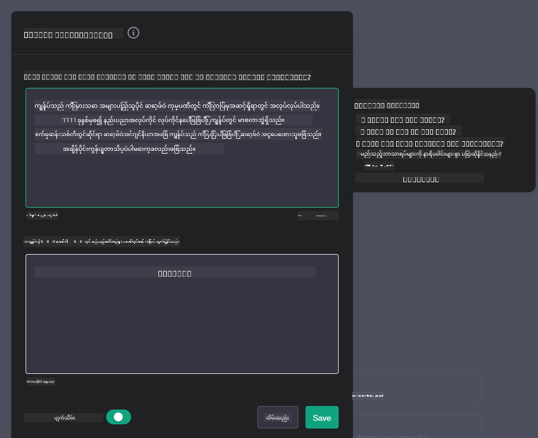
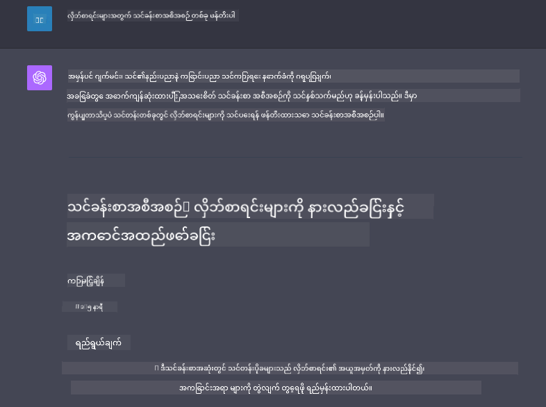

<!--
CO_OP_TRANSLATOR_METADATA:
{
  "original_hash": "ea4bbe640847aafbbba14dae4625e9af",
  "translation_date": "2025-06-25T16:05:28+00:00",
  "source_file": "07-building-chat-applications/README.md",
  "language_code": "my"
}
-->
# Generative AI ပါဝင်သော Chat Applications တည်ဆောက်ခြင်း

[](https://aka.ms/gen-ai-lessons7-gh?WT.mc_id=academic-105485-koreyst)

> _(ဒီသင်ခန်းစာရဲ့ဗီဒီယိုကိုကြည့်ရန် အထက်ပါပုံကိုနှိပ်ပါ)_

ကျွန်တော်တို့က text-generation apps တည်ဆောက်ပုံကို ကြည့်ပြီးဖြစ်သောကြောင့် chat applications အပေါ်တွင်ကြည့်ကြပါစို့။

Chat applications တွင် အရင်းအမြစ်များထက်ပို၍ မကြာခဏ အထူးအဆင့်မြင့်ပုံစံများဖြစ်လာသည်။ ၎င်းတို့သည် ဖောက်သည်ဝန်ဆောင်မှု၊ နည်းပညာပံ့ပိုးမှုနှင့် အတော်လေးအဆင့်မြင့်အကြံပေးစနစ်များတွင် အထောက်အကူပြုသော အပိုင်းများဖြစ်သည်။ မကြာသေးမီက chat application မှ အကူအညီရရှိခဲ့ခြင်းဖြစ်နိုင်ပါသည်။ ၎င်းတို့ကို အထူးအဆင့်မြင့်နည်းပညာများဖြစ်သော generative AI အဖြစ် ပေါင်းစပ်သည့်အခါ ကွဲပြားမှုများနှင့် စိန်ခေါ်မှုများတိုးလာသည်။

ကျွန်တော်တို့ ဖြေရှင်းရမည့်မေးခွန်းများအချို့မှာ -

- **App တည်ဆောက်ခြင်း**။ AI-powered applications များကို သတ်မှတ်ထားသော အသုံးပြုမှုအတွက် ထိရောက်စွာ တည်ဆောက်ခြင်းနှင့် ပေါင်းစပ်ခြင်းကို ကျွန်တော်တို့ ဘယ်လိုလုပ်မလဲ?
- **ထောက်ခံခြင်း**။ တပ်ဆင်ပြီးနောက်မှာ ကျွန်တော်တို့ ဘယ်လို ထောက်ခံပြီး ထိရောက်မှုကို အမြင့်ဆုံးအဆင့်ရှိနေစေရန် လုပ်ဆောင်နိုင်မလဲ၊ လုပ်ဆောင်မှုနှင့် [AI တာဝန်ရှိမှု၏ ငါးခုအခြေခံချက်များ](https://www.microsoft.com/ai/responsible-ai?WT.mc_id=academic-105485-koreyst)ကို လိုက်နာခြင်းအပါအဝင်?

အလိုအလျောက်လုပ်ဆောင်မှုနှင့် လူ-စက်ပစ္စည်း အပြန်အလှန်လုပ်ဆောင်မှုများဖြင့် အထူးသတ်မှတ်သောခေတ်သို့ ကျွန်တော်တို့ ရောက်ရှိလာသောအခါ, chat applications များ၏ စွမ်းရည်, အနက်အနယ်နှင့် အဆင့်မြှင့်နိုင်စွမ်းကို generative AI က ဘယ်လိုပြောင်းလဲစေနိုင်သည်ကို နားလည်ခြင်းမှာ အရေးကြီးသည်။ ဒီသင်ခန်းစာမှာ အဆင့်မြင့်စနစ်များကို ထောက်ပံ့သော architecture ၏ အချက်အလက်များကို စစ်ဆေးမည်, သတ်မှတ်အလုပ်များအတွက် စနစ်ပြုပြင်ခြင်းအတွက် နည်းလမ်းများကို စိတ်ဝင်စားမည်, AI တာဝန်ရှိမှု တပ်ဆင်မှုကို အာမခံရန် ဆိုင်ရာ metrics နှင့် စဉ်းစားချက်များကို အကဲဖြတ်မည်။

## မိတ်ဆက်

ဒီသင်ခန်းစာတွင် -

- Chat applications များကို ထိရောက်စွာ တည်ဆောက်ခြင်းနှင့် ပေါင်းစပ်ခြင်းနည်းလမ်းများ။
- Applications များတွင် စိတ်ကြိုက်ပြုပြင်ခြင်းနှင့် စနစ်ပြုပြင်ခြင်းကို အသုံးပြုပုံ။
- Chat applications များကို ထိရောက်စွာ ထောက်ခံရန် နည်းလမ်းများနှင့် စဉ်းစားချက်များ။

## သင်ယူရမည့်ရည်မှန်းချက်များ

ဒီသင်ခန်းစာအပြီးတွင်၊ သင် -

- ရှိပြီးသားစနစ်များတွင် Chat applications များကို တည်ဆောက်ခြင်းနှင့် ပေါင်းစပ်ခြင်းအတွက် စဉ်းစားချက်များကို ဖော်ပြနိုင်မည်။
- သတ်မှတ်အသုံးပြုမှုအတွက် Chat applications များကို စိတ်ကြိုက်ပြုပြင်နိုင်မည်။
- AI-powered chat applications များ၏ အရည်အသွေးကို ထိရောက်စွာ ထောက်ခံရန်နှင့် ထိန်းသိမ်းရန် အဓိက metrics နှင့် စဉ်းစားချက်များကို ဖော်ထုတ်နိုင်မည်။
- Chat applications များကို AI တာဝန်ရှိမှုဖြင့် အသုံးပြုရန် အာမခံနိုင်မည်။

## Chat Applications များတွင် Generative AI ပေါင်းစပ်ခြင်း

Generative AI ဖြင့် Chat applications များကို မြှင့်တင်ခြင်းသည် ၎င်းတို့ကို ပို၍ ဉာဏ်ရည်မြင့်စေရန်အတွက်သာမက, architecture, စွမ်းဆောင်ရည်နှင့် အသုံးပြုသူမျက်နှာပြင်ကို အထူးသဖြင့် အရည်အသွေးမြင့် အသုံးပြုသူ အတွေ့အကြုံကို ပေးနိုင်ရန် optimize လုပ်ခြင်းကိုပါ အာရုံစိုက်သည်။ ၎င်းသည် architecture အခြေခံများ, API ပေါင်းစပ်မှုများနှင့် အသုံးပြုသူမျက်နှာပြင်ဆိုင်ရာ စဉ်းစားချက်များကို စုံစမ်းခြင်းပါဝင်သည်။ ဒီအပိုင်းမှာ, ရှိပြီးသားစနစ်များတွင် ပေါင်းစပ်ခြင်းဖြစ်စေ, standalone platform အဖြစ် တည်ဆောက်ခြင်းဖြစ်စေ, ဒီအထူးကျယ်ပြန့်သော လမ်းကြောင်းများကို သင်ဆောင်ရွက်ရန် comprehensive roadmap တစ်ခုကို ပေးသွားရန် ရည်ရွယ်သည်။

ဒီအပိုင်း၏အဆုံးတွင်, Chat applications များကို ထိရောက်စွာ တည်ဆောက်ခြင်းနှင့် ပေါင်းစပ်ခြင်းအတွက် လိုအပ်သောကျွမ်းကျင်မှုများကို သင်ရရှိထားမည်ဖြစ်သည်။

### Chatbot သို့မဟုတ် Chat application?

Chat applications များကို တည်ဆောက်ရန်မပြုမီ, 'chatbots' နှင့် 'AI-powered chat applications' ကို နှိုင်းယှဉ်ကြည့်ပါ, ၎င်းတို့သည် ကွဲပြားသော အခန်းကဏ္ဍများနှင့် လုပ်ဆောင်ချက်များကို ဖြည့်ဆည်းပေးသည်။ Chatbot ၏ အဓိကရည်ရွယ်ချက်မှာ သတ်မှတ်ထားသော စကားပြောလုပ်ငန်းများကို အလိုအလျောက်လုပ်ဆောင်ခြင်းဖြစ်သည်, ဥပမာ - မကြာခဏမေးမြန်းသောမေးခွန်းများကို ဖြေဆိုခြင်း သို့မဟုတ် ကုန်ပစ္စည်းတစ်ခုကို ရှာဖွေခြင်း။ ၎င်းသည် သဘောထားအခြေခံသဘောတရား သို့မဟုတ် အထူးအဆင့် AI algorithm များဖြင့် စည်းမျဉ်းထားသည်။ ထိုအပြင်, AI-powered chat application သည် ပို၍ ကျယ်ပြန့်သော ပတ်ဝန်းကျင်ဖြစ်ပြီး လူသားအသုံးပြုသူများအကြား စကားပြောခြင်း, အသံနှင့် ဗီဒီယို chats စသည်ဖြင့် ရုပ်ပိုင်းဆိုင်ရာ ဆက်သွယ်မှုအမျိုးမျိုးကို လုပ်ဆောင်ရန် ရည်ရွယ်ထားသည်။ ၎င်း၏ အထူးလက္ခဏာမှာ, စိတ်ဝင်စားမှုရှိသော, လူသားလိုမျိုးသော စကားပြောများကို အနက်နက်ဆန်းကျယ်သော AI model ကို ပေါင်းစပ်ထားသည်, input နှင့် contextual cues အမျိုးမျိုးအပေါ် အခြေခံ၍ အပြန်အလှန်ပြန်လည်ဖြေဆိုခြင်းကို လုပ်ဆောင်နိုင်သည်။ Generative AI-powered chat application သည် open-domain discussions တွင် ပါဝင်နိုင်သည်, ပြောင်းလဲသော စကားပြောပတ်ဝန်းကျင်များနှင့် အလျင်အမြန် ရုပ်ပြန်လည်ဖြေဆိုနိုင်သည်။

အောက်ပါဇယားသည် digital communication တွင် ၎င်းတို့၏ အထူးအခန်းကဏ္ဍများကို နားလည်ရန် အဓိကကွဲပြားချက်များနှင့် ဆင်တူချက်များကို ဖော်ပြသည်။

| Chatbot                               | Generative AI-Powered Chat Application |
| ------------------------------------- | -------------------------------------- |
| Task-Focused and rule based           | Context-aware                          |
| Often integrated into larger systems  | May host one or multiple chatbots      |
| Limited to programmed functions       | Incorporates generative AI models      |
| Specialized & structured interactions | Capable of open-domain discussions     |

### SDKs နှင့် APIs ဖြင့် အဆင့်မြင့်လုပ်ဆောင်ချက်များကို အသုံးပြုခြင်း

Chat application တစ်ခုကို တည်ဆောက်နေစဉ်, အထူးလုပ်ဆောင်ချက်များကို အရင်ဆုံး စိစစ်ခြင်းမှာ အကောင်းဆုံးခြေလှမ်းတစ်ခုဖြစ်သည်။ SDKs နှင့် APIs များကို အသုံးပြုခြင်းသည် အကောင်းဆုံးနည်းလမ်းတစ်ခုဖြစ်သည်, အထူးသဖြင့် ထိရောက်သောနည်းလမ်းများဖြစ်သည်။ SDKs နှင့် APIs များကို စနစ်ကျသောအခြေခံထားသော application တစ်ခုကို တည်ဆောက်ခြင်းဖြင့်, scalability နှင့် maintenance ပြဿနာများကို ဖြေရှင်းခြင်းဖြင့် application ကို ရေရှည်အောင်မြင်မှုအတွက် စနစ်ကျသောအခြေခံထားသောအခြေအနေတွင် တည်ဆောက်ထားသည်။

- **ဖွံ့ဖြိုးမှုလုပ်ငန်းစဉ်ကို မြန်ဆန်စေပြီး အလုပ်အခလျော့ပေးခြင်း**: အလွန်ကုန်ကျစရိတ်များသောလုပ်ငန်းစဉ်ကို အစား, pre-built functionalities များကို အားထားခြင်းဖြင့် application ၏ အခြားအရေးကြီးသောအပိုင်းများ, ဥပမာ - business logic စသည်ဖြင့် အာရုံစိုက်နိုင်သည်။
- **ပို၍ အကောင်းဆုံးစွမ်းဆောင်ရည်**: စွမ်းဆောင်ချက်များကို အစမှ စတင်တည်ဆောက်နေစဉ်, "ဤအရာသည် ဘယ်လိုscale လုပ်မလဲ? အခု application သည် user များ၏ အလျင်အမြန်ဝင်ရောက်မှုကို လက်ခံနိုင်ပါသလား?" ဟူသောမေးခွန်းများကို မကြာမီမေးမည်ဖြစ်သည်။ SDK နှင့် APIs များသည် အမြဲတမ်းပံ့ပိုးမှုဖြစ်သော built-in solutions များကို လုပ်ဆောင်နိုင်သည်။
- **ပို၍ လွယ်ကူသောထိန်းသိမ်းမှု**: အားလုံးသတ်မှတ်ထားသော API နှင့် SDK များသည် အမြဲတမ်းထိန်းသိမ်းမှုဖြစ်သော library update များကို လုပ်ဆောင်ရန် လွယ်ကူစေသည်။
- **နည်းပညာသစ်များကို ရယူခြင်း**: အကျယ်ပွင့်သော dataset များပေါ်တွင် fine-tuned နှင့် trained လုပ်ထားသော model များကို အသုံးပြုခြင်းဖြင့် application ကို natural language capabilities ဖြင့် ပေးစွမ်းသည်။

SDK သို့မဟုတ် API ၏ လုပ်ဆောင်ချက်ကို အသုံးပြုခြင်းသည် ပေးထားသော ဝန်ဆောင်မှုများကို အသုံးပြုရန် ခွင့်ပြုချက်ရယူခြင်းဖြစ်သည်, ၎င်းသည် အထူး key သို့မဟုတ် authentication token ကို အသုံးပြုခြင်းဖြင့် ဖြစ်သည်။ OpenAI Python Library ကို အသုံးပြုပြီး ၎င်းသည် ဘယ်လိုဖြစ်သည်ကို စုံစမ်းကြည့်မည်။ သင်လည်း [OpenAI notebook](../../../07-building-chat-applications/python/oai-assignment.ipynb) သို့မဟုတ် [Azure OpenAI Services notebook](../../../07-building-chat-applications/python/aoai-assignment.ipynb) တွင် သင့်ကိုယ်တိုင်စမ်းကြည့်နိုင်သည်။

```python
import os
from openai import OpenAI

API_KEY = os.getenv("OPENAI_API_KEY","")

client = OpenAI(
    api_key=API_KEY
    )

chat_completion = client.chat.completions.create(model="gpt-3.5-turbo", messages=[{"role": "user", "content": "Suggest two titles for an instructional lesson on chat applications for generative AI."}])
```

အထက်ပါဥပမာသည် GPT-3.5 Turbo model ကို prompt အတွက် ပြီးမြောက်စေရန် အသုံးပြုသည်, သို့သော် API key ကို set လုပ်ထားသည်ကို သတိပြုပါ။ key ကို set မလုပ်ပါက error ရရှိပါမည်။

## အသုံးပြုသူအတွေ့အကြုံ (UX)

Chat applications များတွင် general UX principles များကို ထည့်သွင်းထားသည်, သို့သော် machine learning components တွင် အထူးအရေးကြီးသော အခြားစဉ်းစားချက်များလည်း ပါဝင်သည်။

- **အမိန့်ပြန်လည်ရှင်းလင်းမှုရှိသော mechanism**: Generative AI models များသည် အမိန့်ရှင်းလင်းမှုရှိသောအဖြေများကို occasionally ပြုလုပ်သည်။ အသုံးပြုသူများအနေဖြင့် အမိန့်ရှင်းလင်းမှုရှိသောအဖြေများကို မေးမြန်းနိုင်ရန် feature တစ်ခုကို ထည့်သွင်းထားသည်။
- **context retention**: အဆင့်မြင့် generative AI models များသည် စကားပြောအတွင်း context ကို မှတ်မိနိုင်သည်, ၎င်းသည် အသုံးပြုသူအတွေ့အကြုံအတွက် အရေးကြီးသောအရည်အသွေးတစ်ခုဖြစ်သည်။ context ကို ထိန်းသိမ်းခြင်းနှင့် စီမံခြင်းကို အသုံးပြုသူများကို လွယ်ကူစေသည်, သို့သော် sensitive user information ကို ထိန်းသိမ်းခြင်း၏အန္တရာယ်ကို ဖြည့်ဆည်းပေးသည်။ retention policy တစ်ခုကို ထည့်သွင်းခြင်းကဲ့သို့သော information ကို ဘယ်လောက်ကြာကြာစိစစ်ထားမည်ဆိုသည်ကို စဉ်းစားခြင်းသည် privacy အပေါ် context ရရှိမှုလိုအပ်ချက်ကို balance လုပ်နိုင်သည်။
- **Personalization**: AI models များသည် သင်ယူခြင်းနှင့် လိုက်နာခြင်းစွမ်းရည်ရှိသည်, အသုံးပြုသူများအတွက် သီးသန့်အတွေ့အကြုံကို ပေးစွမ်းသည်။ user profiles ကဲ့သို့သော feature များဖြင့် user experience ကို စိတ်ကြိုက်ပြုပြင်ခြင်းသည် အသုံးပြုသူကို နားလည်မှုရှိစေပြီး, သီးသန့်အဖြေများကို ရှာဖွေရာတွင် အထောက်အကူပြု၍ ပို၍ ထိရောက်သောနှင့် စိတ်ကျေနပ်မှုရှိသောအပြန်အလှန်ပြန်လည်ဖြေဆိုမှုကို ဖန်တီးသည်။

Personalization ရှိသော ဥပမာတစ်ခုမှာ OpenAI ရဲ့ ChatGPT တွင် "Custom instructions" settings ဖြစ်သည်။ ၎င်းသည် သင့်အကြောင်းကို အရေးကြီးသော context ဖြစ်နိုင်သည်ဟု သတ်မှတ်ထားသောအချက်အလက်ကို ပေးစွမ်းသည်။ Custom instruction ၏ ဥပမာတစ်ခုဖြစ်သည်။



ဒီ "profile" သည် ChatGPT ကို linked lists ပေါ် lesson plan တစ်ခုဖန်တီးရန် prompt လုပ်သည်။ ChatGPT သည် အသုံးပြုသူက ပို၍ အနက်နက်ဆန်းကျယ်သော lesson plan ရှိနိုင်သည်ဟု သတ်မှတ်ထားသည်ကို သတိပြုပါ။



### Microsoft's System Message Framework for Large Language Models

[Microsoft has provided guidance](https://learn.microsoft.com/azure/ai-services/openai/concepts/system-message#define-the-models-output-format?WT.mc_id=academic-105485-koreyst) for writing effective system messages when generating responses from LLMs broken down into 4 areas:

1. မော်ဒယ်သည် ဘယ်သူအတွက် ဖြစ်သည်, ၎င်း၏ စွမ်းရည်နှင့် အကန့်အသတ်များကို သတ်မှတ်ခြင်း။
2. မော်ဒယ်၏ output format ကို သတ်မှတ်ခြင်း။
3. မော်ဒယ်၏ ရည်ရွယ်ထားသော လုပ်ဆောင်ချက်ကို ပြသသော အထူးဥပမာများကို ပေးခြင်း။
4. အပို behavioral guardrails များကို ပေးခြင်း။

### Accessibility

အသုံးပြုသူသည် အမြင်, အကြား, အလှုပ်အရွှေ့သို့မဟုတ် အသိဉာဏ်ခွဲခြားမှုအပြစ်ရှိခြင်းဖြစ်စေ, အကောင်းစွာ-designed လုပ်ထားသော chat application သည် အားလုံးအသုံးပြုနိုင်ရမည်။ အောက်ပါစာရင်းသည် user impairment များအမျိုးမျိုးအတွက် accessibility ပေးစွမ်းရန် ရည်ရွယ်ထားသောအထူး feature များကို ဖော်ပြသည်။

- **အမြင်အပြစ်ရှိသူများအတွက် feature များ**: အမြင့် contrast themes နှင့် resizable text, screen reader compatibility။
- **အကြားအပြစ်ရှိသူများအတွက် feature များ**: Text-to-s

**ဝန်ခံချက်**:  
ဤစာရွက်စာတမ်းကို AI ဘာသာပြန်စနစ် [Co-op Translator](https://github.com/Azure/co-op-translator) ကို အသုံးပြု၍ ဘာသာပြန်ထားပါသည်။ ကျွန်ုပ်တို့သည် တိကျမှန်ကန်မှုအတွက် ကြိုးစားသော်လည်း အလိုအလျောက်ဘာသာပြန်ဆိုမှုများတွင် အမှားများ သို့မဟုတ် မှားယွင်းချက်များ ပါဝင်နိုင်သည်ကို ကျေးဇူးပြု၍ သိရှိပါ။ မူလဘာသာဖြင့် ရေးသားထားသော စာရွက်စာတမ်းကို အာဏာပိုင်အရင်းအမြစ်အဖြစ် ထည့်သွင်းစဉ်းစားသင့်ပါသည်။ အရေးကြီးသော အချက်အလက်များအတွက် ပရော်ဖက်ရှင်နယ် လူ့ဘာသာပြန်ဆိုမှုကို အကြံပြုပါသည်။ ဤဘာသာပြန်ကို အသုံးပြုခြင်းမှ ဖြစ်ပေါ်လာသည့် နားလည်မှုလွဲမှားမှုများ သို့မဟုတ် အဓိပ္ပာယ်လွဲမှားမှုများအတွက် ကျွန်ုပ်တို့သည် တာဝန်မခံပါ။