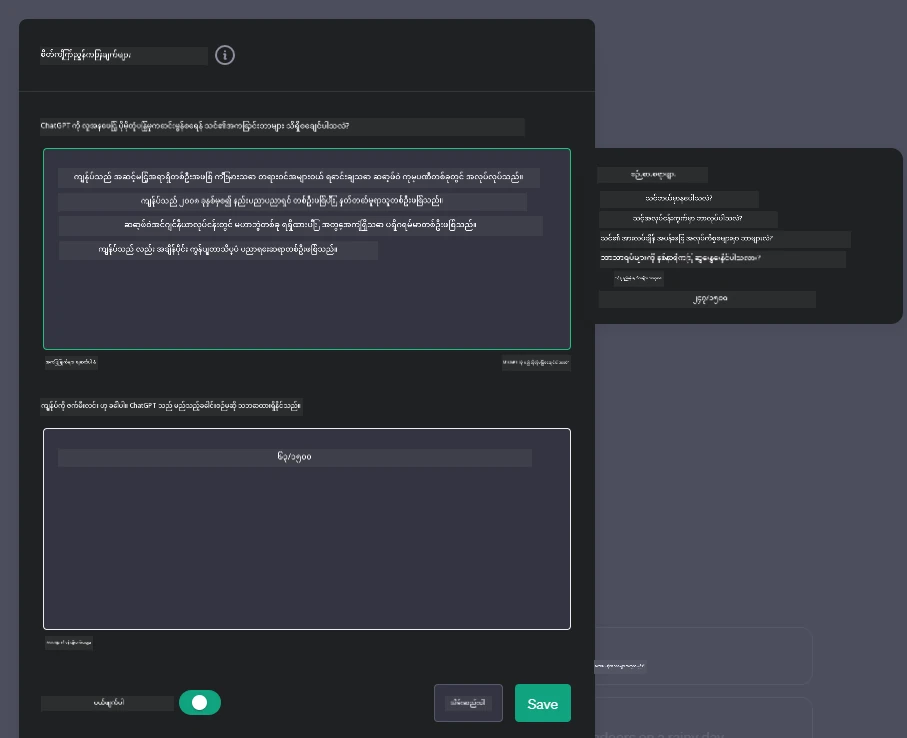

# မူလတန်း AI ကို အသုံးပြုထားသော စကားပြောအက်ပလီကေးရှင်းများတည်ဆောက်ခြင်း

[](https://youtu.be/R9V0ZY1BEQo?si=IHuU-fS9YWT8s4sA)

> _(ဓာတ်ပုံပေါ်ကိုလှည့်၍ ဤသင်ခန်းစာရဲ့ ဗွီဒီယိုကိုကြည့်ရှုနိုင်သည်)_

ယခုအချိန်တွင် စာသားထုတ်လုပ်ရန်အက်ပလီကေးရှင်းများ တည်ဆောက်နည်းကိုကြည့်ပြီးနောက် စကားပြောအက်ပလီကေးရှင်းများအကြောင်း ဝင်ရောက်လေ့လာကြမယ်။

စကားပြောအက်ပလီကေးရှင်းများသည် ကျွန်ုပ်တို့၏နေ့စဉ်ဘဝတွင် ထည့်သွင်းအသုံးချနေပြီး၊ ရိုးရိုးစကားပြောမှုသာမက ဝန်ဆောင်မှု၊ နည်းပညာပိုင်းဆိုင်ရာ ပံ့ပိုးမှုနှင့်ရှုပ်ထွေးသော အကြံပေးစနစ်များတွင်ပါဝင်သည်။ နောက်သို့မဟုတ် မကြာသေးခင်က စကားပြောအက်ပလီကေးရှင်းမှ အကူအညီ ရရှိခဲ့ဖူးနိုင်ပါသည်။ မူလတန်း AI ကဲ့သို့နည်းပညာများကဲ့သို့ အဆင့်မြင့်နည်းပညာများကို ပလက်ဖောင်းများတွင် ပေါင်းသင်းမြှင့်တင်သည့်အခါ၌၊ ရှုပ်ထွေးမှုများ တိုးလာပြီး စိန်ခေါ်ခတ်မှုများပါ တိုးလာသည်။

ဖြေရှင်းရမည့်မေးခွန်းအချို့မှာ-

- **အက်ပလီကေးရှင်းတည်ဆောက်ခြင်း**။ ပြသနာအမျိုးအစားအတွက် ထိရောက်စွာတည်ဆောက်ပြီး ထိန်းသိမ်း ပေါင်းစပ်နိုင်ရမည့်နည်းလမ်းများအဘယ်နည်း?
- **စောင့်ကြည့်ခြင်း**။ တပ်ဆင်ပြီးနောက်တွင် အက်ပလီကေးရှင်းများသည် လုပ်ဆောင်နိုင်စွမ်း အကောင်းဆုံးအဆင့်၌ ရှိနေကြောင်း၊ ဖွင့်ဆိုချက်နှင့် [တာဝန်ရှိသော AI ဆိုင်ရာ မူဝါဒခြောက်ချက်](https://www.microsoft.com/ai/responsible-ai?WT.mc_id=academic-105485-koreyst) ကိုလိုက်နာသည်ကိုမည်သို့စောင့်ကြည့်နိုင်မလဲ?

မော်တော်ပိုင်းနှင့် လူကိရိယာများဆက်သွယ်မှုများသည် အလိုအလြောအလိုအလြောကျသောခေတ်သို့ ရောက်ရှိလာသည့်အခါ တွေ့ကြုံရသော နောက်ချက်ဆန်းသစ်သောပတ်ဝန်းကျင်ကို မူလတန်း AI က ဘယ်လိုပြောင်းလဲသွားသည်ကိုနားလည်မှု ရရှိရန်အရေးကြီးသည်။ ဤသင်ခန်းစာအတွင်း၌ စနစ်ပေါ်တည်သော နည်းဗျူဟာများ၊ နယ်ပယ်အမျိုးအစားအတွက် ကိုက်ညီစွာ ပြုပြင်ခြင်းနည်းလမ်းများနှင့် တာဝန်ရှိစွာ AI ကို အသုံးပြုမှုအတွက်မူဝါဒနှင့် နည်းလမ်းများကို စူးစမ်းလေ့လာမှာ ဖြစ်သည်။

## နိဒါန်း

ဤသင်ခန်းစာတွင် ပါဝင်သောအကြောင်းအရာများမှာ-

- စကားပြောအက်ပလီကေးရှင်းများကို ထိရောက်စွာ တည်ဆောက်ပေါင်းစပ်နည်းများ
- အက်ပလီကေးရှင်းများကို အသုံးပြုသူလိုအပ်ချက်များအတွက် အတိအကျ ပြုပြင်လုပ်ဆောင်ခြင်းနည်းလမ်းများ
- စကားပြောအက်ပလီကေးရှင်းများကို ထိရောက်စွာ စောင့်ကြည့်ထိန်းသိမ်းခြင်း နည်းဗျူဟာများနှင့် အရေးပါချက်များ

## သင်ယူရမည့် ရည်မှန်းချက်များ

သင်ခန်းစာအဆုံးသတ် ထိရောက်စွာ ဆောင်ရွက်နိုင်ပါသည်-

- စကားပြောအက်ပလီကေးရှင်းများကို တည်ဆောက်ပေါင်းစပ်ရာတွင် ပြဿနာများနှင့် အသေးစိတ်ဖော်ပြနိုင်ခြင်း
- အကယ်၍ လိုအပ်သည့် သတ်မှတ်ထားသော လုပ်ဆောင်ချက်များအတွက် စကားပြောအက်ပလီကေးရှင်းများကို ကိုယ်တိုင် ပြုပြင်နိုင်ခြင်း
- AI ဖြင့်တိုးတက်သော စကားပြောအက်ပလီကေးရှင်းများကို ထိထိရောက်ရောက် စောင့်ကြည့်ထိန်းသိမ်းနိုင်ရေး အချက်အလက်များနှင့် ဆိုင်းငံ့ချက်များ အသိပညာရရှိနိုင်ခြင်း
- စကားပြောအက်ပလီကေးရှင်းများတွင် တာဝန်ရှိစွာ AI ကို အသုံးပြုမှုအား သေချာစေရန်

## မူလတန်း AI ကို စကားပြောအက်ပလီကေးရှင်းများတွင် ပေါင်းစပ်ခြင်း

မူလတန်း AI ဖြင့် စကားပြောအက်ပလီကေးရှင်းများကို တိုးတက်စေရန်မှာ ကျွမ်းကျင်မြှင့်တင်ခြင်းသာမက၊ ၎င်း၏နည်းဗျူဟာ၊ စွမ်းဆောင်ရည်နှင့် အသုံးပြုသူတွင်ရရှိမည့် အတွေ့အကြုံအရည်အသွေးတို့ကိုလည်း အာရုံစိုက်ရန် ဖြစ်သည်။ ဤအပိုင်းတွင် ပင်မနည်းဗျူဟာများ၊ API ပေါင်းစပ်မှုများ၊ အသုံးပြုသူအင်တာဖေ့စ်ဆိုင်ရာ စဉ်းစားချက်များအား လေ့လာသွားမည်ဖြစ်ကာ၊ စနစ်များထဲသို့ပေါင်းထည့်ခြင်း သို့မဟုတ် သီးသန့်ပလက်ဖောင်းအဖြစ် တည်ဆောက်ခြင်းတို့အတွက် လမ်းညွှန်ချက်များ ပေးသွားမည်ဖြစ်သည်။

ဤအပိုင်းအဆုံးသတ်သည့်အချိန်၌ စကားပြောအက်ပလီကေးရှင်းများကို ထိရောက်စွာ တည်ဆောက်ပေါင်းစပ်နိုင်ရန် ကျွမ်းကျင်မှုရရှိမည်ဖြစ်သည်။

### ချတ်ဘော့သို့မဟုတ် စကားပြောအက်ပလီကေးရှင်း?

စကားပြောအက်ပလီကေးရှင်းများကို ဖန်တီးခြင်းမတိုင်မီ 'ချတ်ဘော့' နှင့် 'AI ချက်အက်ပလီကေးရှင်း' တို့၏ ကွာခြားချက်များနှင့် လုပ်ဆောင်ချက်များကို နှိုင်းယှဉ်ကြည့်ကြမယ်။ ချတ်ဘော့၏အဓိကအလားအလာမှာ ကြားဆိုတုံ့ပြန်တုံ့ပြန်ခြင်းကိုအလိုအလျောက် ပြုလုပ်ခြင်းဖြစ်သည်၊ ဥပမာ မကြာခဏမေးခွန်းများကိုဖြေခြင်း သို့မဟုတ် ပက်ကေ့ဂျ်ကိစ္စကိုစစ်ဆေးခြင်း စသည်ဖြစ်သည်။ ၎င်းသည် ကျွမ်းကျင်မွန်သော စည်းမျဉ်းအခြေခံ နည်းလမ်းများ သို့မဟုတ် ရှုပ်ထွေးသော AI ခြေလှမ်းများဖြင့် ထိန်းချုပ်ထားသည်။ ကွဲပြားမှုမှာ AI ချတ်အက်ပလီကေးရှင်းမှာ လူတွေ စကားပြောမှုမှတဆင့်စာ၊ အသံ၊ ဗီဒီယိုစကားပြော ဆက်သွယ်မှုစနစ်များကို ပံ့ပိုးရန် ရည်ရွယ်ထားသော တိုးတက်သော နည်းပညာဆိုင်ရာပတ်ဝန်းကျင်ဖြစ်ပြီး မူလတန်း AI မော်ဒယ်ကို ပေါင်းစပ်၍ လူ့စကားပြောဟန်စံ လိုက်နာနေသော စကားပြောများကို ထုတ်ပေးနိုင်မှုရှိသည်။ လိုအပ်ချက်နှင့် ပတ်ဝန်းကျင်အတိုင်းတာဝန်ခံတုံ့ပြန်မှုများ၊ ဖန်တီးမှုများ၊ ရှုပ်ထွေးသော ဆွေးနွေးမှုများ လုပ်ဆောင်နိုင်သည်။

အောက်တွင် ချတ်ဘော့နှင့် မူလတန်း AI ချက်အက်ပလီကေးရှင်းတို့၏ အဓိက ကွာခြားချက်များနှင့် သို့မဟုတ် ဆင်တူချက်များ အပြင်၊ ၎င်းတို့၏မူတည်ရာ အခန်းကဏ္ဍကို လေ့လာနိုင်ရန် ဇယားဖြင့် ဖော်ပြထားသည်။

| ချတ်ဘော့                              | မူလတန်း AI ချက်အက်ပလီကေးရှင်း |
| ------------------------------------- | -------------------------------------- |
| လုပ်ငန်းအာရုံစိုက်ပြီး စည်းမျဉ်းအခြေခံ       | ပတ်ဝန်းကျင်ကိုအသိအမြင်ရှိ            |
| ကြီးမားသောစနစ်များတွင် အများအားဖြင့်မှ ထည့်သွင်း       | တစ်ခု သို့မဟုတ် အများအပြား ချတ်ဘော့ကို ထမ်းဆောင်နိုင်သည်      |
| ကြိုတင်စီစဉ်ထားသော လုပ်ဆောင်ချက်များအတွင်းကနေလုပ်ကိုင်     | မူလတန်း AI မော်ဒယ်များ လက်ရှိ ထည့်သွင်းထားသည်              |
| သီးသန့်နယ်ပယ်နှင့် ဖွဲ့စည်းထားသော ဆက်သွယ်မှုများ     | အဖွဲ့အစည်းအခွင့်အရေး အပြင်၊ မူလတန်းသာ လုပ်ဆောင်နိုင်သည်      |

### SDKs နှင့် APIs တိုက်ရိုက် အသုံးပြု၍ ရှိပြီးသား လုပ်ဆောင်ချက်များကို အသုံးချခြင်း

စကားပြောအက်ပလီကေးရှင်းတည်ဆောက်ရာတွင် ရှိပြီးသားကိရိယာများကို သုံးစွဲခြင်းမှာ အကောင်းဆုံးအစည်းအဝေးဖြစ်သည်။ SDKs နှင့် APIs များကို အသုံးပြုပြီး စကားပြောအက်ပလီကေးရှင်းများ တည်ဆောက်ခြင်းသည် အစုံအလင်သော အကြောင်းရင်းများကြောင့် အကျိုးရှိသော ရည်ရွယ်ချက်ဖြစ်သည်။ အကောင်းမွန်စွာ မှတ်တမ်းတင်ထားသော SDKs နှင့် APIs ပေါင်းစပ်ခြင်းဖြင့် အက်ပလီကေးရှင်းကို ရေရှည်အောင်မြင်မှုအတွက် အဆင်သင့်ပြင်ဆင်ထားခြင်းဖြစ်သည်၊ ပြောင်းလဲနိုင်မှုနှင့် ပြုပြင်ထိန်းသိမ်းမှုအပေါ် စိုးရိမ်မှုများကို ဖြေရှင်းသည်။

- **ဖန်တီးမှု လုပ်ငန်းစဉ်ကို မြန်ဆန်စေပြီး အလွန်ထမ်းပိုးမှု လျော့စေသည်**: ကိုယ်တိုင် တည်ဆောက်ရုံမဟုတ်ပဲ ရှိပြီးသား လုပ်ဆောင်ချက်ကို အသုံးပြုခြင်းက ကုန်ကျစရိတ်ကြီးသောလုပ်ငန်းစဉ်ကို လျော့နည်းစေပြီး၊ သင်အခြားအရေးကြီးသော အချက်များ (ဥပမာ စီးပွားရေး အချက်အလက်) ကြားကိုဖြည့်ရန် ဦးတည်နိုင်သည်။
- **စွမ်းဆောင်ရည်ပိုမိုကောင်းမွန်ခြင်း**: သင် လုပ်ဆောင်ချက်ကို မျှင်ဆောင်သည့်အခါ၊ "ဘယ်လိုအတိုင်းအဆန် တိုးတက်နိုင်မလဲ?", "သုံးစွဲသူများ ရုတ်တရက်တိုးလာပါက ဒါကို ကိုင်တွယ်နိုင်ပါသလား?" ဆိုသော မေးခွန်းများ တက်လာနိုင်စွာဖြစ်သည်။ ကောင်းစွာ ပြုစုပြုပြင်ထားသည့် SDKs နှင့် APIs များတွင် ထိုပြဿနာများအတွက် ဖြေရှင်းချက်များ ပါရှိသည်။
- **ပြုပြင်ထိန်းသိမ်းစောင့်ရှောက်မှု လွယ်ကူခြင်း**: ပိုမိုသစ်သော ဗားရှင်းများ ထွက်လာပါက API များနှင့် SDKs များအတွက်စာကြည့်တိုက် update လုပ်ခြင်းသာ လိုအပ်သည်။
- **နောက်ဆုံးပေါ်နည်းပညာများ အသုံးပြုခွင့်**: ကျယ်ပြန့်စွာ သင်ကြားပြီး သေချာစွာ ပြုပြင်ထားသော မော်ဒယ်များကို တိုးတက်စေရေး နိုင်ပိုင်စွမ်းရှိမှုရှိခြင်းဖြစ်သည်။

SDK သို့ API တစ်ခု၏ လုပ်ဆောင်ချက်များကို အသုံးပြုရန် သင့်အား ပုံမှန်အားဖြင့် အထူး mind key သို့မဟုတ် အတည်ပြုမှတ်တမ်း တစ်ခုလိုအပ်သည်။ ဤသင်ခန်းစာတွင် OpenAI Python Library ကို အသုံးပြုပြီး ဤအရာသည် ဘယ်လိုလဲဆိုတာ ခေတ်မီစွာ လေ့လာနိုင်ပါသည်။ သင်ကိုယ်တိုင် ဒီအရာကို ဒီသင်ခန်းစာအတွက် [OpenAI အတွက် notebook](./python/oai-assignment.ipynb?WT.mc_id=academic-105485-koreyst) သို့မဟုတ် [Azure OpenAI Services အတွက် notebook](./python/aoai-assignment.ipynb?WT.mc_id=academic-105485-koreys) တွင် လေ့လာနိုင်ပါသည်။

```python
import os
from openai import OpenAI

API_KEY = os.getenv("OPENAI_API_KEY","")

client = OpenAI(
    api_key=API_KEY
    )

response = client.responses.create(model="gpt-4o-mini", input="Suggest two titles for an instructional lesson on chat applications for generative AI.", store=False)
print(response.output_text)
```

အထက်ပါ ဥပမာတွင် GPT-4o mini မော်ဒယ်နှင့် Responses API ကို အသုံးပြု၍ ပရိုမ့်ကို ပြီးစီးစေသည်၊ သို့သော် API key ကို သတ်မှတ်ပြီးမှ အသုံးပြုခဲ့သည်ကို မှတ်သားပါ။ key ကို သတ်မှတ်မထားပါက အမှားတက်မည်ဖြစ်သည်။

## အသုံးပြုသူ အတွေ့အကြုံ (UX)

စကားပြောအက်ပလီကေးရှင်းများအတွက် ယေဘုယျ UX မူဝါဒများအပြင်၊ စက်မှုလေ့လာသင်ယူမှု ပါဝင်မှုကြောင့် အဓိကအသိပြုလက်ခံရမည့် အခြားအချက်များလည်း ရှိသည်။

- **ရှင်းလင်းဖျော့ဖြေမှုကို ရှင်းရှင်းလင်းလင်း ဖြေရှင်းပေးနိုင်မှုစနစ်**: မူလတန်း AI မော်ဒယ်များသည်တခါတရံ ပေါ်ပေါက်သော ထင်ရှားမှုမရှိသော ဖြေကြားမှုများ ထုတ်ပေးနိုင်သည်။ အသုံးပြုသူများကို ရှင်းလင်းရန် တောင်းဆိုနိုင်သည့် လက္ခဏာတစ်ခုထည့်သွင်းရန် အသုံးဝင်နိုင်သည်။
- **context ပြန်လည် မှတ်သားမှု**: အဆင့်မြင့် မူလတန်း AI မော်ဒယ်များတွင် စကားပြောမှုထဲမှ ပတ်ဝန်းကျင်ကို မွတ်သားနိုင်မှုရှိသည်၊ ၎င်းသည် အသုံးပြုသူအတွေ့အကြုံတိုးတက်စေနိုင်သော အရာတစ်ခုဖြစ်နိုင်သည်။ အသုံးပြုသူများကို context ကို ထိန်းချုပ်နိုင်စေရန် နှင့် စိတ်ကြိုက် ပြုပြင်နိုင်ခွင့်ပေးခြင်းသည် အသုံးပြုသူအတွေ့အကြုံကို မြှင့်တင်ပေးသော်လည်း၊ sensitive အချက်အလက် သိမ်းဆည်းမှု ဖြစ်တတ်ပြီး ပုဂ္ဂလိကရေးကို ထိခိုက်စေနိုင်သည်။ ၎င်းအချက်အလက် သိုလှောင်မည့် အချိန်ကာလကို သတ်မှတ်ရန် retention policy ပြုလုပ်သည်ဖြင့် context ဂရုထိန်းခြင်းနှင့် ပုဂ္ဂလိကရေး လိုအပ်ချက်တို့ကို ပေါင်းစည်းညီညွတ်စေသည်။
- **ကိုယ်ပိုင်ပြုပြင်နိုင်မှု**: သင်ယူသန့်စင်မှုရှိသော AI မော်ဒယ်များသည် အသုံးပြုသူကိုယ်ပိုင်သဘောထားတို့နှင့် ကိုက်ညီဖွံ့ဖြိုးမှုရှိသော အတွေ့အကြုံများ ပေးစွမ်းနိုင်သည်။ အသုံးပြုသူ ရီဖိုက်(ံ)များကဲ့သို့သော လက္ခဏာများ ဖြင့် ကိုယ်ပိုင်အတွေ့အကြုံ ပေးခြင်းသည် အသုံးပြုသူကို နားလည်ခံစား နိုင်စေသလို သက်သာကောင်းမွန်သော ဆက်သွယ်မှုများ လုပ်ဆောင်ခြင်းတွင် အထောက်အကူပြုသည်။

ပုဂ္ဂလိကပြုပြင်မှု၏ ဥပမာတစ်ခုမှာ OpenAI ၏ ChatGPT အတွက် "Custom instructions" ချိန်ညှိခြင်းဖြစ်သည်။ ၎င်းသည် သင့်အကြောင်း အချက်အလက်များကို ပေးသွင်း၍ ပရိုမ့်များအတွက် အရေးပါတဲ့ context အဖြစ် အသုံးပြုသွားနိုင်သည်။ ဥပမာ custom instruction အောက်ပါအတိုင်းဖြစ်သည်။



ဤ"profile" သည် ChatGPT ကို linked lists အကြောင်း သင်ခန်းစာအစီအစဉ် တည်ဆောက်ရန် ညွှန်ပြသည်။ ChatGPT သည် အသုံးပြုသူ၏ အတွေ့အကြုံအရ ဆွေးနွေးမှုများ တိုးတက်စေရန် အာရုံစိုက်သည်ဟု တွေ့နိုင်ပါသည်။


### Microsoft ၏ ကြီးမားသော ဘာသာစကား မော်ဒယ်များအတွက် System Message Framework

[Microsoft မှ ပေးသည့် လမ်းညွှန်ချက်များ](https://learn.microsoft.com/azure/ai-services/openai/concepts/system-message#define-the-models-output-format?WT.mc_id=academic-105485-koreyst) တွင် LLM များမှ တုံ့ပြန်ချက်များထုတ်ပေးခြင်းအတွက် စနစ်အသံ မှတ်ချက်များရေးသားရာတွင် ကဏ္ဍ ၄ ခုပြထားသည်-

1. မော်ဒယ်၏ အဓိက ရည်ရွယ်ချက်နှင့် ၎င်း၏ စွမ်းရည်ကန့်သတ်ချက်များ သတ်မှတ်ခြင်း။
2. မော်ဒယ်၏ ထုတ်ပေးမည့် ပုံစံသတ်မှတ်ခြင်း။
3. မော်ဒယ်အပြုအမူကို ဖော်ပြသော နမူနာများပေးခြင်း။
4. အပိုဆောင်း အပြုအမူအကာအကွယ်များ ပေးခြင်း။

### ရရှိနိုင်မှု

အသုံးပြုသူတွင် မြင်နိုင်မှု၊ကြားနာနိုင်မှု၊ လျှောက်လှမ်းနိုင်မှု သို့မဟုတ် သဘောလာနားလည်မှု အားနည်းချက်များ ရှိပါကမဆို၊ ကောင်းမွန်စွာ ဒီဇိုင်းလုပ်ထားသော စကားပြောအက်ပလီကေးရှင်း ဖြင့် အားလုံး အဆင်ပြေစွာ အသုံးပြုနိုင်ရမည်။ အောက်ပါစာရင်းတွင် အသုံးပြုသူများ၏ နောက်လိုက်များတင်းမှုအဆင့်လိုက် features များကို ဖော်ပြထားသည်။

- **မြင်နိုင်မှု အားနည်းမှုများအတွက် အင်္ဂါရပ်များ**: မျက်နှာပြင်နှင့် အတိုင်းအတာပြားအရွယ်အစား လျှော့ချနိုင်မှု၊ စက്രീန်းဖတ်စက်အား အထောက်အပံ့။
- **ကြားနာနိုင်မှု အားနည်းမှုများအတွက် အင်္ဂါရပ်များ**: စာသားကို အသံသို့ ပြောင်းခြင်း၊ အသံကို စာသားသို့ပြောင်းခြင်း၊ အသံအသိပေးချက်များအတွက် မြင်သာရေး မျက်နှာအရောင်များ။
- **လျှောက်လှမ်းနိုင်မှု အားနည်းမှုများအတွက် အင်္ဂါရပ်များ**: ကီးဘုတ် ဖြင့် ရွှေ့လျားစောင့်ရှောက်မှု၊ အသံဖြင့် ထိန်းချုပ်မှု။
- **သဘောအလွန် နားလည်မှု အားနည်းမှုများအတွက် အင်္ဂါရပ်များ**: အခြားမူလစာလုံးများ ဖြင့် ရိုးရှင်းအလွယ်ရှင်းလင်းသော ဘာသာစကားရွေးချယ်စရာ။

## နယ်ပယ်အလိုက် ဘာသာစကား မော်ဒယ်များမှ ပြုပြင်ချိန်ညှိခြင်းနှင့် စိတ်ကြိုက်လုပ်ဆောင်ခြင်း

သင်၏ကုမ္ပဏီ အဓိကအသုံးပြုသော စကားလုံးများနားလည်ပတ်သတ်နိုင်ပြီး အသုံးပြုသူများ မကြာခဏမေးမြန်းသည့်မေးခွန်းများကို ဦးစားပေးကြိုတင်ခန့်မှန်းနိုင်သည့် စကားပြောအက်ပလီကေးရှင်းကို စဉ်းစားကြည့်ပါ။

- **DSL မော်ဒယ်များ အသုံးချခြင်း**။ DSL သည် နယ်ပယ်အတွက် သီးသန့်ဘာသာစကားကို ဆိုလိုသည်။ သီးသန့် နယ်ပယ်တွင် သင်ကြားထားသော မော်ဒယ်ကိုအသုံးပြု၍ ၎င်း၏ အကြောင်းအရာများ နှင့် အခြေအနေများကို နားလည်နိုင်ပါသည်။
- **fine-tuning ပြုလုပ်ခြင်း**။ Fine-tuning သည် သတ်မှတ်ထားသော အချက်အလက်ဖြင့် မော်ဒယ်ကို နောက်ထပ် သင်ကြားပေးခြင်းဖြစ်သည်။

## စိတ်ကြိုက်ပြုပြင်ခြင်း: DSL ကို အသုံးပြုခြင်း

နယ်ပယ်အလိုက် ဘာသာစကား မော်ဒယ်များ (DSL Models) ကို အသုံးပြုခြင်းဖြင့် အသုံးပြုသူ၏ ပါဝင်မှုကိုတိုးမြှင့်စေနိုင်ပြီး၊ နယ်ပယ်နှင့် သက်ဆိုင်သော ဆက်သွယ်မှုများ ဖြေရှင်းပေးနိုင်သည်။ ၎င်းသည် သီးသန့်နယ်ပယ်၊ စက်မှုသိပ္ပံ သို့မဟုတ် အကြောင်းအရာများနှင့် သက်ဆိုင်သောစာသား သင်ယူခဲ့သော မော်ဒယ် ဖြစ်သည်။ DSL မော်ဒယ်အသစ်တစ်ခုကို နောက်ဆုံး မည်သည့်အခြေအနေတွင် သင်ကြားစေရန်၊ SDKs နှင့် APIs မှတဆင့် ရှိပြီးသား မော်ဒယ်များကို အသုံးပြုနိုင်ပါသည်။ နောက်ထပ်ရွေးချယ်စရာမှာ fine-tuning ဖြစ်ပြီး၊ ရှိပြီးသားမော်ဒယ်တစ်ခုကို သီးသန့်နယ်ပယ်အတွက် ညှိနှိုင်းပြင်ဆင်ခြင်းဖြစ်သည်။

## စိတ်ကြိုက်ပြုပြင်ခြင်း: fine-tuning အကောင်အထည်ဖော်ခြင်း

Fine-tuning ကို အထူးပြုသည့် နယ်ပယ်တွင် သို့မဟုတ် သတ်မှတ်ထားသော တာဝန်တွင် ရှိနေသော မော်ဒယ်သည် လုံလောက်ပြီး မဟုတ်သောအခါတွင် အသုံးပြုသည်။

ဥပမာအားဖြင့် ဆေးဘက်ဆိုင်ရာ မေးခွန်းများသည် ရှုပ်ထွေးပြီး context အတော်များပါသည်။ ဆရာဝန်တစ်ယောက်သည် လူနာကို ရောဂါသုံးသပ်ရာတွင် ဘဝမှတ်တမ်းများ နှင့် ရှိပြီးသား အခြေအနေများကို ဖော်ထုတ်ထားပြီး၊ နောက်ဆုံး ထွက်ရှိလာသော ဆေးဘက်ဆိုင်ရာ လူမှတ်တမ်းများကို အတည်ပြု ခြင်းဖြင့် အတည်ပြုသည်။ ဤပုံစံများတွင် သာမန် ဆော့ဖြာ AI ချတ်အက်ပလီကေးရှင်း သာမန်အရာအဖြစ် မျှော်လင့်မရပါ။

### အခြေအနေ: ဆေးဘက်ဆိုင်ရာ အက်ပလီကေးရှင်းတစ်ခု

ဆေးဘက်ဆိုင်ရာ ဝန်ထမ်းများကို ကူညီရန် ရည်ရွယ်သည့် လျှပ်တယ်လက်ခံမှု၊ ဆေးဝါးဆက်စပ်မှုများ သို့မဟုတ် နောက်ဆုံးသုတေသနတွေ့ရှိချက်များကို မြန်ဆန်စွာ ရှာဖွေရန် ဖြေရှင်းရန် စကားပြောအက်ပလီကေးရှင်းတစ်ခု စဉ်းစားပါ။

သာမန် မော်ဒယ်တစ်ခုသည် ကျန်းမာရေးဆိုင်ရာ မေးခွန်းရိုးရိုးများ ဖြေကြားရန် သင့်တော်နိုင်ပါက၊ ဤအချက်များတွင် အခက်အခဲရက်ခံနိုင်သည်-

- **အထူးပြု သို့မဟုတ် ရှုပ်ထွေးသော ကိစ္စများ**။ ဥပမာ၊ မြီးကြီးဆရာဝန်တစ်ဦးက "ကလေးသူငယ် Epilepsy ဆေးဝါးဒဏ်ကို ထိန်းချုပ်ရာတွင် လက်ရှိအကောင်းဆုံး လမ်းညွှန်ချက်များ များက ဘာတွေလဲ?" ဟု မေးမြန်းနိုင်သည်။
- **နောက်ဆုံးရ အောင်မြင်မှုများ မပါဝင်ခြင်း**။ သာမန် မော်ဒယ်သည် နောက်ဆုံးရ ဉပဇီဗီဇနည်းပညာ နောက်ဆုံးဖော်ပြချက်များ တွင်ပေါ်တစ်ပြိုင်နက် ဖြေရှင်းရန် အခက်အခဲရှိနိုင်သည်။

ဥပမာတစ်ခုအဖြစ် အထူးပြု ဆေးဘက်ဆိုင်ရာ ဒေတာစုစည်းမှုဖြင့် မော်ဒယ်ကို fine-tuning ပြုလုပ်ခြင်းက ရှုပ်ထွေးသော ဆေးဘက်ဆိုင်ရာမေးခွန်းများကို မှန်ကန်မှန်ကန်၊ ယုံကြည်စိတ်ချစွာ ဖြေရှင်းနိုင်ခြင်းကို တိုးတက်စေသည်။ ၎င်းအတွက် နယ်ပယ်အထူးသော ပြဿနာများနှင့် မေးခွန်းများကို ကိုယ်စားပြုသော အကြီးစားနှင့် သက်ဆိုင်သော ဒေတာစုစည်းမှု ရရှိရန် လိုအပ်သည်။

## အကြောင်းအရာအရည်အသွေးမြင့် AI ထမ်းဆောင်မှု စကားပြောအက်ပလီကေးရှင်းအတွက် စဉ်းစားချက်များ

ဤအပိုင်းတွင်၊ အရည်အသွေးမြင့် စကားပြောအက်ပလီကေးရှင်းများအတွက် မူဝါဒများနှင့် တာဝန်ရှိစွာ AI နည်းပညာအသုံးပြုမှု လမ်းညွှန်ချက်များ တစ်ခုအတိုင်း အရေးပါသော မီထရစ်များ ဖော်ပြထားသည်။

### အရေးပါသောမီထရစ်များ

အက်ပလီကေးရှင်း၏ အရည်အသွေးမြင့် စွမ်းဆောင်မှု ထိန်းသိမ်းရန် အရေးပါသော မီထရစ်များကို စောင့်ကြည့်ခြင်း လိုအပ်ပါသည်။ ဤတိုင်းတာခြင်းများသည် အက်ပလီကေးရှင်းအလုပ်လုပ်မှုသာမက AI မော်ဒယ်နှင့် အသုံးပြုသူ အတွေ့အကြုံကိုအရည်အသွေးအားဖြင့် သုံးသပ်ရန်လည်း အသုံးဝင်သည်။ အောက်ဖော်ပြပါ စာရင်းတွင် အခြေခံ၊ AI နှင့် အသုံးပြုသူအတွေ့အကြုံဆိုင်ရာ မီထရစ်များ ပါဝင်သည်။

| မီထရစ်                        | အဓိပ္ပါယ်                                                                                                             | စကားပြောဖန်တီးသူအတွက် စဉ်းစားရန်                                             |
| ----------------------------- | ---------------------------------------------------------------------------------------------------------------------- | ------------------------------------------------------------------------- |
| **အချိန်တည်ရှိမှု (Uptime)**           | အက်ပလီကေးရှင်းအလုပ်လုပ်နေချိန် နှင့် အသုံးပြုသူများ အထိ လက်လှမ်းမီမှုကိုတိုင်းတာသည်။                                              | Downtime ကို မည်သို့လျော့ချမည်နည်း?                                           |
| **တုံ့ပြန်ချိန် (Response Time)**          | အသုံးပြုသူ မေးခွန်း ရဲ့တုံ့ပြန်မှုကို အက်ပလီကေးရှင်းက မျှော်လင့်မှုပြန်ကြားမည့်ချိန်။                                                          | တုံ့ပြန်ချိန် မြှင့်တင်ရန် မေးခွန်းများ နှောင့်နှေးမှု ကို မည်သို့ကောင်းထည့်မည်နည်း?           |
| **တိကျမှု (Precision)**              | အတိအကျအနေနှင့်မှန်ကန်သော အတုံ့ပြန်မှု၏ အချိုးအစား။                                     | မော်ဒယ်၏တိကျမှုကို မည်သို့ အတည်ပြုမည်နည်း?                        |
| **အသိပညာရှင် (Recall, Sensitivity)**     | တကယ်မှန်ကန်သော အတုံ့ပြန်မှုများ၏ အချိုးအစား။                                               | Recall ကို မည်သို့တိုင်းတာပြီး မြှင့်တင်မည်နည်း?                                  |
| **F1 Score**                  | တိကျမှုနှင့် သတိရမှုတို့ ကြား မြှေ့တင်ခြင်းအညီ သော အလယ်အလတ်တန်ဖိုးဟု သတ်မှတ်သည်။                                   | သင်၏ F1 Score ရည်မှန်းချက်မှာ ဘယ်လိုဖြစ်မည်နည်း? တိကျမှုနှင့် သတိရမှုကို မည်သို့ညီညွတ်စေမည်နည်း?  |
| **Perplexity**                | မော်ဒယ်ကခန့်မှန်းထားသည့်ဖြန့်ဝေမှုနှင့် ဒေတာတကယ်ဖြန့်ဝေမှု အတူတူ ဖြစ်မဖြစ် အတိုင်းအတာ။ | Perplexity ကို မည်သို့လျော့နည်းစေမည်နည်း?                                         |
| **အသုံးပြုသူ စိတ်ကျေနပ်မှု မီထရစ်များ** | အသုံးပြုသူများ၏ အက်ပလီကေးရှင်း အပေါ် အမြင်နှင့် သဘောထားကိုတိုင်းတာသည်။ မေးမြန်းချက်များမှတစ်ဆင့် အချက်အလက်ရရှိသည်။                                     | အသုံးပြုသူ ရဲ့တုံ့ပြန်ချက်ကို မည်မျှကြိမ် စုဆောင်းမည်နည်း? ၎င်းပေါ် အခြေခံပြီး ဘယ်လိုပြန်လည်ပြင်ဆင်ပါမည်? |
| **အမှားနှုန်း (Error Rate)**           | မော်ဒယ်သည် နားလည်မှု သို့မဟုတ် ထုတ်လွှင့်မှုတွင် အမှားပြုတဲ့ အတိုင်းအတာ။                                                 | အမှားနှုန်း လျော့ချရန် မည်သည့်နည်းဗျူဟာများရှိပါသလဲ?               |
| **ပြန်လည်သင်ကြားခြင်း ကွက်များ (Retraining Cycles)**       | မော်ဒယ်အား ဒေတာအသစ်များနှင့် သိရှိချက်များဖြင့် ပြန်လည်သင်ကြား သည့်အကြိမ်ရေ။                                    | မည်မျှကြိမ်နှုန်းဖြင့် မော်ဒယ်ကို ပြန်လည်သင်ကြားမည်နည်း? ပြန်လည်သင်ကြားမှု စတင်ရန် အကြောင်းရင်းများဘာလဲ?   |

| **ကြောင့်ကွဲခြားမှုရှာဖွေခြင်း**         | မျှော်မှန်းထားသောအပြုအမူနှင့် ကိုက်ညီမှုမရှိသော ပုံစံများကို ဖော်ထုတ်ရန် ကိရိယာများနှင့် နည်းပညာများ။                        | ကြောင့်ကွဲခြားမှုများကို မည်သို့တုံ့ပြန်မည်နည်း?                                        |

### စကားပြောလျှောက်လမ်းများတွင် တာဝန်ယူသော AI လေ့ကျင့်ပုံများ တပ်ဆင်ခြင်း

Microsoft ၏ တာဝန်ယူနိုင်သော AI နည်းလမ်းသည် AI ဖွံ့ဖြိုးတိုးတက်မှုနှင့် အသုံးပြုမှုကို ဦးဆောင်ပေးသင့်သည်ဟု ယူဆထားသည့် စည်းကမ်းခြင်း ခြောက်ခုအား တွက်ချက်ထားသည်။ အောက်တွင် စည်းကမ်းများ၊  အဓိပ္ပါယ်များနှင့် စကားပြော အဖွဲ့ထွက်သူ တစ်ဦးအနေဖြင့် စဉ်းစားသင့်သည့်အချက်များနှင့် အဘယ်ကြောင့် ထိုစည်းကမ်းများကို တည်မြဲစွာ လိုက်နာသင့်ကြောင်း ဖော်ပြထားသည်။

| စည်းကမ်းများ             | Microsoft ၏ အဓိပ္ပါယ်                                  | စကားပြော အဖွဲ့ထွက်သူများအတွက် ထည့်သွင်းစဉ်းစားရမည့်အချက်များ           | အရေးကြီးသောအကြောင်းရင်း                                                                   |
| ---------------------- | ----------------------------------------------------- | ---------------------------------------------------------------------- | -------------------------------------------------------------------------------------- |
| တရားမျှတမှု               | AI စနစ်များသည် လူအားလုံးကို တရားမျှတစွာ သယောဇဉ်ဆောင်ရမည်။       | စကားပြောလျှောက်လမ်းသည် အသုံးပြုသူဒေတာအပေါ် မကွဲပြားခြားနားမှု မရှိအောင် သေချာစေရန်။ | အသုံးပြုသူအကြား ယုံကြည်မှုနှင့် အပေါင်းအသင်း ဖန်တီးရန်; ရာဇဝတ်မှုပြဿနာများမှကာကွယ်ရန်။                  |
| ယုံကြည်စိတ်ချမှုနှင့် လုံခြုံမှု | AI စနစ်များသည် ယုံကြည်စိတ်ချရ၍ လုံခြုံစွာ ဆောင်ရွက်သင့်သည်။           | အမှားချို့ယွင်းမှုနှင့် အန္တရာယ်များကိုလျှော့ချရန် စမ်းသပ်ခြင်းနှင့် ထပ်တိုးကာကွယ်စောင့်ကြည့်မှုများ ထည့်သွင်းပါ။         | အသုံးပြုသူ စိတ်တိုင်းကျမှုကို အာမခံပေးပြီး ဖြစ်နိုင်သောထိခိုက်မှုများကိုကာကွယ်ပေးသည်။                                 |
| ကိုယ်ရေးကိုယ်တာနှင့် လုံခြုံရေး   | AI စနစ်များ သည် လုံခြုံမှုရှိ၍ ကိုယ်ရေးကိုယ်တာကို မဆန့်ကျင်သင့်ပါ။       | ခိုင်မာသော စာရင်းအင်းလုံခြုံရေးနည်းပညာများနှင့် ဒေတာကာကွယ်မှု ဖန်တီးမှုများကို ဆောင်ရွက်ပါ။              | အသုံးပြုသူများ၏ ကိုယ်ရေးကိုယ်တာ အချက်အလက်များကို စောင့်ရှောက်ကာကွယ်ရန်နှင့် ကိုယ်ရေးကိုယ်တာဥပဒေများနှင့် ကိုက်ညီစေရန်။      |
| ပါဝင်ဆောင်ရွက်ခြင်း          | AI စနစ်များသည် လူတိုင်းအား ပါဝင်စေပြီး လူများနှင့် ဆက်သွယ်နိုင်စေရမည်။ | အမျိုးမျိုးသော အသုံးပြုသူအုပ်စုများအတွက် အသုံးပြုရ လွယ်ကူသော UI/UX ကို ဒီဇိုင်းဆွဲပါ။ | လက်တွေ့အသုံးပြုနိုင်သော လူအုပ်စုများ ရှိတိုးပွားစေရန် အာမခံပေးသည်။                                           |
| ဖော်ပြနိုင်မှု           | AI စနစ်များသည် နားလည်လွယ်ကူစေရမည်။                  | AI ဖြေဆိုချက်များအတွက် အသေးစိတ် အရေးအသားနှင့် ရှင်းလင်းမှုရှိသော အကြောင်းပြချက်များ ပေးပါ။          | အသုံးပြုသူများသည် ဆုံးဖြတ်ချက်များ ပြုလုပ်ပုံကို နားလည်နိုင်ပြီး စနစ်ကို ယုံကြည်မှုရှိစေရန်ဖြစ်သည်။             |
| တာဝန်ယူမှု         | လူများသည် AI စနစ်များအတွက် တာဝန်ယူရမည်။          | AI ဆုံးဖြတ်ချက်များအား စစ်ဆေးခြင်းနှင့် တိုးတက်အောင် ပြုလုပ်ခြင်း ဖြစ်စဉ်ကို သေချာ သတ်မှတ်ပါ။     | မှားယွင်းမှုများ ဖြစ်ပေါ်လာပါက ဆက်လက်တိုးတက်မှုနှင့် ပြုပြင်မှုများနှင့်အတူ ပြုလုပ်နိုင်စေရန်ဖြစ်သည်။               |

## လုပ်ငန်းအပ်နိပ်

[assignment](../../../07-building-chat-applications/python) ကို ကြည့်ပါ။ သင်၏ ပထမဆုံး စကားပြော အမိန့်များကို တင်သွင်းခြင်း၊ စာသားများ မျှဝေခြင်းနှင့် ခေါင်းစဉ် ဖော်ပြခြင်း နှင့် ထို့အပြင် အခြားလုပ်ဆောင်ချက် တစ်စုတစ်စည်းကို လေ့ကျင့်ပေးပါလိမ့်မည်။ လုပ်ငန်းအပ်နိပ်များကို ပရိုဂရမ်မင်းဘာသာစကား မတူညီစွာ ရရှိနိုင်ကြောင်း သတိပြုပါ!

## သက်ရောက်မှုကောင်းမွန်သော အလုပ်! ခရီးကို ဆက်လက်ပါ

ဤသင်ခန်းစာကို ပြီးစီးပြီးနောက် [Generative AI Learning collection](https://aka.ms/genai-collection?WT.mc_id=academic-105485-koreyst) ကို ကြည့်ရှုပြီး သင်၏ Generative AI ဗဟုသုတကို ဆက်လက်မြှင့်တင်ပါ!

ကိုယ်တိုင်စူးစမ်းစရာ လေး Lesson 8 သို့ ရောက်ရှိပါက [ရှာဖွေရေးလျှောက်လမ်းများ တည်ဆောက်ခြင်း](../08-building-search-applications/README.md?WT.mc_id=academic-105485-koreyst) ကို စတင်နိုင်သည်။

---

<!-- CO-OP TRANSLATOR DISCLAIMER START -->
**ပြောကြားချက်**
ဤစာတမ်းကို AI ဘာသာပြန်ဝန်ဆောင်မှု [Co-op Translator](https://github.com/Azure/co-op-translator) အသုံးပြု၍ ဘာသာပြန်ထားပါသည်။ ကျွန်ုပ်တို့သည် တိကျမှန်ကန်မှုအတွက် ကြိုးပမ်းနေသော်လည်း၊ စက်ကိရိယာဘာသာပြန်ခြင်းများတွင် အမှားများ သို့မဟုတ် မှားယွင်းချက်များ ပါဝင်နိုင်ကြောင်း သတိပြုပါရန် လိုအပ်ပါသည်။ မူလစာတမ်းကို မူရင်းဘာသာဖြင့်သာ ယုံကြည်စိတ်ချရသော အချက်အလက်အဖြစ် သတ်မှတ်သင့်သည်။ အရေးကြီးသည့် သတင်းအချက်အလက်များအတွက် ပရော်ဖက်ရှင်နယ် လူသားဘာသာပြန်သူဝန်ဆောင်မှုကို အကြံပြုပါသည်။ ဤဘာသာပြန်ချက်ကို အသုံးပြုခြင်းမှ ဖြစ်ပေါ်လာသော နားလည်မှုကွာခြားမှုများ သို့မဟုတ် မမှန်ကန်သော အသုံးပြုမှုများအတွက် ကျွန်ုပ်တို့ တာဝန်မခံပါ။
<!-- CO-OP TRANSLATOR DISCLAIMER END -->