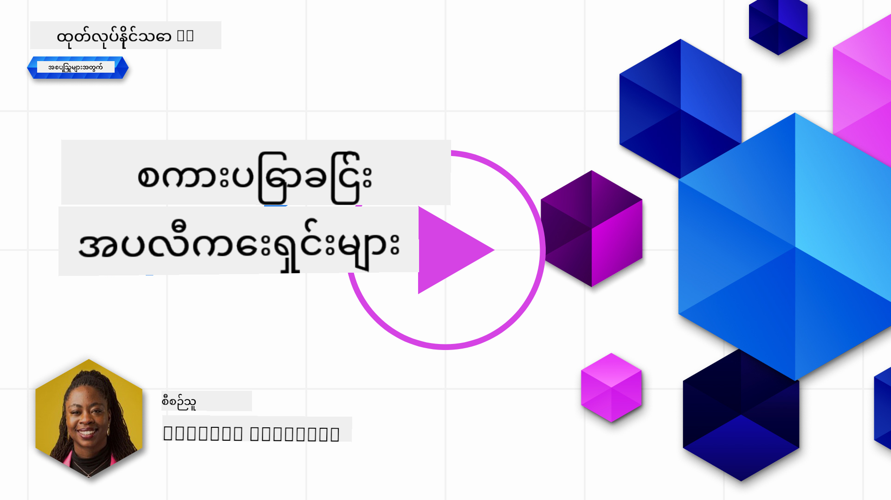

<!--
CO_OP_TRANSLATOR_METADATA:
{
  "original_hash": "ea4bbe640847aafbbba14dae4625e9af",
  "translation_date": "2025-07-09T12:43:52+00:00",
  "source_file": "07-building-chat-applications/README.md",
  "language_code": "my"
}
-->
# Generative AI ဖြင့် စွမ်းဆောင်ထားသော စကားပြော အက်ပလီကေးရှင်းများ တည်ဆောက်ခြင်း

[](https://aka.ms/gen-ai-lessons7-gh?WT.mc_id=academic-105485-koreyst)

> _(ဓာတ်ပုံကို နှိပ်၍ ဤသင်ခန်းစာ၏ ဗီဒီယိုကို ကြည့်ရှုနိုင်ပါသည်)_

ယခုအခါ ကျွန်ုပ်တို့သည် စာသားဖန်တီးခြင်း အက်ပလီကေးရှင်းများကို ဘယ်လို တည်ဆောက်နိုင်သည်ကို ကြည့်ရှုခဲ့ပြီးဖြစ်သည်။ ယခုမှာတော့ စကားပြော အက်ပလီကေးရှင်းများကို လေ့လာကြမည်။

စကားပြော အက်ပလီကေးရှင်းများသည် ကျွန်ုပ်တို့၏ နေ့စဉ်ဘဝတွင် ပေါင်းစည်းသွားပြီး ရိုးရိုးစကားပြောခြင်းထက် ပိုမိုကျယ်ပြန့်သော ဝန်ဆောင်မှုများကို ပေးဆောင်နေသည်။ ၎င်းတို့သည် ဖောက်သည်ဝန်ဆောင်မှု၊ နည်းပညာဆိုင်ရာ ထောက်ခံမှုနှင့် တောင်တက်သော အကြံပေးစနစ်များတွင် အရေးပါသော အစိတ်အပိုင်းများဖြစ်လာသည်။ မကြာသေးမီက သင်သည် စကားပြော အက်ပလီကေးရှင်းတစ်ခုမှ အကူအညီရရှိခဲ့ဖြစ်နိုင်သည်။ Generative AI ကဲ့သို့သော နည်းပညာများကို ပိုမိုတိုးတက်စွာ ပေါင်းစည်းသွားသည်နှင့်အမျှ စနစ်၏ ရှုပ်ထွေးမှုများနှင့် စိန်ခေါ်မှုများလည်း တိုးလာသည်။

ဖြေရှင်းရမည့် မေးခွန်းအချို့မှာ -

- **အက်ပလီကေးရှင်း တည်ဆောက်ခြင်း**။ သတ်မှတ်ထားသော အသုံးပြုမှုများအတွက် AI စွမ်းဆောင်ရည်ပါ အက်ပလီကေးရှင်းများကို ထိရောက်စွာ ဘယ်လို တည်ဆောက်ပြီး ပေါင်းစည်းနိုင်မလဲ?
- **စောင့်ကြည့်ခြင်း**။ တပ်ဆင်ပြီးနောက် အက်ပလီကေးရှင်းများသည် လုပ်ဆောင်ချက်နှင့် [တာဝန်ရှိသော AI ၏ အခြေခံ 원칙 ၆ ချက်](https://www.microsoft.com/ai/responsible-ai?WT.mc_id=academic-105485-koreyst) ကို လိုက်နာမှုအရ အမြင့်ဆုံး အရည်အသွေးဖြင့် လည်ပတ်နေကြောင်း ဘယ်လို စောင့်ကြည့်နိုင်မလဲ?

အလိုအလျောက်လုပ်ငန်းစဉ်များနှင့် လူ-စက် ဆက်သွယ်မှုများ ပိုမိုချောမွေ့လာသည့် ယခုခေတ်တွင် generative AI သည် စကားပြော အက်ပလီကေးရှင်းများ၏ အကျယ်အဝန်း၊ အနက်အဓိပ္ပာယ်နှင့် ကိုက်ညီမှုကို ဘယ်လို ပြောင်းလဲသွားသည်ကို နားလည်ခြင်းမှာ အရေးကြီးသည်။ ဤသင်ခန်းစာတွင် စနစ်ဖွဲ့စည်းမှုဆိုင်ရာ အချက်အလက်များ၊ အထူးကဏ္ဍအတွက် အတိအကျ ပြင်ဆင်ခြင်းနည်းလမ်းများနှင့် တာဝန်ရှိသော AI တပ်ဆင်မှုအတွက် လိုအပ်သော အတိုင်းအတာများနှင့် စဉ်းစားစရာများကို လေ့လာသွားမည်ဖြစ်သည်။

## နိဒါန်း

ဤသင်ခန်းစာတွင် -

- စကားပြော အက်ပလီကေးရှင်းများကို ထိရောက်စွာ တည်ဆောက်ခြင်းနှင့် ပေါင်းစည်းခြင်းနည်းလမ်းများ။
- အက်ပလီကေးရှင်းများကို ကိုယ်ပိုင်ပြင်ဆင်ခြင်းနှင့် အတိအကျ ပြင်ဆင်ခြင်း။
- စကားပြော အက်ပလီကေးရှင်းများကို ထိရောက်စွာ စောင့်ကြည့်ရန် မဟာဗျူဟာများနှင့် စဉ်းစားစရာများ။

## သင်ယူရမည့် ရည်မှန်းချက်များ

ဤသင်ခန်းစာပြီးဆုံးသည်နှင့် -

- စကားပြော အက်ပလီကေးရှင်းများကို ရှိပြီးသား စနစ်များတွင် ဘယ်လို တည်ဆောက်ပြီး ပေါင်းစည်းရမည်ကို ဖော်ပြနိုင်မည်။
- သတ်မှတ်ထားသော အသုံးပြုမှုများအတွက် စကားပြော အက်ပလီကေးရှင်းများကို ကိုယ်ပိုင်ပြင်ဆင်နိုင်မည်။
- AI စွမ်းဆောင်ရည်ပါ စကားပြော အက်ပလီကေးရှင်းများ၏ အရည်အသွေးကို ထိရောက်စွာ စောင့်ကြည့်ရန် အဓိက အတိုင်းအတာများနှင့် စဉ်းစားစရာများကို ဖော်ထုတ်နိုင်မည်။
- စကားပြော အက်ပလီကေးရှင်းများတွင် AI ကို တာဝန်ရှိစွာ အသုံးပြုနိုင်မည်။

## Generative AI ကို စကားပြော အက်ပလီကေးရှင်းများတွင် ပေါင်းစည်းခြင်း

Generative AI ဖြင့် စကားပြော အက်ပလီကေးရှင်းများကို မြှင့်တင်ခြင်းသည် ပိုမိုတော်တဆမှုရှိစေခြင်းသာမက၊ ၎င်းတို့၏ စနစ်ဖွဲ့စည်းမှု၊ စွမ်းဆောင်ရည်နှင့် အသုံးပြုသူ အင်တာဖေ့စ်ကို အကောင်းဆုံးဖြစ်စေရန် ဖြစ်သည်။ ၎င်းတွင် စနစ်ဖွဲ့စည်းမှု အခြေခံများ၊ API ပေါင်းစည်းမှုများနှင့် အသုံးပြုသူ အင်တာဖေ့စ်ဆိုင်ရာ စဉ်းစားချက်များကို လေ့လာခြင်း ပါဝင်သည်။ ဤအပိုင်းသည် ရှိပြီးသား စနစ်များတွင် ပေါင်းစည်းခြင်းဖြစ်စေ၊ သီးသန့် စနစ်အဖြစ် တည်ဆောက်ခြင်းဖြစ်စေ၊ စကားပြော အက်ပလီကေးရှင်းများကို ထိရောက်စွာ တည်ဆောက်ပြီး ပေါင်းစည်းနိုင်ရန် လမ်းညွှန်ချက်များကို ပေးရန် ရည်ရွယ်သည်။

ဤအပိုင်းပြီးဆုံးသည်နှင့် သင်သည် စကားပြော အက်ပလီကေးရှင်းများကို ထိရောက်စွာ တည်ဆောက်ပြီး ပေါင်းစည်းနိုင်မည့် ကျွမ်းကျင်မှုများ ရရှိထားမည်ဖြစ်သည်။

### Chatbot နဲ့ စကားပြော အက်ပလီကေးရှင်း?

စကားပြော အက်ပလီကေးရှင်းများ တည်ဆောက်ရန် မတိုင်မီ 'chatbot' နှင့် 'AI စွမ်းဆောင်ရည်ပါ စကားပြော အက်ပလီကေးရှင်း' တို့၏ ကွာခြားချက်များကို နှိုင်းယှဉ်ကြည့်ရအောင်။ Chatbot သည် အဓိကအားဖြင့် အထူးပြု စကားပြော လုပ်ငန်းများကို အလိုအလျောက် လုပ်ဆောင်ရန် ရည်ရွယ်သည်။ ဥပမာ - မကြာခဏမေးသော မေးခွန်းများကို ဖြေဆိုခြင်း သို့မဟုတ် ပစ္စည်းတစ်ခု၏ လမ်းကြောင်းကို လိုက်လံခြင်း။ ၎င်းသည် စည်းမျဉ်းအခြေခံ သို့မဟုတ် ရှုပ်ထွေးသော AI အယ်လဂိုရစ်သမ်များဖြင့် ထိန်းချုပ်ထားသည်။ ထိုသို့ chatbot နှင့် မတူဘဲ AI စွမ်းဆောင်ရည်ပါ စကားပြော အက်ပလီကေးရှင်းသည် လူများအကြား စာသား၊ အသံ၊ ဗီဒီယို စကားပြောများကို လွယ်ကူစွာ ဆက်သွယ်နိုင်ရန် ရည်ရွယ်ထားသော ကျယ်ပြန့်သော ပတ်ဝန်းကျင်တစ်ခုဖြစ်သည်။ ၎င်း၏ ထူးခြားချက်မှာ generative AI မော်ဒယ်တစ်ခုကို ပေါင်းစည်းထားခြင်းဖြစ်ပြီး လူ့စကားပြောနှင့် ဆင်တူသော စကားပြောများကို အမျိုးမျိုးသော အချက်အလက်များနှင့် အခြေအနေများအပေါ် အခြေခံ၍ ဖန်တီးပေးနိုင်သည်။ Generative AI စွမ်းဆောင်ရည်ပါ စကားပြော အက်ပလီကေးရှင်းသည် အခမဲ့အကြောင်းအရာများကို ဆွေးနွေးနိုင်ပြီး စကားပြောအခြေအနေများအလိုက် ကိုက်ညီပြောင်းလဲနိုင်ပြီး ဖန်တီးမှုများ သို့မဟုတ် ရှုပ်ထွေးသော စကားပြောများကို ထုတ်ပေးနိုင်သည်။

အောက်တွင် တင်ပြထားသော ဇယားသည် ၎င်းတို့၏ ထူးခြားချက်များနှင့် ဆင်တူချက်များကို ဖော်ပြထားပြီး ဒစ်ဂျစ်တယ် ဆက်သွယ်မှုတွင် ၎င်းတို့၏ အခန်းကဏ္ဍများကို နားလည်ရန် အထောက်အကူပြုသည်။

| Chatbot                               | Generative AI-Powered Chat Application |
| ------------------------------------- | -------------------------------------- |
| အလုပ်အကိုင်အာရုံစိုက်ပြီး စည်းမျဉ်းအခြေခံ | အခြေအနေကို သိရှိနားလည်နိုင်သော          |
| မကြီးမားသော စနစ်များတွင် ပေါင်းစည်းထားသော | တစ်ခု သို့မဟုတ် အများအပြား chatbot များကို တည်ဆောက်နိုင်သော |
| ကြိုတင်ပရိုဂရမ်ထားသော လုပ်ဆောင်ချက်များအတွင်း ကန့်သတ်ထားသော | generative AI မော်ဒယ်များ ပါဝင်သော       |
| အထူးပြု၍ ဖွဲ့စည်းထားသော ဆက်သွယ်မှုများ | အခမဲ့အကြောင်းအရာ ဆွေးနွေးနိုင်သော       |

### SDKs နှင့် APIs ဖြင့် ကြိုတင်တည်ဆောက်ထားသော လုပ်ဆောင်ချက်များကို အသုံးချခြင်း

စကားပြော အက်ပလီကေးရှင်း တည်ဆောက်ရာတွင် ပထမဆုံး လုပ်ဆောင်သင့်သည်မှာ ရှိပြီးသား အရာများကို သုံးသပ်ခြင်းဖြစ်သည်။ SDKs နှင့် APIs ကို အသုံးပြု၍ စကားပြော အက်ပလီကေးရှင်းများ တည်ဆောက်ခြင်းသည် အကျိုးရှိသော မဟာဗျူဟာတစ်ခုဖြစ်သည်။ ကောင်းမွန်စွာ စာရွက်ပြုစုထားသော SDKs နှင့် APIs များကို ပေါင်းစည်းခြင်းဖြင့် သင်၏ အက်ပလီကေးရှင်းကို ရေရှည်အောင်မြင်မှုအတွက် အကောင်းဆုံးနေရာတွင်ထားနိုင်ပြီး တိုးချဲ့နိုင်မှုနှင့် ပြုပြင်ထိန်းသိမ်းမှုဆိုင်ရာ စိုးရိမ်မှုများကို ဖြေရှင်းနိုင်သည်။

- **ဖွံ့ဖြိုးတိုးတက်မှု လုပ်ငန်းစဉ်ကို မြန်ဆန်စေပြီး အလားအလာများ လျော့နည်းစေသည်**။ ကိုယ်တိုင် တည်ဆောက်ရန် ကုန်ကျစရိတ်များကို လျော့ချပြီး အရေးကြီးသော အခြားအချက်များ (ဥပမာ - စီးပွားရေး လုပ်ငန်းအချက်အလက်) တွင် အာရုံစိုက်နိုင်သည်။
- **စွမ်းဆောင်ရည်ကောင်းမွန်ခြင်း**။ လုပ်ဆောင်ချက်ကို စတင်တည်ဆောက်ရာတွင် "ဘယ်လို တိုးချဲ့နိုင်မလဲ? အသုံးပြုသူများ များပြားလာသည့်အခါ ကိုင်တွယ်နိုင်မလား?" စသည့် မေးခွန်းများကို မေးမည်ဖြစ်သည်။ ကောင်းမွန်စွာ ထိန်းသိမ်းထားသော SDKs နှင့် APIs များတွင် ဤပြဿနာများအတွက် ဖြေရှင်းချက်များ ပါဝင်သည်။
- **ပြုပြင်ထိန်းသိမ်းရလွယ်ကူခြင်း**။ အသစ်ထွက်လာသော ဗားရှင်းများအတွက် စာကြည့်တိုက်ကိုသာ အပ်ဒိတ်လုပ်ရုံဖြင့် အဆင်ပြေသည်။
- **နောက်ဆုံးပေါ် နည်းပညာများကို အသုံးချနိုင်ခြင်း**။ ကြီးမားသော ဒေတာစုစည်းမှုများဖြင့် လေ့ကျင့်ပြီး အတိအကျ ပြင်ဆင်ထားသော မော်ဒယ်များကို အသုံးပြုနိုင်သည်။

SDK သို့မဟုတ် API ၏ လုပ်ဆောင်ချက်များကို အသုံးပြုရန် အများအားဖြင့် ထူးခြားသော key သို့မဟုတ် authentication token တစ်ခု လိုအပ်သည်။ ဤသင်ခန်းစာတွင် OpenAI Python Library ကို အသုံးပြု၍ ဤအရာကို လေ့လာမည်ဖြစ်သည်။ သင်လည်း အောက်ပါ [OpenAI အတွက် notebook](../../../07-building-chat-applications/python/oai-assignment.ipynb) သို့မဟုတ် [Azure OpenAI Services အတွက် notebook](../../../07-building-chat-applications/python/aoai-assignment.ipynb) တွင် ကိုယ်တိုင် စမ်းသပ်နိုင်ပါသည်။

```python
import os
from openai import OpenAI

API_KEY = os.getenv("OPENAI_API_KEY","")

client = OpenAI(
    api_key=API_KEY
    )

chat_completion = client.chat.completions.create(model="gpt-3.5-turbo", messages=[{"role": "user", "content": "Suggest two titles for an instructional lesson on chat applications for generative AI."}])
```

အထက်ပါ ဥပမာတွင် GPT-3.5 Turbo မော်ဒယ်ကို prompt ပြီးဆုံးရန် အသုံးပြုထားသည်။ သို့သော် API key ကို မသတ်မှတ်မီ အလုပ်မလုပ်ပါ။ key မသတ်မှတ်ပါက error တက်မည်ဖြစ်သည်။

## အသုံးပြုသူ အတွေ့အကြုံ (UX)

ယေဘုယျ UX 원칙 များသည် စကားပြော အက်ပလီကေးရှင်းများတွင်လည်း သက်ဆိုင်သော်လည်း စက်လေ့လာမှု ပါဝင်မှုကြောင့် အထူးသဖြင့် အောက်ပါအချက်များကို ထည့်သွင်းစဉ်းစားရမည်ဖြစ်သည်။

- **မရှင်းလင်းမှုများကို ဖြေရှင်းရန် နည်းလမ်း**။ Generative AI မော်ဒယ်များသည် တခါတရံ မရှင်းလင်းသော ဖြေကြားချက်များ ထုတ်ပေးနိုင်သည်။ အသုံးပြုသူများအနေဖြင့် ရှင်းလင်းချက် မေးမြန်းနိုင်သော လုပ်ဆောင်ချက်တစ်ခု ရှိပါက အထောက်အကူဖြစ်မည်။
- **အခြေအနေ ထိန်းသိမ်းမှု**။ တိုးတက်သော generative AI မော်ဒယ်များတွင် စကားပြောအတွင်း အခြေအနေကို မှတ်မိနိုင်စွမ်းရှိသည်။ ၎င်းသည် အသုံးပြုသူ အတွေ့အကြုံအတွက် အရေးကြီးသော အရင်းအမြစ်တစ်ခုဖြစ်နိုင်သည်။ အသုံးပြုသူများအား အခြေအနေကို ထိန်းချုပ်စီမံခန့်ခွဲခွင့် ပေးခြင်းသည် အသုံးပြုသူ အတွေ့အကြုံကို တိုးတက်စေသော်လည်း ကိုယ်ရေးအချက်အလက်များ ထိန်းသိမ်းမှု အန္တရာယ်ရှိနိုင်သည်။ ထိုသို့ အချက်အလက်များကို ဘယ်လောက်ကြာ ထိန်းသိမ်းမည်ဆိုသည်ကို စဉ်းစားရန် (ဥပမာ - ထိန်းသိမ်းမှု မူဝါဒ တင်သွင်းခြင်း) သည် ကိုယ်ရေးကိုယ်တာ လုံခြုံမှုနှင့် အခြေအနေလိုအပ်ချက်များကို ညှိနှိုင်းပေးနိုင်သည်။
- **ကိုယ်ပိုင်ပြင်ဆင်မှု**။ သင်ယူလေ့လာနိုင်ပြီး ကိုက်ညီပြောင်းလဲနိုင်သော AI မော်ဒယ်များသည် အသုံးပြုသူတစ်ဦးချင်းစီအတွက် ကိုယ်ပိုင် အတွေ့အကြုံ ပေးနိုင်သည်။ အသုံးပြုသူ ပရိုဖိုင်များကဲ့သို့သော လုပ်ဆောင်ချက်များဖြင့် အသုံးပြုသူ အတွေ့အကြုံကို ကိုယ်ပိုင်ပြင်ဆင်ခြင်းသည် အသုံးပြုသူကို နားလည်ခံစားရစေပြီး သတ်မှတ်ထားသော ဖြေကြားချက်များ ရှာဖွေရေးကို ပိုမိုထိရောက်စေသည်။

OpenAI ၏ ChatGPT တွင် "Custom instructions" ဆိုသော ကိုယ်ပိုင်ညွှန်ကြားချက်များ သတ်မှတ်နိုင်သော အင်္ဂါရပ်တစ်ခု ရှိသည်။ ၎င်းသည် သင့်ကိုယ်ပိုင် အချက်အလက်များကို ပေးသွင်း၍ prompt များအတွက် အရေးကြီးသော အခြေအနေများအဖြစ် အသုံးပြုနိုင်သည်။ အောက်တွင် ကိုယ်ပိုင်ညွှန်ကြားချက် ဥပမာတစ်ခုကို ဖော်ပြထားသည်။

![ChatGPT တွင် Custom Instructions Settings](./images/custom-instructions.png?WT.mc_id=academic-
| **အထူးထူးခြားမှုတွေ ရှာဖွေခြင်း** | မျှော်မှန်းထားတဲ့ အပြုအမူနဲ့ ကိုက်ညီမှုမရှိတဲ့ ထူးခြားတဲ့ ပုံစံတွေကို ဖော်ထုတ်ဖို့ အသုံးပြုတဲ့ ကိရိယာများနှင့် နည်းလမ်းများ | အထူးထူးခြားမှုတွေကို မည်သို့ တုံ့ပြန်မလဲ? |

### စကားပြော အက်ပ်များတွင် တာဝန်ရှိသော AI လေ့ကျင့်မှုများ အကောင်အထည်ဖော်ခြင်း

Microsoft ရဲ့ တာဝန်ရှိသော AI ကို လမ်းညွှန်ဖို့ သတ်မှတ်ထားတဲ့ အခြေခံသဘောတရား ၆ ချက်ကို ဖော်ထုတ်ထားပါတယ်။ အောက်တွင် သဘောတရားများ၊ အဓိပ္ပါယ်နှင့် စကားပြော အက်ပ် ဖန်တီးသူများအတွက် စဉ်းစားရန်အချက်များနှင့် အကြောင်းရင်းများကို ဖော်ပြထားပါတယ်။

| သဘောတရားများ          | Microsoft ရဲ့ အဓိပ္ပါယ်                                  | စကားပြော အက်ပ် ဖန်တီးသူအတွက် စဉ်းစားရန်အချက်များ                      | အရေးကြီးသော အကြောင်းရင်း                                                                |
| ---------------------- | ----------------------------------------------------- | ---------------------------------------------------------------------- | -------------------------------------------------------------------------------------- |
| တရားမျှတမှု             | AI စနစ်များသည် လူတိုင်းကို တရားမျှတစွာ ဆက်ဆံသင့်သည်။       | အသုံးပြုသူ ဒေတာအပေါ် မတရား ခွဲခြားမှု မရှိစေရန် စောင့်ကြည့်ပါ။           | အသုံးပြုသူများအကြား ယုံကြည်မှုနှင့် ပါဝင်ဆောင်ရွက်မှု တည်ဆောက်ရန်; ဥပဒေရေးရာ ပြဿနာများ ရှောင်ရှားရန်။          |
| ယုံကြည်စိတ်ချရမှုနှင့် လုံခြုံမှု | AI စနစ်များသည် ယုံကြည်စိတ်ချရပြီး လုံခြုံစိတ်ချစွာ လုပ်ဆောင်သင့်သည်။ | အမှားများနှင့် အန္တရာယ်များကို လျော့နည်းစေရန် စမ်းသပ်မှုများနှင့် အရေးပေါ် ကာကွယ်မှုများ ထည့်သွင်းပါ။ | အသုံးပြုသူ စိတ်ကျေနပ်မှု ရရှိစေပြီး ဖြစ်နိုင်သော ထိခိုက်မှုများကို ကာကွယ်ပေးသည်။                      |
| ကိုယ်ရေးကိုယ်တာနှင့် လုံခြုံရေး | AI စနစ်များသည် လုံခြုံပြီး ကိုယ်ရေးကိုယ်တာကို လေးစားသင့်သည်။       | ခိုင်မာသော စာလုံးကောက်ခြင်းနှင့် ဒေတာကာကွယ်မှု နည်းလမ်းများ ထည့်သွင်းပါ။       | ကိုယ်ရေးကိုယ်တာ ဒေတာများကို ကာကွယ်ရန်နှင့် ကိုယ်ရေးကိုယ်တာ ဥပဒေများနှင့် ကိုက်ညီရန်။                  |
| ပါဝင်ဆောင်ရွက်မှု       | AI စနစ်များသည် လူတိုင်းအား အားပေးကူညီပြီး ပါဝင်ဆောင်ရွက်စေသင့်သည်။ | မတူကွဲပြားသော လူ့အဖွဲ့အစည်းများအတွက် လွယ်ကူစွာ အသုံးပြုနိုင်သော UI/UX ဒီဇိုင်း ရေးဆွဲပါ။ | လူအများအတွက် အက်ပ်ကို ထိရောက်စွာ အသုံးပြုနိုင်စေရန်။                                         |
| ထင်ရှားပြတ်သားမှု        | AI စနစ်များသည် နားလည်နိုင်စေရန် ဖြစ်သင့်သည်။                   | AI တုံ့ပြန်ချက်များအတွက် ရှင်းလင်းသော စာရွက်စာတမ်းများနှင့် အကြောင်းပြချက်များ ပေးပါ။ | ဆုံးဖြတ်ချက်များ ဘယ်လို ချမှတ်ထားသလဲဆိုတာ နားလည်နိုင်ရင် အသုံးပြုသူများ ယုံကြည်မှု ပိုရရှိမည်။           |
| တာဝန်ယူမှု              | လူများသည် AI စနစ်များအတွက် တာဝန်ယူသင့်သည်။                   | AI ဆုံးဖြတ်ချက်များကို စစ်ဆေးပြုပြင်ရန် ရှင်းလင်းသော လုပ်ထုံးလုပ်နည်း တည်ဆောက်ပါ။ | အမှားများ ဖြစ်ပေါ်ပါက ဆက်လက်တိုးတက်မှုနှင့် ပြင်ဆင်မှုများ ပြုလုပ်နိုင်စေရန်။                          |

## အလုပ်အပ်

[assignment](../../../07-building-chat-applications/python) ကို ကြည့်ပါ၊ သင်၏ ပထမဆုံး စကားပြော အမိန့်များကို လုပ်ဆောင်ခြင်း၊ စာသားများကို အမျိုးအစားခွဲခြားခြင်းနှင့် အကျဉ်းချုပ်ခြင်း စသည့် လေ့ကျင့်ခန်းများ စဉ်ဆက်မပြတ် လေ့လာနိုင်ပါသည်။ အလုပ်အပ်များကို မတူညီသော ပရိုဂရမ်မင်းဘာသာစကားများဖြင့်လည်း ရရှိနိုင်ကြောင်း သတိပြုပါ။

## ကောင်းမွန်သော အလုပ်! ခရီးစဉ်ကို ဆက်လက်လုပ်ဆောင်ပါ

ဒီသင်ခန်းစာကို ပြီးမြောက်ပြီးနောက်၊ ကျွန်ုပ်တို့ရဲ့ [Generative AI Learning collection](https://aka.ms/genai-collection?WT.mc_id=academic-105485-koreyst) ကို ကြည့်ရှု၍ Generative AI အကြောင်း သိမြင်မှုကို ပိုမိုမြှင့်တင်နိုင်ပါသည်။

Lesson 8 သို့ သွားပြီး [ရှာဖွေရေး အက်ပ်များ တည်ဆောက်ခြင်း](../08-building-search-applications/README.md?WT.mc_id=academic-105485-koreyst) ကို မည်သို့ စတင်နိုင်သည်ကို ကြည့်ရှုပါ။

**အကြောင်းကြားချက်**  
ဤစာတမ်းကို AI ဘာသာပြန်ဝန်ဆောင်မှု [Co-op Translator](https://github.com/Azure/co-op-translator) ဖြင့် ဘာသာပြန်ထားပါသည်။ ကျွန်ုပ်တို့သည် တိကျမှန်ကန်မှုအတွက် ကြိုးစားသော်လည်း အလိုအလျောက် ဘာသာပြန်ခြင်းတွင် အမှားများ သို့မဟုတ် မှားယွင်းချက်များ ပါဝင်နိုင်ကြောင်း သတိပြုပါရန် မေတ္တာရပ်ခံအပ်ပါသည်။ မူရင်းစာတမ်းကို မူလဘာသာဖြင့်သာ တရားဝင်အချက်အလက်အဖြစ် ယူဆသင့်ပါသည်။ အရေးကြီးသော အချက်အလက်များအတွက် လူ့ဘာသာပြန်ပညာရှင်မှ ဘာသာပြန်ခြင်းကို အကြံပြုပါသည်။ ဤဘာသာပြန်ချက်ကို အသုံးပြုရာမှ ဖြစ်ပေါ်လာနိုင်သည့် နားလည်မှုမှားယွင်းမှုများအတွက် ကျွန်ုပ်တို့ တာဝန်မယူပါ။