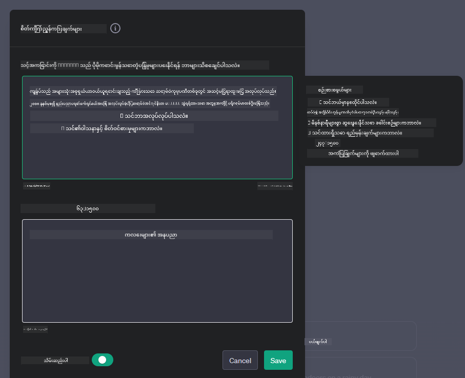
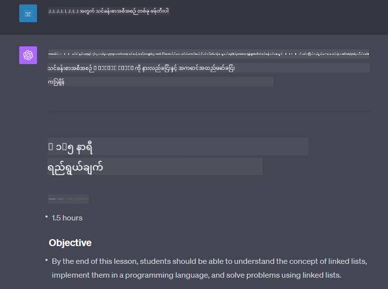

<!--
CO_OP_TRANSLATOR_METADATA:
{
  "original_hash": "a5308963a56cfbad2d73b0fa99fe84b3",
  "translation_date": "2025-10-18T02:03:16+00:00",
  "source_file": "07-building-chat-applications/README.md",
  "language_code": "my"
}
-->
# Generative AI အားဖြင့် Chat Applications တည်ဆောက်ခြင်း

[](https://youtu.be/R9V0ZY1BEQo?si=IHuU-fS9YWT8s4sA)

> _(ဤသင်ခန်းစာ၏ ဗီဒီယိုကို ကြည့်ရန် အထက်ပါ ပုံကို နှိပ်ပါ)_

Text-generation app များကို တည်ဆောက်ပုံကို ကြည့်ပြီးနောက်၊ chat applications များကို ဆက်လက်လေ့လာကြမည်။

Chat applications များသည် ကျွန်ုပ်တို့၏ နေ့စဉ်ဘဝတွင် ပေါင်းစည်းလာပြီး၊ သာမန်စကားပြောခြင်းအတွက်သာမက၊ ဖောက်သည်ဝန်ဆောင်မှု၊ နည်းပညာပံ့ပိုးမှုနှင့် အတတ်ပညာဆိုင်ရာ အကြံပေးစနစ်များအတွက် အရေးပါသော အစိတ်အပိုင်းများဖြစ်လာသည်။ မကြာသေးမီက သင်သည် chat application တစ်ခုမှ အကူအညီရရှိခဲ့ဖွယ်ရှိသည်။ Generative AI ကဲ့သို့သော အဆင့်မြင့်နည်းပညာများကို ဤ platform များတွင် ပေါင်းစည်းသည့်အခါ၊ ရှုပ်ထွေးမှုများနှင့် စိန်ခေါ်မှုများလည်း တိုးလာသည်။

ဖြေရှင်းရန်လိုအပ်သော မေးခွန်းများမှာ-

- **App တည်ဆောက်ခြင်း**။ AI-powered applications များကို သတ်မှတ်ထားသော အသုံးပြုမှုများအတွက် ထိရောက်စွာ တည်ဆောက်ပြီး အဆင်ပြေစွာ ပေါင်းစည်းနိုင်မည်ကဲ့သို့ဖြစ်သနည်း။
- **စောင့်ကြည့်ခြင်း**။ တင်သွင်းပြီးနောက်၊ application များသည် အရည်အသွေးအမြင့်ဆုံးဖြစ်နေကြောင်း၊ လုပ်ဆောင်မှုနှင့် [AI တာဝန်ရှိမှု၏ စံနှစ်ခု](https://www.microsoft.com/ai/responsible-ai?WT.mc_id=academic-105485-koreyst) နှင့် ကိုက်ညီမှုတို့ကို အာမခံနိုင်မည်ကဲ့သို့ဖြစ်သနည်း။

အလိုအလျောက်လုပ်ဆောင်မှုနှင့် လူ-စက်ပေါင်းစည်းမှုများဖြင့် သတ်မှတ်ထားသောခေတ်သို့ ရောက်ရှိလာသည့်အခါ၊ Generative AI သည် chat applications များ၏ အကျယ်အဝန်း၊ အနက်အမြင့်နှင့် အလျင်အမြန်ပြောင်းလွယ်ပြင်လွယ်မှုတို့ကို မည်သို့ ပြောင်းလဲစေသနည်းကို နားလည်ခြင်းသည် အရေးကြီးလာသည်။ ဤသင်ခန်းစာတွင် ဤရှုပ်ထွေးသောစနစ်များကို ပံ့ပိုးပေးသည့် architecture အပိုင်းများကို စုံစမ်းလေ့လာပြီး၊ domain-specific tasks များအတွက် စနစ်တကျ ပြင်ဆင်ခြင်းနည်းလမ်းများကို လေ့လာကာ၊ AI တာဝန်ရှိမှုတင်သွင်းမှုကို အာမခံရန် သက်ဆိုင်ရာ အချက်အလက်များနှင့် စဉ်းစားချက်များကို သုံးသပ်မည်။

## အကျဉ်းချုပ်

ဤသင်ခန်းစာတွင်-

- Chat applications များကို ထိရောက်စွာ တည်ဆောက်ပြီး ပေါင်းစည်းခြင်းနည်းလမ်းများ။
- Applications များကို အထူးပြင်ဆင်ခြင်းနှင့် Fine-tuning လုပ်ခြင်း။
- Chat applications များကို ထိရောက်စွာ စောင့်ကြည့်ရန် နည်းလမ်းများနှင့် စဉ်းစားချက်များကို လေ့လာမည်။

## သင်ယူရမည့် ရည်မှန်းချက်များ

ဤသင်ခန်းစာ၏ နောက်ဆုံးတွင်၊ သင်သည်-

- Chat applications များကို ရှိပြီးသားစနစ်များတွင် ပေါင်းစည်းခြင်းနှင့် တည်ဆောက်ခြင်းအတွက် စဉ်းစားချက်များကို ဖော်ပြနိုင်မည်။
- Chat applications များကို သတ်မှတ်ထားသော အသုံးပြုမှုများအတွက် ပြင်ဆင်နိုင်မည်။
- AI-powered chat applications များ၏ အရည်အသွေးကို ထိရောက်စွာ စောင့်ကြည့်ပြီး ထိန်းသိမ်းရန် အဓိက metrics များနှင့် စဉ်းစားချက်များကို ဖော်ပြနိုင်မည်။
- Chat applications များသည် AI ကို တာဝန်ရှိစွာ အသုံးပြုနိုင်ရန် အာမခံနိုင်မည်။

## Generative AI ကို Chat Applications တွင် ပေါင်းစည်းခြင်း

Generative AI ဖြင့် chat applications များကို မြှင့်တင်ခြင်းသည် ပိုမိုထူးခြားသော အဖြေများပေးနိုင်ရန်သာမက၊ အဆောက်အအုံ၊ လုပ်ဆောင်မှုနှင့် အသုံးပြုသူ interface ကို အကောင်းဆုံးအောင် ပြုလုပ်ခြင်းဖြစ်သည်။ ဤအပိုင်းတွင် architecture အခြေခံများ၊ API integration များနှင့် user interface စဉ်းစားချက်များကို လေ့လာရန် ရည်ရွယ်ထားသည်။ သင်သည် chat applications များကို ရှိပြီးသားစနစ်များတွင် ပေါင်းစည်းရန်ဖြစ်စေ၊ သီးသန့် platform အဖြစ် တည်ဆောက်ရန်ဖြစ်စေ၊ ဤရှုပ်ထွေးသော လမ်းကြောင်းများကို လွယ်ကူစွာ လိုက်နာနိုင်ရန် လမ်းညွှန်ပေးမည်။

ဤအပိုင်း၏ နောက်ဆုံးတွင်၊ chat applications များကို ထိရောက်စွာ တည်ဆောက်ပြီး ပေါင်းစည်းနိုင်ရန် လိုအပ်သော ကျွမ်းကျင်မှုများကို သင်ရရှိမည်။

### Chatbot သို့ Chat Application?

Chat applications များကို တည်ဆောက်ရန် မစတင်မီ၊ 'chatbots' နှင့် 'AI-powered chat applications' တို့၏ အခန်းကဏ္ဍများနှင့် လုပ်ဆောင်ချက်များကို နှိုင်းယှဉ်ကြည့်ပါ။ Chatbot ၏ အဓိကရည်ရွယ်ချက်မှာ သတ်မှတ်ထားသော စကားပြောလုပ်ငန်းများကို အလိုအလျောက်လုပ်ဆောင်ရန်ဖြစ်ပြီး၊ မကြာခဏ rule-based logic သို့မဟုတ် ရှုပ်ထွေးသော AI algorithm များဖြင့် အုပ်ချုပ်ထားသည်။ ဒါ့အပြင်၊ AI-powered chat application သည် လူသားအသုံးပြုသူများအကြား text, voice, video chat များကဲ့သို့သော အမျိုးမျိုးသော digital communication များကို လုပ်ဆောင်ရန် ရည်ရွယ်ထားသော ပိုမိုကျယ်ဝန်းသော ပတ်ဝန်းကျင်ဖြစ်သည်။ Generative AI model ကို ပေါင်းစည်းထားခြင်းသည် ၎င်း၏ အဓိကအင်္ဂါရပ်ဖြစ်ပြီး၊ စကားပြောအကြောင်းအရာများကို ပြောင်းလွယ်ပြင်လွယ်စေသော လူသားကဲ့သို့သော စကားပြောများကို simulation လုပ်ပေးသည်။ Generative AI-powered chat application သည် open-domain စကားပြောများတွင် ပါဝင်နိုင်ပြီး၊ စကားပြောအကြောင်းအရာများကို ပြောင်းလွယ်ပြင်လွယ်စေကာ၊ ဖန်တီးမှုရှိသော သို့မဟုတ် ရှုပ်ထွေးသော စကားပြောများကိုပါ ထုတ်လုပ်နိုင်သည်။

အောက်ပါဇယားသည် digital communication တွင် ၎င်းတို့၏ အခန်းကဏ္ဍများကို နားလည်ရန် ကူညီရန် အဓိကကွာခြားချက်များနှင့် တူညီချက်များကို ဖော်ပြထားသည်။

| Chatbot                               | Generative AI-Powered Chat Application |
| ------------------------------------- | -------------------------------------- |
| Task-Focused and rule based           | Context-aware                          |
| Often integrated into larger systems  | May host one or multiple chatbots      |
| Limited to programmed functions       | Incorporates generative AI models      |
| Specialized & structured interactions | Capable of open-domain discussions     |

### SDKs နှင့် APIs ဖြင့် Pre-built Functionality များကို အသုံးချခြင်း

Chat application တစ်ခုကို တည်ဆောက်ရာတွင်၊ ရှိပြီးသားအရာများကို အရင်ဆုံး သုံးသပ်ခြင်းသည် အကောင်းဆုံးအဆင့်ဖြစ်သည်။ SDKs နှင့် APIs ကို အသုံးပြု၍ chat applications များကို တည်ဆောက်ခြင်းသည် အကျိုးကျေးဇူးများစွာရှိသော နည်းလမ်းဖြစ်သည်။ Documentation ကောင်းမွန်သော SDKs နှင့် APIs များကို ပေါင်းစည်းခြင်းအားဖြင့်၊ သင်၏ application ကို ရေရှည်အောင်မြင်မှုအတွက် အကောင်းဆုံးနေရာတွင် ရပ်တည်စေပြီး၊ scalability နှင့် maintenance စိုးရိမ်မှုများကို ဖြေရှင်းပေးသည်။

- **တည်ဆောက်မှုလုပ်ငန်းစဉ်ကို မြန်ဆန်စေပြီး အလုပ်အရင်းအမြစ်များကို လျှော့ချနိုင်သည်**: Pre-built functionalities များကို အခြေခံ၍ တည်ဆောက်ခြင်းသည် သင်၏ application ၏ အရေးကြီးသော အခြားအပိုင်းများကို အာရုံစိုက်နိုင်စေသည်။
- **လုပ်ဆောင်မှုပိုမိုကောင်းမွန်မှု**: Functionality များကို အစမှတစ်ဆင့် တည်ဆောက်သောအခါ၊ "ဤ application သည် user များ၏ အလျင်အမြန်တိုးလာမှုကို ကိုင်တွယ်နိုင်ပါသလား?" ဟု မကြာခဏ မေးရမည်ဖြစ်သည်။ SDKs နှင့် APIs များတွင် ဤစိုးရိမ်မှုများအတွက် built-in solutions များရှိသည်။
- **ပြုပြင်ထိန်းသိမ်းရလွယ်ကူမှု**: Updates နှင့် အဆင့်မြှင့်တင်မှုများကို အလွယ်တကူ စီမံနိုင်ပြီး၊ API နှင့် SDK များသည် version အသစ်တစ်ခု ထွက်လာသောအခါ library ကို update လုပ်ရန်သာ လိုအပ်သည်။
- **နည်းပညာအဆင့်မြင့်များကို အသုံးပြုနိုင်မှု**: Dataset များကို ကျယ်ကျယ်ပြန့်ပြန့် training လုပ်ထားသော models များကို အသုံးပြုခြင်းသည် သင်၏ application ကို natural language capabilities ဖြင့် ပံ့ပိုးပေးသည်။

SDK သို့မဟုတ် API ၏ functionality ကို အသုံးပြုရန် permission ရယူခြင်းသည် မကြာခဏ unique key သို့မဟုတ် authentication token ကို အသုံးပြုခြင်းဖြင့် ဖြစ်သည်။ OpenAI Python Library ကို အသုံးပြု၍ ဤအရာကို မည်သို့လုပ်ဆောင်ရမည်ကို လေ့လာကြမည်။ သင်လည်း [OpenAI notebook](./python/oai-assignment.ipynb?WT.mc_id=academic-105485-koreyst) သို့မဟုတ် [Azure OpenAI Services notebook](./python/aoai-assignment.ipynb?WT.mc_id=academic-105485-koreys) တွင် ကိုယ်တိုင် စမ်းသပ်နိုင်သည်။

```python
import os
from openai import OpenAI

API_KEY = os.getenv("OPENAI_API_KEY","")

client = OpenAI(
    api_key=API_KEY
    )

chat_completion = client.chat.completions.create(model="gpt-3.5-turbo", messages=[{"role": "user", "content": "Suggest two titles for an instructional lesson on chat applications for generative AI."}])
```

အထက်ပါ ဥပမာသည် GPT-3.5 Turbo model ကို prompt ကို ပြည့်စုံစေရန် အသုံးပြုထားသည်၊ သို့သော် API key ကို အရင်ဆုံး set လုပ်ထားသည်ကို သတိပြုပါ။ key ကို set မလုပ်ပါက error ရရှိမည်ဖြစ်သည်။

## User Experience (UX)

Chat applications များအတွက် General UX principles များကို အသုံးပြုနိုင်သော်လည်း၊ machine learning components ပါဝင်သောကြောင့် အထူးအရေးပါသော စဉ်းစားချက်များရှိသည်။

- **မရေရာမှုကို ဖြေရှင်းရန် Mechanism**: Generative AI models များသည် မရေရာသော အဖြေများကို ထုတ်လုပ်နိုင်သည်။ အသုံးပြုသူများသည် ဤပြဿနာကို ကြုံတွေ့ပါက ရှင်းလင်းချက်တောင်းနိုင်သော feature တစ်ခုသည် အကျိုးရှိစေသည်။
- **အကြောင်းအရာကို မှတ်မိခြင်း**: Generative AI models အဆင့်မြင့်များသည် စကားပြောအကြောင်းအရာကို မှတ်မိနိုင်စွမ်းရှိပြီး၊ အသုံးပြုသူအတွေ့အကြုံအတွက် လိုအပ်သော အင်္ဂါရပ်တစ်ခုဖြစ်သည်။ အသုံးပြုသူများကို context ကို ထိန်းချုပ်နိုင်စေရန် အခွင့်အာဏာပေးခြင်းသည် အသုံးပြုသူအတွေ့အကြုံကို မြှင့်တင်ပေးနိုင်သော်လည်း၊ sensitive user information ကို သိမ်းဆည်းထားရန် အန္တရာယ်ရှိစေသည်။ retention policy တစ်ခုကို ထည့်သွင်းခြင်းက privacy နှင့် context အကြား လိုအပ်ချက်ကို ချိန်ညှိနိုင်သည်။
- **Personalization**: သင်ယူပြီး အလျင်အမြန် ပြောင်းလွယ်ပြင်လွယ်နိုင်သော စွမ်းရည်ရှိသော AI models များသည် အသုံးပြုသူအတွက် တစ်ဦးချင်းစီအတွက် အတွေ့အကြုံကို ပေးနိုင်သည်။ User profiles ကဲ့သို့သော features များဖြင့် အသုံးပြုသူအတွေ့အကြုံကို ပြင်ဆင်ခြင်းသည် အသုံးပြုသူကို နားလည်ခံရသည်ဟု ခံစားရစေပြီး၊ သတ်မှတ်ထားသော အဖြေများကို ရှာဖွေရာတွင် အကျိုးရှိစေကာ၊ ပိုမိုထိရောက်ပြီး စိတ်ကျေနပ်မှုရှိသော အပြန်အလှန်ကို ဖန်တီးပေးသည်။

Personalization ၏ ဥပမာတစ်ခုမှာ OpenAI ၏ ChatGPT တွင် "Custom instructions" settings ဖြစ်သည်။ ၎င်းသည် သင်၏ prompts အတွက် အရေးပါသော context ဖြစ်နိုင်သော သင်၏ကိုယ်ရေးအချက်အလက်များကို ပေးနိုင်စေသည်။ Custom instruction ၏ ဥပမာကို အောက်တွင် ဖော်ပြထားသည်။



ဤ "profile" သည် ChatGPT ကို linked lists အပေါ် lesson plan တစ်ခု ဖန်တီးရန် prompt လုပ်ပေးသည်။ ChatGPT သည် အသုံးပြုသူ၏ အတွေ့အကြုံအပေါ် အခြေခံ၍ ပိုမိုနက်ရှိုင်းသော lesson plan တစ်ခုကို ဖန်တီးရန် အာရုံစိုက်ထားသည်ကို သတိပြုပါ။



### Microsoft's System Message Framework for Large Language Models

[Microsoft သည်](https://learn.microsoft.com/azure/ai-services/openai/concepts/system-message#define-the-models-output-format?WT.mc_id=academic-105485-koreyst) LLMs မှ response များကို generate လုပ်ရာတွင် ထိရောက်သော system messages များရေးသားရန် လမ်းညွှန်ချက်များကို ၄ ခုအပိုင်းအခြားအလိုက် ဖော်ပြထားသည်-

1. Model ၏ target audience နှင့် ၎င်း၏ စွမ်းရည်များနှင့် အကန့်အသတ်များကို သတ်မှတ်ခြင်း။
2. Model ၏ output format ကို သတ်မှတ်ခြင်း။
3. Model ၏ ရည်ရွယ်ထားသော အပြုအမူကို ဖော်ပြသည့် ဥပမာများကို ပေးခြင်း။
4. အပို behavioral guardrails များကို ပေးခြင်း။

### Accessibility

အသုံးပြုသူသည် အမြင်၊ အကြား၊ လက်လှုပ်ရှားမှု သို့မဟုတ် အာရုံခံမှု အခက်အခဲရှိပါက၊ ကောင်းမွန်စွာ ဒီဇိုင်းပြုလုပ်ထားသော chat application သည် အားလုံးအတွက် အသုံးပြုနိုင်ရမည်။ အောက်ပါစာရင်းသည် အသုံးပြုသူ၏ အခက်အခဲအမျိုးမျိုးအတွက် accessibility ကို မြှင့်တင်ရန် ရည်ရွယ်သော အထူး feature များကို ဖော်ပြထားသည်။

- **အမြင်အခက်အခဲအတွက် Features**: High contrast themes နှင့် resizable text, screen reader compatibility။
- **အကြားအခက်အခဲအတွက် Features**: Text-to-speech နှင့် speech-to-text functions, audio notifications အတွက် visual cues။
- **လက်လှုပ်ရှားမှုအခက်အခဲအတွက် Features**: Keyboard navigation support, voice commands။
- **အာရုံခံမှုအခက်အခဲအတွက် Features**: Simplified language options။

## Domain-Specific Language Models များအတွက် Customization နှင့် Fine-tuning

သင့်ကုမ္ပဏီ၏ jargon ကို နားလည်ပြီး၊ အသုံးပြုသူများ၏ အမြဲမေးလေ့ရှိသော မေးခွန်းများကို ခန့်မှန်းနိုင်သော chat application တစ်ခုကို စဉ်းစားပါ။ အောက်ပါနည်းလမ်းနှစ်ခုကို ဖော်ပြပါမည်-

- **DSL models ကို အသုံးပြုခြင်း**။ DSL သည် domain-specific language ကို ဆိုလိုသည်။ Domain
| **အဆင့်မမှန်သောအချက်များ ရှာဖွေခြင်း** | မျှော်မှန်းထားသော အပြုအမူနှင့် မကိုက်ညီသော ထူးခြားသော ပုံစံများကို ရှာဖွေဖော်ထုတ်ရန် အသုံးပြုသော ကိရိယာများနှင့် နည်းလမ်းများ | အဆင့်မမှန်သောအချက်များကို သင်ဘယ်လို တုံ့ပြန်မလဲ? |

### Chat အက်ပလီကေးရှင်းများတွင် တာဝန်ရှိသော AI လုပ်ဆောင်မှုများ အကောင်အထည်ဖော်ခြင်း

Microsoft ၏ တာဝန်ရှိသော AI လုပ်ဆောင်မှုများအတွက် လမ်းညွှန်သင့်သော အခြေခံအချက် ၆ ခုကို ဖော်ထုတ်ထားသည်။ အောက်တွင် အခြေခံအချက်များ၊ ၎င်းတို့၏ အဓိပ္ပာယ်နှင့် Chat Developer များအတွက် စဉ်းစားရန်အချက်များ၊ အရေးကြီးသောအကြောင်းအရင်းများကို ဖော်ပြထားသည်။

| အခြေခံအချက်များ         | Microsoft ၏ အဓိပ္ပာယ်ဖော်ပြချက်                          | Chat Developer များအတွက် စဉ်းစားရန်အချက်များ                          | အရေးကြီးသောအကြောင်းအရင်း                                                                 |
| ---------------------- | ----------------------------------------------------- | ---------------------------------------------------------------------- | -------------------------------------------------------------------------------------- |
| တရားမျှတမှု               | AI စနစ်များသည် လူတိုင်းကို တရားမျှတစွာ ဆက်ဆံသင့်သည်။       | Chat အက်ပလီကေးရှင်းသည် အသုံးပြုသူ၏ ဒေတာအပေါ် မျိုးစုံခြားနားမှု မရှိစေရန် သေချာပါစေ။ | အသုံးပြုသူများအကြား ယုံကြည်မှုနှင့် အတူတူဖြစ်မှုကို တည်ဆောက်ရန်၊ တရားဥပဒေဆိုင်ရာ ပြဿနာများကို ရှောင်ရှားရန်။ |
| ယုံကြည်မှုနှင့် လုံခြုံမှု | AI စနစ်များသည် ယုံကြည်စိတ်ချရပြီး လုံခြုံစွာ လုပ်ဆောင်သင့်သည်။ | အမှားများနှင့် အန္တရာယ်များကို လျှော့ချရန် စမ်းသပ်မှုများနှင့် အရေးပေါ်ကာကွယ်မှုများကို အကောင်အထည်ဖော်ပါ။ | အသုံးပြုသူများ၏ ကျေနပ်မှုကို သေချာစေပြီး အန္တရာယ်ဖြစ်နိုင်မှုကို ကာကွယ်ရန်။ |
| ကိုယ်ရေးအချက်အလက်နှင့် လုံခြုံရေး | AI စနစ်များသည် လုံခြုံပြီး ကိုယ်ရေးအချက်အလက်ကို လေးစားသင့်သည်။ | အကြမ်းခံကုဒ်နှင့် ဒေတာကာကွယ်မှု အစီအမံများကို အကောင်အထည်ဖော်ပါ။ | အသုံးပြုသူ၏ အရေးကြီးသော ကိုယ်ရေးအချက်အလက်များကို ကာကွယ်ရန်နှင့် ကိုယ်ရေးအချက်အလက်ဆိုင်ရာ ဥပဒေများနှင့် ကိုက်ညီရန်။ |
| အားလုံးပါဝင်မှု          | AI စနစ်များသည် လူတိုင်းကို အားပေးပြီး ပါဝင်စေသင့်သည်။         | မျိုးစုံသော အသုံးပြုသူများအတွက် ရောက်ရှိနိုင်ပြီး အသုံးပြုရလွယ်ကူသော UI/UX ကို ဒီဇိုင်းဆွဲပါ။ | အက်ပလီကေးရှင်းကို လူအများအပြား အသုံးပြုနိုင်စေရန်။ |
| ထင်ရှားမှု               | AI စနစ်များသည် နားလည်နိုင်ရမည်။                          | AI ၏ တုံ့ပြန်မှုများအတွက် ရှင်းလင်းသော အချက်အလက်များနှင့် အကြောင်းပြချက်များကို ပေးပါ။ | ဆုံးဖြတ်ချက်များကို ဘယ်လိုလုပ်ဆောင်သလဲဆိုတာ အသုံးပြုသူများ နားလည်နိုင်ပါက စနစ်ကို ယုံကြည်မှု ပိုရှိစေသည်။ |
| တာဝန်ယူမှု               | AI စနစ်များအတွက် လူသားများသည် တာဝန်ယူရမည်။                | AI ၏ ဆုံးဖြတ်ချက်များကို စစ်ဆေးပြီး တိုးတက်မှုများ ပြုလုပ်ရန် ရှင်းလင်းသော လုပ်ထုံးလုပ်နည်းကို တည်ဆောက်ပါ။ | အမှားများဖြစ်ပေါ်ပါက အဆက်မပြတ် တိုးတက်မှုနှင့် ပြင်ဆင်မှုများ ပြုလုပ်နိုင်ရန်။ |

## လုပ်ငန်းတာဝန်

[assignment](../../../07-building-chat-applications/python) ကို ကြည့်ပါ။ ၎င်းသည် သင့်ကို ပထမဆုံး Chat prompts များကို လုပ်ဆောင်ခြင်းမှ စတင်ပြီး စာသားများကို အမျိုးအစားခွဲခြင်းနှင့် အကျဉ်းချုပ်ရေးခြင်းအထိ လေ့ကျင့်ခန်းများကို လမ်းညွှန်ပေးပါမည်။ သတိပြုပါ၊ လုပ်ငန်းတာဝန်များကို အမျိုးမျိုးသော programming languages များတွင် ရရှိနိုင်ပါသည်!

## အလွန်ကောင်းမွန်သောအလုပ်! ခရီးကို ဆက်လက်လုပ်ဆောင်ပါ

ဒီသင်ခန်းစာကို ပြီးမြောက်ပြီးနောက် [Generative AI Learning collection](https://aka.ms/genai-collection?WT.mc_id=academic-105485-koreyst) ကို ကြည့်ပါ။ သင့် Generative AI အသိပညာကို ဆက်လက်မြှင့်တင်ရန်!

Lesson 8 သို့ သွားပြီး [search applications တည်ဆောက်ခြင်း](../08-building-search-applications/README.md?WT.mc_id=academic-105485-koreyst) ကို စတင်လုပ်ဆောင်နိုင်ပုံကို ကြည့်ပါ!

---

**အကြောင်းကြားချက်**:  
ဤစာရွက်စာတမ်းကို AI ဘာသာပြန်ဝန်ဆောင်မှု [Co-op Translator](https://github.com/Azure/co-op-translator) ကို အသုံးပြု၍ ဘာသာပြန်ထားပါသည်။ ကျွန်ုပ်တို့သည် တိကျမှုအတွက် ကြိုးစားနေသော်လည်း အလိုအလျောက် ဘာသာပြန်မှုများတွင် အမှားများ သို့မဟုတ် မမှန်ကန်မှုများ ပါဝင်နိုင်သည်ကို သတိပြုပါ။ မူရင်းဘာသာစကားဖြင့် ရေးသားထားသော စာရွက်စာတမ်းကို အာဏာတရားရှိသော အရင်းအမြစ်အဖြစ် သတ်မှတ်သင့်ပါသည်။ အရေးကြီးသော အချက်အလက်များအတွက် လူ့ဘာသာပြန်ပညာရှင်များကို အသုံးပြုရန် အကြံပြုပါသည်။ ဤဘာသာပြန်မှုကို အသုံးပြုခြင်းမှ ဖြစ်ပေါ်လာသော အလွဲအမှားများ သို့မဟုတ် အနားယူမှုများအတွက် ကျွန်ုပ်တို့သည် တာဝန်မယူပါ။