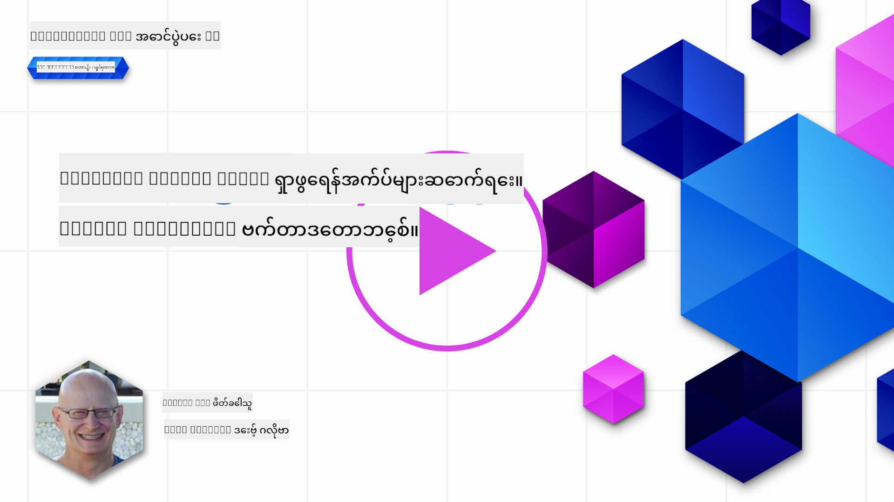
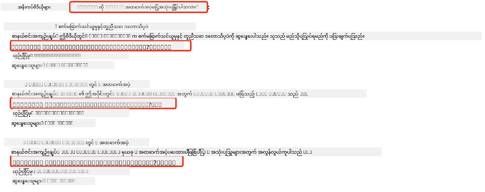

<!--
CO_OP_TRANSLATOR_METADATA:
{
  "original_hash": "d46aad0917a1a342d613e2c13d457da5",
  "translation_date": "2025-06-25T16:47:31+00:00",
  "source_file": "08-building-search-applications/README.md",
  "language_code": "my"
}
-->
# ရှာဖွေရေး အက်ပ်များ တည်ဆောက်ခြင်း

[](https://aka.ms/gen-ai-lesson8-gh?WT.mc_id=academic-105485-koreyst)

> > _ဒီသင်ခန်းစာရဲ့ ဗီဒီယိုကို ကြည့်ရှုရန် အထက်ရှိ ပုံကို နှိပ်ပါ_

LLMs တွေဟာ chatbot နှင့် text generation ထက် ပိုပြီး အရေးကြီးပါတယ်။ Embeddings ကို အသုံးပြုပြီး ရှာဖွေရေး အက်ပ်များ တည်ဆောက်နိုင်ပါသည်။ Embeddings တွေဟာ data ကို ဂဏန်းပုံစံဖြင့် ဖော်ပြထားသော vectors ဖြစ်ပြီး semantic search အတွက် အသုံးပြုနိုင်သည်။

ဒီသင်ခန်းစာမှာတော့ ကျောင်းသားများကို အခမဲ့ပညာပေးသော ကျွန်ုပ်တို့၏ ပညာရေးစတင်ခြင်းအတွက် ရှာဖွေရေး အက်ပ်တစ်ခုကို တည်ဆောက်ရန် ဖြစ်ပါတယ်။ ကျွန်ုပ်တို့၏ စတင်ခြင်းသည် ဖွံ့ဖြိုးမူ့နိုင်ငံများရှိ ကျောင်းသားများကို အခမဲ့ပညာပေးသော အကျိုးပြုအဖွဲ့အစည်းဖြစ်သည်။ ကျွန်ုပ်တို့၏ စတင်ခြင်းသည် AI နှင့် ပတ်သက်သော YouTube ဗီဒီယိုများစွာ ရှိပြီး ကျောင်းသားများကို သင်ယူရန် အသုံးပြုနိုင်ပါသည်။ ကျောင်းသားများကို မေးခွန်း ရိုက်ထည့်ခြင်းဖြင့် YouTube ဗီဒီယို ရှာဖွေရန် ခွင့်ပြုသော ရှာဖွေရေး အက်ပ်တစ်ခုကို တည်ဆောက်လိုသည်။

ဥပမာအားဖြင့် ကျောင်းသားတစ်ယောက် 'What are Jupyter Notebooks?' သို့မဟုတ် 'What is Azure ML' ဟု ရိုက်ထည့်နိုင်ပြီး ရှာဖွေရေး အက်ပ်သည် မေးခွန်းနှင့် သက်ဆိုင်သော YouTube ဗီဒီယိုများ၏ စာရင်းကို ပြန်ပေးပါမည်။ ထို့အပြင် မေးခွန်း၏ အဖြေရှိသော ဗီဒီယိုနေရာကိုလည်း ရှာဖွေရေး အက်ပ်က လင့်ခ်ပြန်ပေးပါမည်။

## မိတ်ဆက်

ဒီသင်ခန်းစာမှာ အောက်ပါအကြောင်းအရာများကို ဖုံးကွယ်ထားပါသည်-

- Semantic vs Keyword search
- Text Embeddings ဆိုတာဘာလဲ
- Text Embeddings Index တည်ဆောက်ခြင်း
- Text Embeddings Index ရှာဖွေခြင်း

## သင်ယူရန် ရည်ရွယ်ချက်များ

ဒီသင်ခန်းစာကို ပြီးမြောက်ပြီးနောက်တွင်-

- Semantic နှင့် Keyword ရှာဖွေခြင်းတို့၏ ကွာခြားချက်ကို ဖွင့်ဆိုနိုင်ပါမည်။
- Text Embeddings ဆိုတာ ဘာလဲဆိုတာ ရှင်းပြနိုင်ပါမည်။
- Embeddings ကို အသုံးပြုပြီး data ရှာဖွေရန် အက်ပ်တစ်ခုကို တည်ဆောက်နိုင်ပါမည်။

## ရှာဖွေရေး အက်ပ်တစ်ခုကို ဘာကြောင့် တည်ဆောက်ရတာလဲ?

ရှာဖွေရေး အက်ပ်တစ်ခုကို တည်ဆောက်ခြင်းသည် Embeddings ကို အသုံးပြုပြီး data ရှာဖွေရန် ဘယ်လိုသုံးရမယ်ဆိုတာကို နားလည်စေပါမည်။ သတင်းအချက်အလက်ကို မြန်မြန်ဆန်ဆန် ရှာဖွေရန် ကျောင်းသားများ အသုံးပြုနိုင်သော ရှာဖွေရေး အက်ပ်တစ်ခုကို တည်ဆောက်နည်းကိုလည်း သင်ယူနိုင်ပါသည်။

ဒီသင်ခန်းစာမှာ Microsoft [AI Show](https://www.youtube.com/playlist?list=PLlrxD0HtieHi0mwteKBOfEeOYf0LJU4O1) YouTube channel ရဲ့ YouTube transcripts တွေအတွက် Embedding Index ပါဝင်သည်။ AI Show သည် AI နှင့် machine learning ကို သင်ပေးသော YouTube channel ဖြစ်သည်။ Embedding Index တွင် Oct 2023 အထိ YouTube transcripts များ၏ Embeddings ပါဝင်သည်။ ကျွန်ုပ်တို့၏ စတင်ခြင်းအတွက် ရှာဖွေရေး အက်ပ်တစ်ခုကို တည်ဆောက်ရန် သင်သည် Embedding Index ကို အသုံးပြုပါမည်။ ရှာဖွေရေး အက်ပ်သည် မေးခွန်း၏ အဖြေရှိသော ဗီဒီယိုနေရာကို လင့်ခ်ပြန်ပေးပါသည်။ ဒီဟာက ကျောင်းသားများကို လိုအပ်သော သတင်းအချက်အလက်ကို မြန်မြန်ဆန်ဆန် ရှာဖွေရန် အထူးကောင်းမွန်သော နည်းလမ်းတစ်ခုဖြစ်သည်။

'can you use rstudio with azure ml?' ဆိုသော မေးခွန်းအတွက် semantic query ၏ နမူနာကို အောက်တွင် ဖော်ပြထားပါသည်။ YouTube url ကို ကြည့်ပါ၊ url မှာ မေးခွန်း၏ အဖြေရှိသော ဗီဒီယိုနေရာကို ခေါ်သည့် timestamp ပါဝင်သည်။



## semantic search ဆိုတာ ဘာလဲ?

အခုတော့ semantic search ဆိုတာ ဘာလဲဆိုတာ သင် စဉ်းစားနေရင်ဖြစ်ပါတယ်။ Semantic search သည် query အတွင်းရှိ စကားလုံးများ၏ အဓိပ္ပာယ် သို့မဟုတ် အနက်ကို အသုံးပြုပြီး သက်ဆိုင်သော ရလဒ်များကို ပြန်ပေးသော ရှာဖွေခြင်းနည်းလမ်းတစ်ခုဖြစ်သည်။

semantic search ၏ နမူနာတစ်ခုကို အောက်တွင် ဖော်ပြထားပါသည်။ ကားဝယ်လိုသော အခါ 'my dream car' ဟု ရှာဖွေပါက semantic search သည် သင် `dreaming` အကြောင်း ရှာဖွေခြင်း မဟုတ်ဘဲ သင်၏ `ideal` ကားကို ဝယ်လိုခြင်းကို နားလည်ပါသည်။ Semantic search သည် သင်၏ ရည်ရွယ်ချက်ကို နားလည်ပြီး သက်ဆိုင်သော ရလဒ်များကို ပြန်ပေးပါသည်။ `keyword search` ကို လှလှပပ ရှာဖွေခြင်းဖြစ်ပြီး ကားများနှင့် ပတ်သက်သော အိပ်မက်များကို ရှာဖွေပြီး မသက်ဆိုင်သော ရလဒ်များကို ပြန်ပေးလေ့ရှိသည်။

## Text Embeddings ဆိုတာ ဘာလဲ?

[Text embeddings](https://en.wikipedia.org/wiki/Word_embedding?WT.mc_id=academic-105485-koreyst) သည် [natural language processing](https://en.wikipedia.org/wiki/Natural_language_processing?WT.mc_id=academic-105485-koreyst) တွင် အသုံးပြုသော text ကို ဖော်ပြသော နည်းလမ်းတစ်ခုဖြစ်သည်။ Text embeddings သည် text ကို semantic အနက်ဖြင့် ဂဏန်းပုံစံဖြင့် ဖော်ပြထားသည်။ Embeddings တွေကို machine နားလည်ရလွယ်သော နည်းလမ်းဖြင့် data ကို ဖော်ပြရန် အသုံးပြုသည်။ Text embeddings တည်ဆောက်ရန် မော်ဒယ်များစွာ ရှိပြီး ဒီသင်ခန်းစာမှာတော့ OpenAI Embedding Model ကို အသုံးပြုပြီး embeddings များကို ထုတ်လုပ်ခြင်းကို အဓိကထားပါမည်။

ဥပမာအားဖြင့် AI Show YouTube channel ရဲ့ အပိုင်းတစ်ခုမှ transcript တွင် အောက်ပါ text ရှိသည်ဟု စိတ်ကူးပါ။

```text
Today we are going to learn about Azure Machine Learning.
```

Text ကို OpenAI Embedding API သို့ ပေးပို့ပြီး 1536 ဂဏန်း aka vector ပါဝင်သော embedding ကို ပြန်ပေးပါမည်။ Vector ရှိ ဂဏန်းတစ်ခုစီသည် text ၏ aspect မတူကွဲပြားမှုကို ကိုယ်စားပြုသည်။ အတိုချုပ်အတွက် vector ရှိ ပထမ 10 ဂဏန်းများကို အောက်တွင် ဖော်ပြထားပါသည်။

```python
[-0.006655829958617687, 0.0026128944009542465, 0.008792596869170666, -0.02446001023054123, -0.008540431968867779, 0.022071078419685364, -0.010703742504119873, 0.003311325330287218, -0.011632772162556648, -0.02187200076878071, ...]
```

## Embedding index ကို ဘယ်လို တည်ဆောက်ခဲ့တာလဲ?

ဒီသင်ခန်းစာအတွက် Embedding index ကို Python scripts များ စီးရီးဖြင့် တည်ဆောက်ခဲ့သည်။ scripts များနှင့် လမ်းညွှန်ချက်များကို [README](./scripts/README.md?WT.mc_id=academic-105485-koreyst) တွင် 'scripts' ဖိုဒါတွင် ရှာဖွေနိုင်သည်။ သင်သည် ဒီသင်ခန်းစာကို ပြီးမြောက်ရန် scripts များကို run လိုအပ်ခြင်းမရှိပါက Embedding Index ကို သင့်အတွက် ပေးထားပါသည်။

scripts များသည် အောက်ပါ လုပ်ဆောင်ချက်များကို ပြုလုပ်ပါသည်-

1. [AI Show](https://www.youtube.com/playlist?list=PLlrxD0HtieHi0mwteKBOfEeOYf0LJU4O1) playlist ရှိ YouTube ဗီဒီယိုတစ်ခုစီ၏ transcript ကို download လုပ်သည်။
2. [OpenAI Functions](https://learn.microsoft.com/azure/ai-services/openai/how-to/function-calling?WT.mc_id=academic-105485-koreyst) ကို အသုံးပြုပြီး YouTube transcript ၏ ပထမ 3 မိနစ်မှ စကားပြောသူအမည်ကို ထုတ်ယူရန် ကြိုးစားသည်။ ဗီဒီယိုတစ်ခုစီအတွက် စကားပြောသူအမည်ကို `embedding_index_3m.json` ဟု အမည်ရသော Embedding Index တွင် သိမ်းဆည်းထားသည်။
3. Transcript text ကို **3 မိနစ် text segments** အဖြစ် ချွတ်ထားသည်။ Segment တွင် Embedding ကို မဖြတ်တောက်ရန်နှင့် ရှာဖွေရန် context ကို ပိုမိုကောင်းမွန်စေရန် အနီးကပ် segment မှ 20 စကားလုံးနှင့် အလွှာပါဝင်သည်။
4. Text segment တစ်ခုစီကို OpenAI Chat API သို့ ပေးပို့ပြီး text ကို 60 စကားလုံးအထိ အကျဉ်းချုပ်သည်။ အကျဉ်းချုပ်ကိုလည်း Embedding Index `embedding_index_3m.json` တွင် သိမ်းဆည်းထားသည်။
5. နောက်ဆုံးတွင် segment text ကို OpenAI Embedding API သို့ ပေးပို့သည်။ Embedding API သည် segment ၏ semantic အနက်ကို ကိုယ်စားပြုသော 1536 ဂဏန်းများပါဝင်သော vector ကို ပြန်ပေးသည်။ Segment နှင့် OpenAI Embedding vector ကို Embedding Index `embedding_index_3m.json` တွင် သိမ်းဆည်းထားသည်။

### Vector Databases

သင်ခန်းစာရဲ့ ရိုးရှင်းမှုအတွက် Embedding Index ကို `embedding_index_3m.json` ဟု အမည်ရသော JSON ဖိုင်တွင် သိမ်းဆည်းပြီး Pandas DataFrame သို့ load လုပ်ထားသည်။ သို့သော် production တွင် Embedding Index ကို [Azure Cognitive Search](https://learn.microsoft.com/training/modules/improve-search-results-vector-search?WT.mc_id=academic-105485-koreyst), [Redis](https://cookbook.openai.com/examples/vector_databases/redis/readme?WT.mc_id=academic-105485-koreyst), [Pinecone](https://cookbook.openai.com/examples/vector_databases/pinecone/readme?WT.mc_id=academic-105485-koreyst), [Weaviate](https://cookbook.openai.com/examples/vector_databases/weaviate/readme?WT.mc_id=academic-105485-koreyst) စသည်ဖြင့် vector database တွင် သိမ်းဆည်းထားသည်။

## cosine similarity ကို နားလည်ခြင်း

Text embeddings အကြောင်းကို လေ့လာပြီးဖြစ်သည်၊ နောက်တစ်ခုမှာတော့ text embeddings ကို data ရှာဖွေရန် ဘယ်လိုအသုံးပြုရမလဲဆိုတာကို လေ့လာပြီး အထူးသဖြင့် cosine similarity ကို အသုံးပြုပြီး ပေးထားသော query နှင့် အနီးဆုံး embeddings ကို ရှာဖွေပါမည်။

### cosine similarity ဆိုတာ ဘာလဲ?

Cosine similarity သည် vectors နှစ်ခုအကြား ဆင်တူမှုကို တိုင်းတာခြင်းဖြစ်ပြီး `nearest neighbor search` ဟုလည်း သင်ကြားရလေ့ရှိသည်။ Cosine similarity ရှာဖွေခြင်းကို ပြုလုပ်ရန် OpenAI Embedding API ကို အသုံးပြုပြီး _query_ text ကို _vectorize_ လုပ်ရန် လိုအပ်ပါသည်။ ထို့နောက် query vector နှင့် Embedding Index ရှိ vector တစ်ခုစီအကြား _cosine similarity_ ကို တွက်ချက်ပါ။ မှတ်ပါ၊ Embedding Index တွင် YouTube transcript text segment တစ်ခုစီအတွက် vector ရှိပါသည်။ နောက်ဆုံးတွင် cosine similarity ဖြင့် ရလဒ်များကို အစီအစဉ်တကျ စီပါ၊ cosine similarity အမြင့်ဆုံး text segments များသည် query နှင့် အနီးဆုံးဖြစ်သည်။

သင်္ချာပညာအရ cosine similarity သည် အများစွာသောအချင်းချင်းဆက်စပ်နေသောနေရာတွင် vectors နှစ်ခုအကြား angle ၏ cosine ကို တိုင်းတာသည်။ ဒီတိုင်းတာခြင်းသည် အကျိုးရှိသည်၊ document နှစ်ခုသည် အရွယ်အစားကြောင့် Euclidean distance ဖြင့် ဝေးကွာနေသော်လည်း၊ ၎င်းတို့အကြား angle သေးငယ်နိုင်ပြီး ထို့ကြောင့် cosine similarity ပိုမိုမြင့်မားနိုင်သည်။ Cosine similarity equations အကြောင်းပိုမိုသိရှိလိုပါက [Cosine similarity](https://en.wikipedia.org/wiki/Cosine_similarity?WT.mc_id=academic-105485-koreyst) ကို ကြည့်ပါ။

## သင့်ရဲ့ ပထမဆုံး ရှာဖွေရေး အက်ပ် တည်ဆောက်ခြင်း

နောက်တစ်ခုမှာတော့ Embeddings ကို အသုံးပြုပြီး ရှာဖွေရေး အက်ပ်တစ်ခုကို ဘယ်လို တည်ဆောက်ရမလဲဆိုတာကို လေ့လာပါမည်။ ရှာဖွေရေး အက်ပ်သည် ကျောင်းသားများကို မေးခွန်း ရိုက်ထည့်ခြင်းဖြင့် ဗီဒီယိုကို ရှာဖွေရန် ခွင့်ပြုပါမည်။ ရှာဖွေရေး အက်ပ်သည် မေးခွန်းနှင့် သက်ဆိုင်သော ဗီဒီယိုများ၏ စာရင်းကို ပြန်ပေးပါမည်။ ရှာဖွေရေး အက်ပ်သည် မေးခွန်း၏ အဖြေရှိသော ဗီဒီယိုနေရာကိုလည်း လင့်ခ်ပြန်ပေးပါမည်။

ဒီဖြေရှင်းချက်ကို Windows 11, macOS နှင့် Ubuntu 22.04 တွင် Python 3.10 သို့မဟုတ် နောက်ဆုံးဗားရှင်း အသုံးပြုပြီး တည်ဆောက်ပြီး စမ်းသပ်ခဲ့ပါသည်။ သင်သည် Python ကို [python.org](https://www.python.org/downloads/?WT.mc_id=academic-105485-koreyst) မှ download လုပ်နိုင်သည်။

## လုပ်ငန်းမှာ - ရှာဖွေရေး အက်ပ်တစ်ခုကို တည်ဆောက်ခြင်း၊ ကျောင်းသားများကို ခွင့်ပြုရန်

ဒီသင်ခန်းစာအစမှာ ကျွန်ုပ်တို့၏ စတင်ခြင်းကို မိတ်ဆက်ခဲ့ပါသည်။ အခုတော့ ကျောင်းသားများကို သူတို့၏ အကဲဖြတ်မှုများအတွက် ရှာဖွေရေး အက်ပ်တစ်ခုကို တည်ဆောက်ရန် ခွင့်ပြုရန် အချိန်ရောက်ပါပြီ။

ဒီလုပ်ငန်းမှာတော့ ရှာဖွေရေး အက်ပ်တစ်ခုကို တည်ဆောက်ရန် အသုံးပြုမည့် Azure OpenAI Services များကို ဖန်တီးပါမည်။ အောက်ပါ Azure OpenAI Services များကို ဖန်တီးပါမည်။ ဒီလုပ်ငန်းကို ပြီးမြောက်ရန် Azure subscription လိုအပ်ပါမည်။

### Azure Cloud Shell ကို စတင်ပါ

1. [Azure portal](https://portal.azure.com/?WT.mc_id=academic-105485-koreyst) တွင် ဝင်ပါ။
2. Azure portal ၏ အပေါ်ယာဘက်ထောင်လေးရှိ Cloud Shell အမှတ်အသားကို ရွေးပါ။
3. အပြည့်အဝ အမျိုးအစားအတွက် **Bash** ကို ရွေးပါ။

#### resource group ဖန်တီးပါ

> ဒီလမ်းညွှန်ချက်များအတွက် East US တွင် "semantic-video-search" ဟု အမည်ရသော resource group ကို အသုံးပြုပါသည်။
> resource group အမည်ကို ပြောင်းနိုင်သော်လည်း၊ resources များအတွက် တည်နေရာကို ပြောင်းလဲသောအခါ
> [model availability table](https://aka.ms/oai/models?WT.mc_id=academic-105485-koreyst) ကို စစ်ဆေးပါ။

```shell
az group create --name semantic-video-search --location eastus
```

#### Azure OpenAI Service resource ကို ဖန်တီးပါ

Azure Cloud Shell မှာ အောက်ပါ command ကို run လုပ်ပြီး Azure OpenAI Service resource ကို ဖန်တီးပါ။

```shell
az cognitiveservices account create --name semantic-video-openai --resource-group semantic-video-search \
    --location eastus --kind OpenAI --sku s0
```

#### ဒီအက်ပ်တွင် အသုံးပြုရန် endpoint နှင့် keys ကို ရယူပါ

Azure Cloud Shell မှာ အောက်ပါ commands များကို run လုပ်ပြီး Azure OpenAI Service resource အတွက်

**ဝက်ဘ်ဆိုက်**:

ဒီစာရွက်စာတမ်းကို AI ဘာသာပြန်ဝန်ဆောင်မှု [Co-op Translator](https://github.com/Azure/co-op-translator) ကို အသုံးပြုပြီး ဘာသာပြန်ထားပါသည်။ ကျွန်ုပ်တို့သည် မှန်ကန်မှုအတွက် ကြိုးစားသည့်အပြင် အလိုအလျောက်ဘာသာပြန်ဆိုမှုများတွင် အမှားများ သို့မဟုတ် မှားယွင်းချက်များ ပါရှိနိုင်ကြောင်း သတိပြုပါ။ မူလစာရွက်စာတမ်းကို ၎င်း၏ ရိုးရာဘာသာစကားဖြင့် အာဏာတည်ရှိသော အရင်းအမြစ်အဖြစ် သတ်မှတ်ရမည်။ အရေးကြီးသော အချက်အလက်များအတွက် ပရော်ဖက်ရှင်နယ် လူသားဘာသာပြန်ကို အကြံပြုပါသည်။ ဤဘာသာပြန်ကို အသုံးပြုခြင်းမှ စွဲဆိုမှုများ သို့မဟုတ် အဓိပ္ပါယ်မှားမှုများအတွက် ကျွန်ုပ်တို့သည် တာဝန်မယူပါ။