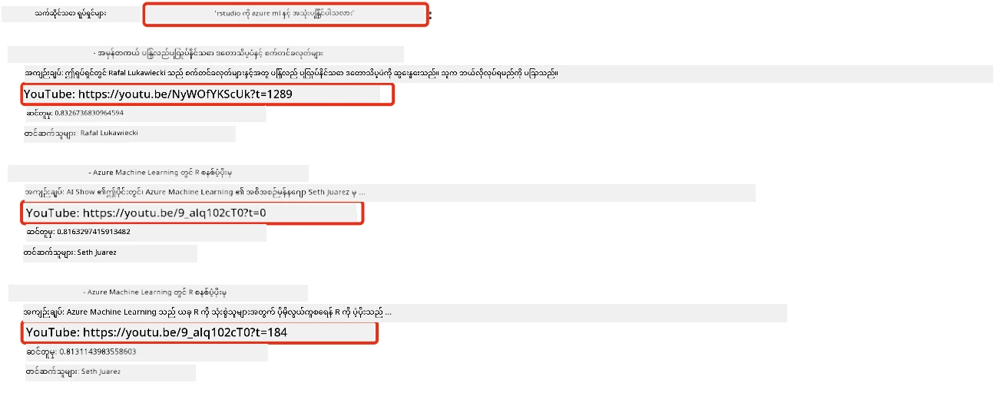
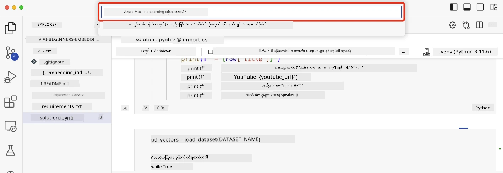

# ရှာဖွေရေးလျှောက်လွှာများ တည်ဆောက်ခြင်း

[](https://youtu.be/W0-nzXjOjr0?si=GcsqiTTvd7RKbo7V)

> > _ဒီသင်ခန်းစာ၏ ဗီဒီယိုကိုကြည့်ရန် ပုံကိုနှိပ်ပါ_

LLM များသည် စကားပြောစက်များနှင့် စာသားထုတ်လုပ်ခြင်းထက်ပိုပြီး ရှိသည်။ Embeddings ကို အသုံးပြု၍ ရှာဖွေရေးလျှောက်လွှာများကိုလည်း တည်ဆောက်နိုင်ပါသည်။ Embeddings သည် ဒေတာ၏ နံပါတ်လက္ခဏာဆိုင်ရာ ဖော်ပြချက်ဖြစ်ပြီး ဗက်တာများဟုလည်း သိရှိကြပြီး ဒေတာအတွက်မြန်ဆန်စွာ semantic ရှာဖွေရေးအတွက် အသုံးပြုနိုင်ပါသည်။

ဒီသင်ခန်းစာတွင် ကျွန်တော်တို့ပညာရေး စတားတပ်အတွက် ရှာဖွေရေးလျှောက်လွှာ တစ်ခုတည်ဆောက်မည်ဖြစ်သည်။ ကျွန်တော်တို့စတားတပ်သည် တိုးတက်လာနေသောနိုင်ငံများမှ ကျောင်းသား/သူများ အတွက် အခမဲ့ပညာရေးပေးသော အကျိုးပြုအဖွဲ့အစည်းတစ်ခုဖြစ်သည်။ ကျွန်တော်တို့စတားတပ်တွင် AI ကိုလေ့လာနိုင်ရန် အတွက် သင်ကြားမှု YouTube ဗီဒီယိုများ အမျိုးမျိုးရှိသည်။ ကျွန်တော်တို့စတားတပ်သည် ကျောင်းသားများက မေးခွန်း ရိုက်ထည့်ခြင်းဖြင့် YouTube ဗီဒီယိုရှာဖွေရေး လျှောက်လွှာတစ်ခုတည်ဆောက်လိုသည်။

ဥပမာ၊ ကျောင်းသားတစ်ဦးသည် 'Jupyter Notebooks ဆိုတာ ဘာလဲ?' သို့မဟုတ် 'Azure ML ဆိုတာဘာလဲ' ဟူ၍ ရိုက်ထည့်နိုင်ပြီး ရှာဖွေရေးလျှောက်လွှာသည် မေးခွန်းနှင့် သက်ဆိုင်သော YouTube ဗီဒီယိုစာရင်းများကို ပြန်လည်ပေးပို့ပါသည်။ ထို့အပြင် ရှာဖွေရေးလျှောက်လွှာမှာ မေးခွန်းဖြေချက်တွေ့ရှိရာ ဗီဒီယိုအပိုင်းမှာ တိုက်ရိုက်လင့်ခ်ကိုလည်း ပြန်ပေးပို့ပါသည်။

## နိဒါန်း

ဒီသင်ခန်းစာတွင် ကျွန်တော်တို့ ပြုလုပ်မည့်အရာများမှာ -

- Semantic နှင့် Keyword ရှာဖွေရေးကွာခြားချက်။
- Text Embeddings ဆိုတာဘာလဲ။
- Text Embeddings Index ကိုဖန်တီးခြင်း။
- Text Embeddings Index တွင် ရှာဖွေရေး။

## သင်ယူရမည့် ရည်မှန်းချက်များ

ဒီသင်ခန်းစာ ပြီးစီးပြီးနောက် သင်သည် အောက်ပါအရာများကို ပြုလုပ်နိုင်မှာဖြစ်သည်။

- Semantic နှင့် keyword ရှာဖွေရေး တို့၏ ကွာခြားချက်ကို ရှင်းပြနိုင်မည်။
- Text Embeddings များဆိုတာ သော့လှမ်းလို့ ရှင်းပြနိုင်မည်။
- Embeddings ကို အသုံးပြုကာ ဒေတာရှာဖွေရာတွင် လျှောက်လွှာ တစ်ခုကို ဖန်တီးနိုင်မည်။

## ရှာဖွေရေး လျှောက်လွှာ တည်ဆောက်ရခြင်း အကြောင်းရင်း

ရှာဖွေရေးလျှောက်လွှာ တစ်ခု တည်ဆောက်ခြင်းဖြင့် Embeddings အသုံးပြုပြီး ဒေတာရှာဖွေရေးကို နားလည်သဘော ပိုမိုကောင်းမွန်စေနိုင်သည်။ ထို့အပြင် ကျောင်းသားများအတွက် အမြန်ဆုံး အချက်အလက် ရှာဖွေရေး လျှောက်လွှာတစ်ခု တည်ဆောက်နည်းကိုလည်း သင်ယူနိုင်ပါသည်။

သင်ခန်းစာတွင် Microsoft [AI Show](https://www.youtube.com/playlist?list=PLlrxD0HtieHi0mwteKBOfEeOYf0LJU4O1) YouTube ချန်နယ်အတွက် YouTube transcript များ၏ Embedding Index ပါဝင်သည်။ AI Show သည် AI နှင့် machine learning ပညာပေးတဲ့ YouTube ချန်နယ်တစ်ခုဖြစ်သည်။ Embedding Index မှာ ၂၀၂၃ အောက်တိုဘာအထိ YouTube transcript များအတွက် Embeddings များပါဝင်သည့် စုစည်းမှုဖြစ်သည်။ သင်သည် ဒီ Embedding Index ကို အသုံးပြုကာ ကျွန်တော်တို့စတားတပ်အတွက် ရှာဖွေရေး လျှောက်လွှာ တည်ဆောက်မှာဖြစ်သည်။ ရှာဖွေရေး လျှောက်လွှာမှာ မေးခွန်းဖြေကြားမှုရှိရာ ဗီဒီယိုအပိုင်းကို တိုက်ရိုက်လင့်ခ် လည်း ပြန်ပေးပို့ပါသည်။ ကျောင်းသားများ အချက်အလက် ဘာသာရှာဖွေရန် စျေးနူန်းမြန်သာစေသည်။

အောက်မှာ 'can you use rstudio with azure ml?' ဆိုတဲ့ မေးခွန်းအတွက် semantic query ဥပမာပါ။ YouTube URL ကိုကြည့်ပါ၊ URL ထဲတွင် မေးခွန်းဖြေစာရင်းပါသော ဗီဒီယိုအပိုင်းသို့ ချိန်ညှိထားမှုရှိသည်။



## Semantic search ဆိုတာဘာလဲ?

ယခု သင်စဉ်းစားမည့်အရာမှာ semantic search ဆိုတာဘာလဲဆိုတာဖြစ်သည်။ Semantic search သည် မေးခွန်းထဲ စကားလုံးများ၏ အဓိပ္ပာယ်ကို အသုံးပြုကာ သက်ဆိုင်သော ရလဒ်များပြန်လည်ပေးသည့် ရှာဖွေရေးနည်းပညာဖြစ်သည်။

Semantic search ဥပမာတစ်ခုကို ပြပါရစို့။ သင်မော်တော်ကားဝယ်လိုသောအခါ 'my dream car' ဟု ရှာဖွေပါက semantic search သည် သင်ကားတွင် `အိပ်မက်` မျှော်မှန်းနေခြင်းမဟုတ်ပဲ သင့်အကြိုက်ဆုံးကားကို ဝယ်လိုသည်ဟု နားလည်လိမ့်မည်။ Semantic search သည် သင့်ရည်ရွယ်ချက်ကို နားလည်ပြီး သက်ဆိုင်ရာရလဒ်ကို ပြန်ပေးသည်။ တခြားနည်းမှာ `keyword search` ဖြစ်ပြီး literally ကားအိပ်မက်များကိုသာ ရှာဖွေသဖြင့် မသက်ဆိုင်ဘဲ ရလဒ်များပေါ်လာခြင်း ဖြစ်တတ်သည်။

## Text Embeddings ဆိုတာဘာလဲ?

[Text embeddings](https://en.wikipedia.org/wiki/Word_embedding?WT.mc_id=academic-105485-koreyst) သည် [ဘာသာစကား သဘာဝ ထုတ်လုပ်မှု](https://en.wikipedia.org/wiki/Natural_language_processing?WT.mc_id=academic-105485-koreyst) မှာ အသုံးပြုသည့် စာသားကို ဖော်ပြပုံနည်းတစ်ခုဖြစ်သည်။ Text embeddings သည် စာသား၏ semantic နံပါတ်ဖော်ပြချက်ဖြစ်သည်။ Embeddings တွင် ဒေတာကို စက်များနားလည်ရလွယ်ကူသော ပုံစံဖြင့် ကိုယ်စားပြုသည်။ Text embeddings ဖန်တီးရန် မော်ဒယ်များစွာရှိပါသေးသည်။ ဒါပေမယ့် ဒီသင်ခန်းစာတွင် OpenAI Embedding Model အသုံးပြုပြီး Embedding များ ဖန်တီးပုံကို အာရုံစိုက် သင်ယူမည်။

ဥပမာအနေနှင့် AI Show YouTube ချန်နယ်၏ အပိုင်းတစ်ခုမှ transcript ထဲရှိ စာသားကိုစဉ်းစားပါစို့။

```text
Today we are going to learn about Azure Machine Learning.
```

ကျွန်တော်တို့ဒီစာသားကို OpenAI Embedding API မှတဆင့် ပေးပို့မည်ဖြစ်ပြီး ၁၅၃၆ ဂဏန်းပါသော embedding vector တစ်ခုကို ပြန်လည်ရရှိမည်။ ဗက်တာတစ်ခု၏ ဂဏန်းတစ်ခုစီသည် စာသား၏ အချက်အလက် အပိုင်းအခြားတစ်ချို့ကို ကိုယ်စားပြုသည်။ ရှင်းလင်းစေရန် ဗက်တာ၏ ပထမ ၁၀ ဂဏန်းကို ပြထားသည်။

```python
[-0.006655829958617687, 0.0026128944009542465, 0.008792596869170666, -0.02446001023054123, -0.008540431968867779, 0.022071078419685364, -0.010703742504119873, 0.003311325330287218, -0.011632772162556648, -0.02187200076878071, ...]
```

## Embedding index ကို မည်သို့ ဖန်တီးမည်နည်း?

ဒီသင်ခန်းစာအတွက် Embedding index ကို Python script များအစုလိုက် အသုံးပြုပြီး ဖန်တီးခဲ့သည်။ Scripts များနှင့် လမ်းညွှန်ချက်များကို ဒီသင်ခန်းစာ၏ 'scripts' ဖောဒါအတွင်းရှိ [README](./scripts/README.md?WT.mc_id=academic-105485-koreyst) တွင် ရှာဖွေနိုင်သည်။ ဒီသင်ခန်းစာ ပြီးစီးရန် Scripts မလိုအပ်ပါသည်။ အဲဒါကြောင့် Embedding Index ကို ကြိုတင်ထည့်ပေးထားသည်။

Scripts များမှ ပြုလုပ်သော လုပ်ဆောင်ချက်များမှာ -

၁။ [AI Show](https://www.youtube.com/playlist?list=PLlrxD0HtieHi0mwteKBOfEeOYf0LJU4O1) playlist အတွင်းရှိ YouTube ဗီဒီယိုတစ်ခုချင်းစီ၏ transcript ကို ဒေါင်းလုဒ် ခြင်း။
၂။ [OpenAI Functions](https://learn.microsoft.com/azure/ai-foundry/openai/how-to/function-calling?WT.mc_id=academic-105485-koreyst) ကို အသုံးပြုကာ YouTube transcript ၏ ပထမ ၃ မိနစ်အတွင်းမှ မိန့်ခွန်းပြောသူ အမည်ကို ထုတ်ယူရန် ကြိုးပမ်းခြင်း။ မိန့်ခွန်းပြောသူ အမည်ကို embedding_index_3m.json အဖြစ် Embedding Index ထဲသိမ်းဆည်းခြင်း။
၃။ Transcript စာသားကို **၃ မိနစ်စာ စာသားဗဟိုများသို့** ခွဲခြားခြင်း။ segment တစ်ခုစီတွင် နောက် segment မှ စကား ၂၀ ကျော်ကို ထပ်တိုးထည့်သွင်းပြီး Embedding ပြတ်ခြင်းမရှိစေရန်နှင့် ရှာဖွေရေးအချိုးအဆ အတိုးပေးရန်။
၄။ Segment တစ်ခုစီကို OpenAI Chat API မှတဆင့် ၆၀ စကားလုံးစာ အကျဉ်းချုပ် ပြုလုပ်၍ Embedding Index embedding_index_3m.json တွင် သိမ်းဆည်းခြင်း။
၅။ အဆုံးဆုံးတွင် Segment စာသားများကို OpenAI Embedding API သို့ ပေးပို့ခြင်း။ Embedding API က ၁၅၃၆ ဂဏန်းပါသော Vector ကို ပြန်ပေးပြီး Semantic အဓိပ္ပာယ်ကို ကိုယ်စားပြုသည်။ Segment နှင့် OpenAI Embedding vector ကို Embedding Index embedding_index_3m.json တွင် သိမ်းဆည်းခြင်း။

### Vector ဒေတာဘေ့(စ်)

သင်ခန်းစာလွယ်ကူစေရန် Embedding Index ကို JSON ဖိုင် embedding_index_3m.json အနေဖြင့် သိမ်းဆည်းပြီး Pandas DataFrame သို့ လုပ်ဆောင်ထားသည်။ ပြီးတော့ အသေးစိတ်ထုတ်လုပ်မှုတွင် Embedding Index ကို [Azure Cognitive Search](https://learn.microsoft.com/training/modules/improve-search-results-vector-search?WT.mc_id=academic-105485-koreyst), [Redis](https://cookbook.openai.com/examples/vector_databases/redis/readme?WT.mc_id=academic-105485-koreyst), [Pinecone](https://cookbook.openai.com/examples/vector_databases/pinecone/readme?WT.mc_id=academic-105485-koreyst), [Weaviate](https://cookbook.openai.com/examples/vector_databases/weaviate/readme?WT.mc_id=academic-105485-koreyst) ကဲ့သို့သော vector database များတွင် သိမ်းဆည်းမည်ဖြစ်ပါသည်။

## cosine similarity ကိုနားလည်ခြင်း

Text embeddings ကိုသင်ယူပြီးနောက်မှာ အဆိုပါ embeddings အသုံးပြုပြီး cosine similarity အသုံးပြုကာ မေးခွန်းတစ်ခုနှင့် အလားတူဆုံး embedding ကို ရှာဖွေခြင်းကိုလေ့လာပါမည်။

### cosine similarity ဆိုတာဘာလဲ?

Cosine similarity သည် vector နှစ်ခုကြား ဆွဲဆန့်ထောင့်၏ ကိုဇိုင်းတန်ဖိုးကို တိုင်းတာခြင်းဖြစ်သည်။ အဲဒါကို `nearest neighbor search` ဟုလည်း ခေါ်သည်။ Cosine similarity ရှာဖွေမှုက လုပ်ဖို့ Query စာသားကို OpenAI Embedding API ဖြင့် vectorize ပြုလုပ်ရမည်။ ထို့နောက် ကျွန်တော်တို့ Embedding Index ထဲရှိ vector တစ်ခုချင်းစီနှင့် Query vector ကြား cosine similarity ကိုတွက်ချက်မည်။ Embedding Index တွင် YouTube transcript စာသား segment တစ်ခုစီအတွက် vector ရှိပြီးလာမည်ဖြစ်သည်။ နောက်ဆုံးတွင် cosine similarity အရ အမြင့်ဆုံး ထိပ်တန်း segment များကို အဆင့်ခင်းပြသမည်။

သင်္ချာနည်းဖြင့် cosine similarity သည် multidimensional ရှိ vector နှစ်ခုကြား ထောင့်တစ်ခု၏ ကိုဇိုင်းကို တိုင်းတာသည်။ size ကြောင့် Euclidean မီတာစားမ်းများနည်းပညာဖြင့် Document နှစ်ခုသည် ဝေးလွန်းပါကလည်း သဘောတူ angle မွနည်းခြင်းကြောင့် ရလဒ်မှာ cosine similarity သာ  အထက်တန်းရှိနိုင်သည်။ Cosine similarity နည်းနိဒါန်း/နိယာမများအတွက် [Cosine similarity](https://en.wikipedia.org/wiki/Cosine_similarity?WT.mc_id=academic-105485-koreyst) ကိုကြည့်နိုင်ပါသည်။

## မိမိ၏ ပထမဆုံး ရှာဖွေရေးလျှောက်လွှာ တည်ဆောက်ခြင်း

နောက်တစ်ဆင့်မှာ Embeddings ကူညီပေးသော ရှာဖွေရေး လျှောက်လွှာ တည်ဆောက်နည်းကို သင်ယူမှာ ဖြစ်သည်။ ရှာဖွေရေး လျှောက်လွှာက ကျောင်းသားများ အတွက် မေးခွန်း ရိုက်ထည့်ခြင်းဖြင့် ဗီဒီယိုရှာဖွေခွင့်ပေးမည်။ ဗီဒီယိုစာရင်းများကို မေးခွန်းနှင့် သက်ဆိုင်မှုရှိသောအတိုင်း ပြန်ပေးပြီး မေးခွန်းဖြေချက် ပါဝင်သော ဗီဒီယိုအပိုင်းကိုလည်း တိုက်ရိုက် လင့်ခ်ပေးမည်။

ဒီ ဖြေရှင်းနည်းကို Windows 11, macOS, Ubuntu 22.04 သုံးပြီး Python 3.10 သို့မဟုတ်နောက်ကျော ဗားရှင်းဖြင့် ဖန်တီးစွမ်းဆောင်စေတာဖြစ်သည်။ Python ကို [python.org](https://www.python.org/downloads/?WT.mc_id=academic-105485-koreyst) မှ ဒေါင်းလုပ်လုပ်နိုင်ပါသည်။

## အလုပ်အပ် - ကျောင်းသားများအတွက် ရှာဖွေရေးလျှောက်လွှာ တည်ဆောက်ခြင်း

ဒီသင်ခန်းစာအစပိုင်းတွင် ကျွန်တော်တို့ စတားတပ်ကို မိတ်ဆက်ခဲ့သည်။ ယခု ကျောင်းသားများအား သူတို့၏ စမ်းသပ်ချက်များအတွက် ရှာဖွေရေး လျှောက်လွှာ တည်ဆောက်ခွင့် ပေးပါမည်။

ဒီအလုပ်အပ်မှာ Azure OpenAI Services များ ဖန်တီးပေးရမည် ဖြစ်သည်။ Azure subscription လိုအပ်ပြီး အောက်ပါ Azure OpenAI Services များ ဖန်တီးသွားပါမည်။

### Azure Cloud Shell ဖြင့် စတင်ခြင်း

၁။ [Azure portal](https://portal.azure.com/?WT.mc_id=academic-105485-koreyst) သို့ စာရင်းဝင်ပါ။
၂။ Azure portal ထဲက ထိပ်ညာဘက်မှ Cloud Shell icon ကို နှိပ်ပါ။
၃။ Environment အမျိုးအစားအဖြစ် **Bash** ကို ရွေးချယ်ပါ။

#### Resource group တည်ဆောက်ခြင်း

> ဤညွှန်ကြားချက်များတွင် "semantic-video-search" ဟူသော East US ရှိ resource group ကို အသုံးပြုခဲ့သည်။
> သင် resource group အမည်ကို ပြောင်းလဲနိုင်သော်လည်း တည်နေရာ ပြောင်းလဲရလျှင်,
> [model availability table](https://aka.ms/oai/models?WT.mc_id=academic-105485-koreyst) ကို စစ်ဆေးပါ။

```shell
az group create --name semantic-video-search --location eastus
```

#### Azure OpenAI Service resource တည်ဆောက်ခြင်း

Azure Cloud Shell မှ အောက်ပါ command ဖြင့် Azure OpenAI Service resource တည်ဆောက်ပါ။

```shell
az cognitiveservices account create --name semantic-video-openai --resource-group semantic-video-search \
    --location eastus --kind OpenAI --sku s0
```

#### ဒီလျှောက်လွှာတွင် အသုံးပြုရန် endpoint နှင့် keys ရယူခြင်း

Azure Cloud Shell မှ အောက်ပါ command များကို ပြေး၍ Azure OpenAI Service resource ၏ endpoint နှင့် keys ကို ရယူပါ။

```shell
az cognitiveservices account show --name semantic-video-openai \
   --resource-group  semantic-video-search | jq -r .properties.endpoint
az cognitiveservices account keys list --name semantic-video-openai \
   --resource-group semantic-video-search | jq -r .key1
```

#### OpenAI Embedding model ကို တပ်ဆင်ခြင်း

Azure Cloud Shell မှ အောက်ပါ command ဖြင့် OpenAI Embedding model ကို တပ်ဆင်ပါ။

```shell
az cognitiveservices account deployment create \
    --name semantic-video-openai \
    --resource-group  semantic-video-search \
    --deployment-name text-embedding-ada-002 \
    --model-name text-embedding-ada-002 \
    --model-version "2"  \
    --model-format OpenAI \
    --sku-capacity 100 --sku-name "Standard"
```

## ဖြေရှင်းနည်း

GitHub Codespaces တွင်ရှိသော [solution notebook](./python/aoai-solution.ipynb?WT.mc_id=academic-105485-koreyst) ကိုဖွင့်ပြီး Jupyter Notebook ကို လမ်းညွှန်ချက်အတိုင်း လိုက်နာပါ။

notebook ကို run လုပ်သောအခါ မေးခွန်းတစ်ခုရိုက်ရန်  ဖိတ်ခေါ်မည်။ input box သည် အောက်ပါအတိုင်း ဖြစ်ပါမည်။



## ကောင်းမွန်သော အလုပ်လုပ်ဆောင်မှု! သင့်သင်ယူမှုကို ဆက်လက်လုပ်ဆောင်ပါ

ဒီသင်ခန်းစာ အပြီး သင်၏ Generative AI သတင်းအချက်အလက်များကို အဆင့်မြှင့်ရန် ကျွန်တော်တို့ရဲ့ [Generative AI Learning collection](https://aka.ms/genai-collection?WT.mc_id=academic-105485-koreyst) ကို ကြည့်ရှုပါ။

Lesson 9 သို့သွား၍ [ပုံဓာတ်ပုံ ထုတ်လုပ်မှု လျှောက်လွှာများ တည်ဆောက်ခြင်း](../09-building-image-applications/README.md?WT.mc_id=academic-105485-koreyst) ကို လေ့လာကြည့်ပါ။

---

<!-- CO-OP TRANSLATOR DISCLAIMER START -->
**ပြောကြားချက်**
ဤစာတမ်းကို AI ဘာသာပြန်ဝန်ဆောင်မှု [Co-op Translator](https://github.com/Azure/co-op-translator) အသုံးပြု၍ ဘာသာပြန်ထားပါသည်။ ကျွန်ုပ်တို့သည် တိကျမှန်ကန်မှုအတွက် ကြိုးပမ်းနေသော်လည်း၊ စက်ကိရိယာဘာသာပြန်ခြင်းများတွင် အမှားများ သို့မဟုတ် မှားယွင်းချက်များ ပါဝင်နိုင်ကြောင်း သတိပြုပါရန် လိုအပ်ပါသည်။ မူလစာတမ်းကို မူရင်းဘာသာဖြင့်သာ ယုံကြည်စိတ်ချရသော အချက်အလက်အဖြစ် သတ်မှတ်သင့်သည်။ အရေးကြီးသည့် သတင်းအချက်အလက်များအတွက် ပရော်ဖက်ရှင်နယ် လူသားဘာသာပြန်သူဝန်ဆောင်မှုကို အကြံပြုပါသည်။ ဤဘာသာပြန်ချက်ကို အသုံးပြုခြင်းမှ ဖြစ်ပေါ်လာသော နားလည်မှုကွာခြားမှုများ သို့မဟုတ် မမှန်ကန်သော အသုံးပြုမှုများအတွက် ကျွန်ုပ်တို့ တာဝန်မခံပါ။
<!-- CO-OP TRANSLATOR DISCLAIMER END -->