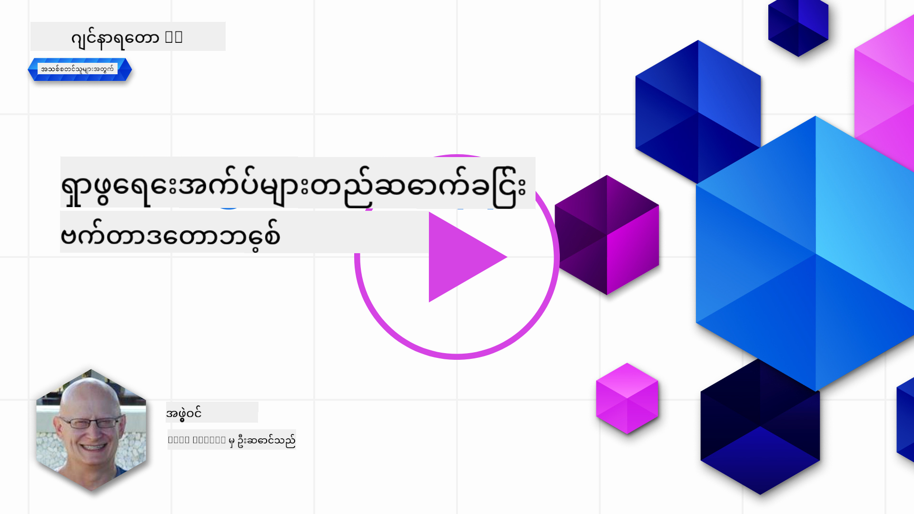

<!--
CO_OP_TRANSLATOR_METADATA:
{
  "original_hash": "d46aad0917a1a342d613e2c13d457da5",
  "translation_date": "2025-07-09T13:04:58+00:00",
  "source_file": "08-building-search-applications/README.md",
  "language_code": "my"
}
-->
# ရှာဖွေရေး အက်ပလီကေးရှင်း တည်ဆောက်ခြင်း

[](https://aka.ms/gen-ai-lesson8-gh?WT.mc_id=academic-105485-koreyst)

> > _ဓာတ်ပုံကို နှိပ်၍ ဤသင်ခန်းစာ၏ ဗီဒီယိုကို ကြည့်ရှုနိုင်ပါသည်_

LLM များသည် စကားပြောစက်များနှင့် စာသားဖန်တီးခြင်းထက် ပိုမိုကျယ်ပြန့်သည်။ Embeddings ကို အသုံးပြု၍ ရှာဖွေရေး အက်ပလီကေးရှင်းများကိုလည်း တည်ဆောက်နိုင်ပါသည်။ Embeddings ဆိုသည်မှာ ဒေတာ၏ ဂဏန်းဖော်ပြချက်များဖြစ်ပြီး vector များအဖြစ်လည်း သိကြပြီး ဒေတာအတွက် အဓိပ္ပါယ်ဆိုင်ရာ ရှာဖွေရေးတွင် အသုံးပြုနိုင်ပါသည်။

ဤသင်ခန်းစာတွင် ကျွန်ုပ်တို့၏ ပညာရေး စတားတပ်အတွက် ရှာဖွေရေး အက်ပလီကေးရှင်း တစ်ခုကို တည်ဆောက်သွားမည်ဖြစ်သည်။ ကျွန်ုပ်တို့၏ စတားတပ်သည် ဖွံ့ဖြိုးတိုးတက်နေသော နိုင်ငံများရှိ ကျောင်းသားများအတွက် အခမဲ့ ပညာရေးပေးသည့် အကျိုးပြုအဖွဲ့အစည်းတစ်ခုဖြစ်သည်။ ကျွန်ုပ်တို့တွင် AI သင်ယူနိုင်ရန် YouTube ဗီဒီယိုများစွာ ရှိပြီး ကျောင်းသားများသည် မေးခွန်း ရိုက်ထည့်၍ YouTube ဗီဒီယိုကို ရှာဖွေနိုင်မည့် ရှာဖွေရေး အက်ပလီကေးရှင်း တည်ဆောက်လိုသည်။

ဥပမာအားဖြင့် ကျောင်းသားတစ်ဦးသည် 'Jupyter Notebooks ဆိုတာဘာလဲ?' သို့မဟုတ် 'Azure ML ဆိုတာဘာလဲ?' ဟု ရိုက်ထည့်ပါက ရှာဖွေရေး အက်ပလီကေးရှင်းသည် မေးခွန်းနှင့် သက်ဆိုင်သော YouTube ဗီဒီယိုများစာရင်းကို ပြန်လည်ပေးမည်ဖြစ်ပြီး ထိုအပြင် မေးခွန်း၏ ဖြေကြားချက်ရှိသည့် ဗီဒီယိုအပိုင်းသို့ ချိတ်ဆက်လင့်ခ်ကိုလည်း ပြန်ပေးပါမည်။

## မိတ်ဆက်

ဤသင်ခန်းစာတွင် ကျွန်ုပ်တို့ လေ့လာမည့်အကြောင်းအရာများမှာ -

- Semantic နှင့် Keyword ရှာဖွေရေး၏ ကွာခြားချက်
- Text Embeddings ဆိုတာဘာလဲ
- Text Embeddings Index တည်ဆောက်ခြင်း
- Text Embeddings Index တွင် ရှာဖွေရေးလုပ်ခြင်း

## သင်ယူရမည့် ရည်မှန်းချက်များ

ဤသင်ခန်းစာပြီးဆုံးပါက -

- Semantic နှင့် Keyword ရှာဖွေရေး၏ ကွာခြားချက်ကို ဖော်ပြနိုင်မည်
- Text Embeddings ဆိုတာဘာလဲ ဆိုတာကို ရှင်းပြနိုင်မည်
- Embeddings ကို အသုံးပြု၍ ဒေတာ ရှာဖွေရေး အက်ပလီကေးရှင်း တစ်ခု ဖန်တီးနိုင်မည်

## ရှာဖွေရေး အက်ပလီကေးရှင်း တည်ဆောက်ရခြင်း၏ အကြောင်းရင်း

ရှာဖွေရေး အက်ပလီကေးရှင်း တည်ဆောက်ခြင်းဖြင့် Embeddings ကို အသုံးပြု၍ ဒေတာ ရှာဖွေရေးလုပ်နည်းကို နားလည်နိုင်မည်ဖြစ်ပြီး ကျောင်းသားများအတွက် အချက်အလက်များကို အလျင်အမြန် ရှာဖွေတွေ့ရှိနိုင်မည့် အက်ပလီကေးရှင်းတစ်ခုကိုလည်း တည်ဆောက်နိုင်မည်ဖြစ်သည်။

ဤသင်ခန်းစာတွင် Microsoft [AI Show](https://www.youtube.com/playlist?list=PLlrxD0HtieHi0mwteKBOfEeOYf0LJU4O1) YouTube ချန်နယ်၏ transcript များအတွက် Embedding Index ပါဝင်သည်။ AI Show သည် AI နှင့် machine learning အကြောင်း သင်ကြားပေးသည့် YouTube ချန်နယ်ဖြစ်သည်။ Embedding Index တွင် ၂၀၂၃ ခုနှစ် အောက်တိုဘာလအထိ YouTube transcript များအတွက် Embeddings များ ပါဝင်သည်။ ကျွန်ုပ်တို့၏ စတားတပ်အတွက် ရှာဖွေရေး အက်ပလီကေးရှင်း တည်ဆောက်ရာတွင် ဤ Embedding Index ကို အသုံးပြုမည်ဖြစ်သည်။ ရှာဖွေရေး အက်ပလီကေးရှင်းသည် မေးခွန်းဖြေချက်ရှိသည့် ဗီဒီယိုအပိုင်းသို့ ချိတ်ဆက်လင့်ခ်ကို ပြန်ပေးမည်ဖြစ်ပြီး ကျောင်းသားများအတွက် လိုအပ်သော အချက်အလက်များကို အလျင်အမြန် ရှာဖွေတွေ့ရှိနိုင်စေသည်။

အောက်တွင် 'can you use rstudio with azure ml?' ဟူသော မေးခွန်းအတွက် semantic query ဥပမာတစ်ခုကို ဖော်ပြထားသည်။ YouTube url ကို ကြည့်ပါက မေးခွန်းဖြေချက်ရှိသည့် ဗီဒီယိုအပိုင်းသို့ သွားသော timestamp ပါရှိသည်ကို တွေ့ရမည်ဖြစ်သည်။


## Semantic search ဆိုတာဘာလဲ?

ယခု သင်စဉ်းစားမည့်အချက်မှာ semantic search ဆိုတာဘာလဲဆိုတာဖြစ်နိုင်သည်။ Semantic search သည် မေးခွန်းအတွင်း စကားလုံးများ၏ အဓိပ္ပါယ်ကို အသုံးပြု၍ သက်ဆိုင်ရာ ရလဒ်များကို ပြန်လည်ပေးသည့် ရှာဖွေရေးနည်းပညာတစ်ခုဖြစ်သည်။

ဥပမာအားဖြင့် ကားဝယ်လိုသူတစ်ဦးဟု ဆိုပါစို့၊ 'my dream car' ဟု ရှာဖွေပါက semantic search သည် သင်ကားအကြောင်း အိပ်မက်မက်နေခြင်းမဟုတ်ပဲ သင်၏ အကြိုက်ဆုံး ကားကို ရှာဖွေနေကြောင်း နားလည်ပြီး သက်ဆိုင်ရာ ရလဒ်များကို ပြန်ပေးမည်ဖြစ်သည်။ အခြားနည်းလမ်းဖြစ်သော keyword search သည် စကားလုံးများကို တိတိကျကျ ရှာဖွေပြီး မသက်ဆိုင်သော ရလဒ်များကို မကြာခဏ ပြန်ပေးနိုင်သည်။

## Text Embeddings ဆိုတာဘာလဲ?

[Text embeddings](https://en.wikipedia.org/wiki/Word_embedding?WT.mc_id=academic-105485-koreyst) သည် [ဘာသာစကား သဘာဝဖြင့် ကွန်ပျူတာကို လေ့လာခြင်း](https://en.wikipedia.org/wiki/Natural_language_processing?WT.mc_id=academic-105485-koreyst) တွင် အသုံးပြုသော စာသားကို ကိုယ်စားပြုသည့် နည်းပညာတစ်ခုဖြစ်သည်။ Text embeddings သည် စာသား၏ အဓိပ္ပါယ်ဆိုင်ရာ ဂဏန်းဖော်ပြချက်များဖြစ်ပြီး ကွန်ပျူတာအတွက် နားလည်ရလွယ်ကူစေရန် ဒေတာကို ကိုယ်စားပြုသည်။ Text embeddings ဖန်တီးရာတွင် မော်ဒယ်များစွာ ရှိသော်လည်း ဤသင်ခန်းစာတွင် OpenAI Embedding Model ကို အသုံးပြု၍ Embeddings ဖန်တီးခြင်းကို အဓိကထား လေ့လာမည်ဖြစ်သည်။

ဥပမာအားဖြင့် AI Show YouTube ချန်နယ်မှ အပိုင်းတစ်ခု၏ transcript တွင် အောက်ပါစာသား ပါရှိသည်ဟု စဉ်းစားပါ။

```text
Today we are going to learn about Azure Machine Learning.
```

ကျွန်ုပ်တို့သည် ဤစာသားကို OpenAI Embedding API သို့ ပေးပို့ပြီး ၁၅၃၆ ဂဏန်းပါဝင်သည့် vector တစ်ခုကို ပြန်လည်ရရှိမည်ဖြစ်သည်။ ဤ vector ၏ တစ်ခုချင်းစီသည် စာသား၏ အပိုင်းတစ်ခုချင်းစီကို ကိုယ်စားပြုသည်။ အကျဉ်းချုပ်အနေဖြင့် ဤ vector ၏ ပထမဆုံး ၁၀ ဂဏန်းကို ဖော်ပြထားသည်။

```python
[-0.006655829958617687, 0.0026128944009542465, 0.008792596869170666, -0.02446001023054123, -0.008540431968867779, 0.022071078419685364, -0.010703742504119873, 0.003311325330287218, -0.011632772162556648, -0.02187200076878071, ...]
```

## Embedding index ကို မည်သို့ ဖန်တီးသနည်း?

ဤသင်ခန်းစာအတွက် Embedding index ကို Python script များစီးရီးဖြင့် ဖန်တီးထားသည်။ script များနှင့် လမ်းညွှန်ချက်များကို ဤသင်ခန်းစာ၏ 'scripts' ဖိုလ်ဒါရှိ [README](./scripts/README.md?WT.mc_id=academic-105485-koreyst) တွင် တွေ့နိုင်သည်။ သင်ခန်းစာပြီးစီးရန် script များကို မပြေးရန် လိုအပ်ပါ၊ Embedding Index ကို ကြိုတင်ပေးထားပြီးဖြစ်သည်။

script များသည် အောက်ပါ လုပ်ဆောင်ချက်များကို ပြုလုပ်သည်-

1. [AI Show](https://www.youtube.com/playlist?list=PLlrxD0HtieHi0mwteKBOfEeOYf0LJU4O1) playlist တွင် ပါဝင်သည့် YouTube ဗီဒီယို တစ်ခုချင်းစီ၏ transcript ကို ဒေါင်းလုပ်လုပ်သည်။
2. [OpenAI Functions](https://learn.microsoft.com/azure/ai-services/openai/how-to/function-calling?WT.mc_id=academic-105485-koreyst) ကို အသုံးပြု၍ YouTube transcript ၏ ပထမ ၃ မိနစ်မှ စကားပြောသူအမည်ကို ထုတ်ယူရန် ကြိုးပမ်းသည်။ ဗီဒီယိုတစ်ခုချင်းစီ၏ စကားပြောသူအမည်ကို `embedding_index_3m.json` ဟု အမည်ပေးထားသည့် Embedding Index တွင် သိမ်းဆည်းသည်။
3. Transcript စာသားကို **၃ မိနစ်စာ အပိုင်းများ** သို့ ခွဲထုတ်သည်။ အပိုင်းတစ်ခုနှင့် နောက်တစ်ပိုင်းအကြား စကားလုံး ၂၀ ခန့်ကို ထပ်တူထပ်မျှဝေထားပြီး Embedding များ မဖြတ်တောက်ပဲ ရှာဖွေရေးအတွက် ပိုမိုကောင်းမွန်စေရန် ဖြစ်သည်။
4. အပိုင်းတစ်ခုချင်းစီကို OpenAI Chat API သို့ ပေးပို့၍ စာသားကို ၆၀ စကားလုံးအတွင်း အကျဉ်းချုပ် ပြုလုပ်သည်။ အကျဉ်းချုပ်ကိုလည်း `embedding_index_3m.json` တွင် သိမ်းဆည်းသည်။
5. နောက်ဆုံးတွင် အပိုင်းစာသားကို OpenAI Embedding API သို့ ပေးပို့သည်။ Embedding API သည် ၁၅၃၆ ဂဏန်းပါဝင်သည့် vector ကို ပြန်ပေးပြီး အပိုင်းနှင့်အတူ `embedding_index_3m.json` တွင် သိမ်းဆည်းသည်။

### Vector Database များ

သင်ခန်းစာကို ရိုးရှင်းစေရန် Embedding Index ကို `embedding_index_3m.json` ဟု အမည်ပေးထားသည့် JSON ဖိုင်အဖြစ် သိမ်းဆည်းပြီး Pandas DataFrame သို့ load လုပ်ထားသည်။ သို့သော် ထုတ်လုပ်မှုတွင် Embedding Index ကို [Azure Cognitive Search](https://learn.microsoft.com/training/modules/improve-search-results-vector-search?WT.mc_id=academic-105485-koreyst), [Redis](https://cookbook.openai.com/examples/vector_databases/redis/readme?WT.mc_id=academic-105485-koreyst), [Pinecone](https://cookbook.openai.com/examples/vector_databases/pinecone/readme?WT.mc_id=academic-105485-koreyst), [Weaviate](https://cookbook.openai.com/examples/vector_databases/weaviate/readme?WT.mc_id=academic-105485-koreyst) စသည့် vector database များတွင် သိမ်းဆည်းကြသည်။

## Cosine similarity ကို နားလည်ခြင်း

Text embeddings အကြောင်းကို လေ့လာပြီးနောက် အဆင့်မှာ text embeddings ကို အသုံးပြု၍ ဒေတာ ရှာဖွေရေးလုပ်နည်းကို သင်ယူမည်ဖြစ်ပြီး အထူးသဖြင့် cosine similarity ကို အသုံးပြု၍ မေးခွန်းနှင့် အလားတူဆုံး embeddings များကို ရှာဖွေမည်ဖြစ်သည်။

### Cosine similarity ဆိုတာဘာလဲ?

Cosine similarity သည် vector နှစ်ခုအကြား ဆင်တူမှုကို တိုင်းတာသည့် နည်းဖြစ်ပြီး `nearest neighbor search` ဟုလည်း ခေါ်ကြသည်။ Cosine similarity ရှာဖွေရေးလုပ်ရန် မေးခွန်းစာသားကို OpenAI Embedding API ဖြင့် vector အဖြစ် ပြောင်းပြီး Embedding Index တွင်ရှိသည့် vector တစ်ခုချင်းစီနှင့် cosine similarity ကိုတွက်ချက်ရမည်ဖြစ်သည်။ Embedding Index တွင် YouTube transcript စာသား အပိုင်းတိုင်းအတွက် vector ရှိသည်။ နောက်ဆုံးတွင် cosine similarity အလိုက် ရလဒ်များကို စီစဉ်ပြီး အမြင့်ဆုံး cosine similarity ရှိသော စာသားအပိုင်းများသည် မေးခွန်းနှင့် အလားတူဆုံးဖြစ်သည်။

သင်္ချာနည်းဖြင့် cosine similarity သည် မျိုးစုံအတိုင်းအတာရှိ အာကာသတွင် vector နှစ်ခုအကြား ထောင့်၏ cosine ကို တိုင်းတာသည်။ ဤတိုင်းတာမှုသည် အကျယ်အဝန်းကြောင့် Euclidean အကွာအဝေးကြီးသော စာရွက်စာတမ်းများမှာလည်း ထောင့်က နီးစပ်၍ cosine similarity မြင့်မားနိုင်ခြင်းကြောင့် အကျိုးရှိသည်။ Cosine similarity သင်္ချာနည်းများအကြောင်း ပိုမိုသိရှိလိုပါက [Cosine similarity](https://en.wikipedia.org/wiki/Cosine_similarity?WT.mc_id=academic-105485-koreyst) ကို ကြည့်ရှုနိုင်ပါသည်။

## သင့် ပထမဆုံး ရှာဖွေရေး အက်ပလီကေးရှင်း တည်ဆောက်ခြင်း

နောက်တစ်ဆင့်တွင် Embeddings ကို အသုံးပြု၍ ရှာဖွေရေး အက်ပလီကေးရှင်း တည်ဆောက်နည်းကို သင်ယူမည်ဖြစ်သည်။ ဤအက်ပလီကေးရှင်းသည် ကျောင်းသားများအား မေးခွန်း ရိုက်ထည့်၍ ဗီဒီယိုများကို ရှာဖွေနိုင်စေမည်ဖြစ်သည်။ ရှာဖွေရေး အက်ပလီကေးရှင်းသည် မေးခွန်းနှင့် သက်ဆိုင်သော ဗီဒီယိုများစာရင်းကို ပြန်ပေးပြီး မေးခွန်းဖြေချက်ရှိသည့် ဗီဒီယိုအပိုင်းသို့ ချိတ်ဆက်လင့်ခ်ကိုလည်း ပြန်ပေးမည်ဖြစ်သည်။

ဤဖြေရှင်းချက်ကို Windows 11, macOS, Ubuntu 22.04 ပေါ်တွင် Python 3.10 သို့မဟုတ် အထက်တွင် စမ်းသပ်ပြီး တည်ဆောက်ထားသည်။ Python ကို [python.org](https://www.python.org/downloads/?WT.mc_id=academic-105485-koreyst) မှ ဒေါင်းလုပ်လုပ်နိုင်ပါသည်။

## လေ့ကျင့်ခန်း - ကျောင်းသားများအတွက် ရှာဖွေရေး အက်ပလီကေးရှင်း တည်ဆောက်ခြင်း

ဤသင်ခန်းစာအစမှာ ကျွန်ုပ်တို့၏ စတားတပ်ကို မိတ်ဆက်ခဲ့သည်။ ယခု ကျောင်းသားများအား သူတို့၏ သင်ခန်းစာအတွက် ရှာဖွေရေး အက်ပလီကေးရှင်း တည်ဆောက်နိုင်ရန် အခွင့်အရေးပေးမည်ဖြစ်သည်။

ဤလေ့ကျင့်ခန်းတွင် ရှာဖွေရေး အက်ပလီကေးရှင်း တည်ဆောက်ရာတွင် အသုံးပြုမည့် Azure OpenAI Services များကို ဖန်တီးမည်ဖြစ်သည်။ Azure subscription လိုအပ်ပါသည်။

### Azure Cloud Shell စတင်အသုံးပြုခြင်း

1. [Azure portal](https://portal.azure.com/?WT.mc_id=academic-105485-koreyst) တွင် လက်မှတ်ထိုးဝင်ပါ။
2. Azure portal ၏ ညာဘက်အပေါ်ထောင့်ရှိ Cloud Shell အိုင်ကွန်ကို ရွေးချယ်ပါ။
3. ပတ်ဝန်းကျင်အမျိုးအစားအဖြစ် **Bash** ကို ရွေးချယ်ပါ။

#### Resource group တစ်ခု ဖန်တီးခြင်း

> ဤညွှန်ကြားချက်များတွင် East US တွင် "semantic-video-search" ဟု အမည်ပေးထားသည့် resource group ကို အသုံးပြုထားသည်။
> resource group အမည်ကို ပြောင်းလဲနိုင်သော်လည်း resource များ၏ တည်နေရာကို ပြောင်း

**အကြောင်းကြားချက်**  
ဤစာတမ်းကို AI ဘာသာပြန်ဝန်ဆောင်မှု [Co-op Translator](https://github.com/Azure/co-op-translator) ဖြင့် ဘာသာပြန်ထားပါသည်။ ကျွန်ုပ်တို့သည် တိကျမှန်ကန်မှုအတွက် ကြိုးစားသော်လည်း အလိုအလျောက် ဘာသာပြန်ခြင်းတွင် အမှားများ သို့မဟုတ် မှားယွင်းချက်များ ပါဝင်နိုင်ကြောင်း သတိပြုပါရန် မေတ္တာရပ်ခံအပ်ပါသည်။ မူရင်းစာတမ်းကို မိမိဘာသာစကားဖြင့်သာ တရားဝင်အရင်းအမြစ်အဖြစ် ယူဆသင့်ပါသည်။ အရေးကြီးသော အချက်အလက်များအတွက် လူ့ဘာသာပြန်ပညာရှင်မှ ဘာသာပြန်ခြင်းကို အကြံပြုပါသည်။ ဤဘာသာပြန်ချက်ကို အသုံးပြုရာမှ ဖြစ်ပေါ်လာနိုင်သည့် နားလည်မှုမှားယွင်းမှုများအတွက် ကျွန်ုပ်တို့သည် တာဝန်မယူပါ။