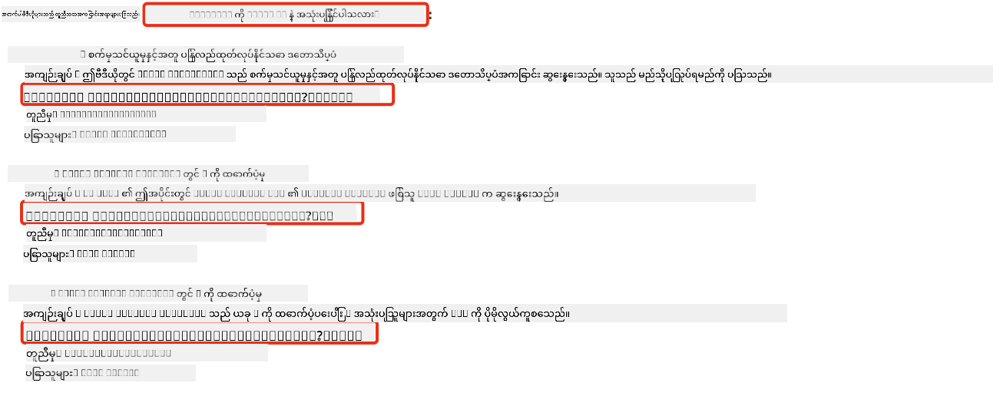

<!--
CO_OP_TRANSLATOR_METADATA:
{
  "original_hash": "58953c08b8ba7073b836d4270ea0fe86",
  "translation_date": "2025-10-18T01:52:28+00:00",
  "source_file": "08-building-search-applications/README.md",
  "language_code": "my"
}
-->
# ရှာဖွေမှုအက်ပလီကေးရှင်းတစ်ခုတည်ဆောက်ခြင်း

[](https://youtu.be/W0-nzXjOjr0?si=GcsqiTTvd7RKbo7V)

> > _အထက်ပါပုံကိုနှိပ်ပြီး ဒီသင်ခန်းစာရဲ့ဗီဒီယိုကိုကြည့်ပါ_

LLMs တွေဟာ chatbot တွေ၊ စာသားထုတ်လုပ်မှုတွေထက်ပိုပြီးအရေးပါပါတယ်။ Embeddings ကိုအသုံးပြုပြီး ရှာဖွေမှုအက်ပလီကေးရှင်းတွေကိုလည်းတည်ဆောက်နိုင်ပါတယ်။ Embeddings ဆိုတာက ဒေတာကိုနံပါတ်ပုံစံနဲ့ဖော်ပြထားတဲ့အရာတွေဖြစ်ပြီး vectors လို့လည်းလူသိများပါတယ်။ ဒါတွေကို semantic search အတွက်အသုံးပြုနိုင်ပါတယ်။

ဒီသင်ခန်းစာမှာတော့ ကျွန်တော်တို့ရဲ့ပညာရေးစတင်မှုအတွက် ရှာဖွေမှုအက်ပလီကေးရှင်းတစ်ခုကိုတည်ဆောက်မှာဖြစ်ပါတယ်။ ကျွန်တော်တို့ရဲ့စတင်မှုဟာ ဖွံ့ဖြိုးဆဲနိုင်ငံတွေမှာကျောင်းသားတွေကို အခမဲ့ပညာပေးတဲ့ non-profit အဖွဲ့အစည်းတစ်ခုဖြစ်ပါတယ်။ ကျွန်တော်တို့ရဲ့စတင်မှုမှာ ကျောင်းသားတွေ AI အကြောင်းကိုလေ့လာနိုင်ဖို့ YouTube ဗီဒီယိုအများအပြားရှိပါတယ်။ ကျောင်းသားတွေကမေးခွန်းတစ်ခုရိုက်ထည့်ပြီး YouTube ဗီဒီယိုကိုရှာဖွေနိုင်တဲ့ ရှာဖွေမှုအက်ပလီကေးရှင်းတစ်ခုကိုတည်ဆောက်ချင်ပါတယ်။

ဥပမာအားဖြင့် ကျောင်းသားတစ်ဦးက 'Jupyter Notebooks ဆိုတာဘာလဲ?' ဒါမှမဟုတ် 'Azure ML ဆိုတာဘာလဲ?' ဆိုပြီးရိုက်ထည့်နိုင်ပြီး ရှာဖွေမှုအက်ပလီကေးရှင်းက မေးခွန်းနဲ့သက်ဆိုင်တဲ့ YouTube ဗီဒီယိုစာရင်းကိုပြန်ပေးပါမယ်။ အထူးသဖြင့် မေးခွန်းရဲ့အဖြေရှိတဲ့ဗီဒီယိုရဲ့နေရာကိုပြသတဲ့လင့်ခ်ကိုလည်းပြန်ပေးပါမယ်။

## မိတ်ဆက်

ဒီသင်ခန်းစာမှာ ကျွန်တော်တို့ဖော်ပြမယ့်အကြောင်းအရာတွေကတော့ -

- Semantic ရှာဖွေမှုနဲ့ Keyword ရှာဖွေမှု
- Text Embeddings ဆိုတာဘာလဲ
- Text Embeddings Index တစ်ခုကိုဖန်တီးခြင်း
- Text Embeddings Index ကိုရှာဖွေခြင်း

## သင်ယူရမယ့်ရည်မှန်းချက်များ

ဒီသင်ခန်းစာကိုပြီးမြောက်ပြီးနောက်မှာ-

- Semantic ရှာဖွေမှုနဲ့ Keyword ရှာဖွေမှုအကြားကွာခြားချက်ကိုပြောပြနိုင်မယ်။
- Text Embeddings ဆိုတာဘာလဲဆိုတာရှင်းပြနိုင်မယ်။
- Embeddings ကိုအသုံးပြုပြီး ဒေတာကိုရှာဖွေတဲ့အက်ပလီကေးရှင်းတစ်ခုကိုတည်ဆောက်နိုင်မယ်။

## ရှာဖွေမှုအက်ပလီကေးရှင်းတစ်ခုကိုဘာလို့တည်ဆောက်ရတာလဲ?

ရှာဖွေမှုအက်ပလီကေးရှင်းတစ်ခုကိုတည်ဆောက်ခြင်းက Embeddings ကိုအသုံးပြုပြီး ဒေတာကိုရှာဖွေဖို့နည်းလမ်းကိုနားလည်စေမှာဖြစ်ပါတယ်။ ဒါ့အပြင် ကျောင်းသားတွေကို အချက်အလက်တွေကိုအလျင်အမြန်ရှာဖွေဖို့အတွက် အသုံးပြုနိုင်တဲ့ ရှာဖွေမှုအက်ပလီကေးရှင်းတစ်ခုကိုတည်ဆောက်ဖို့လည်းသင်လေ့လာနိုင်မှာဖြစ်ပါတယ်။

ဒီသင်ခန်းစာမှာ Microsoft [AI Show](https://www.youtube.com/playlist?list=PLlrxD0HtieHi0mwteKBOfEeOYf0LJU4O1) YouTube channel ရဲ့ transcript တွေကို Embedding Index အနေနဲ့ထည့်သွင်းထားပါတယ်။ AI Show ဟာ AI နဲ့ machine learning အကြောင်းကိုသင်ပေးတဲ့ YouTube channel တစ်ခုဖြစ်ပါတယ်။ Embedding Index မှာ Oct 2023 အထိ YouTube transcript တွေရဲ့ Embeddings တွေပါဝင်ပါတယ်။ ကျွန်တော်တို့ရဲ့စတင်မှုအတွက် ရှာဖွေမှုအက်ပလီကေးရှင်းတစ်ခုကိုတည်ဆောက်ဖို့ ဒီ Embedding Index ကိုအသုံးပြုပါမယ်။ ရှာဖွေမှုအက်ပလီကေးရှင်းက မေးခွန်းရဲ့အဖြေရှိတဲ့ဗီဒီယိုရဲ့နေရာကိုပြသတဲ့လင့်ခ်ကိုပြန်ပေးပါမယ်။ ဒါဟာ ကျောင်းသားတွေကိုလိုအပ်တဲ့အချက်အလက်တွေကိုအလျင်အမြန်ရှာဖွေဖို့အတွက်အကောင်းဆုံးနည်းလမ်းဖြစ်ပါတယ်။

အောက်မှာ 'can you use rstudio with azure ml?' ဆိုတဲ့မေးခွန်းအတွက် semantic query ရဲ့ဥပမာကိုတွေ့နိုင်ပါတယ်။ YouTube url ကိုကြည့်ပါ၊ url မှာ timestamp ပါဝင်ပြီး မေးခွန်းရဲ့အဖြေရှိတဲ့ဗီဒီယိုရဲ့နေရာကိုသွားနိုင်ပါတယ်။



## Semantic ရှာဖွေမှုဆိုတာဘာလဲ?

အခုသင်မေးမြန်းနေတာက Semantic ရှာဖွေမှုဆိုတာဘာလဲဆိုတာဖြစ်ပါတယ်။ Semantic ရှာဖွေမှုဟာ query မှာပါတဲ့စကားလုံးတွေရဲ့အဓိပ္ပါယ်ကိုအသုံးပြုပြီး သက်ဆိုင်တဲ့ရလဒ်တွေကိုပြန်ပေးတဲ့ရှာဖွေမှုနည်းလမ်းတစ်ခုဖြစ်ပါတယ်။

Semantic ရှာဖွေမှုရဲ့ဥပမာတစ်ခုကတော့- သင်ကားတစ်စီးဝယ်ဖို့ရှာဖွေနေတယ်ဆိုပါစို့၊ 'my dream car' လို့ရှာဖွေမယ်ဆိုရင် semantic ရှာဖွေမှုက သင်ကားအကြောင်းကို 'အိပ်မက်' မက်နေတဲ့အကြောင်းကိုမဟုတ်ဘဲ သင်ဝယ်ချင်တဲ့ 'အိပ်မက်ထဲကကား' ကိုရှာဖွေနေတယ်ဆိုတာကိုနားလည်ပါတယ်။ Semantic ရှာဖွေမှုက သင်ရဲ့ရည်ရွယ်ချက်ကိုနားလည်ပြီး သက်ဆိုင်တဲ့ရလဒ်တွေကိုပြန်ပေးပါတယ်။ အခြားနည်းလမ်းဖြစ်တဲ့ 'keyword search' ကတော့ literally ကားအကြောင်းအိပ်မက်တွေကိုရှာဖွေပြီး မသက်ဆိုင်တဲ့ရလဒ်တွေကိုပြန်ပေးတတ်ပါတယ်။

## Text Embeddings ဆိုတာဘာလဲ?

[Text embeddings](https://en.wikipedia.org/wiki/Word_embedding?WT.mc_id=academic-105485-koreyst) ဆိုတာ [natural language processing](https://en.wikipedia.org/wiki/Natural_language_processing?WT.mc_id=academic-105485-koreyst) မှာအသုံးပြုတဲ့စာသားကိုဖော်ပြတဲ့နည်းလမ်းတစ်ခုဖြစ်ပါတယ်။ Text embeddings ဟာစာသားရဲ့ semantic နံပါတ်ပုံစံဖော်ပြမှုတွေဖြစ်ပါတယ်။ Embeddings တွေကို machine နားလည်ရလွယ်တဲ့နည်းလမ်းနဲ့ဒေတာကိုဖော်ပြဖို့အသုံးပြုပါတယ်။ Text embeddings ကိုဖန်တီးဖို့အတွက် model အမျိုးမျိုးရှိပြီး ဒီသင်ခန်းစာမှာ OpenAI Embedding Model ကိုအသုံးပြုပြီး embeddings တွေကိုဖန်တီးမှာဖြစ်ပါတယ်။

ဥပမာအားဖြင့် AI Show YouTube channel ရဲ့ episode တစ်ခုရဲ့ transcript မှာပါတဲ့စာသားကိုစဉ်းစားပါ။

```text
Today we are going to learn about Azure Machine Learning.
```

ကျွန်တော်တို့ OpenAI Embedding API ကိုစာသားကိုပေးပြီး API က 1536 နံပါတ်တွေပါဝင်တဲ့ embedding aka vector ကိုပြန်ပေးပါမယ်။ Vector မှာပါတဲ့နံပါတ်တစ်ခုချင်းစီဟာစာသားရဲ့ aspect တစ်ခုချင်းစီကိုဖော်ပြပါတယ်။ အတိုချုံးပြောရရင် vector ရဲ့ပထမ 10 နံပါတ်တွေကတော့-

```python
[-0.006655829958617687, 0.0026128944009542465, 0.008792596869170666, -0.02446001023054123, -0.008540431968867779, 0.022071078419685364, -0.010703742504119873, 0.003311325330287218, -0.011632772162556648, -0.02187200076878071, ...]
```

## Embedding index ကိုဘယ်လိုဖန်တီးထားလဲ?

ဒီသင်ခန်းစာရဲ့ Embedding index ကို Python scripts အတန်းလိုက်အသုံးပြုပြီးဖန်တီးထားပါတယ်။ Scripts တွေကို 'scripts' folder ရဲ့ [README](./scripts/README.md?WT.mc_id=academic-105485-koreyst) မှာတွေ့နိုင်ပါတယ်။ ဒီသင်ခန်းစာကိုပြီးမြောက်ဖို့ scripts တွေကို run လိုအပ်မယ်မဟုတ်ပါဘူး၊ Embedding Index ကိုသင့်အတွက်ပေးထားပါတယ်။

Scripts တွေကအောက်ပါလုပ်ဆောင်ချက်တွေကိုလုပ်ဆောင်ပါတယ်-

1. [AI Show](https://www.youtube.com/playlist?list=PLlrxD0HtieHi0mwteKBOfEeOYf0LJU4O1) playlist မှာပါတဲ့ YouTube ဗီဒီယိုတစ်ခုချင်းစီရဲ့ transcript ကိုဒေါင်းလုပ်လုပ်ပါတယ်။
2. [OpenAI Functions](https://learn.microsoft.com/azure/ai-services/openai/how-to/function-calling?WT.mc_id=academic-105485-koreyst) ကိုအသုံးပြုပြီး YouTube transcript ရဲ့ပထမ 3 မိနစ်မှာ speaker name ကိုထုတ်ယူဖို့ကြိုးစားပါတယ်။ Speaker name ကို Embedding Index `embedding_index_3m.json` မှာသိမ်းဆည်းထားပါတယ်။
3. Transcript စာသားကို **3 မိနစ်စာသား segment** တွေအဖြစ်ခွဲထုတ်ပါတယ်။ Segment တစ်ခုချင်းစီမှာ 20 စကားလုံးအနည်းငယ်ကိုအခြား segment နဲ့ဆက်စပ်အောင်ထည့်ထားပြီး Embedding ကိုမဖြတ်တောက်ဖို့နဲ့ရှာဖွေမှု context ကိုပိုကောင်းအောင်လုပ်ထားပါတယ်။
4. Segment စာသားတစ်ခုချင်းစီကို OpenAI Chat API ကိုပေးပြီး 60 စကားလုံးအတိုချုံး summary ကိုထုတ်ယူပါတယ်။ Summary ကိုလည်း Embedding Index `embedding_index_3m.json` မှာသိမ်းဆည်းထားပါတယ်။
5. နောက်ဆုံးမှာ Segment စာသားကို OpenAI Embedding API ကိုပေးပြီး Embedding API က segment ရဲ့ semantic အဓိပ္ပါယ်ကိုဖော်ပြတဲ့ 1536 နံပါတ်တွေပါဝင်တဲ့ vector ကိုပြန်ပေးပါမယ်။ Segment နဲ့ OpenAI Embedding vector ကို Embedding Index `embedding_index_3m.json` မှာသိမ်းဆည်းထားပါတယ်။

### Vector Databases

သင်ခန်းစာရဲ့ရိုးရှင်းမှုအတွက် Embedding Index ကို `embedding_index_3m.json` JSON ဖိုင်အနေနဲ့သိမ်းဆည်းထားပြီး Pandas DataFrame မှာ load လုပ်ထားပါတယ်။ သို့သော် production မှာတော့ Embedding Index ကို [Azure Cognitive Search](https://learn.microsoft.com/training/modules/improve-search-results-vector-search?WT.mc_id=academic-105485-koreyst), [Redis](https://cookbook.openai.com/examples/vector_databases/redis/readme?WT.mc_id=academic-105485-koreyst), [Pinecone](https://cookbook.openai.com/examples/vector_databases/pinecone/readme?WT.mc_id=academic-105485-koreyst), [Weaviate](https://cookbook.openai.com/examples/vector_databases/weaviate/readme?WT.mc_id=academic-105485-koreyst) စတဲ့ vector database တွေမှာသိမ်းဆည်းထားလိမ့်မယ်။

## Cosine similarity ကိုနားလည်ခြင်း

Text embeddings တွေကိုလေ့လာပြီးပြီ၊ နောက်တစ်ဆင့်ကတော့ text embeddings တွေကိုအသုံးပြုပြီး ဒေတာကိုရှာဖွေဖို့နည်းလမ်းကိုလေ့လာဖို့ဖြစ်ပါတယ်။ အထူးသဖြင့် cosine similarity ကိုအသုံးပြုပြီး query တစ်ခုနဲ့အနီးဆုံး embeddings တွေကိုရှာဖွေဖို့ဖြစ်ပါတယ်။

### Cosine similarity ဆိုတာဘာလဲ?

Cosine similarity ဟာ vector နှစ်ခုအကြားရှိတူညီမှုကိုတိုင်းတာတဲ့နည်းလမ်းတစ်ခုဖြစ်ပြီး `nearest neighbor search` လို့လည်းခေါ်ပါတယ်။ Cosine similarity ရှာဖွေမှုကိုလုပ်ဆောင်ဖို့ OpenAI Embedding API ကိုအသုံးပြုပြီး query စာသားကို _vectorize_ လုပ်ဖို့လိုပါတယ်။ ပြီးရင် query vector နဲ့ Embedding Index မှာပါတဲ့ vector တစ်ခုချင်းစီအကြား _cosine similarity_ ကိုတွက်ချက်ပါ။ Embedding Index မှာ YouTube transcript စာသား segment တစ်ခုချင်းစီအတွက် vector တစ်ခုစီရှိပါတယ်။ နောက်ဆုံးမှာ cosine similarity အလိုက်ရလဒ်တွေကိုစီပြီး cosine similarity အမြင့်ဆုံးရှိတဲ့စာသား segment တွေဟာ query နဲ့အနီးဆုံးဖြစ်ပါတယ်။

သင်္ချာပညာရဲ့အမြင်ကနေကြည့်ရင် cosine similarity ဟာ multidimensional space မှာ vector နှစ်ခုအကြားရှိထောင့်ရဲ့ cosine ကိုတိုင်းတာပါတယ်။ ဒီတိုင်းတာမှုဟာအကျိုးရှိပါတယ်၊ အကွာအဝေးကြီးတဲ့ Euclidean distance ရှိတဲ့စာရွက်နှစ်ခုဟာ size ကြောင့်အကွာအဝေးကြီးနေရပေမယ့် ထောင့်ကငယ်နေရင် cosine similarity ပိုမြင့်နိုင်ပါတယ်။ Cosine similarity equations အကြောင်းပိုမိုသိရှိဖို့ [Cosine similarity](https://en.wikipedia.org/wiki/Cosine_similarity?WT.mc_id=academic-105485-koreyst) ကိုကြည့်ပါ။

## ရှာဖွေမှုအက်ပလီကေးရှင်းတစ်ခုကိုတည်ဆောက်ခြင်း

နောက်တစ်ဆင့်မှာတော့ Embeddings ကိုအသုံးပြုပြီး ရှာဖွေမှုအက်ပလီကေးရှင်းတစ်ခုကိုတည်ဆောက်ဖို့လေ့လာပါမယ်။ ရှာဖွေမှုအက်ပလီကေးရှင်းက ကျောင်းသားတွေကိုမေးခွန်းတစ်ခုရိုက်ထည့်ပြီးဗီဒီယိုကိုရှာဖွေဖို့ခွင့်ပြုပါမယ်။ ရှာဖွေမှုအက်ပလီကေးရှင်းက မေးခွန်းနဲ့သက်ဆိုင်တဲ့ဗီဒီယိုစာရင်းကိုပြန်ပေးပါမယ်။ ရှာဖွေမှုအက်ပလီကေးရှင်းက မေးခွန်းရဲ့အဖြေရှိတဲ့ဗီဒီယိုရဲ့နေရာကိုပြသတဲ့လင့်ခ်ကိုလည်းပြန်ပေးပါမယ်။

ဒီ solution ကို Windows 11, macOS, နဲ့ Ubuntu 22.04 မှာ Python 3.10 ဒါမှမဟုတ်နောက်ဆုံးဗားရှင်းကိုအသုံးပြုပြီးတည်ဆောက်ထားပါတယ်။ Python ကို [python.org](https://www.python.org/downloads/?WT.mc_id=academic-105485-koreyst) မှာဒေါင်းလုပ်လုပ်နိုင်ပါတယ်။

## လုပ်ငန်းတာဝန် - ကျောင်းသားတွေကို ရှာဖွေမှုအက်ပလီကေးရှင်းတစ်ခုတည်ဆောက်ဖို့ခွင့်ပြုခြင်း

ဒီသင်ခန်းစာအစမှာ ကျွန်တော်တို့ရဲ့စတင်မှုကိုမိတ်ဆက်ခဲ့ပါတယ်။ အခုတော့ ကျောင်းသားတွေကို assessment တွေအတွက် ရှာဖွေမှုအက်ပလီကေးရှင်းတစ်ခုကိုတည်ဆောက်ဖို့ခွင့်ပြုရမယ့်အချိန်ဖြစ်ပါတယ်။

ဒီလုပ်ငန်းတာဝန်မှာ သင့်ရဲ့ Azure OpenAI Services တွေကိုတည်ဆောက်ပြီး ရှာဖွေမှုအက်ပလီကေးရှင်းကိုတည်ဆောက်ဖို့အသုံးပြုပါမယ်။ သင့်ရဲ့ Azure subscription လိုအပ်ပါမယ်။

### Azure Cloud Shell ကိုစတင်ပါ

1. [Azure portal](https://portal.azure.com/?WT.mc_id=academic-105485-koreyst) ကိုဝင်ပါ။
2. Azure portal ရဲ့အပေါ်ယံညာဘက်ထောင့်မှာ Cloud Shell icon ကိုရွေးပါ။
3. **Bash** ကို environment type အနေနဲ့ရွေးပါ။

#### Resource group တစ်ခုကိုဖန်တီးပါ

> ဒီညွှန်ကြားချက်တွေမှာ "semantic-video-search" ဆိုတဲ့ resource group ကို East US မှာအသုံးပြုထားပါတယ်။
> Resource group ရဲ့နာမည်ကိုပြောင်းနိုင်ပေမယ့် location ကိုပြောင်းတဲ့အခါမှာ [model availability table](https://aka.ms/oai/models?WT.mc_id=academic-105485-koreyst) ကိုစစ်ဆေးပါ။

```shell
az group create --name semantic-video-search --location eastus
```

#### Azure OpenAI Service resource ကိုဖန်တီးပါ

Azure Cloud Shell မှာအောက်ပါ

---

**အကြောင်းကြားချက်**:  
ဤစာရွက်စာတမ်းကို AI ဘာသာပြန်ဝန်ဆောင်မှု [Co-op Translator](https://github.com/Azure/co-op-translator) ကို အသုံးပြု၍ ဘာသာပြန်ထားပါသည်။ ကျွန်ုပ်တို့သည် တိကျမှုအတွက် ကြိုးစားနေသော်လည်း အလိုအလျောက် ဘာသာပြန်မှုများတွင် အမှားများ သို့မဟုတ် မမှန်ကန်မှုများ ပါဝင်နိုင်သည်ကို သတိပြုပါ။ မူရင်းဘာသာစကားဖြင့် ရေးသားထားသော စာရွက်စာတမ်းကို အာဏာတရားရှိသော အရင်းအမြစ်အဖြစ် သတ်မှတ်သင့်ပါသည်။ အရေးကြီးသော အချက်အလက်များအတွက် လူသားမှ ပရော်ဖက်ရှင်နယ် ဘာသာပြန်မှုကို အကြံပြုပါသည်။ ဤဘာသာပြန်မှုကို အသုံးပြုခြင်းမှ ဖြစ်ပေါ်လာသော အလွဲအလွတ်များ သို့မဟုတ် အနားလွဲမှုများအတွက် ကျွန်ုပ်တို့သည် တာဝန်မယူပါ။