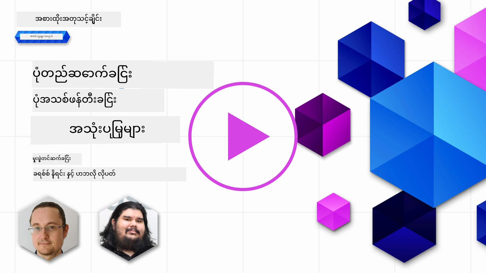

# ရုပ်ပုံ ဖန်တီးခြင်း အပလီကေးရှင်းများ တည်ဆောက်ခြင်း

[](https://aka.ms/gen-ai-lesson9-gh?WT.mc_id=academic-105485-koreyst)

LLMs တွင် စာသားဖန်တီးမှုထက်ပိုသော အရာများရှိသည်။ သင်သည် စာသားဖော်ပြချက်မှ ရုပ်ပုံများကိုလည်း ဖန်တီးနိုင်သည်။ ရုပ်ပုံများသည် MedTech, အင်ဂျင်နီယာ, ခရီးသွားလုပ်ငန်း, ဂိမ်းဖွံ့ဖြိုးတိုးတက်မှု, မားကက်တင်းနှင့် အခြားများတွင် အသုံးဝင်သည်။ ဒီသင်ခန်းစာတွင် ကျွန်တော်တို့သည် ဒီနေ့ခေတ် **GPT Image** မော်ဒယ်များကို ကြည့်ရှု၍ ရုပ်ပုံဖန်တီးမှု အပလီကေးရှင်းတစ်ခု တည်ဆောက်ပါမည်။

## မိတ်ဆက်

ရုပ်ပုံဖန်တီးခြင်းသည် သဘာဝဘာသာစကား အမိန့်တစ်ခုကို ဓာတ်ပုံတစ်ပုံ ပြောင်းလဲပေးစေသည်။ ဒီသင်ခန်းစာတွင် ကျွန်တော်တို့သည် OpenAI မှ **`gpt-image`** မော်ဒယ်များ မျိုးစုံကို အသုံးပြုပါမည် - ယခုအချိန်တွင် **[Microsoft Foundry](https://ai.azure.com?WT.mc_id=academic-105485-koreyst)** နှင့် OpenAI ပလက်ဖောင်းပေါ်တွင် ရရှိနိုင်သော မော်ဒယ်များဖြစ်သည်။ ဒီမော်ဒယ်များသည် ယခင် DALL·E မော်ဒယ်များ (DALL·E 2/3 သည် ဆက်ခံ မော်ဒယ်များ) ကို အစားထိုးသည်။

သင်ခန်းစာတစ်လျှောက်လုံး Edu4All လို့ခေါ်တဲ့ ကန့်ကော် Startup တစ်ခုကို အသုံးပြုပြီး သင်ယူအရာများဖန်တီးနေကြသည်။ အဖွဲ့သည် အလုပ်အပ်အတွက် နှင့် သင်ခန်းစာအတွက် ရုပ်ပုံများဖန်တီးရန် ဆန္ဒရှိသည်။

## သင်ယူရမည့် ရည်မှန်းချက်များ

ဒီသင်ခန်းစာ အဆုံးတွင် သင်သည်

- ရုပ်ပုံဖန်တီးခြင်း ဆိုသည်မှာဘာ၊ ဘယ်နေရာတွင် အသုံးဝင်သည်ကို ရှင်းပြနိုင်မည်။
- `gpt-image` မော်ဒယ် မျိုးစုံကို နားလည်ပြီး ယခင် DALL·E မော်ဒယ်များနှင့် ဘယ်လိုကွာခြားသည်ကို သိရှိနိုင်မည်။
- Python (နှင့် TypeScript / .NET) တို့တွင် ရုပ်ပုံဖန်တီးမှု အပလီကေးရှင်း တည်ဆောက်နိုင်မည်။
- ရုပ်ပုံများကို တည်းဖြတ်နိုင်ပြီး metaprompt များဖြင့် လုံခြုံရေး ကာကွယ်မှုများ သတ်မှတ်နိုင်မည်။

## ရုပ်ပုံဖန်တီးခြင်းဆိုတာဘာလဲ?

ရုပ်ပုံဖန်တီးမှု မော်ဒယ်များသည် စာသားအမိန့်မှ ဓာတ်ပုံများကို ဖန်တီးပေးသည်။ ယနေ့ခေတ် မော်ဒယ်များဖြစ်သည့် `gpt-image` မော်ဒယ်များသည် transformer နှင့် diffusion နည်းပညာများပေါ် အခြေခံထားပြီး၊ မော်ဒယ်သည် စာသားနှင့် ရုပ်ပုံတို့အကြား ဆက်နွယ်မှုကို သင်ယူပြီးနောက် အမိန့်တစ်ခုကို ပေးပို့လျှင် အော်စလိုချုပ်သော သံသရာမှ ဓာတ်ပုံတစ်ပုံအထိ စဉ်ဆက်မပြတ် "denoise" ပြုလုပ်သည်။

ရုပ်ပုံမော်ဒယ်နှစ်ခုကို လူသိများသော မျိုးစုံမှာ:

- **`gpt-image` (OpenAI)** - ယခုအချိန်၏ မော်ဒယ်များ၊ ဒီသင်ခန်းစာတွင် အသုံးပြုသည်။ စာသားမှ ရုပ်ပုံဖန်တီးခြင်းနှင့် ရုပ်ပုံတည်းဖြတ်ခြင်း (mask ဖြင့် inpainting) ကို ပံ့ပိုးသည်။
- **Midjourney** - ကိုယ်ပိုင်ဝန်ဆောင်မှုနှင့် Discord အခြေခံ လုပ်ငန်းစဉ်ရှိတဲ့ လူကြိုက်များသော သုံးပွဲပိုင် မော်ဒယ်။

> ယခင် OpenAI ရုပ်ပုံ မော်ဒယ်များ - **DALL·E 2** နှင့် **DALL·E 3** သည် ဆက်ငြင်း တပ်ဆင်မှု မရရှိသော Legacy မော်ဒယ်များဖြစ်ကြသည်။ DALL·E 3 သည် အသစ်တပ်ဆင်ရာတွင် မရရှိတော့ပါ၊ `create_variation` ကဲ့သို့ Feature များကို DALL·E 2 မှသာ ရရှိခဲ့သည်။ အသစ်ဆန်းသော app များအတွက် `gpt-image` မော်ဒယ် အား အသုံးပြုပါ။

### ငါ ဘယ် `gpt-image` မော်ဒယ်ကို အသုံးပြုသင့်လဲ?

Microsoft Foundry တွင် အောက်ပါ မော်ဒယ်များသည် **ပြည့်စုံ၍ ရရှိနိုင်သော** မော်ဒယ်များ ဖြစ်သည်။

| မော်ဒယ် | မှတ်ချက်များ |
| --- | --- |
| **`gpt-image-2`** | နောက်ဆုံးထွက်ပြီး အရည်အသွေးအမြင့်ဆုံးမော်ဒယ် - သုံးရန် အကြံပြုသည်။ |
| `gpt-image-1.5` | ပြည့်စုံ၍ ရရှိနိုင်ပြီး; အရည်အသွေး ကောင်းပြီး အသုံးစရိတ် အနည်းငယ်နဲ့။ |
| `gpt-image-1-mini` | ပြည့်စုံ၍ ရရှိနိုင်ပြီး; အမြန်ဆုံးနှင့် အကြာမမြင့်သော ကုန်ကျစရိတ်။ |
| `gpt-image-1` | မျက်နှာပြင် စမ်းသပ်ရန်သာ ရရှိနိုင်သည်။ |

အဆက်မပြတ် [Foundry image models စာရင်း](https://learn.microsoft.com/azure/ai-foundry/openai/concepts/models?WT.mc_id=academic-105485-koreyst) ကို စစ်ဆေးပါ။

> **အရေးကြီးချက်:** `gpt-image` မော်ဒယ်များသည် ဖန်တီးသောရုပ်ပုံကို **base64** (`b64_json`) အဖြစ် ပြန်ပေးပို့သည်၊ URL မဟုတ်ပါ။ သင်၏ ကိုဒ်သည် base64 string ကို ကွမ် bytes ပြောင်း၍ သိမ်းဆည်းပေးရမည် - ရုပ်ပုံ URL မရှိပါ။

## ပြင်ဆင်မှုများ

သင်သည် **Azure OpenAI in Microsoft Foundry** ( `aoai-*` စမ်းသပ်မှုများ) သို့မဟုတ် **OpenAI ပလက်ဖောင်း** ( `oai-*` စမ်းသပ်မှုများ) တို့ကို ကိုင်တွယ် လုပ်ဆောင်နိုင်သည်။

### 1. မော်ဒယ် တည်ဆောက်ပြီး ထုတ်လုပ်ပါ

[create a resource](https://learn.microsoft.com/azure/ai-foundry/openai/how-to/create-resource?pivots=web-portal&WT.mc_id=academic-105485-koreyst) လမ်းညွှန်အတိုင်း Microsoft Foundry resource တစ်ခု ဖန်တီးပြီး ပြီးနောက် ဓာတ်ပုံ မော်ဒယ်တစ်ခု ထပ်မံထုတ်လုပ်ပါ - **`gpt-image-2`** ကို အကြံပြုသည်။

### 2. သင်၏ `.env` ကို ပြင်ဆင်ပါ

```text
AZURE_OPENAI_ENDPOINT=<your endpoint>
AZURE_OPENAI_API_KEY=<your key>
AZURE_OPENAI_DEPLOYMENT="gpt-image-2"
```

သင်၏ resource တွင် [Foundry portal](https://ai.azure.com?WT.mc_id=academic-105485-koreyst) ထဲ အောက်ပါ **Deployments** စာမျက်နှာတွင် တန်ဖိုးများကို ရှာဖွေပါ။

### 3. စာကြည့်တိုက်များ ထည့်သွင်းပါ

`requirements.txt` ဖိုင်တစ်ခု ဖန်တီးပါ:

```text
python-dotenv
openai
pillow
```

ပြီးနောက် virtual environment တစ်ခု ဖန်တီးပြီး ဖွင့်၍ အောက်ပါကို ထည့်သွင်းပါ:

```bash
python3 -m venv venv
source venv/bin/activate        # Windows: venv\Scripts\activate ကို အသုံးပြုပါ
pip install -r requirements.txt
```

## အပလီကေးရှင်း တည်ဆောက်ခြင်း

အောက်ပါ ကုဒ်ဖြင့် `app.py` ဖိုင်ကို ဖန်တီးပါ။ ဟုအဆိုအရ ရုပ်ပုံ ဖန်တီးပြီး PNG အဖြစ် သိမ်းဆည်းသည်။

```python
import os
import base64
from openai import AzureOpenAI
from PIL import Image
import dotenv

dotenv.load_dotenv()

# သုံးစွဲသူ client ကို သင့် Azure OpenAI (Microsoft Foundry) အရင်းအမြစ်ဆီ ဦးတည်ပါ။
# ပုံစံပုံတူစနစ်များအတွက် နောက်ဆုံး API ဗားရှင်းလိုအပ်သည် - သင့်ပုံစံလိုအပ်ချက်အတွက် Foundry စာတမ်းများကို စစ်ဆေးပါ။
client = AzureOpenAI(
    api_key=os.environ["AZURE_OPENAI_API_KEY"],
    api_version="2025-04-01-preview",
    azure_endpoint=os.environ["AZURE_OPENAI_ENDPOINT"],
)

deployment = os.environ["AZURE_OPENAI_DEPLOYMENT"]  # ဥပမာ "gpt-image-2"

result = client.images.generate(
    model=deployment,
    prompt='Bunny on a horse, holding a lollipop, on a foggy meadow where it grows daffodils',
    size="1024x1024",   # 1536x1024 (ရုပ်ပုံကျယ်), 1024x1536 (ရုပ်ပုံရှည်), သို့မဟုတ် "auto"
    n=1,
)

# gpt-image ပုံစံများသည် URL မဟုတ်ဘဲ base64 (b64_json) ပြန်လည်ပေးဆောင်သည် - ဒါကို bytes အဖြစ် decode ဆောင်ရွက်ပါ။
image_bytes = base64.b64decode(result.data[0].b64_json)

os.makedirs("images", exist_ok=True)
image_path = os.path.join("images", "generated-image.png")
with open(image_path, "wb") as f:
    f.write(image_bytes)

Image.open(image_path).show()
```

`python app.py` ဖြင့် ပြေးဆွဲပါ။ `images/` ဖိုဒါအောက်တွင် PNG ဖိုင်ကို သိမ်းဆည်းထားလိမ့်မည်။

> `images.generate` ကို တစ်ရက်ခေါ်တိုင်း တူညီသောအမိန့်အတွက် ကွဲပြားသော ရုပ်ပုံများကို ထုတ်ပေးသည် - ရုပ်ပုံမော်ဒယ်များတွင် `temperature` ဆိုသည့် parameter မရှိပါ (ဒါဟာ စာသားဖန်တီးမှုထိန်းချုပ်မှု ဖြစ်သည်)။ မတူညီမှုရရှိရန် API ကို ထပ်မံ ခေါ်ဆောင်ပါ၊ မတူညီမှုလျော့ချရန် အမိန့်ကို ပိုမိုသေချာစွာရေးပါ။

## ရုပ်ပုံများကို တည်းဖြတ်ခြင်း

`gpt-image` မော်ဒယ်များသည် ရှိပြီးသားရုပ်ပုံကို **တည်းဖြတ်** နိုင်ပါသည်။ ဓာတ်ပုံနှင့် မိမိလိုချင်သော ပိုင်းတစ်ခုကို သတ်မှတ်ထားသော **mask** တစ်ခု၊ ပြုပြင်လိုသော အကြောင်းအရာ အမိန့်ဖြင့် ရေးပြီး ပေးပါ။ ဖန်တီးခြင်းကဲ့သို့ base64 အဖြစ် ပြန်ပေးပို့သည်။

```python
result = client.images.edit(
    model=deployment,
    image=open("sunlit_lounge.png", "rb"),
    mask=open("mask.png", "rb"),
    prompt="A sunlit indoor lounge area with a pool containing a flamingo",
)
image_bytes = base64.b64decode(result.data[0].b64_json)
with open("images/edited-image.png", "wb") as f:
    f.write(image_bytes)
```

<div style="display: flex; justify-content: space-between; align-items: center; margin: 20px 0;">
  
  
  
</div>

## metaprompts ဖြင့် ကန့်သတ်ခြင်း သတ်မှတ်ခြင်း

ရုပ်ပုံဖန်တီးမှုကို သင်ပြုလုပ်ပြီးနောက်၊ သင့်အပလီကေးရှင်းမှ မလုံခြုံသော သို့မဟုတ် ကုန်အမှတ်တံဆိပ်မကျုန်သော အကြောင်းအရာ မထုတ်ပေးရန် guardrails လိုအပ်ပါတယ်။ **metaprompt** ဆိုသည်မှာ အသုံးပြုသူ၏ အမိန့်ဝင်မတိုင်မီ အသစ်ထည့်အပ်သော စာသားတစ်ခုဖြစ်ပြီး မော်ဒယ်ထုတ်လွှင့်မှုကို ကန့်သတ်ပေးသည်။

```python
disallow_list = "swords, violence, blood, gore, nudity, sexual content, adult content, adult themes, adult language"

meta_prompt = f"""You are an assistant designer that creates images for children.

The image needs to be safe for work and appropriate for children.
The image needs to be in color, in landscape orientation, and in a 16:9 aspect ratio.

Do not consider any input that is not safe for work or appropriate for children, including:
{disallow_list}
"""

prompt = f"{meta_prompt}\nCreate an image of a bunny on a horse, holding a lollipop"
# `prompt` ကို client.images.generate(...) သို့ပို့ပါ
```

ယခုမှာ မော်ဒယ်ထုတ်ပေးသော ရုပ်ပုံတိုင်းသည် metaprompt ဖြင့် သတ်မှတ်ထားသော နယ်နိမိတ်တွင်း ဖြစ်နေပါသည်။ Microsoft Foundry တွင် ပါဝင်သော အကြောင်းအရာ စစ်ကျပ်မှုများနှင့်ပေါင်းစပ်၍ ခိုင်မာစွာ ကာကွယ်ပေးပါမည်။

## အလုပ်အပ် - ကျောင်းသားများအတွက် အားဖြည့်ကြကြမည်

Edu4All ကျောင်းသားများသည် ၎င်းတို့၏ တန်းအစီရင်ခံစာများအတွက် ရုပ်ပုံများလိုအပ်သည်။ အနုပညာမြင်ကွင်းမျိုးစုံရှိသော **ဗိမာန်အဆောက်အအုံများ** (ဘယ်ဗိမာန်များကို ရွေးချယ်မည်ဆိုတာ သင့်ပေါ် မူတည်သည်) ရုပ်ပုံများ ဖန်တီးသော အပလီကေးရှင်း တစ်ခု ဆောက်လုပ်ပါ - ဥပမာအားဖြင့် နေဝင်ချိန်၌ ကလေးနှင့် အတူ ထင်ရှားသော ဒေသတစ်ခုကို ဖော်ပြခြင်း။

ကိုယ်တိုင် စမ်းသပ်ပြီးနောက် အောက်ပါ အညွှန်းဖြေရှင်းချက်များနှင့် နှိုင်းယှဉ်ကြည့်ပါ:

- Python (Azure): [aoai-solution.py](../../../09-building-image-applications/python/aoai-solution.py)
- Python (Azure) အပြည့်အဝ ဖန်တီးမှု app: [aoai-app.py](../../../09-building-image-applications/python/aoai-app.py)
- Python (OpenAI): [oai-app.py](../../../09-building-image-applications/python/oai-app.py)
- TypeScript (Azure): [typescript/image-generation-app](../../../09-building-image-applications/typescript/image-generation-app)
- .NET (Azure): [dotnet/notebook-azure-openai.dib](../../../09-building-image-applications/dotnet/notebook-azure-openai.dib)

[python/](../../../09-building-image-applications/python) ထဲက notebook များကိုလည်း လေ့လာဆောင်ရွက်ပါ (`aoai-assignment.ipynb` - Azure အတွက်၊ `oai-assignment.ipynb` - OpenAI အတွက်)။

## ကောင်းပါတယ်! သင်ယူမှုကို ဆက်လက်လုပ်ဆောင်ပါ

ဒီသင်ခန်းစာပြီးဆုံးပြီးနောက် ကျွန်တော်တို့ရဲ့ [Generative AI Learning collection](https://aka.ms/genai-collection?WT.mc_id=academic-105485-koreyst) ကို လေ့လာပြီး သင့် Generative AI ကျွမ်းကျင်မှုကို တိုးတက်စေပါ။

သင်ခန်းစာ ၁၀ ကို ဆက်လက်လေ့လာရန် ကြိုဆိုပါတယ်။

---

<!-- CO-OP TRANSLATOR DISCLAIMER START -->
**ပြောကြားချက်**
ဤစာတမ်းကို AI ဘာသာပြန်ဝန်ဆောင်မှု [Co-op Translator](https://github.com/Azure/co-op-translator) အသုံးပြု၍ ဘာသာပြန်ထားပါသည်။ ကျွန်ုပ်တို့သည် တိကျမှန်ကန်မှုအတွက် ကြိုးပမ်းနေသော်လည်း၊ စက်ကိရိယာဘာသာပြန်ခြင်းများတွင် အမှားများ သို့မဟုတ် မှားယွင်းချက်များ ပါဝင်နိုင်ကြောင်း သတိပြုပါရန် လိုအပ်ပါသည်။ မူလစာတမ်းကို မူရင်းဘာသာဖြင့်သာ ယုံကြည်စိတ်ချရသော အချက်အလက်အဖြစ် သတ်မှတ်သင့်သည်။ အရေးကြီးသည့် သတင်းအချက်အလက်များအတွက် ပရော်ဖက်ရှင်နယ် လူသားဘာသာပြန်သူဝန်ဆောင်မှုကို အကြံပြုပါသည်။ ဤဘာသာပြန်ချက်ကို အသုံးပြုခြင်းမှ ဖြစ်ပေါ်လာသော နားလည်မှုကွာခြားမှုများ သို့မဟုတ် မမှန်ကန်သော အသုံးပြုမှုများအတွက် ကျွန်ုပ်တို့ တာဝန်မခံပါ။
<!-- CO-OP TRANSLATOR DISCLAIMER END -->