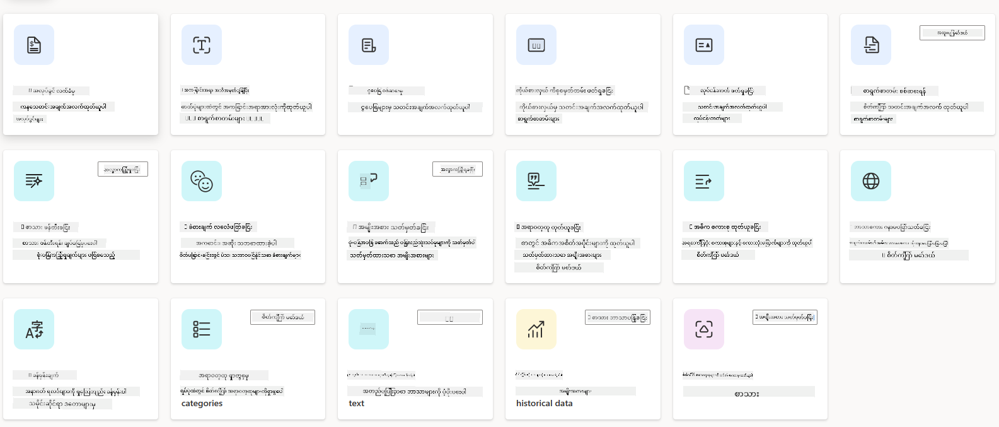
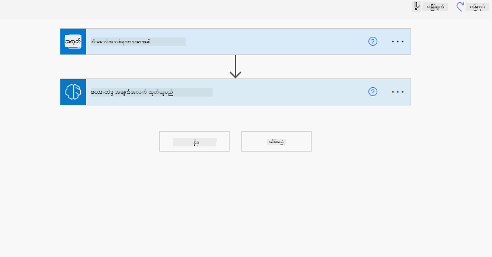
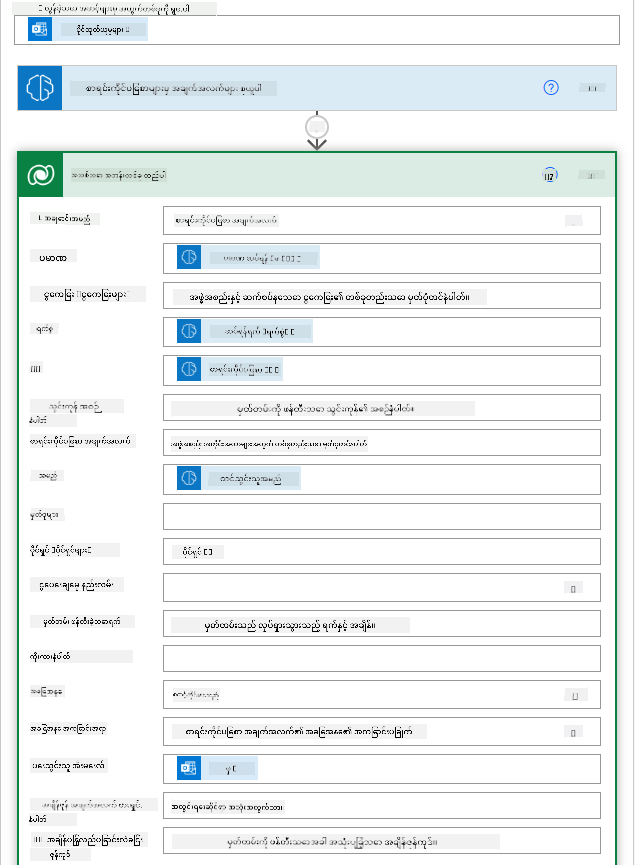
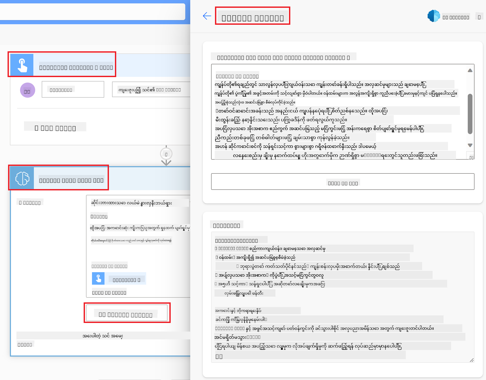

<!--
CO_OP_TRANSLATOR_METADATA:
{
  "original_hash": "f5ff3b6204a695a117d6f452403c95f7",
  "translation_date": "2025-06-25T19:37:21+00:00",
  "source_file": "10-building-low-code-ai-applications/README.md",
  "language_code": "my"
}
-->
# အနိမ့်ကုဒ် AI အက်ပ်များ တည်ဆောက်ခြင်း

> _(ဤသင်ခန်းစာ၏ ဗီဒီယိုကို ကြည့်ရန် အထက်ပါ ပုံကို နှိပ်ပါ)_

## နိဒါန်း

အခု ကျွန်တော်တို့က ပုံတွေ ဖန်တီးတဲ့ အက်ပ်တွေ ဘယ်လို တည်ဆောက်ရမလဲ ဆိုတာ သိရှိပြီးဖြစ်တဲ့အတွက် အနိမ့်ကုဒ်အကြောင်း ပြောကြပါစို့။ ဖန်တီးမှု AI ကို အနိမ့်ကုဒ် အပါအဝင် အမျိုးမျိုးသော နယ်ပယ်များတွင် အသုံးပြုနိုင်သည်။ ဒါပေမယ့် အနိမ့်ကုဒ် ဆိုတာ ဘာလဲ၊ AI ကို ဘယ်လို ထည့်သွင်းနိုင်မလဲ?

အနိမ့်ကုဒ် တိုးတက်မှု ပလက်ဖောင်းများ သုံး၍ ရိုးရာ တီထွင်သူများနှင့် မတီထွင်သူများ အတွက် အက်ပ်များနှင့် ဖြေရှင်းချက်များ တည်ဆောက်ခြင်း ပိုမို လွယ်ကူလာသည်။ အနိမ့်ကုဒ် တိုးတက်မှု ပလက်ဖောင်းများက သင့်ကို အက်ပ်များနှင့် ဖြေရှင်းချက်များကို နည်းနည်းသာဖြစ်စေပြီး သို့မဟုတ် လုံးဝ ကုဒ်မပါဘဲ တည်ဆောက်နိုင်စေသည်။ ၎င်းကို အက်ပ်များနှင့် ဖြေရှင်းချက်များ တည်ဆောက်ရန် ကွန်ပေါင်းများကို ဆွဲနှင့်ချရန် လုပ်ဆောင်နိုင်သော မြင်ကွင်းတစ်ခုကို ပံ့ပိုးပေးခြင်းဖြင့် အောင်မြင်သည်။ ၎င်းသည် အက်ပ်များနှင့် ဖြေရှင်းချက်များကို ပိုမို လျင်မြန်စွာ နှင့် အရင်းအမြစ်များ နည်းနည်းသာဖြင့် တည်ဆောက်နိုင်စေသည်။ ဤသင်ခန်းစာတွင် Low Code ကို ဘယ်လို အသုံးပြုရမလဲ၊ Power Platform ကို အသုံးပြု၍ AI ဖြင့် အနိမ့်ကုဒ် တိုးတက်မှုကို ဘယ်လို တိုးတက်စေမလဲ ဆိုတာ အနက်ရှိုင်းဆုံး လေ့လာပါမည်။

Power Platform သည် အဖွဲ့အစည်းများကို ၎င်းတို့၏ အဖွဲ့များကို အနိမ့်ကုဒ် သို့မဟုတ် ကုဒ်မပါဘဲ အလွယ်တကူ ဖြေရှင်းချက်များ တည်ဆောက်ရန် အခွင့်အလမ်း ပေးသည်။ ဤပတ်ဝန်းကျင်သည် ဖြေရှင်းချက်များ တည်ဆောက်ခြင်း လုပ်ငန်းစဉ်ကို ရိုးရှင်းစေသည်။ Power Platform ဖြင့် ဖြေရှင်းချက်များကို လများ သို့မဟုတ် နှစ်များ မလိုဘဲ ရက်များ သို့မဟုတ် ရက်သတ္တပတ်များအတွင်း တည်ဆောက်နိုင်သည်။ Power Platform တွင် အဓိကထုတ်ကုန် ၅ ခု ပါဝင်သည်- Power Apps, Power Automate, Power BI, Power Pages နှင့် Copilot Studio။

ဤသင်ခန်းစာတွင် ပါဝင်သောအရာများမှာ-

- Power Platform တွင် Generative AI ကို မိတ်ဆက်ခြင်း
- Copilot ကို မိတ်ဆက်ခြင်းနှင့် ၎င်းကို ဘယ်လို အသုံးပြုရမလဲ
- Power Platform တွင် Generative AI ကို အသုံးပြု၍ အက်ပ်များနှင့် လှုပ်ရှားမှုများ တည်ဆောက်ခြင်း
- AI Builder ဖြင့် Power Platform တွင် AI မော်ဒယ်များကို နားလည်ခြင်း

## သင်ယူရမည့် ရည်မှန်းချက်များ

ဤသင်ခန်းစာ အဆုံးတွင် သင်သည်-

- Power Platform တွင် Copilot ဘယ်လို လုပ်ဆောင်သည်ကို နားလည်ပါမည်။

- ကျွန်ုပ်တို့၏ ပညာရေး စတင်လုပ်ငန်းအတွက် ကျောင်းသား အစီအစဉ် ချမှတ်ရေး အက်ပ် တည်ဆောက်ပါ။

- ဘီလ်များမှ အချက်အလက်များ ထုတ်ယူရန် AI ကို အသုံးပြုသည့် ဘီလ် လုပ်ငန်းစဉ် လှုပ်ရှားမှု တည်ဆောက်ပါ။

- GPT AI မော်ဒယ်ဖြင့် စာသား ဖန်တီးခြင်းကို အသုံးပြုသောအခါ အကောင်းဆုံး လက်တွေ့ကျသော နည်းလမ်းများကို လက်တွေ့ကျစွာ လျှောက်ထားပါ။

ဤသင်ခန်းစာတွင် သင်အသုံးပြုမည့် ကိရိယာများနှင့် နည်းပညာများမှာ-

- **Power Apps**- ကျောင်းသား အစီအစဉ် ချမှတ်ရေး အက်ပ်အတွက်၊ အက်ပ်များကို အနိမ့်ကုဒ် ဖြင့် တည်ဆောက်ရန် အနိမ့်ကုဒ် တိုးတက်မှု ပတ်ဝန်းကျင်ကို ပံ့ပိုးပေးသည်။

- **Dataverse**- ကျောင်းသား အစီအစဉ် ချမှတ်ရေး အက်ပ်အတွက် အချက်အလက်များကို သိမ်းဆည်းရန် အသုံးပြုမည်ဖြစ်သော Dataverse သည် အက်ပ်၏ အချက်အလက်များကို သိမ်းဆည်းရန် အနိမ့်ကုဒ် အချက်အလက် ပလက်ဖောင်းကို ပံ့ပိုးပေးသည်။

- **Power Automate**- ဘီလ် လုပ်ငန်းစဉ် လှုပ်ရှားမှုအတွက် သင့်အား ဘီလ် လုပ်ငန်းစဉ် လုပ်ငန်းစဉ်ကို အလိုအလျောက် ပြုလုပ်ရန် လှုပ်ရှားမှုများ တည်ဆောက်ရန် အနိမ့်ကုဒ် တိုးတက်မှု ပတ်ဝန်းကျင်ကို ပံ့ပိုးပေးသည်။

- **AI Builder**- ကျွန်ုပ်တို့၏ စတင်လုပ်ငန်းအတွက် ဘီလ်များကို လုပ်ငန်းစဉ်များ ပြုလုပ်ရန် ကြိုတင်တည်ဆောက်ထားသော AI မော်ဒယ်များကို အသုံးပြုမည့် ဘီလ် AI မော်ဒယ်အတွက်။

## Power Platform တွင် Generative AI

Generative AI ဖြင့် အနိမ့်ကုဒ် တိုးတက်မှုနှင့် အက်ပ်များကို တိုးတက်စေရန် Power Platform အတွက် အဓိက အာရုံစိုက်ရာ နယ်ပယ်ဖြစ်သည်။ ရည်မှန်းချက်မှာ လူတိုင်း AI ပါဝင်သော အက်ပ်များ၊ ဆိုဒ်များ၊ ဒက်ရှ်ဘုတ်များ တည်ဆောက်ရန်နှင့် AI ဖြင့် လုပ်ငန်းစဉ်များကို အလိုအလျောက် ပြုလုပ်ရန် _ဒေတာ သိပ္ပံ ပညာရပ် မလိုအပ်ဘဲ_ လုပ်နိုင်စေရန်ဖြစ်သည်။ ဤရည်မှန်းချက်ကို Power Platform တွင် Copilot နှင့် AI Builder အဖြစ် Generative AI ကို အနိမ့်ကုဒ် တိုးတက်မှု အတွေ့အကြုံနှင့် ပေါင်းစပ်ခြင်းဖြင့် အောင်မြင်သည်။

### ဤလုပ်ငန်းစဉ်သည် ဘယ်လို လုပ်ဆောင်သလဲ?

Copilot သည် သင့်လိုအပ်ချက်များကို သဘာဝဘာသာစကားဖြင့် စကားဝိုင်းဆွေးနွေးချက်များစဉ်ဆက်ဖြင့် ဖျော်ဖြေရန် Power Platform ဖြေရှင်းချက်များ တည်ဆောက်ရန် သင့်အား ခွင့်ပြုသည့် AI အကူအညီဖြစ်သည်။ ဥပမာအားဖြင့် သင့် AI အကူအညီကို သင့်အက်ပ်တွင် ဘယ်အကွက်တွေ အသုံးပြုမယ်ဆိုတာ ပြောရန် ညွှန်ကြားနိုင်ပြီး ၎င်းသည် အက်ပ်နှင့် အခြေခံဒေတာမော်ဒယ် နှစ်ခုလုံးကို ဖန်တီးမည် သို့မဟုတ် Power Automate တွင် လှုပ်ရှားမှုကို ဘယ်လို စတင်ရမည်ဆိုတာ သတ်မှတ်နိုင်သည်။

သင့်အက်ပ် မျက်နှာပြင်များတွင် အင်္ဂါရပ်အဖြစ် Copilot အား အားထား၍ ဖွင့်နိုင်ပြီး စကားဝိုင်းဆွေးနွေးမှုများမှတဆင့် အမြင်အာရုံများကို ဖော်ထုတ်ရန် အသုံးပြုသူများကို ခွင့်ပြုနိုင်သည်။

AI Builder သည် Power Platform တွင် ရရှိနိုင်သော အနိမ့်ကုဒ် AI စွမ်းရည်ဖြစ်ပြီး သင့်အား AI မော်ဒယ်များကို အသုံးပြု၍ လုပ်ငန်းစဉ်များကို အလိုအလျောက် ပြုလုပ်ရန်နှင့် ရလဒ်များကို ခန့်မှန်းရန် ကူညီပါသည်။ AI Builder ဖြင့် သင့်အက်ပ်များနှင့် လှုပ်ရှားမှုများကို Dataverse သို့မဟုတ် SharePoint, OneDrive သို့မဟုတ် Azure ကဲ့သို့သော မျိုးစုံသော မိုဃ်းတိမ်ဒေတာရင်းမြစ်များတွင် သင့်ဒေတာနှင့် ချိတ်ဆက်ထားသော AI ကို ယူလာနိုင်သည်။

Copilot သည် Power Platform ထုတ်ကုန်များအားလုံးတွင် ရရှိနိုင်သည်- Power Apps, Power Automate, Power BI, Power Pages နှင့် Power Virtual Agents။ AI Builder သည် Power Apps နှင့် Power Automate တွင် ရရှိနိုင်သည်။ ဤသင်ခန်းစာတွင် ကျွန်ုပ်တို့၏ ပညာရေး စတင်လုပ်ငန်းအတွက် ဖြေရှင်းချက် တစ်ခု တည်ဆောက်ရန် Power Apps နှင့် Power Automate တွင် Copilot နှင့် AI Builder ကို ဘယ်လို အသုံးပြုရမည်ကို အာရုံစိုက်ပါမည်။

### Power Apps တွင် Copilot

Power Platform ၏ အစိတ်အပိုင်းတစ်ခုအဖြစ် Power Apps သည် အက်ပ်များကို အနိမ့်ကုဒ် ဖြင့် တည်ဆောက်ရန် အနိမ့်ကုဒ် တိုးတက်မှု ပတ်ဝန်းကျင်ကို ပံ့ပိုးပေးသည်။ ၎င်းသည် မျိုးစုံသော ဝန်ဆောင်မှုများဖြင့် အက်ပ် တိုးတက်မှုများကို တည်ဆောက်ရန် အက်ပ်တစ်ခု ဖြစ်သည်။ Power Apps သည် ဘရောက်ဇာများ၊ တက်ဘလက်များနှင့် ဖုန်းများတွင် လည်ပတ်သည့် အက်ပ်များကို တည်ဆောက်ရန် ခွင့်ပြုပြီး အလုပ်ဖော်များနှင့် မျှဝေနိုင်သည်။ Power Apps သည် ရိုးရှင်းသော မျက်နှာပြင်ဖြင့် အသုံးပြုသူများကို အက်ပ်တည်ဆောက်ခြင်းသို့ လွယ်ကူစွာ ဝင်ရောက်စေပြီး စီးပွားရေး အသုံးပြုသူ သို့မဟုတ် ပရိုဂရမ်မာ တစ်ဦးစီက မိမိလိုအပ်ချက်အတိုင်း အက်ပ်များကို တည်ဆောက်နိုင်သည်။ အက်ပ်တိုးတက်မှု အတွေ့အကြုံကို Copilot ဖြင့် Generative AI ဖြင့် ပိုမိုကောင်းမွန်စေသည်။

Power Apps တွင် Copilot AI အကူအညီ အင်္ဂါရပ်သည် သင့်အက်ပ်ကို ဘယ်လို အက်ပ်လိုချင်သည်၊ သင့်အက်ပ်ကို ဘယ်အချက်အလက်များကို အစီအစဉ်ချမှတ်၊ စုဆောင်း သို့မဟုတ် ပြသချင်သည်ဆိုတာ ဖျော်ဖြေရန် ခွင့်ပြုသည်။ Copilot သည် သင့်ဖျော်ဖြေရေးအရ တုံ့ပြန်မှုရှိသော Canvas အက်ပ်တစ်ခုကို ဖန်တီးသည်။ ထို့နောက် သင်၏လိုအပ်ချက်များကို ဖြည့်ဆည်းရန် အက်ပ်ကို စိတ်ကြိုက်ပြုလုပ်နိုင်သည်။ AI Copilot သည် သင့်အား စောင့်ကြည့်လိုသော ဒေတာကို သိမ်းဆည်းရန် လိုအပ်သော အကွက်များနှင့် နမူနာဒေတာများပါသော Dataverse Table ကို ဖန်တီးရန် နှင့် အကြံပြုသည်။ ဤသင်ခန်းစာတွင် Dataverse သည် အဘယ်နည်း၊ Power Apps တွင် ၎င်းကို ဘယ်လို အသုံးပြုရမည်ကို နောက်ပိုင်းတွင် ကြည့်ပါမည်။ ထို့နောက် AI Copilot အကူအညီ အင်္ဂါရပ်ကို အသုံးပြု၍ စကားဝိုင်းဆွေးနွေးချက်များဖြင့် ဇယားကို သင်၏လိုအပ်ချက်များကို ဖြည့်ဆည်းရန် စိတ်ကြိုက်ပြုလုပ်နိုင်သည်။ ဤအင်္ဂါရပ်သည် Power Apps ပင်မမျက်နှာပြင်တွင် ရရှိနိုင်သည်။

### Power Automate တွင် Copilot

Power Platform ၏ အစိတ်အပိုင်းတစ်ခုအဖြစ် Power Automate သည် အသုံးပြုသူများကို အက်ပ်များနှင့် ဝန်ဆောင်မှုများအကြား အလိုအလျောက် လုပ်ငန်းစဉ်များ ဖန်တီးရန် ခွင့်ပြုသည်။ ၎င်းသည် ဆက်သွယ်ရေး၊ ဒေတာစုဆောင်းခြင်းနှင့် ဆုံးဖြတ်ချက် အတည်ပြုခြင်း ကဲ့သို့သော ထပ်တလဲလဲ လုပ်ငန်းစဉ်များကို အလိုအလျောက် ပြုလုပ်ရန် ကူညီသည်။ ၎င်း၏ ရိုးရှင်းသော မျက်နှာပြင်သည် နည်းပညာစွမ်းရည်ရှိသူများအားလုံး (အစမှတင်ကနေ အတွေ့အကြုံရှိသော တီထွင်သူများအထိ) ကို အလုပ်လုပ်ငန်းစဉ်များကို အလိုအလျောက် ပြုလုပ်ရန် ခွင့်ပြုသည်။ လှုပ်ရှားမှု တိုးတက်မှု အတွေ့အကြုံကို Copilot ဖြင့် Generative AI ဖြင့် ပိုမိုကောင်းမွန်စေသည်။

Power Automate တွင် Copilot AI အကူအညီ အင်္ဂါရပ်သည် သင့်လှုပ်ရှားမှုကို ဘယ်လို လှုပ်ရှားမှုလိုချင်သည်၊ သင့်လှုပ်ရှားမှုကို ဘယ်လို လှုပ်ရှားမှုလိုချင်သည်ဆိုတာ ဖျော်ဖြေရန် ခွင့်ပြုသည်။ Copilot သည် သင့်ဖျော်ဖြေရေးအရ လှုပ်ရှားမှုတစ်ခုကို ဖန်တီးသည်။ ထို့နောက် သင့်လိုအပ်ချက်များကို ဖြည့်ဆည်းရန် လှုပ်ရှားမှုကို စိတ်ကြိုက်ပြုလုပ်နိုင်သည်။ AI Copilot သည် သင့်အား အလိုအလျောက် ပြုလုပ်လိုသော လုပ်ငန်းစဉ်ကို ပြုလုပ်ရန် လိုအပ်သော လှုပ်ရှားမှုများကို ဖန်တီးရန် နှင့် အကြံပြုသည်။ ဤသင်ခန်းစာတွင် Flows သည် အဘယ်နည်း၊ Power Automate တွင် ၎င်းတို့ကို ဘယ်လို အသုံးပြုရမည်ကို နောက်ပိုင်းတွင် ကြည့်ပါမည်။ ထို့နောက် AI Copilot အကူအညီ အင်္ဂါရပ်ကို အသုံးပြု၍ စကားဝိုင်းဆွေးနွေးချက်များဖြင့် လှုပ်ရှားမှုများကို သင်၏လိုအပ်ချက်များကို ဖြည့်ဆည်းရန် စိတ်ကြိုက်ပြုလုပ်နိုင်သည်။ ဤအင်္ဂါရပ်သည် Power Automate ပင်မမျက်နှာပြင်တွင် ရရှိနိုင်သည်။

## လုပ်ငန်းတာဝန်- ကျွန်ုပ်တို့၏ စတင်လုပ်ငန်းအတွက် ကျောင်းသား အစီအစဉ်များနှင့် ဘီလ်များကို Copilot ဖြင့် စီမံပါ

ကျွန်ုပ်တို့၏ စတင်လုပ်ငန်းသည် ကျောင်းသားများအား အွန်လိုင်းသင်တန်းများ ပေးသည်။ စတင်လုပ်ငန်းသည် အလျင်အမြန် ကြီးထွားလာပြီး ၎င်း၏ သင်တန်းများအတွက် တောင်းဆိုမှုကို လက်ခံနိုင်ရန် အခက်အခဲဖြစ်နေသည်။ စတင်လုပ်ငန်းသည် သင့်အား Power Platform တီထွင်သူအဖြစ် အလုပ်ခန့်ထားပြီး ကျောင်းသား အစီအစဉ်များနှင့် ဘီလ်များကို စီမံရန် အနိမ့်ကုဒ် ဖြေရှင်းချက်တစ်ခု တည်ဆောက်ရန် ကူညီရန် အလုပ်ခန့်ထားသည်။ ၎င်းတို့၏ ဖြေရှင်းချက်သည် အက်ပ်မှတဆင့် ကျောင်းသား အစီအစဉ်များကို စောင့်ကြည့်ရန်နှင့် လုပ်ငန်းစဉ်ကို အလိုအလျောက် ပြုလုပ်ရန် workflow ဖြင့် ဘီလ် လုပ်ငန်းစဉ်ကို အလိုအလျောက် ပြုလုပ်ရန် ကူညီရမည်။ Generative AI ကို အသုံးပြု၍ ဖြေရှင်းချက်ကို တီထွင်ရန် သင့်အား တောင်းဆိုထားသည်။

Copilot ကို အသုံးပြု၍ စတင်လုပ်ငန်းစဉ်ကို စတင်အသုံးပြုသောအခါ [Power Platform Copilot Prompt Library](https://github.com/pnp/powerplatform-prompts?WT.mc_id=academic-109639-somelezediko) ကို အသုံးပြု၍ ဖျော်ဖြေရေးများကို
စာသား - **ခံစားချက်ခွဲခြားခြင်း**: ဒီမော်ဒယ်သည် positive, negative, neutral, သို့မဟုတ် mixed ခံစားချက်များကို စာသားထဲမှာ ရှာဖွေသည်။ - **လုပ်ငန်းကဒ်ဖတ်ရှုခြင်း**: ဒီမော်ဒယ်သည် လုပ်ငန်းကဒ်များမှ အချက်အလက်များကို ရှာဖွေသည်။ - **စာသားဖတ်ရှုခြင်း**: ဒီမော်ဒယ်သည် ရုပ်ပုံများမှ စာသားများကို ရှာဖွေသည်။ - **အရာဝတ္ထုရှာဖွေခြင်း**: ဒီမော်ဒယ်သည် ရုပ်ပုံများမှ အရာဝတ္ထုများကို ရှာဖွေသည်။ - **စာရွက်စစ်ဆေးခြင်း**: ဒီမော်ဒယ်သည် စာရွက်များမှ အချက်အလက်များကို ရှာဖွေသည်။ - **ငွေတောင်းခံလွှာစစ်ဆေးခြင်း**: ဒီမော်ဒယ်သည် ငွေတောင်းခံလွှာများမှ အချက်အလက်များကို ရှာဖွေသည်။ Custom AI Models အသုံးပြုခြင်းဖြင့် သင်၏မော်ဒယ်ကို AI Builder တွင်ထည့်သွင်းနိုင်ပြီး၊ AI Builder custom model အဖြစ်လုပ်ဆောင်နိုင်သည့်ပုံစံအတိုင်း သင်၏ကိုယ်ပိုင်ဒေတာကို အသုံးပြု၍ မော်ဒယ်ကို လေ့ကျင့်နိုင်သည်။ ဒီမော်ဒယ်များကို Power Apps နှင့် Power Automate နှစ်ခုတွင် လုပ်ငန်းစဉ်များကို အလိုအလျောက်ပြုလုပ်ရန်နှင့် ရလဒ်များကို ခန့်မှန်းရန် အသုံးပြုနိုင်သည်။ သင်၏ကိုယ်ပိုင်မော်ဒယ်ကို အသုံးပြုသည့်အခါ အကန့်အသတ်များရှိသည်။ ဒီအကန့်အသတ်များကို [ပိုမိုသိရှိရန်](https://learn.microsoft.com/ai-builder/byo-model#limitations?WT.mc_id=academic-105485-koreyst) ဖတ်ပါ။ 

## လုပ်ငန်းတာဝန် #2 - ကျွန်ုပ်တို့၏ စတင်အသင်းအတွက် ငွေတောင်းခံလွှာစစ်ဆေးမှု လှိုင်းဖွဲ့စည်းပါ

ဘဏ္ဍာရေးအဖွဲ့သည် ငွေတောင်းခံလွှာများကို စစ်ဆေးရန် အခက်အခဲရှိနေသည်။ သူတို့သည် စာရင်းဇယားကို အသုံးပြု၍ ငွေတောင်းခံလွှာများကို စစ်ဆေးနေသော်လည်း၊ ငွေတောင်းခံလွှာများ၏ အရေအတွက်များပြားလာသည့်အတွက် စီမံခန့်ခွဲရန် ခက်ခဲလာသည်။ AI ကို အသုံးပြု၍ သူတို့ကို ငွေတောင်းခံလွှာများကို စစ်ဆေးရန် ကူညီမည့် လှိုင်းဖွဲ့စည်းရန် သင်ကို တောင်းဆိုထားသည်။ လှိုင်းသည် ငွေတောင်းခံလွှာများမှ အချက်အလက်များကို ရှာဖွေနိုင်ပြီး၊ အချက်အလက်ကို Dataverse အတွင်းသို့ သိမ်းဆည်းနိုင်ရမည်။ လှိုင်းသည် ငွေတောင်းခံလွှာမှ ရှာဖွေထားသော အချက်အလက်များနှင့်အတူ ဘဏ္ဍာရေးအဖွဲ့ထံ အီးမေးလ်ပို့ရန်လည်း ကူညီရမည်။ သင်သည် AI Builder သည် အဘယ်ကြောင့်အသုံးပြုသင့်သည်ကို သိရှိပြီးနောက်၊ AI Builder တွင် အထက်ပါ AI Model ကို သုံး၍ ဘဏ္ဍာရေးအဖွဲ့ကို ငွေတောင်းခံလွှာများကို စစ်ဆေးရန် ကူညီမည့် လှိုင်းကို ဖွဲ့စည်းနိုင်ရန် အဆင့်များကို ကြည့်ပါ။ AI Builder တွင် Invoice Processing AI Model ကို အသုံးပြု၍ ဘဏ္ဍာရေးအဖွဲ့ကို ငွေတောင်းခံလွှာများကို စစ်ဆေးရန် ကူညီမည့် လှိုင်းကို ဖွဲ့စည်းရန် အောက်ပါအဆင့်များကို လိုက်နာပါ-

1. [Power Automate](https://make.powerautomate.com?WT.mc_id=academic-105485-koreyst) မူလမျက်နှာသို့သွားပါ။
2. မူလမျက်နှာတွင်ရှိသော စာသားဧရိယာကို အသုံးပြု၍ သင်ဖွဲ့စည်းလိုသည့် လှိုင်းကို ဖော်ပြပါ။ ဥပမာ၊ **_ငွေတောင်းခံလွှာတစ်ခု ကျွန်ုပ်၏စာတိုက်တွင်ရောက်လာသောအခါ စစ်ဆေးပါ_**။ AI Copilot ထံသို့ prompt ကို ပို့ရန် **Send** ခလုတ်ကိုနှိပ်ပါ။ 
3. AI Copilot သည် သင် automate လုပ်လိုသော လုပ်ငန်းကို ပြုလုပ်ရန် လိုအပ်သော လုပ်ဆောင်မှုများကို အကြံပြုလိမ့်မည်။ နောက်ထပ်အဆင့်များကို ဆက်လက်ကြည့်ရှုရန် **Next** ခလုတ်ကိုနှိပ်နိုင်သည်။
4. နောက်ထပ်အဆင့်တွင်၊ Power Automate သည် လှိုင်းအတွက် လိုအပ်သော ချိတ်ဆက်မှုများကို စီစဉ်ရန် prompt ပေးလိမ့်မည်။ ပြီးဆုံးပါက **Create flow** ခလုတ်ကိုနှိပ်၍ လှိုင်းကို ဖန်တီးပါ။
5. AI Copilot သည် လှိုင်းကို ဖန်တီးပြီး၊ သင်၏လိုအပ်ချက်များကို ပြည့်မီစေရန် လှိုင်းကို customize ပြုလုပ်နိုင်သည်။
6. လှိုင်း၏ trigger ကို update ပြုလုပ်ပြီး၊ **Folder** ကို ငွေတောင်းခံလွှာများကို သိမ်းဆည်းမည့် folder သို့ pointing ပြုလုပ်ပါ။ ဥပမာ၊ folder ကို **Inbox** သို့ pointing ပြုလုပ်နိုင်သည်။ **Show advanced options** ကိုနှိပ်ပြီး **Only with Attachments** ကို **Yes** သို့ pointing ပြုလုပ်ပါ။ ဒါသည် folder အတွင်း attachment ပါသော အီးမေးလ်ရရှိသောအခါသာ လှိုင်းကို run လိမ့်မည်။
7. လှိုင်းမှ အောက်ပါလုပ်ဆောင်မှုများကို ဖျက်ပါ- **HTML to text**, **Compose**, **Compose 2**, **Compose 3** နှင့် **Compose 4** သည် သင်အသုံးမပြုမည်ဖြစ်သောကြောင့်။
8. **Condition** လုပ်ဆောင်မှုကို ဖျက်ပါ။ လှိုင်းသည် အောက်ပါ screenshot အတိုင်းပြသသင့်သည်- 
9. **Add an action** ခလုတ်ကိုနှိပ်ပြီး **Dataverse** ကိုရှာပါ။ **Add a new row** လုပ်ဆောင်မှုကို ရွေးပါ။
10. **Extract Information from invoices** လုပ်ဆောင်မှုတွင်၊ **Invoice File** ကို အီးမေးလ်မှ **Attachment Content** သို့ pointing ပြုလုပ်ပါ။ ဒါသည် ငွေတောင်းခံလွှာ attachment မှ အချက်အလက်များကို ရှာဖွေနိုင်စေရန်အတွက်ဖြစ်သည်။
11. အရင်ဖန်တီးထားသော **Table** ကို ရွေးပါ။ ဥပမာ၊ **Invoice Information** table ကို ရွေးနိုင်သည်။ အောက်ပါ fields များကို ဖြည့်ရန် အရင်လုပ်ဆောင်မှုမှ dynamic content ကို ရွေးပါ- - ID - Amount - Date - Name - Status - **Status** ကို **Pending** သို့ setting ပြုလုပ်ပါ။ - Supplier Email - **When a new email arrives** trigger မှ **From** dynamic content ကို အသုံးပြုပါ။ 
12. လှိုင်းကို ပြီးဆုံးသည့်အခါ **Save** ခလုတ်ကိုနှိပ်၍ လှိုင်းကို သိမ်းဆည်းပါ။ သင်ဖျော်ဖြေရန် trigger တွင် ဖော်ပြထားသော folder သို့ ငွေတောင်းခံလွှာပါသော အီးမေးလ်ကို ပို့ခြင်းဖြင့် လှိုင်းကို စမ်းသပ်နိုင်သည်။

> **သင်၏အိမ်စာ**: သင်ဖန်တီးထားသော လှိုင်းသည် အကောင်းဆုံးစတင်မှုဖြစ်သည်၊ ယခု သင်၏ဘဏ္ဍာရေးအဖွဲ့ကို သုံးစွဲသူအား သူတို့၏ ငွေတောင်းခံလွှာ၏ လက်ရှိအခြေအနေကို update ပြုလုပ်ရန် အီးမေးလ်ပို့ရန် automation တစ်ခုကို ဖန်တီးနိုင်မည့် ပုံစံကို စဉ်းစားရန် လိုအပ်သည်။ သင်၏ညွှန်ကြားချက်- လှိုင်းသည် ငွေတောင်းခံလွှာ၏ အခြေအနေပြောင်းလဲသည့်အခါ run ရမည်။

## Power Automate တွင် Text Generation AI Model ကို အသုံးပြုပါ

AI Builder တွင် GPT AI Model ဖြင့် Text ဖန်တီးခြင်းသည် prompt အပေါ်မူတည်၍ စာသားကို ဖန်တီးနိုင်ရန် Microsoft Azure OpenAI Service မှ စွမ်းအားဖြင့်ပါဝင်သည်။ ဒီစွမ်းရည်ဖြင့် သင်၏ apps နှင့် flows အတွင်း GPT (Generative Pre-Trained Transformer) နည်းပညာကို ထည့်သွင်းနိုင်ပြီး၊ အမျိုးမျိုးသော automated flows နှင့် အမြင်ဖွဲ့စည်းမှု applications ကို ဖန်တီးနိုင်သည်။

GPT မော်ဒယ်များသည် အချက်အလက်အများအပြားကို ကြီးမားသော training ပြုလုပ်ခြင်းကို ခံရပြီး၊ prompt ဖြင့် ပေးသောအခါ လူသားဘာသာစကားကို အလွန်နီးကပ်သော စာသားကို ဖန်တီးနိုင်သည်။ workflow automation နှင့်ပေါင်းစပ်သည့်အခါ AI မော်ဒယ်များကဲ့သို့ GPT ကို အလုပ်များစွာကို streamline ပြုလုပ်ရန်နှင့် automate ပြုလုပ်ရန် အသုံးပြုနိုင်သည်။

ဥပမာ၊ အမျိုးမျိုးသော အသုံးပြုမှုအတွက် စာသားကို အလိုအလျောက်ဖန်တီးရန် flows ကို ဖန်တီးနိုင်သည်၊ ဥပမာ၊ အီးမေးလ်များ၏ အကြမ်းစာ, ကုန်ပစ္စည်းဖော်ပြချက်များနှင့် အခြားများ။ သင်သည် model ကို အသုံးပြု၍ အမျိုးမျိုးသော apps အတွက် စာသားကို ဖန်တီးနိုင်သည်၊ ဥပမာ၊ chatbots နှင့် customer service apps များကဲ့သို့ customer service အေးဂျင့်များကို ဖောက်သည်မေးမြန်းမှုများကို ထိရောက်စွာနှင့် အချိန်မကုန်စွာဖြေကြားနိုင်ရန် ကူညီပေးသော apps များ။

Power Automate တွင် ဒီ AI Model ကို အသုံးပြုရန် [Add intelligence with AI Builder and GPT](https://learn.microsoft.com/training/modules/ai-builder-text-generation/?WT.mc_id=academic-109639-somelezediko) module ကို လေ့လာပါ။

## အလွန်ကောင်းမွန်သောအလုပ်! သင်၏လေ့လာမှုကို ဆက်လက်လုပ်ဆောင်ပါ

ဒီသင်ခန်းစာကို ပြီးဆုံးပြီးနောက်၊ [Generative AI Learning collection](https://aka.ms/genai-collection?WT.mc_id=academic-105485-koreyst) ကို ကြည့်ပါ၊ သင်၏ Generative AI အတတ်ပညာကို ဆက်လက်မြှင့်တင်ရန်!

Lesson 11 သို့သွားပါ၊ [Generative AI ကို Function Calling နှင့်ပေါင်းစပ်ခြင်း](../11-integrating-with-function-calling/README.md?WT.mc_id=academic-105485-koreyst) ကို ကြည့်ပါ!

**ဖြန့်ကြွေမှု**:  
ဒီစာရွက်စာတမ်းကို AI ဘာသာပြန်ဝန်ဆောင်မှု [Co-op Translator](https://github.com/Azure/co-op-translator) ကို အသုံးပြုပြီး ဘာသာပြန်ထားပါသည်။ ကျွန်ုပ်တို့သည် တိကျမှုအတွက် ကြိုးစားနေစဉ်ကာ အလိုအလျောက်ဘာသာပြန်ဆိုမှုများတွင် အမှားများ သို့မဟုတ် မမှန်ကန်မှုများ ရှိနိုင်ကြောင်း သတိပြုပါ။ မူရင်းစာရွက်စာတမ်းကို ၎င်း၏ဇာတိဘာသာစကားဖြင့် အာဏာရှိသော အရင်းအမြစ်အဖြစ် သတ်မှတ်ထားသင့်သည်။ အရေးကြီးသော အချက်အလက်များအတွက် လူ့ဘာသာပြန်ပရော်ဖက်ရှင်နယ်ကို အကြံပြုပါသည်။ ဤဘာသာပြန်ကို အသုံးပြုခြင်းမှ ဖြစ်ပေါ်လာသော နားလည်မှုမှားခြင်း သို့မဟုတ် အဓိပ္ပာယ်မှားခြင်းများအတွက် ကျွန်ုပ်တို့သည် တာဝန်မရှိပါ။