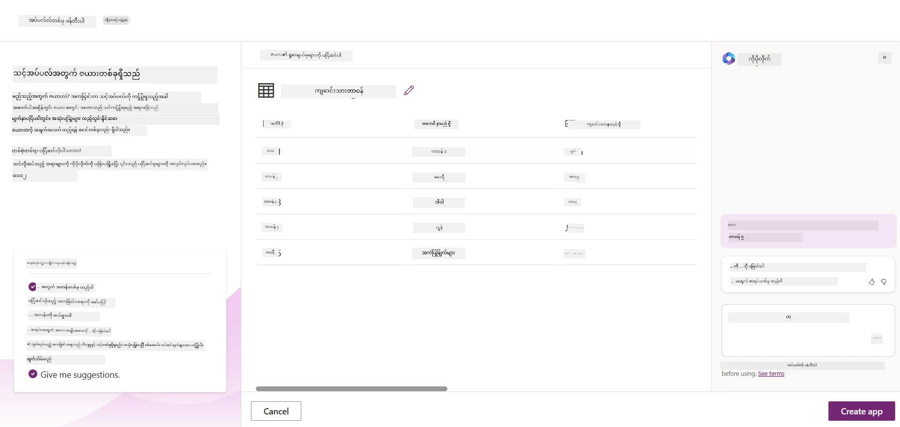
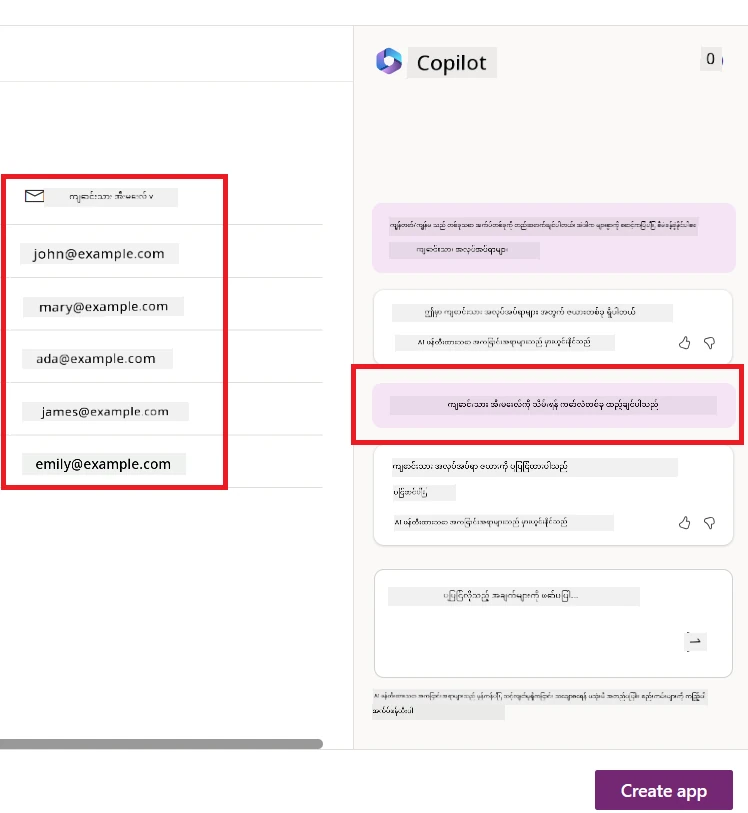
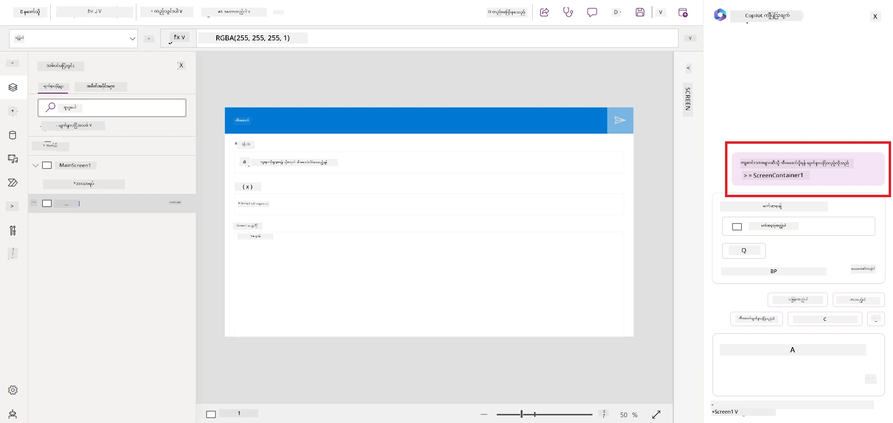
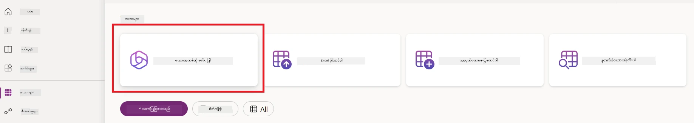
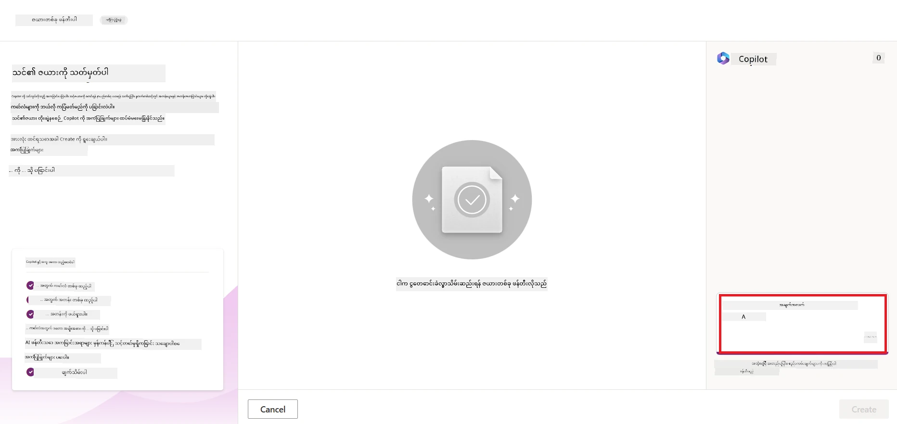
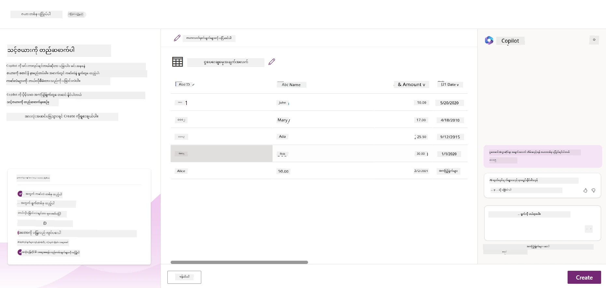
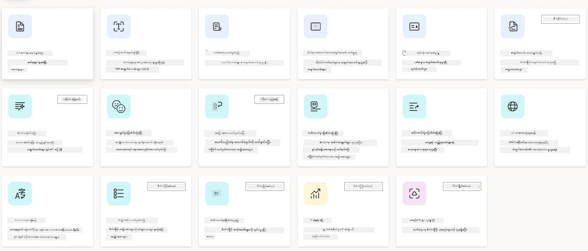
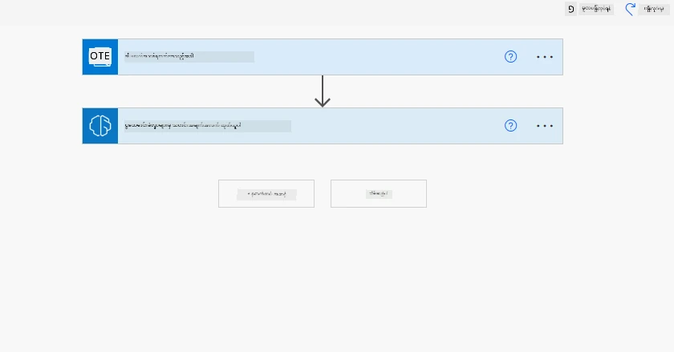
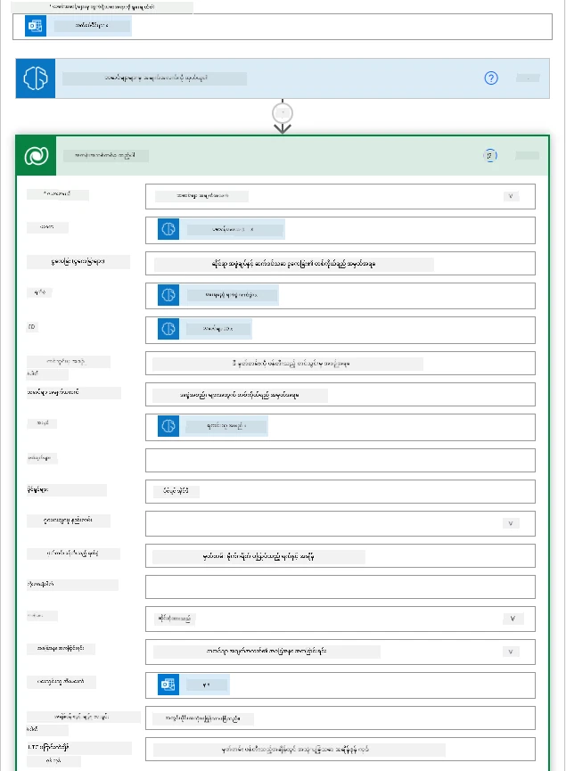
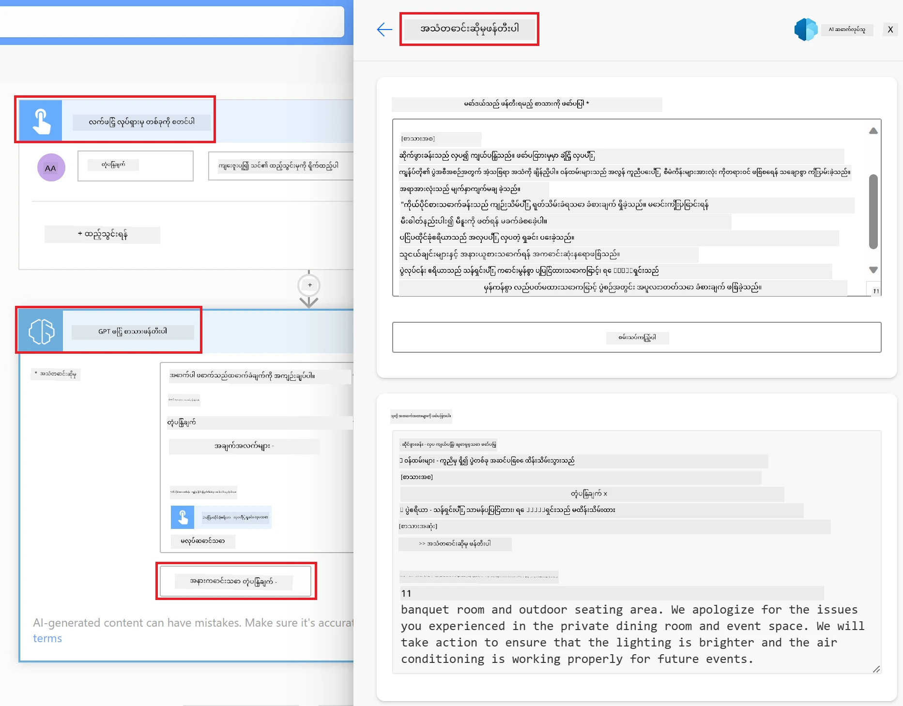

# အနည်းငယ် ကုဒ် AI လျင်မြန်စွာတည်ဆောက်ခြင်း

> _(ဒီပုံကိုနှိပ်ပြီး သင်ခန်းစာ ဗီဒီယိုကို ကြည့်ရှုနိုင်ပါသည်)_

## အကျဉ်းချုပ်

ယခုတွင် ဓာတ်ပုံဖန်တီးထုတ်လုပ်သည့် အက်ပ်များ ဖန်တီးနည်းကို သင်ကြားပြီးနောက် နည်းနည်းကုဒ်အကြောင်း ဆွေးနွေးကြရအောင်။ Generative AI ကို အနည်းငယ်ကုဒ်အပါအဝင် အမျိုးမျိုးသော နယ်ပယ်များတွင် အသုံးပြုနိုင်သည်။ ဒါပေမယ့် အနည်းငယ်ကုဒ် ဆိုတာဘာလဲ၊ AI ကို ဘယ်လို တိုးချဲ့ထည့်သွင်းလို့ရမလဲ?

အက်ပ်များနှင့် ဖြေရှင်းချက်များ တည်ဆောက်ခြင်းသည် အခြေခံ ကွန်ပျူတာပညာရှင်များနှင့် မရှိမဖြစ် တိုးတက်စေသူများအတွက် အလွယ်တကူဖြစ်လာသည်။ အနည်းငယ်ကုဒ် ဖွံ့ဖြိုးရေးမှုပလက်ဖောင်းများကို အသုံးပြုခြင်းဖြင့် အနည်းငယ်ကုဒ် မဟုတ်သောအခြားအရာများကို လွယ်ကူစွာ ဖန်တီးနိုင်သည်။ ဤသည်မှာ ဗစ္ဇွယ် အကျိုးပြု တည်ဆောက်ရေးပတ်ဝန်းကျင်တစ်ခုဖြစ်ပြီး တွဲဖက် ရွှေ့ပြောင်းပစ္စည်းများကို ရည်ညွှန်း၍ အက်ပ်များ ပြုလုပ်နိုင်ပါသည်။ ထိုအခြေအနေပိုင်ဆိုင်ခြင်းကြောင့် အဆင်ပြေစွာနှင့် အရင်းအမြစ်နည်းပါးစွာဖြင့် အက်ပ်များနှင့် ဖြေရှင်းချက်များ ဖန်တီးနိုင်သည်။ ဤသင်ခန်းစာတွင် အနည်းငယ်ကုဒ် သုံးခြင်းနှင့် Power Platform ကို အသုံးပြု AI ဖြင့် အနည်းငယ်ကုဒ် ဖွံ့ဖြိုးရေး နည်းလမ်းများကို နက်ရှိုင်းစွာ လေ့လာပါမည်။

Power Platform သည် အဖွဲ့အစည်းများအား မိမိတို့အဖွဲ့များကို ကိုယ်ပိုင်ဖြေရှင်းချက်များ ဖန်တီးနိုင်ရန် အလွယ်တကူ သုံးနိုင်သော အနည်းငယ်ကုဒ် သို့မဟုတ် ကုဒ်မလိုဘဲ ပတ်ဝန်းကျင်ဖြင့် အခွင့်အလမ်းပေးသည်။ ဤပတ်ဝန်းကျင်သည် ဖြေရှင်းချက်များ တည်ဆောက်ခြင်းလုပ်ငန်းစဉ်ကို ရိုးရှင်းအောင်ကူညီသည်။ Power Platform ဖြင့် ဖြေရှင်းချက်များကို လပိုင်းများ သို့မဟုတ် နှစ်ပေါင်းများအစား ရက်သတ်မှတ်ပြီး တည်ဆောက်နိုင်သည်။ Power Platform သည်ပစ္စည်းအဓိက ၅ ခုပါဝင်သည်။ Power Apps, Power Automate, Power BI, Power Pages နှင့် Copilot Studio တို့ဖြစ်သည်။

ဤသင်ခန်းစာတွင် ပါဝင်သောအရာများမှာ -

- Power Platform တွင် Generative AI အကြောင်း အကျဉ်းချုပ်
- Copilot အကြောင်းနှင့် အသုံးပြုနည်းများ အကျဉ်းချုပ်
- Power Platform တွင် Generative AI ဖြင့် အက်ပ်များနှင့် ကြောင့်မြှားများ ဖန်တီးခြင်း
- AI Builder ဖြင့် Power Platform တွင် AI မော်ဒယ်များကို နားလည်ခြင်း
- Microsoft Copilot Studio ဖြင့် ထိပ္တန်းဉာဏ်ရှိ အေးဂျင့်များ ဖန်တီးခြင်း

## သင်ယူရမည့် အချက်များ

ဤသင်ခန်းစာ၏ အဆုံးတွင် သင်သည် -

- Power Platform တွင် Copilot လုပ်ဆောင်ပုံကို နားလည်နိုင်မည်။

- ကျွန်ုပ်တို့၏ ပညာရေးစတားတပ်အဖွဲ့အတွက် ကျောင်းသားတာဝန် ထိန်းသိမ်းရန် အက်ပ် တည်ဆောက်နိုင်မည်။

- ငွေတောင်းခံလွှာများမှ အချက်အလက်များ ချဲ့ထုတ်ရန် AI သုံး၍ ငွေတောင်းခံလွှာဖြေရှင်းမှု ကြောင့်မြှား တည်ဆောက်နိုင်မည်။

- Create Text with GPT AI Model အသုံးပြုစဉ် အကောင်းဆုံးလုပ်ထုံးလုပ်နည်းများကို လိုက်နာနိုင်မည်။

- Microsoft Copilot Studio ဆိုတာဘာလဲနှင့် ထိပ်တန်းဉာဏ်ရှိ အေးဂျင့်များကို ဘယ်လို ဖန်တီးရမည်ကို နားလည်နိုင်မည်။

ဤသင်ခန်းစာတွင် သင် အသုံးပြုမည့် ကိရိယာများနှင့် နည်းပညာများမှာ -

- **Power Apps**, ကျောင်းသားတာဝန် ထိန်းသိမ်းရန် အက်ပ်အတွက်၊ ဒေတာနှင့် ပြန်လည်ဆက်သွယ်ရန် အနည်းငယ်ကုဒ် ဖွံ့ဖြိုးရေး ပတ်ဝန်းကျင်ကို ပေးသည်။

- **Dataverse**, ကျောင်းသားတာဝန် ထိန်းသိမ်းရန် အက်ပ် အချက်အလက်ကို သိမ်းဆည်းရာတွင် အသုံးပြုမည့်၊ အနည်းငယ်ကုဒ် ဒေတာ ပလက်ဖောင်းဖြစ်သည်။

- **Power Automate**, ငွေတောင်းခံလွှာ ပြန်လည်လုပ်ဆောင်ခြင်း ကြောင့်မြှားအတွက်၊ အလွယ်ကူ Workflow ဖန်တီးရန် အနည်းငယ်ကုဒ် ဖွံ့ဖြိုးရေး ပတ်ဝန်းကျင်ကို ပံ့ပိုးသည်။

- **AI Builder**, ငွေတောင်းခံလွှာ AI မော်ဒယ်အတွက်၊ အရင်တည်ဆောက်ထား AI မော်ဒယ်များကို အသုံးပြုပြီး စတားတပ်အတွက် ငွေတောင်းခံလွှာများကို ပြန်လည်လုပ်ဆောင်သည်။

## Power Platform တွင် Generative AI

အနည်းငယ်ကုဒ် ဖွံ့ဖြိုးရေးနှင့် အက်ပ်များကို Generative AI ဖြင့် တိုးတက်အောင် မြှင့်တင်ခြင်းသည် Power Platform ၏ အဓိက အာရုံစိုက်ရန် နယ်ပယ်ဖြစ်သည်။ ရည်ရွယ်ချက်မှာ _ဒေတာသိပ္ပံ ကျွမ်းကျင်မှု မလိုအပ်ဘဲ_ AI ဖြင့် အက်ပ်များ၊ ဝက်ဘ်ဆိုက်များ၊ ဒက်ရှ်ဘုတ်များ ထုတ်လုပ်ရာတွင် အားလုံးကို စွမ်းဆောင်နိုင်ရန် ဖြစ်သည်။ ၎င်းကို Power Platform ၏ အနည်းငယ်ကုဒ် ဖွံ့ဖြိုးရေးအတွေ့အကြုံတွင် Copilot နှင့် AI Builder  ဖြင့် ပေါင်းစပ်ထားသည်ဖြစ်သည်။

### ၎င်းအလုပ်လုပ်ပုံရှင်းလင်းချက်

Copilot သည် သဘာဝဘာသာစကားဖြင့် ဖော်ပြချက်များကို အသုံးပြု၍ အဆင့်ဆင့် ဆက်သွယ်သဖြင့် Power Platform ဖြေရှင်းချက်များ ဖန်တီးရန် AI အကူအညီဖြစ်သည်။ ဥပမာအားဖြင့် ကျွန်ုပ် Team AI ကို သင်၏အက်ပ်တွင် ဘယ်ဘာသာရပ်များ ရှိမည်ဆိုတာ အကြောင်းပြန်မည့်အခါ ဤ AI က အက်ပ်နှင့် ဒေတာမော်ဒယ်ကို ဖန်တီးပေးမည် သို့မဟုတ် Power Automate တွင် ကြောင့်မြှား တည်ဆောက်ရန် ညွှန်ပြနိုင်ပါသည်။

Copilot စွမ်းဆောင်ရည်များကို သင့်အက်ပ်များ၏ မျက်နှာပြင်များ၌ ပါဝင်သည့် အင်္ဂရိတ် အဖြစ် အသုံးပြု၍ နူးညံ့သော ဆက်သွယ်မှုဖြင့် အသုံးပြုသူများ အချက်အလက်တွေ့ရှိနိုင်စေပါသည်။

AI Builder သည် Power Platform တွင် ရရှိနိုင်သော အနည်းငယ်ကုဒ် AI စွမ်းဆောင်ရည်ဖြစ်ပြီး ကိုယ်ပိုင် AI မော်ဒယ်များဖြင့် လုပ်ငန်းစဉ်များကို အလိုအလျောက်လုပ်ဆောင်ရန် နှင့် ရလဒ်များခန့်မှန်းရန် ကူညီပေးသည်။ AI Builder ဖြင့် Dataverse သို့မဟုတ် SharePoint, OneDrive, Azure ကဲ့သို့ မတူညီသော Cloud ဒေတာမူလအရင်းအမြစ်များနှင့် ချိတ်ဆက်ထားသော အက်ပ်များနှင့် ကြောင့်မြှားများတွင် AI ကို ပံ့ပိုးနိုင်သည်။

Copilot သည် Power Platform ၏ အားလုံးပြိုင်ပစ္စည်းများတွင် ရရှိနိုင်သည်။ Power Apps, Power Automate, Power BI, Power Pages နှင့် Copilot Studio တို့ဖြစ်သည်။ AI Builder သည် Power Apps နှင့် Power Automate တွင် ရရှိနိုင်သည်။ ဤသင်ခန်းစာတွင် ကျွန်ုပ်တို့သည် ကျောင်းသားစတားတပ်အတွက် ဖြေရှင်းချက် တည်ဆောက်ရာတွင် Power Apps နှင့် Power Automate တွင် Copilot နှင့် AI Builder ကို ဘယ်လိုအသုံးပြုရမည်ကို အဓိကထား လေ့လာပါမည်။

### Power Apps တွင် Copilot

Power Platform ၏ တစ်စိတ်တစ်ပိုင်းအဖြစ် Power Apps သည် ဒေတာကို ထိန်းသိမ်း၊ စီမံခန့်ခွဲ နှင့် အပြန်အလှန်ဆက်သွယ်နိုင်သော အက်ပ်များ ဖန်တီးရန် အနည်းငယ်ကုဒ် ဖွံ့ဖြိုးရေး ပတ်ဝန်းကျင် ပေးသည်။ ၎င်းသည် အက်ပ်ဖွံ့ဖြိုးရေး ဝန်ဆောင်မှု များစုစည်းဝိုင်းဖြစ်ပြီး ကော်လံပလက်ဖောင်းတက်ပြီး Cloud ဝန်ဆောင်မှုများနှင့် On-premises ဒေတာကို ချိတ်ဆက်နိုင်သည်။ Power Apps အက်ပ်များကို ဘရောက်ဇာ၊ တက်ဘလက် နှင့် ဖုန်းပေါ်တွင် တည်ဆောက်နိုင်ပြီး အလုပ်လုပ်ဖော်များ နှင့် မျှဝေသုံးစွဲနိုင်သည်။ Power Apps သည် အသုံးပြုသူများအား ရိုးရှင်းသော အင်တာဖေ့စ်ဖြင့် အက်ပ်ဖွံ့ဖြိုးမှု မှ စတင်ရန် အားပေးသည်။ ဒါကြောင့် လုပ်ငန်းအသုံးပြုသူတိုင်း သို့မဟုတ် ကြာညာသော ဘာသာပညာရှင်တစ်ဦးကပင် စိတ်ကြိုက်အက်ပ် ဖန်တီးနိုင်သည်။ Generative AI သည် Copilot မှတဆင့် အက်ပ်ဖွံ့ဖြိုးမှုအတွေ့အကြုံကို တိုးတက်စေသည်။

Power Apps တွင် Copilot AI အကူအညီ အင်္ဂါရပ်သည် သင့်လိုအပ်သည့် အက်ပ်မျိုးနှင့် သင့်အက်ပ်တွင် ထည့်သွင်းလိုသည့် အချက်အလက်များကို ဖော်ပြနိုင်သည်။ Copilot သည် သင့်ဖော်ပြချက်အပေါ် အခြေခံ၍ တုံ့ပြန်နိုင်သော Canvas app ကို ပေါ်ထုတ်ပေးမည်ဖြစ်သည်။ ထို့နောက် သင်၏လိုအပ်ချက်အလိုက် အက်ပ်ကို ပြင်ဆင်နိုင်သည်။ AI Copilot သည် သင်လိုအပ်သော ဒေတာသိမ်းဆည်းရန် Dataverse အတန်းတင်ဇယားတစ်ခုကို ဖန်တီးပေးပြီး နမူနာဒေတာအချို့ကိုပါ ထည့်သွင်းပေးသည်။ ယခု သင်ခန်းစာတွင် Dataverse သည် ဘာလဲ၊ Power Apps တွင် ဘယ်လိုသုံးရမည်ကို နောက်တွင် ဆက်လက်ကြည့်ရှုပါမည်။ AI Copilot အကူအညီ အင်္ဂါရပ်မှတဆင့် စကားပြော အဆင့်များဖြင့် ဇယားကို သင်လိုအပ်သလို ပြင်ဆင်နိုင်သည်။ ဤအင်္ဂါရပ်ကို Power Apps မူလ မျက်နှာပြင်မှ လွယ်ကူစွာ အသုံးပြုနိုင်သည်။

### Power Automate တွင် Copilot

Power Platform ၏တစ်စိတ်တစ်ပိုင်းအဖြစ် Power Automate သည် အက်ပ်များနှင့် ဝန်ဆောင်မှုများအကြား အလိုအလျောက် လုပ်ငန်းစဉ်များ ဖန်တီးနိုင်စေသည်။ ၎င်းသည် ဆက်သွယ်ရေး၊ ဒေတာစုဆောင်းခြင်း နှင့် ဆုံးဖြတ်ချက် ခွင့်ပြုခြင်းကဲ့သို့သော ထပ်တလဲလဲ လုပ်ငန်းစဉ်များကို အလိုအလျောက်လုပ်ဆောင်ရန် ကူညီပေးသည်။ ၎င်း၏ ရိုးရှင်းသော အင်တာဖေ့စ်သည် နည်းပညာ အတတ်ပညာစွမ်းရည် များကွဲပြားသည့် အသုံးပြုသူများအား ကိုယ်တိုင် လုပ်ငန်းအလုပ်များကို အလိုအလျောက်လုပ်ဆောင်နိုင်စေသည်။ Copilot ဖြင့် Generative AI ကို workflow ဖွံ့ဖြိုးမှုအတွေ့အကြုံတွင် တိုးတက်စေသည်။

Power Automate တွင် Copilot AI အကူအညီ အင်္ဂါရပ်သည် သင့်လိုအပ်သည့် ကြောင့်မြှားအမျိုးအစားနှင့် သင့်ကြောင့်မြှား တည်ဆောက်လိုတဲ့ လုပ်ဆောင်ချက်များကို ဖော်ပြနိုင်သည်။ Copilot သည် သင့်ဖော်ပြချက်အပေါ် အခြေခံပြီး ကြောင့်မြှားကို ထုတ်ပေးသည်။ ထို့နောက် သင့်လိုအပ်ချက်ကို ဖြည့်ဆည်းရန် ကြောင့်မြှားကို ပြင်ဆင်နိုင်သည်။ AI Copilot သည် သင့်လုပ်ငန်းအလိုက် လုပ်ဆောင်ချက်များကို ဖန်တီးပြီး အကြံပြုမည်ဖြစ်သည်။ ဤသင်ခန်းစာတွင် ကြောင့်မြှားများက ဘာလဲ၊ ဘယ်လို အသုံးပြုရမည်ကို နောက်ပိုင်းတွင် စုံစမ်းလေ့လာပါမည်။ AI Copilot အကူအညီ အင်္ဂါရပ်ဖြင့် စကားစဉ်အဆင့်များအား အသုံးပြုကာ လိုအပ်သလို လုပ်ဆောင်ချက်များကို ပြင်ဆင်နိုင်သည်။ ဤအင်္ဂါရပ်ကို Power Automate မူလ မျက်နှာပြင်မှ လွယ်ကူစွာ အသုံးပြုနိုင်သည်။

## Microsoft Copilot Studio ဖြင့် ထိပ်တန်းဉာဏ်ရှိ အေးဂျင့်များ ဖန်တီးခြင်း

[Microsoft Copilot Studio](https://learn.microsoft.com/microsoft-copilot-studio/fundamentals-what-is-copilot-studio?WT.mc_id=academic-105485-koreyst) (အရင်က Power Virtual Agents ဟုခေါ်သည်) သည် Power Platform ၏ အနည်းငယ်ကုဒ် အဖွဲ့ဝင်ဖြစ်ပြီး **AI အေးဂျင့်များ**ကို ဖန်တီးနိုင်သည်။ ၎င်း၏ အေးဂျင့်များသည် စကားပြောဖြင့် အကူအညီပေးနိုင်ပြီး မေးခွန်းများကို ဖြေကြားပေး၊ လုပ်ဆောင်ချက်များကို လုပ်ဆောင်ပေးခြင်းနှင့် အသုံးပြုသူများအတွက် လုပ်ငန်းစဉ်များကို အလိုအလျောက် လုပ်ဆောင်ပေးနိုင်သည်။ Power Platform ၏ အခြားပစ္စည်းများ ကဲ့သို့ပင် သင့်တောင်းဆိုချက်အား ဖော်ပြပါက Copilot Studio သည် ညွှန်ကြားချက်များ၊ သိမြင်မှုနှင့် လုပ်ဆောင်ချက်များကို ကူညီဆောက်လုပ်ပေးသည်။

ကျွန်ုပ်တို့၏ ပညာရေး စတားတပ်အတွက် သင်တန်းဝင်မေးခွန်းများကို ဖြေသည်၊ တာဝန်နောက်ဆုံးသတ်မှတ်ရက်များ စစ်ဆေးသည်၊ သင်ကြားသူ တစ်ဦးသို့ အီးမေးလ် ပို့သည် - အားလုံးကို ကုဒ် မရေးဘဲ ဖန်တီးနိုင်ပါသည်။

Copilot Studio ကို အင်အားမက်သော လုပ်ဆောင်ချက်များပြုလုပ်နိုင်သည့် နောက်ဆုံးပေါ်စွမ်းရည်များမှာ -

- **သင်၏ သိမြင်မှုမှ Generative ဖြေဆိုချက်များ**။ အရေးသားထားသော စကားပြောစကားအတိုင်း ပံ့ပိုးမရန်အစား **သိမြင်မှုအရင်းအမြစ်များ** — အများပြည်သူဝက်ဘ်ဆိုက်များ၊ SharePoint, OneDrive, Dataverse, ဖိုင်များ တင်သွင်းထားသောအရာများ သို့မဟုတ် အဖွဲ့အစည်းဒေတာများ ချိတ်ဆက်၍ အေးဂျင့်သည် အခြေခံဖြေဆိုချက်များ ထုတ်ပေးသည်။

- **Generative နည်းကျွန်ဆောင်မှု**။ ခိုင်မာစွာ သတ်မှတ်ထားသော trigger စကားများကို မမှီခိုလားဘဲ AI ကို အသုံးပြုပြီး တောင်းဆိုချက်ကို နားလည်ရောက်ရှိကာ မည်သည့် သိမြင်မှုများ၊ ခေါင်းဆောင်ချက်များနှင့် လုပ်ဆောင်ချက်များကို ပေါင်းစည်းရေးဆွဲကြမည်ဆိုတာ တိုင်ကြားတတ်သည်။

- **လုပ်ဆောင်ချက်များနှင့် ချိတ်ဆက်ပစ္စည်းများ**။ အေးဂျင့်များသည် စကားပြောသာမက လုပ်ဆောင်ချက်များကိုလည်း အလုပ်လုပ်နိုင်သည်။ ၎င်းတို့သည် Power Platform ၏ ၁,၅၀၀+ ချိတ်ဆက်မှုများ၊ Power Automate ကြောင့်မြှားများ၊ စိတ်တိုင်းကျ REST API များ၊ Prompt များ သို့မဟုတ် **Model Context Protocol (MCP)** ဆာဗာများဖြင့် ကူညီပေးသည်။

- **ကိုယ်ပိုင် လွတ်လပ်သော အေးဂျင့်များ**။ အေးဂျင့်များသည် မိမိကိုယ်ပိုင်_CHAT_WINDOW သာတုံ့ပြန်ခြင်းမဟုတ်။ အသစ်ရရှိသော အီးမေးလ်တစ်ခု၊ Dataverse တွင် မှတ်တမ်းအသစ် တင်ခြင်း သို့မဟုတ် ဖိုင်တင်သွင်းခြင်း ကဲ့သို့ အဖြစ်အပျက်များဖြင့် တက်လိှပ်ထားပြီး အနောက်ခံ၌ လုပ်ငန်းအလုပ် ပြီးမြောက်စေသည်။

- **အယ်ဂျင့် များစွာ စီမံခန့်ခွဲမှု**။ အေးဂျင့်များသည် အခြားအေးဂျင့်များကို ခေါ်ဆိုနိုင်သည်။ Copilot Studio အေးဂျင့်သည် Microsoft 365 Copilot မှ အေးဂျင့်များနှင့် Microsoft Foundry မှ ဖန်တီးထားသော အေးဂျင့်များအား ဆက်ခံ၍ ရှင်သန်သက်တမ်းရွှည့်ပိုန်နိုင်သည်။

- **မော်ဒယ် ရွေးချယ်မှု**။ ထည့်သွင်းထားသော မော်ဒယ်များ အားလွန်မက Microsoft Foundry မော်ဒယ်ကတ်လော့ဂ်မှ မော်ဒယ်များကို သင့်အရေးအသားနှင့် တုံ့ပြန်မှုအတွက် ညှိနှိုင်း၍ ယူနိုင်သည်။

- **ဘယ်နေရာတွင်မဆို ထုတ်ပြန်နိုင်ခြင်း**။ တည်ဆောက်ပြီးချိန်တွင် အေးဂျင့်ကို Microsoft Teams, Microsoft 365 Copilot, ဝက်ဘ်ဆိုက် သို့မဟုတ် စိတ်ကြိုက် အက်ပ်များတွင် လွှင့်ပြနိုင်သည်။ လုံခြုံရေး၊ မှတ်ပုံတင်မှု နှင့် အသုံးစွဲမှု သတင်းအချက်အလက်များကို Power Platform အုပ်ချုပ်မှု အတွေ့အကြုံမှ စီမံနိုင်သည်။

[copilotstudio.microsoft.com](https://copilotstudio.microsoft.com?WT.mc_id=academic-105485-koreyst) တွင် ပထမဆုံး အေးဂျင့် တည်ဆောက်ရန် စတင်နိုင်သည်၊ [Microsoft Copilot Studio စာရွက်စာတမ်းများတွင်](https://learn.microsoft.com/microsoft-copilot-studio/?WT.mc_id=academic-105485-koreyst) ပို၍လေ့လာနိုင်သည်။

## အစီအစဉ်: ကျောင်းသားတာဝန်များနှင့် ငွေတောင်းခံလွှာများ စီမံရန် Copilot ကို အသုံးပြုခြင်း

ကျွန်ုပ်တို့၏ စတားတပ်သည် ကျောင်းသားများအတွက် အွန်လိုင်း သင်တန်းများ ပံ့ပိုးသည်။ ၎င်းသည် အရမ်းထွန်းကားလာပြီး သင်တန်းလိုအပ်ချက်များကို ဖြည့်ဆည်းနိုင်ရန် ကျရှုံးနေသည်။ စတားတပ်သည် Power Platform တွင် အနည်းငယ်ကုဒ် ဖြေရှင်းချက်တစ်ခု တည်ဆောက်ရန် သင့်အား အလုပ်သုံးခန့်ထားသည်။ ၎င်းသည် ကျောင်းသားတာဝန်များနှင့် ငွေတောင်းခံလွှာများကို စနစ်တကျ ထိန်းသိမ်း စီမံနိုင်ရန် အက်ပ်တစ်ခု ဖန်တီးရန် နှင့် ငွေတောင်းခံလွှာများ အလိုအလျောက်လုပ်ငန်းစဉ်အဖြစ် မြှင့်တင်ရန် ကြောင့်မြှား တစ်ခု တည်ဆောက်ရန် ဖြစ်ပါသည်။ Generative AI ကို ဖြေရှင်းချက် ဖန်တီးရာတွင် အသုံးပြုရန် တောင်းဆိုထားသည်။

Copilot အသုံးပြုမှု စတင်ရာတွင် [Power Platform Copilot Prompt Library](https://github.com/pnp/powerplatform-prompts?WT.mc_id=academic-109639-somelezediko) ကို အသုံးပြု၍ စတင်နိုင်သည်။ ၎င်းစာကြည့်တိုက်တွင် Copilot ဖြင့် အက်ပ်များနှင့် ကြောင့်မြှားများ ဖန်တီးရန် အသုံးပြုချက်များ စာရင်းပါရှိသည်။ Copilot အတွက် မိမိလိုအပ်ချက်များကို ဘယ်လို ဖော်ပြရမည်ကိုလည်း သင်ယူနိုင်သည်။

### ကျွန်ုပ်တို့၏ စတားတပ်အတွက် ကျောင်းသားတာဝန် ထိန်းသိမ်းဖို့ အက်ပ် တည်ဆောက်ခြင်း

ကျွန်ုပ်တို့၏ စတားတပ်တွင် ပညာရေးဆရာများသည် ကျောင်းသား သတ်မှတ်ချက်များကို စစ်ဆေး၍ ထိန်းသိမ်းရန် ခက်ခဲနေသည်။ ၎င်းတို့သည် အစောပိုင်းတွင် စာရွက်စာတမ်းတစ်စောင် ဖြင့် ထိန်းသိမ်းခဲ့သော်လည်း ကျောင်းသားများ အရေအတွက်တိုးလာသည်နှင့်အမျှ စီမံကိန်း မလွယ်ကူတော့ပါ။  သင်သည် ကျောင်းသားတာဝန်များကို ထိန်းသိမ်း ဖော်ပြရန်၊ ပြင်ဆင်ရန်၊ ပြောင်းလဲရန် နှင့် ဖျက်ရန် အက်ပ်တစ်ခု တည်ဆောက်ရန် တောင်းဆိုထားသည်။ ထို့အပြင် ပညာရေးဆရာများ နှင့် ကျောင်းသားများအနေဖြင့် စာမေးပွဲ အမှတ်ပေးပြီးပြီး ဖြစ်သည့် အလုပ်များ နှင့် မအမှတ်ပေးရသေးသော အလုပ်များကို ကြည့်ရှုနိုင်စေရန် လည်း လိုအပ်သည်။

Power Apps တွင် Copilot အသုံးပြုကာ အောက်ပါ အဆင့်များအတိုင်း အက်ပ်ကို တည်ဆောက်ပါ -

1. [Power Apps](https://make.powerapps.com?WT.mc_id=academic-105485-koreyst) မူလ မျက်နှာပြင်သို့ သွားပါ။

1. မူလ မျက်နှာပြင်အပေါ်ရှိ စာသား နေရာတွင် သင်ပြုလုပ်လိုသည့် အက်ပ်ကို ဖော်ပြပါ။ ဥပမာ **_ကျောင်းသားတာဝန်များ ကို ထိန်းသိမ်း စီမံရန် အက်ပ် တည်ဆောက်ချင်သည်_**။ AI Copilot သို့ prompt ပို့ရန် **Send** ခလုတ်ကို နှိပ်ပါ။

1. AI Copilot သည် သင့်ထည့်သွင်းလိုသည့် ဒေတာများ သိမ်းဆည်းရန် လိုအပ်သည့် ကွက်တိများပါဝင်သော Dataverse ဇယားတစ်ခုနှင့် နမူနာဒေတာ ညွှန်ပြပါမည်။ ပြီးနောက် ဆက်သွယ် စကားဝိုင်းဖြင့် AI Copilot အကူအညီ feature ကို အသုံးပြုကာ ဇယားကို သင့်လိုအပ်ချက်အတိုင်း ပြင်ဆင်နိုင်သည်။

   > **အရေးကြီး**: Dataverse သည် Power Platform အတွက် အခြေခံ ဒေတာ ပလက်ဖောင်းဖြစ်သည်။ ၎င်းသည် အက်ပ်၏ ဒေတာများ သိမ်းဆည်းရန် အနည်းငယ်ကုဒ် ဒေတာ ပလက်ဖောင်းတစ်ခုဖြစ်သည်။ Microsoft Cloud တွင် လုံခြုံစွာ ထည့်သွင်းထားပြီး Power Platform ပတ်ဝန်းကျင်အတွင်း Provision လုပ်ထားပါသည်။ ဒေတာ စီမံခန့်ခွဲမှု အင်္ဂါရပ်များကြောင့် အထူးအာမခံမှုများ၊ ဒေတာ သတ်မှတ်ခြင်း၊ ဒေတာ လမ်းကြောင်းမှတ်တမ်းနှင့် အသေးစိတ် ခြွင်းချက်ထိန်းချုပ်မှုများ ပါဝင်သည်။ Dataverse အကြောင်း ပိုမိုသိရှိလိုပါက [ဒီမှာ](https://docs.microsoft.com/powerapps/maker/data-platform/data-platform-intro?WT.mc_id=academic-109639-somelezediko) သွားဖတ်ပါ။

   

1. ပညာရေးဆရာများသည် အတန်းဝင်များ လျှောက်ထားသော တာဝန်အခြေအနေများအား အီးမေးလ်ဖြင့် အသိပေးလိုသည်။ Copilot ကို အသုံးပြုပြီး တာဝန်ဇယားတွင် ကျောင်းသား၏ အီးမေးလ် လိပ်စာ သိမ်းသည့် ကွက်တစ်ခု ထည့်သွင်းနိုင်သည်။ ဥပမာ အောက်ပါ prompt ကို အသုံးပြုနိုင်သည် - **_ကျောင်းသားအီးမေးလ် သိမ်းဆည်းရန် ကော်လံ အသစ် ထည့်ချင်သည်_**။ AI Copilot ထံတွင် prompt ပို့ရန် **Send** ခလုတ်ကို နှိပ်ပါ။

1. AI Copilot သည် ကွက် အသစ် ဖြစ်ထွန်းပေးပြီး သင်သည် လိုအပ်သည့် မျှော်မှန်းချက်များနှင့် အညီ ပြင်ဆင်နိုင်သည်။

1. ဇယားပြီးဆုံးသွားသောအခါမှာ **Create app** ခလုတ်ကိုနှိပ်ပြီး အက်ပ်ကိုဖန်တီးပါ။

1. AI Copilot သည် သင့်ဖော်ပြချက်အပေါ်မူတည်၍ တုံ့ပြန်နိုင်သော Canvas အက်ပ်ကိုဖန်တီးပေးမည်ဖြစ်သည်။ ထို့နောက် သင့်လိုအပ်ချက်များကိုဖြည့်ဆည်းနိုင်ရန် အက်ပ်ကိုပြင်ဆင်နိုင်ပါသည်။

1. ပညာရေးဆရာများက ကျောင်းသားများထံ အီးမေးလ်ပို့ရန်အတွက် Copilot ကို အသုံးပြု၍ အက်ပ်တွင် ပြသသည့် စက္ကန့်သစ်ကို ထည့်သွင်းနိုင်သည်။ ဥပမာအားဖြင့်၊ **_ကျောင်းသားများထံ အီးမေးလ်ပို့ရန် စက္ကန့်စီခြင်း ထည့်ချင်သည်_** ဆိုသော စာတစ်ကြောင်းဖြင့် ပြသသည့်အချက်ကို အသုံးပြုနိုင်သည်။ ဒီအချက်ကို AI Copilot ထံ ပို့ရန် **Send** ခလုတ်ကိုနှိပ်ပါ။

1. AI Copilot သည် စက္ကန့်သစ်ကိုဖန်တီးပေးပြီး၊ ထို့နောက် သင်၏လိုအပ်ချက်များနှင့် ကိုက်ညီအောင် စက္ကန့်ကိုပြင်ဆင်နိုင်ပါသည်။

1. အက်ပ်ပြီးဆုံးသောအခါ **Save** ခလုတ်ကိုနှိပ်၍ အက်ပ်ကို သိမ်းဆည်းပါ။

1. ပညာရေးဆရာများနှင့် အက်ပ်မျှဝေလိုပါက **Share** ခလုတ်ကိုနှိပ်ပြီးနောက် နောက်ထပ် **Share** ခလုတ်ကိုနှိပ်ပါ။ ထို့နောက် အဲမေလ်လိပ်စာများကို ထည့်သွင်း၍ ပညာရေးဆရာများထံ အက်ပ်ကို မျှဝေနိုင်ပါသည်။

> **သင်၏ အိမ်စာ**: သင်တည်ဆောက်ထားသော အက်ပ်သည် ကောင်းစွာစတင်ထားသော်လည်း တိုးတက်အောင်မြင်နိုင်သည်။ အီးမေးလ်လုပ်ဆောင်ချက်တွင် ပညာရေးဆရာများသည် ကျောင်းသားများထံ အီးမေးလ်များကို လက်ဖြင့်ရိုက်ထည့်ရန်သာ ဖြစ်သည်။ Copilot ကို သုံး၍ သင်တုံ့ပြန်ပြီး သင်တန်းစီမံသူများအတွက် အလိုအလျောက် အီးမေးလ်များကို ကျောင်းသားများ၏ တာဝန်များကို တင်သွင်းသည့်အခါ ပို့ပေးနိုင်မည့် automation တစ်ခု ဖန်တီးနိုင်ပါသလား? သင့်အား ပံ့ပိုးချက်မှာ သင့်မှာမှန်ကန်သော အချက်ကို သုံး၍ Power Automate တွင် Copilot ကို အသုံးပြုပြီး ဒီ automation ကိုဖန်တီးနိုင်သည်။

### ကျွန်ုပ်တို့ Startup အတွက် ငွေလွှဲကြေးအချက်အလက်ဇယား တည်ဆောက်ရန်

ကျွန်ုပ်တို့၏ စတတ်အပ်လျှောက်လက်မှတ်အဖွဲ့သည် ငွေလွှဲကြေးများကို ထိန်းသိမ်းရန် အခက်အခဲရှိနေပါသည်။ အဖွဲ့သည် ငွေလွှဲကြေးများကို စာရွက်ဇယားဖြင့် မှတ်တမ်းတင်ဆောင်ရွက်ခဲ့သော်လည်း ပမာဏများကြီးလာချိန်တွင် စီမံရန် အခက်အခဲဖြစ်လာသည်။ ထို့ကြောင့် သင့်အား ငွေလွှဲကြေးအချက်အလက်များကို သိမ်းဆည်း၊ ကြည့်ရှု၊ စီမံရန် ဇယားတစ်ခု ဖန်တီးပေးရန် တောင်းဆိုထားသည်။ ဤဇယားကို အသုံးပြု၍ ငွေလွှဲကြေးဆိုင်ရာအချက်အလက်အားလုံးကို ဆွဲထုတ်၍ ဇယားတွင် သိမ်းဆည်းနိုင်သော automation တစ်ခု ဖန်တီးရန် အသုံးပြုသင့်သည်။ ဤဇယားသည် ငွေလွှဲကြေးများထဲမှ ပေးချေပြီးသူနှင့် မပေးချေသေးသူများကို ကြည့်ရှုနိုင်ရန်လည်း အထောက်အကူဖြစ်ရန်လိုသည်။

Power Platform တွင် Dataverse ဟုခေါ်သော အခြေခံဒေတာပလက်ဖောင်းရှိပြီး၊ သင့်အက်ပ်နှင့် ဖြေရှင်းချက်အတွက် ဒေတာသိုလှောင်ရန် နှင့် သုံးစွဲရန်ကိရိယာဖြစ်သည်။ Dataverse သည် နည်းပညာနည်းဆုံး ဒေတာပလက်ဖောင်းတစ်ရပ်ဖြစ်ပြီး Microsoft Cloud တွင် လုံခြုံစိတ်ချစွာ ဒေတာများကို သိမ်းဆည်းပေးသည်။ Power Platform ပတ်ဝန်းကျင်အတွင်းတွင် ပါဝင်ပြုပြင်ထားပြီး ဒေတာအမျိုးအစားသတ်မှတ်ခြင်း၊ ဒေတာလမ်းကြောင်း မှတ်တမ်းတင်ခြင်း၊ အသေးစိတ် ခွင့်ပြုချက်ထိန်းချုပ်မှုနှင့် အခြားတိုးတက်သောဒေတာအုပ်ချုပ်မှုစနစ်များပါရှိသည်။ [Dataverse အကြောင်း မေးမြန်းရန် ဒီနေရာကို](https://docs.microsoft.com/powerapps/maker/data-platform/data-platform-intro?WT.mc_id=academic-109639-somelezediko) ကြည့်ရှုနိုင်ပါသည်။

ကျွန်ုပ်တို့၏ စတတ်အပ်တွင် Dataverse ကို သုံးရန် အကြောင်းရင်းမှာ? Dataverse တွင်ပါတဲ့ စံနှင့် ကိုယ်ပိုင်ဇယားများသည် သင့်ဒေတာအတွက် လုံခြုံပြီး Cloud အခြေပြု စတိုးဆိုင်မှု ဂေဟစနစ်အား ပံ့ပိုးပေးသည်။ ဇယားများကို Excel workbook တစ်ခုမှ အမျိုးမျိုးသော worksheet များကိုသုံးသလို သင့်အဖွဲ့အစည်း သို့မဟုတ် လုပ်ငန်းလိုအပ်ချက်များနှင့် ကိုက်ညီသော ဒေတာမျိုးစုံ သိမ်းဆည်းရန် အသုံးပြုနိုင်သည်။ ကျွန်ုပ်တို့၏ စတတ်အပ်အတွက် Dataverse ကိုသုံးခြင်း၏ အကျိုးကျေးဇူးအချို့မှာ အောက်ပါအတိုင်းဖြစ်သည်။

- **စီမံဆောင်ရွက်ရာမှာ လွယ်ကူမှု**: Metadata နှင့် ဒေတာများလည်း Cloud တွင် သိမ်းဆည်းထားသည်၊ ထို့ကြောင့် မည်သည့်နည်းဖြင့် သိမ်းဆည်းသည့်အကြောင်းစိတ်ပူရမည်မဟုတ်ပါ။ သင်၏ အက်ပ်နှင့် ဖြေရှင်းချက်များကို အာရုံစိုက်နိုင်ပါသည်။

- **လုံခြုံမှု**: Dataverse သည် သင့်ဒေတာများအတွက် လုံခြုံပြီး Cloud အခြေပြု သိမ်းဆည်းစနစ်ဖြစ်သည်။ ဇယားများအတွင်း ဒေတာများကို မည်သူက ဘယ်လို ဝင်ရောက်ခွင့်ရှိသနည်းကို role based security ဖြင့် ထိန်းချုပ်နိုင်သည်။

- **အမြတ်မြတ် metadata**: ဒေတာအမျိုးအစားများနှင့် ဆက်နွယ်မှုများကို Power Apps အတွင်း တိုက်ရိုက်အသုံးပြုနိုင်သည်။

- **လုပ်ထုံးလုပ်နည်းနှင့် စစ်ဆေးခြင်း**: Business rules, calculation fields နှင့် validation rules များ အသုံးပြု၍ ကုန်သည်လုပ်ငန်းစည်းမျဉ်းများကို သက်ဆိုင်သော အတိုင်း ဆောင်ရွက်နိုင်ကာ ဒေတာတိကျမှုကိုထိန်းသိမ်းနိုင်သည်။

Dataverse ဆိုတာဘယ်လိုတွင်ာသည်၊ ရည်ရွယ်ချက်ကဘာလဲဆိုတာ သိသွားပြီဆိုရင် အောက်မှာ Copilot ကို သုံးပြီး ကျွန်ုပ်တို့၏ ဘဏ္ဍာရေးအဖွဲ့လိုအပ်ချက်များနှင့်ကိုက်ညီအောင် Dataverse တွင် ဇယားတစ်ခု ဖန်တီးနည်းကိုကြည့်ပါစို့။

> **မှတ်ချက်** : ဤဇယားကို နောက်ဆုံးအပိုင်းတွင် အသုံးပြု၍ ငွေလွှဲကြေးဆိုင်ရာ အချက်အလက်အားလုံးကို ဆွဲထုတ်ပြီး ဇယားတွင် သိမ်းဆည်းသော automation တည်ဆောက်ရန် ပုံဖော်ထုတ်မည်။

Copilot ကို အသုံးပြု၍ Dataverse တွင် ဇယားတစ်ခု ဖန်တီးရန် လိုအပ်သည့်အဆင့်များမှာ အောက်ပါအတိုင်းဖြစ်သည်။

1. [Power Apps](https://make.powerapps.com?WT.mc_id=academic-105485-koreyst) မူလစာမျက်နှာသို့ သွားပါ။

2. ဘယ်ဘက် navigation ကွင်းစနစ်တွင် **Tables** ကိုရွေးချယ်ပြီး ထို့နောက် **Describe the new Table** ကိုနှိပ်ပါ။

1. **Describe the new Table** စက္ကန့်တွင် ဇယားဆောက်လိုသည့်အချင်းကို စာရိုက်ရန် စာသားကြီးဘောင်ကို အသုံးပြုပါ။ ဥပမာ - **_ငွေလွှဲကြေးအချက်အလက် သိမ်းဆည်းရန် ဇယားတစ်ခု ဖန်တီးချင်သည်_**။ နှိပ်ပါ **Send** ခလုတ်ကို AI Copilot ထံ ပြောပါ။

1. AI Copilot သည် သင်လိုအပ်သော ဒေတာလာရန် အတွက် အကွက်များပါရှိသည့် Dataverse ဇယားကို အကြံပြုပြီး နမူနာဒေတာများကိုပါ ထည့်သွင်းပေးမည်။ ယင်းဇယားကို AI Copilot ၏ စကားပြောတုံ့ပြန်ခြင်းအကြောင်းအရာများဖြင့် ကိုယ့်လိုအပ်ချက်ထက် ပြောင်းလဲပြင်ဆင်နိုင်သည်။

1. ဘဏ္ဍာရေးအသင်းသည် ကုန်သည်အီးမေးလ်လိပ်စာကို သိမ်းဆည်းရန် အကွက်အသစ် ထည့်လိုသည်။ ဥပမာ - **_ကုန်သည်အီးမေးလ် သိမ်းဆည်းရန် ကော်လံတစ်ခု ထည့်ချင်သည်_** ဟူသော အကြောင်းအရာဖြင့် စကားပုံမှန်ပို့ပါ။ AI Copilot သို့ ပို့ရန် **Send** ခလုတ်ကိုနှိပ်ပါ။

1. AI Copilot သည် အကွက်အသစ်တစ်ခုဖန်တီးပေးပြီး မိမိလိုအပ်သလို ပြင်ဆင်နိုင်ပါသည်။

1. ဇယားပြီးဆုံးပါက **Create** ခလုတ်ကိုနှိပ်၍ ဇယားကိုဖန်တီးပါ။

## Power Platform တွင် AI Builder နှင့် AI မော်ဒယ်များ

AI Builder သည် Power Platform တွင် ရနိုင်သော နည်းပညာနည်းဆုံး AI အင်္ဂါရပ်ဖြစ်ပြီး AI မော်ဒယ်များအား အသုံးပြုကာ စနစ်များကို အလိုအလျောက် လုပ်ဆောင်ခြင်းနှင့် ရလဒ်ခန့်မှန်းခြင်းများ ပြုလုပ်နိုင်စေသည်။ AI Builder ဖြင့် Dataverse ဒေတာ သို့မဟုတ် SharePoint, OneDrive သို့မဟုတ် Azure ကဲ့သို့သော cloud ဒေတာ အရင်းအမြစ်များနှင့် ချိတ်ဆက်၍ သုံးစွဲသူတို့အက်ပ်များနှင့် လုပ်ငန်းစဉ်များတွင် AI ပါဝင်စေသည်။

## အဆင်သင့် AI မော်ဒယ်များ နှင့် ကိုယ်ပိုင် AI မော်ဒယ်များ

AI Builder သည် အဆိုပါ AI မော်ဒယ်များကို နည်းနှစ်မျိုးဖြင့် ပံ့ပိုးသည်။ အဆင်သင့် AI မော်ဒယ်များ သည် Microsoft မှ လေ့ကျင့်ပြီး Power Platform တွင် အသုံးပြုရ အဆင်ပြေသည့် မော်ဒယ်များဖြစ်သည်။ ဤမော်ဒယ်များကို သင်၏အက်ပ်များနှင့် လုပ်ငန်းစဉ်များတွင် သဘောအရ intelligence ပေါင်းထည့်ရန် သုံးနိုင်ပြီး မတူညီသော ဒေတာစုဆောင်းမှု၊ မော်ဒယ်တည်ဆောက်မှု၊ လေ့ကျင့်မှုနှင့် ထုတ်ဝေမှုများ လုပ်ရန် မလိုအပ်ပါ။ အလိုအလျောက်လုပ်ငန်းစဉ်များ စီမံရန် နှင့် ရလဒ်ခန့်မှန်းရန်၎င်း မော်ဒယ်များကို အသုံးပြုနိုင်ပါသည်။

Power Platform တွင် ရရှိနိုင်သည့် အဆင်သင့် AI မော်ဒယ်အနည်းငယ်မှာ အောက်ပါအတိုင်းဖြစ်သည်။

- **Key Phrase Extraction**: စာသားမှ အဓိကစကားစုများ ဆွဲထုတ်ပေးသည်။
- **Language Detection**: စာသား၏ ဘာသာစကားကို ဖော်ထုတ်ပေးသည်။
- **Sentiment Analysis**: စာသားမှ အကျိုးသက်ရောက်မှု အနေအထားများ (အကြောင်းအရာအပေါ် ဆန္ဒရှိခြင်း၊ မရှိခြင်း၊ အလယ်အလတ်ရှိခြင်း) အဖြစ်သိရှိစေသည်။
- **Business Card Reader**: လုပ်ငန်းကတ်များမှ အချက်အလက်များကို ဆွဲထုတ်ပေးသည်။
- **Text Recognition**: ပုံများမှ စာလုံးများကို ထုတ်ယူပေးသည်။
- **Object Detection**: ပုံများအပါအဝင် ပစ္စည်းများကို ရှာဖွေထုတ်ယူပေးသည်။
- **Document processing**: ဖောင်များမှ အချက်အလက်များကို ဆွဲထုတ်ပေးသည်။
- **Invoice Processing**: ငွေလွှဲကြေးမှအချက်အလက်များကို ထုတ်ယူပေးသည်။

ကိုယ်ပိုင် AI မော်ဒယ်များဖြင့် သင်၏ မော်ဒယ်ကို AI Builder တွင် ယူရိုက်၍ ဖန်တီးနိုင်သည်၊ ထို့နောက် ၎င်းကို AI Builder တို့တွင် ကိုယ်ပိုင်မော်ဒယ်တစ်ခုအဖြစ် လေ့ကျင့်၍ အသုံးပြုနိုင်သည်။ Power Apps နှင့် Power Automate နှစ်မျိုးလုံးတွင် အလိုအလျောက်လုပ်ငန်းစဉ်များ သို့မဟုတ် ရလဒ်ခန့်မှန်းခြင်းများ ပြုလုပ်နိုင်သည်။ ကိုယ်ပိုင်မော်ဒယ်အသုံးပြုမှုတွင် ကန့်သတ်ချက်များ ရှိမည်ဖြစ်ပြီး [ဤကန့်သတ်ချက်များ](https://learn.microsoft.com/ai-builder/byo-model#limitations?WT.mc_id=academic-105485-koreyst) ကို ပိုမိုလေ့လာနိုင်သည်။

## လုပ်ငန်းတာဝန် #2 - ကျွန်ုပ်တို့ Startup အတွက် ငွေလွှဲကြေး ကိုင်တွယ်မှု လုပ်ငန်းစဉ် တည်ဆောက်ခြင်း

ဘဏ္ဍာရေးအဖွဲ့သည် ငွေလွှဲကြေးများကို ကိုင်တွယ်ရန် အခက်အခဲရှိနေသည်။ အဖွဲ့သည် ငွေလွှဲကြေးများကို စာရွက်ဇယားကဲ့သို့ ထိန်းသိမ်းခဲ့သော်လည်း ပမာဏများ ကြီးမြတ်လာရာတွင် စီမံရန် အခက်အခဲဖြစ်လာသည်။ AI သုံး၍ ငွေလွှဲကြေးများကို ကိုင်တွယ်နိုင်သော workflow တစ်ခု ဖန်တီးရန် တောင်းဆိုထားသည်။ ဤ workflow တွင် ငွေလွှဲကြေးမှ အချက်အလက်များကို ဆွဲထုတ်၍ Dataverse ဇယားတွင် သိမ်းဆည်းသွားနိုင်ရန် လိုသည်။ ထို့အပြင် ချက်ချင်း ဆွဲထုတ်ထားသော အချက်အလက်များဖြင့် ဘဏ္ဍာရေးအဖွဲ့ဆီ အီးမေးလ်ပို့ပေးနိုင်ခြင်းလည်း ပေါင်းစပ်ပါမည်။

AI Builder ဆိုတာဘာလဲ၊ ဘာကြောင့်သုံးရမလဲဆိုတာ သိသွားပြီးနောက် ကျွန်ုပ်တို့ ယခင်တွင် ဖော်ပြခဲ့သော Invoice Processing AI Model ကို အသုံးပြု၍ ဘဏ္ဍာရေးအဖွဲ့ကို ငွေလွှဲကြေး ကိုင်တွယ်မှုတွင် အထောက်အကူပေးသော workflow တည်ဆောက်မည်နည်းကို ကြည့်ပါစို့။

ဘဏ္ဍာရေးအဖွဲ့ကို ငွေလွှဲကြေးကို ကိုင်တွယ်ခြင်းတွင် အထောက်အကူဖြစ်လာပြီး Invoice Processing AI Model ကို အသုံးပြု၍ workflow တည်ဆောက်ရန် အောက်ပါအဆင့်များကို လိုက်နာပါ။

1. [Power Automate](https://make.powerautomate.com?WT.mc_id=academic-105485-koreyst) မူလစာမျက်နှာသို့ သွားပါ။

2. မူလစာမျက်နှာတွင် လုပ်ငန်းစဉ်ဖော်ပြလိုသည့် စာသားကို ရိုက်ထည့်ပါ။ ဥပမာ - **_Mailbox တွင် ငွေလွှဲကြေးတစ်ခု ရောက်လာသည်နှင့်တပြေးညီ ကိုင်တွယ်ပါ_**။ AI Copilot ထံ ပို့ရန် **Send** ခလုတ်ကိုနှိပ်ပါ။

   

3. AI Copilot သည် သင်လိုအပ်သောလုပ်ဆောင်ချက်များကို အကြံပြုမည်ဖြစ်ပြီး၊ နောက်ထပ် အဆင့်များသို့ သွားရန် **Next** ခလုတ်ကိုနှိပ်နိုင်ပါသည်။

4. နောက်တစ်ဆင့်တွင် Power Automate သည် workflow အတွက် လိုအပ်သော ချိတ်ဆက်မှုများကို တပ်ဆင်ရန် မေးမြန်းပါမည်။ ပြီးရင် **Create flow** ခလုတ်ကိုနှိပ်၍ flow ကိုဖန်တီးပါ။

5. AI Copilot သည် flow ကိုဖန်တီးပေးမည်ဖြစ်ပြီး၊ သင်၏လိုအပ်ချက်ကို ကိုက်ညီအောင် flow ကိုစိတ်ကြိုက် ပြင်ဆင်နိုင်ပါသည်။

6. Flow ၏ ထိခိုက်စေတာကို ပြုပြင်ပြီး **Folder** နေရာတွင် ငွေလွှဲကြေးများ သိမ်းထားမည့် ဖိုလ်ဒါကို သတ်မှတ်ပါ။ ဥပမာ - **Inbox** ဆိုသလို သတ်မှတ်နိုင်သည်။ **Show advanced options** ကိုနှိပ်ပြီး **Only with Attachments** ကို **Yes** သတ်မှတ်ပါ။ ဤသည်သည် ဖိုလ်ဒါတွင် အပ်ပလီကေးရှင်း ပါဝင်သည့် အီးမေးလ်များ ရောင်းမောင်းသည့်အခါသာ flow ဆောင်ရွက်မည်ဖြစ်သည်။

7. ထို့နောက် flow မှ အောက်ပါ လုပ်ဆောင်ချက်များကို ဖယ်ရှားပါ - **HTML to text**, **Compose**, **Compose 2**, **Compose 3**, နှင့် **Compose 4** ပါ။ ယင်းလုပ်ဆောင်ချက်များကို မသုံးတော့မည်ဖြစ်ပါသည်။

8. flow မှ **Condition** လုပ်ဆောင်ချက်ကို ဖယ်ထုတ်ပါ၊ အောက်ပါ screenshot အတိုင်း ဖြစ်သွားမည်။

   

9. **Add an action** ခလုတ်ကို နှိပ်ပြီး **Dataverse** ကို ရှာပါ။ ထို့နောက် **Add a new row** လုပ်ဆောင်ချက်ကို ရွေးချယ်ပါ။

10. **Extract Information from invoices** လုပ်ဆောင်ချက်တွင် **Invoice File** ကို အီးမေးလ်မှ **Attachment Content** ကို မှတ်ထားလျက် ပြောင်းလဲပေးပါ။ ဤနည်းဖြင့် flow သည် ငွေလွှဲကြေးဖိုင်မှ အချက်အလက်များကို ဆွဲထုတ်မည်ဖြစ်သည်။

11. ရှေ့တစ်ကြိမ်ဖန်တီးထားသော ဇယားကို ရွေးချယ်ပါ။ ဥပမာ - **Invoice Information** ဇယားကို ရွေးပါ။ နောက်ဆုံးလုပ်ဆောင်ချက်မှ dynamic content ကို အသုံးပြု၍ အောက်ပါ အကွက်များ ဖြည့်ရန်။

    - ID
    - Amount
    - Date
    - Name
    - Status - **Status** ကို **Pending** သတ်မှတ်ပါ။
    - Supplier Email - **When a new email arrives** မှ **From** dynamic content ကို အသုံးပြုပါ။

    

12. flow ပြီးဆုံးပါက **Save** ခလုတ်ကိုနှိပ်၍ သိမ်းဆည်းပါ။ ထို့နောက် သတ်မှတ်ထားသော folder သို့ အီးမေးလ်တစ်စောင်ကို ငွေလွှဲကြေး တင်ပြချက်ဖြင့် ပို့၍ flow ကို စမ်းသပ်နိုင်ပါသည်။

> **သင်၏ အိမ်စာ**: သင်ဖန်တီးထားသော flow သည် ကောင်းစွာစတင်ထားသော်လည်း ငွေလွှဲကြေး၏ status ပြောင်းလဲသည့်အခါ လျှော့ပါးသွားသော supplier အီးမေးလ်တွင် မည်သူသို့ ပေးပို့မည်ဆိုသည်ကို update ပြုလုပ်ပို့ရန် automation တစ်ခု ဖန်တီး နိုင်ရန် စဉ်းစားကြည့်ပါ။ သင်၏ hint - သက်ဆိုင်ရာ status ပြောင်းသည့်အခါ flow သည် အလုပ်လုပ်ရမည်။

## Power Automate တွင် စာသား ဖန်တီးခြင်း AI မော်ဒယ် အသုံးပြုခြင်း

AI Builder ၏ Create Text with GPT AI Model သည် Microsoft Azure OpenAI Service မှ ပြေးဆွဲမှုဖြင့် prompt များအပေါ် အခြေခံ၍ စာသားများကိုဖန်တီးပေးနိုင်သည်။ ဤနည်းလမ်းဖြင့် GPT (Generative Pre-Trained Transformer) နည်းပညာကို သင်၏အက်ပ်များနှင့် flow များတွင် ထည့်သွင်းကာ အလိုအလျောက် flow များ နှင့် အတိုးတက်သည့်កម្មဆောင်မှုများ တည်ဆောက်နိုင်သည်။

GPT မော်ဒယ်များသည် ဒေတာအများအပြားသင်ကြားပြီး prompt တစ်ခုရတဲ့အခါ လူသားဘာသာဖြစ်သလို စာသားတွေ ဖန်တီးနိုင်သည်။ Workflow automation နှင့် ပေါင်းစပ်ထားလျှင် GPT ကဲ့သို့ AI မော်ဒယ်များသည် အလုပ်များကို လွယ်ကူစွာ အလိုအလျောက်ပြုလုပ်ရန် အသုံးပြုနိုင်သည်။

ဥပမာအနေဖြင့် အီးမေးလ်ပုံစံများ၊ ထုတ်ကုန်ဖေါ်ပြချက်များ စသည်ဖြင့် အလိုအလျောက် စာသားများ ဖန်တီးပေးသည့် flows များ ဖန်တီးနိုင်သည်။ ထို့အတူ chatbot နှင့် ဖောက်သည်ဝန်ဆောင်မှုအက်ပ်များတွင် အကျိုးရှိသော စကားလုံးများကို ဖန်တီးပေးကာ ဝန်ဆောင်မှု agents များကို အမြန်နှင့် ထိရောက်စွာပြန်လည်ဖြေကြားနိုင်စေသည်။

Power Automate တွင် ဒီ AI မော်ဒယ်ကို မည်သို့ အသုံးပြုရမည်ကို လေ့လာရန်အတွက် [Add intelligence with AI Builder and GPT](https://learn.microsoft.com/training/modules/ai-builder-text-generation/?WT.mc_id=academic-109639-somelezediko) မော်ဂျူးကို ကြည့်ရှုပါ။

## အံ့သြဖွယ် ကောင်းပြီ! သင်ယူမှုကို ဆက်လက်လုပ်ဆောင်ပါ

ဒီသင်ခန်းစာ ပြီးစီးပြီးနောက်၊ ကျွန်ုပ်တို့၏ [Generative AI Learning collection](https://aka.ms/genai-collection?WT.mc_id=academic-105485-koreyst) ကို ကြည့်ရှု၍ သင့် Generative AI အသိပညာကို ဆက်လက်မြှင့်တင်လိုက်ပါ!

Copilot ကို ကိုယ်ပိုင်ပြုပြင်၍ ပိုမိုထိရောက်စွာ အသုံးချလိုပါသလား? GitHub Copilot ကို အကောင်းဆုံးအသုံးပြုနိုင်စေရန် အညွှန်းများ၊ အေးဂျင့်များ၊ ကျွမ်းကျင်မှုများနှင့် ပြုပြင်မှုများကို စုစည်းထားသော လူမှုအသိုင်းအဝိုင်းကာလက်ဆောင် [Awesome Copilot](https://github.com/github/awesome-copilot?WT.mc_id=academic-105485-koreyst) ကို ရှာဖွေလိုက်ပါ။

Lesson 11 သို့သွားပါ၊ ဤနေရာတွင် ကျွန်ုပ်တို့သည် [Function Calling နှင့် Generative AI ပေါင်းစပ်မှု](../11-integrating-with-function-calling/README.md?WT.mc_id=academic-105485-koreyst) မည်သို့ ပြုလုပ်ရမည်ကို ကြည့်မှာ ဖြစ်ပါသည်။

---

<!-- CO-OP TRANSLATOR DISCLAIMER START -->
**ပြောကြားချက်**
ဤစာတမ်းကို AI ဘာသာပြန်ဝန်ဆောင်မှု [Co-op Translator](https://github.com/Azure/co-op-translator) အသုံးပြု၍ ဘာသာပြန်ထားပါသည်။ ကျွန်ုပ်တို့သည် တိကျမှန်ကန်မှုအတွက် ကြိုးပမ်းနေသော်လည်း၊ စက်ကိရိယာဘာသာပြန်ခြင်းများတွင် အမှားများ သို့မဟုတ် မှားယွင်းချက်များ ပါဝင်နိုင်ကြောင်း သတိပြုပါရန် လိုအပ်ပါသည်။ မူလစာတမ်းကို မူရင်းဘာသာဖြင့်သာ ယုံကြည်စိတ်ချရသော အချက်အလက်အဖြစ် သတ်မှတ်သင့်သည်။ အရေးကြီးသည့် သတင်းအချက်အလက်များအတွက် ပရော်ဖက်ရှင်နယ် လူသားဘာသာပြန်သူဝန်ဆောင်မှုကို အကြံပြုပါသည်။ ဤဘာသာပြန်ချက်ကို အသုံးပြုခြင်းမှ ဖြစ်ပေါ်လာသော နားလည်မှုကွာခြားမှုများ သို့မဟုတ် မမှန်ကန်သော အသုံးပြုမှုများအတွက် ကျွန်ုပ်တို့ တာဝန်မခံပါ။
<!-- CO-OP TRANSLATOR DISCLAIMER END -->