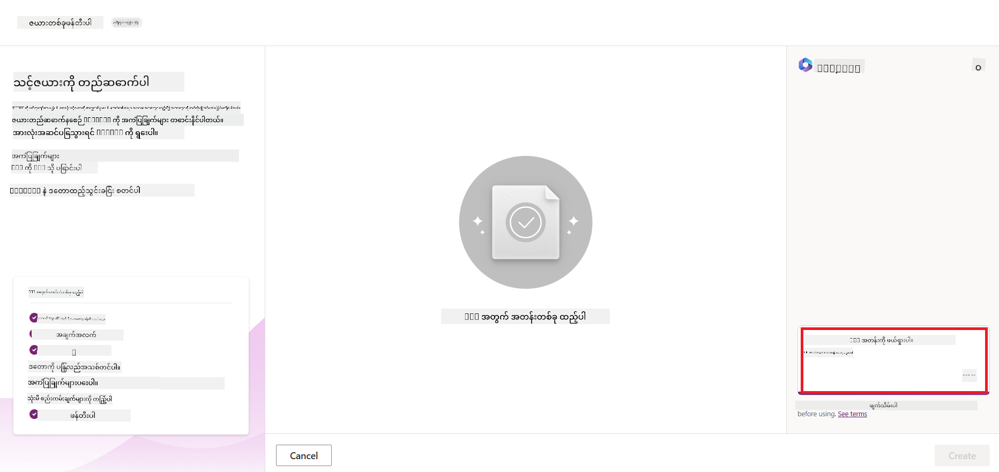
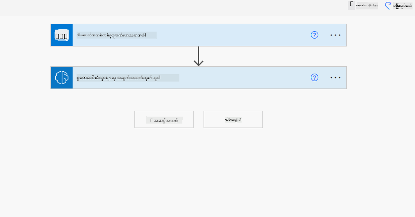
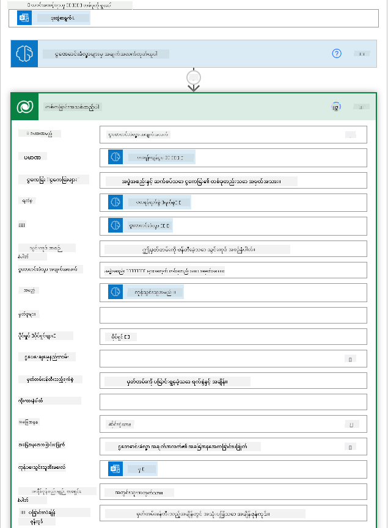

<!--
CO_OP_TRANSLATOR_METADATA:
{
  "original_hash": "846ac8e3b7dcfb697d3309fec05f0fea",
  "translation_date": "2025-10-18T01:59:24+00:00",
  "source_file": "10-building-low-code-ai-applications/README.md",
  "language_code": "my"
}
-->
# အနည်းဆုံးကုဒ် AI အက်ပလီကေးရှင်းများ တည်ဆောက်ခြင်း

> _(အထက်ပါပုံကိုနှိပ်ပြီး ဒီသင်ခန်းစာရဲ့ဗီဒီယိုကိုကြည့်ပါ)_

## မိတ်ဆက်

အခုတော့ ကျွန်တော်တို့ရဲ့ပုံရိပ်ဖန်တီးတဲ့အက်ပလီကေးရှင်းတွေကို တည်ဆောက်ပုံကို သင်ယူပြီးပြီဆိုတော့ အနည်းဆုံးကုဒ်အကြောင်းကို ပြောကြမယ်။ Generative AI ကို အနည်းဆုံးကုဒ်အပါအဝင် အမျိုးမျိုးသောနယ်ပယ်များတွင် အသုံးပြုနိုင်ပေမယ့် အနည်းဆုံးကုဒ်ဆိုတာဘာလဲ၊ AI ကို ဘယ်လိုထည့်သွင်းနိုင်မလဲဆိုတာကို ပြောကြမယ်။

အက်ပလီကေးရှင်းများနှင့် ဖြေရှင်းချက်များကို အနည်းဆုံးကုဒ်ဖွံ့ဖြိုးရေးပလက်ဖောင်းများကို အသုံးပြုခြင်းအားဖြင့် ရိုးရှင်းသောဖွံ့ဖြိုးရေးဆရာများနှင့် ဖွံ့ဖြိုးရေးဆရာမဟုတ်သူများအတွက် ပိုမိုလွယ်ကူလာပါတယ်။ အနည်းဆုံးကုဒ်ဖွံ့ဖြိုးရေးပလက်ဖောင်းများသည် အက်ပလီကေးရှင်းများနှင့် ဖြေရှင်းချက်များကို အနည်းဆုံးကုဒ်ဖြင့် တည်ဆောက်နိုင်စေသည်။ ၎င်းသည် အက်ပလီကေးရှင်းများနှင့် ဖြေရှင်းချက်များကို အမြန်တည်ဆောက်နိုင်စေပြီး အရင်းအမြစ်များကိုလည်း လျှော့ချနိုင်စေသည်။ ဒီသင်ခန်းစာမှာတော့ အနည်းဆုံးကုဒ်ကို ဘယ်လိုအသုံးပြုရမလဲ၊ Power Platform ကို အသုံးပြုပြီး AI ဖြင့် အနည်းဆုံးကုဒ်ဖွံ့ဖြိုးမှုကို ဘယ်လိုတိုးတက်စေမလဲဆိုတာကို အနက်ရှိုင်းဆုံးလေ့လာပါမယ်။

Power Platform က အဖွဲ့အစည်းတွေကို သူတို့ရဲ့အဖွဲ့တွေကို အနည်းဆုံးကုဒ် သို့မဟုတ် ကုဒ်မပါဘဲ ပတ်ဝန်းကျင်တစ်ခုမှာ သူတို့ရဲ့ကိုယ်ပိုင်ဖြေရှင်းချက်တွေကို တည်ဆောက်နိုင်ဖို့ အခွင့်အရေးပေးပါတယ်။ ဒီပတ်ဝန်းကျင်က ဖြေရှင်းချက်တည်ဆောက်တဲ့လုပ်ငန်းစဉ်ကို ရိုးရှင်းစေပါတယ်။ Power Platform ကို အသုံးပြုပြီး ဖြေရှင်းချက်တွေကို လများနှင့်နှစ်များအစား ရက်ပိုင်း သို့မဟုတ် အပတ်ပိုင်းအတွင်း တည်ဆောက်နိုင်ပါတယ်။ Power Platform မှာ အဓိကထုတ်ကုန် ၅ မျိုးပါဝင်ပါတယ် - Power Apps, Power Automate, Power BI, Power Pages နှင့် Copilot Studio။

ဒီသင်ခန်းစာမှာ ပါဝင်တာတွေကတော့ -

- Power Platform မှာ Generative AI ကို မိတ်ဆက်ခြင်း
- Copilot ကို မိတ်ဆက်ခြင်းနှင့် ၎င်းကို ဘယ်လိုအသုံးပြုရမလဲ
- Generative AI ကို အသုံးပြုပြီး Power Platform မှာ အက်ပလီကေးရှင်းများနှင့် flows တည်ဆောက်ခြင်း
- AI Builder ဖြင့် Power Platform မှာ AI Models ကို နားလည်ခြင်း

## သင်ယူရမည့်ရည်မှန်းချက်များ

ဒီသင်ခန်းစာအဆုံးသတ်ချိန်မှာ သင်တတ်မြောက်ထားမယ့်အရာတွေက -

- Power Platform မှာ Copilot ဘယ်လိုအလုပ်လုပ်တယ်ဆိုတာကို နားလည်ခြင်း။

- ကျောင်းသားအလုပ်တာဝန်များကို စစ်ဆေးရန်အက်ပလီကေးရှင်းတစ်ခုကို ကျွန်တော်တို့ရဲ့ပညာရေးစတင်မှုအတွက် တည်ဆောက်ခြင်း။

- AI ကို အသုံးပြုပြီး ငွေတောင်းခံလွှာမှ အချက်အလက်များကို ထုတ်ယူရန် Invoice Processing Flow တစ်ခုကို တည်ဆောက်ခြင်း။

- GPT AI Model ဖြင့် Create Text ကို အသုံးပြုတဲ့အခါ အကောင်းဆုံးအကဲဖြတ်မှုများကို လိုက်နာခြင်း။

ဒီသင်ခန်းစာမှာ သင်အသုံးပြုမယ့် tools နဲ့ နည်းပညာတွေကတော့ -

- **Power Apps** - ကျောင်းသားအလုပ်တာဝန်စစ်ဆေးရန်အက်ပလီကေးရှင်းအတွက်၊ အချက်အလက်တွေကို စစ်ဆေး၊ စီမံခန့်ခွဲပြီး အက်ပလီကေးရှင်းတွေကို တည်ဆောက်ဖို့အတွက် အနည်းဆုံးကုဒ်ဖွံ့ဖြိုးရေးပတ်ဝန်းကျင်ကို ပေးစွမ်းပါတယ်။

- **Dataverse** - ကျောင်းသားအလုပ်တာဝန်စစ်ဆေးရန်အက်ပလီကေးရှင်းအတွက် အချက်အလက်တွေကို သိမ်းဆည်းဖို့ Dataverse က အနည်းဆုံးကုဒ်အချက်အလက်ပလက်ဖောင်းကို ပေးစွမ်းပါတယ်။

- **Power Automate** - Invoice Processing flow အတွက်၊ အနည်းဆုံးကုဒ်ဖွံ့ဖြိုးရေးပတ်ဝန်းကျင်ကို အသုံးပြုပြီး Invoice Processing လုပ်ငန်းစဉ်ကို အလိုအလျောက်လုပ်ဆောင်ဖို့ workflow တွေကို တည်ဆောက်နိုင်ပါတယ်။

- **AI Builder** - Invoice Processing AI Model အတွက်၊ ကျွန်တော်တို့ရဲ့စတင်မှုအတွက် ငွေတောင်းခံလွှာတွေကို အဆင့်မြှင့်တင်ဖို့ prebuilt AI Models တွေကို အသုံးပြုနိုင်ပါတယ်။

## Power Platform မှာ Generative AI

Generative AI ကို အသုံးပြုပြီး အနည်းဆုံးကုဒ်ဖွံ့ဖြိုးမှုနှင့် အက်ပလီကေးရှင်းကို အဆင့်မြှင့်တင်ခြင်းသည် Power Platform ရဲ့ အဓိကအာရုံစိုက်မှုဧရိယာတစ်ခုဖြစ်ပါတယ်။ ရည်မှန်းချက်ကတော့ အားလုံးကို AI-powered အက်ပလီကေးရှင်းများ၊ ဝက်ဘ်ဆိုဒ်များ၊ ဒက်ရှ်ဘုတ်များကို တည်ဆောက်နိုင်စေပြီး AI ဖြင့် လုပ်ငန်းစဉ်များကို အလိုအလျောက်လုပ်ဆောင်နိုင်စေဖို့ဖြစ်ပါတယ်။ _အချက်အလက်သိပ္ပံပညာအတွေ့အကြုံမလိုအပ်ဘဲ_ ဒီရည်မှန်းချက်ကို Power Platform မှာ အနည်းဆုံးကုဒ်ဖွံ့ဖြိုးမှုအတွေ့အကြုံထဲမှာ Generative AI ကို Copilot နဲ့ AI Builder အဖြစ် ပေါင်းစပ်ထည့်သွင်းခြင်းအားဖြင့် အောင်မြင်စေပါတယ်။

### ဒါက ဘယ်လိုအလုပ်လုပ်သလဲ?

Copilot က AI အကူအညီပေးသူတစ်ဦးဖြစ်ပြီး သင့်ရဲ့လိုအပ်ချက်တွေကို သဘာဝဘာသာစကားနဲ့ စကားပြောအဆင့်တွေဖြင့် ဖော်ပြခြင်းအားဖြင့် Power Platform ဖြေရှင်းချက်တွေကို တည်ဆောက်နိုင်စေပါတယ်။ ဥပမာအားဖြင့် သင့် AI အကူအညီပေးသူကို သင့်အက်ပလီကေးရှင်းမှာ ဘယ်အချက်အလက်တွေကို အသုံးပြုမလဲဆိုတာကို ပြောနိုင်ပြီး ၎င်းက အက်ပလီကေးရှင်းနဲ့ အခြေခံအချက်အလက်ပုံစံကို တည်ဆောက်ပေးနိုင်ပါတယ်။ သို့မဟုတ် Power Automate မှာ flow တစ်ခုကို ဘယ်လိုတည်ဆောက်မလဲဆိုတာကို ဖော်ပြနိုင်ပါတယ်။

Copilot အားဖြင့် အက်ပလီကေးရှင်း screen တွေမှာ feature အနေနဲ့ အသုံးပြုနိုင်ပြီး စကားပြောဆွေးနွေးမှုများမှတဆင့် အချက်အလက်တွေကို ရှာဖွေဖော်ထုတ်နိုင်စေပါတယ်။

AI Builder က Power Platform မှာ ရရှိနိုင်တဲ့ အနည်းဆုံးကုဒ် AI စွမ်းရည်တစ်ခုဖြစ်ပြီး AI Models တွေကို အသုံးပြုကာ လုပ်ငန်းစဉ်တွေကို အလိုအလျောက်လုပ်ဆောင်စေပြီး ရလဒ်တွေကို ခန့်မှန်းနိုင်စေပါတယ်။ AI Builder ကို အသုံးပြုပြီး Dataverse သို့မဟုတ် SharePoint, OneDrive, Azure ကဲ့သို့သော cloud data sources တွေမှာရှိတဲ့ သင့်ရဲ့အချက်အလက်တွေနဲ့ ချိတ်ဆက်ထားတဲ့ အက်ပလီကေးရှင်းများနှင့် flows တွေကို AI ဖြင့် ပေါင်းစပ်နိုင်ပါတယ်။

Copilot ဟာ Power Platform ထုတ်ကုန်အားလုံးမှာ ရရှိနိုင်ပါတယ် - Power Apps, Power Automate, Power BI, Power Pages နှင့် Power Virtual Agents။ AI Builder ဟာ Power Apps နဲ့ Power Automate မှာ ရရှိနိုင်ပါတယ်။ ဒီသင်ခန်းစာမှာတော့ ကျွန်တော်တို့ရဲ့ပညာရေးစတင်မှုအတွက် ဖြေရှင်းချက်တစ်ခုကို တည်ဆောက်ဖို့ Power Apps နဲ့ Power Automate မှာ Copilot နဲ့ AI Builder ကို ဘယ်လိုအသုံးပြုရမလဲဆိုတာကို အဓိကထားပြီး လေ့လာပါမယ်။

### Power Apps မှာ Copilot

Power Platform ရဲ့ အစိတ်အပိုင်းတစ်ခုအနေနဲ့ Power Apps က အချက်အလက်တွေကို စစ်ဆေး၊ စီမံခန့်ခွဲပြီး အက်ပလီကေးရှင်းတွေကို တည်ဆောက်ဖို့အတွက် အနည်းဆုံးကုဒ်ဖွံ့ဖြိုးရေးပတ်ဝန်းကျင်ကို ပေးစွမ်းပါတယ်။ ၎င်းသည် အက်ပလီကေးရှင်းဖွံ့ဖြိုးရေးဝန်ဆောင်မှုများနှင့် အချက်အလက်ပလက်ဖောင်းတစ်ခုကို ပေးစွမ်းပြီး cloud services နဲ့ on-premises data တွေကို ချိတ်ဆက်နိုင်စွမ်းရှိပါတယ်။ Power Apps က browser, tablet, phone တွေမှာ အက်ပလီကေးရှင်းတွေကို အသုံးပြုနိုင်ပြီး co-workers တွေနဲ့မျှဝေနိုင်ပါတယ်။ Power Apps က ရိုးရှင်းတဲ့ interface နဲ့ app development ကို လွယ်ကူစေပြီး အရည်အချင်းရှိတဲ့ developer တွေ သို့မဟုတ် business user တွေ အားလုံးကို custom apps တွေ တည်ဆောက်နိုင်စေပါတယ်။ အက်ပလီကေးရှင်းဖွံ့ဖြိုးရေးအတွေ့အကြုံကို Generative AI နဲ့ Copilot မှတဆင့်လည်း အဆင့်မြှင့်တင်ထားပါတယ်။

Power Apps မှာ Copilot AI assistant feature က သင့်အက်ပလီကေးရှင်းအတွက် ဘယ်လိုအက်ပလီကေးရှင်းမျိုးလိုချင်တယ်၊ ဘယ်အချက်အလက်တွေကို track, collect, သို့မဟုတ် ပြသချင်တယ်ဆိုတာကို ဖော်ပြနိုင်စေပါတယ်။ Copilot က သင့်ဖော်ပြချက်အပေါ်မူတည်ပြီး responsive Canvas app တစ်ခုကို ဖန်တီးပေးပါမယ်။ ၎င်းအက်ပလီကေးရှင်းကို သင့်လိုအပ်ချက်အတိုင်း ပြင်ဆင်နိုင်ပါတယ်။ AI Copilot က သင့်အချက်အလက်တွေကို သိမ်းဆည်းဖို့လိုအပ်တဲ့ fields တွေနဲ့ Dataverse Table တစ်ခုကို ဖန်တီးပေးပြီး sample data တွေကိုလည်း ပေးပါမယ်။ Dataverse ဆိုတာဘာလဲ၊ Power Apps မှာ ၎င်းကို ဘယ်လိုအသုံးပြုနိုင်မလဲဆိုတာကို ဒီသင်ခန်းစာမှာ နောက်ပိုင်းမှာလေ့လာပါမယ်။ AI Copilot assistant feature ကို conversational steps တွေမှတဆင့် table ကို customize လုပ်နိုင်ပါတယ်။ ဒီ feature ဟာ Power Apps ရဲ့ home screen မှာ ရရှိနိုင်ပါတယ်။

### Power Automate မှာ Copilot

Power Platform ရဲ့ အစိတ်အပိုင်းတစ်ခုအနေနဲ့ Power Automate က application တွေ၊ service တွေကြားမှာ automated workflows တွေကို ဖန်တီးနိုင်စေပါတယ်။ ၎င်းက communication, data collection, decision approvals ကဲ့သို့သော ထပ်တလဲလဲလုပ်ရတဲ့လုပ်ငန်းစဉ်တွေကို အလိုအလျောက်လုပ်ဆောင်နိုင်စေပါတယ်။ ၎င်းရဲ့ရိုးရှင်းတဲ့ interface က နည်းပညာအရည်အချင်းရှိသူမရှိသူအားလုံးကို အလုပ်တာဝန်တွေကို အလိုအလျောက်လုပ်ဆောင်နိုင်စေပါတယ်။ workflow ဖွံ့ဖြိုးရေးအတွေ့အကြုံကို Generative AI နဲ့ Copilot မှတဆင့်လည်း အဆင့်မြှင့်တင်ထားပါတယ်။

Power Automate မှာ Copilot AI assistant feature က သင့် flow အတွက် ဘယ်လို flow မျိုးလိုချင်တယ်၊ flow က ဘယ်လိုလုပ်ငန်းစဉ်တွေကို လုပ်ဆောင်မလဲဆိုတာကို ဖော်ပြနိုင်စေပါတယ်။ Copilot က သင့်ဖော်ပြချက်အပေါ်မူတည်ပြီး flow တစ်ခုကို ဖန်တီးပေးပါမယ်။ ၎င်း flow ကို သင့်လိုအပ်ချက်အတိုင်း ပြင်ဆင်နိုင်ပါတယ်။ AI Copilot က သင့်လုပ်ဆောင်ချင်တဲ့အလုပ်တာဝန်ကို အလိုအလျောက်လုပ်ဆောင်ဖို့ လိုအပ်တဲ့ actions တွေကို generate လုပ်ပြီး အကြံပေးပါမယ်။ flow တွေက ဘာလဲ၊ Power Automate မှာ ၎င်းတို့ကို ဘယ်လိုအသုံးပြုနိုင်မလဲဆိုတာကို ဒီသင်ခန်းစာမှာ နောက်ပိုင်းမှာလေ့လာပါမယ်။ AI Copilot assistant feature ကို conversational steps တွေမှတဆင့် actions တွေကို customize လုပ်နိုင်ပါတယ်။ ဒီ feature ဟာ Power Automate ရဲ့ home screen မှာ ရရှိနိုင်ပါတယ်။

## အလုပ်တာဝန် - ကျောင်းသားအလုပ်တာဝန်များနှင့် စတင်မှုအတွက် ငွေတောင်းခံလွှာများကို Copilot အသုံးပြုပြီး စီမံခန့်ခွဲပါ

ကျွန်တော်တို့ရဲ့စတင်မှုက ကျောင်းသားတွေကို အွန်လိုင်းသင်တန်းတွေ ပေးဆောင်ပါတယ်။ စတင်မှုက အလွန်မြန်ဆန်စွာတိုးတက်လာပြီး အခုတော့ သူ့ရဲ့သင်တန်းတွေကို တောင်းဆိုမှုနဲ့အတူ လိုက်လျောညီထွေဖြစ်ဖို့ အခက်အခဲရှိနေပါတယ်။ စတင်မှုက သင့်ကို Power Platform developer အဖြစ် ငှားထားပြီး သူတို့ရဲ့ ကျောင်းသားအလုပ်တာဝန်များနှင့် ငွေတောင်းခံလွှာများကို စီမံခန့်ခွဲဖို့ အနည်းဆုံးကုဒ်ဖြေရှင်းချက်တစ်ခုကို တည်ဆောက်ဖို့ ကူညီဖို့လိုအပ်ပါတယ်။ သူတို့ရဲ့ဖြေရှင်းချက်က ကျောင်းသားအလုပ်တာဝန်များကို အက်ပလီကေးရှင်းတစ်ခုမှတဆင့် track နှင့် စီမံခန့်ခွဲနိုင်စေပြီး workflow တစ်ခုမှတဆင့် ငွေတောင်းခံလွှာများကို အလိုအလျောက်လုပ်ဆောင်နိုင်စေဖို့လိုအပ်ပါတယ်။ Generative AI ကို အသုံးပြုပြီး ဖြေရှင်းချက်ကို ဖွံ့ဖြိုးတိုးတက်စေဖို့ သင့်ကို တာဝန်ပေးထားပါတယ်။

Copilot ကို အသုံးပြုဖို့ စတင်တဲ့အခါမှာ [Power Platform Copilot Prompt Library](https://github.com/pnp/powerplatform-prompts?WT.mc_id=academic-109639-somelezediko) ကို အသုံးပြုနိုင်ပါတယ်။ ဒီ library မှာ Copilot နဲ့အတူ apps နဲ့ flows တွေကို တည်ဆောက်ဖို့ prompt တွေစာရင်းပါဝင်ပါတယ်။ Prompt တွေကို အသုံးပြုပြီး သင့်လိုအပ်ချက်တွေကို Copilot ကို ဘယ်လိုဖော်ပြရမလဲဆိုတာကို အကြံဉာဏ်ရနိုင်ပါတယ်။

### ကျောင်းသားအလုပ်တာဝန်စစ်ဆေးရန်အက်ပလီကေးရှင်းတစ်ခုကို ကျွန်တော်တို့ရဲ့စတင်မှုအတွက် တည်ဆောက်ပါ

ကျွန်တော်တို့ရဲ့စတင်မှုမှာရှိတဲ့ပညာရေးဆရာတွေဟာ ကျောင်းသားအလုပ်တာဝန်တွေကို စစ်ဆေးဖို့ အခက်အခဲရှိနေပါတယ်။ သူတို့ဟာ spreadsheet ကို အသုံးပြုပြီး အလုပ်တာဝန်တွေကို track လုပ်နေကြပေမယ့် ကျောင်းသားအရေအတွက်များလာတာနဲ့အတူ စီမံခန့်ခွဲဖို့ အခက်အခဲဖြစ်လာပါတယ်။ သူတို့က သင့်ကို အလုပ်တာဝန်တွေကို track နှင့် စီမံခန့်ခွဲနိုင်ဖို့ အက်ပလီကေးရှင်းတစ်ခုကို တည်ဆောက်ဖို့ တောင်းဆိုထားပါတယ်။ အက်ပလီကေးရှင်းက သူတို့ကို အလုပ်တာဝန်အသစ်တွေ ထည့်သ
ဘာကြောင့် Dataverse ကို ကျွန်ုပ်တို့ရဲ့ စတင်လုပ်ငန်းအတွက် အသုံးပြုသင့်သလဲ? Dataverse ရဲ့ အဆင့်မြင့်နှင့် စိတ်ကြိုက်ပြုလုပ်နိုင်သော ဇယားများက သင့်ဒေတာအတွက် လုံခြုံပြီး cloud-based အရင်းအမြစ်ကို ပေးစွမ်းနိုင်ပါတယ်။ ဇယားများက Excel workbook တစ်ခုထဲမှာ worksheet အမျိုးမျိုးကို သုံးသလိုပဲ ဒေတာအမျိုးအစားအမျိုးမျိုးကို သိမ်းဆည်းနိုင်ပါတယ်။ သင့်အဖွဲ့အစည်း သို့မဟုတ် စီးပွားရေးလိုအပ်ချက်များနှင့် သက်ဆိုင်သော ဒေတာကို သိမ်းဆည်းရန် ဇယားများကို အသုံးပြုနိုင်ပါတယ်။ Dataverse ကို အသုံးပြုခြင်းမှ ကျွန်ုပ်တို့ရဲ့ စတင်လုပ်ငန်းအတွက် ရရှိနိုင်သော အကျိုးကျေးဇူးများမှာ အောက်ပါအတိုင်းဖြစ်ပါတယ်-

- **စီမံခန့်ခွဲရလွယ်ကူမှု**: metadata နှင့် data နှစ်ခုစလုံးကို cloud မှာ သိမ်းဆည်းထားပြီး၊ ဒါတွေကို ဘယ်လို သိမ်းဆည်းထားတယ်၊ ဘယ်လို စီမံခန့်ခွဲရမယ်ဆိုတာကို စိတ်ပူစရာမလိုပါဘူး။ သင့် app တွေ၊ solution တွေကို တည်ဆောက်ဖို့ အာရုံစိုက်နိုင်ပါတယ်။

- **လုံခြုံမှု**: Dataverse က သင့်ဒေတာအတွက် လုံခြုံပြီး cloud-based storage option ကို ပေးစွမ်းပါတယ်။ role-based security ကို အသုံးပြုပြီး သင့်ဇယားထဲမှာရှိတဲ့ ဒေတာကို ဘယ်သူတွေ access လုပ်နိုင်မလဲ၊ ဘယ်လို access လုပ်နိုင်မလဲဆိုတာကို ထိန်းချုပ်နိုင်ပါတယ်။

- **metadata အကြွယ်အမြဲ**: Power Apps ထဲမှာ တိုက်ရိုက်အသုံးပြုနိုင်တဲ့ ဒေတာအမျိုးအစားများနှင့် ဆက်နွယ်မှုများပါဝင်ပါတယ်။

- **Logic နှင့် validation**: business rules, calculated fields, validation rules တွေကို အသုံးပြုပြီး business logic ကို အကောင်အထည်ဖော်နိုင်ပြီး ဒေတာတိကျမှုကို ထိန်းသိမ်းနိုင်ပါတယ်။

Dataverse ဆိုတာ ဘာလဲ၊ ဘာကြောင့် အသုံးပြုသင့်လဲဆိုတာ သိပြီးပြီဆိုရင်၊ ကျွန်ုပ်တို့ရဲ့ ငွေကြေးအဖွဲ့ရဲ့ လိုအပ်ချက်တွေကို ဖြည့်ဆည်းနိုင်ဖို့ Dataverse မှာ ဇယားတစ်ခုကို Copilot အသုံးပြုပြီး ဘယ်လိုဖန်တီးရမလဲဆိုတာကို ကြည့်လိုက်ရအောင်။

> **Note** : ဒီဇယားကို နောက်ပိုင်းအပိုင်းမှာ automation တစ်ခုတည်ဆောက်ပြီး အင်ဗွိုင်းဒေတာအားလုံးကို ထုတ်ယူပြီး ဇယားထဲမှာ သိမ်းဆည်းဖို့ အသုံးပြုပါမယ်။

Dataverse မှာ Copilot ကို အသုံးပြုပြီး ဇယားတစ်ခု ဖန်တီးရန် အောက်ပါအဆင့်များကို လိုက်နာပါ-

1. [Power Apps](https://make.powerapps.com?WT.mc_id=academic-105485-koreyst) အိမ်စာမျက်နှာကို သွားပါ။

2. ဘယ်ဘက် navigation bar မှာ **Tables** ကို ရွေးပြီး **Describe the new Table** ကို နှိပ်ပါ။

3. **Describe the new Table** စာမျက်နှာမှာ သင့်ဇယားကို ဖန်တီးလိုတဲ့အကြောင်းကို text area မှာ ရေးပါ။ ဥပမာအားဖြင့် **_ငွေတောင်းခံလွှာအချက်အလက်တွေကို သိမ်းဆည်းဖို့ ဇယားတစ်ခု ဖန်တီးချင်ပါတယ်_**။ **Send** ခလုတ်ကို နှိပ်ပြီး AI Copilot ကို prompt ကို ပို့ပါ။

4. AI Copilot က သင့်ဒေတာကို track လုပ်ဖို့လိုအပ်တဲ့ field တွေပါဝင်တဲ့ Dataverse ဇယားကို အကြံပေးပါလိမ့်မယ်။ အဲဒီဇယားကို conversational steps တွေကို အသုံးပြုပြီး သင့်လိုအပ်ချက်နဲ့ ကိုက်ညီအောင် customize လုပ်နိုင်ပါတယ်။

5. ငွေကြေးအဖွဲ့က supplier ကို သူတို့ရဲ့ အင်ဗွိုင်း status နောက်ဆုံးအခြေအနေကို အပ်ဒိတ်ပေးဖို့ အီးမေးလ်ပို့ချင်ပါတယ်။ Copilot ကို အသုံးပြုပြီး ဇယားထဲမှာ supplier email ကို သိမ်းဆည်းဖို့ field အသစ်တစ်ခု ထည့်နိုင်ပါတယ်။ ဥပမာအားဖြင့် **_supplier email ကို သိမ်းဆည်းဖို့ column တစ်ခု ထည့်ချင်ပါတယ်_** ဆိုတဲ့ prompt ကို အသုံးပြုနိုင်ပါတယ်။ **Send** ခလုတ်ကို နှိပ်ပြီး AI Copilot ကို prompt ကို ပို့ပါ။

6. AI Copilot က field အသစ်တစ်ခုကို ဖန်တီးပေးပြီး သင့်လိုအပ်ချက်နဲ့ ကိုက်ညီအောင် customize လုပ်နိုင်ပါတယ်။

7. ဇယားကို ပြီးမြောက်တဲ့အခါ **Create** ခလုတ်ကို နှိပ်ပြီး ဇယားကို ဖန်တီးပါ။

## Power Platform ထဲမှာ AI Builder နဲ့ AI Models

AI Builder က Power Platform မှာ ရရှိနိုင်တဲ့ low-code AI စွမ်းရည်တစ်ခုဖြစ်ပြီး၊ ဒေတာကို automate လုပ်ခြင်း၊ အကျိုးအမြတ်ကို ခန့်မှန်းခြင်းတို့အတွက် AI Models တွေကို အသုံးပြုနိုင်စေပါတယ်။ AI Builder ကို အသုံးပြုပြီး Dataverse သို့မဟုတ် SharePoint, OneDrive, Azure စတဲ့ cloud data sources များနှင့် ချိတ်ဆက်ထားတဲ့ app တွေ၊ flow တွေမှာ AI ကို ပေါင်းစပ်နိုင်ပါတယ်။

## Prebuilt AI Models နှင့် Custom AI Models

AI Builder မှာ AI Models နှစ်မျိုး ရှိပါတယ်- Prebuilt AI Models နဲ့ Custom AI Models။ Prebuilt AI Models တွေက Microsoft မှ training လုပ်ထားပြီး Power Platform မှာ အသုံးပြုနိုင်တဲ့ AI Models တွေဖြစ်ပါတယ်။ ဒါတွေက သင့် app တွေ၊ flow တွေကို data စုဆောင်းပြီး model ကို training လုပ်၊ publish လုပ်စရာမလိုဘဲ အတတ်နိုင်ဆုံး အဆင့်မြင့်စွမ်းရည်ဖြင့် intelligence ပေါင်းစပ်နိုင်စေပါတယ်။

Power Platform မှာ ရရှိနိုင်တဲ့ Prebuilt AI Models တချို့မှာ-

- **Key Phrase Extraction**: စာသားထဲက အဓိက keyword တွေကို ထုတ်ယူပေးတဲ့ model
- **Language Detection**: စာသားရဲ့ ဘာသာစကားကို ရှာဖွေတဲ့ model
- **Sentiment Analysis**: စာသားထဲက အပြုသဘော၊ အဆိုးသဘော၊ အလယ်အလတ် သို့မဟုတ် ရောနှောထားတဲ့ အမြင်ကို ရှာဖွေတဲ့ model
- **Business Card Reader**: လုပ်ငန်းကတ်များမှ အချက်အလက်များကို ထုတ်ယူပေးတဲ့ model
- **Text Recognition**: ပုံများမှ စာသားကို ထုတ်ယူပေးတဲ့ model
- **Object Detection**: ပုံများမှ object တွေကို ရှာဖွေထုတ်ယူပေးတဲ့ model
- **Document Processing**: ဖောင်များမှ အချက်အလက်များကို ထုတ်ယူပေးတဲ့ model
- **Invoice Processing**: အင်ဗွိုင်းများမှ အချက်အလက်များကို ထုတ်ယူပေးတဲ့ model

Custom AI Models တွေကို AI Builder ထဲမှာ သင့်ကိုယ်ပိုင် model ကို ထည့်သွင်းပြီး AI Builder custom model တစ်ခုလို အလုပ်လုပ်စေဖို့ training လုပ်နိုင်ပါတယ်။ ဒီ model တွေကို Power Apps နဲ့ Power Automate မှာ ဒေတာကို automate လုပ်ခြင်း၊ အကျိုးအမြတ်ကို ခန့်မှန်းခြင်းတို့အတွက် အသုံးပြုနိုင်ပါတယ်။ သို့သော် သင့်ကိုယ်ပိုင် model ကို အသုံးပြုတဲ့အခါမှာ အချို့ကန့်သတ်ချက်တွေ ရှိပါတယ်။ ဒီ [ကန့်သတ်ချက်များ](https://learn.microsoft.com/ai-builder/byo-model#limitations?WT.mc_id=academic-105485-koreyst) အကြောင်းကို ပိုမိုသိရှိရန် ဖတ်ရှုပါ။

## အလုပ်ပေးစာ #2 - ကျွန်ုပ်တို့ရဲ့ စတင်လုပ်ငန်းအတွက် အင်ဗွိုင်းကို အလုပ်လုပ်စေမည့် Flow တစ်ခု တည်ဆောက်ပါ

ငွေကြေးအဖွဲ့က အင်ဗွိုင်းတွေကို စီမံခန့်ခွဲဖို့ အခက်အခဲရှိနေပါတယ်။ သူတို့က spreadsheet ကို အသုံးပြုပြီး အင်ဗွိုင်းတွေကို track လုပ်နေကြပေမယ့် အင်ဗွိုင်းအရေအတွက်များလာတာနဲ့အမျှ စီမံခန့်ခွဲဖို့ ခက်ခဲလာပါတယ်။ AI ကို အသုံးပြုပြီး အင်ဗွိုင်းတွေကို စီမံခန့်ခွဲဖို့ workflow တစ်ခု တည်ဆောက်ပေးဖို့ သူတို့က တောင်းဆိုလာပါတယ်။ ဒီ workflow က အင်ဗွိုင်းတွေထဲက အချက်အလက်တွေကို ထုတ်ယူပြီး Dataverse ဇယားထဲမှာ သိမ်းဆည်းနိုင်ဖို့၊ finance team ကို extracted information နဲ့အတူ အီးမေးလ်ပို့နိုင်ဖို့ အလုပ်လုပ်ရပါမယ်။

AI Builder ရဲ့ Invoice Processing AI Model ကို အသုံးပြုပြီး finance team အတွက် အင်ဗွိုင်းတွေကို စီမံခန့်ခွဲနိုင်မယ့် workflow တစ်ခု တည်ဆောက်ဖို့ အောက်ပါအဆင့်များကို လိုက်နာပါ-

1. [Power Automate](https://make.powerautomate.com?WT.mc_id=academic-105485-koreyst) အိမ်စာမျက်နှာကို သွားပါ။

2. အိမ်စာမျက်နှာမှာရှိတဲ့ text area ကို အသုံးပြုပြီး သင့် workflow ကို ဖော်ပြပါ။ ဥပမာအားဖြင့် **_အင်ဗွိုင်းတစ်ခု mailbox ထဲရောက်လာတဲ့အခါ process လုပ်ပါ_**။ **Send** ခလုတ်ကို နှိပ်ပြီး AI Copilot ကို prompt ကို ပို့ပါ။

   

3. AI Copilot က သင့် automate လုပ်ချင်တဲ့ task ကို အကောင်အထည်ဖော်ဖို့ လိုအပ်တဲ့ action တွေကို အကြံပေးပါလိမ့်မယ်။ **Next** ခလုတ်ကို နှိပ်ပြီး နောက်တစ်ဆင့်ကို ဆက်သွားပါ။

4. နောက်တစ်ဆင့်မှာ Power Automate က flow အတွက် လိုအပ်တဲ့ connection တွေကို setup လုပ်ဖို့ prompt ပေးပါလိမ့်မယ်။ ပြီးမြောက်တဲ့အခါ **Create flow** ခလုတ်ကို နှိပ်ပြီး flow ကို ဖန်တီးပါ။

5. AI Copilot က flow တစ်ခုကို ဖန်တီးပေးပြီး သင့်လိုအပ်ချက်နဲ့ ကိုက်ညီအောင် customize လုပ်နိုင်ပါတယ်။

6. flow ရဲ့ trigger ကို update လုပ်ပြီး **Folder** ကို အင်ဗွိုင်းတွေ သိမ်းဆည်းမယ့် folder ကို သတ်မှတ်ပါ။ ဥပမာအားဖြင့် folder ကို **Inbox** အဖြစ် သတ်မှတ်နိုင်ပါတယ်။ **Show advanced options** ကို နှိပ်ပြီး **Only with Attachments** ကို **Yes** အဖြစ် သတ်မှတ်ပါ။ ဒါက folder ထဲမှာ attachment ပါတဲ့ အီးမေးလ်ရောက်လာတဲ့အခါမှာပဲ flow ကို အလုပ်လုပ်စေမှာဖြစ်ပါတယ်။

7. flow ထဲက **HTML to text**, **Compose**, **Compose 2**, **Compose 3**, **Compose 4** actions တွေကို ဖယ်ရှားပါ။ အဲဒီ actions တွေကို အသုံးမပြုတော့ပါဘူး။

8. flow ထဲက **Condition** action ကို ဖယ်ရှားပါ။ flow က အောက်ပါ screenshot လို ဖြစ်သင့်ပါတယ်-

   

9. **Add an action** ခလုတ်ကို နှိပ်ပြီး **Dataverse** ကို ရှာပါ။ **Add a new row** action ကို ရွေးပါ။

10. **Extract Information from invoices** action မှာ **Invoice File** ကို email ထဲက **Attachment Content** ကို ရည်ညွှန်းအောင် update လုပ်ပါ။ ဒါက flow က အင်ဗွိုင်း attachment ထဲက အချက်အလက်တွေကို ထုတ်ယူနိုင်ဖို့ အကူအညီပေးပါမယ်။

11. သင်ဖန်တီးထားတဲ့ ဇယားကို ရွေးပါ။ ဥပမာအားဖြင့် **Invoice Information** ဇယားကို ရွေးနိုင်ပါတယ်။ အောက်ပါ field တွေကို populate လုပ်ဖို့ dynamic content ကို ရွေးပါ-

    - ID
    - Amount
    - Date
    - Name
    - Status - **Pending** အဖြစ် သတ်မှတ်ပါ။
    - Supplier Email - **When a new email arrives** trigger ထဲက **From** dynamic content ကို အသုံးပြုပါ။

    

12. flow ကို ပြီးမြောက်တဲ့အခါ **Save** ခလုတ်ကို နှိပ်ပြီး flow ကို save လုပ်ပါ။ သင် trigger မှာ သတ်မှတ်ထားတဲ့ folder ကို အင်ဗွိုင်းပါတဲ့ အီးမေးလ်တစ်ခု ပို့ပြီး flow ကို စမ်းသပ်နိုင်ပါတယ်။

> **သင့်အိမ်စာ**: သင်တည်ဆောက်ထားတဲ့ flow က အစကောင်းတစ်ခုဖြစ်ပါတယ်၊ finance team က အင်ဗွိုင်း status ပြောင်းလဲတဲ့အခါ supplier ကို အီးမေးလ်ပို့နိုင်မယ့် automation တစ်ခုကို ဘယ်လိုတည်ဆောက်ရမလဲဆိုတာ စဉ်းစားပါ။ သင့်အကြံပြုချက်- flow က အင်ဗွိုင်း status ပြောင်းလဲတဲ့အခါ အလုပ်လုပ်ရပါမယ်။

## Power Automate မှာ Text Generation AI Model ကို အသုံးပြုပါ

AI Builder ရဲ့ Create Text with GPT AI Model က prompt တစ်ခုအပေါ် အခြေခံပြီး text ကို ဖန်တီးနိုင်စွမ်းရှိပြီး Microsoft Azure OpenAI Service မှ အားပေးထားပါတယ်။ ဒီစွမ်းရည်နဲ့ GPT (Generative Pre-Trained Transformer) နည်းပညာကို သင့် app တွေ၊ flow တွေထဲမှာ ပေါင်းစပ်ပြီး အလုပ်လုပ်စေတဲ့ automation တွေ၊ အကျိုးသက်ရောက်မှုရှိတဲ့ application တွေကို တည်ဆောက်နိုင်ပါတယ်။

GPT models တွေက အချက်အလက်အများကြီးကို training လုပ်ထားပြီး prompt ရရှိတဲ့အခါ လူသားစာသားနဲ့ ဆင်တူတဲ့ text ကို ဖန်တီးနိုင်စွမ်းရှိပါတယ်။ workflow automation နဲ့ ပေါင်းစပ်တဲ့အခါ AI models တွေက task အမျိုးမျိုးကို streamline လုပ်ပြီး automate လုပ်နိုင်စေပါတယ်။

ဥပမာအားဖြင့် အီးမေးလ် draft, product description စတဲ့ use case အမျိုးမျိုးအတွက် text ကို အလိုအလျောက် ဖန်တီးတဲ့ flow တွေကို တည်ဆောက်နိုင်ပါတယ်။ customer service agents တွေကို effectively နဲ့ efficiently customer inquiry တွေကို ဖြေရှင်းနိုင်စေတဲ့ chatbot တွေ၊ customer service apps တွေ အတွက် text ကို ဖန်တီးနိုင်ပါတယ်။

ဒီ AI Model ကို Power Automate မှာ ဘယ်လိုအသုံးပြုရမလဲဆိုတာကို [Add intelligence with AI Builder and GPT](https://learn.microsoft.com/training/modules/ai-builder-text-generation/?WT.mc_id=academic-109639-somelezediko) module ကို လေ့လာပါ။

## အလုပ်ကောင်းပါတယ်! သင့်ရဲ့လေ့လာမှုကို ဆက်လက်လုပ်ဆောင်ပါ

ဒီသင်ခန်းစာကို ပြီးမြောက်ပြီးနောက်မှာ ကျွန်ုပ်တို့ရဲ့ [Generative AI Learning collection](https://aka.ms/genai-collection?WT.mc_id=academic-105485-koreyst) ကို သွားပြီး Generative AI အတတ်ပညာကို ဆက်လက်မြှင့်တင်ပါ!

Lesson 11 ကို သွားပြီး [Generative AI ကို Function Calling နဲ့ ပေါင်းစပ်ခြင်း](../11-integrating-with-function-calling/README.md?WT.mc_id=academic-105485-koreyst) ကို လေ့လာကြည့်ပါ!

---

**အကြောင်းကြားချက်**:  
ဤစာရွက်စာတမ်းကို AI ဘာသာပြန်ဝန်ဆောင်မှု [Co-op Translator](https://github.com/Azure/co-op-translator) ကို အသုံးပြု၍ ဘာသာပြန်ထားပါသည်။ ကျွန်ုပ်တို့သည် တိကျမှုအတွက် ကြိုးစားနေသော်လည်း အလိုအလျောက် ဘာသာပြန်မှုများတွင် အမှားများ သို့မဟုတ် မမှန်ကန်မှုများ ပါဝင်နိုင်သည်ကို သတိပြုပါ။ မူရင်းဘာသာစကားဖြင့် ရေးသားထားသော စာရွက်စာတမ်းကို အာဏာတရားရှိသော အရင်းအမြစ်အဖြစ် သတ်မှတ်သင့်ပါသည်။ အရေးကြီးသော အချက်အလက်များအတွက် လူက ဘာသာပြန်မှုကို အကြံပြုပါသည်။ ဤဘာသာပြန်မှုကို အသုံးပြုခြင်းမှ ဖြစ်ပေါ်လာသော အလွဲအမှားများ သို့မဟုတ် အနားလွဲမှုများအတွက် ကျွန်ုပ်တို့သည် တာဝန်မယူပါ။