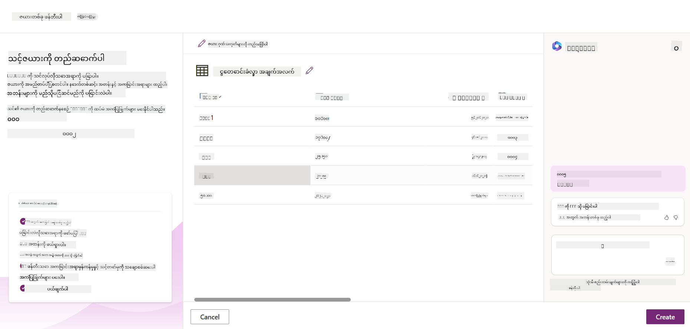
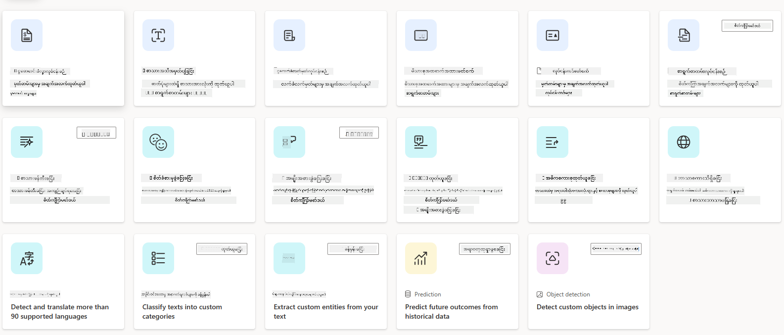
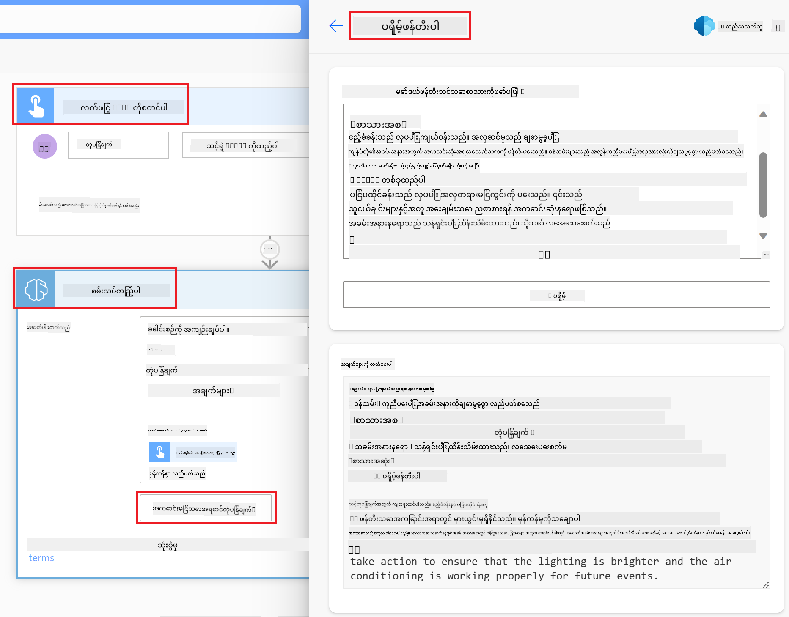

<!--
CO_OP_TRANSLATOR_METADATA:
{
  "original_hash": "f5ff3b6204a695a117d6f452403c95f7",
  "translation_date": "2025-07-09T14:19:00+00:00",
  "source_file": "10-building-low-code-ai-applications/README.md",
  "language_code": "my"
}
-->
# Low Code AI အက်ပလီကေးရှင်းများ တည်ဆောက်ခြင်း

> _(ဓာတ်ပုံကိုနှိပ်၍ ဤသင်ခန်းစာ၏ ဗီဒီယိုကိုကြည့်ရှုနိုင်ပါသည်)_

## နိဒါန်း

ဓာတ်ပုံဖန်တီးခြင်းအက်ပလီကေးရှင်းများ တည်ဆောက်နည်းကို သင်ယူပြီးနောက်၊ Low Code အကြောင်းကို ဆွေးနွေးကြမယ်။ Generative AI ကို Low Code အပါအဝင် အမျိုးမျိုးသော နယ်ပယ်များတွင် အသုံးပြုနိုင်ပါသည်။ ဒါပေမယ့် Low Code ဆိုတာဘာလဲ၊ AI ကို ဘယ်လို ပေါင်းထည့်နိုင်မလဲ?

Low Code Development Platforms များက စံနမူနာအရ Developer များနှင့် Developer မဟုတ်သူများအတွက် အက်ပလီကေးရှင်းများနှင့် ဖြေရှင်းချက်များကို ပိုမိုလွယ်ကူစွာ တည်ဆောက်နိုင်စေသည်။ Low Code Development Platforms သည် အနည်းငယ် သို့မဟုတ် ကုဒ်မလိုဘဲ အက်ပလီကေးရှင်းများနှင့် ဖြေရှင်းချက်များကို တည်ဆောက်နိုင်စေသည်။ ၎င်းသည် အက်ပလီကေးရှင်းများနှင့် ဖြေရှင်းချက်များကို တည်ဆောက်ရာတွင် ကွန်ပေါနင့်များကို ဆွဲထည့်၍ တည်ဆောက်နိုင်သော မြင်သာသော ဖွံ့ဖြိုးရေးပတ်ဝန်းကျင်ကို ပံ့ပိုးပေးခြင်းဖြင့် ဖြစ်သည်။ ၎င်းကြောင့် အက်ပလီကေးရှင်းများနှင့် ဖြေရှင်းချက်များကို ပိုမိုမြန်ဆန်စွာ၊ အရင်းအမြစ်နည်းနည်းဖြင့် တည်ဆောက်နိုင်သည်။ ဤသင်ခန်းစာတွင် Low Code ကို ဘယ်လိုအသုံးပြုရမည်၊ Power Platform ကို အသုံးပြု၍ AI ဖြင့် Low Code ဖွံ့ဖြိုးရေးကို ဘယ်လိုတိုးတက်စေမည်ကို နက်ရှိုင်းစွာ လေ့လာသွားမည်ဖြစ်သည်။

Power Platform သည် အဖွဲ့အစည်းများအား သူတို့၏အဖွဲ့ဝင်များကို ကိုယ်ပိုင်ဖြေရှင်းချက်များ တည်ဆောက်နိုင်ရန် အလွယ်တကူ Low Code သို့မဟုတ် No Code ပတ်ဝန်းကျင်ဖြင့် အခွင့်အလမ်းပေးသည်။ ဤပတ်ဝန်းကျင်သည် ဖြေရှင်းချက်များ တည်ဆောက်ခြင်းလုပ်ငန်းစဉ်ကို ရိုးရှင်းစေသည်။ Power Platform ဖြင့် ဖြေရှင်းချက်များကို လများ သို့မဟုတ် နှစ်များမလိုဘဲ ရက်အနည်းငယ် သို့မဟုတ် အပတ်အနည်းငယ်အတွင်း တည်ဆောက်နိုင်သည်။ Power Platform တွင် အဓိက ထုတ်ကုန် ၅ မျိုး ပါဝင်သည်။ Power Apps, Power Automate, Power BI, Power Pages နှင့် Copilot Studio တို့ဖြစ်သည်။

ဤသင်ခန်းစာတွင် ပါဝင်သောအကြောင်းအရာများမှာ -

- Power Platform တွင် Generative AI နိဒါန်း
- Copilot နိဒါန်းနှင့် အသုံးပြုနည်း
- Power Platform တွင် Generative AI ဖြင့် အက်ပလီကေးရှင်းများနှင့် ဖလိုးများ တည်ဆောက်ခြင်း
- AI Builder ဖြင့် Power Platform တွင် AI မော်ဒယ်များကို နားလည်ခြင်း

## သင်ယူရမည့် ရည်မှန်းချက်များ

ဤသင်ခန်းစာပြီးဆုံးသည်နှင့်အတူ သင်သည် -

- Power Platform တွင် Copilot ဘယ်လို လုပ်ဆောင်သည်ကို နားလည်နိုင်မည်။

- ကျောင်းသားအပ်အာင်းမင့် များကို စောင့်ကြည့်ရန် အက်ပလီကေးရှင်း တည်ဆောက်နိုင်မည်။

- ငွေတောင်းခံလွှာများမှ အချက်အလက်များကို AI ဖြင့် ထုတ်ယူသုံးစွဲသော ငွေတောင်းခံလွှာ လုပ်ငန်းစဉ် ဖလိုး တည်ဆောက်နိုင်မည်။

- GPT AI Model ဖြင့် စာသားဖန်တီးခြင်းတွင် အကောင်းဆုံး လေ့လာမှုများကို အသုံးပြုနိုင်မည်။

ဤသင်ခန်းစာတွင် သင်အသုံးပြုမည့် ကိရိယာများနှင့် နည်းပညာများမှာ -

- **Power Apps** - ကျောင်းသားအပ်အာင်းမင့် များကို စောင့်ကြည့်၊ စီမံခန့်ခွဲရန် အက်ပလီကေးရှင်း တည်ဆောက်ရန် Low Code ဖွံ့ဖြိုးရေးပတ်ဝန်းကျင်။

- **Dataverse** - ကျောင်းသားအပ်အာင်းမင့် အက်ပလီကေးရှင်းအတွက် ဒေတာသိုလှောင်ရန် Low Code ဒေတာပလက်ဖောင်း။

- **Power Automate** - ငွေတောင်းခံလွှာ လုပ်ငန်းစဉ်ကို အလိုအလျောက်လုပ်ဆောင်ရန် Workflow များ တည်ဆောက်ရန် Low Code ဖွံ့ဖြိုးရေးပတ်ဝန်းကျင်။

- **AI Builder** - ငွေတောင်းခံလွှာများကို AI ဖြင့် လုပ်ငန်းစဉ်များ အလိုအလျောက်လုပ်ဆောင်ရန် အသုံးပြုမည့် AI မော်ဒယ်များ။

## Power Platform တွင် Generative AI

Low Code ဖွံ့ဖြိုးရေးနှင့် အက်ပလီကေးရှင်းများကို Generative AI ဖြင့် တိုးတက်စေခြင်းသည် Power Platform ၏ အဓိက ဦးတည်ချက်တစ်ခုဖြစ်သည်။ ရည်မှန်းချက်မှာ ဒေတာသိပ္ပံ ကျွမ်းကျင်မှု မလိုအပ်ဘဲ AI ပါဝင်သော အက်ပလီကေးရှင်းများ၊ ဝက်ဘ်ဆိုက်များ၊ ဒက်ရှ်ဘုတ်များနှင့် လုပ်ငန်းစဉ်များကို အားလုံးအတွက် တည်ဆောက်နိုင်စေရန်ဖြစ်သည်။ ၎င်းကို Copilot နှင့် AI Builder အဖြစ် Power Platform ၏ Low Code ဖွံ့ဖြိုးရေး အတွေ့အကြုံထဲသို့ Generative AI ပေါင်းစပ်ခြင်းဖြင့် အကောင်အထည်ဖော်သည်။

### ၎င်းသည် ဘယ်လို လုပ်ဆောင်သနည်း?

Copilot သည် သင်၏လိုအပ်ချက်များကို သဘာဝဘာသာစကားဖြင့် ဆက်သွယ်ပြောဆိုခြင်းဖြင့် Power Platform ဖြေရှင်းချက်များ တည်ဆောက်နိုင်စေသော AI အကူအညီဖြစ်သည်။ ဥပမာအားဖြင့် သင်၏အက်ပလီကေးရှင်းတွင် အသုံးပြုမည့် ကွက်လပ်များကို ဖော်ပြရန် AI အကူအညီကို ညွှန်ကြားနိုင်ပြီး၊ ၎င်းသည် အက်ပလီကေးရှင်းနှင့် အခြေခံ ဒေတာမော်ဒယ်ကို ဖန်တီးပေးမည်ဖြစ်သည်။ သို့မဟုတ် Power Automate တွင် ဖလိုးတစ်ခုကို ဘယ်လို တည်ဆောက်မည်ကို သတ်မှတ်နိုင်သည်။

Copilot အား သင့်အက်ပလီကေးရှင်း မျက်နှာပြင်များတွင် လုပ်ဆောင်ချက်တစ်ခုအဖြစ် အသုံးပြု၍ အသုံးပြုသူများအား ဆက်သွယ်ပြောဆိုမှုမှတဆင့် အချက်အလက်များ ရှာဖွေတွေ့ရှိနိုင်စေသည်။

AI Builder သည် Power Platform တွင် ရရှိနိုင်သော Low Code AI စွမ်းရည်ဖြစ်ပြီး AI မော်ဒယ်များကို အသုံးပြု၍ လုပ်ငန်းစဉ်များကို အလိုအလျောက်လုပ်ဆောင်ခြင်းနှင့် ရလဒ်ခန့်မှန်းခြင်းများ ပြုလုပ်နိုင်စေသည်။ AI Builder ဖြင့် Dataverse သို့မဟုတ် SharePoint, OneDrive, Azure ကဲ့သို့သော မတူညီသော Cloud ဒေတာရင်းမြစ်များနှင့် ချိတ်ဆက်ထားသော အက်ပလီကေးရှင်းများနှင့် ဖလိုးများတွင် AI ကို ပေါင်းစပ်နိုင်သည်။

Copilot သည် Power Platform ထုတ်ကုန်အားလုံးတွင် ရရှိနိုင်သည်။ Power Apps, Power Automate, Power BI, Power Pages နှင့် Power Virtual Agents တို့တွင်ပါဝင်သည်။ AI Builder သည် Power Apps နှင့် Power Automate တွင် ရရှိနိုင်သည်။ ဤသင်ခန်းစာတွင် ကျွန်ုပ်တို့သည် Power Apps နှင့် Power Automate တွင် Copilot နှင့် AI Builder ကို အသုံးပြု၍ ကျောင်းသားစတားတပ်အတွက် ဖြေရှင်းချက်တစ်ခု တည်ဆောက်ခြင်းကို အဓိကထား လေ့လာသွားမည်ဖြစ်သည်။

### Power Apps တွင် Copilot

Power Platform ၏ အစိတ်အပိုင်းတစ်ခုအဖြစ် Power Apps သည် ဒေတာကို စောင့်ကြည့်၊ စီမံခန့်ခွဲခြင်းနှင့် ဆက်သွယ်နိုင်သော အက်ပလီကေးရှင်းများ တည်ဆောက်ရန် Low Code ဖွံ့ဖြိုးရေးပတ်ဝန်းကျင်ဖြစ်သည်။ ၎င်းသည် အက်ပလီကေးရှင်း ဖွံ့ဖြိုးရေး ဝန်ဆောင်မှုများ၊ တိုးချဲ့နိုင်သော ဒေတာပလက်ဖောင်းနှင့် Cloud ဝန်ဆောင်မှုများနှင့် On-Premises ဒေတာများ ချိတ်ဆက်နိုင်စွမ်း ပါဝင်သည်။ Power Apps ဖြင့် Browser, Tablet, ဖုန်းများတွင် အက်ပလီကေးရှင်းများ တည်ဆောက်နိုင်ပြီး အလုပ်သမားများနှင့် မျှဝေနိုင်သည်။ Power Apps သည် ရိုးရှင်းသော အင်တာဖေ့စ်ဖြင့် အသုံးပြုသူများအား အက်ပလီကေးရှင်း ဖွံ့ဖြိုးရေးသို့ လွယ်ကူစွာ ဝင်ရောက်နိုင်စေသည်။ အလုပ်သမားတိုင်း သို့မဟုတ် ပရော်ဖက်ရှင်နယ် Developer တစ်ဦးစီသည် ကိုယ်ပိုင် အက်ပလီကေးရှင်းများ တည်ဆောက်နိုင်သည်။ Generative AI ကို Copilot ဖြင့် ပိုမိုတိုးတက်စေသည်။

Power Apps တွင် Copilot AI အကူအညီသည် သင်လိုအပ်သော အက်ပလီကေးရှင်းအမျိုးအစားနှင့် သင်၏အက်ပလီကေးရှင်းတွင် စောင့်ကြည့်၊ စုဆောင်း သို့မဟုတ် ပြသလိုသော အချက်အလက်များကို ဖော်ပြနိုင်စေသည်။ Copilot သည် သင်၏ဖော်ပြချက်အပေါ် အခြေခံ၍ တုံ့ပြန်နိုင်သော Canvas app တစ်ခု ဖန်တီးပေးမည်ဖြစ်သည်။ ထို့နောက် သင်၏လိုအပ်ချက်များနှင့် ကိုက်ညီအောင် အက်ပလီကေးရှင်းကို ပြင်ဆင်နိုင်သည်။ AI Copilot သည် သင်စောင့်ကြည့်လိုသော ဒေတာများကို သိမ်းဆည်းရန် လိုအပ်သော ကွက်လပ်များပါဝင်သည့် Dataverse ဇယားတစ်ခုကို ဖန်တီးပေးပြီး နမူနာဒေတာများကိုလည်း ထည့်သွင်းပေးသည်။ ဤသင်ခန်းစာတွင် Dataverse ဆိုတာဘာလဲ၊ Power Apps တွင် ဘယ်လိုအသုံးပြုမလဲကို နောက်ပိုင်းတွင် လေ့လာသွားမည်။ AI Copilot အကူအညီဖြင့် ဆက်သွယ်ပြောဆိုမှုအဆင့်များမှတဆင့် ဇယားကို သင့်လိုအပ်ချက်အတိုင်း ပြင်ဆင်နိုင်သည်။ ဤအင်္ဂါရပ်ကို Power Apps မူလမျက်နှာပြင်မှ လွယ်ကူစွာ အသုံးပြုနိုင်သည်။

### Power Automate တွင် Copilot

Power Platform ၏ အစိတ်အပိုင်းတစ်ခုအဖြစ် Power Automate သည် အက်ပလီကေးရှင်းများနှင့် ဝန်ဆောင်မှုများအကြား အလိုအလျောက် Workflow များ ဖန်တီးနိုင်စေသည်။ ၎င်းသည် ဆက်သွယ်ရေး၊ ဒေတာစုဆောင်းခြင်းနှင့် ဆုံးဖြတ်ချက် အတည်ပြုခြင်းကဲ့သို့သော အလုပ်များကို အလိုအလျောက် လုပ်ဆောင်ရန် ကူညီပေးသည်။ ရိုးရှင်းသော အင်တာဖေ့စ်ကြောင့် နည်းပညာကျွမ်းကျင်မှု မရှိသူမှ စတင်သူများ၊ အတွေ့အကြုံရှိ Developer များအထိ အလုပ်များကို အလိုအလျောက်လုပ်ဆောင်နိုင်သည်။ Workflow ဖွံ့ဖြိုးရေး အတွေ့အကြုံကို Generative AI ဖြင့် Copilot က ပိုမိုတိုးတက်စေသည်။

Power Automate တွင် Copilot AI အကူအညီသည် သင်လိုအပ်သော ဖလိုးအမျိုးအစားနှင့် သင်၏ဖလိုးတွင် လုပ်ဆောင်လိုသော လုပ်ဆောင်ချက်များကို ဖော်ပြနိုင်စေသည်။ Copilot သည် သင်၏ဖော်ပြချက်အပေါ် အခြေခံ၍ ဖလိုးတစ်ခု ဖန်တီးပေးမည်ဖြစ်သည်။ ထို့နောက် သင်၏လိုအပ်ချက်များနှင့် ကိုက်ညီအောင် ဖလိုးကို ပြင်ဆင်နိုင်သည်။ AI Copilot သည် သင်လိုအပ်သော လုပ်ဆောင်ချက်များကို ဖန်တီးပေးပြီး အလိုအလျောက်လုပ်ဆောင်ရန် အကြံပြုသည်။ ဤသင်ခန်းစာတွင် ဖလိုးများ ဆိုတာဘာလဲ၊ Power Automate တွင် ဘယ်လိုအသုံးပြုမလဲကို နောက်ပိုင်းတွင် လေ့လာသွားမည်။ AI Copilot အကူအညီဖြင့် ဆက်သွယ်ပြောဆိုမှုအဆင့်များမှတဆင့် လုပ်ဆောင်ချက်များကို သင့်လိုအပ်ချက်အတိုင်း ပြင်ဆင်နိုင်သည်။ ဤအင်္ဂါရပ်ကို Power Automate မူလမျက်နှာပြင်မှ လွယ်ကူစွာ အသုံးပြုနိုင်သည်။

## အပ်မစ်: ကျောင်းသားအပ်အာင်းမင့်များနှင့် ငွေတောင်းခံလွှာများကို Copilot ဖြင့် စီမံခန့်ခွဲခြင်း

ကျွန်ုပ်တို့၏ စတားတပ်သည် ကျောင်းသားများအား အွန်လိုင်းသင်တန်းများ ပေးနေသည်။ စတားတပ်သည် အလျင်အမြန် တိုးတက်လာပြီး သင်တန်းများအတွက် တောင်းဆိုမှုများကို ထိန်းသိမ်းရန် အခက်အခဲရှိနေသည်။ စတားတပ်သည် Power Platform Developer အဖြစ် သင့်အား အပ်အာင်းမင့်များနှင့် ငွေတောင်းခံလွှာများကို စီမံခန့်ခွဲရန် Low Code ဖြေရှင်းချက် တည်ဆောက်ရန် အပ်နှံထားသည်။ ၎င်းတို့၏ ဖြေရှင်းချက်သည် အက်ပလီကေးရှင်းတစ်ခုမှတဆင့် ကျောင်းသားအပ်အာင်းမင့်များကို စောင့်ကြည့်၊ စီမံခန့်ခွဲနိုင်ရမည်ဖြစ်ပြီး Workflow တစ်ခုမှတဆင့် ငွေတောင်းခံလွှာ လုပ်ငန်းစဉ်ကို အလိုအလျောက်လုပ်ဆောင်နိုင်ရမည်။ Generative AI ကို အသုံးပြု၍ ဖြေရှင်းချက်ကို ဖန်တီးရန် တောင်းဆိုထားသည်။

Copilot အသုံးပြုခြင်း စတင်ရာတွင် [Power Platform Copilot Prompt Library](https://github.com/pnp/powerplatform-prompts?WT.mc_id=academic-109639-somelezediko) ကို အသုံးပြု၍ Prompt များကို စတင်နိုင်သည်။ ဤစာကြည့်တိုက်တွင် Copilot ဖြင့် အက်ပလီကေးရှင်းများနှင့် ဖလိုးများ တည်ဆောက်ရာတွင် အသုံးပြုနိုင်သော Prompt များ စာရင်းပါဝင်သည်။ သင်၏လိုအပ်ချက်များကို Copilot ထံ ဖော်ပြရာတွင် ဤ Prompt များကိုလည်း အကြံဉာဏ်ရယူနိုင်သည်။

### ကျွန်ုပ်တို့၏ စတားတပ်အတွက် ကျောင်းသားအပ်အာင်းမင့် စောင့်ကြည့် အက်ပလီကေးရှင်း တည်ဆောက်ခြင်း

ကျွန်ုပ်တို့၏ စတားတပ်ရှိ ပညာရေးဆရာများသည် ကျောင်းသားအပ်အာင်းမင့်များကို စောင့်ကြည့်ရာတွင် အခက်အခဲရှိနေသည်။ ၎င်းတို့သည် အပ်အာင်းမင့်များကို စောင့်ကြည့်ရန် စာရင်းဇယားကို အသုံးပြုနေခဲ့သော်လည်း ကျောင်းသားအရေအတွက် တိုးလာသည်နှင့်အမျှ စီမံခန့်ခွဲရခက်ခဲလာသည်။ ၎င်းတို့သည် ကျောင်းသားအပ်အာင်းမင့်များကို စောင့်ကြည့်၊ စီမံခန့်ခွဲရန် အက်ပလီကေးရှင်းတစ်ခု
- **စီမံခန့်ခွဲရလွယ်ကူခြင်း**: Metadata နဲ့ data နှစ်ခုလုံးကို cloud မှာသိမ်းဆည်းထားတာကြောင့် ဘယ်လိုသိမ်းဆည်းထားတာ၊ စီမံခန့်ခွဲတာကို စိတ်ပူစရာမလိုပါဘူး။ သင့်အက်ပ်နဲ့ ဖြေရှင်းချက်တွေ ဖန်တီးရာမှာ အာရုံစိုက်နိုင်ပါတယ်။

- **လုံခြုံမှု**: Dataverse က သင့်ဒေတာအတွက် လုံခြုံပြီး cloud အခြေပြုသိမ်းဆည်းမှုရွေးချယ်စရာကို ပေးပါတယ်။ သင့်ဇယားထဲ ဒေတာကို ဘယ်သူတွေ ဝင်ရောက်ကြည့်ရှုခွင့်ရှိမလဲ၊ ဘယ်လိုဝင်ရောက်ခွင့်ရှိမလဲကို role based security နဲ့ ထိန်းချုပ်နိုင်ပါတယ်။

- **အကြမ်းဖျင်း metadata**: Data အမျိုးအစားများနဲ့ ဆက်စပ်မှုများကို Power Apps ထဲမှာ တိုက်ရိုက်အသုံးပြုနိုင်ပါတယ်။

- **Logic နဲ့ စစ်ဆေးမှု**: စီးပွားရေးစည်းမျဉ်းများ၊ တွက်ချက်ထားသောကွက်များနဲ့ စစ်ဆေးမှုစည်းမျဉ်းများကို အသုံးပြုပြီး စီးပွားရေး logic ကို အတည်ပြုထားနိုင်ပြီး ဒေတာတိကျမှန်ကန်မှုကို ထိန်းသိမ်းနိုင်ပါတယ်။

Dataverse ဆိုတာဘာလဲ၊ ဘာကြောင့် သုံးသင့်တာလဲ သိသွားပြီဆိုရင်တော့ Copilot ကို အသုံးပြုပြီး finance အဖွဲ့ရဲ့ လိုအပ်ချက်များအတွက် Dataverse မှာ ဇယားတစ်ခု ဖန်တီးနည်းကို ကြည့်ကြရအောင်။

> **Note** : နောက်ပိုင်းအပိုင်းမှာ ဒီဇယားကို အသုံးပြုပြီး အော်တိုမေးရှင်းတစ်ခု ဖန်တီးမှာဖြစ်ပြီး အဲဒီမှာ invoice အချက်အလက်အားလုံးကို ထုတ်ယူပြီး ဇယားထဲသိမ်းဆည်းမှာဖြစ်ပါတယ်။

Copilot ကို အသုံးပြုပြီး Dataverse မှာ ဇယားတစ်ခု ဖန်တီးရန် အောက်ပါအဆင့်များကို လိုက်နာပါ-

1. [Power Apps](https://make.powerapps.com?WT.mc_id=academic-105485-koreyst) မူလစာမျက်နှာသို့ သွားပါ။

2. ဘယ်ဘက် navigation bar မှာ **Tables** ကို ရွေးပြီး **Describe the new Table** ကို နှိပ်ပါ။

3. **Describe the new Table** စာမျက်နှာမှာ ဖန်တီးလိုသော ဇယားအကြောင်းကို စာသားဧရိယာထဲမှာ ဖော်ပြပါ။ ဥပမာ - **_ငွေတောင်းခံလွှာအချက်အလက်များ သိမ်းဆည်းရန် ဇယားတစ်ခု ဖန်တီးချင်ပါတယ်_**။ AI Copilot သို့ prompt ကို ပို့ရန် **Send** ခလုတ်ကို နှိပ်ပါ။

4. AI Copilot က သင့်လိုအပ်ချက်အရ ဒေတာသိမ်းဆည်းရန် လိုအပ်သော ကွက်များပါဝင်သည့် Dataverse ဇယားတစ်ခုနဲ့ နမူနာဒေတာများကို အကြံပြုပါလိမ့်မယ်။ ပြီးနောက် AI Copilot အကူအညီ feature ကို အသုံးပြုပြီး စကားပြောဆက်သွယ်မှုအဆင့်များဖြင့် ဇယားကို သင့်လိုအပ်ချက်အတိုင်း ပြင်ဆင်နိုင်ပါသည်။

5. finance အဖွဲ့က ပေးသွင်းသူထံ အီးမေးလ်ပို့ပြီး သူတို့ရဲ့ invoice အခြေအနေကို အပ်ဒိတ်ပေးချင်ပါတယ်။ Copilot ကို အသုံးပြုပြီး ပေးသွင်းသူအီးမေးလ် သိမ်းဆည်းရန် ကွက်အသစ်တစ်ခု ထည့်နိုင်ပါတယ်။ ဥပမာ - **_supplier email သိမ်းဆည်းရန် ကော်လံအသစ် ထည့်ချင်ပါတယ်_** ဆိုပြီး prompt ပို့ပါ။ AI Copilot သို့ prompt ပို့ရန် **Send** ခလုတ်ကို နှိပ်ပါ။

6. AI Copilot က ကွက်အသစ်တစ်ခု ဖန်တီးပေးပြီး သင့်လိုအပ်ချက်အတိုင်း ပြင်ဆင်နိုင်ပါသည်။

7. ဇယားဖန်တီးခြင်းပြီးဆုံးပါက **Create** ခလုတ်ကို နှိပ်ပြီး ဇယားကို ဖန်တီးပါ။

## Power Platform မှာ AI Models နဲ့ AI Builder

AI Builder က Power Platform ထဲမှာ ရရှိနိုင်တဲ့ low-code AI စွမ်းရည်ဖြစ်ပြီး AI Models ကို အသုံးပြုပြီး လုပ်ငန်းစဉ်များကို အလိုအလျောက်လုပ်ဆောင်ခြင်းနဲ့ ရလဒ်ခန့်မှန်းခြင်းများ ပြုလုပ်နိုင်စေပါတယ်။ AI Builder နဲ့ Dataverse ဒေတာ သို့မဟုတ် SharePoint, OneDrive, Azure ကဲ့သို့ cloud ဒေတာရင်းမြစ်များနှင့် ချိတ်ဆက်ထားသော သင့်အက်ပ်များနဲ့ flows များထဲသို့ AI ကို ပေါင်းစပ်နိုင်ပါတယ်။

## Prebuilt AI Models နဲ့ Custom AI Models

AI Builder က AI Models နှစ်မျိုး ပေးဆောင်ပါတယ် - Prebuilt AI Models နဲ့ Custom AI Models။ Prebuilt AI Models တွေက Microsoft မှ လေ့ကျင့်ပြီး Power Platform မှာ အသုံးပြုနိုင်တဲ့ အဆင်သင့် AI Models ဖြစ်ပါတယ်။ ဒါတွေက သင့်အက်ပ်နဲ့ flows များကို အချက်အလက်စုဆောင်းခြင်း၊ မိမိကိုယ်ပိုင် မော်ဒယ်တည်ဆောက်ခြင်း၊ လေ့ကျင့်ခြင်း၊ ထုတ်ဝေခြင်း မလိုဘဲ အတတ်နိုင်ဆုံး အလိုအလျောက်လုပ်ဆောင်ခြင်းနဲ့ ရလဒ်ခန့်မှန်းခြင်းများ ပြုလုပ်နိုင်စေပါတယ်။

Power Platform မှာ ရရှိနိုင်တဲ့ Prebuilt AI Models အချို့မှာ -

- **Key Phrase Extraction**: စာသားထဲက အဓိက စကားစုများကို ထုတ်ယူပေးသည်။
- **Language Detection**: စာသား၏ ဘာသာစကားကို ရှာဖွေသည်။
- **Sentiment Analysis**: စာသားထဲမှ အပေါင်းအနည်း၊ အနုတ်၊ အလယ်အလတ် သဘောထားများကို ခွဲခြားသည်။
- **Business Card Reader**: စီးပွားရေးကတ်များမှ အချက်အလက်များကို ထုတ်ယူသည်။
- **Text Recognition**: ပုံများမှ စာသားများကို ထုတ်ယူသည်။
- **Object Detection**: ပုံများမှ အရာဝတ္ထုများကို ရှာဖွေထုတ်ယူသည်။
- **Document processing**: ဖောင်များမှ အချက်အလက်များကို ထုတ်ယူသည်။
- **Invoice Processing**: ငွေတောင်းခံလွှာများမှ အချက်အလက်များကို ထုတ်ယူသည်။

Custom AI Models နဲ့ သင့်ကိုယ်ပိုင် မော်ဒယ်ကို AI Builder ထဲသို့ ယူဆောင်ဝင်ပြီး AI Builder custom model တစ်ခုလို လုပ်ဆောင်နိုင်စေပါတယ်။ သင့်ကိုယ်ပိုင် ဒေတာနဲ့ မော်ဒယ်ကို လေ့ကျင့်နိုင်ပြီး Power Apps နဲ့ Power Automate နှစ်ခုလုံးမှာ လုပ်ငန်းစဉ်များကို အလိုအလျောက်လုပ်ဆောင်ခြင်းနဲ့ ရလဒ်ခန့်မှန်းခြင်းများ ပြုလုပ်နိုင်ပါတယ်။ သင့်ကိုယ်ပိုင် မော်ဒယ်အသုံးပြုရာမှာ ကန့်သတ်ချက်များ ရှိပါသည်။ ဒီကန့်သတ်ချက်များအကြောင်းကို [limitations](https://learn.microsoft.com/ai-builder/byo-model#limitations?WT.mc_id=academic-105485-koreyst) မှာ ဖတ်ရှုနိုင်ပါသည်။

## အလုပ်အပ် #2 - ကျွန်ုပ်တို့ စတားတပ်အတွက် ငွေတောင်းခံလွှာ အလုပ်စဉ်တစ်ခု တည်ဆောက်ခြင်း

finance အဖွဲ့က ငွေတောင်းခံလွှာများကို စီမံခန့်ခွဲရာမှာ အခက်အခဲရှိနေပါတယ်။ သူတို့က spreadsheet ကို အသုံးပြုပြီး ငွေတောင်းခံလွှာများကို စောင့်ကြည့်နေခဲ့ပေမယ့် ငွေတောင်းခံလွှာအရေအတွက် တိုးလာတာကြောင့် စီမံခန့်ခွဲရခက်လာပါတယ်။ AI ကို အသုံးပြုပြီး ငွေတောင်းခံလွှာများကို စီမံခန့်ခွဲနိုင်မယ့် workflow တစ်ခု ဖန်တီးပေးဖို့ တောင်းဆိုထားပါတယ်။ workflow က ငွေတောင်းခံလွှာမှ အချက်အလက်များကို ထုတ်ယူပြီး Dataverse ဇယားထဲသိမ်းဆည်းနိုင်ရမည်။ ထို့အပြင် ထုတ်ယူထားသော အချက်အလက်များနှင့် finance အဖွဲ့ထံ အီးမေးလ်ပို့ပေးနိုင်ရမည်။

AI Builder ဆိုတာ ဘာလဲ၊ ဘာကြောင့် သုံးသင့်တာလဲ သိသွားပြီဆိုရင်တော့ အရင်က ဖော်ပြခဲ့တဲ့ Invoice Processing AI Model ကို အသုံးပြုပြီး finance အဖွဲ့ရဲ့ ငွေတောင်းခံလွှာ စီမံခန့်ခွဲမှု workflow တစ်ခု ဘယ်လို တည်ဆောက်ရမလဲ ကြည့်ကြရအောင်။

Invoice Processing AI Model ကို အသုံးပြုပြီး finance အဖွဲ့ရဲ့ ငွေတောင်းခံလွှာ စီမံခန့်ခွဲမှု workflow တည်ဆောက်ရန် အောက်ပါအဆင့်များကို လိုက်နာပါ-

1. [Power Automate](https://make.powerautomate.com?WT.mc_id=academic-105485-koreyst) မူလစာမျက်နှာသို့ သွားပါ။

2. မူလစာမျက်နှာရှိ စာသားဧရိယာကို အသုံးပြုပြီး ဖန်တီးလိုသော workflow ကို ဖော်ပြပါ။ ဥပမာ - **_ငွေတောင်းခံလွှာတစ်စောင် ကျွန်ုပ်၏ mailbox ထဲသို့ ရောက်လာသောအခါ စီမံခန့်ခွဲပါ_**။ AI Copilot သို့ prompt ပို့ရန် **Send** ခလုတ်ကို နှိပ်ပါ။

   

3. AI Copilot က သင့်လုပ်ငန်းကို အလိုအလျောက်လုပ်ဆောင်ရန် လိုအပ်သော လုပ်ဆောင်ချက်များကို အကြံပြုပါလိမ့်မယ်။ နောက်တစ်ဆင့်သို့ ရှေ့ဆက်ရန် **Next** ခလုတ်ကို နှိပ်နိုင်ပါသည်။

4. နောက်တစ်ဆင့်မှာ Power Automate က flow အတွက် လိုအပ်သော ချိတ်ဆက်မှုများကို ပြင်ဆင်ရန် တောင်းဆိုပါလိမ့်မယ်။ ပြီးဆုံးပါက **Create flow** ခလုတ်ကို နှိပ်ပြီး flow ကို ဖန်တီးပါ။

5. AI Copilot က flow တစ်ခု ဖန်တီးပေးပြီး သင့်လိုအပ်ချက်အတိုင်း ပြင်ဆင်နိုင်ပါသည်။

6. flow ရဲ့ trigger ကို ပြင်ဆင်ပြီး ငွေတောင်းခံလွှာများ သိမ်းဆည်းမည့် ဖိုလ်ဒါကို **Folder** အဖြစ် သတ်မှတ်ပါ။ ဥပမာ - **Inbox** ဟု သတ်မှတ်နိုင်သည်။ **Show advanced options** ကို နှိပ်ပြီး **Only with Attachments** ကို **Yes** အဖြစ် သတ်မှတ်ပါ။ ဒီလိုလုပ်ခြင်းဖြင့် ဖိုလ်ဒါထဲသို့ attachment ပါသော အီးမေးလ်တစ်စောင် ရောက်လာမှ flow လည်ပတ်မည်ဖြစ်သည်။

7. flow မှ အောက်ပါ လုပ်ဆောင်ချက်များကို ဖယ်ရှားပါ - **HTML to text**, **Compose**, **Compose 2**, **Compose 3**, **Compose 4** - သင့်အတွက် မလိုအပ်သောကြောင့်ဖြစ်သည်။

8. flow မှ **Condition** လုပ်ဆောင်ချက်ကို ဖယ်ရှားပါ။ အောက်ပါ screenshot ကဲ့သို့ ဖြစ်ရမည်-

   

9. **Add an action** ခလုတ်ကို နှိပ်ပြီး **Dataverse** ကို ရှာပါ။ **Add a new row** လုပ်ဆောင်ချက်ကို ရွေးပါ။

10. **Extract Information from invoices** လုပ်ဆောင်ချက်မှာ **Invoice File** ကို အီးမေးလ်မှ **Attachment Content** ကို ပြောင်းပါ။ ဒီလိုလုပ်ခြင်းဖြင့် invoice attachment မှ အချက်အလက်များ ထုတ်ယူနိုင်ပါသည်။

11. ယခင်အဆင့်တွင် ဖန်တီးထားသော **Table** ကို ရွေးပါ။ ဥပမာ - **Invoice Information** ဇယားကို ရွေးနိုင်သည်။ ယခင်လုပ်ဆောင်ချက်မှ dynamic content များကို အသုံးပြုပြီး အောက်ပါ ကွက်များကို ဖြည့်ပါ-

    - ID
    - Amount
    - Date
    - Name
    - Status - **Status** ကို **Pending** အဖြစ် သတ်မှတ်ပါ။
    - Supplier Email - **When a new email arrives** trigger မှ **From** dynamic content ကို အသုံးပြုပါ။

    

12. flow ပြီးဆုံးပါက **Save** ခလုတ်ကို နှိပ်ပြီး သိမ်းဆည်းပါ။ ပြီးနောက် သတ်မှတ်ထားသော ဖိုလ်ဒါသို့ invoice ပါသော အီးမေးလ်တစ်စောင် ပို့၍ flow ကို စမ်းသပ်နိုင်ပါသည်။

> **သင့်အိမ်စာ**: သင့်ဖန်တီးထားသော flow က စတင်ရန်ကောင်းသော အခြေခံဖြစ်သည်။ ယခု finance အဖွဲ့က ပေးသွင်းသူထံ invoice အခြေအနေ အပ်ဒိတ်ပေးရန် အီးမေးလ်ပို့နိုင်မည့် အော်တိုမေးရှင်းတစ်ခု ဖန်တီးနိုင်ရန် စဉ်းစားပါ။ အကြံပြုချက်- invoice အခြေအနေ ပြောင်းလဲသည့်အခါ flow လည်ပတ်ရမည်။

## Power Automate မှာ Text Generation AI Model အသုံးပြုခြင်း

AI Builder ထဲရှိ Create Text with GPT AI Model က prompt အပေါ် မူတည်ပြီး စာသားများ ဖန်တီးပေးနိုင်ပြီး Microsoft Azure OpenAI Service ဖြင့် အားပေးထားသည်။ ဒီစွမ်းရည်ဖြင့် GPT (Generative Pre-Trained Transformer) နည်းပညာကို သင့်အက်ပ်များနဲ့ flows များထဲ ပေါင်းစပ်ပြီး အလိုအလျောက်လုပ်ဆောင်မှုများနဲ့ အသိပညာပြည့်စုံသော အက်ပ်များ တည်ဆောက်နိုင်ပါသည်။

GPT မော်ဒယ်များကို အချက်အလက်အများအပြားဖြင့် လေ့ကျင့်ထားပြီး prompt တစ်ခုရရှိသည့်အခါ လူ့ဘာသာစကားနှင့် ဆင်တူသော စာသားများ ထုတ်ပေးနိုင်သည်။ workflow automation နှင့် ပေါင်းစပ်သည့်အခါ GPT ကဲ့သို့ AI မော်ဒယ်များကို အလုပ်များစွာကို လွယ်ကူစွာ အလိုအလျောက်လုပ်ဆောင်ရန် အသုံးပြုနိုင်သည်။

ဥပမာအားဖြင့် အီးမေးလ် မူကြမ်းများ၊ ထုတ်ကုန်ဖော်ပြချက်များ စသည့် အသုံးအဆောင်များအတွက် စာသားများကို အလိုအလျောက် ဖန်တီးပေးနိုင်သော flow များ တည်ဆောက်နိုင်သည်။ ထို့အပြင် chatbot များ၊ ဖောက်သည်ဝန်ဆောင်မှု အက်ပ်များတွင်လည်း အသုံးပြု၍ ဖောက်သည်မေးခွန်းများကို ထိရောက်စွာ ဖြေကြားနိုင်စေသည်။

Power Automate မှာ ဒီ AI Model ကို ဘယ်လို အသုံးပြုရမလဲဆိုတာ သင်ယူရန် [Add intelligence with AI Builder and GPT](https://learn.microsoft.com/training/modules/ai-builder-text-generation/?WT.mc_id=academic-109639-somelezediko) module ကို ကြည့်ရှုပါ။

## ကောင်းမွန်သော အလုပ်လုပ်ဆောင်မှု! သင်ယူမှုကို ဆက်လက်လုပ်ဆောင်ပါ

ဒီသင်ခန်းစာပြီးဆုံးပြီးနောက် ကျွန်ုပ်တို့ရဲ့ [Generative AI Learning collection](https://aka.ms/genai-collection?WT.mc_id=academic-105485-koreyst) ကို ကြည့်ရှု၍ Generative AI အကြောင်း ပိုမိုတိုးတက်စေပါ။

Lesson 11 သို့ သွားပြီး [Generative AI ကို Function Calling နဲ့ ပေါင်း

**အကြောင်းကြားချက်**  
ဤစာတမ်းကို AI ဘာသာပြန်ဝန်ဆောင်မှု [Co-op Translator](https://github.com/Azure/co-op-translator) ဖြင့် ဘာသာပြန်ထားပါသည်။ ကျွန်ုပ်တို့သည် တိကျမှန်ကန်မှုအတွက် ကြိုးစားသော်လည်း အလိုအလျောက် ဘာသာပြန်ခြင်းတွင် အမှားများ သို့မဟုတ် မှားယွင်းချက်များ ပါဝင်နိုင်ကြောင်း သတိပြုပါရန် မေတ္တာရပ်ခံအပ်ပါသည်။ မူရင်းစာတမ်းကို မူလဘာသာဖြင့်သာ တရားဝင်အရင်းအမြစ်အဖြစ် ယူဆသင့်ပါသည်။ အရေးကြီးသော အချက်အလက်များအတွက် လူ့ဘာသာပြန်ပညာရှင်မှ ဘာသာပြန်ခြင်းကို အကြံပြုပါသည်။ ဤဘာသာပြန်ချက်ကို အသုံးပြုရာမှ ဖြစ်ပေါ်လာနိုင်သည့် နားလည်မှုမှားယွင်းမှုများအတွက် ကျွန်ုပ်တို့သည် တာဝန်မယူပါ။