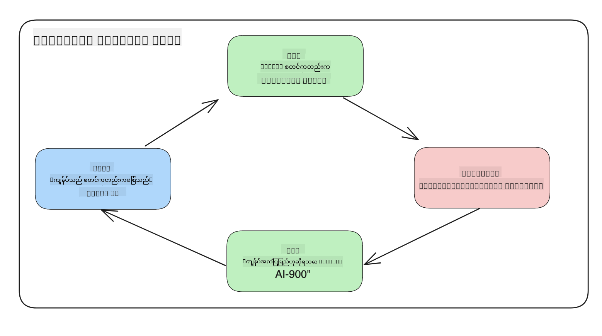
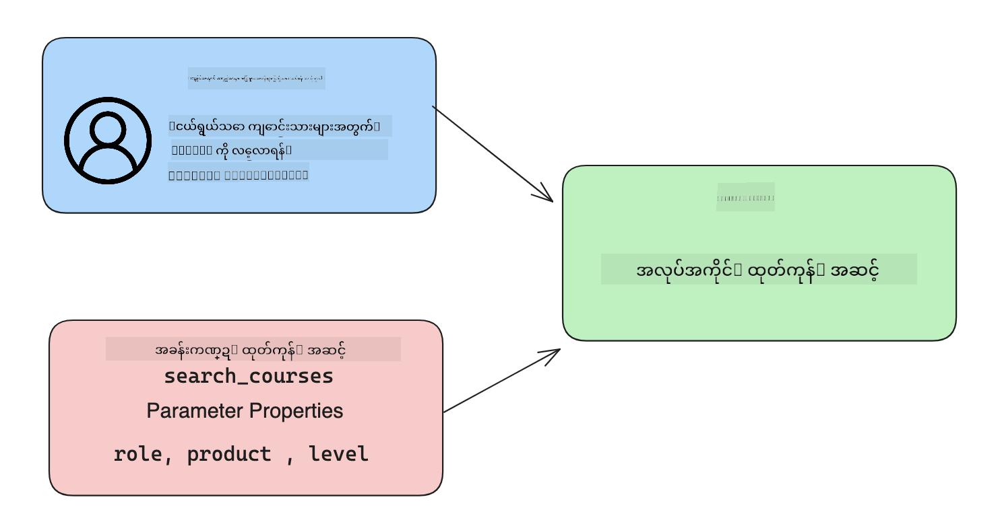

<!--
CO_OP_TRANSLATOR_METADATA:
{
  "original_hash": "77a48a201447be19aa7560706d6f93a0",
  "translation_date": "2025-07-09T14:46:36+00:00",
  "source_file": "11-integrating-with-function-calling/README.md",
  "language_code": "my"
}
-->
# function calling နှင့် ပေါင်းစပ်ခြင်း

[](https://aka.ms/gen-ai-lesson11-gh?WT.mc_id=academic-105485-koreyst)

ယခင်သင်ခန်းစာများတွင် သင်ယူထားသည့် အချက်အလက်များ များပြားပြီးဖြစ်သည်။ သို့သော် ကျွန်ုပ်တို့သည် ပိုမိုတိုးတက်အောင် ပြုလုပ်နိုင်ပါသည်။ တချို့ ပြဿနာများမှာ တုံ့ပြန်မှု ပုံစံကို ပိုမိုတိကျစေရန်နှင့် တုံ့ပြန်မှုကို နောက်ပိုင်းတွင် လွယ်ကူစွာ အသုံးပြုနိုင်ရန် ဖြစ်သည်။ ထို့အပြင် အခြားအရင်းအမြစ်များမှ ဒေတာများကို ထည့်သွင်း၍ ကျွန်ုပ်တို့၏ အက်ပလီကေးရှင်းကို ပိုမိုတိုးတက်စေလိုနိုင်ပါသည်။

အထက်ဖော်ပြပါ ပြဿနာများကို ဤအခန်းတွင် ဖြေရှင်းရန် ရည်ရွယ်ထားပါသည်။

## နိဒါန်း

ဤသင်ခန်းစာတွင် ပါဝင်မည့်အကြောင်းအရာများမှာ -

- function calling ဆိုတာဘာလဲ၊ ၎င်း၏ အသုံးပြုမှုများကို ရှင်းပြခြင်း။
- Azure OpenAI ကို အသုံးပြု၍ function call တစ်ခု ဖန်တီးခြင်း။
- function call ကို အက်ပလီကေးရှင်းထဲတွင် ပေါင်းစပ်ခြင်း။

## သင်ယူရမည့် ရည်မှန်းချက်များ

ဤသင်ခန်းစာပြီးဆုံးသည်နှင့်အတူ -

- function calling ကို အသုံးပြုရခြင်း၏ ရည်ရွယ်ချက်ကို ရှင်းပြနိုင်မည်။
- Azure OpenAI Service ဖြင့် Function Call ကို စတင်တပ်ဆင်နိုင်မည်။
- သင့်အက်ပလီကေးရှင်း၏ အသုံးပြုမှုအတွက် ထိရောက်သော function calls များကို ဒီဇိုင်းဆွဲနိုင်မည်။

## အခြေအနေ - functions ဖြင့် chatbot ကို တိုးတက်အောင်လုပ်ခြင်း

ဤသင်ခန်းစာအတွက် ကျွန်ုပ်တို့သည် ပညာရေး စတားတပ်တစ်ခုအတွက် အသုံးပြုသူများကို နည်းပညာသင်တန်းများ ရှာဖွေရန် chatbot ကို အသုံးပြုခွင့်ပြုသော လုပ်ဆောင်ချက်တစ်ခု ဖန်တီးလိုပါသည်။ အသုံးပြုသူ၏ ကျွမ်းကျင်မှုအဆင့်၊ လက်ရှိရာထူးနှင့် စိတ်ဝင်စားသော နည်းပညာအရ သင့်တော်သော သင်တန်းများကို အကြံပြုပေးမည်ဖြစ်သည်။

ဤအခြေအနေကို ပြည့်စုံစွာ ပြုလုပ်ရန်အတွက် -

- `Azure OpenAI` ကို အသုံးပြု၍ အသုံးပြုသူအတွက် စကားပြောအတွေ့အကြုံ ဖန်တီးခြင်း။
- `Microsoft Learn Catalog API` ကို အသုံးပြု၍ အသုံးပြုသူ၏ တောင်းဆိုချက်အရ သင်တန်းများ ရှာဖွေရန် ကူညီခြင်း။
- `Function Calling` ကို အသုံးပြု၍ အသုံးပြုသူ၏ မေးခွန်းကို function သို့ ပို့ပြီး API တောင်းဆိုမှု ပြုလုပ်ခြင်း။

စတင်ရန်အတွက် function calling ကို ဘာကြောင့် အသုံးပြုလိုသလဲဆိုတာ ကြည့်ကြရအောင် -

## function calling ကို ဘာကြောင့် အသုံးပြုသနည်း

function calling မတိုင်မီ LLM မှ တုံ့ပြန်ချက်များမှာ ဖွဲ့စည်းမှုမရှိဘဲ မတူညီမှုများ ရှိခဲ့သည်။ ဖန်တီးသူများသည် တုံ့ပြန်ချက် မျိုးစုံကို ကိုင်တွယ်နိုင်ရန် အတော်လေးရှုပ်ထွေးသော စစ်ဆေးရေး ကုဒ်များ ရေးသားရသည်။ အသုံးပြုသူများသည် "Stockholm ၏ လက်ရှိရာသီဥတု ဘာလဲ?" ကဲ့သို့သော မေးခွန်းများကို ဖြေကြားနိုင်ခြင်း မရှိခဲ့ပါ။ ၎င်းသည် မော်ဒယ်များသည် သင်ကြားထားသည့် ဒေတာအချိန်အတိုင်း ကန့်သတ်ထားသောကြောင့် ဖြစ်သည်။

Function Calling သည် Azure OpenAI Service ၏ လက္ခဏာတစ်ခုဖြစ်ပြီး အောက်ပါ ကန့်သတ်ချက်များကို ကျော်လွှားရန် ရည်ရွယ်သည် -

- **တုံ့ပြန်မှု ပုံစံ တိကျမှု** - တုံ့ပြန်မှု ပုံစံကို ပိုမိုထိန်းချုပ်နိုင်လျှင် နောက်ပိုင်းတွင် အခြားစနစ်များနှင့် ပေါင်းစပ်ရန် ပိုမိုလွယ်ကူသည်။
- **ပြင်ပဒေတာ** - အက်ပလီကေးရှင်း၏ အခြားအရင်းအမြစ်များမှ ဒေတာကို စကားပြောအခြေအနေတွင် အသုံးပြုနိုင်ခြင်း။

## ပြဿနာကို အခြေအနေတစ်ခုမှတဆင့် ရှင်းပြခြင်း

> အောက်ပါ အခြေအနေကို လုပ်ဆောင်လိုပါက [ပါဝင်သော notebook](python/aoai-assignment.ipynb) ကို အသုံးပြုရန် အကြံပြုပါသည်။ သို့မဟုတ် function များက ပြဿနာကို ဘယ်လို ဖြေရှင်းနိုင်သည်ကို ရှင်းပြရန် ကြိုးစားနေသဖြင့် ဖတ်ရှုနိုင်ပါသည်။

တုံ့ပြန်မှု ပုံစံ ပြဿနာကို ရှင်းပြသည့် ဥပမာကို ကြည့်ကြရအောင် -

ကျွန်ုပ်တို့သည် ကျောင်းသား ဒေတာများကို စုစည်းထားသော ဒေတာဘေ့စ်တစ်ခု ဖန်တီးလိုသည်။ ထို့ကြောင့် သင့်တော်သော သင်တန်းများကို အကြံပြုနိုင်မည်ဖြစ်သည်။ အောက်တွင် ကျောင်းသား နှစ်ဦး၏ ဖော်ပြချက်များကို တွဲဖက်ထားပြီး ဒေတာများမှာ ဆင်တူညီသည်။

1. Azure OpenAI resource နှင့် ချိတ်ဆက်မှု တစ်ခု ဖန်တီးပါ -

   ```python
   import os
   import json
   from openai import AzureOpenAI
   from dotenv import load_dotenv
   load_dotenv()

   client = AzureOpenAI(
   api_key=os.environ['AZURE_OPENAI_API_KEY'],  # this is also the default, it can be omitted
   api_version = "2023-07-01-preview"
   )

   deployment=os.environ['AZURE_OPENAI_DEPLOYMENT']
   ```

   အောက်တွင် Azure OpenAI နှင့် ချိတ်ဆက်ရန် Python ကုဒ်တစ်ခု ရှိပြီး `api_type`, `api_base`, `api_version` နှင့် `api_key` ကို သတ်မှတ်ထားသည်။

1. `student_1_description` နှင့် `student_2_description` ဆိုသော variable များဖြင့် ကျောင်းသား ဖော်ပြချက် နှစ်ခု ဖန်တီးခြင်း။

   ```python
   student_1_description="Emily Johnson is a sophomore majoring in computer science at Duke University. She has a 3.7 GPA. Emily is an active member of the university's Chess Club and Debate Team. She hopes to pursue a career in software engineering after graduating."

   student_2_description = "Michael Lee is a sophomore majoring in computer science at Stanford University. He has a 3.8 GPA. Michael is known for his programming skills and is an active member of the university's Robotics Club. He hopes to pursue a career in artificial intelligence after finishing his studies."
   ```

   ကျောင်းသား ဖော်ပြချက်များကို LLM သို့ ပို့၍ ဒေတာကို ခွဲခြမ်းစိတ်ဖြာရန် ရည်ရွယ်သည်။ ဤဒေတာကို နောက်ပိုင်းတွင် အက်ပလီကေးရှင်းတွင် အသုံးပြုနိုင်ပြီး API သို့ ပို့ခြင်း သို့မဟုတ် ဒေတာဘေ့စ်တွင် သိမ်းဆည်းနိုင်သည်။

1. LLM ကို မည်သည့် အချက်အလက်များကို စိတ်ဝင်စားသည်ကို ညွှန်ကြားသည့် prompt နှစ်ခု တူညီစွာ ဖန်တီးခြင်း။

   ```python
   prompt1 = f'''
   Please extract the following information from the given text and return it as a JSON object:

   name
   major
   school
   grades
   club

   This is the body of text to extract the information from:
   {student_1_description}
   '''

   prompt2 = f'''
   Please extract the following information from the given text and return it as a JSON object:

   name
   major
   school
   grades
   club

   This is the body of text to extract the information from:
   {student_2_description}
   '''
   ```

   အထက်ပါ prompt များသည် LLM ကို အချက်အလက်များ ထုတ်ယူပြီး JSON ပုံစံဖြင့် တုံ့ပြန်ရန် ညွှန်ကြားသည်။

1. prompt များနှင့် Azure OpenAI ချိတ်ဆက်မှုကို ပြင်ဆင်ပြီးနောက် `openai.ChatCompletion` ကို အသုံးပြု၍ prompt များကို LLM သို့ ပို့မည်။ `messages` variable တွင် prompt ကို သိမ်းဆည်းပြီး `role` ကို `user` အဖြစ် သတ်မှတ်သည်။ ၎င်းသည် အသုံးပြုသူမှ chatbot သို့ စာတိုက်ပို့ခြင်းကို အတုယူခြင်းဖြစ်သည်။

   ```python
   # response from prompt one
   openai_response1 = client.chat.completions.create(
   model=deployment,
   messages = [{'role': 'user', 'content': prompt1}]
   )
   openai_response1.choices[0].message.content

   # response from prompt two
   openai_response2 = client.chat.completions.create(
   model=deployment,
   messages = [{'role': 'user', 'content': prompt2}]
   )
   openai_response2.choices[0].message.content
   ```

ယခု LLM သို့ တောင်းဆိုမှု နှစ်ခုလုံးကို ပို့ပြီး ရရှိသော တုံ့ပြန်ချက်ကို `openai_response1['choices'][0]['message']['content']` ကဲ့သို့ ရှာဖွေကြည့်နိုင်သည်။

1. နောက်ဆုံးတွင် `json.loads` ကို ခေါ်၍ တုံ့ပြန်ချက်ကို JSON ပုံစံသို့ ပြောင်းနိုင်သည်။

   ```python
   # Loading the response as a JSON object
   json_response1 = json.loads(openai_response1.choices[0].message.content)
   json_response1
   ```

   တုံ့ပြန်ချက် ၁ -

   ```json
   {
     "name": "Emily Johnson",
     "major": "computer science",
     "school": "Duke University",
     "grades": "3.7",
     "club": "Chess Club"
   }
   ```

   တုံ့ပြန်ချက် ၂ -

   ```json
   {
     "name": "Michael Lee",
     "major": "computer science",
     "school": "Stanford University",
     "grades": "3.8 GPA",
     "club": "Robotics Club"
   }
   ```

   prompt များ တူညီပြီး ဖော်ပြချက်များ ဆင်တူသော်လည်း `Grades` အချက်အလက်များသည် မတူညီသော ပုံစံဖြင့် ဖော်ပြထားသည်။ ဥပမာ `3.7` သို့မဟုတ် `3.7 GPA` ကဲ့သို့ ဖြစ်နိုင်သည်။

   ၎င်းရလဒ်သည် LLM သည် ရေးသားထားသော prompt အတိုင်း ဖွဲ့စည်းမှုမရှိသော ဒေတာကို လက်ခံပြီး ထိုပုံစံအတိုင်း တုံ့ပြန်မှုကို ပြန်လည်ပေးသည့်အတွက် ဖြစ်သည်။ ဒေတာကို သိမ်းဆည်းသို့မဟုတ် အသုံးပြုရာတွင် မည်သည့် ပုံစံမျိုးကို မျှော်လင့်ရမည်ကို သိရှိရန် ဖွဲ့စည်းမှုရှိသော ပုံစံလိုအပ်သည်။

ဒါဆို formatting ပြဿနာကို ဘယ်လို ဖြေရှင်းမလဲ? function calling ကို အသုံးပြုခြင်းဖြင့် ဖွဲ့စည်းမှုရှိသော ဒေတာကို ပြန်လည်ရရှိစေမည်။ function calling အသုံးပြုသောအခါ LLM သည် function များကို တိုက်ရိုက် ခေါ်မည် မဟုတ်ပါ။ ၎င်းသည် LLM အတွက် တုံ့ပြန်မှုများအတွက် လိုက်နာရမည့် ဖွဲ့စည်းမှုတစ်ခုကို ဖန်တီးပေးခြင်း ဖြစ်သည်။ ထို့နောက် ထိုဖွဲ့စည်းမှုရှိသော တုံ့ပြန်မှုများကို အသုံးပြု၍ အက်ပလီကေးရှင်းများတွင် မည်သည့် function ကို ခေါ်ရမည်ကို သိရှိနိုင်သည်။



function မှ ပြန်လာသော အချက်အလက်ကို ထပ်မံ LLM သို့ ပို့နိုင်သည်။ LLM သည် အသုံးပြုသူ၏ မေးခွန်းကို သဘာဝဘာသာဖြင့် ဖြေကြားမည်ဖြစ်သည်။

## function calls အသုံးပြုမှု အခြေအနေများ

function calls များသည် သင့်အက်ပလီကေးရှင်းကို တိုးတက်စေမည့် အခြေအနေများစွာရှိသည် -

- **ပြင်ပကိရိယာများ ခေါ်ယူခြင်း** - Chatbot များသည် အသုံးပြုသူ မေးခွန်းများကို ဖြေကြားရာတွင် အထူးကောင်းမွန်သည်။ function calling ကို အသုံးပြု၍ chatbot များသည် အသုံးပြုသူမှ စာများကို အသုံးပြု၍ တာဝန်တစ်ချို့ကို ပြီးမြောက်စေသည်။ ဥပမာ ကျောင်းသားတစ်ဦးသည် chatbot ကို "ကျွန်ုပ်၏ သင်ကြားသူထံ အကူအညီ ပိုမိုလိုအပ်ကြောင်း အီးမေးလ် ပို့ပေးပါ" ဟု မေးနိုင်သည်။ ၎င်းသည် `send_email(to: string, body: string)` function ကို ခေါ်နိုင်သည်။

- **API သို့ ဒေတာဘေ့စ် မေးခွန်းများ ဖန်တီးခြင်း** - အသုံးပြုသူများသည် သဘာဝဘာသာဖြင့် အချက်အလက် ရှာဖွေနိုင်ပြီး ၎င်းကို ဖော်ပြထားသော မေးခွန်း သို့မဟုတ် API တောင်းဆိုမှုအဖြစ် ပြောင်းလဲနိုင်သည်။ ဥပမာ ဆရာတစ်ဦးသည် "နောက်ဆုံးအလုပ်အပ်စာကို ပြီးမြောက်ထားသော ကျောင်းသားများ ဘယ်သူများလဲ?" ဟု မေးနိုင်ပြီး `get_completed(student_name: string, assignment: int, current_status: string)` function ကို ခေါ်နိုင်သည်။

- **ဖွဲ့စည်းထားသော ဒေတာ ဖန်တီးခြင်း** - အသုံးပြုသူများသည် စာသားတစ်ပိုင်း သို့မဟုတ် CSV ကို ယူ၍ LLM ကို အသုံးပြုကာ အရေးကြီးသော အချက်အလက်များကို ထုတ်ယူနိုင်သည်။ ဥပမာ ကျောင်းသားတစ်ဦးသည် Wikipedia တွင် ရှိသော ငြိမ်းချမ်းရေး သဘောတူညီချက်များဆိုင်ရာ ဆောင်းပါးကို AI flashcards ဖန်တီးရန် ပြောင်းလဲနိုင်သည်။ ၎င်းကို `get_important_facts(agreement_name: string, date_signed: string, parties_involved: list)` function ဖြင့် ပြုလုပ်နိုင်သည်။

## သင့် ပထမ function call ဖန်တီးခြင်း

function call ဖန်တီးခြင်း လုပ်ငန်းစဉ်တွင် အဓိက ၃ ခြေလှမ်း ပါဝင်သည် -

1. သင့် function များစာရင်းနှင့် အသုံးပြုသူ စာတိုက်ကို အသုံးပြု၍ Chat Completions API ကို ခေါ်ယူခြင်း။
2. မော်ဒယ်၏ တုံ့ပြန်ချက်ကို ဖတ်ရှု၍ လုပ်ဆောင်ချက် တစ်ခု (function သို့ API call) ပြုလုပ်ခြင်း။
3. သင့် function မှ ရရှိသော တုံ့ပြန်ချက်ဖြင့် ထပ်မံ Chat Completions API ကို ခေါ်ယူကာ အသုံးပြုသူအတွက် တုံ့ပြန်ချက် ဖန်တီးခြင်း။



### ခြေလှမ်း ၁ - messages ဖန်တီးခြင်း

ပထမဆုံး ခြေလှမ်းမှာ အသုံးပြုသူ စာတိုက်တစ်ခု ဖန်တီးခြင်းဖြစ်သည်။ ၎င်းကို စာသားထည့်သွင်းမှုမှ တန်ဖိုးယူ၍ dynamic အဖြစ် သတ်မှတ်နိုင်သလို ဒီမှာ တန်ဖိုးတစ်ခု သတ်မှတ်နိုင်သည်။ Chat Completions API နှင့် ပထမဆုံးအကြိမ် လုပ်ကိုင်ပါက `role` နှင့် `content` ကို သတ်မှတ်ရန် လိုအပ်သည်။

`role` သည် `system` (စည်းကမ်းများ ဖန်တီးခြင်း), `assistant` (မော်ဒယ်), သို့မဟုတ် `user` (အဆုံးသတ် အသုံးပြုသူ) ဖြစ်နိုင်သည်။ function calling အတွက် `user` အဖြစ် သတ်မှတ်ပြီး မေးခွန်း ဥပမာတစ်ခု ထည့်သွင်းမည်။

```python
messages= [ {"role": "user", "content": "Find me a good course for a beginner student to learn Azure."} ]
```

role များကို သတ်မှတ်ခြင်းဖြင့် LLM သည် စနစ်မှ ပြောဆိုနေသည်၊ သို့မဟုတ် အသုံးပြုသူမှ ဖြစ်သည်ကို သိရှိနိုင်ပြီး စကားပြောသမိုင်းကို တည်ဆောက်ရာတွင် အထောက်အကူဖြစ်စေသည်။

### ခြေလှမ်း ၂ - functions ဖန်တီးခြင်း

နောက်တစ်ဆင့်မှာ function တစ်ခုနှင့် ၎င်း၏ parameter များကို သတ်မှတ်မည်။ ဤနေရာတွင် `search_courses` ဆိုသော function တစ်ခုသာ အသုံးပြုမည်ဖြစ်သော်လည်း function များစွာ ဖန်တီးနိုင်သည်။

> **အရေးကြီး** : function များသည် LLM သို့ ပို့သော system message တွင် ပါဝင်ပြီး သင့် token အရေအတွက်တွင် ပါဝင်မည်ဖြစ်သည်။

အောက်တွင် function များကို array အဖြစ် ဖန်တီးထားသည်။ item တစ်ခုစီမှာ function တစ်ခုဖြစ်ပြီး `name`, `description` နှင့် `parameters` ဆိုသော property များ ပါဝင်သည်။

```python
functions = [
   {
      "name":"search_courses",
      "description":"Retrieves courses from the search index based on the parameters provided",
      "parameters":{
         "type":"object",
         "properties":{
            "role":{
               "type":"string",
               "description":"The role of the learner (i.e. developer, data scientist, student, etc.)"
            },
            "product":{
               "type":"string",
               "description":"The product that the lesson is covering (i.e. Azure, Power BI, etc.)"
            },
            "level":{
               "type":"string",
               "description":"The level of experience the learner has prior to taking the course (i.e. beginner, intermediate, advanced)"
            }
         },
         "required":[
            "role"
         ]
      }
   }
]
```

function တစ်ခုစီကို အသေးစိတ် ရှင်းပြပါမည် -

- `name` - ခေါ်ယူလိုသော function အမည်။
- `description` - function ၏ လုပ်ဆောင်ပုံ ဖော်ပြချက်။ ဤနေရာတွင် တိကျရှင်းလင်းစွာ ရေးသားရန် အရေးကြီးသည်။
- `parameters` - မော်ဒယ်၏ တုံ့ပြန်မှုတွင် ထုတ်ပေးရန် တန်ဖိုးများနှင့် ပုံစံစာရင်း။ parameters array တွင် item များရှိပြီး ၎င်းတို့တွင် အောက်ပါ property များ ပါဝင်သည် -
  1. `type` - သိမ်းဆည်းမည့် ဒေတာအမျိုးအစား။
  2. `properties` - မော်ဒယ်၏ တုံ့ပြန်မှုတွင် အသုံးပြုမည့် အချက်အလက်များစာရင်း
     1. `name` - မော်ဒယ်၏ ဖော်ပြချက်တွင် အသုံးပြုမည့် key အမည်၊ ဥပမာ `product`။
     2. `type` - ဤ property ၏ ဒေတာအမျိုးအစား၊ ဥပမာ `string`။
     3. `description` - property
## အလွန်ကောင်းမွန်ပါတယ်! ခရီးကို ဆက်လက်သွားပါ

ဒီသင်ခန်းစာကို ပြီးမြောက်ပြီးနောက်၊ ကျွန်ုပ်တို့ရဲ့ [Generative AI Learning collection](https://aka.ms/genai-collection?WT.mc_id=academic-105485-koreyst) ကို ကြည့်ရှု၍ သင့် Generative AI အသိပညာကို ပိုမိုမြှင့်တင်နိုင်ပါသည်။

Lesson 12 သို့ သွားပါ၊ အဲဒီမှာ ကျွန်ုပ်တို့သည် [AI applications များအတွက် UX ကို ဒီဇိုင်းဆွဲနည်း](../12-designing-ux-for-ai-applications/README.md?WT.mc_id=academic-105485-koreyst) ကို လေ့လာသွားမည်ဖြစ်သည်။

**အကြောင်းကြားချက်**  
ဤစာတမ်းကို AI ဘာသာပြန်ဝန်ဆောင်မှု [Co-op Translator](https://github.com/Azure/co-op-translator) ဖြင့် ဘာသာပြန်ထားပါသည်။ ကျွန်ုပ်တို့သည် တိကျမှန်ကန်မှုအတွက် ကြိုးစားသော်လည်း အလိုအလျောက် ဘာသာပြန်ခြင်းတွင် အမှားများ သို့မဟုတ် မှားယွင်းချက်များ ပါဝင်နိုင်ကြောင်း သတိပြုပါရန် မေတ္တာရပ်ခံအပ်ပါသည်။ မူရင်းစာတမ်းကို မိမိဘာသာစကားဖြင့်သာ တရားဝင်အချက်အလက်အဖြစ် ယူဆသင့်ပါသည်။ အရေးကြီးသော အချက်အလက်များအတွက် လူ့ဘာသာပြန်ပညာရှင်မှ ဘာသာပြန်ခြင်းကို အကြံပြုပါသည်။ ဤဘာသာပြန်ချက်ကို အသုံးပြုရာမှ ဖြစ်ပေါ်လာနိုင်သည့် နားလည်မှုမှားယွင်းမှုများအတွက် ကျွန်ုပ်တို့သည် တာဝန်မခံပါ။