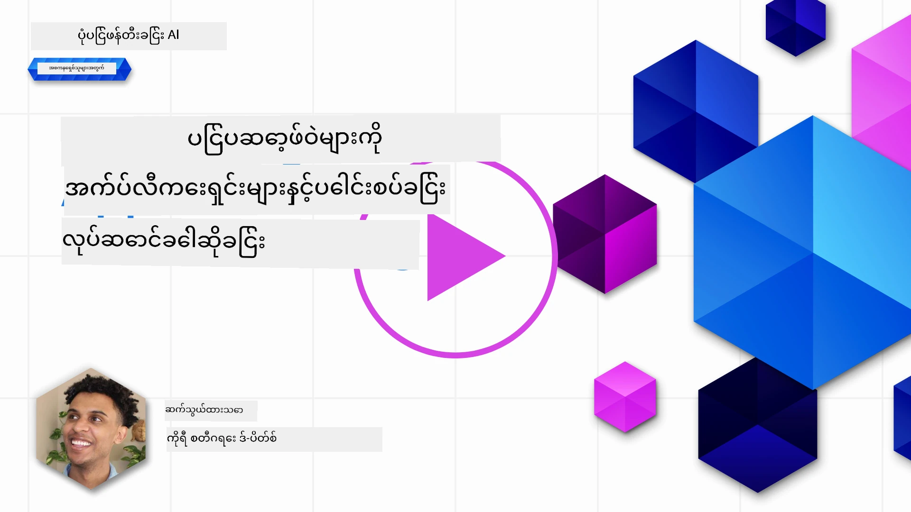
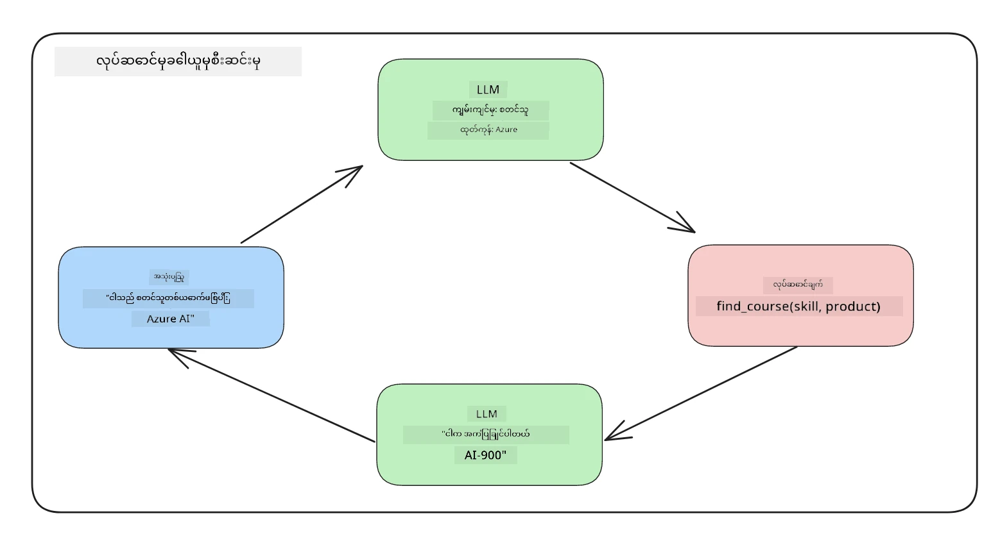
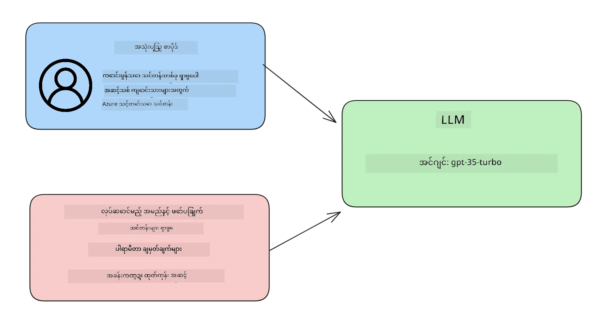

# function calling နှင့်ပေါင်းစည်းခြင်း

[](https://youtu.be/DgUdCLX8qYQ?si=f1ouQU5HQx6F8Gl2)

အခုထိ သင်ယူခဲ့သော သင်ခန်းစာများတွင် အတော်လေးသိရှိထားပါပြီ။ သို့သော်၊ များစွာတိုးတက်စေရန်အတွက် ကျွန်ုပ်တို့လုပ်နိုင်သည်။ တချို့သောအရာများမှာ တုံ့ပြန်ချက်ကို ပိုမိုတိကျစေရန် အဖြေရှင်း ပုံစံကို ပုံမှန်တည်ရှိစေရန်နှင့် တုံ့ပြန်ချက်ကို အောက်တွင် သုံးစွဲရာတွင် ပိုမိုလွယ်ကူစေရန်ဖြစ်သည်။ ထို့အပြင် ကျွန်ုပ်တို့၏ application ကို ပိုမိုတိုးတက်အောင် ဘက်သုံးတစ်ချို့မှ ဒေတာများ ထည့်သွင်းချင်နိုင်ပါသည်။

အထက်ဖော်ပြပါပြဿနာများကို ဤအခန်းသည် ဖြေရှင်းရန် လေ့လာမည်ဖြစ်သည်။

## နိဒါန်း

ဤသင်ခန်းစာ၌ လေ့လာရသောအကြောင်းအရာများမှာ -

- function calling ဆိုတာဘာလဲ နှင့် ၎င်း၏ အသုံးပြုမှုများကို ရှင်းပြခြင်း။
- Azure OpenAI ကို အသုံးပြုပြီး function call တည်ဆောက်ခြင်း။
- application အတွင်းသို့ function call ကို ပေါင်းစည်းခြင်း။

## သင်ယူရန်ရည်မှန်းချက်များ

ဤသင်ခန်းစာ ပြီးဆုံးချိန်တွင် သင်သည်

- function calling ကို အသုံးပြုရသည့် ရည်ရွယ်ချက်ကို ရှင်းပြ လိုနိုင်မည်။
- Azure OpenAI Service အသုံးပြုပြီး Function Call ကို စနစ်တက် ပြင်ဆင်နိုင်မည်။
- သင့် application အသုံးပြုမှုအတွက် ထိရောက်သော function call များကို ဒီဇိုင်း ဆွဲနိုင်မည်။

## ပုံစံ: function များဖြင့် chatbot ကို တိုးတက်စေခြင်း

ဤသင်ခန်းစာအတွက် ကျွန်ုပ်တို့သည် ပညာရေးစတားတပ်၏ အသုံးပြုသူများအတွက် နည်းပညာသင်ခန်းစာများကို ရှာဖွေဖော်ပြနိုင်သော chatbot အပြုလုပ်မှုကို တည်ဆောက်လိုပါသည်။ အသုံးပြုသူ၏ ကျွမ်းကျင်မှုအဆင့်၊ လက်ရှိ အလုပ်တာဝန် နှင့် စိတ်ဝင်စားရာ နည်းပညာ အခြေခံ၍ သင်ခန်းစာများကို အကြံပြုရမည်။

ဒီပုံစံကို ပြီးစီးရန် -

- `Azure OpenAI` ကို အသုံးပြုပြီး အသုံးပြုသူအတွက် chat အတွေ့အကြုံ တည်ဆောက်မည်။
- `Microsoft Learn Catalog API` ကို အသုံးပြုပြီး အသုံးပြုသူ၏ တောင်းဆိုမှုအရ သင်ခန်းစာများ ရှာဖွေဖော်ပြရန်။
- `Function Calling` ကို အသုံးပြုပြီး အသုံးပြုသူ၏ မေးခွန်းကို function သို့ ပေးပို့က API တောင်းဆိုမှု ပြုလုပ်မည်။

စတင်ရန် function calling ကို ဘာကြောင့် အသုံးပြုလိုသနည်းဆိုတာကို ကြည့်ကြမည်။

## function calling ကို ဘာကြောင့် အသုံးပြုသနည်း

function calling မရှိခင်၊ LLM က မထုံးစံတကျ မရှိသော စနစ်မရှိသော အတွက် တုံ့ပြန်မှုများ ပေးသည်။ ဖန်တီးသူများသည် တုံ့ပြန်မှု အမျိုးမျိုးကို ကိုင်တွယ်နိုင်အောင် ရိုးရှင်းမျိုး မဟုတ်သော စစ်ဆေးရေး ကုဒ်များ ရေးသားရန် လိုအပ်သည်။ အသုံးပြုသူများသည် "Stockholm မှ လတ်တလောရာသီဥတု ဘာလဲ?" ဆိုသည့် မေးခွန်းများကို မရရှိနိုင်ပါ။ ၎င်းသည် မော်ဒယ်များသည် သင်ကြားထားသော အချိန်အတိုင်းက အချက်အလက်များအတွင်း သီးထုတ်မည် ဖြစ်သောကြောင့်။

Function Calling သည် Azure OpenAI Service ၏ အင်္ဂါရပ်တစ်ခုဖြစ်ပြီး အောက်ပါ ကန့်သတ်ချက်များကို ကျော်လွှားရန် ရည်ရွယ်သည် -

- **တုံ့ပြန်မှု ပုံစံသည် စနစ်တကျ ဖြစ်ခြင်း**။ ကျွန်ုပ်တို့သည် တုံ့ပြန်ချက် ပုံစံကို ပိုမိုထိန်းချုပ်လို့ရလျှင်၊ တုံ့ပြန်ချက်ကို အခြား စနစ်များသို့ ပိုမိုလွယ်ကူစွာ ပေါင်းစည်းနိုင်မည်။
- **ပြင်ပ ဒေတာများ**။ application ၏ အခြား မှတ်တမ်းများမှ ဒေတာကို chat context တွင် အသုံးပြုနိုင်ခြင်း။

## ပြဿနာကို ပုံတွေအားဖြင့် ဖော်ပြခြင်း

> အောက်ပါ ပုံစံကို ပြုလုပ်လိုပါက [ပါဝင်သော notebook](./python/aoai-assignment.ipynb?WT.mc_id=academic-105485-koreyst) ကိုအသုံးပြုရန် အကြံပြုပါသည်။ မဟုတ်ရင် ပြဿနာကို ပုံနှိပ်ထဲ မှဖတ်ရှုနိုင်သည်။

တုံ့ပြန်ချက် ပုံစံပြဿနာကို ဖော်ပြသော ဥပမာကို ကြည့်ကြမည်။

ကျွန်ုပ်တို့သည် ကျောင်းသားဒေတာ၏ ဒေတာဘေ့စ်တစ်ခု ဖန်တီးလိုပြီး၊ သင့်တော်သော သင်ခန်းစာကို ကမ်းလှမ်းရန် ဖြစ်ကြောင်း။ အောက်တွင် အကြောင်းအရာတူညီသော ကျောင်းသား အသေးစိတ်ရာနှစ်ခု ရှိပါသည်။

1. Azure OpenAI resource ဖြင့် ချိတ်ဆက်မှု တည်ဆောက်ပါ။

   ```python
   import os
   import json
   from openai import AzureOpenAI
   from dotenv import load_dotenv
   load_dotenv()

   client = AzureOpenAI(
   api_key=os.environ['AZURE_OPENAI_API_KEY'],  # ၎င်းသည်လည်း ပုံမှန်တန်ဖိုးဖြစ်ပြီး ဖျက်သိမ်းနိုင်သည်။
   api_version = "2023-07-01-preview"
   )

   deployment=os.environ['AZURE_OPENAI_DEPLOYMENT']
   ```

   အောက်တွင် Python ကုဒ်ကို Azure OpenAI ဖြင့် ချိတ်ဆက်မှုကို `api_type`, `api_base`, `api_version` နှင့် `api_key` ကို သတ်မှတ်ထားသည်။

1. `student_1_description` နှင့် `student_2_description` စသော နှစ်ခု ကျောင်းသား ဖေါ်ပြချက်များ ဖန်တီးခြင်း။

   ```python
   student_1_description="Emily Johnson is a sophomore majoring in computer science at Duke University. She has a 3.7 GPA. Emily is an active member of the university's Chess Club and Debate Team. She hopes to pursue a career in software engineering after graduating."

   student_2_description = "Michael Lee is a sophomore majoring in computer science at Stanford University. He has a 3.8 GPA. Michael is known for his programming skills and is an active member of the university's Robotics Club. He hopes to pursue a career in artificial intelligence after finishing his studies."
   ```

   ကျောင်းသား ဖေါ်ပြချက်များကို LLM သို့ ပေးပို့၍ ဒေတာကို ခွဲခြမ်းစိတ်ဖြာရန် ရည်ရွယ်သည်။ ဤဒေတာကို နောက်ပိုင်း application တွင် အသုံးပြုနိုင်ပြီး API သို့ ပို့ခြင်း သို့မဟုတ် ဒေတာဘေ့စ်တွင် သိမ်းဆည်းနိုင်သည်။

1. LLM တွင် ရရှိနိုင်သော သတင်းအချက်အလက် များကို ထုတ်ပါရန် နှစ်ဆ prompt တူညီသော ကိုဖန်တီးခြင်း။

   ```python
   prompt1 = f'''
   Please extract the following information from the given text and return it as a JSON object:

   name
   major
   school
   grades
   club

   This is the body of text to extract the information from:
   {student_1_description}
   '''

   prompt2 = f'''
   Please extract the following information from the given text and return it as a JSON object:

   name
   major
   school
   grades
   club

   This is the body of text to extract the information from:
   {student_2_description}
   '''
   ```

   အထက်တွင် ဖော်ပြထားသော prompt များအရ LLM သည် သတင်းအချက်အလက် ထုတ်ယူပြီး JSON ပုံစံဖြင့် ပြန်လည်ပေးပို့ရန် ဆောင်ရွက်သည်။

1. prompt များနှင့် Azure OpenAI နှင့် ချိတ်ဆက်မှုကို စုပ်ယူပြီးနောက် `openai.ChatCompletion` ကို အသုံးပြုပြီး prompt များကို LLM သို့ ပေးပို့မည်။ `messages` ထဲတွင် prompt ကို သိမ်းဆည်းပြီး role ကို `user` အဖြစ် သတ်မှတ်သည်။ ဤသည်မှာ အသုံးပြုသူမှ ပို့သော စာသားကို chatbot သို့ တင်သွင်းခြင်းဖြစ်သည်။

   ```python
   # ပထမရွေ့ခြားမှ တုံ့ပြန်ချက်
   openai_response1 = client.chat.completions.create(
   model=deployment,
   messages = [{'role': 'user', 'content': prompt1}]
   )
   openai_response1.choices[0].message.content

   # ဒုတိယရွေ့ခြားမှ တုံ့ပြန်ချက်
   openai_response2 = client.chat.completions.create(
   model=deployment,
   messages = [{'role': 'user', 'content': prompt2}]
   )
   openai_response2.choices[0].message.content
   ```

LLM သို့ နှစ်ခုလုံး တောင်းဆိုမှုများ ပေးပို့ပြီး `openai_response1['choices'][0]['message']['content']` ကဲ့သို့ ရရှိသော တုံ့ပြန်ချက်ကို ပြန်ကြည့်နိုင်သည်။

1. နောက်ဆုံးတွင် `json.loads` ကိုခေါ်၍ တုံ့ပြန်ချက်ကို JSON ပုံစံသို့ ပြောင်းနိုင်သည်။ 

   ```python
   # တုံ့ပြန်မှုကို JSON အوبيဂျက်အဖြစ်တင်နေသည်
   json_response1 = json.loads(openai_response1.choices[0].message.content)
   json_response1
   ```

   တုံ့ပြန်ချက် ၁:

   ```json
   {
     "name": "Emily Johnson",
     "major": "computer science",
     "school": "Duke University",
     "grades": "3.7",
     "club": "Chess Club"
   }
   ```

   တုံ့ပြန်ချက် ၂:

   ```json
   {
     "name": "Michael Lee",
     "major": "computer science",
     "school": "Stanford University",
     "grades": "3.8 GPA",
     "club": "Robotics Club"
   }
   ```

   prompt များသည် တူညီပြီး ဖော်ပြချက်များသည် အလားတူသော်လည်း `Grades` အချက်အလက် ကို ထုတ်ပြန်သည့် ပုံစံသည် ကွဲပြားသည်။ ဥပမာ `3.7` သို့မဟုတ် `3.7 GPA` ကဲ့သို့ ဖြစ်တတ်သည်။

   ၎င်းရလဒ်သည် LLM သည် ရေးသားထားသော prompt အတိုင်း မဟာမိတ်မရှိသော ဒေတာအား လက်ခံပြီး မဟာမိတ်မရှိသောဒေတာအဖြစ် ပြန်လည်ထုတ်ပြန်သည်။ ကျွန်ုပ်တို့သည် ဖွဲ့စည်းထားသော ပုံစံရှိရမည်၊ ထိုဒေတာကို သိမ်းဆည်းသို့ ဘာသာပြန်သည့်အခါ မျှော်မှန်းချက်ရှိရမည်။

ထို့ကြောင့် ဖော်မတ်ရေးပုံပြဿနာကို လွယ်ကူစွာ ဖြေရှင်းရန် ဘာလုပ်ရမည်နည်း? function calling ကို အသုံးပြုပြီး ဖွဲ့စည်းထားသော ဒေတာကို ပြန်လည်ရရှိမည်ဖြစ်သည်။ function calling အသုံးပြုသောအခါ LLM သည် function များကို တိုက်ရိုက်ခေါ်လိုက်ခြင်း သို့မဟုတ် chạy လုပ်မှု မပြုလုပ်ပေ။ ပြီးတော့ LLM ၏ တုံ့ပြန်ချက်များအတွက် ဖွဲ့စည်းထားသော ပုံစံကို ဖန်တီးပြီး၊ သုံးစွဲသူ၏ application တွင် မည်သည့် function သုံးရမည်ကို သိသည်။



အဲဒီ function မှ ပြန်လာသော ကိစ္စများကို ထပ်မံ LLM သို့ ပေးပို့နိုင်သည်။ LLM သည် ယနေ့ဘာသာစကားဖြင့် အသုံးပြုသူ၏ မေးခွန်းကို ဖြေဆိုသွားမည်။

## function calls ကို အသုံးပြုရန် အသုံးပြုမှု ကိစ္စများ

function calls သည် အမျိုးမျိုးသော အသုံးပြုမှုများရှိပြီး အက်ပ်များကို တိုးတက်စေရန် အောက်ပါ အခြေအနေများတွင် အသုံးပြုနိုင်သည် -

- **ပြင်ပ ကိရိယာများကို ခေါ်ယူခြင်း**။ Chatbots များသည် အသုံးပြုသူ မေးခွန်းများကို ဖြေဆိုရာ၌ အထူးကောင်းမွန်သည်။ function calling အသုံးပြုပြီး chatbots များသည် အသုံးပြုသူမှ စာသားများအား အသုံးပြုကာ မိမိလုပ်ဆောင်ရမည့် တာဝန်အချို့ကို ပြီးမြောက်အောင် ပြုလုပ်နိုင်သည်။ ဥပမာ ကျောင်းသားတစ်ဦးသည် chatbot သို့ "ကျွန်ုပ်၏ သင်ကြားသူထံ အကူအညီပိုလိုသည်ဟု အီးမေးလ် ပို့ပေးပါ။" ဆိုသည်။ ဒါကြောင့် function call များတွင် `send_email(to: string, body: string)` ကို ခေါ်နိုင်သည်။

- **API သို့ ဒေတာဘေ့စ် စုံစမ်းမှု ဖန်တီးခြင်း**။ အသုံးပြုသူများသည် ဆက်စပ် သဘာဝဘာသာစကား အသုံးပြု၍ ဖော်ပြချက် သို့မဟုတ် API တောင်းဆိုမှု တူညီပုံစံ သို့ ပြောင်းနိုင်သည်။ ဥပမာ ဆရာတစ်ဦးက "နောက်ဆုံးအလုပ်ကို အပြီးသတ်သော ကျောင်းသားများ ဘယ်သူများလဲ?" ဟု တောင်းဆို၍ `get_completed(student_name: string, assignment: int, current_status: string)` ဟူသော function ကို ခေါ်နိုင်သည်။

- **ဖွဲ့စည်းထားသော ဒေတာ ဖန်တီးခြင်း**။ အသုံးပြုသူသည် စာသားတစ်ပိုင်း သို CSV ကို LLM သုံး၍ အရေးကြီးသတင်းအချက်အလက်ထုတ်ယူနိုင်သည်။ ဥပမာ ကျောင်းသားသည် Wikipedia တွင် ဖော်ပြထားသော ငြိမ်းချမ်းမှု သဘောတူစာချုပ်ဆိုင်ရာ ဆောင်းပါးကို AI flashcards ဖန်တီးရန် ပြောင်းနိုင်သည်။ ဤသည်ကို `get_important_facts(agreement_name: string, date_signed: string, parties_involved: list)` ဆို function အသုံးပြုပြီး ပြုလုပ်နိုင်သည်။

## ပထမ function call ဖန်တီးခြင်း

function call တစ်ခု ဖန်တီးရန် လုပ်ငန်းစဉ်မှာ အဆင့် ၃ ခုပင်ပါဝင်သည် -

1. function များစာရင်းနှင့် အသုံးပြုသူစာသားတစ်ခု ဖြင့် Chat Completions API ကို ခေါ်သုံးခြင်း။
2. မော်ဒယ်၏ တုံ့ပြန်ချက်ကို ဖတ်ရှု၍ သက်ဆိုင်ရာ လုပ်ဆောင်မှုတစ်ခု ပြုလုပ်ခြင်း - function သို့ API ခေါ်ခြင်း။
3. function ၏ တုံ့ပြန်ချက်ဖြင့် Chat Completions API သို့ ထပ်မံသွားပြီး အသုံးပြုသူအတွက် တုံ့ပြန်ချက်ပြုစုခြင်း။



### အဆင့် ၁ - မက်ဆေ့ခ်ျ ဖန်တီးခြင်း

ပထမအဆင့်မှာ အသုံးပြုသူစာသားဖန်တီးခြင်း ဖြစ်သည်။ ဤသည်ကို စာသား အင်ပुटတစ်ခုမှ တန်ဖိုး ယူ၍ ချိန်ညှိနိုင်ပြီးရော ဒီနေရာတွင် တန်ဖိုး သတ်မှတ်နိုင်သည်။ Chat Completions API ကို ပထမဆုံး သုံးစဥ်က `role` နှင့် `content` ကို သတ်မှတ်ရမည်။

`role` သည် `system` (စည်းမျဉ်းပြုခြင်း), `assistant` (မော်ဒယ်), သို့မဟုတ် `user` (နောက်ဆုံး အသုံးပြုသူ) ဖြစ်နိုင်သည်။ function calling အတွက် `user` နှင့် ဥပမာမေးခွန်းတစ်ခုကို သတ်မှတ်မည်။

```python
messages= [ {"role": "user", "content": "Find me a good course for a beginner student to learn Azure."} ]
```
  
role များကို ကွဲပြားသတ်မှတ်ခြင်းအားဖြင့် LLM သို့ စနစ်ဖြစ်သူ၏ စာသားဖြစ်သလား၊ အသုံးပြုသူ၏ စာသားဖြစ်သလား ကို ဖော်ပြသည်၊ ၎င်းက conversation history အပေါ် မော်ဒယ်ကို လိုက်လံတည်ဆောက်ရန်ကူညီသည်။

### အဆင့် ၂ - function များ ဖန်တီးခြင်း

နောက်တစ်ဆင့်တွင် function နှင့် ၎င်း၏ parameter များ သတ်မှတ်မည်။ ဒီနေရာ၌ `search_courses` ဟူသော function တစ်ခုသာ သုံးမည်၊ ဒါပေမယ့် functions များ များစွာ ဖန်တီးနိုင်သည်။

> **အရေးပါချက်** : functions များသည် LLM ၏ system message ထဲတွင် ပါဝင်ပြီး သင့်တွင် ရနိုင်သော token အရေအတွက် အတွင်း ပါဝင်သည်။

အောက်တွင် functions များကို array အဖြစ် ဖန်တီးထားသည်။ အချင်းချင်း item တစ်ခုချင်းစီမှာ function ဖြစ်ပြီး `name`, `description` နှင့် `parameters` ၊ အကျဉ်းကို ပါဝင်သည် -

```python
functions = [
   {
      "name":"search_courses",
      "description":"Retrieves courses from the search index based on the parameters provided",
      "parameters":{
         "type":"object",
         "properties":{
            "role":{
               "type":"string",
               "description":"The role of the learner (i.e. developer, data scientist, student, etc.)"
            },
            "product":{
               "type":"string",
               "description":"The product that the lesson is covering (i.e. Azure, Power BI, etc.)"
            },
            "level":{
               "type":"string",
               "description":"The level of experience the learner has prior to taking the course (i.e. beginner, intermediate, advanced)"
            }
         },
         "required":[
            "role"
         ]
      }
   }
]
```

function တစ်ခုစီ၏အသေးစိတ်ဖော်ပြချက်မှာ -

- `name` - ခေါ်သုံးလိုသော function ၏ အမည်။
- `description` - function ၏ လုပ်ဆောင်ချက်ကို ဖော်ပြခြင်း။
- `parameters` - မော်ဒယ်၏ တုံ့ပြန်ချက်တွင် ထုတ်ပြန်ချင်သည့် အကျဉ်းအပေါ် ငါးနင်းများပါဝင်သည်။ `parameters` array တွင် -

  1. `type` - သိမ်းဆည်းမည့် ဒေတာအမျိုးအစား။
  2. `properties` - မော်ဒယ်အတွက် ဖြေကြားချက်ထဲ အသုံးပြုမည့် သတ်မှတ်တန်ဖိုးများ ပါဝင်သည်။
     1. `name` - property ၏ သတ်မှတ်ထားသော အမည်၊ ဥပမာ `product`။
     2. `type` - property ၏ ဒေတာအမျိုးအစား၊ ဥပမာ `string`။
     3. `description` - property အကြောင်းဖော်ပြချက်။

`required` ဆိုသော နိုင်ငံရေး အချက်အလက် တစ်ခုလည်း ရှိပြီး function call  အပြီးသတ်ရန်  လိုအပ်သည့် property ကို သတ်မှတ်သည်။

### အဆင့် ၃ - function call ပြုလုပ်ခြင်း

function တစ်ခု သတ်မှတ်ပြီးနောက် Chat Completion API သို့ ထည့်သွင်းရန် လိုအပ်သည်။ `functions` ကို တောင်းဆိုမှုတွင် ထည့်သွင်းခြင်းဖြစ်ပြီး ၎င်းမှာ `functions=functions` ဖြစ်သည်။

`function_call` ကို `auto` အဖြစ် သတ်မှတ်နိုင်သည်။ ၎င်းသည် အသုံးပြုသူစာသားအပေါ် မူတည်၍ မော်ဒယ်ကို function ကို ဘယ်တစ်ခုခေါ်မည်ကို ဆုံးဖြတ်ခွင့် ပေးသည်။ ကိုယ်တိုင် သတ်မှတ်မှု မရှိပါ။

အောက်တွင် `ChatCompletion.create` ကို ခေါ်သည့် ကုဒ် အပိုင်းရှိပြီး `functions=functions`, `function_call="auto"` ဖြစ်ပြီး LLM ကို function များ အချိန်များစွာခေါ်ခွင့်ပေးသည် -

```python
response = client.chat.completions.create(model=deployment,
                                        messages=messages,
                                        functions=functions,
                                        function_call="auto")

print(response.choices[0].message)
```

ပြန်လာသော တုံ့ပြန်ချက် -

```json
{
  "role": "assistant",
  "function_call": {
    "name": "search_courses",
    "arguments": "{\n  \"role\": \"student\",\n  \"product\": \"Azure\",\n  \"level\": \"beginner\"\n}"
  }
}
```

function `search_courses` ကို ဘယ်လို ခေါ်ခဲ့ပြီး ၎င်း၏ `arguments` property တွင် ဘာတွေ ထည့်ထားသနည်း စသည်ပြသသည်။

LLM သည် `messages` parameter ထဲ ရှိ တန်ဖိုးမှ ဒေတာ ထုတ်ယူပြီး function ၏ arguments ကို ဖြည့်စွက်ထားသည်။ `messages` တန်ဖိုးကို ပြန်လည်ယေဘုယျ ပြောရမယ် -

```python
messages= [ {"role": "user", "content": "Find me a good course for a beginner student to learn Azure."} ]
```

အားလုံးမှတ်သားနိုင်သောအချက်မှာ `student`၊ `Azure` နှင့် `beginner` ကို `messages` မှထုတ်ယူပြီး function အတွက် input အဖြစ်သတ်မှတ်ထားသည်။ function များဖြင့် ၎င်းအတိုင်း prompt မှ သတင်းအချက်အလက် ထုတ်ယူသည့်နည်းတစ်ခုဖြစ်ပြီး function ဖြစ်စေရန် မော်ဒယ်ကို ဖွဲ့စည်းပုံပေးသည်။

နောက်တစ်ခု နောက်တစ်ကြိမ် အသုံးပြုခြင်းအတွက် နည်းလမ်းကြည့်ရမည်။

## function call များ application တွင်ပေါင်းစည်းခြင်း

LLM မှ ဖော်မတ်ထားသော တုံ့ပြန်ချက်ကို စမ်းသပ်ပြီးနောက် application ထဲသို့ ပေါင်းစည်းမည်။

### လည်ပတ်မှု စီမံခန့်ခွဲခြင်း

application တွင် ပေါင်းစည်းရန်အတွက် အောက်ပါ လုပ်ဆောင်ချက်များကို လုပ်ဆောင်မည် -

1. ပထမဦးစွာ OpenAI service ကို ခေါ်ယူပြီး `response_message` ဆိုသော variable တွင် မက်ဆေ့ခ်ျ သိမ်းမည်။

   ```python
   response_message = response.choices[0].message
   ```

1. ယခု Microsoft Learn API ကို ခေါ်ယူရန် function တစ်ခု သတ်မှတ်မည်။

   ```python
   import requests

   def search_courses(role, product, level):
     url = "https://learn.microsoft.com/api/catalog/"
     params = {
        "role": role,
        "product": product,
        "level": level
     }
     response = requests.get(url, params=params)
     modules = response.json()["modules"]
     results = []
     for module in modules[:5]:
        title = module["title"]
        url = module["url"]
        results.append({"title": title, "url": url})
     return str(results)
   ```

   Python function တစ်ခု အဖြစ် ဖန်တီးမှု၊ `functions` variable တွင် ဖော်ပြထားသော function name များနှင့် ဆက်စပ်သည်။ ထို့အပြင် အချက်အလက် ရယူရန် ပြင်ပ API ခေါ်သော်လည်း ၎င်းမှာ Microsoft Learn API ကို ရှာဖွေရန် အသုံးပြုသည်။

ကောင်းပါပြီ၊ ကျွန်ုပ်တို့သည် `functions` variable များ ဖန်တီးပြီး တူညီသော Python function တစ်ခုလည်း ဖန်တီးလိုက်ပါပြီ၊ Python function ကို LLM နှင့် မူဘေါ်ဒ် ပေါင်းစည်းထားရန် အဘယ်နည်း?

1. Python function ကို ခေါ်ရန်လိုမည်သည် ဟုတ်/မဟုတ် ကြည့်ရန် LLM တုံ့ပြန်ချက်တွင် `function_call` ပါမည်ဟုတ်မဟုတ် စစ်ဆေးသည်။ အောက်တွင် စစ်ဆေးနည်း -

   ```python
   # မော်ဒယ်က function တစ်ခုခေါ်မလား စစ်ဆေးပါ
   if response_message.function_call.name:
    print("Recommended Function call:")
    print(response_message.function_call.name)
    print()

    # function ကိုခေါ်ပါ။
    function_name = response_message.function_call.name

    available_functions = {
            "search_courses": search_courses,
    }
    function_to_call = available_functions[function_name]

    function_args = json.loads(response_message.function_call.arguments)
    function_response = function_to_call(**function_args)

    print("Output of function call:")
    print(function_response)
    print(type(function_response))


    # အကူအညီပြုသူတုံ့ပြန်မှုနှင့် function တုံ့ပြန်မှုကို message များထဲသို့ ထည့်ပါ
    messages.append( # အကူအညီပြုသူ၏ တုံ့ပြန်မှုကို message များထဲသို့ ထည့်ခြင်း
        {
            "role": response_message.role,
            "function_call": {
                "name": function_name,
                "arguments": response_message.function_call.arguments,
            },
            "content": None
        }
    )
    messages.append( # function ၏ တုံ့ပြန်မှုကို message များထဲသို့ ထည့်ခြင်း
        {
            "role": "function",
            "name": function_name,
            "content":function_response,
        }
    )
   ```

   function name နှင့် arguments များကို ထုတ်ယူကာ ခေါ်သည့် function ကို ဖေါ်ပြချက် -

   ```python
   function_to_call = available_functions[function_name]

   function_args = json.loads(response_message.function_call.arguments)
   function_response = function_to_call(**function_args)
   ```

   အောက်တွင် ကိုယ်ရေးအောင်မြင်မှု ထုတ်ပြန်ချက် -

   **ထုတ်ပြန်ချက်**

   ```Recommended Function call:
   {
     "name": "search_courses",
     "arguments": "{\n  \"role\": \"student\",\n  \"product\": \"Azure\",\n  \"level\": \"beginner\"\n}"
   }

   Output of function call:
   [{'title': 'Describe concepts of cryptography', 'url': 'https://learn.microsoft.com/training/modules/describe-concepts-of-cryptography/?
   WT.mc_id=api_CatalogApi'}, {'title': 'Introduction to audio classification with TensorFlow', 'url': 'https://learn.microsoft.com/en-
   us/training/modules/intro-audio-classification-tensorflow/?WT.mc_id=api_CatalogApi'}, {'title': 'Design a Performant Data Model in Azure SQL
   Database with Azure Data Studio', 'url': 'https://learn.microsoft.com/training/modules/design-a-data-model-with-ads/?
   WT.mc_id=api_CatalogApi'}, {'title': 'Getting started with the Microsoft Cloud Adoption Framework for Azure', 'url':
   'https://learn.microsoft.com/training/modules/cloud-adoption-framework-getting-started/?WT.mc_id=api_CatalogApi'}, {'title': 'Set up the
   Rust development environment', 'url': 'https://learn.microsoft.com/training/modules/rust-set-up-environment/?WT.mc_id=api_CatalogApi'}]
   <class 'str'>
   ```

1. အခုကျွန်ုပ်တို့ updated messages ကို LLM သို့ ပို့မည်၊ ၎င်းအတွက် ၎င်း၏ တုံ့ပြန်မှုသည် API JSON ပုံစံမဟုတ်ပဲ သဘာဝဘာသာ ဖြင့် ဖြစ်မည်။

   ```python
   print("Messages in next request:")
   print(messages)
   print()

   second_response = client.chat.completions.create(
      messages=messages,
      model=deployment,
      function_call="auto",
      functions=functions,
      temperature=0
         )  # function response ကို တွေ့မြင်နိုင်သော GPT မှ အသစ်သော တုံ့ပြန်ချက် ရယူပါ


   print(second_response.choices[0].message)
   ```

   **ထုတ်ပြန်ချက်**

   ```python
   {
     "role": "assistant",
     "content": "I found some good courses for beginner students to learn Azure:\n\n1. [Describe concepts of cryptography] (https://learn.microsoft.com/training/modules/describe-concepts-of-cryptography/?WT.mc_id=api_CatalogApi)\n2. [Introduction to audio classification with TensorFlow](https://learn.microsoft.com/training/modules/intro-audio-classification-tensorflow/?WT.mc_id=api_CatalogApi)\n3. [Design a Performant Data Model in Azure SQL Database with Azure Data Studio](https://learn.microsoft.com/training/modules/design-a-data-model-with-ads/?WT.mc_id=api_CatalogApi)\n4. [Getting started with the Microsoft Cloud Adoption Framework for Azure](https://learn.microsoft.com/training/modules/cloud-adoption-framework-getting-started/?WT.mc_id=api_CatalogApi)\n5. [Set up the Rust development environment](https://learn.microsoft.com/training/modules/rust-set-up-environment/?WT.mc_id=api_CatalogApi)\n\nYou can click on the links to access the courses."
   }

   ```

## လေ့ကျင့်ခန်း

Azure OpenAI Function Calling ကို ပိုမိုလေ့လာရန် -

- သင်တန်းသားများ အတွက်ပိုမိုသင့်တော်ဖို့ function ၏ parameter များ ပိုမိုဖန်တီးပါ။
- သင်တန်းသား၏ မူလဘာသာစကားကဲ့သို့ အသေးစိတ် ပိုမိုရယူသည့် function call အမျိုးအစားတစ်ခု ဖန်တီးပါ။
- function call သို့မဟုတ် API call မှ သင့်တော်သော သင်ခန်းစာမရရှိပါက error handling ဖန်တီးပါ။
အကြံပြုချက်- ဒီဒေတာကို ဘယ်လိုနဲ့ ဘယ်မှာရနိုင်မလဲဆိုတာကြည့်ရန် [Learn API reference documentation](https://learn.microsoft.com/training/support/catalog-api-developer-reference?WT.mc_id=academic-105485-koreyst) စာမျက်နှာကို လိုက်နာကြည့်ပါ။

## အထူးကောင်းတယ်! ခရီးကို ဆက်လက်လုပ်ဆောင်ပါ

ဒီအတန်းကိုပြီးမြောက်လျှင် ကျွန်ုပ်တို့ရဲ့ [Generative AI Learning collection](https://aka.ms/genai-collection?WT.mc_id=academic-105485-koreyst) ကို ကြည့်ပြီး သင့် Generative AI အသိပညာကို ဆက်လက်တိုးတက်စေပါ!

Lesson 12 သို့ ရောက်ပြီး ကျွန်ုပ်တို့ [AI အတွက် UX ကို ဒီဇိုင်းဆွဲနည်း](../12-designing-ux-for-ai-applications/README.md?WT.mc_id=academic-105485-koreyst) ကို စူးစမ်းကြည့်ပါ!

---

<!-- CO-OP TRANSLATOR DISCLAIMER START -->
**ပြောကြားချက်**
ဤစာတမ်းကို AI ဘာသာပြန်ဝန်ဆောင်မှု [Co-op Translator](https://github.com/Azure/co-op-translator) အသုံးပြု၍ ဘာသာပြန်ထားပါသည်။ ကျွန်ုပ်တို့သည် တိကျမှန်ကန်မှုအတွက် ကြိုးပမ်းနေသော်လည်း၊ စက်ကိရိယာဘာသာပြန်ခြင်းများတွင် အမှားများ သို့မဟုတ် မှားယွင်းချက်များ ပါဝင်နိုင်ကြောင်း သတိပြုပါရန် လိုအပ်ပါသည်။ မူလစာတမ်းကို မူရင်းဘာသာဖြင့်သာ ယုံကြည်စိတ်ချရသော အချက်အလက်အဖြစ် သတ်မှတ်သင့်သည်။ အရေးကြီးသည့် သတင်းအချက်အလက်များအတွက် ပရော်ဖက်ရှင်နယ် လူသားဘာသာပြန်သူဝန်ဆောင်မှုကို အကြံပြုပါသည်။ ဤဘာသာပြန်ချက်ကို အသုံးပြုခြင်းမှ ဖြစ်ပေါ်လာသော နားလည်မှုကွာခြားမှုများ သို့မဟုတ် မမှန်ကန်သော အသုံးပြုမှုများအတွက် ကျွန်ုပ်တို့ တာဝန်မခံပါ။
<!-- CO-OP TRANSLATOR DISCLAIMER END -->