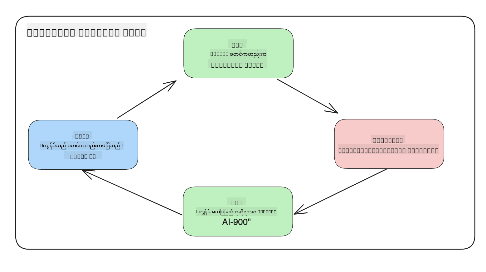
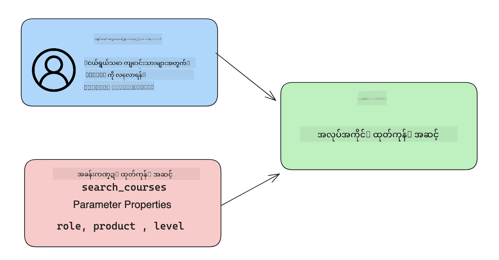

<!--
CO_OP_TRANSLATOR_METADATA:
{
  "original_hash": "77a48a201447be19aa7560706d6f93a0",
  "translation_date": "2025-06-25T20:05:55+00:00",
  "source_file": "11-integrating-with-function-calling/README.md",
  "language_code": "my"
}
-->
# Function Calling ဖြင့် ပေါင်းစပ်ခြင်း

[](https://aka.ms/gen-ai-lesson11-gh?WT.mc_id=academic-105485-koreyst)

ယခင် သင်ခန်းစာများတွင် သင် သိရှိခဲ့ပါပြီ။ သို့သော်လည်း ကျွန်ုပ်တို့ ပိုမိုကောင်းမွန်စေရန် တိုးတက်နိုင်သည်။ ကျွန်ုပ်တို့ လုပ်ဆောင်နိုင်သော အရာများမှာ တုံ့ပြန်မှုကို အလွယ်တကူ စီမံနိုင်ရန် တုံ့ပြန်မှု ဖော်မတ်ကို ပိုမို အပြုံးပြုထားသော အဖြစ်ဖန်တီးခြင်း ဖြစ်သည်။ ထို့အပြင် အခြား အရင်းအမြစ်များမှ ဒေတာများကို ထပ်မံ ထည့်သွင်းခြင်းဖြင့် ကျွန်ုပ်တို့၏ အပလီကေးရှင်းကို ပိုမို ချဲ့ထွင်နိုင်သည်။

အထက်ဖော်ပြပါ ပြဿနာများသည် ဤအခန်းတွင် ကူညီဖြေရှင်းရန် ရည်ရွယ်ထားသည်။

## အကျဉ်းချုပ်

ဒီသင်ခန်းစာမှာ ပါဝင်မှာက:

- Function calling သည် အဘယ်နည်းဆိုသည်ကို ရှင်းပြခြင်းနှင့် ၎င်း၏ အသုံးပြုမှုများ။
- Azure OpenAI ကို အသုံးပြု၍ function call ဖန်တီးခြင်း။
- Function call ကို အပလီကေးရှင်းထဲတွင် ပေါင်းစပ်ခြင်း။

## သင်ယူရမည့် ရည်မှန်းချက်များ

ဒီသင်ခန်းစာပြီးဆုံးသည့်အခါ သင်သည်:

- Function calling ကို အသုံးပြုရခြင်း၏ ရည်ရွယ်ချက်ကို ရှင်းပြနိုင်သည်။
- Azure OpenAI Service ကို အသုံးပြု၍ Function Call ကို စတင်နိုင်သည်။
- သင့်အပလီကေးရှင်း၏ အသုံးပြုမှုအတွက် ထိရောက်သော function calls ကို ဒီဇိုင်းဆွဲနိုင်သည်။

## အခြေအနေ: Functions ဖြင့် ကျွန်ုပ်တို့၏ chatbot ကို တိုးတက်စေရန်

ဒီသင်ခန်းစာအတွက် ကျွန်ုပ်တို့၏ ပညာရေး စတင်လုပ်ငန်းအတွက် အသုံးပြုသူများကို chatbot အသုံးပြု၍ နည်းပညာသင်တန်းများ ရှာဖွေရန် ခွင့်ပြုသော အင်္ဂါရပ်တစ်ခုကို ဖန်တီးလိုပါသည်။ ၎င်းတို့၏ ကျွမ်းကျင်မှုအဆင့်၊ လက်ရှိအခန်းကဏ္ဍနှင့် စိတ်ဝင်စားမှုရှိသော နည်းပညာကို အထောက်အထားပြု၍ သင်တန်းများကို ထောက်ခံပါမည်။

ဤအခြေအနေကို ပြီးစီးရန် ကျွန်ုပ်တို့သည် အောက်ပါအရာများကို ပေါင်းစပ်အသုံးပြုမည်:

- `Azure OpenAI` ကို အသုံးပြု၍ အသုံးပြုသူအတွက် စကားဝိုင်း အတွေ့အကြုံကို ဖန်တီးရန်။
- `Microsoft Learn Catalog API` ကို အသုံးပြုသူ၏ တောင်းဆိုမှုအပေါ် အခြေခံ၍ သင်တန်းများ ရှာဖွေရန် အထောက်အပံ့ပေးရန်။
- `Function Calling` ကို အသုံးပြုသူ၏ မေးခွန်းကို ဖေါ်ထုတ်ပြီး function ကို API တောင်းဆိုမှု လုပ်ရန် ပို့ရန်။

စတင်ရန် ပထမဆုံး function calling ကို အသုံးပြုချင်ရသည့် အကြောင်းအရာကို ကြည့်ပါ:

## Function Calling ဘာလို့ လိုအပ်သလဲ

Function calling မရှိမီ LLM မှ တုံ့ပြန်မှုများသည် ဖွဲ့စည်းမှုမရှိခြင်းနှင့် မတူညီခြင်းရှိခဲ့သည်။ ဖွဲ့စည်းမှုမတူညီသော တုံ့ပြန်မှု တစ်ခုစီကို စီမံနိုင်ရန် ဖွဲ့စည်းမှုရှုပ်ထွေးသော ကုဒ်များကို ဖန်တီးရန် ပရိုဂရမ်မာများ လိုအပ်ခဲ့သည်။ "Stockholm ရှိ လက်ရှိ မိုးလေဝသ ဘာလဲ?" ကဲ့သို့သော အဖြေများကို အသုံးပြုသူများ ရနိုင်ခြင်း မရှိခဲ့ပါ။ ဒါကတော့ မော်ဒယ်များဟာ ဒေတာကို လေ့ကျင့်ခဲ့တဲ့ အချိန်အတိုင်း ကန့်သတ်ထားလို့ပါ။

Function Calling သည် Azure OpenAI Service ၏ အင်္ဂါရပ်တစ်ခုဖြစ်ပြီး အောက်ပါ ကန့်သတ်ချက်များကို ကျော်ဖြတ်ရန် ဖြစ်သည်:

- **တုံ့ပြန်မှု ဖော်မတ် အပြုံးပြုမှု**။ တုံ့ပြန်မှု ဖော်မတ်ကို ပိုမို ထိန်းချုပ်နိုင်ပါက တုံ့ပြန်မှုကို အခြား စနစ်များသို့ ပိုမို အလွယ်တကူ ပေါင်းစပ်နိုင်သည်။
- **ပြင်ပ ဒေတာ**။ အပလီကေးရှင်း၏ အခြား အရင်းအမြစ်များမှ ဒေတာကို စကားဝိုင်း အခြေအနေတွင် အသုံးပြုနိုင်စွမ်း။

## အခြေအနေတစ်ခုအား အသုံးပြု၍ ပြဿနာကို ဖျော်ဖြေရန်

> အောက်ပါ အခြေအနေကို လည်ပတ်လိုပါက [ထည့်သွင်းထားသော နိုတ်ဘွတ်](../../../11-integrating-with-function-calling/python/aoai-assignment.ipynb) ကို အသုံးပြုရန် အကြံပြုပါသည်။ ဖျော်ဖြေရန် functions ကူညီနိုင်သော ပြဿနာကို ဖျော်ဖြေရန် ကြိုးစားနေသော အဖြစ် အလွယ်တကူ ဖတ်ရှုနိုင်ပါသည်။

တုံ့ပြန်မှု ဖော်မတ် ပြဿနာကို ဖျော်ဖြေရန် ဥပမာကို ကြည့်ပါ:

ကျွန်ုပ်တို့သည် ကျောင်းသား ဒေတာ၏ ဒေတာဘေ့စ်တစ်ခု ဖန်တီးလိုပါက ကျွန်ုပ်တို့ ၎င်းတို့အား သင်သင့်သော သင်တန်းကို အကြံပြုနိုင်သည်။ အောက်တွင် ကျွန်ုပ်တို့တွင် အလားတူသော ဒေတာကို ပါဝင်သော ကျောင်းသားများ၏ ဖျော်ဖြေရေးနှစ်ခု ရှိသည်။

1. ကျွန်ုပ်တို့၏ Azure OpenAI အရင်းအမြစ်နှင့် ချိတ်ဆက်မှု တစ်ခု ဖန်တီးပါ:

   ```python
   import os
   import json
   from openai import AzureOpenAI
   from dotenv import load_dotenv
   load_dotenv()

   client = AzureOpenAI(
   api_key=os.environ['AZURE_OPENAI_API_KEY'],  # this is also the default, it can be omitted
   api_version = "2023-07-01-preview"
   )

   deployment=os.environ['AZURE_OPENAI_DEPLOYMENT']
   ```

   အောက်တွင် ကျွန်ုပ်တို့၏ Azure OpenAI နှင့် ချိတ်ဆက်မှုကို ဖော်ပြထားသော Python ကုဒ်ဖြစ်ပြီး `api_type`, `api_base`, `api_version` and `api_key`.

1. Creating two student descriptions using variables `student_1_description` and `student_2_description` ကို သတ်မှတ်ထားသည်။

   ```python
   student_1_description="Emily Johnson is a sophomore majoring in computer science at Duke University. She has a 3.7 GPA. Emily is an active member of the university's Chess Club and Debate Team. She hopes to pursue a career in software engineering after graduating."

   student_2_description = "Michael Lee is a sophomore majoring in computer science at Stanford University. He has a 3.8 GPA. Michael is known for his programming skills and is an active member of the university's Robotics Club. He hopes to pursue a career in artificial intelligence after finishing his studies."
   ```

   အထက်ပါ ကျောင်းသား ဖျော်ဖြေရေးများကို LLM သို့ ပို့၍ ဒေတာကို ဖျော်ဖြေရန် ကျွန်ုပ်တို့ လိုချင်ပါသည်။ ဤဒေတာကို ကျွန်ုပ်တို့၏ အပလီကေးရှင်းတွင် အသုံးပြုနိုင်ပြီး API သို့ ပို့နိုင်သည်။

1. ကျွန်ုပ်တို့ စိတ်ဝင်စားသော အချက်အလက်ကို LLM ကို ညွှန်ကြားရာတွင် နှစ်ခုတူညီသော prompts များကို ဖန်တီးပါ:

   ```python
   prompt1 = f'''
   Please extract the following information from the given text and return it as a JSON object:

   name
   major
   school
   grades
   club

   This is the body of text to extract the information from:
   {student_1_description}
   '''

   prompt2 = f'''
   Please extract the following information from the given text and return it as a JSON object:

   name
   major
   school
   grades
   club

   This is the body of text to extract the information from:
   {student_2_description}
   '''
   ```

   အထက်ပါ prompts များသည် LLM ကို အချက်အလက်ကို ထုတ်ယူရန် ညွှန်ကြားပြီး JSON ဖော်မတ်ဖြင့် တုံ့ပြန်မှုကို ပြန်ပေးရန် ၎င်းကို ညွှန်ကြားသည်။

1. Prompts များနှင့် Azure OpenAI နှင့် ချိတ်ဆက်မှုကို သတ်မှတ်ပြီးနောက် `openai.ChatCompletion`. We store the prompt in the `messages` variable and assign the role to `user` ကို အသုံးပြု၍ prompts များကို LLM သို့ ယခု ပို့ပါမည်။ ၎င်းသည် အသုံးပြုသူမှ chatbot သို့ စာကို ရေးသားထားသော အဖြစ် လိုက်လံပြုလုပ်ခြင်းဖြစ်သည်။

   ```python
   # response from prompt one
   openai_response1 = client.chat.completions.create(
   model=deployment,
   messages = [{'role': 'user', 'content': prompt1}]
   )
   openai_response1.choices[0].message.content

   # response from prompt two
   openai_response2 = client.chat.completions.create(
   model=deployment,
   messages = [{'role': 'user', 'content': prompt2}]
   )
   openai_response2.choices[0].message.content
   ```

ယခု ကျွန်ုပ်တို့သည် တောင်းဆိုမှုနှစ်ခုလုံးကို LLM သို့ ပို့ပြီး `openai_response1['choices'][0]['message']['content']`.

1. Lastly, we can convert the response to JSON format by calling `json.loads` အဖြစ် ရှာဖွေခြင်းဖြင့် လက်ခံရရှိသော တုံ့ပြန်မှုကို စမ်းသပ်နိုင်သည်:

   ```python
   # Loading the response as a JSON object
   json_response1 = json.loads(openai_response1.choices[0].message.content)
   json_response1
   ```

   တုံ့ပြန်မှု 1:

   ```json
   {
     "name": "Emily Johnson",
     "major": "computer science",
     "school": "Duke University",
     "grades": "3.7",
     "club": "Chess Club"
   }
   ```

   တုံ့ပြန်မှု 2:

   ```json
   {
     "name": "Michael Lee",
     "major": "computer science",
     "school": "Stanford University",
     "grades": "3.8 GPA",
     "club": "Robotics Club"
   }
   ```

   Prompts များသည် တူညီသော်လည်း ဖျော်ဖြေရေးများသည် ဆင်တူသော်လည်း `Grades` property formatted differently, as we can sometimes get the format `3.7` or `3.7 GPA` for example.

   This result is because the LLM takes unstructured data in the form of the written prompt and returns also unstructured data. We need to have a structured format so that we know what to expect when storing or using this data

So how do we solve the formatting problem then? By using functional calling, we can make sure that we receive structured data back. When using function calling, the LLM does not actually call or run any functions. Instead, we create a structure for the LLM to follow for its responses. We then use those structured responses to know what function to run in our applications.



We can then take what is returned from the function and send this back to the LLM. The LLM will then respond using natural language to answer the user's query.

## Use Cases for using function calls

There are many different use cases where function calls can improve your app like:

- **Calling External Tools**. Chatbots are great at providing answers to questions from users. By using function calling, the chatbots can use messages from users to complete certain tasks. For example, a student can ask the chatbot to "Send an email to my instructor saying I need more assistance with this subject". This can make a function call to `send_email(to: string, body: string)`

- **Create API or Database Queries**. Users can find information using natural language that gets converted into a formatted query or API request. An example of this could be a teacher who requests "Who are the students that completed the last assignment" which could call a function named `get_completed(student_name: string, assignment: int, current_status: string)`

- **Creating Structured Data**. Users can take a block of text or CSV and use the LLM to extract important information from it. For example, a student can convert a Wikipedia article about peace agreements to create AI flashcards. This can be done by using a function called `get_important_facts(agreement_name: string, date_signed: string, parties_involved: list)`

## Creating Your First Function Call

The process of creating a function call includes 3 main steps:

1. **Calling** the Chat Completions API with a list of your functions and a user message.
2. **Reading** the model's response to perform an action i.e. execute a function or API Call.
3. **Making** another call to Chat Completions API with the response from your function to use that information to create a response to the user.



### Step 1 - creating messages

The first step is to create a user message. This can be dynamically assigned by taking the value of a text input or you can assign a value here. If this is your first time working with the Chat Completions API, we need to define the `role` and the `content` of the message.

The `role` can be either `system` (creating rules), `assistant` (the model) or `user` (the end-user). For function calling, we will assign this as `user` နှင့် ဥပမာမေးခွန်းတစ်ခု၏ တန်ဖိုးများကို တွေ့ရသည်။

```python
messages= [ {"role": "user", "content": "Find me a good course for a beginner student to learn Azure."} ]
```

ကွဲပြားသော အခန်းကဏ္ဍများကို ပေးခြင်းဖြင့် ၎င်းသည် LLM သို့ စနစ်သည် အရာတစ်ခုကို ပြောဆိုနေခြင်းဖြစ်သော်လည်း အသုံးပြုသူဖြစ်သည်ဟု သေချာစေရန် ကူညီသည်၊ ၎င်းသည် LLM သို့ အခြေခံ၍ ဆက်သွယ်မှုသမိုင်းကို တည်ဆောက်နိုင်သည်။

### အဆင့် 2 - functions ဖန်တီးခြင်း

နောက်တစ်ဆင့် ကျွန်ုပ်တို့သည် function နှင့် ၎င်း၏ parameters ကို သတ်မှတ်ပါမည်။ ဒီမှာ `search_courses` but you can create multiple functions.

> **Important** : Functions are included in the system message to the LLM and will be included in the amount of available tokens you have available.

Below, we create the functions as an array of items. Each item is a function and has properties `name`, `description` and `parameters` ဆိုတဲ့ function တစ်ခုကို အသုံးပြုပါမယ်:

```python
functions = [
   {
      "name":"search_courses",
      "description":"Retrieves courses from the search index based on the parameters provided",
      "parameters":{
         "type":"object",
         "properties":{
            "role":{
               "type":"string",
               "description":"The role of the learner (i.e. developer, data scientist, student, etc.)"
            },
            "product":{
               "type":"string",
               "description":"The product that the lesson is covering (i.e. Azure, Power BI, etc.)"
            },
            "level":{
               "type":"string",
               "description":"The level of experience the learner has prior to taking the course (i.e. beginner, intermediate, advanced)"
            }
         },
         "required":[
            "role"
         ]
      }
   }
]
```

Function အကြောင်းအသေးစိတ်ကို အောက်တွင် ဖော်ပြပါ:

- `name` - The name of the function that we want to have called.
- `description` - This is the description of how the function works. Here it's important to be specific and clear.
- `parameters` - A list of values and format that you want the model to produce in its response. The parameters array consists of items where the items have the following properties:
  1.  `type` - The data type of the properties will be stored in.
  1.  `properties` - List of the specific values that the model will use for its response
      1. `name` - The key is the name of the property that the model will use in its formatted response, for example, `product`.
      1. `type` - The data type of this property, for example, `string`.
      1. `description` - Description of the specific property.

There's also an optional property `required` - required property for the function call to be completed.

### Step 3 - Making the function call

After defining a function, we now need to include it in the call to the Chat Completion API. We do this by adding `functions` to the request. In this case `functions=functions`.

There is also an option to set `function_call` to `auto`. This means we will let the LLM decide which function should be called based on the user message rather than assigning it ourselves.

Here's some code below where we call `ChatCompletion.create`, note how we set `functions=functions` and `function_call="auto"` ၏ တန်ဖိုးကို ဖော်ပြသည်။ ၎င်းသည် functions များကို မည်သည့်အခါ ဖန်တီးရမည်ကို LLM သို့ ရွေးချယ်ခွင့်ပြုသည်။

```python
response = client.chat.completions.create(model=deployment,
                                        messages=messages,
                                        functions=functions,
                                        function_call="auto")

print(response.choices[0].message)
```

ယခု ပြန်လာသော တုံ့ပြန်မှုသည် အောက်ပါအတိုင်း ဖြစ်ပါသည်:

```json
{
  "role": "assistant",
  "function_call": {
    "name": "search_courses",
    "arguments": "{\n  \"role\": \"student\",\n  \"product\": \"Azure\",\n  \"level\": \"beginner\"\n}"
  }
}
```

ဒီမှာ function `search_courses` was called and with what arguments, as listed in the `arguments` property in the JSON response.

The conclusion the LLM was able to find the data to fit the arguments of the function as it was extracting it from the value provided to the `messages` parameter in the chat completion call. Below is a reminder of the `messages` တန်ဖိုးကို ဘယ်လို ရှာဖွေကြည့်နိုင်မလဲဆိုတာ တွေ့နိုင်ပါတယ်:

```python
messages= [ {"role": "user", "content": "Find me a good course for a beginner student to learn Azure."} ]
```

`student`, `Azure` and `beginner` was extracted from `messages` and set as input to the function. Using functions this way is a great way to extract information from a prompt but also to provide structure to the LLM and have reusable functionality.

Next, we need to see how we can use this in our app.

## Integrating Function Calls into an Application

After we have tested the formatted response from the LLM, we can now integrate this into an application.

### Managing the flow

To integrate this into our application, let's take the following steps:

1. First, let's make the call to the OpenAI services and store the message in a variable called `response_message` အဖြစ် တွေ့ရသည်။

   ```python
   response_message = response.choices[0].message
   ```

1. ယခု Microsoft Learn API ကို ခေါ်ရန် function ကို သတ်မှတ်ပါမည်၊ ၎င်းသည် သင်တန်းများ စာရင်းကို ရယူရန် ဖြစ်သည်:

   ```python
   import requests

   def search_courses(role, product, level):
     url = "https://learn.microsoft.com/api/catalog/"
     params = {
        "role": role,
        "product": product,
        "level": level
     }
     response = requests.get(url, params=params)
     modules = response.json()["modules"]
     results = []
     for module in modules[:5]:
        title = module["title"]
        url = module["url"]
        results.append({"title": title, "url": url})
     return str(results)
   ```

   ယခု ကျွန်ုပ်တို့သည် `functions` variable. We're also making real external API calls to fetch the data we need. In this case, we go against the Microsoft Learn API to search for training modules.

Ok, so we created `functions` variables and a corresponding Python function, how do we tell the LLM how to map these two together so our Python function is called?

1. To see if we need to call a Python function, we need to look into the LLM response and see if `function_call` တွင် function နာမည်များနှင့် ကိုက်ညီသော Python function တစ်ခုကို ဖန်တီးသည်။ ၎င်းသည် ၎င်း၏ အစိတ်အပိုင်းတစ်ခုဖြစ်ပြီး function ကို ဖျော်ဖြေရန် ခေါ်ဆိုသည်။ အောက်တွင် ပြုလုပ်နိုင်သော အစစ်အမှန်ကို ကြည့်ပါ:

   ```python
   # Check if the model wants to call a function
   if response_message.function_call.name:
    print("Recommended Function call:")
    print(response_message.function_call.name)
    print()

    # Call the function.
    function_name = response_message.function_call.name

    available_functions = {
            "search_courses": search_courses,
    }
    function_to_call = available_functions[function_name]

    function_args = json.loads(response_message.function_call.arguments)
    function_response = function_to_call(**function_args)

    print("Output of function call:")
    print(function_response)
    print(type(function_response))


    # Add the assistant response and function response to the messages
    messages.append( # adding assistant response to messages
        {
            "role": response_message.role,
            "function_call": {
                "name": function_name,
                "arguments": response_message.function_call.arguments,
            },
            "content": None
        }
    )
    messages.append( # adding function response to messages
        {
            "role": "function",
            "name": function_name,
            "content":function_response,
        }
    )
   ```

   ဤကြောင်းတစ်ခု သုံးကြောင်းသည် function နာမည်ကို ထုတ်ယူခြင်း၊ အမည်အရောင်များနှင့် ခေါ်ဆိုမှုကို အထောက်အထားပြုသည်:

   ```python
   function_to_call = available_functions[function_name]

   function_args = json.loads(response_message.function_call.arguments)
   function_response = function_to_call(**function_args)
   ```

   ကျွန်ုပ်တို့၏ ကုဒ်ကို လည်ပတ်ခြင်းမှ အောက်ပါ အထွက်ကို ဖော်ပြသည်:

   **Output**

   ```Recommended Function call:
   {
     "name": "search_courses",
     "arguments": "{\n  \"role\": \"student\",\n  \"product\": \"Azure\",\n  \"level\": \"beginner\"\n}"
   }

   Output of function call:
   [{'title': 'Describe concepts of cryptography', 'url': 'https://learn.microsoft.com/training/modules/describe-concepts-of-cryptography/?
   WT.mc_id=api_CatalogApi'}, {'title': 'Introduction to audio classification with TensorFlow', 'url': 'https://learn.microsoft.com/en-
   us/training/modules/intro-audio-classification-tensorflow/?WT.mc_id=api_CatalogApi'}, {'title': 'Design a Performant Data Model in Azure SQL
   Database with Azure Data Studio', 'url': 'https://learn.microsoft.com/training/modules/design-a-data-model-with-ads/?
   WT.mc_id=api_CatalogApi'}, {'title': 'Getting started with the Microsoft Cloud Adoption Framework for Azure', 'url':
   'https://learn.microsoft.com/training/modules/cloud-adoption-framework-getting-started/?WT.mc_id=api_CatalogApi'}, {'title': 'Set up the
   Rust development environment', 'url': 'https://learn.microsoft.com/training/modules/rust-set-up-environment/?WT.mc_id=api_CatalogApi'}]
   <class 'str'>
   ```

1. ယခု အသစ်ပြင်ဆင်ထားသော စာသား `messages` ကို LLM သို့ ပို့ပြီး သဘာဝဘာသာစကားဖြင့် တုံ့ပြန်မှုကို လက်ခံရန် API JSON ဖော်မတ်ဖြင့် မဟုတ်ဘဲ လက်ခံရရှိရန် ဖြစ်သည်။

   ```python
   print("Messages in next request:")
   print(messages)
   print()

   second_response = client.chat.completions.create(
      messages=messages,
      model=deployment,
      function_call="auto",
      functions=functions,
      temperature=0
         )  # get a new response from GPT where it can see the function response


   print(second_response.choices[0].message)
   ```

   **Output**

   ```python
   {
     "role": "assistant",
     "content": "I found some good courses for beginner students to learn Azure:\n\n1. [Describe concepts of cryptography] (https://learn.microsoft.com/training/modules/describe-concepts-of-cryptography/?WT.mc_id=api_CatalogApi)\n2. [Introduction to audio classification with TensorFlow](https://learn.microsoft.com/training/modules/intro-audio-classification-tensorflow/?WT.mc_id=api_CatalogApi)\n3. [Design a Performant Data Model in Azure SQL Database with Azure Data Studio](https://learn.microsoft.com/training/modules/design-a-data-model-with-ads/?WT.mc_id=api_CatalogApi)\n4. [Getting started with the Microsoft Cloud Adoption Framework for Azure](https://learn.microsoft.com/training/modules/cloud-adoption-framework-getting-started/?WT.mc_id=api_CatalogApi)\n5. [Set up the Rust development environment](https://learn.microsoft.com/training/modules/rust-set-up-environment/?WT.mc_id=api_CatalogApi)\n\nYou can click on the links to access the courses."
   }

   ```

## လုပ်ငန်းတာဝန်

Azure OpenAI Function Calling ကို ပိုမိုလေ့လာရန် သင် ဖန်တီးနိုင်သည်:

- သင်တန်းများ ပိုမို ရှာဖွေရန် အထောက်အကူဖြစ်စေမည့် function ၏ parameters များ ပိုမို ဖန်တီးခြင်း။
- သင်တန်းသား၏ မွေးဖွားဘာသာစကားကဲ့သို့သော အချက်အလက်များကို ယူသည့် အခြား function call တစ်ခု ဖန်တီးပါ။
- Function call နှင့်/သို့မဟုတ် API call သည် သင့်လျော်သော သင်တန်းများကို မပေးပါက အမှားကို ကိုင်တွယ်ရန် ဖန်တီးပါ။

အကြံပြုချက်: ဤဒေတာကို ဘယ်လိုနှင့် ဘယ်နေရာတွင် ရရှိနိုင်သည်ကို ကြည့်ရန် [Learn API ရည်ညွှန်း အထောက်အထားစာမျက်နှာ](https://learn.microsoft.com/training/support/catalog-api-developer-reference?WT.mc_id=academic-105485-koreyst) ကို လိုက်နာပါ။

## အလွန်ကောင်းပါသည်! ခရီးကို ဆက်လက်ပါ

ဤသင်ခန်းစာကို ပြီးစီးပြီးနောက် ကျွန်ုပ်တို့၏ [Generative AI Learning collection](https://aka.ms/genai-collection?WT.mc_id=academic-105485-koreyst) ကို ကြည့်ပါ။ Generative AI အသိပညာကို ဆက်လက်တိုးတက်စေရန်!

AI အပလီကေးရှင်းများအတွက် UX ကို [ဒီဇိုင်းဆွဲနည်း](../12-designing-ux-for-ai-applications/README.md?WT.mc_id=academic-105485-koreyst) ကို ကြည့်မည့် Lesson 12 သို့ သွားပါ!

**ပယ်ချချက်**:  
ဒီစာရွက်ကို AI ဘာသာပြန်ဝန်ဆောင်မှု [Co-op Translator](https://github.com/Azure/co-op-translator) ကို အသုံးပြု၍ ဘာသာပြန်ထားပါသည်။ ကျွန်ုပ်တို့သည် တိကျမှန်ကန်မှုကို ကြိုးစားသော်လည်း အလိုအလျောက် ဘာသာပြန်ချက်များတွင် အမှားများ သို့မဟုတ် မမှန်ကန်မှုများ ပါဝင်နိုင်သည်ကို သိရှိပါ။ ၎င်း၏ မူရင်းဘာသာစကားဖြင့် ရေးသားထားသော စာရွက်ကို အာဏာရှိသော ရင်းမြစ်အဖြစ် ထည့်သွင်းစဉ်းစားသင့်သည်။ အရေးကြီးသော အချက်အလက်များအတွက် လူ့ဘာသာပြန်ပညာရှင်များမှ ဘာသာပြန်ခြင်းကို အကြံပြုပါသည်။ ဒီဘာသာပြန်ကို အသုံးပြုခြင်းမှ ဖြစ်ပေါ်လာသော နားလည်မှုမှားများ သို့မဟုတ် အဓိပ္ပာယ်မှားများအတွက် ကျွန်ုပ်တို့သည် တာဝန်မယူပါ။