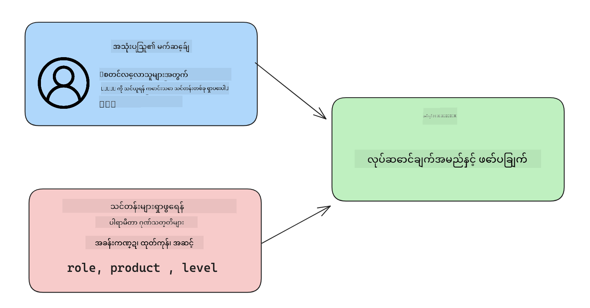

<!--
CO_OP_TRANSLATOR_METADATA:
{
  "original_hash": "f6f84f9ef2d066cd25850cab93580a50",
  "translation_date": "2025-10-18T01:53:38+00:00",
  "source_file": "11-integrating-with-function-calling/README.md",
  "language_code": "my"
}
-->
# Function Calling နှင့် ပေါင်းစပ်ခြင်း

[](https://youtu.be/DgUdCLX8qYQ?si=f1ouQU5HQx6F8Gl2)

ယခင်သင်ခန်းစာများတွင် သင်တော်တော်များများလေ့လာပြီးဖြစ်ပါပြီ။ သို့သော် ကျွန်ုပ်တို့ ပိုမိုကောင်းမွန်စေရန် ဆက်လက်တိုးတက်နိုင်ပါသေးသည်။ ကျွန်ုပ်တို့ လုပ်ဆောင်နိုင်သည့် အချို့သောအရာများမှာ တုံ့ပြန်မှုကို အလွယ်တကူ အလုပ်လုပ်နိုင်ရန် တုံ့ပြန်မှုပုံစံကို ပိုမိုတိကျစေခြင်းနှင့် အခြားအရင်းအမြစ်များမှ ဒေတာများကို ထည့်သွင်းခြင်းဖြင့် ကျွန်ုပ်တို့၏အက်ပလီကေးရှင်းကို ပိုမိုချမ်းသာစေခြင်းတို့ဖြစ်သည်။

အထက်ဖော်ပြထားသော ပြဿနာများကို ဒီအခန်းမှာ ဖြေရှင်းရန် ရည်ရွယ်ထားသည်။

## အကျဉ်းချုပ်

ဒီသင်ခန်းစာမှာ အောက်ပါအကြောင်းအရာများကို လေ့လာပါမည်-

- Function Calling ဆိုတာဘာလဲ၊ ၎င်း၏ အသုံးချနိုင်မှုများကို ရှင်းပြခြင်း။
- Azure OpenAI ကို အသုံးပြု၍ Function Call တစ်ခု ဖန်တီးခြင်း။
- Function Call ကို အက်ပလီကေးရှင်းတစ်ခုထဲတွင် ပေါင်းစပ်အသုံးပြုခြင်း။

## သင်ယူရမည့်ရည်မှန်းချက်များ

ဒီသင်ခန်းစာပြီးဆုံးချိန်တွင် သင်သည်-

- Function Calling ကို အသုံးပြုရသည့် ရည်ရွယ်ချက်ကို ရှင်းပြနိုင်မည်။
- Azure OpenAI Service ကို အသုံးပြု၍ Function Call ကို စနစ်တကျတပ်ဆင်နိုင်မည်။
- သင့်အက်ပလီကေးရှင်း၏ အသုံးပြုမှုအတွက် ထိရောက်သော Function Calls ကို ဒီဇိုင်းဆွဲနိုင်မည်။

## အခြေအနေ - Function များဖြင့် Chatbot ကို တိုးတက်စေခြင်း

ဒီသင်ခန်းစာအတွက် ကျွန်ုပ်တို့သည် ကျောင်းသားများကို နည်းပညာသင်တန်းများ ရှာဖွေရန် Chatbot ကို အသုံးပြုနိုင်စေရန် feature တစ်ခု ဖန်တီးလိုပါသည်။ ကျွန်ုပ်တို့သည် ၎င်းတို့၏ ကျွမ်းကျင်မှုအဆင့်၊ လက်ရှိအလုပ်အကိုင်နှင့် စိတ်ဝင်စားသော နည်းပညာများနှင့် ကိုက်ညီသော သင်တန်းများကို အကြံပြုပေးမည်ဖြစ်သည်။

ဒီအခြေအနေကို ပြည့်စုံစေရန် ကျွန်ုပ်တို့သည် အောက်ပါအရာများကို ပေါင်းစပ်အသုံးပြုပါမည်-

- `Azure OpenAI` ကို အသုံးပြု၍ အသုံးပြုသူအတွက် chat အတွေ့အကြုံ ဖန်တီးခြင်း။
- `Microsoft Learn Catalog API` ကို အသုံးပြု၍ အသုံးပြုသူ၏ တောင်းဆိုမှုအပေါ် အခြေခံ၍ သင်တန်းများကို ရှာဖွေခြင်း။
- `Function Calling` ကို အသုံးပြု၍ အသုံးပြုသူ၏ မေးခွန်းကို function သို့ ပို့ပြီး API တောင်းဆိုမှုကို ပြုလုပ်ခြင်း။

စတင်ရန်၊ Function Calling ကို ဘာကြောင့် အသုံးပြုလိုသလဲဆိုတာကို ကြည့်လိုက်ရအောင်-

## Function Calling ကို ဘာကြောင့် အသုံးပြုသင့်သလဲ

Function Calling မရှိမီ LLM မှ တုံ့ပြန်မှုများသည် အဆင့်မပြေဘဲ မတူညီမှုများရှိခဲ့သည်။ Developer များသည် တုံ့ပြန်မှု၏ အမျိုးမျိုးကို ကိုင်တွယ်နိုင်ရန် အလွန်ရှုပ်ထွေးသော အတည်ပြုရေး code များရေးရန် လိုအပ်ခဲ့သည်။ "Stockholm ရှိ လက်ရှိရာသီဥတုက ဘာလဲ?" ဆိုသည့် မေးခွန်းများကို အသုံးပြုသူများ မရနိုင်ခဲ့ပါ။ ၎င်းသည် မော်ဒယ်များသည် ဒေတာကို လေ့လာသည့်အချိန်အတိုင်းအတာအတွင်း အကန့်အသတ်ရှိသောကြောင့် ဖြစ်သည်။

Function Calling သည် Azure OpenAI Service ၏ feature တစ်ခုဖြစ်ပြီး အောက်ပါ အကန့်အသတ်များကို ကျော်လွှားရန် ရည်ရွယ်ထားသည်-

- **တုံ့ပြန်မှုပုံစံတိကျမှု** - တုံ့ပြန်မှုပုံစံကို ပိုမိုထိန်းချုပ်နိုင်ပါက တုံ့ပြန်မှုကို အခြားစနစ်များသို့ ပိုမိုလွယ်ကူစွာ ပေါင်းစပ်နိုင်မည်။
- **အပြင်ပဒေတာ** - Chat context တွင် အက်ပလီကေးရှင်း၏ အခြားအရင်းအမြစ်များမှ ဒေတာကို အသုံးပြုနိုင်စွမ်း။

## ပြဿနာကို အခြေအနေတစ်ခုဖြင့် ရှင်းလင်းပြသခြင်း

> အောက်ပါအခြေအနေကို လုပ်ဆောင်လိုပါက [ထည့်သွင်းထားသော notebook](./python/aoai-assignment.ipynb?WT.mc_id=academic-105485-koreyst) ကို အသုံးပြုရန် ကျွန်ုပ်တို့ အကြံပြုပါသည်။ သို့မဟုတ် function များက ပြဿနာကို ဘယ်လိုဖြေရှင်းနိုင်မည်ကို ဖော်ပြရန် ကျွန်ုပ်တို့ ကြိုးစားနေသောအတိုင်း ဖတ်ရှုနိုင်ပါသည်။

တုံ့ပြန်မှုပုံစံပြဿနာကို ဖော်ပြသည့် ဥပမာကို ကြည့်လိုက်ရအောင်-

ကျောင်းသားဒေတာများကို စုစည်းထားသော database တစ်ခု ဖန်တီးလိုသည်ဟု ဆိုပါစို့။ ၎င်းတို့ကို သင်တန်းများအတွက် အကြံပြုရန် အသုံးပြုနိုင်မည်။ အောက်တွင် ကျောင်းသားများ၏ ဖော်ပြချက်နှစ်ခုရှိပြီး ၎င်းတို့တွင် ပါဝင်သော ဒေတာများသည် တူညီမှုများရှိသည်။

1. ကျွန်ုပ်တို့၏ Azure OpenAI resource သို့ ချိတ်ဆက်မှုတစ်ခု ဖန်တီးပါ-

   ```python
   import os
   import json
   from openai import AzureOpenAI
   from dotenv import load_dotenv
   load_dotenv()

   client = AzureOpenAI(
   api_key=os.environ['AZURE_OPENAI_API_KEY'],  # this is also the default, it can be omitted
   api_version = "2023-07-01-preview"
   )

   deployment=os.environ['AZURE_OPENAI_DEPLOYMENT']
   ```

   အောက်တွင် `api_type`, `api_base`, `api_version` နှင့် `api_key` ကို သတ်မှတ်ထားသော Azure OpenAI ချိတ်ဆက်မှုကို ဖန်တီးရန် Python code တစ်ချို့ပါရှိသည်။

1. `student_1_description` နှင့် `student_2_description` variables ကို အသုံးပြု၍ ကျောင်းသားဖော်ပြချက်နှစ်ခု ဖန်တီးခြင်း။

   ```python
   student_1_description="Emily Johnson is a sophomore majoring in computer science at Duke University. She has a 3.7 GPA. Emily is an active member of the university's Chess Club and Debate Team. She hopes to pursue a career in software engineering after graduating."

   student_2_description = "Michael Lee is a sophomore majoring in computer science at Stanford University. He has a 3.8 GPA. Michael is known for his programming skills and is an active member of the university's Robotics Club. He hopes to pursue a career in artificial intelligence after finishing his studies."
   ```

   အထက်ပါ ကျောင်းသားဖော်ပြချက်များကို LLM သို့ ပို့လိုပါသည်။ ဒီဒေတာကို ကျွန်ုပ်တို့၏အက်ပလီကေးရှင်းတွင် အသုံးပြုနိုင်ပြီး API သို့ ပို့ခြင်း သို့မဟုတ် database တွင် သိမ်းဆည်းနိုင်သည်။

1. LLM ကို ဘာအချက်အလက်များကို ရှာဖွေပြီး JSON ပုံစံဖြင့် တုံ့ပြန်ရန် အမိန့်ပေးသော identical prompts နှစ်ခုကို ဖန်တီးလိုက်ပါ-

   ```python
   prompt1 = f'''
   Please extract the following information from the given text and return it as a JSON object:

   name
   major
   school
   grades
   club

   This is the body of text to extract the information from:
   {student_1_description}
   '''

   prompt2 = f'''
   Please extract the following information from the given text and return it as a JSON object:

   name
   major
   school
   grades
   club

   This is the body of text to extract the information from:
   {student_2_description}
   '''
   ```

   အထက်ပါ prompts တွင် LLM ကို အချက်အလက်များကို ထုတ်ယူပြီး JSON ပုံစံဖြင့် တုံ့ပြန်ရန် အမိန့်ပေးထားသည်။

1. Prompts များနှင့် Azure OpenAI ချိတ်ဆက်မှုကို စနစ်တကျတပ်ဆင်ပြီးနောက်၊ `openai.ChatCompletion` ကို အသုံးပြု၍ LLM သို့ prompts များကို ပို့လိုက်ပါ။ Prompt ကို `messages` variable တွင် သိမ်းဆည်းပြီး role ကို `user` သတ်မှတ်ပါ။ ၎င်းသည် chatbot သို့ အသုံးပြုသူမှ message ရေးသားခြင်းကို အတုယူရန်ဖြစ်သည်။

   ```python
   # response from prompt one
   openai_response1 = client.chat.completions.create(
   model=deployment,
   messages = [{'role': 'user', 'content': prompt1}]
   )
   openai_response1.choices[0].message.content

   # response from prompt two
   openai_response2 = client.chat.completions.create(
   model=deployment,
   messages = [{'role': 'user', 'content': prompt2}]
   )
   openai_response2.choices[0].message.content
   ```

ယခု LLM သို့ requests နှစ်ခုလုံးကို ပို့ပြီး `openai_response1['choices'][0]['message']['content']` ဖြင့် response ကို ရှာဖွေကြည့်နိုင်ပါသည်။

1. Response ကို JSON ပုံစံသို့ ပြောင်းရန် `json.loads` ကို ခေါ်ပါ-

   ```python
   # Loading the response as a JSON object
   json_response1 = json.loads(openai_response1.choices[0].message.content)
   json_response1
   ```

   Response 1:

   ```json
   {
     "name": "Emily Johnson",
     "major": "computer science",
     "school": "Duke University",
     "grades": "3.7",
     "club": "Chess Club"
   }
   ```

   Response 2:

   ```json
   {
     "name": "Michael Lee",
     "major": "computer science",
     "school": "Stanford University",
     "grades": "3.8 GPA",
     "club": "Robotics Club"
   }
   ```

   Prompts တူညီပြီး ဖော်ပြချက်များ တူညီမှုများရှိသော်လည်း `Grades` property ၏ values မတူညီသော format များဖြင့် ရရှိသည်။ ဥပမာအားဖြင့် `3.7` သို့မဟုတ် `3.7 GPA` အဖြစ် ရရှိနိုင်သည်။

   ဒီရလဒ်သည် LLM သည် unstructured data ကို ရေးသားထားသော prompt အဖြစ်ယူပြီး unstructured data ကို ပြန်ပေးသည်ဖြစ်သည်။ ဒီဒေတာကို သိမ်းဆည်းခြင်း သို့မဟုတ် အသုံးပြုခြင်းအတွက် ဘာကိုမျှော်လင့်ရမည်ကို သိရန် structured format တစ်ခုရှိရန် လိုအပ်သည်။

ဒါဆို formatting ပြဿနာကို ဘယ်လိုဖြေရှင်းမလဲ? Functional calling ကို အသုံးပြုခြင်းဖြင့် structured data ကို ပြန်လည်ရရှိစေရန် သေချာစေနိုင်သည်။ Function calling ကို အသုံးပြုသောအခါ LLM သည် function များကို တကယ်ခေါ်ခြင်း သို့မဟုတ် အလုပ်မလုပ်ပါ။ ၎င်း၏ response များအတွက် LLM ကို လိုက်နာရန် structure တစ်ခု ဖန်တီးသည်။ ထို့နောက် ၎င်း response များကို အသုံးပြု၍ ကျွန်ုပ်တို့၏ အက်ပလီကေးရှင်းများတွင် function ကို အလုပ်လုပ်ရန် သိရှိသည်။


ထို့နောက် function မှ ပြန်ပေးသောအရာကို ယူပြီး LLM သို့ ပြန်ပို့နိုင်သည်။ ထို့နောက် LLM သည် အသုံးပြုသူ၏ မေးခွန်းကို ဖြေဆိုရန် သဘာဝဘာသာစကားဖြင့် တုံ့ပြန်မည်။

## Function Calls ကို အသုံးပြုခြင်း၏ အသုံးချနိုင်မှုများ

Function Calls သည် သင့်အက်ပလီကေးရှင်းကို တိုးတက်စေရန် အမျိုးမျိုးသော အသုံးချနိုင်မှုများရှိသည်-

- **အပြင်ပကိရိယာများကို ခေါ်ခြင်း** - Chatbots များသည် အသုံးပြုသူများ၏ မေးခွန်းများကို ဖြေဆိုပေးရန် အလွန်ကောင်းမွန်သည်။ Function Calling ကို အသုံးပြုခြင်းဖြင့် Chatbots များသည် အသုံးပြုသူများ၏ message များကို အသုံးပြု၍ တာဝန်အချို့ကို ပြီးမြောက်စေသည်။ ဥပမာအားဖြင့် ကျောင်းသားတစ်ဦးသည် chatbot ကို "ကျွန်ုပ်၏ဆရာထံ email ပို့ပါ၊ ဒီဘာသာရပ်မှာ အကူအညီပိုလိုပါတယ်လို့ ပြောပါ" ဟု မေးမြန်းနိုင်သည်။ ၎င်းသည် `send_email(to: string, body: string)` ဟုခေါ်သော function call ကို ပြုလုပ်နိုင်သည်။

- **API သို့မဟုတ် Database Queries ဖန်တီးခြင်း** - အသုံးပြုသူများသည် natural language ကို အသုံးပြု၍ formatted query သို့မဟုတ် API request အဖြစ် ပြောင်းလဲပြီး အချက်အလက်များကို ရှာဖွေနိုင်သည်။ ဥပမာအားဖြင့် ဆရာတစ်ဦးသည် "နောက်ဆုံးအလုပ်ကို ပြီးမြောက်ခဲ့သော ကျောင်းသားများ ဘယ်သူတွေလဲ" ဟု မေးမြန်းနိုင်သည်။ ၎င်းသည် `get_completed(student_name: string, assignment: int, current_status: string)` ဟုခေါ်သော function ကို ခေါ်နိုင်သည်။

- **Structured Data ဖန်တီးခြင်း** - အသုံးပြုသူများသည် text block သို့မဟုတ် CSV ကို ယူပြီး LLM ကို အသုံးပြု၍ ၎င်းမှ အရေးပါသော အချက်အလက်များကို ထုတ်ယူနိုင်သည်။ ဥပမာအားဖြင့် ကျောင်းသားတစ်ဦးသည် peace agreements အကြောင်း Wikipedia ဆောင်းပါးတစ်ခုကို AI flashcards ဖန်တီးရန် ပြောင်းလဲနိုင်သည်။ ၎င်းကို `get_important_facts(agreement_name: string, date_signed: string, parties_involved: list)` ဟုခေါ်သော function ကို အသုံးပြု၍ ပြုလုပ်နိုင်သည်။

## သင့်ပထမဆုံး Function Call ကို ဖန်တီးခြင်း

Function Call တစ်ခု ဖန်တီးခြင်းလုပ်ငန်းစဉ်တွင် အဓိကအဆင့် ၃ ဆင့်ပါဝင်သည်-

1. **Calling** - Function များ၏ စာရင်းနှင့် အသုံးပြုသူ message တို့ဖြင့် Chat Completions API ကို ခေါ်ခြင်း။
2. **Reading** - မော်ဒယ်၏ response ကို ဖတ်၍ တာဝန်တစ်ခုကို အကောင်အထည်ဖော်ခြင်း၊ ဥပမာအားဖြင့် function သို့မဟုတ် API Call ကို အကောင်အထည်ဖော်ခြင်း။
3. **Making** - Function response မှ အချက်အလက်များကို အသုံးပြု၍ အသုံးပြုသူ message ကို Chat Completions API သို့ ပြန်လည်ခေါ်ခြင်း။



### အဆင့် ၁ - Messages ဖန်တီးခြင်း

ပထမအဆင့်မှာ အသုံးပြုသူ message ကို ဖန်တီးခြင်းဖြစ်သည်။ ၎င်းကို text input ၏ value ကို dynamically သတ်မှတ်ခြင်းဖြင့် ပြုလုပ်နိုင်သည် သို့မဟုတ် ဒီနေရာတွင် value ကို သတ်မှတ်နိုင်သည်။ Chat Completions API ကို ပထမဆုံးအကြိမ် အသုံးပြုနေပါက message ၏ `role` နှင့် `content` ကို သတ်မှတ်ရန် လိုအပ်သည်။

`role` သည် `system` (rule ဖန်တီးခြင်း), `assistant` (model) သို့မဟုတ် `user` (end-user) ဖြစ်နိုင်သည်။ Function Calling အတွက် ၎င်းကို `user` အဖြစ် သတ်မှတ်ပြီး ဥပမာမေးခွန်းတစ်ခု ထည့်သွင်းပါမည်။

```python
messages= [ {"role": "user", "content": "Find me a good course for a beginner student to learn Azure."} ]
```

Role များကို မတူညီစွာ သတ်မှတ်ခြင်းဖြင့် LLM သို့ system မှ ပြောနေသည်၊ user မှ ပြောနေသည်ကို ရှင်းလင်းစေပြီး LLM သည် conversation history ကို တည်ဆောက်နိုင်သည်။

### အဆင့် ၂ - Functions ဖန်တီးခြင်း

နောက်တစ်ဆင့်မှာ function ကို သတ်မှတ်ပြီး function ၏ parameters များကို ဖန်တီးခြင်းဖြစ်သည်။ ဒီနေရာမှာ `search_courses` ဟုခေါ်သော function တစ်ခုသာ အသုံးပြုမည်ဖြစ်သော်လည်း function များစွာကို ဖန်တီးနိုင်သည်။

> **အရေးကြီးသည်** - Functions များကို LLM သို့ system message တွင် ထည့်သွင်းထားပြီး သင့်တွင် ရရှိနိုင်သော tokens အရေအတွက်တွင် ပါဝင်မည်။

အောက်တွင် functions များကို items များ၏ array အဖြစ် ဖန်တီးထားသည်။ Item တစ်ခုစီသည် function တစ်ခုဖြစ်ပြီး `name`, `description` နှင့် `parameters` properties များပါရှိသည်-

```python
functions = [
   {
      "name":"search_courses",
      "description":"Retrieves courses from the search index based on the parameters provided",
      "parameters":{
         "type":"object",
         "properties":{
            "role":{
               "type":"string",
               "description":"The role of the learner (i.e. developer, data scientist, student, etc.)"
            },
            "product":{
               "type":"string",
               "description":"The product that the lesson is covering (i.e. Azure, Power BI, etc.)"
            },
            "level":{
               "type":"string",
               "description":"The level of experience the learner has prior to taking the course (i.e. beginner, intermediate, advanced)"
            }
         },
         "required":[
            "role"
         ]
      }
   }
]
```

Function instance တစ်ခုစီကို အောက်တွင် အသေးစိတ်ဖော်ပြပါ-

- `name` - Function ကို ခေါ်လိုသော အမည်။
- `description` - Function ၏ လုပ်ဆောင်ပုံကို ဖော်ပြထားသော ဖော်ပြချက်။ ဒီနေရာမှာ တိကျပြီးရှင်းလင်းဖို့ အရေးကြီးသည်။
- `parameters` - Model response အတွက် ထုတ်လုပ်လိုသော values နှင့် format ၏ စာရင်း။ Parameters array တွင် items များပါရှိပြီး items များတွင် အောက်ပါ properties များပါဝင်သည်-
  1.  `type` - Properties များကို သိမ်းဆည်းမည့် data type။
  1.  `properties` - Model response အတွက် အသုံးပြုမည့် specific values များ၏ စာရင်း။
      1. `name` - Model response formatted မှာ အသုံးပြုမည့် property ၏ အမည် key, ဥပမာအားဖြင့် `product`။
      1. `type` - Property ၏ data type, ဥပမာအားဖြင့် `string`။
      1. `description` - Specific property ၏ ဖော်ပြချက်။

Optional property `required` - Function call ပြီးမြောက်ရန် လိုအပ်သော property။

### အဆင့် ၃ - Function Call ပြုလုပ်ခြင်း

Function ကို သတ်မှတ်ပြီးနောက်၊ Chat Completion API သို့ ခေါ်ဆိုမှုတွင် function ကို ထည့်သွင်းရန် လိုအပ်သည်။ ၎င်းကို request တွင် `functions` ကို ထည့်သွ
- ဖန်တီးထားသော function call နှင့်/သို့မဟုတ် API call မှ သင့်လျော်သော course မရှိပါက error ကို handle လုပ်ပါ။

အကြံပြုချက်: [Learn API reference documentation](https://learn.microsoft.com/training/support/catalog-api-developer-reference?WT.mc_id=academic-105485-koreyst) စာမျက်နှာကို လိုက်နာပြီး ဒီ data ကို ဘယ်လို၊ ဘယ်နေရာမှာ ရနိုင်တယ်ဆိုတာ ကြည့်ပါ။

## အလွန်ကောင်းမွန်တဲ့အလုပ်! ခရီးကို ဆက်လက်လုပ်ဆောင်ပါ

ဒီသင်ခန်းစာကို ပြီးမြောက်ပြီးနောက်မှာ [Generative AI Learning collection](https://aka.ms/genai-collection?WT.mc_id=academic-105485-koreyst) ကို ကြည့်ပြီး Generative AI အသိပညာကို ဆက်လက်မြှင့်တင်ပါ။

Lesson 12 ကို သွားကြည့်ပါ၊ အဲဒီမှာ [AI application များအတွက် UX ကို ဒီဇိုင်းဆွဲနည်း](../12-designing-ux-for-ai-applications/README.md?WT.mc_id=academic-105485-koreyst) ကို လေ့လာပါ!

---

**အကြောင်းကြားချက်**:  
ဤစာရွက်စာတမ်းကို AI ဘာသာပြန်ဝန်ဆောင်မှု [Co-op Translator](https://github.com/Azure/co-op-translator) ကို အသုံးပြု၍ ဘာသာပြန်ထားပါသည်။ ကျွန်ုပ်တို့သည် တိကျမှုအတွက် ကြိုးစားနေသော်လည်း အလိုအလျောက် ဘာသာပြန်မှုများတွင် အမှားများ သို့မဟုတ် မမှန်ကန်မှုများ ပါဝင်နိုင်သည်ကို သတိပြုပါ။ မူရင်းဘာသာစကားဖြင့် ရေးသားထားသော စာရွက်စာတမ်းကို အာဏာတရားရှိသော အရင်းအမြစ်အဖြစ် သတ်မှတ်သင့်ပါသည်။ အရေးကြီးသော အချက်အလက်များအတွက် လူက ဘာသာပြန်မှုကို အကြံပြုပါသည်။ ဤဘာသာပြန်မှုကို အသုံးပြုခြင်းမှ ဖြစ်ပေါ်လာသော အလွဲအလွတ်များ သို့မဟုတ် အနားလွဲမှုများအတွက် ကျွန်ုပ်တို့သည် တာဝန်မယူပါ။