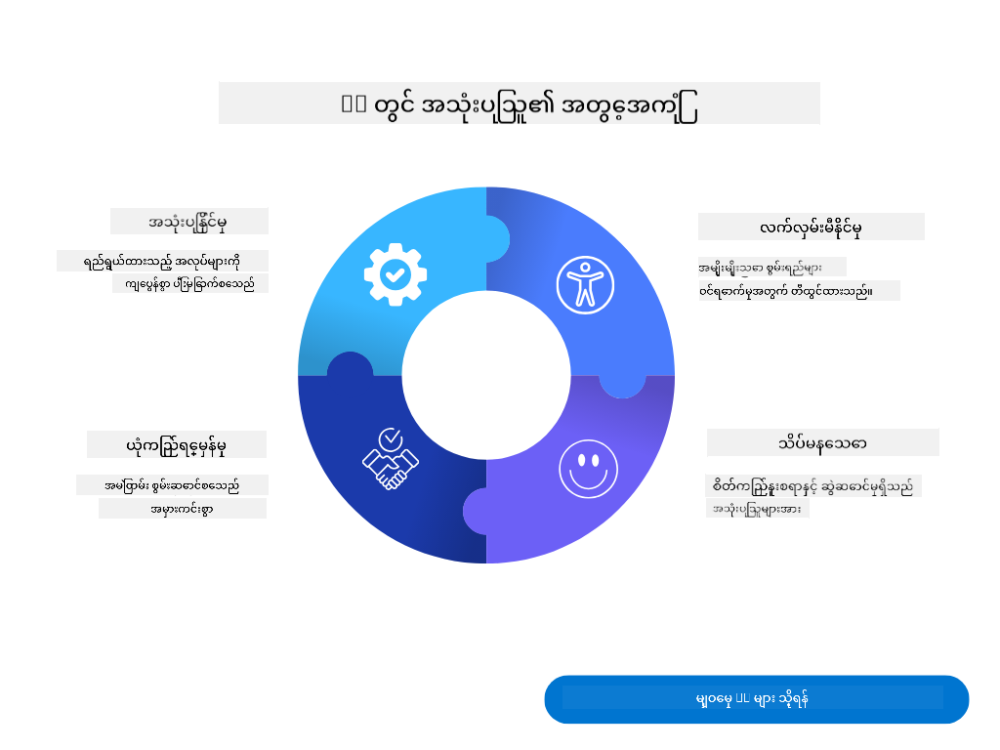
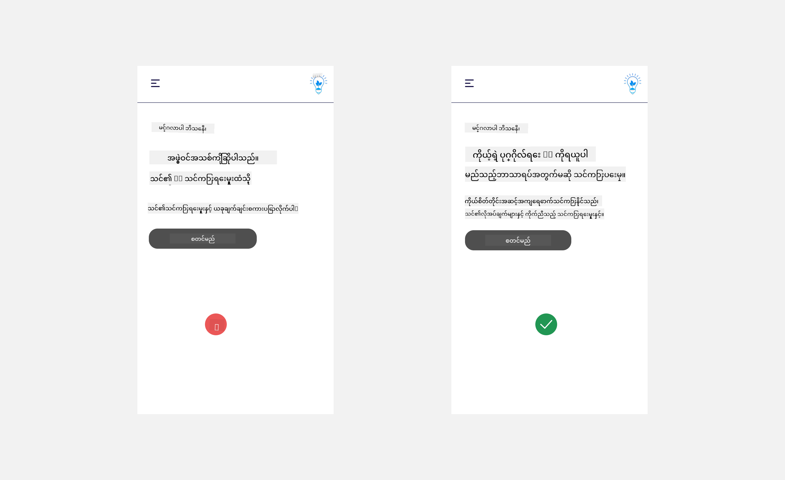
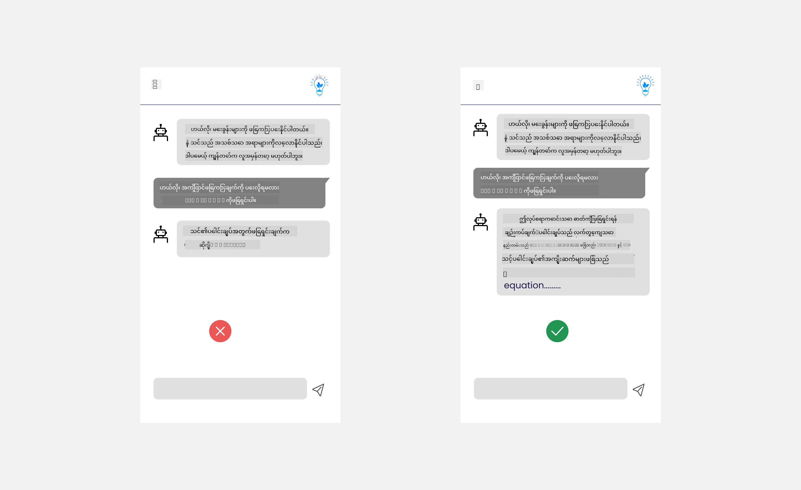
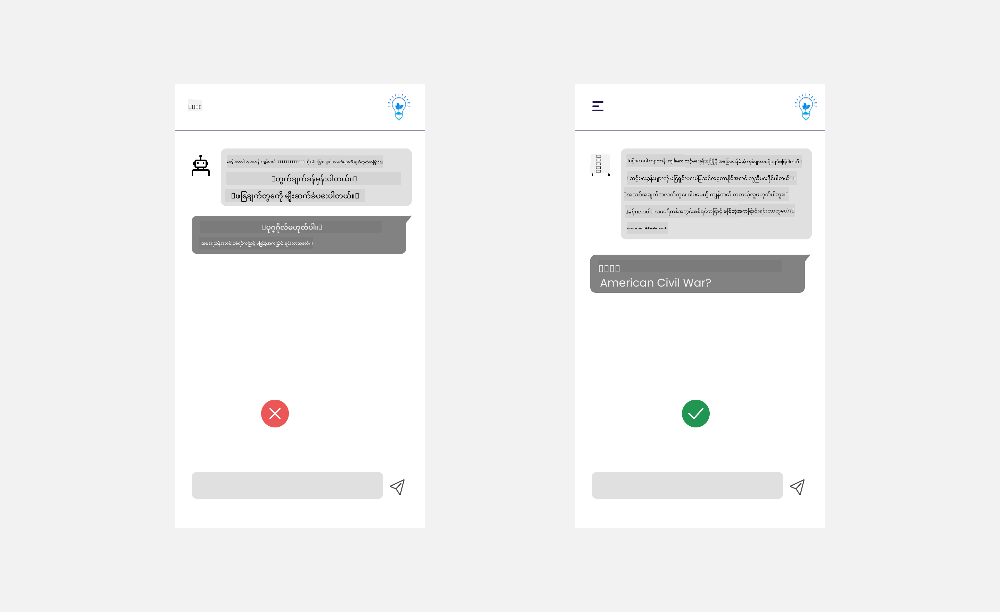
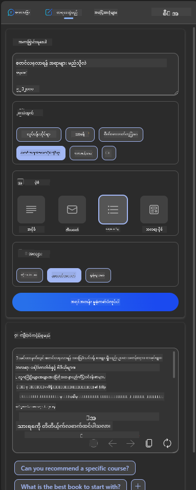
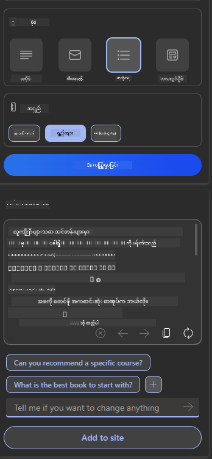

<!--
CO_OP_TRANSLATOR_METADATA:
{
  "original_hash": "ec385b41ee50579025d50cc03bfb3a25",
  "translation_date": "2025-06-25T20:37:27+00:00",
  "source_file": "12-designing-ux-for-ai-applications/README.md",
  "language_code": "my"
}
-->
# AI အက်ဉ်းချုပ်များအတွက် UX ကိုဒီဇိုင်းဆွဲခြင်း

> _(ဤသင်ခန်းစာ၏ဗီဒီယိုကိုကြည့်ရန် အထက်ပါပုံကိုနှိပ်ပါ)_

အသုံးပြုသူအတွေ့အကြုံသည် app တည်ဆောက်ရာတွင်အလွန်အရေးကြီးသောအချက်ဖြစ်သည်။ အသုံးပြုသူများသည် app ကို လုပ်ဆောင်ချက်များကို ထိရောက်စွာပြုလုပ်နိုင်ရန်လိုအပ်သည်။ ထိရောက်မှုသည် တစ်ခုဖြစ်သော်လည်း အားလုံးက အသုံးပြုနိုင်ရန် app များကိုဒီဇိုင်းဆွဲရန်လည်းလိုအပ်ပါသည်၊ ထို့ကြောင့် အားလုံးက အသုံးပြုနိုင်ရန် _လက်လှမ်းမီ_ ဖြစ်စေရန်လိုအပ်ပါသည်။ ဤအခန်းသည် ဤကဏ္ဍအပေါ် အာရုံစိုက်မည်ဖြစ်ပြီး လူများ အသုံးပြုနိုင်ပြီး အသုံးပြုလိုစေသော app တစ်ခုကို ဒီဇိုင်းဆွဲနိုင်မည်ဟု မျှော်လင့်ပါသည်။

## မိတ်ဆက်

အသုံးပြုသူအတွေ့အကြုံသည် အသုံးပြုသူသည် စနစ်၊ ကိရိယာ သို့မဟုတ် ဒီဇိုင်းဖြစ်စေ ထုတ်ကုန် သို့မဟုတ် ဝန်ဆောင်မှုကို ကွဲပြားခြားနားစွာ လက်ခံရရှိသည့်နည်းဖြစ်သည်။ AI applications များကို ဖွံ့ဖြိုးတိုးတက်စေရာတွင်, ဖွံ့ဖြိုးတိုးတက်ရေးအာရုံစိုက်ရာတွင် သုံးစွဲသူအတွေ့အကြုံသည် ထိရောက်မှုရှိစေရန်သာမက အကျိုးသက်ရောက်မှုရှိစေရန်လည်းလိုအပ်သည်။ ဤသင်ခန်းစာတွင် အသုံးပြုသူ၏လိုအပ်ချက်များကိုဖြေရှင်းသော AI applications များကို ဘယ်လိုတည်ဆောက်ရမည်ကို လေ့လာပါမည်။

သင်ခန်းစာသည် အောက်ပါကဏ္ဍများကို လွှမ်းခြုံပါမည်။

- အသုံးပြုသူအတွေ့အကြုံနှင့် အသုံးပြုသူ၏လိုအပ်ချက်များကိုနားလည်ခြင်း
- ယုံကြည်မှုနှင့် ထင်ရှားမှုအတွက် AI applications များကိုဒီဇိုင်းဆွဲခြင်း
- ပူးပေါင်းဆောင်ရွက်ခြင်းနှင့် တုံ့ပြန်မှုအတွက် AI applications များကိုဒီဇိုင်းဆွဲခြင်း

## သင်ယူရမည့်ရည်ရွယ်ချက်များ

ဤသင်ခန်းစာကိုယူပြီးနောက်, သင်သည်အောက်ပါအချက်များကို လုပ်နိုင်ပါမည်။

- အသုံးပြုသူ၏လိုအပ်ချက်များကို ဖြည့်ဆည်းနိုင်သော AI applications များကို ဘယ်လိုတည်ဆောက်ရမည်ကို နားလည်ပါ။
- ယုံကြည်မှုနှင့် ပူးပေါင်းဆောင်ရွက်မှုကို မြှင့်တင်သော AI applications များကို ဒီဇိုင်းဆွဲပါ။

### ကြိုတင်ပြင်ဆင်ချက်

အချိန်ယူပြီး [အသုံးပြုသူအတွေ့အကြုံနှင့် ဒီဇိုင်းစဉ်းစားခြင်း](https://learn.microsoft.com/training/modules/ux-design?WT.mc_id=academic-105485-koreyst) အကြောင်းပိုမိုဖတ်ပါ။

## အသုံးပြုသူအတွေ့အကြုံနှင့် အသုံးပြုသူ၏လိုအပ်ချက်များကိုနားလည်ခြင်း

ကျွန်ုပ်တို့၏စိတ်ကူးယဉ်ပညာရေးစတင်မှုတွင်, ကျွန်ုပ်တို့တွင် အဓိကအသုံးပြုသူနှစ်ဦးရှိသည်, ဆရာများနှင့် ကျောင်းသားများ။ အသုံးပြုသူနှစ်ဦးစလုံးတွင် တစ်ဦးချင်းစီ၏လိုအပ်ချက်များရှိသည်။ အသုံးပြုသူကို ဦးစားပေးထားသော ဒီဇိုင်းသည် ထုတ်ကုန်များသည် အဆိုပါထုတ်ကုန်များကို ရည်ရွယ်ထားသောသူများအတွက် သက်ဆိုင်မှုရှိပြီး အကျိုးရှိစေရန် လုပ်ဆောင်ပါသည်။

application သည် **အသုံးပြုနိုင်စေရန်, ယုံကြည်ရစေရန်, လက်လှမ်းမီစေရန်နှင့် စိတ်ချမ်းသာစေရန်** ကောင်းမွန်သော အသုံးပြုသူအတွေ့အကြုံကို ပေးနိုင်ရန်လိုအပ်သည်။

### အသုံးပြုနိုင်မှု

အသုံးပြုနိုင်မှုသည် application တွင် ရည်ရွယ်ထားသော ရည်ရွယ်ချက်နှင့် ကိုက်ညီသော လုပ်ဆောင်ချက်ရှိသည့် အဓိကရည်ရွယ်ချက်ကို ပြုလုပ်ရန်ဖြစ်သည်, ဥပမာ စာရင်းသွင်းခြင်းဖြစ်စေ သို့မဟုတ် ပြန်လည်သုံးသပ်ရန် flashcards များကို ဖန်တီးခြင်းဖြစ်စေ။ စာရင်းသွင်းခြင်းလုပ်ငန်းစဉ်ကို အလိုအလျောက်ပြုလုပ်သော application သည် သတ်မှတ်ထားသော အချက်အလက်များအရ ကျောင်းသားများ၏ အလုပ်ကိုမှန်ကန်စွာနှင့် ထိရောက်စွာ အမှတ်ပေးနိုင်ရန်လိုအပ်သည်။ အတူတူ, ပြန်လည်သုံးသပ်ရန် flashcards များကို ဖန်တီးသော application သည် အချက်အလက်များအရ သက်ဆိုင်သောနှင့် မတူညီသော မေးခွန်းများကို ဖန်တီးနိုင်ရန်လိုအပ်သည်။

### ယုံကြည်ရမှု

ယုံကြည်ရမှုသည် application သည် ရည်ရွယ်ချက်ကို အမြဲပြုလုပ်နိုင်ပြီး အမှားမရှိစေရန်ဖြစ်သည်။ သို့သော်, AI သည် လူများကဲ့သို့ အပြည့်အဝမဟုတ်ဘဲ အမှားများဖြစ်နိုင်သည်။ applications များသည် အမှားများဖြစ်နိုင်သည် သို့မဟုတ် လူ့အကူအညီ သို့မဟုတ် ပြင်ဆင်မှုလိုအပ်သော မမျှော်လင့်ထားသောအခြေအနေများကို ရင်ဆိုင်နိုင်သည်။ အမှားများကို ဘယ်လိုကိုင်တွယ်မည်နည်း? ဤသင်ခန်းစာ၏နောက်ဆုံးပိုင်းတွင်, AI systems များနှင့် applications များကို ပူးပေါင်းဆောင်ရွက်ခြင်းနှင့် တုံ့ပြန်မှုအတွက် ဒီဇိုင်းဆွဲခြင်းကို လွှမ်းခြုံပါမည်။

### လက်လှမ်းမီမှု

လက်လှမ်းမီမှုသည် အသုံးပြုသူအတွေ့အကြုံကို မတူညီသောစွမ်းရည်များရှိသော အသုံးပြုသူများထံသို့ တိုးချဲ့ခြင်းဖြစ်သည်, မသန်စွမ်းသောသူများအပါအဝင်, ဘယ်သူမှ ချန်လှပ်ထားမခံစေရန်။ လက်လှမ်းမီမှုကို လမ်းညွှန်ချက်များနှင့် မူဝါဒများကိုလိုက်နာခြင်းဖြင့်, AI ဖြေရှင်းချက်များသည် ပိုမိုပါဝင်ပြီး, အသုံးပြုနိုင်ပြီး, အသုံးပြုသူအားလုံးအတွက် အကျိုးရှိစေသည်။

### စိတ်ချမ်းသာစေရန်

စိတ်ချမ်းသာစေရန်သည် application သည် အသုံးပြုရန် ပျော်ရွှင်စေသည်။ စိတ်ချမ်းသာစေသော အသုံးပြုသူအတွေ့အကြုံသည် အသုံးပြုသူအား application သို့ ပြန်လည်ရောက်ရှိရန် အားပေးနိုင်သည်, လုပ်ငန်းဝင်ငွေကိုမြှင့်တင်နိုင်သည်။

AI ဖြင့် အခက်အခဲများကို အားလုံးကို ဖြေရှင်းနိုင်မည်မဟုတ်ပါ။ AI သည် သင်၏အသုံးပြုသူအတွေ့အကြုံကို မြှင့်တင်ရန်ဖြစ်သည်, လက်ဖြင့်လုပ်ဆောင်ရသောလုပ်ငန်းများကို အလိုအလျောက်လုပ်ခြင်း, သို့မဟုတ် အသုံးပြုသူအတွေ့အကြုံကို ကိုယ်ပိုင်ဖြစ်စေရန်ဖြစ်သည်။

## ယုံကြည်မှုနှင့် ထင်ရှားမှုအတွက် AI applications များကိုဒီဇိုင်းဆွဲခြင်း

AI applications များကိုဒီဇိုင်းဆွဲရာတွင် ယုံကြည်မှုကို တည်ဆောက်ခြင်းသည် အရေးကြီးသည်။ ယုံကြည်မှုသည် application သည် အလုပ်ကို ပြုလုပ်မည်ဟု အသုံးပြုသူအထင်ရှိစေရန်, အမြဲအလုပ်လုပ်မည်ဟု ယုံကြည်မှုရှိစေရန်, ရလဒ်များသည် အသုံးပြုသူ၏လိုအပ်ချက်များဖြစ်စေရန်ဖြစ်သည်။ ဤကဏ္ဍတွင် မယုံကြည်မှုနှင့် အလွန်ယုံကြည်မှုရှိသည်။ မယုံကြည်မှုသည် အသုံးပြုသူသည် AI system ကို အနည်းငယ် သို့မဟုတ် ယုံကြည်မှုမရှိသောအခါဖြစ်သည်, ဒါကြောင့် အသုံးပြုသူသည် သင့် application ကို ငြင်းပယ်နိုင်သည်။ အလွန်ယုံကြည်မှုသည် အသုံးပြုသူသည် AI system ၏ စွမ်းရည်ကို အလွန်ပုံမှန်ထားသောအခါဖြစ်သည်, AI system ကို အလွန်ယုံကြည်မှုရှိသော အသုံးပြုသူများကို ဦးဆောင်နိုင်သည်။ ဥပမာ, အလွန်ယုံကြည်မှုရှိသောအခါ, စာရင်းသွင်းခြင်း system သည် ဆရာသည် စာရင်းသွင်းခြင်း system သည် ကောင်းစွာလုပ်ဆောင်သည်ကို အတည်ပြုရန် အချို့သောစာရွက်များကို proof မလုပ်နိုင်စေသည်။ ကျောင်းသားများအတွက် မတရား သို့မဟုတ် မမှန်ကန်သောအမှတ်များ, သို့မဟုတ် တုံ့ပြန်မှုနှင့် တိုးတက်မှုအတွက် အခွင့်အလမ်းများလက်လွတ်ခြင်းဖြစ်နိုင်သည်။

ယုံကြည်မှုကို ဒီဇိုင်း၏အလယ်တွင်ထားရန် လုပ်ဆောင်ရမည့်နည်းလမ်းနှစ်ခုသည် ရှင်းလင်းမှုနှင့် ထိန်းချုပ်မှုဖြစ်သည်။

### ရှင်းလင်းမှု

AI သည် မျိုးဆက်များကို သတိပေးရန်ကူညီသောအခါ, ဆရာများနှင့် မိဘများသည် AI ဆုံးဖြတ်ချက်များကို ဘယ်လိုပြုလုပ်ရမည်ကို နားလည်ရန် အရေးကြီးသည်။ ဒါဟာရှင်းလင်းမှုပါ - AI applications များသည် ဆုံးဖြတ်ချက်များကို ဘယ်လိုပြုလုပ်ရမည်ကို နားလည်ရန်။ ရှင်းလင်းမှုအတွက် ဒီဇိုင်းဆွဲခြင်းသည် AI application ၏ လုပ်နိုင်သောအရာများ၏ ဥပမာများကို ထည့်သွင်းခြင်းဖြစ်သည်။ ဥပမာ, "AI ဆရာနှင့် စတင်ပါ", စနစ်သည် "သင်၏မှတ်စုများကို AI ကိုအသုံးပြု၍ အလွယ်တကူပြန်လည်သုံးသပ်ရန် အကျဉ်းချုပ်ပါ" ကိုအသုံးပြုနိုင်သည်။

AI သည် အသုံးပြုသူနှင့် ပုဂ္ဂိုလ်ရေးအချက်အလက်များကို ဘယ်လိုအသုံးပြုရမည်ကို နောက်ထပ်ဥပမာတစ်ခုဖြစ်သည်။ ဥပမာ, ကျောင်းသား persona ရှိသော အသုံးပြုသူသည် သူ၏ပုဂ္ဂိုလ်ရေးအရ အကန့်အသတ်များရှိနိုင်သည်။ AI သည် မေးခွန်းများကို ဖြေရှင်းရန် မဖြစ်နိုင်ပါ, သို့သော် အသုံးပြုသူကို သူတို့အခက်အခဲကို ဘယ်လိုဖြေရှင်းရမည်ကို တွေးခေါ်ရန် လမ်းညွှန်နိုင်သည်။

ရှင်းလင်းမှု၏ နောက်ဆုံးအရေးကြီးသောအပိုင်းတစ်ခုသည် ရှင်းလင်းမှုကို ရိုးရှင်းစေခြင်းဖြစ်သည်။ ကျောင်းသားများနှင့် ဆရာများသည် AI ကျွမ်းကျင်သူများမဟုတ်သောကြောင့်, application သည် ဘာလုပ်နိုင်မည် သို့မဟုတ် မလုပ်နိုင်မည်ကို ရှင်းလင်းချက်များကို ရိုးရှင်းစေပြီး နားလည်ရလွယ်စေရန်လိုအပ်သည်။

### ထိန်းချုပ်မှု

Generative AI သည် AI နှင့် အသုံးပြုသူတို့အကြား ပူးပေါင်းဆောင်ရွက်မှုကို ဖန်တီးသည်, ဥပမာအားဖြင့် အသုံးပြုသူသည် မတူညီသောရလဒ်များအတွက် prompts များကို ပြောင်းလဲနိုင်သည်။ ထို့အပြင်, အထွက်ကိုဖန်တီးပြီးနောက်, အသုံးပြုသူများသည် ရလဒ်များကို ပြောင်းလဲနိုင်ရန် လုပ်ဆောင်နိုင်သည်, ထိန်းချုပ်မှုခံစားမှုကို ပေးသည်။ ဥပမာ, Bing ကိုအသုံးပြုသောအခါ, သင့် prompt ကို format, tone နှင့် length အပေါ် အခြေခံ၍ ပြုပြင်နိုင်သည်။ ထို့အပြင်, သင်၏အထွက်ကို ပြုပြင်ပြီး အထွက်ကို ပြုပြင်နိုင်သည်, အောက်ပါအတိုင်းပြထားသည်။

application အပေါ် အသုံးပြုသူကို ထိန်းချုပ်မှုပေးသော Bing တွင် နောက်ထပ်အင်္ဂါရပ်တစ်ခုသည် AI အသုံးပြုသည့် အချက်အလက်ကို ဝင်ရန်နှင့် ထွက်ရန် စွမ်းရည်ရှိခြင်းဖြစ်သည်။ ကျောင်း application အတွက်, ကျောင်းသားသည် သူ၏မှတ်စုများနှင့် ဆရာ၏အရင်းအမြစ်များကို ပြန်လည်သုံးသပ်ရန် အထောက်အထားအဖြစ် အသုံးပြုလိုနိုင်သည်။

> AI applications များကို ဒီဇိုင်းဆွဲသောအခါ, ယုံကြည်မှုကို အလွန်မရှိစေရန် ရည်ရွယ်ချက်ရှိရှိလုပ်ဆောင်ရန် အရေးကြီးသည်, ၎င်း၏စွမ်းရည်များအပေါ် မဟုတ်သောမျှော်လင့်ချက်များကို သတ်မှတ်ထားခြင်း။ ၎င်းကိုလုပ်ရန် နည်းလမ်းတစ်ခုမှာ prompts နှင့် ရလဒ်များအကြား friction ကိုဖန်တီးခြင်းဖြစ်သည်။ ဤသည်မှာ AI ဖြစ်ပြီး လူသားမဟုတ်ကြောင်း အသုံးပြုသူကို သတိပေးခြင်း

## ပူးပေါင်းဆောင်ရွက်ခြင်းနှင့် တုံ့ပြန်မှုအတွက် AI applications များကိုဒီဇိုင်းဆွဲခြင်း

ယခင်ကပြောခဲ့သည့်အတိုင်း, generative AI သည် အသုံးပြုသူနှင့် AI အကြား ပူးပေါင်းဆောင်ရွက်မှုကို ဖန်တီးသည်။ အများစုသော ပါဝင်မှုများသည် အသုံးပြုသူသည် prompt ကို input ပြုလုပ်ခြင်းနှင့် AI အထွက်ကို ဖန်တီးခြင်းဖြစ်သည်။ အထွက်သည် မှားနေပါက ဘာဖြစ်မည်နည်း? အမှားများဖြစ်ပါက application သည် အမှားများကို ဘယ်လိုကိုင်တွယ်မည်နည်း? AI သည် အသုံးပြုသူကို အပြစ်တင်ပါသလား သို့မဟုတ် အ

**သတိပြုရန်**:
ဒီစာရွက်ကို AI ဘာသာပြန်ဝန်ဆောင်မှု [Co-op Translator](https://github.com/Azure/co-op-translator) ကိုအသုံးပြု၍ ဘာသာပြန်ထားသည်။ ကျွန်ုပ်တို့သည် မှန်ကန်မှုအတွက် ကြိုးစားသော်လည်း အလိုအလျောက် ဘာသာပြန်ထားသော စာများတွင် အမှားများ သို့မဟုတ် မှားယွင်းချက်များ ရှိနိုင်သည်ကို သိရှိထားပါ။ မူရင်းစာရွက်ကို ၎င်း၏ မူလဘာသာစကားဖြင့် အာဏာတော်ဆောင်သော အရင်းအမြစ်အဖြစ် တွက်ဆရန်လိုအပ်ပါသည်။ အရေးကြီးသော အချက်အလက်များအတွက် လူက ဘာသာပြန်သူမှ ပရော်ဖက်ရှင်နယ် ဘာသာပြန်မှုကို အကြံပြုပါသည်။ ဤဘာသာပြန်မှုကို အသုံးပြုခြင်းမှ ဖြစ်ပေါ်လာသော နားလည်မှုမှားယွင်းမှုများ သို့မဟုတ် အဓိပ္ပါယ်မှားယွင်းမှုများအတွက် ကျွန်ုပ်တို့သည် တာဝန်မယူပါ။