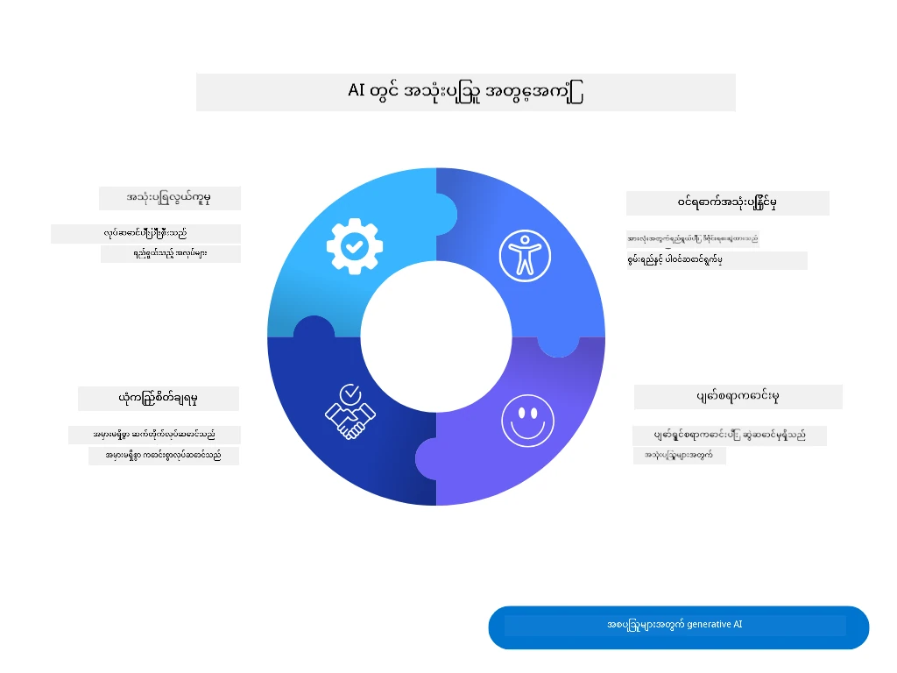
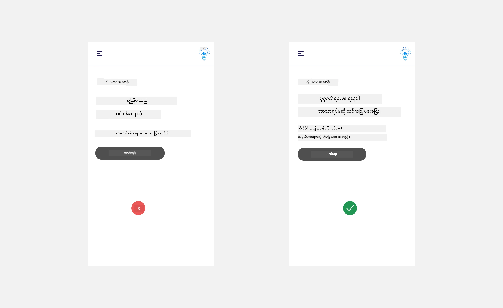
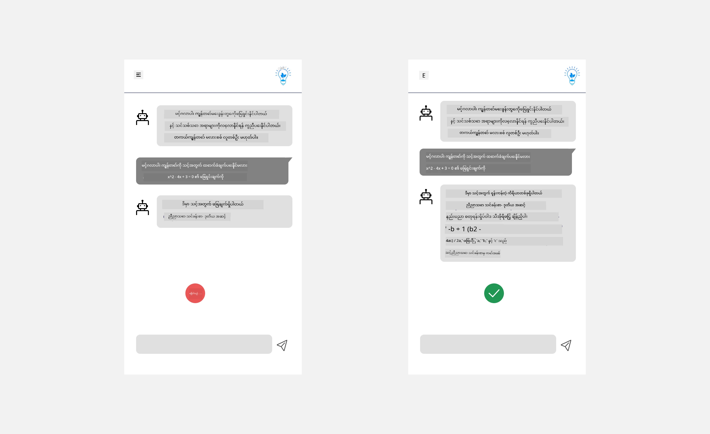
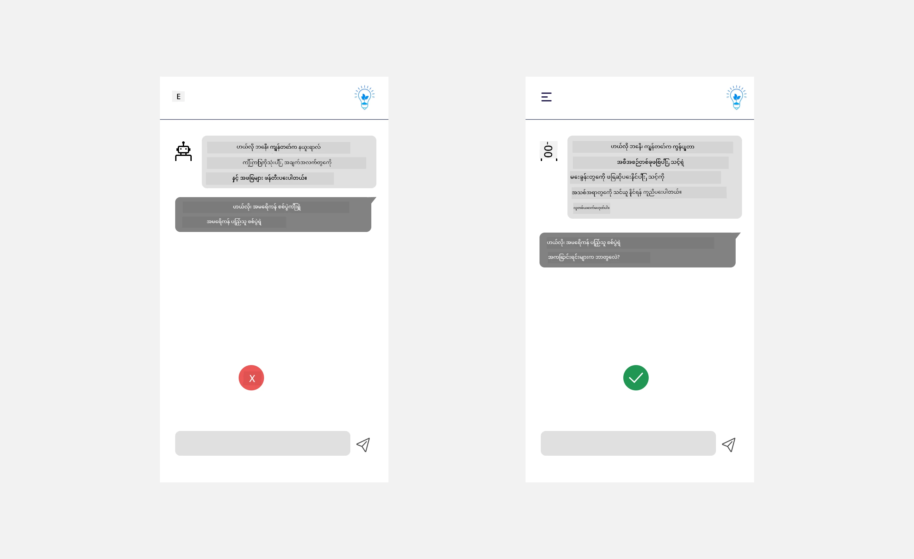
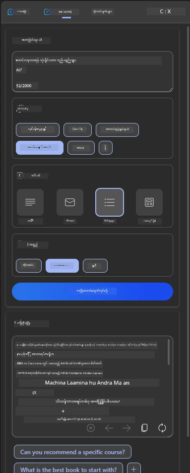
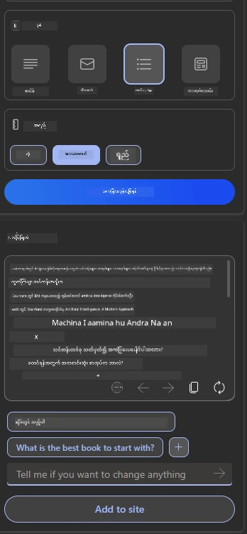
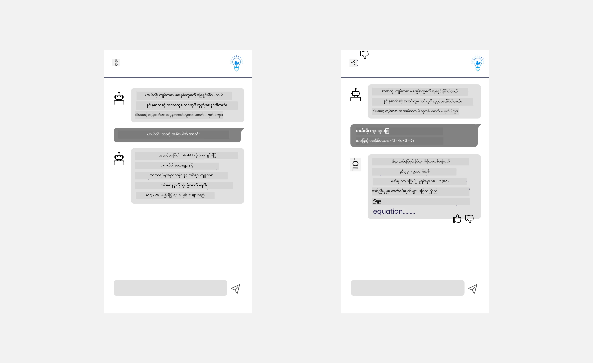

# AI လျှောက်လွှာများအတွက် UX ဒီဇိုင်းလုပ်ခြင်း

> _(ဓာတ်ပုံကိုနှိပ်၍ သင်ခန်းစာ ဗီဒီယိုကိုကြည့်ရှုပါ)_

အသုံးပြုသူအတွေ့အကြုံသည် အက်ပ်များ တည်ဆောက်ရာတွင် အလွန်အရေးကြီးသော အစိတ်အပိုင်းဖြစ်သည်။ အသုံးပြုသူများသည် သင့်အက်ပ်ကို တာဝန်ပြုလုပ်ရန် ထိရောက်စွာ အသုံးပြုနိုင်ရမည်။ ထိရောက်မှု ဆိုသည်မှာ တစ်ခုခုဖြစ်သည်၊ ဒါပေမဲ့လည်း စိတ်တိုင်းကျစွာ အသုံးပြုနိုင်စေရန်အတွက် အက်ပ်များကို ဒီဇိုင်းရေးဆွဲရမည်ဖြစ်ပြီး ၎င်းကို _လွယ်ကူစွာ ဝင်ရောက်နိုင်စေရန်_ ဖြစ်သည်။ ဤအခန်းတွင် ၎င်းကို ဦးတည်ပြီး လူတိုင်း အသုံးပြုနိုင်ပြီး အသုံးပြုလိုသော အက်ပ်ကို ဖန်တီးပြီးနောက်ဆုံးတွင် ဒီဇိုင်းရေးဆွဲနိုင်ရန် ရည်ရွယ်ပါသည်။

## နိဒါန်း

အသုံးပြုသူအတွေ့အကြုံဆိုသည်မှာ အသုံးပြုသူတစ်ဦးမှ သတ်မှတ်ထားသော ကုန်ပစ္စည်းသို့ ဝန်ဆောင်မှုတစ်ခုနှင့် အပြုအမူလုပ်ဆောင်ပုံဖြစ်သည်၊ ၎င်းမှာ စနစ်၊ ကိရိယာ သို့မဟုတ် ဒီဇိုင်းဖြစ်နိုင်သည်။ AI လျှောက်လွှာများ တည်ဆောက်ရာတွင် ဖန်တီးသူများသည် အသုံးပြုသူအတွေ့အကြုံ ထိရောက်မှုသာမက တရားဝင်မှန်ကန်မှုကိုလည်း အရေးထားသည်။ ဤသင်ခန်းစာတွင် AI လျှောက်လွှာများကို အသုံးပြုသူလိုအပ်ချက်များနှင့် ကိုက်ညီစေရန် တည်ဆောက်ခြင်းကို ဆွေးနွေးပါမည်။

သင်ခန်းစာတွင် အောက်ပါခေါင်းစဉ်များကို ဖုံးကွယ်ပါမည် -

- အသုံးပြုသူအတွေ့အကြုံနဲ့ အသုံးပြုသူလိုအပ်ချက်တွေ နားလည်ခြင်း
- ယုံကြည်မှုနှင့် ဖွင့်ဟပွင့်လင်းမှုအတွက် AI လျှောက်လွှာ ဒီဇိုင်းရေးဆွဲခြင်း
- ပူးပေါင်းဆောင်ရွက်မှုနှင့် တုံ့ပြန်ချက်အတွက် AI လျှောက်လွှာ ဒီဇိုင်းရေးဆွဲခြင်း

## သင်ယူရမည့် ရည်မှန်းချက်များ

ဤသင်ခန်းစာယူပြီးနောက် ရရှိနိုင်မည့် ပညာရပ်များမှာ -

- အသုံးပြုသူလိုအပ်ချက်များနှင့် ကိုက်ညီသည့် AI လျှောက်လွှာများ တည်ဆောက်နည်းနားလည်ခြင်း။
- ယုံကြည်မှုနှင့် ပူးပေါင်းဆောင်ရွက်မှုကို မြှင့်တင်သည့် AI လျှောက်လွှာများ ဒီဇိုင်းရေးဆွဲခြင်း။

### မျှော်မှန်းခြင်း

အချိန်ယူပြီး [အသုံးပြုသူအတွေ့အကြုံနှင့် ဒီဇိုင်းစဉ်းစားမှု](https://learn.microsoft.com/training/modules/ux-design?WT.mc_id=academic-105485-koreyst) ကို နက်ရှိုင်းစွာ ဖတ်ရှုပါ။

## အသုံးပြုသူအတွေ့အကြုံနဲ့ အသုံးပြုသူလိုအပ်ချက် အကြောင်းနိဒါန်း

ကျွန်ုပ်တို့၏ ဂျမ်း ကြားထဲရှိ ပညာရေး စတားတပ်ဖြစ်ရာတွင် ဆရာနှင့် ကျောင်းသား များသည် အဓိကအသုံးပြုသူ ၂ ဦးဖြစ်သည်။ အသုံးပြုသူ ၂ ဦးစလုံး၏ လိုအပ်ချက်များကွဲပြားသည်။ အသုံးပြုသူအလွန်အရေးထားသော ဒီဇိုင်းသည် အသုံးပြုသူများကို ဦးစားပေးပေးကာ ကုန်ပစ္စည်းများသည် ရည်ရွယ်ထားသော အသုံးပြုသူများအတွက် သက်ဆိုင်မှုရှိပြီး အကျိုးရှိစေရန် ဦးတည်သည်။

အက်ပ်သည် **အသုံးဝင်၊ ယုံကြည်စိတ်ချရ၊ ဝင်ရောက်လွယ်ကူစေရန်နှင့် နှစ်သက်စရာကောင်းရမည်**။

### လုပ်ဆောင်နိုင်မှု

အသုံးဝင်ခြင်းဆိုသည်မှာ အက်ပ်တွင် ၎င်း၏ ရည်ရွယ်ချက်နှင့် ကိုက်ညီသော လုပ်ဆောင်ချက်ရှိခြင်းဖြစ်သည်၊ ဥပမာအားဖြင့် အမှတ်ပေးခြင်းလုပ်ငန်းစဉ်ကို အလိုအလျောက်လုပ်ဆောင်ခြင်း သို့မဟုတ် ပြန်လည်သုံးသပ်ရန် flashcards ဖန်တီးခြင်း။ အမှတ်ပေးစနစ်ကို အလိုအလျောက်လုပ်ဆောင်ထားသော အက်ပ်သည် ကြိုတင်သတ်မှတ်ထားသော စံနှုန်းအရ ကျောင်းသား၏ အလုပ်များကို တိကျပြီး ထိရောက်စွာ အမှတ်ပေးနိုင်ရမည်။ ထိုသို့ပင် ပြန်လည်သုံးသပ် flashcards ဖန်တီးသော အက်ပ်သည် ၎င်း၏ ဒေတာအပေါ် မူတည်၍ သက်ဆိုင်ရာ နှင့် မတူကွဲပြားသော မေးခွန်းများ ဖန်တီးနိုင်ရမည်။

### ယုံကြည်စိတ်ချရမှု

ယုံကြည်စိတ်ချရမှု ဆိုသည်မှာ အက်ပ်သည် လုပ်ငန်းတာဝန်ကို မှားယွင်းခြင်းမရှိဘဲ တည်ငြိမ်စွာ ဆောင်ရွက်နိုင်ခြင်း ဖြစ်သည်။ သို့သော် AI တူညီသော လူတို့ကဲ့သို့ အကောင်းဆုံး မဟုတ်၍ အမှားဖြစ်ပွားနိုင်သည်။ အက်ပ်တစ်ခုခုတွင် အမှားများ သို့မဟုတ် မမျှော်လင့်သော အခြေအနေများ ဖြစ်ပွားနိုင်ပြီး လူ့အဖွဲ့အစည်း၏ အကူအညီ သို့မဟုတ် ပြင်ဆင်မှု လိုအပ်သည်။ မင်းသည် အမှားများကို မည်သို့ ကိုင်တွယ်ပေးမလဲ။ သင်ခန်းစာ၏ နောက်ဆုံးပိုင်းတွင် AI စနစ်များနှင့် အက်ပ်များကို ပူးပေါင်းဆောင်ရွက်မှုနှင့် တုံ့ပြန်မှုအတွက် ဒီဇိုင်းရေးဆွဲပုံကို ဆွေးနွေးပါမည်။

### ဝင်ရောက်လွယ်ကူမှု

ဝင်ရောက်လွယ်ကူခြင်းဆိုသည်မှာ မတူညီသော အရည်အချင်းများရှိသည့် အသုံးပြုသူများ အပါအဝင် အင်အားချို့တဲ့သူများအတွက် အသုံးပြုသူအတွေ့အကြုံ ကို ချဲ့ထွင်ပေးခြင်းဖြစ်ပြီး မည်သူမျှ မပြီးကျန်စေချေအောင် ဖြစ်စေရန်ဖြစ်သည်။ ဝင်ရောက်လွယ်ကူမှုလမ်းညွှန်ချက်များနှင့် သဘောတရားများကို လိုက်နာခြင်းဖြင့် AI ဖြေရှင်းချက်များသည် ပိုမိုကျယ်ပြန့်ပြီး အသုံးပြုရန်လွယ်ကူကောင်းမွန်စေပြီး အသုံးပြုသူအားလုံးအတွက် အကျိုးရှိစေမည်ဖြစ်သည်။

### နှစ်သက်စရာကောင်းမှု

နှစ်သက်စရာကောင်းမှု ဆိုသည်မှာ အက်ပ်ကို သုံးရန် နှစ်သက်စေခြင်းဖြစ်သည်။ ဆွဲဆောင်မှုရှိသော အသုံးပြုသူအတွေ့အကြုံသည် အသုံးပြုသူအား ထပ်မံလည်ပတ်ရန် လှုံ့ဆော်ပေးကာ စီးပွားရေး ဝင်ငွေကို မြှင့်တင်နိုင်သည်။

AI ဖြေရှင်းမှုပြဿနာအားလုံးကို ဖြေရှင်း၍ မရနိုင်ပါ။ AI သည် အသုံးပြုသူအတွေ့အကြုံကိုအတိုးပေါင်းပေးရန် ဖြစ်ပြီး အလက်မေးရှန်းလက်မှုများကို အလိုအလျောက်ပြုလုပ်ခြင်း သို့မဟုတ် အသုံးပြုသူအတွေ့အကြုံကို ကိုယ်ပိုင်သဘောအတိုင်း ပြုလုပ်ခြင်း ပါဝင်သည်။

## ယုံကြည်မှုနှင့် ဖွင့်ဟပွင့်လင်းမှုအတွက် AI လျှောက်လွှာ ဒီဇိုင်းရေးဆွဲခြင်း

AI လျှောက်လွှာဒီဇိုင်းလုပ်ရာတွင် ယုံကြည်မှုတည်ဆောက်ခြင်းသည် အရေးကြီးဆုံး ဖြစ်သည်။ ယုံကြည်မှုသည် အသုံးပြုသူအနေဖြင့် အက်ပ်သည် လုပ်ငန်းလိုအပ်ချက်ကို ပြီးမြောက်စွာ ဆောင်ရွက်မည်ဟု စိတ်ချရခြင်းဖြစ်ပြီး ရလဒ်များကို တည်ငြိမ်စွာ ပေးဆောင်သည်ဟု ယူဆသည်။ ဤကဏ္ဍတွင် ဖြစ်နိုင်သော အန္တရာယ်မှာ ယုံကြည်မှုမရှိခြင်းနှင့် အလွန်ယုံကြည်ခြင်းဖြစ်သည်။ ယုံကြည်မှုမရှိခြင်းဆိုသည်မှာ အသုံးပြုသူသည် AI စနစ်အပေါ် ယုံကြည်မှု အနည်းငယ် သို့မဟုတ် မရှိခြင်းဖြစ်ကာ ၎င်း၏ အက်ပ်ကို ပယ်ဖျက်စေပါသည်။ အလွန်ယုံကြည်ခြင်းသည် အသုံးပြုသူသည် AI စနစ်၏ စွမ်းဆောင်ရည်ကို များလွန်းစွာ ခန့်မှန်းခြင်းဖြစ်ကာ AI စနစ်ကို များလွန်စွာ ယုံကြည်သွားစေသည်။ ဥပမာအားဖြင့် အလိုအလျောက်အမှတ်ပေးစနစ်တွင် အလွန်ယုံကြည်မှုဖြစ်လျှင် ဆရာသည် အမှတ်ပေးစနစ်အလုပ်လုပ်နေကြောင်း သေချာစေရန် စာရွက်ပြား အချို့ကို ပြန်လည်စစ်ဆေးရန် မလိုလားတော့ပါ။ ၎င်းက ကျောင်းသားများအတွက် မတရားသော သို့မဟုတ် တိကျမှန်ကန်မှုမရှိသော အမှတ်များနှင့် တုံ့ပြန်ချက်များနှင့် တိုးတက်မှုအတွက် အခွင့်အလမ်းများ ပျက်ကွက်စေနိုင်သည်။

ယုံကြည်မှုကို ဒီဇိုင်း၏ အလယ်အလတ်တွင် တည်ဆောက်ရန် နည်းလမ်း နှစ်ခုမှာ ရှင်းပြနိုင်မှုနှင့် ထိန်းချုပ်မှုဖြစ်သည်။

### ရှင်းပြနိုင်မှု

AI သည် အနာဂတ်မျိုးဆက်များအား အသိပညာ ပေးပို့ရာတွင် ဆရာများနှင့် မိဘများသည် AI ဆုံးဖြတ်ချက်များ ဖန်တီးပုံကို နားလည်ရမည်ဖြစ်သည်။ ၎င်းကို ရှင်းပြနိုင်မှုဟု ဆိုသည်။ ရှင်းပြနိုင်မှုအတွက် ဒီဇိုင်းရေးဆွဲရာတွင် AI မည်သို့ အထွက်ရလဒ်ကို ရရှိခဲ့သည်ဆိုသည်ကို ထည့်သွင်း ဖော်ပြပေးရမည်။ ကြည့်ရှုသူများသည် ထုတ်လွှင့်ချက်သည် လူတစ်ယောက်မဟုတ်ဘဲ AI အားဖြင့် ဖန်တီးထားသည်ကို သိရှိရမည်။ ဥပမာအနေဖြင့် "ယခုမှာ သင်၏ဆရာပါ မျှဝေမှုကို စတင်ပေးပါ" ဟု မပြောဘဲ "သင့်လိုအပ်ချက်များနှင့် ကိုက်ညီပြီး သင့်အမြန်နှုန်းဖြင့် သင်ယူရန် ကူညီပေးသော AI ဆရာပါ သုံးပါ" ဟုပြောသင့်သည်။

နောက်ထပ် ဥပမာတစ်ခုမှာ AI သည် အသုံးပြုသူနှင့် ကိုယ်ရေးအချက်အလက်များကို မည်သို့ အသုံးပြုသနည်း ဖြစ်ပါသည်။ ဥပမာ ဝယ်ယူသူအနေနဲ့ ကျောင်းသား၊ Persona များအရ အကန့်အသတ်ရှိနိုင်သည်။ AI သည် မေးခွန်းများအတွက် ဖြေဆိုချက်များ ထုတ်ပြရန် မဖြစ်နိုင်ပေမယ့် ဝယ်သူအား ပြဿနာကို မည်သို့ဖြေရှင်းနိုင်သည်ကို လမ်းညွှန်ပေးနိုင်သည်။

ရှင်းပြနိုင်မှု၏ နောက်ဆုံးအချက်တစ်ခုမှာ ရှင်းပြချက်များကို ရိုးရှင်းစေရန် ဖြစ်သည်။ ကျောင်းသားများနှင့် ဆရာများမှာ AI ကျွမ်းကျင်သူ မဟုတ်နိုင်သဖြင့် အက်ပ်၏ လုပ်နိုင်မှု မလုပ်နိုင်မှုကို ရိုးရှင်းပြီး နားလည်လွယ်ကူစေရန် ရှင်းပြချက်များ ငြိမ်းသာစွာ ဖော်ပြသင့်သည်။

### ထိန်းချုပ်မှု

Generative AI သည် AI နှင့် အသုံးပြုသူတို့ ပူးပေါင်းဆောင်ရွက်မှု တစ်ခု ဖန်တီးပေးသည်။ ဥပမာ အသုံးပြုသူသည် ပြောင်းလဲမှုအတွက် prompt များကို ပြင်ဆင်နိုင်သည်။ ထို့အပြင် ထွက်ရှိလာသော အဖြေကို ဖြေရှင်းပြီးသည်နှင့် အသုံးပြုသူများသည် ရလဒ်များကို ပြင်ဆင်နိုင်ရန် လည်းလိုအပ်သည်။ ဥပမာ Microsoft Copilot (ရှေ့တွင် Bing Chat ဟုခေါ်) အသုံးပြုစဥ်တွင် ဖော်မတ်၊ အသံနှင့် အလျားပုံစံအရ မိမိ၏ prompt ကို ကိုက်ညီစေရန် ပြင်ဆင်နိုင်သည်။ ထို့အပြင် အောက်ပါ ပုံသဏ္ဍာန်အတိုင်း အသုံးပြုသူသည် ထွက်ရှိလာသော အဖြေကို ပြင်ဆင်သွားနိုင်သည်။

Microsoft Copilot တွင် အသုံးပြုသူများအား အက်ပ်အား ထိန်းချုပ်ခွင့် ပေးလျက်တစ်ခုမှာ AI သုံးသော ဒေတာကို သဘောတူဝင်ရောက်ခွင့်နှင့် သဘောမတူမလာခွင့် ပေးရန် အစီအစဉ်ဖြစ်သည်။ ကျောင်းအက်ပ်တွင် ကျောင်းသားသည် ၎င်း၏မှတ်စုများနှင့် ဆရာ၏ အရင်းအမြစ်များကို ပြန်လည်သုံးသပ်မှု ပစ္စည်းအဖြစ် အသုံးပြုလိုပါက အသုံးပြုနိုင်သည်။

> AI လျှောက်လွှာ ဒီဇိုင်းရေးဆွဲစဉ် တစ်ပြိုင်နက်တည်း ယုံကြည်မှု မယ့်ရိယာ ဂရုစိုက်မှုရှိစေရန် ပရိုမ့်များနှင့် ရလဒ်များအကြား အတားအဆီး ဖန်တီးခြင်းဖြင့် အသုံးပြုသူများ ဒီဇိုင်း၏ စွမ်းရည်ကို မဖြည့်ဆည်း မကောင်းစေလို့ AI နှင့် လူသားတို့ မတူညီကြောင်း သတိပေးရမည်။

## ပူးပေါင်းဆောင်ရွက်မှုနှင့် တုံ့ပြန်မှုအတွက် AI လျှောက်လွှာ ဒီဇိုင်းရေးဆွဲခြင်း

ယခင်တွင် ဖော်ပြသည့်အတိုင်း Generative AI သည် အသုံးပြုသူနှင့် AI တို့အကြား ပူးပေါင်းဆောင်ရွက်မှု တစ်ခု ဖန်တီးပေးသည်။ အများအားဖြင့် အသုံးပြုသူသည် prompt တစ်ခု ထည့်သွင်းပြီး AI က ထွက်ရှိလာသော အဖြေဖြစ်သည်။ ထွက်ရှိလာသော အဖြေ အမှားရှိခဲ့လျှင် မည်သို့ရန်။ အက်ပ်သည် အမှားဖြစ်ပါက မည်သို့ ကိုင်တွယ်သနည်း။ AI သည် အသုံးပြုသူအား အပြစ်မတင်ဘဲ အမှားကို ရှင်းပြသနည်း။

AI လျှောက်လွှာများတွင် တုံ့ပြန်မှု လက်ခံခြင်းနှင့် ပေးပို့နိုင်ရေး ဖန်တီးထားသင့်သည်။ ၎င်းသည် AI စနစ်တိုးတက်မှုအတွက်သာမက အသုံးပြုသူများနှင့် ယုံကြည်မှု တည်ဆောက်ရာတွင် အကျိုးရှိသည်။ တုံ့ပြန်မှု လည်ပတ်မှုချက် (Feedback loop) တစ်ခု ဒီဇိုင်းတွင် ပါဝင်သင့်ပြီး ဥပမာအနေဖြင့် အဓိပ္ပာယ်သားတဆင့် အဖြေကို လက်ခံသည်မှတ်ချက် ခလုတ်တစ်ခုဖြစ်နိုင်သည်။

အခြားနည်းလမ်းတစ်ခုမှာ စနစ်၏ စွမ်းရည်နှင့် ကန့်သတ်ချက်များကို ထိပ်တန်းတွင် ပြသပေးခြင်းဖြစ်သည်။ အသုံးပြုသူသည် AI စွမ်းရည်ကန့်သတ်ချက်များ ကျော်လွန်၍ အမှားပြုလုပ်ပါက ၎င်းကို ကိုင်တွယ်နိုင်ရေး နည်းလမ်းလည်း ပါဝင်သင့်သည်။

စနစ်အမှားများသည် AI သို့မဟုတ် အက်ပ်၏ ထင်ထားသည့် နယ်ပယ်များအတွင်း မဟုတ်သော သတင်းအချက်အလက်များအတွက် အသုံးပြုသူကူညီမှုလိုအပ်သော အခါများရှိသည်။ ထို့အပြင် အသုံးပြုသူတစ်ဦး တစ်ခါတစ်ရံ မေးခွန်းများ/ဘာသာရပ်များ များအောင် စုစည်းမှုကို ကန့်သတ်ထားသည်။ ဥပမာ History နှင့် Math အပေါ် အချက်အလက်ဖြင့် သတ်မှတ်ထားသည့် AI လျှောက်လွှာသည် မြေပြင်တိကျမှု မေးခွန်းများ ကို ကိုင်တွယ်၍ မရနိုင်လိမ့်မည်။ ဤအခြေအနေနှင့် ရင်ဆိုင်ရန် AI စနစ်သည် "တောင်းပန်ပါတယ်၊ ကျွန်ုပ်တို့၏ ထုတ်ကုန်သည် အောက်ပါဘာသာရပ်များအပေါ် သတင်းအချက်အလက်ဖြင့် သင်ကြားထားပြီး၊ မေးခွန်းအတွက် ဖြေဆို၍ မရပါ" ဟု ပြန်စာပို့နိုင်သည်။

AI လျှောက်လွှာများသည် အပြည့်မဖြစ်သောကြောင့် အမှားမှန်ဖွယ်ရှိသည်။ သင်၏အက်ပ်များကို ဒီဇိုင်းရေးဆွဲစဉ်တွင် အသုံးပြုသူများ အသစ်ဘာသာပြန်မှု အခွင့်အလမ်းနှင့် အမှားကိုင်တွယ်နည်းများကို ရိုးရှင်းပြီး နားလည်လွယ်ကူစေရန် သေချာစေပါ။

## တာဝန်ခံချက်

ယခုအချိန်ထိ ဖန်တီးထားသော AI လျှောက်လွှာများမှ မည်သည့်အက်ပ်ကိုမျှယူ၍ နောက်ပါ ရက်ပိုင်း အဆင့်များကို သင့်အက်ပ်တွင် ထည့်သွင်းစဥ်းစားပါ။

- **နှစ်သက်စရာကောင်းမှု:** သင့်အက်ပ်ကို ပိုမို နှစ်သက်စေရန် ပုံဖော်စဉ်းစားပါ။ သင်သည် ရှင်းပြချက်များအားလုံးတွင် ထည့်သွင်းနေပါသလား။ အသုံးပြုသူအား စူးစမ်းရန်နှိုးဆော်ပြီးပါသလား။ အမှားစာသားများအား မည်သို့ ဖော်ပြထားပါသလဲ။

- **လုပ်ဆောင်နိုင်မှု:** ဝက်ဘ်အက်ပ်တစ်ခု တည်ဆောက်ခြင်း။ သင့်အက်ပ်ကို မှန်သမျှ နှိပ်ကလစ်နှင့် ရိုက်နှိပ်ကီးဘုတ်မှ ဆွဲထုတ်နိုင်ရန် သေချာစေပါ။

- **ယုံကြည်မှုနှင့် ဖွင့်ဟပွင့်လင်းမှု:** AI အား လုံးဝ ယုံကြည်မှုမထားရ။ ၎င်း၏ ထွက်ရှိမှုကိုလည်း ယုံကြည်မှုမထားရ။ ထွက်ရှိမှုသေချာမှု စစ်ဆေးရန် လူမှုဆက်ဆံရေးတစ်ယောက် ထည့်သွင်းရေးဆွဲပါ။ ထို့ပြင် ယုံကြည်မှုနှင့် ဖွင့်ဟပွင့်လင်းမှု ရရှိရေး နည်းလမ်းများ ငြိမ်းအေးစွာ လက်တွေ့ဆောင်ရွက်ပါ။

- **ထိန်းချုပ်မှု:** အသုံးပြုသူအား ကိုယ်ပိုင် ဒေတာကို အက်ပ်ထံ ပေးပို့မှုကို ထိန်းချုပ်ပိုင်ခွင့် ပေးပါ။ AI အက်ပ်တွင် ဒေတာစုဆောင်းမှုမှ ဝင်ရောက်ပါက သို့ ဦးထွက်ရန် လမ်းကို ဖန်တီးပါ။

<!-- ## [Post-lecture quiz](../../../12-designing-ux-for-ai-applications/quiz-url) -->

## သင်ယူနေဆဲ သင်ခန်းစာများ ဆက်လက်ကြည့်ရှုပါ!

ဤသင်ခန်းစာပြီးဆုံးပြီးနောက်မှာ [Generative AI သင်ယူမှု စုစည်းမှု](https://aka.ms/genai-collection?WT.mc_id=academic-105485-koreyst) မှာ သွားပြီး သင်၏ Generative AI ဗဟုသုတကို အဆင့်မြှင့်လိုက်ပါ!

သင်ခန်းစာ ၁၃ သို့ ချက်ချင်းသွားကြည့်လိုက်ကြပါစို့၊ အဲမှာ ကျွန်ုပ်တို့သည် [AI လျှောက်လွှာလုံခြုံရေး](../13-securing-ai-applications/README.md?WT.mc_id=academic-105485-koreyst) ကို ပြန်လည်လေ့လာပါမည်။

---

<!-- CO-OP TRANSLATOR DISCLAIMER START -->
**ပြောကြားချက်**
ဤစာတမ်းကို AI ဘာသာပြန်ဝန်ဆောင်မှု [Co-op Translator](https://github.com/Azure/co-op-translator) အသုံးပြု၍ ဘာသာပြန်ထားပါသည်။ ကျွန်ုပ်တို့သည် တိကျမှန်ကန်မှုအတွက် ကြိုးပမ်းနေသော်လည်း၊ စက်ကိရိယာဘာသာပြန်ခြင်းများတွင် အမှားများ သို့မဟုတ် မှားယွင်းချက်များ ပါဝင်နိုင်ကြောင်း သတိပြုပါရန် လိုအပ်ပါသည်။ မူလစာတမ်းကို မူရင်းဘာသာဖြင့်သာ ယုံကြည်စိတ်ချရသော အချက်အလက်အဖြစ် သတ်မှတ်သင့်သည်။ အရေးကြီးသည့် သတင်းအချက်အလက်များအတွက် ပရော်ဖက်ရှင်နယ် လူသားဘာသာပြန်သူဝန်ဆောင်မှုကို အကြံပြုပါသည်။ ဤဘာသာပြန်ချက်ကို အသုံးပြုခြင်းမှ ဖြစ်ပေါ်လာသော နားလည်မှုကွာခြားမှုများ သို့မဟုတ် မမှန်ကန်သော အသုံးပြုမှုများအတွက် ကျွန်ုပ်တို့ တာဝန်မခံပါ။
<!-- CO-OP TRANSLATOR DISCLAIMER END -->