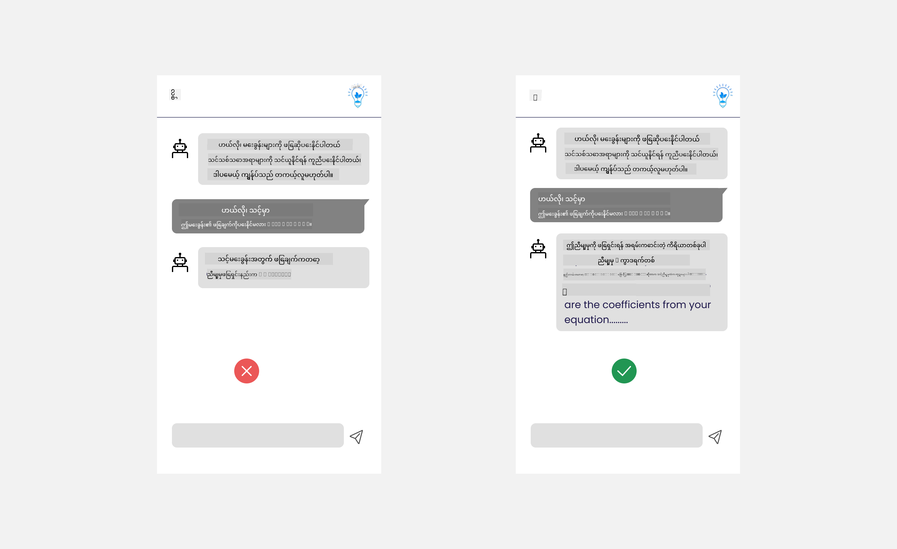

<!--
CO_OP_TRANSLATOR_METADATA:
{
  "original_hash": "78bbeed50fd4dc9fdee931f5daf98cb3",
  "translation_date": "2025-10-18T01:51:24+00:00",
  "source_file": "12-designing-ux-for-ai-applications/README.md",
  "language_code": "my"
}
-->
# AI အက်ပလီကေးရှင်းများအတွက် UX ဒီဇိုင်းရေးဆွဲခြင်း

> _(အထက်ပါပုံကိုနှိပ်ပြီး ဒီသင်ခန်းစာရဲ့ ဗီဒီယိုကို ကြည့်ပါ)_

အသုံးပြုသူအတွေ့အကြုံ (User Experience) သည် အက်ပလီကေးရှင်းတစ်ခုကို တည်ဆောက်ရာတွင် အရေးကြီးသော အပိုင်းတစ်ခုဖြစ်သည်။ အသုံးပြုသူများသည် သင့်အက်ပလီကေးရှင်းကို အကျိုးရှိရှိ အသုံးပြုနိုင်ရန် လိုအပ်သည်။ အကျိုးရှိခြင်းသည် အရေးကြီးသော်လည်း အက်ပလီကေးရှင်းများကို လူတိုင်းအသုံးပြုနိုင်ရန် _လွယ်ကူမှု_ ရှိအောင် ဒီဇိုင်းရေးဆွဲရန်လည်း လိုအပ်သည်။ ဒီအခန်းမှာ ဒီအပိုင်းကို အဓိကထားပြီး သင့်အက်ပလီကေးရှင်းကို လူတိုင်းအသုံးပြုနိုင်ပြီး အသုံးပြုချင်စေမည့်အတိုင်း ဒီဇိုင်းရေးဆွဲနိုင်ရန် အထောက်အကူဖြစ်စေမည့်အကြောင်းကို ရှင်းလင်းထားပါသည်။

## မိတ်ဆက်

အသုံးပြုသူအတွေ့အကြုံ (User Experience) သည် အသုံးပြုသူတစ်ဦးသည် အထူးသတ်မှတ်ထားသော ထုတ်ကုန် သို့မဟုတ် ဝန်ဆောင်မှု (စနစ်၊ ကိရိယာ၊ ဒီဇိုင်း) တစ်ခုနှင့် အပြန်အလှန်ဆက်သွယ်မှု ဖြစ်သည်။ AI အက်ပလီကေးရှင်းများကို တီထွင်ရာတွင် Developer များသည် အသုံးပြုသူအတွေ့အကြုံကို ထိရောက်မှုရှိစေရန်သာမက ကျင့်ဝတ်အရလည်း အာရုံစိုက်ရသည်။ ဒီသင်ခန်းစာမှာ အသုံးပြုသူလိုအပ်ချက်များကို ဖြေရှင်းနိုင်သော Artificial Intelligence (AI) အက်ပလီကေးရှင်းများကို တည်ဆောက်ပုံကို လေ့လာပါမည်။

ဒီသင်ခန်းစာမှာ အောက်ပါအပိုင်းများကို လေ့လာပါမည်-

- အသုံးပြုသူအတွေ့အကြုံနှင့် အသုံးပြုသူလိုအပ်ချက်များကို နားလည်ခြင်း
- ယုံကြည်မှုနှင့် ထင်ရှားမှုအတွက် AI အက်ပလီကေးရှင်းများကို ဒီဇိုင်းရေးဆွဲခြင်း
- ပူးပေါင်းဆောင်ရွက်မှုနှင့် အကြံပြုချက်များအတွက် AI အက်ပလီကေးရှင်းများကို ဒီဇိုင်းရေးဆွဲခြင်း

## သင်ယူရမည့်ရည်မှန်းချက်များ

ဒီသင်ခန်းစာကို လေ့လာပြီးနောက် သင်သည်-

- အသုံးပြုသူလိုအပ်ချက်များကို ဖြေရှင်းနိုင်သော AI အက်ပလီကေးရှင်းများကို တည်ဆောက်ပုံကို နားလည်နိုင်မည်။
- ယုံကြည်မှုနှင့် ပူးပေါင်းဆောင်ရွက်မှုကို မြှင့်တင်နိုင်သော AI အက်ပလီကေးရှင်းများကို ဒီဇိုင်းရေးဆွဲနိုင်မည်။

### ကြိုတင်လိုအပ်ချက်

[အသုံးပြုသူအတွေ့အကြုံနှင့် ဒီဇိုင်းအတွေးအခေါ်](https://learn.microsoft.com/training/modules/ux-design?WT.mc_id=academic-105485-koreyst) အကြောင်းကို အချိန်ယူပြီး ဖတ်ရှုပါ။

## အသုံးပြုသူအတွေ့အကြုံနှင့် အသုံးပြုသူလိုအပ်ချက်များကို နားလည်ခြင်း

ကျွန်ုပ်တို့၏ စိတ်ကူးယဉ်ပညာရေးစတားတပ်တွင် အဓိကအသုံးပြုသူနှစ်ဦးရှိပြီး ဆရာ/ဆရာမများနှင့် ကျောင်းသားများဖြစ်သည်။ အသုံးပြုသူနှစ်ဦးစလုံးတွင် ထူးခြားသောလိုအပ်ချက်များရှိသည်။ အသုံးပြုသူကို ဦးစားပေးထားသော ဒီဇိုင်းသည် ထုတ်ကုန်များကို ရည်ရွယ်ထားသောသူများအတွက် သက်ဆိုင်မှုရှိပြီး အကျိုးရှိစေရန် ဦးစားပေးသည်။

အက်ပလီကေးရှင်းသည် **အသုံးဝင်မှု၊ ယုံကြည်မှု၊ လွယ်ကူမှုနှင့် သက်တောင့်သက်သာရှိမှု** ရှိသင့်ပြီး အသုံးပြုသူအတွေ့အကြုံကောင်းမွန်မှုကို ပေးစွမ်းနိုင်ရန် လိုအပ်သည်။

### အသုံးဝင်မှု

အသုံးဝင်မှုဆိုသည်မှာ အက်ပလီကေးရှင်းသည် ရည်ရွယ်ထားသော ရည်ရွယ်ချက်နှင့် ကိုက်ညီသော လုပ်ဆောင်ချက်များရှိသည်ကို ဆိုလိုသည်။ ဥပမာအားဖြင့် အမှတ်ပေးခြင်းလုပ်ငန်းစဉ်ကို အလိုအလျောက်လုပ်ဆောင်ခြင်း သို့မဟုတ် ပြန်လည်သုံးသပ်ရန် flashcards များကို ဖန်တီးခြင်းစသည်ဖြင့် ဖြစ်သည်။ အမှတ်ပေးခြင်းလုပ်ငန်းစဉ်ကို အလိုအလျောက်လုပ်ဆောင်သော အက်ပလီကေးရှင်းသည် သတ်မှတ်ထားသော စံနှုန်းများအရ ကျောင်းသားများ၏ အလုပ်များကို တိကျပြီး ထိရောက်စွာ အမှတ်ပေးနိုင်ရမည်။ ထို့အပြင် ပြန်လည်သုံးသပ်ရန် flashcards များကို ဖန်တီးသော အက်ပလီကေးရှင်းသည် ၎င်း၏ ဒေတာအရ သက်ဆိုင်သော မေးခွန်းများနှင့် အမျိုးမျိုးသော မေးခွန်းများကို ဖန်တီးနိုင်ရမည်။

### ယုံကြည်မှု

ယုံကြည်မှုဆိုသည်မှာ အက်ပလီကေးရှင်းသည် ၎င်း၏လုပ်ငန်းကို အဆက်မပြတ် အမှားမရှိဘဲ လုပ်ဆောင်နိုင်သည်ကို ဆိုလိုသည်။ သို့သော် AI သည် လူသားများကဲ့သို့ ပြည့်စုံမှုမရှိဘဲ အမှားများဖြစ်ပေါ်နိုင်သည်။ အက်ပလီကေးရှင်းများသည် အမှားများ သို့မဟုတ် လူသားများ၏ အထောက်အကူဖြင့် ဖြေရှင်းရန် လိုအပ်သော အလွန်ဆန်းကြယ်သော အခြေအနေများကို ကြုံတွေ့နိုင်သည်။ အမှားများကို မည်သို့ကိုင်တွယ်မည်နည်း။ ဒီသင်ခန်းစာ၏ နောက်ဆုံးအပိုင်းတွင် AI စနစ်များနှင့် အက်ပလီကေးရှင်းများကို ပူးပေါင်းဆောင်ရွက်မှုနှင့် အကြံပြုချက်များအတွက် မည်သို့ဒီဇိုင်းရေးဆွဲရမည်ကို လေ့လာပါမည်။

### လွယ်ကူမှု

လွယ်ကူမှုဆိုသည်မှာ အတားအဆီးများမရှိဘဲ အသုံးပြုသူအတွေ့အကြုံကို အမျိုးမျိုးသော စွမ်းရည်များရှိသော အသုံးပြုသူများထံသို့ တိုးချဲ့ပေးခြင်းဖြစ်သည်။ အထူးသဖြင့် မသန်စွမ်းသူများအပါအဝင် လူတိုင်းအတွက် အသုံးဝင်ပြီး အကျိုးရှိစေရန် Accessibility လမ်းညွှန်ချက်များနှင့် မူဝါဒများကို လိုက်နာခြင်းဖြစ်သည်။

### သက်တောင့်သက်သာရှိမှု

သက်တောင့်သက်သာရှိမှုဆိုသည်မှာ အက်ပလီကေးရှင်းကို အသုံးပြုရတာ ပျော်ရွှင်ဖွယ်ကောင်းသည်ကို ဆိုလိုသည်။ သက်တောင့်သက်သာရှိသော အသုံးပြုသူအတွေ့အကြုံသည် အသုံးပြုသူအပေါ် အကျိုးသက်ရောက်မှုကောင်းမွန်စေပြီး အက်ပလီကေးရှင်းကို ပြန်လည်အသုံးပြုရန် အားပေးစေပြီး စီးပွားရေးဝင်ငွေကို တိုးတက်စေသည်။

AI သည် အခက်အခဲများအားလုံးကို ဖြေရှင်းပေးနိုင်မည်မဟုတ်ပါ။ AI သည် သင့်အသုံးပြုသူအတွေ့အကြုံကို မြှင့်တင်ရန် အထောက်အကူပြုရန်ဖြစ်ပြီး လက်နက်ဖြင့်လုပ်ဆောင်ရမည့်အလုပ်များကို အလိုအလျောက်လုပ်ဆောင်ခြင်း သို့မဟုတ် အသုံးပြုသူအတွေ့အကြုံကို ကိုယ်ပိုင်အတိုင်း ပြုလုပ်ပေးခြင်းတို့ဖြစ်သည်။

## ယုံကြည်မှုနှင့် ထင်ရှားမှုအတွက် AI အက်ပလီကေးရှင်းများကို ဒီဇိုင်းရေးဆွဲခြင်း

AI အက်ပလီကေးရှင်းများကို ဒီဇိုင်းရေးဆွဲရာတွင် ယုံကြည်မှုကို အဓိကထားရသည်။ ယုံကြည်မှုသည် အသုံးပြုသူကို အက်ပလီကေးရှင်းသည် အလုပ်ကို ပြီးမြောက်စေမည်၊ အဆက်မပြတ် ရလဒ်များကို ပေးစွမ်းမည်နှင့် အသုံးပြုသူလိုအပ်ချက်များကို ဖြေရှင်းပေးနိုင်မည်ဟု ယုံကြည်စေသည်။ ဒီဧရိယာတွင် အန္တရာယ်ရှိသောအရာမှာ ယုံကြည်မှုမရှိခြင်းနှင့် အလွန်ယုံကြည်ခြင်းဖြစ်သည်။ ယုံကြည်မှုမရှိခြင်းသည် အသုံးပြုသူသည် AI စနစ်ကို အားနည်းသည်ဟု ယုံကြည်ခြင်းဖြစ်ပြီး ၎င်းသည် သင့်အက်ပလီကေးရှင်းကို ပယ်ချခြင်းဖြစ်စေသည်။ အလွန်ယုံကြည်ခြင်းသည် အသုံးပြုသူသည် AI စနစ်၏ စွမ်းရည်ကို အလွန်အကျွံ ခန့်မှန်းခြင်းဖြစ်ပြီး အသုံးပြုသူများသည် AI စနစ်ကို အလွန်ယုံကြည်ခြင်းဖြစ်စေသည်။ ဥပမာအားဖြင့် အမှတ်ပေးခြင်းစနစ်သည် အလွန်ယုံကြည်မှုရှိသောအခါ ဆရာ/ဆရာမသည် အမှတ်ပေးစနစ်ကောင်းစွာ လုပ်ဆောင်နိုင်မည်ကို အတည်ပြုရန် အချို့သောစာရွက်များကို ပြန်လည်ကြည့်ရှုရန် မလိုအပ်သည်ဟု ယူဆနိုင်သည်။ ၎င်းသည် ကျောင်းသားများအတွက် မတရားသော သို့မဟုတ် မမှန်ကန်သော အမှတ်များ သို့မဟုတ် အကြံပြုချက်နှင့် တိုးတက်မှုအခွင့်အလမ်းများကို လွဲချော်စေမည်ဖြစ်သည်။

ယုံကြည်မှုကို ဒီဇိုင်း၏ အဓိကအချက်အနေဖြင့် သေချာစေရန် နည်းလမ်းနှစ်ခုရှိသည်- ထင်ရှားမှုနှင့် ထိန်းချုပ်မှု။

### ထင်ရှားမှု

AI သည် အနာဂတ်မျိုးဆက်များကို အသိပညာပေးခြင်းကဲ့သို့သော ဆုံးဖြတ်ချက်များကို အတည်ပြုရာတွင် အရေးကြီးသောအခါ ဆရာ/ဆရာမများနှင့် မိဘများသည် AI ဆုံးဖြတ်ချက်များကို မည်သို့လုပ်ဆောင်သည်ကို နားလည်ရန် လိုအပ်သည်။ ၎င်းကို ထင်ရှားမှုဟုခေါ်သည်- AI အက်ပလီကေးရှင်းများသည် မည်သို့ဆုံးဖြတ်ချက်များကို လုပ်ဆောင်သည်ကို နားလည်ခြင်း။ ထင်ရှားမှုအတွက် ဒီဇိုင်းရေးဆွဲခြင်းသည် AI သည် output ကို မည်သို့ရောက်ရှိလာသည်ကို ဖော်ပြသော အသေးစိတ်အချက်များကို ထည့်သွင်းခြင်းဖြစ်သည်။ Output ကို လူသားမှမဟုတ်ဘဲ AI မှ ဖန်တီးထားသည်ကို ပရိသတ်များ သိရှိရမည်။ ဥပမာအားဖြင့် "Start chatting with your tutor now" ဟု ဆိုခြင်းအစား "Use AI tutor that adapts to your needs and helps you learn at your pace" ဟု ဆိုပါ။

AI သည် အသုံးပြုသူနှင့် ကိုယ်ရေးအချက်အလက်များကို မည်သို့အသုံးပြုသည်ဆိုသည်ကို ထင်ရှားစေရန် အခြားဥပမာတစ်ခုဖြစ်သည်။ ဥပမာအားဖြင့် ကျောင်းသား၏ persona ကို အသုံးပြုသူအနေဖြင့် AI သည် ၎င်း၏ persona အပေါ် အကန့်အသတ်များရှိနိုင်သည်။ AI သည် မေးခွန်းများ၏ အဖြေများကို ဖော်ပြနိုင်မည်မဟုတ်သော်လည်း အသုံးပြုသူကို ပြဿနာကို မည်သို့ဖြေရှင်းနိုင်မည်ကို စဉ်းစားရန် လမ်းညွှန်ပေးနိုင်သည်။

ထင်ရှားမှု၏ နောက်ဆုံးအရေးကြီးသော အပိုင်းတစ်ခုမှာ ရှင်းလင်းသော ရှင်းလင်းချက်များဖြစ်သည်။ ကျောင်းသားများနှင့် ဆရာ/ဆရာမများသည် AI အထူးကျွမ်းကျင်သူများမဟုတ်သဖြင့် အက်ပလီကေးရှင်းသည် မည်သို့လုပ်ဆောင်နိုင်သည် သို့မဟုတ် မလုပ်ဆောင်နိုင်သည်ကို ရှင်းလင်းချက်များသည် ရိုးရှင်းပြီး နားလည်ရလွယ်ကူရမည်။

### ထိန်းချုပ်မှု

Generative AI သည် AI နှင့် အသုံးပြုသူအကြား ပူးပေါင်းဆောင်ရွက်မှုကို ဖန်တီးပေးပြီး ဥပမာအားဖြင့် အသုံးပြုသူသည် output များကို ပြောင်းလဲနိုင်သည်။ ထို့အပြင် output ကို ဖန်တီးပြီးနောက် အသုံးပြုသူများသည် output ကို ပြောင်းလဲနိုင်ရန် အခွင့်အာဏာရှိသင့်သည်။ ဥပမာအားဖြင့် Bing ကို အသုံးပြုသောအခါ format၊ tone နှင့် length အပေါ် အခြေခံပြီး prompt ကို ပြင်ဆင်နိုင်သည်။ ထို့အပြင် output ကို ပြင်ဆင်ပြီး output ကို ပြောင်းလဲနိုင်သည်။

Bing တွင် အသုံးပြုသူသည် အက်ပလီကေးရှင်းကို ထိန်းချုပ်နိုင်စေရန် အခြားသော feature တစ်ခုမှာ AI သည် အသုံးပြုသူ၏ ဒေတာကို အသုံးပြုရန် သို့မဟုတ် မသုံးရန် ရွေးချယ်နိုင်ခြင်းဖြစ်သည်။ ကျောင်းအက်ပလီကေးရှင်းတစ်ခုအတွက် ကျောင်းသားတစ်ဦးသည် ၎င်း၏မှတ်စုများနှင့် ဆရာ/ဆရာမ၏ အရင်းအမြစ်များကို ပြန်လည်သုံးသပ်ရန် အကြောင်းအရာအဖြစ် အသုံးပြုလိုနိုင်သည်။

> AI အက်ပလီကေးရှင်းများကို ဒီဇိုင်းရေးဆွဲရာတွင် အသုံးပြုသူများသည် AI ကို အလွန်ယုံကြည်ပြီး ၎င်း၏စွမ်းရည်များအပေါ် မျှော်လင့်ချက်များကို မမှန်ကန်စေမည့် ရည်ရွယ်ချက်ရှိမှုသည် အရေးကြီးသည်။ ၎င်းကို ပြုလုပ်ရန် နည်းလမ်းတစ်ခုမှာ prompt များနှင့် result များအကြား အတားအဆီးကို ဖန်တီးခြင်းဖြစ်သည်။ အသုံးပြုသူကို ၎င်းသည် AI ဖြစ်ပြီး လူသားမဟုတ်ကြောင်း သတိပေးခြင်းဖြစ်သည်။

## ပူးပေါင်းဆောင်ရွက်မှုနှင့် အကြံပြုချက်များအတွက် AI အက်ပလီကေးရှင်းများကို ဒီဇိုင်းရေးဆွဲခြင်း

အရင်

---

**အကြောင်းကြားချက်**:  
ဤစာရွက်စာတမ်းကို AI ဘာသာပြန်ဝန်ဆောင်မှု [Co-op Translator](https://github.com/Azure/co-op-translator) ကို အသုံးပြု၍ ဘာသာပြန်ထားပါသည်။ ကျွန်ုပ်တို့သည် တိကျမှုအတွက် ကြိုးစားနေသော်လည်း အလိုအလျောက် ဘာသာပြန်မှုများတွင် အမှားများ သို့မဟုတ် မမှန်ကန်မှုများ ပါဝင်နိုင်သည်ကို သတိပြုပါ။ မူရင်းဘာသာစကားဖြင့် ရေးသားထားသော စာရွက်စာတမ်းကို အာဏာတရားရှိသော အရင်းအမြစ်အဖြစ် သတ်မှတ်သင့်ပါသည်။ အရေးကြီးသော အချက်အလက်များအတွက် လူက ဘာသာပြန်မှုကို အကြံပြုပါသည်။ ဤဘာသာပြန်မှုကို အသုံးပြုခြင်းမှ ဖြစ်ပေါ်လာသော အလွဲအမှားများ သို့မဟုတ် အနားလွဲမှုများအတွက် ကျွန်ုပ်တို့သည် တာဝန်မယူပါ။