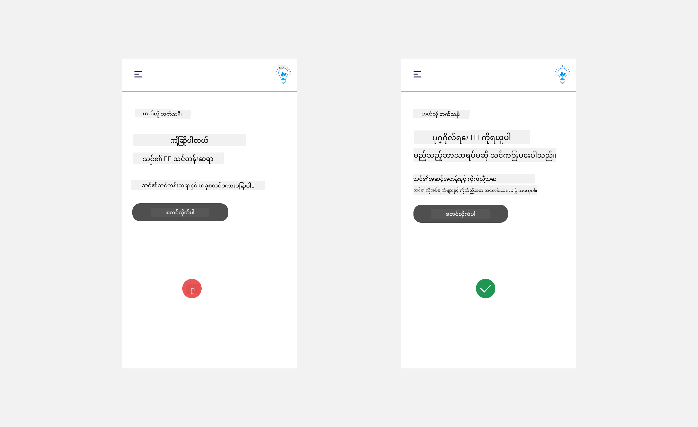
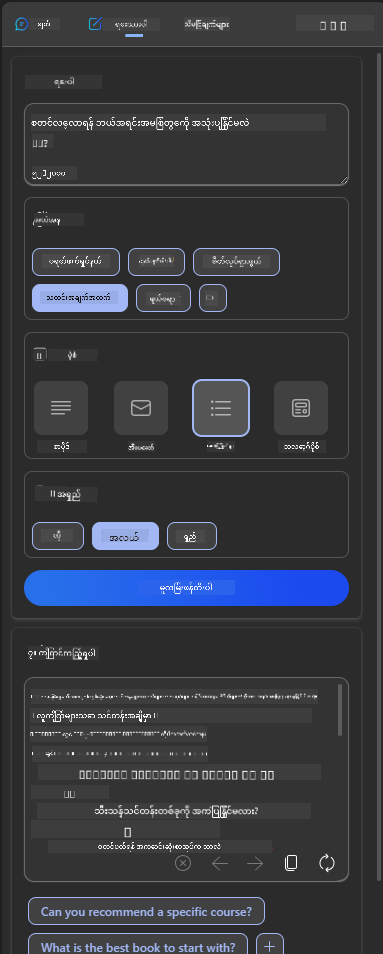
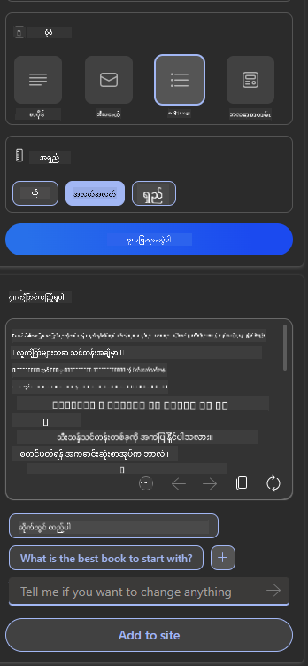
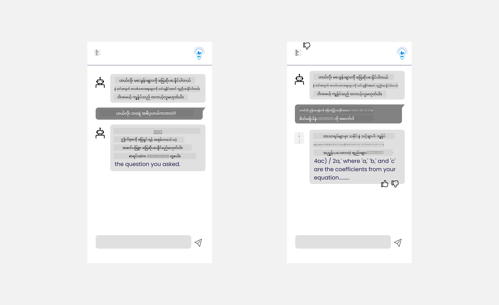

<!--
CO_OP_TRANSLATOR_METADATA:
{
  "original_hash": "747668e4c53d067369f06e9ec2e6313e",
  "translation_date": "2025-08-26T20:03:46+00:00",
  "source_file": "12-designing-ux-for-ai-applications/README.md",
  "language_code": "my"
}
-->
# AI အက်ပ်များအတွက် UX ဒီဇိုင်းဆွဲခြင်း

> _(အထက်ပါပုံကိုနှိပ်ပြီး ဒီသင်ခန်းစာရဲ့ ဗီဒီယိုကိုကြည့်နိုင်ပါတယ်)_

အသုံးပြုသူအတွေ့အကြုံ (User experience) ဆိုတာ အက်ပ်တစ်ခုတည်ဆောက်ရာမှာ အရေးကြီးဆုံးအချက်တစ်ခုပါပဲ။ အသုံးပြုသူတွေက သင့်အက်ပ်ကို အလုပ်လုပ်ဖို့ အချိန်ကုန်သက်သာစွာ အသုံးပြုနိုင်ဖို့လိုပါတယ်။ အချိန်ကုန်သက်သာတာတစ်ခုတည်းမကဘဲ၊ လူတိုင်းအတွက် အသုံးပြုနိုင်အောင် ဒီဇိုင်းဆွဲဖို့လည်းလိုပါတယ်။ ဒါကြောင့် _လူတိုင်းအတွက် အသုံးပြုနိုင်အောင်_ (accessible) ဖြစ်ဖို့လိုပါတယ်။ ဒီအခန်းမှာ ဒီအကြောင်းအရာတွေကို အဓိကထားပြီး သင်ဒီဇိုင်းဆွဲမယ့်အက်ပ်ကို လူတွေ အသုံးပြုချင်စေဖို့၊ အသုံးပြုနိုင်စေဖို့ ရည်ရွယ်ထားပါတယ်။

## မိတ်ဆက်

အသုံးပြုသူအတွေ့အကြုံဆိုတာ အသုံးပြုသူတစ်ယောက်ဟာ စနစ်၊ ကိရိယာ၊ ဒီဇိုင်း တစ်ခုခုနဲ့ ဘယ်လိုအပြန်အလှန်လုပ်ဆောင်တယ်၊ ဘယ်လိုအသုံးပြုတယ်ဆိုတာပါ။ AI အက်ပ်တွေဖန်တီးတဲ့အခါမှာ၊ Developer တွေက အသုံးပြုသူအတွေ့အကြုံက ထိရောက်မှုရှိစေဖို့သာမက၊ သာမန်ကျင့်ဝတ်နဲ့လည်း ကိုက်ညီစေဖို့ အာရုံစိုက်ကြပါတယ်။ ဒီသင်ခန်းစာမှာတော့ အသုံးပြုသူလိုအပ်ချက်တွေကို ဖြေရှင်းပေးနိုင်တဲ့ Artificial Intelligence (AI) အက်ပ်တွေ ဘယ်လိုတည်ဆောက်ရမလဲဆိုတာကို လေ့လာသွားမှာပါ။

ဒီသင်ခန်းစာမှာ အောက်ပါအကြောင်းအရာတွေ ပါဝင်ပါမယ်-

- အသုံးပြုသူအတွေ့အကြုံနဲ့ အသုံးပြုသူလိုအပ်ချက်နားလည်ခြင်း မိတ်ဆက်
- ယုံကြည်မှုနဲ့ ပွင့်လင်းမြင်သာမှုအတွက် AI အက်ပ်ဒီဇိုင်းဆွဲခြင်း
- ပူးပေါင်းဆောင်ရွက်မှုနဲ့ တုံ့ပြန်ချက်အတွက် AI အက်ပ်ဒီဇိုင်းဆွဲခြင်း

## သင်ယူရမယ့်ရည်ရွယ်ချက်များ

ဒီသင်ခန်းစာပြီးသွားရင် သင်တတ်မြောက်နိုင်မှာတွေက-

- အသုံးပြုသူလိုအပ်ချက်တွေကို ဖြည့်ဆည်းပေးနိုင်တဲ့ AI အက်ပ်တွေ ဘယ်လိုတည်ဆောက်ရမလဲ နားလည်နိုင်မယ်။
- ယုံကြည်မှုနဲ့ ပူးပေါင်းဆောင်ရွက်မှုကို မြှင့်တင်ပေးနိုင်တဲ့ AI အက်ပ်ဒီဇိုင်းဆွဲနိုင်မယ်။

### ကြိုတင်သိထားရမယ့်အချက်

[အသုံးပြုသူအတွေ့အကြုံနဲ့ ဒီဇိုင်းစဉ်းစားနည်း](https://learn.microsoft.com/training/modules/ux-design?WT.mc_id=academic-105485-koreyst) အကြောင်း နောက်ထပ်ဖတ်ရှုပါ။

## အသုံးပြုသူအတွေ့အကြုံနဲ့ အသုံးပြုသူလိုအပ်ချက်နားလည်ခြင်း မိတ်ဆက်

ကျွန်ုပ်တို့ရဲ့ စိတ်ကူးထဲက ပညာရေးစတတ်အပ်တစ်ခုမှာ ဆရာတွေနဲ့ ကျောင်းသားတွေ ဆိုပြီး အသုံးပြုသူအဓိကနှစ်ယောက်ရှိပါတယ်။ အသုံးပြုသူနှစ်ယောက်စလုံးမှာ ကိုယ်ပိုင်လိုအပ်ချက်တွေရှိပါတယ်။ အသုံးပြုသူအခြေပြု ဒီဇိုင်းဆိုတာ အသုံးပြုသူအတွက် သက်ဆိုင်မှုရှိပြီး အကျိုးရှိစေဖို့ ဦးစားပေးထားတာပါ။

အက်ပ်တစ်ခုက **အသုံးဝင်၊ ယုံကြည်စိတ်ချရ၊ လူတိုင်းအသုံးပြုနိုင်၊ သုံးရအဆင်ပြေ** ဖြစ်ဖို့လိုပါတယ်။

### အသုံးဝင်မှု (Usability)

အသုံးဝင်တယ်ဆိုတာ အက်ပ်က ရည်ရွယ်ချက်နဲ့ ကိုက်ညီတဲ့ လုပ်ဆောင်ချက်တွေပါဝင်ရမယ်။ ဥပမာ- အမှတ်ပေးလုပ်ငန်းကို အလိုအလျောက်လုပ်ပေးတာ၊ သင်ခန်းစာပြန်လေ့လာဖို့ flashcard တွေဖန်တီးပေးတာစသဖြင့်။ အမှတ်ပေးလုပ်ငန်းကို အလိုအလျောက်လုပ်ပေးတဲ့အက်ပ်ဆိုရင် သတ်မှတ်ထားတဲ့စံနှုန်းအရ ကျောင်းသားတွေရဲ့အလုပ်ကို မှန်ကန်မြန်မြန်ဆန်ဆန် အမှတ်ပေးနိုင်ရမယ်။ Flashcard ဖန်တီးတဲ့အက်ပ်ဆိုရင်လည်း သက်ဆိုင်တဲ့မေးခွန်းတွေ၊ မတူညီတဲ့မေးခွန်းတွေ ဖန်တီးနိုင်ရမယ်။

### ယုံကြည်စိတ်ချရမှု (Reliability)

ယုံကြည်စိတ်ချရတယ်ဆိုတာ အက်ပ်က တစ်သမတ်တည်း အမှားမရှိဘဲ လုပ်ဆောင်နိုင်ရမယ်။ ဒါပေမယ့် AI ကလည်း လူနဲ့တူတူ မပြည့်စုံနိုင်ဘူး၊ အမှားတွေဖြစ်နိုင်တယ်။ အက်ပ်တွေမှာလည်း အမှားတွေ၊ မမျှော်လင့်ထားတဲ့အခြေအနေတွေ ဖြစ်နိုင်တယ်။ ဒီလိုအမှားတွေကို ဘယ်လိုကိုင်တွယ်မလဲ? ဒီသင်ခန်းစာရဲ့ နောက်ဆုံးပိုင်းမှာ AI စနစ်တွေ၊ အက်ပ်တွေကို ပူးပေါင်းဆောင်ရွက်မှုနဲ့ တုံ့ပြန်ချက်အတွက် ဘယ်လိုဒီဇိုင်းဆွဲရမလဲဆိုတာကို လေ့လာသွားမှာပါ။

### လူတိုင်းအသုံးပြုနိုင်မှု (Accessibility)

လူတိုင်းအသုံးပြုနိုင်တယ်ဆိုတာ မတူညီတဲ့စွမ်းရည်ရှိတဲ့ အသုံးပြုသူတွေအပါအဝင် မည်သူမဆို အသုံးပြုနိုင်အောင် ဖြစ်စေဖို့ပါ။ လူအပေါင်းတို့အတွက် အသုံးဝင်၊ အသုံးပြုရလွယ်ကူတဲ့ AI ဖြေရှင်းချက်တွေ ဖြစ်လာစေဖို့ အသုံးပြုသူအတွက် သတ်မှတ်ချက်တွေလိုက်နာရပါမယ်။

### သုံးရအဆင်ပြေမှု (Pleasant)

သုံးရအဆင်ပြေတယ်ဆိုတာ အက်ပ်ကို သုံးရတာ ပျော်စရာကောင်းတယ်။ အသုံးပြုသူအတွေ့အကြုံက သက်သာချောမွေ့ရင် အသုံးပြုသူတွေ ပြန်လာသုံးဖို့ အားပေးစေပြီး လုပ်ငန်းအမြတ်တိုးလာနိုင်ပါတယ်။

AI နဲ့ မဖြေရှင်းနိုင်တဲ့ စိန်ခေါ်မှုတွေလည်းရှိပါတယ်။ AI က သင့်အသုံးပြုသူအတွေ့အကြုံကို တိုးတက်အောင် လုပ်ပေးနိုင်ပါတယ်၊ ဥပမာ- လက်/manual လုပ်ရတဲ့အလုပ်တွေကို အလိုအလျောက်လုပ်ပေးတာ၊ အသုံးပြုသူအတွေ့အကြုံကို ကိုယ်ပိုင်အောင်လုပ်ပေးတာစသဖြင့်။

## ယုံကြည်မှုနဲ့ ပွင့်လင်းမြင်သာမှုအတွက် AI အက်ပ်ဒီဇိုင်းဆွဲခြင်း

AI အက်ပ်ဒီဇိုင်းဆွဲတဲ့အခါ ယုံကြည်မှုတည်ဆောက်တာ အရေးကြီးပါတယ်။ ယုံကြည်မှုရှိမှ အသုံးပြုသူက အက်ပ်က အလုပ်လုပ်ပေးနိုင်မယ်၊ အမြဲတမ်းရလဒ်ကောင်းတွေထုတ်ပေးနိုင်မယ်၊ ကိုယ်လိုချင်တာကိုပေးနိုင်မယ်လို့ ယုံကြည်နိုင်ပါတယ်။ ဒီနေရာမှာ မယုံကြည်တာနဲ့ အလွန်ယုံကြည်တာ ဆိုတဲ့ အန္တရာယ်တွေရှိပါတယ်။ မယုံကြည်တာဆိုတာ အသုံးပြုသူက AI စနစ်ကို ယုံကြည်မှုနည်းတာ၊ ဒါကြောင့် သင့်အက်ပ်ကို ငြင်းပယ်သွားနိုင်တယ်။ အလွန်ယုံကြည်တာဆိုတာ အသုံးပြုသူက AI စနစ်ရဲ့စွမ်းရည်ကို လွန်လွန်ကဲကဲ ယုံကြည်တာ၊ ဒါကြောင့် AI ကို အလွန်ယုံကြည်သွားတယ်။ ဥပမာ- အမှတ်ပေးစနစ်ကို အလွန်ယုံကြည်သွားရင် ဆရာက စနစ်အလုပ်လုပ်တာမှန်မမှန် စစ်ဆေးဖို့ မလုပ်တော့နိုင်ဘူး။ ဒါကြောင့် ကျောင်းသားတွေအတွက် မတရားတဲ့အမှတ်၊ မှားယွင်းတဲ့အမှတ်တွေ ထွက်လာနိုင်တယ်၊ တုံ့ပြန်ချက်နဲ့ တိုးတက်မှုအခွင့်အလမ်းတွေ လွတ်သွားနိုင်တယ်။

ယုံကြည်မှုကို ဒီဇိုင်းအလယ်ဗဟိုမှာထားဖို့ explainability နဲ့ control ဆိုတဲ့နည်းလမ်းနှစ်ခုရှိပါတယ်။

### Explainability

AI က ဆုံးဖြတ်ချက်တွေကို အနာဂတ်မျိုးဆက်တွေကို သင်ကြားပေးဖို့ ကူညီတဲ့အခါ ဆရာတွေနဲ့ မိဘတွေက AI ဆုံးဖြတ်ချက်တွေ ဘယ်လိုလုပ်တယ်ဆိုတာ နားလည်ဖို့ အရေးကြီးပါတယ်။ ဒါကို explainability လို့ခေါ်တယ်- AI အက်ပ်တွေ ဘယ်လိုဆုံးဖြတ်ချက်ချတယ်ဆိုတာ နားလည်ခြင်း။ Explainability အတွက် ဒီဇိုင်းဆွဲတဲ့အခါ AI က output ကို ဘယ်လိုရောက်လာတယ်ဆိုတာ အသေးစိတ်ဖော်ပြပေးရမယ်။ Output ကို AI က generate လုပ်တာလို့ အသုံးပြုသူသိအောင်လုပ်ပေးရမယ်၊ လူမဟုတ်ဘူးဆိုတာသိအောင်။ ဥပမာ- "Start chatting with your tutor now" လို့မပြောဘဲ "သင့်လိုအပ်ချက်နဲ့ ကိုက်ညီအောင် ပြောင်းလဲနိုင်တဲ့ AI tutor ကို သုံးပြီး သင့်အလျင်နှုန်းနဲ့ သင်ယူပါ" လို့ပြောနိုင်ပါတယ်။

နောက်ထပ် ဥပမာတစ်ခုက AI က အသုံးပြုသူ data နဲ့ ကိုယ်ရေးအချက်အလက်ကို ဘယ်လိုသုံးတယ်ဆိုတာပါ။ ဥပမာ- ကျောင်းသားပုံစံ (persona) နဲ့ အသုံးပြုသူတစ်ယောက်မှာ သူ့ပုံစံအရ ကန့်သတ်ချက်တွေရှိနိုင်တယ်။ AI က မေးခွန်းအဖြေကို တိုက်ရိုက်မပြောပေးနိုင်ပေမယ့် ပြဿနာကို ဘယ်လိုဖြေရှင်းရမလဲဆိုတာ လမ်းညွှန်ပေးနိုင်တယ်။

Explainability ရဲ့ နောက်ထပ်အရေးကြီးတဲ့အချက်က ရှင်းလင်းလွယ်ကူတဲ့ရှင်းပြချက်တွေပါ။ ကျောင်းသားတွေနဲ့ ဆရာတွေက AI ပညာရှင်တွေမဟုတ်နိုင်လို့ အက်ပ်က ဘာလုပ်နိုင်လဲ၊ ဘာလုပ်မနိုင်လဲဆိုတာ ရိုးရှင်းလွယ်ကူအောင် ရှင်းပြပေးရမယ်။

### Control

Generative AI က AI နဲ့ အသုံးပြုသူအကြား ပူးပေါင်းဆောင်ရွက်မှုတစ်ခု ဖြစ်လာစေပါတယ်၊ ဥပမာ- အသုံးပြုသူက prompt ကို ပြင်ဆင်ပြီး ရလဒ်ကွဲပြားတာတွေ ရနိုင်ပါတယ်။ Output တစ်ခု generate လုပ်ပြီးရင်လည်း အသုံးပြုသူက ရလဒ်ကို ပြင်ဆင်နိုင်ရမယ်၊ ကိုယ်ပိုင်ထိန်းချုပ်မှုရှိစေဖို့ပါ။ ဥပမာ- Bing ကိုသုံးတဲ့အခါ format, tone, length အပေါ်မူတည်ပြီး prompt ကို ပြင်နိုင်ပါတယ်။ Output ကိုလည်း ပြင်နိုင်ပါတယ်၊ အောက်ပါပုံလိုပါပဲ-

Bing ရဲ့ နောက်ထပ်အင်္ဂါရပ်တစ်ခုက အသုံးပြုသူက AI သုံးတဲ့ data ကို opt in, opt out လုပ်နိုင်တာပါ။ ကျောင်းအက်ပ်တစ်ခုမှာ ကျောင်းသားတစ်ယောက်က သူ့မှတ်စုတွေနဲ့ ဆရာရဲ့အရင်းအမြစ်တွေကို ပြန်လေ့လာဖို့ သုံးချင်နိုင်ပါတယ်။

> AI အက်ပ်ဒီဇိုင်းဆွဲတဲ့အခါ အသုံးပြုသူတွေက AI ကို အလွန်ယုံကြည်ပြီး မဖြစ်နိုင်တဲ့မျှော်လင့်ချက်တွေ မထားစေရန် ရည်ရွယ်ချက်ရှိရှိ ဒီဇိုင်းဆွဲဖို့ အရေးကြီးပါတယ်။ ဒီလိုလုပ်နိုင်ဖို့ နည်းလမ်းတစ်ခုက prompt နဲ့ result အကြား အနည်းငယ်အတားအဆီးရှိအောင်လုပ်ပေးတာပါ။ အသုံးပြုသူကို ဒီဟာက AI ဖြစ်ပြီး လူမဟုတ်ဘူးလို့ သတိပေးပေးပါ။

## ပူးပေါင်းဆောင်ရွက်မှုနဲ့ တုံ့ပြန်ချက်အတွက် AI အက်ပ်ဒီဇိုင်းဆွဲခြင်း

အထက်မှာပြောခဲ့သလို Generative AI က အသုံးပြုသူနဲ့ AI အကြား ပူးပေါင်းဆောင်ရွက်မှုတစ်ခု ဖြစ်လာစေပါတယ်။ အများစုက အသုံးပြုသူက prompt တစ်ခုထည့်ပြီး AI က output တစ်ခု generate လုပ်ပေးတာပါ။ Output မှားနေရင်ရော? အက်ပ်က အမှားတွေကို ဘယ်လိုကိုင်တွယ်မလဲ? AI က အသုံးပြုသူကို အပြစ်တင်သလား၊ ဒါမှမဟုတ် အမှားကို ရှင်းပြပေးသလား?

AI အက်ပ်တွေမှာ တုံ့ပြန်ချက်လက်ခံနိုင်၊ ပြန်ပေးနိုင်တဲ့စနစ်ပါဝင်သင့်ပါတယ်။ ဒါက AI စနစ်ကို တိုးတက်လာစေသလို အသုံးပြုသူတွေနဲ့ ယုံကြည်မှုတည်ဆောက်နိုင်ပါတယ်။ Feedback loop တစ်ခု ဒီဇိုင်းထဲမှာ ထည့်သင့်ပါတယ်၊ ဥပမာ- output မှာ thumbs up, thumbs down လုပ်နိုင်တာမျိုးပါ။

နောက်ထပ်နည်းလမ်းတစ်ခုက စနစ်ရဲ့ စွမ်းရည်နဲ့ ကန့်သတ်ချက်တွေကို ရှင်းလင်းစွာ ဆက်သွယ်ပေးတာပါ။ အသုံးပြုသူက AI စွမ်းရည်ထက်ကျော်လွန်တဲ့အရာတောင်းဆိုရင်လည်း ကိုင်တွယ်နိုင်တဲ့နည်းလမ်းရှိသင့်ပါတယ်၊ အောက်ပါပုံလိုပါပဲ။

စနစ်အမှားတွေက အက်ပ်တွေမှာ မကြာခဏဖြစ်တတ်ပါတယ်၊ အသုံးပြုသူက AI နဲ့မသက်ဆိုင်တဲ့အချက်အလက်လိုချင်တာ၊ ဒါမှမဟုတ် အက်ပ်က မေးခွန်း/ဘာသာရပ်အရေအတွက်ကန့်သတ်ထားတာမျိုးပါ။ ဥပမာ- AI အက်ပ်တစ်ခုက သတ်မှတ်ထားတဲ့ဘာသာရပ် (ဥပမာ- သမိုင်း၊ သင်္ချာ) တွေကိုပဲ သင်ကြားထားရင် ပထဝီဝင်နဲ့ပတ်သက်တဲ့မေးခွန်းတွေကို ဖြေမပေးနိုင်ပါဘူး။ ဒီလိုအခါမှာ AI စနစ်က "ဝမ်းနည်းပါတယ်၊ ကျွန်ုပ်တို့ရဲ့ထုတ်ကုန်ကို အောက်ပါဘာသာရပ်တွေမှာပဲ သင်ကြားထားတာပါ... သင်မေးတဲ့မေးခွန်းကို ဖြေမပေးနိုင်ပါဘူး" ဆိုပြီး ပြန်ပြောနိုင်ပါတယ်။

AI အက်ပ်တွေက ပြည့်စုံမဖြစ်နိုင်ပါဘူး၊ ဒါကြောင့် အမှားတွေ

---

**သတိပေးချက်**:
ဤစာရွက်စာတမ်းကို AI ဘာသာပြန်ဝန်ဆောင်မှု [Co-op Translator](https://github.com/Azure/co-op-translator) ကို အသုံးပြု၍ ဘာသာပြန်ထားပါသည်။ ကျွန်ုပ်တို့သည် တိကျမှုအတွက် ကြိုးစားနေသော်လည်း၊ အလိုအလျောက် ဘာသာပြန်မှုများတွင် အမှားများ သို့မဟုတ် မတိကျမှုများ ပါဝင်နိုင်သည်ကို သတိပြုပါ။ မူရင်းစာရွက်စာတမ်းသည် မူလဘာသာစကားဖြင့် အာဏာပိုင်အရင်းအမြစ်အဖြစ် ယူဆသင့်ပါသည်။ အရေးကြီးသော အချက်အလက်များအတွက် လူ့ဘာသာပြန်ပညာရှင်များကို အသုံးပြုရန် အကြံပြုပါသည်။ ဤဘာသာပြန်မှုကို အသုံးပြုခြင်းကြောင့် ဖြစ်ပေါ်လာနိုင်သော နားလည်မှုမှားခြင်း သို့မဟုတ် အနားလည်မှားခြင်းများအတွက် ကျွန်ုပ်တို့သည် တာဝန်ယူမည်မဟုတ်ပါ။