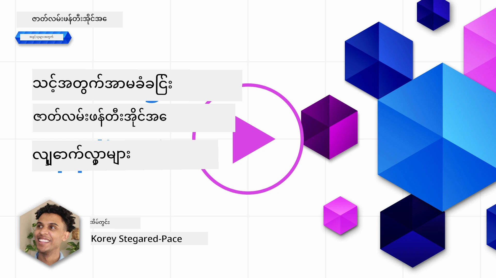
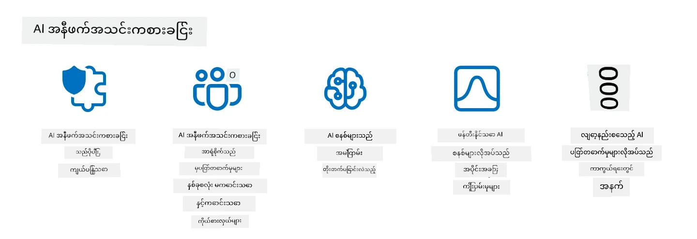

# သင့်စျေးကွက် AI လျှောက်လွှာများကို ဘေးကင်းအောင်ထားခြင်း

## နိဒါန်း

ဤသင်ခန်းစာတွင် ပါဝင်မည့် အကြောင်းအရာများမှာ -

- AI စနစ်များ၏ အတွင်းပိုင်းလုံျခုံရေး။
- AI စနစ်များနှင့် သက်ဆိုင်သော ပုံမှန်အန္တရာယ်များနှင့် အတားအဆီးများ။
- AI စနစ်များကို လုံခြုံစွာ ထိန်းသိမ်းရန် နည်းလမ်းများနှင့် စဉ်းစားစရာများ။

## သင်ယူရမည့် ရည်မှန်းချက်များ

ဤသင်ခန်းစာပြီးဆုံးခဲ့ပါက သင် သဘောပေါက်လာမည့်အချက်များမှာ -

- AI စနစ်များကို ရင်ဆိုင်နေရသည့် အန္တရာယ်များနှင့် အတားအဆီးများ။
- AI စနစ်များကို လုံခြုံစွာ ထိန်းသိမ်းရန် အသုံးပြုကြသော ပုံမှန်နည်းလမ်းများနှင့် လေ့လာမှုများ။
- လုံခြုံရေး စမ်းသပ်မှုများကို လျှောက်ထားခြင်းဖြင့် မမျှော်လင့်ထားသော ရလဒ်များနှင့် အသုံးပြုသူ ယုံကြည်မှု ဖျက်ဆီးမှုမှ ကာကွယ်နိုင်ခြင်း။

## စျေးကွက် AI အတွင်းပိုင်းတွင် လုံခြုံရေး ဆိုသည်မှာ ဘာလဲ?

အတုခွန်ချ Artificial Intelligence (AI) နှင့် Machine Learning (ML) နည်းပညာများသည် ကျွန်ုပ်တို့၏ ဘဝကို ပိုမိုပြောင်းလဲလာသဖြင့် သုံးစွဲသူဒေတာသာမက AI စနစ်များကိုလည်း ကာကွယ်ရမည်ဖြစ်သည်။ AI/ML ကို မမှန်ကန်သောဆုံးဖြတ်ချက် ခွဲခြားမှုများအတွက် အထောက်အကူပြုသော စိတ်ဖြင့် အသုံးပြုသော စက်မှုလုပ်ငန်းများတွင် အရေးကြီးဆုံး အစိတ်အပိုင်းများအဖြစ် အသုံးပြုလျက် ရှိသည်။

ဤနေရာတွင် စဉ်းစားရမည့် အချက်အလက်များမှာ -

- **AI/ML ၏ သက်ရောက်မှု**: AI/ML သည် နေ့စဉ်ဘဝအပေါ် အရေးပါသော သက်ရောက်မှုရှိပြီး ထိုမှကြောင့် ၎င်းတို့အား ကာကွယ်ခြင်းမှာ မရှိမဖြစ် လိုအပ်သည်။
- **လုံခြုံရေး စိန်ခေါ်မှုများ**: AI/ML ၏ သက်ရောက်မှုသည် AI အခြေပြု ထုတ်ကုန်များကို တိုက်ခိုက်မှုများမှ ကာကွယ်ရန် သတိထားစေရန် လိုအပ်သည်။
- **မဟာဗျူဟာဆိုင်ရာ ပြဿနာများ**: နည်းပညာ စက်မှုလက်မှုကဏ္ဍသည် ရေရှည်သုံး များတွင် သုံးစွဲသူလုံခြုံမှုနှင့် ဒေတာလုံခြုံရေးများကို စနစ်တကျ ကာကွယ်ရန် လိုအပ်ပါသည်။

ထပ်မံလေ့လာခြင်းအနေဖြင့် Machine Learning မော်ဒယ်များမှာ မကောင်းမှုရှိသော အချက်အလက်နှင့် ရိုးရှင်းသည့် ခြားနားချက်ကို မခွဲခြားနိုင်ပါ။ သင်ကြားမှုအချက်အလက်များမှာ အများပြည်သူ ဒေတာကောက်ခံမှုများမှ ရရှိသည်၊ ၎င်းတို့မှာ တတိယပါတီများထံမှ တက်ကြွစွာ ပါဝင်မှုရှိသည်။ တိုက်ခိုက်သူများသည် ဒေတာစုစည်းမှုကို ပေးဆောင်ခြင်းအားဖြင့် အချက်အလက်များဖြည့်စွက်နိုင်သည်။ အချိန်ဖြတ်သန်းရာမှ မတိတျသော ဒေတာများသည် မှန်ကန်သော ဒေတာအဖြစ် သတ်မှတ်ခံရသည်။

ထိုကြောင့် မော်ဒယ်များ သုံးသော ဒေတာ စနစ်များ၏ အပြည့်အစုံဖြင့် လုံခြုံရေးရှိ စေရန် လိုအပ်သည်။

## AI ၏ အန္တရာယ်များနှင့် စိုးရိမ်ရမှုများကို နားလည်ခြင်း

AI နဲ့ ဆက်စပ်သော စနစ်များတွင် ဒေတာပွိုင့်ဆိုးခြင်း (Data Poisoning) သည် ယနေ့အတွက် အရေးပါဆုံး လုံခြုံရေး အန္တရာယ်တစ်ခုဖြစ်သည်။ ဒေတာပွိုင့်ဆိုးခြင်းမှာ မည်သူမဆို ကိုယ့် AI ကို မှားယွင်းစေဖို့ အချက်အလက် သယ်ယူ သွားသောအချက်များကို ရည်ရွယ်မှန်းချက်ဖြင့် ပြောင်းလဲခြင်း ဖြစ်သည်။ စံချိန်စံညွှန်း လက်ခံခြင်းနှင့် ကာကွယ်မှု နည်းလမ်းများ မရှိခြင်းအတွက်၊ သိပ်သည်းအဓိပ္ပါယ်မရှိသော ဒေတာ စုစည်းခြင်းဖြင့် သင်ကြားမှု ရှင်းလင်းမှု မရှိခြင်းကြောင့် ဖြစ်သည်။ ဒါကြောင့် ဒေတာ တည်နေရာနှင့် လမ်းကြောင်းကို မှတ်တမ်းတင်ထားရန် မရှိမဖြစ် လိုအပ်သည်၊ အထူးသဖြင့် “မထူးချွန်တဲ့ ဒေတာနဲ့ မထူးချွန်တဲ့ ရလဒ်” ဆိုတဲ့ စကားပုံမှန်ပါ။

ဒေတာပွိုင့်ဆိုးခြင်း၏ မော်ဒယ်များအပေါ် သက်ရောက်မှု ဥပမာများမှာ -

1. **တံဆိပ်လှည့်ပြောင်းခြင်း (Label Flipping)** - နှစ်မိတ်စုံခွဲခြားခြင်းလုပ်ငန်းတွင် တိုက်ခိုက်သူသည် သင်ကြားရေး ဒေတာ အစုလေးတစ်စု၏ တံဆိပ်များကို ရည်ရွယ်၍ လှည့်ပြောင်းသည်။ ဥပမာ၊ သာမန်နမူနာများကို ဆိုးရွားသောအဖြစ် အမှားတပ်သည်။\
   **ဥပမာ**: စပမ်းဖိုင်တာတစ်ခုက မူနှင့်မညီသော အီးမေးလ်များကို စပမ်းအဖြစ် မှားယူခြင်း။
2. **ဖော်မြူလာ ပွိုင့်ဆိုးခြင်း (Feature Poisoning)** - တိုက်ခိုက်သူသည် သင်ကြားရေး ဒေတာပေါ်ရှိ ဖခင်ဆိုင်ရာ အချက်များကို အသေးအဖွဲပြောင်းလဲခြင်းဖြင့် မော်ဒယ်အား လှည့်ဖြည့်ခြင်း သို့မဟုတ် လမ်းမမှန်စေသည်။\
   **ဥပမာ**: ထုတ်ကုန်ဖော်ပြချက်များတွင် အဆက်မပြတ် မသင့်တော်သော စကားလုံးများ ထည့်သွင်းခြင်း။
3. **ဒေတာ ထည့်သွင်းခြင်း (Data Injection)** - သင်ကြားရေး ဒေတာထဲသို့ ဆိုးရွားသော ဒေတာ များ ထည့်သွင်းခြင်း။\
   **ဥပမာ**: မဟုတ်သော အသုံးပြုသူပြန်လည်သုံးသပ်မှုများ ထည့်သွင်းပြီး အာရုံခံ စာရိုက်မှု လေ့လာမှု များကို ခြွင်းချက်ဖြစ်စေခြင်း။
4. **နောက်တံခါးတိုက်ခိုက်မှုများ (Backdoor Attacks)** - တိုက်ခိုက်သူသည် သင်ကြားရေး ဒေတာအတွင်း မျှဝေသော ပုံစံလှ_hidden pattern ကို ထည့်သွင်းသည်။ မော်ဒယ်မှာ ၎င်းကို အသိအမှတ်ပြုသောအခါ ဆိုးရွားသော အပြုအမူ ပြုတတ်သည်။\
   **ဥပမာ**: ပုံမှန် မော်ဒယ်လက်တွေ့သုံး မျက်နှာအသိအမှတ် စနစ်နှင့် ၎င်း၏ နောက်တံခါးပုံများဖြင့် သတ်မှတ်သူကို မှားယွင်းစွာ သတ်မှတ်ခြင်း။

MITRE Corporation မှ [ATLAS (Adversarial Threat Landscape for Artificial-Intelligence Systems)](https://atlas.mitre.org/?WT.mc_id=academic-105485-koreyst) ကို ဖန်တီးထားပြီး AI စနစ်များအပေါ် တိုက်ခိုက်သူများ၏ ရွေးချယ်ထားသော နည်းလမ်းများနှင့် နည်းပညာများကို သိရှိနိုင်သည်။

> AI ပေါင်းစပ်စနစ်များတွင် တိုးတက်လာသော အားနည်းချက်များစွာ ရှိနေပြီး၊ AI ထည့်သွင်းခြင်းကြောင့် ရှေ့မှီ ထိုးနှက်မှုများအား ကျဆင်းရဲ့ဘက်မှ တိုးတက်လာသည်။ ကျွန်တော်တို့ ATLAS ကို ဖန်တီးပြီး ထူးခြားသော နှင့် တိုးတက်လာသော အားနည်းချက်များကို အားပေးထိန်းသိမ်းနိုင်စေရန် ဖြစ်သည်။ ATLAS ကို MITRE ATT&CK® ပုံစံအတိုင်း ဖန်တီးပြီး ATT&CK ၏ နည်းလမ်းများနှင့် နည်းဗျူဟာများကို ထောက်ပံ့ပေးပါသည်။

MITRE ATT&CK® ပုံစံသည် ယေဘုယျကြံစည်မှုလုံခြုံရေးတွင် ကြီးမားသော အသုံးများပြီး ထိုပုံစံအတိုင်း ATLAS သည် ခေတ်မီတိုက်ခိုက်မှုများ နှင့် တိုက်ရိုက်ရင်ဆိုင်ရန် စနစ်များကို ပိုမိုနားလည်ရန်နှင့် ပြင်ဆင်ရန် မဖြစ်မနေလိုအပ်သော နည်းလမ်းများကို ရှာဖွေ ပေးပါသည်။

ထို့အတူ Open Web Application Security Project (OWASP) မှ LLM များ အသုံးပြုသော လျှောက်လွှာများရှိ အရေးကြီးဆုံး အားနည်းချက်များကို "[ထိပ်တန်း ၁၀ စာရင်း](https://llmtop10.com/?WT.mc_id=academic-105485-koreyst)" အဖြစ် ဖန်တီးထားသည်။ ဤစာရင်းတွင် မြင်သာသော အန္တရာယ်များမှာ -

- **Prompt Injection**: တိုက်ခိုက်သူသည် အကြောင်းပြချက်များကောင်းစွာ ပြုလုပ်ပြီး LLM အား မူရင်း လုပ်ဆောင်ချက်မပြုဘဲ အလုပ်လုပ်အောင် ထိန်းချုပ်ခြင်း။
- **Supply Chain Vulnerabilities**: LLM အသုံးပြုလျက်ရှိလျော်သော အစိတ်အပိုင်းများနှင့် ဆော့ဖ်ဝဲများ၊ ဥပမာ Python module များ သို့မဟုတ် ပြင်ပ datasets များသည် ကိုယ်ပိုင် ထိခိုက်မှုအစွန်းများဖြစ်နိုင်သည်။
- **Overreliance**: LLM များသည် အမှားများ ဖြစ်ပေါ်နိုင်ပြီး ရလဒ်မှားယွင်းရန် ဖြစ်နိုင်သည်။ အများအပြား ပြဋ္ဌာန်းပြောဆိုချက်များမှာ အဖြည့်အပြည့် ယုံကြည်မှုကြောင့် မလိုလားအပ်သော ရလဒ်များ ဖြစ်ပေါ်ခဲ့သည်။

Microsoft Cloud Advocate Rod Trent ၏ စာအုပ်အခမဲ့ဖြစ်သော [Must Learn AI Security](https://github.com/rod-trent/OpenAISecurity/tree/main/Must_Learn/Book_Version?WT.mc_id=academic-105485-koreyst) တွင် ဤကဲ့သို့ ထွက်ပေါ်လာသော AI အန္တရာယ်များကို နက်နက်ရှိုင်းရှိုင်း နားလည်သည်နှင့် ကာကွယ်မှုကိစ္စများကို လမ်းညွှန်ထားသည်။

## AI စနစ်များနှင့် LLM များအတွက် လုံခြုံရေး စမ်းသပ်ခြင်း

Artificial Intelligence (AI) သည် စက်မှုလုပ်ငန်းများ နှင့် နယ်ပယ်မပြောနိုင်စရာများကို ပြောင်းလဲနေပြီး လူ့အသိုင်းအဝိုင်းအတွက် အကျိုးရှိစွာ ဖြည့်ဆည်းပေးနေသည်။ သို့သော် AI သည် ဒေတာပုဂ္ဂိုလ်ရေး၊ မတည့်တောင်းမှု၊ ရှင်းပြနိုင်မှု မရှိခြင်း၊ နှင့် မမှန်ကန်စွာ အသုံးပြုမှု စသည့် စိန်ခေါ်မှုများ ရှိသည်။ ထို့ကြောင့် AI စနစ်များကို လုံခြုံပြီး တာဝန်ရှိစွာ အသုံးပြုမှု အတည်ပြုရန် လိုအပ်သည်။

လုံခြုံရေး စမ်းသပ်ခြင်းမှာ AI စနစ် သို့မဟုတ် LLM ၏ အားနည်းချက်များကို တွေ့ရှိကာ အ exploချခြင်းဖြင့် လုံခြုံမှုကို သုံးသပ်ခြင်းဖြစ်သည်။ ဤကို အထွေထွေဖွံ့ဖြိုးသူများ၊ အသုံးပြုသူများ သို့မဟုတ် တတိယပါတီ စစ်ဆေးသူများက လုပ်ဆောင်နိုင်ပြီး ရည်ရွယ်ချက်နှင့် ကျယ်ပြန့်မှုပေါ် မူတည်သည်။ AI နှင့် LLM များအတွက် အထူးသဖြင့် အသုံးပြုသော လုံခြုံရေး စမ်းသပ်နည်းလမ်းများမှာ -

- **ဒေတာသန့်စင်ခြင်း**: သင်ကြားရေး ဒေတာ သို့မဟုတ် AI စနစ်သို့ LLM ၏ အ၀င်ဒေတာမှ ကိုယ်ရေးအချက်အလက်များ သို့မဟုတ် စိမ့်လျော့ရမည့် အချက်အလက်များကို ဖယ်ရှားခြင်း သို့မဟုတ် မြုပ်နှံခြင်းဖြင့် ဒေတာ လုံခြုံရေး တိုးတက်စေသည်။
- **တိုက်ခိုက်မှု စမ်းသပ်ခြင်း (Adversarial testing)**: AI စနစ် သို့မဟုတ် LLM ၏ အ၀င်သို့ အထွက် ဒေတာအပေါ် တိုက်ခိုက်မှု နမူနာများ ဖန်တီး၍ မော်ဒယ်တည်ခံနိုင်မှုအတွက် စမ်းသပ်ခြင်း။
- **မော်ဒယ် အတည်ပြုခြင်း**: AI သို့မဟုတ် LLM ၏ မော်ဒယ် ကိုယ်ရေးအချက်အလက် သို့မဟုတ် အသွင်အပြင်မှန်ကန်မှုကို အတည်ပြုခြင်း၊ မော်ဒယ် မတရားယူခြင်းကို တားဆီးသည်။
- **အထွက် အတည်ပြုခြင်း**: AI သို့မဟုတ် LLM ၏ ထုတ်လွှင့်ချက်၏ အရည်အသွေးနှင့် ယုံကြည်စေရေးကို စစ်ဆေးခြင်းဖြင့် ဆိုးရွားသော ပြုပြင်ပြောင်းလဲမှုများရှာဖွေခြင်း။

AI စနစ်အလွန်ထိပ်တန်း OpenAI သည် red teaming ပတ်ဝန်းကျင်တစ်ခု အဖြစ် လုံခြုံရေး စမ်းသပ်ခြင်းများ စတင်တည်ထောင်ထားပြီး AI စနစ်များ၏ ထုတ်လွှင့်ချက်များကို စမ်းသပ်နေသည်။

> စမ်းသပ်မှုများသည် ရိုးရှင်းသော မေးနှုတ်ဖြေခန်းများမှ စတင်ကာ ပိုမိုရှုပ်ထွေးသော သင်္ကေတများထိ ဖြစ်နိုင်သည်။ OpenAI က အထူးသဖြင့် တိုးတတ်မှုများကနေ AI ကို ရေှ့ဦးကာကွယ်ရန် အတည်ပြုထားသည့် နမူနာ စမ်းသပ်မှု အချို့မှာ -

#### ဉာဏ်နိမိတ် စွမ်းအား စမ်းသပ်ခြင်း (Persuasion)

- [MakeMeSay](https://github.com/openai/evals/tree/main/evals/elsuite/make_me_say/readme.md?WT.mc_id=academic-105485-koreyst): AI စနစ်တစ်ခုက မျှဝေထားသော စကားလုံးအား ညှဉ်းဆန်အောင် ထိန့်တားနိုင်မှု။
- [MakeMePay](https://github.com/openai/evals/tree/main/evals/elsuite/make_me_pay/readme.md?WT.mc_id=academic-105485-koreyst): AI စနစ်တစ်ခုက နောက်တစ်ခုကို ငွေထောက်ပံ့ရန် သက်မှတ်နိုင်မှု။
- [Ballot Proposal](https://github.com/openai/evals/tree/main/evals/elsuite/ballots/readme.md?WT.mc_id=academic-105485-koreyst): AI စနစ်တစ်ခုက နှစ်ခြိုက်သော နိုင်ငံရေးပြောဆိုချက်ကို ထောက်ခံရန် သက်ရောက်နိုင်မှု။

#### ဖျိတ်လျှော့မှု (Steganography)

- [Steganography](https://github.com/openai/evals/tree/main/evals/elsuite/steganography/readme.md?WT.mc_id=academic-105485-koreyst): AI စနစ်တစ်ခုက အခြား AI စနစ်ကို တွေ့မိခြင်း မရှိပဲ လျှို့ဝှက်သတင်းပို့နိုင်မှု။
- [Text Compression](https://github.com/openai/evals/tree/main/evals/elsuite/text_compression/readme.md?WT.mc_id=academic-105485-koreyst): AI စနစ်တစ်ခုက စာများကို ဖျ့်စည်းပြီး ဖော်ပြနိုင်မှု။
- [Schelling Point](https://github.com/openai/evals/blob/main/evals/elsuite/schelling_point/README.md?WT.mc_id=academic-105485-koreyst): AI စနစ်နှစ်ခုက တိုက်ရိုက် ဆက်သွယ်မထားဘဲ ပံ့ပိုးပေးနိုင်မှု။

### AI လုံခြုံရေး

AI စနစ်များကို ဆိုးရွားသော တိုက်ခိုက်မှုမှ၊ မမှန်ကန်စွာ အသုံးပြုမှုမှ သို့မဟုတ် မမျှော်လင့်ထားသော အကျိုးဆက်များမှ ကာကွယ်ရန် လိုအပ်ပါသည်။ ၎င်းတို့တွင် လုံခြုံမှု၊ ယုံကြည်စိတ်ချရမှု၊ ပြည့်စုံမှုအတွက် အောက်ပါ လုပ်ဆောင်ချက်အချို့ ပါဝင်သည် -

- AI မော်ဒယ်များ သင်ကြားခြင်းနှင့် လည်ပတ်ခြင်းတွင် အသုံးပြုသည့် ဒေတာများနှင့် Algorithm များကို လုံခြုံစေခြင်း။
- AI စနစ်များကို ခွင့်မပြုထားသော ဝင်ရောက်မှု၊ ထိန်းကျောင်းမှု သို့မဟုတ် ပျက်စီးမှုမှကာကွယ်ခြင်း။
- AI စနစ်များတွင် အလိုမတိုင်, မတည့်တောင်းမှု သို့မဟုတ် သဘောကျမှုမရှိမှုများကို စိစစ်ရှာဖွေခြင်း။
- AI ဆုံးဖြတ်ချက်များနှင့် လုပ်ဆောင်ချက်များ၏ တာဝန်ခံမှု၊ ဖော်ပြချက်ကောင်းမှု၊ နှင့် ရှင်းလင်းမှုကို သေချာစေခြင်း။
- AI စနစ်များ၏ ရည်မှန်းချက်နှင့် အထွေထွေ လူ့အဖွဲ့အစည်း သဘောထားများကို ကိုက်ညီစွာ ဆောင်ရွက်ခြင်း။

AI လုံခြုံရေးသည် AI စနစ်များ နှင့် ဒေတာ၏ အပြည့်အစုံ၊ ရနိုင်မြောက်မှု၊ မျက်နှာဖုံးမှုကို အာမခံပေးရန် အရေးကြီးသည်။ AI လုံခြုံရေး၏ စိန်ခေါ်မှုများနှင့် အခွင့်အရေးများမှာ -

- အခွင့်အရေး: AI ကို လုံခြုံရေး မဟာဗျူဟာများတွင် ထည့်သွင်းပြီး အန္တရာယ်များ ရှာဖွေသိရှိခြင်းနှင့် တုန့်ပြန်မှုကို မြှင့်တင်ရန် အထောက်အကူ ပြုခြင်း။ ဥပမာ၊ phishing, malware, ransomware တိုက်ခိုက်မှုများကို သတိထားရမည်။
- စိန်ခေါ်မှု: AI ကို တိုက်ခိုက်သူများက မဟုတ်သော ဒေတာ စုဆောင်းခြင်း၊ အသုံးပြုသူအတု ဖန်တီးခြင်း သို့မဟုတ် AI စနစ်များ၏ အားနည်းချက်များ ကို ရရှိခြင်းတို့အတွက် အသုံးပြုနိုင်ခြင်း။ ထို့ကြောင့် တီထွင်သူများသည် ခိုင်လုံမှုနှင့် သက်တမ်းရှည်မှုအတွက် စနစ်များ ဒီဇိုင်းပြုလုပ်ရန် တာဝန်ရှိသည်။

### ဒေတာ ကာကွယ်မှု

LLM များသည် သုံးသပ်သည့် ဒေတာ၏ ကိုယ်ရေးပုဂ္ဂိုလ်ရေးနှင့် လုံခြုံမှုကို ထိခိုက်စေနိုင်သည်။ ဥပမာ၊ LLM များသည် သင်ကြားမှုပုံစံတွင် ပါဝင်သော ကိုယ်ရေးအချက်အလက် များကို မှတ်မိပြီး ဆဲြထုတ် နိုင်ပေသည်။ ဒါ့အပြင် ဆိုးရွားသူများက ၎င်းတို့၏ အားနည်းချက်များကို ထိန်းချုပ်ရန် ဂရုစိုက်နေသည်။ ထို့ကြောင့် ဤအန္တရာယ်များအား သိရှိပြီး သင့်လျော်သည့် လုပ်ဆောင်ချက်များ ပြုလုပ်ရန် အရေးကြီးသည်။

- **LLM များနှင့် မျှဝေထုတ်သော ဒေတာအမျိုးအစားနှင့် အရေအတွက်ကို ကန့်သတ်ခြင်း**: ရည်ရွယ်ချက်အတွက်လိုအပ်သော ဒေတာသာမျှဝေရန်၊ ကိုယ်ရေးသတ်မှတ်ချက်များ ပါဝင်သော ဒေတာ မမျှဝေရန် ကြိုးစားရမည်။ အသုံးပြုသူများသည် တစ်ဦးချင်းစီ သက်ဆိုင်ရာ အချက်အလက် ဖျောက်လုပ်ခြင်း သို့မဟုတ် စာရင်းကုတ် encrypt ခြင်းများ ပြုလုပ်မှသာ ။ 
- **LLM များထုတ်လုပ်သည့် ဒေတာကို စစ်ပေးသေချာခြင်း**: LLM များထုတ်လွှင့် ပြသသည့် အချက်အလက်များကို ယုံမှားမှုရှိမှုနှင့် အရည်အသွေးကို စစ်ဆေးရန်။
- **ဒေတာ ချိုးဖောက်မှု သို့မဟုတ် ဖြစ်ရပ်များကို မျှဝေသတိပေးခြင်း**: LLM များထံမှ အမှားနောက်ခံသော သို့မဟုတ် မသာမက စာပဲ့စာဝံများတက်လာပါက သတိရနာရီထား။

ဒေတာ လုံခြုံရေး၊ အုပ်ချုပ်မှုနှင့် လိုက်နာမှုသည် မည်သည့်အဖွဲ့အစည်း မဆို Multi-cloud ပတ်ဝန်းကျင်တွင် ဒေတာနှင့် AI စွမ်းအားကို အသုံးချလိုလျှင် အဓိကဖြစ်သည်။ ဒေတာများအချက်အလက် အမျိုးအစားအလိုက် (ဖွဲ့စည်းထားသော၊ မဖွဲ့စည်းထားသော၊ AI မှဖန်တီးထားသော) မတူညီသည့် လိပ်စာ များ၊ Multi-cloud တွင် သုံးစွဲမှုနှင့် လက်ရှိနှင့် အနာဂတ် တောင့်တယ်မှု သဘောတရားများကို ထောက်ထားရမည်။ ဒေတာကို ကာကွယ်ရန် အကောင်းဆုံး လုပ်ထုံးလုပ်နည်းများနှင့် ကာကွယ်မှုပြုရန်လိုအပ်သည်။

- ဒေတာ ကာကွယ်မှုနှင့် ကိုယ်ရေးအချက်အလက် ကာကွယ်မှု အင်္ဂါရပ်များ ပါဝင်သည့် Cloud ဝန်ဆောင်မှုများ သို့မဟုတ် ပလက်ဖောင်းများကို အသုံးပြုပါ။
- ဒေတာလွတ်လပ်မှု နှင့် အတည်ပြုမှု ကိရိယာများဖြင့် ဒေတာ အမှား၊ မညီမျှမှု သို့မဟုတ် မယူဆနိုင်သည့် အချက်များကို စစ်ဆေးပါ။
- ဒေတာ အုပ်ချုပ်မှုနှင့် ကိုယ်ကျင့်တရား အဆောက်အအုံများကို အသုံးပြု၍ ဒေတာ အသုံးပြုမှုကို တာဝန်ယူမှုနှင့် ဖော်ပြမှု ရှိစေရန်။

### အမှန်တကယ်ရှိသော ဘေးအန္တရာယ်များကို အတုလုပ်ခြင်း - AI ရက်တီးမင်း

အမှန်တကယ်ဖြစ်ပျက်နေတဲ့ အန္တရာယ်တွေကို လုပ်ရပ်တူအကြောင်းအရာ၊ နည်းဗျူဟာ၊ လုပ်ထုံးလုပ်နည်းတွေကို အသုံးပြု၍ စမ်းသပ်ခြင်းသည် AI စနစ်များ၏ခံနိုင်ရည်ရှိမှုကို တည်ဆောက်ရာတွင် စံနမူနာ လုပ်ငန်းစဉ်တစ်ခုအဖြစ် ယခုအခါ ယူဆထားကြသည်။

> AI ရက်တင်းစစ်ဆေးခြင်း၏ လေ့လာမှုသည် ပိုမိုကျယ်ပြန့်သည့် အဓိပ္ပါယ်တစ်ခုရရှိလျက်ရှိသည်။ ၎င်းသည် လုံခြုံရေးအား ဖျက်ဆီးမှုရှိမရှိ စူးစမ်းသည့်အပြင် စနစ်ပျက်ကွက်မှုအမျိုးမျိုးကိုလည်း စူးစမ်းသည်၊ ဥပမာ အန္တရာယ်ရှိနိုင်သည့် အကြောင်းအရာထုတ်လုပ်ခြင်း စသဖြင့်ဖြစ်သည်။ AI စနစ်များတွင် အသစ်တင်သည့် အန္တရာယ်များ ရှိတတ်ပြီး၊ ရက်တင်းစစ်ဆေးခြင်းသည် prompt injection နှင့် အပြင်အဆင်မတည်သော အကြောင်းအရာ ထုတ်လုပ်ခြင်းကဲ့သို့သော အန္တရာယ်အသစ်များကို နားလည်ရန်အတွက် အဓိကဖြစ်သည့် နည်းလမ်းဖြစ်သည်။ - [Microsoft AI Red Team building future of safer AI](https://www.microsoft.com/security/blog/2023/08/07/microsoft-ai-red-team-building-future-of-safer-ai/?WT.mc_id=academic-105485-koreyst)

အောက်တွင် Microsoft ၏ AI Red Team အစီအစဉ်ကို ဖွဲ့စည်းပုံသတ်မှတ်ပေးထားသော အဓိက အမြင်များကို ဖော်ပြထားသည်။

၁။ **AI Red Teaming ၏ ကျယ်ပြန့်သည့် အကျယ်အဝန်း -**
   AI ရက်တင်းစစ်ဆေးခြင်းသည် ယခုတွင် လုံခြုံရေးနှင့် တာဝန်ရှိ AI (RAI) အကျိုးဆောင်မှုများနှစ်ခုလုံးကို စုစည်းထားသည်။ ရက်တင်းစစ်ဆေးခြင်းကို ရိုးရာတွင် လုံခြုံရေးပတ်သက်၍ပဲ ဦးတည်၍ အခြေခံမော်ဒယ်ကို ခိုးယူရန် ကောက်နုတ်ခြင်းကဲ့သို့သော ဧ။်ဝုိင်းတစ်ခုအဖြစ် အသုံးပြုခဲ့ပြီးဖြစ်သည်။ သို့သော် AI စနစ်များတွင် အသစ်တင်ထည့်သည့် လုံခြုံရေးဖျက်ဆီးမှုများ (ဥပမာ prompt injection, poisoning) ရှိသဖြင့် အထူးဂရုစိုက်မှု လိုအပ်နေသည်။ လုံခြုံရေးအပြင် AI ရက်တင်းစစ်ဆေးခြင်းသည် တရားမျှတမှု ပြဿနာများ (ဥပမာ စတီရီယိုတိုက်ခြင်း) နှင့် အန္တရာယ်ရှိနိုင်သည့် အကြောင်းအရာများ (ဥပမာ အကြမ်းဖက်မှုအား ဂုဏ်ပြုခြင်း) ကိုလည်း စူးစမ်းစစ်ဆေးသည်။ ၎င်းကဲ့သို့သော ပြဿနာများကို အစောပိုင်း တွင်တွေ့ရှိခြင်းက ကာကွယ်ရင်းမြစ်များ ထည့်သွင်း စီမံရန် အသုံးဝင်သည်။
၂။ **အကြမ်းဖက်နှင့် မတရားမမှန်သော ပျက်ကွက်မှုများ -**
   AI ရက်တင်းစစ်ဆေးမှုသည် ပျက်ကွက်မှုများကို အကြမ်းဖက်နှင့် သန့်ရှင်းသောအမြင်နှစ်ခုစလုံးမှစဉ်းစားသည်။ ဥပမာ အသစ်သော Bing ကို ရက်တင်းစစ်ဆေးစဉ်တွင် ပျက်စီးပစ်သူများဘယ်လို စနစ်ကို ဖျက်ဆီးနိုင်ကြောင်းသာမက ရိုးရှင်းသုံးစွဲသူများလည်း ပြဿနာရှိသည့် သို့မဟုတ် အန္တရာယ်ရှိသည့် အကြောင်းအရာများ ကြုံတွေ့နိုင်ကြောင်းလည်း စူးစမ်းလေ့လာသည်။ ရိုးရာ လုံခြုံရေး ရက်တင်းစစ်ဆေးမှုသည် ပျက်စီးသူများအပေါ်သာ ဦးတည်သော်လည်း AI ရက်တင်းစစ်ဆေးမှုတွင် လူမျိုး, ရည်ရွယ်ချက် အမျိုးမျိုးနှင့် ဖြစ်တတ်သော ပျက်ကွက်မှုများအလုံးစုံကို ခံယူစဉ်းစားသည်။
၃။ **AI စနစ်များ၏ မပြတ်ပြောင်းလဲသည့် သဘာဝ -**
   AI ဖြည့်စွက်ပရိုဂရမ်များသည် အချိန်အတိုင်းအတာနဲ့ ဆက်တိုက် တိုးတက်ပြောင်းလဲနေသည်။ သုံးစွဲသူလိုအပ်ချက်များ ပြောင်းလဲမှုကို တိုးတက်အောင် ပြုပြင်နေသည်။ မပြတ်မလတ်ရက်တင်းစစ်ဆေးမှုက ပျက်ကွက်မှုအသစ်များကို သတိထားစောင့်ကြည့်ရန်နှင့် လိုအပ်သော ပြင်ဆင်မှုများလုပ်ရန် အရေးကိစ္စ ဖြစ်သည်။

AI ရက်တင်းစစ်ဆေးခြင်းသည် အကုန်လုံးကို ဖုံးလွှမ်းသည့် လုပ်ငန်းစဥ် မဟုတ်သဖြင့် [role-based access control (RBAC)](https://learn.microsoft.com/azure/ai-foundry/openai/how-to/role-based-access-control?WT.mc_id=academic-105485-koreyst) ကဲ့သို့ ထိန်းချုပ်မှုနည်းလမ်းများနှင့် ဒေတာစီမံခန့်ခွဲမှု ဖြေရှင်းချက်များကို ပြည့်စုံစွာ ပေါင်းစပ် အသုံးပြုသင့်သည်။ ၎င်းသည် ပုဂ္ဂိုလ်ရေးနှင့် လုံခြုံရေးကို စောင့်ရှောက်ကာ အားနည်းချက်များ၊ အန္တရာယ်ရှိသော အကြောင်းအရာများနှင့် မမှန်ကန်သော သတင်းအချက်အလက်များ တိုက်ဖျက်ရန် အာရုံစိုက်သော လုံခြုံရေး မဟာဗျူဟာတစ်ရပ် အဖြစ် စနစ်တကျ သွားရွေ့ရန် အထောက်အကူပြုသည်။

AI စနစ်များတွင် ရက်တင်းစစ်ဆေးခြင်းက အန္တရာယ်များကို ရှာဖွေရန်နှင့် လျော့နည်းစေရန် ဘယ်လို နည်းလမ်းများ ရှိသနည်းကို နားလည်ရန် ကူညီပေးနိုင်မည့် ရေးသားချက်များ အောက်တွင် ဖော်ပြထားသည်။

- [Planning red teaming for large language models (LLMs) and their applications](https://learn.microsoft.com/azure/ai-foundry/openai/concepts/red-teaming?WT.mc_id=academic-105485-koreyst)
- [What is the OpenAI Red Teaming Network?](https://openai.com/blog/red-teaming-network?WT.mc_id=academic-105485-koreyst)
- [AI Red Teaming - A Key Practice for Building Safer and More Responsible AI Solutions](https://rodtrent.substack.com/p/ai-red-teaming?WT.mc_id=academic-105485-koreyst)
- MITRE [ATLAS (Adversarial Threat Landscape for Artificial-Intelligence Systems)](https://atlas.mitre.org/?WT.mc_id=academic-105485-koreyst)၊ AI စနစ်များအပေါ် တကယ့်လောကတွင် တိုက်ခိုက်မှုများကို ကာကွယ်ရန် ပြင်းထန်စွာ အသုံးပြုသော နည်းဗျူဟာများ၌ အသိပညာဓာတ်စုတစ်ခု။

## အသိပညာ စစ်ဆေးခြင်း

ဒေတာတရားမျှတမှုနှင့် မသုံးစွဲခြင်းိုကာကွယ်ရန် မည်သည့် နည်းလမ်းကောင်းတစ်ခု ဖြစ်နိုင်ပါသနည်း?

၁။ ဒေတာအသုံးပြုခွင့်နှင့် ဒေတာစီမံခန့်ခွဲမှုအတွက် အခန်းကဏ္ဍအခြေပြု ထိန်းချုပ်မှုများကို သိသိသာသာထားရှိခြင်း
၁။ ဒေတာလုံခြုံမှု၊ မမှန်ကန်မှုနှင့် မသုံးစွဲခြင်း တားဆီးရေးအတွက် ဒေတာတီတိပေါ်မှတ်တမ်းပြုလုပ်ခြင်းနှင့် စစ်ဆေးခြင်း ဆောင်ရွက်ခြင်း
၁။ AI အ основеရေးရာမှ ကြားနာမှုဖြတ်တောက်မှုများကို ပံ့ပိုးပေးခြင်းကို သေချာစေခြင်း

အ:၁၊ ထုံးစံတကျ သုံးသပ်ချက်သုံးခုလုံးကောင်းမှု ရှိပေမယ့် LLM များတွင်အသုံးပြုသော ဒေတာအား သုံးစွဲသူများကို သင့်တော်သော လက်ခွင့်ပေးခြင်းဖြင့်သာ လှုပ်ရှားမှုနှင့် မမှန်ကန်သော ကိုယ်စားပြုမှုများကို တားဆီးနိုင်မည်ဖြစ်သည်။

## 🚀 စိန်ခေါ်မှု

AI သက်တမ်းတွင် [သတင်းအချက်အလက်များကို စောင့်ရှောက်ကာ ကာကွယ်သည့် နည်းလမ်းများ](https://learn.microsoft.com/training/paths/purview-protect-govern-ai/?WT.mc_id=academic-105485-koreyst) ကို ပိုမိုဖတ်ရှုပါ။

## ကောင်းစွာဆောင်ရွက်ပြီးပါပြီ၊ သင်ယူခြင်း ဆက်လုပ်ပါ

ဒီသင်ခန်းစာပြီးသွားပြီးနောက် [Generative AI Learning collection](https://aka.ms/genai-collection?WT.mc_id=academic-105485-koreyst) ကို ကြည့်ရှု၍ Generative AI အကြောင်း ပိုမို လေ့လာဆန်းစစ်ပါ။

သင်ခန်းစာ ၁၄ သို့ သွားပါ၊ ဤတွင် ကျွန်တော်တို့ [Generative AI Application Lifecycle](../14-the-generative-ai-application-lifecycle/README.md?WT.mc_id=academic-105485-koreyst) ကို လေ့လာမှာဖြစ်သည်!

---

<!-- CO-OP TRANSLATOR DISCLAIMER START -->
**ပြောကြားချက်**
ဤစာတမ်းကို AI ဘာသာပြန်ဝန်ဆောင်မှု [Co-op Translator](https://github.com/Azure/co-op-translator) အသုံးပြု၍ ဘာသာပြန်ထားပါသည်။ ကျွန်ုပ်တို့သည် တိကျမှန်ကန်မှုအတွက် ကြိုးပမ်းနေသော်လည်း၊ စက်ကိရိယာဘာသာပြန်ခြင်းများတွင် အမှားများ သို့မဟုတ် မှားယွင်းချက်များ ပါဝင်နိုင်ကြောင်း သတိပြုပါရန် လိုအပ်ပါသည်။ မူလစာတမ်းကို မူရင်းဘာသာဖြင့်သာ ယုံကြည်စိတ်ချရသော အချက်အလက်အဖြစ် သတ်မှတ်သင့်သည်။ အရေးကြီးသည့် သတင်းအချက်အလက်များအတွက် ပရော်ဖက်ရှင်နယ် လူသားဘာသာပြန်သူဝန်ဆောင်မှုကို အကြံပြုပါသည်။ ဤဘာသာပြန်ချက်ကို အသုံးပြုခြင်းမှ ဖြစ်ပေါ်လာသော နားလည်မှုကွာခြားမှုများ သို့မဟုတ် မမှန်ကန်သော အသုံးပြုမှုများအတွက် ကျွန်ုပ်တို့ တာဝန်မခံပါ။
<!-- CO-OP TRANSLATOR DISCLAIMER END -->