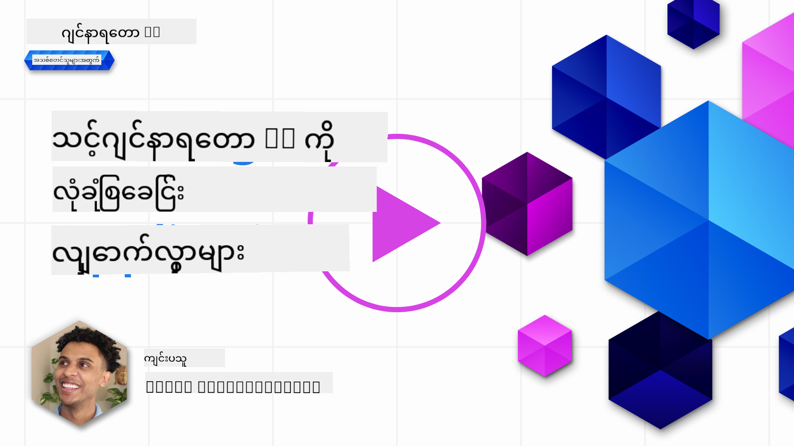
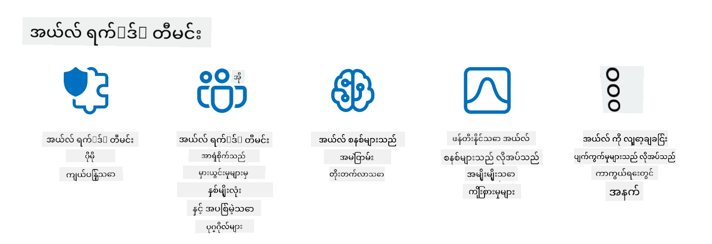

<!--
CO_OP_TRANSLATOR_METADATA:
{
  "original_hash": "f3cac698e9eea47dd563633bd82daf8c",
  "translation_date": "2025-07-09T15:44:27+00:00",
  "source_file": "13-securing-ai-applications/README.md",
  "language_code": "my"
}
-->
# သင့်ရဲ့ Generative AI အက်ပလီကေးရှင်းများကို လုံခြုံစေခြင်း

## နိဒါန်း

ဒီသင်ခန်းစာမှာ ဖော်ပြမယ့်အကြောင်းအရာတွေကတော့ -

- AI စနစ်တွေရဲ့ လုံခြုံရေးအကြောင်း
- AI စနစ်တွေကို ရင်ဆိုင်နေရတဲ့ အန္တရာယ်များနှင့် ခြိမ်းခြောက်မှုများ
- AI စနစ်တွေကို လုံခြုံစေဖို့ နည်းလမ်းများနှင့် စဉ်းစားစရာများ

## သင်ယူရမယ့် ရည်မှန်းချက်များ

ဒီသင်ခန်းစာပြီးဆုံးပြီးနောက်မှာ သင်မှာ ရရှိမယ့် နားလည်မှုတွေက -

- AI စနစ်တွေကို ခြိမ်းခြောက်မှုများနှင့် အန္တရာယ်များ
- AI စနစ်တွေကို လုံခြုံစေဖို့ အသုံးပြုတဲ့ နည်းလမ်းများနှင့် လေ့လာမှုများ
- လုံခြုံရေး စမ်းသပ်မှုများကို အကောင်အထည်ဖော်ခြင်းက မမျှော်လင့်ထားတဲ့ ရလဒ်များနှင့် အသုံးပြုသူယုံကြည်မှု ပျက်စီးမှုကို ကာကွယ်ပေးနိုင်ပုံ

## Generative AI အတွင်း လုံခြုံရေးဆိုတာ ဘာလဲ?

Artificial Intelligence (AI) နဲ့ Machine Learning (ML) နည်းပညာတွေက ကျွန်တော်တို့ဘဝကို ပိုမိုသက်ရောက်လာတာနဲ့အမျှ၊ ဖောက်သည်ဒေတာတင်မကပဲ AI စနစ်တွေကိုလည်း ကာကွယ်ထားဖို့ အရေးကြီးလာပါတယ်။ AI/ML ကို အမှားဆုံးဆုံးဖြတ်ချက်တွေက အလွန်ဆိုးရွားတဲ့ အကျိုးဆက်တွေ ဖြစ်စေနိုင်တဲ့ စက်မှုလုပ်ငန်းတွေမှာ အထူးအသုံးပြုလာတာကြောင့်ပါ။

အဓိက စဉ်းစားရမယ့်အချက်တွေက -

- **AI/ML ၏ သက်ရောက်မှု**: AI/ML က နေ့စဉ်ဘဝမှာ အရေးကြီးသက်ရောက်မှုရှိပြီး ထိုကြောင့် အဲဒီတွေကို ကာကွယ်ထားဖို့ မဖြစ်မနေလိုအပ်လာပါတယ်။
- **လုံခြုံရေး စိန်ခေါ်မှုများ**: AI/ML ၏ သက်ရောက်မှုကြောင့် AI အခြေပြု ထုတ်ကုန်တွေကို တိုက်ခိုက်မှုများမှ ကာကွယ်ဖို့ သေချာစွာ ဂရုစိုက်ရပါမယ်၊ troll များ သို့မဟုတ် အဖွဲ့အစည်းများက တိုက်ခိုက်နိုင်သလို ဖြစ်နိုင်ပါတယ်။
- **မဟာဗျူဟာဆိုင်ရာ ပြဿနာများ**: နည်းပညာလုပ်ငန်းက အချိန်ရှည် ဖောက်သည်လုံခြုံရေးနဲ့ ဒေတာလုံခြုံရေးကို သေချာစေရန် မဟာဗျူဟာဆိုင်ရာ စိန်ခေါ်မှုများကို ကြိုတင်ဖြေရှင်းရပါမယ်။

ထို့အပြင် Machine Learning မော်ဒယ်တွေဟာ မကောင်းဆိုးရွားတဲ့ အချက်အလက်နဲ့ သာမန်ထူးခြားတဲ့ ဒေတာကို ခွဲခြားနိုင်မှုနည်းပါးပါတယ်။ သင်ကြားမှု ဒေတာအများစုဟာ စီမံခန့်ခွဲမှုမရှိတဲ့၊ အများပြည်သူထံမှ ရရှိတဲ့ ဒေတာများဖြစ်ပြီး တတိယပါတီများကလည်း ထည့်သွင်းနိုင်ပါတယ်။ တိုက်ခိုက်သူတွေက ဒေတာများကို ခိုးယူဖို့ မလိုဘဲ အဲဒီဒေတာထဲကို ကိုယ်တိုင် ထည့်သွင်းနိုင်တာကြောင့် ဖြစ်ပါတယ်။ အချိန်ကြာလာတာနဲ့အမျှ ယုံကြည်မှုနည်းတဲ့ ဒေတာတွေဟာ ယုံကြည်မှုရှိတဲ့ ဒေတာအဖြစ် ပြောင်းလဲသွားနိုင်ပါတယ်၊ ဒေတာဖွဲ့စည်းမှု/ပုံစံမှန်ကန်နေပါက။

ဒါကြောင့် မော်ဒယ်တွေ ဆုံးဖြတ်ချက်ချရာမှာ အသုံးပြုတဲ့ ဒေတာသိုလှောင်မှုများ၏ တရားဝင်မှုနဲ့ ကာကွယ်မှုကို သေချာစေရန် အရေးကြီးပါတယ်။

## AI ၏ ခြိမ်းခြောက်မှုများနှင့် အန္တရာယ်များကို နားလည်ခြင်း

AI နဲ့ ဆက်စပ်တဲ့ စနစ်များအတွက် ဒေတာအဆိပ်ထိုးခြင်း (data poisoning) က ယနေ့အချိန်မှာ အရေးကြီးဆုံး လုံခြုံရေး ခြိမ်းခြောက်မှုတစ်ခုဖြစ်ပါတယ်။ ဒေတာအဆိပ်ထိုးခြင်းဆိုတာက AI ကို သင်ကြားဖို့ အသုံးပြုတဲ့ အချက်အလက်တွေကို ရည်ရွယ်ချက်ရှိပြီး ပြောင်းလဲခြင်းဖြစ်ပြီး AI ကို အမှားလုပ်စေပါတယ်။ ဒါဟာ စံချိန်မရှိတဲ့ ရှာဖွေမှုနဲ့ လျှော့ချမှုနည်းလမ်းများ မရှိခြင်း၊ နဲ့ ယုံကြည်မရတဲ့ ဒေတာများကို သင်ကြားမှုအတွက် အသုံးပြုနေခြင်းကြောင့် ဖြစ်ပါတယ်။ ဒေတာတရားဝင်မှုကို ထိန်းသိမ်းပြီး သင်ကြားမှု လုပ်ငန်းစဉ်မှားယွင်းမှု မဖြစ်အောင် သင့်ဒေတာရင်းမြစ်နဲ့ မျိုးဆက်ကို လိုက်လံစောင့်ကြည့်ဖို့ အရေးကြီးပါတယ်။ မဟုတ်ရင် “အမှိုက်ထဲ ထည့်ရင် အမှိုက်ထွက်” ဆိုတဲ့ စကားပုံအတိုင်း မော်ဒယ်စွမ်းဆောင်ရည် ပျက်စီးနိုင်ပါတယ်။

ဒေတာအဆိပ်ထိုးခြင်းက မော်ဒယ်တွေကို ဘယ်လို ထိခိုက်စေနိုင်သလဲဆိုတာ ဥပမာ -

1. **တံဆိပ်ပြောင်းခြင်း (Label Flipping)**: နှစ်ခုခွဲခြားတဲ့ အလုပ်တစ်ခုမှာ တိုက်ခိုက်သူက သင်ကြားမှု ဒေတာအနည်းငယ်ရဲ့ တံဆိပ်တွေကို ရည်ရွယ်ချက်ရှိပြီး ပြောင်းလဲတယ်။ ဥပမာ၊ သာမန်နမူနာတွေကို ဆိုးရွားတဲ့အဖြစ် သတ်မှတ်ခြင်းဖြင့် မော်ဒယ်ကို မှားယွင်းတဲ့ ဆက်စပ်မှုတွေ သင်ကြားစေတယ်။\
   **ဥပမာ**: စပမ်ဖိုင်လ်တာက တရားဝင်အီးမေးလ်တွေကို စပမ်အဖြစ် မှားသတ်မှတ်ခြင်း။
2. **အင်္ဂါရပ်အဆိပ်ထိုးခြင်း (Feature Poisoning)**: တိုက်ခိုက်သူက သင်ကြားမှု ဒေတာအင်္ဂါရပ်တွေကို သေချာမဟုတ်တဲ့ နည်းလမ်းနဲ့ ပြောင်းလဲပြီး မော်ဒယ်ကို လွဲမှားစေတယ်။\
   **ဥပမာ**: ထုတ်ကုန်ဖော်ပြချက်တွေမှာ မသက်ဆိုင်တဲ့ စကားလုံးတွေ ထည့်သွင်းပြီး အကြံပြုမှုစနစ်တွေကို လွဲမှားစေခြင်း။
3. **ဒေတာထည့်သွင်းခြင်း (Data Injection)**: မော်ဒယ်အပြုအမူကို ထိခိုက်စေဖို့ မကောင်းဆိုးရွားတဲ့ ဒေတာတွေကို သင်ကြားမှု စာရင်းထဲ ထည့်သွင်းခြင်း။\
   **ဥပမာ**: စိတ်ခံစားချက်ခွဲခြားမှုရလဒ်တွေကို လွဲမှားစေဖို့ မမှန်ကန်တဲ့ အသုံးပြုသူသုံးသပ်ချက်တွေ ထည့်သွင်းခြင်း။
4. **နောက်တံခါးတိုက်ခိုက်မှု (Backdoor Attacks)**: တိုက်ခိုက်သူက သင်ကြားမှု ဒေတာထဲမှာ ဖုံးကွယ်ထားတဲ့ ပုံစံတစ်ခု (နောက်တံခါး) ထည့်သွင်းတယ်။ မော်ဒယ်က အဲဒီပုံစံကို သတိပြုသိရှိပြီး အဲဒီအချိန်မှာ ဆိုးရွားစွာ လုပ်ဆောင်တယ်။\
   **ဥပမာ**: နောက်တံခါးပါဝင်တဲ့ ပုံရိပ်တွေနဲ့ သင်ကြားထားတဲ့ မျက်နှာသိမှတ်စနစ်က တစ်ဦးချင်းကို မှားသိမှတ်ခြင်း။

MITRE Corporation က [ATLAS (Adversarial Threat Landscape for Artificial-Intelligence Systems)](https://atlas.mitre.org/?WT.mc_id=academic-105485-koreyst) ဆိုတဲ့ AI စနစ်တွေကို တိုက်ခိုက်သူတွေက အသုံးပြုတဲ့ နည်းလမ်းနဲ့ နည်းပညာတွေကို စုစည်းထားတဲ့ သိပ္ပံအချက်အလက် စုစည်းမှုတစ်ခု ဖန်တီးထားပါတယ်။

> AI ပါဝင်တဲ့ စနစ်တွေမှာ အားနည်းချက်တွေ ပိုများလာတာကြောင့် ရိုးရာဆိုက်ဘာတိုက်ခိုက်မှုတွေထက် ပိုမိုကျယ်ပြန့်တဲ့ တိုက်ခိုက်မှုမျက်နှာပြင်တွေ ဖြစ်လာပါတယ်။ ကမ္ဘာလုံးဆိုင်ရာ အသိုင်းအဝိုင်းက AI ကို စနစ်အမျိုးမျိုးထဲ ပိုမိုထည့်သွင်းလာတာကြောင့် ဒီထူးခြားပြီး တိုးတက်နေတဲ့ အားနည်းချက်တွေကို သိရှိစေဖို့ ATLAS ကို ဖန်တီးခဲ့ပါတယ်။ ATLAS ကို MITRE ATT&CK® ဖရိမ်ဝတ်ကို အခြေခံပြီး ဖန်တီးထားပြီး ATT&CK ရဲ့ နည်းလမ်း၊ နည်းပညာနဲ့ လုပ်ထုံးလုပ်နည်းတွေကို ဖြည့်စွက်ပေးပါတယ်။

MITRE ATT&CK® ဖရိမ်ဝတ်က ရိုးရာဆိုက်ဘာလုံခြုံရေးမှာ တိုးတက်တဲ့ ခြိမ်းခြောက်မှု များကို အတုယူဖို့ အတွက် အများကြီး အသုံးပြုကြသလို ATLAS ကလည်း AI တိုက်ခိုက်မှုအသစ်တွေကို နားလည်ပြီး ကာကွယ်နိုင်ဖို့ အကူအညီပေးတဲ့ ရှာဖွေရန် လွယ်ကူတဲ့ နည်းလမ်းများကို ပေးပါတယ်။

ထို့အပြင် Open Web Application Security Project (OWASP) က LLMs အသုံးပြုတဲ့ အက်ပလီကေးရှင်းတွေမှာ တွေ့ရတဲ့ အရေးကြီးဆုံး အားနည်းချက် ၁၀ ခုစာရင်း "[Top 10 list](https://llmtop10.com/?WT.mc_id=academic-105485-koreyst)" ကို ဖန်တီးထားပြီး အဲဒီစာရင်းမှာ အထက်ဖော်ပြခဲ့တဲ့ ဒေတာအဆိပ်ထိုးခြင်းအပြင် -

- **Prompt Injection**: တိုက်ခိုက်သူတွေက LLM ကို ဂရုစိုက်စွာ ဖန်တီးထားတဲ့ input တွေဖြင့် ထိန်းချုပ်ပြီး မူရင်းရည်ရွယ်ချက်အပြင် လုပ်ဆောင်စေခြင်း။
- **Supply Chain Vulnerabilities**: LLM အသုံးပြုတဲ့ အက်ပလီကေးရှင်းတွေရဲ့ အစိတ်အပိုင်းတွေ၊ Python module တွေ သို့မဟုတ် ပြင်ပဒေတာများက ကိုယ်တိုင် ထိခိုက်ခံရခြင်းကြောင့် မမျှော်လင့်ထားတဲ့ ရလဒ်များ၊ အနုတ်လက္ခဏာများ၊ နောက်ခံအဆောက်အအုံတွင် အားနည်းချက်များ ဖြစ်ပေါ်စေနိုင်ခြင်း။
- **Overreliance**: LLMs တွေဟာ မှားယွင်းမှုရှိနိုင်ပြီး မမှန်ကန်တဲ့ သတင်းအချက်အလက်များ ပေးနိုင်ပါတယ်။ အချို့အခြေအနေများမှာ လူတွေက အဲဒီရလဒ်တွေကို တိုက်ရိုက်ယုံကြည်ပြီး အမှားအယွင်း ဖြစ်ပေါ်စေခဲ့ပါတယ်။

Microsoft Cloud Advocate Rod Trent က [Must Learn AI Security](https://github.com/rod-trent/OpenAISecurity/tree/main/Must_Learn/Book_Version?WT.mc_id=academic-105485-koreyst) ဆိုတဲ့ အခမဲ့ စာအုပ်တစ်အုပ်ရေးသားထားပြီး ဒီအကြောင်းအရာတွေနဲ့ အခြား AI ခြိမ်းခြောက်မှုအသစ်များကို နက်ရှိုင်းစွာ လေ့လာပြီး အကောင်းဆုံး ဖြေရှင်းနည်းများကို လမ်းညွှန်ပေးထားပါတယ်။

## AI စနစ်များနှင့် LLM များအတွက် လုံခြုံရေး စမ်းသပ်ခြင်း

Artificial Intelligence (AI) က အမျိုးမျိုးသော နယ်ပယ်များနဲ့ စက်မှုလုပ်ငန်းများကို ပြောင်းလဲနေပြီး လူ့အသိုင်းအဝိုင်းအတွက် အခွင့်အလမ်းအသစ်များနဲ့ အကျိုးကျေးဇူးများ ပေးနေပါတယ်။ သို့သော် AI က ဒေတာကိုယ်ရေးကိုယ်တာ၊ အနုတ်လက္ခဏာ၊ ရှင်းလင်းပြတ်သားမှုမရှိခြင်း၊ မမှန်ကန်စွာ အသုံးပြုခြင်း စသည့် စိန်ခေါ်မှုများနဲ့ အန္တရာယ်များကိုလည်း ဖြစ်စေနိုင်ပါတယ်။ ထို့ကြောင့် AI စနစ်တွေကို လုံခြုံပြီး တာဝန်ရှိစွာ အသုံးပြုနိုင်ဖို့ အရေးကြီးပြီး ဥပဒေ၊ သဘာဝကျသော စံနှုန်းများနှင့် ကိုက်ညီပြီး အသုံးပြုသူတွေနဲ့ ပါဝင်သူတွေက ယုံကြည်နိုင်ဖို့ လိုအပ်ပါတယ်။

လုံခြုံရေး စမ်းသပ်ခြင်းဆိုတာ AI စနစ် သို့မဟုတ် LLM တစ်ခုရဲ့ အားနည်းချက်တွေကို ရှာဖွေပြီး အသုံးချခြင်းဖြင့် လုံခြုံရေးအခြေအနေကို သုံးသပ်ခြင်းဖြစ်ပါတယ်။ ဒီစမ်းသပ်မှုကို ဖန်တီးသူ၊ အသုံးပြုသူ သို့မဟုတ် တတိယပါတီ စစ်ဆေးသူများက ရည်ရွယ်ချက်နဲ့ အတိုင်း ပြုလုပ်နိုင်ပါတယ်။ AI စနစ်နဲ့ LLM များအတွက် အများဆုံး အသုံးပြုတဲ့ လုံခြုံရေး စမ်းသပ်မှုနည်းလမ်းများမှာ -

- **ဒေတာ သန့်ရှင်းရေး (Data sanitization)**: သင်ကြားမှု ဒေတာ သို့မဟုတ် AI စနစ်/LLM ၏ input မှ စိတ်ပူစရာ ဒေတာများကို ဖယ်ရှားခြင်း သို့မဟုတ် အမည်မဖော်နိုင်အောင် ပြုလုပ်ခြင်းဖြစ်ပြီး ဒေတာလွှဲပြောင်းမှုနဲ့ ဒေတာထွက်ပေါက်မှုကို ကာကွယ်ပေးနိုင်ပါတယ်။
- **တိုက်ခိုက်မှု စမ်းသပ်ခြင်း (Adversarial testing)**: AI စနစ်/LLM ၏ input သို့ output တွင် တိုက်ခိုက်မှုနမူနာများ ထုတ်လုပ်ပြီး ထည့်သွင်းခြင်းဖြင့် တိုက်ခိုက်မှုများအပေါ် တည်ငြိမ်မှုနဲ့ ခံနိုင်ရည်ကို စမ်းသပ်ခြင်းဖြစ်ပါတယ်။ ဒီနည်းလမ်းက တိုက်ခိုက်သူတွေက အသုံးပြုနိုင်တဲ့ အားနည်းချက်တွေကို ရှာဖွေကာ လျော့ချနိုင်ပါတယ်။
- **မော်ဒယ် အတည်ပြုခြင်း (Model verification)**: AI စနစ်/LLM ၏ မော်ဒယ် ပါရာမီတာများ သို့မဟုတ် ဖွဲ့စည်းပုံမှန်ကန်မှုကို စစ်ဆေးခြင်းဖြစ်ပြီး မော်ဒယ်ကူးယူမှုကို ကာကွယ်နိုင်ပါတယ်။
- **ရလဒ် အတည်ပြုခြင်း (Output validation)**: AI စနစ်/LLM ၏ ထွက်ရှိလာတဲ့ ရလဒ်အရည်အသွေးနဲ့ ယုံကြည်စိတ်ချရမှုကို စစ်ဆေးခြင်းဖြစ်ပြီး မကောင်းဆိုးရွားတဲ့ လှုပ်ရှားမှုများကို ရှာဖွေပြင်ဆင်နိုင်ပါတယ်။

AI စနစ်များတွင် ခေါင်းဆောင် OpenAI က သူတို့ရဲ့ red teaming network အစီအစဉ်အဖြစ် _လုံခြုံရေး စမ်းသပ်မှု_ များ စီစဉ်ထားပြီး AI စနစ်များရဲ့ ထွက်ရှိမှုကို စမ်းသပ်ကာ AI လုံခြုံရေးအတွက် အထောက်အကူဖြစ်စေဖို့ ရည်ရွယ်ထားပါတယ်။

> စမ်းသပ်မှုတွေက ရိုးရှင်းတဲ့ မေးခွန်း-အဖြေ စမ်းသပ်မှုတွေကနေ စတင်ပြီး ပိုမိုရှုပ်ထွေးတဲ့ အတုယူမှု စမ်းသပ်မှုတွေထိ ရှိနိုင်ပါတယ်။ ဥပမာအနေနဲ့ OpenAI က AI အပြုအမူတွေကို အမျိုး
> AI red teaming လေ့ကျင့်မှုသည် ပိုမိုကျယ်ပြန့်သော အဓိပ္ပာယ်တစ်ခုကို ရရှိလာပြီး ဖြစ်သည်။ ၎င်းသည် လုံခြုံရေးအားနည်းချက်များကို စူးစမ်းရှာဖွေခြင်းသာမက၊ အခြားစနစ်ပျက်ကွက်မှုများကိုလည်း စူးစမ်းစစ်ဆေးခြင်းကို ပါဝင်သည်၊ ဥပမာအားဖြင့် အန္တရာယ်ရှိနိုင်သော အကြောင်းအရာများ ဖန်တီးခြင်း စသဖြင့်။ AI စနစ်များတွင် အသစ်သော အန္တရာယ်များ ရှိပြီး၊ red teaming သည် ထိုအသစ်သော အန္တရာယ်များကို နားလည်ရန် အဓိကဖြစ်သည်၊ ဥပမာ prompt injection နှင့် အခြေခံမရှိသော အကြောင်းအရာများ ထုတ်လုပ်ခြင်း စသဖြင့်။ - [Microsoft AI Red Team building future of safer AI](https://www.microsoft.com/security/blog/2023/08/07/microsoft-ai-red-team-building-future-of-safer-ai/?WT.mc_id=academic-105485-koreyst)

အောက်တွင် Microsoft ၏ AI Red Team အစီအစဉ်ကို ဖွဲ့စည်းပေးခဲ့သော အဓိက အမြင်များကို ဖော်ပြထားပါသည်။

1. **AI Red Teaming ၏ ကျယ်ပြန့်သော အကျယ်အဝန်း**  
   AI red teaming သည် ယခုအခါ လုံခြုံရေးနှင့် တာဝန်ရှိသော AI (RAI) ရလဒ်များနှစ်ခုစလုံးကို ပါဝင်စစ်ဆေးသည်။ ရိုးရာအားဖြင့် red teaming သည် လုံခြုံရေးအချက်များကိုသာ အာရုံစိုက်ပြီး မော်ဒယ်ကို တိုက်ခိုက်ရန် အချက်အလက်တစ်ခုအဖြစ် သတ်မှတ်ခဲ့သည် (ဥပမာ- မော်ဒယ်ကို ခိုးယူခြင်း)။ သို့သော် AI စနစ်များတွင် အသစ်တီထွင်သော လုံခြုံရေးအားနည်းချက်များ (ဥပမာ- prompt injection, poisoning) ရှိလာပြီး ထူးခြားစွာ ဂရုစိုက်ရန် လိုအပ်သည်။ လုံခြုံရေးအပြင် AI red teaming သည် တရားမျှတမှုဆိုင်ရာ ပြဿနာများ (ဥပမာ- stereotyping) နှင့် အန္တရာယ်ရှိသော အကြောင်းအရာများ (ဥပမာ- အကြမ်းဖက်မှုကို ဂုဏ်ပြုခြင်း) ကိုလည်း စူးစမ်းစစ်ဆေးသည်။ ဤပြဿနာများကို အစောဆုံး ရှာဖွေတွေ့ရှိခြင်းဖြင့် ကာကွယ်မှု ရင်းနှီးမြှုပ်နှံမှုများကို ဦးစားပေးနိုင်သည်။

2. **ဆိုးရွားသောနှင့် သာမာန် အမှားများ**  
   AI red teaming သည် ဆိုးရွားသောနှင့် သာမာန် အမှားများကို နှစ်ဖက်စလုံးမှ စဉ်းစားသည်။ ဥပမာ၊ Bing အသစ်ကို red teaming လုပ်သောအခါ ဆိုးရွားသူများက စနစ်ကို မည်သို့ ဖျက်ဆီးနိုင်သည်ကိုသာမက ပုံမှန် အသုံးပြုသူများက မည်သည့် ပြဿနာရှိသော သို့မဟုတ် အန္တရာယ်ရှိသော အကြောင်းအရာများနှင့် တွေ့ကြုံနိုင်သည်ကိုလည်း စူးစမ်းလေ့လာသည်။ ရိုးရာ လုံခြုံရေး red teaming သည် အဓိကအားဖြင့် ဆိုးရွားသူများကိုသာ ဦးစားပေးစဉ်းစားသော်လည်း AI red teaming သည် ပိုမိုကျယ်ပြန့်သော လူမျိုးအမျိုးအစားများနှင့် ဖြစ်နိုင်သော အမှားများကိုလည်း ထည့်သွင်းစဉ်းစားသည်။

3. **AI စနစ်များ၏ အပြောင်းအလဲရှိသော သဘာဝ**  
   AI အပလီကေးရှင်းများသည် အမြဲတမ်း တိုးတက်ပြောင်းလဲနေသည်။ ကြီးမားသော ဘာသာစကား မော်ဒယ်များတွင် ဖန်တီးသူများသည် လိုအပ်ချက်များ ပြောင်းလဲမှုအတိုင်း ကိုက်ညီစွာ ပြင်ဆင်တိုးတက်စေသည်။ ဆက်လက် red teaming လုပ်ခြင်းဖြင့် ဖြစ်ပေါ်လာသော အန္တရာယ်များကို အမြဲတမ်း သတိထားကြည့်ရှုနိုင်ပြီး လိုအပ်သလို ပြင်ဆင်နိုင်သည်။

AI red teaming သည် အားလုံးကို ဖုံးလွှမ်းမထားသည့် နည်းလမ်းဖြစ်ပြီး [role-based access control (RBAC)](https://learn.microsoft.com/azure/ai-services/openai/how-to/role-based-access-control?WT.mc_id=academic-105485-koreyst) နှင့် အပြည့်အစုံသော ဒေတာစီမံခန့်ခွဲမှု ဖြေရှင်းချက်များကဲ့သို့သော ထပ်ဆောင်းထိန်းချုပ်မှုများနှင့် ပေါင်းစပ်အသုံးပြုသင့်သည်။ ၎င်းသည် ကိုယ်ရေးအချက်အလက်နှင့် လုံခြုံရေးကို ဦးစားပေးထားပြီး အနည်းဆုံး အနုတ်လက္ခဏာများ၊ အန္တရာယ်ရှိသော အကြောင်းအရာများနှင့် မှားယွင်းသော သတင်းအချက်အလက်များကို လျော့နည်းစေရန် ရည်ရွယ်သော လုံခြုံရေး မဟာဗျူဟာတစ်ခုကို ထောက်ပံ့ပေးရန် ဖြစ်သည်။

AI စနစ်များတွင် ဖြစ်နိုင်သော အန္တရာယ်များကို ရှာဖွေကာ လျော့နည်းစေရန် red teaming ကူညီပေးနိုင်သည့် နည်းလမ်းများကို ပိုမိုနားလည်နိုင်ရန် အောက်ပါ ဖတ်ရှုရန်စာရင်းကို ကြည့်ပါ-

- [Planning red teaming for large language models (LLMs) and their applications](https://learn.microsoft.com/azure/ai-services/openai/concepts/red-teaming?WT.mc_id=academic-105485-koreyst)  
- [What is the OpenAI Red Teaming Network?](https://openai.com/blog/red-teaming-network?WT.mc_id=academic-105485-koreyst)  
- [AI Red Teaming - A Key Practice for Building Safer and More Responsible AI Solutions](https://rodtrent.substack.com/p/ai-red-teaming?WT.mc_id=academic-105485-koreyst)  
- MITRE [ATLAS (Adversarial Threat Landscape for Artificial-Intelligence Systems)](https://atlas.mitre.org/?WT.mc_id=academic-105485-koreyst)၊ AI စနစ်များကို တိုက်ခိုက်ရာတွင် တိုက်ခိုက်သူများ အသုံးပြုသော နည်းဗျူဟာများနှင့် နည်းလမ်းများကို သိရှိနိုင်သော သိပ္ပံအချက်အလက် စုစည်းမှု။

## အသိပညာ စစ်ဆေးခြင်း

ဒေတာတရားဝင်မှုကို ထိန်းသိမ်းကာ မမှန်ကန်သည့် အသုံးပြုမှုများကို ကာကွယ်ရန် ကောင်းမွန်သော နည်းလမ်းက ဘာဖြစ်နိုင်ပါသလဲ?

1. ဒေတာ ဝင်ရောက်ခွင့်နှင့် ဒေတာစီမံခန့်ခွဲမှုအတွက် ခိုင်မာသော role-based controls ရှိစေရန်  
1. ဒေတာမှားယွင်းမှု သို့မဟုတ် မမှန်ကန်သော အသုံးပြုမှုများကို ကာကွယ်ရန် ဒေတာတံဆိပ်ခတ်ခြင်းကို အကောင်အထည်ဖော်ပြီး စစ်ဆေးရန်  
1. သင့် AI အခြေခံအဆောက်အအုံသည် အကြောင်းအရာ စစ်ထုတ်ခြင်းကို ထောက်ပံ့နိုင်စေရန်

ဖြေ- 1၊ သုံးခုလုံးကောင်းမွန်သော်လည်း LLM များ အသုံးပြုသော ဒေတာကို လိမ်လည်ခြင်းနှင့် မှားယွင်းစွာ ကိုင်တွယ်ခြင်းမှ ကာကွယ်ရန် အသုံးပြုသူများအား သင့်တော်သော ဒေတာ ဝင်ရောက်ခွင့်များ ပေးအပ်ခြင်းသည် အရေးကြီးဆုံးဖြစ်သည်။

## 🚀 စိန်ခေါ်မှု

AI ခေတ်တွင် [အချက်အလက်များကို ထိန်းချုပ်ကာ ကာကွယ်နည်းများ](https://learn.microsoft.com/training/paths/purview-protect-govern-ai/?WT.mc_id=academic-105485-koreyst) ကို ပိုမိုလေ့လာပါ။

## ကောင်းမွန်သော အလုပ်လုပ်ဆောင်မှု၊ သင်ယူမှုကို ဆက်လက်လုပ်ဆောင်ပါ

ဤသင်ခန်းစာကို ပြီးမြောက်ပြီးနောက်၊ ကျွန်ုပ်တို့၏ [Generative AI Learning collection](https://aka.ms/genai-collection?WT.mc_id=academic-105485-koreyst) ကို သွားရောက်ကြည့်ရှုကာ Generative AI အကြောင်း ပိုမိုတိုးတက်စေပါ။

Lesson 14 သို့ သွားပါ၊ အဲဒီမှာ [Generative AI Application Lifecycle](../14-the-generative-ai-application-lifecycle/README.md?WT.mc_id=academic-105485-koreyst) ကို လေ့လာသွားမည်ဖြစ်သည်။

**အကြောင်းကြားချက်**  
ဤစာတမ်းကို AI ဘာသာပြန်ဝန်ဆောင်မှု [Co-op Translator](https://github.com/Azure/co-op-translator) ဖြင့် ဘာသာပြန်ထားပါသည်။ ကျွန်ုပ်တို့သည် တိကျမှန်ကန်မှုအတွက် ကြိုးစားသော်လည်း အလိုအလျောက် ဘာသာပြန်ခြင်းတွင် အမှားများ သို့မဟုတ် မှားယွင်းချက်များ ပါဝင်နိုင်ကြောင်း သတိပြုပါရန် မေတ္တာရပ်ခံအပ်ပါသည်။ မူရင်းစာတမ်းကို မိမိဘာသာစကားဖြင့်သာ တရားဝင်အရင်းအမြစ်အဖြစ် ယူဆသင့်ပါသည်။ အရေးကြီးသော အချက်အလက်များအတွက် လူ့ဘာသာပြန်ပညာရှင်မှ ဘာသာပြန်ခြင်းကို အကြံပြုပါသည်။ ဤဘာသာပြန်ချက်ကို အသုံးပြုရာမှ ဖြစ်ပေါ်လာနိုင်သည့် နားလည်မှုမှားယွင်းမှုများအတွက် ကျွန်ုပ်တို့ တာဝန်မယူပါ။