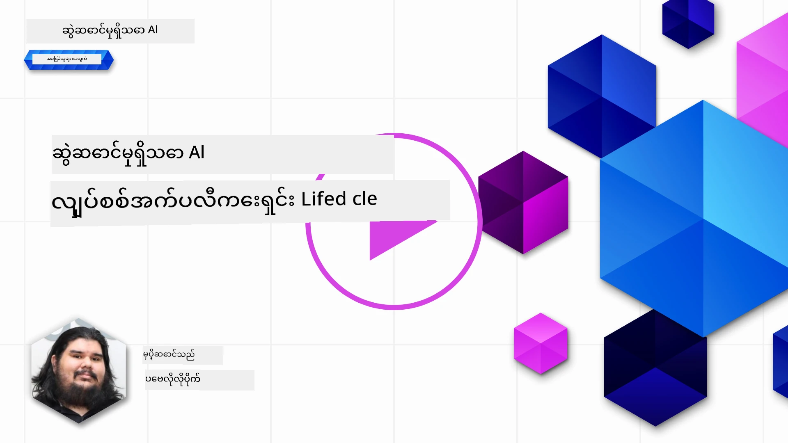
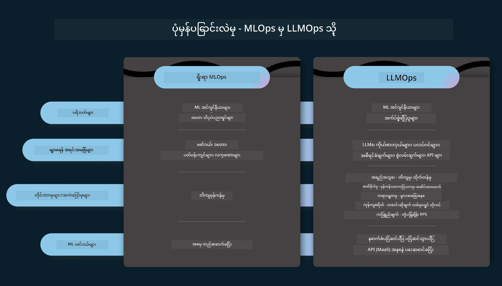
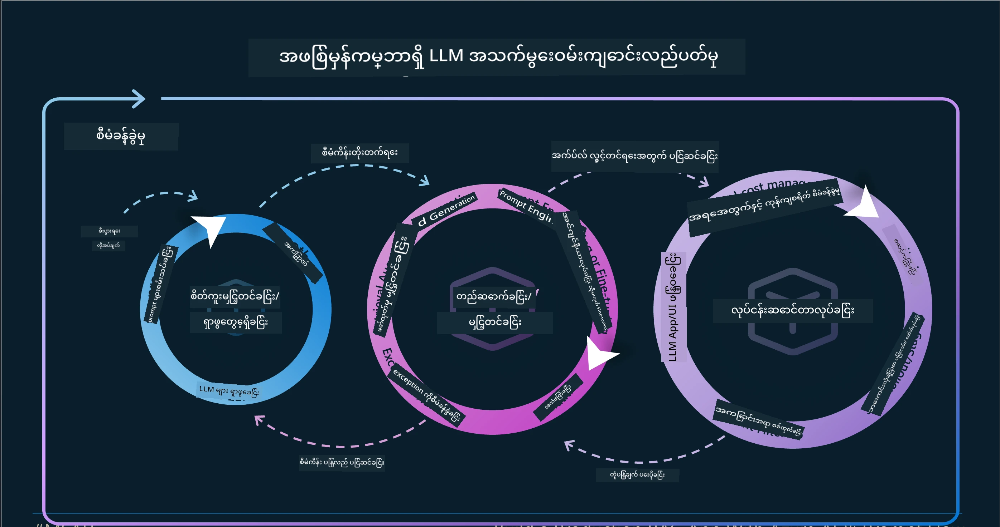
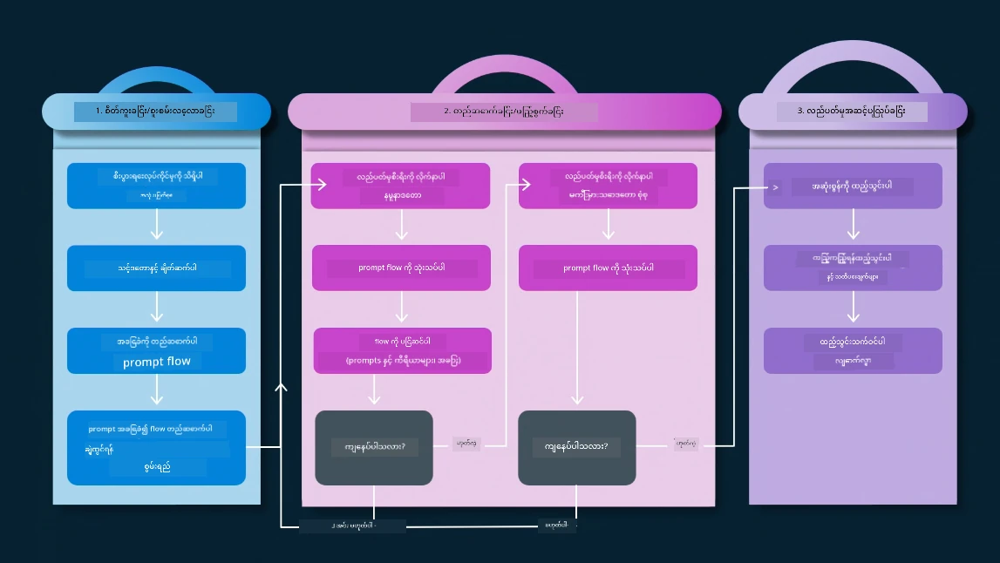
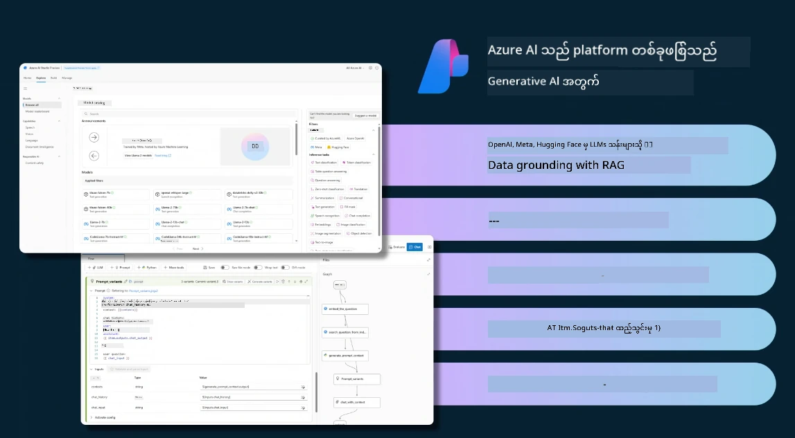
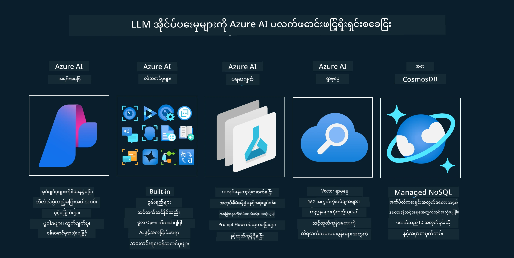
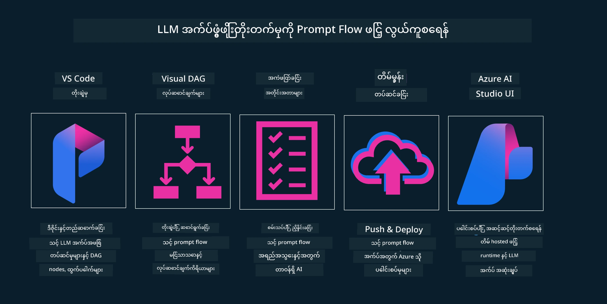

#  ဇီဋ္ဌိ AI အက်ပလီကေးရှင်း ဘဝမြီလမ်းကြောင်း

AI အက်ပလီကေးရှင်းအားလုံးအတွက် အရေးကြီးသောမေးခွန်းမှာ AI လက္ခဏာများ၏ သက်ဆိုင်မှု ဖြစ်သည်။ AI သည် လျင်မြန်စွာ တိုးတက်ပြောင်းလဲနေသောနယ်ပယ်ဖြစ်သောကြောင့် သင့်အက်ပလီကေးရှင်းသည် သက်ဆိုင်မှုရှိနေမည်၊ ယုံကြည်စိတ်ချစေရန်နှင့် ခိုင်မာမြဲမာအောင် ထိန်းသိမ်းထားနိုင်ရန် ဆက်လက်ကြီးကြပ် သုံးသပ်၊ သုံးသပ်ပြီးကောင်းမကောင်း မြှင့်တင်ရန် လိုအပ်သည်။ ဒီမှာ ဇီဋ္ဌိ AI ဘဝမြီလမ်းကြောင်း ဒီဇိုင်းထွင်မှု ပါဝင်သည်။

ဇီဋ္ဌိ AI ဘဝမြီလမ်းကြောင်း ဆိုသည်မှာ ဇီဋ္ဌိ AI အက်ပလီကေးရှင်း တည်ဆောက်ခြင်း၊ ထုတ်ပေးခြင်း၊ ထိန်းသိမ်းခြင်း အဆင့်များအား ဦးတည်လမ်းညွှန်ပေးသည့် ဖရိမ်ဝပ်တစ်ခုဖြစ်သည်။ သင်၏ရည်မှန်းချက်များကို သတ်မှတ်ရန်၊ ကိုယ်ရေးကိုယ်တာစွမ်းဆောင်ရည်ကို တိုင်းတာရန်၊ စိန်ခေါ်မှုများကို ဖော်ထုတ်ရန်၊ ဖြေရှင်းနည်းများကို ဆောင်ရွက်ရန် ကူညီပေးသည်။ သင်၏အက်ပလီကေးရှင်းကို သင့်နယ်ပယ်နှင့် ပါဝင်သောသူများ၏ စည်းကမ်းတရားနှင့် တရားဥပဒေစံနှုန်းများနှင့် ကိုက်ညီစေရန် လမ်းညွှန်ပေးသည်။ ဇီဋ္ဌိ AI ဘဝမြီလမ်းကြောင်းကို လိုက်နာခြင်းဖြင့် သင့်အက်ပလီကေးရှင်းသည် အမြဲတမ်းတန်ဖိုးဖြန့်ဝေပြီး အသုံးပြုသူများကို စိတ်ကျေနပ်မှုပေးနေစေရန်အာမခံသည်။

## မိတ်ဆက်

ဒီအခန်းတွင် သင်:

- MLOps မှ LLMOps သို့ Paradigm ပြောင်းလဲချက်ကို နားလည်မည်ဖြစ်သည်
- LLM ဘဝမြီလမ်းကြောင်း
- ဘဝမြီလမ်းကြောင်း သုံးစွဲစက်ပစ္စည်းများ
- ဘဝမြီလမ်းကြောင်း စမ်းသပ် တိုင်းတာခြင်းနှင့် သုံးသပ်ခြင်း

## MLOps မှ LLMOps သို့ Paradigm ပြောင်းလဲချက် နားလည်ခြင်း

LLM များသည် ဘာသာရပ်အရ Artificial Intelligence လက်နက်စာရင်းရဲ့ အသစ်သောကိရိယာဖြစ်ပြီး၊ စမ်းသပ်မှုများနှင့် ဖန်တီးရေးလုပ်ငန်းများတွင် အလွန်အစွမ်းထက်ကြောင့် အက်ပလီကေးရှင်းများတွင် အသုံးပြုသည်။ သို့သော် ဒီအစွမ်းထက်မှုသည် AI နှင့် Classic Machine Learning အလုပ်များကို စနစ်တကျ သက်ဆိုင်စွာ စီမံခန့်ခွဲခြင်းတွင် အချို့ သက်ရောက်မှုများ ဖြစ်စေသည်။

ဒါကြောင့် စွမ်းဆောင်ရည်ရှိသော လုံခြုံမှုများနှင့် ညှိနှိုင်းနိုင်သော Dynamic သဘောတရားအသစ်တစ်ခု လိုအပ်လာသည်။ ယင်း Paradigm အသစ်သည် အဟောင်း AI အက်ပလီကေးရှင်းများကို "ML Apps" ဟု အဖွဲ့ဖွဲ့ပြီး၊ အသစ် AI အက်ပလီကေးရှင်းများကို "GenAI Apps" သို့မဟုတ် "AI Apps" ဟုခေါ်ပြီး အချိန်အလိုက် အသုံးပြုသည့် နည်းပညာနှင့် နည်းလမ်းများ ပြသသည်။ ဒီလို Paradigm ပြောင်းလဲခြင်းသည် ကျွန်ုပ်တို့၏ ချဉ်းကပ်မှုကို အမျိုးမျိုး ပြောင်းလဲစေသည်။ အောက်ရှိ နှိုင်းယှဉ်ချက်ကို ကြည့်ပါ။

LLMOps တွင် ကျွန်ုပ်တို့သည် အက်ပလီကေးရှင်း တီထွင်သူများအပေါ် ပိုမိုအာရုံစိုက်ပြီး၊ ပေါင်းစည်းမှုကို အဓိကအချက်အဖြစ် အသုံးပြုခြင်းနှင့် "Models-as-a-Service" ကို အသုံးပြုကာ၊ စာရင်းသွင်းဖောက်သည်ချက်အတွက် အောက်ပါအချက်များကို စဉ်းစားသည်။

- အရည်အသွေး: တုံ့ပြန်မှုအရည်အသွေး
- အန္တရာယ်: တာဝန်ရှိသော AI
- ကိုယ်စားလှယ်: တုံ့ပြန်မှုအခြေခံမှု (နားလည်ပါသလား? မှန်ကန်ပါသလား?)
- ကုန်ကျစရိတ်: ဖြေရှင်းမှုပမာဏ
- အချိန်နှောင့်နှေးမှု: Token တုံ့ပြန်မှု၏ ပျမ်းမျှအချိန်

## LLM ဘဝမြီလမ်းကြောင်း

ပထမဦးစွာ ဘဝမြီလမ်းကြောင်းနှင့် ပြင်ဆင်မှုများကို နားလည်ရန် အောက်ပါအချက်ပုံတစ်ခုကို မှတ်သားပါ။

သင်သတိပြုမိမည်ဖြစ်သည်၊ ၎င်းသည် MLOps ၏ ရိုးရိုးဘဝမြီလမ်းကြောင်းနှင့် မတူပါ။ LLM များမှာ Prompting, အရည်အသွေးမြှင့်တင်မှုနည်းပညာမျိုးစုံ (Fine-Tuning, RAG, Meta-Prompts), တာဝန်ရှိ AI နှင့် သတ်မှတ်ချက်နှင့် အကဲဖြတ်နည်းအသစ်များ (အရည်အသွေး၊ အန္တရာယ်, ကိုယ်စားလှယ်, ကုန်ကျစရိတ်နှင့် အချိန်နှောင့်နှေးမှု) လိုအပ်ချက်အသစ်များ ရှိသည်။

ဥပမာအားဖြင့်၊ ကျွန်ုပ်တို့ ဝိဇ္ဇာဆန်စွာ စဉ်းစားသည့်နည်းကို ကြည့်ပါ။ မတူညီသော LLM များနှင့် စမ်းသပ်ရန် prompt စီမံခန့်ခွဲမှုကို အသုံးပြု၍ သင်၏ သင်္ချာချက်ကို မှန်ကန်မည့်လား စမ်းသပ်ရှာဖွေသည်။

ဤလုပ်ငန်းစဉ်သည် ဆန့်ကျင်လက်ဝယ်မှ ဆက်လက်သော အမှတ်အသားများ ပါဝင်သည့် စုပေါင်းများဖြစ်ပြီး ပုံမှန်တစ်ချိန်တည်းလိုက်လိုက်မှု မဖြစ်ပါ။

ဒီအဆင့်များကို ဘယ်လို ရှာဖွေကြမလဲ။ အနက်ရှိုင်းစွာ  လိုက်လံကြည့်ကြရအောင်။

ဒီလို ကြည့်ရင့်တော့ အနည်းငယ်ရှုပ်ထွေးသည့်အနေဖြင့် တွေ့နိုင်ပေမယ့်၊ အစောပိုင်းမှာ အောက်ပါ အဆင့်ကြီးသုံးခုကို အာရုံစိုက်ပါ။

1. စဉ်းစားခြင်း/ရှာဖွေရေး: ဒီအပိုင်း၌ စီးပွားရေးလိုအပ်ချက်များအရ စူးစမ်းလေ့လာနိုင်သည်။ prototype တစ်ခုဖန်တီးပြီး [PromptFlow](https://microsoft.github.io/promptflow/index.html?WT.mc_id=academic-105485-koreyst) ဖြင့် စမ်းသပ်၍ သင်၏ သင်္ချာချက်အတွက် ထိရောက်မှုရှိမရှိ စစ်ဆေးသည်။
1. တည်ဆောက်ခြင်း/မြှင့်တင်ခြင်း: အကောင်အထည်ဖော်ခြင်း၊ ယခုအခါ ကြီးမားသောဒေတာစုဆောင်းမှုများအတွက် အကဲဖြတ်ပြီး Fine-tuning နှင့် RAG ကဲ့သို့ နည်းပညာများ အသုံးပြုကာ ဖြေရှင်းချက်၏ ခိုင်မာမှုကို စစ်ဆေးသည်။ မအောင်မြင်ပါက ထပ်မံတည်ဆောက်ခြင်း၊ လမ်းကြောင်းအသစ်များ ထည့်သွင်းခြင်း သို့မဟုတ် ဒေတာကို ပြုပြင်ဆင်ခြင်းများကို လုပ်ဆောင်နိုင်သည်။ စမ်းသပ်ပြီး မျှတမှုများကို ကြည့်ပြီးပါက နောက်ဆင့် ခရီးကို စတင်နိုင်သည်။
1. စီမံခန့်ခွဲခြင်း: ပေါင်းစည်းခြင်း၊ ယခုအခါ စနစ်၏ မောန်တာလုပ်ခြင်းနှင့် သတိပေးစနစ်များ ထည့်သွင်းခြင်း၊ တပ်ဆင်ခြင်း နှင့် အက်ပလီကေးရှင်းနှင့် ပေါင်းစည်းခြင်း။

ပြီးနောက် စီမံခန့်ခွဲမှု၏ ဆက်လုပ်ပြီး လုံခြုံမှု၊ လိုက်နာမှုနှင့် အုပ်ချုပ်မှုများကို အာရုံစိုက်သည်။

ကဲ၊ ယခု သင်၏ AI အက်ပလီကေးရှင်း ပြင်ဆင်ပြီး စတင်အသုံးပြုနိုင်ပါပြီ။ လက်တွေ့ကျကျ လေ့လာလိုသူများအတွက် [Contoso Chat Demo.](https://nitya.github.io/contoso-chat/?WT.mc_id=academic-105485-koreyst) ကို ကြည့်ရှုနိုင်သည်။

ယခု ဘယ်ပါဝင်ကိရိယာများကို အသုံးပြုနိုင်သနည်း?

## ဘဝမြီလမ်းကြောင်း သုံးစွဲစက်ပစ္စည်းများ

သုံးစွဲစက်ပစ္စည်းများအတွက် Microsoft မှ [Azure AI Platform](https://azure.microsoft.com/solutions/ai/?WT.mc_id=academic-105485-koreyst) နှင့် [PromptFlow](https://microsoft.github.io/promptflow/index.html?WT.mc_id=academic-105485-koreyst) တို့ကို ပံ့ပိုးကူညီပေးပြီး သင်၏ ဘဝမြီလမ်းကြောင်းကို လွယ်ကူစွာ လုပ်ဆောင်ရန် အဆင်ပြေစေသည်။

[Azure AI Platform](https://azure.microsoft.com/solutions/ai/?WT.mc_id=academic-105485-koreyst) မှတဆင့် [AI Studio](https://ai.azure.com/?WT.mc_id=academic-105485-koreyst) ကို အသုံးပြုနိုင်သည်။ AI Studio သည် မော်ဒယ်များ၊ စမ်းသပ်ချက်များနှင့် ကိရိယာများကို ရှာဖွေကြည့်ရှုရန် ဝက်ဘ်ပေါ်ပေါက်တာဖြစ်သည်။ သင်၏ နည်းပညာအရင်းအမြစ်များကို စီမံခန့်ခွဲခြင်း၊ UI ဖန်တီးခြင်းနှင့် SDK/CLI ရွေးချယ်မှုများကို Code-First ဖန်တီးမှုအတွက် အထောက်အကူပြုသည်။

Azure AI သည် စီမံခန့်ခွဲမှု၊ ဝန်ဆောင်မှုများ၊ စီမံကိန်းများ၊ vector ရှာဖွေရေး နှင့် ဒေတာဘေ့စ်များလိုအပ်ချက်များကို ကြီးကြပ်စဉ်းစားရာတွင် အရင်းအမြစ်များစွာကို အသုံးပြုခွင့် ဖန်တီးပေးသည်။

Proof-of-Concept(POC) မှ စတင်ပြီး ကြီးမားသော အက်ပလီကေးရှင်းများအထိ PromptFlow ဖြင့် ဖန်တီးနိုင်သည်။

- Visual နှင့် function တွေပါအပ်သည့် VS Code မှ app များ ဒီဇိုင်းရေးဆွဲနှင့် တည်ဆောက်ပါ။
- အရည်အသွေးမြင့် AI အတွက် app များကို စမ်းသပ်ပြီး fine-tune လုပ်ပါ။
- Azure AI Studio ကို အသုံးပြုကာ ကလောင်၊ Push နှင့် Deploy ဖြင့် ပေါင်းစည်း၍ ပြန်လည်တိုးချဲ့နိုင်ပါသည်။

## အလွန်ကောင်းစွာပါ! သင်ယူမှုကို ဆက်လက်လုပ်ဆောင်ပါ!

အံ့သြဖွယ်ကောင်းပါပြီ၊ ဇီဋ္ဌိ AI အက်ပလီကေးရှင်း ဖွဲ့စည်းပုံနှင့် သဘောတရားများကို [Contoso Chat App](https://nitya.github.io/contoso-chat/?WT.mc_id=academic-105485-koreyst) မှ တင်ပြချက်များတွင် Cloud Advocacy များ ဘယ်လို ထည့်သွင်းကြသည်ဆိုတာကို ဆက်လက်လေ့လာပါ။ နောက်ထပ်အကြောင်းအရာများအတွက် ကျွန်ုပ်တို့၏ [Ignite breakout session!](https://www.youtube.com/watch?v=DdOylyrTOWg) ကိုကြည့်ကြပါ။

ယခု၊ သင် 15 ကြိမ်သင်ခန်းစာကို လေ့လာကာ [Retrieval Augmented Generation and Vector Databases](../15-rag-and-vector-databases/README.md?WT.mc_id=academic-105485-koreyst) တို့ ဇီဋ္ဌိ AI ပေါ်တွင် ဘယ်လို သက်ရောက်မှုရှိသနည်း၊ ပိုမိုဆွဲဆောင်ဖွယ် အက်ပလီကေးရှင်းများ ဖန်တီးရန် ဘယ်လို အသုံးပြုရမည်ဆိုတာ နားလည်ပါဦး။

---

<!-- CO-OP TRANSLATOR DISCLAIMER START -->
**သတိပြုချက်**  
ဤစာရွက်စာတမ်းကို AI ဘာသာပြန်ဝန်ဆောင်မှုဖြစ်သော [Co-op Translator](https://github.com/Azure/co-op-translator) ဖြင့် ဘာသာပြန်ထားပါသည်။ ကျွန်ုပ်တို့သည် တိကျမှုအတွက် ကြိုးစားပေမယ့် အလိုအလျောက် ဘာသာပြန်ခြင်းများတွင် မွားယွင်းချက်များ သို့မဟုတ် တိကျမှုမရှိမှုများ ဖြစ်ပေါ်နိုင်ပါကြောင်း သတိပြုပါစေ။ မူရင်းစာရွက်စာတမ်းကို native language (မူရင်းဘာသာစကား) ဖြင့်သာ တရားဝင်အရင်းအမြစ်အဖြစ် သတ်မှတ်သင့်ပါသည်။ အရေးအကြီးဆုံးအချက်အလက်များအတွက် ကျွမ်းကျင်လူသား ဘာသာပြန်သူမှ ဘာသာပြန်ခြင်းကို အကြံပြုပါသည်။ ဤဘာသာပြန်ချက်ကို အသုံးပြုရာမှ ဖြစ်ပေါ်မည့် နားလည်မှုချို့တဲ့မှု သို့မဟုတ် အနားမလည်မှုများအတွက် ကျွန်ုပ်တို့တာဝန်မရှိပါ။
<!-- CO-OP TRANSLATOR DISCLAIMER END -->