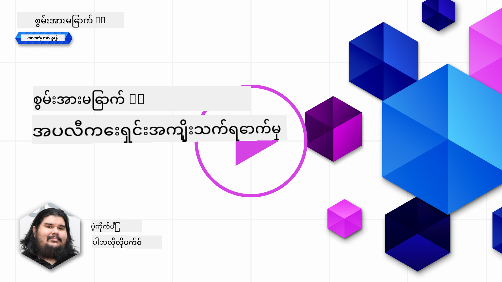
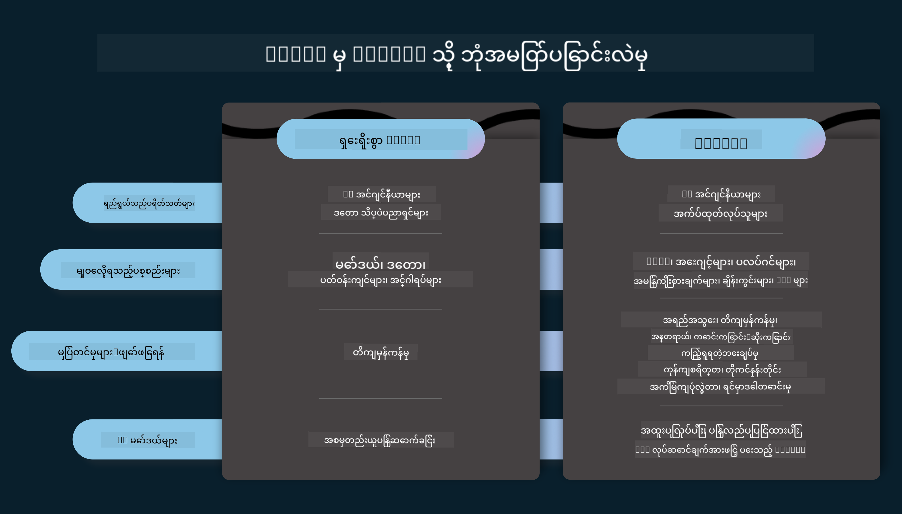
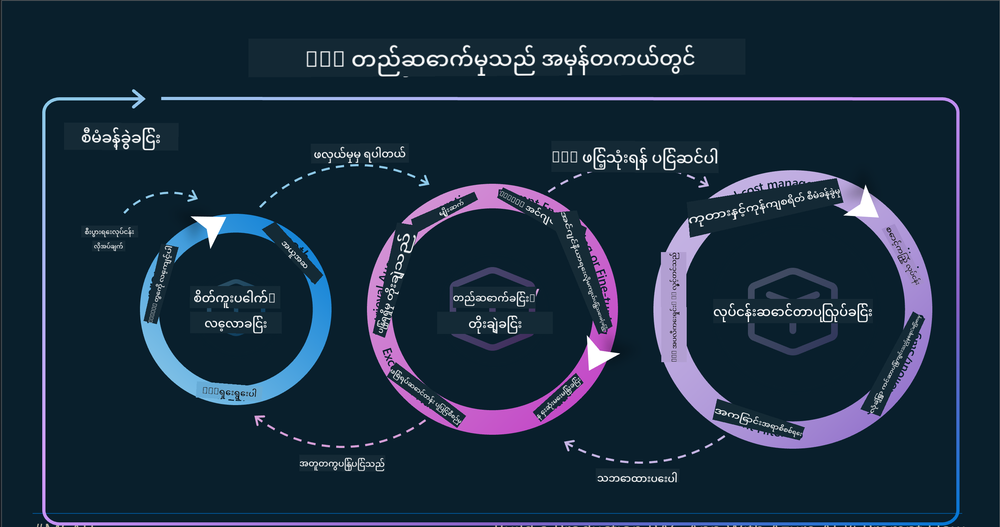
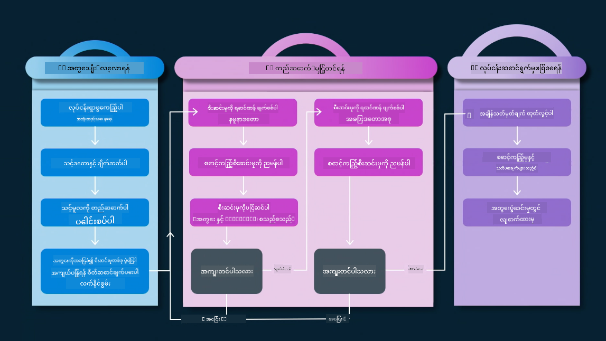
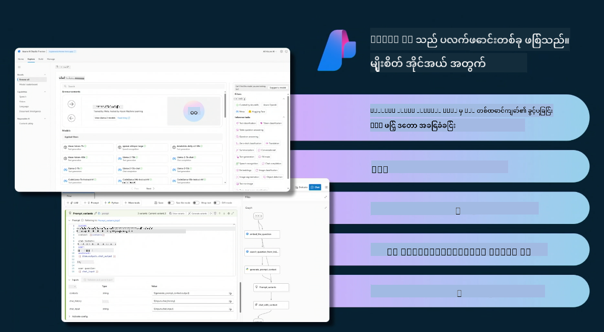
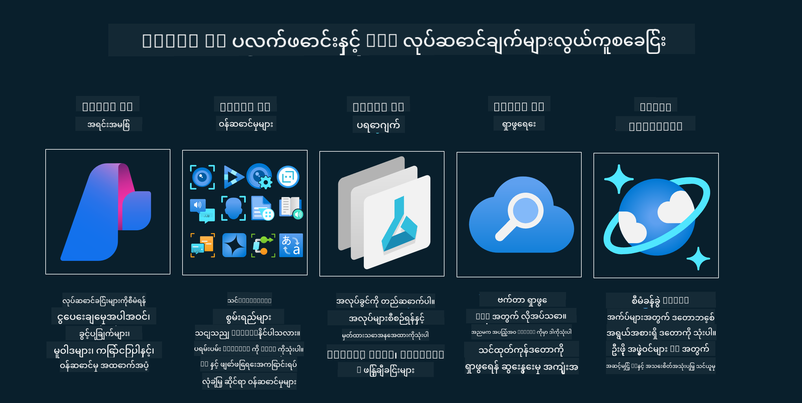
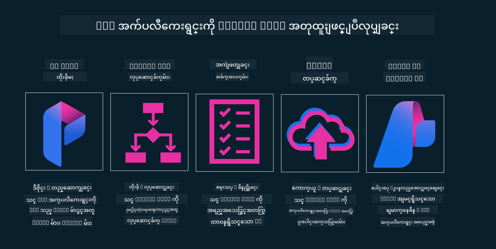

<!--
CO_OP_TRANSLATOR_METADATA:
{
  "original_hash": "27a5347a5022d5ef0a72ab029b03526a",
  "translation_date": "2025-06-25T22:13:00+00:00",
  "source_file": "14-the-generative-ai-application-lifecycle/README.md",
  "language_code": "my"
}
-->

# Generative AI အက်ပ်လီကေးရှင်း လိုင်ဖ်စိုင်ကယ်

AI အက်ပ်လီကေးရှင်းများအတွက် အရေးကြီးသောမေးခွန်းတစ်ခုမှာ AI လက္ခဏာများ၏ သက်ဆိုင်မှုဖြစ်ပြီး၊ AI သည် လျင်မြန်စွာတိုးတက်နေသောကဏ္ဍဖြစ်သည့်အတွက် သင့်အက်ပ်လီကေးရှင်းသည် သက်ဆိုင်နေဆဲ၊ ယုံကြည်ရပြီး၊ ခိုင်မာသောအနေအထားတွင်ရှိနေစေရန်၊ သင့်အက်ပ်ကို အဆက်မပြတ်ကြည့်ရှု၊ အကဲဖြတ်ပြီး၊ တိုးတက်အောင်လုပ်ရန်လိုအပ်သည်။ ဒါဟာ Generative AI လိုင်ဖ်စိုင်ကယ်ရဲ့ အရေးပါသောနေရာဖြစ်ပါတယ်။

Generative AI လိုင်ဖ်စိုင်ကယ်သည် Generative AI အက်ပ်လီကေးရှင်းတစ်ခုကို ဖန်တီးခြင်း၊ တင်သွင်းခြင်းနှင့် ထိန်းသိမ်းခြင်း အဆင့်များကို လမ်းညွှန်ပေးသော ဖွဲ့စည်းမှုတစ်ခုဖြစ်သည်။ ၎င်းသည် သင့်ရည်မှန်းချက်များကို သတ်မှတ်ခြင်း၊ သင့်စွမ်းဆောင်ရည်ကို တိုင်းတာခြင်း၊ သင့်အခက်အခဲများကို ဖော်ထုတ်ခြင်းနှင့် သင့်ဖြေရှင်းချက်များကို လုပ်ဆောင်ခြင်းအတွက် အကူအညီပေးသည်။ ၎င်းသည် သင့်အက်ပ်လီကေးရှင်းကို သင့်ကဏ္ဍနှင့် သင့်အကျိုးဆောင်များ၏ သင်္ကေတနှင့် ဥပဒေရေးရာ စံနှုန်းများနှင့် ကိုက်ညီအောင် လုပ်ဆောင်ရန် အကူအညီပေးသည်။ Generative AI လိုင်ဖ်စိုင်ကယ်ကို လိုက်နာခြင်းဖြင့် သင့်အက်ပ်လီကေးရှင်းသည် အမြဲတမ်းတန်ဖိုးပေးနေပြီး သုံးစွဲသူများကို ကျေနပ်စေသည်ဟု သေချာစေနိုင်သည်။

## နိဒါန်း

ဤအခန်းတွင် သင်သည်-

- MLOps မှ LLMOps သို့ Paradigm Shift ကို နားလည်ပါ
- LLM လိုင်ဖ်စိုင်ကယ်
- လိုင်ဖ်စိုင်ကယ် Tooling
- လိုင်ဖ်စိုင်ကယ် Metrification နှင့် အကဲဖြတ်ခြင်း

## MLOps မှ LLMOps သို့ Paradigm Shift ကို နားလည်ပါ

LLMများသည် Artificial Intelligence လက်နက်များတွင် အသစ်ထည့်သွင်းထားသောကိရိယာတစ်ခုဖြစ်ပြီး၊ ၎င်းတို့သည် အက်ပ်လီကေးရှင်းများအတွက် စစ်ဆေးခြင်းနှင့် ဖန်တီးခြင်းလုပ်ငန်းများတွင် အလွန်အမင်း အင်အားကြီးသည်။ သို့သော် ဤအင်အားသည် AI နှင့် ဓာတ်မှန်စက်ရုပ်လေ့လာမှုလုပ်ငန်းများကို ပေါင်းစည်းသွားစေရန် အကျိုးသက်ရောက်မှုများရှိသည်။

ဤအချက်ဖြင့်၊ ဤကိရိယာကို အကောင်းဆုံး သုံးစွဲရန်အတွက် အသစ်သော Paradigm တစ်ခုလိုအပ်သည်။ အဟောင်း AI အက်ပ်များကို "ML Apps" ဟု အမျိုးအစားခွဲနိုင်ပြီး၊ အသစ်သော AI Apps ကို "GenAI Apps" သို့မဟုတ် "AI Apps" ဟု အမျိုးအစားခွဲနိုင်သည်။ အချိန်အခါအမှီ အသုံးပြုသော နည်းပညာနှင့် နည်းစနစ်များကို အလင်းပြရမည်။ ဤအခါအခွင့်အာရုံကို အမျိုးမျိုးပြောင်းလဲသွားစေသည်၊ အောက်ပါ နှိုင်းယှဉ်မှုကို ကြည့်ပါ။

LLMOps တွင်၊ အက်ပ်ဖန်တီးသူများအပေါ် ပိုပြီးအာရုံစိုက်ထားသည်ကို သတိပြုပါ၊ ပေါင်းစပ်မှုများကို အဓိကအချက်အဖြစ်သုံးပြီး၊ "Models-as-a-Service" ကို အသုံးပြုပါ၊ အောက်ပါအချက်များကို မီထရစ်များအတွက် စဉ်းစားပါ။

- အရည်အသွေး: အကြောင်းပြန် အရည်အသွေး
- အနာတရ: တာဝန်ယူမှုရှိသော AI
- ရိုးသားမှု: အကြောင်းပြန်ခြင်း၏ အခြေခံ (Make sense? It is correct?)
- ကုန်ကျစရိတ်: ဖြေရှင်းချက် ဘတ်ဂျက်
- နောက်ကျမှု: အကြောင်းပြန် တိုကင် အချိန်ပျမ်းမျှ

## LLM လိုင်ဖ်စိုင်ကယ်

လိုင်ဖ်စိုင်ကယ်နှင့် ပြုပြင်ပြောင်းလဲမှုများကို နားလည်ရန်အတွက်၊ နောက်ထပ် infographic ကို မှတ်သားပါ။

သင်သတိထားမိနိုင်သည့်အတိုင်း၊ ၎င်းသည် MLOps မှ လိုင်ဖ်စိုင်ကယ်များနှင့် မတူသည်။ LLMများသည် အများကြီးသော လိုအပ်ချက်အသစ်များရှိသည်၊ Prompting၊ အရည်အသွေးကို မြှင့်တင်ရန် နည်းစနစ်များ (Fine-Tuning, RAG, Meta-Prompts)၊ တာဝန်ယူမှုရှိသော AI နှင့် အခြေခံချက်များ၊ နောက်ဆုံးတွင် အကဲဖြတ်မှု မီထရစ်များအသစ် (Quality, Harm, Honesty, Cost and Latency) တို့ပါဝင်သည်။

ဥပမာအားဖြင့်၊ ကျွန်ုပ်တို့ ဉာဏ်ကြံမှုကို ဘယ်လိုပြုလုပ်သလဲဆိုတာ ကြည့်ပါ။ Prompt engineering ကို အသုံးပြု၍ မျိုးစုံသော LLMများကို စမ်းသပ်ရန် အတွေ့အကြုံရရှိရန် အလေ့အကျင့်လုပ်ခြင်း၊ ၎င်းတို့၏ Hypothesis မှန်ကန်နိုင်မည်ဆိုပါက စမ်းသပ်ခြင်း။

ဤသည်သည် Linear မဟုတ်ပါ၊ ပေါင်းစပ်ထားသော loops၊ iterative နှင့် အထက်ဆုံး cycle ပါဝင်သည်။

ဤအဆင့်များကို ဘယ်လိုလေ့လာနိုင်မလဲ။ လိုင်ဖ်စိုင်ကယ်တစ်ခုကို ဘယ်လိုတည်ဆောက်နိုင်မလဲဆိုတာကို အသေးစိတ်ကြည့်ရှုပါ။

ဤသည်သည် အနည်းငယ်ရှုပ်ထွေးနေသောပုံရိပ်ရနိုင်သည်၊ အရင်ဆုံး အကြီးဆုံးသောအဆင့်သုံးခုကို အာရုံစိုက်ပါ။

1. Ideating/Exploring: စူးစမ်းခြင်း၊ ဤနေရာတွင် ကျွန်ုပ်တို့၏ စီးပွားရေးလိုအပ်ချက်များအရ စူးစမ်းနိုင်ပါသည်။ Prototype ပြုလုပ်ခြင်း၊ [PromptFlow](https://microsoft.github.io/promptflow/index.html?WT.mc_id=academic-105485-koreyst) ကို ဖန်တီးခြင်းနှင့် ၎င်းသည် ကျွန်ုပ်တို့၏ Hypothesis အတွက် ထိရောက်မှုရှိပါက စမ်းသပ်ပါ။
2. Building/Augmenting: Implementation, ယခု၊ ကျယ်ပြန့်သောဒေတာစနစ်များအတွက် အကဲဖြတ်ခြင်းကို စတင်ပြီး၊ Fine-tuning နှင့် RAG ကဲ့သို့သော နည်းစနစ်များကို အကဲဖြတ်ခြင်း၊ ကျွန်ုပ်တို့၏ ဖြေရှင်းချက်၏ ခိုင်မာမှုကို စစ်ဆေးပါ။ မဟုတ်ပါက၊ ၎င်းကို ပြန်လည်အကောင်အထည်ဖော်ခြင်း၊ ကျွန်ုပ်တို့၏ flow တွင် အဆင့်အသစ်များထည့်သွင်းခြင်း သို့မဟုတ် ဒေတာကို ပြန်လည်ဖွဲ့စည်းခြင်းက ကူညီနိုင်သည်။ ကျွန်ုပ်တို့၏ flow နှင့် ကျွန်ုပ်တို့၏ scale ကို စမ်းသပ်ပြီး၊ ၎င်းသည် အလုပ်လုပ်လျှင် ကျွန်ုပ်တို့၏ မီထရစ်များကို စစ်ဆေးပါ၊ ၎င်းသည် နောက်တစ်ဆင့်အတွက် ပြင်ဆင်ထားပါသည်။
3. Operationalizing: Integration, ယခု ကျွန်ုပ်တို့၏စနစ်တွင် ကြည့်ရှုခြင်းနှင့် အချက်ပြစနစ်များထည့်သွင်းခြင်း၊ deployment နှင့် application integration ကို ကျွန်ုပ်တို့၏ အက်ပ်လီကေးရှင်းတွင် ထည့်သွင်းခြင်း။

ထို့နောက်၊ စီမံခန့်ခွဲမှု၏ အထက်ဆုံး cycle ရှိပြီး၊ လုံခြုံရေး၊ လိုက်နာမှုနှင့် အုပ်ချုပ်မှုကို အာရုံစိုက်သည်။

အောင်မြင်မှုများ၊ ယခု သင့် AI App ကို ပြင်ဆင်ပြီး အလုပ်လုပ်နိုင်သည်။ လက်တွေ့အတွေ့အကြုံအတွက် [Contoso Chat Demo](https://nitya.github.io/contoso-chat/?WT.mc_id=academic-105485-koreys) ကို ကြည့်ပါ။

ယခု၊ ဘယ်လိုကိရိယာများကို သုံးနိုင်မလဲ။

## လိုင်ဖ်စိုင်ကယ် Tooling

Tooling အတွက်၊ Microsoft က [Azure AI Platform](https://azure.microsoft.com/solutions/ai/?WT.mc_id=academic-105485-koreys) နှင့် [PromptFlow](https://microsoft.github.io/promptflow/index.html?WT.mc_id=academic-105485-koreyst) ကို ပံ့ပိုးပေးပြီး၊ သင့် cycle ကို အလွယ်တကူအကောင်အထည်ဖော်နိုင်စေရန်၊ ပြင်ဆင်ထားနိုင်စေရန် အကူအညီပေးသည်။

[Azure AI Platform](https://azure.microsoft.com/solutions/ai/?WT.mc_id=academic-105485-koreys) သည် [AI Studio](https://ai.azure.com/?WT.mc_id=academic-105485-koreys) ကို အသုံးပြုရန် ခွင့်ပြုသည်။ AI Studio သည် မော်ဒယ်များ၊ နမူနာများနှင့် ကိရိယာများကို စူးစမ်းနိုင်စေရန် web portal ဖြစ်သည်။ သင်၏ အရင်းအမြစ်များကို စီမံခန့်ခွဲခြင်း၊ UI ဖွံ့ဖြိုးရေး လုပ်ငန်းစဉ်များနှင့် Code-First ဖွံ့ဖြိုးရေးအတွက် SDK/CLI ရွေးချယ်မှုများ။

Azure AI သည် သင့်လုပ်ငန်းများ၊ ဝန်ဆောင်မှုများ၊ စီမံကိန်းများ၊ ဗက်တာရှာဖွေရေးနှင့် ဒေတာဘေ့စ်လိုအပ်ချက်များကို စီမံခန့်ခွဲရန် အများကြီးသော အရင်းအမြစ်များကို အသုံးပြုရန် ခွင့်ပြုသည်။

PromptFlow ဖြင့် Proof-of-Concept(POC) မှ ကြီးမားသော အက်ပ်လီကေးရှင်းများကို တည်ဆောက်ပါ-

- VS Code မှ အက်ပ်များကို Visual နှင့် Functional ကိရိယာများဖြင့် ဒီဇိုင်းနှင့် တည်ဆောက်ပါ
- သင်၏အက်ပ်များကို အရည်အသွေး AI အတွက် စမ်းသပ်ပြီး Fine-tune လုပ်ပါ၊ အလွယ်တကူ။
- Azure AI Studio ကို Cloud နှင့် အပြန်အလှန်လုပ်ဆောင်ခြင်း၊ Push နှင့် Deploy ကို အမြန်ပေါင်းစပ်ခြင်းအတွက် အသုံးပြုပါ။

## ကောင်းပါတယ်! သင်၏လေ့လာမှုကို ဆက်လက်လုပ်ဆောင်ပါ!

အံ့အားသင့်ဖွယ်ရာ၊ ယခု [Contoso Chat App](https://nitya.github.io/contoso-chat/?WT.mc_id=academic-105485-koreyst) ဖြင့် အက်ပ်လီကေးရှင်းတစ်ခုကို ဘယ်လိုဖွဲ့စည်းရမည်ဆိုသည့် แนวคิดများကို အသုံးပြုရန် ကျွန်ုပ်တို့သည် ဘယ်လိုဖွဲ့စည်းထားသည်ကို နောက်ထပ်လေ့လာပါ၊ Cloud Advocacy မှ ဤแนวคิดများကို သရုပ်ပြမှုများတွင် ဘယ်လိုထည့်သွင်းသည်ကို စစ်ဆေးပါ။ နောက်ထပ်အကြောင်းအရာများအတွက် ကျွန်ုပ်တို့၏ [Ignite breakout session](https://www.youtube.com/watch?v=DdOylyrTOWg) ကို စစ်ဆေးပါ!

ယခု၊ Generative AI အတွက် [Retrieval Augmented Generation and Vector Databases](../15-rag-and-vector-databases/README.md?WT.mc_id=academic-105485-koreyst) သည် ဘယ်လိုသက်ရောက်မှုရှိပြီး၊ ပိုမိုစိတ်ဝင်စားဖွယ် အက်ပ်လီကေးရှင်းများ ဖန်တီးရန် Lesson 15 ကို စစ်ဆေးပါ!

**ဝန်ခံချက်**:  
ဒီစာရွက်စာတမ်းကို AI ဘာသာပြန်စနစ် [Co-op Translator](https://github.com/Azure/co-op-translator) ကို အသုံးပြု၍ ဘာသာပြန်ထားပါသည်။ ကျွန်ုပ်တို့သည် တိကျမှန်ကန်မှုအတွက် ကြိုးပမ်းဆောင်ရွက်နေသော်လည်း အလိုအလျောက်ဘာသာပြန်ဆိုမှုများတွင် အမှားများ သို့မဟုတ် အချက်အလက်မှားများ ပါဝင်နိုင်သည်ကို သိရှိထားရန် ကျေးဇူးပြု၍ သတိပြုပါ။ မူရင်းစာရွက်စာတမ်းကို ၎င်း၏ ဒေသိယဘာသာစကားဖြင့် အာဏာပိုင်ရင်းမြစ်အဖြစ် ထည့်သွင်းစဉ်းစားပါ။ အရေးကြီးသော အချက်အလက်များအတွက် ပရော်ဖက်ရှင်နယ် လူက ဘာသာပြန်ဆိုမှုကို အကြံပြုပါသည်။ ဒီဘာသာပြန်ကို အသုံးပြုခြင်းမှ ဖြစ်ပေါ်လာသော နားလည်မှားယွင်းမှုများ သို့မဟုတ် အဓိပ္ပာယ်မှားယွင်းမှုများအတွက် ကျွန်ုပ်တို့သည် တာဝန်မယူပါ။