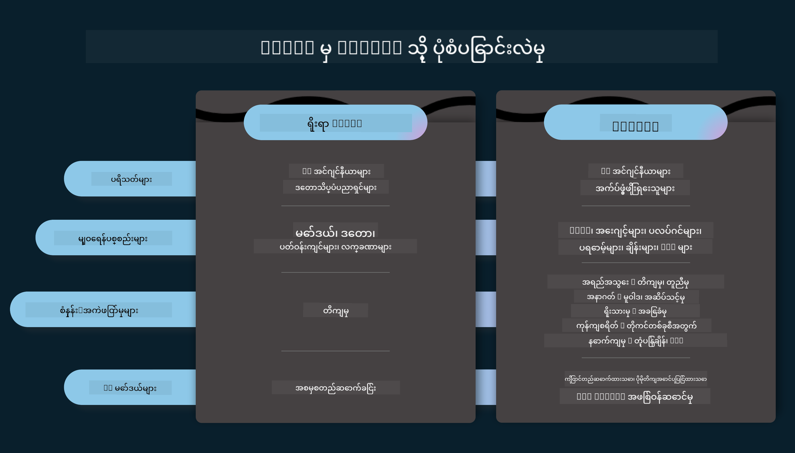
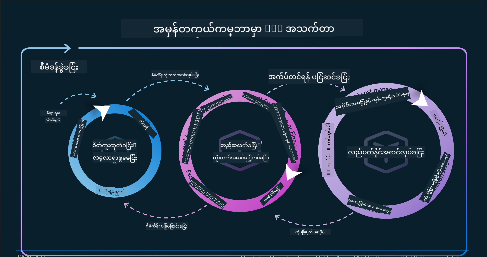
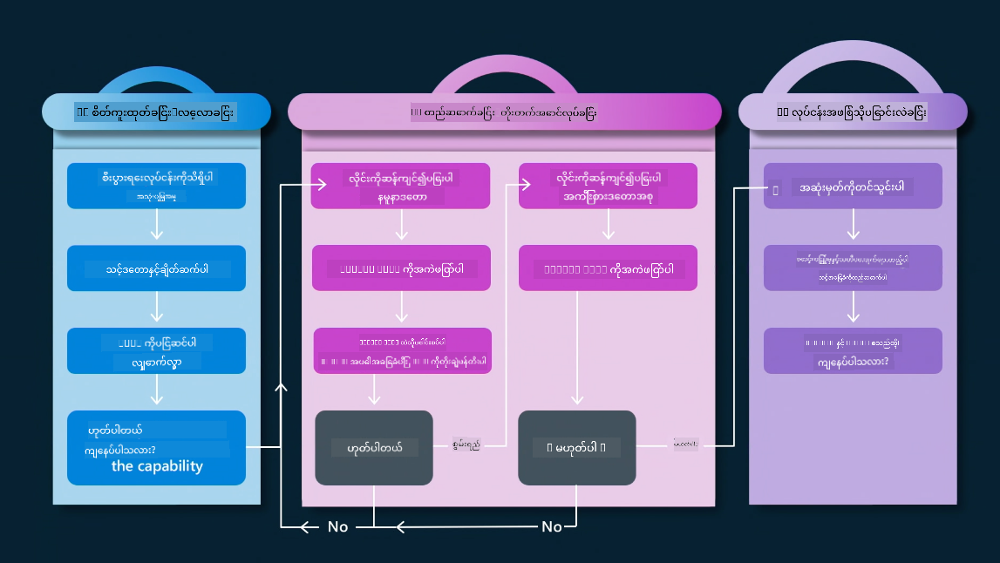
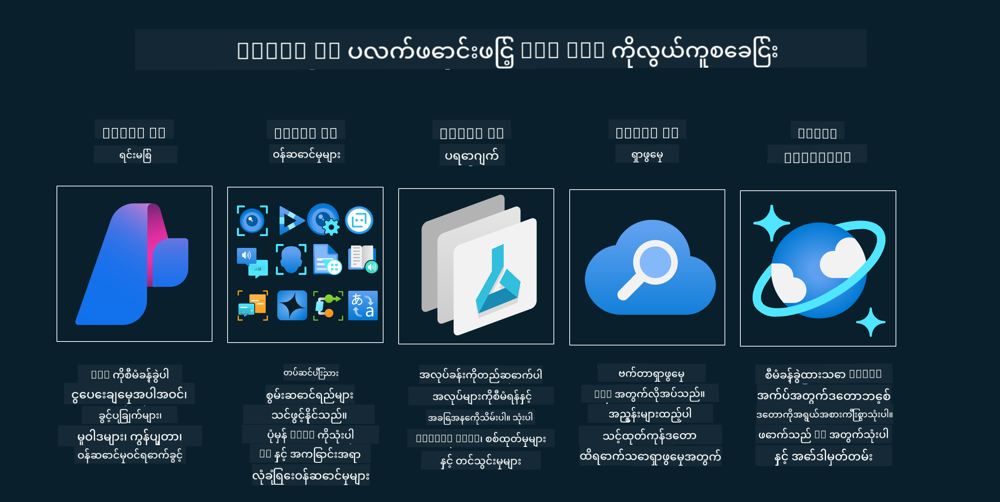
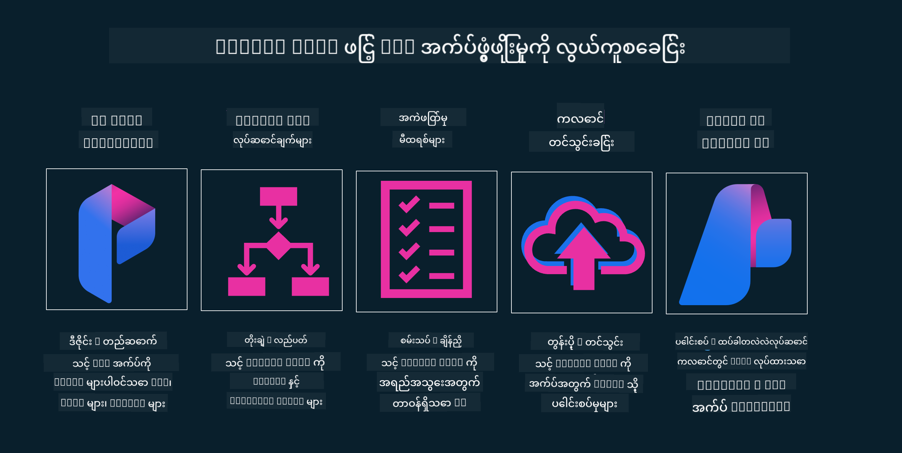

<!--
CO_OP_TRANSLATOR_METADATA:
{
  "original_hash": "b9d32511b27373a1b21b5789d4fda057",
  "translation_date": "2025-10-18T02:01:35+00:00",
  "source_file": "14-the-generative-ai-application-lifecycle/README.md",
  "language_code": "my"
}
-->

# Generative AI အက်ပလီကေးရှင်း၏ အသက်တာစဉ်

AI အက်ပလီကေးရှင်းများအတွက် အရေးကြီးသောမေးခွန်းတစ်ခုမှာ AI အင်္ဂါရပ်များ၏ သက်ဆိုင်မှုဖြစ်သည်။ AI သည် အလွန်မြန်ဆန်စွာ တိုးတက်နေသော နယ်ပယ်ဖြစ်သည့်အတွက် သင့်အက်ပလီကေးရှင်းကို သက်ဆိုင်မှု၊ ယုံကြည်စိတ်ချမှုနှင့် ခိုင်မာမှုရှိစေရန် အမြဲတမ်းကြည့်ရှု၊ အကဲဖြတ်ပြီး တိုးတက်အောင်လုပ်ဆောင်ရမည်။ ဒီနေရာမှာ Generative AI အသက်တာစဉ် framework က အရေးပါလာသည်။

Generative AI အသက်တာစဉ်သည် Generative AI အက်ပလီကေးရှင်းတစ်ခုကို ဖွံ့ဖြိုးတိုးတက်ခြင်း၊ အသုံးပြုခြင်းနှင့် ထိန်းသိမ်းခြင်းအဆင့်များကို လမ်းညွှန်ပေးသော framework တစ်ခုဖြစ်သည်။ သင့်ရည်မှန်းချက်များကို သတ်မှတ်ခြင်း၊ သင့်စွမ်းဆောင်ရည်ကို တိုင်းတာခြင်း၊ သင့်အခက်အခဲများကို ဖော်ထုတ်ခြင်းနှင့် သင့်ဖြေရှင်းချက်များကို အကောင်အထည်ဖော်ခြင်းတို့ကို ကူညီပေးသည်။ ဒါ့အပြင် သင့်အက်ပလီကေးရှင်းကို သင့်နယ်ပယ်နှင့် သင့်အကျိုးစီးပွားရှင်များ၏ ကျင့်ဝတ်နှင့် ဥပဒေစံနှင့် ကိုက်ညီအောင်လုပ်ဆောင်ရန်လည်း ကူညီပေးသည်။ Generative AI အသက်တာစဉ်ကို လိုက်နာခြင်းအားဖြင့် သင့်အက်ပလီကေးရှင်းသည် အမြဲတမ်းတန်ဖိုးရှိပြီး သုံးစွဲသူများကို ကျေနပ်မှုပေးနိုင်စေပါသည်။

## အကျဉ်းချုပ်

ဤအခန်းတွင် သင်သည်-

- MLOps မှ LLMOps သို့ Paradigm Shift ကို နားလည်ခြင်း
- LLM အသက်တာစဉ်
- အသက်တာစဉ် Tooling
- အသက်တာစဉ် Metrification နှင့် အကဲဖြတ်ခြင်း

## MLOps မှ LLMOps သို့ Paradigm Shift ကို နားလည်ခြင်း

LLM များသည် Artificial Intelligence ရဲ့ လက်နက်တစ်ခုအဖြစ် အသစ်ဖြစ်ပြီး၊ အက်ပလီကေးရှင်းများအတွက် အကဲဖြတ်ခြင်းနှင့် ဖန်တီးခြင်းလုပ်ငန်းများတွင် အလွန်အစွမ်းထက်သည်။ သို့သော် ဒီအစွမ်းထက်မှုသည် AI နှင့် အခြေခံ Machine Learning လုပ်ငန်းများကို streamline လုပ်ရာတွင် အကျိုးသက်ရောက်မှုများရှိသည်။

ဒီအခြေအနေတွင် ဒီ tool ကို dynamic ဖြစ်အောင် ပြောင်းလဲအသုံးပြုရန် အခြေခံအချက်များကို ပြောင်းလဲရန် လိုအပ်သည်။ ယခင် AI အက်ပလီကေးရှင်းများကို "ML Apps" ဟုခွဲခြားပြီး နောက်ဆုံးပေါ် AI အက်ပလီကေးရှင်းများကို "GenAI Apps" သို့မဟုတ် "AI Apps" ဟုခေါ်ဆိုနိုင်သည်။ ဒါဟာ နည်းပညာနှင့် နည်းလမ်းများကို အချိန်နှင့်အညီ ပြောင်းလဲမှုကို ရှင်းလင်းပြသသည်။ ဒီအရာသည် အနည်းငယ်သော အချက်များကို ပြောင်းလဲစေသည်။ အောက်ပါ comparison ကို ကြည့်ပါ။

LLMOps တွင် App Developers များကို ပိုမိုအာရုံစိုက်ပြီး Integration ကို အဓိကအချက်အဖြစ် အသုံးပြုသည်။ "Models-as-a-Service" ကို အသုံးပြုပြီး Metrics အတွက် အောက်ပါအချက်များကို စဉ်းစားသည်-

- အရည်အသွေး: တုံ့ပြန်မှုအရည်အသွေး
- အန္တရာယ်: တာဝန်ရှိသော AI
- ရိုးသားမှု: တုံ့ပြန်မှု၏ အခြေခံမှု (Make sense လား? မှန်ကန်လား?)
- ကုန်ကျစရိတ်: ဖြေရှင်းမှုဘတ်ဂျက်
- Latency: Token တုံ့ပြန်မှုအချိန်ပျမ်းမျှ

## LLM အသက်တာစဉ်

အရင်ဆုံး အသက်တာစဉ်နှင့် ပြောင်းလဲမှုများကို နားလည်ရန် အောက်ပါ infographic ကို ကြည့်ပါ။

သင်တွေ့မြင်နိုင်သည့်အတိုင်း၊ ဒါဟာ MLOps ရဲ့ အကျဉ်းချုပ်အသက်တာစဉ်များနှင့် ကွဲပြားသည်။ LLM များတွင် Prompting, အရည်အသွေးတိုးတက်စေရန် နည်းလမ်းများ (Fine-Tuning, RAG, Meta-Prompts), တာဝန်ရှိသော AI နှင့် သက်ဆိုင်သော အကဲဖြတ်မှုများ၊ နောက်ဆုံး Quality, Harm, Honesty, Cost နှင့် Latency စသည့် အကဲဖြတ်မှုများလိုအပ်သည်။

ဥပမာအားဖြင့်၊ Prompt Engineering ကို အသုံးပြု၍ Hypothesis မှန်ကန်မှုကို စမ်းသပ်ရန် LLM များကို အမျိုးမျိုး စမ်းသပ်ခြင်းဖြင့် အကြံဉာဏ်များကို ဖန်တီးနိုင်သည်။

ဒါဟာ တိုက်ရိုက်မဟုတ်ဘဲ အပေါင်းအစုများနှင့် အကြောင်းအရာများကို ထပ်တလဲလဲလုပ်ဆောင်ရမည်ဖြစ်သည်။

ဒီအဆင့်များကို ဘယ်လိုလေ့လာနိုင်မလဲ? အသက်တာစဉ်ကို ဘယ်လိုတည်ဆောက်နိုင်မလဲဆိုတာကို အသေးစိတ်လေ့လာကြည့်ရအောင်။

ဒါဟာ အနည်းငယ်ရှုပ်ထွေးနေတယ်လို့ ထင်ရနိုင်ပါတယ်။ အဓိကအဆင့်သုံးခုကို အရင်စိုက်ကြည့်ပါ။

1. အကြံဉာဏ်ဖန်တီးခြင်း/လေ့လာခြင်း: လေ့လာမှု၊ ဒီမှာ သင့်လုပ်ငန်းလိုအပ်ချက်များအရ လေ့လာနိုင်သည်။ Prototyping, [PromptFlow](https://microsoft.github.io/promptflow/index.html?WT.mc_id=academic-105485-koreyst) တည်ဆောက်ခြင်းနှင့် Hypothesis မှန်ကန်မှုကို စမ်းသပ်ခြင်း။
2. တည်ဆောက်ခြင်း/တိုးတက်အောင်လုပ်ခြင်း: အကဲဖြတ်မှု၊ dataset များကို ကြီးမားသောအဆင့်တွင် Fine-tuning နှင့် RAG ကဲ့သို့သော နည်းလမ်းများကို အသုံးပြု၍ ဖြေရှင်းချက်၏ ခိုင်မာမှုကို စစ်ဆေးခြင်း။ မဟုတ်ပါက၊ flow သို့မဟုတ် data ကို ပြန်လည်တည်ဆောက်ခြင်းဖြင့် ပြန်လည်အကောင်အထည်ဖော်ခြင်း။ Flow နှင့် scale ကို စမ်းသပ်ပြီး Metrics ကို စစ်ဆေးပြီးနောက်၊ နောက်အဆင့်သို့ ပြင်ဆင်နိုင်ပါပြီ။
3. လုပ်ငန်းဆောင်ရွက်ခြင်း: Integration, Monitoring နှင့် Alerts Systems များကို စနစ်ထဲသို့ ထည့်သွင်းခြင်း၊ deployment နှင့် Application integration ကို အက်ပလီကေးရှင်းတွင် ထည့်သွင်းခြင်း။

ထို့နောက်၊ Security, Compliance နှင့် Governance ကို အဓိကထားသော စီမံခန့်ခွဲမှု၏ အပေါင်းအစုကို ရှိသည်။

ဂုဏ်ယူပါတယ်၊ အခု သင့် AI App ကို အသုံးပြုရန် ပြင်ဆင်ပြီးဖြစ်ပါပြီ။ လက်တွေ့ကျသော အတွေ့အကြုံရရှိရန် [Contoso Chat Demo](https://nitya.github.io/contoso-chat/?WT.mc_id=academic-105485-koreys) ကို ကြည့်ပါ။

အခုတော့ ဘယ် Tools တွေကို အသုံးပြုနိုင်မလဲ?

## အသက်တာစဉ် Tooling

Tooling အတွက် Microsoft သည် [Azure AI Platform](https://azure.microsoft.com/solutions/ai/?WT.mc_id=academic-105485-koreys) နှင့် [PromptFlow](https://microsoft.github.io/promptflow/index.html?WT.mc_id=academic-105485-koreyst) ကို ပံ့ပိုးပေးပြီး သင့် cycle ကို အလွယ်တကူ အကောင်အထည်ဖော်နိုင်ရန် ကူညီပေးသည်။

[Azure AI Platform](https://azure.microsoft.com/solutions/ai/?WT.mc_id=academic-105485-koreys) သည် [AI Studio](https://ai.azure.com/?WT.mc_id=academic-105485-koreys) ကို အသုံးပြုခွင့်ပေးသည်။ AI Studio သည် မော်ဒယ်များ၊ နမူနာများနှင့် Tools များကို လေ့လာနိုင်သော web portal ဖြစ်သည်။ သင့်ရင်းမြစ်များကို စီမံခြင်း၊ UI development flows နှင့် SDK/CLI options များကို Code-First development အတွက် အသုံးပြုနိုင်သည်။

Azure AI သည် သင့်လုပ်ငန်းများ၊ ဝန်ဆောင်မှုများ၊ ပရောဂျက်များ၊ vector search နှင့် database လိုအပ်ချက်များကို စီမံရန် အရင်းအမြစ်များစွာကို အသုံးပြုနိုင်စေသည်။

PromptFlow ဖြင့် Proof-of-Concept(POC) မှ စတင်၍ အကြီးစားအက်ပလီကေးရှင်းများကို တည်ဆောက်ပါ-

- VS Code မှ Apps များကို Design နှင့် Build လုပ်ပါ၊ visual နှင့် functional tools များဖြင့်
- သင့် Apps များကို အရည်အသွေးမြင့် AI အတွက် စမ်းသပ်ပြီး Fine-tune လုပ်ပါ။
- Azure AI Studio ကို cloud နှင့် ပေါင်းစပ်ပြီး Iteration လုပ်ပါ၊ Push နှင့် Deploy လုပ်၍ အလျင်အမြန် Integration ရယူပါ။

## အံ့မခန်း! သင့်ရဲ့ သင်ကြားမှုကို ဆက်လက်လေ့လာပါ!

အံ့မခန်းပါပဲ၊ အခုတော့ [Contoso Chat App](https://nitya.github.io/contoso-chat/?WT.mc_id=academic-105485-koreyst) ကို ကြည့်ပြီး Cloud Advocacy သည် ဒီ concepts များကို အကဲဖြတ်မှုများတွင် ဘယ်လိုထည့်သွင်းထားသည်ကို လေ့လာပါ။ အခြားသော အကြောင်းအရာများကို [Ignite breakout session!
](https://www.youtube.com/watch?v=DdOylyrTOWg) တွင် ကြည့်ရှုပါ။

အခုတော့ Lesson 15 ကို ကြည့်ပါ၊ [Retrieval Augmented Generation and Vector Databases](../15-rag-and-vector-databases/README.md?WT.mc_id=academic-105485-koreyst) သည် Generative AI ကို ဘယ်လိုသက်ရောက်မှုရှိစေပြီး ပိုမိုစိတ်ဝင်စားဖွယ်ရှိသော Applications များကို ဘယ်လိုဖန်တီးနိုင်မည်ကို နားလည်ရန်!

---

**အကြောင်းကြားချက်**:  
ဤစာရွက်စာတမ်းကို AI ဘာသာပြန်ဝန်ဆောင်မှု [Co-op Translator](https://github.com/Azure/co-op-translator) ကို အသုံးပြု၍ ဘာသာပြန်ထားပါသည်။ ကျွန်ုပ်တို့သည် တိကျမှုအတွက် ကြိုးစားနေသော်လည်း အလိုအလျောက် ဘာသာပြန်မှုများတွင် အမှားများ သို့မဟုတ် မတိကျမှုများ ပါဝင်နိုင်သည်ကို သတိပြုပါ။ မူရင်းဘာသာစကားဖြင့် ရေးသားထားသော စာရွက်စာတမ်းကို အာဏာတရားရှိသော အရင်းအမြစ်အဖြစ် သတ်မှတ်သင့်ပါသည်။ အရေးကြီးသော အချက်အလက်များအတွက် လူ့ဘာသာပြန်ပညာရှင်များကို အသုံးပြုရန် အကြံပြုပါသည်။ ဤဘာသာပြန်မှုကို အသုံးပြုခြင်းမှ ဖြစ်ပေါ်လာသော အလွဲအမှားများ သို့မဟုတ် အနားယူမှုများအတွက် ကျွန်ုပ်တို့သည် တာဝန်မယူပါ။