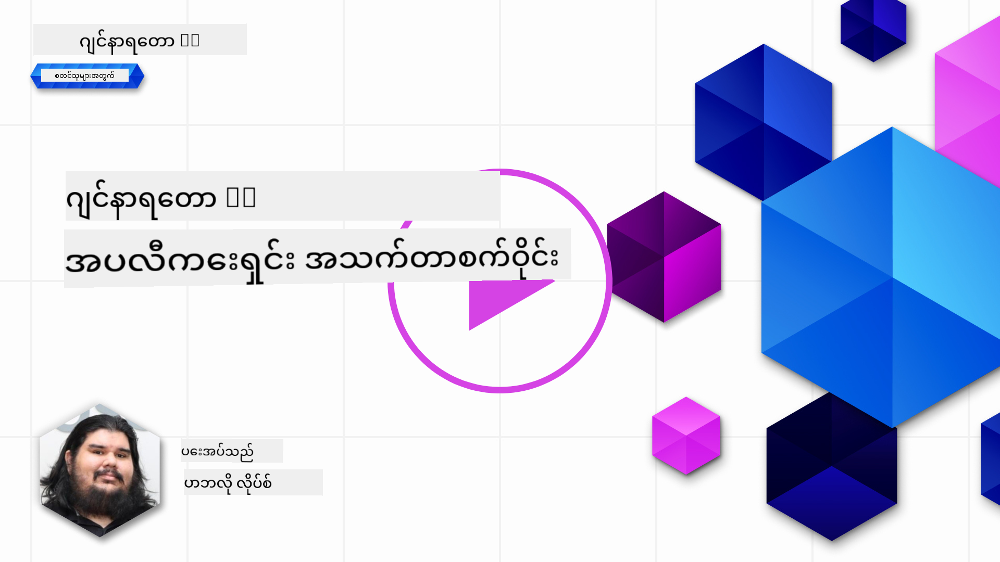

<!--
CO_OP_TRANSLATOR_METADATA:
{
  "original_hash": "27a5347a5022d5ef0a72ab029b03526a",
  "translation_date": "2025-07-09T16:00:11+00:00",
  "source_file": "14-the-generative-ai-application-lifecycle/README.md",
  "language_code": "my"
}
-->

# Generative AI အက်ပလီကေးရှင်း အသက်တာကာလ

AI အက်ပလီကေးရှင်းအားလုံးအတွက် အရေးကြီးတဲ့မေးခွန်းတစ်ခုကတော့ AI လုပ်ဆောင်ချက်တွေဟာ ဘယ်လောက်သက်ဆိုင်မှုရှိသလဲဆိုတာပါ၊ AI က အလွန်မြန်ဆန်စွာတိုးတက်နေတဲ့နယ်ပယ်ဖြစ်တဲ့အတွက် သင့်အက်ပလီကေးရှင်းဟာ သက်ဆိုင်မှုရှိ၊ ယုံကြည်စိတ်ချရ၊ ပြင်းထန်မှုရှိနေဖို့အတွက် မကြာခဏစောင့်ကြည့်၊ အကဲဖြတ်၊ တိုးတက်အောင်လုပ်ဆောင်ဖို့လိုပါတယ်။ ဒီမှာ Generative AI အသက်တာကာလက အရေးပါလာပါတယ်။

Generative AI အသက်တာကာလဟာ Generative AI အက်ပလီကေးရှင်းတစ်ခုကို ဖန်တီး၊ တပ်ဆင်၊ ထိန်းသိမ်းရာတွင် လမ်းညွှန်ပေးတဲ့ ဖရိမ်ဝပ်တစ်ခုဖြစ်ပါတယ်။ သင့်ရဲ့ရည်မှန်းချက်တွေကို သတ်မှတ်၊ စွမ်းဆောင်ရည်ကို တိုင်းတာ၊ စိန်ခေါ်မှုတွေကို ရှာဖွေ၊ ဖြေရှင်းနည်းတွေကို အကောင်အထည်ဖော်ရာမှာ ကူညီပေးပါတယ်။ ထို့အပြင် သင့်အက်ပလီကေးရှင်းကို သင့်နယ်ပယ်နှင့် ပါဝင်သူများရဲ့ ကျင့်ဝတ်နှင့် ဥပဒေရေးရာစံနှုန်းများနှင့် ကိုက်ညီစေရန်လည်း ကူညီပေးပါတယ်။ Generative AI အသက်တာကာလကို လိုက်နာခြင်းဖြင့် သင့်အက်ပလီကေးရှင်းဟာ အမြဲတမ်းတန်ဖိုးပေးနိုင်ပြီး အသုံးပြုသူများကို စိတ်ကျေနပ်မှုရစေမှာ ဖြစ်ပါတယ်။

## နိဒါန်း

ဒီအခန်းမှာ သင်မှာ:

- MLOps မှ LLMOps သို့ Paradigm ပြောင်းလဲမှုကို နားလည်မည်
- LLM အသက်တာကာလ
- အသက်တာကာလကိရိယာများ
- အသက်တာကာလ တိုင်းတာခြင်းနှင့် အကဲဖြတ်ခြင်း

## MLOps မှ LLMOps သို့ Paradigm ပြောင်းလဲမှုကို နားလည်ခြင်း

LLM များသည် Artificial Intelligence လက်နက်အစုအဝေးထဲက အသစ်တစ်ခုဖြစ်ပြီး၊ အက်ပလီကေးရှင်းများအတွက် ခွဲခြမ်းစိတ်ဖြာခြင်းနှင့် ဖန်တီးခြင်းလုပ်ငန်းများတွင် အလွန်အစွမ်းထက်ပါသည်။ သို့သော် ဒီအစွမ်းထက်မှုက AI နှင့် Classic Machine Learning လုပ်ငန်းများကို စနစ်တကျ စီမံခန့်ခွဲရာတွင် အကျိုးသက်ရောက်မှုတချို့ရှိစေပါတယ်။

ဒီအတွက် ဒီကိရိယာကို တိကျမှန်ကန်တဲ့ အားပေးမှုများနှင့်အတူ လှုပ်ရှားနိုင်ဖို့ Paradigm အသစ်တစ်ခုလိုအပ်ပါတယ်။ အဟောင်း AI အက်ပလီကေးရှင်းများကို "ML Apps" ဟုခွဲခြားနိုင်ပြီး၊ အသစ်ထွက်ရှိလာသော AI အက်ပလီကေးရှင်းများကို "GenAI Apps" သို့မဟုတ် "AI Apps" ဟုခေါ်ဆိုနိုင်ပြီး၊ အချိန်အလိုက် အသုံးပြုသော နည်းပညာနှင့် နည်းလမ်းများကို ပြသပါတယ်။ ဒီကိစ္စက ကျွန်တော်တို့ရဲ့ စကားဝိုင်းကို အမျိုးမျိုးနည်းဖြင့် ပြောင်းလဲစေပါတယ်၊ အောက်ပါ နှိုင်းယှဉ်ချက်ကို ကြည့်ပါ။

LLMOps မှာတော့ အဓိကအားဖြင့် အက်ပလီကေးရှင်း ဖန်တီးသူများကို ဦးတည်ပြီး၊ ပေါင်းစည်းမှုများကို အဓိကအချက်အဖြစ် အသုံးပြုကာ "Models-as-a-Service" ကို အသုံးပြုခြင်းနှင့် အောက်ပါအချက်များအပေါ် စဉ်းစားပါတယ်။

- အရည်အသွေး: တုံ့ပြန်မှုအရည်အသွေး
- ထိခိုက်မှု: တာဝန်ရှိသော AI
- ရိုးသားမှု: တုံ့ပြန်မှု၏ အခြေခံမှု (အဓိပ္ပါယ်ရှိသလား? မှန်ကန်သလား?)
- ကုန်ကျစရိတ်: ဖြေရှင်းချက် ဘတ်ဂျက်
- နောက်ကျချိန်: တုံ့ပြန်မှုအတွက် ပျမ်းမျှ အချိန်

## LLM အသက်တာကာလ

ပထမဦးဆုံး အသက်တာကာလနှင့် ပြင်ဆင်မှုများကို နားလည်ရန် အောက်ပါ အချက်အလက်ပုံကို မှတ်သားပါ။

သင်တွေ့ရမယ့်အတိုင်း၊ ဒါဟာ MLOps ရဲ့ ပုံမှန် အသက်တာကာလများနှင့် ကွာခြားပါတယ်။ LLM များမှာ Prompting, အရည်အသွေးတိုးတက်စေရန် နည်းလမ်းများ (Fine-Tuning, RAG, Meta-Prompts), တာဝန်ရှိသော AI နှင့် ပတ်သက်သော အကဲဖြတ်ခြင်းများ၊ နောက်ဆုံးတွင် အသစ်သော တိုင်းတာမှုများ (အရည်အသွေး၊ ထိခိုက်မှု၊ ရိုးသားမှု၊ ကုန်ကျစရိတ်နှင့် နောက်ကျချိန်) တို့လိုအပ်ချက်များစွာရှိပါတယ်။

ဥပမာအားဖြင့်၊ ကျွန်တော်တို့ စဉ်းစားပုံကို ကြည့်ပါ။ Prompt engineering ကို အသုံးပြုကာ LLM များစွာနှင့် စမ်းသပ်ပြီး သူတို့ရဲ့ အယူအဆမှန်ကန်နိုင်မလား စမ်းသပ်ကြည့်ပါတယ်။

ဒါဟာ တန်းတူတန်းမျှ မဟုတ်ပဲ ပေါင်းစည်းထားသော လည်ပတ်မှုများ၊ အကြိမ်ကြိမ် ပြန်လည်လုပ်ဆောင်မှုများနှင့် အထွေထွေ အသက်တာကာလတစ်ခုဖြစ်ပါတယ်။

ဒီအဆင့်တွေကို ဘယ်လို ရှာဖွေကြမလဲ? အသက်တာကာလတစ်ခုကို ဘယ်လို တည်ဆောက်မလဲဆိုတာကို အသေးစိတ် ကြည့်ကြရအောင်။

ဒီဟာက အနည်းငယ်ရှုပ်ထွေးသလို မြင်ရနိုင်ပါတယ်၊ အရင်ဆုံး အကြီးစား အဆင့်သုံးခုကို အာရုံစိုက်ကြည့်ပါ။

1. စဉ်းစားခြင်း/ရှာဖွေခြင်း: ရှာဖွေခြင်း၊ ဒီမှာ ကျွန်တော်တို့ စီးပွားရေးလိုအပ်ချက်အရ ရှာဖွေနိုင်ပါတယ်။ Prototype ဖန်တီးခြင်း၊ [PromptFlow](https://microsoft.github.io/promptflow/index.html?WT.mc_id=academic-105485-koreyst) တစ်ခု ဖန်တီးပြီး ကျွန်တော်တို့ရဲ့ အယူအဆအတွက် ထိရောက်မှုရှိမရှိ စမ်းသပ်ခြင်း။
2. တည်ဆောက်ခြင်း/တိုးချဲ့ခြင်း: အကောင်အထည်ဖော်ခြင်း၊ ယခုအချိန်မှာ ကျယ်ပြန့်သော ဒေတာများအတွက် အကဲဖြတ်ခြင်း၊ Fine-tuning နှင့် RAG ကဲ့သို့သော နည်းလမ်းများကို အသုံးပြုကာ ဖြေရှင်းချက်၏ ပြင်းထန်မှုကို စစ်ဆေးခြင်း။ မအောင်မြင်ပါက ပြန်လည်တည်ဆောက်ခြင်း၊ လည်ပတ်မှုတွင် အဆင့်အသစ်များ ထည့်သွင်းခြင်း သို့မဟုတ် ဒေတာကို ပြန်လည်ဖွဲ့စည်းခြင်းကူညီနိုင်ပါတယ်။ ကျွန်တော်တို့ရဲ့ လည်ပတ်မှုနှင့် အရွယ်အစားကို စမ်းသပ်ပြီး Metrics များကို စစ်ဆေးပါက နောက်အဆင့်အတွက် ပြင်ဆင်ပြီးဖြစ်ပါပြီ။
3. လည်ပတ်မှုဆောင်ရွက်ခြင်း: ပေါင်းစည်းခြင်း၊ ယခုအချိန်မှာ စနစ်ကို စောင့်ကြည့်မှုနှင့် သတိပေးစနစ်များ ထည့်သွင်းခြင်း၊ တပ်ဆင်ခြင်းနှင့် အက်ပလီကေးရှင်းနှင့် ပေါင်းစည်းခြင်း။

ထို့နောက် စီမံခန့်ခွဲမှု၏ အထွေထွေ လည်ပတ်မှုကာလရှိပြီး လုံခြုံရေး၊ လိုက်နာမှုနှင့် အုပ်ချုပ်မှုကို ဦးတည်ထားပါတယ်။

ဂုဏ်ယူပါတယ်၊ ယခု သင့် AI အက်ပလီကေးရှင်း အသင့်ဖြစ်ပြီး လည်ပတ်နိုင်ပါပြီ။ လက်တွေ့အတွေ့အကြုံရရှိရန် [Contoso Chat Demo](https://nitya.github.io/contoso-chat/?WT.mc_id=academic-105485-koreys) ကို ကြည့်ရှုနိုင်ပါတယ်။

ယခု ဘယ်ကိရိယာတွေကို အသုံးပြုနိုင်မလဲ?

## အသက်တာကာလကိရိယာများ

ကိရိယာများအတွက် Microsoft က [Azure AI Platform](https://azure.microsoft.com/solutions/ai/?WT.mc_id=academic-105485-koreys) နှင့် [PromptFlow](https://microsoft.github.io/promptflow/index.html?WT.mc_id=academic-105485-koreyst) ကို ပံ့ပိုးပေးပြီး သင့်အသက်တာကာလကို လွယ်ကူစွာ အကောင်အထည်ဖော်နိုင်စေပါတယ်။

[Azure AI Platform](https://azure.microsoft.com/solutions/ai/?WT.mc_id=academic-105485-koreys) က [AI Studio](https://ai.azure.com/?WT.mc_id=academic-105485-koreys) ကို အသုံးပြုခွင့်ပြုပါတယ်။ AI Studio သည် မော်ဒယ်များ၊ နမူနာများနှင့် ကိရိယာများကို ရှာဖွေစူးစမ်းနိုင်သော ဝက်ဘ်ပေါ်တယ်ဖြစ်ပြီး၊ သင့်ရင်းမြစ်များကို စီမံခန့်ခွဲခြင်း၊ UI ဖန်တီးမှု လည်ပတ်မှုများနှင့် SDK/CLI ရွေးချယ်မှုများဖြင့် Code-First ဖွံ့ဖြိုးတိုးတက်မှုကို ထောက်ပံ့ပေးပါတယ်။

Azure AI က သင့် လည်ပတ်မှုများ၊ ဝန်ဆောင်မှုများ၊ စီမံကိန်းများ၊ vector ရှာဖွေရေးနှင့် ဒေတာဘေ့စ်လိုအပ်ချက်များကို စီမံခန့်ခွဲရန် အရင်းအမြစ်များစွာကို အသုံးပြုခွင့်ပြုပါတယ်။

Proof-of-Concept (POC) မှ စတင်ပြီး ကြီးမားသော အက်ပလီကေးရှင်းများအထိ PromptFlow ဖြင့် တည်ဆောက်ပါ။

- VS Code မှာ ဒီဇိုင်းဆွဲပြီး အမြင်နှင့် လုပ်ဆောင်ချက်ကိရိယာများဖြင့် အက်ပလီကေးရှင်းများ ဖန်တီးပါ။
- အရည်အသွေးမြင့် AI အတွက် အက်ပလီကေးရှင်းများကို စမ်းသပ်ပြီး Fine-tune လုပ်ပါ။
- Azure AI Studio ကို အသုံးပြုကာ cloud နှင့် ပေါင်းစည်းပြီး အမြန်တင်ပို့ခြင်းနှင့် တပ်ဆင်ခြင်းများ ပြုလုပ်ပါ။

## အံ့သြဖွယ်! သင်ယူမှုကို ဆက်လက်လုပ်ဆောင်ပါ!

အံ့သြဖွယ်ပါပဲ၊ ယခု [Contoso Chat App](https://nitya.github.io/contoso-chat/?WT.mc_id=academic-105485-koreyst) ဖြင့် အက်ပလီကေးရှင်းတည်ဆောက်ပုံကို ပိုမိုနားလည်ပြီး Cloud Advocacy က ဒီအယူအဆများကို ပြသပုံကို ကြည့်ရှုနိုင်ပါတယ်။ ပိုမိုသော အကြောင်းအရာများအတွက် ကျွန်တော်တို့ရဲ့ [Ignite breakout session!](https://www.youtube.com/watch?v=DdOylyrTOWg) ကိုလည်း ကြည့်ရှုနိုင်ပါတယ်။

ယခု Lesson 15 ကို ကြည့်ရှုကာ [Retrieval Augmented Generation နှင့် Vector Databases](../15-rag-and-vector-databases/README.md?WT.mc_id=academic-105485-koreyst) များက Generative AI ကို ဘယ်လို သက်ရောက်မှုရှိစေပြီး ပိုမိုစိတ်ဝင်စားဖွယ် အက်ပလီကေးရှင်းများ ဖန်တီးနိုင်သလဲ ဆိုတာ နားလည်ပါ။

**အကြောင်းကြားချက်**  
ဤစာတမ်းကို AI ဘာသာပြန်ဝန်ဆောင်မှု [Co-op Translator](https://github.com/Azure/co-op-translator) ဖြင့် ဘာသာပြန်ထားပါသည်။ ကျွန်ုပ်တို့သည် တိကျမှန်ကန်မှုအတွက် ကြိုးစားသော်လည်း အလိုအလျောက် ဘာသာပြန်ခြင်းတွင် အမှားများ သို့မဟုတ် မှားယွင်းချက်များ ပါဝင်နိုင်ကြောင်း သတိပြုပါရန် မေတ္တာရပ်ခံအပ်ပါသည်။ မူရင်းစာတမ်းကို မိမိဘာသာစကားဖြင့်သာ တရားဝင်အချက်အလက်အဖြစ် ယူဆသင့်ပါသည်။ အရေးကြီးသော အချက်အလက်များအတွက် လူ့ဘာသာပြန်ပညာရှင်မှ ဘာသာပြန်ခြင်းကို အကြံပြုပါသည်။ ဤဘာသာပြန်ချက်ကို အသုံးပြုရာမှ ဖြစ်ပေါ်လာနိုင်သည့် နားလည်မှုမှားယွင်းမှုများအတွက် ကျွန်ုပ်တို့ တာဝန်မယူပါ။