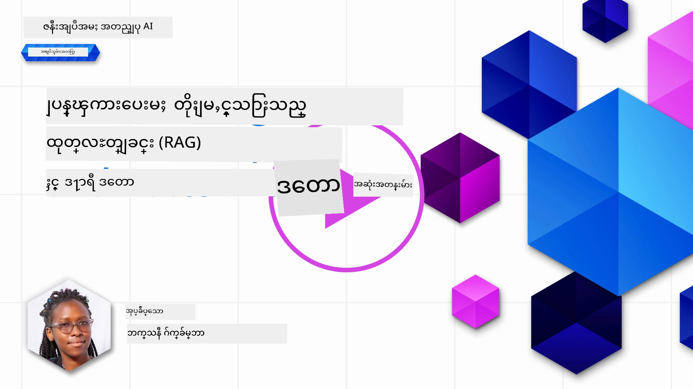
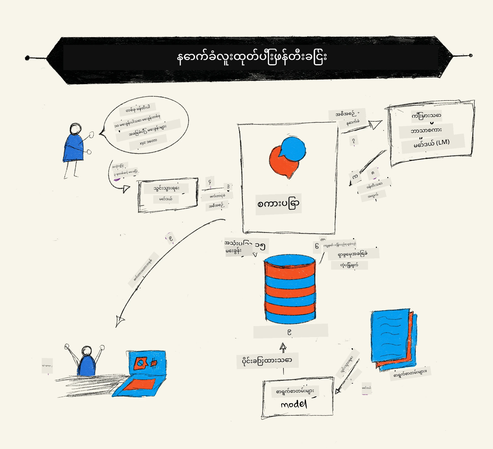
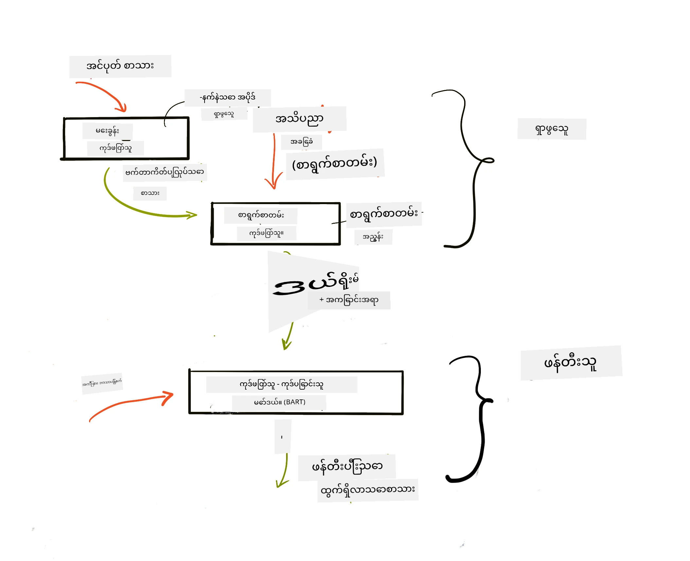
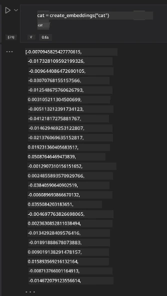

# ပြန်လည်ရှာဖွေမှုဖြင့်တိုးချဲ့ထုတ်လုပ်မှု (RAG) နှင့် ဗက်ဂ်တာဒေတာဘေ့စ်များ

[](https://youtu.be/4l8zhHUBeyI?si=BmvDmL1fnHtgQYkL)

ရှာဖွေရေးလျှောက်လွှာသင်ခန်းစာတွင် သင်သည် သင့်ကိုယ်ပိုင်ဒေတာကို ကြီးမားသောဘာသာစကားမော်ဒယ်များ (LLMs) နှင့်ပေါင်းစပ်သုံးနိုင်ပုံကို သွားရောက်လေ့လာခဲ့သည်။ ဒီသင်ခန်းစာတွင် ကျွန်ုပ်တို့သည် သင့် LLM လျှောက်လွှာတွင် သင့်ဒေတာအား အခြေခံခြင်း၊ လုပ်ငန်းစဉ်ယန္တရား နှင့် ဒေတာသိမ်းဆည်းခြင်းနည်းလမ်းများကို နက်နဲစွာဖြင့် မှတ်သား လေ့လာသွားမည်ဖြစ်ပြီး၊ ၎င်းတွင် သူငယ်ချင်းများနှင့် စာသားများပါဝင်သည်။

> **ဗီဒီယို မကြာမီ ထွက်မည်**

## မိတ်ဆက်

ဒီသင်ခန်းစာတွင် ကျွန်ုပ်တို့သည် အောက်ပါအကြောင်းအရာများကို ဝင်ရောက်လေ့လာမည်ဖြစ်သည်။

- RAG အကြောင်းအရာ မိတ်ဆက်ခြင်း၊ ၎င်းသည် အဘယ်ကြောင့် AI (artificial intelligence) တွင် အသုံးပြုသည်ကို သဘောပေါက်ခြင်း။

- ဗက်ဂ်တာဒေတာဘေ့စ်များ၏ အဓိပ္ပာယ်နှင့် ကျွန်ုပ်တို့၏ လျှောက်လွှာအတွက် တစ်ခုကိုဖန်တီးခြင်းကို သိရှိမှု။

- လက်တွေ့နမူနာ တစ်ခု အနေနှင့် RAG ကို လျှောက်လွှာထဲသို့ ပေါင်းစပ်ဆောင်ရွက်ခြင်း။

## သင်ယူရမည့် ရည်မှန်းချက်များ

ဒီသင်ခန်းစာ အပြီးတွင် သင်သည် အောက်ပါအရာများကို ပြုလုပ်နိုင်မည်ဖြစ်သည်။

- ဒေတာ ရှာဖွေရေးနည်းများနှင့် အလုပ်လုပ်ပုံတွင် RAG ၏ အရေးပါမှုကို ဖြေကြားနိုင်မည်။

- RAG လျှောက်လွှာကို ဆက်တင်ပြုလုပ်ပြီး သင့်ဒေတာကို LLM သို့ အခြေခံနိုင်မည်။

- LLM လျှောက်လွှာများတွင် RAG နှင့် ဗက်ဂ်တာဒေတာဘေ့စ်များကို ထိရောက်စွာ ပေါင်းစပ်အသုံးပြုနိုင်မည်။

## ကျွန်ုပ်တို့၏အခြေအနေ: ကိုယ်ပိုင်ဒေတာဖြင့် ကျွန်ုပ်တို့၏ LLM များအား အားကောင်းစေခြင်း

ဒီသင်ခန်းစာအတွက် ကျွန်ုပ်တို့သည် ပညာရေးဆိုတာတိုက်သစ်ကြီးထဲသို့ ကိုယ်ပိုင်မှတ်စုများထည့်သွင်းလိုသည်၊ ၎င်းကြောင့် chatbot သည် အကြောင်းအရာ အမျိုးမျိုးအပေါ် ပိုမိုသိရှိနိုင်မည်ဖြစ်သည်။ ကျွန်ုပ်တို့၏ မှတ်စုများဖြင့် သင်ယူသူများ အကောင်းဆုံးလေ့လာနိုင်မည်ဖြစ်ပြီး ခွဲခြားသိမြင်နိုင်မည့်အချက်များအပြင် စာမေးပွဲပြင်ဆင်ရာတွင်လည်း ပိုမိုထောက်ပံ့နိုင်မည်ဖြစ်သည်။ ကျွန်ုပ်တို့၏အခြေအနေဖန်တီးခြင်းအတွက် မူလ ယူကျင့်ကြသည်မှာ -

- `Azure OpenAI:` chatbot ဖန်တီးရန် အသုံးပြုမည့် LLM

- `AI for beginners' lesson on Neural Networks` မှ ဒေတာကို ကျွန်ုပ်တို့၏ LLM အခြေခံထားမည်

- `Azure AI Search` နှင့် `Azure Cosmos DB:` ဗက်ဂ်တာဒေတာဘေ့စ်များကို ဒေတာသိမ်းဆည်းခြင်းနှင့် ရှာဖွေရေးညစ်ညမ်းပုံစံ တည်ဆောက်ရန်

အသုံးပြုသူများသည် မိမိမှတ်စုများမှ လေ့ကျင့်မေးခွန်းများ ဖန်တီးနိုင်မည်၊ ပြန်လည်သုံးသပ်ရန် ဖလက်ရှ်ကတ်များ ပြုလုပ်နိုင်မည်နှင့် အကျဉ်းချုပ်သုံးသပ်ချက်များ ဆွေးနွေးနိုင်မည် ဖြစ်သည်။ စတင်ရန်အတွက် RAG သည် အဘယ်ကြောင့် ဖြစ်ပြီး အလုပ်လုပ်ပုံကို ကြည့်ကြပါစို့။

## ပြန်လည်ရှာဖွေမှုဖြင့်တိုးချဲ့ထုတ်လုပ်မှု (RAG)

LLM ဖြင့် လှုံ့ဆော်သော chatbot သည် အသုံးပြုသူ၏ အမေးများကို ကောင်းမွန်သော ဖြေကြားချက်များဖြင့် ပြန်လည်ထုတ်လုပ်သည်။ ၎င်းသည် အပြန်အလှန်ဆက်သွယ်မှုအတွက် တီထွင်ထားပြီး အသုံးပြုသူများနှင့် ခေါင်းစဉ်အမျိုးမျိုးပေါ်တွင် ဆွေးနွေးနိုင်သည်။ သို့သော်၊ ၎င်း၏ဖြေကြားချက်များသည် ပံ့ပိုးပေးသော အကြောင်းအရာနှင့် အခြေခံသင်ကြားမှု ဒေတာအပေါ်သာ ကန့်သတ်နေသည်။ ဥပမာအားဖြင့် GPT-4 ၏ အတွင်းဂလုဏ် အပ်နှံထားသည့် အချိန်မှာ စက်တင်ဘာ ၂၀၂၁ ဖြစ်၍ ၎င်းကာလပြီးနောက် ဖြစ်ပွားသော ဖြစ်ရပ်များကို သိရှိမှုမရှိပါ။ ထို့အပြင် LLM များသုံးသည့် ဒေတာသည် ကိုယ်ရေးမှတ်စုများ သို့မဟုတ် ကုမ္ပဏီ၏ ထုတ်ကုန်လက်စွဲစာအုပ်များကဲ့သို့သော လျှို့ဝှက်သတင်းအချက်အလက် မပါဝင်ပါ။

### RAG များ (ပြန်လည်ရှာဖွေမှုဖြင့်တိုးချဲ့ထုတ်လုပ်မှု) ဘယ်လို အလုပ်လုပ်သလဲ



သင်တို့ မှတ်စုများမှ မေးခွန်းများဖန်တီးနိုင်သော chatbot တစ်ခု ထုတ်လုပ်လိုပါက၊ အသိပညာအခြေမြှင့်တင်မှုနှင့် ချိတ်ဆက်မှုလိုအပ်သည်။ ဒီမှာ RAG က ငြားကူပါသည်။ RAG များအလုပ်လုပ်ပုံမှာ -

- **အသိပညာအခြေ:** ရှာဖွေမှုမပြုမီ၊ ဒေါက်မြူးမူများအား စုဆောင်းပြီး ကြီးမားသောစာရွက်များကို သေးငယ်သောအပိုင်းများသို့ ခွဲခြား၊ စာသားဗက်ဂ်တာသို့ ပြောင်းလဲ၍ ဒေတာဘေ့စ်တွင် သိမ်းဆည်းပါသည်။

- **အသုံးပြုသူ မေးခွန်း:** အသုံးပြုသူသည် မေးခွန်းတစ်ခု မေးသည်။

- **ပြန်လည်ရှာဖွေမှု:** အသုံးပြုသူ မေးခွန်းမေးသောအခါ၊ embedding မော်ဒယ်သည် အသိပညာအခြေမှ သက်ဆိုင်သော အချက်အလက်များကို ရှာဖွေပြီး၊ ပရို့မြတ်ထဲသို့ ပါဝင်စေရမည့် အကြောင်းအရာ ပိုမိုရရှိစေသည်။

- **တိုးချဲ့ထုတ်လုပ်မှု:** LLM သည် ကောက်ယူထားသောဒေတာအပေါ်တွင် မိမိ ဖြေကြားချက်ကို မြှင့်တင်သည်။ ၎င်းအားဖြင့် မူလသင်ကြားထားသော ဒေတာအပေါ်မှသာမက၊ သက်ဆိုင်သော နောက်ထပ် အချက်အလက်များမှ တိုးချဲ့ထားသောဖြေကြားချက်ကို ပေးနိုင်သည်။ ပြန်လည်ရယူသော ဒေတာကို LLM ဖြေကြားချက်များတိုးချဲ့ရန် အသုံးပြုသည်။ ထို့နောက် LLM သည် အသုံးပြုသူ၏ မေးခွန်းကို ဖြေကြားသည်။



RAG များ၏ နည်းပညာဖွဲ့စည်းမှုကို transformers အသုံးပြုပြီး encoder နှင့် decoder အပိုင်းနှစ်ပိုင်း ပေါင်းစပ်သည်။ ဥပမာ- အသုံးပြုသူ မေးခွန်းမေးသောအခါ 'input text' ကို စကားလုံးအဓိပ္ပာယ်ဖော်မြူသော vectors သို့ 'encode' ပြုလုပ်ပြီး၊ ထို vectors များကို 'decode' လုပ်ကာ ကျွန်ုပ်တို့၏ ဒေါက်မြူးညွှန်းချက်နှင့် အသုံးပြုသူ မေးခွန်းအပေါ် တာဝန်ထမ်းဆောင်သည့် စာသားအသစ် 생성သည်။ LLM သည် output ထုတ်ရန် encoder-decoder မော်ဒယ်နှစ်ခုစလုံးကို အသုံးပြုသည်။

[Retrieval-Augmented Generation for Knowledge intensive NLP Tasks](https://arxiv.org/pdf/2005.11401.pdf?WT.mc_id=academic-105485-koreyst) သုတေသနစာတမ်းအရ RAG ကို အောက်ပါနည်းလမ်းနှစ်ခုဖြင့် လုပ်ဆောင်သည်။

- **_RAG-Sequence_** အသုံးပြုသူ မေးခွန်းကို အကောင်းဆုံးဖြေကြားချက် ခန့်မှန်းရန် ပြန်လည်ရယူထားသော ဒေါက်မြူးများကို အသုံးပြုသည်။

- **RAG-Token** ဒေါက်မြူးများအား token တစ်ခုအသစ် ထုတ်လုပ်ရာတွင် အသုံးပြုကာ နောက်တစ်token တွေကို ထုတ်လုပ်ရန် ပြန်လည် ရှာဖွေသည်။

### RAG များ ကို အဘယ်ကြောင့် အသုံးပြုသင့်သလဲ?

- **သတင်းအချက်အလက်ကျယ်ပြန့်မှု:** စာသားဖြေကြားချက်များကို အချိန်နှင့် ကိုက်ညီစေပြီး အထူးသဖြင့် ဧရိယာအတွင်း သတ်မှတ်ချက်များအပေါ် လုပ်ဆောင်မှုကို တိုးတက်စေသည်။

- အသုံးပြုသူ မေးခွန်းများအတွက် သက်ဆိုင်ရာ အချက်အလက်များကို အသုံးပြု၍ အတုဖန်တီးမှုကို လျှော့ချသည်။

- **ကုန်ကျစရိတ် သက်သာမှု**: LLM ကို fine-tune ပြုလုပ်ခြင်းထက် ပိုသက်သာသော နည်းလမ်းဖြစ်သည်။

## အသိပညာအခြေတစ်ခု ဖန်တီးခြင်း

ကျွန်ုပ်တို့၏ လျှောက်လွှာသည် ကိုယ်ပိုင်ဒေတာအပေါ်အခြေခံသည်၊ ၎င်းမှာ AI For Beginners ပရိုဂရမ်အတွက် Neural Network သင်ခန်းစာဖြစ်သည်။

### ဗက်ဂ်တာဒေတာဘေ့စ်များ

ဗက်ဂ်တာ ဒေတာဘေ့စ်သည် ရိုးရာ ဒေတာဘေ့စ်များနှင့် မတူပဲ စိတ်ရှည် embedded vectors များကို သိမ်းဆည်း၊ စီမံခန့်ခွဲနှင့် ရှာဖွေသွားရန် ဒီဇိုင်းချထားသည်။ ဒေါက်မြူးအရေအတွက် ဂဏန်းတန်ဖိုးများ အဖြစ် သိမ်းဆည်းသည်။ ဒေတာကို ဂဏန်းဗက်ဂ်တာများ ခွဲခြားခြင်းဖြင့် ကျွန်ုပ်တို့၏ AIစနစ်အတွက် ဒေတာကို ပိုမိုသဘောပေါက်ကောင်းစေသည်။

ကျွန်ုပ်တို့သည် embedding များအား vector database များတွင် သိမ်းဆည်းပါသည်၊ ထို့ကြောင့် LLM များသည် input အနေဖြင့် လက်ခံနိုင်သော token အရေအတွက် ကန့်သတ်ထားသည်။ အဖြစ်၊ embedding များအား တစ်နေရာတည်း LLM သို့ မပို့ပေးနိုင်ဘဲ ဝေခြင်းလိုအပ်ပြီး အသုံးပြုသူ မေးခွန်းမေးသောအခါ အတုနှင့်ရေးတဲ့ embedding များကို prompt နှင့်အတူ ပြန်လည်ပေးပို့သည်။ Chunking ရှိခြင်းမှာ token ကုန်ကျစရိတ်လည်း လျော့ချစေသည်။

နာမည်ကြီးဗက်ဂ်တာဒေတာဘေ့စ်များတွင် Azure Cosmos DB, Clarifyai, Pinecone, Chromadb, ScaNN, Qdrant နှင့် DeepLake ရှိသည်။ Azure CLI ဖြင့် Azure Cosmos DB မော်ဒယ်တစ်ခု ဖန်တီးနိုင်သည်။

```bash
az login
az group create -n <resource-group-name> -l <location>
az cosmosdb create -n <cosmos-db-name> -r <resource-group-name>
az cosmosdb list-keys -n <cosmos-db-name> -g <resource-group-name>
```

### စာသားမှ embedding သို့

ကျွန်ုပ်တို့၏ ဒေတာကို သိမ်းမည့်အရှေ့မှာ ဗက်ဂ်တာ embedding ပြောင်းရန် ပထမဦးစွာ လိုအပ်သည်။ ကြီးမားသော စာရွက်များ သို့မဟုတ် ရေရှည်စာသားများဖြင့် လုပ်ဆောင်ပါက မေးခွန်းမျှော်မှန်းချက်အရ chunk စနစ်ဖြင့် ခွဲဝေနိုင်သည်။ Chunking ကို ဝါကျအဆင့် သို့မဟုတ် စာပိုဒ်အဆင့်လုပ်နိုင်သည်။ Chunk ဟာ တည်ရှိသော စကားလုံးများ၏ အနီးအနားမှ အဓိပ္ပာယ်များကို ရယူသလို၊ အခြားအကြောင်းအရာများ ပိုင်နိုင်သည်။ ဥပမာ- စာရွက်ခေါင်းစဉ် ထည့်သို့မဟုတ် chunk မတိုင်မီ နှင့်နောက်ပိုင်းတွင်စာသား တစ်ချို့ ထည့်သွင်းနိုင်သည်။ ဒေတာကို အောက်ပါအတိုင်း ခွဲ၍ chunk ပြုလုပ်နိုင်သည်။

```python
def split_text(text, max_length, min_length):
    words = text.split()
    chunks = []
    current_chunk = []

    for word in words:
        current_chunk.append(word)
        if len(' '.join(current_chunk)) < max_length and len(' '.join(current_chunk)) > min_length:
            chunks.append(' '.join(current_chunk))
            current_chunk = []

    # နောက်ဆုံး အပိုင်းသည် အနည်းဆုံးအရှည်ကို မရောက်ပါကလည်း ထည့်သွင်းပါ။
    if current_chunk:
        chunks.append(' '.join(current_chunk))

    return chunks
```

Chunk ပြီးရင် ကျွန်ုပ်တို့သည် မတူညီသော embedding မော်ဒယ်များဖြင့် စာသားများအား embedding ပြုလုပ်နိုင်သည်။ အသုံးပြုနိုင်သော မော်ဒယ်များတွင် word2vec, OpenAI ၏ ada-002, Azure Computer Vision နှင့် အခြား မော်ဒယ်များ များစွာ ပါဝင်သည်။ မော်ဒယ် ရွေးချယ်ရာတွင် အသုံးပြုမည့် ဘာသာစကားများ၊ code ထည့်သွင်းမည့် အကြောင်းအရာ အမျိုးအစား (စာသား၊ ပုံရိပ်၊ အသံ)၊ ပြည့်စုံစွဲထားနိုင်သည့် input အရွယ်အစားနှင့် embedding output ရဲ့ ရှည်လျားမှုတို့ကို တန်ဖိုးထားရမည်။

OpenAI ၏ `text-embedding-ada-002` မော်ဒယ်ကို အသုံးပြု၍ embedded စာသားနမူနာတစ်ခုက -


## ပြန်ရွေးခြင်းနှင့် ဗက်ဂ်တာရှာဖွေမှု

အသုံးပြုသူ မေးခွန်းမေးသောအခါ၊ retriever သည် query encoder ဖြင့် မေးခွန်းကို ဗက်ဂ်တာသို့ပြောင်းမှ၊ ကျွန်ုပ်တို့၏ စာရွက်ရှာဖွေရေးညွှန်းချက်တွင် သက်ဆိုင်သော vectors များကို ရှာဖွေလုပ်ဆောင်သည်။ ပြီးလျှင် input vector နှင့် ဒေါက်မြူး vectors များကို စာသားသို့ ပြန်လည်ပြောင်းရွှေ့ပြီး LLM ဆီသို့ ပေးပို့သည်။

### ပြန်ရွေးခြင်း

ပြန်ရွေးခြင်းသည် စနစ်သားသည် ရှာဖွေရေးနည်းစနစ်အလိုက် ညွှန်ပြချက်ဖြည့်စွက်သူ စာရွက်များကို အရှိန်မြှင့်ခေါ်ယူခြင်း ဖြစ်သည်။ ပြန်ရွေးသူ၏ ရည်ရွယ်ချက်မှာ ဒေတာကွက်များတွင်ရှိသော စာရွက်များကို ရယူပြီး LLM ကျော်ကူးငုံကြည့်ခြင်းအတွက် အသုံးပြုခြင်း ဖြစ်သည်။

ကျွန်ုပ်တို့၏ ဒေတာဘေ့စ်တွင် ရှာဖွေမှု ဆောင်ရွက်နိုင်သည့် နည်းလမ်း များမှာ အောက်ပါအတိုင်းဖြစ်သည် -

- **ချက်ထားသော စကားလုံး ရှာဖွေမှု** - စာသား ရှာဖွေရာတွင် အသုံးပြုသည်။

- **ဗက်ဂ်တာ ရှာဖွေမှု** - စာရွက်များအား embedding မော်ဒယ်ဖြင့် စာသားမှ ဗက်ဂ်တာသို့ ပြောင်း၍ စကားလုံး၏ အဓိပ္ပာယ်အပေါ် အခြေခံသော **semantic search** လုပ်သည်။ အသုံးပြုသူ မေးခွန်းနှင့် အနီးကပ်ဆုံး vectors ရှိသော စာရွက်များကို ရှာဖွေကြသည်။

- **မွမ်းမံခြင်း** - စကားလုံးနှင့် ဗက်ဂ်တာ ရှာဖွေမှုတို့ ပေါင်းစပ်သည်။

ပြန်ရွေးခြင်း၏ စိန်ခေါ်မှုမှာ မေးခွန်းအတွက် အတူတူဖြေကြားချက် မရှိသောအခါ စနစ်မှ ဆုံးဖြတ်ချက်ကောင်းမဆိုပြီး၊ သို့သော် သက်ဆိုင်မှု အကွာအဝေး အများဆုံး တာဝန်ထားခြင်းသို့မဟုတ် keyword နှင့် vector ရှာဖွေမှုမှ မျှလှတသော ပေါင်းစပ်ရွေးချယ်လမ်းများ အသုံးပြုနိုင်သည်။ ဒီသင်ခန်းစာတွင် ကျွန်ုပ်တို့သည် hybrid search (ဗက်ဂ်တာနှင့် keyword ရှာဖွေမှု ပေါင်းစပ်မှု) ကို သုံးမည်။ ဒေတာကို chunk နှင့် embedding တွဲထားသော dataframe အသုံးပြုကာ သိမ်းဆည်းမည်။

### ဗက်ဂ်တာ ဆင်တူမှု

ပြန်ရွေးသူသည် knowledge database အတွင်း ဆင်တူမှုရှိသော embedding များကို ရှာဖွေသည်၊ အနီးကပ်ဆုံးရှိသူကို ရယူသည်၊ အကြောင်းမှာ စာသားများ ဆင်တူမှုရှိနေသည့်အတွက်ဖြစ်သည်။ အသုံးပြုသူ မေးတယ်ဆိုရင် မေးခွန်းအား embedding ပြုလုပ်ပြီး ဆင်တူသည့် embedding များနှင့် ကိုက်ညီစေသည်။ vectors များ ဆင်တူမှုပမာဏ ခန့်မှန်းရာတွင် cosine similarity ကို အသုံးပြုကြသည်၊ ၎င်းသည် vectors နှစ်ခုအကြား ထောင့်အပေါ်အခြေခံသည်။

ဆင်တူမှုအတိုင်းအတာအတွက် နောက်ထပ် နည်းလမ်းများမှာ Euclidean distance ဆိုသည်မှာ vectors အစွန်အထင်းအကြား တိုက်ရိုက်လိုင်း အကွာအဝေးဖြစ်ပြီး၊ dot product ဆိုသည်မှာ vectors နှစ်ခု၏ ဆက်စပ်သော အချက်များ ပေါင်းစုပေါင်းခြင်း ဖြစ်သည်။

### ရှာဖွေရေးညွှန်းချက်

ပြန်ရွေးမှု လုပ်ရန် မတိုင်မီ ကျွန်ုပ်တို့သည် အသိပညာအခြေအတွက် ရှာဖွေရေးညွှန်းချက် တစ်ခု တည်ဆောက်ရမည်။ ညွှန်းချက်သည် embedding များကို သိမ်းဆည်းပြီး၊ ကြီးမားသော ဒေတာဘေ့စ်တွင်ပါဝင်သည့် အပိုင်းများအနီးကပ်ဆုံးကို မြန်ဆန်စွာ ရွေးချယ်ပေးနိုင်သည်။ ဒေတာကို ဒေသတွင်းတွင် တည်ဆောက်နိုင်စေသည်။

```python
from sklearn.neighbors import NearestNeighbors

embeddings = flattened_df['embeddings'].to_list()

# ရှာဖွေရေးညွှန်ထားမှုကိုဖန်တီးပါ
nbrs = NearestNeighbors(n_neighbors=5, algorithm='ball_tree').fit(embeddings)

# index ကိုမေးမြန်းရန် kneighbors နည်းလမ်းကိုအသုံးပြုနိုင်သည်
distances, indices = nbrs.kneighbors(embeddings)
```

### ပြန်စီတန်းခြင်း

ဒေတာဘေ့စ်ကို မေးမြန်းပြီးနောက် အကြောင်းအရာအရ အဆုံးသတ် ပြန်စီစဉ်သင့်သည်။ Reranking LLM သည် ပညာပေးစနစ်ဖြင့် ရှာဖွေမှု ရလဒ်များအား အဆင့်မြှင့်သတ်မှတ်ခြင်းဖြင့် လုပ်ဆောင်သည်။ Azure AI Search ဖြင့် reranking ကို semantic reranker တစ်ခုဖြင့် အလိုအလျောက် ပြုလုပ်ထားသည်။ နီးစပ်ဆုံးသော သူငယ်ချင်းများကိုအသုံးပြုပြီး reranking စနစ်ကို ဥပမာဖော်ပြချက်မှာ -

```python
# အတူတူဆင်တူဆုံးစာတမ်းများကို ရှာဖွေပါ
distances, indices = nbrs.kneighbors([query_vector])

index = []
# အတူတူဆင်တူဆုံးစာတမ်းများကို ပရင့်ထုတ်ပါ
for i in range(3):
    index = indices[0][i]
    for index in indices[0]:
        print(flattened_df['chunks'].iloc[index])
        print(flattened_df['path'].iloc[index])
        print(flattened_df['distances'].iloc[index])
    else:
        print(f"Index {index} not found in DataFrame")
```

## မူလရင်းမြစ်များနှင့် ပေါင်းစပ်ခြင်း

နောက်ဆုံးအဆင့်မှာ ကျွန်ုပ်တို့၏ LLM ကို ထည့်သွင်းကာ ဒေတာအပေါ် အခြေခံဖြေကြားချက်ရရှိအောင် အကောင်အထည်ဖော်ခြင်း ဖြစ်သည်။ အောက်ပါအတိုင်းအကောင်အထည်ဖော်နိုင်သည် -

```python
user_input = "what is a perceptron?"

def chatbot(user_input):
    # မေးခွန်းကို စုံစမ်းမှုဗက်တာသို့ ပြောင်းပါ
    query_vector = create_embeddings(user_input)

    # အလားတူဆုံး စာရွက်စာတမ်းများကို ရှာပါ
    distances, indices = nbrs.kneighbors([query_vector])

    # စာရွက်စာတမ်းများကို စုံစမ်းမှုထဲသို့ ထည့်သွင်း၍ အကြောင်းအရာ ပေးပါ
    history = []
    for index in indices[0]:
        history.append(flattened_df['chunks'].iloc[index])

    # သမိုင်းကြောင်းနှင့် အသုံးပြုသူ ထည့်သွင်းမှုကို ပေါင်းစပ်ပါ
    history.append(user_input)

    # စာမက်ဆေ့ခ်ျ အရာဝတ္တု တစ်ခု ဖန်တီးပါ
    messages=[
        {"role": "system", "content": "You are an AI assistant that helps with AI questions."},
        {"role": "user", "content": "\n\n".join(history) }
    ]

    # ဖြေကြားချက် API ကို အသုံးပြု၍ ဖြေကြားချက် ဖန်တီးပါ
    response = client.responses.create(
        model="gpt-5-mini",
        max_output_tokens=800,
        input=messages,
        store=False,
    )

    return response.output_text

chatbot(user_input)
```

## ကျွန်ုပ်တို့၏ လျှောက်လွှာကို အကဲဖြတ်ခြင်း

### အကဲဖြတ်မှုအတန်းများ

- ဖြေကြားချက်အရည်အသွေး: သဘာဝကျကျ၊ ထက်မြက်စွာနှင့် လူသားတုန်းက သိသလောက် ရဲရဲတောက် ကြားရမှုရှိခြင်း။

- ဒေတာ အခြေခံနေမှု: ဖြေကြားချက်သည် ထောက်ပံ့ပေးသော စာရွက်မှ ထွက်လာသည်ကို အကဲဖြတ်ခြင်း။

- သက်ဆိုင်မှု: ဖြေကြားချက်သည် မေးခွန်းနှင့် ကိုက်ညီမှုရှိပါသည်ကို အကဲဖြတ်ခြင်း။

- စာပေရေး နှင့် ရိုးရာတရား တိကျမှု: ဖြေကြားချက်သည် သေချာ စပ်ဆိုင်သည်။

## RAG (ပြန်လည်ရှာဖွေမှုဖြင့်တိုးချဲ့ထုတ်လုပ်မှု) နှင့် ဗက်ဂ်တာဒေတာဘေ့စ်များ အသုံးပြုမှု ကိစ္စများ

function calls များသည် သင့်လျှောက်လွှာကို တိုးတက်စေသော use cases များမှာ -

- မေးခွန်းများနှင့် ဖြေကြားချက်များ: သင့်ကုမ္ပဏီ ဒေတာကို chat တွင် ထောက်ပံ့အကူအညီပေးရန် အသုံးပြုနိုင်သည်။

- အကြံပြုမှုစနစ်များ: အကောင်းဆုံး ဆင်တူသော တန်ဖိုးများကို တွက်ချက်ပေးသည့် စနစ်တစ်ခု ဖန်တီးနိုင်သည်၊ ဥပမာ- ဇာတ်ကားများ၊ မြို့နယ်စားသောက်ဆိုင်များ စသည်။

- Chatbot ဝန်ဆောင်မှုများ: စကားပြောထားမှုမှတ်တမ်းများ သိမ်းဆည်းထား၍ အသုံးပြုသူ ဒေတာအပေါ် အခြေခံပြီး စကားပြောရွေးချယ်နိုင်သည်။

- ဗက်ဂ်တာ embedding များ အပေါ် အခြေခံ image search: ပုံများကို သတ်မှတ်ခြင်းနှင့် မတူညီချက် ရှာဖွေရာတွင် အသုံးဝင်သည်။

## အနှစ်ချုပ်

RAG ၏ အခြေခံနယ်ပယ်များကို ကွက်တိကျစွာ လေ့လာပြီး၊ ဒေတာထည့်သွင်းခြင်း၊ အသုံးပြုသူမေးခွန်း မေးခြင်းနှင့် output ရရှိခြင်း တို့ကိုဖော်ပြခဲ့သည်။ RAG ဖန်တီးရ ကို လွယ်ကူစေရန် Semanti Kernel, Langchain သို့မဟုတ် Autogen ကဲ့သို့သော framework များကို အသုံးပြုနိုင်ပါသည်။

## လေ့လာမှု အလုပ်အပ်ချက်

Retrieval Augmented Generation (RAG) သင်ခန်းစာကို ဆက်လက်လေ့လာရန် ဖန်တီးနိုင်သော အရာများမှာ။

- သင်နှစ်သက်ရာ framework ဖြင့် လျှောက်လွှာ၏ frontend ကို ဖန်တီးပါ။

- LangChain သို့မဟုတ် Semantic Kernel ကဲ့သို့သော framework တစ်ခုကို အသုံးပြုပြီး လျှောက်လွှာကို ပြန်လည်ဖန်တီးပါ။

သင်၏ သင်ခန်းစာပြီးဆုံးမှုအတွက် ဂုဏ်ယူပါသည် 👏။

## သင်ယူမှုသည် ဒီမှာ မပြီးပါ၊ ခရီးကို ဆက်လက်လုပ်ဆောင်ပါ

သင်ခန်းစာပြီးစီးပြီးနောက် ကျွန်ုပ်တို့၏ [Generative AI Learning collection](https://aka.ms/genai-collection?WT.mc_id=academic-105485-koreyst) ကို ကြည့်ရှု၍ သင်၏ Generative AI ဗဟုသုတကို ဆက်လက် တိုးတက်ပါ။

---

<!-- CO-OP TRANSLATOR DISCLAIMER START -->
**ပြောကြားချက်**
ဤစာတမ်းကို AI ဘာသာပြန်ဝန်ဆောင်မှု [Co-op Translator](https://github.com/Azure/co-op-translator) အသုံးပြု၍ ဘာသာပြန်ထားပါသည်။ ကျွန်ုပ်တို့သည် တိကျမှန်ကန်မှုအတွက် ကြိုးပမ်းနေသော်လည်း၊ စက်ကိရိယာဘာသာပြန်ခြင်းများတွင် အမှားများ သို့မဟုတ် မှားယွင်းချက်များ ပါဝင်နိုင်ကြောင်း သတိပြုပါရန် လိုအပ်ပါသည်။ မူလစာတမ်းကို မူရင်းဘာသာဖြင့်သာ ယုံကြည်စိတ်ချရသော အချက်အလက်အဖြစ် သတ်မှတ်သင့်သည်။ အရေးကြီးသည့် သတင်းအချက်အလက်များအတွက် ပရော်ဖက်ရှင်နယ် လူသားဘာသာပြန်သူဝန်ဆောင်မှုကို အကြံပြုပါသည်။ ဤဘာသာပြန်ချက်ကို အသုံးပြုခြင်းမှ ဖြစ်ပေါ်လာသော နားလည်မှုကွာခြားမှုများ သို့မဟုတ် မမှန်ကန်သော အသုံးပြုမှုများအတွက် ကျွန်ုပ်တို့ တာဝန်မခံပါ။
<!-- CO-OP TRANSLATOR DISCLAIMER END -->